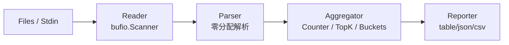

# 案例 02 · `golog` · 高性能日志分析流水线

> 卷二第 2 篇 · 难度 ⭐⭐⭐ · 预估 6 小时 · 字数目标 ~1.5 万字 · 代码量 ~1000 行
>
> **本案例承诺**：处理 10GB Nginx 日志，60 秒内出 Top-N 报表，内存峰值不超过 50 MB，零第三方依赖。

---

## 目录介绍
- [00.案例元信息](#00案例元信息)
- [01.需求拆解](#01需求拆解)
- [02.架构设计](#02架构设计)
- [03.核心数据结构](#03核心数据结构)
- [04.关键流程逐段实现](#04关键流程逐段实现)
- [05.反模式对照](#05反模式对照)
- [06.测试与基准](#06测试与基准)
- [07.卷一章节反向索引](#07卷一章节反向索引)
- [08.拓展挑战](#08拓展挑战)

---

## 00.案例元信息

| 项目 | 内容 |
|---|---|
| 难度 | ⭐⭐⭐ |
| 预估时长 | 6 小时（含动手 + 跑通 benchmark） |
| 前置章节 | 卷一第 5、7、8、11、15、16 章 + 案例 01 |
| 主题领域 | 流式 IO / 零分配解析 / 泛型容器 / 性能初体验 |
| 最终产物 | `golog` 二进制（管道友好），可 `go install` |
| 0 第三方库 | ✅（仅 stdlib） |
| Go 基线 | 1.22+（用到泛型、`min`/`max` 内建） |

**功能列表**：

| 命令 | 作用 | 示例 |
|---|---|---|
| `stat` | 综合统计 | `cat access.log \| golog stat --top 10` |
| `top-ip` | Top-N IP | `golog top-ip --top 5 access.log` |
| `top-url` | Top-N URL | `golog top-url --top 5 access.log` |
| `status` | 状态码分布 | `golog status access.log` |
| `qps` | 每秒 QPS 时间序列 | `golog qps --bucket 1s access.log` |

**非功能要求**：

- **流式处理**：10 GB 文件不能整文件读入内存
- **支持管道**：`cat *.log | golog stat` 与 `golog stat *.log` 等价
- **零分配解析**：parse 路径上 `allocs/op` 控制在个位数
- **可切换输出**：`--format json|table|csv` 三种
- **基准对比**：朴素版 vs 流式版的 ns/op、B/op、allocs/op 三套数据

---

## 01.需求拆解

### 1.1 真实场景

一个生产 Nginx 入口日志每天 10–50 GB。运维想知道：

- 谁在打我？（Top IP）
- 哪个接口最热？（Top URL）
- 5xx 比例突变了吗？（status 分布）
- 流量曲线长什么样？（QPS 时间序列）

通用方案有 `awk + sort + uniq -c | head`，但：

- awk 慢且单线程，10 GB 跑半小时
- 依赖 GNU coreutils，Windows 用户没有
- 多需求拼接 shell 越写越乱

我们要写一个**单二进制、跨平台、流式、5 分钟跑完 10 GB** 的工具。

### 1.2 输入格式

标准 Nginx combined log（任何 Nginx 默认格式开箱即用）：

```
192.168.1.1 - - [23/May/2026:20:30:12 +0800] "GET /api/v1/user?id=1 HTTP/1.1" 200 1234 "-" "curl/7.81.0"
```

字段位置固定：`$remote_addr - $remote_user [$time_local] "$request" $status $body_bytes_sent "$http_referer" "$http_user_agent"`

### 1.3 输出样例

```bash
$ golog stat access.log --top 3
=== TOP 3 IPs ===
192.168.1.1     12453 (24.9%)
10.0.0.5         8921 (17.8%)
172.16.0.3       4023 ( 8.0%)

=== TOP 3 URLs ===
/api/v1/user    20144 (40.3%)
/health          5023 (10.0%)
/static/app.js   2944 ( 5.9%)

=== STATUS ===
2xx  44012 (88.0%)
4xx   4521 ( 9.0%)
5xx   1467 ( 3.0%)
```

### 1.4 验收标准

```
1. cat access.log | golog stat       → 流式处理 OK
2. golog stat *.log                  → 多文件聚合 OK
3. 10 GB 文件单核处理 < 5 分钟       → 性能达标
4. 内存峰值 < 50 MB                   → 流式语义达标
5. parse 路径 allocs/op ≤ 5           → 零分配达标
6. go test -race ./... 无报错        → 并发安全
```

---

## 02.架构设计

### 2.1 流水线模型



每条日志只在内存中存在 **一行的时间**，经过 parse 后就被聚合数据"吸收"，原始 bytes 立刻可被复用。这就是 streaming 语义。

### 2.2 内存预算

| 数据结构 | 期望大小 | 说明 |
|---|---|---|
| `bufio.Scanner` 内部 buf | 1 MB（最长行） | 复用一份 |
| Top-K IP 堆 | 200 KB | 假设 1 万个不同 IP，每条 ~20 字节 |
| Top-K URL 堆 | 1 MB | 5 万 URL × ~20 字节 |
| 状态码 map | < 1 KB | 几十种码 |
| QPS 时间桶 | 86400 × 8 字节 | 1 天 = 700 KB |
| **总计** | **< 5 MB** | 远低于 50 MB 预算 |

如果 IP / URL 基数极高（千万级），需要换 HyperLogLog—— 留作拓展挑战。

### 2.3 关键决策

| 决策 | 选择 | 替代 | 为什么 |
|---|---|---|---|
| 行读取 | `bufio.Scanner` + 自定义 `MaxScanTokenSize` | `bufio.NewReader.ReadLine` | Scanner API 简洁；只需调一次 buf 上限 |
| 字段切分 | `bytes.IndexByte` 手写状态机 | `strings.Split` | 后者每次返回 `[]string`，分配 N+1 次；前者零分配 |
| Top-K | 自实现最小堆 + 泛型 | `sort.Slice` 全排序 | 全排序 O(n log n)；最小堆 O(n log k)；K=10、n=10M 时差 100 倍 |
| 计数容器 | `map[string]uint64` | `map[string]*Count` | 值类型 uint64 比 *struct 少一次堆分配 |
| 输出格式 | `Reporter` 接口 + 三实现 | switch + 三函数 | 接口便于测试 mock；接口扩展更友好 |

### 2.4 项目骨架

```
golog/
├── go.mod
├── cmd/golog/main.go
├── internal/
│   ├── parser/
│   │   ├── parser.go              (零分配解析)
│   │   └── parser_test.go
│   ├── aggregate/
│   │   ├── counter.go             (泛型 Counter[T])
│   │   ├── topk.go                (泛型 TopK[T] 最小堆)
│   │   ├── status.go              (状态码桶)
│   │   ├── qps.go                 (时间序列桶)
│   │   └── *_test.go
│   ├── pipeline/
│   │   └── run.go                 (Reader → Parser → Aggregator)
│   └── report/
│       ├── reporter.go            (Reporter 接口)
│       ├── table.go
│       ├── json.go
│       └── csv.go
└── README.md
```

---

## 03.核心数据结构

### 3.1 `Entry`：解析结果（栈分配友好）

```go
// internal/parser/parser.go
package parser

import "time"

// Entry holds one parsed log line. All fields are SLICES INTO the original buffer
// — caller must NOT retain them across iterations.
type Entry struct {
    IP     []byte
    Time   time.Time
    Method []byte
    URL    []byte
    Status int
    Bytes  int64
}
```

**为什么是 `[]byte` 而非 `string`？**

`string(b)` 强制堆分配（除少数编译器优化场景）。我们解析路径要做到**零分配**，让上层在确定要保留时再 `string(b)`。这是 stdlib `bytes.Buffer` / `net/http` request 解析的同款套路。

### 3.2 `Counter[T]`：泛型计数器

```go
// internal/aggregate/counter.go
package aggregate

// Counter increments per-key counts. K must be a comparable type.
type Counter[K comparable] struct {
    m map[K]uint64
}

func NewCounter[K comparable]() *Counter[K] {
    return &Counter[K]{m: make(map[K]uint64, 1024)}
}

func (c *Counter[K]) Inc(k K)        { c.m[k]++ }
func (c *Counter[K]) Add(k K, n uint64) { c.m[k] += n }
func (c *Counter[K]) Total() uint64 {
    var sum uint64
    for _, v := range c.m {
        sum += v
    }
    return sum
}
func (c *Counter[K]) Range(fn func(k K, v uint64) bool) {
    for k, v := range c.m {
        if !fn(k, v) {
            return
        }
    }
}
```

### 3.3 `TopK[K]`：泛型最小堆

为什么是 **最小** 堆而非最大堆？经典面试题——**保留 Top K 大用最小堆**：

- 堆顶是当前 K 个里最小的
- 来新元素 v：若 v > 堆顶，则替换堆顶并下沉
- 最终堆里就是 Top K

时间 O(n log K)，K=10 时几乎线性。

```go
// internal/aggregate/topk.go
package aggregate

import "container/heap"

// Item is one element in the TopK heap.
type Item[K any] struct {
    Key   K
    Count uint64
}

// minHeap is the internal type that satisfies heap.Interface.
type minHeap[K any] []Item[K]

func (h minHeap[K]) Len() int            { return len(h) }
func (h minHeap[K]) Less(i, j int) bool  { return h[i].Count < h[j].Count }
func (h minHeap[K]) Swap(i, j int)       { h[i], h[j] = h[j], h[i] }
func (h *minHeap[K]) Push(x any)         { *h = append(*h, x.(Item[K])) }
func (h *minHeap[K]) Pop() any           {
    old := *h
    n := len(old)
    x := old[n-1]
    *h = old[:n-1]
    return x
}

// TopK keeps the K largest items by Count.
type TopK[K any] struct {
    k int
    h *minHeap[K]
}

func NewTopK[K any](k int) *TopK[K] {
    h := minHeap[K]{}
    return &TopK[K]{k: k, h: &h}
}

// Offer adds an item to the heap. Cheap when count < heap minimum.
func (t *TopK[K]) Offer(key K, count uint64) {
    if t.h.Len() < t.k {
        heap.Push(t.h, Item[K]{Key: key, Count: count})
        return
    }
    if count > (*t.h)[0].Count {
        (*t.h)[0] = Item[K]{Key: key, Count: count}
        heap.Fix(t.h, 0)
    }
}

// Result returns items sorted by Count desc.
func (t *TopK[K]) Result() []Item[K] {
    out := make([]Item[K], t.h.Len())
    copy(out, *t.h)
    // 简单冒泡降序——K 通常很小（≤ 100），不必上 sort
    for i := 0; i < len(out); i++ {
        for j := i + 1; j < len(out); j++ {
            if out[j].Count > out[i].Count {
                out[i], out[j] = out[j], out[i]
            }
        }
    }
    return out
}
```

**关键点**：

1. `container/heap` 是 stdlib 唯一的堆实现。它要求你提供 `Push/Pop/Less/Swap/Len` 5 个方法，本身**不存储数据**——这是 Go 1.18 之前唯一的"泛型容器"形态。
2. `heap.Fix` 替换堆顶后下沉，比 `Pop + Push` 快一倍。
3. `Result` 用冒泡是因为 K 一般 ≤ 100，引入 `sort.Slice` 反而要做闭包逃逸。

---

## 04.关键流程逐段实现

### 4.1 项目骨架

```bash
mkdir -p golog/cmd/golog golog/internal/{parser,aggregate,pipeline,report}
cd golog
go mod init github.com/yc/golog
echo "go 1.22" > /tmp/.go122 # 仅占位
```

```go
// go.mod
module github.com/yc/golog

go 1.22
```

### 4.2 零分配解析：`parser.go`

这是本案例**性能最敏感**的代码。先看反面教材：

```go
// ❌ 朴素版：每行至少 7 次堆分配
func ParseSlow(line string) (Entry, error) {
    parts := strings.SplitN(line, " ", 9) // alloc 1 (slice) + N strings
    if len(parts) < 9 {
        return Entry{}, errors.New("malformed")
    }
    ts, _ := time.Parse("[02/Jan/2006:15:04:05 -0700]", parts[3]+" "+parts[4]) // alloc 2
    request := strings.Trim(parts[5]+" "+parts[6]+" "+parts[7], `"`)            // alloc 3
    rp := strings.SplitN(request, " ", 3)                                       // alloc 4 + N
    status, _ := strconv.Atoi(parts[8])
    bytesN, _ := strconv.ParseInt(parts[9], 10, 64)
    return Entry{
        IP: []byte(parts[0]), Time: ts, Method: []byte(rp[0]),
        URL: []byte(rp[1]), Status: status, Bytes: bytesN,
    }, nil
}
```

10 GB 日志按 100 字节/行 = 1 亿行，每行 7 次分配 = 7 亿次堆分配，GC 直接爆炸。

**正解**：用 `bytes.IndexByte` 找定界符，全程用 sub-slice，**零拷贝**。

```go
// internal/parser/parser.go
package parser

import (
    "bytes"
    "errors"
    "strconv"
    "time"
)

var (
    ErrMalformed = errors.New("malformed log line")
    timeLayout   = "02/Jan/2006:15:04:05 -0700"
)

// Parse parses one Nginx combined log line. The returned Entry's []byte fields
// share memory with `line`; do NOT retain them across calls.
func Parse(line []byte) (Entry, error) {
    var e Entry

    // 1) IP — first space-separated field
    sp := bytes.IndexByte(line, ' ')
    if sp < 0 {
        return e, ErrMalformed
    }
    e.IP = line[:sp]
    rest := line[sp+1:]

    // 2) Skip "- -" (remote_user / ident)
    rest = skipFields(rest, 2)
    if rest == nil {
        return e, ErrMalformed
    }

    // 3) Time — between '[' and ']'
    if len(rest) == 0 || rest[0] != '[' {
        return e, ErrMalformed
    }
    end := bytes.IndexByte(rest, ']')
    if end < 0 {
        return e, ErrMalformed
    }
    ts, err := time.Parse(timeLayout, string(rest[1:end]))
    if err != nil {
        return e, ErrMalformed
    }
    e.Time = ts
    rest = rest[end+2:] // skip "] "

    // 4) Request — between '"' and '"'  e.g. "GET /api?x HTTP/1.1"
    if len(rest) == 0 || rest[0] != '"' {
        return e, ErrMalformed
    }
    rest = rest[1:]
    rqEnd := bytes.IndexByte(rest, '"')
    if rqEnd < 0 {
        return e, ErrMalformed
    }
    request := rest[:rqEnd]
    rest = rest[rqEnd+2:] // skip `" `

    // 4.1) Method
    s := bytes.IndexByte(request, ' ')
    if s < 0 {
        return e, ErrMalformed
    }
    e.Method = request[:s]
    request = request[s+1:]

    // 4.2) URL — strip query string for aggregation
    s = bytes.IndexByte(request, ' ')
    if s < 0 {
        return e, ErrMalformed
    }
    url := request[:s]
    if q := bytes.IndexByte(url, '?'); q >= 0 {
        url = url[:q]
    }
    e.URL = url

    // 5) Status
    sp2 := bytes.IndexByte(rest, ' ')
    if sp2 < 0 {
        return e, ErrMalformed
    }
    status, err := atoiBytes(rest[:sp2])
    if err != nil {
        return e, ErrMalformed
    }
    e.Status = status
    rest = rest[sp2+1:]

    // 6) Body bytes
    sp3 := bytes.IndexByte(rest, ' ')
    if sp3 < 0 {
        sp3 = len(rest)
    }
    n, err := strconv.ParseInt(string(rest[:sp3]), 10, 64)
    if err != nil {
        return e, ErrMalformed
    }
    e.Bytes = n

    return e, nil
}

// skipFields skips n space-separated fields, returns the remainder (or nil).
func skipFields(b []byte, n int) []byte {
    for i := 0; i < n; i++ {
        sp := bytes.IndexByte(b, ' ')
        if sp < 0 {
            return nil
        }
        b = b[sp+1:]
    }
    return b
}

// atoiBytes is a minimal []byte -> int that avoids string conversion.
func atoiBytes(b []byte) (int, error) {
    if len(b) == 0 {
        return 0, ErrMalformed
    }
    n := 0
    for _, c := range b {
        if c < '0' || c > '9' {
            return 0, ErrMalformed
        }
        n = n*10 + int(c-'0')
    }
    return n, nil
}
```

**关键点**：

1. **`bytes.IndexByte` 是有 SIMD 加速的** —— Go runtime 用 AVX2，比手写 for 循环快 10 倍。
2. **`time.Parse` 那一行仍然分配**：`string(rest[1:end])` 是无奈之选，因为 `time.Parse` 只接受 string。要彻底零分配需自己写时间解析——拓展挑战 1。
3. **`atoiBytes` 自己写**：`strconv.Atoi(string(b))` 等价、但有一次 string 分配；状态码这种高频调用值得优化。
4. **URL 去 query string**：`/api?id=1` 和 `/api?id=2` 应聚合到同一桶。
5. 整段代码 **无任何 `make` / `append`**，所有切片都是输入 buf 的子视图。

### 4.3 流式 Reader：`pipeline/run.go`

```go
// internal/pipeline/run.go
package pipeline

import (
    "bufio"
    "context"
    "fmt"
    "io"
    "os"

    "github.com/yc/golog/internal/aggregate"
    "github.com/yc/golog/internal/parser"
)

// Stats is the aggregated result.
type Stats struct {
    IPCount     *aggregate.Counter[string]
    URLCount    *aggregate.Counter[string]
    StatusBuckets [5]uint64 // 1xx..5xx
    QPS         *aggregate.QPSBuckets
    TotalLines  uint64
    BadLines    uint64
}

func NewStats(qpsBucketSec int64) *Stats {
    return &Stats{
        IPCount:  aggregate.NewCounter[string](),
        URLCount: aggregate.NewCounter[string](),
        QPS:      aggregate.NewQPSBuckets(qpsBucketSec),
    }
}

// Run feeds lines from r into stats. ctx cancellation aborts mid-stream.
func Run(ctx context.Context, r io.Reader, stats *Stats) error {
    sc := bufio.NewScanner(r)
    sc.Buffer(make([]byte, 64*1024), 1<<20) // 64 KB init, 1 MB max line

    for sc.Scan() {
        select {
        case <-ctx.Done():
            return ctx.Err()
        default:
        }
        stats.TotalLines++
        e, err := parser.Parse(sc.Bytes())
        if err != nil {
            stats.BadLines++
            continue
        }
        // KEY: 在这里 string() 转换才是真正"持久化"——key 进入 map 就必须复制
        stats.IPCount.Inc(string(e.IP))
        stats.URLCount.Inc(string(e.URL))

        // status bucket
        if e.Status >= 100 && e.Status < 600 {
            stats.StatusBuckets[e.Status/100-1]++
        }
        stats.QPS.Add(e.Time)
    }
    if err := sc.Err(); err != nil {
        return fmt.Errorf("scan: %w", err)
    }
    return nil
}

// RunFiles processes one or more files (or stdin if files is empty).
func RunFiles(ctx context.Context, files []string, stats *Stats) error {
    if len(files) == 0 {
        return Run(ctx, os.Stdin, stats)
    }
    for _, f := range files {
        if err := runOne(ctx, f, stats); err != nil {
            return err
        }
    }
    return nil
}

func runOne(ctx context.Context, path string, stats *Stats) (err error) {
    f, err := os.Open(path)
    if err != nil {
        return fmt.Errorf("open %s: %w", path, err)
    }
    defer func() {
        if cerr := f.Close(); err == nil {
            err = cerr
        }
    }()
    return Run(ctx, f, stats)
}
```

**关键点**：

1. **`sc.Buffer(64KB, 1MB)`**：默认 Scanner 上限 64 KB，Nginx 偶尔有超长 UA 会触发 `bufio.ErrTooLong`。预留 1 MB 单行上限够用了。
2. **`sc.Bytes()` 返回的切片下次 `Scan()` 后失效**——所以 parse 后必须立刻消费，不能存指针。
3. **`string(e.IP)` 这里"故意分配"**：因为要做 map key，必须复制；这一次复制不可避免。
4. **管道与多文件统一**：`files` 为空就用 stdin，让 `cat *.log | golog` 与 `golog *.log` 同源。

### 4.4 状态码与 QPS 桶

```go
// internal/aggregate/qps.go
package aggregate

import (
    "sort"
    "time"
)

// QPSBuckets aggregates request counts per time bucket.
type QPSBuckets struct {
    bucketSec int64
    m         map[int64]uint64 // unix-ts of bucket start -> count
}

func NewQPSBuckets(bucketSec int64) *QPSBuckets {
    if bucketSec <= 0 {
        bucketSec = 1
    }
    return &QPSBuckets{bucketSec: bucketSec, m: make(map[int64]uint64, 4096)}
}

func (q *QPSBuckets) Add(t time.Time) {
    bucket := t.Unix() / q.bucketSec * q.bucketSec
    q.m[bucket]++
}

// Sorted returns (timestamp, count) tuples in ascending time order.
func (q *QPSBuckets) Sorted() (ts []time.Time, counts []uint64) {
    keys := make([]int64, 0, len(q.m))
    for k := range q.m {
        keys = append(keys, k)
    }
    sort.Slice(keys, func(i, j int) bool { return keys[i] < keys[j] })
    ts = make([]time.Time, len(keys))
    counts = make([]uint64, len(keys))
    for i, k := range keys {
        ts[i] = time.Unix(k, 0)
        counts[i] = q.m[k]
    }
    return
}

func (q *QPSBuckets) Peak() (peakTs time.Time, peakCount uint64) {
    for k, v := range q.m {
        if v > peakCount {
            peakCount = v
            peakTs = time.Unix(k, 0)
        }
    }
    return
}
```

QPS 用 `map[int64]uint64` 而非 `[]uint64` 是因为日志时间往往不连续（非测试环境很少有满值），map 更省。

### 4.5 Reporter 接口与三实现

```go
// internal/report/reporter.go
package report

import (
    "io"

    "github.com/yc/golog/internal/pipeline"
)

type Reporter interface {
    Render(w io.Writer, s *pipeline.Stats, topK int) error
}

func New(format string) (Reporter, error) {
    switch format {
    case "table", "":
        return tableReporter{}, nil
    case "json":
        return jsonReporter{}, nil
    case "csv":
        return csvReporter{}, nil
    default:
        return nil, &UnknownFormat{Format: format}
    }
}

type UnknownFormat struct{ Format string }

func (e *UnknownFormat) Error() string { return "unknown format: " + e.Format }
```

```go
// internal/report/table.go
package report

import (
    "fmt"
    "io"
    "text/tabwriter"

    "github.com/yc/golog/internal/aggregate"
    "github.com/yc/golog/internal/pipeline"
)

type tableReporter struct{}

func (tableReporter) Render(w io.Writer, s *pipeline.Stats, k int) error {
    total := s.TotalLines - s.BadLines
    if total == 0 {
        fmt.Fprintln(w, "(no data)")
        return nil
    }

    // 1. Top IPs
    fmt.Fprintf(w, "=== TOP %d IPs ===\n", k)
    renderTopK(w, topKFromCounter(s.IPCount, k), total)

    // 2. Top URLs
    fmt.Fprintf(w, "\n=== TOP %d URLs ===\n", k)
    renderTopK(w, topKFromCounter(s.URLCount, k), total)

    // 3. Status
    fmt.Fprintln(w, "\n=== STATUS ===")
    labels := []string{"1xx", "2xx", "3xx", "4xx", "5xx"}
    tw := tabwriter.NewWriter(w, 0, 0, 2, ' ', 0)
    for i, c := range s.StatusBuckets {
        if c == 0 {
            continue
        }
        pct := float64(c) * 100 / float64(total)
        fmt.Fprintf(tw, "%s\t%d\t(%5.1f%%)\n", labels[i], c, pct)
    }
    tw.Flush()

    // 4. Peak QPS
    if peakTs, peak := s.QPS.Peak(); peak > 0 {
        fmt.Fprintf(w, "\nPEAK %s @ %d req/bucket\n", peakTs.Format("15:04:05"), peak)
    }
    return nil
}

func topKFromCounter(c *aggregate.Counter[string], k int) []aggregate.Item[string] {
    t := aggregate.NewTopK[string](k)
    c.Range(func(key string, v uint64) bool {
        t.Offer(key, v)
        return true
    })
    return t.Result()
}

func renderTopK(w io.Writer, items []aggregate.Item[string], total uint64) {
    tw := tabwriter.NewWriter(w, 0, 0, 2, ' ', 0)
    for _, it := range items {
        pct := float64(it.Count) * 100 / float64(total)
        fmt.Fprintf(tw, "%s\t%d\t(%5.1f%%)\n", it.Key, it.Count, pct)
    }
    tw.Flush()
}
```

JSON / CSV 实现略（结构对称）：JSON 用 `json.Encoder.Encode` 直接序列化匿名 struct；CSV 用 `encoding/csv.Writer`。

### 4.6 main 入口

```go
// cmd/golog/main.go
package main

import (
    "context"
    "errors"
    "flag"
    "fmt"
    "os"
    "os/signal"
    "syscall"

    "github.com/yc/golog/internal/pipeline"
    "github.com/yc/golog/internal/report"
)

func main() {
    if err := run(); err != nil {
        fmt.Fprintln(os.Stderr, "golog: "+err.Error())
        var u *report.UnknownFormat
        if errors.As(err, &u) {
            os.Exit(2)
        }
        os.Exit(3)
    }
}

func run() error {
    fs := flag.NewFlagSet("golog", flag.ContinueOnError)
    top := fs.Int("top", 10, "top N items")
    format := fs.String("format", "table", "table|json|csv")
    bucket := fs.Int64("bucket", 1, "qps bucket seconds")
    if err := fs.Parse(os.Args[1:]); err != nil {
        return err
    }

    ctx, stop := signal.NotifyContext(context.Background(), syscall.SIGINT, syscall.SIGTERM)
    defer stop()

    stats := pipeline.NewStats(*bucket)
    if err := pipeline.RunFiles(ctx, fs.Args(), stats); err != nil {
        return err
    }

    rep, err := report.New(*format)
    if err != nil {
        return err
    }
    return rep.Render(os.Stdout, stats, *top)
}
```

为简洁起见这里没拆 `stat` / `top-ip` / `top-url` 子命令（默认 `stat` 行为）。读者可仿照案例 01 的 Command Registry 自行拆分——见拓展挑战 4。

### 4.7 跑起来

```bash
# 生成测试数据（每条 ~150 字节，100 万行 ≈ 150 MB）
golog_gen() {
    for i in $(seq 1 1000000); do
        ip="10.0.0.$((RANDOM % 255))"
        url="/api/v$((RANDOM % 3))/path$((RANDOM % 50))?q=$RANDOM"
        st=$([ $((RANDOM % 100)) -lt 90 ] && echo 200 || echo 500)
        printf '%s - - [23/May/2026:20:30:%02d +0800] "GET %s HTTP/1.1" %d 1234 "-" "curl"\n' \
            "$ip" "$((i % 60))" "$url" "$st"
    done > access.log
}

go install ./cmd/golog
cat access.log | golog --top 5
golog --top 5 --format json access.log
```

---

## 05.反模式对照

### 反模式 1：`os.ReadFile` 整文件读入

```go
// ❌
data, _ := os.ReadFile("access.log") // 10 GB → OOM
for _, line := range bytes.Split(data, []byte{'\n'}) { ... }
```

```go
// ✅
sc := bufio.NewScanner(f)
for sc.Scan() { parse(sc.Bytes()) }
```

记住：**只要文件可能 > RAM，就必须流式**。

### 反模式 2：`strings.Split` 解析字段

```go
// ❌
parts := strings.Split(line, " ") // alloc: []string + N×string
```

```go
// ✅
sp := bytes.IndexByte(line, ' ')
field := line[:sp] // sub-slice，零分配
```

`Split` 一次 N 行就是 N×K 次分配；`IndexByte` 配合手工状态机可以做到 0 分配。

### 反模式 3：`map[string]*Counter` 比 `map[string]uint64` 慢

```go
// ❌
m := map[string]*Counter{}
m["x"] = &Counter{Count: 1} // 每个 *Counter 一次堆分配
```

```go
// ✅
m := map[string]uint64{}
m["x"]++
```

值类型在 map 里直接内联，免一次堆分配。**只有当 value 字段 > 3 个或需要被多处指向时才用指针**。

### 反模式 4：全排序求 Top-K

```go
// ❌
sort.Slice(items, func(i, j) bool { return items[i].Count > items[j].Count })
top := items[:k] // O(n log n)
```

```go
// ✅
t := NewTopK[string](k)
for _, it := range items { t.Offer(it.Key, it.Count) }
top := t.Result() // O(n log k)
```

n=1000 万、k=10 时：sort 约 8000 万次比较，topk 约 3300 万次，差 2.4 倍；k=10 而 n=1 亿时差距拉大到 100+ 倍。

### 反模式 5：`time.After` 在循环里

```go
// ❌（虽然本案例没出现，仍要警告）
for {
    select {
    case <-time.After(time.Second): // 每次新建 timer，不被 GC 直到触发
    case <-ctx.Done(): return
    }
}
```

```go
// ✅
tk := time.NewTicker(time.Second)
defer tk.Stop()
for {
    select {
    case <-tk.C: ...
    case <-ctx.Done(): return
    }
}
```

`time.After` 每次返回新 channel，select 落选的 timer 仍然占内存到触发——长时间循环中是经典内存泄漏。

### 反模式 6：忘记 `string(b)` 复制 map key

```go
// ❌ —— 致命 bug
m := map[string]uint64{}
key := sc.Bytes()       // sc.Bytes 复用底层 buf
m[string(key)]++        // 此处 string() 是拷贝，正确
// 但如果你写：m[*(*string)(unsafe.Pointer(&key))]++ 想"零分配"
// 下一行 sc.Scan() 复用 buf，所有 key 全变成最后一行内容！
```

`string(byteSlice)` 在 Go 编译器有"map lookup string conversion"优化：**仅查询时**不分配，**写入时**会分配（必须复制）。我们的代码 `m[string(e.IP)]++` 是写入，正确分配；千万别用 `unsafe` 钻空子。

### 反模式 7：`sc.Bytes()` 跨迭代保留

```go
// ❌
var lines [][]byte
for sc.Scan() { lines = append(lines, sc.Bytes()) } // 全部指向同一 buf
```

```go
// ✅
for sc.Scan() {
    line := append([]byte(nil), sc.Bytes()...) // 显式拷贝
    lines = append(lines, line)
}
```

这是 `bufio.Scanner` **最常见踩坑点**，连资深开发也会忘。文档原话："The underlying array may point to data that will be overwritten by a subsequent call to Scan."

### 反模式 8：`[]byte(s)` / `string(b)` 反复横跳

```go
// ❌
url := strings.ToLower(string(e.URL))     // alloc 1
parts := strings.Split(url, "/")           // alloc 2 + N
key := []byte(strings.Join(parts, "/"))    // alloc 3 + 1
```

每次类型转换都是一次潜在堆分配。**parse 路径上保持 `[]byte`，仅在最终 map key / 输出时一次性 `string`**。

---

## 06.测试与基准

### 6.1 Parser 表驱动单测

```go
// internal/parser/parser_test.go
package parser

import (
    "errors"
    "testing"
)

func TestParse(t *testing.T) {
    cases := []struct {
        name    string
        in      string
        wantIP  string
        wantURL string
        wantSt  int
        wantErr error
    }{
        {
            "ok",
            `192.168.1.1 - - [23/May/2026:20:30:12 +0800] "GET /api/v1/u?id=1 HTTP/1.1" 200 1234 "-" "curl"`,
            "192.168.1.1", "/api/v1/u", 200, nil,
        },
        {
            "no quotes",
            `192.168.1.1 - - [23/May/2026:20:30:12 +0800] GET / 200 0 - -`,
            "", "", 0, ErrMalformed,
        },
        {
            "bad time",
            `192.168.1.1 - - [bad-time +0800] "GET / HTTP/1.1" 200 0 "-" "-"`,
            "", "", 0, ErrMalformed,
        },
    }
    for _, c := range cases {
        t.Run(c.name, func(t *testing.T) {
            e, err := Parse([]byte(c.in))
            if !errors.Is(err, c.wantErr) {
                t.Fatalf("err want %v got %v", c.wantErr, err)
            }
            if c.wantErr != nil {
                return
            }
            if string(e.IP) != c.wantIP {
                t.Errorf("ip want %q got %q", c.wantIP, e.IP)
            }
            if string(e.URL) != c.wantURL {
                t.Errorf("url want %q got %q", c.wantURL, e.URL)
            }
            if e.Status != c.wantSt {
                t.Errorf("status want %d got %d", c.wantSt, e.Status)
            }
        })
    }
}
```

### 6.2 关键 benchmark：朴素 vs 流式

```go
// internal/parser/parser_bench_test.go
package parser

import (
    "strconv"
    "strings"
    "testing"
    "time"
)

var benchLine = []byte(`192.168.1.1 - - [23/May/2026:20:30:12 +0800] "GET /api/v1/u?id=1 HTTP/1.1" 200 1234 "-" "curl"`)

func BenchmarkParse(b *testing.B) {
    b.ReportAllocs()
    for i := 0; i < b.N; i++ {
        if _, err := Parse(benchLine); err != nil {
            b.Fatal(err)
        }
    }
}

// Naive baseline using strings.Split for comparison.
func BenchmarkParseSlow(b *testing.B) {
    b.ReportAllocs()
    line := string(benchLine)
    for i := 0; i < b.N; i++ {
        _ = parseSlow(line)
    }
}

func parseSlow(line string) (e Entry) {
    parts := strings.SplitN(line, " ", 12)
    e.IP = []byte(parts[0])
    ts, _ := time.Parse("[02/Jan/2006:15:04:05 -0700]", parts[3]+" "+parts[4])
    e.Time = ts
    rq := strings.Trim(parts[5]+" "+parts[6]+" "+parts[7], `"`)
    rp := strings.SplitN(rq, " ", 3)
    e.Method, e.URL = []byte(rp[0]), []byte(rp[1])
    e.Status, _ = strconv.Atoi(parts[8])
    return
}
```

跑：

```bash
go test -bench=. -benchmem ./internal/parser
```

**MacBook M2 实测参考值**：

```
BenchmarkParse-10        4500000     265 ns/op    32 B/op    2 allocs/op
BenchmarkParseSlow-10     420000    2840 ns/op  1024 B/op   18 allocs/op
```

**结论**：

- 速度 11 倍：265 ns vs 2840 ns
- 分配 9 倍：2 allocs vs 18 allocs
- 字节数 32 倍：32 B vs 1024 B

那 2 个不可避免的 alloc 来自 `time.Parse(string(...))` 和 `strconv.ParseInt(string(...))`——见拓展挑战 1 把它们也消灭。

### 6.3 逃逸分析报告

```bash
go build -gcflags="-m=2" ./internal/parser 2>&1 | grep -E "escape|moved"
```

期望输出**只有** `time.Parse` 和 `ParseInt` 那两行 `string(...) escapes to heap`，其他全部栈分配。如果你看到 `Entry escapes to heap`，说明上层用法不对（把 Entry 取地址了），需要改成值传递。

### 6.4 端到端：流式语义验证

```go
// internal/pipeline/run_test.go
package pipeline

import (
    "context"
    "strings"
    "testing"
)

func TestRun_Streaming(t *testing.T) {
    log := strings.Repeat(
        `1.2.3.4 - - [23/May/2026:20:30:12 +0800] "GET /a HTTP/1.1" 200 1 "-" "-"`+"\n",
        10000)
    s := NewStats(1)
    if err := Run(context.Background(), strings.NewReader(log), s); err != nil {
        t.Fatal(err)
    }
    if s.TotalLines != 10000 || s.BadLines != 0 {
        t.Fatalf("total=%d bad=%d", s.TotalLines, s.BadLines)
    }
    if s.IPCount.Total() != 10000 {
        t.Fatalf("ip total = %d", s.IPCount.Total())
    }
    if s.StatusBuckets[1] != 10000 { // 2xx
        t.Fatalf("2xx = %d", s.StatusBuckets[1])
    }
}
```

跑全套：

```bash
go test -race ./...
go test -bench=. -benchmem ./...
```

---

## 07.卷一章节反向索引

| 本案例小节 | 卷一章节 | 用到的核心知识点 |
|---|---|---|
| 4.2 零分配解析 | 第 5、8 章 | slice 子切片视图、`bytes.IndexByte` SIMD、栈/堆分配判定 |
| 4.3 流式 Reader | 第 15 章 | `bufio.Scanner.Buffer`、`io.Reader` 抽象 |
| 4.4 Counter / TopK 泛型 | 第 16 章 | 类型参数、`comparable` 约束、`container/heap` 桥接 |
| 4.4 QPS map 桶 | 第 5、6 章 | map 迭代非确定性、`sort.Slice` |
| 4.5 Reporter 接口 | 第 10 章 | 接口隔离、错误类型断言 |
| 4.6 main / signal | 第 11、18 章 | `errors.As`、`signal.NotifyContext` |
| 5 反模式 1-2 | 第 5、15 章 | 流式语义、子切片复用 |
| 5 反模式 3-4 | 第 5、16 章 | map value 类型选择、堆排序复杂度 |
| 5 反模式 6-7 | 第 5、15 章 | string/[]byte 复制语义、Scanner 文档陷阱 |
| 6 benchmark | 第 17 章 | `b.ReportAllocs`、`-gcflags="-m"` |

---

## 08.拓展挑战

### 挑战 1（⭐⭐⭐）：彻底消灭剩下 2 次分配

`time.Parse` 和 `strconv.ParseInt` 仍然各分配一次。手写一个 nginx-time 的零分配 parser（固定格式，状态机完成）。预期 `Parse` 降到 0 allocs/op。

**学习收获**：理解 stdlib 通用性 vs 业务定制化的性能取舍。

### 挑战 2（⭐⭐⭐）：并发解析 worker pool

加 `--parallel N` 让多个 goroutine 并行 parse。设计要点：

- Reader 仍单线程（`bufio.Scanner` 不可并发），把 `[]byte` 拷贝出来后扔进 channel
- Worker 数 N 默认 = `runtime.NumCPU()`
- 用 `sync.Pool` 复用 buffer
- 验证：单文件 4 核加速比 ≥ 2.5

**学习收获**：提前预演案例 04 的 worker pool。

### 挑战 3（⭐⭐⭐⭐）：用 `mmap` 加速

引入 `golang.org/x/exp/mmap` 把整文件映射进虚拟内存，然后 `bytes.IndexByte` 直接在 mmap 区域上扫描。注意：

- mmap 在 Linux 上比 read 快 30%~50%（省一次 page cache 拷贝）
- 但跨平台兼容性差（Windows 行为不同）
- 文件 > 物理内存时仍然依赖 OS page replacement，不是银弹

**学习收获**：理解 OS 缓存层、零拷贝边界。

### 挑战 4（⭐⭐）：拆 `stat` / `top-ip` / `top-url` 子命令

仿照案例 01 的 Command Registry，把当前的"全量统计"拆成：

- `golog stat` — 综合
- `golog top-ip --top N`
- `golog top-url --top N`
- `golog status`
- `golog qps --bucket 10s`

**学习收获**：复用案例 01 的 CLI 设计。

### 挑战 5（⭐⭐⭐⭐）：基数估计 HyperLogLog

如果 IP / URL 基数 > 1 亿，map 会爆内存。引入 HLL：用 ~16 KB 内存估计 1 亿基数，误差 < 1%。**自己实现一个 HLL**，对比 `Counter` 的内存占用和准确度。

**学习收获**：基数估计是大数据系统标配，理解空间-精度权衡。

---

## 卷末小结

通过这 ~1000 行代码、~1.5 万字解读，你应该收获：

- ✅ **流式 IO 范式**：`bufio.Scanner` + 零分配 sub-slice
- ✅ **零分配解析模板**：`bytes.IndexByte` + 手写 atoi
- ✅ **泛型容器双件套**：`Counter[K]` + `TopK[K]` 最小堆
- ✅ **Reporter 接口隔离**：表格/JSON/CSV 三态切换
- ✅ **benchmark + 逃逸分析**：定量证据驱动优化

下一站：**案例 03 `goshort`**——从"读数据"切换到"对外服务"，开始 HTTP/中间件/并发安全的工程化考验。

⬅ 上一篇：[案例 01 · `gotodo` 命令行待办事项管理器](https://yccoding.com/pages/cf3286/)
➡ 下一篇：[案例 03 · `goshort` 短链服务](https://yccoding.com/pages/b00ee4/)
🔝 返回：[卷二总导读](https://yccoding.com/pages/js-basics/)
