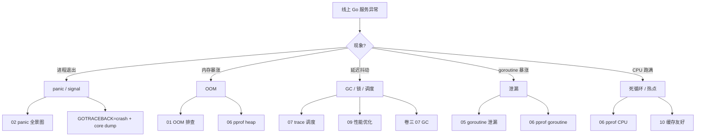

# 🛠 Go 工程实战与故障排错专栏

> 把"会写 Go"升级为"会上线 Go"——17 篇实战，每一篇都源自真实线上场景

## 📖 专栏概览

| 模块 | 文章数量 | 难度 | 重点内容 |
|------|---------|------|---------|
| 故障排错 | 5 篇 | ★★★★ | OOM、panic、调试、Delve、goroutine 泄漏 |
| 性能调优 | 5 篇 | ★★★★ | pprof、trace、性能优化、缓存友好、PGO |
| 工程能力 | 5 篇 | ★★★ | 安全、编译链接、静态分析、Code Review、日志监控 |
| 上线运维 | 2 篇 | ★★★★★ | 灰度发布、故障复盘 |


## 🎯 学习路径

### 入门技巧 → 实战调优 → 上线运维

```
入门技巧（先会读栈、能调试）：02 panic → 03 调试 → 04 Delve → 13 静态分析
实战调优（线上服务必修）：    05 goroutine 泄漏 → 06 pprof → 07 trace → 09 性能优化
工程能力（团队协作必修）：    08 安全 → 12 编译链接 → 14 Code Review → 15 日志监控
上线运维（架构师视角）：     16 灰度发布 → 17 故障复盘
PGO 进阶：                  10 缓存友好 → 11 PGO → 01 OOM
```


## 📚 文章目录

### 模块一：故障排错

- [01.OOM 排查实录](./01.OOM排查实录.md) ⭐⭐⭐⭐
  - 一次容器 OOM 的 5 小时排查全流程：`runtime.MemStats` → pprof heap → `go tool pprof -alloc_space` → 定位泄漏点
- [02.panic 与 recover 全景图](./02.panic与recover全景图.md) ⭐⭐⭐⭐
  - panic 的 5 种来源、栈展开过程、`recover` 必须配 defer 的原因、跨 goroutine 不能 recover、第三方库 `runtime.SetPanicOnFault`
- [03.调试技巧与原理分析](./03.调试技巧与原理分析.md) ⭐⭐⭐
  - 打印调试 / 日志调试 / 断点调试三种范式、`runtime.Caller` 取调用栈、用 `GODEBUG` 看调度/GC、用 `GOTRACEBACK` 控制崩溃输出
- [04.Delve 调试器实战](./04.Delve调试器实战.md) ⭐⭐⭐⭐
  - dlv 安装与启动、`break` / `next` / `step` / `print` / `goroutines` / `threads`、远程调试 (`dlv connect`)、调试 Go test、调试线上 core
- [05.goroutine 泄漏排查实战](./05.goroutine泄漏排查实战.md) ⭐⭐⭐⭐
  - 5 种泄漏模式：channel 永久阻塞 / context 未取消 / select 缺 default / time.After 累积 / sync.Pool 持有大对象；用 `pprof goroutine?debug=2` 抓现场

### 模块二：性能调优

- [06.pprof 性能剖析实战](./06.pprof性能剖析实战.md) ⭐⭐⭐⭐
  - CPU profile / heap / allocs / block / mutex 5 种 profile、火焰图解读、`go test -bench -cpuprofile`、`net/http/pprof` 在线采集、采样原理（每秒 100 次）
- [07.trace 调度可视化实战](./07.trace调度可视化实战.md) ⭐⭐⭐⭐
  - `runtime/trace` 采集、`go tool trace` 解读 9 个视图、定位 GC stop-the-world、定位 schedule latency、定位 syscall 阻塞
- [09.性能优化实战](./09.性能优化实战.md) ⭐⭐⭐⭐
  - 真实接口 P99 从 800ms 优化到 50ms 全过程：减少分配 → 减少 GC → 减少锁 → 减少 syscall
- [10.缓存友好编程](./10.缓存友好编程.md) ⭐⭐⭐⭐
  - CPU cache line、false sharing、热点 struct 字段重排、`runtime.Gosched` 让出、批量处理替代循环
- [11.PGO 与编译优化](./11.PGO与编译优化.md) ⭐⭐⭐⭐
  - Go 1.21 PGO 实战、采集 profile、`-pgo=auto`、内联与逃逸的 PGO 影响、性能提升 2-7% 的真实数据

### 模块三：工程能力

- [08.安全漏洞图鉴](./08.安全漏洞图鉴.md) ⭐⭐⭐⭐
  - SSRF / 反序列化 RCE / 整数溢出 / SQL 注入 / 越权 / `unsafe` 误用、`govulncheck` 实战
- [12.编译链接原理](./12.编译链接原理.md) ⭐⭐⭐⭐
  - `go build -x` 看完整流程、`-ldflags "-s -w"` 二进制瘦身、`-trimpath` 清路径、`go:linkname` 跨包黑魔法、debug 符号丢失排查
- [13.静态分析工具](./13.静态分析工具.md) ⭐⭐⭐
  - `go vet` / `staticcheck` / `golangci-lint` 配置、自定义 linter（基于 `go/analysis`）、CI 集成
- [14.代码规范评审](./14.代码规范评审.md) ⭐⭐⭐
  - Code Review checklist：错误处理 / context 传递 / goroutine 边界 / 接口最小化 / 并发安全 / 日志规范、Uber Go Style Guide 精华
- [15.日志监控告警](./15.日志监控告警.md) ⭐⭐⭐⭐
  - `log/slog`（Go 1.21+）、OpenTelemetry trace、Prometheus metrics、ELK 日志、告警 SLO/SLI 设计

### 模块四：上线运维

- [16.灰度发布稳定](./16.灰度发布稳定.md) ⭐⭐⭐⭐
  - 全链路灰度、流量染色、Kubernetes 滚动更新与 Pod 优雅退出、`SIGTERM` 处理、连接 drain
- [17.线上故障复盘](./17.线上故障复盘.md) ⭐⭐⭐⭐⭐
  - 5 个真实事故全流程脱敏复盘：单条慢 SQL 拖垮服务 / 一次 GC 抖动雪崩 / DNS 故障与超时风暴 / 第三方库内存泄漏 / 跨机房网络分区


## 🎓 排错知识图谱




## 📈 学习建议

1. **先读模块一（排错）**：故障排错是工程师"差距最明显"的能力，先把这 5 篇读完，团队会立刻看到你的成长
2. **再读模块二（调优）**：pprof + trace 是 Go 工程师的"瑞士军刀"，掌握后能解决 90% 的性能问题
3. **模块三随用随查**：工程能力是"日积月累"，把这 5 篇当 checklist 用，每次写代码前对一遍
4. **模块四进阶必读**：当你成长为团队 Lead，灰度 + 故障复盘是必备能力


## 🔗 与其他卷的衔接

| 本卷章节 | 关联的卷一/卷三章节 |
|---------|-------------------|
| 01 OOM 排查 | 卷三 01 内存模型、卷三 07 GC |
| 02 panic 全景图 | 卷一 11 错误处理、卷三 14 错误 panic 机制 |
| 04 Delve 调试器 | 卷三 06 GMP、卷三 16 编译链接 |
| 05 goroutine 泄漏 | 卷一 12 goroutine、卷三 06 GMP、卷三 08 channel |
| 06 pprof | 卷三 06 GMP、卷三 07 GC、卷三 09 sync |
| 07 trace | 卷三 06 GMP、卷三 15 netpoller |
| 09 性能优化 | 卷三 02 逃逸、卷三 04 切片 |
| 10 缓存友好 | 卷三 03 结构体对齐 |
| 11 PGO | 卷三 16 编译链接 |
| 12 编译链接 | 卷三 16 编译链接 |
| 15 日志监控 | 卷一 11、12 章 |
| 17 故障复盘 | 串联本卷所有章节 |


## 🛡 推荐工具链

| 类别 | 工具 | 在哪一篇出现 |
|------|------|------------|
| 调试 | Delve | 04 |
| 性能剖析 | pprof（cpu/heap/block/mutex/goroutine） | 06 |
| 调度可视化 | `go tool trace` | 07 |
| 静态分析 | `go vet` / staticcheck / golangci-lint | 13 |
| 安全扫描 | govulncheck / gosec | 08 |
| 日志 | `log/slog` / zap | 15 |
| 监控 | Prometheus / Grafana | 15 |
| 链路追踪 | OpenTelemetry | 15 |
| 容器编排 | Kubernetes | 16 |
| 二进制工具 | `go tool objdump` / `go tool nm` / `addr2line` | 12 |


## 🔮 未来扩展

- eBPF 在 Go 服务可观测性中的应用
- WASM 部署的故障排查
- 大规模微服务的 cgo 内存问题
- ARM64 / RISC-V 平台特异性故障

---

> 本专栏持续更新中，欢迎结合自己的线上事故来贡献新章节！

---

## 📚 推荐参考资料

### 排错与调优

- [Profiling Go Programs](https://go.dev/blog/pprof) — 官方 pprof 教程
- [Russ Cox: Go Execution Tracer](https://docs.google.com/document/d/1FP5apqzBgr7ahCCgFO-yoVhk4YZrNIDNf9RybngBc14) — trace 设计文档
- [Dave Cheney: High Performance Go Workshop](https://dave.cheney.net/high-performance-go-workshop/dotgo-paris.html)
- [Uber Go Style Guide](https://github.com/uber-go/guide/blob/master/style.md)
- [Google Go Style Guide](https://google.github.io/styleguide/go/)

### 工程实践

- [Effective Go](https://go.dev/doc/effective_go)
- [Go Code Review Comments](https://github.com/golang/go/wiki/CodeReviewComments)
- [Common Go Mistakes](https://100go.co/) — Teiva Harsanyi 的 100 Mistakes 网页版
- [SRE Book](https://sre.google/sre-book/table-of-contents/) — Google SRE 实践经典
