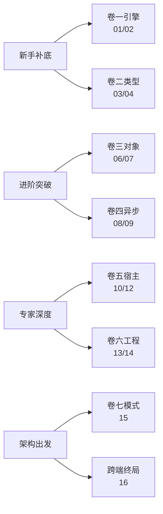
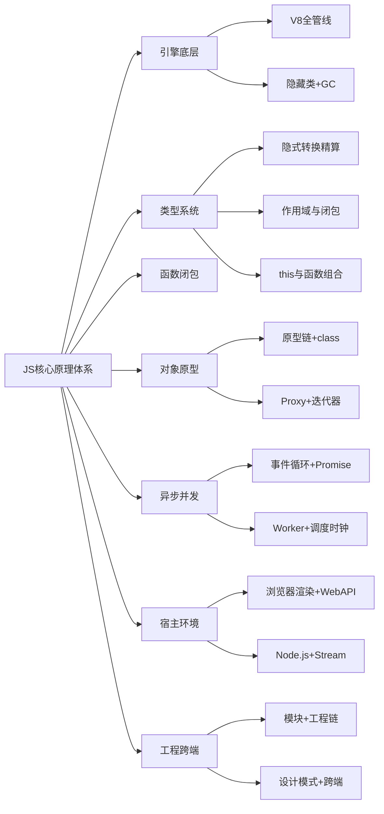

# 🚀 JavaScript 核心原理深度专栏

> JavaScript 核心原理深度专栏，自下而上贯穿 **引擎与字节码 → 隐藏类与 GC → 类型隐式转换 → 作用域与闭包 → this 与函数组合 → 原型与类语法糖 → Proxy 元编程 → 事件循环与 Promise → Worker 与并发 → 浏览器渲染 → Web API 网络存储 → Node 运行时 → 模块双轨 → 工程链 → 设计模式与 FP → 跨端架构** 十六大知识域，共计 **16 篇**，融合覆盖 JS 核心原理全部纵深，单篇承载密度对标 48 篇体系。

> 📐 **16 篇 = 48 篇的融合版**。每篇融合 3 篇当量的知识密度，按 10 章法写作，保持「案例引入 → 架构概览 → 7 章核心拆解 → 综合案例串讲」的可读主线。
>
> 📁 旧版 12 篇已归档至 [archive/](archive/)，作为新专栏写作参考。

## 📐 设计理念

JavaScript 与 C++ 最大的不同在于：**它运行在引擎虚拟机上**——直接面对 JIT 编译器、垃圾回收器、事件循环、宿主环境的 API 层。所以本专栏的纵深顺着这条路径展开：

> **源码字符串 → AST → 字节码 → JIT → 对象内存模型 → 类型系统 → 执行上下文/闭包 → 异步调度 → 宿主（浏览器 + Node）→ 模块 → 工程 → 跨端**

每一层都有 JS 独有的"看起来简单、挖下去全是骨头"的设计。

---

## 📕 卷一 · 引擎底层与内存模型（2 篇）

把「一行 JS 代码到底变成了什么」彻底拆开。

| # | 标题 | 核心知识 | 状态 |
|---|------|---------|:---:|
| 01 | [**引擎解析编译执行**](https://yccoding.com/pages/js-core-01/) | V8 全管线：Scanner→Parser→Ignition 字节码→TurboFan/Maglev/Sparkplug 三层 JIT→去优化机制→SpiderMonkey/JSC 对比 | ⏳ |
| 02 | [**隐藏类与回收机制**](https://yccoding.com/pages/js-core-02/) | 隐藏类变迁链、快属性/慢属性/字典模式、Elements Kinds 六态退化、新生代 Scavenge、老生代 Mark-Compact 三色标记、Orinoco 并行回收 | ⏳ |

## 📗 卷二 · 类型系统与函数闭包（3 篇）

把「JS 为什么 0.1+0.2≠0.3」和「闭包到底怎么存」这类灵魂问题讲透。

| # | 标题 | 核心知识 | 状态 |
|---|------|---------|:---:|
| 03 | [**类型隐式转换精算**](https://yccoding.com/pages/js-core-03/) | 8 种类型 + typeof 遗产、ToPrimitive/ToNumber/ToString/ToBoolean 四算法、== 15 条规则逐推、IEEE 754 浮点精度、BigInt 内部表示、Intl API 快览 | ⏳ |
| 04 | [**作用域链闭包原理**](https://yccoding.com/pages/js-core-04/) | 三种执行上下文、词法环境 vs 变量环境、TDZ 的 `TheHole` sentinel、作用域链 `[[OuterEnv]]` 指针、闭包的 Context 链物理实现、六大陷阱 + 六大模式 | ⏳ |
| 05 | [**函数绑定规则组合**](https://yccoding.com/pages/js-core-05/) | 默认/隐式/显式/new 四规则 + 优先级链、手写 call/apply/bind、箭头函数词法 this、compose/pipe 右→左哲学、柯里化/偏函数、TCO 与 trampoline | ⏳ |

## 📘 卷三 · 对象系统与元编程（2 篇）

把「原型链到底怎么查属性」和「Proxy 能拦截哪些操作」的全部细节拆开。

| # | 标题 | 核心知识 | 状态 |
|---|------|---------|:---:|
| 06 | [**原型链语法糖本质**](https://yccoding.com/pages/js-core-06/) | `__proto__`/`prototype`/`[[Prototype]]` 三角模型、属性查找算法、手写 new、五种继承演进、class 的 V8 脱糖、super 的 `[[HomeObject]]`、属性描述符三级封锁 | ⏳ |
| 07 | [**代理与元编程协议**](https://yccoding.com/pages/js-core-07/) | 13 种 trap ↔ Reflect 对偶、可撤销 Proxy + this 穿透修复、迭代器/可迭代协议、Generator 状态机`SuspendGenerator`字节码、异步迭代 `for await…of` | ⏳ |

## 📙 卷四 · 异步与并发模型（2 篇）

把「事件循环为什么先 micro 后 macro」和「Worker 怎么做到不卡主线程」完全打通。

| # | 标题 | 核心知识 | 状态 |
|---|------|---------|:---:|
| 08 | [**事件循环承诺机制**](https://yccoding.com/pages/js-core-08/) | 宏任务/微任务队列完整模型、手写 Promise/A+ 规范（then/catch/finally/all/race 等）、async/await = Generator + Promise、await 微任务插入时机 | ⏳ |
| 09 | [**工作线程并发调度**](https://yccoding.com/pages/js-core-09/) | DedicatedWorker/SharedWorker/ServiceWorker 三件套、Transferable 零拷贝、SharedArrayBuffer + Atomics、setTimeout 4ms 夹持、rAF Vsync 对齐、RxJS 冷/热 | ⏳ |

## 📒 卷五 · 宿主环境深度（3 篇）

把「浏览器怎么把 HTML/CSS 变成屏幕像素」和「Node.js 的 libuv 和浏览器事件循环差在哪」讲清楚。

| # | 标题 | 核心知识 | 状态 |
|---|------|---------|:---:|
| 10 | [**页面渲染像素原理**](https://yccoding.com/pages/js-core-10/) | 关键渲染路径五阶段、Layout Thrashing 检测与修复、Paint/Composite 分图层决策、仅触发 Composite 的属性、事件三阶段 + 委托 | ⏳ |
| 11 | [**网络接口存储架构**](https://yccoding.com/pages/js-core-11/) | fetch 流式读取 + AbortController、WebSocket 帧协议 + 心跳、SSE 单工推送、Cookie/localStorage/sessionStorage/IndexedDB/Cache API 五维对比 | ⏳ |
| 12 | [**服务端运行时编程**](https://yccoding.com/pages/js-core-12/) | libuv 六阶段事件循环、nextTick vs microtask、Stream 四类型 + 背压、Buffer vs Uint8Array、Cluster 多进程、同构代码设计 | ⏳ |

## 📔 卷六 · 模块化与工程化（2 篇）

把「ESM 和 CJS 为什么不能无缝混用」和「Vite 为什么不 bundle」写成代码。

| # | 标题 | 核心知识 | 状态 |
|---|------|---------|:---:|
| 13 | [**模块系统双轨操作**](https://yccoding.com/pages/js-core-13/) | 模块化五世演进、手写 require 30 行、ESM 三阶段加载（Parse→Instantiate→Evaluate）、Live Binding、循环依赖双策略、CJS/ESM 互操作十大陷阱 | ⏳ |
| 14 | [**现代工程链三件套**](https://yccoding.com/pages/js-core-14/) | Vite No-bundle 哲学 + 预构建 + HMR、esbuild Go 编译 100× 优势、Tree Shaking 静态分析、Vitest + Playwright 测试金字塔、Performance 火焰图 + Memory 面板 | ⏳ |

## 📓 卷七 · 设计哲学与跨端终局（2 篇）

把「同一个观察者模式在 Vue 和 RxJS 里有什么区别」和「Electron/RN/小程序到底怎么选」写成决策依据。

| # | 标题 | 核心知识 | 状态 |
|---|------|---------|:---:|
| 15 | [**设计模式函数哲学**](https://yccoding.com/pages/js-core-15/) | 单例/观察者 vs 发布订阅/策略/命令(undo/redo)/适配器 vs 代理 vs 装饰器/纯函数与副作用/不可变数据/pipe/compose/Maybe 轻量实现 | ⏳ |
| 16 | [**跨端架构终局总结**](https://yccoding.com/pages/js-core-16/) | Electron 主进程/渲染进程 IPC、RN 新架构 JSI/TurboModules、Hermes 引擎、小程序双线程模型、PWA Service Worker 缓存策略、WASM Linear Memory、跨端决策树七维打分 | ⏳ |

---

## 📚 学习路径推荐



| 你的目标 | 推荐主攻篇目 |
|---|---|
| **面试冲刺** | 03 / 04 / 05 / 06 / 08 / 13 |
| **源码阅读（Vue/React）** | 01 / 04 / 06 / 07 / 08 / 15 |
| **Node.js 后端** | 08 / 09 / 12 / 13 / 14 |
| **前端性能优化** | 01 / 02 / 10 / 11 / 14 |
| **跨端 / 全栈** | 09 / 11 / 12 / 14 / 16 |

---

## 📐 统一写作模板

每篇文章按 **10 章法** 展开，详见 [17.写作模板.md](https://yccoding.com/pages/template-go-blog/)：

```
1. 案例引入：一段真实反直觉代码，制造悬念，列出 5~7 个待解答问题
2. 架构概览：一张总图 + 「为什么这么切」的反向论证
3~9. 核心原理拆解（7 章）：每章一个独立子主题
    逐章「疑惑 → 论证 → 结论」三段式
    至少 1 个代码/图/表
10. 综合案例串讲：逐条回答第 1 章所有疑问
    串起生命周期的核心实体
    升华 3~4 条设计哲学
    给出速查表
```

---

## 📊 进度总览

| 卷 | 主题 | 篇数 | 已完成 |
|---|---|---|---|
| 卷一 | 引擎底层与内存模型 | 2 | 0 |
| 卷二 | 类型系统与函数闭包 | 3 | 0 |
| 卷三 | 对象系统与元编程 | 2 | 0 |
| 卷四 | 异步与并发模型 | 2 | 0 |
| 卷五 | 宿主环境深度 | 3 | 0 |
| 卷六 | 模块化与工程化 | 2 | 0 |
| 卷七 | 设计哲学与跨端终局 | 2 | 0 |
| **合计** | — | **16** | **0** |

---

## 🗺️ 知识图谱



---

## 🔗 与旧版 12 篇的知识迁移对照

| 旧版篇号 | 知识流向新版篇号 | 方式 |
|:---:|:---:|---|
| 01 引擎 | → 01 + 02 | 拆分深化 |
| 02 执行上下文 | → 04 | 合并深化 |
| 03 原型链 | → 06 | 保留深化 |
| 04 类型系统 | → 03 | 保留深化 |
| 05 异步 | → 08 + 09 | 拆分深化 |
| 06 this | → 05 | 合并深化 |
| 07 GC | → 02 | 合并深化 |
| 08 模块 | → 13 | 保留深化 |
| 09 Proxy | → 07 | 合并深化 |
| 10 迭代器 | → 07 | 合并深化 |
| 11 正则/字符串 | → 03（字符串部分）+ 并入 07 | 分散融入 |
| 12 DOM/渲染 | → 10 | 保留深化 |
