# 03.OkHttp网络框架设计
#### 目录介绍
- 01.整体概述介绍
  - 1.1 概述介绍
  - 1.2 核心特性说明
  - 1.3 技术架构概览
  - 1.4 问题思考
- 02.核心架构设计
  - 2.1 整体架构设计
  - 2.2 整体设计思路
  - 2.3 核心组件关系图
- 03.核心组件详解
  - 3.1 OkHttpClient
  - 3.2 Request请求封装
  - 3.3 Call请求执行接口
  - 3.4 Dispatcher调度器
  - 3.5 拦截器机制
  - 3.6 Response返回
- 04.核心流程分析
  - 4.1 请求执行流程
  - 4.2 连接管理流程
  - 4.3 缓存处理流程
- 05.关键技术特性
  - 5.1 连接池管理
  - 5.2 HTTP/2支持
  - 5.3 缓存机制设计
  - 5.4 安全特性设计
  - 5.5 SSL/TLS流程
- 06.性能优化策略
  - 6.1 连接复用
  - 6.2 请求合并
  - 6.3 压缩传输
  - 6.4 内存管理
- 07.使用示例说明
  - 7.1 基本使用
  - 7.2 高级配置
  - 7.3 统计请求耗时
- 08.最佳实践
  - 8.1 客户端复用
  - 8.2 请求取消
  - 8.3 错误处理
- 09.架构优势
  - 9.1 设计模式应用
  - 9.2 SOLID原则体现
  - 9.3 性能优势
- 10.优秀代码设计深度解析
  - 10.1 责任链模式的极致运用
  - 10.2 不可变对象与建造者模式
  - 10.3 Dispatcher调度器的设计精髓
  - 10.4 连接池的引用计数设计
  - 10.5 Okio的Segment池化设计
  - 10.6 设计思想总结


## 01.整体概述介绍

### 1.1 概述介绍

OkHttp是一个高效的HTTP客户端库，专为Android和Java应用程序设计。基于OkHttpLib模块的源码分析，详细阐述了OkHttp的架构设计、核心组件、工作流程和技术特性。避免陷入代码细节，着重理解设计思想！

### 1.2 核心特性说明

- **高效的HTTP/2支持**：完整支持HTTP/2协议，包括连接复用、服务器推送等特性
- **连接池管理**：自动管理连接池，减少连接建立的开销
- **透明的GZIP压缩**：自动处理响应压缩，减少网络传输量
- **响应缓存**：支持HTTP缓存，避免重复请求
- **请求/响应拦截**：灵活的拦截器机制，支持请求和响应的定制化处理
- **故障恢复**：自动重试机制，提高网络请求的可靠性

### 1.3 技术架构概览

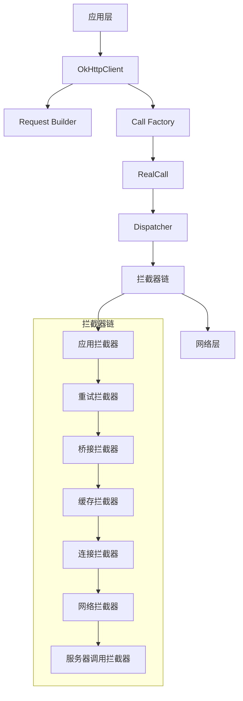
```mermaid
graph TB
    A[应用层] --> B[OkHttpClient]
    B --> C[Request Builder]
    B --> D[Call Factory]
    D --> E[RealCall]
    E --> F[Dispatcher]
    F --> G[拦截器链]
    G --> H[网络层]
    
    subgraph "拦截器链"
        I[应用拦截器]
        J[重试拦截器]
        K[桥接拦截器]
        L[缓存拦截器]
        M[连接拦截器]
        N[网络拦截器]
        O[服务器调用拦截器]
    end
    
    G --> I
    I --> J
    J --> K
    K --> L
    L --> M
    M --> N
    N --> O
```

### 1.4 问题思考

- OkHttp设计：OkHttp整体设计思路是什么样的？request和respond分别如何设计？如何设计call请求操作？
- OkHttp同步异步：如何设计同步和异步请求？同步操作做了什么？异步操作如何处理逻辑？
- OkHttp拦截器：拦截器是如何设计的？为什么需要拦截器？拦截器如何处理拦截，和向下分发逻辑？如何做重试机制的设计？
- OkHttp缓存：如何设计缓存？什么情况下会用到网络缓存？缓存拦截器的核心思想是什么？
- OkHttp分发器：同步和异步请求的Dispatcher是如何调度的？设计的巧妙之处是什么？
- OkHttp线程池：使用了什么线程池？是如何管理线程任务？跟普通线程池使用有何区别？

## 02.核心架构设计

### 2.1 整体架构设计

OkHttp采用分层架构设计，主要包括以下几个层次：

1. **应用接口层**：提供简洁的API接口，包括OkHttpClient、Request、Response等
2. **调度管理层**：Dispatcher负责请求的调度和线程池管理
3. **拦截器链层**：责任链模式实现的拦截器机制
4. **连接管理层**：ConnectionPool管理HTTP连接的复用
5. **网络传输层**：底层的Socket连接和数据传输

### 2.2 整体设计思路

网络请求到响应大概流程图如下所示


整体设计思路大概如下所示：

- 第一步：创建OkHttpClient对象，由于创建这个对象十分复杂，因此采用builder设计模式构造
- 第二步：包装Request请求体对象，主要是存放url，header，get请求，post请求等等属性
- 第三步：通过newCall(request)去创建一个call请求
- 第四步：开始执行同步execute或者enqueue请求，这里会使用到线程池
- 第五步：添加各种拦截器，缓存拦截器，
- 第六步：处理缓存拦截，数据复用的技术逻辑
- 第七步：创建连接请求的操作，给服务端发送请求
- 第八步：获取返回response数据，这里主要是处理code和body数据

### 2.3 核心组件关系图

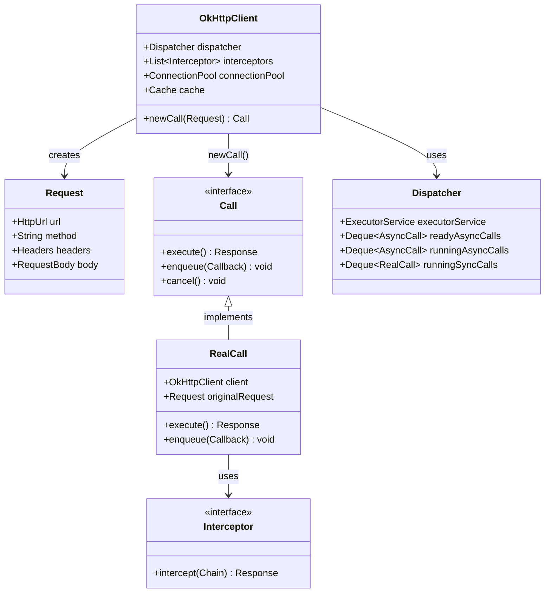
```mermaid
classDiagram
    class OkHttpClient {
        +Dispatcher dispatcher
        +List~Interceptor~ interceptors
        +ConnectionPool connectionPool
        +Cache cache
        +newCall(Request) Call
    }
    
    class Request {
        +HttpUrl url
        +String method
        +Headers headers
        +RequestBody body
    }
    
    class Call {
        <<interface>>
        +execute() Response
        +enqueue(Callback) void
        +cancel() void
    }
    
    class RealCall {
        +OkHttpClient client
        +Request originalRequest
        +execute() Response
        +enqueue(Callback) void
    }
    
    class Dispatcher {
        +ExecutorService executorService
        +Deque~AsyncCall~ readyAsyncCalls
        +Deque~AsyncCall~ runningAsyncCalls
        +Deque~RealCall~ runningSyncCalls
    }
    
    class Interceptor {
        <<interface>>
        +intercept(Chain) Response
    }
    
    OkHttpClient --> Request : creates
    OkHttpClient --> Call : newCall()
    Call <|-- RealCall : implements
    OkHttpClient --> Dispatcher : uses
    RealCall --> Interceptor : uses
```

## 03.核心组件详解

### 3.1 OkHttpClient

OkHttpClient是整个框架的入口点，采用建造者模式进行配置：

```java
public class OkHttpClient implements Cloneable, Call.Factory, WebSocket.Factory {
    final Dispatcher dispatcher;
    final @Nullable Proxy proxy;
    final List<Protocol> protocols;
    final List<ConnectionSpec> connectionSpecs;
    final List<Interceptor> interceptors;
    final List<Interceptor> networkInterceptors;
    final EventListener.Factory eventListenerFactory;
    final ProxySelector proxySelector;
    final CookieJar cookieJar;
    final @Nullable Cache cache;
    final @Nullable InternalCache internalCache;
    final SocketFactory socketFactory;
    final SSLSocketFactory sslSocketFactory;
    final ConnectionPool connectionPool;
    // ... 更多配置项
}
```

创建OkHttpClient对象，主要是用于Api网络请求的对象。类似于初始化网络请求，可以设置超时时间，日志打印拦截器，代理，ssl校验，域名校验等等。

**主要职责**：

- 管理全局配置（超时、代理、SSL等）
- 创建Call对象
- 管理拦截器链
- 管理连接池和缓存

#### 3.1.1 创建流程架构图

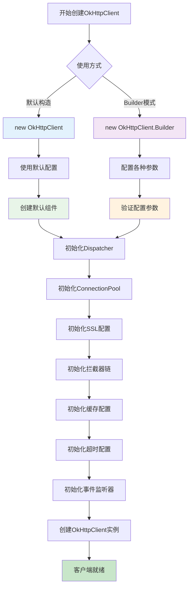
```mermaid
flowchart TD
    A[开始创建OkHttpClient] --> B{使用方式}
    
    B -->|默认构造| C[new OkHttpClient]
    B -->|Builder模式| D[new OkHttpClient.Builder]
    
    C --> E[使用默认配置]
    D --> F[配置各种参数]
    
    E --> G[创建默认组件]
    F --> H[验证配置参数]
    
    G --> I[初始化Dispatcher]
    H --> I
    
    I --> J[初始化ConnectionPool]
    J --> K[初始化SSL配置]
    K --> L[初始化拦截器链]
    L --> M[初始化缓存配置]
    M --> N[初始化超时配置]
    N --> O[初始化事件监听器]
    O --> P[创建OkHttpClient实例]
    
    P --> Q[客户端就绪]
    
    style C fill:#e3f2fd
    style D fill:#f3e5f5
    style G fill:#e8f5e8
    style H fill:#fff3e0
    style Q fill:#c8e6c9
```

#### 3.1.2 Builder模式原理

OkHttpClient采用Builder模式的主要原因：

1. **参数众多**：OkHttpClient有30+个配置参数
2. **可选配置**：大部分参数都有合理的默认值
3. **不可变性**：创建后的OkHttpClient实例不可修改
4. **链式调用**：提供流畅的API体验
5. **参数验证**：在build()时统一验证参数合法性

#### 3.1.3 Builder配置流程图

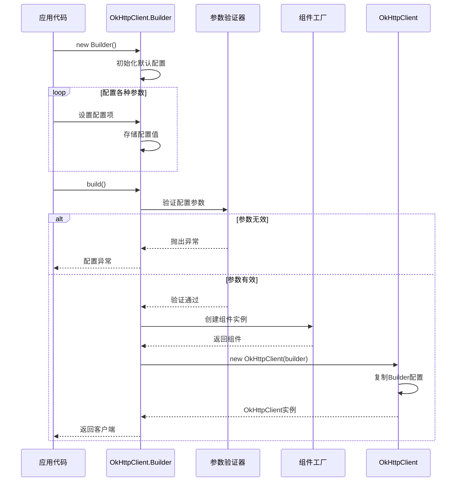
```mermaid
sequenceDiagram
    participant App as 应用代码
    participant Builder as OkHttpClient.Builder
    participant Validator as 参数验证器
    participant Factory as 组件工厂
    participant Client as OkHttpClient
    
    App->>Builder: new Builder()
    Builder->>Builder: 初始化默认配置
    
    loop 配置各种参数
        App->>Builder: 设置配置项
        Builder->>Builder: 存储配置值
    end
    
    App->>Builder: build()
    Builder->>Validator: 验证配置参数
    alt 参数无效
        Validator-->>Builder: 抛出异常
        Builder-->>App: 配置异常
    else 参数有效
        Validator-->>Builder: 验证通过
        Builder->>Factory: 创建组件实例
        Factory-->>Builder: 返回组件
        Builder->>Client: new OkHttpClient(builder)
        Client->>Client: 复制Builder配置
        Client-->>Builder: OkHttpClient实例
        Builder-->>App: 返回客户端
    end
```

#### 3.1.4 超时配置关系图

在创建对象时，连接超时，读取超时，写入超时，完整请求超时，都可以灵活配置。那么这块是如何设计的呢？

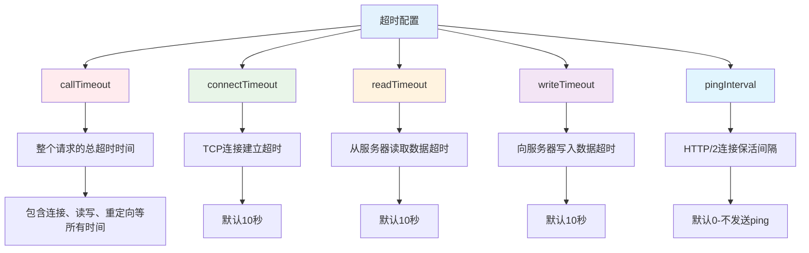
```mermaid
graph TB
    A[超时配置] --> B[callTimeout]
    A --> C[connectTimeout]
    A --> D[readTimeout]
    A --> E[writeTimeout]
    A --> F[pingInterval]
    
    B --> G[整个请求的总超时时间]
    C --> H[TCP连接建立超时]
    D --> I[从服务器读取数据超时]
    E --> J[向服务器写入数据超时]
    F --> K[HTTP/2连接保活间隔]
    
    G --> L[包含连接、读写、重定向等所有时间]
    H --> M[默认10秒]
    I --> N[默认10秒]
    J --> O[默认10秒]
    K --> P[默认0-不发送ping]
    
    style A fill:#e3f2fd
    style B fill:#ffebee
    style C fill:#e8f5e8
    style D fill:#fff3e0
    style E fill:#f3e5f5
    style F fill:#e1f5fe
```

### 3.2 Request请求封装

主要是封装一个Request请求体。

``` java
Request request = new Request.Builder()
        .url(url)
        .addHeader("cookie","yangchong")
        .get()
        .build();
```

Request类封装了HTTP请求的所有信息：

```java
public final class Request {
    final HttpUrl url;
    final String method;
    final Headers headers;
    final @Nullable RequestBody body;
    final Map<Class<?>, Object> tags;
    
    public static class Builder {
        @Nullable HttpUrl url;
        String method;
        Headers.Builder headers;
        @Nullable RequestBody body;
        Map<Class<?>, Object> tags = Collections.emptyMap();
    }
}
```

Request包括Headers和RequestBody，而RequestBody是abstract的，他的子类是有FormBody(表单提交的)和MultipartBody(文件上传)，分别对应了两种不同的MIME类型。

```text
FormBody ："application/x-www-form-urlencoded"
MultipartBody："multipart/"+xxx.
```

**核心特性**：

- 不可变对象设计，线程安全
- 建造者模式构建
- 支持多种HTTP方法（GET、POST、PUT、DELETE等）
- 灵活的Header管理

### 3.3 Call请求执行接口

如何设计Call请求基于接口开发，设计了Call接口，里面主要做同步请求execute，异步请求enqueue，取消请求cancel等等。

Call类详解：有道词典翻译该类注释：调用是准备执行的请求。call可以取消。由于此对象表示单个请求/响应对(流)，因此不能执行两次。

主要是HTTP请求任务封装

- 可以说我们能用到的操纵基本上都定义在这个接口里面了，可以通过Call对象来操作请求，同步请求execute，异步请求enqueue。
- 而Call接口内部提供了Factory工厂方法模式(将对象的创建延迟到工厂类的子类去进行，从而实现动态配置)。

Call接口定义了请求执行的标准：

```java
public interface Call extends Cloneable {
    Request request();
    Response execute() throws IOException;
    void enqueue(Callback responseCallback);
    void cancel();
    boolean isExecuted();
    boolean isCanceled();
    Timeout timeout();
    Call clone();
}
```

**RealCall实现**：

- 同步执行：`execute()`方法直接在当前线程执行
- 异步执行：`enqueue()`方法提交到线程池执行
- 请求取消：支持请求的取消操作

#### 3.3.1 核心方法对比

| 特性 | execute() | enqueue() |
|------|-----------|-----------|
| 执行方式 | 同步阻塞 | 异步非阻塞 |
| 线程模型 | 当前线程执行 | 线程池执行 |
| 返回方式 | 直接返回Response | 通过Callback回调 |
| 异常处理 | 抛出IOException | 通过Callback.onFailure |
| 调度管理 | 简单记录 | 复杂的队列调度 |

#### 3.3.2 执行流程架构图

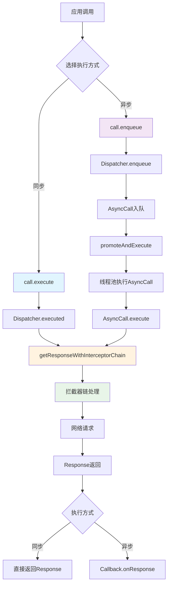
```mermaid
graph TB
    A[应用调用] --> B{选择执行方式}
    B -->|同步| C[call.execute]
    B -->|异步| D[call.enqueue]
    
    C --> E[Dispatcher.executed]
    D --> F[Dispatcher.enqueue]
    
    E --> G[getResponseWithInterceptorChain]
    F --> H[AsyncCall入队]
    H --> I[promoteAndExecute]
    I --> J[线程池执行AsyncCall]
    J --> K[AsyncCall.execute]
    K --> G
    
    G --> L[拦截器链处理]
    L --> M[网络请求]
    M --> N[Response返回]
    
    N --> O{执行方式}
    O -->|同步| P[直接返回Response]
    O -->|异步| Q[Callback.onResponse]
    
    style C fill:#e1f5fe
    style D fill:#f3e5f5
    style G fill:#fff3e0
    style L fill:#e8f5e8
```

#### 3.3.3 Execute执行时序图

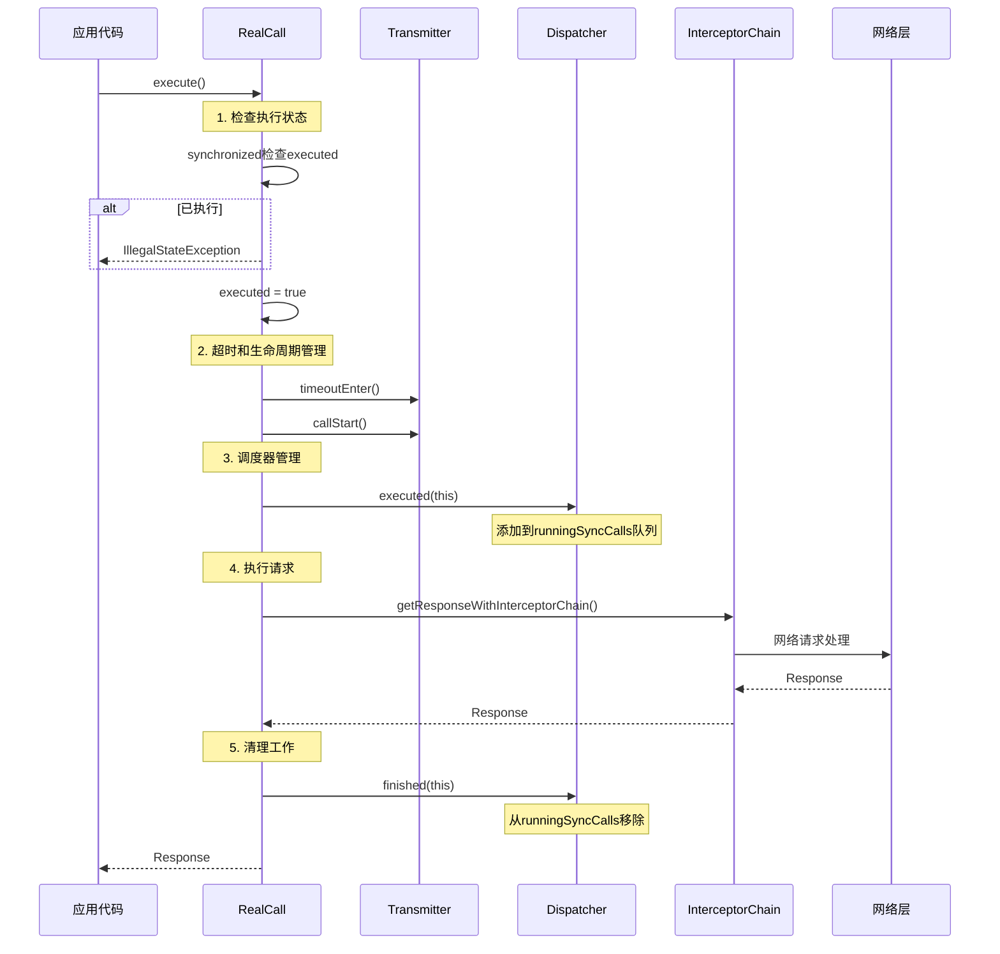
```mermaid
sequenceDiagram
    participant App as 应用代码
    participant RealCall as RealCall
    participant Transmitter as Transmitter
    participant Dispatcher as Dispatcher
    participant Chain as InterceptorChain
    participant Network as 网络层
    
    App->>RealCall: execute()
    
    Note over RealCall: 1. 检查执行状态
    RealCall->>RealCall: synchronized检查executed
    alt 已执行
        RealCall-->>App: IllegalStateException
    end
    RealCall->>RealCall: executed = true
    
    Note over RealCall: 2. 超时和生命周期管理
    RealCall->>Transmitter: timeoutEnter()
    RealCall->>Transmitter: callStart()
    
    Note over RealCall: 3. 调度器管理
    RealCall->>Dispatcher: executed(this)
    Note over Dispatcher: 添加到runningSyncCalls队列
    
    Note over RealCall: 4. 执行请求
    RealCall->>Chain: getResponseWithInterceptorChain()
    Chain->>Network: 网络请求处理
    Network-->>Chain: Response
    Chain-->>RealCall: Response
    
    Note over RealCall: 5. 清理工作
    RealCall->>Dispatcher: finished(this)
    Note over Dispatcher: 从runningSyncCalls移除
    
    RealCall-->>App: Response
```

#### 3.3.4 Enqueue执行时序图


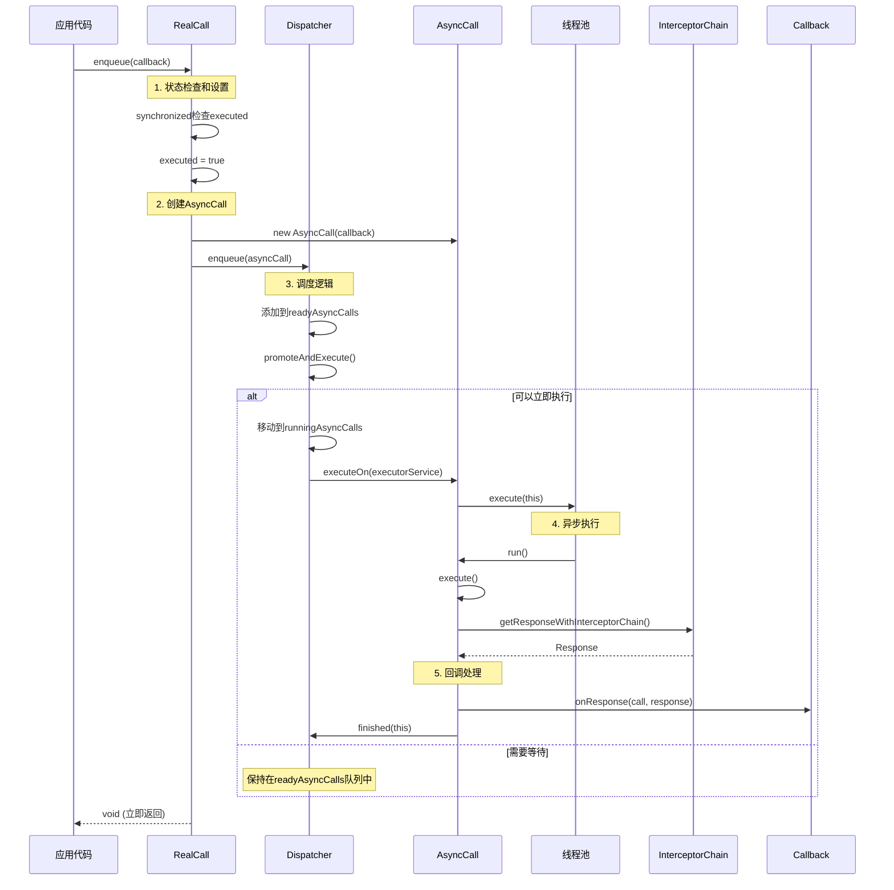
```mermaid
sequenceDiagram
    participant App as 应用代码
    participant RealCall as RealCall
    participant Dispatcher as Dispatcher
    participant AsyncCall as AsyncCall
    participant ThreadPool as 线程池
    participant Chain as InterceptorChain
    participant Callback as Callback
    
    App->>RealCall: enqueue(callback)
    
    Note over RealCall: 1. 状态检查和设置
    RealCall->>RealCall: synchronized检查executed
    RealCall->>RealCall: executed = true
    
    Note over RealCall: 2. 创建AsyncCall
    RealCall->>AsyncCall: new AsyncCall(callback)
    RealCall->>Dispatcher: enqueue(asyncCall)
    
    Note over Dispatcher: 3. 调度逻辑
    Dispatcher->>Dispatcher: 添加到readyAsyncCalls
    Dispatcher->>Dispatcher: promoteAndExecute()
    
    alt 可以立即执行
        Dispatcher->>Dispatcher: 移动到runningAsyncCalls
        Dispatcher->>AsyncCall: executeOn(executorService)
        AsyncCall->>ThreadPool: execute(this)
        
        Note over ThreadPool: 4. 异步执行
        ThreadPool->>AsyncCall: run()
        AsyncCall->>AsyncCall: execute()
        AsyncCall->>Chain: getResponseWithInterceptorChain()
        Chain-->>AsyncCall: Response
        
        Note over AsyncCall: 5. 回调处理
        AsyncCall->>Callback: onResponse(call, response)
        AsyncCall->>Dispatcher: finished(this)
    else 需要等待
        Note over Dispatcher: 保持在readyAsyncCalls队列中
    end
    
    RealCall-->>App: void (立即返回)
```

### 3.4 Dispatcher调度器

网络请求肯定涉及多线程，如何处理大量任务？采用Dispatcher作为调度，与线程池配合实现了高并发，低阻塞的的运行。针对请求任务，采用Deque作为集合，按照入队的顺序先进先出。

Dispatcher负责管理请求的执行调度：

```java
public final class Dispatcher {
    private int maxRequests = 64;  // 最大并发请求数
    private int maxRequestsPerHost = 5;  // 单主机最大并发数
    
    // 等待执行的异步请求队列
    private final Deque<AsyncCall> readyAsyncCalls = new ArrayDeque<>();
    // 正在执行的异步请求队列
    private final Deque<AsyncCall> runningAsyncCalls = new ArrayDeque<>();
    // 正在执行的同步请求队列
    private final Deque<RealCall> runningSyncCalls = new ArrayDeque<>();
}
```

**调度策略**：

- 最大并发请求数限制（默认64个）
- 单主机最大并发数限制（默认5个）
- 使用双端队列管理等待和运行中的请求
- 自动的线程池管理

#### 3.4.1 Dispatcher架构图

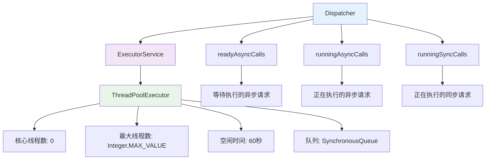
```mermaid
graph TB
    A[Dispatcher] --> B[ExecutorService]
    A --> C[readyAsyncCalls]
    A --> D[runningAsyncCalls]
    A --> E[runningSyncCalls]
    
    B --> F[ThreadPoolExecutor]
    F --> G[核心线程数: 0]
    F --> H[最大线程数: Integer.MAX_VALUE]
    F --> I[空闲时间: 60秒]
    F --> J[队列: SynchronousQueue]
    
    C --> K[等待执行的异步请求]
    D --> L[正在执行的异步请求]
    E --> M[正在执行的同步请求]
    
    style A fill:#e3f2fd
    style B fill:#f3e5f5
    style F fill:#e8f5e8
```

#### 3.4.2 异步调度架构

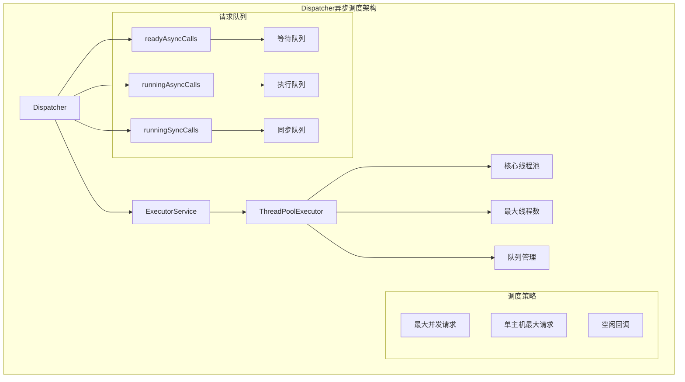
```mermaid
graph TB
    subgraph "Dispatcher异步调度架构"
        A[Dispatcher] --> B[ExecutorService]
        A --> C[readyAsyncCalls]
        A --> D[runningAsyncCalls]
        A --> E[runningSyncCalls]
        
        B --> F[ThreadPoolExecutor]
        F --> G[核心线程池]
        F --> H[最大线程数]
        F --> I[队列管理]
        
        subgraph "调度策略"
            J[最大并发请求]
            K[单主机最大请求]
            L[空闲回调]
        end
        
        subgraph "请求队列"
            C --> M[等待队列]
            D --> N[执行队列]
            E --> O[同步队列]
        end
    end
```

#### 3.4.3 调度策略流程图


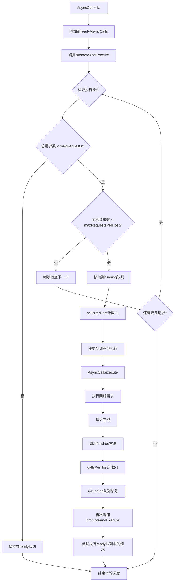
```mermaid
flowchart TD
    A[AsyncCall入队] --> B[添加到readyAsyncCalls]
    B --> C[调用promoteAndExecute]
    C --> D{检查执行条件}
    
    D --> E{总请求数 < maxRequests?}
    E -->|否| F[保持在ready队列]
    E -->|是| G{主机请求数 < maxRequestsPerHost?}
    
    G -->|否| H[继续检查下一个]
    G -->|是| I[移动到running队列]
    
    I --> J[callsPerHost计数+1]
    J --> K[提交到线程池执行]
    K --> L[AsyncCall.execute]
    
    L --> M[执行网络请求]
    M --> N[请求完成]
    N --> O[调用finished方法]
    O --> P[callsPerHost计数-1]
    P --> Q[从running队列移除]
    Q --> R[再次调用promoteAndExecute]
    R --> S[尝试执行ready队列中的请求]
    
    H --> T{还有更多请求?}
    T -->|是| D
    T -->|否| U[结束本轮调度]
    
    F --> U
    S --> U
```

### 3.5 拦截器机制

OKHttp有两种调用方式，一种是阻塞的同步请求，一种是异步的非阻塞的请求。

但是无论同步还是异步都会调用下RealCall的 getResponseWithInterceptorChain方法来完成请求，同时将返回数据或者状态通过Callback来完成。

> 设计拦截器的核心原理

Interceptor 负责拦截和分发。先来看看含义：观察，修改以及可能短路的请求输出和响应请求的回来。通常情况下拦截器用来添加，移除或者转换请求或者回应的头部信息。

拦截器，就像水管一样，把一节一节的水管(拦截器)连起来，形成一个回路。实际上client到server也是如此，通过一个又一个的interceptor串起来，然后把数据发送到服务器，又能接受返回的数据，每一个拦截器(水管)都有自己的作用，分别处理不同东西，比如消毒，净化，去杂质，就像一层层过滤网一样。

> 接口是如何设计的

``` java
public interface Interceptor {
   //负责拦截
  Response intercept(Chain chain) throws IOException;
  interface Chain {
     //负责分发、前行
    Response proceed(Request request) throws IOException;
  }
}
```

#### 3.5.1 拦截器时序图

OkHttp的拦截器采用责任链模式，每个拦截器负责特定的功能：

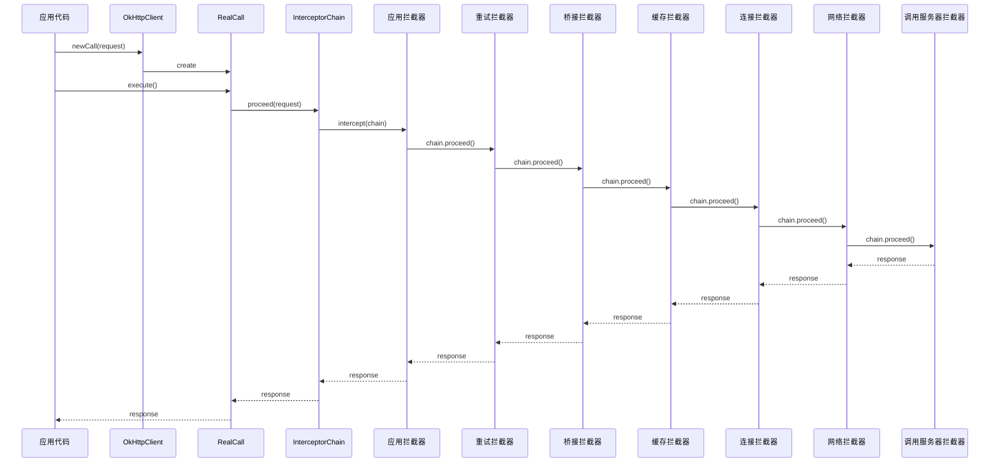
```mermaid
sequenceDiagram
    participant App as 应用代码
    participant Client as OkHttpClient
    participant RealCall as RealCall
    participant Chain as InterceptorChain
    participant AppInt as 应用拦截器
    participant RetryInt as 重试拦截器
    participant BridgeInt as 桥接拦截器
    participant CacheInt as 缓存拦截器
    participant ConnInt as 连接拦截器
    participant NetInt as 网络拦截器
    participant CallInt as 调用服务器拦截器
    
    App->>Client: newCall(request)
    Client->>RealCall: create
    App->>RealCall: execute()
    RealCall->>Chain: proceed(request)
    Chain->>AppInt: intercept(chain)
    AppInt->>RetryInt: chain.proceed()
    RetryInt->>BridgeInt: chain.proceed()
    BridgeInt->>CacheInt: chain.proceed()
    CacheInt->>ConnInt: chain.proceed()
    ConnInt->>NetInt: chain.proceed()
    NetInt->>CallInt: chain.proceed()
    CallInt-->>NetInt: response
    NetInt-->>ConnInt: response
    ConnInt-->>CacheInt: response
    CacheInt-->>BridgeInt: response
    BridgeInt-->>RetryInt: response
    RetryInt-->>AppInt: response
    AppInt-->>Chain: response
    Chain-->>RealCall: response
    RealCall-->>App: response
```

#### 3.5.2 拦截器类关系图

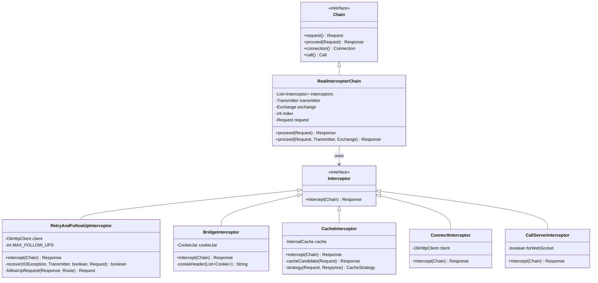
```mermaid
classDiagram
    class Interceptor {
        <<interface>>
        +intercept(Chain) Response
    }
    
    class Chain {
        <<interface>>
        +request() Request
        +proceed(Request) Response
        +connection() Connection
        +call() Call
    }
    
    class RealInterceptorChain {
        -List~Interceptor~ interceptors
        -Transmitter transmitter
        -Exchange exchange
        -int index
        -Request request
        +proceed(Request) Response
        +proceed(Request, Transmitter, Exchange) Response
    }
    
    class RetryAndFollowUpInterceptor {
        -OkHttpClient client
        -int MAX_FOLLOW_UPS
        +intercept(Chain) Response
        -recover(IOException, Transmitter, boolean, Request) boolean
        -followUpRequest(Response, Route) Request
    }
    
    class BridgeInterceptor {
        -CookieJar cookieJar
        +intercept(Chain) Response
        -cookieHeader(List~Cookie~) String
    }
    
    class CacheInterceptor {
        -InternalCache cache
        +intercept(Chain) Response
        -cacheCandidate(Request) Response
        -strategy(Request, Response) CacheStrategy
    }
    
    class ConnectInterceptor {
        -OkHttpClient client
        +intercept(Chain) Response
    }
    
    class CallServerInterceptor {
        -boolean forWebSocket
        +intercept(Chain) Response
    }
    
    Interceptor <|-- RetryAndFollowUpInterceptor
    Interceptor <|-- BridgeInterceptor
    Interceptor <|-- CacheInterceptor
    Interceptor <|-- ConnectInterceptor
    Interceptor <|-- CallServerInterceptor
    Chain <|-- RealInterceptorChain
    RealInterceptorChain --> Interceptor : uses
```


#### 3.5.3 内置拦截器详解

1. **应用拦截器（Application Interceptors）**
  - 用户自定义的拦截器
  - 在请求发送前和响应接收后执行
  - 可以修改请求和响应

2. **重试和重定向拦截器（RetryAndFollowUpInterceptor）**
  - 处理请求失败重试
  - 处理HTTP重定向
  - 管理连接的获取和释放

3. **桥接拦截器（BridgeInterceptor）**
  - 将用户请求转换为网络请求
  - 添加必要的HTTP头（Content-Type、Content-Length等）
  - 处理Cookie
  - 处理GZIP压缩

4. **缓存拦截器（CacheInterceptor）**
  - 实现HTTP缓存策略
  - 处理缓存的读取和写入
  - 支持强制缓存和协商缓存

5. **连接拦截器（ConnectInterceptor）**
  - 建立与服务器的连接
  - 管理连接池
  - 处理HTTP/2连接复用

6. **网络拦截器（Network Interceptors）**
  - 用户自定义的网络级拦截器
  - 在实际网络请求前后执行

7. **调用服务器拦截器（CallServerInterceptor）**
  - 实际的网络IO操作
  - 发送请求数据
  - 读取响应数据

#### 3.5.4 重定向拦截器

核心功能

- **异常恢复**：处理网络异常和连接失败
- **重定向处理**：自动处理HTTP重定向响应
- **重试逻辑**：根据策略决定是否重试请求

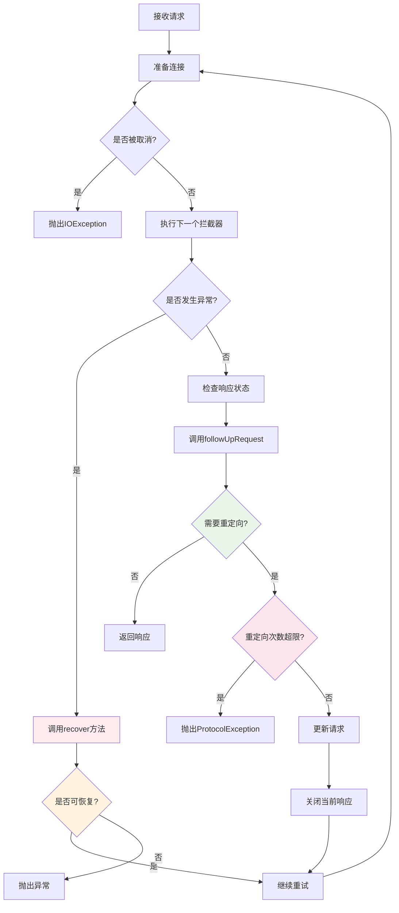
```mermaid
flowchart TD
    A[接收请求] --> B[准备连接]
    B --> C{是否被取消?}
    C -->|是| D[抛出IOException]
    C -->|否| E[执行下一个拦截器]
    
    E --> F{是否发生异常?}
    F -->|是| G[调用recover方法]
    F -->|否| H[检查响应状态]
    
    G --> I{是否可恢复?}
    I -->|是| J[继续重试]
    I -->|否| K[抛出异常]
    
    H --> L[调用followUpRequest]
    L --> M{需要重定向?}
    M -->|否| N[返回响应]
    M -->|是| O{重定向次数超限?}
    
    O -->|是| P[抛出ProtocolException]
    O -->|否| Q[更新请求]
    Q --> R[关闭当前响应]
    R --> J
    
    J --> B
    
    style G fill:#ffebee
    style I fill:#fff3e0
    style M fill:#e8f5e8
    style O fill:#fce4ec
```

#### 3.5.6 缓存拦截器

核心功能

- **缓存策略**：根据HTTP缓存规范决定缓存行为
- **缓存读取**：从缓存中读取有效的响应
- **缓存写入**：将可缓存的响应写入缓存
- **条件请求**：发送If-None-Match、If-Modified-Since等条件请求


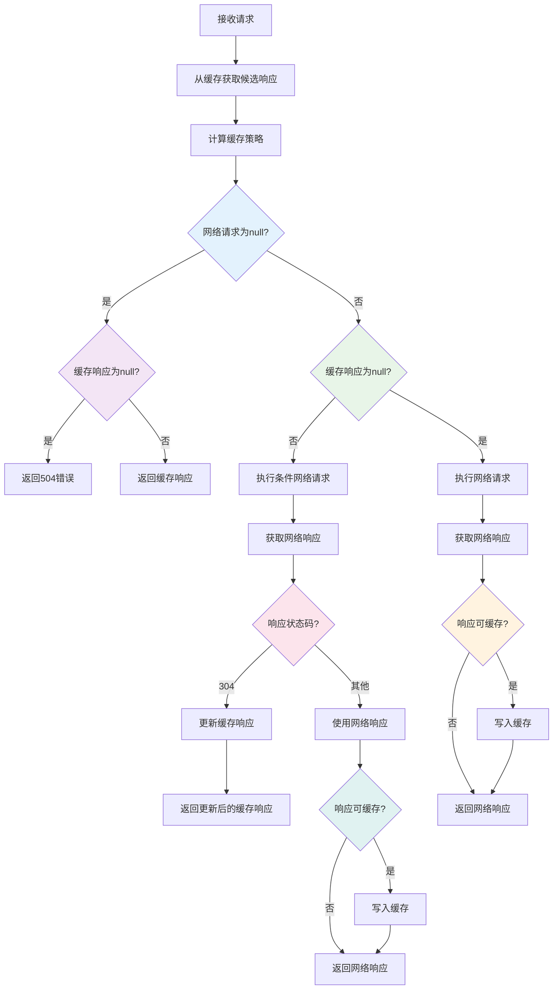
```mermaid
flowchart TD
    A[接收请求] --> B[从缓存获取候选响应]
    B --> C[计算缓存策略]
    C --> D{网络请求为null?}
    
    D -->|是| E{缓存响应为null?}
    D -->|否| F{缓存响应为null?}
    
    E -->|是| G[返回504错误]
    E -->|否| H[返回缓存响应]
    
    F -->|是| I[执行网络请求]
    F -->|否| J[执行条件网络请求]
    
    I --> K[获取网络响应]
    J --> L[获取网络响应]
    
    K --> M{响应可缓存?}
    L --> N{响应状态码?}
    
    N -->|304| O[更新缓存响应]
    N -->|其他| P[使用网络响应]
    
    O --> Q[返回更新后的缓存响应]
    P --> R{响应可缓存?}
    
    M -->|是| S[写入缓存]
    M -->|否| T[返回网络响应]
    
    R -->|是| U[写入缓存]
    R -->|否| V[返回网络响应]
    
    S --> T
    U --> V
    
    style D fill:#e3f2fd
    style E fill:#f3e5f5
    style F fill:#e8f5e8
    style M fill:#fff3e0
    style N fill:#fce4ec
    style R fill:#e0f2f1
```

#### 3.5.7 网络请求拦截器

CallServerInterceptor（网络请求拦截器）

- **请求发送**：将HTTP请求发送到服务器
- **响应接收**：接收服务器的HTTP响应
- **流控制**：管理请求和响应的数据流
- **协议处理**：处理HTTP/1.1和HTTP/2的具体协议细节

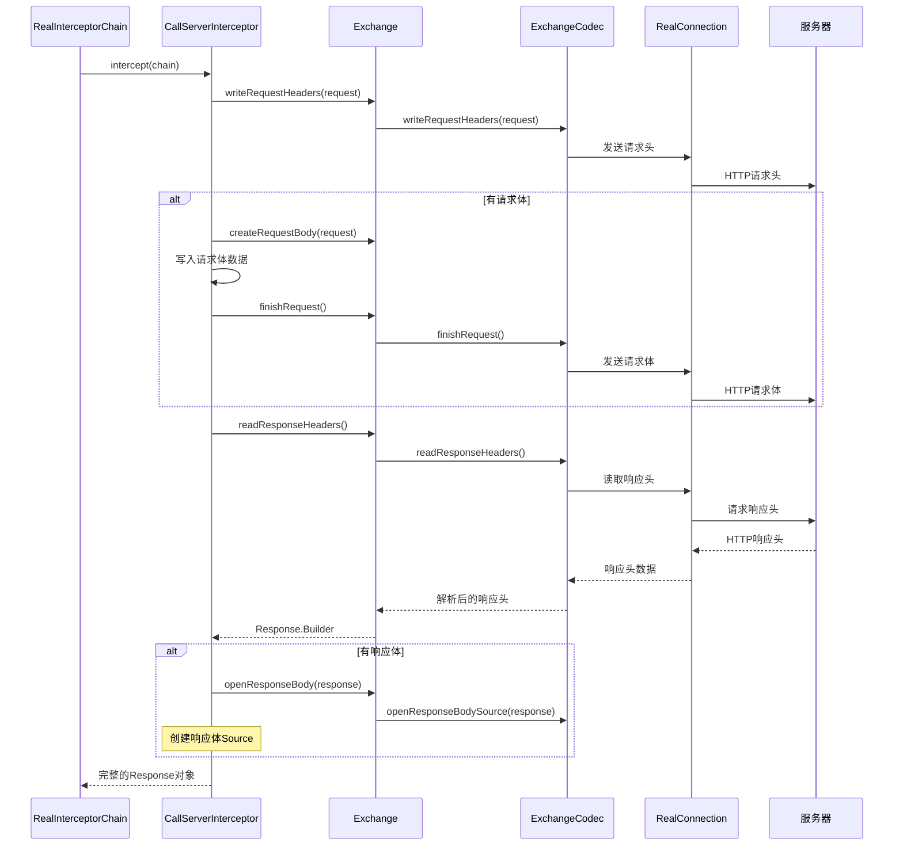
```mermaid
sequenceDiagram
    participant Chain as RealInterceptorChain
    participant CallServer as CallServerInterceptor
    participant Exchange as Exchange
    participant Codec as ExchangeCodec
    participant Connection as RealConnection
    participant Server as 服务器
    
    Chain->>CallServer: intercept(chain)
    CallServer->>Exchange: writeRequestHeaders(request)
    Exchange->>Codec: writeRequestHeaders(request)
    Codec->>Connection: 发送请求头
    Connection->>Server: HTTP请求头
    
    alt 有请求体
        CallServer->>Exchange: createRequestBody(request)
        CallServer->>CallServer: 写入请求体数据
        CallServer->>Exchange: finishRequest()
        Exchange->>Codec: finishRequest()
        Codec->>Connection: 发送请求体
        Connection->>Server: HTTP请求体
    end
    
    CallServer->>Exchange: readResponseHeaders()
    Exchange->>Codec: readResponseHeaders()
    Codec->>Connection: 读取响应头
    Connection->>Server: 请求响应头
    Server-->>Connection: HTTP响应头
    Connection-->>Codec: 响应头数据
    Codec-->>Exchange: 解析后的响应头
    Exchange-->>CallServer: Response.Builder
    
    alt 有响应体
        CallServer->>Exchange: openResponseBody(response)
        Exchange->>Codec: openResponseBodySource(response)
        Note over CallServer: 创建响应体Source
    end
    
    CallServer-->>Chain: 完整的Response对象
```

#### 3.5.8 拦截器链状态管理

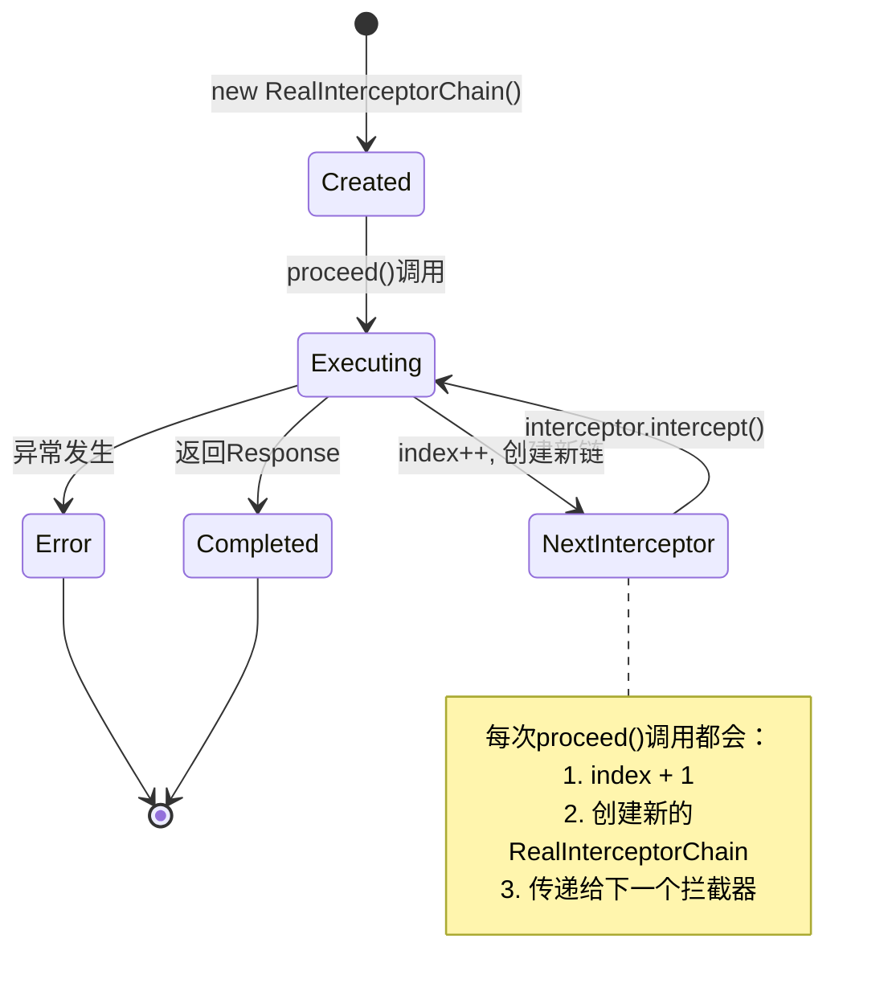
```mermaid
stateDiagram-v2
    [*] --> Created: new RealInterceptorChain()
    Created --> Executing: proceed()调用
    Executing --> NextInterceptor: index++, 创建新链
    NextInterceptor --> Executing: interceptor.intercept()
    Executing --> Completed: 返回Response
    Executing --> Error: 异常发生
    Error --> [*]
    Completed --> [*]
    
    note right of NextInterceptor
        每次proceed()调用都会：
        1. index + 1
        2. 创建新的RealInterceptorChain
        3. 传递给下一个拦截器
    end note
```

### 3.6 Response返回

Response核心职责

- **响应封装**：统一封装HTTP响应的所有信息
- **流式处理**：支持大文件的流式读取和处理
- **内存管理**：优化内存使用，避免大响应体的内存溢出
- **协议适配**：支持HTTP/1.1和HTTP/2协议的响应处理
- **缓存集成**：与缓存系统无缝集成

#### 3.6.1 类层次结构图

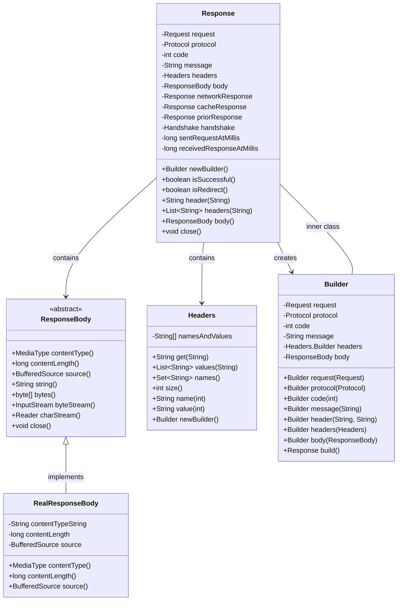
```mermaid
classDiagram
    class Response {
        -Request request
        -Protocol protocol
        -int code
        -String message
        -Headers headers
        -ResponseBody body
        -Response networkResponse
        -Response cacheResponse
        -Response priorResponse
        -Handshake handshake
        -long sentRequestAtMillis
        -long receivedResponseAtMillis
        +Builder newBuilder()
        +boolean isSuccessful()
        +boolean isRedirect()
        +String header(String)
        +List~String~ headers(String)
        +ResponseBody body()
        +void close()
    }
    
    class ResponseBody {
        <<abstract>>
        +MediaType contentType()
        +long contentLength()
        +BufferedSource source()
        +String string()
        +byte[] bytes()
        +InputStream byteStream()
        +Reader charStream()
        +void close()
    }
    
    class RealResponseBody {
        -String contentTypeString
        -long contentLength
        -BufferedSource source
        +MediaType contentType()
        +long contentLength()
        +BufferedSource source()
    }
    
    class Headers {
        -String[] namesAndValues
        +String get(String)
        +List~String~ values(String)
        +Set~String~ names()
        +int size()
        +String name(int)
        +String value(int)
        +Builder newBuilder()
    }
    
    class Builder {
        -Request request
        -Protocol protocol
        -int code
        -String message
        -Headers.Builder headers
        -ResponseBody body
        +Builder request(Request)
        +Builder protocol(Protocol)
        +Builder code(int)
        +Builder message(String)
        +Builder header(String, String)
        +Builder headers(Headers)
        +Builder body(ResponseBody)
        +Response build()
    }
    
    Response --> ResponseBody : contains
    Response --> Headers : contains
    Response --> Builder : creates
    ResponseBody <|-- RealResponseBody : implements
    Response -- Builder : inner class
```

#### 3.6.2 创建流程架构图

Response创建流程架构图

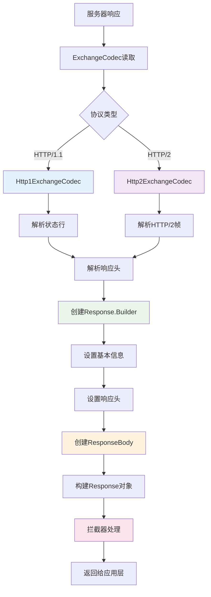
```mermaid
graph TB
    A[服务器响应] --> B[ExchangeCodec读取]
    B --> C{协议类型}
    
    C -->|HTTP/1.1| D[Http1ExchangeCodec]
    C -->|HTTP/2| E[Http2ExchangeCodec]
    
    D --> F[解析状态行]
    E --> G[解析HTTP/2帧]
    
    F --> H[解析响应头]
    G --> H
    
    H --> I[创建Response.Builder]
    I --> J[设置基本信息]
    J --> K[设置响应头]
    K --> L[创建ResponseBody]
    L --> M[构建Response对象]
    
    M --> N[拦截器处理]
    N --> O[返回给应用层]
    
    style D fill:#e3f2fd
    style E fill:#f3e5f5
    style I fill:#e8f5e8
    style L fill:#fff3e0
    style N fill:#fce4ec
```

#### 3.6.3 状态行解析流程图

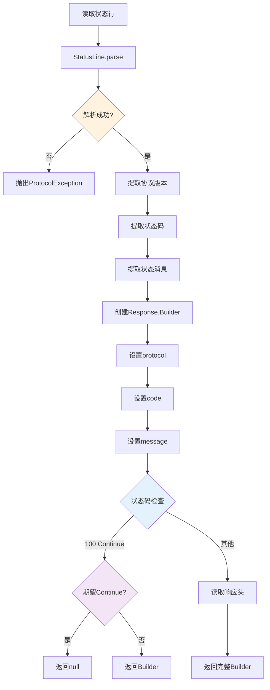
```mermaid
flowchart TD
    A[读取状态行] --> B[StatusLine.parse]
    B --> C{解析成功?}
    C -->|否| D[抛出ProtocolException]
    C -->|是| E[提取协议版本]
    E --> F[提取状态码]
    F --> G[提取状态消息]
    G --> H[创建Response.Builder]
    H --> I[设置protocol]
    I --> J[设置code]
    J --> K[设置message]
    K --> L{状态码检查}
    L -->|100 Continue| M{期望Continue?}
    L -->|其他| N[读取响应头]
    M -->|是| O[返回null]
    M -->|否| P[返回Builder]
    N --> Q[返回完整Builder]
    
    style C fill:#fff3e0
    style L fill:#e3f2fd
    style M fill:#f3e5f5
```

#### 3.6.4 Headers解析流程

```mermaid
sequenceDiagram
    participant Codec as ExchangeCodec
    participant Reader as Source/BufferedSource
    participant Headers as Headers.Builder
    participant Parser as HeaderParser
    
    Codec->>Reader: readHeaderLine()
    loop 读取每一行
        Reader-->>Codec: 响应头行
        alt 空行(响应头结束)
            Codec->>Codec: break
        else 正常响应头
            Codec->>Parser: 解析头部名称和值
            Parser-->>Codec: name, value
            Codec->>Headers: addLenient(name, value)
        else 多行头部(折叠)
            Codec->>Parser: 处理折叠行
            Parser-->>Codec: 合并后的值
            Codec->>Headers: 更新头部值
        end
    end
    Headers-->>Codec: Headers对象
```

#### 3.6.5 ResponseBody架构设计

```mermaid
classDiagram
    class ResponseBody {
        <<abstract>>
        +MediaType contentType()
        +long contentLength()
        +BufferedSource source()
        +String string()
        +byte[] bytes()
        +InputStream byteStream()
        +Reader charStream()
        +void close()
        +create(MediaType, String)$ ResponseBody
        +create(MediaType, byte[])$ ResponseBody
        +create(MediaType, long, BufferedSource)$ ResponseBody
    }
    
    class RealResponseBody {
        -String contentTypeString
        -long contentLength
        -BufferedSource source
        +MediaType contentType()
        +long contentLength()
        +BufferedSource source()
    }
    
    class CacheWritingResponseBody {
        -ResponseBody delegate
        -CacheRequest cacheRequest
        -BufferedSink cacheBody
        -Source cacheWritingSource
        +long contentLength()
        +BufferedSource source()
    }
    
    class GzipResponseBody {
        -ResponseBody responseBody
        -GzipSource gzipSource
        +long contentLength()
        +BufferedSource source()
    }
    
    ResponseBody <|-- RealResponseBody
    ResponseBody <|-- CacheWritingResponseBody
    ResponseBody <|-- GzipResponseBody
    CacheWritingResponseBody --> ResponseBody : delegates to
    GzipResponseBody --> ResponseBody : wraps
```

#### 3.6.6 ResponseBody数据读取

```mermaid
graph TB
    A[ResponseBody数据读取] --> B{读取方式选择}
    
    B -->|小数据| C[string方法]
    B -->|二进制数据| D[bytes方法]
    B -->|流式读取| E[source方法]
    B -->|InputStream| F[byteStream方法]
    B -->|字符流| G[charStream方法]
    
    C --> H[一次性读取到内存]
    D --> I[一次性读取到字节数组]
    E --> J[BufferedSource流式读取]
    F --> K[InputStream包装]
    G --> L[Reader字符流]
    
    H --> M{数据大小}
    I --> M
    M -->|小于1MB| N[适合]
    M -->|大于1MB| O[可能OOM]
    
    J --> P[内存友好]
    K --> P
    L --> P
    
    style C fill:#ffebee
    style D fill:#ffebee
    style E fill:#e8f5e8
    style F fill:#e8f5e8
    style G fill:#e8f5e8
    style O fill:#ffcdd2
    style P fill:#c8e6c9
```

#### 3.6.7 Response生命周期

```mermaid
sequenceDiagram
    participant App as 应用代码
    participant Call as RealCall
    participant Chain as InterceptorChain
    participant Exchange as Exchange
    participant Codec as ExchangeCodec
    participant Response as Response
    participant Body as ResponseBody
    
    App->>Call: execute() / enqueue()
    Call->>Chain: getResponseWithInterceptorChain()
    Chain->>Exchange: 拦截器链处理
    Exchange->>Codec: readResponseHeaders()
    Codec-->>Exchange: Response.Builder
    Exchange->>Exchange: openResponseBody()
    Exchange->>Body: 创建ResponseBody
    Body-->>Exchange: ResponseBody实例
    Exchange->>Response: Builder.body().build()
    Response-->>Chain: 完整Response
    Chain-->>Call: Response
    Call-->>App: Response
    
    Note over App: 应用处理Response
    App->>Body: string() / bytes() / source()
    Body-->>App: 响应数据
    App->>Response: close()
    Response->>Body: close()
    Body->>Codec: 关闭底层连接
```

#### 3.6.8 响应数据处理

```mermaid
graph TB
    A[响应数据处理] --> B{数据大小评估}
    B -->|小于64KB| C[直接内存读取]
    B -->|64KB-1MB| D[分块读取]
    B -->|大于1MB| E[流式处理]
    
    C --> F[string/bytes方法]
    D --> G[BufferedSource分块]
    E --> H[InputStream/Reader]
    
    F --> I[一次性分配内存]
    G --> J[固定大小缓冲区]
    H --> K[按需分配]
    
    I --> L{内存充足?}
    L -->|是| M[正常处理]
    L -->|否| N[OutOfMemoryError]
    
    J --> O[内存可控]
    K --> O
    
    style N fill:#ffcdd2
    style O fill:#c8e6c9
    style M fill:#e8f5e8
```

#### 3.6.9 Response错误处理

```mermaid
flowchart TD
    A[Response处理] --> B{状态码检查}
    B -->|2xx| C[成功响应]
    B -->|3xx| D[重定向处理]
    B -->|4xx| E[客户端错误]
    B -->|5xx| F[服务器错误]
    
    C --> G[正常处理ResponseBody]
    D --> H[RetryAndFollowUpInterceptor处理]
    E --> I[应用层错误处理]
    F --> J[可能重试]
    
    G --> K{ResponseBody读取}
    K -->|成功| L[返回数据]
    K -->|IO异常| M[连接错误处理]
    K -->|协议异常| N[协议错误处理]
    
    H --> O[自动重定向]
    I --> P[返回错误Response]
    J --> Q[重试或失败]
    
    M --> R[关闭连接]
    N --> R
    R --> S[抛出异常]
    
    style E fill:#fff3e0
    style F fill:#ffebee
    style M fill:#ffcdd2
    style N fill:#ffcdd2
```

#### 3.6.10 Response缓存机制

```mermaid
sequenceDiagram
    participant App as 应用
    participant Cache as CacheInterceptor
    participant DiskCache as DiskLruCache
    participant Network as 网络层
    participant Response as Response
    
    App->>Cache: 请求
    Cache->>DiskCache: 查找缓存
    alt 缓存命中且有效
        DiskCache-->>Cache: 缓存Response
        Cache->>Response: 创建缓存Response
        Response-->>App: 返回缓存数据
    else 缓存过期或不存在
        Cache->>Network: 网络请求
        Network-->>Cache: 网络Response
        Cache->>DiskCache: 存储Response
        Cache->>Response: 包装为缓存写入Response
        Response-->>App: 返回网络数据
        Note over Response: 读取时同时写入缓存
    end
```

## 04.核心流程分析

### 4.1 请求执行流程

```mermaid
flowchart TD
    A[创建OkHttpClient] --> B[构建Request]
    B --> C[调用newCall创建Call]
    C --> D{同步还是异步?}
    
    D -->|同步| E[call.execute]
    D -->|异步| F[call.enqueue]
    
    E --> G[Dispatcher调度]
    F --> H[加入异步队列]
    H --> I[线程池执行]
    I --> G
    
    G --> J[构建拦截器链]
    J --> K[依次执行拦截器]
    K --> L[发送网络请求]
    L --> M[接收响应]
    M --> N[拦截器链处理响应]
    N --> O[返回Response]
    
    O --> P{异步?}
    P -->|是| Q[回调Callback]
    P -->|否| R[直接返回]
```

### 4.2 连接管理流程

```mermaid
sequenceDiagram
    participant Call as RealCall
    participant ConnInt as ConnectInterceptor
    participant Pool as ConnectionPool
    participant Conn as RealConnection
    participant Socket as Socket
    
    Call->>ConnInt: intercept()
    ConnInt->>Pool: get(address)
    
    alt 连接池中有可用连接
        Pool-->>ConnInt: 返回现有连接
    else 需要创建新连接
        ConnInt->>Conn: create new
        Conn->>Socket: connect()
        Socket-->>Conn: connected
        Conn-->>Pool: put(connection)
        Pool-->>ConnInt: 返回新连接
    end
    
    ConnInt->>Call: proceed with connection
```

### 4.3 缓存处理流程

```mermaid
flowchart TD
    A[请求到达缓存拦截器] --> B{缓存是否存在?}
    
    B -->|否| C[继续网络请求]
    B -->|是| D{缓存是否有效?}
    
    D -->|有效| E[返回缓存响应]
    D -->|需要验证| F[添加条件请求头]
    D -->|过期| C
    
    F --> G[发送条件请求]
    G --> H{服务器响应}
    
    H -->|304 Not Modified| I[返回缓存内容]
    H -->|200 OK| J[更新缓存并返回新内容]
    
    C --> K[网络请求]
    K --> L{响应可缓存?}
    L -->|是| M[存储到缓存]
    L -->|否| N[直接返回响应]
    M --> N
```

## 05.关键技术特性

### 5.1 连接池管理

OkHttp使用连接池来复用HTTP连接，提高性能：

```java
public final class ConnectionPool {
    private static final Executor executor = new ThreadPoolExecutor(
        0, Integer.MAX_VALUE, 60L, TimeUnit.SECONDS,
        new SynchronousQueue<>(), 
        Util.threadFactory("OkHttp ConnectionPool", true)
    );
    
    private final RealConnectionPool delegate;
    
    public ConnectionPool() {
        this(5, 5, TimeUnit.MINUTES);
    }
    
    public ConnectionPool(int maxIdleConnections, long keepAliveDuration, TimeUnit timeUnit) {
        this.delegate = new RealConnectionPool(taskRunner, maxIdleConnections, keepAliveDuration, timeUnit);
    }
}
```

**连接池特性**：

- 默认最大空闲连接数：5个
- 默认连接保活时间：5分钟
- 自动清理过期连接
- 支持HTTP/1.1和HTTP/2连接复用

```mermaid
flowchart TD
    A[ConnectionPool创建] --> B[设置最大空闲连接数: 5]
    B --> C[设置连接保活时间: 5分钟]
    C --> D[创建RealConnectionPool]
    D --> E[启动清理线程池]
    
    E --> F[连接使用流程]
    F --> G{需要新连接?}
    G -->|是| H[创建新连接]
    G -->|否| I[复用现有连接]
    
    H --> J[连接加入池中]
    I --> K[更新连接使用时间]
    J --> L[连接使用完毕]
    K --> L
    
    L --> M[连接变为空闲状态]
    M --> N[清理线程检查]
    N --> O{连接过期?}
    O -->|是| P[移除并关闭连接]
    O -->|否| Q[保持连接]
    
    P --> R[连接池维护完成]
    Q --> R
    
    style A fill:#e3f2fd
    style D fill:#f3e5f5
    style G fill:#fff3e0
    style O fill:#ffebee
```

### 5.2 HTTP/2支持

OkHttp完整支持HTTP/2协议：

- **多路复用**：单个连接上并发处理多个请求
- **服务器推送**：服务器主动推送资源
- **头部压缩**：HPACK算法压缩HTTP头部
- **流量控制**：精确控制数据传输速率

#### 5.2.1 HTTP/2连接架构

```mermaid
graph TB
    subgraph "HTTP/2多路复用架构"
        A[Http2Connection] --> B[Http2Writer]
        A --> C[Http2Reader]
        A --> D[Settings]
        A --> E[流管理器]
        
        E --> F[Http2Stream 1]
        E --> G[Http2Stream 2]
        E --> H[Http2Stream N]
        
        subgraph "流控制"
            I[连接级流控]
            J[流级流控]
            K[窗口更新]
        end
        
        subgraph "帧处理"
            L[DATA帧]
            M[HEADERS帧]
            N[SETTINGS帧]
            O[WINDOW_UPDATE帧]
            P[PING帧]
        end
        
        F --> I
        G --> I
        H --> I
        
        F --> J
        G --> J
        H --> J
    end
```

### 5.3 缓存机制设计

实现完整的HTTP缓存策略：

```java
public final class CacheInterceptor implements Interceptor {
    @Override 
    public Response intercept(Chain chain) throws IOException {
        Response cacheCandidate = cache != null ? cache.get(chain.request()) : null;
        
        long now = System.currentTimeMillis();
        CacheStrategy strategy = new CacheStrategy.Factory(now, chain.request(), cacheCandidate).get();
        Request networkRequest = strategy.networkRequest;
        Response cacheResponse = strategy.cacheResponse;
        
        // 缓存策略处理逻辑
        if (networkRequest == null && cacheResponse == null) {
            return new Response.Builder()
                .request(chain.request())
                .protocol(Protocol.HTTP_1_1)
                .code(504)
                .message("Unsatisfiable Request (only-if-cached)")
                .build();
        }
        
        if (networkRequest == null) {
            return cacheResponse.newBuilder()
                .cacheResponse(stripBody(cacheResponse))
                .build();
        }
        
        // 继续网络请求...
    }
}
```

#### 5.3.1 缓存架构设计

```mermaid
graph TB
    subgraph "OkHttp缓存架构"
        A[OkHttpClient] --> B[CacheInterceptor]
        B --> C[CacheStrategy]
        C --> D[Cache]
        D --> E[DiskLruCache]
        
        F[Request] --> G[CacheControl]
        H[Response] --> I[Headers]
        I --> J[CacheControl]
        
        B --> K[InternalCache]
        K --> L[CacheRequest]
        K --> M[Response缓存]
        
        subgraph "缓存决策"
            C --> N[网络请求]
            C --> O[缓存响应]
            C --> P[条件请求]
        end
        
        subgraph "存储层"
            E --> Q[Journal文件]
            E --> R[Entry文件]
            E --> S[Snapshot]
        end
    end
```

#### 5.3.2 缓存核心组件

```mermaid
classDiagram
    class Cache {
        -DiskLruCache cache
        -InternalCache internalCache
        +get(Request) Response
        +put(Response) CacheRequest
        +remove(Request)
        +urls() Iterator
        +size() long
        +maxSize() long
    }
    
    class CacheInterceptor {
        -InternalCache cache
        +intercept(Chain) Response
        -cacheWritingResponse(CacheRequest, Response) Response
    }
    
    class CacheStrategy {
        +Factory factory
        +networkRequest Request
        +cacheResponse Response
        +get() CacheStrategy
    }
    
    class DiskLruCache {
        -File directory
        -long maxSize
        -Map<String, Entry> lruEntries
        +get(String) Snapshot
        +edit(String) Editor
        +remove(String) boolean
    }
    
    class CacheControl {
        -boolean noCache
        -boolean noStore
        -int maxAgeSeconds
        -int maxStaleSeconds
        -int minFreshSeconds
        +parse(Headers) CacheControl
    }
    
    Cache --> DiskLruCache
    Cache --> InternalCache
    CacheInterceptor --> Cache
    CacheInterceptor --> CacheStrategy
    CacheStrategy --> CacheControl
```

#### 5.3.3 缓存决策流程

```mermaid
flowchart TD
    A[接收请求] --> B{检查缓存}
    B -->|无缓存| C[发起网络请求]
    B -->|有缓存| D{缓存是否新鲜}
    
    D -->|新鲜| E[返回缓存响应]
    D -->|过期| F{是否允许过期缓存}
    
    F -->|允许| G{检查max-stale}
    F -->|不允许| H{支持条件请求}
    
    G -->|在允许范围内| E
    G -->|超出范围| H
    
    H -->|支持| I[发起条件请求]
    H -->|不支持| C
    
    I --> J{服务器响应}
    J -->|304 Not Modified| K[更新缓存元数据]
    J -->|200 OK| L[更新缓存内容]
    
    K --> E
    L --> M[返回新响应]
    C --> N{响应可缓存}
    N -->|可缓存| O[存储到缓存]
    N -->|不可缓存| M
    O --> M
```

#### 5.3.4 磁盘缓存设计

DiskLruCache是OkHttp缓存的核心存储引擎，采用LRU（Least Recently Used）算法：

```mermaid
graph TB
    subgraph "DiskLruCache架构"
        A[DiskLruCache] --> B[Journal文件]
        A --> C[Entry映射]
        A --> D[Executor线程池]
        
        B --> E[操作日志]
        E --> F[CLEAN记录]
        E --> G[DIRTY记录]
        E --> H[REMOVE记录]
        E --> I[READ记录]
        
        C --> J[Entry对象]
        J --> K[文件索引]
        J --> L[长度信息]
        J --> M[访问时间]
        
        subgraph "文件存储"
            N[缓存目录]
            N --> O[journal文件]
            N --> P[journal.tmp]
            N --> Q[journal.bkp]
            N --> R[entry.0文件]
            N --> S[entry.1文件]
        end
    end
```

#### 5.3.5 缓存拦截器思想

CacheInterceptor核心流程

```mermaid
sequenceDiagram
    participant I as CacheInterceptor
    participant C as Cache
    participant D as DiskLruCache
    participant F as FileSystem
    
    I->>C: put(response)
    C->>C: 计算缓存键
    C->>D: edit(key)
    D->>D: 创建Editor
    D->>F: 创建临时文件
    F-->>D: 文件句柄
    D-->>C: Editor对象
    C->>C: 创建CacheRequest
    C-->>I: CacheRequest
    
    Note over I: 写入响应数据
    I->>I: cacheWritingResponse()
    I->>I: 包装ResponseBody
    
    Note over I: 数据流写入
    loop 读取网络响应
        I->>I: 读取数据块
        I->>C: 写入缓存
        I->>I: 写入客户端
    end
    
    I->>C: 完成写入
    C->>D: editor.commit()
    D->>F: 重命名临时文件
    D->>D: 更新Journal
    D-->>C: 成功
    C-->>I: 完成
```

### 5.4 安全特性设计

在安全性方面采用了多层防护策略，涵盖传输层安全(TLS)、证书验证、主机名校验、数据完整性保护等多个维度。

- **TLS支持**：支持TLS 1.2和1.3
- **证书锁定**：Certificate Pinning防止中间人攻击
- **主机名验证**：严格的主机名验证
- **协议降级保护**：防止协议降级攻击

#### 5.4.1 安全组件架构图

```mermaid
graph TB
    A[OkHttpClient] --> B[SSL/TLS配置]
    A --> C[证书验证]
    A --> D[主机名校验]
    A --> E[连接安全]
    
    B --> F[SSLSocketFactory]
    B --> G[X509TrustManager]
    B --> H[ConnectionSpec]
    B --> I[TlsVersion]
    B --> J[CipherSuite]
    
    C --> K[CertificatePinner]
    C --> L[CertificateChainCleaner]
    C --> M[TrustRootIndex]
    
    D --> N[OkHostnameVerifier]
    D --> O[HostnameVerifier]
    
    E --> P[RealConnection]
    E --> Q[Handshake]
    E --> R[Protocol协商]
    
    F --> S[平台SSL实现]
    G --> T[证书信任链]
    K --> U[证书固定]
    L --> V[证书链清理]
    N --> W[主机名匹配]
    P --> X[TLS握手]
    
    style A fill:#e3f2fd
    style B fill:#f3e5f5
    style C fill:#e8f5e8
    style D fill:#fff3e0
    style E fill:#fce4ec
```


#### 5.4.2 安全数据流图

```mermaid
sequenceDiagram
    participant App as 应用程序
    participant Client as OkHttpClient
    participant Conn as RealConnection
    participant SSL as SSLSocket
    participant Server as 服务器
    
    App->>Client: 创建HTTPS请求
    Client->>Conn: 建立连接
    Conn->>SSL: 创建SSL连接
    
    Note over SSL,Server: TLS握手过程
    SSL->>Server: ClientHello
    Server->>SSL: ServerHello + Certificate
    
    SSL->>SSL: 证书链验证
    SSL->>SSL: 主机名验证
    SSL->>SSL: 证书固定检查
    
    alt 验证成功
        SSL->>Server: ClientKeyExchange
        Server->>SSL: Finished
        SSL->>Conn: 安全连接建立
        Conn->>Client: 连接就绪
        Client->>App: 可以发送请求
    else 验证失败
        SSL->>Conn: 验证失败
        Conn->>Client: 连接异常
        Client->>App: 抛出安全异常
    end
```

#### 5.4.3 证书验证机制

OkHttp使用CertificateChainCleaner来清理和验证证书链：

```java
public abstract class CertificateChainCleaner {
  public abstract List<Certificate> clean(List<Certificate> chain, String hostname)
      throws SSLPeerUnverifiedException;

  public static CertificateChainCleaner get(X509TrustManager trustManager) {
    return Platform.get().buildCertificateChainCleaner(trustManager);
  }

  public static CertificateChainCleaner get(X509TrustManager trustManager, TrustRootIndex trustRootIndex) {
    return new BasicCertificateChainCleaner(trustRootIndex);
  }
}
```

证书链验证流程

```mermaid
sequenceDiagram
    participant Client as OkHttpClient
    participant Cleaner as CertificateChainCleaner
    participant Trust as TrustManager
    participant Root as TrustRootIndex
    
    Client->>Cleaner: clean(certificateChain, hostname)
    Cleaner->>Cleaner: 构建完整证书链
    
    loop 对每个证书
        Cleaner->>Root: findByIssuerAndSignature(cert)
        Root-->>Cleaner: 返回匹配的根证书
    end
    
    Cleaner->>Trust: checkServerTrusted(chain, authType)
    
    alt 验证成功
        Trust-->>Cleaner: 验证通过
        Cleaner-->>Client: 返回清理后的证书链
    else 验证失败
        Trust-->>Cleaner: 抛出异常
        Cleaner-->>Client: 证书验证失败
    end
```

#### 5.4.4 主机名验证

OkHostnameVerifier实现，OkHttp实现了符合RFC 2818标准的主机名验证器

```mermaid
flowchart TD
    A[开始主机名验证] --> B{输入是IP地址?}
    B -->|是| C[IP地址验证]
    B -->|否| D[域名验证]
    
    C --> E[获取证书SAN中的IP地址]
    E --> F{IP地址匹配?}
    F -->|是| G[验证成功]
    F -->|否| H[验证失败]
    
    D --> I[获取证书SAN中的DNS名称]
    I --> J[遍历每个DNS名称]
    J --> K{是通配符模式?}
    
    K -->|否| L[精确匹配]
    K -->|是| M[通配符验证]
    
    L --> N{完全匹配?}
    N -->|是| G
    N -->|否| O{还有更多DNS名称?}
    
    M --> P[检查通配符规则]
    P --> Q{通配符匹配?}
    Q -->|是| G
    Q -->|否| O
    
    O -->|是| J
    O -->|否| H
    
    style G fill:#c8e6c9
    style H fill:#ffcdd2
```

#### 5.4.5 中间人攻击防护

OkHttp通过多层防护机制防止中间人攻击：

```mermaid
graph TB
    A[中间人攻击防护] --> B[证书验证]
    A --> C[证书固定]
    A --> D[主机名验证]
    A --> E[HSTS支持]
    A --> F[证书透明度]
    
    B --> G[证书链完整性检查]
    B --> H[证书有效期验证]
    B --> I[证书撤销检查]
    
    C --> J[公钥固定]
    C --> K[证书指纹固定]
    C --> L[CA固定]
    
    D --> M[SAN验证]
    D --> N[通配符规则检查]
    D --> O[IP地址验证]
    
    E --> P[强制HTTPS重定向]
    E --> Q[HSTS预加载]
    
    F --> R[SCT验证]
    F --> S[CT日志检查]
    
    style A fill:#e3f2fd
    style B fill:#f3e5f5
    style C fill:#e8f5e8
    style D fill:#fff3e0
    style E fill:#fce4ec
    style F fill:#e0f2f1
```

### 5.5 SSL/TLS流程

SSL配置层次图

```mermaid
graph TB
    A[SSL/TLS配置] --> B[SocketFactory]
    A --> C[SSLSocketFactory]
    A --> D[X509TrustManager]
    A --> E[HostnameVerifier]
    A --> F[CertificatePinner]
    A --> G[ConnectionSpec]
    
    B --> H[普通Socket创建]
    C --> I[SSL Socket创建]
    D --> J[证书信任验证]
    E --> K[主机名验证]
    F --> L[证书固定验证]
    G --> M[连接规范配置]
    
    I --> N[TLS握手]
    J --> N
    K --> N
    L --> N
    M --> N
    
    N --> O[安全连接建立]
    
    style A fill:#e3f2fd
    style N fill:#f3e5f5
    style O fill:#c8e6c9
```

#### 5.5.1 TLS版本支持

OkHttp支持多个TLS版本，并提供了灵活的配置机制：

```java
public enum TlsVersion {
  TLS_1_3("TLSv1.3"), // jdk11+, android10+
  TLS_1_2("TLSv1.2"), // jdk7+, android16+
  TLS_1_1("TLSv1.1"), // jdk7+, android16+
  TLS_1_0("TLSv1.0"), // jdk7+, android16+
  SSL_3_0("SSLv3");   // jdk6+, android9+

  public static final TlsVersion[] DEFAULT = {
    TLS_1_3, TLS_1_2, TLS_1_1, TLS_1_0
  };
}
```

#### 5.5.2 TLS版本策略

```mermaid
flowchart TD
    A[开始TLS协商] --> B{服务器支持TLS 1.3?}
    B -->|是| C[使用TLS 1.3]
    B -->|否| D{服务器支持TLS 1.2?}
    D -->|是| E[使用TLS 1.2]
    D -->|否| F{服务器支持TLS 1.1?}
    F -->|是| G[使用TLS 1.1]
    F -->|否| H{服务器支持TLS 1.0?}
    H -->|是| I[使用TLS 1.0]
    H -->|否| J[连接失败]
    
    C --> K[建立安全连接]
    E --> K
    G --> K
    I --> K
    
    style C fill:#c8e6c9
    style E fill:#dcedc8
    style G fill:#f0f4c3
    style I fill:#fff9c4
    style J fill:#ffcdd2
```

#### 5.5.3 TLS握手过程

RealConnection负责建立安全的TLS连接：

```mermaid
sequenceDiagram
    participant Client as OkHttpClient
    participant Conn as RealConnection
    participant SSL as SSLSocket
    participant Server as 服务器
    participant Verifier as HostnameVerifier
    participant Pinner as CertificatePinner
    
    Client->>Conn: connectTls()
    Conn->>SSL: createSocket()
    Conn->>SSL: 配置连接规范
    Conn->>SSL: startHandshake()
    
    Note over SSL,Server: TLS握手协商
    SSL->>Server: ClientHello
    Server->>SSL: ServerHello + Certificate + ServerHelloDone
    SSL->>Server: ClientKeyExchange + ChangeCipherSpec + Finished
    Server->>SSL: ChangeCipherSpec + Finished
    
    SSL->>Conn: 握手完成
    Conn->>Conn: 获取握手信息
    
    Conn->>Verifier: verify(hostname, session)
    alt 主机名验证成功
        Verifier-->>Conn: true
        Conn->>Pinner: check(hostname, certificates)
        alt 证书固定验证成功
            Pinner-->>Conn: 验证通过
            Conn->>Conn: 选择应用层协议
            Conn-->>Client: 安全连接建立成功
        else 证书固定验证失败
            Pinner-->>Conn: SSLPeerUnverifiedException
            Conn-->>Client: 连接失败
        end
    else 主机名验证失败
        Verifier-->>Conn: false
        Conn-->>Client: SSLPeerUnverifiedException
    end
```

## 06.性能优化策略

### 6.1 连接复用

```mermaid
graph LR
    A[请求1] --> B[连接池]
    C[请求2] --> B
    D[请求3] --> B
    B --> E[复用连接1]
    B --> F[复用连接2]
    E --> G[服务器]
    F --> G
```

#### 6.1.1 连接复用架构

```mermaid
graph TB
    subgraph "OkHttp连接复用架构"
        A[OkHttpClient] --> B[ConnectionPool]
        B --> C[RealConnectionPool]
        C --> D[RealConnection]
        
        E[Request] --> F[RealCall]
        F --> G[ExchangeFinder]
        G --> H[RouteSelector]
        
        G --> I[Exchange]
        I --> D
        
        subgraph "连接管理"
            C --> J[连接清理任务]
            C --> K[连接复用逻辑]
            C --> L[连接池统计]
        end
        
        subgraph "路由选择"
            H --> M[Route]
            H --> N[Proxy]
            H --> O[InetSocketAddress]
        end
        
        subgraph "协议支持"
            D --> P[HTTP/1.1]
            D --> Q[HTTP/2]
            D --> R[HTTPS/TLS]
        end
    end
```

### 6.2 请求合并

对于相同的请求，OkHttp会自动合并，避免重复请求。

### 6.3 压缩传输

- 自动GZIP压缩响应体
- 支持Brotli压缩算法
- 透明的压缩/解压缩处理

### 6.4 内存管理

- 使用Okio进行高效的IO操作
- 智能的缓冲区管理
- 及时释放不需要的资源

#### 6.4.1 内存管理架构

```mermaid
graph TB
    subgraph "OkHttp内存管理架构"
        A[内存管理] --> B[对象池化]
        A --> C[缓冲区管理]
        A --> D[流复用]
        
        B --> E[连接池复用]
        B --> F[请求对象复用]
        B --> G[响应对象复用]
        
        C --> H[Okio Buffer]
        C --> I[Segment池]
        C --> J[ByteString缓存]
        
        D --> K[InputStream复用]
        D --> L[OutputStream复用]
        D --> M[Socket流复用]
        
        subgraph "垃圾回收优化"
            N[弱引用使用]
            O[及时资源释放]
            P[循环引用避免]
        end
        
        subgraph "内存监控"
            Q[内存使用统计]
            R[泄漏检测]
            S[性能指标]
        end
    end
```

#### 6.4.2 IO操作架构

```mermaid
graph TB
    subgraph "OkHttp IO架构"
        A[应用层] --> B[OkHttp API]
        B --> C[Interceptor Chain]
        C --> D[Network Layer]
        
        D --> E[Okio]
        E --> F[BufferedSource]
        E --> G[BufferedSink]
        
        F --> H[Source]
        G --> I[Sink]
        
        H --> J[Socket InputStream]
        I --> K[Socket OutputStream]
        
        subgraph "缓冲优化"
            L[Segment Buffer]
            M[零拷贝操作]
            N[批量读写]
        end
        
        subgraph "压缩优化"
            O[GZip压缩]
            P[Deflate压缩]
            Q[Brotli压缩]
        end
        
        F --> L
        G --> L
        C --> O
        C --> P
    end
```

## 07.使用示例说明

### 7.1 基本使用

```java
// 创建客户端
OkHttpClient client = new OkHttpClient.Builder()
    .connectTimeout(10, TimeUnit.SECONDS)
    .readTimeout(30, TimeUnit.SECONDS)
    .writeTimeout(30, TimeUnit.SECONDS)
    .build();

// 构建请求
Request request = new Request.Builder()
    .url("https://api.example.com/data")
    .header("Authorization", "Bearer token")
    .build();

// 同步执行
try (Response response = client.newCall(request).execute()) {
    if (response.isSuccessful()) {
        String result = response.body().string();
        // 处理响应数据
    }
}

// 异步执行
client.newCall(request).enqueue(new Callback() {
    @Override
    public void onFailure(Call call, IOException e) {
        // 处理失败
    }
    
    @Override
    public void onResponse(Call call, Response response) throws IOException {
        if (response.isSuccessful()) {
            String result = response.body().string();
            // 处理响应数据
        }
    }
});
```

### 7.2 高级配置

```java
OkHttpClient client = new OkHttpClient.Builder()
    // 连接池配置
    .connectionPool(new ConnectionPool(10, 5, TimeUnit.MINUTES))
    // 缓存配置
    .cache(new Cache(cacheDir, 50 * 1024 * 1024)) // 50MB缓存
    // 拦截器
    .addInterceptor(new LoggingInterceptor())
    .addNetworkInterceptor(new NetworkInterceptor())
    // 重试配置
    .retryOnConnectionFailure(true)
    // 代理配置
    .proxy(new Proxy(Proxy.Type.HTTP, new InetSocketAddress("proxy.example.com", 8080)))
    // SSL配置
    .sslSocketFactory(sslSocketFactory, trustManager)
    .hostnameVerifier(hostnameVerifier)
    .build();
```

### 7.3 统计请求耗时

OkHttp如何进行各个请求环节的耗时统计呢？

- OkHttp 版本提供了EventListener接口，可以让调用者接收一系列网络请求过程中的事件，例如DNS解析、TSL/SSL连接、Response接收等。
- 通过继承此接口，调用者可以监视整个应用中网络请求次数、流量大小、耗时(比如dns解析时间，请求时间，响应时间等等)情况。

如何消耗记录时间

- 在OkHttp库中有一个EventListener类。该类是网络事件的侦听器。扩展这个类以监视应用程序的HTTP调用的数量、大小和持续时间。
- 所有启动/连接/获取事件最终将接收到匹配的结束/释放事件，要么成功(非空参数)，要么失败(非空可抛出)。
- 比如，可以在开始链接记录时间；dns开始，结束等方法解析记录时间，可以计算dns的解析时间。
- 比如，可以在开始请求记录时间，记录connectStart，connectEnd等方法时间，则可以计算出connect连接时间。

OkHttp性能监控架构

```mermaid
graph TB
    subgraph "OkHttp性能监控架构"
        A[EventListener] --> B[连接事件]
        A --> C[DNS事件]
        A --> D[请求事件]
        A --> E[响应事件]
        
        B --> F[连接开始]
        B --> G[连接结束]
        B --> H[连接获取]
        B --> I[连接释放]
        
        C --> J[DNS开始]
        C --> K[DNS结束]
        
        D --> L[请求开始]
        D --> M[请求头发送]
        D --> N[请求体发送]
        
        E --> O[响应头接收]
        E --> P[响应体接收]
        E --> Q[响应结束]
        
        subgraph "指标收集"
            R[连接池统计]
            S[请求延迟]
            T[吞吐量统计]
            U[错误率统计]
        end
        
        subgraph "性能分析"
            V[热点分析]
            W[瓶颈识别]
            X[优化建议]
        end
    end
```


## 10.优秀代码设计深度解析

### 10.1 责任链模式的极致运用

OkHttp的拦截器是责任链模式最经典的应用之一，它的设计值得深入分析：

```java
// RealInterceptorChain — 责任链的核心实现
// 精妙之处在于每次proceed()创建新的Chain，index+1
class RealInterceptorChain(
    val interceptors: List<Interceptor>,
    val index: Int,                    // 当前拦截器索引
    val exchange: Exchange?,
    val request: Request
) : Interceptor.Chain {

    override fun proceed(request: Request): Response {
        // 核心：创建新的Chain，index+1，传给下一个拦截器
        val next = RealInterceptorChain(
            interceptors, index + 1, exchange, request
        )
        val interceptor = interceptors[index]
        
        // 调用拦截器的intercept方法
        // 拦截器内部调用chain.proceed()时，
        // 实际上调用的是next（index+1）的proceed
        val response = interceptor.intercept(next)
        return response
    }
}

// 设计精髓分析：
// 1. 不可变链：每次proceed创建新Chain而非修改index
//    → 线程安全，无状态竞争
//    → 同一个拦截器可以多次调用proceed（重试场景）

// 2. 拦截器可以选择：
//    a. 修改request → chain.proceed(modifiedRequest)
//    b. 短路返回 → 直接return response（不调用proceed）
//    c. 修改response → 先proceed获取response，再修改
//    d. 重试 → 多次调用chain.proceed()

// 3. 应用拦截器 vs 网络拦截器的区别：
//    应用拦截器在最外层 → 只执行一次（即使有重试/重定向）
//    网络拦截器在内层 → 每次实际网络请求都会执行
```

```
责任链中拦截器的协作设计：

请求方向 →
App拦截器 → Retry → Bridge → Cache → Connect → Network → CallServer
                                                              ↓
响应方向 ←                                                  服务器
App拦截器 ← Retry ← Bridge ← Cache ← Connect ← Network ← CallServer

每个拦截器的职责：

RetryAndFollowUpInterceptor:
  → 请求：记录当前请求信息
  → 响应：检查是否需要重试/重定向
  → 重试时重新调用chain.proceed()（新一轮责任链）
  → 最大重试次数：20次

BridgeInterceptor:
  → 请求：添加Content-Type, Content-Length, Host, User-Agent等Header
  → 请求：添加Accept-Encoding: gzip（透明压缩）
  → 请求：添加Cookie
  → 响应：自动解压gzip（如果Accept-Encoding是自动添加的）
  → 响应：保存Cookie

CacheInterceptor:
  → 请求：查询缓存，计算缓存策略
  → 可能短路：缓存有效时直接返回，不调用proceed
  → 响应：将可缓存的响应写入磁盘缓存

ConnectInterceptor:
  → 请求：从连接池获取或创建连接
  → 执行TLS握手
  → 不处理响应（直接透传）

CallServerInterceptor（链尾）:
  → 请求：通过Socket发送HTTP请求
  → 响应：从Socket读取HTTP响应
  → 不调用proceed（它是最后一个拦截器）
```

### 10.2 不可变对象与建造者模式

```java
// Request — 不可变对象设计典范
public final class Request {
    final HttpUrl url;           // final字段
    final String method;         // 不可修改
    final Headers headers;       // Headers也是不可变的
    final @Nullable RequestBody body;
    final Map<Class<?>, Object> tags;
    
    // 构造函数私有，只能通过Builder创建
    Request(Builder builder) {
        this.url = builder.url;
        this.method = builder.method;
        this.headers = builder.headers.build(); // build()返回不可变对象
        this.body = builder.body;
        this.tags = Util.immutableMap(builder.tags); // 不可变Map
    }
    
    // 如果需要修改，创建新的Builder
    public Builder newBuilder() {
        return new Builder(this); // 基于当前Request创建Builder
    }
}

// Headers — 高效的不可变头信息存储
public final class Headers {
    private final String[] namesAndValues; // 扁平数组存储，比Map更紧凑
    
    // 不使用Map<String, String>的原因：
    // 1. HTTP Header的Key可以重复（如Set-Cookie）
    // 2. 扁平数组内存更紧凑，无HashMap的开销
    // 3. 数组遍历比HashMap遍历更快（缓存友好）
    // 4. 数组是不可变的（创建后不能修改长度和内容）
    
    public String get(String name) {
        for (int i = namesAndValues.length - 2; i >= 0; i -= 2) {
            if (name.equalsIgnoreCase(namesAndValues[i])) {
                return namesAndValues[i + 1];
            }
        }
        return null;
        // 从后往前找：后设置的Header优先
    }
}

// 设计优势：
// 1. 线程安全：不可变对象天然线程安全，无需synchronized
// 2. 可共享：多个线程可以安全地共享同一个Request对象
// 3. 缓存友好：可以安全地用作Map的Key
// 4. 可预测：创建后状态不会改变，便于调试
```

### 10.3 Dispatcher调度器的设计精髓

```java
// Dispatcher — 精妙的线程池设计
public final class Dispatcher {
    // 线程池使用SynchronousQueue而非LinkedBlockingQueue
    private @Nullable ExecutorService executorService;
    
    public synchronized ExecutorService executorService() {
        if (executorService == null) {
            executorService = new ThreadPoolExecutor(
                0,                          // 核心线程数为0
                Integer.MAX_VALUE,          // 最大线程数无限
                60, TimeUnit.SECONDS,       // 空闲60秒回收
                new SynchronousQueue<>(),   // 关键！
                Util.threadFactory("OkHttp Dispatcher", false)
            );
        }
        return executorService;
    }
}

// 设计分析 — 为什么用SynchronousQueue？
// 
// SynchronousQueue是零容量队列：
// → 不能存储任何任务
// → 每次put必须有对应的take（生产者直接交给消费者）
// → 如果没有空闲线程 → 创建新线程
// 
// 与LinkedBlockingQueue对比：
// LinkedBlockingQueue：任务先入队列 → 线程从队列取任务
// → 如果核心线程忙，任务堆积在队列中
// → 不会创建新线程（除非队列满了）
// 
// SynchronousQueue + maxPoolSize=MAX_VALUE：
// → 任务提交时，如果有空闲线程就用，没有就立即创建新线程
// → 永远不会排队等待（网络请求需要及时执行，排队会增加延迟）
// → 空闲60秒后线程自动回收（不浪费资源）
//
// 为什么不直接Executors.newCachedThreadPool()？
// 因为OkHttp需要在Dispatcher层面控制最大并发数(64)和单Host并发数(5)
// CachedThreadPool无法控制并发数上限

// 双端队列(Deque)设计：
// readyAsyncCalls + runningAsyncCalls 构成了二级调度
// ready → running 的转换由promoteAndExecute()控制
// 这种设计让OkHttp可以灵活控制并发策略
// 而不是将所有请求都提交给线程池

// promoteAndExecute()的精妙之处：
// 1. 遍历readyAsyncCalls
// 2. 检查runningAsyncCalls.size() < maxRequests
// 3. 检查同一Host的请求数 < maxRequestsPerHost
// 4. 满足条件 → 移到running队列 → 提交线程池
// 5. 请求完成 → finished() → 再次调用promoteAndExecute()
// → 形成自驱动的调度循环
```

### 10.4 连接池的引用计数设计

```
ConnectionPool的连接管理 — 引用计数 + 弱引用

连接池的核心挑战：
  何时判断一个连接可以被回收？
  → 一个连接可能被多个请求共享（HTTP/2多路复用）
  → 不能简单地用空闲时间判断

OkHttp的解决方案：引用计数

RealConnection中的引用管理：
  val calls = mutableListOf<Reference<RealCall>>()
  // 每个使用该连接的RealCall会添加到列表中（弱引用）
  // 当RealCall完成时，从列表中移除
  // 当calls为空 → 连接空闲

连接清理线程的工作逻辑：
fun cleanup(now: Long): Long {
    var longestIdleDurationNs = -1L
    var idleConnectionCount = 0
    var longestIdleConnection: RealConnection? = null
    
    for (connection in connections) {
        // 检查连接是否在使用中
        if (pruneAndGetAllocationCount(connection) > 0) {
            continue  // 还在使用，跳过
        }
        
        idleConnectionCount++
        val idleDurationNs = now - connection.idleAtNanos
        
        if (idleDurationNs > longestIdleDurationNs) {
            longestIdleDurationNs = idleDurationNs
            longestIdleConnection = connection
        }
    }
    
    when {
        longestIdleDurationNs >= keepAliveDurationNs 
            || idleConnectionCount > maxIdleConnections -> {
            // 空闲时间超限 或 空闲连接数超限 → 关闭最久空闲的连接
            connections.remove(longestIdleConnection)
        }
        idleConnectionCount > 0 -> {
            // 有空闲连接但未超限 → 等待到超限时间再检查
            return keepAliveDurationNs - longestIdleDurationNs
        }
        else -> {
            // 没有空闲连接 → 等待下次put时唤醒
            return -1
        }
    }
}

设计精髓：
1. 弱引用管理RealCall → 即使RealCall泄漏也不影响连接回收
2. 清理线程按需唤醒 → put新连接时唤醒，不空转
3. 双条件清理 → 时间超限或数量超限都触发
4. 返回下次清理的等待时间 → 精确的延迟清理
```

### 10.5 Okio的Segment池化设计

```
Okio — OkHttp的IO基础库，性能优化的底层支撑

Segment（段）设计：
  Okio不使用大的连续byte数组，而是使用Segment链表：
  
  Buffer = Segment1 ←→ Segment2 ←→ Segment3 ←→ ...
  
  每个Segment：
  ├── byte[] data = new byte[8192]  // 固定8KB
  ├── int pos    // 读取位置
  ├── int limit  // 写入位置
  ├── Segment next, prev  // 双向链表指针
  ├── boolean shared  // 是否共享
  └── boolean owner   // 是否拥有data数组

Segment池化（SegmentPool）：
  static final SegmentPool INSTANCE = new SegmentPool();
  
  // 池容量：最多缓存64KB（8个Segment）
  // 使用单链表实现（next指针复用）
  
  Segment take() {
      // 从池中取出一个Segment
      // 如果池为空 → 创建新Segment
  }
  
  void recycle(Segment segment) {
      // 将用完的Segment归还到池中
      // 如果池满 → 丢弃（让GC回收）
      // 归还前重置pos和limit
  }

零拷贝操作：
  Okio支持Segment级别的移动而非字节拷贝：
  
  buffer1 → buffer2 传输数据：
  传统方式：从buffer1读byte[] → 写入buffer2 → 两次拷贝
  Okio方式：将Segment从buffer1的链表移到buffer2 → 零拷贝！
  
  前提：Segment的owner标记确保安全

ByteString — 不可变字节串：
  类似String但存储byte[]
  → 不可变 → 可安全共享
  → 内置SHA-256、MD5等计算方法
  → 支持Base64、Hex编解码
  → OkHttp的TLS握手、证书处理大量使用

设计启发：
1. 分段存储避免大内存分配 → 减少GC压力
2. 池化复用减少对象创建 → 更少的内存分配
3. 链表结构支持零拷贝 → 更高的IO效率
4. 这就是为什么OkHttp的IO性能优于HttpURLConnection
```

### 10.6 设计思想总结

```
OkHttp优秀设计思想汇总：

1. 分层架构（Layered Architecture）
   应用层 → 调度层 → 拦截器层 → 连接层 → IO层
   每层职责清晰，可独立测试和替换

2. 责任链模式（Chain of Responsibility）
   拦截器链是OkHttp最核心的设计
   → 每个拦截器关注一个方面
   → 添加新功能只需添加拦截器，不修改已有代码
   → 完美体现开闭原则

3. 不可变对象（Immutable Objects）
   Request、Response、Headers都是不可变的
   → 线程安全无需加锁
   → 可以安全地在拦截器链中传递

4. 建造者模式（Builder Pattern）
   OkHttpClient、Request、Response都使用Builder
   → 参数众多但创建简洁
   → newBuilder()支持基于已有对象微调

5. 连接复用（Connection Pooling）
   → 引用计数管理连接生命周期
   → 按需清理空闲连接
   → HTTP/2多路复用同一连接

6. 异步调度（Async Dispatch）
   → Dispatcher双队列调度
   → SynchronousQueue实现即时执行
   → 细粒度的并发控制

7. 透明处理（Transparent Processing）
   → 自动重试、重定向
   → 自动GZIP压缩/解压
   → 自动Cookie管理
   → 对上层透明，减少使用复杂度

8. 可扩展性（Extensibility）
   → 应用拦截器和网络拦截器
   → EventListener监听各阶段事件
   → 可替换的DNS解析器、SSL配置等

这些设计思想不仅适用于网络框架，
对任何复杂系统的架构设计都有参考价值。
```

