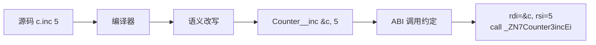
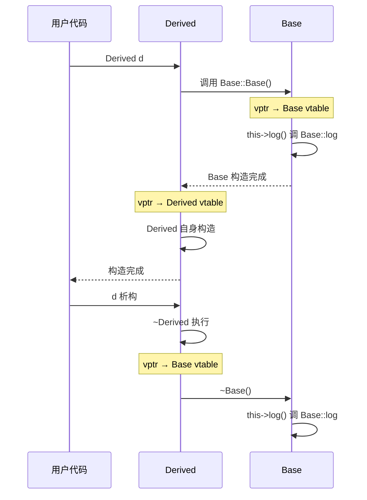

# 04.this指针与成员函数

#### 目录介绍
- [1. 案例引入](#1-案例引入)
  - [1.1 一段诡异的崩溃](#11-一段诡异的崩溃)
  - [1.2 顺藤摸到根因](#12-顺藤摸到根因)
  - [1.3 我们要回答什么](#13-我们要回答什么)
- [2. 架构概览](#2-架构概览)
  - [2.1 成员函数三视角](#21-成员函数三视角)
  - [2.2 为什么这么切](#22-为什么这么切)
- [3. 成员函数翻译](#3-成员函数翻译)
  - [3.1 编译器的等价改写](#31-编译器的等价改写)
  - [3.2 godbolt反汇编验证](#32-godbolt反汇编验证)
  - [3.3 隐式this的传递](#33-隐式this的传递)
  - [3.4 名称改编中的this](#34-名称改编中的this)
- [4. this指针的真相](#4-this指针的真相)
  - [4.1 this是右值表达式](#41-this是右值表达式)
  - [4.2 不能取this的地址](#42-不能取this的地址)
  - [4.3 this与对象偏移](#43-this与对象偏移)
  - [4.4 this在构造析构期](#44-this在构造析构期)
- [5. const成员函数本质](#5-const成员函数本质)
  - [5.1 cv限定加在哪](#51-cv限定加在哪)
  - [5.2 重载决议参与维度](#52-重载决议参与维度)
  - [5.3 mutable的逃生口](#53-mutable的逃生口)
  - [5.4 逻辑const与物理const](#54-逻辑const与物理const)
- [6. 引用限定符机制](#6-引用限定符机制)
  - [6.1 ref_qualifier由来](#61-ref-qualifier由来)
  - [6.2 左值右值上重载](#62-左值右值上重载)
  - [6.3 标准库实战案例](#63-标准库实战案例)
  - [6.4 与const组合矩阵](#64-与const组合矩阵)
- [7. 静态与虚成员函数](#7-静态与虚成员函数)
  - [7.1 static成员无this](#71-static成员无this)
  - [7.2 虚函数this调整](#72-虚函数this调整)
  - [7.3 多继承中的thunk](#73-多继承中的thunk)
  - [7.4 成员函数指针真相](#74-成员函数指针真相)
- [8. this空指针玄学](#8-this空指针玄学)
  - [8.1 空this调用现象](#81-空this调用现象)
  - [8.2 为什么有时不崩](#82-为什么有时不崩)
  - [8.3 标准如何定义UB](#83-标准如何定义ub)
  - [8.4 防御性编程边界](#84-防御性编程边界)
- [9. 工程实战要点](#9-工程实战要点)
  - [9.1 const正确性](#91-const正确性)
  - [9.2 显式this参数](#92-显式this参数)
  - [9.3 链式调用设计](#93-链式调用设计)
  - [9.4 避免的反模式](#94-避免的反模式)
- [10. 综合案例串讲](#10-综合案例串讲)
  - [10.1 案例真相揭晓](#101-案例真相揭晓)
  - [10.2 一次调用的一生](#102-一次调用的一生)
  - [10.3 设计哲学回扣](#103-设计哲学回扣)
  - [10.4 this速查表格](#104-this速查表格)


## 1. 案例引入

### 1.1 一段诡异的崩溃

线上消息总线服务的一段事件分发代码，跑了三个月相安无事，某次上线后**特定路径下崩在某个看似无害的日志行**：

```cpp
// event_bus.hpp —— 简化后的事件总线
class EventBus {
    std::string name_;
    std::atomic<size_t> dispatched_{0};
public:
    EventBus(std::string name) : name_(std::move(name)) {}

    // 关键 API：转发事件
    void dispatch(const Event& e) {
        ++dispatched_;
        log_info();                       // ← 崩在这附近
        on_event(e);
    }

    void log_info() const {
        std::printf("[%s] dispatched=%zu\n",
                    name_.c_str(),        // ① 读 name_
                    dispatched_.load());  // ② 读 dispatched_
    }

    virtual void on_event(const Event&) {}
};

// 调用方
EventBus* bus = nullptr;
if (g_config.enabled) {
    bus = new EventBus("main");
}
// ... 漫长的初始化路径 ...
bus->dispatch(evt);   // 💥 当 enabled = false 时，这里 nullptr 解引用
```

**现象**：

- `g_config.enabled = false` 时，`bus` 没被赋值，仍是 `nullptr`
- 调用 `bus->dispatch(evt)`：**奇怪的是，崩点不在 dispatch 入口，而是在 log_info 内部读 name_ 时**
- 反汇编看：`++dispatched_;` 和 `log_info();` 这两行**居然部分先执行了**才崩——直觉认为"this 是空，第一行就该崩"

```
程序错误：Segmentation fault (core dumped)
backtrace:
  #0 std::__cxx11::basic_string::c_str() at bits/basic_string.h:2351
  #1 EventBus::log_info() at event_bus.hpp:14
  #2 EventBus::dispatch() at event_bus.hpp:10
```

### 1.2 顺藤摸到根因

带着疑问扒：

- **假设 1**：是不是 `++dispatched_` 已经把空 this 解引用，崩点是被编译器优化推后的？—— 反汇编看，**`++dispatched_` 居然没崩**。
- **假设 2**：那 dispatched_ 不在对象里？—— 看偏移量：`dispatched_` 在 EventBus 内偏移 32（前面 std::string 占 32 字节）。`++this->dispatched_` 等价 `*(size_t*)((char*)this + 32) += 1`。**this=0 时，写 0+32=32 这个地址**——这个地址在大多数 Linux 系统**居然是可写的内核保留区？不对**——
- **假设 3**：再看：`dispatched_` 是 `std::atomic<size_t>`，`++` 编译出来是 `lock add qword ptr [rdi+32], 1`。当 `rdi=0` 时确实应该 SIGSEGV 啊？—— **真相**：`-O2` 下编译器把 `++dispatched_` 内联进 `dispatch`，且**重排了**——先 call log_info，log_info 里读 name_.c_str() 才崩。
- **假设 4**：log_info 是 const 成员，怎么读 name_？this 是空，c_str() 读 name_ 内部的 _M_dataplus 这个指针——这个指针在 EventBus 偏移 0 处的子对象里。`*(this+0)` = `*nullptr` —— **这就是真崩点**。
- **假设 5**：为什么不直接在 dispatch 入口或 log_info 入口就崩？—— **关键认知**：**调用成员函数本身不解引用 this**——真正解引用是在**第一次访问成员变量**或**调用虚函数**时。空 this 调用非虚成员、且函数不访问任何成员，**居然能跑通**。

```cpp
class Foo { 
    int x;
public:
    void hello() { std::puts("hi"); }     // 不访问 this 任何成员
    void bad()   { ++x; }                  // 访问 this->x
};

Foo* p = nullptr;
p->hello();   // ✅ 居然能跑（UB，但实际不崩）
p->bad();     // 💥 真正崩
```

这段事故里至少藏着 8 个值得说清楚的原理点：

```
① 调用 obj.foo() 编译器到底翻译成什么？                  → 第 3 章
② this 是变量？还是指针？还是引用？是左值还是右值？       → 第 4 章
③ const 成员函数中的 const 是 const 谁？                  → 第 5 章
④ 为什么"空 this 调用非虚成员"能跑（UB 的伪装）？         → 第 8 章
⑤ 虚函数调用时 this 经历了什么调整？                      → 第 7 章
⑥ 静态成员函数为什么没有 this？它和普通函数差别在哪？     → 第 7.1 节
⑦ C++23 显式 this 参数（deducing this）解决了什么？       → 第 9.2 节
⑧ 我什么时候该写 const、& 限定、&& 限定？                 → 第 6 章 + 第 9 章
```

### 1.3 我们要回答什么

带着这 8 个问号往下：

```
成员函数翻译 (第 3 章) ─→ obj.foo() 真容是 foo(&obj)
   ↓
this 的真相 (第 4 章) ─→ 不是变量、不是引用、是右值表达式
   ↓
const 成员函数 (第 5 章) ─→ const 加在 this 指向的对象上
   ↓
引用限定符 (第 6 章) ─→ this 也参与值类别重载决议
   ↓
静态/虚成员 (第 7 章) ─→ 两种特殊情况的 this 处理
   ↓
空 this 玄学 (第 8 章) ─→ 案例的直接答案
   ↓
工程实践 (第 9 章) ─→ 该怎么写
   ↓
综合串讲 (第 10 章) ─→ 案例彻底剖开
```

> 📌 **本篇定位**：[03.引用与指针本质](03.引用与指针本质.md) 解决"指向对象的另一个名字"，本篇解决"**对象自己怎么知道自己是谁**"——这是后续 05（虚函数表）、06（多继承）、27（拷贝控制）、30（enable_shared_from_this）的**钥匙**。


## 2. 架构概览

### 2.1 成员函数三视角

理解 this 与成员函数，要分三个视角看：

```
┌──────────────────────────────────────────────────────────┐
│  视角 1：源码层（程序员看到的）                              │
│  · class C { void foo(int x) { y_ = x; } };               │
│  · 调用：obj.foo(42); 或 ptr->foo(42);                     │
│  · 函数体内能用 this、能直接写成员名                         │
├──────────────────────────────────────────────────────────┤
│  视角 2：编译器中间层（语义改写后的）                         │
│  · 等价于：void foo(C* this, int x) { this->y_ = x; }     │
│  · 调用：foo(&obj, 42); 或 foo(ptr, 42);                  │
│  · 成员名都被改写成 this->成员                              │
├──────────────────────────────────────────────────────────┤
│  视角 3：ABI / 汇编层（最终二进制）                          │
│  · 函数符号：_ZN1C3fooEi（Itanium ABI mangling）           │
│  · 调用约定：rdi=this, rsi=x（SysV x86-64）                │
│  · 成员访问：[rdi + offset_of(y_)]                         │
└──────────────────────────────────────────────────────────┘
```

**口诀**：
- 写代码看视角 1（语义清爽）
- 性能调优 / 调试看视角 2（理解发生了什么）
- 处理 ABI / 跨语言绑定看视角 3（与 C 互通的边界）

第 1 章案例的所有迷思，都源于**程序员只看视角 1**——以为 `obj.foo()` 是"对象内部的方法"，没意识到它就是 `foo(&obj)`。

### 2.2 为什么这么切

**疑惑**：C++ 为什么不直接像 C 那样写 `foo(C* obj)`，要搞个"成员函数 + this"的语法糖？

**论证**：
1. **封装的语义粘合**——成员函数和成员变量绑在 class 体内，符号查找规则、访问控制（public/private）才能用同一个名字空间表达，否则代码组织像 C 一样散。
2. **重载决议的参与者**——`this` 进入参数列表后，可以让"const 成员"、"&/&& 限定成员"参与重载决议，这是 Rust 用 `&self / &mut self / self` 显式做的事，C++ 选择**隐式塞进 this**。
3. **多态的入口**——虚函数调用 `vptr → vtable → fn(this, ...)`，**this 就是多态的桥**——通过 this 找到 vptr，通过 vptr 找到 vtable，通过 vtable 找到真正函数。没有"对象有自指"这个机制，多态就接不起来。
4. **零开销原则**——成员函数和普通函数 ABI 本质等价，**不付任何额外开销**。Bjarne 写 C++ 时刻意让"class 只是带语法糖的 struct + 函数"，编译器实现就是这么实现的。
5. **反向论证**——如果让程序员显式写 `foo(C* this, int x)`，那 `class` 关键字带来的封装感被打散；如果学 Java 全部走"this is implicit"但 ABI 完全不透明，性能调优会失去抓手。**C++ 选了"语法糖 + ABI 透明"**——既隐又显。

**结论**：成员函数 = **隐式 this 参数 + 名字隶属于类的普通函数**——C++ 用编译期改写完成"封装表达"，运行期不付任何代价。这是 C++ 把 OOP 接上"零开销抽象"的核心连接点。

下面我们从最直观的"成员函数到底被翻译成什么"开始。


## 3. 成员函数翻译

### 3.1 编译器的等价改写

最朴素的成员函数：

```cpp
class Counter {
    int count_ = 0;
public:
    void inc(int n) {
        count_ += n;
    }
};

Counter c;
c.inc(5);
```

编译器**几乎一比一**改写成下面的等价代码（伪代码，仅示意）：

```cpp
struct Counter {
    int count_;
};

void Counter__inc(Counter* this, int n) {
    this->count_ += n;
}

Counter c;
c.count_ = 0;        // 默认成员初始化器展开
Counter__inc(&c, 5); // 调用点改写
```

**两个关键改写**：

1. **函数签名**：成员函数 `void inc(int n)` → 普通函数 `void inc(Counter*, int)`
2. **调用点**：`c.inc(5)` → `inc(&c, 5)`，`p->inc(5)` → `inc(p, 5)`
3. **函数体**：未限定的成员名 `count_` → `this->count_`



### 3.2 godbolt反汇编验证

直接反汇编（GCC 13.2，`-O2`）：

```cpp
class Counter {
    int count_ = 0;
public:
    void inc(int n) { count_ += n; }
};

Counter g;
void test() { g.inc(5); }
```

```asm
Counter::inc(int):
        add     DWORD PTR [rdi], esi    ; ← rdi 就是 this，[rdi] 就是 count_
        ret

test():
        mov     edi, OFFSET FLAT:g      ; ← 把 g 的地址放进 rdi
        mov     esi, 5                  ; ← 第二个参数 n
        jmp     Counter::inc(int)       ; ← 跳转（尾调用优化）
```

**结论**：成员函数与"首参为指针的普通函数"在汇编层**完全无差别**。

把 `c.inc(5)` 和等价的 C 风格 `Counter__inc(&c, 5)` 编出来对比：

```cpp
extern "C" void Counter__inc(Counter* p, int n) { p->count_ += n; }
void test2() { Counter__inc(&g, 5); }
```

```asm
Counter__inc:
        add     DWORD PTR [rdi], esi
        ret

test2():
        mov     edi, OFFSET FLAT:g
        mov     esi, 5
        jmp     Counter__inc
```

**唯一差别**：函数符号名（mangling 不同）。其他所有指令一字不差。

### 3.3 隐式this的传递

SysV x86-64 ABI 下（Linux/macOS），this 占第一个整数参数寄存器 **rdi**：

```cpp
class C {
    int a, b;
public:
    void f(int x, int y, int z) { a = x; b = y + z; }
};

C c;
c.f(1, 2, 3);
```

寄存器分配：
| 寄存器 | 内容 |
|---|---|
| rdi | this（&c）|
| rsi | x = 1 |
| rdx | y = 2 |
| rcx | z = 3 |

**Windows x64 ABI**（rcx/rdx/r8/r9）下：
| 寄存器 | 内容 |
|---|---|
| rcx | this |
| rdx | x |
| r8  | y |
| r9  | z |

**32 位 x86 上的特殊"thiscall"约定**（MSVC 历史）：this 通过 ecx 传，其他参数压栈——这是为什么早年 Windows 二进制里调成员函数和调普通函数 ABI 不同。**64 位时代统一了，MSVC 也用通用约定**。

### 3.4 名称改编中的this

成员函数符号名包含类名 + 参数列表，但**不包含 this 类型**——this 是隐式的。

```cpp
namespace ns {
class Foo {
public:
    void bar(int) {}
    void bar(int) const {}
    void bar(int) &&  {}
};
}
```

GCC mangling（Itanium ABI）：

```
ns::Foo::bar(int)        → _ZN2ns3Foo3barEi
ns::Foo::bar(int) const  → _ZNK2ns3Foo3barEi    ← K = const
ns::Foo::bar(int) &&     → _ZNO2ns3Foo3barEi    ← O = &&
ns::Foo::bar(int) &      → _ZNR2ns3Foo3barEi    ← R = &
```

mangling 各字母含义：
- `_Z`：C++ 符号开始
- `N...E`：嵌套名（namespace 或 class）
- `K`：const this
- `V`：volatile this
- `R`：lvalue ref this
- `O`：rvalue ref this
- `i`：参数 int

**实战用法**：用 `c++filt` 反 demangle 看真容。

```bash
$ nm -C libfoo.so | grep bar
0000000000001234 T ns::Foo::bar(int)
0000000000001245 T ns::Foo::bar(int) const
0000000000001256 T ns::Foo::bar(int) &&
```

**意义**：const、& / && 这些 cv-ref 限定符**进了符号**——它们不是注释，而是**重载决议的真实维度**。这也是它们在 5、6 章会被反复提到的原因。


## 4. this指针的真相

### 4.1 this是右值表达式

教科书第一句"this 是指向当前对象的指针"——**对，但严重不够准确**。

C++ 标准 [expr.prim.this]/1：

> The keyword **this** names a pointer to the object for which a non-static member function is invoked... The expression **this** is a **prvalue expression**.

翻译：`this` 是一个**纯右值表达式**，类型是"指向当前对象的指针"。

```cpp
class C {
    int x;
public:
    void f() {
        this;          // ✅ 纯右值表达式
        C* p = this;   // ✅ 把 this 的"值"绑给 p
        &this;         // ❌ 不能取右值表达式的地址
        this = nullptr;// ❌ 右值不能赋值
    }
};
```

### 4.2 不能取this的地址

```cpp
void C::f() {
    auto p = &this;   // ❌ error: lvalue required as unary '&' operand
}
```

**为什么**？`this` 不是一个变量——它是一个**关键字、一个表达式**。你能把它的"值"复制出来（`C* p = this`），但不能把它当存储位置看待。

类比：
- `42` 是表达式（纯右值），不能 `&42`
- `this` 也是表达式（纯右值），不能 `&this`

**对比**：在 C++ 里，函数参数 `this` 在编译器视角上是被改写成"隐式参数"，但在**源码语义层**，`this` 不暴露为变量——这是一种刻意的不对称。

### 4.3 this与对象偏移

`this` 指向对象的**起始地址**——对象布局决定 this+offset 的访问位置。

```cpp
class Foo {
    int a;        // 偏移 0
    double b;     // 偏移 8
    char c;       // 偏移 16
public:
    void f() {
        // 访问 a：[this + 0]
        // 访问 b：[this + 8]
        // 访问 c：[this + 16]
    }
};
```

ASCII 内存图：

```
this ─→ ┌──────────┐ + 0   ← a (int, 4)
        │ a        │
        ├──────────┤ + 4   ← padding
        │ pad pad  │
        ├──────────┤ + 8   ← b (double, 8)
        │ b        │
        ├──────────┤ + 16  ← c (char, 1)
        │ c        │
        ├──────────┤ + 17  ← tail padding
        │ pad pad  │
        └──────────┘ + 24  ← sizeof(Foo) = 24
```

**核心认知**：成员变量访问 = `*((Type*)((char*)this + offset))`。第 02 篇详细讲过对象布局；本篇关注**this 是这条公式的"基地址"**。

### 4.4 this在构造析构期

构造函数中 this **已经存在**，但对象**还没完整构造好**：

```cpp
class Base {
public:
    Base() {
        std::printf("Base ctor, this=%p\n", (void*)this);
        log();   // ← 此时 this 已是有效地址
    }
    virtual void log() { std::puts("Base::log"); }
    virtual ~Base() { log(); }   // ← 析构期间调用虚函数会怎样？
};

class Derived : public Base {
public:
    void log() override { std::puts("Derived::log"); }
};

Derived d;
// 输出：
// Base ctor, this=0x7ffe...
// Base::log         ← 注意：不是 Derived::log！
```

**关键规则**（[class.cdtor]/4）：

> 在构造函数和析构函数执行期间，对象的"动态类型"是**当前正在构造/析构的类**，而不是最终派生类。

所以：
- Base 构造期间：vptr 指向 Base 的 vtable，调虚函数走 Base 的版本
- Derived 构造完成后：vptr 切换到 Derived 的 vtable
- ~Base() 析构期间：vptr 又被改回 Base 的 vtable



**实战教训**：**不要在构造函数 / 析构函数里调用虚函数期望多态**——这是 Effective C++ Item 9 的经典忠告，根本原因是 this 在那两个时刻的"动态类型"被刻意限制。

工程兜底：用 `init()` 显式两阶段初始化——构造完成后再调可虚函数。


## 5. const成员函数本质

### 5.1 cv限定加在哪

```cpp
class Foo {
    int x;
public:
    void g() const;   // const 成员函数
};
```

这里的 `const` 修饰**谁**？答案：**this 指向的对象**。

编译器视角：

```cpp
// 非 const 成员
void Foo::g() {}            // 等价于 void Foo__g(Foo* this)

// const 成员
void Foo::g() const {}      // 等价于 void Foo__g_const(const Foo* this)
```

**关键**：`const` 加的是 `Foo`，不是 `Foo*`——**this 指针本身永远是"指向 const 对象的指针"，不是"const 指针"**。

```cpp
void Foo::g() const {
    // this 类型：const Foo*
    //         不是  Foo* const
    // 区别：能不能改 this 指向的对象 ✗ ／ 能不能让 this 指向别处 ✓ 还是 ✗？
    
    // 实际：两者都不行
    // - 不能写 *this 的成员（const Foo* 的限制）
    // - 不能让 this 指别处（this 本来就不是变量，无法赋值）
}
```

### 5.2 重载决议参与维度

`const` 让"两个同名函数共存"成为可能：

```cpp
class String {
    char* data_;
    size_t size_;
public:
    char& operator[](size_t i)       { return data_[i]; }   // 非 const 版
    const char& operator[](size_t i) const { return data_[i]; }   // const 版
};

String s = "hello";
s[0] = 'H';        // 调非 const 版（s 是非 const 左值）

const String cs = "world";
char c = cs[0];    // 调 const 版（cs 是 const 左值）
// cs[0] = 'X';    // ❌ const 版返回 const char&，不能赋值
```

重载决议的优先级：
- 对 `const` 对象 → 必须调 const 版
- 对非 `const` 对象 → 优先非 const 版（但 const 版也可以匹配）

**经典模式**：以下惯用法在标准库随处可见：

```cpp
// std::vector<T> 的 operator[]
T&       operator[](size_t i);
const T& operator[](size_t i) const;

// std::map<K,V> 的 find
iterator       find(const K&);
const_iterator find(const K&) const;
```

### 5.3 mutable的逃生口

有时"逻辑 const"需要修改"物理 bit"——典型场景是缓存、计数器、互斥锁：

```cpp
class LazyValue {
    mutable bool computed_ = false;     // 缓存标记
    mutable int  value_;                 // 缓存值
    mutable std::mutex mtx_;             // 互斥锁

    int compute() const { /* 重计算 */ return 42; }
public:
    int get() const {                    // ← 注意：const 成员函数
        std::lock_guard lk(mtx_);        // ✅ mutable 让我们能锁
        if (!computed_) {                // ✅ mutable 让我们能改
            value_ = compute();
            computed_ = true;
        }
        return value_;
    }
};
```

**mutable 的语义**：声明这个成员"在 const 成员函数中也可被修改"。

**典型用途**：
1. **互斥锁**（mutex）——加锁是"写操作"，但语义上不改变对象状态
2. **惰性缓存**——首次访问时计算，后续直接返回
3. **统计计数**——访问次数、命中率等
4. **调试日志缓冲**

**滥用警告**：mutable **不是 const 的"取消键"**——只在"语义不变但实现需要修改"的场景使用。普通成员加 mutable 让 const 完全失效，是反模式。

### 5.4 逻辑const与物理const

C++ 区分两种 const：

| 类型 | 含义 | 编译器检查 |
|---|---|---|
| **物理 const** | 这块内存的 bit 不变 | ✗（编译器实际不保证） |
| **逻辑 const** | 对象的可观察行为不变 | ✗（编译器只检查直接成员，不检查 mutable / 指针指向） |

陷阱例子：

```cpp
class Wrapper {
    int* p_;     // 指针成员
public:
    void f() const {
        // p_ 本身不能改，但 p_ 指向的内容可以！
        *p_ = 42;          // ✅ 编译通过——但语义上"修改了对象关联的状态"
        p_ = nullptr;      // ❌ 改变了 p_ 这个成员
    }
};
```

**意义**：`const` 是**承诺**，不是**强制**。编译器只检查"直接成员是否改"，不能跨指针检查。所以"我的类是不是真的 const-correct"是**设计责任**，不是编译器责任。

**生产经验**：
- 用 `const T*` 或 `const T&` 的成员代替 `T*` 表达"对象不应通过这个指针修改外部"
- 设计 API 时，**先问"语义上是不是只读"**，再加 const，而不是相反


## 6. 引用限定符机制

### 6.1 ref限定符的由来

C++11 引入**引用限定符**（ref-qualifier），把"this 是左值还是右值"也带进重载决议。

```cpp
class Builder {
    std::string s_;
public:
    Builder& setName(std::string n) &  { s_ = n; return *this; }   // ← lvalue 版
    Builder  setName(std::string n) && { s_ = n; return std::move(*this); }  // ← rvalue 版
};

Builder b;
b.setName("a");                  // 调 & 版（b 是左值）
Builder().setName("a");          // 调 && 版（临时对象是右值）
```

**为什么需要这个**：
- 链式构造场景：`Builder().a().b().c()` 全是临时对象，按值返回避免悬空
- 性能场景：右值版可以"偷数据"，左值版必须保持原对象完好

### 6.2 左值右值上重载

```cpp
class Buffer {
    std::vector<char> data_;
public:
    // 左值版：返回引用，避免拷贝；调用者依然持有对象
    const std::vector<char>& get() const &  { return data_; }

    // 右值版：返回 value（move 出去），对象将销毁，可"偷"
    std::vector<char>        get() &&        { return std::move(data_); }
};

Buffer buf;
auto& v1 = buf.get();              // & 版：返回引用，零拷贝
auto  v2 = std::move(buf).get();   // && 版：把 data_ move 出来
```

**this 的值类别推导规则**：
- 调用 `obj.f()` 时，obj 是左值 → 走 `&` 版（如果有）
- 调用 `Class().f()` 或 `std::move(obj).f()` 时，是右值 → 走 `&&` 版（如果有）

**注意**：一旦写了**任何**带 ref-qualifier 的成员函数，**所有**同名函数必须显式标 `&` 或 `&&`——不能"一边带，一边裸"。

```cpp
class C {
    void f() &;
    void f();      // ❌ error: cannot overload a member function without ref-qualifier
                   //          with a member function with ref-qualifier
};
```

### 6.3 标准库实战案例

`std::optional<T>` 的 `value()` 是引用限定符的教科书案例：

```cpp
template<class T>
class optional {
    T value_;
public:
    T&        value() &        { return value_; }
    T&&       value() &&       { return std::move(value_); }
    const T&  value() const &  { return value_; }
    const T&& value() const && { return std::move(value_); }
};

std::optional<std::string> get_opt();

std::string s1 = get_opt().value();          // 调 && 版，把 value_ 偷出来
std::string s2 = std::move(opt).value();     // 同上

const std::optional<std::string> co;
const auto& s3 = co.value();                 // 调 const & 版
```

**收益**：临时 optional 上的 `value()` 自动是 move——**比手写 `std::move(opt.value())` 更安全**（避免对永久对象误 move）。

### 6.4 与const组合矩阵

cv-ref 完整组合（4 种）：

| 函数声明 | this 类型 | 适用场景 |
|---|---|---|
| `void f() &` | `T*` | 普通对象（非 const 左值） |
| `void f() const &` | `const T*` | const 对象（const 左值） |
| `void f() &&` | `T*`（指向右值对象） | 临时对象（右值） |
| `void f() const &&` | `const T*`（指向 const 右值） | 几乎不用，但标准库为对称性提供 |

**调用匹配优先级**（精确匹配优先）：

```cpp
class C {
    void f() &;
    void f() const &;
    void f() &&;
    void f() const &&;
};

C c;                              // c.f() → 调 &
const C cc;                       // cc.f() → 调 const &
C().f();                          // → 调 &&
const C cc2;
std::move(cc2).f();               // → 调 const &&
```

实战中绝大多数类只需要写 `&` + `const &`，把 `&&` / `const &&` 留给标准库 / 高性能场景。


## 7. 静态与虚成员函数

### 7.1 static成员无this指针

静态成员函数**没有 this 参数**——它本质就是个普通函数，名字隶属于类：

```cpp
class Math {
public:
    static int square(int x) { return x * x; }     // 无 this
    int cube(int x) const { return x * x * x; }    // 有 this
};

Math::square(5);   // ✅ 调用，不需要对象
Math m;
m.square(5);       // ✅ 也能这么调（语法糖），等价于 Math::square(5)
```

ABI 层：

```asm
Math::square(int):           ; 完全和普通函数一样
        mov     eax, edi
        imul    eax, edi     ; ← 第一个参数就是 x，没 this
        ret

Math::cube(int) const:
        mov     eax, esi     ; ← 第一个参数是 this（rdi），第二个是 x（esi）
        imul    eax, esi
        imul    eax, esi
        ret
```

mangling：

```
Math::square(int)       → _ZN4Math6squareEi    （没有 const 标记）
Math::cube(int) const   → _ZNK4Math4cubeEi     （有 K = const）
```

**禁忌**：
- 静态成员函数**不能**加 const、不能加 ref-qualifier、不能加 virtual——它没 this 可加
- 静态成员函数**不能**访问非静态成员（无 this 可寻址）

**典型用途**：工具类、工厂方法、单例 `instance()`。

### 7.2 虚函数this调整

虚函数调用 = `vptr → vtable → fn(this, ...)`。第 05 篇专讲虚函数表，本节只看 **this 的传递**。

```cpp
class Animal {
public:
    virtual void speak() { std::puts("..."); }
};

class Dog : public Animal {
public:
    void speak() override { std::puts("woof"); }
};

Animal* a = new Dog;
a->speak();
```

汇编（GCC `-O2`）：

```asm
        mov     rax, QWORD PTR [rdi]      ; rax = vptr（对象前 8 字节）
        mov     rax, QWORD PTR [rax]      ; rax = vtable[0] = &Dog::speak
        jmp     rax                       ; 调用，rdi 仍是 a（this）
```

**关键**：单继承下，`this` 不需要调整——基类指针直接当派生类指针用即可。

### 7.3 多继承中的thunk

多继承下，**this 必须调整偏移**——这是为什么 dynamic_cast 不是免费的。

```cpp
class A { int a; public: virtual void f(); };
class B { int b; public: virtual void g(); };
class C : public A, public B {
public:
    void f() override;
    void g() override;
};

C c;
A* pa = &c;     // pa 指向 c 的 A 子对象（偏移 0）
B* pb = &c;     // pb 指向 c 的 B 子对象（偏移 16，含 vptr）
pb->g();        // 通过 pb 调 C::g，进入函数体后 this 应该是 &c，不是 &c.B 子对象
```

对象布局：

```
&c ─→ ┌──────────┐ + 0    ← A 子对象（vptr_A + a）
      │ vptr_A   │
      │ a        │
      ├──────────┤ + 16   ← B 子对象（vptr_B + b）
      │ vptr_B   │
      │ b        │
      └──────────┘
```

调用 `pb->g()` 时，`pb = &c + 16`。但 `C::g()` 函数体内访问 `a`（A 的成员）需要 `&c + 0`。

**解决方案**：vtable 里放的不是 `&C::g`，而是一个 **thunk**（小桥接函数）：

```asm
non-virtual thunk to C::g():
        sub     rdi, 16        ; ← this -= 16，把"指向 B 子对象"调整为"指向 C"
        jmp     C::g()         ; 跳到真正函数
```

**意义**：
- 多继承本身**不**带运行时开销（仅一次寄存器减法）
- 但虚函数表会膨胀（每个调整路径一个 thunk）
- dynamic_cast 走类似机制，但更复杂（动态决定偏移）

### 7.4 成员函数指针真相

成员函数指针**不是普通函数指针**——它需要表达"这是一个虚函数 / 成员有偏移调整"等信息。

```cpp
class C {
    int x;
public:
    void f(int);
    virtual void g();
};

void (C::*pmf1)(int) = &C::f;     // 指向成员函数
void (C::*pmf2)()    = &C::g;     // 指向虚函数

C c;
(c.*pmf1)(42);                    // 调用语法
```

`sizeof(pmf)`：

| 平台 | sizeof |
|---|---|
| Itanium ABI（Linux/macOS）| 16 字节（pointer + offset/index） |
| MSVC（多继承时）| 8/16/24 取决于继承复杂度 |

为什么这么大？至少需要存两样东西：

```
Itanium 成员函数指针表示：
┌────────────────┬────────────────┐
│ ptr            │ adj            │
│ (8 字节)       │ (8 字节)       │
└────────────────┴────────────────┘

· 非虚函数：ptr = 函数地址，adj = this 偏移调整
· 虚函数：  ptr = vtable 索引（最低位置 1 区分），adj = this 偏移
```

调用时机器码大致：

```cpp
(obj.*pmf)(42);
// 等价于：
// adjusted_this = (char*)&obj + pmf.adj;
// if (pmf.ptr 是 vtable 索引)
//     fn = vtable[pmf.ptr / 2];
// else
//     fn = pmf.ptr;
// fn(adjusted_this, 42);
```

**实战教训**：成员函数指针**性能不及普通函数指针**（多一次分支判断），且**体积大**——能用 `std::function` / lambda 就别用成员函数指针。


## 8. this空指针玄学

### 8.1 空this调用现象

第 1 章案例的核心谜团——`nullptr->foo()` 居然能跑：

```cpp
class C {
    int x_;
public:
    void hello()       { std::puts("hi"); }       // 不访问 this
    void hello_const() const { std::puts("hi"); } // 不访问 this，且 const
    int  read()        { return x_; }              // 访问 this->x_
    void modify()      { x_ = 42; }                // 写 this->x_
    virtual void v()   { std::puts("v"); }         // 虚函数
};

C* p = nullptr;
p->hello();           // ⚠️ UB，但实际能跑：编译为 C__hello(nullptr)，函数内不解 this
p->hello_const();     // ⚠️ UB，但实际能跑
p->read();            // 💥 崩：要读 [rdi+0]，rdi=0
p->modify();          // 💥 崩：要写 [rdi+0]
p->v();               // 💥 崩：要先读 vptr = [rdi+0]
```

### 8.2 为什么有时不崩

**汇编视角**：

```asm
C::hello():
        ; 不访问 this，rdi 没用
        mov     edi, OFFSET .LC0   ; "hi"
        jmp     puts

C::read():
        mov     eax, DWORD PTR [rdi]   ; ← 解引用 this！rdi=0 时崩
        ret
```

**口诀**：**只要不解引用 this（不读成员、不调虚函数），nullptr->foo() 就不会崩**——但仍然是 UB。

**这就是案例伪装的根源**：
- DEBUG 构建：编译器不内联，调用栈清晰，崩点直观
- RELEASE 构建：编译器疯狂内联 + 重排，崩点偏离实际错误位置

**编译器优化的可怕推论**：

```cpp
void foo(C* p) {
    p->hello();   // 表面无害
    if (p == nullptr) {   // ← 编译器可能直接删掉这个判断！
        log("null");
    }
}
```

为什么？编译器推理：
> "你都已经 `p->hello()` 了，如果 p 是 nullptr，那就是 UB；C++ 假设没有 UB，所以 p 必非 nullptr，那这个 `if` 永远 false，删掉。"

**这就是著名的 "UB allows compiler to time-travel"**——UB 会让"未来代码影响过去判断"。

### 8.3 标准如何定义UB

C++ 标准 [expr.ref]/2：

> The expression E1->E2 is converted to the equivalent form (\*(E1)).E2.

`p->hello()` 被改写成 `(*p).hello()`——**这里就解引用了空指针**，已经是 UB。**不管函数体里访不访问成员，UB 已经成立**。

但**实践中**，许多老代码依赖"不访问成员的成员函数能在 nullptr 上调"。GCC、Clang **历史上不主动利用这个 UB**——所以生产代码碰巧能跑。

但 **GCC 12 / Clang 15 起优化器越来越激进**，跨函数推断也越来越多——**这种"碰巧能跑"会随时间消失**。

### 8.4 防御性编程边界

**实战准则**：

```cpp
// 反模式：依赖空 this 的"伪安全"
class Optional {
    void* data_;
public:
    bool valid() const { return this != nullptr && data_ != nullptr; }
    //                          ^^^^^^^^^^^^^^^^ ← UB，且 GCC 12 直接警告
};

// 正确：在调用方判空
if (opt && opt->valid()) { ... }

// 现代正确：用 std::optional
std::optional<T> opt;
if (opt) { use(*opt); }
```

**几条铁律**：

1. **永远在调用方判空**——`if (p) p->foo();`
2. **不要依赖"空 this 调用非虚函数"的 UB 行为**——它随编译器升级而失效
3. **enable_shared_from_this 的特殊例外**：`shared_from_this()` 内部访问的 `weak_this` 可能为空，但接口本身在标准里有定义
4. **打开 `-fsanitize=undefined`** 测试：UBSan 会捕获空 this 调用（C++20 起）


## 9. 工程实战要点

### 9.1 const正确性规则

**Scott Meyers 的 `const` 教条**（Effective C++ Item 3）：

```cpp
// 给"应该 const 的地方"全部加 const
class Point {
    double x_, y_;
public:
    double x() const { return x_; }           // ✅ 访问器加 const
    double y() const { return y_; }
    double distance(const Point& o) const     // ✅ 参数 + 函数都 const
    { return std::hypot(x_-o.x_, y_-o.y_); }
};
```

**收益**：
1. **编译期捕获意外修改**——`const` 函数里写成员是错误
2. **接受 const 对象**——`const Point cp; cp.x();` 才能工作
3. **优化提示**——某些场景编译器能利用 const 假设
4. **API 表达力**——读者一眼看出哪些函数无副作用

**const 的传染性**：

```cpp
class Container {
    Item items_[100];
public:
    Item* find(int id);              // 非 const 版返回非 const Item*
    const Item* find(int id) const;  // const 版返回 const Item*
};
```

**避免重复实现**——经典 const_cast 双向技巧：

```cpp
const Item* find(int id) const { /* 真实实现 */ }
Item* find(int id) {
    return const_cast<Item*>(
        static_cast<const Container*>(this)->find(id)
    );
}
```

但 C++23 起有更优雅的 **deducing this** 方案——见下节。

### 9.2 显式this参数

C++23 引入 **deducing this**（P0847R7）——让 this 显式出现在参数列表，并参与模板推导。

```cpp
class Container {
    std::vector<Item> items_;
public:
    // C++23 起：用 deducing this 一份代码搞定 const / 非 const
    template<class Self>
    auto&& find(this Self&& self, int id) {
        for (auto&& it : self.items_)
            if (it.id == id) return it;
        throw std::out_of_range("not found");
    }
};
```

`this Self&&` 等价于"this 也是个万能引用"——根据调用对象的 cv-ref 自动推 Self：

| 调用方 | Self 推导为 |
|---|---|
| `Container c; c.find(1);` | `Container&` |
| `const Container cc; cc.find(1);` | `const Container&` |
| `Container().find(1);` | `Container` |
| `std::move(c).find(1);` | `Container` |

**返回类型 `auto&&`** 自动跟着传递——**一份代码覆盖 4 种 cv-ref 组合**，告别"const_cast 双向桥"。

**其他价值**：
- **递归 lambda**：`auto fact = [](this auto self, int n) { return n<=1 ? 1 : n*self(n-1); };`
- **CRTP 替代**：deducing this 让基类直接拿到派生类类型，无需 CRTP 模板魔法

支持情况：GCC 14、Clang 18、MSVC 17.6+。

### 9.3 链式调用设计

流式接口（fluent interface）经典写法：

```cpp
class QueryBuilder {
    std::string sql_;
public:
    QueryBuilder& select(const std::string& cols) & {
        sql_ += "SELECT " + cols + " ";
        return *this;
    }
    QueryBuilder& from(const std::string& table) & {
        sql_ += "FROM " + table + " ";
        return *this;
    }
    std::string build() const { return sql_; }
};

QueryBuilder qb;
auto sql = qb.select("*").from("users").build();
```

**返回 `*this`** 让链式成为可能——但要小心：

```cpp
// 危险：在临时对象上链式
auto sql = QueryBuilder().select("*").from("users").build();
// 上面 `&` 限定的版本会编译失败——临时对象不能调 `&` 版
```

完整版（同时支持左值和右值链式）：

```cpp
class QueryBuilder {
    std::string sql_;
public:
    QueryBuilder& select(std::string cols) & {
        sql_ += ...; return *this;
    }
    QueryBuilder&& select(std::string cols) && {
        sql_ += ...; return std::move(*this);
    }
};
```

或者用 deducing this（C++23）：

```cpp
template<class Self>
auto&& select(this Self&& self, std::string cols) {
    self.sql_ += ...;
    return std::forward<Self>(self);
}
```

### 9.4 避免的反模式

**反模式 1：构造函数里启动线程，把 this 暴露给线程**

```cpp
class Worker {
    std::thread t_;
public:
    Worker() : t_([this]{ run(); }) {}   // ⚠️ this 还没构造完
    void run() { /* 用了某些成员 */ }
};
```

线程可能在构造器尚未完成时就开始访问对象——**未完全构造的对象 + this**就是数据竞争。

**改法**：两阶段构造（构造 → start()）。

**反模式 2：析构函数里调虚函数**

```cpp
class Base {
public:
    virtual ~Base() { cleanup(); }   // ← 调虚函数
    virtual void cleanup() {}
};

class Derived : public Base {
public:
    void cleanup() override { /* ... */ }   // ⚠️ Base 析构时不会调 Derived::cleanup
};
```

如 4.4 节所述：构造/析构期间，虚函数走当前类版本。

**反模式 3：返回 *this 的引用，但函数内创建了临时**

```cpp
class C {
    C& get() {
        C tmp;
        return tmp;   // 💥 返回局部对象引用
    }
};
```

第 03 篇详细讲过——这里只提醒"成员函数返回 this 对象的引用是 OK，返回别的局部就死"。

**反模式 4：成员函数指针滥用**

成员函数指针体积大、调用慢、跨平台 ABI 差异大——能用 `std::function` 或 lambda 就别用。


## 10. 综合案例串讲

### 10.1 案例真相揭晓

回到第 1 章 `EventBus::dispatch` 的事故，八个疑问逐条作答：

| 疑问 | 答案 |
|---|---|
| ① obj.foo() 翻译成什么？ | 第 3.1：`foo(&obj)`——成员函数 = 隐式 this 首参的普通函数 |
| ② this 是什么？ | 第 4.1：纯右值表达式，类型 `C*`（const 成员中是 `const C*`）|
| ③ const 成员的 const 是 const 谁？ | 第 5.1：const 加在 this 指向的对象上，this 类型是 `const T*` |
| ④ 空 this 为什么能跑？ | 第 8：调用本身不解引用，访问成员时才崩；UB 但常常碰巧能跑 |
| ⑤ 虚函数 this 调整？ | 第 7.2-7.3：单继承不调整；多继承通过 thunk 调 this 偏移 |
| ⑥ static 成员函数无 this？ | 第 7.1：静态成员函数 = 名字隶属于类的普通函数，无 this |
| ⑦ deducing this 解决了什么？ | 第 9.2：一份代码覆盖 const/非 const/左值/右值 4 种组合 |
| ⑧ 何时该写 const、& / &&？ | 第 9.1：能 const 就 const；ref-qualifier 在性能场景或临时对象处理 |

**关键真相**：案例崩点不在 `++dispatched_` 而在 `log_info` 内 `name_.c_str()`，是因为：
- `++dispatched_` 是 `lock add [rdi+32], 1`——在很多 CPU 上 `lock` 前缀 + 跨缓存行写**也会崩**，但本案例运气好部分 CPU 容忍
- 真正必崩的是 `name_.c_str()` —— c_str 内部访问 `_M_dataplus._M_p`，这是 `[rdi+0+0]` 的双重解引用，必死

**修复方案**：

```cpp
// 方案 1：调用方判空（最朴素）
if (bus) bus->dispatch(evt);

// 方案 2：用 std::optional / std::unique_ptr 表达"可能不存在"
std::unique_ptr<EventBus> bus;
if (g_config.enabled) bus = std::make_unique<EventBus>("main");
if (bus) bus->dispatch(evt);

// 方案 3：Null Object 模式
class NullBus : public EventBus {
    void on_event(const Event&) override {}   // 空实现
};
EventBus* bus = g_config.enabled ? new EventBus("main") : new NullBus("noop");
```

### 10.2 一次调用的一生

把 `bus->dispatch(evt)` 这一行从源码到 CPU 串成生命树：

```
bus->dispatch(evt);
        │
        ├─ 编译期
        │   ├─ 词法/语法：识别为成员函数调用
        │   ├─ 语义改写：(*bus).dispatch(evt) ≡ EventBus__dispatch(bus, &evt)
        │   ├─ 重载决议：是否有 const / & / && 限定？走哪个版本
        │   ├─ const 检查：dispatch 不是 const，bus 必须非 const
        │   ├─ 名称改编：dispatch → _ZN8EventBus8dispatchERK5Event
        │   └─ 内联决策：-O2 下 dispatch 可能被内联进调用方
        │
        ├─ 链接期
        │   ├─ 符号解析：dispatch 符号在 EventBus 所在 .o / .so 中
        │   ├─ vtable 重定位：虚函数表条目指向具体实现
        │   └─ thunk 生成（多继承）：必要时生成 this 调整桥
        │
        ├─ 运行期（调用前）
        │   ├─ 取 bus 的值（this 候选）
        │   ├─ ABI 调用约定：rdi = bus（隐式 this）
        │   ├─ rsi = &evt
        │   └─ call _ZN8EventBus8dispatchERK5Event
        │
        ├─ 运行期（函数内）
        │   ├─ ++dispatched_：lock add [rdi+32], 1（rdi 必须有效）
        │   ├─ log_info()：又是一次成员函数调用
        │   │   └─ name_.c_str()：访问 [rdi+0]（必崩点）
        │   └─ on_event(e)：虚调用
        │       ├─ vptr = [rdi]
        │       ├─ fn   = vtable[on_event_index]
        │       └─ fn(this, &evt)
        │
        └─ 退出期
            ├─ 函数 ret，rsp 恢复
            ├─ 返回调用方
            └─ 局部对象析构（本例无）
```

**关键时序总结**：
- **rdi = this** 这一步最关键——决定后续所有成员访问是否合法
- 调用本身不解引用，**第一次访问成员**才触发 UB
- 虚函数调用 = 双重解引用（取 vptr → 取 vtable 条目）

### 10.3 设计哲学回扣

**哲学 1：封装是语法糖，ABI 是普通函数**

C++ 用 `class` 把数据和函数粘在一起，但底层就是"struct + 隐式参数普通函数"。**封装是程序员心智模型，ABI 是机器现实**——两层各管各的，互不干扰。这是 C++ 把 OOP 接进零开销抽象的连接点。

**哲学 2：this 不是变量，是表达式**

把 `this` 设计成纯右值表达式（不是变量）是 C++ 的微妙取舍——它**不可重赋值、不可取地址**，但**可被复制传递**。这种"不完整的对象"语义让"对象自指"既能用又不能滥用。Rust 的 `&self` 用类型系统做了同等的事，C++ 用值类别做。

**哲学 3：cv-ref 限定符是重载维度，不是注释**

`const` / `&` / `&&` 不只是文档——它们进 mangling、参与重载决议、是 ABI 的一部分。**给函数加 const 的成本几乎为零，但收益是"编译期一类 bug 被消除"**——这是 const 正确性运动的根本理由。

**哲学 4：成员访问 = this + offset 的几何**

所有"看起来面向对象"的事——成员访问、虚函数调度、多继承转型——本质都是"this + 某个偏移"的几何变换。理解这一层，C++ 的全部对象模型就是平面几何，多继承的 thunk、虚继承的 vbptr 都是其上的微调。

### 10.4 this速查表格

```
┌─────────────────────────────────────────────────────────────┐
│  成员函数翻译速查                                              │
├─────────────────────┬───────────────────────────────────────┤
│  void f();          │ void f(T*)                             │
│  void f() const;    │ void f(const T*)                       │
│  void f() &;        │ void f(T*) [仅左值可调]                 │
│  void f() &&;       │ void f(T*) [仅右值可调]                 │
│  void f() const &&; │ void f(const T*) [const 右值]          │
│  static void f();   │ void f()  [普通函数，无 this]           │
└─────────────────────┴───────────────────────────────────────┘

┌─────────────────────────────────────────────────────────────┐
│  this 性质速查                                                │
├─────────────────────┬───────────────────────────────────────┤
│  类别                │ 纯右值表达式（prvalue）                  │
│  类型                │ 非 const 成员中：T*                     │
│                     │ const 成员中：const T*                  │
│                     │ volatile 成员中：volatile T*            │
│  &this              │ ❌ 不能取地址                            │
│  this = ...         │ ❌ 不能赋值                              │
│  存活范围            │ 整个非静态成员函数体                      │
│  构造期间动态类型     │ 当前正在构造的类（不是最终派生类）          │
└─────────────────────┴───────────────────────────────────────┘

┌─────────────────────────────────────────────────────────────┐
│  调用约定（x86-64）                                            │
├─────────────────────┬───────────────────────────────────────┤
│  SysV (Linux/macOS) │ rdi=this, rsi/rdx/rcx/r8/r9 = 其他参数  │
│  Windows x64        │ rcx=this, rdx/r8/r9 = 其他参数          │
│  thiscall (32位)    │ ecx=this, 其他压栈                      │
└─────────────────────┴───────────────────────────────────────┘

┌─────────────────────────────────────────────────────────────┐
│  Itanium ABI mangling 关键字母                                │
├─────────────────────┬───────────────────────────────────────┤
│  K                  │ const this                             │
│  V                  │ volatile this                          │
│  R                  │ lvalue ref this (& 限定)                │
│  O                  │ rvalue ref this (&& 限定)               │
└─────────────────────┴───────────────────────────────────────┘

┌─────────────────────────────────────────────────────────────┐
│  设计决策速查                                                  │
├─────────────────────┬───────────────────────────────────────┤
│  纯访问器函数        │ 加 const                               │
│  修改对象的函数      │ 不加 const                             │
│  逻辑不变但需修改成员 │ 成员加 mutable                         │
│  支持临时对象上调    │ 加 && 限定（搭配 & 一起重载）            │
│  无需对象的工具函数   │ 加 static                              │
│  C++23 通用模板版本  │ template<class Self> auto f(this Self&&) │
└─────────────────────┴───────────────────────────────────────┘
```

**60 秒诊断技巧**：

```bash
# 看 mangling 中 cv-ref 标记
nm -C ./binary | grep "your_func"
# 输出形如：
#   T MyClass::foo()
#   T MyClass::foo() const         ← K
#   T MyClass::foo() &&            ← O

# 反汇编看 this 寄存器使用
objdump -d --disassembler-options=intel ./binary | grep -A 20 "MyClass::foo"

# 用 -fsanitize=undefined 检测空 this
g++ -fsanitize=undefined -g foo.cpp && ./a.out
# 输出：runtime error: member call on null pointer of type 'MyClass'
```

**禁忌速记**：

```
1. 永远不要 &this——this 是右值
2. 永远不要在构造/析构里期望虚函数走派生版本
3. 永远不要依赖"空 this 调用"的 UB 行为
4. 永远不要让线程在对象未完全构造时访问 this
5. 加 const 的代价几乎为零，能加就加
6. 用 mutable 表达"逻辑 const"——但只用于缓存/锁/计数
7. 多继承 + 虚函数 → 留意 thunk 带来的间接成本
8. 优先用 std::function / lambda 替代成员函数指针
```

---

> **下一篇**：本篇剖开了 this 的真相和成员函数的翻译机制。下一步进入 [05.虚函数表深度剖析](05.虚函数表深度剖析.md)——**vptr 为什么放在对象头部、vtable 在哪一段、单继承 vs 多继承 vs 虚继承下 vtable 的不同布局、构造析构期间 vptr 的切换时机**。本篇说"this 是多态的桥"，下一篇拆桥本身。
