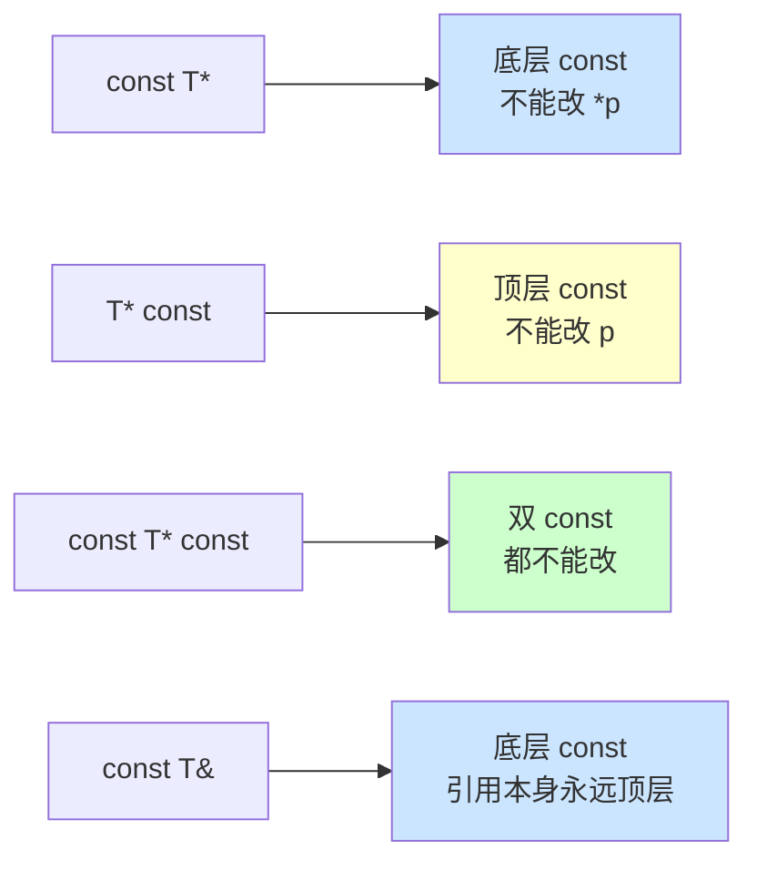
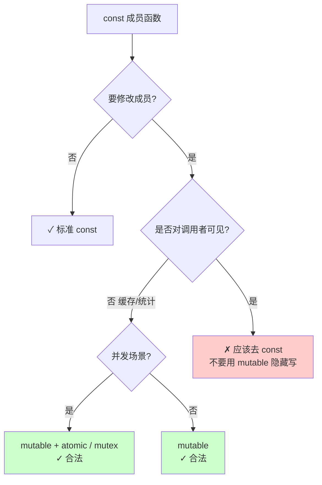
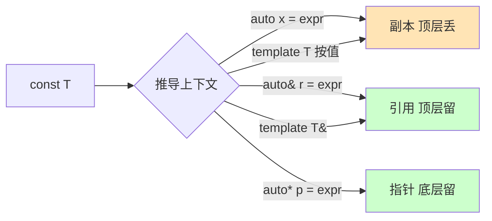
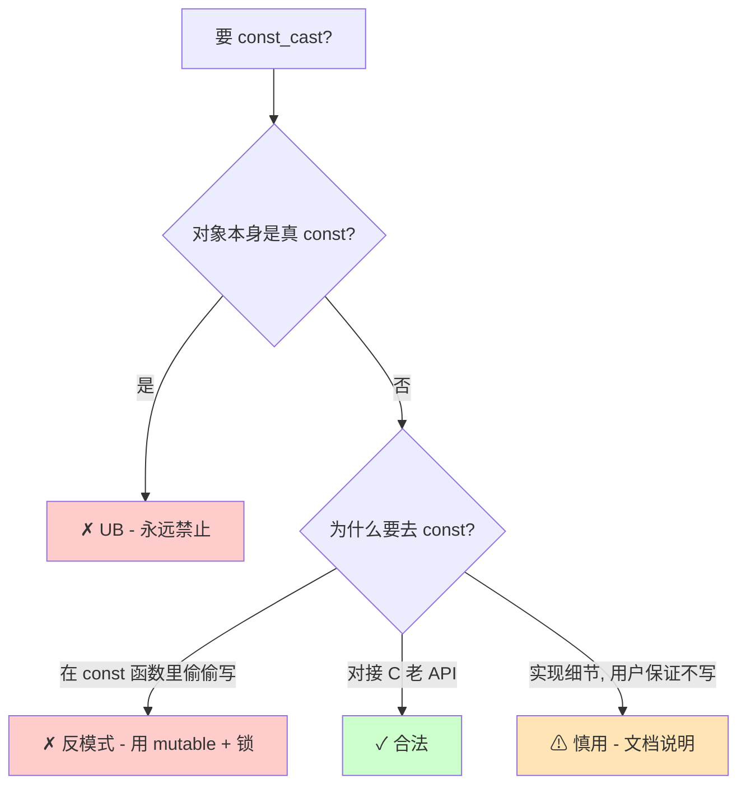
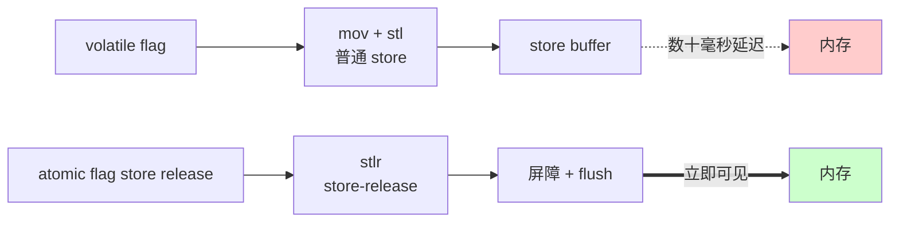
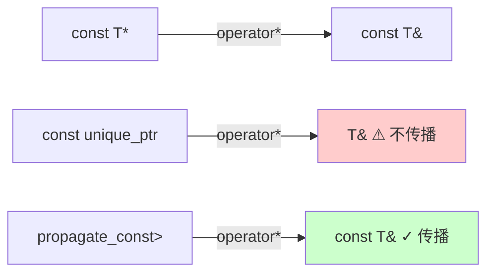
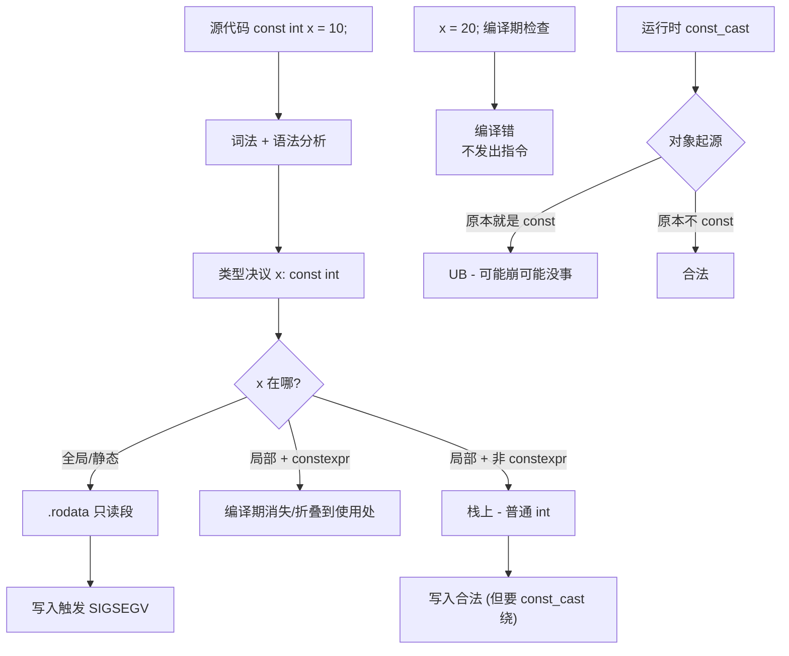
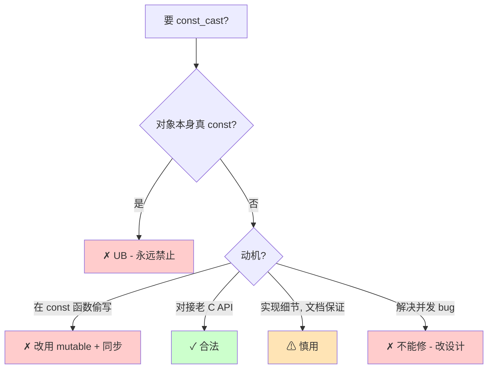

# 14.const与volatile真相

#### 目录介绍
- [1. 案例引入](#1-案例引入)
  - [1.1 const成员函数下的数据竞争](#11-const成员函数下的数据竞争)
  - [1.2 volatile救不了的多线程](#12-volatile救不了的多线程)
  - [1.3 八大灵魂拷问](#13-八大灵魂拷问)
- [2. 架构概览](#2-架构概览)
  - [2.1 cv限定符的两大维度](#21-cv限定符的两大维度)
  - [2.2 顶层与底层const](#22-顶层与底层const)
- [3. const的语义传递](#3-const的语义传递)
  - [3.1 三层语义模型](#31-三层语义模型)
  - [3.2 按位常量vs逻辑常量](#32-按位常量vs逻辑常量)
  - [3.3 const成员函数的this](#33-const成员函数的this)
  - [3.4 const引用延长生命期](#34-const引用延长生命期)
- [4. mutable的合法逃逸](#4-mutable的合法逃逸)
  - [4.1 缓存与懒计算场景](#41-缓存与懒计算场景)
  - [4.2 互斥锁与同步原语](#42-互斥锁与同步原语)
  - [4.3 mutable的滥用警告](#43-mutable的滥用警告)
- [5. 顶层与底层const边界](#5-顶层与底层const边界)
  - [5.1 const T-与T-const的差异](#51-const-t-与t-const的差异)
  - [5.2 模板参数推导丢顶层](#52-模板参数推导丢顶层)
  - [5.3 函数签名只看底层](#53-函数签名只看底层)
- [6. const_cast的并发反模式](#6-const_cast的并发反模式)
  - [6.1 const并不暗示线程安全](#61-const并不暗示线程安全)
  - [6.2 标准库的const承诺](#62-标准库的const承诺)
  - [6.3 const_cast的写场景红线](#63-const_cast的写场景红线)
- [7. volatile的真正用途](#7-volatile的真正用途)
  - [7.1 MMIO硬件寄存器](#71-mmio硬件寄存器)
  - [7.2 信号处理与setjmp](#72-信号处理与setjmp)
  - [7.3 不可优化抑制reorder](#73-不可优化抑制reorder)
- [8. 为什么volatile不是同步](#8-为什么volatile不是同步)
  - [8.1 三大并发缺失](#81-三大并发缺失)
  - [8.2 atomic与volatile对比](#82-atomic与volatile对比)
  - [8.3 Java-volatile的误导](#83-java-volatile的误导)
- [9. cv在重载与函数签名](#9-cv在重载与函数签名)
  - [9.1 const重载与ref限定](#91-const重载与ref限定)
  - [9.2 cv参与重载决议](#92-cv参与重载决议)
  - [9.3 propagate_const与传染](#93-propagate_const与传染)
- [10. 综合案例串讲](#10-综合案例串讲)
  - [10.1 案例真相揭晓](#101-案例真相揭晓)
  - [10.2 const从语法到机器码](#102-const从语法到机器码)
  - [10.3 设计哲学回扣](#103-设计哲学回扣)
  - [10.4 速查表合集](#104-速查表合集)


## 1. 案例引入

### 1.1 const成员函数下的数据竞争

某高并发广告竞价系统的实时报价服务，QPS 峰值 30 万，新版本上线后每天偶发 0.05% 的报价请求**返回值跨请求互相串扰**——A 用户请求广告位 X，却拿到了 B 用户广告位 Y 的价格。报价价格全错，但程序无任何 crash、无任何 error 日志。复盘锁定到一个看似无害的"价格缓存"类：

```cpp
class PriceCache {
public:
    // const 成员函数：对外承诺"只读"，可以被多线程并发调用
    Price get(AdSlot slot) const {
        auto it = hot_.find(slot);
        if (it != hot_.end()) {
            ++hit_count_;        // mutable 计数器
            return it->second;
        }
        // miss：去后端拉，缓存到 hot_
        auto p = backend_.fetch(slot);    // 慢路径
        hot_[slot] = p;                    // ← 写！
        return p;
    }

private:
    mutable std::unordered_map<AdSlot, Price> hot_;   // ⚠
    mutable std::atomic<uint64_t> hit_count_{0};
    Backend backend_;
};
```

`PriceCache::get` 标了 `const`——**所有 reviewer 都默认它是线程安全的**：const 成员函数嘛，"只读不写"，多线程并发调用还能出什么问题？

但 hot_ 加了 `mutable`——const 成员函数里**仍然在写** unordered_map。**两个线程同时 cache miss、同时写 hot_，触发 unordered_map 的 rehash 或链表节点撕裂**——一个线程读到的 Price 引用指向另一个线程刚刚搬走的旧桶位置，于是返回了别的广告位的价格。

| 误解 | 真相 |
|---|---|
| const 成员函数 → 线程安全 | const 只承诺"对调用者来说是只读"，不承诺"对实现来说不写" |
| mutable 字段 → 局部例外 | mutable 字段在 const 成员函数里完全可写，与一般写无异 |
| atomic 计数器 → 整体安全 | 单字段原子化救不了非原子的 unordered_map |
| const 是性能优化提示 | const 主要是类型系统约束，不是优化提示 |

修复方案有四种：

```cpp
// 方案 A：const 成员函数内加锁（变成"逻辑只读 + 真同步"）
mutable std::shared_mutex mu_;
Price get(AdSlot slot) const {
    {
        std::shared_lock lk(mu_);
        if (auto it = hot_.find(slot); it != hot_.end()) return it->second;
    }
    auto p = backend_.fetch(slot);
    {
        std::unique_lock lk(mu_);
        hot_[slot] = p;
    }
    return p;
}

// 方案 B：去 const，明示"会写"
Price get(AdSlot slot);    // 调用方必须自己同步

// 方案 C：分离纯只读快照 + 后台单线程写
const HashMap& snapshot() const noexcept;   // 真只读
void refresh();                              // 单线程后台

// 方案 D：concurrent 容器（folly::ConcurrentHashMap / tbb::concurrent_hash_map）
```

复盘三个核心问题：

1. **`const` 真的等于"不变"吗？为什么允许 mutable 这种"后门"？**
2. **const 成员函数到底承诺了什么？哪些是承诺、哪些是误解？**
3. **`mutable` 在并发场景下应该怎么用、不该怎么用？**

第三个答案是：**mutable 字段必须配合同步原语（mutex / atomic）才在并发下安全**——只加 mutable 不加锁，等于把"写"藏到了 const 成员函数里，是纯粹的反模式。

### 1.2 volatile救不了的多线程

第二个真实事故来自一段嵌入式产品的固件代码——**生产者线程通过共享变量给消费者线程发"停止"信号**：

```cpp
volatile bool stop_flag = false;     // 共享标志

void worker_thread() {
    while (!stop_flag) {              // ← 期望：另一线程写 true，本线程立刻看到
        do_work();
    }
}

void main_thread() {
    std::this_thread::sleep_for(10s);
    stop_flag = true;                 // 给 worker 发停止信号
    worker.join();
}
```

这段代码在 ARM Cortex-A53 单核机器上"正常工作"了三年，**移植到双核 Cortex-A72 后 worker 线程偶发"永不停止"**——main_thread 已经写入 stop_flag = true，但 worker_thread 在 while 里转了几十秒甚至几分钟才看见变化。

许多老 C 程序员的认知是："`volatile` 让编译器每次都从内存重新读，所以多线程共享变量加 volatile 就行了。" **这是 C 程序员最大的误解之一**：

| volatile 真的提供的 | volatile 不提供的 |
|---|---|
| 抑制编译器把读/写优化掉 | CPU 跨核可见性（cache coherency 之外的同步） |
| 抑制编译器跨 volatile 访问的指令重排 | CPU 自身的乱序执行（store buffer） |
| 编译期"每次访问真的发出 load/store" | 多核之间的 happens-before 关系 |
| 防止编译器合并多次读写 | 原子性（volatile int x; x++; 不是原子） |

**真相**：volatile 只对**编译器**说话，不对 **CPU** 说话。在双核 Cortex-A72 上，main_thread 的 store 进入了它所在核的 store buffer，**对另一个核可能数十毫秒甚至数秒不可见**——直到内存屏障或 cache 一致性事件触发。volatile **完全管不了 store buffer 与 cache 一致性**。

正确写法：

```cpp
std::atomic<bool> stop_flag{false};

void worker_thread() {
    while (!stop_flag.load(std::memory_order_acquire)) {
        do_work();
    }
}

void main_thread() {
    stop_flag.store(true, std::memory_order_release);
    worker.join();
}
```

`std::atomic` 在 ARM 上会插入 `dmb ish`（数据内存屏障）——**这才是真正告知 CPU "把 store buffer 刷出去、让其他核看到"** 的指令。

### 1.3 八大灵魂拷问

把上面两个事故串起来，本篇核心要回答：

1. **`const` 在 C++ 里到底是什么——编译期约束、运行期保护、还是性能优化？**
2. **const 成员函数与线程安全是什么关系？标准库为什么承诺 const 成员是线程安全的？**
3. **`mutable` 这个"后门"为什么必要？什么时候用是合法、什么时候是滥用？**
4. **顶层 const 与底层 const 的边界究竟在哪？为什么模板推导会丢顶层 const？**
5. **`const_cast` 在并发代码里为什么是反模式？什么场景下用是合法的？**
6. **`volatile` 是干什么的？为什么它不是多线程同步工具？**
7. **`volatile` 与 `std::atomic` 的本质区别是什么？为什么 Java/C# 的 volatile 与 C++ 完全不同？**
8. **C++20 的 `std::propagate_const` 是为了解决什么问题？为什么标准库不默认这样做？**

回答这八个问题，等于把 C++ 类型系统的"读"——也就是"以哪种可变性穿越对象"的全部规则——讲清楚。

---

## 2. 架构概览

### 2.1 cv限定符的两大维度

C++ 的 cv 限定符（`const` / `volatile`）有两个**完全独立**的维度：

```
                     ┌──────────────────────────────────────────┐
                     │            const                          │
                     │  ──────────────────────                   │
                     │  对"程序员意图"的约束                      │
                     │  我承诺：通过这个名字不会改值                │
                     │                                          │
                     │  目标：编译期类型安全                       │
                     │  作用面：编译器                            │
                     └──────────────────────────────────────────┘

                     ┌──────────────────────────────────────────┐
                     │            volatile                       │
                     │  ──────────────────────                   │
                     │  对"编译器优化"的约束                       │
                     │  我承诺：每次访问都真实发出 load/store      │
                     │                                          │
                     │  目标：与外部世界（硬件/信号）正确交互       │
                     │  作用面：编译器（仅）                       │
                     └──────────────────────────────────────────┘
```

**核心区分**：

| 维度 | const | volatile |
|---|---|---|
| 作用对象 | 程序员的"意图" | 编译器的"优化" |
| 目标 | 类型安全、API 契约 | 与硬件 / 信号 / 异步交互 |
| 跨线程意义 | 无（除标准库的"const ⇒ 线程安全"约定） | 无 |
| 跨核可见性 | 不保证 | 不保证 |
| 原子性 | 不保证 | 不保证 |
| 错误用途 | 误以为可优化 | 误以为可同步 |
| 标准头文件用途 | 处处 | `<csetjmp>`/MMIO/信号 |

### 2.2 顶层与底层const

const 出现在指针/引用类型里，**位置不同含义截然不同**：

```cpp
int  x = 10;
const int* p1 = &x;        // 底层 const：不能通过 p1 改 *p1
int* const p2 = &x;        // 顶层 const：不能改 p2 自己（但能改 *p2）
const int* const p3 = &x;  // 双 const

// 引用永远是顶层（引用本身不能改绑），所以 const T& 的 const 是底层
const int& r = x;          // 底层 const：r 是只读视图
```

**记忆法则**：const 在 `*` 的**左边是底层**（修饰被指向的对象），**右边是顶层**（修饰指针变量本身）。



**为什么这个区分这么重要？**——因为：

- **顶层 const 在按值传参/模板推导/auto 推导中会被丢弃**（因为副本天生就是新变量）
- **底层 const 永远保留**（决定能否写共享对象）
- **函数签名比较只看底层 const**（顶层 const 不参与重载）

这个边界后面 5、9 章会详细论证。

---

## 3. const的语义传递

### 3.1 三层语义模型

C++ 的 const 同时表达三个层次的语义：

```
            ┌──────────────────────────┐
   语法层     │ 编译器拒绝写操作            │  <- 静态检查
            │ const T x; x = 1;  // err  │
            └──────────────────────────┘

            ┌──────────────────────────┐
   API 层    │ 接受方承诺"不通过此名字写"   │  <- 契约
            │ void f(const T& x);        │
            └──────────────────────────┘

            ┌──────────────────────────┐
   实现层    │ 对象本身可能仍然在变        │  <- 运行时真相
            │ mutable / const_cast       │
            │ 标准库：const ⇒ 线程安全    │
            └──────────────────────────┘
```

**关键洞察**：const **不保证对象不变**，只保证**通过这个名字不能改变**。同一个对象可能：
- 通过 `T*` 改写（合法）
- 通过 `const T*` 不能改（编译错）
- 实际是 mutable 字段（合法地改）

```cpp
int x = 10;
const int* p = &x;
*p = 20;        // 编译错：通过 p 不能改
x = 20;         // ✓：通过 x 可以改——同一个对象！
```

### 3.2 按位常量vs逻辑常量

**疑惑**：const 成员函数到底禁止什么？

**论证**：标准 [class.this] 规定 const 成员函数中 `this` 的类型是 `const T*`——**所以函数体里不能写非 mutable 的成员**。这是"按位常量（bitwise const）"语义。

但工程上的"const 成员函数"通常表达"逻辑常量（logical const）"语义——即"对调用者看来对象状态没变"，但内部可能：

```cpp
class Database {
public:
    // 逻辑常量：对调用者看来 query 不改 Database
    // 但内部要更新 cache、统计等
    Result query(const Q& q) const {
        ++query_count_;          // mutable 计数
        if (auto it = cache_.find(q); it != cache_.end()) {
            return it->second;
        }
        auto r = backend_->fetch(q);
        cache_[q] = r;            // mutable 缓存
        return r;
    }

private:
    mutable std::atomic<uint64_t> query_count_{0};
    mutable std::map<Q, Result> cache_;
    Backend* backend_;
};
```

**bitwise const 与 logical const 是两种不同的"const"**：
- C++ 编译器只能强制 bitwise const
- 标准库与工程惯例承诺的是 logical const
- mutable 是把两者拉齐的工具——**告诉编译器"这个字段是实现细节，请允许我在 const 函数里改"**

### 3.3 const成员函数的this

**反汇编验证**：

```cpp
class C {
    int x;
public:
    int get() const { return x; }       // const 函数
    void set(int v) { x = v; }          // 非 const 函数
};
```

x86-64 godbolt（gcc 13 -O2）：

```asm
C::get() const:
    mov eax, DWORD PTR [rdi]    ; this 在 rdi，正常读
    ret

C::set(int):
    mov DWORD PTR [rdi], esi    ; this 在 rdi，正常写
    ret
```

**机器码层面没有任何差异**——const 不是运行时检查，是**纯编译期类型系统约束**。它的成本是零。

**结论**：const 成员函数的"const"本质是 `this` 的类型从 `T*` 变成 `const T*`，编译器据此拒绝任何"通过 this 写非 mutable 成员"的代码。运行时无任何额外开销，也无任何额外保护。

### 3.4 const引用延长生命期

const 还有一个"附带能力"——延长右值的生命期：

```cpp
const std::string& s = std::string("hello");    // ✓
                                                 // 临时 string 的生命期延长到 s 的作用域
std::string& r = std::string("hello");          // ⚠ 编译错——左值引用不能绑右值
```

**论证**：标准 [class.temporary] 规定 "the lifetime of a temporary bound to the returned reference in a function return statement is not extended; it is destroyed at the end of the full expression in the return statement"——但**绑定到 const 左值引用**或**右值引用**的临时对象，生命期延长到引用变量本身的作用域结束。

工程意义：

```cpp
auto&& s = makeString();        // 万能引用，等价 const std::string&
                                // 临时 string 生命期延长到 s 作用域

for (auto&& x : computeRange()) {  // range-for 内部就用了 auto&&
    use(x);
}                                  // computeRange 返回的临时对象在循环全程都活着
```

**结论**：const 不只是"不让你写"，还在右值生命期管理上扮演关键角色。这个特性是 C++ 临时对象模型的根基。

---

## 4. mutable的合法逃逸

### 4.1 缓存与懒计算场景

`mutable` 是 C++ 给"逻辑常量"打的官方补丁——**这个字段是实现细节，请允许我在 const 函数里写**：

```cpp
class LazyHash {
public:
    size_t hash() const {
        if (!hash_computed_) {
            cached_hash_ = compute_hash(data_);
            hash_computed_ = true;
        }
        return cached_hash_;
    }

private:
    Data data_;
    mutable size_t cached_hash_{0};
    mutable bool hash_computed_{false};
};
```

`hash()` 对外承诺"只读"——多次调用结果相同——但内部第一次会算并缓存。**如果不允许 mutable，要么放弃 const、要么放弃缓存**——这都是不必要的牺牲。

### 4.2 互斥锁与同步原语

mutable 在并发代码里有一个**几乎不可避免的用途**——锁：

```cpp
class ThreadSafeCache {
public:
    Value get(Key k) const {                  // 对外是 const
        std::shared_lock lk(mu_);              // ← 锁本身要"写"
        return data_.at(k);
    }

    void set(Key k, Value v) {
        std::unique_lock lk(mu_);
        data_[k] = v;
    }

private:
    mutable std::shared_mutex mu_;             // mutable 是必须的
    std::unordered_map<Key, Value> data_;
};
```

`std::shared_mutex::lock_shared()` 不是 const 成员函数——**因为加锁本质上要修改 mutex 内部状态**。所以 const 成员函数里要加锁，mutex 必须 mutable。

**这是 mutable 唯一无可替代的用法**——所有现代 C++ 教材（Stroustrup《The C++ Programming Language》、Sutter《Exceptional C++》、Meyers《Effective Modern C++》）都把它作为 mutable 的"招牌使用"。

### 4.3 mutable的滥用警告

回到 1.1 节那个 PriceCache 事故的核心错误：

```cpp
mutable std::unordered_map<AdSlot, Price> hot_;   // ⚠ 没有锁，又在 const 函数里写
```

**红线**：mutable 字段在 const 成员函数里的写**必须满足以下两个条件之一**：
1. **该写对调用者不可见**（如缓存命中后下次自动加速，但单次调用结果不变）
2. **配合同步原语**（mutex、atomic）保证并发安全

否则 mutable 就是"绕过 const 的后门"——破坏 const 函数应承诺的"逻辑只读 + 线程安全"。



**结论**：mutable 不是"const 的逃生口"，是"**逻辑常量与按位常量之间的桥梁**"。每加一个 mutable 字段，都应该回答："这个字段并发下怎么办？"——回答不出，就是滥用。

---

## 5. 顶层与底层const边界

### 5.1 const T-与T-const的差异

回到 2.2 节的语法：

```cpp
const int* p1;     // 底层 const：*p 不能写
int* const p2;     // 顶层 const：p 不能改绑
const int* const p3;  // 双 const
```

**完整对照**：

| 声明 | 顶层 const? | 底层 const? | 能改 *p? | 能改 p? |
|---|---|---|---|---|
| `int* p` | 否 | 否 | ✓ | ✓ |
| `const int* p` | 否 | 是 | ✗ | ✓ |
| `int* const p` | 是 | 否 | ✓ | ✗ |
| `const int* const p` | 是 | 是 | ✗ | ✗ |
| `const int& r` | 是（强制） | 是 | ✗ | N/A（引用不能改绑） |
| `const int x` | 是 | N/A（非指针） | N/A | ✗ |

**记忆口诀**：**const 修饰离它最近的东西**——除非 const 在最前面，那就修饰类型本身（即被指向的对象）。

```cpp
const int*        // const 修饰 int → 底层
int const*        // const 修饰 int → 底层（与上等价）
int* const        // const 修饰 *（即指针） → 顶层
int const* const  // 第一个修饰 int（底层），第二个修饰 *（顶层）
```

### 5.2 模板参数推导丢顶层

**疑惑**：为什么 `auto x = const_value` 推导出来 x 不是 const？

**论证**：标准 [temp.deduct.call] 规定模板参数推导时**顶层 cv 限定符被丢弃**——因为按值传递天生就是副本，副本是新变量、与原 const 无关：

```cpp
const int ci = 10;
auto x = ci;        // x 是 int，不是 const int
                    // 因为 auto 等价模板推导，ci 的顶层 const 被丢

auto& r = ci;       // r 是 const int&（底层 const 保留）
auto* p = &ci;      // p 是 const int*（底层 const 保留）

template<typename T>
void f(T t);
f(ci);              // T = int（顶层 const 丢）

template<typename T>
void g(T& t);
g(ci);              // T = const int（底层 const 保留）
```

**为什么底层保留？**——因为底层 const 决定"通过这个名字能否写"，**这是接口契约的一部分**，不能随便丢。



### 5.3 函数签名只看底层

C++ 函数重载与签名匹配**只看底层 const**，不看顶层：

```cpp
void f(int x);          // ①
void f(const int x);    // ⚠ 与 ① 是同一个函数！顶层 const 在签名里被忽略
                        // → 编译错：重定义

void g(int* p);         // ①
void g(int* const p);   // 与 ① 同一个函数
void g(const int* p);   // 不同函数（底层 const 不同）✓
```

**为什么？**——因为按值参数是副本，调用者看不见参数是否 const，把它纳入签名就毫无意义。

但**返回值的顶层 const 通常是反模式**：

```cpp
const int compute();        // 顶层 const 返回值——几乎无用
                            // 因为返回值用于初始化新变量，新变量自己决定是否 const
                            // C++ 标准不禁止，但 -Wignored-qualifiers 会警告
```

工程红线：**返回值不要写顶层 const**——除非返回引用（如 `const T&`，这才是底层 const）。

---

## 6. const_cast的并发反模式

### 6.1 const并不暗示线程安全

许多 C 程序员有一个误解："const 函数 = 线程安全"——这是**错的**。const 在 C++ 标准里只意味着"这个名字不能写"，**不意味着多线程并发调用时安全**。

但**标准库做了额外承诺**（[res.on.data.races]）：标准库容器的 const 成员函数**保证线程安全（多个线程并发调用同一对象的 const 成员函数不引发 data race）**。这是"const 在标准库中暗示线程安全"的来源。

```cpp
std::vector<int> v = {...};

// 多线程并发调用 v 的 const 成员函数：标准保证安全
auto t1 = std::thread([&]{ auto sz = v.size(); /* OK */ });
auto t2 = std::thread([&]{ auto x = v.front(); /* OK */ });

// 但用户类不自动有这个保证——必须自己实现
```

**这是 C++11 之后的"软契约"**：用户类如果想接入 STL 哲学，应该让 const 成员函数**真的线程安全**——否则就是与 STL 不一致的设计。

### 6.2 标准库的const承诺

[res.on.data.races]/3：

> A C++ standard library function shall not directly or indirectly modify objects accessible by threads other than the current thread unless the objects are accessed directly or indirectly via the function's non-const arguments, including this.

翻译：标准库函数**不会直接或间接地修改通过非 const 参数（含 this）以外的方式可访问的对象**。

**直白翻译**：**const 成员函数对该对象不写**（除了 mutable 字段需要由实现保证线程安全）。

回到 1.1 节的 PriceCache：作者用了 `mutable unordered_map`，**没有满足"实现保证线程安全"的隐含义务**——这就是 bug 的根源。修复要么加锁、要么去 const、要么换并发容器。

### 6.3 const_cast的写场景红线

`const_cast` 在并发代码里**几乎永远是错的**：

```cpp
// ⚠ 反模式：通过 const_cast 在 const 函数里写
class BadCache {
public:
    Value get(Key k) const {
        auto* self = const_cast<BadCache*>(this);
        return self->internal_get(k);    // 调用非 const 函数
    }
private:
    Value internal_get(Key k);    // 写 cache
};
```

**问题**：
1. **隐藏写操作**——code review 时，`const Cache` 看起来安全，实际暗藏写
2. **破坏 STL 哲学**——const 成员函数应该线程安全，这里却内部并发不安全
3. **可能 UB**——如果这个对象本身是真 const（如 `const BadCache cache;`），const_cast 后写就是 UB

**唯一合法的 const_cast 写场景**：

```cpp
// 与 C 老 API 对接（API 漏写了 const）
extern "C" int legacy_strlen(char* s);    // 应该 const char*

void f(const char* p) {
    int n = legacy_strlen(const_cast<char*>(p));  // ✓ 已知 strlen 不写 *p
}
```



**结论**：const_cast 在并发代码里是黄牌——出现 const_cast，code review 就要追问"为什么不直接 mutable + 锁"。

---

## 7. volatile的真正用途

### 7.1 MMIO硬件寄存器

`volatile` 的**官方设计目标**——与硬件寄存器交互。在嵌入式/驱动代码里：

```cpp
// 把硬件寄存器映射到一个内存地址
constexpr uintptr_t UART_DATA = 0xFF000000;
constexpr uintptr_t UART_STAT = 0xFF000004;

// 必须用 volatile，否则编译器会优化掉重复读
volatile uint32_t* uart_data = reinterpret_cast<volatile uint32_t*>(UART_DATA);
volatile uint32_t* uart_stat = reinterpret_cast<volatile uint32_t*>(UART_STAT);

void uart_write(char c) {
    while (!(*uart_stat & TX_READY)) {}    // ⚠ 不加 volatile，循环会被优化成死循环
    *uart_data = c;
}
```

**为什么必须 volatile？**——`*uart_stat` 不是普通内存，是**硬件寄存器**。它的值会**因外部硬件事件改变**（CPU 没碰它，但寄存器自己变了）。如果没有 volatile：

```asm
; 编译器看到 while(!(*p & 1)){}  *p 没被代码改过
; 优化为：
mov eax, [p]
test eax, 1
jz infinite_loop          ; 死循环 ⚠
infinite_loop: jmp infinite_loop
```

加 volatile 后：

```asm
loop:
    mov eax, [p]          ; 每次循环都真的读
    test eax, 1
    jz loop
```

**volatile 抑制了"我读过了不再读"的优化**——这是它的核心能力。

### 7.2 信号处理与setjmp

**信号处理函数**：异步打断主流程，可能在任何指令之间触发——主流程的局部变量必须 volatile，否则编译器会假设"信号处理不存在"做优化：

```cpp
volatile sig_atomic_t got_sigint = 0;

void on_sigint(int) {
    got_sigint = 1;
}

int main() {
    std::signal(SIGINT, on_sigint);
    while (!got_sigint) {           // ⚠ 不加 volatile 会被优化成死循环
        do_something();
    }
}
```

`sig_atomic_t` 是 POSIX 规定的"信号安全的整数类型"——通常是 int。注意：**这里 volatile 仍然不是同步原语**——但单线程信号场景下不需要跨核可见性，所以 volatile 是足够的。

**setjmp/longjmp**：longjmp 跨函数跳，可能让局部变量"突然回到旧值"——编译器优化时不知道这点，所以可能被 longjmp 影响的局部变量要 volatile：

```cpp
jmp_buf env;

void f() {
    volatile int x = 0;             // 不加 volatile，longjmp 后 x 的值未定义
    if (setjmp(env) == 0) {
        x = 42;
        g();        // g 可能 longjmp
    } else {
        printf("%d\n", x);          // 加 volatile 才能保证看到 42
    }
}
```

### 7.3 不可优化抑制reorder

volatile 的三大保证（**仅对编译器**）：

1. **每次访问真发出 load/store**——不会优化掉重复读
2. **不会合并多次写**——`*p = 1; *p = 2;` 不会被合并成 `*p = 2;`
3. **volatile 访问之间不重排**——`*pa; *pb;` 顺序保留（**注意：仅 volatile 之间，volatile 与非 volatile 仍可能重排**）

```cpp
volatile int* pa;
volatile int* pb;
int x;

*pa = 1;
*pb = 2;
x = 3;
*pa = 4;

// volatile 之间不重排：*pa = 1, *pb = 2 顺序保留
// 但 x = 3 可能被移到 *pa = 4 之后（因为 x 不是 volatile）
```

但这都是**对编译器的保证**——CPU 的乱序执行、store buffer、cache 一致性，**volatile 完全不管**。这就是它在多核多线程下完全不够用的根因。

---

## 8. 为什么volatile不是同步

### 8.1 三大并发缺失

**论证**：volatile 不能用作多线程同步，因为它缺三件事：

| 并发要素 | volatile 提供? | atomic 提供? |
|---|---|---|
| 编译器不优化 | ✓ | ✓ |
| 跨核可见性（cache coherency 之外的同步） | ✗ | ✓（通过内存屏障） |
| 原子性（read-modify-write 不被打断） | ✗ | ✓ |
| 内存顺序（memory order） | ✗ | ✓ |
| happens-before 关系 | ✗ | ✓ |

**volatile 的写在 CPU 层会发生什么？**

```
线程 A (CPU0)            线程 B (CPU1)
─────────                 ─────────
                          while(!flag){}
flag = 1; ──────────►       ↓
   ↓                      读 flag 的值
进入 store buffer            从 L1 cache 读
   ↓                         L1 cache 没收到失效信号
   缓慢往内存/L3 走            读到旧值 0
   ↓
最终 flush 到内存
```

**volatile 不会在 store 后插入 memory fence/barrier**——store buffer 的内容什么时候 flush 完全是 CPU 决定。在 ARM/POWER 这种 weak memory model 上，可能延迟数十毫秒甚至更久。

### 8.2 atomic与volatile对比

回到 1.2 节的修复方案：

```cpp
std::atomic<bool> stop_flag{false};

void worker_thread() {
    while (!stop_flag.load(std::memory_order_acquire)) {
        do_work();
    }
}

void main_thread() {
    stop_flag.store(true, std::memory_order_release);
    worker.join();
}
```

ARM Cortex-A72 上 `release/acquire` 编译出：

```asm
; main_thread store(true, release)
mov w0, #1
stlr w0, [x19]            ; stlr = store-release，发出内存屏障

; worker_thread load(acquire)
ldar w0, [x19]            ; ldar = load-acquire，发出内存屏障
cbz w0, .Lloop
```

**`stlr` 与 `ldar` 是 ARMv8 专门为同步设计的指令**——保证 store-release 之前的所有写在 release 之前对其他核可见、load-acquire 之后的所有读不会被重排到 acquire 之前。**这就是 volatile 完全没有的能力**。



**结论**：volatile 是给**编译器**用的、atomic 是给 **CPU** 用的——它们**作用面不同，不能互替**。

### 8.3 Java-volatile的误导

**Java/C# 的 volatile** 与 C++ 完全不同：

| 语言 | volatile 语义 |
|---|---|
| C/C++ | 仅抑制编译器优化，不保证同步 |
| Java | 强同步：跨线程可见 + happens-before + 禁止重排（等价 C++ atomic seq_cst） |
| C# | 弱同步：acquire/release 语义（等价 C++ atomic acquire/release） |

**为什么 Java 的 volatile 这么强？**——因为 Java/C# 由 JVM/CLR 完全控制运行时，volatile 关键字直接对应 JIT 编译器在 store 后插入 membar 指令。C/C++ 没有这种统一运行时，volatile 是 1970 年代为单核硬件寄存器交互设计的——**多核出现得晚得多**，标准没有为它扩充语义。

**C++11 走了相反的路**：保留 volatile 的"对硬件寄存器和信号处理"原意，**新增 std::atomic 处理多线程同步**——职责分离、各司其职。

| 错误 | 修复 |
|---|---|
| 跨语言迁移：把 Java volatile 直翻 C++ volatile | 改用 std::atomic |
| 用 volatile 做多线程标志 | std::atomic_flag / std::atomic\<bool\> |
| 用 volatile bool 做"启动标志" | std::atomic\<bool\> + memory_order |
| 用 volatile 共享 struct | std::atomic\<struct>（如果 trivially copyable）或互斥锁 |

**结论**：在 C++ 看到 volatile 用于多线程，99% 是 bug——除非这个变量同时是硬件寄存器或信号处理标志。

---

## 9. cv在重载与函数签名

### 9.1 const重载与ref限定

`const` 与 `&`/`&&` 限定符共同决定了成员函数的"调用上下文重载"：

```cpp
class String {
public:
    char* data() &;             // 仅左值 String 能调
    const char* data() const&;   // 左值 const String 能调
    char* data() &&;            // 仅右值 String 能调（如临时对象）
    char* data() const&& = delete;  // 禁止 const 右值
};

String s;
s.data();                       // 调 &  版本
const String cs;
cs.data();                      // 调 const& 版本
String().data();                // 调 && 版本
```

**为什么需要这种重载？**——典型场景是**避免悬空引用**：

```cpp
class Builder {
    std::string buf_;
public:
    const std::string& get() const& { return buf_; }   // 左值 → 返回引用
    std::string get() && { return std::move(buf_); }   // 右值 → 移动出去
};

Builder b;
const std::string& r = b.get();              // 安全：b 还活着
const std::string& r2 = makeBuilder().get();  // ⚠ 如果只有 const& 版本：
                                              //   悬空引用！临时 Builder 析构后 r2 失效
                                              // 有 && 版本就会调 && 返回值，没有悬空问题
```

C++17 强制 RVO 之后这个模式更普及——是"返回值优化 + 引用语义"的关键工具。

### 9.2 cv参与重载决议

```cpp
void f(int& x);             // ①
void f(const int& x);       // ②
void f(int&& x);            // ③

int a = 1;        f(a);      // ① 左值 int
const int b = 1;  f(b);      // ② 左值 const int
                  f(1);      // ③ 右值

// 没有 ③ 的话，1 会调 ②（右值能绑 const&）
// 没有 ② 的话，b 不能调（const 左值不能绑非 const&）
```

重载决议在 cv 维度的优先级（粗略）：

```
精确匹配（cv 完全相同）
    > 添加 cv 限定（const T → const T 完全匹配优先于 T → const T 升级）
        > 引用绑定（左值绑左值引用 优先于 左值绑 const 左值引用）
            > 右值优先 && 而非 const&
```

具体规则有数十条特例（[over.match.best]），工程上记住：**写函数时优先 const& 接受输入、写返回值时根据需要分 &/&& 重载**。

### 9.3 propagate_const与传染

**疑惑**：`const T*` 不能改 `*p`，但 `const std::unique_ptr<T>` 能改 `*up` 吗？

**论证**：

```cpp
const std::unique_ptr<int> up = std::make_unique<int>(10);
*up = 20;        // ✓ 编译过！
up.reset();      // ⚠ 编译错——这里才是 const 起作用的地方
```

**为什么？**——因为 unique_ptr 的 `operator*` 是这样定义的：

```cpp
template<typename T>
class unique_ptr {
public:
    T& operator*() const;    // ← 注意：const 成员函数，但返回 T&（不是 const T&）
};
```

`const unique_ptr<T>` 调 `operator*` 走 const 重载——返回的还是 `T&`（非 const！）——所以能改。**const 不会"穿透"unique_ptr**——这是 C++ 的"指针类型不传播 const"的原则。

C++ 实验性库 `std::experimental::propagate_const`（C++17 LFTS） 提供了"传播 const"的智能指针包装：

```cpp
#include <experimental/propagate_const>
std::experimental::propagate_const<std::unique_ptr<int>> up;

const auto& cup = up;
*cup = 20;       // ⚠ 编译错——propagate_const 让 const 穿透
```

**为什么标准库默认不传播？**——因为 raw pointer 不传播 const（`int* const p; *p = 20;` 合法），unique_ptr/shared_ptr 模仿 raw pointer 的语义。如果默认传播，会破坏"智能指针应该像 raw pointer"的预期。



**结论**：**const 在原生指针/智能指针上的传播差异**是 C++ 类型系统中一个微妙的"陷阱"。Pimpl 模式、值语义类的内部指针字段在需要严格 const-correctness 时，应考虑 propagate_const。

---

## 10. 综合案例串讲

### 10.1 案例真相揭晓

回到第 1 章的两个事故：

**事故 1：PriceCache 的 const 函数下数据竞争**

| 疑问 | 答案 |
|---|---|
| const 成员函数到底承诺了什么？ | "通过这个名字不能写非 mutable 字段"——**仅此而已**，不暗含线程安全 |
| 为什么 reviewer 默认 const 函数线程安全？ | 因为 STL 在 [res.on.data.races] 给出软契约："标准库的 const 成员函数线程安全"——但用户类不自动有这个保证 |
| mutable 字段并发为什么 UB？ | mutable 让 const 函数能写——但写非原子非加锁的容器仍然是 data race |
| 应该怎么修？ | mutable + shared_mutex（方案 A）或去 const（方案 B）或用并发容器（方案 D） |
| const_cast 能不能修？ | 不能——const_cast 只是绕过类型系统，不解决数据竞争 |

**事故 2：volatile 救不了的多线程**

| 疑问 | 答案 |
|---|---|
| volatile 不是"每次读内存"吗？ | 是——但"读内存"的"内存"在多核里可能是本核 L1 cache，不是真物理内存 |
| 单核三年都正常，为什么换双核就坏了？ | 单核没有跨核可见性问题——cache 只有一份；双核 ARM weak memory model 下 store buffer 延迟 flush |
| 为什么 std::atomic 可以？ | atomic 编译出 stlr/ldar（ARM）或 mfence/lock（x86）—— CPU 层级的同步指令，volatile 没有 |
| volatile 完全没用了吗？ | 不——它在 MMIO、信号处理、setjmp 仍然必需 |
| Java/C# 的 volatile 一样吗？ | 完全不一样——Java volatile ≈ C++ atomic seq_cst |

### 10.2 const从语法到机器码

把"`const int x = 10;`"拆成完整的生命周期：



**反汇编对比**（gcc 13 -O2）：

```cpp
const int g_x = 10;          // 全局 const
int g_y = 10;                 // 全局非 const

int read_x() { return g_x; }
int read_y() { return g_y; }
```

```asm
g_x:                ; 在 .rodata 段，只读
    .long 10
g_y:                ; 在 .data 段，可读写
    .long 10

read_x():
    mov eax, 10     ; ⚠ 直接折叠成立即数！编译器知道 const 不会变
    ret

read_y():
    mov eax, [g_y]  ; 真去内存读
    ret
```

**全局 const 是真的"不变"**——编译器把它放进 .rodata 段（写入触发 SIGSEGV），并在使用处直接折叠成立即数。**这是 const 在编译期带来的优化**——不是 const 关键字的"语义副作用"，而是"编译器对真 const 对象做的合法假设"。

```cpp
// 局部 const 的反汇编：
int f() {
    const int x = 10;
    return x;
}
// 优化为 mov eax, 10; ret —— x 完全消失
```

**关键洞察**：局部非全局的 const 通常被**完全优化掉**——const 不只是类型系统的约束，还启用了大量编译器假设。这就是为什么 `const_cast` 改真 const 对象会 UB——编译器已经按"它不变"做了优化。

### 10.3 设计哲学回扣

第 14 篇折射的 5 条 C++ 设计哲学：

**① 类型系统是"程序员的承诺"，不是"运行时的保护"**

const 不是给运行时看的盾牌（除全局段那种少数情况），是给**编译器与 reviewer** 的语义标记。它让 `void f(const T&)` 这样的签名成为**API 契约**——调用者读签名就知道"f 不会改我的对象"。这种"语法即文档"的思想贯穿现代 C++（noexcept、override、final、constexpr 都是同一族）。代价是 const-correctness 的传染（一个函数加 const，调用链上下都要跟着改），但收益是**类型系统辅助的代码可读性**——对工业项目至关重要。

**② 默认严格、显式逃逸——mutable 是"显式的不一致"**

C++ 不允许"按位 const 偷偷写"——要写就 `mutable` 或 `const_cast`。这两个关键字都是**显式逃逸口**，code review 时 grep 一遍就能列出全部"违反 const 字面意义"的位置。这是 C++ 处理"类型系统与现实需求矛盾"的一贯哲学：**留口，但口要写明**。Rust 的 `Cell`/`RefCell` 是同一思想的另一种实现。

**③ 关注点分离——const 与 volatile 的职责正交**

C++ 把"语言层面的不可变"（const）与"硬件层面的不可优化"（volatile）拆成两个独立维度。它们各管一面：const 是给程序员/类型系统看的、volatile 是给编译器看的。**不重叠、不互替**。这是 C++ 设计的反例式典范——有些语言（早期 Java）把 volatile 同时当作"同步"用，结果这个关键字含义臃肿、误用率高。**C++ 选择把同步独立成 std::atomic**——一个关键字一件事。

**④ 标准库立软契约——const 的 STL 隐含义务**

[res.on.data.races] 给标准库 const 成员函数定下"线程安全"的承诺，**但语言层面不强制**——这是 C++ "标准库与语言的责任分工"的典型。语言层面只给类型工具（const、mutable、atomic），**库层面承诺具体语义**。用户类要不要遵守这个软契约自己决定——但**主流库（Boost、folly、abseil、tbb）全部遵守**——这构成了 C++ 生态的"事实标准"。

**⑤ 抽象不应破坏底层模型——unique_ptr 的 const 不传播**

智能指针的设计原则是"像原生指针一样"——`int* const p; *p = 20;` 合法，所以 `const unique_ptr<int> up; *up = 20;` 也合法。**这是抽象一致性的取舍**。如果让 unique_ptr 默认传播 const，会让"智能指针 = 原生指针的资源管理版"这个心智模型破裂。要严格 const-correctness 时，propagate_const 是**显式 opt-in 工具**，不是默认行为——又一次"留口、口要写明"。

### 10.4 速查表合集

#### const 的三层语义

```
语法层    编译器拒绝写              const T x; x = 1; → 编译错
API 层    通过此名字不能写           void f(const T& x);
实现层    对象本身可能仍在变         mutable / const_cast / 标准库 const ⇒ 线程安全
```

#### 顶层 vs 底层 const

```
const T*       底层（不能改 *p）
T const*       底层（与上等价）
T* const       顶层（不能改 p）
const T* const 双 const
const T&       底层（引用本身永远是顶层）
const T        顶层（非指针/引用）

模板/auto 推导：
  按值参数        丢顶层、保留底层
  引用参数        全保留
  指针参数        全保留

函数签名比较：
  只看底层 const，顶层 const 被忽略
```

#### const 成员函数 + mutable 的红线

```
const 成员函数允许写：
  ✓ mutable 字段（必须保证不破坏调用者可见状态 或 配合同步）
  ✓ 通过 this 之外的全局/参数对象（但破坏 STL 软契约）
  ✗ 非 mutable 成员（编译错）
  ✗ 非 const 成员函数调用（编译错）

mutable 的合法用法：
  ✓ 缓存 / 懒计算（且对调用者不可见）
  ✓ 互斥锁 / 同步原语
  ✓ 统计计数（atomic 包装）
  ✗ 修改对调用者可见的状态（应该去 const）
  ✗ 非线程安全的容器（数据竞争）
```

#### const_cast 决策树



#### volatile vs std::atomic

| 维度 | volatile | std::atomic |
|---|---|---|
| 抑制编译器优化 | ✓ | ✓ |
| 跨核可见性 | ✗ | ✓（屏障） |
| 原子读改写 | ✗ | ✓ |
| memory_order 控制 | ✗ | ✓ |
| 适用场景 | MMIO / 信号 / setjmp | 多线程同步 |
| ARM 编译指令 | mov 普通 load/store | ldar/stlr 屏障指令 |
| 误用代价 | 用作同步 → 静默 bug | 用作硬件寄存器 → 性能损失 |

#### 跨语言 const / immutable / readonly 对比

| 语言 | 关键字 | 含义 |
|---|---|---|
| C++ | const | 语法约束、类型契约、不传染指针子对象 |
| C++ | constexpr | 编译期常量（更强：必须可编译期求值） |
| Rust | let（默认） / let mut | 默认不可变（**强制**），mut 显式可变 |
| Java | final | 引用不能改绑（≈ 顶层 const，不传染） |
| C# | readonly | 字段在构造后不能改（不传染） |
| Kotlin | val | 不可变绑定（≈ Java final） |
| Scala | val | 不可变（推荐用法） |

**唯一"传染式 const"的语言：Rust**——`let x: &T;` 不能改 `*x`，`let mut x: &mut T;` 才能改。这是 Rust 比 C++ 类型安全更强的一个具体维度——但 C++ 用 `propagate_const` 在实验性层面做了类似的工具。

#### 工程红线 12 条

1. **优先 const-correctness**——能加 const 就加（参数、成员函数、局部变量、返回引用）。
2. **const 成员函数应做到线程安全**——这是 STL 软契约，用户类应跟随。
3. **mutable 字段必须配合同步**（atomic 或 mutex），否则是定时炸弹。
4. **const 成员函数里不要用 const_cast 调非 const 函数**——隐藏写，反模式。
5. **const_cast 只在对接老 C API 时合法**——其他场景重新设计。
6. **永远不要 const_cast 改真 const 对象**——UB，可能 SIGSEGV。
7. **返回值不要写顶层 const**（如 `const int f();`）——无意义，触发 -Wignored-qualifiers。
8. **多线程同步用 std::atomic，不用 volatile**——除非这个变量同时是 MMIO/信号。
9. **跨语言迁移注意 volatile 语义不同**——Java/C# volatile ≠ C++ volatile。
10. **Pimpl 类的内部指针考虑 propagate_const**——严格 const-correctness 时用。
11. **重载成员函数考虑 ref-qualifier**——`& / && / const&` 三件套防悬空。
12. **clang-tidy 常用诊断**：`misc-const-correctness`、`cppcoreguidelines-pro-type-const-cast`、`bugprone-volatile-misuse`、`concurrency-mt-unsafe`。

#### 一句话记忆

```
const         ── 编译期约束，类型系统的"我承诺只读"
mutable       ── const 函数里"实现细节例外"——必须配合同步
const_cast    ── 显式去 const，并发场景几乎都是反模式
volatile      ── 抑制编译器优化，仅与硬件/信号交互
std::atomic   ── 多线程同步专用，配合 memory_order
```

---

> **下一篇**：本篇剖析了"以哪种可变性穿越对象"的全部规则——但还有一个 cv 之外的运行时类型机制：**RTTI 与 dynamic_cast**。下一篇 [15.RTTI与dynamic_cast](15.RTTI与dynamic_cast.md) 揭晓：**`typeid` 运算符到底返回什么？`type_info` 的内存布局长什么样？`dynamic_cast` 怎么在运行时找到正确的子类？为什么有些项目编译时加 `-fno-rtti` 关掉它？关闭 RTTI 后 `dynamic_cast` 与 `typeid` 还能用吗？跨动态库边界 `dynamic_cast` 为什么会失败？多继承的 vptr 偏移调整在 dynamic_cast 里怎么处理？** 第 13 篇讲了 dynamic_cast 的"用法"，第 15 篇深入它的"机制"——RTTI 是 C++ 类型系统从静态走向运行时的最后一块拼图。
