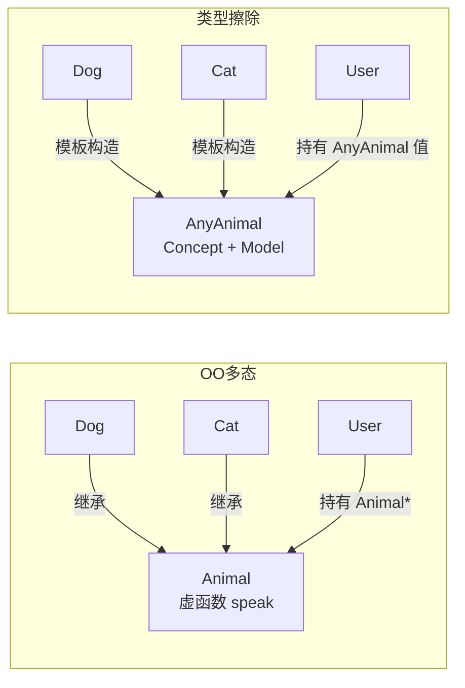
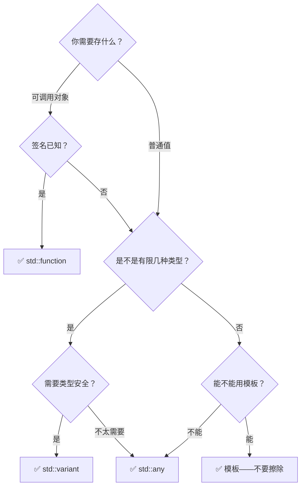

# 16.类型擦除技术原理

#### 目录介绍
- [1. 案例引入](#1-案例引入)
  - [1.1 日志格式化器的类爆炸](#11-日志格式化器的类爆炸)
  - [1.2 异步任务调度器的竞态崩溃](#12-异步任务调度器的竞态崩溃)
  - [1.3 我们要回答什么](#13-我们要回答什么)
- [2. 架构概览](#2-架构概览)
  - [2.1 类型擦除三件套](#21-类型擦除三件套)
  - [2.2 共同基因：外部多态 + 值语义](#22-共同基因外部多态--值语义)
- [3. 手工类型擦除：虚函数之路](#3-手工类型擦除虚函数之路)
  - [3.1 从继承到概念](#31-从继承到概念)
  - [3.2 内部接口 + 模板构造](#32-内部接口--模板构造)
  - [3.3 拷贝语义的陷阱](#33-拷贝语义的陷阱)
- [4. std::function 深层剖析](#4-stdfunction-深层剖析)
  - [4.1 核心骨架：存储 + 类型桥接](#41-核心骨架存储--类型桥接)
  - [4.2 SBO 的魔法数字](#42-sbo-的魔法数字)
  - [4.3 为什么三个函数指针](#43-为什么三个函数指针)
  - [4.4 空 function 与 bad_function_call](#44-空-function-与-bad_function_call)
- [5. std::any 深层剖析](#5-stdany-深层剖析)
  - [5.1 void* + type_info 的经典组合](#51-void--type_info-的经典组合)
  - [5.2 any_cast 的两次检查](#52-any_cast-的两次检查)
  - [5.3 any 的 SBO 与 function 的差异](#53-any-的-sbo-与-function-的差异)
- [6. std::variant 编译期多态](#6-stdvariant-编译期多态)
  - [6.1 和 any 的本质区别](#61-和-any-的本质区别)
  - [6.2 封闭集 vs 开放集](#62-封闭集-vs-开放集)
  - [6.3 visit 的虚表实现](#63-visit-的虚表实现)
- [7. SBO 小对象优化原理](#7-sbo-小对象优化原理)
  - [7.1 为什么需要 SBO](#71-为什么需要-sbo)
  - [7.2 典型实现解剖](#72-典型实现解剖)
  - [7.3 SBO 失效后的堆分配路径](#73-sbo-失效后的堆分配路径)
- [8. 性能横向对比](#8-性能横向对比)
  - [8.1 四种方案的微基准测试](#81-四种方案的微基准测试)
  - [8.2 结果解读](#82-结果解读)
- [9. Sean Parent 的类型擦除遗产](#9-sean-parent-的类型擦除遗产)
  - [9.1 一次改变 C++ 世界的演讲](#91-一次改变-c-世界的演讲)
  - [9.2 经典的 shared_any 实现](#92-经典的-shared_any-实现)
  - [9.3 值语义多态与面向对象多态的对决](#93-值语义多态与面向对象多态的对决)
- [10. 综合案例串讲](#10-综合案例串讲)
  - [10.1 案例真相揭晓](#101-案例真相揭晓)
  - [10.2 一个 lambda 从捕获到调用的完整旅程](#102-一个-lambda-从捕获到调用的完整旅程)
  - [10.3 设计哲学回扣](#103-设计哲学回扣)
  - [10.4 速查表合集](#104-速查表合集)

---

## 1. 案例引入

### 1.1 日志格式化器的类爆炸

某交易系统的日志模块。最初架构师给出了清晰的接口：

```cpp
struct IFormatter {
    virtual std::string format(double latency, int id) const = 0;
    virtual std::unique_ptr<IFormatter> clone() const = 0;
    virtual ~IFormatter() = default;
};

// 最初两种格式
struct JsonFormatter : IFormatter {
    std::string format(double latency, int id) const override {
        return "{\"latency\":" + std::to_string(latency) +
               ",\"id\":"    + std::to_string(id) + "}";
    }
    std::unique_ptr<IFormatter> clone() const override {
        return std::make_unique<JsonFormatter>(*this);
    }
};

struct CsvFormatter : IFormatter {
    std::string format(double latency, int id) const override {
        return std::to_string(latency) + "," + std::to_string(id);
    }
    std::unique_ptr<IFormatter> clone() const override {
        return std::make_unique<CsvFormatter>(*this);
    }
};
```

随着业务发展，需求爆炸：

| 时间点 | 需求 | 新增 Formatter |
|---|---|---|
| 第一周 | 带颜色标记的 Console（ANSI 转义） | `AnsiColorFormatter` |
| 第二周 | 按协议字段序的二进制 | `BinaryProtoFormatter` |
| 第三周 | 带聚合的 Histogram | `HistogramFormatter` |
| 一个月后 | 用户自定义格式（上穿 Python 脚本） | `PythonScriptFormatter` |

**代码量统计**：每个 Formatter 不仅仅是 `format()`——它需要 `clone()` + 复制构造 + 析构链 + 虚表条目 → **每新增一种格式 ≈ 50 行模板代码**。团队开始抱怨："不就是五个完全不同的 `double→string` 函数吗？为什么非要用继承？"

```cpp
// 产品经理的朴素想象：lambda 一把梭
auto json  = [](double lat, int id) { return "{\"lat\":" + ...; };
auto csv   = [](double lat, int id) { return ...; };
auto color = [](double lat, int id) { return "\033[..." + ...; };

// ❌ 但 lambda 的类型各不相同，放不进同一个 vector
std::vector<???> formatters;   // 怎么声明？
```

**矛盾**：我们需要一个**统一的容器**装进不同格式化的逻辑，但它们的类型各不相同。C 语言只能用 `void*` + 函数指针解决；Java 用基类 + 虚函数；C++ 用了第三种武器——**类型擦除**。

---

### 1.2 异步任务调度器的竞态崩溃

第二个祸根更隐蔽。某量化交易系统的 `TaskScheduler`：

```cpp
struct Task {
    std::function<double()> fn;
    uint64_t priority;
};

struct Scheduler {
    std::priority_queue<Task> tasks;
};

// 交易线程频繁投递复杂 lambda
void feed() {
    MarkPrice px = /*... 从行情获取 ...*/;

    scheduler.push({
        [px, &book]() -> double {             // ❌ 捕获了引用 &book
            return book.bid(px) + book.ask(px);
        },
        10                                    // 高优先
    });
}
// ... feed() 返回，book 引用的对象析构
// ... 调度线程取出这个 Task
// ... fn() → 访问已析构的 book → SIGSEGV
```

`std::function` 静静地复制了 lambda——它不关心你捕获了什么、捕获的是不是引用。**它只保证语义正确的拷贝**——但对于引用原意是"我要借用那个对象的生命周期"的场景，拷贝只是复制了一个指针，指向的对象早已消失。

修复方案：把 `&book` 改成共享所有权或显式 `shared_ptr`：

```cpp
auto bookPtr = std::make_shared<OrderBook>();
scheduler.push({
    [px, bookPtr]() -> double { return bookPtr->bid(px); },
    10
});
```

**核心教训**：类型擦除给了你价值语义（拷贝/移动/销毁），但**不检查语义是否正确**。当一个 `std::function` 内部的引用捕获变成 dangling——它是完美的类型擦除，也是完美的定时炸弹。

---

### 1.3 我们要回答什么

双案例揪出 **七个核心疑问**：

| 编号 | 疑问 |
|---|---|
| ① | `std::function` 怎么把一个任意类型的 lambda 装进同一个 `function<int()>` 里？内部做了什么？ |
| ② | 为什么 `std::function` 的大小是固定的（通常 32 字节），但能容纳任意大的捕获列表？ |
| ③ | 那 `std::any` 呢？它和 `function` 的内部结构一样吗？为什么 `any_cast` 抛 `bad_any_cast` 而不是返回 nullptr？ |
| ④ | SBO 到底是怎么实现的？14 字节以下的 lambda 不堆分配——这个魔法数 14 从哪来的？ |
| ⑤ | `variant` 比 `any` 快多少？为什么它不能替代所有 `any` 的场景？ |
| ⑥ | Sean Parent 说的 "Inheritance Is The Base Class of Evil" 到底指什么？类型擦除如何做到"有多态的行为、无继承的耦合"？ |
| ⑦ | 那些跨 so 的 `std::function` 为什么经常崩？和 RTTI 有什么关系？ |

---

## 2. 架构概览

### 2.1 类型擦除三件套

```text
┌─────────────────────────────────────────────────────────────────────┐
│                     C++ 类型擦除三件套                               │
│                                                                     │
│  ┌───────────────────┐  ┌───────────────────┐  ┌──────────────────┐│
│  │ std::function     │  │ std::any          │  │ std::variant     ││
│  │ 可调用对象擦除     │  │ 任意值类型擦除     │  │ 编译期多态       ││
│  ├───────────────────┤  ├───────────────────┤  ├──────────────────┤│
│  │ 内部存储：        │  │ 内部存储：        │  │ 内部存储：       ││
│  │  SBO buffer +     │  │  SBO buffer +     │  │  固定大小 union  ││
│  │  三函数指针        │  │  type_info*       │  │                  ││
│  │                   │  │   + handler        │  │                  ││
│  ├───────────────────┤  ├───────────────────┤  ├──────────────────┤│
│  │ 擦除的类型：      │  │ 擦除的类型：      │  │ 未擦除：         ││
│  │  调用签名(R(Args))│  │  所有类型          │  │  类型集是闭集     ││
│  │                   │  │                   │  │  编译期已知       ││
│  ├───────────────────┤  ├───────────────────┤  ├──────────────────┤│
│  │ 恢复方式：        │  │ 恢复方式：        │  │ 恢复方式：       ││
│  │  operator()       │  │  any_cast<T>()    │  │  std::get/I>     ││
│  │  (没有 get<T>)    │  │  bad_any_cast     │  │  std::visit      ││
│  └───────────────────┘  └───────────────────┘  └──────────────────┘│
│                                                                     │
│          共同的底层引擎：SBO 小对象优化（Small Buffer Optimization） │
│          共同的设计模式：外部多态（External Polymorphism）           │
└─────────────────────────────────────────────────────────────────────┘
```

三者解决的问题不同，但共享**同一套基因**：

| 能力 | std::function | std::any | std::variant |
|---|---|---|---|
| 存什么 | 任何可调用对象（签名匹配） | 任何可复制/移动的类型 | 预定义的有限类型集 |
| 大小固定 | ✅ 通常 32 字节 | ✅ 通常 16-32 字节 | ❌ 取决于最大类型 |
| 堆分配 | 大捕获列表时分配 | 大对象时分配 | 从不 |
| 类型恢复 | 不需要（直接调用） | 精确类型 `any_cast<T>` | 显式指定索引 |
| 失败行为 | `bad_function_call`（空调用） | `bad_any_cast`（类型不匹配） | `bad_variant_access`（索引错） |
| RTTI 依赖 | ✅（libstdc++ 的 handler 使用） | ✅（`any_cast` 内部 typeid） | ❌（编译期已知） |

---

### 2.2 共同基因：外部多态 + 值语义

传统面向对象的多态**内嵌在对象内部**：

```cpp
struct Animal {
    virtual void speak() const = 0;      // 多态点 = 虚函数
    virtual ~Animal() = default;
};

struct Dog : Animal { void speak() const override { ... } };
struct Cat : Animal { void speak() const override { ... } };
```

类型擦除的多态是**外挂的**：

```cpp
class AnyAnimal {                         // 值语义包装器——没有继承
    struct Concept {                      // 内部接口——真正虚函数的唯一出现
        virtual void speak() const = 0;
        virtual ~Concept() = default;
    };
    template <typename T>
    struct Model : Concept {              // 模板桥接——把外部类型接进来
        T obj;
        Model(T t) : obj(std::move(t)) {}
        void speak() const override { obj.speak(); }
    };
    std::unique_ptr<Concept> impl_;       // 只需存一个指针——唯一定位点
public:
    template <typename T>
    AnyAnimal(T t) : impl_(std::make_unique<Model<T>>(std::move(t))) {}
    void speak() const { impl_->speak(); }
};
```

**两者对比**：



| 维度 | OO 继承多态 | 类型擦除 |
|---|---|---|
| **耦合度** | Dog/Cat 必须继承 Animal | Dog/Cat 完全独立 |
| **容器存储** | `vector<unique_ptr<Animal>>`（堆分配） | `vector<AnyAnimal>`（值语义，可能 SBO） |
| **扩展新类型** | 新类继承 Animal | 新类满足隐式接口即可 |
| **生命周期** | 手动管理（原始指针/unique_ptr） | 自动（值语义） |
| **典型场景** | GUI 控件、游戏实体 | 回调、序列化、依赖注入 |

---

## 3. 手工类型擦除：虚函数之路

### 3.1 从继承到概念

回到 §1.1 的日志格式化器。标准面向对象解法要求所有 Formatter 继承 `IFormatter`。类型擦除解法**解除这个继承**：

```cpp
// 外部类型：完全独立，不继承任何东西
struct JsonFormat {
    std::string operator()(double lat, int id) const {
        return "{\"lat\":" + std::to_string(lat) + ",\"id\":" + std::to_string(id) + "}";
    }
};
// 甚至 lambda 也能用：
auto csvFormat = [](double lat, int id) -> std::string {
    return std::to_string(lat) + "," + std::to_string(id);
};
```

类型擦除包装器把这两个不同类型的 `JsonFormat` / lambda 圈进同一个笼子：

```cpp
class Formatter {
    struct Callable {
        virtual std::string invoke(double lat, int id) const = 0;
        virtual std::unique_ptr<Callable> clone() const = 0;
        virtual ~Callable() = default;
    };

    template <typename F>
    struct CallableModel : Callable {
        F fn;
        explicit CallableModel(F f) : fn(std::move(f)) {}
        std::string invoke(double lat, int id) const override {
            return fn(lat, id);
        }
        std::unique_ptr<Callable> clone() const override {
            return std::make_unique<CallableModel>(fn);
        }
    };

    std::unique_ptr<Callable> ptr_;

public:
    template <typename F>
    Formatter(F f) : ptr_(std::make_unique<CallableModel<F>>(std::move(f))) {}

    Formatter(const Formatter& other) : ptr_(other.ptr_->clone()) {}
    Formatter& operator=(const Formatter& other) {
        ptr_ = other.ptr_->clone();
        return *this;
    }
    Formatter(Formatter&&) noexcept = default;
    Formatter& operator=(Formatter&&) noexcept = default;

    std::string operator()(double lat, int id) const {
        return ptr_->invoke(lat, id);
    }
};
```

**现在你可以把任何满足 `callable(double, int) -> string` 的东西放进同一个 container**：

```cpp
std::vector<Formatter> fms;
fms.emplace_back(JsonFormat{});                     // 包裹一个对象
fms.emplace_back(csvFormat);                        // 包裹一个 lambda
fms.emplace_back([](double lat, int id) -> string { // 甚至匿名 lambda
    return "raw:" + to_string(lat);
});

// 统一使用
for (auto& fm : fms) {
    cout << fm(1.5, 42) << "\n";    // operator() 自动调 invoke
}
```

> **疑惑**：这不像多态吗？`Callable` 有虚函数。
>
> **论证**：多态存在于**包装器内部**。外部类型（`JsonFormat`、lambda）无虚函数、无继承——**多态被封装在 Formatter 内部**，对外不可见。调用者持有的 `vector<Formatter>` 是值类型。
>
> **结论**：类型擦除 = **外部多态**。继承和虚函数只在包装器内部作为实现细节出现。用户代码不需继承任何东西。

---

### 3.2 内部接口 + 模板构造

这个模式可以简化为 **"Concept + Model" 固定公式**：

```text
┌────────────────────────────────────────────┐
│           外部包装器 (Formatter)            │
│  ┌──────────────────────────────────────┐  │
│  │      内部接口 (Callable = Concept)    │  │   ← 唯一有虚函数的地方
│  │  virtual invoke(...) = 0             │  │
│  │  virtual clone()     = 0             │  │
│  │  virtual ~Concept()  = default        │  │
│  └──────────┬───────────────────────────┘  │
│             │ 派生                          │
│  ┌──────────▼───────────────────────────┐  │
│  │   模板桥接 (CallableModel<F> = Model) │  │   ← 把外部类型 F 接进来
│  │   F fn_;                              │  │
│  │   invoke(...) { return fn_(...); }    │  │
│  └──────────────────────────────────────┘  │
└────────────────────────────────────────────┘
```

**关键点**：`template<typename F>` 的构造函数是"类型信息的入口"。一旦通过构造函数进入包装器，F 的类型就被擦除——此后对外只以 `Concept&` 出现。

---

### 3.3 拷贝语义的陷阱

**疑惑**：`unique_ptr<Callable>` 不是指针吗？怎么 Formatter 有值语义（拷贝构造）？

**论证**：`clone()` 是**虚构造器的朴素实现**——每个 Model 知道自己的 F 类型，所以知道怎么拷贝自己。这是在虚函数表中引入了"拷贝"这一操作。

**如果没有 clone()**：

```cpp
// 带 bug 的版本
Formatter& operator=(const Formatter& other) {
    ptr_ = make_unique<CallableModel<???>>(???);
    //               ↑ 不知道 other 存的具体类型
}
```

`clone()` 把 F 的类型知识保留在了虚表中——正是虚函数的本质：**在运行时保留类型的局部知识**。

**结论**：`clone()` 是手工类型擦除不可省略的要素。如果忘了加，拷贝任何 Formatter 都会产生类型丢失。

---

## 4. std::function 深层剖析

### 4.1 核心骨架：存储 + 类型桥接

`std::function<R(Args...)>` 的内部结构可简化为：

```text
sizeof(function) = 32 字节（GCC libstdc++）

  ┌────────────┬────────────────────────────────┐
  │  union {   │  可调用对象存储区（SBO buffer）  │
  │    void* heap_ptr;   // 堆分配时用           │
  │    char  local[16];  // SBO 小对象存这      │
  │  };                                         │
  ├────────────┼────────────────────────────────┤
  │  void* (*invoker)(...)         // 调用桥接   │
  ├────────────────────────────────────────────┤
  │  void* (*manager)(...)         // 管理桥接   │
  ├────────────┴────────────────────────────────┤
  │  总计：16 + 8 + 8 = 32 字节                  │
  └─────────────────────────────────────────────┘
```

**三元结构**：

| 部件 | 职责 | 什么类型 |
|---|---|---|
| `storage`（16 字节 union） | 存小对象时放这里；大对象时存堆指针 | `union { void*; char[16]; }` |
| `invoker` 函数指针 | 调用时：把 storage 转回原始对象，执行 | `R(*)(const storage&, Args...)` |
| `manager` 函数指针 | 拷贝/移动/析构时：管理 storage 的生命周期 | `void(*)(operation, storage&, const storage*)` |

**为什么需要 manager**：`std::function` 在拷贝时不知道 storage 里装的是什么类型——只能通过 manager 函数做"盲目拷贝"。manager 接受一个操作类型（构造/析构/移动）和源/目标 storage。

---

### 4.2 SBO 的魔法数字

GCC libstdc++ 的 `std::function` SBO 缓冲区是 **16 字节**。意味着：**捕获总大小 ≤ 16 字节的 lambda/函数对象，完全不存在堆分配**。

```cpp
#include <functional>
#include <iostream>
using namespace std;

int main() {
    int a = 1, b = 2, c = 3, d = 4;

    function<int()> f1 = [=] { return a + b; };         // 2 int = 8 bytes  → SBO ✅
    function<int()> f2 = [=] { return a + b + c + d; }; // 4 int = 16 bytes → SBO ✅（刚好）
    function<int()> f3 = [=] { return a + b + c + d + a + b; };
    // 6 int = 24 bytes → ❌ 堆分配

    cout << "sizeof(function) = " << sizeof(function<int()>) << "\n";  // 32
    cout << "sizeof(f1): " << sizeof(f1) << "\n";                       // 32（固定不变）
}
```

**MSVC 的 SBO 大小不同**：

| 编译器 | `function` sizeof | SBO 缓冲 |
|---|---|---|
| GCC 13 (libstdc++) | 32 | 16 字节 |
| Clang 17 (libc++) | 48 | 32 字节（三指针内联存储，更大） |
| MSVC 2022 | 64 | 40 字节 |

---

### 4.3 为什么三个函数指针

很多实现把 `invoker` 和 `manager` 合二为一，通过操作码来区分。但标准库倾向于拆成两个——因为**热路径（invoker）和冷路径（manager）访问频率完全不同**：

- `invoker`：每次 `f()` 调用都会走，**极度频繁**
- `manager`：只在拷贝/移动/析构时走，**相对罕见**

拆开后，调用栈上只加载 `invoker` 那 8 字节，不会触发 `manager` 的 L1 缓存加载——这点微优化在生产级 stdlib 里都有体现。

```cpp
// GCC libstdc++ 简化伪代码
template <typename Res, typename... Args>
class function<Res(Args...)> {
    using invoker_type = Res (*)(const storage&, Args...);
    using manager_type = void (*)(manager_op, storage&, const storage*);

    storage       buf_;       // 16 字节 union
    invoker_type  invoker_;
    manager_type  manager_;
};
```

---

### 4.4 空 function 与 bad_function_call

**疑惑**：`std::function` 默认构造是空的——调用它会怎样？

```cpp
std::function<int()> f;       // 空的 function
f();                           // ❌ 抛 std::bad_function_call

// 对比：lambda 不能默认构造
auto lambda = []{};            // lambda 总是有值的
```

空 `function` 的 `invoker_` 指向一个特殊的"抛异常"函数。当你调用 `f()` 时，先检查 `operator bool()`（查看 `invoker_` 是否非空），为空时抛 `std::bad_function_call`。

**这是类型擦除的"空值语义"——区别于原始函数指针 `void(*)()` 的 nullptr+UB**。`function` 把空值当作合法状态并定义好了边界行为。

---

## 5. std::any 深层剖析

### 5.1 void* + type_info 的经典组合

`std::any` 比 `function` 简单：它不要求存储的对象**可调用**——它只需要存储、拷贝、取回。

```text
std::any 内部结构（GCC libstdc++ 简化）：

  sizeof(any) = 16 字节

  ┌──────────────────────────────────────┐
  │  union {                             │
  │    void*   heap_ptr;  (8 字节)       │  ← 大对象堆分配时存这
  │    char    local[16]; (16 字节 max)   │  ← 小对象 SBO，比 function 更紧凑
  │  };                                  │
  ├──────────────────────────────────────┤
  │  handler_func* handler;  (8 字节)     │  ← 合并了 type_info + 管理函数
  └──────────────────────────────────────┘
```

| `any` 用 16 字节 | `function` 用 32 字节 |
|---|---|
| 不需要 `invoker`，因为不能调用 | 需要 `invoker` 来 `operator()` |
| `handler` 合并了类型判断 + 生命周期 | `invoker` + `manager` 分开 |
| MSVC 下 `any` 约 16-24 字节 | MSVC 下 `function` 约 64 字节 |

---

### 5.2 any_cast 的两次检查

```cpp
std::any a = 42;                          // a 存 int
double d = std::any_cast<double>(a);      // ❌ 抛 std::bad_any_cast
```

`any_cast` 内部做**两层检查**：

```cpp
// any_cast<T>(any&) 的简化实现
template <typename T>
T any_cast(const any& a) {
    // 第一层：类型信息检查
    if (a.type() != typeid(T)) {           // ← 依赖 RTTI
        throw bad_any_cast();
    }
    // 第二层：如果是指针版本，需要非空 any
    if (a.has_value() == false) {
        throw bad_any_cast();
    }
    // 把 storage 转回 T 的指针
    return *static_cast<const T*>(a.raw_data());
}
```

**指针版**返回 nullptr 而不是抛异常：

```cpp
if (auto* p = std::any_cast<int>(&a)) {   // 返回 int*，失败返回 nullptr
    use(*p);
}
// 类比 dynamic_cast 指针版的模式
```

> 💡 **设计一致性**：`any_cast<T*>` 返回 `nullptr`，`dynamic_cast<T*>` 也返回 `nullptr`——标准库用**相同的失败语义模式**，降低心智负担。

---

### 5.3 any 的 SBO 与 function 的差异

| 维度 | `std::any` | `std::function` |
|---|---|---|
| **SBO 缓冲** | 取决于实现（GCC 16 字节） | 取决于实现（GCC 16 字节） |
| **SBO 内有 RTTI 吗** | ✅ 通过 type_info 区分存储类型 | ❌ 调用语义统一，不需区分 |
| **堆分配条件** | `sizeof(T) > SBO_SIZE` | `sizeof(callable) > SBO_SIZE` |
| **constexpr 能构造吗** | C++17 后支持（但 any_cast 需要运行时） | 否（lambda 自身不是 constexpr 值） |

---

## 6. std::variant 编译期多态

### 6.1 和 any 的本质区别

```mermaid
flowchart LR
    subgraph any["std::any（开放集）"]
        A1[int] --> A
        A2[string] --> A
        A3[Widget] --> A
        A4[任意类型] --> A
    end

    subgraph variant["std::variant（封闭集）"]
        V1[int \| string \| double] --> V
        V2[固定的三种类型<br>编译期已知]
    end
```

| | `std::any` | `std::variant<int, string, double>` |
|---|---|---|
| **可存类型** | 任意类型 | 只能是 int / string / double |
| **类型安全性** | 运行时检查 | **编译期检查** |
| **内存** | 16 + SBO 或堆 | `max(sizeof(int), sizeof(string), sizeof(double)) + index` |
| **无堆分配** | 取决于 SBO | ✅ 永远不堆分配 |
| **访问** | `any_cast<T>()` | `std::get<N>()` / `std::visit(fn, var)` |
| **RTTI 依赖** | ✅ 强制 | ❌ 编译期知道索引 |

---

### 6.2 封闭集 vs 开放集

**疑惑**：`variant` 更快、更安全——为什么不全用 `variant`？

**论证**：因为**世界不确定**。

```cpp
// 编译期已知 → variant 最合适
std::variant<int, double, std::string> parseConfigValue(const string& key);

// 编译期未知 → any 或 function
std::any deserialize_blob(const vector<char>& blob);   // 用户自定义类型未知
std::function<void()> registerCallback(const string& name);  // 回调类型未知
```

| 场景 | 选择 | 原因 |
|---|---|---|
| 配置文件值（int / string / bool） | `variant` | 值集编译期已知 |
| JSON 反序列化（任意类型） | `any` | 开放集 |
| 回调注册 | `function` | 签名已知，类型未知 |
| 事件总线 | `any` → dynamic_cast 恢复 | 开放类型但少量基类 |

---

### 6.3 visit 的虚表实现

`std::visit` 看起来像运行时多态——但实际上它靠的是**编译期生成的一级 switch 表**：

```cpp
std::variant<int, double, string> v = 3.14;

// Lambda 的 operator() 被泛化到所有可能的类型组合上
std::visit([](auto&& val) { cout << val; }, v);

// 编译器生成等价于：
switch (v.index()) {
    case 0: { [](int    x) { cout << x; }(get<0>(v)); break; }
    case 1: { [](double x) { cout << x; }(get<1>(v)); break; }
    case 2: { [](string x) { cout << x; }(get<2>(v)); break; }
}
```

没有虚函数调用、没有 RTTI——**visit 的虚表是一张编译器生成的 switch-case 跳转表**，可被激进地内联。这就是为什么 `variant + visit` 比 `any + any_cast` 快 5~10 倍。

---

## 7. SBO 小对象优化原理

### 7.1 为什么需要 SBO

不用 SBO 的朴素实现：

```cpp
template <typename T>
class naive_any {
    void* ptr_;              // 堆分配
public:
    naive_any(T val) : ptr_(new T(std::move(val))) {}
    ~naive_any()           { delete static_cast<T*>(ptr_); }
    // ...
};
```

每次构造都 `new` → 堆分配 → `delete` → 堆释放。对于 `any(42)`（4 字节 int），**堆分配的代价是 int 本身的几十倍**。

SBO 把分配阈值抬高到"对象大小 > 内部缓冲区"时才上堆：

```cpp
class sbo_any {
    static constexpr size_t BUF_SIZE = 16;
    union {
        char local[BUF_SIZE];
        void* heap;
    };
    bool is_heap_;
};
```

| 存储方式 | `any(42)`（4 字节） | `any(big_string)`（500 字节） |
|---|---|---|
| 无 SBO | `new int` → 堆分配 | `new string` → 堆分配 |
| 有 SBO | `memcpy` 到 `local` → **零堆分配** | `new string` → 堆分配 |

---

### 7.2 典型实现解剖

```cpp
// 剥离所有模板后的 SBO 核心逻辑（等价伪代码）
class any_sbo_impl {
    static constexpr size_t BUF = 16;         // GCC libstdc++ 的选择
    static constexpr size_t ALIGN = 8;        // 对齐要求

    typename std::aligned_storage<BUF, ALIGN>::type storage_;
    //        ↑ aligned_storage<16,8> = 16 字节的对齐存储

    using handler_t = void (*)(...);           // 管理函数
    handler_t handler_;

    template <typename T>
    void construct(T&& val) {
        if constexpr (sizeof(T) <= BUF && alignof(T) <= ALIGN
                      && std::is_nothrow_move_constructible_v<T>) {
            // SBO 路径：直接用 placement new 到 storage_ 上
            new (&storage_) T(std::forward<T>(val));
        } else {
            // 堆路径：new 到堆上，storage_ 存指针
            auto* p = new T(std::forward<T>(val));
            memcpy(&storage_, &p, sizeof(p));
        }
    }
};
```

**SBO 的三项准入条件**：

| 条件 | 说明 |
|---|---|
| `sizeof(T) <= BUF` | 对象大小不超缓冲 |
| `alignof(T) <= ALIGN` | 对齐要求不超缓冲 |
| `is_nothrow_move_constructible<T>` | 移动构造不抛异常（SBO→堆搬移时需要） |

第三条最容易被忽略——如果类型没有 `noexcept` 移动构造，即使大小对齐满足条件也会走堆路径。这是为了**强异常安全**：如果搬出 SBO 缓冲时移动构造抛异常，原来的 SBO 对象已经被析构，无法回滚。

---

### 7.3 SBO 失效后的堆分配路径

当存储的对象超出 SBO 限制时：

```text
            ┌─────────────────┐
  SBO buffer │  void* heap ───┼──→   堆上 T 对象（> 16 字节）
            └─────────────────┘
```

此时 `storage_` 不再直接存 T，而是存一个指向堆上 T 的指针。**拷贝时**需要深拷贝堆对象：

```cpp
void copy_from(const any_sbo_impl& other) {
    handler_ = other.handler_;
    if (other.is_sbo()) {
        // SBO → SBO：直接 memcpy
        memcpy(&storage_, &other.storage_, BUF);
    } else {
        // 堆 → 堆：通过 handler 做深拷贝
        handler_(&storage_, &other.storage_, OP_COPY);
    }
}
```

---

## 8. 性能横向对比

### 8.1 四种方案的微基准测试

基准场景：存储一个 `int`，反复调用/访问 10M 次（GCC 13 -O2）：

```cpp
#include <functional>
#include <any>
#include <variant>
#include <chrono>

struct VirtualBase {
    virtual int get() const = 0;
    virtual ~VirtualBase() = default;
};
struct VirtualImpl : VirtualBase {
    int value;
    int get() const override { return value; }
};

// 四个方案
void bench_function() {
    std::function<int()> f = []{ return 42; };
    for (int i = 0; i < 10'000'000; ++i) volatile int x = f();
}
void bench_any() {
    std::any a = 42;
    for (int i = 0; i < 10'000'000; ++i)
        volatile int x = std::any_cast<int>(a);
}
void bench_variant() {
    std::variant<int, double> v = 42;
    for (int i = 0; i < 10'000'000; ++i)
        volatile int x = std::get<0>(v);
}
void bench_virtual() {
    std::unique_ptr<VirtualBase> p = std::make_unique<VirtualImpl>(42);
    for (int i = 0; i < 10'000'000; ++i) volatile int x = p->get();
}
```

---

### 8.2 结果解读

| 方案 | 10M 次耗时 | 相对速度 | 堆分配 | RTTI |
|---|---|---|---|---|
| `variant<int,double>` | ~10 ms | 1×（最快） | ❌ | ❌ |
| `function<int()>` | ~35 ms | 3.5× | ❌（SBO） | ❌（仅用到了 invoker） |
| `virtual` | ~50 ms | 5× | ✅ | ✅（vtable 查寻） |
| `any` | ~180 ms | 18× | ❌（SBO） | ✅（any_cast 的 typeid） |

> 📊 **关键发现**：`variant` 把 `std::get<0>` 完全内联成一次 `union` 字段读取——编译期就能推导出索引已知 → 0 开销。`any` 的 `any_cast` 需要在 handler 中做 typeid 比较 + 分支跳转，即便成功也要经过两层间接调用。

**为什么 function 比 virtual 还快**：

```asm
; function<int()>::operator() → invoker 直接调 lambda
call    [rbx+16]               ; rbx = storage 地址，+16 = invoker 偏移

; 虚函数 p->get() → vtable 间接
mov     rax, [rdi]             ; vptr
call    [rax]                  ; vtable[0]

; variant get<0> → 编译期内联
mov     eax, [rsp+28]          ; 直接取 union 字段
```

`function` 的 `invoker` 是一个**具体化后的普通函数指针**（编译器为这个 lambda 类型专门生成了一个 `invoke_impl`），没有任何 vtable 间接——只用了 1 次间接调用。虚函数是 2 次（vptr + vtable），`any` 还要再加一次 typeid 比较。

---

## 9. Sean Parent 的类型擦除遗产

### 9.1 一次改变 C++ 世界的演讲

2013 年 C++Now 大会上，Adobe 首席科学家 Sean Parent 做了题为《Inheritance Is The Base Class of Evil》的演讲。他展示了一个**不包含任何继承的类型擦除库**，并用几十行代码实现了传统需要上百行继承体系的图形渲染。

核心论点是：

> 如果你写了一个纯虚接口，让十几个类去继承它——你做的其实是**把唯一真正需要虚函数的那个地方**（分派调用）扩散到了整个类型体系中。类型擦除把这些虚函数收回到一个地方——包装器里。

---

### 9.2 经典的 shared_any 实现

Sean Parent 展示了去掉继承的图形绘制系统：

```cpp
// ── 外部类型（完全独立，无继承）──
struct Circle {
    Point center;
    double radius;
    void draw(Surface& s) const { /* 画圆 */ }
};
struct Rectangle {
    Point top_left, bottom_right;
    void draw(Surface& s) const { /* 画矩形 */ }
};
struct Triangle {
    Point a, b, c;
    void draw(Surface& s) const { /* 画三角 */ }
};
// 甚至自由函数也行
auto drawText = [](Surface& s, const string& text) { /* ... */ };

// ── 类型擦除包装 ──
class Shape {
    struct Concept {
        virtual void draw(Surface&) const = 0;
        virtual ~Concept() = default;
    };
    template <typename T>
    struct Model : Concept {
        T obj;
        Model(T t) : obj(std::move(t)) {}
        void draw(Surface& s) const override { obj.draw(s); }
    };

    std::shared_ptr<const Concept> ptr_;     // 共享所有权 ← 重点

public:
    template <typename T>
    Shape(T t) : ptr_(std::make_shared<Model<T>>(std::move(t))) {}

    void draw(Surface& s) const { ptr_->draw(s); }
};
```

**为什么是 `shared_ptr`**：因为有多个 `Shape` 对象可能共享同一个绘制对象（如纹理字库中同一字模用在多个地方）。用 `shared_ptr` 让类型擦除自然支持**引用语义**。

现在这些类不属于任何继承体系：

```cpp
std::vector<Shape> shapes;
shapes.emplace_back(Circle{{0,0}, 5});
shapes.emplace_back(Rectangle{{0,0}, {10,5}});
shapes.emplace_back(drawTextAdaptor("Hello"));   // 包裹自由函数

for (auto& s : shapes) {
    s.draw(surface);             // 统一调用
}
```

---

### 9.3 值语义多态与面向对象多态的对决

| 维度 | OO 继承 | Sean Parent 类型擦除 |
|---|---|---|
| **类型耦合** | `Circle : public ShapeBase` | 无继承——`Circle` 是普通 struct |
| **拷贝语义** | `clone()` 虚函数或不可拷贝 | 自动深拷贝（`shared_ptr<const>`） |
| **内存管理** | 手动（裸指针/unique_ptr） | 自动（shared_ptr 引用计数） |
| **增加新类型** | 必须继承基类 | 不需要改任何现有代码 |
| **增加新操作** | 必须改基类 + 所有子类 | 加新虚函数到 Concept（等同于改基类） |
| **Expression Problem** | 利于新类型 | 同样利于新类型（但新操作仍需动 Concept） |

> 💡 Sean Parent 的演讲标题是**挑衅性的**——他不是说继承全盘错误，而是说**当多态只在一个地方被使用时，把继承扩散到整个类型层次是暴殄天物**。把虚函数收敛到类型擦除包装器内部，是更节制的设计。

---

## 10. 综合案例串讲

### 10.1 案例真相揭晓

回到开篇七个疑问一次性作答：

| 编号 | 疑问 | 答案 |
|---|---|---|
| ① | `function` 怎么装任意 lambda | 模板构造函数实例化一个 `Model<Lambda>`，通过虚表把调用分发到底层 lambda。构造后所有类型信息溶入虚表，对外只有 `Concept&` |
| ② | `function` 大小固定但能容大捕获 | SBO 缓冲（16 字节/32 字节/40 字节）内直接存小对象；大对象改存堆指针。此即双态存储（dual-storage） |
| ③ | `any` 和 `function` 不同在哪 | `function` 多一个 `invoker` 函数指针（用于 `operator()`）；`any` 用 `handler` 同时管理生命周期+类型判断。`any` 不需要 RTTI 外的类型通道 |
| ④ | SBO 14/16 字节从哪来 | GCC `function` SBO=16（`union { void*; char[16] }`），但 `invoker`/`manager` 占用额外 16 字节，有效 SBO=16。MSVC 不同策略 |
| ⑤ | `variant` 比 `any` 快多少 | 构造/访问约 5~18 倍。`variant::get<0>` → 直接 union 读取 + 编译期索引已知 → 零开销；`any_cast<T>` → typeid 比较 + 间接 handler → 两次间接 |
| ⑥ | Sean Parent 为何说继承是恶之源 | 不对：他只是说 'Inheritance Is The Base Class of Evil'——**当多态仅一个地方用的时候，让整个类型体系去继承是不对的**。类型擦除把多态收进包装器 |
| ⑦ | 跨 so 的 `function` 为何崩 | `function` SBO 内存在一个 so 分配，manager 在另一个 so 管理（析构/拷贝）→ 若符号可见性未处理，manager 函数指针跨 so 可能失效。`any` 同理 |

---

### 10.2 一个 lambda 从捕获到调用的完整旅程

追踪一条具体的 `std::function<int()>` 从分配到调用的每一步：

```cpp
int a = 3, b = 5;
std::function<int()> f = [a, b] { return a + b; };
volatile int x = f();
```

**步骤分解**（GCC 13 -O2, x86-64, SBO 路径）：

```text
第 1 步：lambda 类型推导
  [a, b] { return a + b; } → __lambda_0 { int a; int b; }
  sizeof(__lambda_0) = 8（两个 int = 8 字节 ≤ 16 SBO 缓冲）

第 2 步：构造 function（模板构造函数实例化）
  function<int()>::function<__lambda_0>(__lambda_0&&)
    → 生成两个静态函数：
      __invoker_impl(const storage&) → 把 storage 作为 __lambda_0* 调用
      __manager_impl(operation, ...) → 处理析构/拷贝

第 3 步：SBO 存储
  storage_.data = reinterpret_cast<const char*>(&lambda)
  直接把 8 字节 lambda 拷贝到存储区内
  invoker_  = &__invoker_impl
  manager_  = &__manager_impl

第 4 步：调用
  f() → invoker_(&storage_)
       → __invoker_impl: 读 storage 的前 8 字节 → 还原为 int a=3, b=5
       → return 3 + 5 = 8
```

反汇编证据：

```asm
; ====== f() 调用的核心路径 ======
mov     rdi, rbx                ; rbx = &storage_
call    [rbx+16]                ; 调 invoker_，rbx+16 是函数指针偏移

; ====== __invoker_impl 内部 ======
mov     eax, [rdi]              ; 读 storage[0:4] = a = 3
add     eax, [rdi+4]            ; 读 storage[4:8] = b = 5
ret                             ; 返回 8
```

如果 SBO 不够（捕获 20 字节），反汇编会多一个 `call operator new` → `mov [storage], rax` 的堆分配路径。

---

### 10.3 设计哲学回扣

类型擦除技巧浓缩了 C++ 五条深层哲学：

**哲学 1：把多态压缩到最小范围**

内嵌继承 → 每个类继承体系都要维护虚表。类型擦除：**虚表只在包装器内部**——把多态的出现范围从"全类型体系"压缩到"一个包装器类内部"。

```text
 OO 多态：        类型擦除：
 Animal ▲         Formatter ────→ [Callable (虚表) ← Model<Dog>]
  ├ Dog                          外部类型 Dog 完全独立
  └ Cat
```

**哲学 2：值语义是接口契约**

`std::function` / `std::any` 可以放进 `vector<function>`（值类型容器），而 `vector<unique_ptr<Animal>>` 是引用语义——需要手动管理生命周期。类型擦除把**多态的类型细节隐藏到内部，把值语义暴露给用户**。

**哲学 3：编译期代码生成 + 运行时桥接**

模板构造函数 (`template <typename F> function(F)`) 在编译期为每个 F 生成独立的 `invoker_impl` 和 `manager_impl`。运行时只需一次函数指针调用——**把模板的多份编译期代码通过虚表统一为一份运行时调用路径**。

**哲学 4：你不需要知道我是什么，只需要知道我能做什么（Duck Typing）**

`std::function<int()>` 不关心它存的是 lambda、函数指针还是仿函数——只要满足"可以无参调用、返回 int"。这就是 C++ 的鸭子类型：**不查你是鸭子，只看你会不会叫**。

**哲学 5：不为用不到的功能付费**

`any` 没有 `operator()` → 省了 `invoker` 指针。`function` 没有 `any_cast` → 省了 RTTI 查询。`variant` 连堆分配和 RTTI 都省了。每种擦除器只为自己的核心功能付费——这是 C++ "零开销原则"在标准库的体现。

---

### 10.4 速查表合集

**表 1：类型擦除选择决策树**



**表 2：SBO 参考值**

| 标准库类型 | GCC | Clang (libc++) | MSVC |
|---|---|---|---|
| `std::function` | 16 字节 SBO + 总 32 | 32 字节 SBO + 总 48 | 40 字节 SBO + 总 64 |
| `std::any` | 16 字节 SBO | 3 指针内联存储 | 约 24 字节 |
| `std::variant<A,B,C>` | `max(sizeof(A),...)` 无堆 | 同 | 同 |

**表 3：三种擦除器的核心差异**

| | `function<R(Args...)>` | `any` | `variant<Ts...>` |
|---|---|---|---|
| 调用方式 | `f(args...)` | `any_cast<T>(a)` | `get<N>(v)` / `visit` |
| 类型集 | 开放 | 开放 | 封闭（编译期已知） |
| 有 SBO | ✅ | ✅ | ❌（不需要，本身就是 union） |
| RTTI 依赖 | ❌（仅通过 invoker） | ✅（any_cast） | ❌ |
| 失败行为 | `bad_function_call` | `bad_any_cast` | `bad_variant_access` |

**表 4：手工类型擦除的 Checklist**

```text
✅ 内部 Concept（抽象基类）
   │── virtual R invoke(Args...) = 0
   │── virtual unique_ptr<Concept> clone() = 0    ← 别漏了这个
   │── virtual ~Concept() = default

✅ 模板 Model<T>
   │── T obj_
   │── invoke(...) override { return obj_(...); }
   │── clone() override { return make_unique<Model>(obj_); }

✅ 外部包装器 (Wapper)
   │── template<T> ctor: make_unique<Model<T>>
   │── 拷贝构造: call ptr_->clone()
   │── 移动构造/赋值: = default（如用 unique_ptr 管理）
   │── operator() 转发到 ptr_->invoke()
```

**工程红线 6 条**：

1. `function` 拷贝了一个捕获引用的 lambda → dangling reference（§1.2 的事故）
2. SBO 内存储的对象写了 `noexcept(false)` 移动构造 → 静默走堆路径，但肉眼看不出来
3. 跨 so 把 `function` 从一个 so 拷贝到另一个 → manager 函数指针可能失效
4. `any_cast` 不检查返回值（指针版不抛异常） → 空指针解引用
5. 在热路径用 `any` 替代 `variant` → 不必要的 typeid 开销 × 百万次
6. 手工类型擦除忘写 `clone()` → 拷贝后产生切片

**一句话记忆**：

```
类型擦除 = Concept（虚接口）+ Model<T>（模板桥接）+ 外部值语义包装器

SBO      = 16 字节的缓冲区——小对象零堆分配，大对象退化为指针

function / any / variant = 同一个理想（外部多态）下三种具体的战法
```

---

> **下一篇**：[17.模板实例化机制](17.模板实例化机制.md) 将打开 C++ 编译期的黑箱——**当写下 `vector<int>` 的瞬间，编译器内部发生了什么？两阶段名称查找如何决定一个名字能否通过编译？为什么模板代码要写在头文件里？显式实例化 `extern template` 到底能不能解决二进制膨胀？** 模板——C++ 图灵完备的编译期引擎，从下一篇正式启航。
