# 01.学习的七大原则

#### 目录介绍
- [01.看一个真实案例](#01看一个真实案例)
- [02.看过就以为做到](#02看过就以为做到)
- [03.真正实现的目标](#03真正实现的目标)
- [04.方法论而非招数](#04方法论而非招数)
- [05.学习要趁热打铁](#05学习要趁热打铁)
- [06.布置作业要实践](#06布置作业要实践)
- [07.走出自己舒适圈](#07走出自己舒适圈)
- [08.不妄想立即改变](#08不妄想立即改变)
- [09.学习根源框架图](#09学习根源框架图)
- [10.总结回顾本章节](#10总结回顾本章节)
- [11.后来发生的改变](#11后来发生的改变)
- [12.今天起改变三点](#12今天起改变三点)
- [13.课后作业思考下](#13课后作业思考下)

## 01.看一个真实案例

我囤了 22 门课，技术栈停在 3 年前。工作第三年那段时间，我特别"爱学习"，某宝双 11 一次下单买了 8 门技术课。

我总觉得：等周末有空就看，等手头项目结束就学。结果周末刷剧、项目永远不会真正结束。3 年下来，跟刚入职那年比没有任何提升。

那年过年，我吹嘘自己今年学了多少东西。同事问："你买的那些课，看完的有几门？"我嗫嚅了半天："……一门半。"而那"半门"还是只看了"环境搭建"和"第一节课"。

那一刻我才意识到一个残酷的事实：**我以为自己在学习，其实我只是在不断"接触"知识。买课 ≠ 学会，收藏 ≠ 做到，看完 ≠ 吸收**。过去 3 年我消耗的不是不够努力，而是我对"学习"这两个字的理解从根本上就错了。

后来我用整整一周复盘 3 年的学习方式，归纳出一个清单，就是这篇文章里的"学习七大原则"，每一条都是我撞过的南墙。

## 02.看过就以为做到

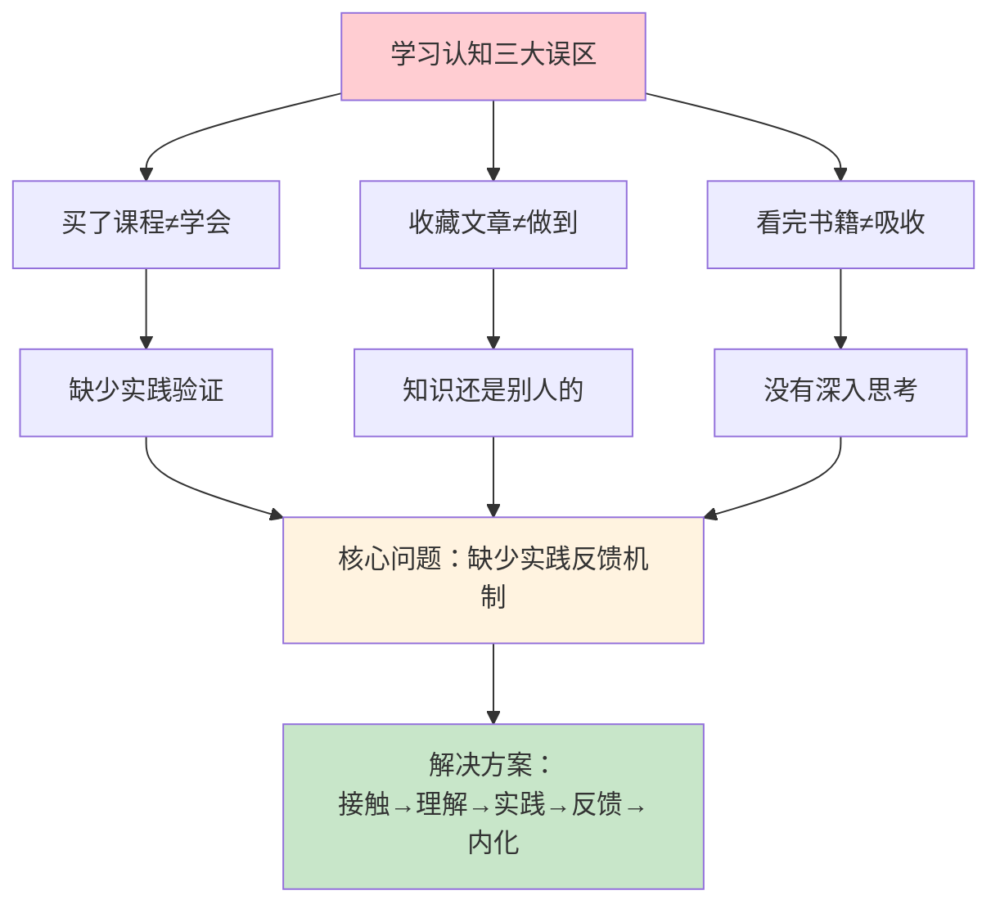

**三大学习认知误区**。第一，网络课程买了不等于学会一实践或讨论，理解就经不起推敲；第二，文章收藏了不等于做到，那些知识仍是别人的，学完后责任才递交给你；第三，书籍看完了不等于吸收，不去思考、没有自己的见解，过段时间大部分知识点就忘了。

什么时候才会真正内化？先要实践，从中得到反馈，再经过反思重温，知识才能真正沉进心里。**很多人的学习卡点，就卡在这个"实践反馈机制"上**。

准备这次课程的时候，我曾问自己：现在缺知识吗？答案是不缺，新闻、书籍、博客每天涌来，AI 检索还越来越强。**读者要的从来不是更多的知识，而是"怎么更有效地学习和输出"这个附加值**。

从"知道"到"做到"之间，有一条清晰的四阶路径，很多人卡在前面几步：**知道**是接触了信息，靠阅读听课就能到，容易停在此阶段；**理解**是能复述内容，靠思考提问支撑，但很多人只做到表面理解；**应用**是能解决问题，需要实践练习，卡点是不愿动手；**内化**是成为习惯，靠反复实践与反思，难在持续。

## 03.真正实现的目标

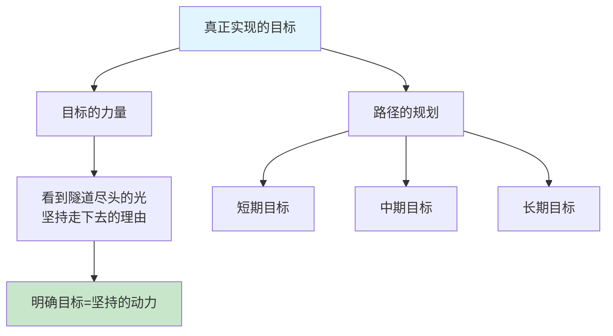

很多时候的学习，你看到前方漆黑一片：不知道自己走得对不对，也不知道走下去到底有没有效果。所以，**清晰的路径和可实现的目标就特别重要**。一旦能看到隧道尽头有一丝光，你就会告诉自己："尽管辛苦，但会走到底，因为看到了那个目标。"如果周围恰好还有一个火把，你会觉得"不是我一个人这么走"，坚持感就会翻倍。

**好目标有三个特征：可描述、可衡量、有时限**。"我想变得更好"不是好目标；"我要在 3 个月内读完 6 本专业书并输出读书笔记"才是好目标。好目标像一个 GPS 坐标，而不是一个模糊的方向。

## 04.方法论而非招数

方法论与招数的本质区别是什么？要思考为什么这么做，背后的理论体系是什么。把这两个问题想透，你就能掌握各种可变化的招式，来支撑自己更好地成长。

**很多时候的焦虑和"学习没效果"感，都不是因为你不努力，而是因为你只学了招数，没建起方法论**。招数是表面技巧，只在固定套路里短期有效；方法论是理解背后原理，能跨场景迁移、长期有效，甚至会改变你思考问题的方式。

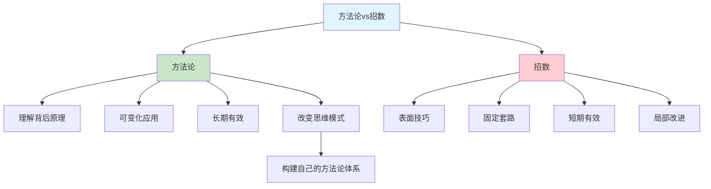

方法论不是凭空产生的，它来自对大量实践经验的**归纳、提炼、验证**：先在反复做同一类事情的过程中观察规律，再把有效的做法抽象成可复用的原则和框架，最后在新场景中不断验证迭代。

**方法论是你的操作系统，招数只是应用程序**。应用可以随时换，操作系统必须稳定强大。掌握方法论的人，面对新问题时不会慌，因为他有一套分析和解决问题的框架；只会招数的人，一旦遇到没见过的情况就手足无措。

## 05.学习要趁热打铁

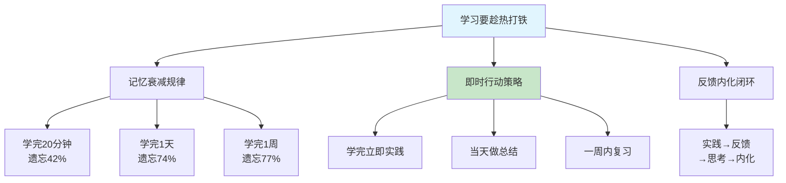

学完这一章，明天开始就要马上行动，打铁要趁热。很多人学完后说："等我有空再复习。"这基本等于不会再看，因为记忆曲线马上就会滑下去。

德国心理学家艾宾浩斯发现，**人在学习后 20 分钟内遗忘 42%，1 天后遗忘 74%，一周后遗忘 77%**。也就是说，如果你学完不立即行动，一周后大部分内容已经从脑中消失。

反过来，一旦你立刻行动、立刻实践，马上就会得到反馈；一有反馈就会思考；有了思考再回去重温，这时候知识就容易内化了。

**立即行动可以分三个层次**：学完 5 分钟内，用自己的话复述核心观点，达成初步理解；学完当天内，写一段总结或做一个小练习，加深记忆；学完一周内，在实际场景中应用所学，才算真正内化。

"趁热打铁"不是蛮干，而是一个完整的闭环：**实践 → 反馈 → 思考 → 重温 → 内化**。每一次实践都会暴露理解不到位的地方，每一次反馈都会让你重新审视知识的细节。**这个循环转得越快，知识内化的速度就越快**。

## 06.布置作业要实践

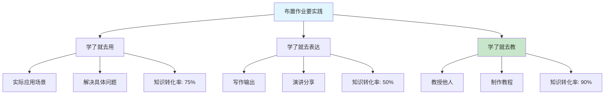

有作业才会督促你更好地思考、更完整地反思。想想读书时为什么学过的知识点很熟悉？因为课前预习、课后演练。**作业的本质不是负担，而是一种强制性的实践反馈机制**。

作业怎么实践？**要么学了就去用，要么学了就去表达，要么学了就去教**。三条路径依次带来越来越高的知识留存率：在实际项目中"用"一遍，留存率大约 75%；把学到的东西写成博客、笔记、朋友圈"表达"一次，留存率大约 50%；把它教给别人、做成培训或教程，留存率能拉到 90% 左右。这三种方式的难度也是依次递增的，越难，收益越高。

很多人的学习方式一直停留在"消费模式"，看书、听课、刷视频，本质都是输入。而真正高效的学习者，早已切换到了"创造模式"，写文章、做分享、教别人。**从被动接收到主动输出，这个转变，是学习效率质变的关键分水岭**。

每次学完一个知识点，逼自己用其中一种方式输出。刚开始可能吃力，坚持一个月你会发现，理解力、表达力和记忆力都会显著提升。

## 07.走出自己舒适圈

学习的本质就是难的。只有觉得难，你才知道自己离开了舒适圈。如果不难，说来说去都是你懂的东西，那就是无效学习。

**舒适圈最大的陷阱在于：它给你一种"我在学习"的错觉**。比如你已经很熟悉 Java 了，每天刷 Java 基础教程，看似在学习，其实只是在舒适圈里打转。真正的学习发生在你去研究 JVM 源码、去啃并发编程原理的时候，那些让你觉得"有点难"的地方。

心理学家维果茨基提出"最近发展区"理论：**真正有效的学习，发生在"你现在做不到，但稍加努力就可以做到"的区域**。这就是学习区。

判断自己是否在学习区，有一个简单的标准：如果**完全没有困难感**，你在舒适圈，需要提高难度；如果**有适度挑战感**，你在学习区，继续保持；如果**完全无法理解**，你在恐慌区，需要降低难度。

每一次觉得难，你才知道时间没白花。不要怕难，就怕你没有开始的勇气。

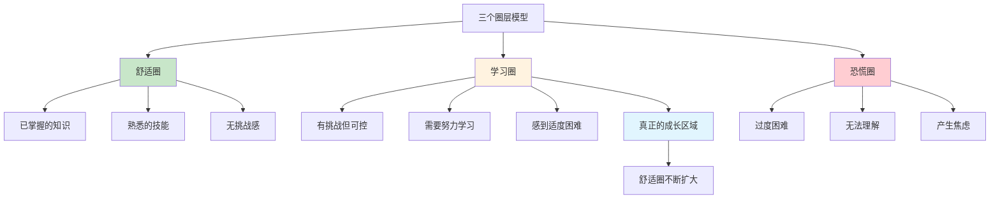

走出舒适圈不是一蹴而就的，需要"刻意练习"，**有针对性地选择略高于自己当前水平的挑战，在挑战中获得反馈，在反馈中不断调整**。每完成一个挑战，舒适圈就扩大一圈，之前觉得难的东西就变得容易了。

## 08.不妄想立即改变

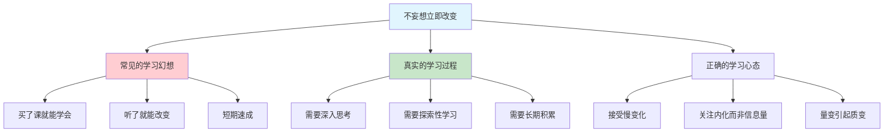

**速成心态的危害**。有人花钱买了课程，学了一段时间发现没多大效果，便开始吐槽，然后加入口水战。妄想通过一系列课程就改变生活本质的人，如果听听课或学习下就能获取成功，这就是幻想。速成心态的核心问题在于：**把"知道"等同于"做到"，把"接触"等同于"掌握"**。事实上，从知道到做到，中间隔着大量的实践、反思和迭代，没有捷径。

**深入思考才能质变**。大牛们提供的知识、理论工具、结论预测，都是经过反复加工与精细化的产物。倘若你不深入思考或探索性学习，很难发生质变。**重要的不是你看到或听到了多少，而是你内化了多少**。

**拥抱长期主义**。学习是一场马拉松，不是短跑冲刺。**真正的改变，是在日积月累中悄然发生的**，今天比昨天多理解一个概念，这周比上周多解决一个问题，这个月比上个月多掌握一项技能。不要期望学了一门课就脱胎换骨，要期望自己每天进步 1%。1% 看起来微不足道，但一年下来就是 37 倍的提升。

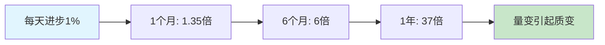

## 09.学习根源框架图

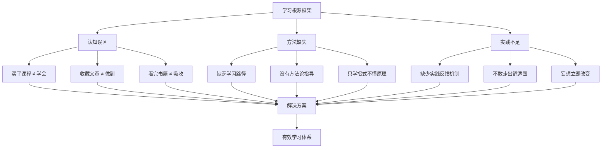

**三大根源的关系**。认知误区、方法缺失和实践不足不是孤立存在的，而是层层递进、互相加强的恶性循环：**认知误区导致你选错方法，错误的方法让实践无效，无效的实践又反过来加深"学习没用"的认知**。打破这个循环的关键入口是认知，一旦你真正意识到"看过 ≠ 做到"，就会主动寻找正确的方法论；有了方法论，实践才有方向和效果；有了有效反馈，认知就会持续纠正与升级。

**从框架到行动**。理解框架之后，最重要的是把它转化成日常的自检清单。每次学完一个知识点，问自己三个问题：**认知**上，我是"看过"还是"做到"了？合格的标准是能用自己的话复述核心；**方法**上，我用的是方法论还是随意的招数？合格的标准是有明确的学习步骤和框架；**实践**上，我实践过了吗、得到反馈了吗？合格的标准是至少在一个场景中应用过。任何一个问题回答否定，说明这个知识点的学习还没闭环，需要继续补完。

**有效学习时序图**

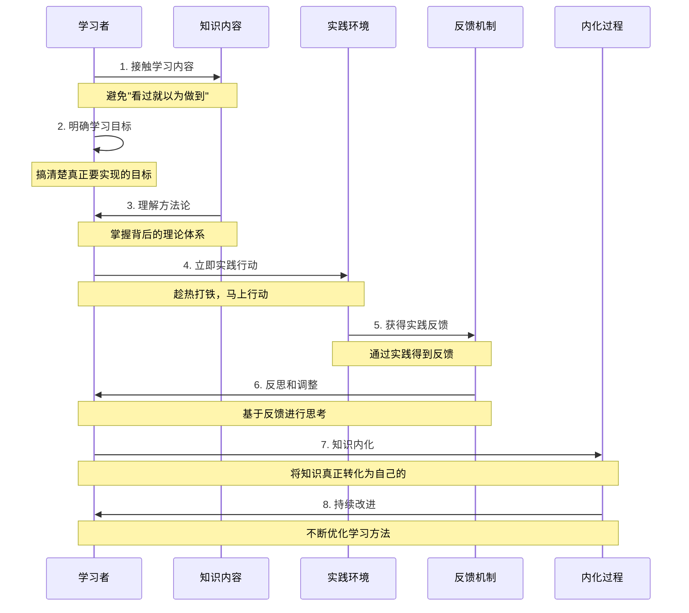

## 10.总结回顾本章节

**学习的本质不是"接触了多少知识"，而是"内化了多少知识"，七大原则的所有努力都是为了把"看过"变成"做到"。**

你应该带走三件事：

1. **学完必须有"输出动作"才算闭环**：用、表达、教三选一，没输出等于没学。

2. **学习一定要在"学习区"做才有用**：舒适圈是错觉，恐慌区是焦虑，只有"难一点"才是成长。

3. **学习是日积月累的马拉松**：买课、收藏、囤资料都是幻觉，每天 1% 的真实积累才是复利。

## 11.后来发生的改变

当周我做了三件事：把收藏夹按"半年没看过"全部清空，几百篇瞬间归零；把硬盘里 22 门课列成一张表，标注"是否真的需要 / 替代方案是什么"，最后只留 3 门；把"七大原则"打印出来贴在显示器边框，每条配一个我撞过的南墙案例。

第二天我开始按"学完必须输出"逼自己：只看那 3 门课中第一门的第 2 章，看完当晚就写了一篇 800 字的博客发到掘金和 CSDN。

**接下来那个月**，我只盯一门课，24 节的移动端架构。每天看 1 节，看完立刻写一篇笔记，每周末挑一节做一个 demo 推到 GitHub。月底回头看：24 节看完了 22 节，产出 22 篇笔记、4 个 demo。**这是我工作 3 年来第一次完整学完一门技术课**，不是我变自律了，而是每节都被自己强制输出了一次。那个月我没有再买任何新课、没有新增任何收藏。

**之后半年**，我严格按七大原则：一次只攻一门、必须输出、必须在"学习区"、不期望速成、按 PDCA 每月复盘。半年下来我学完了 3 门课（移动端架构、Java 虚拟机、算法和数据结构），写了 60 多篇内网博客，做了一次部门技术分享。最重要的是，**3 年没动过的技术栈，半年内换了一遍**。

部门年中评估时，组长说："你这半年明显不一样了。"从那时起我每隔一段时间就会自我提醒一次：**别再用"我在学习"骗自己**。

## 12.今天起改变三点

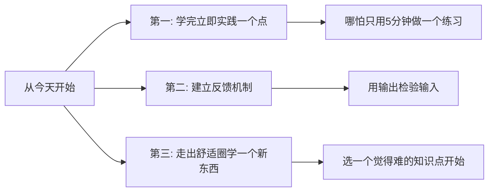

**1. 学完立马实践**。学完任何内容后，立即实践其中一个点。不要说"等我有空再复习"，那基本等于不会再看。哪怕只花 5 分钟做一个小练习或用自己的话复述一遍，也比纯粹收藏有效 100 倍。

**2. 建立反馈机制**。最简单的反馈机制就是"输出"，试着讲给别人听，或写一段文字发到朋友圈、博客、笔记本上。如果你讲不清楚、写不出来，说明还没真正理解。**这个过程本身就是最好的反馈**。

**3. 挑战难点学习**。主动选一个让你觉得"有点难"的知识点。如果学的东西都很轻松，说明你一直在舒适圈里打转。真正的成长发生在学习区，那个让你觉得有挑战但又不至于完全懵的地方。

## 13.课后作业思考下

**1. 学习转化率自测**：审视过去一个月的学习行为，你买了几门课？收藏了几篇文章？其中真正实践过的有几个？算一下你的"学习转化率"（实践数 / 学习数），这个数字让你满意吗？

**2. 学习目标明确化**：用一句话写下你当前最重要的学习目标。如果写不出来，说明目标还不够明确，花 15 分钟认真想一想，写下来贴在桌面上。

**3. 七大原则改进计划**：选择本章七大原则中你做得最差的一条，制定一个为期一周的改进计划，一周后回顾效果。

**4. 立即输出实战**：找一个最近学完但还没实践的知识点，今天就用"学了就去用 / 表达 / 教"三种方式中的一种来实践它。

---

> **📎 下一站** ｜ 原则搞清楚了，接下来该看清"我现在在哪一层"。第 2 章我们用马斯洛需求层次模型，帮你把当前追逐的一堆目标做一次分层筛除。
