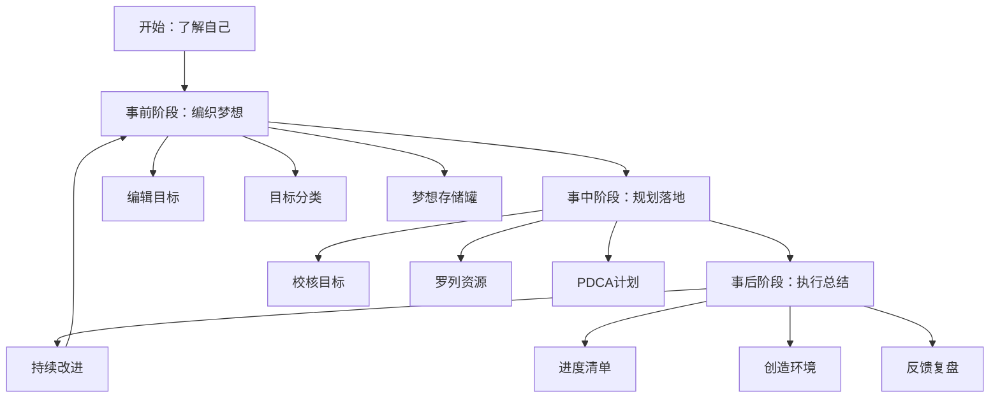
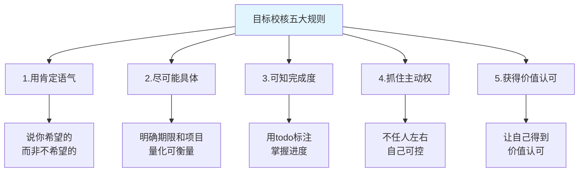
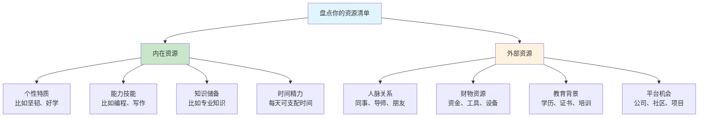
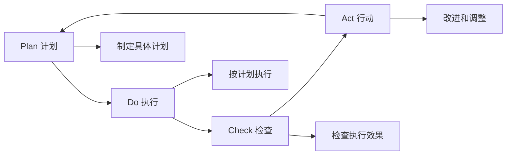
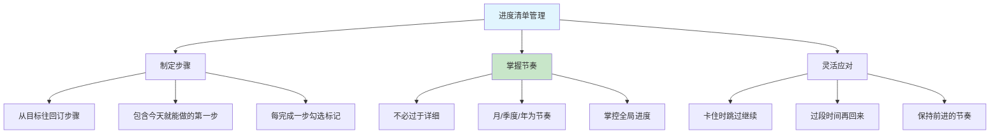
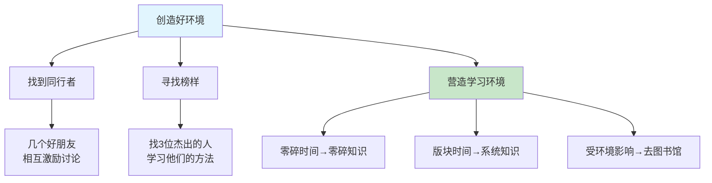
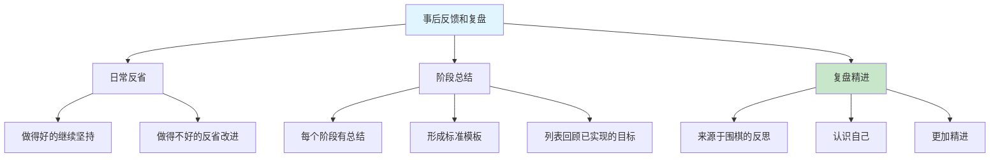
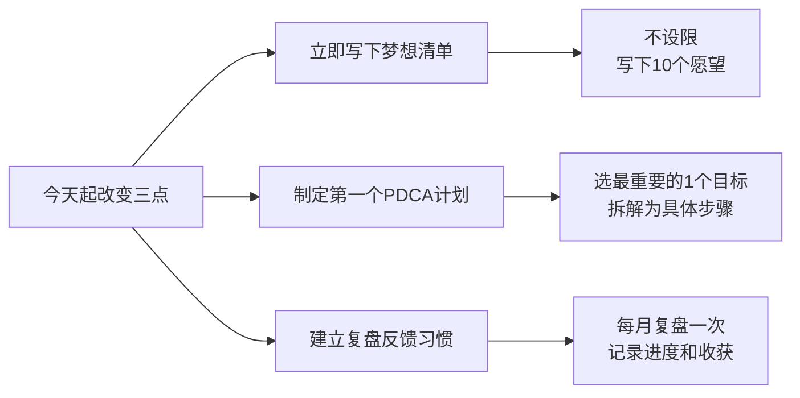

# 1.3一起来做个练习
#### 目录介绍
- [01.看一个真实案例](#01看一个真实案例)
- [02.这是重要的练习](#02这是重要的练习)
- [03.事前要编辑目标](#03事前要编辑目标)
- [04.事前对目标分类](#04事前对目标分类)
- [05.事前梦想存储罐](#05事前梦想存储罐)
- [06.事中要校核目标](#06事中要校核目标)
- [07.事中罗列些资源](#07事中罗列些资源)
- [08.事中用PDCA计划](#08事中用pdca计划)
- [09.事后弄进度清单](#09事后弄进度清单)
- [10.事后创造好环境](#10事后创造好环境)
- [11.事后反馈和复盘](#11事后反馈和复盘)
- [12.总结回顾本章节](#12总结回顾本章节)
- [13.后来发生的改变](#13后来发生的改变)
- [14.今天起改变三点](#14今天起改变三点)
- [15.课后作业思考下](#15课后作业思考下)

## 01.看一个真实案例

那天下午，领导告知我让出今年的晋升名额，明年再议。我笑着应下，回到工位照常写完了周报。

那一刻我忽然惊醒，毕业八年，我从未写过属于自己的愿望清单。父母盼我进大厂，老板要我冲 KPI，我为别人的目标拼了八年，竟答不出一句 “然后呢”。

铺开 A4 纸，“我想要的” 四个字落下后便迟迟难续。三十岁的人，怕愿望幼稚遭自己取笑，更怕落空徒留遗憾。那夜坐到天亮，我逼自己无论多不切实际都要写下来，从忐忑到坦然，最后写下整整 23 条。

这张纸我留到现在。那是我人生第一次真正的梦想练习，无关任务、鸡汤与炫耀，只是把自己的渴望坦诚摊开。前三十年我都在替别人活，今天，我想带你认真做一遍这场练习。

## 02.这是重要的练习

了解自己，是一切成长的起点。这场梦想练习的意义，就是帮你直面本心，敢去期许、敢去定义自己真正想要的生活。如果连自己要什么都不清楚，又该往哪里用力？

找一段不被打扰的时间，拿起纸笔，一步步向内探索。不必强求一次做完，若中途停下，次日再续也无妨，这是一场和自己的对话，不用赶时间。尽量在一周内完成，几周之后你会发现，内心越来越笃定，对未来的方向也日渐清晰。

清单不是写完就结束，它需要你反复打磨、时常翻看。久而久之，你对生活的感知会愈发敏锐，能主动在工作、日常与人脉里抓住推动目标的机会，把周遭的力量化为己用。

身边人会慢慢看见你的改变。几年之后回头看，许多当初写下的愿望，已在不知不觉中落地。你会站在一个曾经的自己、甚至旁人都未曾预料的高度。

这场练习从设想到落地，可分为三步：**事前编织梦想——>事中详细规划和落地——>事后持续落实和总结**。

## 03.事前要编辑目标

**开始编织美梦，包括你想拥有的，你想做的，你想成为的，你想体验的**。现在，请坐下来，拿一张纸和一支笔，动手写下你的心愿。

在写的时候，不必管那些目标该用什么方式去达成，就是尽量写。直到你觉得没有什么可以写的时候，你可以看看下面几个问题并回答它们，这些问题会引导你去了解自已内心深处的渴求，这会花上一些时间，但你现在的努力，将是为下一步丰盛的收获作下基础。

**七个引导思考的问题**

1.在你生活中，你认为哪五件事情最有价值？

2.在你的生活中，有哪三个最重要的目标？做个梦想存储罐，可以先罗列 10 个目标然后再依次去除！

3.假如你只有六个月的生命，你会如何地运用这六个月？

4.假如你立刻赚取了第一桶金，在哪些事情上，你的做法会和今天不一样？

5.有哪些事是你一直想做，但却不敢尝试去做的？

6.在生活中，有哪些活动，你觉得最重要的？

7.假如你确定自己不会失败（拥有充实的时间、资源、能力等），你会敢于梦想哪一件事情？

**这 7 个问题里最狠的一题，是第 5 题，"不敢尝试去做的"**。当年我写到这题的时候，第一反应是"没有"，但是拧了半个小时之后，真正的东西才冒出来：我不敢公开写作、我不敢在会议上反驳领导、我不敢承认我不想做管理……每个"不敢"的背后，都藏着你真正在乎的东西。

## 04.事前对目标分类

回答完这些问题后，把所列出的所有目标分成六个类，对学习知识分成四个类。

**目标分类的作用，主要是为了让自己平衡生活和工作，均衡发展。知识分类的作用，主要是为了自己，学习有个优先级**。

对目标分类：**1、健康；2、修养/知识；3、爱情/家庭；4、事业/财富；5、朋友；6、社会。**

对知识分类：**1、了解；2、理解；3、熟悉；4、掌握**。在学校时老师反复强调，如今工作多年慢慢有了点感悟。

我当时做完分类突然发现，我那 23 条愿望里，"事业 / 财富" 类占了 15 条，"健康"只有 0 条，"朋友"只有 1 条。这个分布让我愣住了：原来我一直说"我是一个很顾家、很重友情的人"，但在我真实的愿望清单上，家庭和朋友几乎没有位置。

**分类不是为了统计，而是让你看清楚你嘴上说的自己和真实在追的自己之间有多大的距离。**

## 05.事前梦想存储罐

写完十个愿望后，圈出最重要的三项。每天把这份清单通读一遍，它会反复锚定你的方向，让你下意识在生活中捕捉能推动愿望落地的机遇。为什么只选三个？人的注意力与精力终究有限。心理学研究表明，同时追逐三个以上目标时，每一项的完成概率都会大幅下降。选三个不是束缚梦想，而是让你在当下集中力量，精准突破。

你可以准备几个罐子当作 “梦想储蓄罐”，每个重要愿望对应一个，把写着愿望的纸条放进去；每实现一个就做好标记，给自己清晰的正向反馈。

这背后是心理学的 “曝光效应”：你越频繁地看见目标，大脑就越会将它判定为重要事项，潜意识会自动搜寻相关的机会与资源。把梦想写下来、放在视线可及之处，远比停留在脑海里的空想更有力量。

一定要给目标设定期限。审视每一个愿望，写下你期望达成的时间。有期限的才叫目标，没有时限的只是梦想，迟迟不落地的，终会沦为空想。

从中选出今年对你最重要的三个目标，你最愿意投入、最让你满怀期待、达成后最有满足感的三件事，把它们单独记录下来。

最后，清晰笃定地写下你要实现它们的真正理由，明确达成的把握，以及它们对你的意义。知道为何出发的人，才能走得更远。追求目标的动机，永远比目标本身更有支撑力。

## 06.事中要校核目标

想通过技术开发一年赚 100 万，这是欲望不是目标。虽然说设置目标要远大，但是一定要具体，不要吹牛逼。

因为你我大都是普通人……**目标和欲望的核心区别在于：目标有路径，欲望只有方向**。"我想变有钱"是欲望，"我要在 2 年内通过 XX 技能把月薪从 1 万提升到 3 万"才是目标。

核对你所列的三个目标，是否与形成结果的五大规则相符：

| 规则 | 要求 | 正面示例 | 反面示例 |
|------|------|----------|----------|
| **肯定语气** | 说你希望的 | "我要每天读30页书" | "我不要再浪费时间" |
| **具体明确** | 有期限和数量 | "3个月内学完数据结构" | "我要学好算法" |
| **可检验** | 知道完成了没 | "完成10个项目实践" | "我要多练习" |
| **主动可控** | 你能掌控的 | "每天投入2小时学习" | "等公司给我机会" |
| **价值认可** | 有意义感 | "能提升我的核心竞争力" | "别人都在学我也学" |

每一个目标都要经过 SMART 原则的检验：**Specific（具体的）、Measurable（可衡量的）、Achievable（可达到的）、Relevant（相关的）、Time-bound（有时限的）**。通过了这五项检验的目标，才是一个真正值得你投入时间和精力去追求的好目标。

## 07.事中罗列些资源

接下来，请盘点你已经拥有的重要资源。着手任何计划之前，先看清自己手里有哪些可用的工具。

很多人制定目标时总盯着“我还缺什么”，却常常忽略“我已经有什么”。事实上你手边的资源，远比你想象的更丰厚。梳理清楚已有资产，不仅能夯实信心，也能帮你找到实现目标的最短路径。

你可以从以下维度逐一盘点，清单越详尽越好：

- **时间资源**：每天能投入多少有效时间？周末有多少整块空闲？
- **能力资源**：你目前最擅长的3-5项核心技能是什么？
- **人脉资源**：在你的目标领域，有哪些人能为你提供指引或助力？
- **信息资源**：你知道从哪里获取高质量的学习资料与行业信息？
- **财务资源**：你愿意为达成目标投入多少学习与试错成本？

最聪明的资源利用方式，从来不是平均分配，而是找到能产生杠杆效应的关键支点。一位靠谱的导师或许胜过泛读百本书，一次真实的项目实践往往比刷百道题更有成长。找到你的杠杆资源，集中力量投入，才能事半功倍。

## 08.事中用PDCA计划

毕竟一开始目标或者远景，规划得再好，如果没有落地执行，那么也产出不了任何价值。

所谓 PDCA 执行法，就是把事情的执行过程分成四个环节：计划（Plan）、执行（Do）、检查（Check）和行动（Act），从而把控执行过程，保证具体事项高效高质地落地。

写下要达成目标本身所具有的条件。是坚持的毅力，还是好的方法，还是工具的优势，都写下来。

写下你不能马上达成目标的原因。首先你得从剖析自己的个性开始，是什么原因妨碍你的前进？要达成目标，你得采取什么做法呢？如果你不确定，可以想想有哪位成功者值得你去学习？

你得从最终的成就倒算，记得大学学机械时，有门课程叫做逆向工程，当时不太懂，现在有点顿悟呢。就是先有结果然后逆向推导。往你目前的地位一步步列出所需的做法。

## 09.事后弄进度清单

现在请你针对自己那三个重要目标，制订出实现它们的每一步骤。别忘了，从你的目标往回订步骤，并且自问，我第一步该如何做，才会成功？是什么妨碍了我，我该如何改变自己呢？

一定要记得你的计划得包含今天你可以做的，千万不要好高骛远和吹牛逼。同时，如果某一天卡住了，可以选择跳过进入下一个目标。过段时间再去看卡点和解决。

进度清单，不要太过于详细，我理解为就是掌控一个全局进度的清单，写好每一个阶段做的事情即可，每次完成一个节奏勾选一下。因为我试过，每周弄清单那种实在太累了，调整成月，季度，年这个节奏会好一点。

**推荐的进度管理节奏**：

| 时间维度 | 管理颗粒度 | 关注点 |
|----------|-----------|--------|
| **年度** | 3-5个大目标 | 方向和愿景 |
| **季度** | 每个目标的里程碑 | 阶段性成果 |
| **月度** | 本月核心任务 | 可交付产出 |
| **每日** | 当天最重要的1件事 | 立即行动 |

在执行过程中遇到卡点是非常正常的。**关键不是永远不卡住，而是卡住了以后知道怎么处理**。遇到卡点时，先判断是能力问题还是资源问题，能力不够就去学习，资源不够就去借力。如果短期内解决不了，先跳过去做能推进的部分，保持前进的节奏比什么都重要。

## 10.事后创造好环境

遇到低谷、心生倦怠想躺平时，不必硬撑，找两三位同频好友深聊，彼此借力。

一个人走得快，一群人走得远。找2-3个目标相近的伙伴，建小群或定期碰面——你想放弃时，他们的坚持会拉你一把；他们迷茫时，你的经验也能照亮对方。

再选出3位目标领域的杰出人物，身边前辈或公众人物皆可。闭眼设想他们当面给你建议，逐条记下他们达成目标的路径与方法。榜样的价值不在模仿行为，而在拆解思维：同样处境里他们为何做出不同选择？关键节点的判断依据是什么？读懂这些，才算真正把榜样的力量化为己用。

主动为自己创造适配的环境。碎片时间学零散知识，整块时间攻系统内容；易受干扰就去图书馆这类专注场域。环境对学习效率的影响被多数人严重低估——嘈杂的办公室与安静的图书馆，效率可能相差3-5倍。不是你意志力不足，是环境在消耗你的注意力。找到一个“进场就能沉下心”的空间，是提效最省力的方法。

最后做一次向内复盘：盘点过往你运用得最纯熟的资源，选出人生中两三次最成功的经历，仔细回想当时做对了什么，才促成了事业、人际或成长上的突破。你过去的成功经验，是最宝贵的方法论库。提炼出背后的关键逻辑，就是你可以反复复用的“成功配方”。

## 11.事后反馈和复盘

经常反省所做的结果，一定要经常反省，这个反省针对自己做的好的要继续坚持，如果不好的那就要反省自己那些做的不好。每个阶段对结果要有总结，这种总结最好形成模板。

**反省不是自我批评，而是客观地审视自己的行为和结果**。推荐一个简单的反省框架：

| 反省维度 | 问自己的问题 |
|----------|-------------|
| **成果** | 这个阶段我完成了什么？达到预期了吗？ |
| **过程** | 我的方法有效吗？有没有更好的做法？ |
| **心态** | 我在过程中的状态如何？有没有半途想放弃？ |
| **收获** | 我从中学到了什么？可以复用到其他事情上吗？ |

列一张表，写下过去曾是你目标而目前已实现的一些事。你要从其中看看自己学到了些什么，这期间有哪些值得感谢的人，你有哪些特别的成就。

有许多人常常只看到未来，却不知珍惜和善用已经拥用的。**定期回顾已实现的成就，不是为了自满，而是为了从成功中提炼可复用的经验**。每一次成功都不是偶然的，找到背后的关键因素，它们就是你最有价值的方法论。

有时候，事情没做好，进度没坚持下来。一定要懂得一点复盘的常识，复盘在于认识自己，来源于围棋事后的反思。这样可以更加精进。复盘可以形成自己模板。

推荐一个简单实用的复盘模板（**GRAI 复盘法**）：**1.Goal（目标）**：当初的目标是什么？**2.Result（结果）**：实际达成了什么结果？**3.Analysis（分析）**：目标和结果之间的差距是什么？原因是什么？**4.Insight（洞察）**：从中得到了什么经验教训？下次怎么做会更好？

## 12.总结回顾本章节

**一次认真的梦想练习 = 一张纸 + 一支笔 + 一整段敢于写下真实想要的时间，三者缺一不可。**

你应该带走的三件事：

| 关键词 | 一句话理解 | 何时用到 |
|--------|-----------|----------|
| **敢写下来** | 梦想没被写在纸上之前，都只是空想 | 生日、年初、重大节点 |
| **选 3 不选 10** | 同时追 10 个你会一个都拿不下 | 定年度目标时 |
| **PDCA + GRAI** | Plan Do Check Act 做循环，GRAI 做复盘 | 每个季度做一次 |

## 13.后来发生的改变

凌晨写下的 23 条愿望，第二天一早我便用红笔做了两轮筛选。

第一轮逐条叩问自己：“一年后回头看，这件事没做成会不会遗憾？” 筛去不遗憾的条目，剩下 7 条。第二轮再选：“这 7 条里，哪 3 件事我最愿意今年立刻着手？” 最终定下三个目标：写专栏、系统健身、陪爸妈出门旅游一次。

我给每个目标都做了一页纸的 PDCA 规划。以写专栏为例：计划每周一篇 2500 字，固定周日晚八点动笔，每月复盘阅读量与读者反馈，次月据此调整选题。落笔时我忽然醒悟，从前我做的从来不是计划，只是口号。“今年要多读书” 的 flag 立过无数次，却从没写过 “每周日 20 点到 22 点固定阅读并输出” 这样的细则。颗粒度不落地，行动就永远不会发生。

半年后回看清单：专栏累计更新 22 篇，打勾；体脂从 26% 降到 19%，健身目标打勾；陪爸妈旅游因父亲身体调整为每月在家陪他们吃四顿饭，也算换一种方式兑现了承诺。

三条目标里两条完全达成，一条灵活调整后落地。但比结果更珍贵的是，我第一次真切地感受到，生活是握在自己手里的，不是被老板、旁人推着走。这份实打实的掌控感，值回了那晚所有的无眠与动容。

## 14.今天起改变三点

今天就找一个安静的时间，拿起纸笔，不设任何限制地写下至少 10 个你想实现的愿望。不要在意它们是否现实，先让自己敢于梦想。然后从中圈出最重要的 3 个，贴在你每天都能看到的地方，让它们时刻提醒你前进的方向。

选择那 3 个目标中最紧迫的一个，用 PDCA 方法制定具体的执行计划。把大目标拆解成可以立即行动的小步骤，明确每一步的时间节点和验收标准。记住，计划中一定要包含今天就可以做的第一步，千万不要只停留在规划阶段。

从这个月开始，每月底花 30 分钟做一次目标复盘。记录做得好的地方继续坚持，做得不好的反思原因并调整方案。不需要太复杂，一张简单的表格即可，列出目标、进展、问题和下一步行动。持续三个月，你会看到自己显著的变化。

## 15.课后作业思考下

**1.梦想探索练习**：请用 30 分钟时间，安静地回答文中提到的 7 个深度问题（比如"假如你只有 6 个月的生命，你会如何运用？"），然后对比你日常的时间分配，看看两者之间有多大的差距？这个差距告诉了你什么？

**2.目标分类与优先级**：把你写下的所有愿望，按照健康、修养/知识、爱情/家庭、事业/财富、朋友、社会六个类别进行分类。哪个类别的目标最多？哪个最少？这种分布是否反映了你当前生活的不平衡之处？

**3.PDCA 实操训练**：选择一个你本周就能开始的小目标，完整走一遍 PDCA 循环，制定计划、执行、检查结果、总结改进。一周后回顾这个过程，你在哪个环节做得最好？哪个环节最容易被忽略？

**4.复盘方法论实践**：回顾过去一年中你最成功的一次经历和最失败的一次经历，分别用"做了什么特别的事导致成功/失败"的视角来分析。把分析结果写下来，看看能否从中提炼出适用于未来的行动原则。
