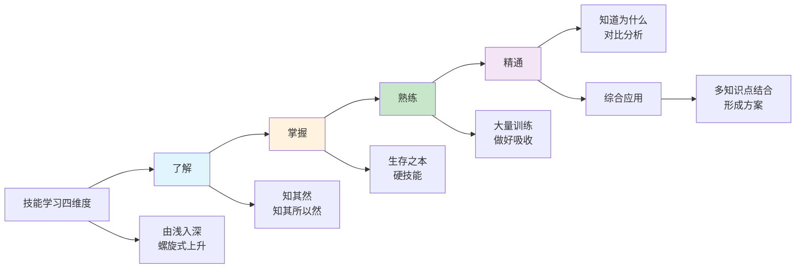
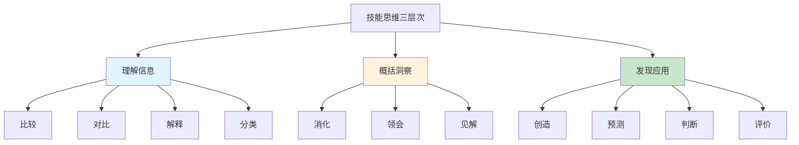
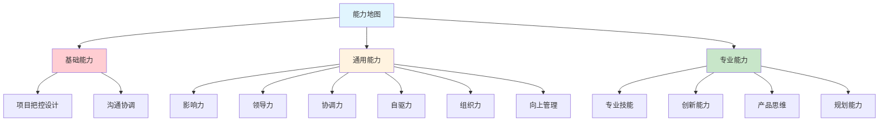
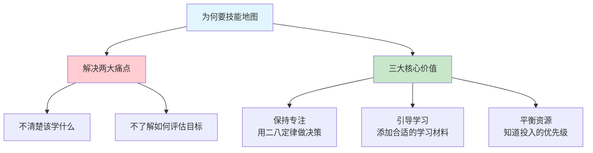
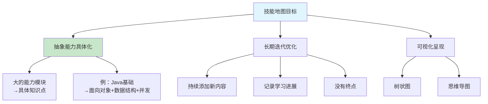
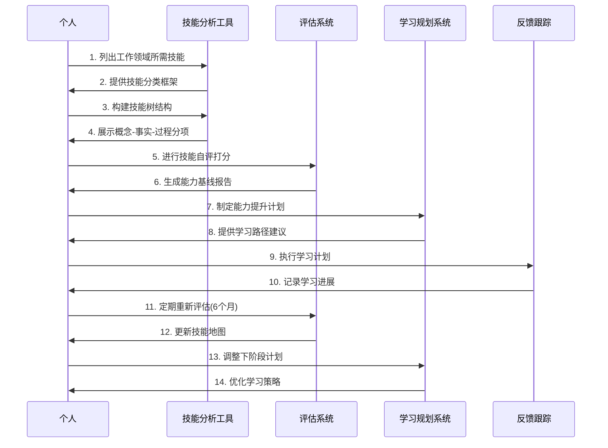
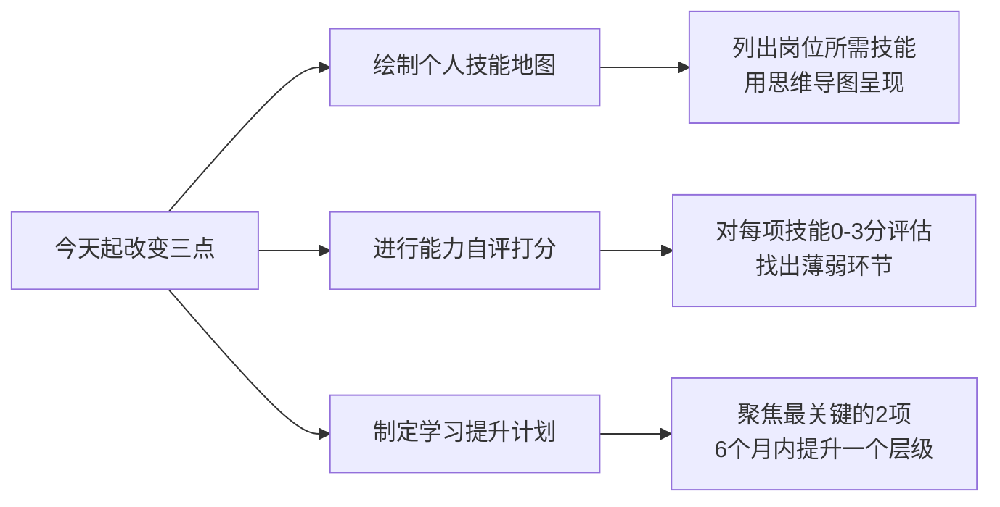

# 04.要带上技能地图
#### 目录介绍
- [01.看一个真实案例](#01看一个真实案例)
- [02.晋升资本是什么](#02晋升资本是什么)
- [03.技能的学习维度](#03技能的学习维度)
- [04.技能的思维纬度](#04技能的思维纬度)
- [05.技能地图的用途](#05技能地图的用途)
- [06.能力地图的划分](#06能力地图的划分)
- [07.为何要技能地图](#07为何要技能地图)
- [08.技能地图的目标](#08技能地图的目标)
- [09.技能地图的构建](#09技能地图的构建)
- [10.总结回顾本章节](#10总结回顾本章节)
- [11.后来发生的改变](#11后来发生的改变)
- [12.今天起改变三点](#12今天起改变三点)
- [13.课后作业思考下](#13课后作业思考下)

## 01.看一个真实案例

工作第五年，我去面试一家心仪的大厂。后半程面试官合上简历问：“抛开简历，说说你在项目里具体做了什么？”我报出组件化开发、性能优化、并发处理一堆名词，他再追问：“深入到什么程度？能独立承担什么量级的工作？”我瞬间卡住了。

我说不清Java到底“熟”到什么层级，也道不出高并发项目的具体QPS和我做的优化动作。四十秒的沉默里，只剩空调送风的声响。最后面试官礼貌收尾，我知道这轮面试结束了。

坐在大楼外的马路牙子上，我想了整整一小时。工作五年，我居然说不清楚自己真正会什么。不是能力单薄，而是我从未认真盘点过自己，我误以为忙碌就是成长，项目数量等于技术深度，“感觉还行”就是实打实的实力。

当晚回家，我摊开一张A3纸，把五年接触过的所有技术点一一列下。看着纸上三十多个零散的技术名词，我彻底愣住了：它们毫无体系，我分不清哪项能独立扛事，哪项只是浅尝辄止，更看不出什么是自己的核心壁垒。

那一刻我明白，没有技能地图的人，就像大海里没有航海图的船长。划桨再用力，也不知道自己身在何处，看不清前路的风口与暗礁。

从那晚起，我画出了第一版属于自己的技能地图。今天，我想把这张地图的绘制、使用与迭代方法，一步步讲给你听。

## 02.晋升资本是什么

很多人张口就定下月薪多少、坐到什么职位、未来赚多少钱的目标。听完这些远大蓝图，不妨反问一句：你凭什么达成？你的资本是什么？

怀揣抱负的你，有没有认真想过，支撑目标落地的底气在哪里？对职场人来说，晋升的核心资本从来不是野心，而是你清晰的优势、技能与资源，也就是属于你的能力地图。

无论身处什么行业，你是否也常有这些困惑：

1.对工作缺乏系统认知，遇到问题没有成熟的流程与方法指引方向？ 2.想针对性补短板，却不知道自己缺什么、该从哪里入手？ 3.学了不少干货课程，却落不了地，对实际工作毫无助益？ 4.学习时杂乱无章，不会归类沉淀，也始终找不到清晰的目标？

当年这四条我全中。不是不努力学，而是学完的知识全在脑子里零散堆着，从来没真正梳理归档过。

## 03.技能的学习维度

在技能地图中，需要先开启和点亮哪些部分呢？回顾过去的经历并结合现实的需要，可以从四个由浅到深的维度来说明：**了解**是知其然、甚至知其所以然，不必掌握但要有基本认知，例如"知道 Redis 是什么、用来干嘛"；**掌握**是硬技能，一上手就要求会用，深度可以在实践中迭代，例如"能用 Java 独立写出 CRUD 功能"；**熟练**是大量训练后的深度掌握，不仅会用还能做好，例如"能独立完成一个完整项目"；**精通**比熟练再进一步，能讲清"为什么这么做"、能对比分析，例如"能做技术选型和架构设计"。

**关键的两条跨越**：

- **从"了解"到"掌握"**：很多人在"了解"这个层次上自我感觉良好，真正被追问才发现一知半解。当年我嘴上说"了解 Redis"，其实连持久化机制都没认真看过。
- **从"掌握"到"熟练"**：关键跨越在于"刻意练习"——有针对性地训练薄弱环节，而非简单重复已会的内容（参见 14 章）。

**精通之上还有一层——综合应用**：不是单一技能的精通，而是多个技能的融合运用。比如一个架构师，需要同时精通编程、系统设计、性能优化、团队协作等多个方面，才能做出好的架构方案。

## 04.技能的思维纬度

技能思维的培养比较务虚、不好判断。在技能地图中，可以把思维维度分成三个可量化的层次：**理解信息**——负责接收和处理，关键动词是"比较、对比、解释、分类"，典型表现是"看完文档能说出要点"；**概括洞察**——负责提炼和归纳，关键动词是"消化、领会、见解"，典型表现是"从多个案例中总结规律"；**发现应用**——负责创造性运用，关键动词是"创造、预测、判断、评价"，典型表现是"预判技术趋势做出决策"。

当明确了目标和内容，必须用技能去实现。那么技能思维就很重要，认知领域非常强调目标的实现，要多用动词去量化或者考核目标的实现。

**大多数人的思维停留在第一层次"理解信息"，能看懂，能复述，但无法提炼出更深层的洞察**。要提升思维层次，需要刻意训练：每次学习新知识后，逼自己回答三个问题，"这说明了什么？""和我之前知道的有什么关联？""我能用它做什么？"

从"理解信息"到"发现应用"是一个质的飞跃。**前者是被动的接收者，后者是主动的创造者**。

很多技术人员技术能力很强，但在技术选型、架构决策上频频失误，就是因为思维还停留在"理解"层面，缺少"判断和预测"的能力。培养这种高层次思维，需要持续地做技术选型对比、架构方案评审、以及对技术趋势的前瞻性思考。

## 05.技能地图的用途

技能地图是一种帮助你规划、管理和追踪个人发展的工具，六大用途一句话讲清——**目标设定**看清当前水平和目标水平的差距；**需求分析**结合行业趋势确定哪些技能对未来重要；**现状评估**识别强项与短板，有的放矢；**路径规划**按优先级和依赖关系确定学习顺序；**进展追踪**记录已掌握技能、学习时间与成果；**动力激励**可视化进步带来的成就感。

**技能地图最大的价值不在于记录你"会什么"，而在于让你清楚地看到你"缺什么"**。大多数人对自己能力的认知是模糊的，觉得自己"还行"却说不清"行"到什么程度。技能地图把模糊的感觉变成了可量化的评估——**让职业发展从"凭感觉"变成"看数据"**：没地图的人不知道该学什么、学习缺乏方向、不知道自己进步了多少、对跳槽/晋升心里没底；有地图的人清楚差距在哪、有明确的优先级、能量化追踪进展、对自身价值有清晰认知。

## 06.能力地图的划分

**基础能力**是职场立足的根基——**项目把控**（能独立把控规模项目、能拆解大项目）+ **沟通能力**（跨团队协调、风险控制）。检验标准很简单：交给你一个完整的项目，你能不能从头到尾把它做好？

**通用能力**是让你从"做事的人"变成"能带人做事的人"的关键：**影响力**是部门级的口碑与话语权，表现为技术或专业上被广泛认可；**领导力**是预见与管理项目风险，推动项目顺利上线；**协调力**是跨团队资源协调，能平衡多方利益；**自驱力**是无人督促下的自我管理，能主动发现并推动问题；**组织力**是凝聚不同角色，提升团队战斗力；**向上管理**是与上级建立稳定反馈机制，在关键节点透传信息。

**专业能力**是你的核心竞争力——**专业技能**（技术原理和业务的深度理解）、**创新能力**（模块级技术决策、发现系统问题）、**产品思维**（权衡需求/体验/实现）、**规划能力**（制定和推动业务规划）。

**三者关系**：基础能力是地基，通用能力是框架，专业能力是装修——地基不稳楼建不高，框架不好空间受限，装修不好别人不愿来。三者缺一不可，但在不同阶段的优先级不同。

## 07.为何要技能地图

技能地图主要解决了两个痛点：**不清楚现在到底该学什么、不了解如何评估自己是否已达成既定学习目标**。

当你构建个人技能地图时，需要思考并规划出所有相关的分项知识与技能，还要标注出目前在这些知识与技能方面的熟练或精通程度。这个过程可以帮助你对自己的实际情况做出评估。

保持专注。构建个人技能地图的时候，你可以采用"二八定律"帮助自己做决策，明确自己最想要什么样的结果。

**二八定律在技能学习中的应用**：在你列出的所有技能中，20% 的关键技能决定了你 80% 的职场价值。找出这 20%，集中 80% 的精力去攻克它们，而不是平均用力。这就是技能地图的战略价值，它帮你做减法，而不是加法。

引导你正确学习。你需要在自己的技能地图中添加适合自己的学习材料，你可以通过网络搜索学习资源、请教身边的专业人士、参加讲座或者学习相关课程等等，获得学习材料。

构建技能地图，你可以平衡好各项学习资源，你可以知道不同技能对于你而言，需要投入的精力占比和优先级。**学习最怕的不是没有资源，而是资源太多不知道选什么。技能地图就像一个过滤器，帮你筛选出最匹配你当前需求的学习资源**。

## 08.技能地图的目标

由于技能地图上罗列的都是能力的抽象，在实际的生活中，还需要将技能具体化，这样做的目的是为了更加方便自己去落实和实践。

举一个简单的例子，针对移动端开发来说，拥有扎实的 Java 基础，那么具体化是要求掌握面向对象思想，熟练运用数据结构，掌握并发的知识等等，这就是将抽象能力具体化。

**具体化的原则是：拆到你可以直接开始学习的粒度**。如果一个技能点还是太大、太模糊，就继续拆。比如"掌握并发知识"还可以继续拆成"理解线程模型"、"掌握锁机制"、"了解并发容器"等更小的学习单元。

针对每一个大的能力抽象，尽可能的把它具体化，这是一个长期不断迭代优化的事项，因此这块可以做一个长期主义者。逐步去完善技能地图的拆分工作。

把学习一种知识或技能所需要的分项知识与技能，通过树状图或思维导图式的视觉呈现方式构建出来。

就个人技能树而言，它可能永远没有终点，你可以不断地往个人技能树上添加内容，比如追加新的分项知识与技能、记录自己的学习进展、添加各种学习资源等等。

**好的技能地图应该是"活的"，它随着你的成长不断进化**。建议每 6 个月做一次大的更新：删掉已经不需要的技能点，添加新出现的技能需求，调整各技能的优先级。你的技能地图就是你职业发展的"活地图"。

## 09.技能地图的构建

技能地图构建的**四个步骤**：

**第一步：列出所有技能**——把工作领域需要的技能逐一列出，按"概念（需理解）/ 事实（需记忆）/ 过程（需练习）"三类描绘，最好用思维导图。

**第二步：构建技能树**——按上述三类展开。以学骑自行车为例：概念下罗列"前灯/轮胎/头盔"，事实下罗列"交规/信号灯含义"，过程下罗列"上车/踩踏/刹车"。**可以加亮显示核心事项以保持专注**。

**第三步：自评打分**（0-3 四级）：
- **0 - None**：不具备该项能力
- **1 - Basic**：具备基本能力
- **2 - Competent**：完全具备能力
- **3 - Professional**：专家级，可以指导他人

**第四步：能力基线化**——将评估结果作为能力基线，制定提升计划：花多长时间提升一个层级，**尤其关注 0 到 1 的突破**。

**定期更新**：每 6 个月重新评估一次，制定下一步计划。**最容易踩的坑**：单纯收集数据却没有分析和复盘讨论，也没有把技能地图用于后续能力发展规划——那样地图就变成了摆设。

## 10.总结回顾本章节

一句话核心：**技能地图不是一张展示你会多少的奖状，而是一张告诉你接下来该朝哪儿走的导航图。**

你应该带走三件事：

1. **四维分级**——了解 / 掌握 / 熟练 / 精通，自己给每项技能贴标签。梳理简历、述职之前拿它做尺子。
2. **基础 / 通用 / 专业三层不缺一**——地基、框架、装修，缺哪一层都撑不起职场竞争力。判断下阶段该往哪里发力时用它。
3. **6 个月更新一次**——地图是活的，每半年删旧加新一次，把它变成你半年度复盘的固定动作。

## 11.后来发生的改变

面试失败的那一周，我在 A3 纸上画完第一张技能地图：基础能力（5 项）、通用能力（6 项）、专业能力（9 项）。

画完那一刻我愣住，原来我吹的"我技术很全面"，其实是因为从来没有被强迫结构化过。有了地图以后，我可以一眼看到：我的基础能力里"项目规模把控"只有 1 分，通用能力里"向上管理"只有 0 分，专业能力里"高并发架构"只有 1 分。

按"二八定律"我只选了 2 项：**项目规模把控**（从 1 提到 2）、**高并发架构**（从 1 提到 2）。一个月之内我主动申请接下了一个跨团队的重构项目作为"项目把控"的训练场；同时每周 3 个晚上系统读《高性能 MySQL》和公司内部的线上事故复盘库。

最关键的变化是，**我第一次做到"有的放矢"**。以前我一个月什么都在学，什么都没学深；现在一个月两条线，反而都往前推了一大步。

半年后我重新面那家之前拒我的大厂。面试官问了同样的问题："你到底会什么？" 我没卡壳，我说："我的技能分三层，基础能力我能独立把控 3-5 人月级别的项目；通用能力我在向上管理和跨团队协调上做过两次实战；专业能力上，Java 生态我到了精通，性能优化 和 大前端跨端 都熟练，高并发架构在从熟练往精通迭代。" 说完我把手机里的技能地图截图给面试官看了。

两周后我拿到了那份 offer，薪资涨了 45%。那一刻我想起半年前坐在马路牙子上流的汗，**决定你职场下限的，不是你会多少，而是你会不会把你会的说清楚**。

## 12.今天起改变三点

今天就花 1 小时，把你当前岗位和目标岗位所需的所有技能列出来，用思维导图的形式呈现。先列出大的能力模块（基础能力、通用能力、专业能力），再逐步细化到具体技能点。不求一次完美，先搭好框架，后续持续迭代。

参考文中的四级评估体系（0-不具备、1-基本、2-完全具备、3-专家级），给你技能地图上的每一项打分。标记出所有 0 分和 1 分的项目，这就是你当前最需要突破的短板。同时也标记出 3 分的项目，这是你的护城河，要继续保持。

根据自评结果，运用"二八定律"筛选出最重要的 2-3 项需要提升的技能，为每项制定具体的学习计划。明确学习资源、时间投入和阶段性目标。6 个月后重新自评，检验提升效果，再制定下一轮计划。

## 13.课后作业思考下

**1.晋升资本盘点 + 技能维度自测**：列出你目前拥有的 5 项最有价值的技能，按"了解 / 掌握 / 熟练 / 精通"四个维度打分；再列出目标岗位需要但你还不具备的 5 项能力。这个分布是否与你的工作年限匹配？最紧迫需要补齐的是哪一项？

**2.思维能力提升**：选择你最近完成的一个项目，用"理解信息-概括洞察-发现应用"三个层次来复盘。你在哪个层次投入最多？是否跳过了概括洞察直接进入执行？如何在下一个项目中有意识地锻炼更高层次的思维能力？

**3.护城河分析**：假设明天你所在的公司突然倒闭，你需要在一周内找到新工作。你会用哪些技能和经验来打动面试官？这些就是你的"护城河"。如果你觉得底气不足，说明你需要在哪些方面加强积累？

---

> **📎 下一站** ｜ 地图有了，还得学会经营。第 5 章我们把"自己"看作一家公司，用经营者的视角重新盘一遍你的时间、产品和口碑。

