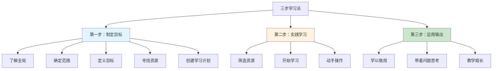
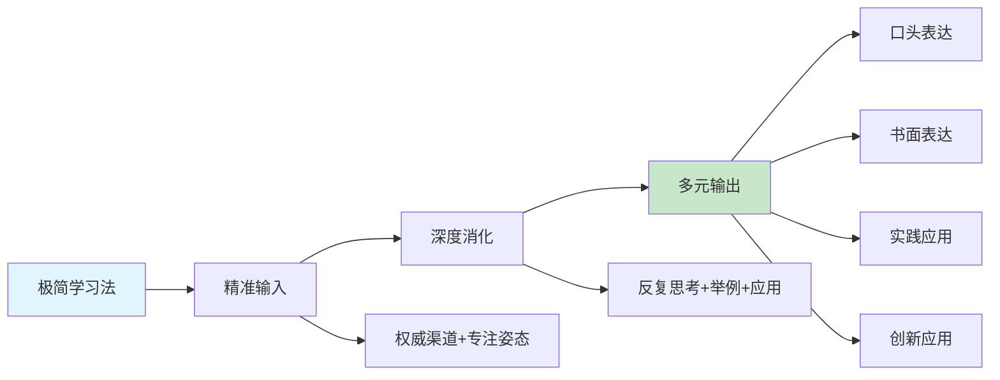
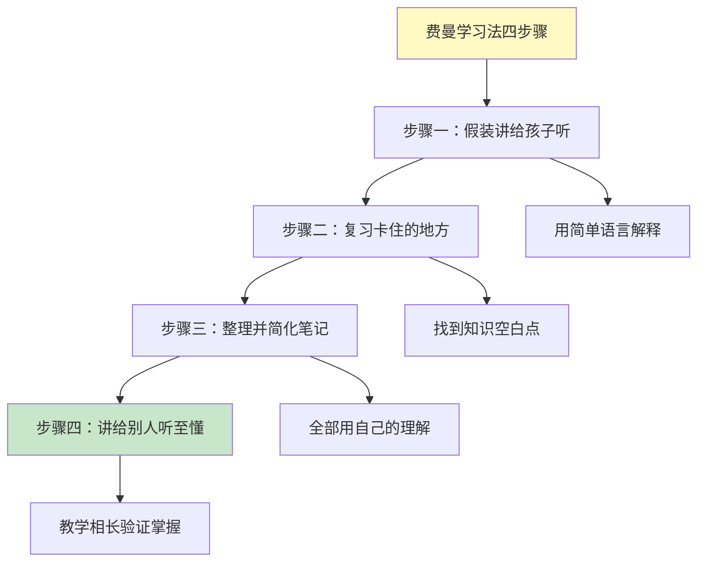
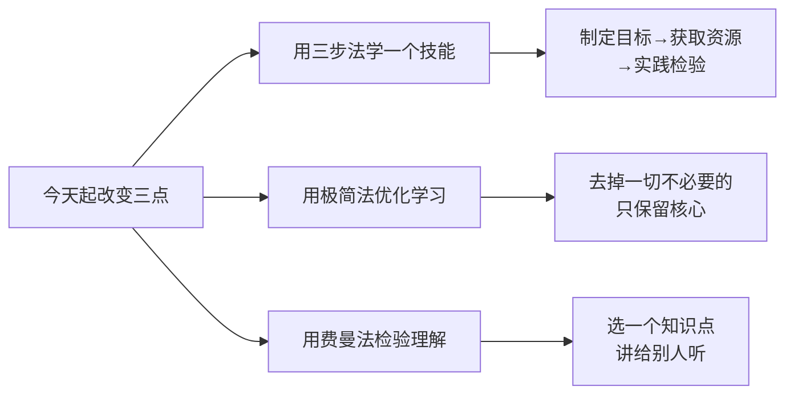

# 3.6学习方法论沉淀
#### 目录介绍
- [01.看一个真实案例](#01看一个真实案例)
- [02.三步学习法规划](#02三步学习法规划)
- [03.极简学习法实践](#03极简学习法实践)
- [04.费曼学习法输出](#04费曼学习法输出)
- [05.后来发生的改变](#05后来发生的改变)
- [06.今天起改变三点](#06今天起改变三点)
- [07.课后作业思考下](#07课后作业思考下)

## 01.看一个真实案例

那年我第一次拿到年终奖，做的第一件事是——**报了 5 门付费课程**：算法、操作系统、Kotlin、Flutter、英语口语。

第一周我兴致勃勃，每个 App 都打开看 10 分钟。第二周开始挑顺眼的看。第三周开始觉得"今天不想看了"。第三个月后我打开某个学习 App，发现它给我推送了：

> "**您已 87 天未学习**，您的算法课进度还停留在 3%。"

我盯着那个 3%，恍惚了一下——付出去 1300 块，**剩下的 97% 是给空气听的**。

更扎心的是，那一年我做晋升答辩，被评委问："你今年的核心成长是什么？" 我张口就是："我学了算法、操作系统、Kotlin、Flutter……" 评委打断我："**你能不能挑一个，深聊一下？**"

我哪个都聊不深。**那一刻，'什么都学'变成了'什么都没学会'**。

答辩结束我去找了我的导师，把"学了 5 门一无所成"的事讲给他听。他听完想了一下，说了一句话我记到现在：

> "**学习是个手艺活儿**。手艺人不会同时学 5 门手艺，他会**先把'怎么学手艺'这件事本身搞明白**，然后挑一门，按方法学透。"

他随手在本子上写了三个名字：**三步学习法、极简学习法、费曼学习法**。然后说："这三套，你先理解透。它们不是学具体知识的，**是教你怎么学'学'这件事**——叫'方法论'。"

那是我第一次听到"方法论沉淀"这四个字。后来这三套方法被我反复打磨，最终成了我每学一个新东西的"标准工具箱"。下面这套**三步法 + 极简法 + 费曼法**，就是从那个晚上开始一点一点用出来、最终救我于"低水平重复学习"的方法。

## 02.三步学习法规划

翻阅了一本经典老书《软技能：代码之外的生存指南》，相信不少技术人都看过。很多技术类书籍可能会因为技术的更新换代而过时。这本书更多聚焦在了职业发展、个人影响力、学习成长、生产力提升、理财、健身、精神健康等领域，基本概括了程序员学习成长所需的所有"软技能"。

书的作者是约翰·森梅兹，他关于如何快速学习的方法非常值得推荐。每个技术人都面临着技术更新迭代的巨大压力，需要快速学习新技术、新的编程语言、新的框架和其他能力。经过一系列实践、反思和归纳之后，他总结了一套可重复使用的自学体系，也就是他在书中推荐的"三步学习法"。

**三步学习法的核心价值在于"可重复使用"**。无论你学什么——一门编程语言、一个框架、一项管理技能——都可以套用这同一套流程。它就像一个万能模板，帮你把"不知道怎么学"变成"按步骤来就行"。

第一步是制定目标。

| 步骤 | 具体行动 | 要点 |
|-----|---------|------|
| 了解全局 | 浏览目录和介绍章节 | 建立整体认知框架 |
| 确定范围 | 明确要学什么 | 避免贪多嚼不烂 |
| 定义目标 | 设定可量化的目标 | 没有歧义，容易评估 |
| 寻找资源 | 多渠道收集学习材料 | 书籍、课程、源码、人脉 |
| 创建学习计划 | 规划学习路径 | 参考他人经验 |

第二步是实践学习。**筛选资源**：已经知道自己要学什么，以什么顺序学，接下来就需要对你找到的资源进行筛选，挑选出其中最有价值的几个，来帮助自己完成学习任务。**开始学习**：在这一步中，你的目标是先获取能够动手实践的信息。不要急着消化你学习计划中列出的所有资源，学习的关键在于循序渐进。**动手操作**：大多数人会试图通过读书或观看视频来掌握某个主题，边看边实践是更好的做法。在动手中产生各种问题：它是如何工作的？如果我这么做，会发生什么？我该如何解决这个问题？

第三步是运用输出。**学以致用**：在实践的过程中，不断有问题需要你去解决。这时就需要你利用之前收集到的所有资料，进行深入的学习，然后解答这些问题，同时学习新的东西。**带着问题思考**：带着问题学习，更能让你沉浸在学习材料中，尽可能地汲取知识。另外，记得要把自己正在学习的内容和之前设定的最终目标关联起来。**教学相长**：要想深入掌握一门学问并融会贯通，学完了并教会别人是最好的办法。所谓教学相长，就是这个道理。**自己学会了，写出来，教会别人，并不是一件容易的事**。

## 03.极简学习法实践

在当今知识爆炸的时代，我们每天都在接触大量的信息，而学习方法的优化则成为提高学习效率的关键。

**极简学习法作为一种高效的学习方法，通过精简资源、时间和学习材料，帮助我们更专注于最重要的概念和技能，从而实现用最小的投入获取最大的学习收益**。

极简学习法主张在学习过程中剔除不必要的信息和活动，只关注核心知识和技能。这种学习方法强调精简和高效，让我们能够更专注于学习目标，提高学习效率。

| 优势 | 具体说明 |
|-----|---------|
| 减少干扰 | 有效减少学习过程中的干扰和冗余信息，更加专注于核心内容 |
| 提高效率 | 通过精简学习材料，更快地掌握核心知识 |
| 培养专注力 | 有助于培养专注力和思维能力，更深入地理解和应用所学知识 |

精准输入是极简学习法的第一步，它要求我们在学习过程中选择正确的学习材料，并保持专注的学习姿态。为了实现精准输入，我们可以从权威渠道获取学习资料，确保信息的准确性和可靠性。同时，我们还要学会调整自己的学习姿态，保持积极的心态和专注的注意力，以便更好地吸收和理解知识。

深度消化是极简学习法的核心环节，它要求我们在理解知识的基础上进行深入的思考和加工。为了彻底搞懂知识，我们可以采用反复思考、举例说明和实际应用等策略。

多元输出是极简学习法的最后一步，它要求我们将所学知识通过多种方式进行输出和应用。通过**口头表达**，我们可以锻炼自己的沟通能力和表达能力；通过**书面表达**，我们可以整理思路、加深理解；通过**实践应用**，我们可以将所学知识应用到实际生活中，解决实际问题；通过**创新应用**，我们可以发挥创造力，将所学知识进行创新和拓展。

## 04.费曼学习法输出

很多人在学习时常常会走弯路，找不到适合自己的学习方法，难以得到快速提高。如果你也苦于不知用哪种学习方法的话，可以尝试采用著名的"费曼学习法"。

该方法由 1965 年诺贝尔物理奖得主理查德·费曼（Richard Feynman）提出，可以帮助你快速学习。理查德·费曼号称是继爱因斯坦之后最聪明的人，他的这套方法曾被无数学习牛人奉为"最佳学习方法"。

**费曼学习法就是一个操作简单，并且具有普适性的方法，它只有四个步骤：假装讲给孩子听、复习卡住的地方、整理并简化笔记、讲给别人听至懂**。

第一步，假装讲给孩子听。首先，你需要在一张白纸上写下你想要学习的知识点。然后，针对这个知识点，写下你所知道的一切，假装你要讲给一个小孩听。你可以把这个小孩假定是一名 12 岁的孩子，他的词汇量只能理解一些基础的概念和关系，而且注意力集中程度也比较低。

通常，我们会使用复杂的词汇和专业术语来掩饰自身的理解不足，这也是在自欺欺人。但当你给 12 岁的孩子讲一个知识点时，就不能再用这些复杂词汇和专业术语。**你需要强迫自己进一步理解这个知识点，并且简化它，确保孩子可以听得懂**。

第二步，复习卡住的地方。当你找到自身知识的空白时，学习才真正开始。比如，你在第一步的讲述过程中忘记了一些重要的东西，或者你无法解释清楚某个知识点等等。当你知道自己哪里"卡"住了，就要针对这个卡住的点好好复习，直到你能够用简单的话把它讲清楚为止。

**当你能不用术语，只用大白话解释清楚时，你就真正理解了这个知识点**。如果跳过这一步，你会很容易出现"知识幻觉"，高估自己对知识的掌握程度。

第三步，整理并简化笔记。你需要在学习的过程中整理一份笔记，内容全部都是自己的理解，而不是从网上或其他途径摘抄的专业术语。在复习的时候，把它们整理成一份简单讲稿，自己大声朗读。如果在读的过程中，发现哪里解释得不够简洁，或者听上去有些乱，可以在这部分再下点功夫。反复练习，直到你真正消化它们为止。

第四步，讲给别人听至懂。如果想确保自己已经完全理解某个知识点，可以找一个人，讲给他听。前提条件是这个人并不知道这个知识点，或者他就是一个 12 岁的小孩。

**对知识的终极测试就是看你能否让别人理解**。如果别人听了你的讲述可以理解这个知识点，那么恭喜你，你已经完全理解和消化它了。

总的来说，"费曼学习法"的四个步骤很简单，也很容易实践，但要想发挥这套方法的最大效用，你需要精进自己的类比、联想能力，面对庞大复杂的概念，能用简单的语言解释出来。费曼本人就很擅长这一点，他能用直白浅显的语言解释量子力学等复杂深奥的话题，因此他也被誉为"伟大的讲解员"。

> **真正的学习不是装满脑子，而是清空脑子里的术语，然后用大白话把一件事讲明白——这就是费曼说的"如果你不能简单地解释，说明你没真懂"。**

你应该带走的三件事：

1. **三步法是骨架**：制定目标 → 实践学习 → 运用输出，缺一段就会"虎头蛇尾"。
2. **极简法是过滤器**：不是所有东西都值得学，**敢于砍掉 80% 的资料**，把精力留给那 20% 的核心。
3. **费曼法是验机仪**：每学完一个知识点，强迫自己用大白话讲一遍，**讲不通就是没学懂**。

## 05.后来发生的改变

被导师点醒后那个周末，我打开 5 门课的进度页，深吸一口气**取消了 4 门退款**，只留下"算法"。然后用三步法重新规划——**第一步（目标）**：3 个月内能在 LeetCode 中等难度题目里独立通过 80%。**第二步（实践）**：每天 1 道题 + 周末 5 道题，每道题写"题解 + 复盘"。**第三步（输出）**：每月写一篇"本月算法 5 大坑"内部博客。

那一刻我感到一种奇怪的"踏实"——**少了 4 个目标，反而第一次知道自己'今天要干什么'**。

按极简法清理学习材料后，我把书架上 12 本"算法相关"的书砍到 2 本（《算法导论》当字典 + 《剑指 offer》当训练手册），订阅的 9 个公众号砍到 2 个。结果是每周节省**约 8 小时**"看资料"的时间；每周多出**约 5 道题**的实做量；学习焦虑感**直线下降**——以前总觉得"还有好多没看"，现在总觉得"今天我又解了一道"。

半年后我做转岗答辩，开口就是："今年我没学很多，**只学了一件事——算法**。" 然后我用费曼法的方式现场讲了一道题：**"请用一根橡皮筋解释 KMP 算法的 next 数组"**。讲完评委笑了："这个比喻第一次听到，但完全说服我了。"

那场答辩拿到了 A——这是我从业以来最高一次评级。**而中间 6 个月里我做的所有事，归根结底就是三件：一套三步法、一把极简法的剪刀、一个费曼法的"假想 12 岁小孩"**。那一刻我才真正理解导师说的那句话——**"学习是个手艺活儿。"**

## 06.今天起改变三点

今天就选一个你想要掌握的新技能，按照三步学习法来执行——**第一步制定清晰的学习目标**（学到什么程度、用多长时间）；**第二步搜集和筛选学习资源**（书籍、课程、文档）；**第三步通过实践来检验和巩固**（做项目、写文章、解决问题）。**不要跳过任何一步。**

审视你当前的学习计划，去掉一切不必要的环节——不需要的资料、重复的内容、低效的学习方式。**只保留最核心、最高效的部分**。记住，学习的目的不是消耗时间，而是获得能力。少即是多，精简才能深入。

选择你认为自己已经掌握的一个知识点，**不用任何参考资料**，用最简单的语言把它写在一张白纸上。如果写不出来或写不清楚，说明你还没有真正理解。回去重新学习那些写不清楚的部分，再次检验，直到能用大白话流畅地解释为止。

## 07.课后作业思考下

**自检类**：

1. **极简学习审计**：列出你当前正在学习的所有内容（包括订阅的课程、在看的书、关注的公众号等），逐一评估它们的价值：真正有用的保留，可有可无的果断删除。目标是把学习清单精简到不超过 5 项，集中精力攻克最重要的。
2. **费曼学习法深度测试**：选 3 个你工作中常用的核心概念，分别用费曼学习法测试自己的理解深度。标准是：能否在 5 分钟内，不用任何术语，让一个 12 岁的孩子理解这个概念。做不到的就回去补课，做到的说明你真正掌握了。

**实践类**：

3. **三步学习法完整实践**：选一个你一直想学但没开始的技能（比如一门新语言、一个新框架），用三步学习法从零开始学习。第一周完成目标制定和资源搜集，第二周开始学习，第三周通过实践检验。三周后评估效果，这套方法是否帮你提高了学习效率？
4. **方法论组合设计**：结合三步学习法、极简学习法和费曼学习法，为你未来 3 个月的学习设计一套完整的方法论体系。包括：目标设定（三步法）→资源精简（极简法）→学习实践→理解检验（费曼法）→输出分享。画出流程图并开始执行。
