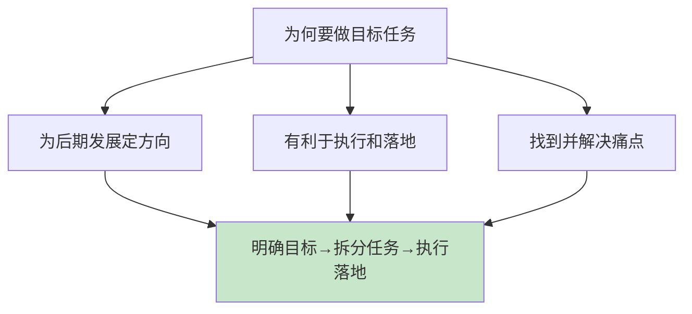
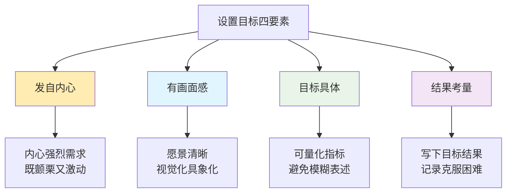
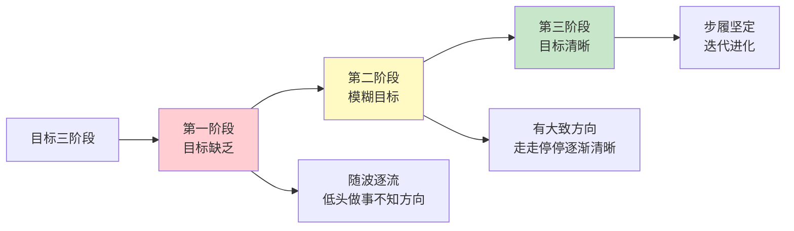
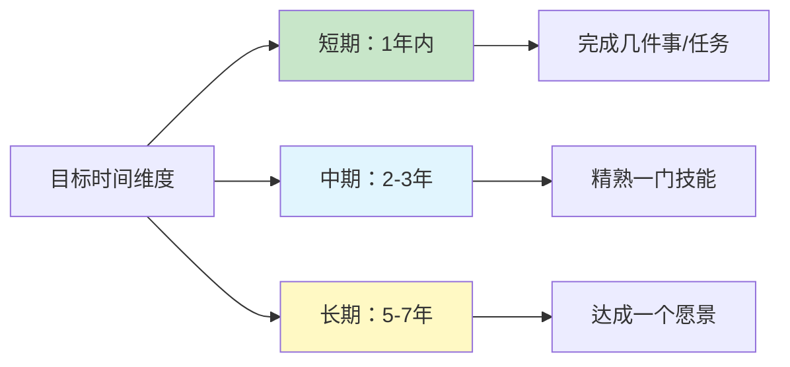
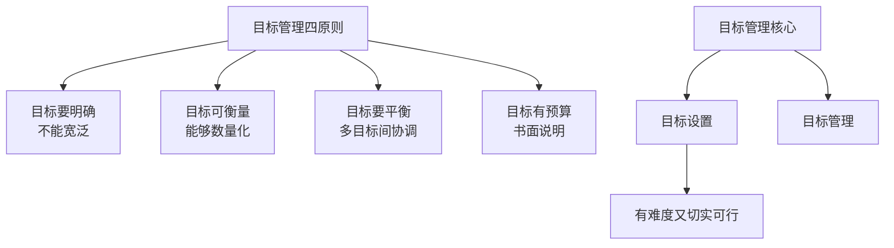
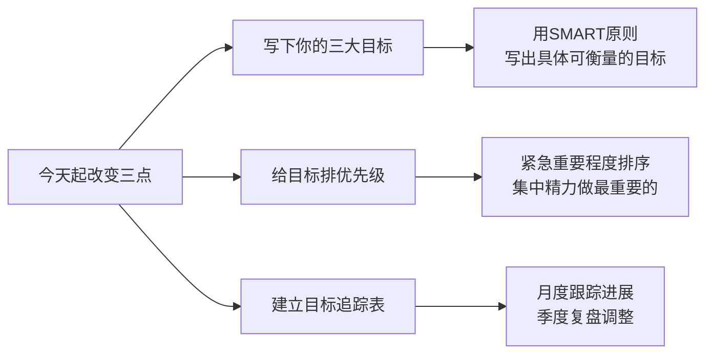

# 4.2目标设立和管理
#### 目录介绍
- [01.看一个真实案例](#01看一个真实案例)
- [02.明确目标的背景](#02明确目标的背景)
- [03.什么事情设目标](#03什么事情设目标)
- [04.设置目标四要素](#04设置目标四要素)
- [05.目标要层层递进](#05目标要层层递进)
- [06.懂得设立小目标](#06懂得设立小目标)
- [07.短期和长期目标](#07短期和长期目标)
- [08.目标要有优先级](#08目标要有优先级)
- [09.目标管理方法论](#09目标管理方法论)
- [10.总结回顾本章节](#10总结回顾本章节)
- [11.后来发生的改变](#11后来发生的改变)
- [12.今天起改变三点](#12今天起改变三点)
- [13.课后作业思考下](#13课后作业思考下)

## 01.看一个真实案例

工作第三年的元旦那天，我意气风发地坐在书桌前，给自己定下了 8 个"年度目标"：通过英语六级、看完 50 本书、跑步 1000 公里、写 100 篇博客、学完一门后端框架、学完一门前端框架、攒够首付、写个专栏。

那张纸我贴在床头，每天睁眼就能看见。我跟自己说：今年一定要成为一个更好的版本。

12 月 31 号那天我收拾房间，从床头扯下那张已经发黄的纸，心里一紧——8 个目标，一个都没真正完成：

- 英语六级报名了没去考
- 书买了 30 本，看完的 4 本
- 跑步 APP 里只有 28 公里
- 博客写到第 7 篇就断更了
- 后端框架只看完了"环境搭建"那一章
- 前端、首付、恋爱根本没动

更要命的是，我说不清楚问题出在哪。当时我以为自己的问题是"不够自律"，所以第二年元旦我又把这 8 个目标抄了一遍——结果当然又是一年原地踏步。

直到第四年的某天，一个比我大五岁的同事看着我书桌上的目标清单笑了笑：**"你这不是定目标，你是在写愿望清单。8 个目标里没有一个是 SMART 的，没有一个有优先级，也没有一个被分解过——所以你不是不自律，你是没有目标。"**

那一刻我才明白：**我以为我在管理人生，其实我只是把"我想要"四个字写了 8 遍。**

## 02.明确目标的背景

要想实现目标，尤其是在一段时间内需要同时实现多个目标，这并不是一件容易的事——这正是当年那张"愿望清单"教给我的第一课。

**必须要对目标的特性进行充分的分析，才有可能保证多个目标同时实现，否则就很容易陷入顾此失彼甚至是一个目标也无法实现的局面**。

为什么要做目标任务？主要是为自己后期发展或者方向，做出一个具体的措施，有利于执行和落地。因此，必须给自己做目标，然后将目标拆分成具体任务。

找到目标痛点，把工作和生活中的不足之处，当做自身的痛点来认真对待，在新的目标中，针对痛点部分进行着重的修正，可以切实有效地保证计划制定的现实意义与可行性。

## 03.什么事情设目标

凡事对自己有重要意义的、需要花时间花精力去做的、还有很大提升空间的、需要刻意练习的事情，都应该要有目标。举几个例子：

| 事情类型 | 重要意义 | 花时间精力 | 提升空间 | 需要目标？ |
|---------|---------|-----------|---------|----------|
| 吃饭 | 有 | 有 | 低 | 不需要 |
| 做饭做菜 | 有 | 有 | 高 | 需要 |
| 学新技术 | 有 | 有 | 高 | 需要 |
| 刷手机 | 低 | 有 | 低 | 不需要 |

回头看我那张 8 件事的清单——其中起码有两件（"看完 50 本书"和"恋爱"）就属于不该被强行扔进目标清单的事，最后变成了焦虑源。

目标制定标准不宜过低，目标过低视为自我要求过低，是一种无上进心的表现。

与之相反，目标制定也不能过高，目标过高将导致计划开展一半或后半段时，发现无法完成，而后继乏力，失去战斗力。

**目标制定的标准，应该要稍高于自身能力，给自己留出一个可以努力争取的空间**。

## 04.设置目标四要素

**1. 发自内心的**：这是一种强调内心愿望驱动的方法。按照这个标准，源自内心的强烈需求，在你头脑中形成很具体的画面感，其难度和挑战会让你感到既颤栗又激动，那么这也许就是一个好目标。

**2. 要有画面感**：对这个目标形成的愿景是否足够清晰，在头脑中是否直接就能视觉化、具象化。就拿我个人来说，比较喜欢写博客，看书后写读书笔记，感觉有成就感。这样一种画面，慢慢烙在脑海中，渐渐就激发起了想要拥有一部作品的目标。

**3. 目标要具体**：比如制定减肥的目标，那就应该是以减了多少斤为导向；比如制定了事业目标，那就应该以涨多少薪资或者职位晋升为导向。避免模糊的表述，而是明确指定您想要实现的结果。例如，将目标从"提高销售"具体化为"增加销售额 10%"。

**4. 结果的考量**：指定目标后，要写目标结果。在执行过程中，遇到那些重大事件，如何克服困难，结果是否达到了自己的预期。把结果写下来。

我那张愿望清单上的 8 条，对照这四个标准——发自内心的可能只有 2 条，有画面感的 1 条，具体的 0 条，写了结果考量的 0 条。难怪一条都完不成。

## 05.目标要层层递进

回顾我工作以来的成长发展阶段，根据目标的清晰度，大概可以划分为如下三个阶段：

随波逐流目标模糊，步履坚定的第一个阶段，属于工作的前三、四年。虽然每天都很忙，感觉也充实，但一直在低头做事——也就是我贴 8 件事清单那段时间。

突然某一天一抬头，就迷茫了，发现不知道自己要去向哪里。原来在过去的几年里，虽然充实，但却没有形成自己明确的目标，一直在随波逐流。

在那时，人生的浪花把我推到了彼时彼地，我停在岸边，花了半年时间，重新开始思考方向。

当然这样的思考依然逃不脱现实的引力，它顶多是我当时工作与生活的延伸，我知道我还会继续走在程序这条路上，但我开始问自己想要成为一个怎样的程序员，想要在什么行业，什么公司，写怎样的程序。

模糊目标。重新上路，比之前好了不少，虽然当时定的目标不够清晰，但至少有了大致方向，一路也越走越清晰。

从模糊到清晰的过程中，难免走走停停，但停下迷茫与徘徊的时间相对以前要少了很多，模糊的目标就像一张绘画的草图，逐渐变得清晰、丰富、立体起来。

目标清晰。步履自然也就变得越发坚定。回顾目标在我身上形成的经历，我在想即使当时我想一开始就要去定一个目标，想必也不可能和如今的想法完全一致。

毕竟当时受限于眼界和视野，思维与认知也颇多局限，所立的目标可能也高明不到哪里去；但有了目标，就有了方向去迭代与进化，让我更快地摆脱了一些人生路上的漩涡。

假如，你觉得现状不好，无法基于现状延伸出目标。那么也许可以试试这样想：假如我不做现在的事情，那么你最想做的是什么？

通常你当前最想做的可能并不能解决你的谋生问题，那么在这两者之间的鸿沟，如何去搭建一条桥梁，可能就是一个值得考虑的目标。

## 06.懂得设立小目标

使我们对工作产生兴趣和热情的，是工资，更是成就感。成就感会让你强化自己的存在感，体会到自身的价值和意义。

**对大脑来说，成就感是最有效率的一种激励方式**。在计划的执行中，我们同样可以依此照办，设定这样的小目标。

时间周期为 1-2 周，既不会过于频繁，也能及时收效；稍微高于自己的能力，可以有效激发自己付出更多努力；小目标之间相互关联、依次递进。

我们可以这样理解，设定小目标，可以把时间切分为更细的粒度进行安排，从而保证每段时间分片有充足的精力。

通俗地来讲，我们可以每天早晨花几分钟的时间，将一天的安排做个计划，把每一个"行程"列成一个个的小项目。当然也可以每晚睡前，在脑海中想一想，第二天需要做的事情。

**总之原则就是：切忌贪心，我们的大脑更擅长完成一个个简单的小任务。因为目标可以分解到小到不可思议，这样我们能很快地完成，从而充分享受到完成目标的成就感**。

## 07.短期和长期目标

目标是愿望层面的，计划是执行层面的，而计划的方式也有不同的认识维度。从时间维度，可以拟定 "短、中、长" 三阶段的计划：

| 时间维度 | 周期 | 目标类型 | 举例 |
|---------|------|---------|------|
| 短期 | 1年内 | 完成事项、行动周期和检查标准 | 完成一个项目、学完一门课 |
| 中期 | 2-3年 | 阶段性成果，每年分解 | 精熟一门技能、取得认证 |
| 长期 | 5-7年 | 愿景和成长里程碑 | 成为技术专家、出版作品 |

举一个例子：短期目标和长期目标要一致。比如我想要成为小说家，我的短期目标是什么？就是天天写小说。

而长期目标是什么？就是成为小说家，写很多部作品；长期目标是做一个作家孵化公司，那么现在短期目标就是培养作者，推出作者。

不管是家庭、事业、工作、梦想，短期和长期目标一致，很重要，不然长期目标就是一个假目标。**人生做减法比做加法更重要**——这正是当年那张 8 件事清单最大的问题：长得像减法，骨子里全是加法。

## 08.目标要有优先级

比如在一年内制定的目标多达几十个，那么应当要评估多个目标的重要程度，根据重要程度不同确保重要程度高的目标优先达成。**也就是多个目标是有优先级的，先做最重要的，而不是面面俱到**。

有句老话叫"同时追两只兔子，一只也追不到"。我现在每年元旦只允许自己挑 **2 到 3 个真正重要的目标**，其他想干的事一律放进"备选池"。

到年中复盘的时候，如果前 2-3 个目标进度过半且稳定，再从备选池里挑 1 个补进来。这种"先聚焦再扩展"的方式，比当年一口气定 8 个目标然后全军覆没要强 100 倍。

## 09.目标管理方法论

目标管理的理念是现代管理学之父彼得·德鲁克在其著作《管理的实践》中最先提出的。德鲁克认为，并不是有了工作才有目标，而是相反，是先有了目标才能确定每个人的工作。

目标管理要解决的问题是目标和资源之间关系是否匹配的问题。两者的匹配关系是衡量计划管理好坏的标准：当所拥有的资源能够支撑目标的时候，计划管理得以实现；当资源无法支撑目标或者大过目标的时候，要么浪费资源，要么"做白日梦"。

目标有两种，一种是经营性目标，是硬性的，比如财务上的销售额、利润、成本、质量等指标；另外一种是管理性目标，是软性的，比如效率、流程和服务。

目标管理法核心。目标必须具体、明确、适当，且要事先制定。每个人的需要可以通过个人目标的实现得到满足。目标管理包括两个部分，目标设置与目标管理。

在目标设置理论中，德鲁克强调"目标既要有一定的难度又要切实可行"，沿着这个原则，在设置目标的时候，可以遵守四个基本原则：

1. **目标一定要很明确，不能宽泛**：比如不能设置这样的目标，"成为一流公司"，因为这个目标太宽泛，没有标准。比如"我们要做天底下最好的产品"，这个目标也是错的，因为最好的产品也是无法判断的。
2. **目标要可以衡量**：目标一定要可以衡量，可以检验，能够数量化并能够验证。
3. **目标之间要平衡**：因为任何一个组织或者个人，都会有多个目标，所以目标之间要平衡。
4. **目标要有预算**：可以书面说明，书面表达的目标可以保证符合逻辑。

心中有一幅远景，却无能力去执行，终究只是幻想罢了，所以，每月要开一次月指标执行复盘。

要针对绩效表现"异常"的指标（包括但不限于：退步，与预算值、目标值、标准值、去年同期差异超过 20%，内外部异常事件等等），进行差异原因分析并提出改善对策。

## 10.总结回顾本章节

**目标不是写下来的愿望，而是被分解、被衡量、被检查、被取舍后留下的那 2-3 件事。**

1. **目标必须 SMART + 写下来 + 有画面感**：愿望清单 ≠ 目标清单，模糊目标只是焦虑源。
2. **目标必须有优先级，一年聚焦 2-3 个**：人生做减法比做加法更重要，"全都要"等于"全都不要"。
3. **目标要分层、要复盘**：年→季→月→周拆下来，每月对照预算/目标值检查偏差并改善。

## 11.后来发生的改变

那位前辈跟我说完之后那个周末，我把床头那张 8 条目标的纸撕了，重新写了一张：今年只做 3 件事——后端框架做到能独立带项目、跑步累计 500 公里、读书 24 本（每月 2 本，按章节列读书计划）。

每一条都按 SMART 重新写过：具体到周交付物、可量化、有截止时间、有明确的"完成长什么样"。

第一个月底我做了平生第一次"目标对账"——三个目标分别完成多少、差多少、为什么差、下个月怎么补。

后端框架按计划啃完了第 4 章；跑步只完成了 30 公里（计划 42），原因是连续 3 个周末加班；读书完成了 2 本，正常。差的部分我没自责，而是把跑步从"周末 2 次"改成了"工作日早晨 + 周末 1 次"。

那是我第一次感到"目标在我手里"，而不是"我在目标手里"。

到年中复盘的时候，三个目标整体进度都在 50% 以上，跑步甚至超额完成。我从备选池里补进了"用 30 天做一次小型开源项目"。

到年底，三个核心目标全部按 SMART 标准完成，备选项目也在年底前发布到了 GitHub。**这是我工作以来第一次真正"完成"一个年度目标，而不是元旦再抄一遍同样的清单。**

那张曾经写着 8 件事的旧纸我留下了，夹在书里——它每年元旦都会提醒我：贪多就是放弃。

## 12.今天起改变三点

今天就花 20 分钟，按照 Specific（具体）、Measurable（可衡量）、Attainable（可达到）、Relevant（相关）、Time-based（有时限）的标准，写下你接下来 3 个月最重要的 3 个目标。

不要写"变得更好"这种模糊目标，要写"3 个月内读完 6 本书"这种明确目标。

当你同时有多个目标时，必须学会排序。用紧急-重要矩阵对你的目标进行分类，先集中精力完成最重要的 1 个目标，而不是 3 个目标齐头并进。

记住：**一个人同时追两只兔子，一只也追不到**。

给你的每个目标建一张追踪表，包含：目标描述、分解任务、时间节点、当前进度、差距分析。每月底花 30 分钟更新一次，像做财务报表一样对待你的目标——有数据、有分析、有改善对策。

发现"异常指标"时及时调整，不要等到年底才发现一事无成。

## 13.课后作业思考下

**1. 目标质量检查**：写下你今年设定的所有目标，用 SMART 原则逐一检验。有多少是符合标准的"好目标"？有多少是模糊的"伪目标"？把不合格的目标用 SMART 原则重新改写。

**2. 目标层级设计**：选择你最重要的一个长期目标（1-3 年），把它分解为年度目标→季度目标→月度目标→周任务。确保每个层级之间有清晰的承接关系。这就是目标的"层层递进"。

**3. 小目标效果测试**：为你的月度目标设置一个"小目标里程碑"——比如完成 30% 时给自己一个小奖励。执行一个月后评估：设置小目标是否让大目标变得更容易坚持？小目标的激励效果有多大？

**4. 目标管理法实践**：选择德鲁克目标管理法的四个原则（目标明确、可衡量、相互平衡、有预算），对你当前最重要的项目进行一次全面的目标审计。哪些原则你做到了？哪些还需要改进？制定一个具体的改进计划。
