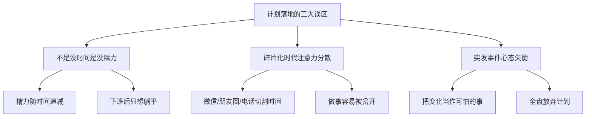
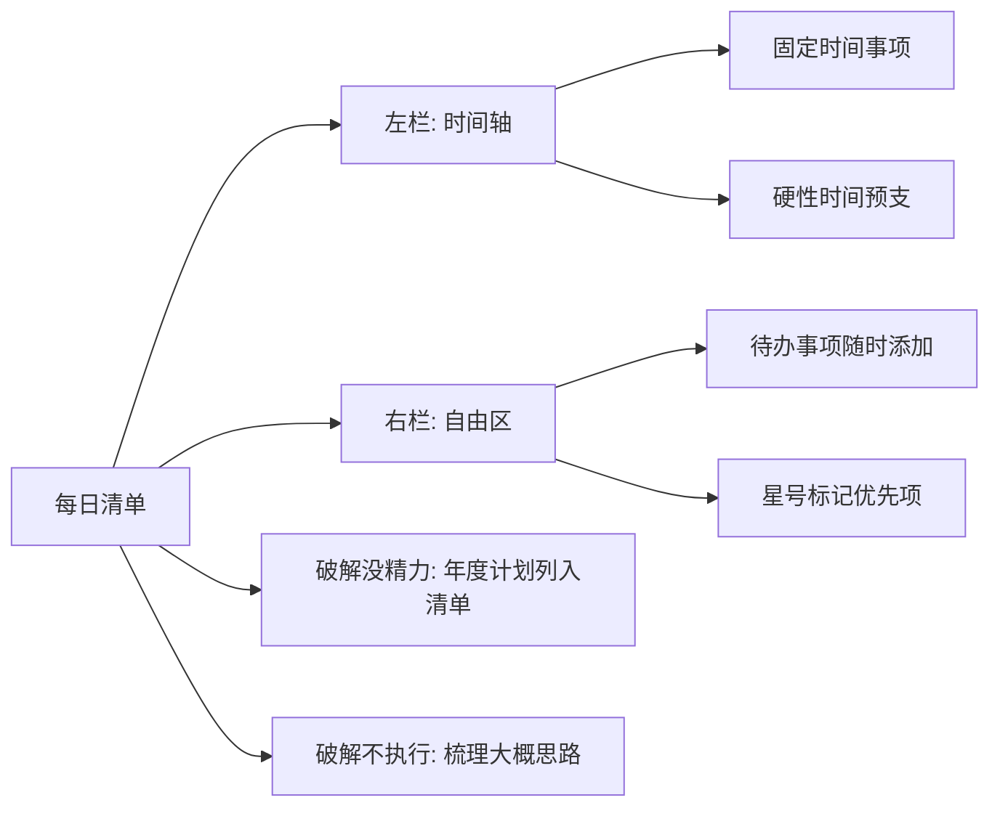
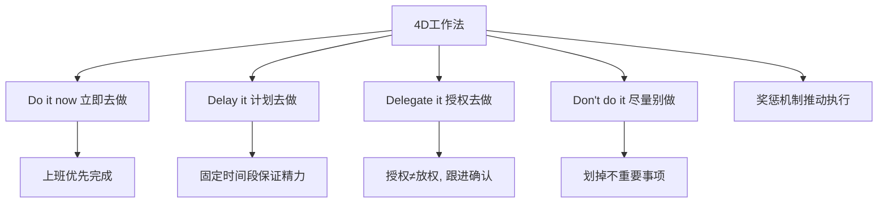
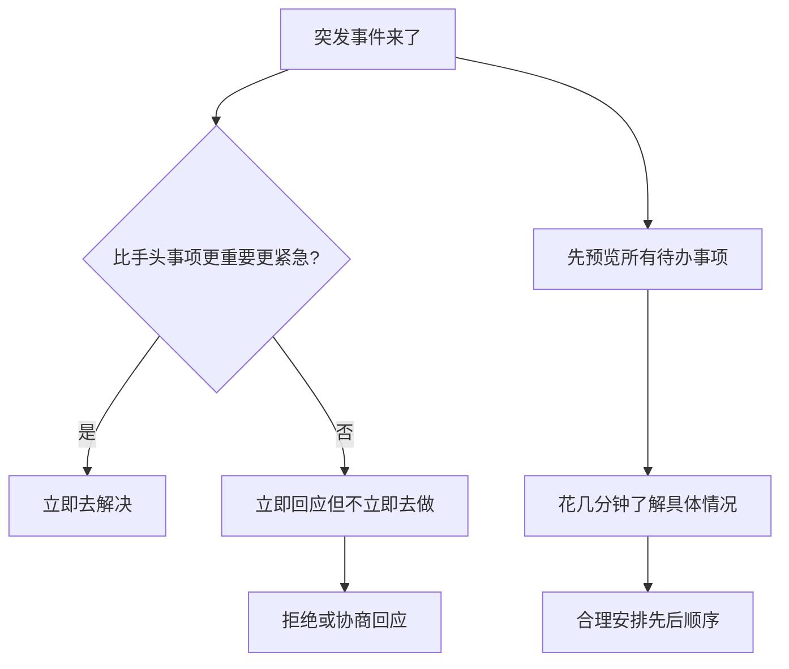
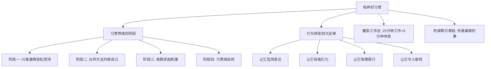
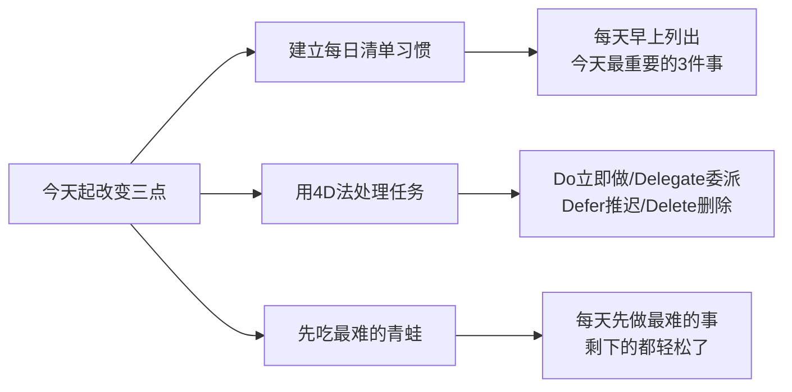

# 17.计划的落地策略
#### 目录介绍
- [01.看一个真实案例](#01看一个真实案例)
- [02.没有时间的误区](#02没有时间的误区)
- [03.每日清单任务项](#03每日清单任务项)
- [04.做小巧的周计划](#04做小巧的周计划)
- [05.4D工作法的实践](#054d工作法的实践)
- [06.解决突发的事件](#06解决突发的事件)
- [07.培养一个好习惯](#07培养一个好习惯)
- [08.总结回顾本章节](#08总结回顾本章节)
- [09.后来发生的改变](#09后来发生的改变)
- [10.今天起改变三点](#10今天起改变三点)
- [11.课后作业思考下](#11课后作业思考下)

## 01.看一个真实案例

有段时间我特别迷"清单"——每天早上先用 20 分钟列 TODO，密密麻麻列 20 件事，看着满满当当的清单很有掌控感，仿佛自己已经赢了一半。

然后开始干第一件事，干到一半微信弹一个消息，回完消息顺手刷了下朋友圈；翻回来干第二件事，同事过来找我聊一个紧急 bug，干了 40 分钟；回到工位准备干第三件事的时候，已经 11 点半了，先去吃饭吧。下午茶之后还有两个会，散会之后人累得只想躺。

晚上回家看那张早上的清单——20 件事，划掉了 3 件，还都不是最重要的那 3 件。

这种状态持续了两周。我每天列得越多，完成得越少；完成得越少，第二天为了"补回来"列得就越多——形成一个完美的恶性循环。

我开始抱怨：是事情太多了！是同事打扰太多了！是会议太多了！是我没时间！

直到有一天，组里的资深同事看了我那张密密麻麻的清单，跟我说了三句话，我现在还记得：

1. **"你不是没时间，你是没精力。"**
2. **"你这清单不是计划，是焦虑清单——把焦虑写下来不会让事情变少。"**
3. **"先吃掉那只青蛙，剩下的都是赚的。"**

那时候我才意识到：**我以为自己缺时间，其实我缺的是一套真正能把计划落到地上的策略**。

## 02.没有时间的误区

有了计划，接下来就是每天去做了——**这才是难度最大的地方**。以为自己"没时间"，其实是掉进了三大误区：

**误区一：不是没时间，是没精力**。每天早晨刚上班时精力最旺盛，效率高；随着时间推移和事项难度增加，精力递减。等到下班挤地铁回家，只想瘫在沙发上——**时间还在，但精力已经清零**。

**误区二：碎片化时代注意力被切割**。微信、朋友圈、电话、工作交流把时间切得支离破碎，想找 15 分钟完全不被打扰的时间都很难。你去书房拿书，进门就开始刷手机、顺手收拾桌子、又发现维生素 C 该放到厨房——半小时后你还没拿到那本书。

**误区三：把突发事件想得太可怕**。遇到挫折不要急着全盘放弃，突发事件通常并没有你想象中严重——**我们完全可以把变化也当作计划的一部分**。

## 03.每日清单任务项

要罗列每日清单。不知你是否有这种感觉：每天都被工作填满了，下班回家虽然还剩一两个小时才睡觉，但上了一天班后除了躺着玩手机，什么也不想干，更别提什么计划了。

事实确实如此，每天的时间精力是有限的，如果想安排所谓的"业余时间"来完成非工作的年度计划，那就永远也不可能完成。

因此实现计划的关键，在于把年度计划拆解到每天的待办事项中，这样既能穿插在忙碌的工作中让你不至于太累，还能提高工作效率。

当我们想做一件事情的时候，最重要的不是预期结果多么让人振奋，而是如何将目标转化为具体的行动计划。用一张每日计划清单解决：

- **左边一栏**比较窄，上面有时间的刻度。这是一天的时间轴，它的好处是可以让我们掌握一天到底有多少时间资源可以用。这里面写的是固定时间去做的事情，比如早晨 9 点~9 点 30 分召开项目进度会，这就是硬性时间，这 30 分钟其实在一天开始时就预支出去了。
- **右边一栏**比较宽，没有特别的格式，叫作自由区。这里面写的才是真正的待办事项，有新的待办事项，随时都可以添加进来。
- **标记星号的事项**，表示这件事情是一天的工作重点，要优先解决。

**如何解决没有精力**？把每天要做的年度计划中的事情也列到待办事项清单中。

不要等到完成所有工作才关注年度计划，工作是永远做不完的，工作、生活、年度计划它们是平等的，所有今天要做的事情都列到同一张清单上。

这个可以用来破解"不是没时间，是没精力"——把年度计划当成"和工作同等重要的事"，而不是"等我有空再做的事"。

**如何解决无法立刻执行**？对相对复杂的事项梳理大概思路。大部分人写待办清单的时候只把要做的事情写下来，而我会把做这件事大概的思路也简单记录一下。

写清单的目的之一是让我们忘掉它，这样我们才会更专注手头的事情，效率才高。如果不把要做的事情都写下来，那么这些事就会在你脑袋里打架。

这个可以用来破解"不是没时间，是没有立刻去做"——一项任务卡住，往往不是难，而是"不知道下一步从哪伸手"。

## 04.做小巧的周计划

1. 写待办事项；
2. 补充周计划清单；
3. 每周有固定的时间整理计划；
4. 周计划和日计划在初期可以做合并；
5. 学会做每日手账是一件非常快乐的事情，这个格式很重要。特别是看到自己的清单上被逐一完成的时候，瞬间你会感受时光的美好！

我以前列周计划也犯过和列日清单一样的毛病——一口气塞 30 件事，一周下来完成 10 件，剩下 20 件挪到下周。挪着挪着，就再也不看那张清单了。

后来我学会一个原则：**一周只列 5-7 件真正重要的事**，其余的全部进"备选区"。每周最重要的 5-7 件事完成了，就是高效的一周；如果还有余力再去清备选区。

清单的目的不是"显得自己很忙"，而是"确保最重要的事被做掉"。

## 05.4D工作法的实践

每天遇到的所有事情，都可以用 4D 工作法决定下一步行动，具体写法如下：

1. **① Do it now（立即去做）**：立即去做的事情写在自由区，不一定非要写在最上面，只要你在这件事情上做好标记就可以，这样的事情在一上班的时候优先去完成。
2. **② Delay it（计划去做）**：把每天最重要的工作，安排在固定的时间段去完成，这样通过把弹性的时间刚性化，保证有充足的时间精力完成重要的事。
3. **③ Delegate it（授权去做）**：授权去做的事情并不等于放权，把一件事情授权给别人去做的时候，都会跟他确认一下什么时候给我回复。**记得跟进！**
4. **④ Don't do it（尽量别做）**：把清单中那些不重要的事划掉，以保证自己有足够的时间安排其他更重要的事情。比如洗衣服拖地，这种事可以攒到周末一起做。

强调 4D 重要性，分析一下事情为什么没完成。我觉得大多数之所以没有完成，是因为完不成也没什么，没有任何影响。假如没有完成，你一百万没有了，你会完成吗？肯定会！这就是根源。

要记住，你制定的计划一定要对你来说很重要，如果没有完成可能会对你造成很严重的后果，那么多半就能完成。

除非这个计划对你来说不重要！你可能反驳我，觉得我说错了，但是你知道我说对了。**你嘴上觉得重要，行动出卖了你，如果真的超级重要，就一定会完成**。

小时候，爸爸常说："只要这次你考全班前 3 名我就奖励你去游乐场玩一次，这次你要是考不好罚你一天不能吃饭"。小时候的奖励对于我们来说往往是比较有用的。

比如，一直懒得跑步，现在要求自己一周跑步 3 次。完成后，给自己奖励一顿大餐之类的。

我一般是先做计划，把计划写在小本本上，并把完成计划后的奖励列出来，做完一件事一定要在计划本上用力地把这件事情划掉，并在奖励后面画个小星星，这个绝对会让你成就感爆棚，也会让你满心欢喜。你也可以试试，相信我，**这种成就感绝对可以推着你马不停蹄地做事**。

## 06.解决突发的事件

每个人对事情排序的结果都不同（老板优先 / 同事优先 / 紧急优先 / 自己优先），价值观没有对错之分，但**要承担排序造成的后果**。

**总在被事情推着走的核心根因**：同事说急事你就立刻帮，客户说重要你就立刻办——总在被事情推着走，而不是推着事情走。领导让你"第一时间"去汇报，他其实并不知道你手头都有什么事，只是在表达急切心情。**所有人交代事情时都会说自己的事情很重要，事实真的如此吗？不一定**。

**更好的做法：立即回应，但不是立即去做**。不管别人怎么说，都把临时任务和手头清单做比较——如果手头有更重要紧急的事，立即拒绝或协商回应；只有当它真比手头一切都紧急，才是去解决它的时机。

**优先级安排的实操**：**先预览一遍今天所有的事**（只看不处理），不清楚的花几分钟弄清具体情况再排序。此外准备一个 TODO 笔记本，把日常遇到的关键词（微信文章、搜索问题、书上不清晰的点）随手记下，工作之后再回来学习。

## 07.培养一个好习惯

好习惯让我们受益终生（早晚刷牙、每日运动、健康饮食），但培养习惯不易，年龄越大越难。**习惯养成的四个阶段**：

1. **兴奋期**：靠热情轻松坚持
2. **平台期**：需要伙伴或方法约束自己
3. **强化期**：依靠奖励刺激维持
4. **自然期**：习惯成自然，除非用新习惯替代否则不会消失

**行为转变四大定律**（《掌控习惯》）：让它**显而易见 / 有吸引力 / 简便易行 / 令人愉悦**。每当想改变行为，就问自己四个问题：我怎样才能让它变得明显？有吸引力？变得容易？令人愉悦？——**具体的习惯培养方法论，参见第 7 章《培养一个新习惯》**。

**执行阶段的两把利器**：

- **番茄工作法**："工作 25 分钟 + 休息 5 分钟"为一循环，四个循环后再来一次半小时大休息。25 分钟内不做任何与任务无关的事——**详见第 31 章《专注能力的训练》**。
- **吃掉那只青蛙**：**每天早晨先做最有挑战性的事**，之后一整天的琐事就都显得轻松无比。当你把最难的"青蛙"吃掉，即便其他任务没做完，今天也已经完成了最重要的事——成就感会推着你完成剩下的工作。

## 08.总结回顾本章节

**计划落不落得了地，不取决于你列了多少件事，而取决于你每天最难的那只青蛙吃没吃掉。**

1. **每天只盯 3 件事 + 先吃青蛙**：清单不是"焦虑墙"，把最难最重要的那件放在精力最高峰先干掉。
2. **用 4D 处置一切任务**：Do/Delay/Delegate/Don't，敢于划掉、敢于授权，焦虑量立刻下降一半。
3. **把变化纳入计划本身**：突发事件不是"破坏计划"，先回应再判优先级，不立刻接是一种能力。

## 09.后来发生的改变

资深同事点醒我那天晚上，我做了一件很难受的事——把第二天的清单从 20 件砍到了 3 件，并把那 3 件重新做了排序：第 1 件是当天最难、最重要、我最不想干的"青蛙"。

第二天早上 9 点到 11 点，我什么都没干就在干那只"青蛙"——一个我已经拖了三天的技术方案。11 点钟方案出炉的那一刻，我整个人忽然轻了：剩下一整天，无论再发生什么我都赚了。

之后一个月我严格执行"每日 3 件事 + 先吃青蛙 + 4D 处置剩余任务"。每天早 9 点用 5 分钟列 3 件事，9 点到 11 点专攻青蛙，下午用番茄钟做剩下 2 件，其他所有突发事件统一回应"我下午 4 点之后回复你"。

月底统计：清单完成率从过去的不到 15%（20 件完成 3 件）涨到 85% 以上（3 件完成 2.5 件以上）。**而我反而比之前更不焦虑了**——因为我知道每天那 3 件事一定能完成。

半年之后，我已经把"每天上午 9-11 点不接受任何打扰"变成了团队默认共识——同事、领导都知道这两个小时找我没用，要么提前预约下午时段，要么自行推进。

更重要的是，那些过去让我焦虑的"突发事件"——大部分根本就不是真正的紧急事件。它们之所以显得紧急，只是因为我每次都立刻回应。当我开始用"立即回应、不立即去做"之后，绝大多数所谓的紧急都自动消失了。

那张曾经写满 20 件事的旧清单我留了下来，现在贴在工位边——它每天提醒我：**列得多 ≠ 做得多，列 3 件干完比列 20 件干 3 件强 100 倍**。

## 10.今天起改变三点

从明天早上开始，每天上班前花 5 分钟写下今天最重要的 3 件事。不是 3 件以上，就是 3 件。

这 3 件事完成了，今天就是高效的一天。如果 3 件都完不成，说明目标太大需要继续分解。每天晚上回顾：3 件事完成了几件？未完成的原因是什么？

面对堆积的任务不要焦虑，把每个任务归入四个类别：Do（立即做，重要且紧急的）、Delegate（委派，可以让别人做的）、Defer（推迟，重要但不紧急的）、Delete（删除，不重要也不紧急的）。

果断删掉那些不必要的任务，**你会发现真正需要做的并没有那么多**。

把一天中最有挑战性、最重要的任务放在精力最充沛的时候做（通常是上午）。先攻克最难的事情，剩下的一切都会轻松得多。

不要把难事拖到下午精力低谷期，那样只会越拖越焦虑。**记住：吃完青蛙之后，一天都是赚的**。

## 11.课后作业思考下

**1. 时间使用审计**：详细记录你明天一天的时间使用情况（每 30 分钟记一次）。一天结束后分析：有多少时间花在了真正重要的事上？有多少时间被琐事和突发事件消耗了？你的"有效工作时间"比例是多少？

**2. 4D 分类实操**：把你当前待办清单上的所有任务，用 4D 工作法进行分类。Delete 掉至少 3 个不必要的任务，Delegate 至少 1 个可以委派的任务。看看精简后你的任务清单是否更聚焦了。

**3. 周计划制定**：用文中的方法制定一份下周的周计划。包含：本周最重要的 3 个目标、每天的核心任务、预留的弹性时间（应对突发事件）。一周后复盘：计划完成率是多少？哪些安排需要调整？

**4. 习惯养成实验**：选择一个你想养成的好习惯（比如早起、运动、阅读），用"降低启动成本"的方法来设计。提前准备好所有需要的东西，设定一个最小行动（比如"先做 2 分钟"），坚持 21 天。记录每天的完成情况和感受，21 天后评估这个习惯是否已经初步形成。
