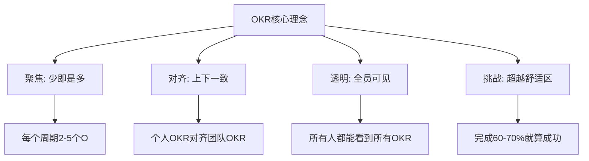
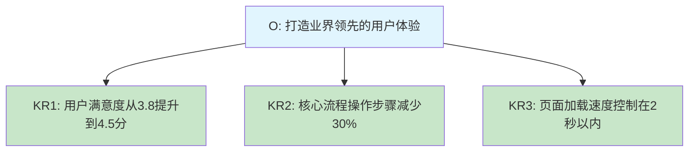
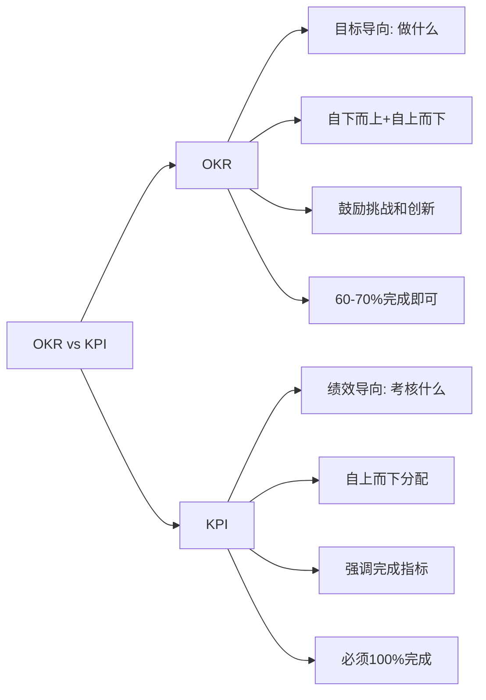
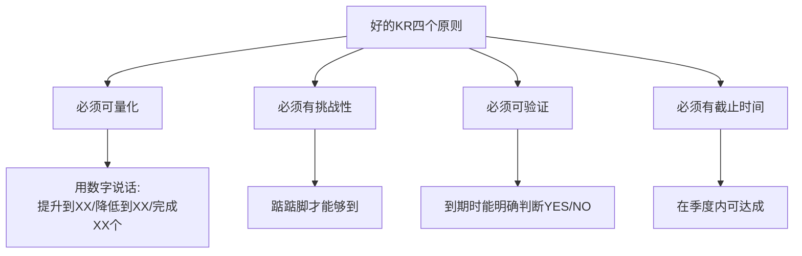
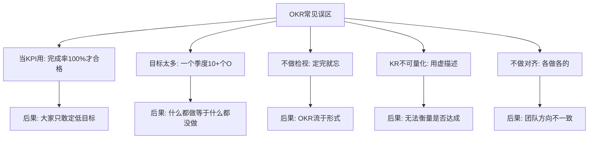
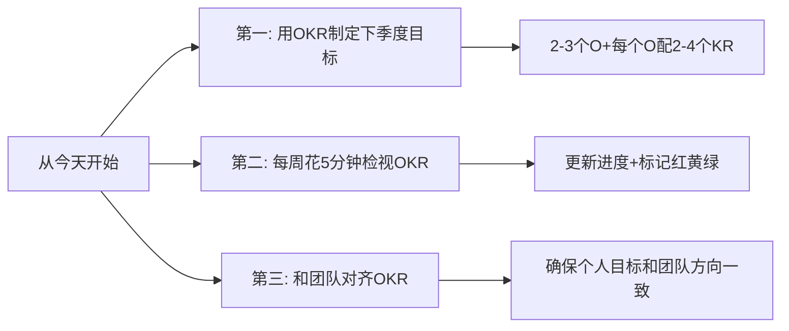

# OKR目标规划法
#### 目录介绍
- [01.看一个真实案例](#01看一个真实案例)
- [02.OKR的背景介绍](#02okr的背景介绍)
- [03.OKR的核心概念](#03okr的核心概念)
- [04.OKR与KPI的区别](#04okr与kpi的区别)
- [05.如何制定好的OKR](#05如何制定好的okr)
- [06.OKR的落地实践](#06okr的落地实践)
- [07.OKR常见的误区](#07okr常见的误区)
- [08.总结回顾一下](#08总结回顾一下)
- [09.后来发生的改变](#09后来发生的改变)
- [10.今天起改变三点](#10今天起改变三点)
- [11.课后作业思考下](#11课后作业思考下)

## 01.看一个真实案例

我那年刚晋升一档，年初团队拍下来 8 个 KPI 指标，每一个我都死命去抠：日报数提升、文档覆盖率、代码评审通过率、bug 率、迭代延期率……年底盘点的时候，8 个指标全部 100% 达成，按规则我应该拿到 A。

结果绩效面谈那天，Leader 翻了翻表格，问我："这 8 个指标都完成了，挺漂亮。但是这一年，我们部门变好了吗？我们做出哪一件让团队真的'不一样'的事？"

我愣在那里。那 8 个指标我全完成了，可是回头一看，**我做的全部都是"必须做、做了也没人记得"的事**。真正能写进汇报材料、真正能让团队向前走一步的——一件都没有。最后我拿到的不是 A，是 B+。我低头走出会议室那一刻，眼眶是热的。

第二周，Leader 约我喝咖啡，给我画了一张图——把 KPI 和 OKR 的差别放在一张白纸上对照：KPI 关心"考核什么"，OKR 关心"我要把团队带去哪里"。然后他说了让我记到现在的一句话：

> "如果你的目标每个季度都能 100% 完成，说明你的目标定得太低了。**真正有价值的目标，应该是让你踮起脚才能够到 70%。**"

那是我第一次知道，原来"完不成"不是一种失败，而是一种健康。后来我开始用 OKR 的方法重新规划自己每个季度的方向。这一节要讲的，就是把那次哭过的教训，变成你可以直接复用的工具。

## 02.OKR的背景介绍

你有没有遇到过这样的困惑：年初定了一大堆KPI，忙碌了一整年，年底一看——KPI完成了，但好像并没有真正做出什么有价值的事情。又或者，团队的方向不够聚焦，每个人都在忙，但团队整体的产出却不理想。

这些问题的根源往往在于：目标不够聚焦，关键结果不够清晰，执行过程缺乏对齐。而OKR正是为了解决这些问题而诞生的。

OKR（Objectives and Key Results，目标与关键结果）最早由英特尔前CEO安迪·格鲁夫在1970年代提出，后来被谷歌联合创始人拉里·佩奇引入谷歌，成为谷歌从几十人到几万人规模扩张过程中核心的管理工具。

如今，OKR已经被全球众多知名企业采用，包括谷歌、Meta、LinkedIn、Twitter等。它不仅适用于企业管理，也可以用于个人目标管理。

OKR的核心理念可以用四个词概括：聚焦、对齐、透明、挑战。聚焦意味着每个周期只设定2-5个目标，不贪多；对齐意味着个人目标要和团队目标一致；透明意味着所有OKR对全员公开；挑战意味着目标要有一定难度，完成60-70%就算成功。

## 03.OKR的核心概念

O（Objective）是你想要达成的方向性目标。好的O应该具备以下特征：

- **鼓舞人心**：能够激励你和团队为之努力
- **定性描述**：用文字描述方向，不需要具体数字
- **有时间限制**：通常以季度为周期
- **可执行**：团队可以独立推进，不完全依赖外部

例如："打造业界领先的用户体验"就是一个好的O，它有方向、有挑战、能鼓舞人心。

KR（Key Result）是衡量O是否达成的具体指标。好的KR应该具备以下特征：

- **可量化**：必须有明确的数字
- **有挑战性**：不能太容易达成
- **可验证**：到期时能明确判断是否完成
- **每个O对应2-4个KR**

| 完成度 | 评分 | 含义 |
|--------|------|------|
| 0-30% | 红色 | 未取得进展，需要反思 |
| 30-70% | 黄色 | 取得进展但未完全达成，正常范围 |
| 70-100% | 绿色 | 完成或接近完成 |
| 100%+ | 需警惕 | 目标可能定得太低 |

注意：OKR的评分不直接和绩效挂钩。如果你的OKR每个季度都是100%完成，说明你的目标定得不够有挑战性。

## 04.OKR与KPI的区别

| 维度 | OKR | KPI |
|------|-----|-----|
| 本质 | 目标管理工具 | 绩效考核工具 |
| 方向 | 自下而上+自上而下 | 自上而下 |
| 挑战性 | 鼓励设定有挑战的目标 | 倾向于设定可完成的目标 |
| 完成标准 | 60-70%算成功 | 必须100%完成 |
| 与薪酬关系 | 不直接挂钩 | 直接挂钩 |
| 透明度 | 全员公开 | 通常只对上级可见 |
| 周期 | 季度为主 | 年度/半年度 |

需要强调的是，OKR和KPI并不是对立的关系，而是互补的。OKR解决的是"做什么"的问题，KPI解决的是"考核什么"的问题。很多公司同时使用两者。

如果你所在公司已经强 KPI 化，那就把 OKR 当作"个人级别的方向盘"——KPI 保下限，OKR 拉上限。每季度自己列 1～2 个 OKR，确保你不是只在完成 KPI，而是在朝着真正想去的方向走。

## 05.如何制定好的OKR

**技巧一：从痛点出发。** 团队当前最大的痛点是什么？用户最不满意的是什么？业务增长的瓶颈在哪里？从痛点出发的O最容易获得团队的认同和投入。

**技巧二：用动词开头。** 好的O通常以动词开头，比如"提升""打造""建立""突破"，而不是"维持""保持"这类缺乏挑战性的词。

**技巧三：少即是多。** 一个季度最多5个O，推荐2-3个。目标太多等于没有目标，因为你的精力和资源是有限的。

**原则一：可量化。** "提升用户体验"不是好的KR，"NPS评分从30提升到50"才是。

**原则二：有挑战性。** 如果你100%确定能完成，说明KR定得太低。好的KR应该让你觉得"有把握完成60-70%"。

**原则三：可验证。** 到了季度末，必须能明确判断这个KR是完成了还是没完成，不能模棱两可。

**原则四：有截止时间。** 每个KR都必须在季度内可以推进并检验，不能是需要一两年才能看到结果的事情。

个人OKR应该对齐团队OKR，团队OKR应该对齐公司OKR。对齐的方式是：上一级的KR成为下一级的O。

举个例子：公司的O是"实现业务营收翻倍"，其中一个KR是"新用户获取量达到100万"。那么负责增长的团队，就可以把"新用户获取量达到100万"作为自己的O，然后拆解出具体的KR。

## 06.OKR的落地实践

| 时间节点 | 动作 | 参与者 |
|----------|------|--------|
| 季度初第1周 | 制定OKR | 全员 |
| 季度初第2周 | 对齐和确认 | Leader+成员 |
| 每周 | 周检视（5分钟更新进度） | 全员 |
| 月中 | 月度回顾 | 团队 |
| 季度末 | OKR评分+复盘 | 全员 |

每周花5分钟更新你的OKR进度，回答三个问题：

1. 本周为推进OKR做了什么？
2. 当前进度如何？（用红黄绿标记）
3. 下周计划做什么来推进OKR？

这个简单的动作能确保OKR不会被日常事务淹没，始终保持在你的视线中。

季度末对每个KR打分（0-1.0），然后回答四个问题：

1. 这个O完成了多少？为什么？
2. 完成的部分中，哪些经验值得保留？
3. 未完成的部分中，根本原因是什么？
4. 下季度是否继续这个O？如何调整？

## 07.OKR常见的误区

最常见的误区是把OKR的完成率和绩效考核直接挂钩。一旦挂钩，大家就不敢定有挑战性的目标，OKR就失去了它最大的价值。

OKR不是定完就束之高阁的文档，它需要定期检视和更新。如果你一个季度只在开头定OKR、结尾打分，中间完全不看，那OKR就是一张废纸。

KR是结果，不是行动。"完成APP改版"是任务，不是KR。"APP改版后用户留存率从30%提升到45%"才是KR。区别在于：KR关注的是"做到什么程度"，而不是"做了什么事"。

## 08.总结回顾一下

OKR 不是用来打你绩效的，它是用来逼你思考"哪件事真的值得我做"的工具。

- O 定方向、KR 定数字，缺一不可。
- 完成 60-70% 才说明 OKR 定得健康，100% 是危险信号。
- 节奏决定生死：周检视 + 月回顾 + 季复盘。

OKR是一个目标管理工具，通过设定有挑战性的目标（O）和可量化的关键结果（KR），帮助团队聚焦方向、对齐目标、保持透明。OKR不等于KPI，OKR鼓励挑战，60-70%完成就算成功；KPI强调完成，必须100%达标。两者互补，不是替代关系。

## 09.后来发生的改变

那次面谈之后的下一个季度初，我把多年来习惯写的"待办清单"扔掉，强迫自己只在白板上写 3 个 O：

- O1：让团队的发布效率显著提升
- O2：在团队内建立可复用的方案设计能力
- O3：自己输出一套对外可分享的方法论

每个 O 下面我配 3 个可量化的 KR，比如"发布耗时从 4 小时缩短到 1 小时"、"团队内方案评审通过率从 60% 提升到 90%"。第一次写完的那个晚上我有点不安——这些 KR 看着完全没把握。但 Leader 看完只说了一句："**这才像 OKR。**"

我给自己设了一条铁律：每周五下午 17:30，无论多忙，都打开 OKR 文档花 10 分钟。每个 KR 标红黄绿，写一句"本周做了什么"和"下周打算做什么"。

第一个月之后，奇迹的事情发生了——我不再"年初定完就忘"。每周五的 10 分钟像锚一样，把我从无穷无尽的临时任务里拽出来，让我重新看清"我这季度到底要去哪里"。后来我自己总结：**OKR 真正的力量不在于'定'，而在于'每周看一眼'。**

季度末打分时，O1 我做到了 0.7（发布耗时缩短 70%）、O2 是 0.5、O3 只有 0.3。按 KPI 的眼光这就是一份"不及格"的成绩单，但按 OKR 的标准——0.7、0.5、0.3 全部落在健康区间内，每一个未完成的部分都暴露出真问题。

我把这些"未完成的为什么"写成了一份复盘报告，第一次在 Leader 那里听到："你的复盘比你的成绩更值钱。" 那个季度结束之后，我再也没回到"为了 100% 而把目标拍低"的老路上去。**OKR 真正改变我的，不是让我做更多事，而是让我做更值得做的事。**

## 10.今天起改变三点

用OKR的方法制定你下一个季度的个人目标。不要超过3个O，每个O下面写2-4个可量化的KR。记住：O要有挑战性，KR要可衡量。写完后问自己：如果这些目标都实现了，我这个季度是否会有显著的进步？

养成每周花5分钟检视OKR的习惯。每周五花5分钟，打开你的OKR文档，更新每个KR的进度，用红黄绿标记当前状态。这个简单的动作能确保你始终在朝着正确的方向前进。

和你的Leader或团队成员对齐OKR。把你的OKR分享给你的Leader，确认你的目标和团队方向一致。如果你是Leader，组织一次团队OKR对齐会，确保每个人都清楚团队要往哪里走。

## 11.课后作业思考下

1. 用OKR的格式，为自己制定下一个季度的个人目标。注意区分O和KR，确保KR可以用数字衡量。
2. 回顾你当前团队的KPI，思考哪些可以转化为OKR的形式，转化后有什么不同？

1. 找一个你觉得"一直想做但总是没做"的事情，用OKR的方式拆解出具体的KR和时间节点，看看能否推动你真正行动起来。
2. 如果你的公司还没有使用OKR，思考一下引入OKR可能遇到的阻力和应对策略。
