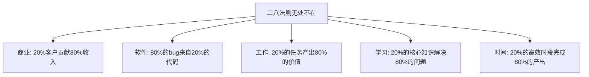
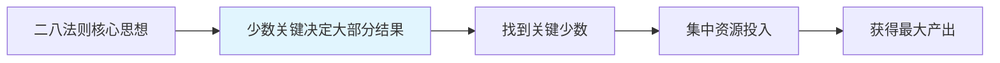
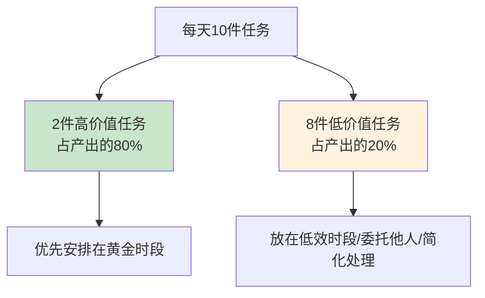
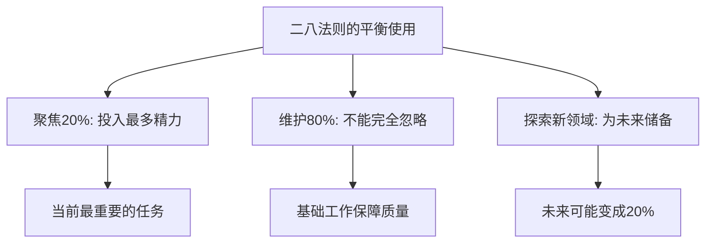
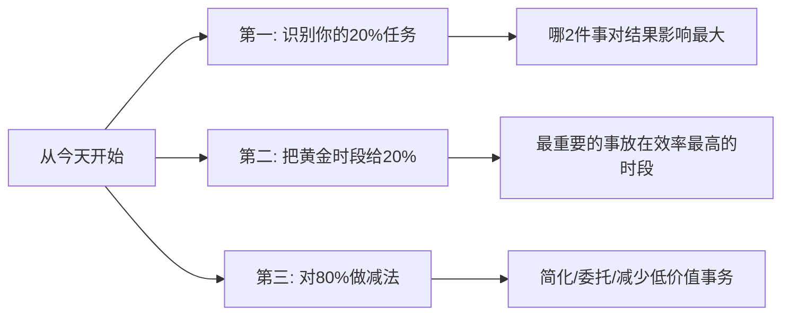

# 二八法则的运用
#### 目录介绍
- [01.看一个真实案例](#01看一个真实案例)
  - [1.1 那个让我崩溃的双月复盘前夜](#11-那个让我崩溃的双月复盘前夜)
  - [1.2 一句话点醒梦中人](#12-一句话点醒梦中人)
- [02.二八法则的背景](#02二八法则的背景)
  - [2.1 一个关键的发现](#21-一个关键的发现)
  - [2.2 无处不在的二八现象](#22-无处不在的二八现象)
- [03.二八法则的原理](#03二八法则的原理)
  - [3.1 不对等分布](#31-不对等分布)
  - [3.2 并不是精确的80和20](#32-并不是精确的80和20)
  - [3.3 为什么会出现这种不对等](#33-为什么会出现这种不对等)
- [04.工作中的二八法则](#04工作中的二八法则)
  - [4.1 时间管理中的二八](#41-时间管理中的二八)
  - [4.2 任务管理中的二八](#42-任务管理中的二八)
  - [4.3 技术学习中的二八](#43-技术学习中的二八)
  - [4.4 Bug修复中的二八](#44-bug修复中的二八)
  - [4.5 团队管理中的二八](#45-团队管理中的二八)
- [05.如何找到你的20%](#05如何找到你的20)
  - [5.1 三个问题帮你定位](#51-三个问题帮你定位)
  - [5.2 用数据来验证](#52-用数据来验证)
  - [5.3 一个简单的打分模板](#53-一个简单的打分模板)
- [06.二八法则的局限性](#06二八法则的局限性)
  - [6.1 不能忽略那80%](#61-不能忽略那80)
  - [6.2 80%中可能藏着未来的20%](#62-80中可能藏着未来的20)
  - [6.3 警惕"伪二八"陷阱](#63-警惕伪二八陷阱)
- [07.总结回顾一下](#07总结回顾一下)
  - [7.1 一句话核心](#71-一句话核心)
  - [7.2 你应该带走的三件事](#72-你应该带走的三件事)
- [08.后来发生的改变](#08后来发生的改变)
  - [8.1 第一周：把20%标出来](#81-第一周把20标出来)
  - [8.2 第一个月：黄金时段交给关键任务](#82-第一个月黄金时段交给关键任务)
  - [8.3 三个月后：双月复盘的反转](#83-三个月后双月复盘的反转)
- [09.今天起改变三点](#09今天起改变三点)
  - [9.1 第一，识别你的20%任务](#91-第一识别你的20任务)
  - [9.2 第二，把黄金时段留给20%](#92-第二把黄金时段留给20)
  - [9.3 第三，对80%做减法](#93-第三对80做减法)
- [10.课后作业思考下](#10课后作业思考下)
  - [10.1 个人盘点类作业](#101-个人盘点类作业)
  - [10.2 团队与生活类作业](#102-团队与生活类作业)

## 01.看一个真实案例

那是我入行第三年，刚被提拔为小组的技术骨干，手上同时跟着 4 个项目。每天我的状态大概是这样的：

- 早上 9 点到公司，第一件事打开邮箱，回邮件回到 11 点
- 11 点到 12 点开早会，对齐各项目进度
- 下午 2 点到 5 点排满了各种评审会、需求会、跨部门对齐会
- 5 点到 7 点处理同事的紧急求助，帮人 review 代码、答疑
- 7 点之后才开始写自己的核心需求，经常加班到晚上 11 点

我每天工作 12 小时以上，自我感觉非常努力。直到双月复盘的前一天晚上，我打开自己的 OKR 文档，**整个人都麻了**——四个 KO（Key Objective）里，只有一个推进得勉强过半，另外三个几乎纹丝未动。

我盯着文档发呆了半小时：我明明这么忙，为什么核心结果几乎全部没产出？

第二天复盘会上，我硬着头皮汇报，承认四个目标只完成了一个。我以为会被 Leader 痛批，没想到他只问了我一句话：

> "你过去两个月里，**真正在推进 OKR 的时间**，加起来有多少？"

我老老实实回看了日历——除去会议、邮件、答疑、临时救火，真正花在 KO 上的时间，**两个月加起来不到 60 小时**。而我每天在公司待的时间，加起来超过 600 小时。

也就是说——**我用了 90% 的时间，去做产出占 10% 的事**。

Leader 笑了笑，扔给我一句话："你该读读帕累托了。" 那一晚我回家翻出二八法则相关的书和文章，第一次真正理解了为什么有人轻松超额完成 OKR，而我这种"看起来很努力"的人，反而结果惨淡。下面我就把这套救了我职业生涯的方法论，完整讲给你。

## 02.二八法则的背景

1897年，意大利经济学家维尔弗雷多·帕累托（Vilfredo Pareto）在研究英国的财富分布时发现了一个惊人的规律：社会上20%的人占有80%的社会财富。他后来发现这个规律在很多领域都普遍存在。

这就是著名的"二八法则"（也叫帕累托法则或80/20法则）。

在工作中，二八法则的体现更加明显：你一天忙碌了10件事，其中真正产出价值的可能只有2件；你掌握的技术知识中，经常用到的核心知识可能只占20%。

认识到这个规律后，你就知道了一个提升效率的关键：**找到你的20%，把大部分精力投入到那20%上去。**

## 03.二八法则的原理

二八法则的核心是：投入和产出之间的关系不是线性的。不是你投入100%的精力就能得到100%的回报——实际上，少数关键的投入往往产生大部分的回报。

| 投入比例 | 产出比例 | 说明 |
|----------|----------|------|
| 20%的关键客户 | 80%的营业收入 | 聚焦核心客户 |
| 20%的核心功能 | 80%的用户使用量 | 聚焦核心功能 |
| 20%的高效时间 | 80%的工作产出 | 聚焦高效时段 |
| 20%的核心知识 | 解决80%的问题 | 聚焦核心知识 |

需要强调的是，"80/20"只是一个近似比例，实际可能是70/30或90/10。它传递的核心思想是：**关键少数决定了大部分结果。** 所以二八法则的精髓不是追求精确的比例，而是帮你识别出那些"关键少数"。

很多人会问：为什么世界这么不公平，少数事物就能决定大部分结果？背后其实有三层原因：

1. **正反馈效应**：好的越来越好，比如核心客户的口碑会带来更多优质客户，核心代码的复用会带来更多收益。
2. **杠杆效应**：少数关键节点占据了系统的关键位置，撬动效果远高于普通节点。比如团队里一个核心架构师的决策，会影响整个团队几十个人的产出方向。
3. **复杂系统的自然规律**：从星系分布、城市规模到企业收入，幂律分布是复杂系统普遍的统计规律，并不只发生在工作中。

理解这一点你就不会奇怪——**与其抱怨不公平，不如顺应规律，把自己变成那个关键的 20%**。

## 04.工作中的二八法则

你一天工作8小时，但真正高效产出的时间可能只有2-3小时。问题是：这2-3小时你用来做了什么？

如果你把最高效的时段用来回复邮件和参加冗余会议，那就是把20%的黄金时间浪费在了80%的低价值事务上。正确的做法是：把最重要的任务安排在你效率最高的时段。

每天列出的10件待办事项中，真正对你的KPI/OKR有重大影响的可能只有2件。其余8件虽然也要做，但对最终结果的影响很小。

学一门新技术，你不需要把文档从头到尾看完。先掌握20%的核心概念和API，就能应对80%的开发场景。剩下的20%的罕见场景，遇到时再查文档就好。

80%的bug来自20%的代码模块。如果你能识别出那20%的"高危代码"并重点review和测试，就能大幅降低线上故障率。

团队中20%的核心成员往往贡献了80%的核心产出。作为Leader，你需要识别出这20%的核心成员，给他们足够的资源和发展空间。同时也要提升其他80%成员的能力，避免过度依赖少数人。

## 05.如何找到你的20%

问自己三个问题：

1. **如果今天只能做一件事，你会做什么？** ——这就是你的TOP 1优先级
2. **哪些任务完成后，对结果的影响最大？** ——这些就是你的关键少数
3. **哪些事情只有你能做，别人做不了？** ——这些就是你的独特价值

不要凭感觉判断什么是20%，用数据来验证：

| 分析维度 | 数据来源 | 关键指标 |
|----------|----------|----------|
| 时间分配 | 记录一周的时间日志 | 哪些时段产出最高 |
| 任务价值 | 回顾过去的KPI/OKR | 哪些任务对结果贡献最大 |
| 客户价值 | 分析客户数据 | 哪些客户贡献最多收入 |
| 技能价值 | 回顾项目经历 | 哪些技能被用得最多 |

光有方法还不够，给你一张可以直接套用的"任务价值打分表"，每周花 10 分钟把当周任务过一遍：

| 任务名 | 对 OKR 的影响（1-5） | 必须我做吗（1-5） | 是否紧急（1-5） | 总分 | 行动 |
|-------|--------------------|------------------|----------------|------|------|
| 推进核心架构方案 | 5 | 5 | 4 | 14 | 黄金时段做 |
| 写周报 | 1 | 3 | 3 | 7 | 模板化 / 周五15分钟 |
| 帮同事 review 简单代码 | 1 | 2 | 2 | 5 | 委托 / 集中处理 |
| 参加跨部门对齐会 | 2 | 2 | 4 | 8 | 只参加关键议题 |

打分超过 12 的就是你的 20%，6 分以下的就是要砍/委托/批量处理的。这张表的妙处在于——**它强迫你用数字说话，而不是凭感觉**。我自己就是用这张表，在三周内把无效会议砍掉了一半。

## 06.二八法则的局限性

二八法则不是说那80%的事情可以不做。很多基础性的工作虽然不直接产生高价值，但如果不做，整个系统就会崩溃。比如代码review、写文档、做测试——这些"低价值"任务其实是保障质量的基石。

今天看起来价值不大的事情，可能在未来变得非常重要。比如你花时间学习的一门冷门技术，可能在两年后变成行业热点。所以二八法则应该指导你的当前优先级，但不应该让你完全放弃探索。

实际工作中我踩过几次坑，把这些"伪二八"的陷阱写出来给你避雷：

- **伪 20%**：你以为重要其实不重要的事，比如花两周时间打磨一个炫技但用户不需要的功能。判断标准是——它能不能落到 OKR 的 KR 上。
- **伪 80%**：你以为不重要但其实是关键基础的事，比如线上监控告警的处理。如果你按"二八"砍掉它，可能某天就因为一个小告警没看，引发大事故。
- **静态二八**：今天的 20% 不一定是明天的 20%。业务发生重大变化（新方向、组织调整、技术换代）后，你必须重新盘点。

记住一句话——**二八法则是动态的，不是一劳永逸的**。每个季度都应该重新审视你的"关键少数"。

## 07.总结回顾一下

二八法则告诉我们：**20%的关键投入产生80%的结果**。在时间管理、任务管理、技术学习、团队管理等各个方面，都可以应用这个原则。

核心方法是：找到你的"关键少数"，把大部分精力和资源集中在这些关键事情上。同时不要完全忽略那80%的基础工作，也要保留对未来的探索空间。

**二八法则的终极启示是：做少、做精、做对的事。**

如果你只能从这篇文章带走三件事，我希望是这三件：

1. **效率不等于忙碌**——别再用"我每天加班到 11 点"安慰自己，问问自己这 12 小时里有几小时真正在推进 OKR。
2. **聚焦才是顶级生产力**——把 80% 的精力压到那 20% 关键事项上，比把 20% 精力分给 100% 事项高效得多。
3. **定期重新盘点**——你的 20% 不是固定的，至少每季度用打分模板重新过一遍清单。

## 08.后来发生的改变

讲完方法论，回到开篇那个被 OKR 复盘打脸的我。在 Leader 那句"你该读读帕累托了"之后，我做了下面这些改变。

我做的第一件事很简单——把当前 OKR 的 4 个 KO 拆成 12 个 KR，对每个 KR 用 5.3 节那张打分表打分。结果出乎意料：

- 真正得分 12+ 的 KR 只有 3 个，全部集中在核心项目 A 上
- 我之前花了大量时间的项目 B、C、D，对应 KR 的得分都不超过 8

那一刻我意识到——**我不是不努力，我是在错误的方向上拼命**。我把这 3 个 KR 用红色标在 Notion 看板最上面，每天早上第一眼就看到它们。

我做了三个具体动作：

1. **早会从 11 点改到下午 4 点**，把上午 9-12 点完整空出来留给核心 KR。
2. **邮件改成下午 1-2 点和下班前各处理一次**，不再让邮件随时打断我。
3. **同事的非紧急答疑统一到下午 5-6 点**，并且建了一个常见问题文档，让重复性问题自助解决。

一个月后我看自己的日历——**真正花在核心 KR 上的时间，从每月不到 30 小时涨到了 80 小时以上**，而我每天在公司的时间反而从 12 小时降到了 9 小时。

下一次双月复盘，我的 OKR 完成度从上次的 25% 涨到了 110%（核心 KR 超额完成）。Leader 在会上当着全组人的面说："你看，他没变得更努力，他只是变得更聪明了。"

更让我意外的是——**我多出来的时间和精力，让我有余力去做未来储备**。我利用每天下午 2-4 点这段次黄金时段，开始系统学习架构设计，半年后我顺利转岗到了架构组。

回头看，那次双月复盘的"惨败"反而是我职业生涯的转折点——它逼我从"忙碌的执行者"变成了"聚焦的决策者"。如果你正在经历"很努力但没结果"的阶段，下面这三点是我希望你今天就开始做的事。

## 09.今天起改变三点

今天就审视你的任务清单，找出真正的20%。你今天/本周/本月的任务中，哪2-3件事对最终结果的影响最大？把它们标记出来，确保你每天都在推进这些关键任务。可以直接套用 5.3 节的打分模板，10 分钟就能跑完一遍。

把你效率最高的时段留给那20%的关键任务。如果你上午10点最清醒，那就把最重要的任务安排在上午10点。不要把黄金时段浪费在回复邮件和参加低效会议上。我自己的做法是把所有会议尽量挪到下午 4 点之后，给上午留出 2-3 小时的"勿扰深度时段"。

对那80%的低价值事务做减法。有些事情可以简化处理，有些可以委托给别人，有些甚至可以不做。每砍掉一件低价值的事，你就多了一份精力投入到高价值的事上。一个非常实用的小技巧是——**每周五花 15 分钟回顾本周日历，圈出"如果不做也不会有事"的事项，下周直接砍掉**。

## 10.课后作业思考下

1. 记录你这周做的所有事情，然后标注哪些对结果产生了实质性影响、哪些只是"忙碌但无价值"。你的20%是什么？
2. 用 5.3 节的打分模板把你当前的 OKR/KPI 全部打一遍分，看看你正在花最多时间的事，是不是最高分的事。

3. 分析你团队的客户/项目/需求，哪20%贡献了80%的业务价值？团队的资源分配是否和这个比例匹配？
4. 回顾你过去一年学习的技术知识，哪20%的知识是你最常用的？这个发现对你未来的学习方向有什么指导？
5. 思考二八法则在你的生活中的体现：你80%的快乐来自哪20%的人或事？你能否在这些方面投入更多时间？

