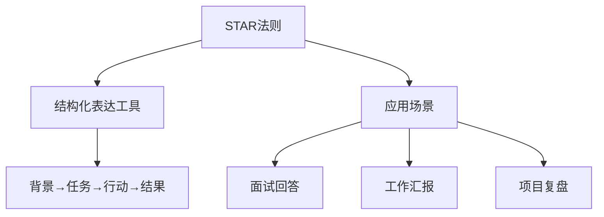
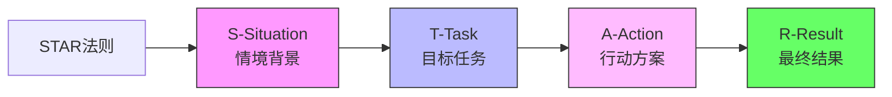
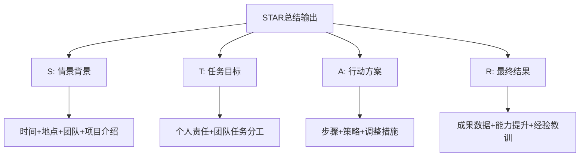
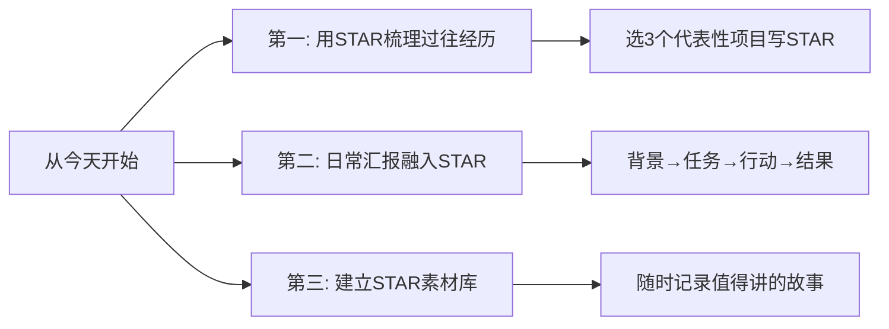

# 32.STAR摸底分析法
#### 目录介绍
- [01.看一个真实案例](#01看一个真实案例)
- [02.STAR应用背景](#02star应用背景)
- [03.STAR法则介绍](#03star法则介绍)
- [04.STAR应用场景](#04star应用场景)
- [05.STAR存在弊端](#05star存在弊端)
- [06.STAR总结输出](#06star总结输出)
- [07.后来发生的改变](#07后来发生的改变)
- [08.今天起改变三点](#08今天起改变三点)
- [09.课后作业思考下](#09课后作业思考下)

## 01.看一个真实案例

那是我第一次跳槽，面试一家心仪的公司。聊到一半，面试官放下水杯，看着我说：

> "讲一下你做过最有挑战的一个项目吧。"

我心里一喜，这题我准备过。然后我一开口就开始说："我们当时做了一个 HR 系统，里面有考勤、薪资、福利……"

我讲了大概**七八分钟**，从需求讲到技术选型，从联调讲到上线，越讲越急，怕漏掉哪个细节，结果面试官打断我两次：

- 第一次："等一下，你在这个项目里**具体负责什么**？"
- 第二次："你说效果好，**好在哪？有数据吗**？"

我支支吾吾，半天答不上来。出门那一刻，我就知道这家凉了。果然第二天 HR 礼貌性地告诉我："综合评估后……"。

复盘的时候我找了一个做 HRBP 的前辈吃饭，把刚才的回答原模原样背给她听。她笑了笑，掏出一张餐巾纸，写了 4 个字母：

> **S — T — A — R**
>
> S（Situation 情境）：当时是什么背景？
> T（Task 任务）：**你**的任务是什么？（不是"我们"）
> A（Action 行动）：你具体做了什么？为什么这么做？
> R（Result 结果）：最终结果如何？**用数字说话**。

她让我用这 4 个字母把刚才那段话重讲一遍。我憋了三分钟，重新组织：

- **S**：公司 800 人规模，HR 用 Excel 管考勤，每月 3 天加班对账，错误率 5%。
- **T**：我作为后端 Owner，负责 HR 系统从 0 到 1 的考勤模块，上线后错误率要降到 1% 以下。
- **A**：我做了三件事——梳理 12 类异常考勤场景、设计补卡审批流、推动 HR 培训。
- **R**：上线 3 个月，月度对账时间从 3 天降到 4 小时，错误率 0.6%，HR 满意度从 65% 升到 92%。

讲完那一刻我自己都愣住了——同样一段经历，结构变了，**份量也变了**。前辈说："这就是 STAR。它不是模板，是让你学会**站在听者角度**讲故事。"

下面这套 STAR 摸底分析法，就是那次教训之后，我反复打磨、用在面试、汇报、复盘里的方法论。

## 02.STAR方法应用背景

考察一个人的能力，最直接的方式是听他讲自己的工作经历。但经历讲不清、听不懂，往往不是能力不够，而是结构不对。STAR 法则最早就是面试官为收集信息设计的一套逻辑框架，后来被沿用到工作汇报、项目复盘等结构化表达场景中，成为讲清一段经历的通用骨架。

## 03.STAR法则详细介绍

STAR 是四个英文单词的首字母缩写，每个字母对应一个必答问题：

1. **S — Situation（情境）**：做这件事的初衷是什么？项目背景、需要解决的问题是什么？
2. **T — Task（任务）**：衡量完成的标准是什么？**你**承担的具体目标是什么？（不是"我们"）
3. **A — Action（行动）**：你采取了哪些步骤？为什么这么选？遇到困难时如何调整？
4. **R — Result（结果）**：最终产出与初衷差多少？**尽量用数据说话**，并简述自己的能力增量。

四步前后呼应，听者才能在脑中"看见"你在那段经历里真实存在的样子——而不是一个含糊的"我们做了一个项目"。

## 04.STAR方法应用场景

STAR 最典型的三个应用场景是**面试回答、工作汇报、项目复盘**。01 节的 HR 系统案例已经完整演示过面试场景，这里补充一个非技术类的复盘案例——组织员工旅游，看它如何跨领域适用。

**背景（S）**：员工长时间工作压力大，团队凝聚力偏弱，公司决定在暑假举办一次员工旅游，目标是改善沟通协作、提升满意度。

**任务（T）**：作为 HR 部门经办人，我负责策划和组织这次活动，覆盖目的地选择、行程安排、预算控制、现场执行四条主线。

**行动（A）**：一是先做员工偏好调研，收集目的地和形式期望；二是与三家旅行社比价、比方案，最终选出兼顾员工需求和公司预算的组合；三是制定详细行程、提前锁定住宿交通、召开行前会讲清安全须知；四是活动期间全程跟队，及时处置突发情况。

**结果（R）**：参与率 90%，活动满意度 95%，事后一个季度的内部效率指标提升 10%，还沉淀出一份可复用的《员工活动组织 SOP》——这对我个人来说，是把"办一次活动"变成了"能办任何一次活动"的能力。

从这个例子能看到，STAR 不是技术圈的专利。任何一段"你参与过、你负责过、你交付过"的经历，都可以套进这四个格子里，把口头汇报升级成有信息密度的表达。

## 05.STAR方法存在弊端

STAR 的四个格子既是脚手架，也可能成为紧箍咒。一旦你只是机械地往里填字，听者一耳朵就能听出你在"背模板"，反而显得没有真情实感。另外，它更适合复盘"已经发生的事"，而不擅长展示前瞻性思考——面对头脑风暴、方案探讨这类面向未来的场景，OST（目标-策略-战术）或 5W2H 会更顺手。**用 STAR 讲过去，用别的框架谈未来**，是最省心的分工。

## 06.STAR方法总结输出

结构讲完，最容易被忽略的是"讲述姿态"。同样一套 STAR，有人讲完像团队合影，有人讲完像个人特写，差别就在下面这三条底线上：

> **不要讲"我们做了什么"，要讲"在什么背景下，我承担了什么任务，做了哪几件具体的事，最后产生了哪些可以被量化的结果"。**

1. **永远讲"我"，不讲"我们"**：听者想听的是你个人的贡献，不是团队的合影。
2. **行动要有"为什么"**：A 不只是动作清单，更要解释你为什么这么选，凸显判断力。
3. **结果一定要有数字**：没数字的结果就像没盐的菜，听完不留印象。

## 07.后来发生的改变

那次面试失败后，我做的第一件事是把过去 3 年里**最有代表性的 3 个项目**——HR 系统、监控告警平台、移动端启动优化——分别用 STAR 写成了 3 段 200 字以内的小卡片。每段都强迫自己回答四个问题：

- 这件事的背景是什么？为什么要做？
- **我**承担的具体任务是什么？
- 我做了哪 3 件最关键的事？
- 最后的数字是什么？

写完读出声给老婆听，她听不懂技术，但听完能复述大概，那我就知道讲清楚了。

两个月后我再次面试，又是那道老题："讲一个最有挑战的项目"。

我深吸一口气，按 STAR 讲：背景（30 秒）→ 任务（20 秒）→ 行动（90 秒，重点）→ 结果（30 秒，全是数字）。三分钟讲完，面试官点了点头："数据很扎实，可以再往下聊技术细节吗？"

那场面试我拿到了 offer，且评级比预期高一档。HR 反馈里有一句话我印象很深：**"表达结构清晰，能听到他自己干的事。"**

我后来带了一个 5 人小团队。每周周会，我让每个人用 STAR 讲一件本周最有价值的事——背景一句话、任务一句话、行动三件事、结果三个数字。

刚开始大家不习惯，觉得"太刻板"。但坚持一个月后，团队季度汇报的质量肉眼可见地提升——leader 反馈说："你们组的汇报，听着特别**有信息密度**。" 我心里偷笑：这不就是当年那张餐巾纸救我命的方法么。

## 08.今天起改变三点

**今天就选3个你做过的代表性项目，用STAR法则各写一遍。** 背景是什么？你的任务是什么？你采取了什么行动？最终结果如何？写完后大声读一遍，检查逻辑是否通顺、数据是否具体。这些素材无论是面试、汇报还是晋升答辩，都能直接使用。

**在日常工作汇报中有意识地使用STAR结构。** 下次向领导汇报项目进展时，不要零散地说"我做了ABC"，而是用STAR的结构来组织："在XX背景下（S），我负责XX任务（T），采取了XX措施（A），最终取得了XX结果（R）"。这种结构化表达会让你的汇报更有说服力。

**开始建立你的STAR素材库。** 准备一个文档，每完成一个有价值的项目或任务，就用STAR法则记录一条。积累半年后你就会有一个丰富的素材库，无论是写年终总结、准备面试还是晋升答辩，都能随时调用。

## 09.课后作业思考下

1. 用STAR法则描述你在当前工作中最有成就感的一个项目，注意：结果部分一定要有具体数据支撑。
2. 找一篇你之前写过的项目总结，用STAR法则重新组织一遍，对比修改前后，看看哪个版本更清晰更有说服力。

1. 模拟一个面试场景，让朋友用STAR法则向你提问一个问题（如"请描述你解决过的最复杂的技术问题"），练习你的STAR回答。
2. 对比STAR法则和金字塔汇报法，思考它们各自更适合什么场景。你能总结出使用规则吗？

