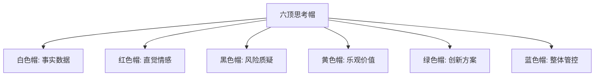
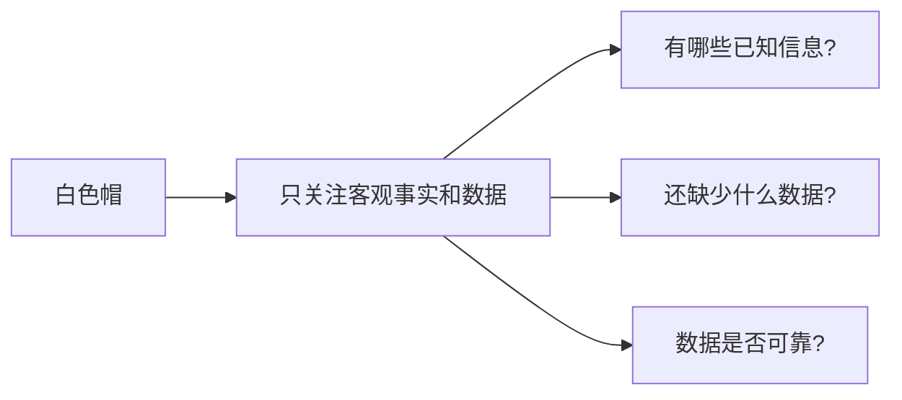
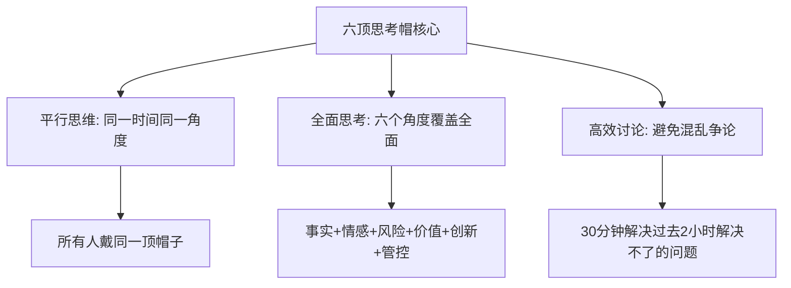
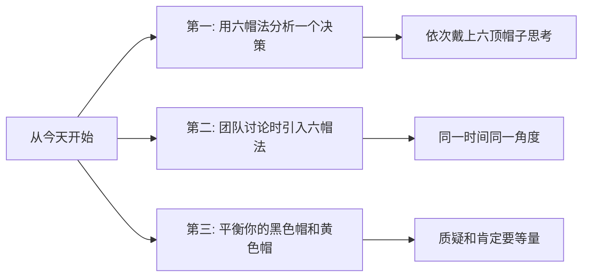

# 六顶思考帽方法
#### 目录介绍
- [01.看一个真实案例](#01看一个真实案例)
  - [1.1 那场开了三小时还吵翻天的会](#11-那场开了三小时还吵翻天的会)
  - [1.2 一位空降总监 30 分钟收尾](#12-一位空降总监-30-分钟收尾)
- [02.六顶思考帽背景](#02六顶思考帽背景)
  - [2.1 讨论低效的根源](#21-讨论低效的根源)
  - [2.2 思考帽的起源](#22-思考帽的起源)
- [03.六顶帽子的含义](#03六顶帽子的含义)
  - [3.1 白色帽：事实与数据](#31-白色帽事实与数据)
  - [3.2 红色帽：直觉与情感](#32-红色帽直觉与情感)
  - [3.3 黑色帽：风险与质疑](#33-黑色帽风险与质疑)
  - [3.4 黄色帽：乐观与价值](#34-黄色帽乐观与价值)
  - [3.5 绿色帽：创新与方案](#35-绿色帽创新与方案)
  - [3.6 蓝色帽：管控与总结](#36-蓝色帽管控与总结)
- [04.如何使用思考帽](#04如何使用思考帽)
  - [4.1 团队讨论的标准流程](#41-团队讨论的标准流程)
  - [4.2 个人思考的使用方式](#42-个人思考的使用方式)
- [05.思考帽实际案例](#05思考帽实际案例)
  - [5.1 是否引入新技术栈](#51-是否引入新技术栈)
  - [5.2 是否启动一个高风险新项目](#52-是否启动一个高风险新项目)
- [06.思考帽使用技巧](#06思考帽使用技巧)
  - [6.1 控制每顶帽子的时间](#61-控制每顶帽子的时间)
  - [6.2 黑色帽不要过度使用](#62-黑色帽不要过度使用)
  - [6.3 红色帽要快速](#63-红色帽要快速)
- [07.总结回顾一下](#07总结回顾一下)
  - [7.1 一句话核心](#71-一句话核心)
  - [7.2 六顶思考帽给你的最大改变](#72-六顶思考帽给你的最大改变)
- [08.后来发生的改变](#08后来发生的改变)
  - [8.1 第一周：自己开始戴帽子思考](#81-第一周自己开始戴帽子思考)
  - [8.2 第一个月：技术评审从两小时到 40 分钟](#82-第一个月技术评审从两小时到-40-分钟)
  - [8.3 半年后：被提名为"会议效率最高的 Leader"](#83-半年后被提名为会议效率最高的-leader)
- [09.今天起改变三点](#09今天起改变三点)
  - [9.1 第一，用六帽法分析一个决策](#91-第一用六帽法分析一个决策)
  - [9.2 第二，团队讨论时引入六帽法](#92-第二团队讨论时引入六帽法)
  - [9.3 第三，平衡你的黑色帽和黄色帽](#93-第三平衡你的黑色帽和黄色帽)
- [10.课后作业思考下](#10课后作业思考下)
  - [10.1 个人尝试类作业](#101-个人尝试类作业)
  - [10.2 团队与思辨类作业](#102-团队与思辨类作业)

## 01.看一个真实案例

那是我刚转管理岗第三个月。部门要决策一个非常重要的事——**主力数据库要不要从 MySQL 迁到 TiDB**。负责人拉了 8 个核心成员开会，我也在其中。

会议从下午 2 点开始。半小时后我就发现这场会要废了——

- **A 同事**在大谈"TiDB 的弹性扩展数据有多好看，能解决我们所有的扩容问题"
- **B 同事**马上反驳："你别瞎说，迁移失败的话你能负责吗？"
- **C 同事**插话："我感觉这事不靠谱，直觉告诉我会出大问题"
- **D 同事**冒出来："要不我们再调研一下 OceanBase？"
- **E 同事**："你们有没有数据啊？光说没用！"

整个会议室像菜市场——**有人谈数据、有人谈风险、有人谈感受、有人谈新方案，所有人各说各的，谁也说服不了谁**。

三个小时后会议结束，**没有任何结论**。负责人脸色铁青地宣布"下周再开"。我走出会议室的时候，脑子里只有一个念头："这种会再来三次，项目就崩了。"

下周二的复议会，空降的新总监来了。他看了一眼上次的会议纪要，皱了皱眉，然后做了一件让我至今印象深刻的事——

他在白板上画了 6 个圆圈，分别填上白、红、黑、黄、绿、蓝六种颜色，然后说：

> "今天我们换个开法。每个阶段所有人只能讨论一种内容——
> **前 5 分钟，所有人只谈数据，谁夹带观点我打断**。
> **接下来 5 分钟，所有人只说优点**……"

会议在 30 分钟内结束，得出了清晰的结论：**采用渐进式迁移，新业务用 TiDB，老业务保持 MySQL，6 个月后评估**。

我当时整个人是震惊的——同样一群人、同样的话题，**只是换了一种讨论结构，效率提升了 6 倍**。会后我追上去问总监："你这是什么方法？" 他笑了笑："德博诺的六顶思考帽，回去查一下。"

下面这套救了我们部门会议效率的方法论，今天我完整讲给你。

## 02.六顶思考帽背景

你有没有经历过这样的会议：讨论一个方案时，有人在谈数据，有人在谈感受，有人在质疑风险，有人在提新想法——大家各说各的，讨论了两小时也没有结论。

这个问题的根源是：所有人在同一时间用不同的思维方式思考同一个问题，导致思维混乱、争论不休。

六顶思考帽（Six Thinking Hats）由英国心理学家爱德华·德·博诺（Edward de Bono）在1985年提出。他认为，人在思考问题时，应该把不同类型的思维分开进行，而不是混在一起——就像戴不同颜色的帽子一样。

## 03.六顶帽子的含义

戴上白色帽时，只谈事实和数据，不夹带观点和判断。比如："上个月用户留存率是35%""竞品的同类功能上线了3个月"——这些都是白色帽的内容。"留存率太低了"则不是白色帽的内容，因为它包含了判断。

红色帽允许你表达直觉、感受和预感，不需要给出理由。比如："我觉得这个方案用户不会买账""我对这个项目有一种不好的预感"。红色帽的价值在于，它承认情感和直觉在决策中的作用。

黑色帽专注于找出方案的问题、风险和隐患。比如："如果服务器宕机了怎么办？""这个方案的成本可能超出预算""历史上类似的项目都失败了"。黑色帽是最常被使用的帽子，但要注意不要过度使用。

黄色帽专注于发现方案的优点、价值和机会。比如："这个方案能让用户体验大幅提升""如果成功的话，我们能抢占市场先机"。黄色帽和黑色帽是一对搭档，确保你既看到了风险也看到了价值。

绿色帽专注于创造性思维——提出新想法、新方案、新可能。比如："我们能不能换一种完全不同的技术方案？""有没有可能和XX部门合作来降低成本？"绿色帽鼓励天马行空，暂时不考虑可行性。

蓝色帽是"帽子的帽子"——它负责管控整个思考过程，决定什么时候戴什么帽子，最终做出总结。通常由会议主持人来扮演蓝色帽的角色。

| 帽子 | 思维类型 | 核心问题 | 适用场景 |
|------|----------|----------|----------|
| 白色 | 客观事实 | 事实和数据是什么？ | 收集信息阶段 |
| 红色 | 直觉情感 | 直觉告诉我什么？ | 快速表达感受 |
| 黑色 | 风险质疑 | 有什么问题和风险？ | 风险评估阶段 |
| 黄色 | 乐观价值 | 有什么好处和价值？ | 价值评估阶段 |
| 绿色 | 创新方案 | 有什么新想法？ | 头脑风暴阶段 |
| 蓝色 | 整体管控 | 该怎么组织讨论？ | 贯穿全程 |

## 04.如何使用思考帽

关键规则是：同一时间所有人戴同一顶帽子。当大家都在戴白色帽讨论数据时，不允许有人跳到黑色帽来质疑方案。这个简单的规则能大幅提升讨论效率。

六顶思考帽不仅适合团队讨论，也适合个人独立思考。当你面对一个复杂决策时，可以依次戴上六顶帽子，从不同角度审视问题。这能帮你避免思维偏见，做出更全面的判断。我自己每次面对重大决策（换工作、买房、孩子升学），都会先用六顶帽子在 A4 纸上过一遍，能挖出很多平时忽略的角度。

## 05.思考帽实际案例

团队在讨论是否将主力开发语言从Java迁移到Go：

| 帽子 | 讨论内容 |
|------|----------|
| 白色 | Go在性能测试中比Java快30%；团队15人中有3人有Go经验；迁移预计需要6个月 |
| 红色 | 团队成员对学新语言既兴奋又焦虑；部分老成员担心自己跟不上 |
| 黄色 | 性能提升意味着节省30%的服务器成本；Go的并发模型更适合我们的业务场景 |
| 黑色 | 迁移期间可能影响需求交付速度；Go的生态不如Java成熟；招聘Go工程师更困难 |
| 绿色 | 可以渐进式迁移——新服务用Go，老服务暂不迁移；组织Go培训让全员参与 |
| 蓝色 | 决策：采用渐进式迁移策略，新项目用Go，先培训3个月再正式启动 |

再举一个我亲身用过的例子——团队讨论是否要承接一个"6 个月内做出 AI 智能客服"的高风险项目：

| 帽子 | 讨论内容 |
|------|----------|
| 白色 | 公司有 30 万客服工单数据；团队 0 人有 LLM 项目经验；预算 200 万 |
| 红色 | 团队整体兴奋（终于能做 AI 了），但 Leader 个人感觉风险偏大 |
| 黄色 | 成功后能为公司节省 60% 的客服成本；团队能进入 AI 赛道；个人简历加分 |
| 黑色 | 6 个月时间紧；团队完全没有 LLM 经验；模型效果可能不达预期；客户投诉风险 |
| 绿色 | 拆成两期——Q1 先做"AI 辅助人工"（不替代）；Q2 再做"全自动接管" |
| 蓝色 | 决策：接项目，但按绿色帽方案分两期推进，Q1 末做 Go/No-Go 决策点 |

可以看到——**戴帽子的最大好处是你不会漏掉任何一个角度**。如果没有黄色帽，团队可能只看风险拒绝；如果没有黑色帽，可能盲目接项目最后翻车。

## 06.思考帽使用技巧

建议每顶帽子的讨论时间控制在5-10分钟。时间太短讨论不充分，太长容易跑题。蓝色帽（主持人）负责控制时间和节奏。**强烈建议用一个可见的倒计时器**，时间到立刻切换。

很多人天然倾向于找问题和挑毛病（黑色帽思维），导致讨论变成了"否定大会"。解决方法：确保黄色帽和黑色帽的时间相当，每次质疑一个风险后，要求给出解决方案。

红色帽的讨论应该很短——每人30秒表达直觉感受即可。不需要解释理由，直觉本身就是信息。**红色帽常常被低估，但实际上经验丰富的人的直觉，很多时候比数据更准**。

## 07.总结回顾一下

六顶思考帽的核心价值是"平行思维"——让所有人在同一时间从同一角度思考问题，避免思维混乱和争论不休。六个角度保证了思考的全面性，时间控制保证了讨论的效率。

我用六顶思考帽几年下来，发现它带来的不止是"开会更快"，更深的是三个改变：

1. **告别情绪化讨论**——把"你说的不对"变成"我现在戴的是黑色帽，我看到的风险是……"，对事不对人
2. **让内向的人也能发声**——红色帽和绿色帽阶段非常适合平时不爱说话的人，强制让所有人参与
3. **决策质量提升**——再也不会因为漏掉某个角度而事后后悔

## 08.后来发生的改变

回到开篇那场吵了三小时的会。从那位总监 30 分钟收尾的会议结束后，我做了下面这些改变。

我做的第一件事是把六顶帽子的简介贴在了显示器边上。每次自己思考一个问题前，**强迫自己依次戴一遍六顶帽子**。第一个被我用六帽法分析的，是"要不要主动申请带新人"这个决策。

结果让我惊讶——之前我只看到了"会占用我时间"（黑色帽），用六帽法之后我又看到了：

- **黄色帽**：能锻炼我的管理能力，对未来转岗管理有帮助
- **绿色帽**：可以把新人培养体系做成 SOP，反过来让我自己受益
- **红色帽**：直觉告诉我这是个好机会

我接了，半年后这个新人成了我团队的核心，让我个人产出翻倍。**如果不用六帽法，我大概率因为短期成本就拒绝了**。

接着我把六帽法引入了我自己组的所有技术评审。流程很简单：

1. **会前**：在会议邀请里就写明"本次会议采用六帽法，请按顺序准备"
2. **会中**：白板上贴 6 张彩色卡片，蓝色帽（我）控制节奏
3. **会后**：直接给出蓝色帽总结决策

效果：**我组的技术评审会平均时长从 2 小时降到 40 分钟，且决策返工率下降 70%**（之前经常评审完之后又被推翻重来）。

半年后部门做"360 反馈"调研，我被同事们提名为"会议效率最高的 Leader"。Leader 在反馈面谈时问我："你怎么做到的？" 我把六顶帽子的事讲给他听——

后来这个方法被推广到了整个部门。最让我有成就感的是——**那个曾经吵了三小时还没有结论的"主力数据库迁移"会议，从此再也没有出现过**。所有重大决策会议都按六帽法的结构开，平均时长 40-60 分钟，且都能产生明确决策。

如果你也常常被低效会议折磨，下面这三点是我希望你今天就开始做的事。

## 09.今天起改变三点

选择一个你正在犹豫的决策，依次戴上六顶帽子分析。白色帽收集事实、红色帽感受直觉、黄色帽看好处、黑色帽看风险、绿色帽想方案、蓝色帽做总结。你会发现，这比"纠结来纠结去"高效得多。我自己第一次用就挖出了平时漏掉的两个关键角度。

下次团队讨论时，尝试引入六顶思考帽。在开始时说明规则：我们先用5分钟收集事实（白色帽），再用5分钟讨论价值（黄色帽），再用5分钟讨论风险（黑色帽）……这个简单的结构变化就能让讨论效率翻倍。**特别推荐用六色卡片或彩色 PPT 给所有人可视化提示**，效果立竿见影。

有意识地平衡你的黑色帽和黄色帽。如果你发现自己习惯性地找问题、挑毛病（黑色帽过度），那就刻意多戴黄色帽——每提出一个质疑的同时，也说出一个优点。反之亦然。**长期不平衡的人，要么会成为"杠精"，要么会成为"老好人"，两者都做不出好决策**。

## 10.课后作业思考下

1. 选一个你最近做过的重要决策，用六顶思考帽的方法重新分析一遍。你是否发现了之前遗漏的角度？
2. 观察你自己最常戴的是哪顶帽子（可能是黑色帽或红色帽），思考这对你的决策质量有什么影响。

3. 在下一次团队讨论中试用六顶思考帽方法，记录讨论的效率和结果质量与以往的差异。
4. 六顶思考帽和3C方案设计法可以如何结合使用？设计一个你自己的决策流程。

