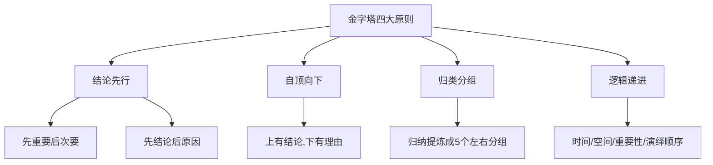
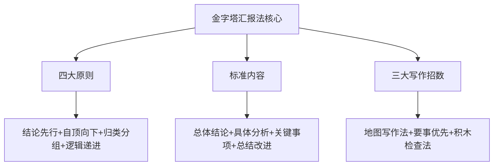
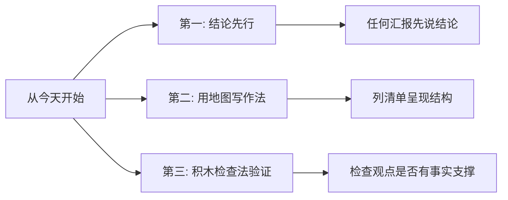

# 金字塔汇报方法
#### 目录介绍
- [01.看一个真实案例](#01看一个真实案例)
- [02.汇报时踩的坑](#02汇报时踩的坑)
- [03.金字塔原理总结](#03金字塔原理总结)
- [04.金字塔四大原则](#04金字塔四大原则)
- [05.金字塔汇报法](#05金字塔汇报法)
- [06.汇报方法招数](#06汇报方法招数)
- [07.总结一下汇报法](#07总结一下汇报法)
- [08.后来发生的改变](#08后来发生的改变)
- [09.今天起改变三点](#09今天起改变三点)
- [10.课后作业思考下](#10课后作业思考下)

## 01.看一个真实案例

那年我刚接手一个核心项目，第一次跟着部门 Leader 去给总监做季度汇报。我准备得非常用心——50 多页 PPT，从项目启动背景、整体进度、跨部门协作、技术细节、踩过的坑一项项往下讲。

讲到第 5 分钟，总监第一次抬头："说重点。"
讲到第 12 分钟，总监第二次打断："这些我都看到了，**你最后想告诉我的是什么？**"
讲到第 25 分钟，总监第三次发问："你说团队很努力，那么——具体的关键结果是什么？"
讲到第 40 分钟，他干脆把 PPT 关了："这样吧，**用一句话告诉我，这个季度你最想让我记住的是什么。**"

我当场卡住了。我准备了 50 页 PPT，却答不出来"用一句话讲清楚什么"。走出会议室时，我手心全是汗。

会议结束后，部门 Leader 把我拉进小会议室，在白板上画了一座金字塔——最上面一行字"季度核心结论 1 句"，下面一层"3 个支撑论点"，再下面一层"每个论点 3 条数据/事实"。然后他对我说：

> "你不是没东西讲，是你**没把东西按金字塔摆好**。下次汇报，先在白板上画这座塔，塔尖是结论，塔身是论点，塔基是数据。摆完之后再开始写 PPT，**永远先讲塔尖，永远不要从塔基讲起。**"

那一刻我才意识到——汇报不是"我做了什么"，汇报是"对方想听什么"。从那天之后，我所有的汇报都先画金字塔再写一个字。后面这一节，就把那张救命的金字塔，完整教给你。

## 02.汇报时踩的坑

如果你汇报的时候，只是把总结得到的内容单纯地罗列出来，是很容易踩坑的。

比如以前就经常遇到这样的汇报场景：上级直接打断汇报者说："不要讲这么多细节，挑重点讲！"。这块踩的坑是，缺乏清晰的目标和重点信息的提取。

总监点评某个团队的汇报时说："感觉你们团队做了很多事情，团队也很辛苦，但没看到有什么关键结果或者突破！"。这块踩的坑是，忽略了数据和成果。

你汇报完之后，某大佬问："能不能用一两句话概括一下这一年的工作？"。这块踩的坑是，没有准备好汇报的内容，缺少总结！

为什么在这些场景中，领导都觉得不满意呢？因为汇报的逻辑和总结的逻辑是不同的。

总结主要是面向自己做梳理，更强调自己个人的贡献，以及事情的价值和细节；而汇报主要是面向领导做组织提炼，更看重团队整体的结果，以及事情的逻辑和关键。

怎么解决前面的问题呢？答案就是**金字塔汇报法**。它基于麦肯锡的金字塔原理，通过遵循四个原则来组织汇报内容，让你的汇报重点突出、逻辑清晰、主次分明，从而更容易获得高级别管理人员的认可。

## 03.金字塔原理总结

人在思考和表达的时候，有没有一个清晰的结构。"思考"一词看起来虚幻，但它其实是存在某种结构的，也就是结构化思维，它决定了一个人看待问题、分析问题、解决问题的角度。

所谓结构化思维，是将无序的信息梳理为有序的信息，并通过一些逻辑、框架，将问题有规律地拆解、细化、提炼、归因，最终找到有效解决方案的过程。

它会让我们思考得更全面、深刻，表达得更清晰、有力，行动起来更高效，更容易抓住重点、掌控全局。

金字塔原理：是一种重点突出、逻辑清晰、主次分明的逻辑思路、表达方式和规范动作。

核心思想是任何事情都可以归纳出一个中心思想，中心思想可由三至七个论点支持，每个论点可以由三至七个论据支撑，这样延伸下去，形状像一个金字塔，所以才叫金字塔原理。

## 04.金字塔四大原则

背后的 4 条基本原则才是关键。这些原则保证了你的汇报结构是重点突出、逻辑清晰、主次分明的，能够让别人快速地抓住重点，清楚地理解内容，牢固地记住信息。

关键的四个要点分别是：结论先行，以上统下，归类分组，逻辑递进。先重要后次要，先全局后细节，先结论后原因，先结果后过程。

金字塔原理是一种有效的表达工具，它要求我们在表达时遵循"重点突出、逻辑清晰、主次分明"的原则。通过运用金字塔原理，我们可以将复杂的问题简化成易于理解的内容，提高表达的效率与准确性。

如果你想向别人输出信息（文章、汇报、报告、演讲等），在一开始的时候就应该抛出结论，也就是你想要传达的中心思想。

因为如果你讲的内容比较多，别人找不到重要的结论，可能根本没兴趣认真听完；如果别人听完不明确你的结论或者把结论搞错了，最后你的输出汇报效果也会大打折扣。

具体的技巧：1.先重要（结论）后次要（结论）；2.先全局后细节；3.先总体（结论）后细分（结论）；4.先论点后论据；5.先结论后原因；6.先结果后过程。

对比上面的场景：1 和 2 针对"不要讲这么多细节，挑重点讲"这样的问题；3 和 4 针对"能不能用一两句话概括一下这一年的工作"这样的问题；5 和 6 针对"听下来给我的感觉就是，去年团队很辛苦、很努力，但是这么辛苦最后拿到来什么结果，我却没怎么看到！"这样的问题。

光有结论是不行的，这个结论还得让别人信服。所以我们采用自顶向下的结构来组织逻辑，用下层的信息来支撑上层的结论。

也就是上面有结论，下面有理由，结论概括理由，理由支撑结论，上下对应。

用自顶向下的结构来组织逻辑时会遇到一个问题：下层的数量几个比较合适呢？

如果你在平时的工作中采用了 4D 总结法总结做过的事情，你会发现你可以用的素材很多，尤其是如果你带了团队的话，素材会更多，如果逐一列上去，不要说用 PPT 了，可能用 Excel 表格列几十行才能完整的展示，这样在汇报的时候肯定是不行的。

分类分组。所以，你需要将类似的论点或者论据抽象、归纳、提炼、总结成一组，最后形成 5 个左右的分组。一般来说，分组数量尽量不要少于 3 个，如果少于 3 个，你就要检查一下分析是不是全面，有没有遗漏某些要点。

一般来讲，所有的逻辑关系都在四种顺序之内，分别是：时间顺序、空间顺序、重要性顺序以及演绎顺序。

光通过归类分组来控制数量还是不够的，必须保证同级别的内容具备逻辑关联，主要是一致性和顺序性。

一致性是指，同级别的内容必须属于同一逻辑范围。比如苹果、香蕉、葡萄、菠萝都属于"水果"范围，而牛奶就不属于"水果"。

顺序性是指，同级别的内容是按照某种顺序排列的，比如北上广深四个城市，既可以按照地理位置从北到南排序，也可以按照 GDP 从大到小排序。

## 05.金字塔汇报法

标准的汇报内容包括总体结论、具体分析、关键事项、总结改进四部分。

从全局概括整体的工作或者项目情况，得出关键性的结论，让听众整体上知道做得怎么样，形成做得好、做的一般、不达预期或遇到很大困难等直观印象。

这个部分按照金字塔原理来分析和阐述，包括一个总的结论（总体介绍）和几个主要的分论点，PPT 页数一般不超过 3 页，分论点的数量建议 1～3 个，每个分论点再给出 3～5 个论据。

对总体结论中的论据进一步阐述和分析，让别人相信论点的真实性和有效性。这个部分同样按照金字塔原理来拆解，需要提供具体的数据和证据。

介绍做过的关键事项的情况，比如某某项目的执行过程或者某某业务的推广行动和效果等。

总结经验教训和后续改进措施，注意不要随便拍脑袋提出改进措施，改进措施本身也要求有理有据。

要注意，列出来的改进措施，一定是你接下来真的准备去做的，不要为了凑数而加上去，因为下次汇报的时候，领导很可能会想先了解一下你上次汇报时列出的改进措施到底落实得怎么样。

## 06.汇报方法招数

如何给领导呈现一份工作汇报，来清晰地展现你的工作成果，就是考验每个职场人的必修课。分享写好工作汇报的三个方法，帮你把汇报写得更加清晰有力，让你在团队里脱颖而出。

我们对工作的思考、思考的框架，想得是不是周全、考虑的高度在哪，其实都会一览无余地在纸面上反映出来。看你写的东西，对领导来说就是最高效的方式，那我们可千万别吃了不会写作的亏。

写汇报三大常见误区： 误区一，是文章一写就是一大段。 误区二，是重点不突出。 误区三，是文字空洞，很不具体。

我们做汇报还有一个特别容易上手的结构，就是列清单。一二三四五要说什么，清清楚楚，一打眼就能看明白。即使他一下子看不了每一件事都说了什么，他心中也有一个地图，说了五件事。

学会了地图写作法，我们就攻克了汇报的第一大误区。学会用结构来呈现信息，整篇文章就会显得更加简洁，也容易懂。

有时候，结构可能已经很清晰了，但是领导扫两眼就表示：你的结论是什么？这种时候多半是你的开头没写好。

做汇报的时候我们很容易想着我要给你把背景讲清楚，你才能理解。我要给你讲清楚我的思考过程，我是严谨的。但是读者可不这么想，他看着是不耐烦的，他就想让你赶紧说重点，"到底想让我看什么"。

我们怎么克服这个误区呢？第二招：要事优先。汇报，开头是黄金部分，一定要把最重要的行动方案、主张、观点全说出来。

开头就应该说结论，最好让领导一打开这个文档，就知道我们要解决什么问题，核心的方案和观点是什么。这样一来，领导带着结论去看这个方案，他看的时候也可以更有针对性，知道他到底要解决什么问题。

很多领导都喜欢抓细节，细节决定成败，有可能你写了个错别字，在领导心里也被扣了分。汇报这类文体里面，有一类细节你一定得关注，那就是事实得摆清楚。

为什么事实重要呢？你的方案、总结、复盘里，不论你提出了多么新颖的观点，如果没有事实能够把它支撑住，那这个观点也是没有意义的。很多时候，我们其实并不是不知道事实，而是不知道怎么写事实。反映到一篇文章里就是第三大误区，文字空洞。

职场写作里，但凡你要写观点，必须得有事实支撑。一篇文章就好像是你用积木搭了一个塔，观点就是最上面的那块积木。观点想要站得住，下面每一块支撑的事实都得站得住，一块一块垒起来，观点才能支撑住。如果有一个地方缺了环，即使你整篇文章论述得再漂亮，那整个观点都会受到质疑。

领导的阅读习惯是从框架到观点再到事实。拧过来的这件事儿确实特别难，但是你写完之后，可以按照领导的阅读习惯做一个检查，也就是我们讲的积木检查法，看看你搭的这个积木事实是不是牢固。

你得心里装着这么一个画面，只要有一个事实受到质疑，这个积木就塌了，整篇文章可能也就站不住脚了。写完汇报，一定要检查一下你是不是有充足的事实来支撑你的观点。

## 07.总结一下汇报法

| 原则 | 核心含义 | 违反后果 | 实操技巧 |
|------|----------|----------|----------|
| 结论先行 | 先说结论再说原因 | 领导没耐心听完 | 汇报开头30秒内给出核心结论 |
| 自顶向下 | 上有结论下有理由 | 结论缺乏支撑力 | 每个论点配3-5个论据 |
| 归类分组 | 同类信息归纳成组 | 信息零散难记忆 | 控制在3-5个分组 |
| 逻辑递进 | 同级内容有逻辑关联 | 听众感觉混乱 | 用时间/空间/重要性排序 |

金字塔汇报法 = **先讲结论，再讲分组论点，每个论点用 3-5 条事实/数据撑住**——讲不出 1 句话总结的汇报，本质上都没准备好。

- 汇报开头 30 秒给不出结论，等于浪费领导时间。
- 论点没有数据支撑，听感等于空话。
- 写完汇报，**永远倒着回头检查一遍**：每个观点下面是不是都有事实积木撑住。

金字塔汇报法基于金字塔原理，包括 4 条基本原则：结论先行，自顶向下，归类分组和逻辑递进。标准汇报内容包括 4 个部分：总体结论，具体分析，关键事项和总结改进。关键事项一般使用全局大图、演进路径和时间轴等技巧来汇报。

## 08.后来发生的改变

那次惨败之后的第一周，我做了一个看起来很笨的改变——**所有需要写的汇报，我都不再直接打开 PPT，而是先在工位的小白板上画一座金字塔**：塔尖写一句话总结，塔身写 3 个论点，塔基写每个论点的支撑数据。

第一次画的时候花了我整整 2 小时，因为我发现根本写不出"一句话总结"——这恰恰说明我之前 50 页 PPT 都没有真正想清楚。等我硬憋出那句话之后，PPT 反而 30 分钟就写完了。

接下来一个月，我把"结论先行"的原则贯彻到所有沟通里：

- 周报第一行永远是"本周关键结论：XX"；
- IM 找 Leader 同步，第一句永远是"老板，下面 3 件事，结论已经先告诉您：…"；
- 汇报 PPT 第一页永远是"本季度一句话总结 + 3 条分论点"。

效果立竿见影：Leader 回复速度变快了，跨部门同事追问得变少了，最让我意外的是——**有一次部门评会，总监指着我的 PPT 说"这页就该是大家汇报的标准范本"。**

3 个月后，我又一次给那位总监做汇报。我打开 PPT 第一页就是一句话："本季度核心成果：项目按时上线 + 关键指标超预期 18% + 沉淀 2 套可复用方法论。" 然后 3 张分论点页面、每张配 3-5 条数据。

整个汇报 25 分钟，**总监一次都没打断，听完只问了一个问题**："下一步你打算怎么扩展到其他业务线？" 那一刻我清楚地知道——上次那座没画好的金字塔，这次终于稳稳地立住了。

## 09.今天起改变三点

从下次汇报开始，永远先说结论。无论是口头汇报还是书面汇报，第一句话就给出你的核心结论。"本季度我们的目标完成率达到 120%，超额完成"——这就够了，先让领导知道结果，然后再展开细节。如果领导想了解更多，自然会追问。

写汇报时使用地图写作法。先列出清晰的结构——要说几件事、每件事的要点是什么，让读者一目了然。不要写大段大段的文字，用 1、2、3 来组织信息，让领导像看地图一样快速定位到他关心的内容。

写完汇报后用积木检查法检查一遍。逐一检查每个观点是否都有具体事实和数据支撑。如果某个观点下面缺少事实支撑，要么补充数据，要么删掉这个观点。**记住：一块积木不牢，整座塔都会塌。**

## 10.课后作业思考下

1. 找出你最近一次工作汇报（PPT 或文档），用金字塔原理的四大原则逐一检查：有没有结论先行？结构是否自顶向下？信息是否归类分组？同级内容是否有逻辑顺序？
2. 练习"一句话概括"的能力：用一句话概括你这个月/这个季度/这一年的核心工作成果。如果做不到，说明你对自己的工作缺乏高度抽象的能力。

1. 用金字塔汇报法重新组织一次你过去的工作汇报，对比修改前后的效果差异。
2. 找一篇你认为写得很好的工作汇报（可以是同事的，也可以是网上的范例），分析它是如何运用金字塔原理的。
