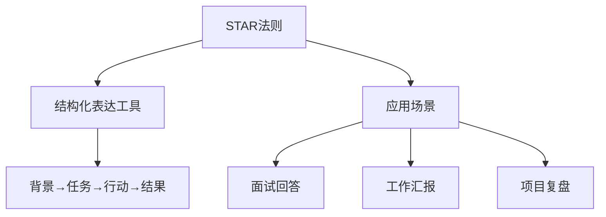
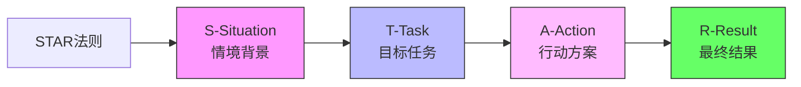
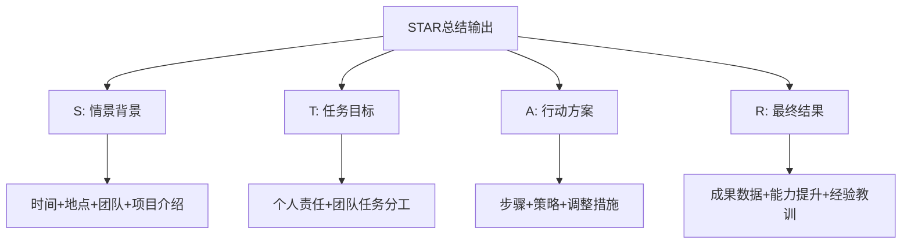
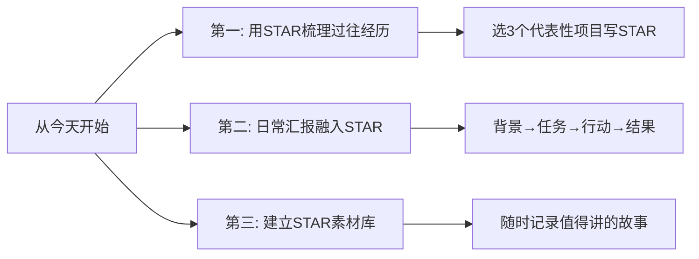

# STAR摸底分析法
#### 目录介绍
- [01.看一个真实案例](#01看一个真实案例)
- [02.STAR应用背景](#02star应用背景)
- [03.STAR法则介绍](#03star法则介绍)
- [04.STAR应用场景](#04star应用场景)
- [05.STAR存在弊端](#05star存在弊端)
- [06.STAR总结输出](#06star总结输出)
- [07.后来发生的改变](#07后来发生的改变)
- [08.今天起改变三点](#08今天起改变三点)
- [09.课后作业思考下](#09课后作业思考下)

## 01.看一个真实案例

那是我第一次跳槽，面试一家心仪的公司。聊到一半，面试官放下水杯，看着我说：

> "讲一下你做过最有挑战的一个项目吧。"

我心里一喜，这题我准备过。然后我一开口就开始说："我们当时做了一个 HR 系统，里面有考勤、薪资、福利……"

我讲了大概**七八分钟**，从需求讲到技术选型，从联调讲到上线，越讲越急，怕漏掉哪个细节，结果面试官打断我两次：

- 第一次："等一下，你在这个项目里**具体负责什么**？"
- 第二次："你说效果好，**好在哪？有数据吗**？"

我支支吾吾，半天答不上来。出门那一刻，我就知道这家凉了。果然第二天 HR 礼貌性地告诉我："综合评估后……"。

复盘的时候我找了一个做 HRBP 的前辈吃饭，把刚才的回答原模原样背给她听。她笑了笑，掏出一张餐巾纸，写了 4 个字母：

> **S — T — A — R**
>
> S（Situation 情境）：当时是什么背景？
> T（Task 任务）：**你**的任务是什么？（不是"我们"）
> A（Action 行动）：你具体做了什么？为什么这么做？
> R（Result 结果）：最终结果如何？**用数字说话**。

她让我用这 4 个字母把刚才那段话重讲一遍。我憋了三分钟，重新组织：

- **S**：公司 800 人规模，HR 用 Excel 管考勤，每月 3 天加班对账，错误率 5%。
- **T**：我作为后端 Owner，负责 HR 系统从 0 到 1 的考勤模块，上线后错误率要降到 1% 以下。
- **A**：我做了三件事——梳理 12 类异常考勤场景、设计补卡审批流、推动 HR 培训。
- **R**：上线 3 个月，月度对账时间从 3 天降到 4 小时，错误率 0.6%，HR 满意度从 65% 升到 92%。

讲完那一刻我自己都愣住了——同样一段经历，结构变了，**份量也变了**。前辈说："这就是 STAR。它不是模板，是让你学会**站在听者角度**讲故事。"

下面这套 STAR 摸底分析法，就是那次教训之后，我反复打磨、用在面试、汇报、复盘里的方法论。

## 02.STAR应用背景

面试官常常认为，考察一个人的实际能力要从个人的工作经历和项目经历出发。应该表达出一个完整的逻辑链，囊括情景、任务、行动和结果等方面的内容才能被称为是一个完整的经历。

STAR法则作为一个基础的逻辑链模型，最开始也是面试官用来提问的一个逻辑框架，用来收集面试者和工作相关的具体信息和能力。**STAR原则是结构化面试中非常重要的一个理论，也可以用于向上汇报。**

## 03.STAR法则介绍

Star法则就是情境——situation；目标——target；行动——action；结果——result，4个单词对应的首字母的缩写。

1. Situation：情景——阐述任务的背景。项目产生背景？什么样的情况下决定的？准备解决什么问题？
2. Task：目标——描述工作的内容。这个项目的任务和目标、计划完成哪些事项、完成什么样的具体成果。
3. Action：行动——所采取的行动。具体阐述项目的主要行动、具体工作、遇到的挑战和困难、如何解决的。
4. Result：结果——最终的结果如何。陈述项目的结果、是否完成了最初的任务和目标、带来的商业效果和价值如何，如果有数据支撑尽量多用数据，指标或成果来支撑。在这个过程当中又提升了哪一些能力，注意在这个地方可以着重提一提自己的能力怎么补充的。

STAR模型步骤的意义在于：

1. 背景：做这件事的初衷
2. 任务：衡量完成的标准
3. 行动：完成任务的步骤
4. 成果：结果与初衷的对比

只有这四步前后呼应，听者才能在脑子里"看见"你这个人在那段经历里**真实存在的样子**——而不是一个含糊的"我们做了一个项目"。

## 04.STAR应用场景

在汇报工作时，运用STAR法则可以帮助我们更有条理地呈现信息，使领导更加清楚地了解我们的工作进展和成果。以下是STAR法则在汇报工作中的应用步骤：

背景（situation）:当时我作为项目团队的核心成员，面临着时间紧迫、任务繁重的挑战。我们必须在有限的时间内完成一个复杂且要求极高的项目，以满足客户的期望。

任务（Task）：我的主要任务是确保项目按时交付，并且质量达到客户的期望。

行动（Action）：为了实现这一目标，我采取了一系列具体的行动:首先，我优化了工作流程，确保团队成员能够更高效地协作;
其次，我加强了团队沟通，定期组织会议以确保进度和问题的及时解决; 最后，我定期与客户进行进度确认，以获取他们的反馈和建议;

结果（Result）通过这些努力，我们成功地在预定时间内完成了项目并且获得了客户的高度评价。此外，我们的团队也在这个过程中积累了宝贵的经验，为未来的项目奠定了坚实的基础。

该案例通过运用STAR法则清晰地描述了情境、任务、行动和结果，展示了汇报人在这个过程中的能力和成果。这样的结构化汇报方式有助于更好地呈现汇报人的经历和成绩，并为未来的工作提供参考和借鉴。

STAR法则更加清晰地呈现工作成果，提高汇报的逻辑性和条理性。同时，运用STAR法则还能够使我们的汇报更加具有说服力，让领导对我们的工作能力和价值有更深入的了解。

场景：面试官提问，工作中比较有挑战的一件事情，以推动HR系统上线为例。

背景Situation：

上一份工作就职于一家快速发展的中型企业，人力资源部门面临着一个挑战：手动处理员工数据和管理流程效率低下，错误频发，这影响了员工体验和部门的工作效率。（介绍项目背景）

任务Task：

作为人力资源部门的负责人，我被分配负责调研、选择并实施一个专业的HR管理系统，以自动化管理员工数据、考勤、薪酬、福利和其他人力资源相关流程。（描述项目任务）

行动Action：

1. 我首先组建了一个跨职能团队，包括IT和财务部门的代表，以确保项目的全面性和协作。接着，我领导团队进行了需求分析，确定了关键功能和系统集成要求。
2. 在与多个供应商进行了深入比较后，我选择了一个符合公司需求和预算的HR管理系统。在系统选型后，我协调了供应商和内部团队，监督系统的配置、测试和部署。
3. 我还设计并执行了一个全面的员工培训计划，确保所有员工都能熟练使用新系统。（呈现行动方案）

结果Result：

1. 项目按时完成，HR系统成功上线。系统实施后，员工数据管理变得更加高效和准确，薪酬和考勤管理流程的自动化减少了人为错误，员工满意度提高了15%。
2. 此外，人力资源部门的工作效率得到了显著提升，员工档案维护时间减少了50%，薪酬处理时间减少了30%。
3. 这些改进帮助公司在行业内树立了良好的人力资源管理典范，并为企业未来的扩张奠定了坚实的基础。（呈现最终结果）

场景：人力资源部门工作复盘：以组织员工旅游为例。

背景Situation：

员工长时间工作压力大，团队凝聚力有待提高，公司决定在暑假期间，举办一次员工旅游活动，以增强员工之间的沟通与协作，提升员工的满意度和工作动力。（When、Where、Why）

任务Task：

作为人力资源部门的一员，我被分配负责策划和组织这次员工旅游活动，包括目的地选择、行程安排、预算控制以及确保活动顺利进行。（What）

行动Action：

首先进行了员工调查，收集他们对旅游目的地的偏好和期望，然后与几家旅行社进行了比价和方案讨论，最终选择了一个既能满足员工需求又符合公司预算的旅游方案。

制定了详细的行程计划，并提前预定了住宿、交通和活动，确保一切安排妥当。在活动前，我组织了行前会议，向员工介绍了行程安排和安全须知。在旅游期间，我全程跟踪活动进展，及时解决突发问题，确保员工安全和活动顺利进行。（How）

结果Result：

员工旅游活动取得了巨大成功，参与率达到90%，活动满意度达到95%。活动后，员工的工作积极性和团队凝聚力显著提升，公司整体工作效率提高了10%。此次活动的成功组织也为公司树立了良好的企业文化，提高了公司在行业内的竞争力。（Result、Benefit）

## 05.STAR存在弊端

它也有一些潜在的弊端，需要注意。STAR循环的四个步骤（情境、任务、行动、结果）可能会使回答过于刚性和机械化。一旦你只是机械地往四个格子里填字，听者一耳朵就能听出你在"背模板"，反而显得没有真情实感。

STAR循环更适用于描述已经发生的情况和解决方案，而不太适用于展示创新思维和适应能力。**使用STAR时，要注意灵活运用，不要让框架限制了你的表达。** 比如在头脑风暴、方案探讨这类面向未来的场景里，STAR 就不那么合适，反而 OST（目标-策略-战术）或者 5W2H 更顺手。

## 06.STAR总结输出

Situation（情景）：描述工作的背景，为什么你会去做这件事？

是什么时间？什么地点？什么团队？是什么事件/项目？针对一个项目的简单介绍、一个难题的解说。主要体现做这项事情的价值，以便于HR了解衡量该项目对你个人技能起到作用。

Task（任务）：你当时的任务是什么？你是怎样在上述情境下明确自己的任务的。

你的任务目标什么？包括你在团队期间、某个项目的任务。只需要说明自己承担的项目责任就行。如果在面试中则需要再加上所在项目的整体任务，也可以分析一下自己在整个团队和其他成员之间的任务分工。

Action（行动）：你做了什么？

你为上边的任务所付出的行动，为什么这么做？还有其他方案吗？你的策略、行动方法是什么？**这是你最需要说明的部分！** 回忆一下你的任务完成有什么步骤，层层紧密的行动方针可以体现出你的有条不紊，对错误步骤的调整、以及调整后正确的方针也可以体现你的专业素养。

Result（结果）：结果怎样？

从你的行动中，得到了什么？有没有完成目标呢？你获得了那些经验教训呢？之后有没有再用到那些经验呢？这个项目最后怎么样了？你的团队取得了什么样的成果？**项目的完成度可以用数据来表示**，比如最后取得的盈利、取得的关注度。着重讲一下自己的部分的成果对整个项目的贡献。

> **不要讲"我们做了什么"，要讲"在什么背景下，我承担了什么任务，做了哪几件具体的事，最后产生了哪些可以被量化的结果"。**

1. **永远讲"我"，不讲"我们"**：面试官想听的是你个人的贡献，不是团队的合影。
2. **行动要有"为什么"**：A 不只是动作清单，更要解释你为什么这么选，凸显判断力。
3. **结果一定要有数字**：没数字的结果就像没盐的菜，听完不留印象。

## 07.后来发生的改变

那次面试失败后，我做的第一件事是把过去 3 年里**最有代表性的 3 个项目**——HR 系统、监控告警平台、移动端启动优化——分别用 STAR 写成了 3 段 200 字以内的小卡片。每段都强迫自己回答四个问题：

- 这件事的背景是什么？为什么要做？
- **我**承担的具体任务是什么？
- 我做了哪 3 件最关键的事？
- 最后的数字是什么？

写完读出声给老婆听，她听不懂技术，但听完能复述大概，那我就知道讲清楚了。

两个月后我再次面试，又是那道老题："讲一个最有挑战的项目"。

我深吸一口气，按 STAR 讲：背景（30 秒）→ 任务（20 秒）→ 行动（90 秒，重点）→ 结果（30 秒，全是数字）。三分钟讲完，面试官点了点头："数据很扎实，可以再往下聊技术细节吗？"

那场面试我拿到了 offer，且评级比预期高一档。HR 反馈里有一句话我印象很深：**"表达结构清晰，能听到他自己干的事。"**

我后来带了一个 5 人小团队。每周周会，我让每个人用 STAR 讲一件本周最有价值的事——背景一句话、任务一句话、行动三件事、结果三个数字。

刚开始大家不习惯，觉得"太刻板"。但坚持一个月后，团队季度汇报的质量肉眼可见地提升——leader 反馈说："你们组的汇报，听着特别**有信息密度**。" 我心里偷笑：这不就是当年那张餐巾纸救我命的方法么。

## 08.今天起改变三点

**今天就选3个你做过的代表性项目，用STAR法则各写一遍。** 背景是什么？你的任务是什么？你采取了什么行动？最终结果如何？写完后大声读一遍，检查逻辑是否通顺、数据是否具体。这些素材无论是面试、汇报还是晋升答辩，都能直接使用。

**在日常工作汇报中有意识地使用STAR结构。** 下次向领导汇报项目进展时，不要零散地说"我做了ABC"，而是用STAR的结构来组织："在XX背景下（S），我负责XX任务（T），采取了XX措施（A），最终取得了XX结果（R）"。这种结构化表达会让你的汇报更有说服力。

**开始建立你的STAR素材库。** 准备一个文档，每完成一个有价值的项目或任务，就用STAR法则记录一条。积累半年后你就会有一个丰富的素材库，无论是写年终总结、准备面试还是晋升答辩，都能随时调用。

## 09.课后作业思考下

1. 用STAR法则描述你在当前工作中最有成就感的一个项目，注意：结果部分一定要有具体数据支撑。
2. 找一篇你之前写过的项目总结，用STAR法则重新组织一遍，对比修改前后，看看哪个版本更清晰更有说服力。

1. 模拟一个面试场景，让朋友用STAR法则向你提问一个问题（如"请描述你解决过的最复杂的技术问题"），练习你的STAR回答。
2. 对比STAR法则和金字塔汇报法，思考它们各自更适合什么场景。你能总结出使用规则吗？

