# 6.5演示幻灯片提升
#### 目录介绍
- [01.我做的80页PPT](#01我做的80页ppt)
- [02.面评技巧的导学](#02面评技巧的导学)
- [03.答辩PPT常见误区](#03答辩ppt常见误区)
- [04.标准答辩PPT框架](#04标准答辩ppt框架)
- [05.自述模型的框架](#05自述模型的框架)
- [06.把PPT当成提词器](#06把ppt当成提词器)
- [07.按要求提炼论据](#07按要求提炼论据)
- [08.用STAR描述论据](#08用star描述论据)
- [09.量化评估的原则](#09量化评估的原则)
- [10.不要只做复读机](#10不要只做复读机)
- [11.注意控制好时间](#11注意控制好时间)
- [12.要安排模拟面评](#12要安排模拟面评)
- [13.总结回顾这一节](#13总结回顾这一节)
- [14.后来发生的改变](#14后来发生的改变)
- [15.今天起改变三点](#15今天起改变三点)
- [16.课后作业思考下](#16课后作业思考下)

## 01.我做的80页PPT

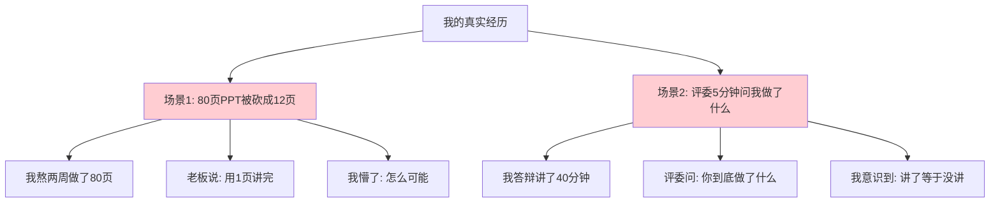

第一次准备晋升答辩，我熬了两周做了 80 页 PPT。每一页都精心配色、加动画、堆图表，自己看着特别满意。拿给老板看，他翻完后只说了一句话：**"砍到 15 页以内，每页能让我 30 秒看懂。"**

我当时整个人是懵的——那么多内容怎么砍？我所有的工作都很重要啊！为了凑数，我把 4 个项目全列上去，每个项目展开 5-6 个细节，结果就是评委看完 PPT 完全记不住我做了什么。

更惨的是答辩现场。我准备了 40 分钟的内容，自我感觉良好地讲完后，评委的第一个问题是：**"刚才你讲的那么多事情，你最核心的贡献是哪一项？用 30 秒说清楚。"**

我又懵了。讲了 40 分钟，居然没让评委记住一个核心贡献。后来评委的反馈是："你讲了很多 What（做了什么），但没有讲清 Why（为什么这么做）和 So What（这件事的价值）。"

那次晋升我没过。痛定思痛后我才明白：**PPT 不是用来证明"我很努力"的，而是用来证明"我达到了目标级别要求"的**。下面这一篇，就是我后来重新学习的 PPT 方法论。

## 02.面评技巧的导学

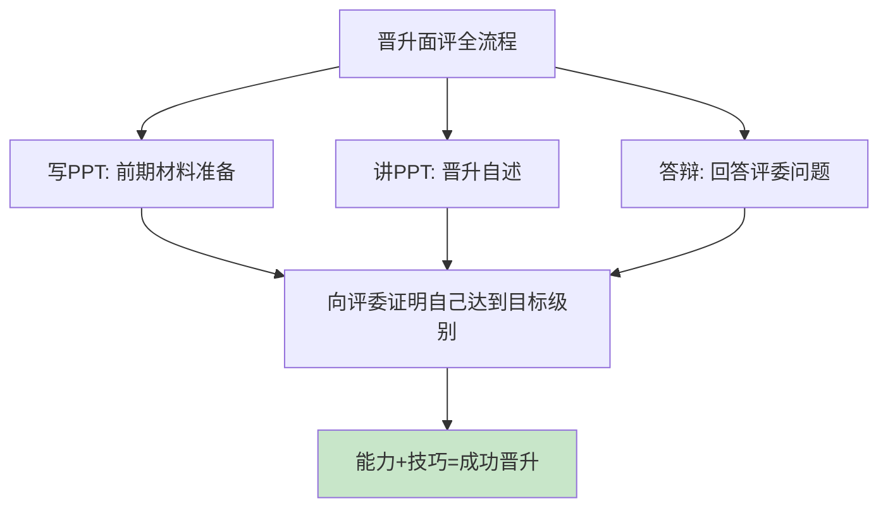

你可能会认为，"是金子总会发光的"，只要自己能力达到了，晋升就是"水到渠成"的事情。毕竟评委的眼睛都是雪亮的，经验又丰富，自然能够看出你的闪光之处。

然而现实情况并不是这样，你的能力到底强不强，在评委的眼中可能没有那么明显。因为他们根本没有足够的时间和精力来充分地考察你，只能通过不到2个小时的面评对你做出判断。

所谓"面评"，就是评审阶段的当面交流，包括写PPT（前期的材料准备）、讲PPT（晋升自述）、答辩（回答评委问题）等环节。你需要介绍证据，回答提问，向评委证明自己达到了目标级别的要求。

虽然在你能力不行的情况下，面评技巧无法帮助你通过晋升；但是如果你光有能力，却没有掌握面评的技巧，很可能还是会晋升失败。**能力是基础，技巧是放大器。**

## 03.答辩PPT常见误区

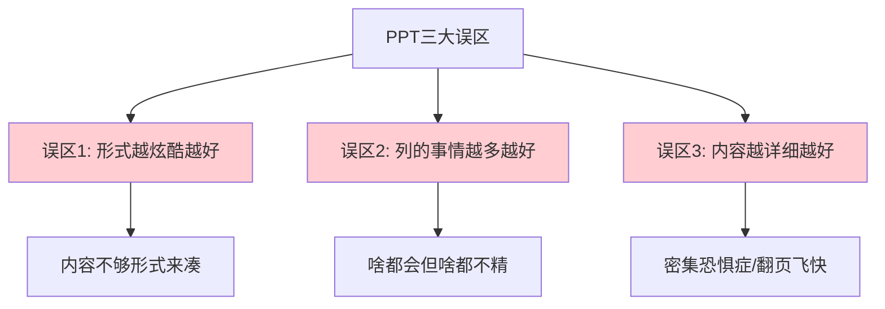

有些人以为PPT就是要做得漂亮、做得炫酷，所以采用了大量的图表和区块，明明简单的一两句话就能说清楚的事情，也要用区块占一整页PPT，甚至还专门加一些动画效果。

事实上，PPT的漂亮和炫酷程度并不是关键，有时候反倒会成为累赘，因为评委可能会觉得你的PPT是"内容不够，形式来凑"。

有些人在总结自己能力的时候，以为列的事情越多，就越能证明自己的能力很强，于是干脆把做过的事情全部罗列出来，逐个介绍。评委无法判断哪些能力才是他的核心能力，产生一种他"啥都会但又啥都不精"的感觉。

有些人虽然知道PPT不要列太多事情，而是要挑几件主要的来讲，但是对于挑出来的这几件事，介绍得特别详细，什么细节都不放过。这个误区有两种表现形式：第一种是虽然页数少，但每一页的内容特别多，密密麻麻的全是区块和文字；第二种是虽然每一页内容相对少一些，但是页数很多，讲PPT的时候翻页翻得飞快。

| 误区 | 表现 | 评委感受 | 正确做法 |
|------|------|----------|----------|
| 形式至上 | 大量动画、炫酷图表 | "内容不够形式来凑" | 内容好才是真的好 |
| 数量至上 | 罗列所有做过的事情 | "啥都不精" | 精选3-5个核心论据 |
| 细节至上 | 密密麻麻全是文字 | "密集恐惧症" | 提炼关键词，口述细节 |

## 04.标准答辩PPT框架

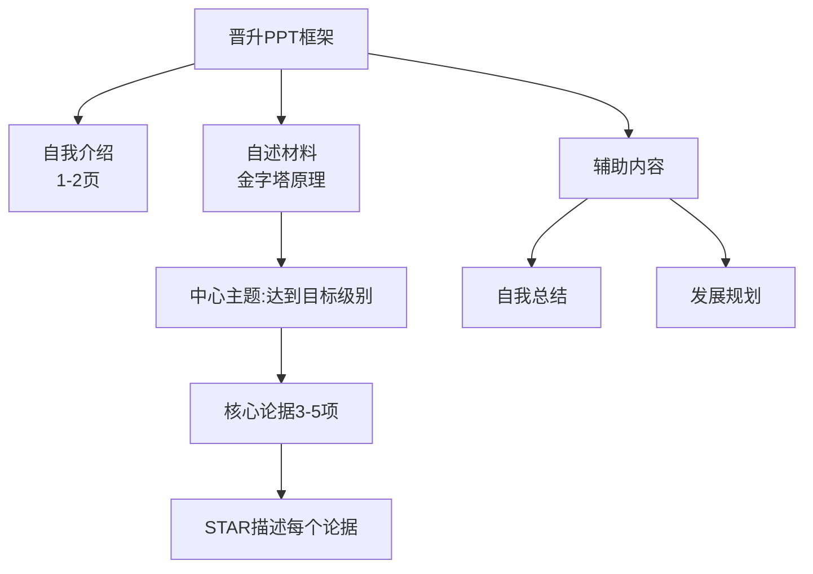

了解了晋升PPT的常见误区，那么什么样的PPT才是好的晋升PPT呢？简单来说就是**内容好才是真的好**，具体要求如下：

**结构清晰**：比如用金字塔原理或思维导图来讲解思路，用时间线模型来讲解发展历程，用架构图来讲解系统，用流程图来讲解业务。

**重点突出**：在PPT上，将核心内容提炼成3-5点，让评委能够快速理解你要讲的内容范围。无论是总体上要讲的事项还是每个事项的亮点，都应该遵循这个思路。

**与实际讲述内容匹配**：你要讲什么，PPT就配合呈现什么，最忌讳的就是讲的内容和PPT内容不相符。

第一部分是1-2页的自我介绍，包括三块内容：一是基本信息（姓名、团队、当前级别、申请级别）；二是当前职责（负责哪块业务、是否带团队、团队规模、关键岗位）；三是工作经历（以前在哪里待过，做过哪些重要项目，不超过3条）。

自述材料用来向评委展现自己能力。总体的写作指导思想就是金字塔原理，围绕"我达到了XX级别的要求"这1个中心主题，设计3-5个核心论据，每个论据分为背景、任务、行动和结果4个部分展开。整个结构就像金字塔一样，中心明确，层次分明，逻辑清晰。

**自我总结**：用能力矩阵或者区块的形式，把你的核心能力再提炼总结一下，核心能力3-5项最合适，不要列出来10项核心能力。

**发展规划**：结合自己的发展目标、业务的发展趋势、自己的不足等情况，设定一个综合的发展方向和路径。列出来的一定是自己想清楚的缺点，不能为了列缺点而随便写几个凑数。**另外，你欠缺的能力不能是目标级别的核心要求，而应该是更高的要求**。

## 05.自述模型的框架

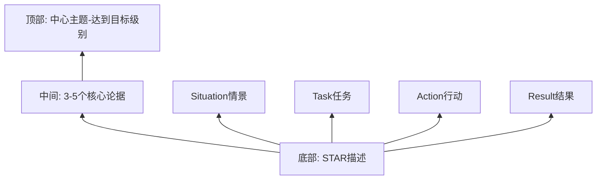

自述材料总体的写作指导思想就是金字塔原理。这个模型就像金字塔一样，中心明确，层次分明，逻辑清晰，一共包括3个层级。

自述材料的中心主题很明确，就是向评委证明你的能力达到了目标级别的要求。

也就是你用来证明自己的能力确实达到要求的依据，常见的论据包括：你负责或者参与过的项目，你带过的团队，你负责的系统或者业务。

也就是Situation（情景）、Task（任务）、Action（行动）和Result（结果）4个部分。

## 06.把PPT当成提词器

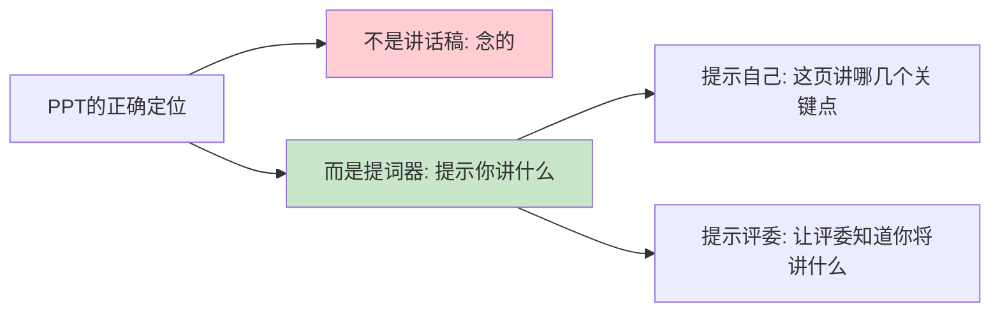

很多人因为没什么演讲经验，担心自己因为紧张而忘记要讲的内容，所以就干脆把要说的话全部贴在PPT上。这种做法有两大坏处：一是满屏充斥的信息会把评委逼出"密集恐惧症"；二是会让评委在潜意识里产生"浪费时间"的感觉。

**有效的做法是把PPT当成"提词器"，而不是讲话稿。** PPT上面展示的内容不是给你念的，而是用来提示你要讲的内容范围的。一方面提示你自己这一页该讲哪几个关键点；另一方面提示评委你将要讲什么，这样评委就能够快速调动相关知识一边听你讲一边形成初步判断。

这个有点难，我感觉我在讲的时候都忘词了，还是要多练习。

## 07.按要求提炼论据

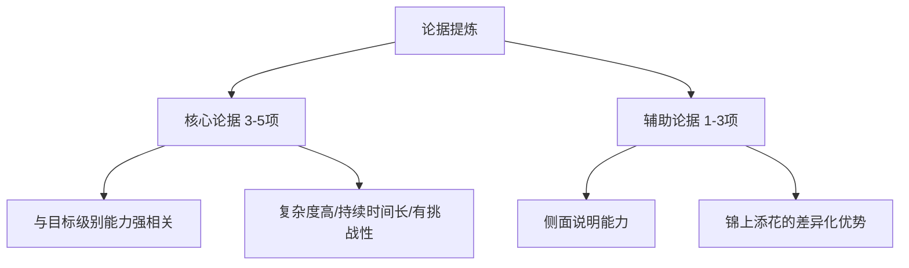

**核心论据**：和目标级别的能力要求强相关，并且能够让评委眼前一亮，一般需要提炼3-5项。这些工作往往有一些共同特点：持续时间长、规模大、不确定性高、有一定挑战性或者创新性。

**辅助论据**：从侧面说明你的能力，起到锦上添花的作用，只要1-3项就行。它的价值在于：如果你和另外一位申请者在核心论据上的表现差不多，但是你准备了辅助论据而他没有，评委很可能给你更高的评价。

## 08.用STAR描述论据

提炼好论据之后，具体怎么向评委描述才显得有理有据呢？推荐使用STAR方法：

**Situation（背景）**：描述事情的背景。不要把项目文档直接贴上去，而是提炼1-3条关键内容摘要。

**Task（任务）**：描述你在这件事里面的角色和负责的任务。特别注意，不要把整个项目的任务写上去，评委关注的是"你在项目中发挥的作用"，而不是"整个项目有多牛"。

**Action（行动）**：讲清楚自己做了什么，展现了哪些能力。这是最关键的部分。

**Result（结果）**：讲述事情最终的结果。大部分人在这个环节犯的错误就是太"虚"，只有定性的描述没有定量的描述。

## 09.量化评估的原则

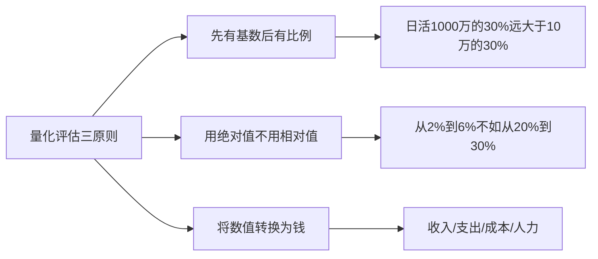

量化评估就是把要评估的内容转化成可以量化的数据来呈现。三个原则：

比例数值要有基数说明。A项目日活1000万，渗透率提升10%；B项目日活10万，渗透率也提升10%——从评委角度看，A项目的价值明显更大。

相对值很好的原因可能是之前做得太烂。"渗透率从2%提升到6%"看起来翻了三倍，但实际数值远不如"从20%提升到30%"。

钱可以是收入、支出、成本和人力等。A项目"渗透率从2%提升到6%，增加广告收入30万"；B项目"渗透率从20%提升到30%，增加会员收入30万"。有了"钱"作为统一度量衡，评委更容易判断价值。

## 10.不要只做复读机

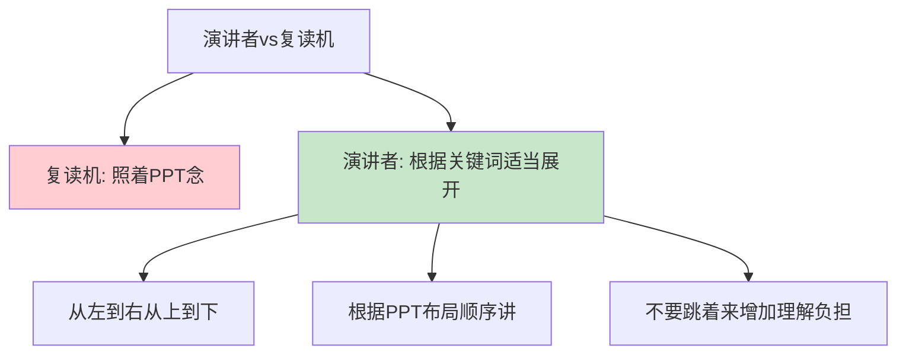

在讲PPT的时候，你要做一个演讲者，而不是一台复读机。不要照着PPT念，而应该根据PPT上的关键词和语句，适当地展开说明。

还有一个小技巧：讲的时候要结合PPT的布局，根据从左向右、从上往下的顺序。因为评委看PPT的时候是按照这个顺序来看的，你不要跳着来讲，不然会增加评委理解的负担。

## 11.注意控制好时间

不管是晋升PPT还是各种技术会议的演讲PPT，你都可以根据有效页的数量来估算时间。一个有效页的讲解时间建议是1-3分钟，平均控制在2分钟左右。

为什么是这个时长呢？如果时间再短一些，讲完后评委没什么印象；时间再长一些，讲完后评委只知道你讲了很多，但具体讲了什么就记不住了。

要严格控制时间，我之前的做法就是针对每张PPT做出时间预演，多练习几次，就能准确无误控制时间。

| PPT部分 | 建议页数 | 建议时长 | 内容重点 |
|---------|----------|----------|----------|
| 自我介绍 | 1-2页 | 2-3分钟 | 基本信息+核心职责 |
| 自述材料 | 8-15页 | 16-30分钟 | 3-5个核心论据 |
| 辅助内容 | 2-3页 | 4-6分钟 | 自我总结+发展规划 |

## 12.要安排模拟面评

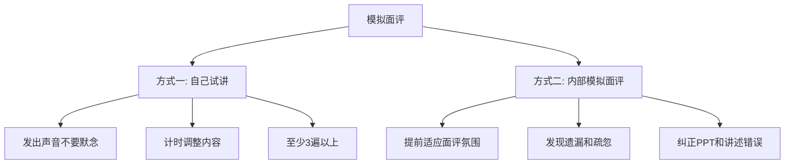

这是最重要的经验，也是效果最好的经验。具体的方式有两种。

找一个会议室，打开PPT演示模式，试着讲几遍。试讲时要注意：一是要发出声音，不要在心里默念；二是计时，如果发现时间太长就要调整内容。一般来说，自己试讲3遍以上，才能讲得比较流畅。

协调部门内的高级别人员扮演评委角色，对你进行一次模拟面评。三个好处：提前适应面评氛围和压力；发现遗漏和疏忽的地方；纠正PPT或讲述中的错误。

最后，自述环节主要讲What（事实部分，我们做了什么）；答辩环节再根据评委的问题来讲Why（这样做的原因，包括技术原理的理解、业务的思考以及经验教训等）。

## 13.总结回顾这一节

**PPT 不是讲话稿，而是提词器；不是炫技场，而是证据墙——用金字塔结构 + STAR 论据 + 量化结果，向评委证明你达到了目标级别。**

1. **结构**：1 个中心主题 + 3-5 个核心论据，每个论据用 STAR 展开。
2. **量化**：用基数、绝对值、"钱"三大原则把成果讲清楚。
3. **练习**：自己出声试讲 3 遍以上 + 至少 1 次内部模拟面评。

## 14.后来发生的改变

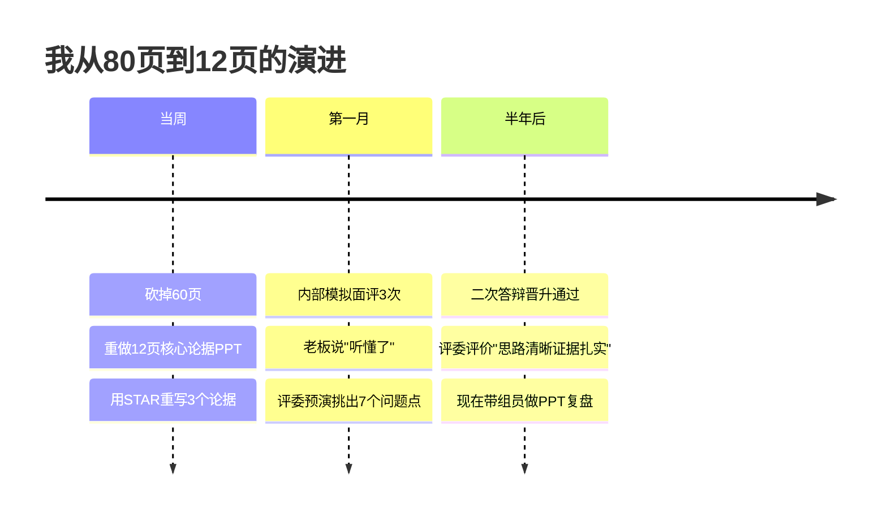

我把那 80 页 PPT 全部推翻重来。先在白纸上写下"我达到了 XX 级别要求"作为中心主题，然后只挑出 3 个最能证明这件事的核心项目，每个用 STAR 框架重写——12 页，干干净净。

我拉了 3 位高级别同事做模拟评委，每次模拟后他们指出"哪句话没听懂、哪个论据不够硬、哪里数据太虚"。第一次他们指出了 7 个问题，第二次 3 个，第三次他们说"听懂了"。

半年后再次申请晋升，这次答辩我只用了 25 分钟，评委的问题精准命中我准备过的 Why 部分，最后评委的评语是"思路清晰、证据扎实、量化到位"。**通过了**。现在轮到我带组员做晋升 PPT 复盘，第一句话总是："**砍到 15 页以内，每页能让我 30 秒看懂。**"

## 15.今天起改变三点

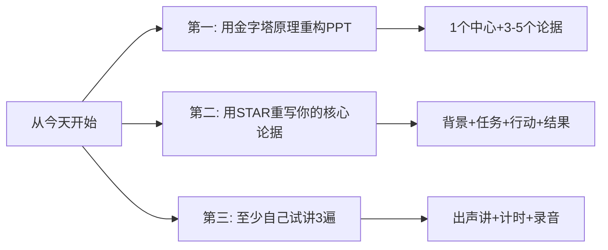

如果你正在准备晋升或者任何重要的演示，检查一下你的PPT是否有一个清晰的中心主题、3-5个有力的核心论据。如果你发现自己的PPT列了10个以上的事项，果断砍到5个以内。

检查每个论据是否都有清晰的Situation、Task、Action、Result。特别注意Result部分，确保有定量的数据支撑，并运用"先有基数后有比例""用绝对值""转换为钱"三个原则来量化你的成果。

找一个安静的地方，打开PPT演示模式，发出声音讲一遍，同时计时。讲完后听一遍录音，挑出问题。重复3遍以上，直到能流畅地在规定时间内讲完。

## 16.课后作业思考下

1. 如果你正在准备晋升PPT或技术演讲，检查一下自己有没有犯"三大误区"中的任何一个，如果有，制定改进计划。
2. 反思你上一次做演示或汇报的经历，有哪些地方做得好，哪些地方可以改进？用本章的框架重新组织一遍。

1. 选择你最重要的一个核心论据，用STAR方法完整地描述出来，然后请一个信任的同事帮你检查是否清晰、有力。
2. 在下一次需要做PPT的场合，先用金字塔原理画出大纲（中心主题→核心论据→支撑细节），再开始制作PPT。

