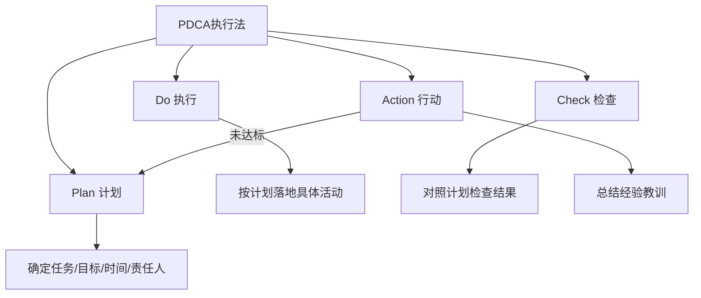
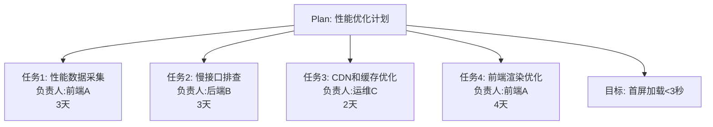
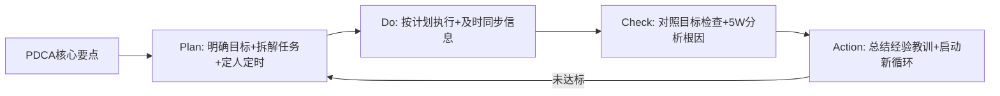
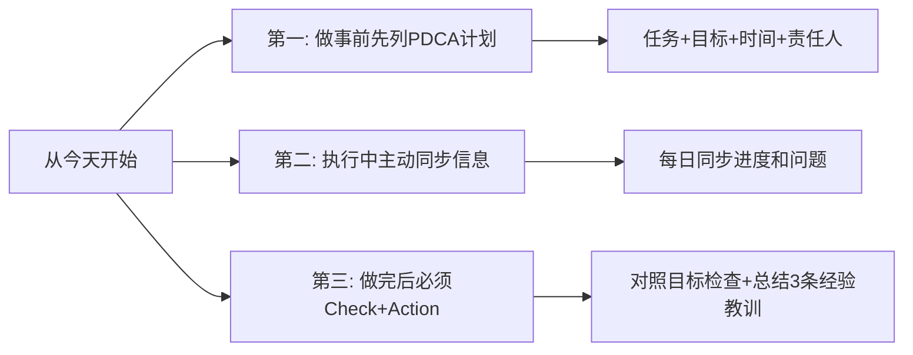

# 5.10 PDCA执行方法
#### 目录介绍
- [01.看一个真实案例](#01看一个真实案例)
- [02.PDCA简单的介绍](#02pdca简单的介绍)
- [03.何为PDCA执行法](#03何为pdca执行法)
- [04.第一环节是Plan](#04第一环节是plan)
- [05.第二环节是Do](#05第二环节是do)
- [06.第三环节是Check](#06第三环节是check)
- [07.第四环节是Action](#07第四环节是action)
- [08.PDCA执行案例](#08pdca执行案例)
- [09.总结回顾一下](#09总结回顾一下)
- [10.后来发生的改变](#10后来发生的改变)
- [11.今天起改变三点](#11今天起改变三点)
- [12.课后作业思考下](#12课后作业思考下)

## 01.看一个真实案例

我第一次独立带迭代那年，运气特别背——一个普通的 2 周迭代版本，硬是被我连续延期了 4 次。第一次延期的理由是"产品需求改了"；第二次是"测试环境出问题了"；第三次是"接口对不上"；第四次干脆就是"我以为差不多了，结果还有 3 个 bug"。

到第四次延期那天的复盘会，老板没生气，他只是平静地问了我两个问题："你版本开始的时候有计划吗？" 我说有的。"那你每天有按这个计划检查进度、对照偏差吗？" 我愣住了——我有计划，但计划写完就再没看过；我每天都在干活，但从来没回头对过表。

老板那一刻只说了一句话："**你不是没有计划，你是只有 P，没有 DCA。**"

会后老板把我拉进小会议室，在白板上画了 4 个字母的圈：P→D→C→A→P……他说："任何一件事，有 P 没 C 就是赌博，有 D 没 A 就是消耗。从下个迭代开始，你每周固定时间做 Check，发现偏差就立刻 Action 调整计划，重新进入下一轮 P。"

那个迭代结束之后，我把每个版本都按 PDCA 跑了一遍。结果接下来连续 6 个迭代再没延过期一次。今天这一节，我把当年老板让我重做迭代的那套 PDCA 心法，完整讲给你。

## 02.PDCA简单的介绍

在事中执行阶段，最核心的方法当然就是 PDCA 执行法了。毕竟一开始工作规划得再好，如果没有落地执行，那么也产出不了任何价值。

**执行力是把规划变成现实的关键环节**，而 PDCA 正是帮你系统化提升执行力的最佳工具。

PDCA 来源于美国质量管理专家休哈特在 1930 年提出的循环理论，20 世纪中后期由戴明带到日本企业，极大提升了日本制造业的市场竞争力，因此 PDCA 又被称为"戴明环"。它今天广泛应用于研发、运营、生产、教育各个领域，是真正"放之四海皆准"的执行框架。

## 03.何为PDCA执行法

PDCA，即是计划(Plan)、实施(Do)、检查(Check)、行动(Action)的首字母组合，就是把事情的执行过程分成四个环节。

无论哪一项工作都离不开 PDCA 的循环，每一项工作都需要经过计划、执行计划、检查计划、对计划进行调整并不断改善这样四个阶段，保证具体事项高效高质地落地。

1、P (Plan) 计划，包括方针和目标的确定，以及活动规划的制定。

2、D (Do) 执行，根据已知的信息，设计具体的方法、方案和计划布局；再根据设计和布局，进行具体运作，实现计划中的内容。

3、C (Check) 检查，总结执行计划的结果，分清哪些对了，哪些错了，明确效果，找出问题。

4、A (Act）处理，对总结检查的结果进行处理，对成功的经验加以肯定，并予以标准化；对于失败的教训也要总结，引起重视。

瞄准目标，基于事实。PDCA 执行法的本质是**以目标为导向，基于事实来推动执行**。它不是让你凭感觉做事，而是让你有计划、有检查、有改进地完成每一项任务。

意味着你要完成制定计划、拆解任务、协调资源、安排责任人和检查结果等工作，所以它比较适合"负责人"这个角色，比如 Team Leader、虚拟团队负责人和领域负责人等。

## 04.第一环节是Plan

第一个环节是计划（Plan）。确定具体任务、阶段目标、时间节点和具体责任人，达成目标需要采取哪些措施。用 PDCA 来规划，也用它来推动落地。

任务计划：需要把任务划分更细并且可以执行的粒度。举一个例子，我要做一个需求，可以把任务划分为需求分析，技术方案设计，代码拟写，接口联调，自测等。

阶段目标计划：需要达到什么样的标准或者目标。

时间节点计划：每个计划，任务都需要有截止时间。

负责人：具体是有谁负责，分别负责的任务是什么。

OKR、3C 方案设计与 PDCA有何区别？OKR 规划，3C 方案设计和 PDCA，它们好像都和规划有关，那么它们之间的区别和联系是什么呢？它们之间的关系是：OKR 制定整体规划，3C 选择实现方案，PDCA 落实具体任务。

1.处理紧急的事情要长短结合。

很多负责人在处理紧急事情的时候会陷入一个两难的境地：如果采取临时措施，虽然能够快速处理，但没有从根本上解决，后面还可能出现其他问题。如果采取长远措施，虽然能够从根本上解决，但是投入很大，短期内无法快速落地。

正确的做法是长短结合，先快速解决表面的问题，避免损失，然后规划长期的方法，从根本上解决问题。

2.重要但不紧急的事情拆分多个小项目。

很多人负责人都有这样的经历：对于重要但不紧急的事情，团队都知道，也都想做；可是一旦准备要做，就发现投入太大，没有足够的时间和人员投入。

于是团队每天都忙于处理各种紧急的事情，这些重要但不紧急的事情就一直拖着。正确的做法是拆分为多个小项目来落地，可以按照事情类别来拆分，也可以按照时间迭代来拆分。

3.学会利用上级的力量来协调资源。

对于某些项目，一开始并不能明确需要投入的人力。作为负责人，你很可能在分析之后发现，需要的人力投入比最初预估的要多。

如果你是 TL，你发现需要借调其他团队的人才能完成。你可以先尝试自己去跟对方的 TL 协调，如果碰到麻烦可以找上级来协调，然后成立正式的工作组。

## 05.第二环节是Do

第二个环节是执行（Do）。按照计划落地各项具体的活动，比如技术人员完成方案设计、编码和测试等工作，要罗列下详细执行计划。

1.根据情况采取相应的管理风格。

在指导团队成员执行的时候，负责人经常犯两种错误，一是管得太多，一种是管得太少。

管得太多体现在因为担心团队成员出错，事无巨细都要亲自参与，结果一方面导致自己很累，另一方面让团队成员没有发挥空间，很难得到成长。

管的太少体现在只做任务分配，不做具体指导，万一出问题就找个人背锅，这样虽然自己很轻松，但团队成员仍然得不到成长；而且团队的成果会有很大的不确定性，成员如果能力一般，很可能得不到好的结果。

2.做好信息同步

很多人都有的一个坏毛病就是，收到了上级的任务后就只知道埋头干活，只要上级不来问，自己就不说，甚至出了问题都不上报，期望自己搞定，不要打扰上级。

这是一个非常严重的错误做法，特别是出了问题如果你不跟上级说，一旦他通过其他渠道得知，对你的印象都不会好。一方面他会觉得尴尬，自己团队的问题都不知道，还要等别人来告诉自己；另一方面他会觉得你故意隐瞒问题。正确的做法是，及时同步信息。

## 06.第三环节是Check

第三个环节是检查（Check）。对照计划来检查实际执行结果，明确哪些符合预期、哪些不达预期、哪些超出预期以及存在什么问题等。

使用 5W 分析问题根因

大部分人在分析问题原因的时候，都倾向于归结为表面的外部原因或者客观原因，而不愿意归结为深层的内部原因，尤其是自己的原因。

所以在分析问题原因的时候，存在一种常见的现象，只要某个人说了一个外部原因或者客观原因，感觉团队成员都长舒一口气，然后分析也就到此为止了。

正确的做法是，采用 5W 根因分析法，不断追问更深一层的根本原因。

## 07.第四环节是Action

第四个环节是行动（Action）。基于检查的结果，总结经验和教训，明确下一步需要采取的措施。

如果 Check 的结果是目标已经实现，那么当前 PDCA 循环结束。

如果 Check 的结果是目标没有实现，那么就需要调整计划，把经验和教训作为输入，开始新一轮的 PDCA 循环，如此重复直到目标达成或者取消。

1.做好总结汇报

你可能会问："执行环节不是已经同步了各种信息吗，这里还要总结汇报什么呢？"

其实这两个环节的汇报有很大的区别：执行环节是同步信息，主要是问题、进展和重要的里程碑事件。行动阶段是总结汇报，主要是结果是否符合计划的预期，能总结什么经验教训，后续是否需要采取什么措施。

总结汇报不一定要写个 PPT 来汇报，很多时候写个邮件就差不多了。

2.每次最多挑选3个改进点落实到流程行动环节，最重要的产出就是经验和教训了。

一个常见的误区是，认为经验和教训越多越好。有些负责人会收集团队全体成员的意见，甚至根据意见的数量来判断团队成员的主动性，于是得到的经验和教训的数量非常多。

正确的做法是，不要想解决所有问题，而是关注可能重复发生的、影响很大的问题。我建议每次总结的时候，最多挑选 3 条经验教训相关的改进点落实到流程。

## 08.PDCA执行案例

以一个真实的技术团队场景为例：某团队负责的电商 App 出现了"用户投诉页面加载慢"的问题，团队需要在两周内完成性能优化。

负责人首先明确了目标：首屏加载时间从当前的 5.2 秒降低到 3 秒以内。然后把任务拆解为 4 个子任务，分别指定负责人和截止时间。同时采用"长短结合"策略：短期先做 CDN 和缓存优化（见效快），长期规划前端架构重构。

团队按照计划开始执行。前端 A 采集了线上性能数据，发现首屏有 3 个大图片未做懒加载；后端 B 排查出 2 个慢接口，平均响应时间超过 2 秒；运维 C 完成了 CDN 节点调整和缓存策略优化。

执行过程中，负责人每天用 5 分钟做信息同步：今天做了什么、遇到什么问题、明天计划做什么。发现后端 B 的慢接口优化需要改数据库索引，涉及 DBA 配合，及时向上级反馈并协调资源。

两周后检查结果：首屏加载时间从 5.2 秒降低到 2.8 秒，达标。但发现一个新问题：某些低端机型的渲染时间仍然偏高。用 5W 分析法追问原因，发现是 JS 包体积过大导致的。

| 类别 | 经验/教训 | 后续措施 |
|------|-----------|----------|
| 成功经验 | CDN优化效果最明显 | 推广到其他业务线 |
| 成功经验 | 每日信息同步很有效 | 固化为团队流程 |
| 改进教训 | JS包体积问题未提前发现 | 增加构建产物体积监控 |

针对未解决的低端机型问题，启动新一轮 PDCA 循环：计划做代码分割和按需加载。

## 09.总结回顾一下

PDCA 不是 4 个动作，是一个**永远转下去的圈**——不收口的执行只是消耗，不复盘的执行只是搬砖。

- **P 写了就要看**：每周拿出来对一次进度，否则等于没写。
- **D 必须可被同步**：不让上级摸黑，不让协作方猜。
- **C + A 才是分水岭**：90% 的人卡在这里，跨过去你就上了一个台阶。

PDCA 执行法就是把事情的执行过程分成四个环节：计划（Plan）、执行（Do）、检查（Check）和行动（Act），从而把控执行过程，保证具体事项高效高质地落地。OKR、3C 方案设计法和 PDCA 的关系是：OKR 制定目标，3C 选择方案，PDCA 落实任务。

## 10.后来发生的改变

老板那次谈话之后的下一个迭代，我做的第一件事不是写代码、不是开会，而是关上门花 1 个小时写 P：把版本目标用一句话写死，把所有任务列到表格里，每个任务定截止日和负责人，最后再写一行"什么情况算这个迭代成功"。

写完之后我把整张表打印出来贴在工位旁边。后来组员开玩笑说："你这版本看着就比上次清楚 10 倍。" 那一周我没敲一行代码，但整个团队的方向第一次"对齐了"。

一个月里我强制自己每周五下午 5 点雷打不动做一次 Check：把当周所有任务对照 P 列出来，标三种颜色——绿色按时、黄色风险、红色延期。每出现一个红黄，就当场写下 Action（要不要补人、要不要改方案、要不要砍范围）。

效果立竿见影。原本要等到延期当天才暴露的问题，现在每周五就能提前 3-5 天发现。整整一个月，**没有再出现过版本最后一天才发现"做不完"的情况**。

半年之后部门做内部分享，老板点名让我讲"如何做版本管理"。我把那张破烂的 PDCA 圈图画在白板上，从 P 写到 A，台下听课的同事笑说："你不是讲 PDCA 嘛，怎么一举一动都和这 4 个字母对得上。"

我笑着回了一句：**"因为我已经不是在'用'PDCA，我是在'活'在 PDCA 里。"** 那是我职业生涯里第一次意识到，方法论真正长在你身上的标志，不是你能讲出来，而是你不再需要刻意去讲。

## 11.今天起改变三点

下一次接到任务时，先花 15 分钟列一个 PDCA 计划。不需要多复杂，用一个简单的表格就行：任务是什么、目标是什么、截止时间是什么、谁来做。有了这个计划，你的执行就会更有方向感，也更容易向上汇报进度。

执行过程中养成主动同步信息的习惯。不要等领导来问你进度，而是主动告诉领导：当前进展如何、遇到什么问题、是否需要协调资源。每天花 3-5 分钟做信息同步，能避免很多后续的沟通成本。

任务完成后，必须做 Check 和 Action。对照最初的计划检查结果：目标达成了吗？哪些做得好？哪些做得不够好？最多总结 3 条经验教训，落实到具体的改进措施。记住：**不做 Check 和 Action 的 PDCA 等于没有闭环。**

## 12.课后作业思考下

1. 对照一下 PDCA 的方法和技巧，你觉得自己平时做事主要是哪些地方做的不够好？看完这一讲后有什么改进或者提升的想法？
2. 回忆一次你做完事情后没有做总结的经历，如果当时做了 Check 和 Action，结果可能会有什么不同？

1. 选择你当前正在进行的一个任务，用 PDCA 的框架重新梳理一遍：你的 Plan 是否明确了目标和时间节点？Do 的过程中有没有做好信息同步？
2. 尝试用 PDCA 管理一件生活中的事情（比如健身计划、阅读计划），体验一下这个方法在非工作场景中的效果。
