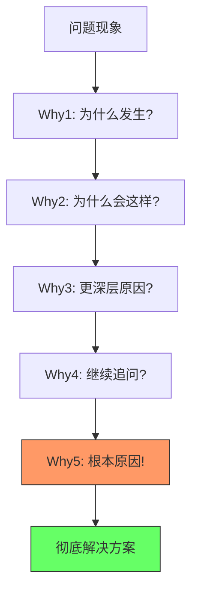
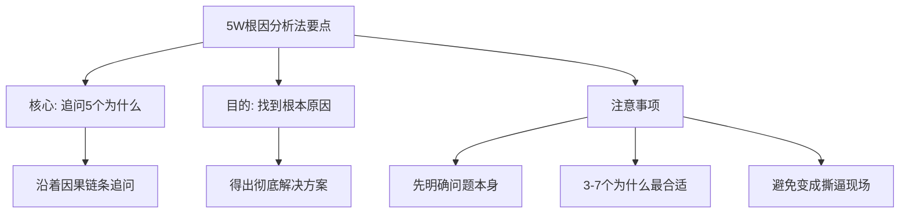
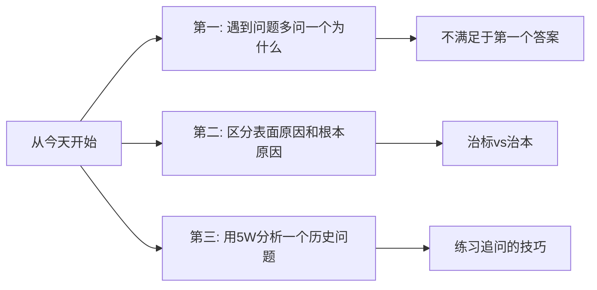

# 5.16 五问根因分析法
#### 目录介绍
- [01.看一个真实案例](#01看一个真实案例)
- [02.5W分析法的背景](#025w分析法的背景)
- [03.丰田的5W分析法](#03丰田的5w分析法)
- [04.为何要去学习5W](#04为何要去学习5w)
- [05.实际场景的分析](#05实际场景的分析)
- [06.5W分析管理改进](#065w分析管理改进)
- [07.实际使用注意点](#07实际使用注意点)
- [08.总结重点的内容](#08总结重点的内容)
- [09.后来发生的改变](#09后来发生的改变)
- [10.今天起改变三点](#10今天起改变三点)
- [11.课后作业思考下](#11课后作业思考下)

## 01.看一个真实案例

那段时间我特别痛苦——线上有一个支付回调失败的 Bug，第一次出现时我修了"重试逻辑"；过了两周又出现，我加了"超时时间"；又过了一个月还是冒出来，我索性"加了报警监控"。结果运营那边很客气但很无奈："这已经是这个月第三次了。"

复盘会上 Leader 把那三次的修复记录叠在一起，问我："你三次给的方案都不一样，请问哪一个是**真正的原因**？" 我答不出来。我下意识的回答都是"重试""超时""监控"——但这些根本不是原因，是症状。

Leader 没批评我，他只是拿过白板笔，从"支付回调失败"开始往下追问：

- 为什么失败？→ 因为对方接口返回了 504。
- 为什么 504？→ 因为我们这边阻塞太久。
- 为什么阻塞太久？→ 因为入参里多了一个我们循环里加锁等的字段。
- 为什么会加这个锁？→ 因为前一年某个老同事担心并发，写了个全局锁。
- 为什么这个全局锁一直没人去掉？→ 因为没人知道它存在。

5 个为什么之后，**真正的根因终于浮出水面：一段两年前埋下的、所有人都不知道的全局锁。** 我整个人僵在那里——前面三次修的全部都是表象，难怪修了又来。Leader 拍拍我："**问题不是被解决的，是被追到根的。这个方法叫 5W 根因分析法，今天起你写到工位上去。**"

后来这一节要讲的，就是把那次 Leader 在白板上画给我的 5 个为什么，完整教给你。

## 02.5W分析法的背景

在实践过程中，遇到了卡点或者问题，该如何排查。其中在检查环节，最容易出现的问题就是，分析原因的时候，只看到表层的原因，而没有去深挖深层的根本原因。

这就会导致我们给出的解决方案治标不治本，虽然短时间内做了应急处理，但是按下葫芦浮起瓢，相关的问题之后还会接连不断地冒出来。

怎么解决前面的问题呢？这就要靠 5W 根因分析法。它又叫 5Why 分析法或者丰田五问法，最初是由丰田集团创始人丰田佐吉提出的，后来成为丰田汽车公司获得成功的重要方法。

## 03.丰田的5W分析法

5W 根因分析法到底是什么做的呢？根据丰田汽车公司前副社长大野耐一的描述，就是重复问五次"为什么"，问题的本质和解决办法就会变得显而易见。

5why 法的关键所在：鼓励解决问题的人要努力避开主观或自负的假设和逻辑陷阱，从结果着手，沿着因果关系链条，顺藤摸瓜，直至找出原有问题的根本原因。

沿着"为什么——为什么"的因果路径逐一提问，先问第一个"为什么"，获得答案后，再问为何会发生，以此类推，问 5 次"为什么"，或者更多，以此来挖掘出问题的真正原因。

大野耐一曾经举过这样一个例子：

1. 问题 1：为什么机器停了？答：因为机器超载，保险丝烧断了。
2. 问题 2：为什么机器会超载？答：因为轴承的润滑不足。
3. 问题 3：为什么轴承会润滑不足？答：因为润滑泵失灵了。
4. 问题 4：为什么润滑泵会失灵？答：因为它的轮轴耗损了。
5. 问题 5：为什么润滑泵的轮轴会耗损？答：因为杂质跑到里面去了。

反思一下。针对问题的思考，我们处于哪个层级，那么对应的解决方案也是不一样的。问题的本质会随着你追问的层次而不相同。

如果到了问题 1 就停止追问，那么工人的措施就是更换保险丝，一段时间后保险丝肯定还会烧断。

如果到了问题 2 就停止追问，那么工人措施就是添加润滑油，过一段时间后机器又会超载。

如果到了问题 4 就停止追问，那么工人的措施就是更换轮轴，一段时间后轮轴又会很快坏了。

只有当追问到了问题 5，才能找出停机的根本原因，这时工人的措施就是给润滑泵加上防杂质的滤网，从而彻底解决问题。

## 04.为何要去学习5W

系统的方法并不急于立即解决问题，而是立足于揭示问题根源，找出长期的对策。如果把问题比作冰山，水面以上的是症状，水面以下的才是根因——而 5W 分析法正是为了帮你潜到水面以下。

第一步：把握现状。搞清楚问题然后针对性查找原因，注意首先要搞清楚问题本身，和针对性查找原因。

第二步：不断对原因调查深入。用"为什么"作为唯一的钩子，沿着因果链条一层层往下挖，直到挖到一个"如果干掉它，问题就再也不会出现"的节点为止。

## 05.实际场景的分析

在某交易平台的业务规划目标讨论会上，我通过 3 个为什么，了解到了业务目标背后的深层考虑。

问题 1：为什么今年的业务目标是成交金额翻番？答：因为只有成交金额翻番我们才能达到盈亏平衡点。

问题 2：为什么今年要求达到盈亏平衡点？答：因为集团要求我们的业务能够自负盈亏。

问题 3：我们本质上还属于创新业务，为什么集团要求我们的业务能够自负盈亏？答：因为疫情的影响，集团需要开源节流，减少非盈利业务的持续投入。

你可能觉得有些奇怪：怎么这个例子只问了 3 个为什么就结束了呢？因为 5 个为什么只是一个形象的说法，不管几个为什么，关键在于通过追问找到根本原因。

在某次 Netty 培训课上，通过 5 个为什么，来验证大家是否真的深入理解了 Netty 网络高性能的核心原理。

问题 1：为什么 Netty 网络处理性能高？答：因为 Netty 采用了 Reactor 模式。

问题 2：为什么用了 Reactor 模式性能就高？答：因为 Reactor 模式是基于 IO 多路复用的事件驱动模式。

问题 3：为什么 IO 多路复用性能高？答：因为 IO 多路复用既不会像阻塞 IO 那样没有数据的时候挂起工作线程，也不需要像非阻塞 IO 那样轮询判断是否有数据。

问题 4：为什么 IO 多路复用既不需要挂起工作线程，也不需要轮询？答：因为 IO 多路复用可以在一个监控线程里面监控很多的连接，没有 IO 操作的时候只要挂起监控线程；只要其中有连接可以进行 IO 操作的时候，操作系统就会唤起监控线程进行处理。

问题 5：那还是会挂起监控线程啊，为什么这样做就性能高呢？

原则 1：问问题要尽可能多方考虑。尽量找出所有可能原因。

原则 2：问题要绝对的客观。找的是原因，不是借口和理由。

原则 3：根据数据、事实问问题，而非猜测和假设。做到三现，在现场通过现物掌握现实。

原则 4：不要认为答案是显而易见的。只有锲而不舍，追根究底，才能找到真正的答案。

## 06.5W分析管理改进

在某次项目延迟问题的讨论会上，下面通过 6 个为什么，把项目延迟的核心原因找了出来。

问题 1：为什么项目延迟了？答：因为要等测试环境进行测试。

问题 2：为什么要等测试环境？答：我们只有 2 套测试环境，2 套都已经用于另外两个项目了。

问题 3：为什么只有 2 套测试环境，不能搭建多套吗？答：现在没有机器用来搭测试环境了，而且我们有将近 20 个子系统，搭建一套可用的测试环境耗时可能要一周。

问题 4：为什么会没有机器，直接申请机器不就可以了？答：运维今年的预算用完了，不能购买新机器了。

问题 5：为什么一定要用新机器，测试环境对机器性能要求高吗？答：测试环境对机器性能要求不高，基本能跑就行。

问题 6：那为什么不找运维申请过保机器（使用超过 3 年的机器，即使没坏也要换掉）用来搭建测试环境？答：之前没想过这个方案。

解决方案很简单。直接找运维借几台过保的机器用来搭建测试环境。不过这还只是短期的解决方案，实际上在问题 3 的回答中，我们还可以发现另外一个问题：搭建一套环境太耗时了。于是测试开发部启动了一个基于 Docker 的快速搭建环境的项目，项目完成后，任何一个开发或者测试同学花 5 分钟就能生成一套全新可用的环境。

## 07.实际使用注意点

问题数量不是关键，找到根本原因才是关键。在介绍业务分析这个例子的时候，已经提到，5W 或者说 5 个为什么只是一个形象的说法，3 个也可以，7 个也可以，关键在于找到根本原因。

所以一个最简单的提问方法就是：下一个问题是对上一个回答的进一步深入。虽然数量可多可少，但建议不要少于 3 个，因为少于 3 个大概率找不出根本原因；但是也不要多于 7 个，因为多于 7 个还没有找到根本原因，那就要审视一下问题本身是不是有问题。

5W 根因分析法起源于生产过程，通常情况下问题都是比较明显的，比如机器停机了或者次品率升高了。但是，还有很多情况下问题本身其实是不明确的，每个人的理解可能都不太一样。如果没有明确问题就开始问为什么，无论问题多么精彩都没有意义，甚至越精彩离题越远。

比如"成交量大幅下降"，这个问题就不明确，到底下降 10%、30% 还是 50% 才算"大幅"？是同比下降还是环比下降？是某一个子业务下降很多，还是所有子业务都在下降？如果这些问题都不明确就开始进行根因分析，就很可能得出一大堆似是而非的原因和改进措施。

在连续追问"为什么"的时候，如果双方没有对这个方法充分达成认识，被问的人很可能觉得你在挑战和质疑他，讨论的现场就会变成大型"撕逼"现场，最后闹得不欢而散。

所以在一开始的时候，就要先解释清楚，待会儿将采用 5W 根因分析法来探讨根本原因，避免挑起情绪对立，引发"撕逼"。

## 08.总结重点的内容

| 应用场景 | 追问方向 | 典型问题数 | 关键要点 |
|----------|----------|-----------|----------|
| 生产过程分析 | 物理因果链 | 5个左右 | 追问到可操作的根因 |
| 业务目标分析 | 业务逻辑链 | 3个左右 | 理解决策背后的深层考量 |
| 技术原理学习 | 技术原理链 | 5个以上 | 验证是否真正理解 |
| 管理改进分析 | 流程瓶颈链 | 5-6个 | 找到可落地的改进点 |

5W 不是问 5 次，是**沿着因果关系一直问，直到挖到那个"干掉它问题就再也不会出现"的根**。

- 修问题的标准只有一个：**那条因果链是不是被你"走到底"了**。
- 同一个问题反复出现，几乎 100% 是没问到第 4 个 Why。
- 用 5W 之前，先确认问题本身是被定义清楚的，否则越问越偏。

5W 根因分析法就是通过追问 5 个为什么来分析问题的根本原因，从而得到彻底的解决方案。它起源于生产过程的问题原因分析，但也可以应用于业务分析、技术学习和管理改进等场景。

## 09.后来发生的改变

复盘会之后我做的第一件事，是用马克笔在工位玻璃上写了三个超大的字——**"再问一次"**。每次有同事跟我描述问题、或者我自己在写故障分析时，眼角余光只要扫到那三个字，我就会强迫自己再问一个为什么。

第一周特别别扭。组员有时候还会抱怨："这都问到第几遍了？" 但很快他们也开始习惯——我们组的 bug 单上"根因"那一栏第一次出现了"两年前埋的全局锁"、"一处历史代码 if 条件写反"这种真正的根。

那一个月之内我用 5W 处理了 12 个线上问题。最让我意外的不是任何一个具体的修复，而是**第二个月线上故障复发率从 35% 直接掉到 8%**。

Leader 在月度会上说了一句话，我现在还记得："你这个月的故障数没少多少，但你修的，是真的把它们修死了。" 这话比任何表扬都让我开心。

半年之后我跟一个新来的同事一起处理一个性能问题，他给我的解释停在第二个 Why 的时候，我下意识就脱口而出："那再为什么呢？" 他愣了一下，然后两个小时之后跑过来跟我说："哥，我又往下挖了三层，问题出在 ORM 框架的某个默认配置上。"

那一刻我突然意识到——**5W 已经不再是我"刻意用"的方法，它长进了我的听感里**。任何人讲一个原因，我会自动判断"这是症状还是根因"。半年前那个连续修 3 次还修不好同一个 Bug 的我，已经回不去了。

## 10.今天起改变三点

养成"多问一个为什么"的习惯。下次遇到问题时，不要满足于第一个答案。无论是自己分析还是和别人讨论，都要多追问一层：为什么会这样？这个原因背后的原因是什么？哪怕只多问一个为什么，你对问题的理解都会更深一层。

学会区分表面原因和根本原因。在分析问题时，给出的每一个原因，都问自己一个问题：**如果解决了这个原因，问题是否会彻底消失？** 如果答案是"不确定"或"可能还会出现"，那说明你找到的只是表面原因，需要继续深挖。

找一个你曾经处理过但效果不好的历史问题，用 5W 分析法重新分析一遍。当初给出的解决方案为什么效果不好？是因为没有找到根本原因吗？如果重新追问 5 个为什么，会得出什么不同的结论？这个练习能帮助你快速掌握 5W 分析的精髓。

## 11.课后作业思考下

1. 选择一个你最近在工作中遇到的问题，用 5W 根因分析法写出完整的追问过程（至少 3 个为什么），看看最终能找到什么根本原因。
2. 回忆一次你或团队"治标不治本"的经历——当时解决了表面问题，但过一段时间问题又以其他形式出现了。用 5W 分析法重新分析，找到你当初遗漏的根本原因。

1. 下次团队复盘或讨论问题时，尝试引导大家使用 5W 分析法。注意在开始前先说明方法，避免引起对立情绪。记录一下这次实践的效果和你的感受。
2. 用 5W 分析法分析一个生活中的问题（比如"为什么最近总是睡不好""为什么这个月花超了预算"），体验一下这个方法在非工作场景中的威力。
