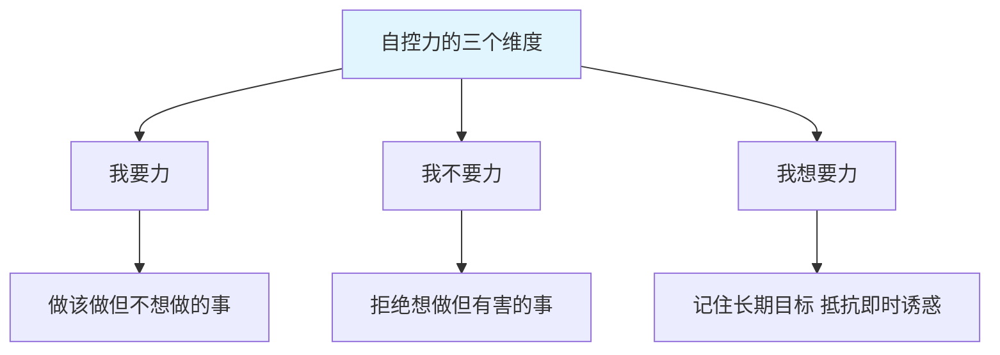
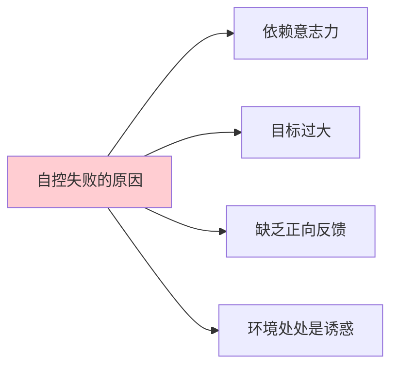
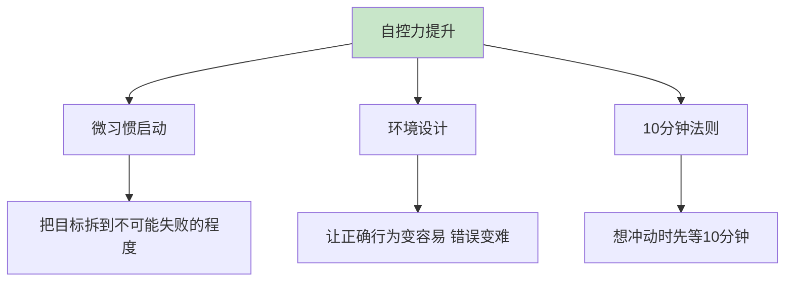
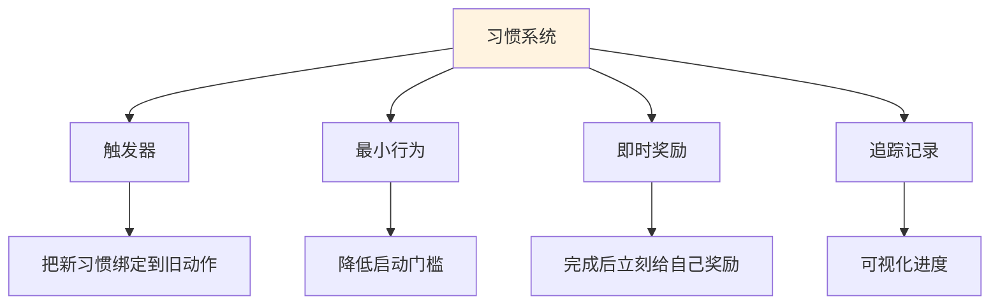
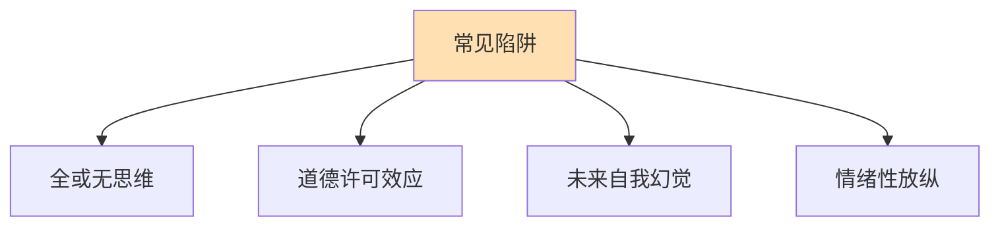
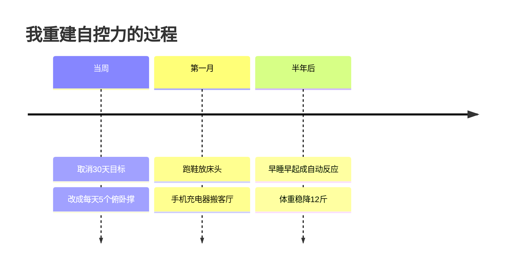
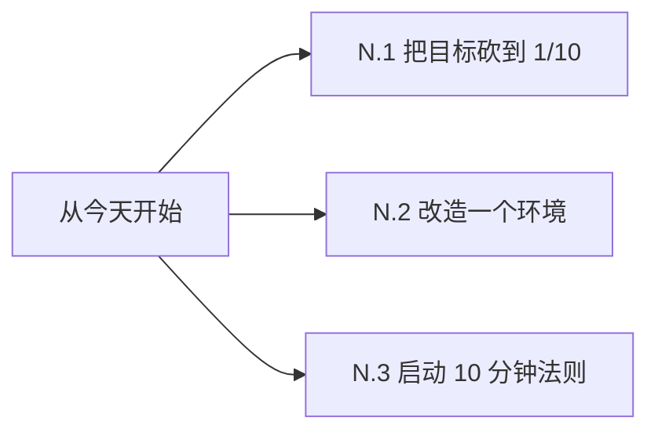

# 7.2自我自控的调节

#### 目录介绍
- [01.看一个真实案例](#01看一个真实案例)
- [02.什么是自控力](#02什么是自控力)
- [03.自控失败的真正原因](#03自控失败的真正原因)
- [04.提升自控力的核心方法](#04提升自控力的核心方法)
- [05.建立可持续的习惯系统](#05建立可持续的习惯系统)
- [06.常见自控陷阱与应对](#06常见自控陷阱与应对)
- [07.总结回顾这一节](#07总结回顾这一节)
- [08.后来发生的改变](#08后来发生的改变)
- [09.今天起改变三点](#09今天起改变三点)
- [10.课后作业思考下](#10课后作业思考下)

## 01.看一个真实案例

去年 3 月 1 日，我加入了一个"晨型人"训练营，目标是连续 30 天 6:00 起床、晨跑 30 分钟、读书 30 分钟。

前 21 天我完美执行：每天 5:50 闹钟一响立刻翻身下床，跑步、读书、洗漱，7:30 出门上班。朋友圈每天一张打卡截图，群里被夸"自律小王子"。

第 22 天周六，我"奖励"自己睡个懒觉——结果一觉睡到中午 12 点半。下午想起跑步，太阳太大，算了。晚上想看书，电视剧太好看，算了。

**从那天起，整个习惯彻底崩了。**接下来一个月再也没跑过步、再也没早起过。看着手机里前 21 天的打卡截图，特别讽刺。

复盘的时候我才明白：**前 21 天我是在"咬牙坚持"，靠意志力硬扛。意志力像电池，会被耗光**。真正持久的自控，是把行为做成习惯系统，让大脑不需要"决策"——不是每天早上挣扎"今天要不要起？"，而是"5:50 闹钟一响，身体自动起床"。

这一节就是我从那次崩盘后，重新学习自控力的总结。

## 02.什么是自控力

凯利·麦格尼格尔在《自控力》里把它拆成三个能力。

**我要力（I Will）**：去做该做但不想做的事——比如运动、写报告、早睡。

**我不要力（I Won't）**：不去做想做但有害的事——比如刷短视频、暴饮暴食、熬夜。

**我想要力（I Want）**：记住自己真正想要的长期目标，在每一个诱惑面前选择它。

三者缺一不可。很多人只练了"我要力"，没练"我不要力"，结果一边健身一边吃宵夜。

研究表明，自控力像肌肉一样**会疲劳**。早晨意志力满格，到了下午、晚上会逐渐耗尽。这解释了为什么很多人白天工作认真，晚上回家就放纵——不是"晚上的自己不行"，而是"白天的自己已经把电用完了"。

## 03.自控失败的真正原因

意志力是有限资源，不能 365 天靠它撑着。真正的高手不是意志力强，而是**不需要用到意志力**——把行为变成自动化习惯。

很多人把目标定得太大太远——「3 个月减 20 斤」「6 个月学会英语」「1 年看 50 本书」，听起来鸡血但太遥远。大脑没有即时反馈，很容易放弃。

每次自律行为后没有即时奖励，大脑就会失去动力。运动 1 个月还没瘦、读书 1 个月还没"变厉害"，很多人就放弃了——其实变化在悄悄发生，只是太慢看不见。

冰箱里放着零食还想减肥，手机上装着抖音还想专注。**环境的力量远大于意志力**——当诱惑触手可及时，靠意志力扛住几乎是不可能任务。

## 04.提升自控力的核心方法

微习惯的核心是把目标小到不可能失败。不是"每天跑 30 分钟"，而是"每天穿上跑鞋下楼"；不是"每天读 30 分钟书"，而是"每天读 1 页"；不是"每天写 1000 字"，而是"每天写 50 字"。**目标小到根本没理由完不成**。等到行为本身被启动，往往会自然延伸——穿了跑鞋就会想跑两步，翻开书就会想读完一章。

环境设计是让正确行为变容易。想早睡，就把手机充电器放到客厅；想运动，就把跑鞋摆在床头；想戒掉零食，根本不要买回家；想减少刷手机，把抖音、微博**卸载**而不是只关通知。让正确的行为成本低于错误的行为成本，自控就不需要意志力了。

想刷手机、吃零食、刷剧时，告诉自己："**先等 10 分钟，10 分钟后还想做就去做**"。10 分钟内大脑的多巴胺冲动就会过去，很多时候你会发现"算了不想做了"。

## 05.建立可持续的习惯系统

新习惯不是凭空建立的，而是**绑定在已有习惯之后**。比如刷牙后立刻做 5 个俯卧撑，通勤路上听 10 分钟播客，午饭后写 100 字日记。旧习惯成了新习惯的"提醒闹钟"。

大脑只对**即时反馈**敏感。每完成一次自控行为，立刻给自己一个小奖励：在打卡 App 上画个勾，听一首喜欢的歌，喝一杯好喝的茶。千万不要用"反向奖励"——比如运动完吃个汉堡，会抵消掉行为的意义。

用 Habitica、滴答清单、纸质日历都行，关键是**画上一串连续的勾**。人类有"不想破坏连续记录"的本能，看着 30 天连续打卡的勾，第 31 天会舍不得断。

## 06.常见自控陷阱与应对

「今天没跑步，整周计划都毁了，下周再开始吧」——这是典型的全或无思维。正确做法是：**绝不连续两次失败**。今天没做没关系，明天补上就行，不要从此放弃。

「我今天工作好辛苦，奖励自己一杯奶茶」「我已经运动了 3 天，今天可以放纵一下」——这就是道德许可效应：**用过去的"自律"为未来的"放纵"开绿灯**。警惕一切"我都……了，所以我可以……"的句式。

我们总觉得"未来的自己"会更自律——所以现在多躺一会，反正下周一开始。事实是：**未来的你和现在的你是同一个人**。如果今天不愿意做，下周一也不会愿意做。

压力大、情绪低落时人最容易失控——暴饮暴食、报复性熬夜、冲动购物。应对方法是先识别情绪，问自己"我现在是真的想吃，还是只是因为难过？"然后用其他方式处理情绪——散步、找朋友聊天、洗个澡。

## 07.总结回顾这一节

一句话核心：**自控力不是靠咬牙，而是靠系统——让正确的事自动发生，让错误的事难以发生**。

你应该带走的三件事：

1. **意志力是有限资源**，不能 365 天靠它撑着
2. **微习惯 + 环境设计**，比"咬牙坚持"靠谱 10 倍
3. **绝不连续两次失败**，比"完美执行"重要得多

## 08.后来发生的改变

我把"30 天 6 点起床 + 跑步 30 分钟 + 读书 30 分钟"改成了：**每天 6:30 起床，做 5 个俯卧撑，读 1 页书**。就这么简单到可笑。但那一周我**全部完成了**。

第一个月开始环境改造。我把手机充电器搬到了客厅——晚上手机不在床边，自然不会刷到深夜，11 点半准时睡。跑鞋摆在床头——早上脚一落地就看见，自然会想穿上。冰箱里的零食一次性全部丢掉——馋了下楼买就要 15 分钟成本，10 次有 7 次就懒得去了。

半年后，我不需要任何意志力就能 6:30 起床，因为**身体已经习惯了**。体重稳定下降 12 斤，更重要的是我建立了一种"我能做到"的自我认知——不再像以前那样动不动就否定自己。

## 09.今天起改变三点

把"每天跑 30 分钟"砍成"每天穿跑鞋下楼"，把"每天读 1 小时"砍成"每天读 1 页"。小到不可能失败，连续 21 天完成后再考虑加码。

挑一个让你反复失控的场景，**改造它**：沉迷手机就卸载最浪费时间的那个 App，暴饮暴食就不在家里囤零食，熬夜就把手机充电器搬出卧室。

下次想刷手机、吃零食、买东西时，告诉自己**"先等 10 分钟"**。10 分钟后还想做就去做，多数情况下你已经不想了。

## 10.课后作业思考下

**自检类**：

1. 回想你最近一次"自律失败"的经历——目标是什么？为什么失败？是意志力不够，还是目标定得太大、环境太诱惑？
2. 列出你身边 5 个最大的诱惑源（手机、零食、剧、游戏、外卖等），思考哪几个可以**通过环境设计**直接屏蔽掉？

**实践类**：

3. 挑一个你想养成的习惯，把它砍到"不可能失败"的程度，连续执行 21 天并打卡记录。
4. 选一个你想戒掉的行为，使用"10 分钟法则"应对，记录一周内有多少次成功"等过去了"。
