# 6.2阅读的持续提升
#### 目录介绍
- [01.看一个真实案例](#01看一个真实案例)
- [02.阅读提升的背景](#02阅读提升的背景)
- [03.阅读能力有层次](#03阅读能力有层次)
- [04.阅读能力的分层](#04阅读能力的分层)
- [05.知道阅读的大概](#05知道阅读的大概)
- [06.阅读书籍的目录](#06阅读书籍的目录)
- [07.留意书里的故事](#07留意书里的故事)
- [08.前后建立起联系](#08前后建立起联系)
- [09.理解故事的脉络](#09理解故事的脉络)
- [10.能够复述出内容](#10能够复述出内容)
- [11.拥有自己的理解](#11拥有自己的理解)
- [12.提出疑惑和思考](#12提出疑惑和思考)
- [13.场景化阅读训练](#13场景化阅读训练)
- [14.总结回顾本章节](#14总结回顾本章节)
- [15.后来发生的改变](#15后来发生的改变)
- [16.今天起改变三点](#16今天起改变三点)
- [17.课后作业思考下](#17课后作业思考下)

## 01.看一个真实案例

去年我特别得意自己一年读了 47 本书。我把书单晒在朋友圈，配文："今年读书量历史新高，知识就是力量。" 收获了 80 多个赞，我心里美滋滋。

直到一次面试。面试官看到我简历上写"喜欢阅读"，随口问："你最近读得最有收获的一本书是什么？给我讲讲它的核心观点。"

我脱口而出："《原则》。"——这是我半年前读的，瑞·达利欧的名作。

面试官追问："这本书讲什么核心原则？"

我愣住了。**我读过，划过线，做过笔记，但那一刻除了"创意至上""极度透明"几个名词，我什么也讲不出来。** 更糟的是面试官换了一个："那《深度工作》呢？我看你也读过。" 我同样卡住了。

那场面试我没拿到 offer。回家路上我一遍遍想：**我一年读了 47 本，到底读了个啥？**

回家我把书架上 47 本书一本本翻看：

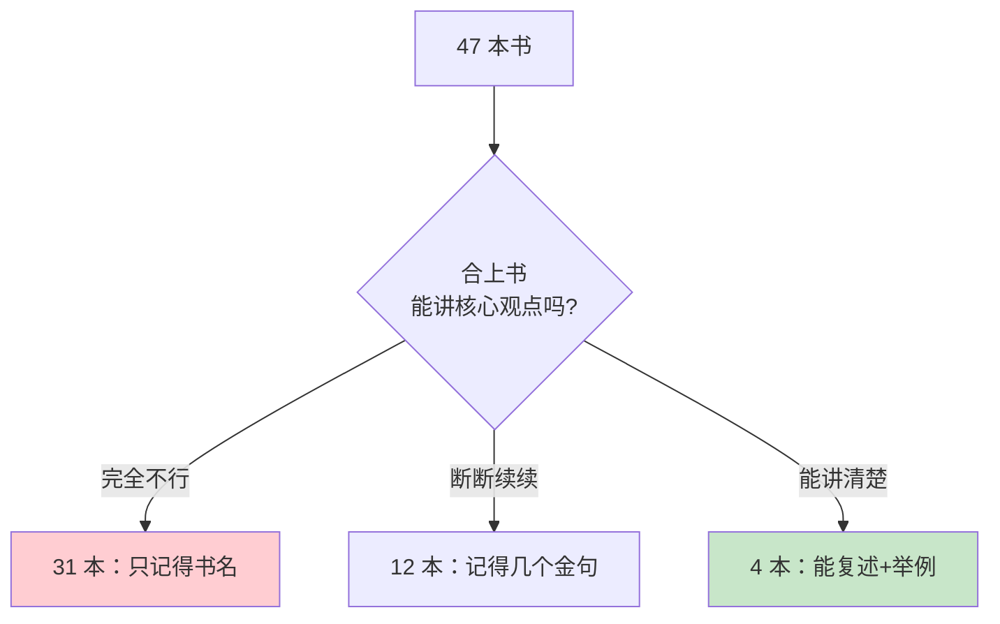

**31 本只剩书名，12 本只剩金句，真正能讲清楚的——4 本。** 也就是说我用 47 本的时间，只换回了 4 本的回报。

更扎心的是，那 4 本不是我"读得快"的，而是我"做了笔记+和别人讲过+用过"的。**阅读真正的衡量单位不是"看完几本"，而是"能复述、能用、能讲给别人听几本"**。

那一晚我把朋友圈那条"47 本书"的动态删掉了。从那天起，我重新学会了"读书"——这就是接下来要讲的内容。

## 02.阅读提升的背景

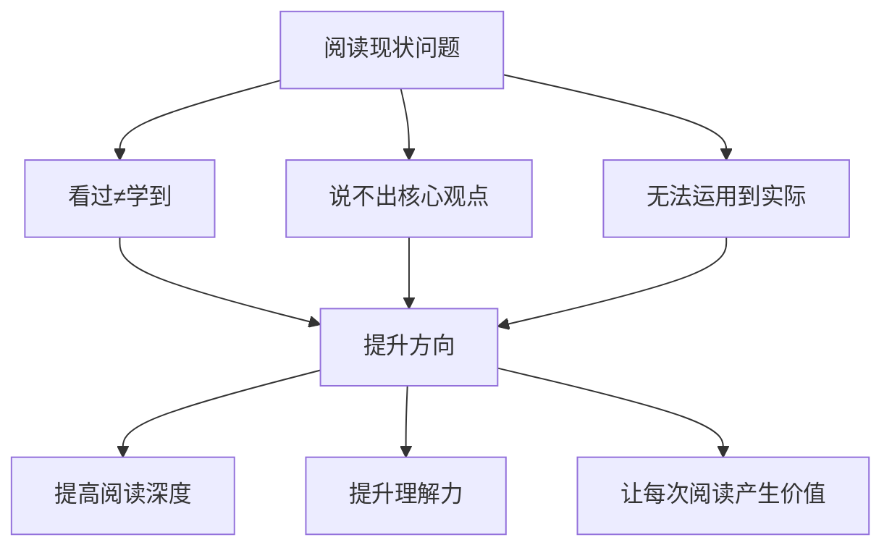

在这个信息爆炸的时代，阅读能力比以往任何时候都更加重要。无论是工作中的技术文档、行业报告，还是生活中的书籍、文章，阅读都是我们获取知识、提升认知的核心途径。

然而，很多人的阅读还停留在"看过"的层面，看完一本书后，既说不出核心观点，也无法将书中的知识运用到实际中。这种低效的阅读方式，本质上是在浪费时间。

**信息过载困境**：每天接触的文章、公众号、短视频、书籍浩如烟海，你可能"看了很多"，但真正"读进去"的很少。浏览不等于阅读，点赞收藏不等于学到。

**浅层阅读困境**：快餐式阅读让人习惯了浮光掠影——扫一眼标题、看几段摘要就觉得自己"知道了"。但如果有人让你展开说说，你会发现自己说不出什么有深度的内容。

**学用脱节困境**：读了很多书，道理都懂，但到了实际工作和生活中，依然是老样子。知识停留在"知道"层面，没有转化为"能力"。

提升阅读能力，不仅仅是提高阅读速度，更重要的是提升阅读的深度和理解力，让每一次阅读都能产生真正的价值。具体来说，就是从"看过"到"理解"，从"理解"到"复述"，从"复述"到"应用"，从"应用"到"批判"。

## 03.阅读能力有层次

阅读能力并非一成不变，而是可以通过有意识的训练不断提升的。根据认知发展理论，阅读能力可以划分为多个层次，从最基础的"识字阅读"到最高级的"批判性阅读"。

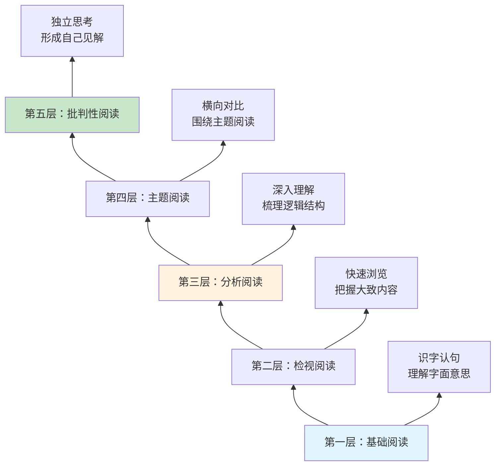

**基础阅读**是最底层的能力——认识文字、理解句子的字面意思。大多数成年人都已经具备这个能力，但不要小看它，很多人在阅读专业领域的内容时（比如法律文书、学术论文），连字面意思都未必能完全读懂。

**检视阅读**是快速浏览一本书，在较短时间内把握全书大致内容的能力。它不要求你深入理解每一个细节，但要求你能回答"这本书大概讲什么"。

**分析阅读**是真正深入一本书——梳理作者的论证逻辑、理解核心观点、评估论据的充分性。这个层次要求你不只是"读"，而是"研究"。

**主题阅读**是围绕一个主题，同时阅读多本书或多篇文章，进行横向对比和综合分析。比如你想深入了解"时间管理"，可以同时读《高效能人士的七个习惯》《深度工作》《番茄工作法》。

**批判性阅读**是阅读的最高层次——不盲目接受作者的观点，而是带着独立思考的态度去评判。作者的论据充分吗？逻辑有漏洞吗？有没有更好的解释？能做到批判性阅读的人，才是真正意义上的"读书人"。

## 04.阅读能力的分层

将阅读能力细分为以下几个可操作的层级：

| 层级 | 能力描述 | 核心动作 | 检验标准 |
|------|----------|----------|----------|
| **Level 1** | 知道大概内容 | 浏览目录和标题 | 能说出书的主题 |
| **Level 2** | 留意关键信息 | 标记重点段落 | 能复述核心故事 |
| **Level 3** | 建立前后联系 | 做笔记、画导图 | 能梳理逻辑脉络 |
| **Level 4** | 理解深层含义 | 思考为什么 | 能解释背后原理 |
| **Level 5** | 复述并表达 | 写读书笔记 | 能讲给别人听 |
| **Level 6** | 形成自己见解 | 结合经历思考 | 有独立的观点 |
| **Level 7** | 提出质疑思考 | 批判性分析 | 能发现不足之处 |

这 7 个层级是递进关系，但不需要每本书都读到 Level 7。根据你的阅读目的来决定读到哪个层级：消遣娱乐到 Level 2 就够了，学以致用需要到 Level 5，想要深入研究需要到 Level 7。

## 05.知道阅读的大概

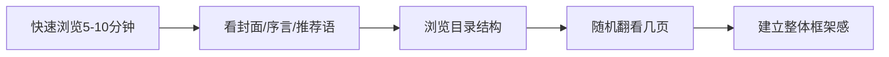

对我来说，我知道阅读是有趣的、好玩的。只有觉得有趣，才会想去学。**有趣比有用更重要**。

在开始阅读一本书之前，先花 5-10 分钟快速浏览，了解这本书大概讲什么内容。这个阶段的目标不是深入理解，而是建立一个整体的框架感。

具体做法包括：看封面、序言和推荐语，了解作者背景和写作目的；浏览目录结构，了解全书的章节安排和逻辑线索；随机翻看几页，感受作者的写作风格和内容深度。

在快速浏览时，带着三个问题会让你的浏览更有效率：

- **这本书要解决什么问题？** 了解全书的核心议题。
- **作者的核心观点是什么？** 通过序言和目录推测作者的立场。
- **我能从中获得什么？** 明确你的阅读目的和期待。

带着问题去浏览，你的大脑会自动在浏览中寻找答案，效率远高于漫无目的地翻看。

## 06.阅读书籍的目录

目录是一本书的骨架，通过仔细阅读目录，你可以快速掌握全书的知识结构。好的阅读习惯是，先把目录当作一张"地图"来研究。

具体做法：将目录手抄或拍照保存；标记出你最感兴趣或最需要的章节；根据目录预判每个章节可能讲述的内容；带着问题去阅读对应的章节。

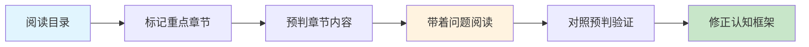

好的目录本身就是一篇精炼的"书籍摘要"。当你熟练运用目录阅读法后，很多书你只需要读目录和关键章节就能获取 80% 的核心价值——这就是"二八法则"在阅读中的应用。

另外，目录也是复盘的好工具。读完一本书后，再看一遍目录，检验自己能否回忆起每个章节的核心内容。记不起来的章节，说明理解不够深入，可以有针对性地回去重读。

## 07.留意书里的故事

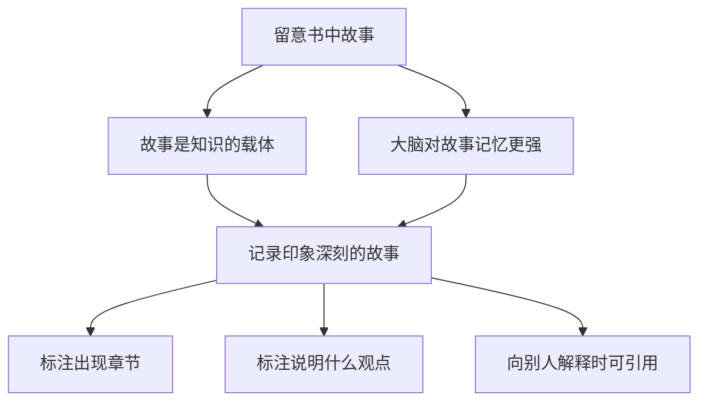

留意一下阅读中你印象深刻的故事。故事是知识的载体，人类的大脑天生对故事有更强的记忆力。

认知心理学研究表明，大脑对"叙事性信息"（故事）的记忆效率是"陈述性信息"（道理）的 6-7 倍。这是因为故事会激活大脑的多个区域——不仅是语言处理区域，还有情感区域、运动区域甚至感官区域。

当你读到"项目延期的教训"时，可能过几天就忘了；但当你读到"某团队因为没有做风险评估，导致项目延期三个月，最终负责人被辞退"这个故事时，你可能记很久。

在阅读过程中，要特别关注作者用来说明观点的案例和故事。建议在阅读时准备一个笔记本，记录下让你印象深刻的故事，并标注它出现在哪个章节、用来说明什么观点。

一个实用的记录格式是：**故事概要（一句话）→ 它说明什么观点 → 我的感想或联想**。这样既保留了故事，又关联了知识，还融入了你的思考。

## 08.前后建立起联系

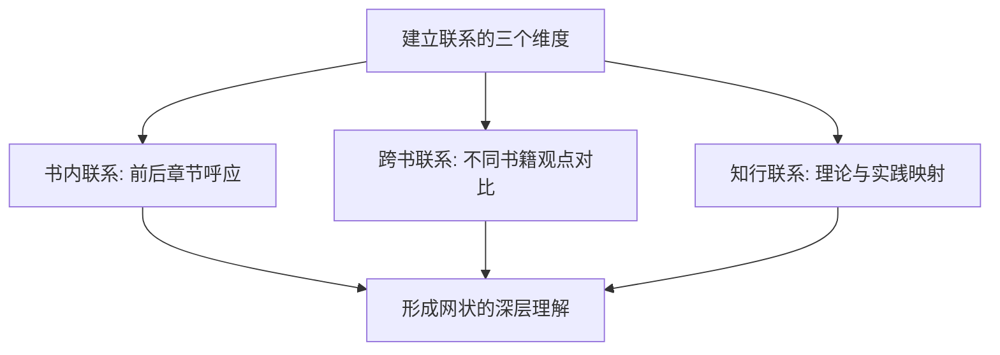

高质量的阅读不是线性的，而是网状的。在阅读过程中，要有意识地将当前阅读的内容与之前读过的内容建立联系。

比如，你在读到第五章的某个观点时，发现它和第二章的某个案例有呼应关系，这就是在建立联系。这种联系越多，你对全书的理解就越深入。

一个实用的方法是在书页边缘做标注："参见第 X 章"或"与 XX 观点呼应"。这些标注会帮助你在复习时快速建立知识网络。

同时，也要将书中的内容与你已有的知识和经验建立联系。这就是"温故而知新"的过程，将新知识嫁接到已有的知识树上，形成更加稳固的理解。

比如读完《非暴力沟通》后，你发现它和之前读的《关键对话》有很多相通之处——都强调先处理情绪再处理问题。

读书时碰到一个理论或方法，立刻想一想：这个在我的工作和生活中对应什么场景？把理论映射到实践中，既加深了理解，又为下次实际应用做好了准备。

## 09.理解故事的脉络

在留意故事的基础上，进一步理解故事背后的逻辑脉络。一个好的故事通常包含：背景设定、问题出现、解决过程和最终结果。

理解脉络的方法：尝试用自己的话，将一个故事的起因、经过、结果串联起来；思考作者为什么选择这个故事来说明观点；如果换一个故事，效果会不会一样。

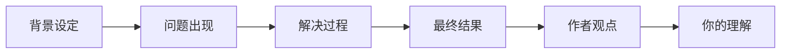

好的读者不仅能理解故事本身，还能从故事中提炼出可迁移的方法论。比如你在一本管理书中读到"某公司通过 OKR 制度实现了业绩翻倍"的故事，你不仅要理解这个故事的脉络，还要提炼出"目标对齐→关键结果量化→定期复盘→及时调整"的方法论。

这个"故事 → 方法论 → 应用"的过程，就是从 Level 2 到 Level 5 的跨越。

## 10.能够复述出内容

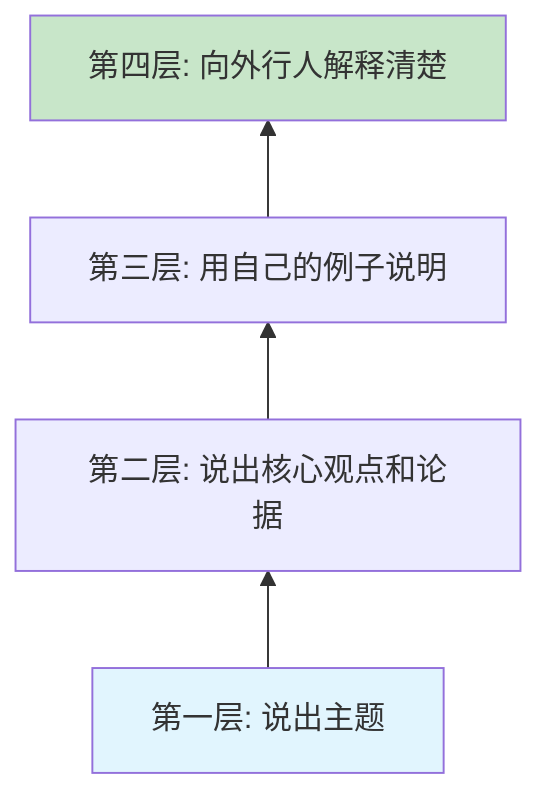

能够复述是检验理解程度的重要标准。如果你读完一本书或一个章节后，无法用自己的话复述出核心内容，说明你的理解还不够深入。

复述的几个层次：第一层，能说出这本书/章节讲了什么主题；第二层，能说出核心观点和论据；第三层，能用自己的例子来说明这些观点；第四层，能向完全不了解的人解释清楚。

每一层的跨越都意味着理解的深入。能到第三层说明你已经将书中的知识和自身经验进行了关联，能到第四层说明你已经真正吃透了这些内容。

建议每读完一个章节，花 5 分钟合上书，尝试用自己的话复述核心内容。如果发现说不清楚的地方，再回去重新阅读。

一个更高阶的训练方法是"教学复述"——找一个朋友或同事，把你刚读到的内容讲给他听。在"教"的过程中，你会发现自己理解模糊的地方。

## 11.拥有自己的理解

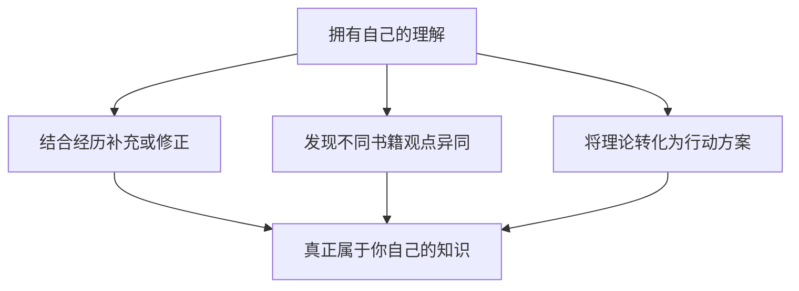

阅读的最终目的不是记住作者的观点，而是在此基础上形成自己的理解和见解。

具有独立理解的标志：能够结合自己的经历和认知，对书中的观点进行补充或修正；能够发现不同书籍之间观点的异同，进行比较分析；能够将书中的理论转化为可落地的行动方案。

写读书笔记是培养独立理解的最佳方式。好的读书笔记不是抄书，而是写下你的思考、联想和感悟。一个实用的读书笔记结构是：

| 部分 | 内容 | 目的 |
|------|------|------|
| 核心观点 | 用一句话概括书/章节的核心 | 检验你是否理解了主旨 |
| 印象最深的点 | 记录2-3个最有启发的观点或故事 | 保留最有价值的信息 |
| 我的联想 | 联系自己的经历和已有知识 | 将新知识嫁接到已有体系 |
| 行动计划 | 我打算如何应用这些知识 | 从"知道"走向"做到" |

## 12.提出疑惑和思考

批判性阅读是阅读能力的最高层次。它要求我们不盲目接受作者的观点，而是带着质疑的态度去思考。

作者的论据是否充分？是否存在逻辑漏洞？作者的观点是否有适用边界？在什么情况下可能不成立？是否存在作者没有考虑到的角度？如果将这些观点应用到不同场景，结果会怎样？

需要特别说明的是，批判性阅读不是"找茬"或"全盘否定"，而是在尊重作者的基础上进行独立思考。一个好的批判性读者，既能发现书中的价值，也能识别其局限性。

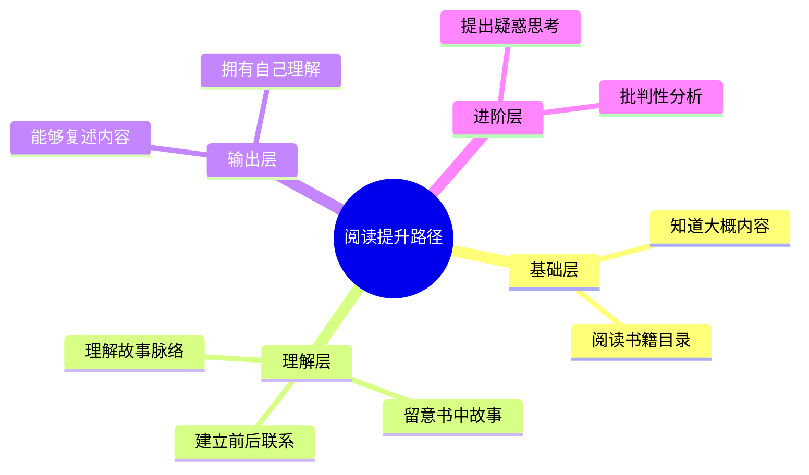

## 13.场景化阅读训练

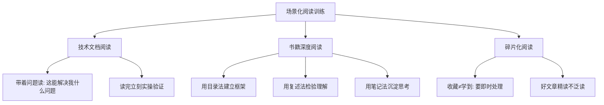

技术文档的阅读目标是"会用"，而不是"读完"。带着具体的问题去读，读到能解决问题的部分就停下来动手实操。在实操中遇到新问题，再回来继续读。这种"读→做→读→做"的交替方式，比从头读到尾效率高得多。

对于值得深入的书籍，建议采用"三遍阅读法"：第一遍快速浏览，建立框架感（30 分钟）；第二遍精读重点章节，做标注和笔记（数小时到数天）；第三遍复盘回顾，写读书总结（1 小时）。

对于公众号文章、新闻资讯等碎片化内容，要学会"即时处理"——要么立刻读完并提炼核心，要么果断跳过。不要养成"先收藏稍后再看"的习惯，大量研究表明，收藏夹里的内容，90% 以上永远不会被打开。

## 14.总结回顾本章节

**衡量阅读不是看完了几本，而是能复述、能用、能讲给别人听了几本**——读得少而透，永远胜过读得多而忘。

1. **每本书先用目录建立"地图"**：不带框架的阅读等于在丛林里乱走。
2. **每章读完合上书复述一次**：说不清楚的地方就是理解的盲区。
3. **每本书最少写"四段笔记"**：核心观点 + 印象点 + 联想 + 行动计划，写完才算读完。

## 15.后来发生的改变

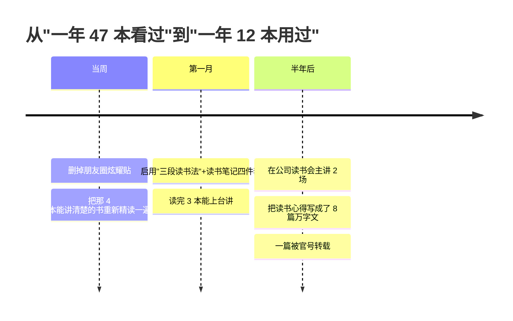

那次面试后的周末，我做了两件事。一是把朋友圈"47 本书"的炫耀贴删了。二是把书架上能讲清楚的 4 本（那 4 本是《深度工作》《学会提问》《刻意练习》《非暴力沟通》——巧合都是带练习题的）**重新精读一遍**，这次读完每本写了一份 1500 字的"四段笔记"。

第一次写完笔记，我做了一件挺羞耻的事：**对着空房间，把这 4 本书的核心观点各讲了一遍录下来**。听回放的时候我意识到，**真的能讲出来了**——这种感觉和之前"读完即忘"是天壤之别。

接下来一个月我只读了 3 本书。每本都按这套流程：

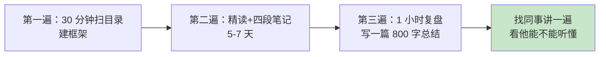

3 本书听起来比之前少了 75%，但每一本我都能在不带书的情况下讲 20 分钟。**质量翻了 10 倍**。

半年后的变化让我自己都没想到：

- 公司内部读书会上**我主讲了 2 场**（《深度工作》和《原则》），每场 40 分钟无 PPT
- 把读书心得写成了 **8 篇万字深度文**，发在公众号上有 3 篇阅读破万
- 其中一篇还被公司官方号转载了
- 年终面谈时主管说："你今年的成长肉眼可见，跟你原来不一样了。"

**最得意的还是那个面试官的提问——半年后再被人问"最近读的书"，我能立刻给出三个梯次的答案：核心观点、印象最深的故事、它怎么帮我改了一个工作习惯**。这就是真正的阅读复利，它不会因为时间而蒸发。

## 16.今天起改变三点

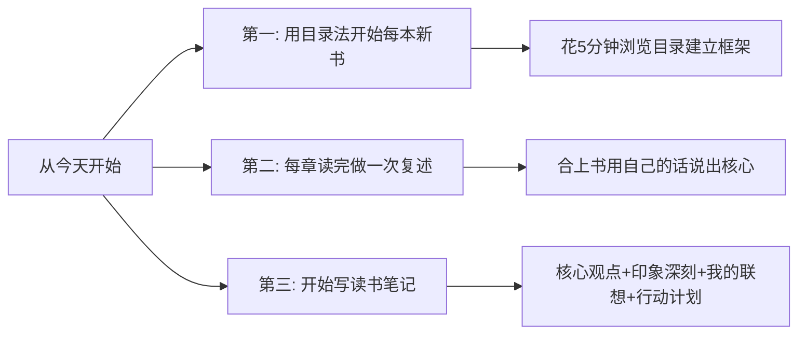

不要急着翻到正文就开始读。先把目录当作地图研究一遍，标记出你最感兴趣的章节，预判每个章节可能讲什么，然后带着问题和预期去阅读。这 5-10 分钟的"前置投入"，会让你后面的阅读效率翻倍。

花 3-5 分钟用自己的话说出这个章节的核心内容。说不清楚的地方就回去重读。坚持一个月，你的阅读理解力和记忆力一定会有显著提升。

不需要长篇大论，每本书写下"核心观点、印象最深的点、我的联想、行动计划"这四部分就够了。写笔记的过程就是深度思考的过程，它会让你的阅读价值翻倍。

## 17.课后作业思考下

1. 回顾你最近读的一本书，你能用自己的话复述出核心内容吗？如果不能，说明你需要在哪些方面加强训练？

2. 尝试用本章介绍的分层方法，评估一下你当前的阅读能力处于哪个层级？你最想提升到哪个层级？

3. 在阅读过程中，你是否有意识地将新内容与已有知识建立联系？试着用"跨书联系"的方法，找两本你读过的书的共同点。

4. 选一本书，按照"目录浏览→重点精读→故事留意→复述核心→写读书笔记"的完整流程阅读一遍，看看效果如何。
