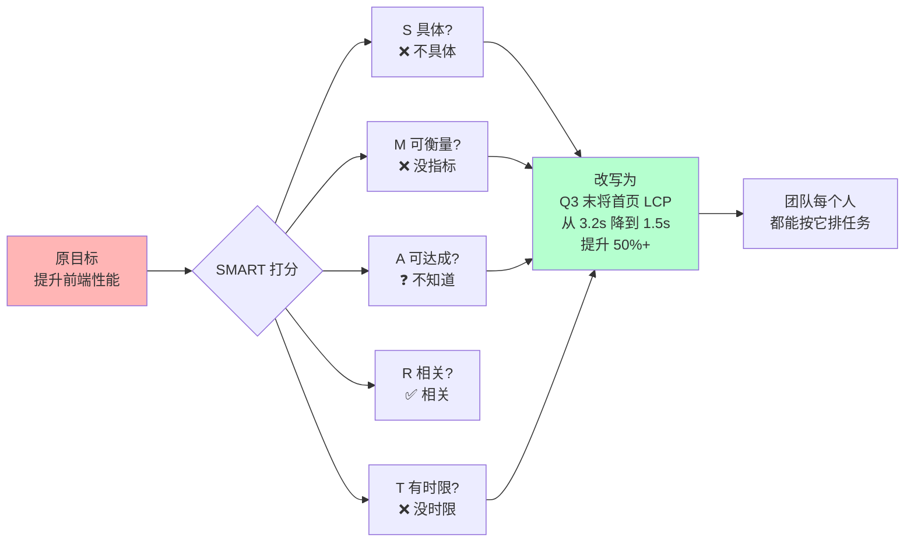
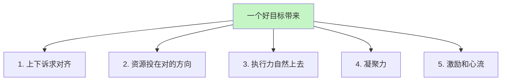
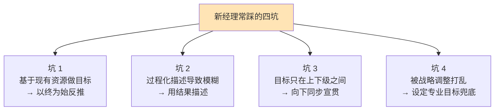

# 给团队设定目标

#### 目录介绍

- [01.开头故事引入](#01开头故事引入)
- [02.如何抵达目的地](#02如何抵达目的地)
- [03.为何目标很重要](#03为何目标很重要)
- [04.SMART设定的原则](#04smart设定的原则)
- [05.目标的描述形式](#05目标的描述形式)
- [06.故事的回响](#06故事的回响)
- [07.思考题和作业](#07思考题和作业)

## 01.开头故事引入

**团队全年没完成目标是因为目标错了。** 我接手一个小组的第一个季度，我给团队定的 OKR 写的是："提升前端页面性能，让用户体验更好"。当时我觉得这句话挺有诗意、挺有追求。

季度末复盘，我问下属 A："这个季度你为目标做了什么？" A 说："我做了代码压缩。" 我问 B："你呢？" B 说："我重构了一个模块。" 我问 C："你呢？" C 说："我 Code Review 了几次。"

每个人都觉得"我做了和性能有关的事"，但把三个人做的事合在一起，线上关键指标（FP/FCP/LCP）一个都没改善，用户体验也没看到什么变化。那一刻我突然明白——问题不在人，问题在目标。"让用户体验更好"这种话，没有一个人能准确复述它、没有一个人能按它来排任务。

**SMART 原则一下子把目标变硬。** 后来一位前辈教我用 SMART 原则重新写这个目标。

这一改之后，下季度全组三个人劲往一处使，最后首页 LCP 从 3.2s 压到了 1.4s，不仅超额完成，还上了部门的季度最佳案例。今天这一节，就把"怎么给团队写出一个真正有效的目标"讲清楚。

## 02.如何抵达目的地

**从团队职能走到团队目标的桥。** 现在你应该很清楚自己团队该承担什么样的基本职责，以及希望背负什么样的使命了。那么，接下来的一个问题就是，未来的一段时间里，三个月、六个月也好，一年也好，你希望带着你的团队抵达一个什么样的目的地呢？这就是我们通常所说的"目标"。

**为什么要专门讲目标这件事。** 目标是个大话题，网上关于目标管理的文章数不胜数。这一节要帮你解决的三件事分别是：第一，你会更加清楚目标都意味着什么，它可不是让团队有事儿干那么简单；第二，你会掌握目标设定的要点，即使你之前没做过目标管理，你也可以实际操作了；第三，一起探讨在团队频繁调整、公司战略都不稳定的情况下，如何管理团队目标。

## 03.为何目标很重要

**目标的第一重价值 诉求。** 如果我问你，目标重要不重要？你可能会不假思索地说重要！或者你会心里默默骂我白痴！似乎，目标的重要性是不言而喻的。那么我想问你一句，Why？为什么目标会那么重要？

第一重价值最基本，目标包含着你和上级的诉求，即你们希望收获的东西。没有目标，你和上级对一件事的完成标准永远对不上。

**目标的第二重价值 资源配置。** 第二重价值是目标意味着资源的有效配置。明确的目标可以让你把资源投注在有效的方向上，从"该做什么"去调配资源，而不是"能干什么"。一个好目标能在你面对"这件事要不要做"时给你秒级判断的标尺。

**目标的第三重价值 执行力。** 第三重价值是目标意味着执行力。很多管理者都把执行力和目标分开来谈，其实在我的访谈和观察中，技术管理者在任务执行上大多是很强的，并不是短板；而表现出"执行力不够"的最大原因，都在于目标的不清晰或多变。我让他们回想自己做的执行力最棒的项目是不是都具有精确的目标，结果无一例外都是肯定的答案。显然，清晰的目标是高效执行的必要条件。

**目标的第四重价值 凝聚力。** 第四重价值是目标意味着凝聚力。很多管理者问我到底该如何提升团队的凝聚力，我都会告诉他们：明确的团队目标和愿景，就是提升团队凝聚力的重要手段之一。大家因为相同的目标而并肩作战，在一起取得成就的过程中建立起深厚的"革命友情"，这对凝聚力有莫大帮助。

**目标的第五重价值 激励。** 第五重价值是目标也意味着激励。在提升员工自驱力的要素中，员工在工作中产生沉浸其中、物我两忘的"心流"状态，就需要有清晰的目标为前提。而且，团队目标感带给员工对工作的意义感和使命感，也是提升自驱力的重要来源。

## 04.SMART设定的原则

**SMART 五个维度总览。** 目标设定的原则，即"SMART"原则。分别对应着 5 个英文单词：Specific、Measurable、Attainable、Relevant 和 Time-bound。用中文来说就是目标的明确性、可衡量性、可达性、相关性和时限性。

| 字母 | 含义 | 自检问题 |
|---|---|---|
| S | Specific 明确 | 别人看一眼能复述吗? |
| M | Measurable 可衡量 | 用什么数字判断完成? |
| A | Attainable 可达成 | 跳一跳够得着吗? |
| R | Relevant 相关 | 与上级目标是否对齐? |
| T | Time-bound 有时限 | 几月几日截止? |

**可达性原则。** 可达性原则，即不能定一个完全实现不了的很高的目标，也不能定一个不需要努力就能实现的很低的目标。作为团队负责人，你会不会认为，定一个肯定能实现的相对保守的目标，对于向上级交差非常有利？短期确实很舒服，但长期会让你团队失去挑战空间，上级也会渐渐减少给你资源。

**明确性和可衡量性。** 明确性和可衡量性，我认为这两个原则是分不开的。那么究竟什么叫"明确"呢？我觉得你可以简单地理解为——把目标设定到可以衡量的程度，就叫做明确了。

先看第一组对比。说法 a："我们的目标是提升某个服务的性能。" 这不是一个明确的可以衡量的目标。说法 b："我们的目标是把某个服务的单机性能从 300qps 提升到 500qps。" 这就是一个可以明确衡量的目标。

再看第二组对比。说法 a："我们的目标是发布 BI 系统 1.0。" 这看似是一个可以衡量的目标，但是 BI 系统 1.0 如何衡量是否完成了呢？又比较模糊。说法 b："我们的目标是发布 BI 系统 1.0，支持 KPI 数据统计、全量数据导出功能。" 这样就清楚 BI 系统 1.0 如何衡量了，要支持这样两项核心功能才行。

**相关性原则。** 关于目标的相关性原则，对于技术团队来说很难跑偏，因为技术这个角色决定了其工作内容必定是和上、下游及上级目标相关联的。但对于业务、运营类的团队，这一条就要非常小心——很容易出现"自己觉得很重要但不在老板心中"的目标。

**时限性原则。** 时限性原则。所有的目标都是基于一定时限的，缺少时间限制的目标没有意义。比如前面我们提到的"提升单机性能"的目标或"发布 BI 系统 1.0"的目标，如果没有限定一个时间，就不清楚该什么时候去衡量，也就无所谓是否有挑战和是否完成。

所以，一定要有个明确的时间点，比如"到 9 月底，把单机性能从 300qps 提升到 500qps""到 12 月底，发布 BI 系统 1.0，支持 KPI 数据统计、全量数据导出分析功能"，就是两个完整且合理的目标描述了。

## 05.目标的描述形式

**KPI 和 OKR 两种描述。** 目标的描述形式，大体分为两类。一类是可以量化的指标，就是大家常说的 KPI（Key Performance Indicator，关键绩效指标）；另外一类是不可量化的目标，用关键结果来衡量，就是我们常说的 KRA（Key Result Areas）或 OKR（Objectives & Key Results），总之就是对关键结果的一种描述。

它们大体上的描述形式是：KPI——到某时间点，什么指标达到什么数字；KRA/OKR——到某时间点，完成什么工作，该工作实现了哪些功能或达到了哪些效果。

**四类常见的目标坑。** 制定这样一个目标是不是挺简单？事实上，新经理在目标设定上常常会踩一些坑，面临诸多挑战，以下四类问题和挑战是最为常见的。

第一类问题是基于现有资源做目标，而不是基于远方的目标往前推。这类问题常见的说法就是："我们团队只能做到这个程度""这些项目能做完就不错了"等。其实更为合理的做法应该是，从上级的角度来讲，你的团队需要保证哪几项重要的结果，然后再看看如何调配和补充资源。面对这类问题和挑战的钥匙叫做"以终为始的出发点"。

第二类问题是目标不明确。你可能会说："从上面你说的来看，一个明确的目标很容易制定啊！" 但问题在于，新管理者很少会因为"目标笼统或太大"导致不明确；不过，倒是常常会因为"过程化描述"而引发目标不明确的情况出现。

第三类问题是目标设定好之后，自己和自己的上级都很清楚了，但是没有刻意地向团队成员来传达，只是按照目标拆解去安排大家的工作。这样的做法导致团队成员对于整个团队的方向感不清晰，那么前面我提到的那些目标能带来的效果就无法显现，比如起不到对团队的凝聚和激励的效果。面对这类问题和挑战的钥匙叫做"目标的向下同步"。

第四类问题，也是大家最头疼的一个问题，就是目标总是被迫变来变去。互联网领域很少有非常稳定的公司，业务总是在调整，自己的上级也时不时就换个新的，甚至于公司的战略也每隔一段时间就变一次。显然，之前为团队设定的目标也得跟着变来变去。于是，目标慢慢变得形同虚设。面对这类问题和挑战的钥匙叫做"设定专业目标"，用专业目标来增强团队的内在定力。

**给新 TL 的一张"目标自检清单"**

| 自检项 | 是/否 |
|---|---|
| 是否能用一句话讲完(不超过 30 字) | |
| 是否有数字或可交付物 | |
| 是否约定了截止时间 | |
| 是否和上级目标明确挂钩 | |
| 团队里最基层的员工是否也能复述 | |
| 是否留了一条"战略变了怎么办"的备用目标 | |

全部打钩的目标，才值得拿去宣贯。

## 06.故事的回响

**目标校准后的数据对比。** 那个"提升前端页面性能"的失败目标把我教育了一顿，下一个季度我用 SMART 重写了团队目标，全组的变化是肉眼可见的。

| 观测维度 | 旧目标季度 | SMART 重写后 | 变化 |
|---|---|---|---|
| 首页 LCP | 3.2s | 1.4s | 下降 56% |
| 目标完成率 | 38% | 112% | 超额 12% |
| 每人能准确复述目标 | 1/3 | 3/3 | 100% |
| 跨职能会议对齐时长 | 2 小时 | 25 分钟 | 缩短 79% |
| 被部门评为季度最佳 | 否 | 是 | 从 0 到 1 |

**作者亲历后的三点领悟。** 第一点领悟是，目标不是"讲给上级听的承诺"，而是"讲给每一个下属听的行动地图"。讲给上级听的目标可以诗意，但讲给下属听的目标必须能直接推排任务。

第二点领悟是，没有数字的目标等于没目标。我以前怕写死数字，觉得万一完不成很尴尬；后来发现，写死数字后团队真的是冲着那个数去的，写死的那一刻就让完成概率提升了一大截。

第三点领悟是，在战略经常变的公司，"专业目标"是你团队的锚。哪怕业务方向一季一换，像"代码质量""工程效能""用户响应时延"这些专业目标不会错——它们在任何业务方向上都有价值，变成你团队长期的核心竞争力。

## 07.思考题和作业

**三道思考题。** 第一题：你这个季度为团队写的目标，用 SMART 五个维度逐一打分，最低分的一项是什么？为什么你一直没把这一项补上？

第二题：如果公司明天战略变了，你现在的团队目标里哪些会作废、哪些还有价值？后者就是你应该加重比例的"专业目标"。

第三题：你下属能用一句话准确复述团队目标的比例是多少？这个比例和目标完成率之间，是否有你能观察到的相关性？

**三个可执行作业。** 作业 A：本周为团队写一版 SMART 目标。初稿写完后，邀请三位下属各自用自己的话复述一遍，把他们复述得最不一样的那句话当成重写依据，循环两轮至所有人表述一致。

作业 B：做一张《目标拆解图》。把这版目标拆成 3~5 条关键结果（KR），再把每条 KR 拆成当季必须完成的 2~3 项任务，把这张图贴在团队协作空间的首页。

作业 C：列出你团队 3 条"专业目标"——不依赖业务方向、长期有价值、可以持续积累的目标（例如工程效能、代码质量、线上稳定性），为每条设一个可监测的数字指标，纳入每周例会例行 Review。

**延伸阅读书单。** 《OKR 工作法》——系统讲 O/KR 的写法与拆法，适合从 0 上手。《高绩效教练》——帮你把目标从文字变成团队内心的驱动。《目标：简单有效的常识管理》（高德拉特）——理解"真正的目标"与"局部指标"的区别。《这就是 OKR》（John Doerr）——Intel、Google 怎么用 OKR 把 SMART 做到公司级。

---

**本节金句**：能被每个人复述、能被数字衡量、有截止时间的目标，才是你真的带的目标；其他的都是愿望清单。
