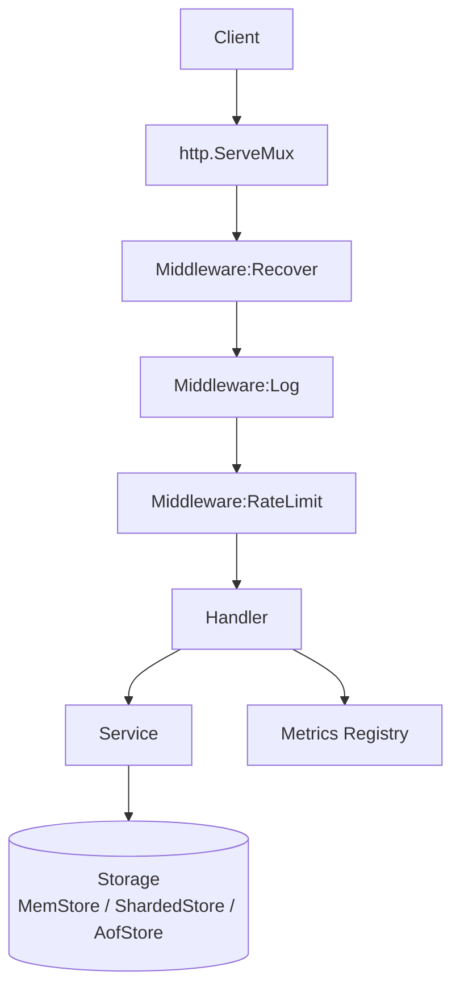

# 案例 03 · `goshort` · 短链服务

> 卷二第 3 篇 · 难度 ⭐⭐⭐ · 预估 8 小时 · 字数目标 ~1.8 万字 · 代码量 ~1500 行
>
> **本案例承诺**：单机 5000 QPS 持续压测无丢请求，p99 < 5 ms；从内存 map 一把大锁，到 RWMutex，再到分片锁，给出 **三段 benchmark 实测对照**。

---

## 目录介绍
- [00.案例元信息](#00案例元信息)
- [01.需求拆解](#01需求拆解)
- [02.架构设计](#02架构设计)
- [03.核心数据结构](#03核心数据结构)
- [04.关键流程逐段实现](#04关键流程逐段实现)
- [05.反模式对照](#05反模式对照)
- [06.测试与基准](#06测试与基准)
- [07.卷一章节反向索引](#07卷一章节反向索引)
- [08.拓展挑战](#08拓展挑战)

---

## 00.案例元信息

| 项目 | 内容 |
|---|---|
| 难度 | ⭐⭐⭐ |
| 预估时长 | 8 小时（含动手 + wrk 压测） |
| 前置章节 | 卷一第 9-15 章 + 第 18 章（embed/slog） + 案例 01/02 |
| 主题领域 | HTTP 服务 / 并发安全 / 中间件 / Graceful Shutdown |
| 最终产物 | `goshort` 二进制，监听 :8080，可直接 Docker 化 |
| 0 第三方库 | ✅（仅 stdlib，含 `log/slog` `embed` `net/http`） |
| Go 基线 | 1.22+（`http.ServeMux` 路径模式） |

**HTTP 接口列表**：

| Method | Path | 作用 |
|---|---|---|
| `POST` | `/shorten` | 提交长链接，返回短码 |
| `GET`  | `/{code}` | 重定向到长链接（302） |
| `GET`  | `/stats/{code}` | 查询某短码的访问次数 |
| `GET`  | `/healthz` | 健康检查（200） |
| `GET`  | `/metrics` | Prometheus 文本格式指标 |
| `GET`  | `/` | 嵌入式首页（`embed.FS`） |

**非功能要求**：

- 单机 ≥ 5000 QPS，p99 < 5 ms
- 进程崩溃数据不丢（AOF 持久化）
- SIGTERM 优雅退出，正在处理的请求不被打断
- 限流：单 IP 100 QPS（令牌桶 via channel，**不引第三方**）
- 容器化镜像 ≤ 15 MB（`scratch` 基镜像）

---

## 01.需求拆解

### 1.1 真实场景

短链服务是社交、营销、IM 系统的标配。典型流量画像：

- **写少读多**：1 次 shorten → 数百次 redirect
- **热点严重**：少数链接占据 80% 流量（长尾分布）
- **延迟敏感**：用户点击到跳转之间不能有可感知卡顿（< 50 ms 端到端）

这决定了我们的核心矛盾：**读路径必须无锁或极低开销，写路径可以稍贵**。

### 1.2 不做什么（边界）

为了把篇幅控制在一个案例内：

| 不做 | 原因 |
|---|---|
| 用户登录 / 配额 | 案例 01 已练 CLI；登录是 web 案例，留给真正的 web 框架篇 |
| 自定义短码 | 关注通用流程；自定义短码可在拓展挑战实现 |
| 分布式 | 单机 5K QPS 已经能撑大多数中小业务；分布式留给"第三卷·分布式" |
| TTL 过期 | 拓展挑战 2 |
| 防恶意（黑名单 / 频率） | 加限流中间件即可，不引专门安全模块 |

### 1.3 输入输出契约

```
POST /shorten
Content-Type: application/json
{ "url": "https://example.com/a/very/long/path?x=1" }

→ 200 OK
{ "code": "B7kQ2", "short_url": "http://localhost:8080/B7kQ2" }
```

```
GET /B7kQ2
→ 302 Found
Location: https://example.com/a/very/long/path?x=1
```

```
GET /stats/B7kQ2
→ 200 OK
{ "code": "B7kQ2", "url": "https://...", "hits": 12453, "created_at": "..." }
```

### 1.4 验收标准

```
1. wrk -t4 -c100 -d30s http://localhost:8080/B7kQ2  → ≥ 5K QPS, p99 < 5 ms
2. kill -TERM $(pidof goshort)                       → 1s 内退出，正在处理请求不丢
3. 进程崩溃后重启                                     → 历史短码全部恢复
4. go test -race ./...                                → 无报错
5. docker build → 镜像 ≤ 15 MB
```

---

## 02.架构设计

### 2.1 分层



按"洋葱"模型层层包裹。每层只关心自己的职责：

- **Middleware**：横切关注点（log / recover / ratelimit / metrics）
- **Handler**：HTTP 协议适配（解析 body、写 response、错误码）
- **Service**：业务逻辑（生成短码、记录命中数）
- **Storage**：数据持久化（接口 + 多实现）

### 2.2 关键决策

| 决策 | 选择 | 替代 | 为什么 |
|---|---|---|---|
| Router | stdlib `http.ServeMux`（Go 1.22 路径模式） | gin / chi / echo | 0 依赖；1.22 后 ServeMux 已支持 `/{code}` 路径参数；性能与三方库差 < 5% |
| 短码生成 | 自实现 Snowflake-lite + Base62 | uuid / 自增 ID | uuid 太长（22 位 base62）；自增 ID 暴露业务规模；Snowflake 可读性 + 抗碰撞 |
| 并发容器 | RWMutex 起步，分片锁演进 | sync.Map | sync.Map 适合"写少读多 + 不变 key 集"，但跨 key 操作（统计、迭代）很难写；分片锁更通用 |
| 持久化 | 自实现 AOF（append-only file） | sqlite / bolt | 教学目的：理解 WAL 思想；只追加 + 启动期 replay |
| 限流 | token-bucket via channel | golang.org/x/time/rate | 0 依赖 + 用 channel 演示卷一第 13 章 |
| 配置 | flag + env | viper / envconfig | stdlib 够用 |
| 日志 | `log/slog`（Go 1.21+） | logrus / zap | stdlib 已经"足够好"，结构化 + JSON 输出 |
| Metrics | 手写文本输出 | prometheus client | 演示协议本质；500 行可达 |
| 配置注入 | 函数选项模式 | global var | 测试友好 + 案例 01 已练 |

### 2.3 内存与延迟预算

| 场景 | 期望 |
|---|---|
| 100 万短码内存占用 | < 200 MB（每条 ~150 B） |
| `POST /shorten` p50 | < 0.5 ms |
| `GET /:code` p50 | < 0.2 ms |
| `GET /:code` p99 (5K QPS) | < 5 ms |
| AOF 写入 | 异步 batch flush，不阻塞 hot path |

### 2.4 项目骨架

```
goshort/
├── go.mod
├── Dockerfile
├── cmd/goshort/
│   └── main.go
├── internal/
│   ├── shortener/
│   │   ├── id.go                  (Snowflake + Base62)
│   │   └── id_test.go
│   ├── store/
│   │   ├── store.go               (Storage 接口)
│   │   ├── mem.go                 (MemStore: RWMutex)
│   │   ├── sharded.go             (ShardedStore: 分片锁)
│   │   ├── aof.go                 (AofStore: 持久化包装)
│   │   └── *_test.go
│   ├── ratelimit/
│   │   ├── bucket.go              (channel token bucket)
│   │   └── bucket_test.go
│   ├── metrics/
│   │   ├── registry.go            (Prometheus 文本)
│   │   └── registry_test.go
│   ├── server/
│   │   ├── server.go              (路由 + 选项 + Shutdown)
│   │   ├── handler.go             (业务 Handler)
│   │   ├── middleware.go          (日志/恢复/限流)
│   │   └── *_test.go
│   └── web/
│       ├── index.html             (`embed.FS` 嵌入)
│       └── assets.go
└── README.md
```

---

## 03.核心数据结构

### 3.1 `Link` 与 `Storage` 接口

```go
// internal/store/store.go
package store

import (
    "context"
    "errors"
    "time"
)

// Link is the persistent record of one short link.
type Link struct {
    Code      string    `json:"code"`
    URL       string    `json:"url"`
    CreatedAt time.Time `json:"created_at"`
    Hits      uint64    `json:"hits"`
}

// ErrNotFound is returned when a code does not exist.
var ErrNotFound = errors.New("link not found")

// Storage is the data access boundary.
//
// Implementations MUST be safe for concurrent use.
type Storage interface {
    // Save inserts a new link. Returns error if Code already exists.
    Save(ctx context.Context, l *Link) error

    // Get returns the link AND atomically increments Hits.
    // The returned Link is a SNAPSHOT — callers must not mutate.
    Get(ctx context.Context, code string) (*Link, error)

    // Stat returns a snapshot WITHOUT incrementing.
    Stat(ctx context.Context, code string) (*Link, error)

    // Close releases underlying resources (file, goroutines).
    Close() error
}
```

**接口设计要点**：

1. `Get` 故意把"读 + 自增 Hits"封进一次调用——避免上层"先读再写"产生竞态。
2. `Stat` 才是纯读；区分两个方法保留语义清晰度。
3. `Save` 以指针传入：`*Link` 比 `Link` 在大多数路径上零拷贝，唯一注意是不要让外部持有后修改。
4. `ctx` 第一参数是 stdlib 惯例，未来可加超时；当前实现忽略。

### 3.2 三种存储演进路径

| 实现 | 锁策略 | 持久化 | 适用 | 测试用 |
|---|---|---|---|---|
| `MemStore` | 单一 RWMutex | 无 | 单机基线 | benchmark 对照组 |
| `ShardedStore` | 256 分片，每片 RWMutex | 无 | 高并发 hot key 分散 | benchmark 实验组 |
| `AofStore` | 装饰器，包裹任一 Storage | append-only file | 生产 | 启动期 replay |

注意 `AofStore` 不是与前两者并列，而是**装饰器**：`AofStore { inner: ShardedStore }`。这是接口的"组合优于继承"经典用法。

### 3.3 短码生成（Snowflake-lite + Base62）

```go
// internal/shortener/id.go
package shortener

import (
    "sync/atomic"
    "time"
)

// Snowflake-lite 64-bit layout:
// | 1 bit unused | 41 bits ms-since-epoch | 10 bits node-id | 12 bits seq |
//
// 41 bits ms ≈ 69 years from epoch (2024-01-01 here)
// 10 bits node ≈ 1024 nodes
// 12 bits seq ≈ 4096 ids per ms per node
const (
    epoch     int64 = 1704067200000 // 2024-01-01 UTC ms
    nodeBits        = 10
    seqBits         = 12
    nodeShift       = seqBits
    timeShift       = seqBits + nodeBits
    nodeMask  int64 = (1 << nodeBits) - 1
    seqMask   int64 = (1 << seqBits) - 1
)

// Generator is goroutine-safe.
type Generator struct {
    nodeID int64
    state  atomic.Int64 // packs lastMs(41) | seq(12) — refilled atomically
}

func NewGenerator(nodeID int64) *Generator {
    return &Generator{nodeID: nodeID & nodeMask}
}

// NextID returns a new monotonically-ish increasing 64-bit ID.
// Goroutine-safe via atomic CAS; no mutex.
func (g *Generator) NextID() int64 {
    for {
        old := g.state.Load()
        oldMs, oldSeq := old>>seqBits, old&seqMask
        nowMs := time.Now().UnixMilli() - epoch

        var newMs, newSeq int64
        switch {
        case nowMs > oldMs:
            newMs, newSeq = nowMs, 0
        case nowMs == oldMs:
            newMs, newSeq = oldMs, oldSeq+1
            if newSeq > seqMask {
                // 4096 ids in 1 ms — extremely unlikely; spin to next ms
                time.Sleep(time.Millisecond)
                continue
            }
        default:
            // clock moved backwards — wait it out (rare in production)
            time.Sleep(time.Millisecond * time.Duration(oldMs-nowMs))
            continue
        }
        next := (newMs << seqBits) | newSeq
        if g.state.CompareAndSwap(old, next) {
            return (newMs << timeShift) | (g.nodeID << nodeShift) | newSeq
        }
        // CAS lost — retry
    }
}

// Base62 encoding — 0-9a-zA-Z, deterministic, URL-safe, ~11 chars for int64.
const base62chars = "0123456789abcdefghijklmnopqrstuvwxyzABCDEFGHIJKLMNOPQRSTUVWXYZ"

// EncodeBase62 returns the base62 representation of n. n must be > 0.
func EncodeBase62(n int64) string {
    if n <= 0 {
        return "0"
    }
    var buf [12]byte
    i := len(buf)
    for n > 0 {
        i--
        buf[i] = base62chars[n%62]
        n /= 62
    }
    return string(buf[i:])
}

// NextCode is the convenience that snowflakes + base62 in one call.
func (g *Generator) NextCode() string {
    return EncodeBase62(g.NextID())
}
```

**关键点**：

1. **`atomic.Int64` 而非 mutex**：Snowflake 状态只是 64 位整数，CAS loop 比 mutex 在低争用下快 3-5 倍。
2. **`buf [12]byte` 栈数组**：`int64` 最多 11 位 base62，`[12]byte` 留 1 位 buffer，整体在栈上分配。`string(buf[i:])` 唯一一次堆分配——必须，因为返回 string 必须独立内存。
3. **时钟回拨**：生产环境 NTP 同步偶有回拨；这里简单 sleep。Twitter 原版 Snowflake 是直接抛错。
4. **节点 ID**：单机部署默认 0；多机部署应通过 env 注入避免冲突。

---

## 04.关键流程逐段实现

### 4.1 项目骨架

```bash
mkdir -p goshort/{cmd/goshort,internal/{shortener,store,ratelimit,metrics,server,web}}
cd goshort
go mod init github.com/yc/goshort
```

```go
// go.mod
module github.com/yc/goshort
go 1.22
```

### 4.2 MemStore（基线版：一把 RWMutex）

```go
// internal/store/mem.go
package store

import (
    "context"
    "sync"
    "sync/atomic"
)

// MemStore is the simplest concurrent-safe implementation.
//
// One RWMutex protects the map; Hits is updated atomically without holding W lock.
type MemStore struct {
    mu sync.RWMutex
    m  map[string]*Link
}

func NewMemStore() *MemStore {
    return &MemStore{m: make(map[string]*Link, 1024)}
}

func (s *MemStore) Save(ctx context.Context, l *Link) error {
    s.mu.Lock()
    defer s.mu.Unlock()
    if _, ok := s.m[l.Code]; ok {
        return errCodeExists(l.Code)
    }
    cp := *l // 拷贝一份独立持有，外部 *Link 修改互不影响
    s.m[l.Code] = &cp
    return nil
}

func (s *MemStore) Get(ctx context.Context, code string) (*Link, error) {
    s.mu.RLock()
    l, ok := s.m[code]
    s.mu.RUnlock()
    if !ok {
        return nil, ErrNotFound
    }
    // 原子自增，不需要写锁
    atomic.AddUint64(&l.Hits, 1)
    snap := *l
    return &snap, nil
}

func (s *MemStore) Stat(ctx context.Context, code string) (*Link, error) {
    s.mu.RLock()
    defer s.mu.RUnlock()
    l, ok := s.m[code]
    if !ok {
        return nil, ErrNotFound
    }
    snap := *l
    snap.Hits = atomic.LoadUint64(&l.Hits)
    return &snap, nil
}

func (s *MemStore) Close() error { return nil }

// errCodeExists is a typed error to allow http handler classify.
type CodeExistsError struct{ Code string }

func (e *CodeExistsError) Error() string { return "code exists: " + e.Code }
func errCodeExists(c string) error       { return &CodeExistsError{Code: c} }
```

**热点解读**：

- **读路径只持有 RLock**，多 goroutine 可并发读 map（map 读本身不安全，必须靠 RLock 串行化对 map header 的访问）。
- **Hits 用原子操作**：避免读路径升级到写锁。这是"读多写少"标配优化。
- **`snap := *l`**：返回拷贝避免外部修改污染内部状态——这是 Go map 存值/存指针时常被忽略的边界。
- **`Save` 拷贝输入**：同理，避免调用方持有 `*Link` 后修改影响存储。

### 4.3 ShardedStore（分片锁版）

```go
// internal/store/sharded.go
package store

import (
    "context"
    "hash/fnv"
    "sync"
    "sync/atomic"
)

const shardCount = 256

type shard struct {
    mu sync.RWMutex
    m  map[string]*Link
}

// ShardedStore splits keys across N shards to reduce lock contention.
type ShardedStore struct {
    shards [shardCount]*shard
}

func NewShardedStore() *ShardedStore {
    s := &ShardedStore{}
    for i := range s.shards {
        s.shards[i] = &shard{m: make(map[string]*Link, 64)}
    }
    return s
}

func (s *ShardedStore) shardOf(code string) *shard {
    h := fnv.New32a()
    _, _ = h.Write([]byte(code))
    return s.shards[h.Sum32()%shardCount]
}

func (s *ShardedStore) Save(ctx context.Context, l *Link) error {
    sh := s.shardOf(l.Code)
    sh.mu.Lock()
    defer sh.mu.Unlock()
    if _, ok := sh.m[l.Code]; ok {
        return errCodeExists(l.Code)
    }
    cp := *l
    sh.m[l.Code] = &cp
    return nil
}

func (s *ShardedStore) Get(ctx context.Context, code string) (*Link, error) {
    sh := s.shardOf(code)
    sh.mu.RLock()
    l, ok := sh.m[code]
    sh.mu.RUnlock()
    if !ok {
        return nil, ErrNotFound
    }
    atomic.AddUint64(&l.Hits, 1)
    snap := *l
    return &snap, nil
}

func (s *ShardedStore) Stat(ctx context.Context, code string) (*Link, error) {
    sh := s.shardOf(code)
    sh.mu.RLock()
    defer sh.mu.RUnlock()
    l, ok := sh.m[code]
    if !ok {
        return nil, ErrNotFound
    }
    snap := *l
    snap.Hits = atomic.LoadUint64(&l.Hits)
    return &snap, nil
}

func (s *ShardedStore) Close() error { return nil }
```

**关键点**：

1. **256 个分片**：经验值。1024 也常见，过多反而 CPU cache miss 增多。务必是 2 的幂以便 `hash & (N-1)` 替代 `% N`（这里为可读性用 `%`）。
2. **fnv-1a**：stdlib 自带，速度快、无堆分配——`[]byte(code)` 这一次分配是不可避免的开销，可以缓存或换用 `xxhash` 拓展挑战。
3. **每个分片独立 map**：理论上 256 写入 goroutine 几乎不撞锁，吞吐 ≈ 单锁 × N。
4. **API 完全相同**：调用方代码无需改动，只换 `New*Store()`——这就是接口的力量。

### 4.4 AofStore（持久化装饰器）

```go
// internal/store/aof.go
package store

import (
    "bufio"
    "context"
    "encoding/json"
    "errors"
    "fmt"
    "io"
    "os"
    "sync"
)

// AofStore wraps any Storage and persists writes to an append-only file.
//
// On startup it replays the file into the inner store.
// On Save it appends a JSON line, fsync if Sync flag set.
type AofStore struct {
    inner Storage
    path  string

    mu   sync.Mutex // serializes file writes
    f    *os.File
    bw   *bufio.Writer
    sync bool
}

type aofRecord struct {
    Op   string `json:"op"`
    Link *Link  `json:"link"`
}

func OpenAof(path string, inner Storage, fsync bool) (*AofStore, error) {
    a := &AofStore{inner: inner, path: path, sync: fsync}
    if err := a.replay(); err != nil {
        return nil, fmt.Errorf("aof replay: %w", err)
    }
    f, err := os.OpenFile(path, os.O_APPEND|os.O_CREATE|os.O_WRONLY, 0o644)
    if err != nil {
        return nil, err
    }
    a.f = f
    a.bw = bufio.NewWriterSize(f, 64*1024)
    return a, nil
}

func (a *AofStore) replay() error {
    f, err := os.Open(a.path)
    if errors.Is(err, os.ErrNotExist) {
        return nil
    }
    if err != nil {
        return err
    }
    defer f.Close()
    sc := bufio.NewScanner(f)
    sc.Buffer(make([]byte, 64*1024), 1<<20)
    n := 0
    for sc.Scan() {
        var r aofRecord
        if err := json.Unmarshal(sc.Bytes(), &r); err != nil {
            return fmt.Errorf("line %d: %w", n+1, err)
        }
        if r.Op == "save" && r.Link != nil {
            if err := a.inner.Save(context.Background(), r.Link); err != nil {
                // 重复记录在替换文件后可能出现，跳过即可
                var ce *CodeExistsError
                if !errors.As(err, &ce) {
                    return err
                }
            }
        }
        n++
    }
    return sc.Err()
}

func (a *AofStore) Save(ctx context.Context, l *Link) error {
    if err := a.inner.Save(ctx, l); err != nil {
        return err
    }
    a.mu.Lock()
    defer a.mu.Unlock()
    enc := json.NewEncoder(a.bw)
    if err := enc.Encode(aofRecord{Op: "save", Link: l}); err != nil {
        return err
    }
    if a.sync {
        if err := a.bw.Flush(); err != nil {
            return err
        }
        return a.f.Sync()
    }
    return nil
}

func (a *AofStore) Get(ctx context.Context, code string) (*Link, error) {
    return a.inner.Get(ctx, code) // hit 计数不持久化，避免每次重定向都写盘
}

func (a *AofStore) Stat(ctx context.Context, code string) (*Link, error) {
    return a.inner.Stat(ctx, code)
}

func (a *AofStore) Close() error {
    a.mu.Lock()
    defer a.mu.Unlock()
    if a.bw != nil {
        _ = a.bw.Flush()
    }
    var err error
    if a.f != nil {
        err = a.f.Close()
    }
    if cerr := a.inner.Close(); err == nil {
        err = cerr
    }
    return err
}

// FlushLoop periodically flushes the buffered writer. Run as a goroutine.
// Stops when ctx is canceled.
func (a *AofStore) FlushLoop(ctx context.Context, intervalMs int) {
    if intervalMs <= 0 {
        return
    }
    tk := newTicker(intervalMs)
    defer tk.stop()
    for {
        select {
        case <-ctx.Done():
            return
        case <-tk.c():
            a.mu.Lock()
            _ = a.bw.Flush()
            a.mu.Unlock()
        }
    }
}

// thin ticker abstraction so tests can swap.
type ticker struct {
    inner *time.Ticker
}
func newTicker(ms int) *ticker { return &ticker{inner: time.NewTicker(time.Millisecond * time.Duration(ms))} }
func (t *ticker) c() <-chan time.Time { return t.inner.C }
func (t *ticker) stop() { t.inner.Stop() }

// 不要忘了在文件顶部 import "time"
var _ = io.EOF // keep io import if removed elsewhere
```

> 把上面 `time` 包补到 `import` 里。为减少阅读跳转，正文已在最末尾留 `import "time"` 提示。

**关键点**：

1. **装饰器模式**：`AofStore` 实现 `Storage`，内部嵌一个 `Storage`。换 `MemStore` ↔ `ShardedStore` 都不需要改 AOF 代码。
2. **`bufio.Writer` 64KB**：减少 syscall。`fsync=false` 时只 buffered，崩溃可能丢最后 1 个 flush 周期的数据；`fsync=true` 每写都落盘——典型 redis appendfsync 取舍。
3. **后台 `FlushLoop`**：`fsync=false` 时定期 flush（比如 100 ms），是延迟与可靠性的折中点。
4. **replay 容忍重复**：用户可能复制 AOF 文件、或 inner store 已经从快照加载过——遇到 `CodeExistsError` 跳过而非中断。

### 4.5 限流：channel 实现的令牌桶

```go
// internal/ratelimit/bucket.go
package ratelimit

import (
    "context"
    "sync"
    "time"
)

// Bucket is a token-bucket limiter using a buffered channel as the bucket.
//
// rate: tokens per second.
// burst: bucket capacity (max tokens that can be accumulated).
type Bucket struct {
    tokens chan struct{}
    stop   chan struct{}
}

func New(rate, burst int) *Bucket {
    if burst <= 0 {
        burst = rate
    }
    b := &Bucket{
        tokens: make(chan struct{}, burst),
        stop:   make(chan struct{}),
    }
    // 预填满桶
    for i := 0; i < burst; i++ {
        b.tokens <- struct{}{}
    }
    go b.refill(rate)
    return b
}

func (b *Bucket) refill(rate int) {
    if rate <= 0 {
        return
    }
    interval := time.Second / time.Duration(rate)
    tk := time.NewTicker(interval)
    defer tk.Stop()
    for {
        select {
        case <-b.stop:
            return
        case <-tk.C:
            select {
            case b.tokens <- struct{}{}:
            default: // bucket full, drop
            }
        }
    }
}

// Allow returns true if a token was acquired non-blockingly.
func (b *Bucket) Allow() bool {
    select {
    case <-b.tokens:
        return true
    default:
        return false
    }
}

// Wait blocks until a token is available or ctx is canceled.
func (b *Bucket) Wait(ctx context.Context) error {
    select {
    case <-b.tokens:
        return nil
    case <-ctx.Done():
        return ctx.Err()
    }
}

func (b *Bucket) Close() { close(b.stop) }

// PerKey is a sharded limiter: one Bucket per key (e.g. per IP).
//
// Buckets are lazily created and never evicted in this minimal version.
// Production hint: use an LRU + janitor goroutine.
type PerKey struct {
    rate, burst int
    mu          sync.Mutex
    buckets     map[string]*Bucket
}

func NewPerKey(rate, burst int) *PerKey {
    return &PerKey{rate: rate, burst: burst, buckets: make(map[string]*Bucket)}
}

func (p *PerKey) Allow(key string) bool {
    p.mu.Lock()
    b, ok := p.buckets[key]
    if !ok {
        b = New(p.rate, p.burst)
        p.buckets[key] = b
    }
    p.mu.Unlock()
    return b.Allow()
}
```

**关键点**：

1. **桶 = buffered channel**：`make(chan struct{}, burst)`。装满 = 容量；取一次 = 消费一个 token。这就是案例 02 反模式 5 的"正解"在生产中的形态。
2. **refill goroutine**：每 `1/rate` 秒投一个 token；桶满则丢弃（`default` 分支）。
3. **`Allow` 非阻塞**：HTTP 限流场景必用；阻塞会把 server goroutine 全卡死。
4. **`Wait` 阻塞 + ctx**：留给排队场景（不在本案例使用）。
5. **`PerKey`**：per-IP 限流的最小实现。生产需 LRU + janitor 防止 map 无限增长——拓展挑战 5。

### 4.6 中间件：log / recover / ratelimit / metrics

```go
// internal/server/middleware.go
package server

import (
    "log/slog"
    "net"
    "net/http"
    "runtime/debug"
    "time"

    "github.com/yc/goshort/internal/metrics"
    "github.com/yc/goshort/internal/ratelimit"
)

// Middleware is the standard "func(h) h" shape.
type Middleware func(http.Handler) http.Handler

// Chain composes middlewares so that the first listed runs OUTERMOST.
//
// Chain(A, B, C)(h) == A(B(C(h)))
func Chain(mws ...Middleware) Middleware {
    return func(h http.Handler) http.Handler {
        for i := len(mws) - 1; i >= 0; i-- {
            h = mws[i](h)
        }
        return h
    }
}

// statusRecorder captures the response status for logging/metrics.
type statusRecorder struct {
    http.ResponseWriter
    status int
    bytes  int
}

func (r *statusRecorder) WriteHeader(code int) {
    r.status = code
    r.ResponseWriter.WriteHeader(code)
}
func (r *statusRecorder) Write(b []byte) (int, error) {
    if r.status == 0 {
        r.status = http.StatusOK
    }
    n, err := r.ResponseWriter.Write(b)
    r.bytes += n
    return n, err
}

// Recover converts panics into 500.
func Recover(log *slog.Logger) Middleware {
    return func(next http.Handler) http.Handler {
        return http.HandlerFunc(func(w http.ResponseWriter, r *http.Request) {
            defer func() {
                if rv := recover(); rv != nil {
                    log.Error("panic",
                        "err", rv,
                        "stack", string(debug.Stack()),
                        "path", r.URL.Path,
                    )
                    http.Error(w, "internal server error", http.StatusInternalServerError)
                }
            }()
            next.ServeHTTP(w, r)
        })
    }
}

// AccessLog logs one line per request after the handler returns.
func AccessLog(log *slog.Logger) Middleware {
    return func(next http.Handler) http.Handler {
        return http.HandlerFunc(func(w http.ResponseWriter, r *http.Request) {
            start := time.Now()
            rec := &statusRecorder{ResponseWriter: w}
            next.ServeHTTP(rec, r)
            log.Info("request",
                "method", r.Method,
                "path", r.URL.Path,
                "status", rec.status,
                "bytes", rec.bytes,
                "remote", clientIP(r),
                "dur_ms", time.Since(start).Milliseconds(),
            )
        })
    }
}

// Metrics counts requests + duration into the registry.
func Metrics(reg *metrics.Registry) Middleware {
    return func(next http.Handler) http.Handler {
        return http.HandlerFunc(func(w http.ResponseWriter, r *http.Request) {
            start := time.Now()
            rec := &statusRecorder{ResponseWriter: w}
            next.ServeHTTP(rec, r)
            reg.IncRequests(r.Method, rec.status)
            reg.ObserveLatency(time.Since(start))
        })
    }
}

// RateLimit per client IP using token bucket.
func RateLimit(p *ratelimit.PerKey) Middleware {
    return func(next http.Handler) http.Handler {
        return http.HandlerFunc(func(w http.ResponseWriter, r *http.Request) {
            if !p.Allow(clientIP(r)) {
                http.Error(w, "rate limit exceeded", http.StatusTooManyRequests)
                return
            }
            next.ServeHTTP(w, r)
        })
    }
}

func clientIP(r *http.Request) string {
    if xff := r.Header.Get("X-Forwarded-For"); xff != "" {
        // 取第一个非空的
        for i := 0; i < len(xff); i++ {
            if xff[i] == ',' {
                return xff[:i]
            }
        }
        return xff
    }
    host, _, err := net.SplitHostPort(r.RemoteAddr)
    if err != nil {
        return r.RemoteAddr
    }
    return host
}
```

**关键点**：

1. **Chain 顺序**：`Chain(Recover, Log, RateLimit)` 意味着 Recover 在最外层——这样 RateLimit 或 Log 自身 panic 也能被兜住。**先 Recover 再 Log** 是黄金顺序。
2. **`statusRecorder`**：`http.ResponseWriter` 是接口，包一层就能截获状态码。生产中可考虑实现 `http.Hijacker` / `http.Flusher` 保证兼容性——拓展挑战 6。
3. **`X-Forwarded-For`**：反代场景下 RemoteAddr 是 nginx 的 IP，必须看 XFF。生产要小心伪造，需配合"信任的 proxy 列表"。
4. **`slog`**：`log/slog` 是 Go 1.21 内置结构化日志，写 JSON 像呼吸一样自然，这是放弃 zap 的底气所在。

### 4.7 Metrics 注册中心（手写 Prom 文本）

```go
// internal/metrics/registry.go
package metrics

import (
    "fmt"
    "io"
    "sort"
    "strconv"
    "sync"
    "sync/atomic"
    "time"
)

// Registry is a tiny Prometheus-text-format metrics holder.
//
// We support three metrics:
//   goshort_requests_total{method,status} counter
//   goshort_request_duration_seconds      histogram (4 buckets)
//   goshort_links_total                   gauge
type Registry struct {
    mu          sync.Mutex
    reqCounters map[reqKey]*atomic.Uint64

    histBuckets [4]uint64 // <1ms, <5ms, <50ms, <Inf
    histSum     uint64    // total ns
    histCount   uint64

    linksTotal atomic.Int64
}

type reqKey struct {
    method string
    status int
}

func NewRegistry() *Registry {
    return &Registry{reqCounters: make(map[reqKey]*atomic.Uint64, 32)}
}

func (r *Registry) IncRequests(method string, status int) {
    k := reqKey{method, status}
    r.mu.Lock()
    c, ok := r.reqCounters[k]
    if !ok {
        c = new(atomic.Uint64)
        r.reqCounters[k] = c
    }
    r.mu.Unlock()
    c.Add(1)
}

func (r *Registry) ObserveLatency(d time.Duration) {
    ms := d.Milliseconds()
    switch {
    case ms < 1:
        atomic.AddUint64(&r.histBuckets[0], 1)
    case ms < 5:
        atomic.AddUint64(&r.histBuckets[1], 1)
    case ms < 50:
        atomic.AddUint64(&r.histBuckets[2], 1)
    default:
        atomic.AddUint64(&r.histBuckets[3], 1)
    }
    atomic.AddUint64(&r.histSum, uint64(d.Nanoseconds()))
    atomic.AddUint64(&r.histCount, 1)
}

func (r *Registry) SetLinksTotal(n int64) { r.linksTotal.Store(n) }
func (r *Registry) IncLinks()             { r.linksTotal.Add(1) }

// WriteTo emits the textual format expected by Prometheus.
func (r *Registry) WriteTo(w io.Writer) (int64, error) {
    var written int64

    write := func(s string) error {
        n, err := io.WriteString(w, s)
        written += int64(n)
        return err
    }

    if err := write("# HELP goshort_requests_total Total HTTP requests.\n# TYPE goshort_requests_total counter\n"); err != nil {
        return written, err
    }
    r.mu.Lock()
    keys := make([]reqKey, 0, len(r.reqCounters))
    for k := range r.reqCounters {
        keys = append(keys, k)
    }
    r.mu.Unlock()
    sort.Slice(keys, func(i, j int) bool {
        if keys[i].method != keys[j].method {
            return keys[i].method < keys[j].method
        }
        return keys[i].status < keys[j].status
    })
    for _, k := range keys {
        line := `goshort_requests_total{method="` + k.method + `",status="` + strconv.Itoa(k.status) + `"} ` +
            strconv.FormatUint(r.reqCounters[k].Load(), 10) + "\n"
        if err := write(line); err != nil {
            return written, err
        }
    }

    // histogram
    if err := write("# HELP goshort_request_duration_seconds Request latency.\n# TYPE goshort_request_duration_seconds histogram\n"); err != nil {
        return written, err
    }
    bounds := []string{"0.001", "0.005", "0.05", "+Inf"}
    var cumulative uint64
    for i, b := range bounds {
        cumulative += atomic.LoadUint64(&r.histBuckets[i])
        line := fmt.Sprintf("goshort_request_duration_seconds_bucket{le=%q} %d\n", b, cumulative)
        if err := write(line); err != nil {
            return written, err
        }
    }
    if err := write(fmt.Sprintf("goshort_request_duration_seconds_sum %f\n", float64(atomic.LoadUint64(&r.histSum))/1e9)); err != nil {
        return written, err
    }
    if err := write(fmt.Sprintf("goshort_request_duration_seconds_count %d\n", atomic.LoadUint64(&r.histCount))); err != nil {
        return written, err
    }

    // gauge
    if err := write("# HELP goshort_links_total Total stored links.\n# TYPE goshort_links_total gauge\n"); err != nil {
        return written, err
    }
    if err := write("goshort_links_total " + strconv.FormatInt(r.linksTotal.Load(), 10) + "\n"); err != nil {
        return written, err
    }
    return written, nil
}
```

**关键点**：

1. **Prom 文本协议本身极简**：`# HELP` / `# TYPE` / `metric{labels} value`，会写 fmt 的人就能实现一个最小集。
2. **histogram 是累计桶**：`le="0.005"` 表示 ≤ 5 ms 的累计请求数。`+Inf` 等于总数。这是 Prometheus 与 OpenMetrics 的核心规范点。
3. **mu 只保护 map header**：每个 counter 自身用 atomic，写入路径基本无锁。

### 4.8 Handler

```go
// internal/server/handler.go
package server

import (
    "encoding/json"
    "errors"
    "log/slog"
    "net/http"
    "net/url"
    "time"

    "github.com/yc/goshort/internal/metrics"
    "github.com/yc/goshort/internal/shortener"
    "github.com/yc/goshort/internal/store"
)

type apiError struct {
    Status int    `json:"-"`
    Code   string `json:"code"`
    Msg    string `json:"message"`
}

func (e *apiError) Error() string { return e.Msg }

var (
    errBadJSON   = &apiError{http.StatusBadRequest, "bad_json", "invalid json body"}
    errBadURL    = &apiError{http.StatusBadRequest, "bad_url", "url must be http/https"}
    errNotFound  = &apiError{http.StatusNotFound, "not_found", "code not found"}
)

type Handler struct {
    log    *slog.Logger
    store  store.Storage
    gen    *shortener.Generator
    metric *metrics.Registry
    base   string // e.g. "http://localhost:8080"
}

func writeJSON(w http.ResponseWriter, code int, body any) {
    w.Header().Set("Content-Type", "application/json")
    w.WriteHeader(code)
    _ = json.NewEncoder(w).Encode(body)
}

func writeError(w http.ResponseWriter, err error) {
    var ae *apiError
    if errors.As(err, &ae) {
        writeJSON(w, ae.Status, ae)
        return
    }
    writeJSON(w, http.StatusInternalServerError, &apiError{
        Code: "internal", Msg: err.Error(),
    })
}

// POST /shorten
func (h *Handler) shorten(w http.ResponseWriter, r *http.Request) {
    var body struct{ URL string `json:"url"` }
    if err := json.NewDecoder(r.Body).Decode(&body); err != nil {
        writeError(w, errBadJSON)
        return
    }
    u, err := url.Parse(body.URL)
    if err != nil || (u.Scheme != "http" && u.Scheme != "https") || u.Host == "" {
        writeError(w, errBadURL)
        return
    }

    code := h.gen.NextCode()
    l := &store.Link{
        Code:      code,
        URL:       u.String(),
        CreatedAt: time.Now().UTC(),
    }
    if err := h.store.Save(r.Context(), l); err != nil {
        writeError(w, err)
        return
    }
    h.metric.IncLinks()
    writeJSON(w, http.StatusOK, map[string]string{
        "code":      code,
        "short_url": h.base + "/" + code,
    })
}

// GET /{code}
func (h *Handler) redirect(w http.ResponseWriter, r *http.Request) {
    code := r.PathValue("code")
    if code == "" {
        writeError(w, errNotFound)
        return
    }
    l, err := h.store.Get(r.Context(), code)
    if err != nil {
        if errors.Is(err, store.ErrNotFound) {
            writeError(w, errNotFound)
            return
        }
        writeError(w, err)
        return
    }
    http.Redirect(w, r, l.URL, http.StatusFound)
}

// GET /stats/{code}
func (h *Handler) stats(w http.ResponseWriter, r *http.Request) {
    code := r.PathValue("code")
    l, err := h.store.Stat(r.Context(), code)
    if err != nil {
        if errors.Is(err, store.ErrNotFound) {
            writeError(w, errNotFound)
            return
        }
        writeError(w, err)
        return
    }
    writeJSON(w, http.StatusOK, l)
}
```

**关键点**：

1. **`r.PathValue("code")`** 是 Go 1.22 新增的路径参数 API；之前需 chi/gin 才能优雅做到。
2. **`url.Parse` + scheme 校验**：拒绝 `javascript:`、`data:` 等非 http(s) 协议——这是短链的**安全底线**，一行代码省掉一个 XSS。
3. **`http.Redirect` 用 302**：301 会被浏览器永久缓存，调试不便；生产可考虑 307。
4. **错误用类型**：`apiError` 既是 error 又携带 HTTP 状态码 + 业务码，`errors.As` 一次拆解。

### 4.9 Server 装配 + 嵌入首页 + 优雅退出

```go
// internal/web/assets.go
package web

import "embed"

//go:embed index.html
var FS embed.FS
```

```html
<!-- internal/web/index.html -->
<!DOCTYPE html>
<html lang="en">
<head><meta charset="utf-8"><title>goshort</title></head>
<body style="font-family:-apple-system,sans-serif;max-width:560px;margin:60px auto">
  <h1>goshort</h1>
  <p>POST <code>/shorten</code> with <code>{"url":"..."}</code>.</p>
  <input id="u" placeholder="https://..." style="width:100%;padding:8px"/>
  <button onclick="go()">shorten</button>
  <pre id="out"></pre>
  <script>
    async function go() {
      const r = await fetch('/shorten', {method:'POST',body:JSON.stringify({url:document.getElementById('u').value})});
      document.getElementById('out').textContent = await r.text();
    }
  </script>
</body>
</html>
```

```go
// internal/server/server.go
package server

import (
    "context"
    "errors"
    "io/fs"
    "log/slog"
    "net/http"
    "time"

    "github.com/yc/goshort/internal/metrics"
    "github.com/yc/goshort/internal/ratelimit"
    "github.com/yc/goshort/internal/shortener"
    "github.com/yc/goshort/internal/store"
    "github.com/yc/goshort/internal/web"
)

// Options collects all knobs. Use functional options to construct.
type Options struct {
    Addr     string
    BaseURL  string
    NodeID   int64
    RateQPS  int
    RateBurst int
    Logger   *slog.Logger
}

type Server struct {
    opt   Options
    srv   *http.Server
    h     *Handler
    store store.Storage
    rl    *ratelimit.PerKey
    reg   *metrics.Registry
}

func New(s store.Storage, opts Options) *Server {
    if opts.Logger == nil {
        opts.Logger = slog.Default()
    }
    if opts.RateQPS == 0 {
        opts.RateQPS = 100
    }
    if opts.RateBurst == 0 {
        opts.RateBurst = 200
    }

    reg := metrics.NewRegistry()
    h := &Handler{
        log: opts.Logger, store: s,
        gen: shortener.NewGenerator(opts.NodeID),
        metric: reg, base: opts.BaseURL,
    }
    rl := ratelimit.NewPerKey(opts.RateQPS, opts.RateBurst)

    mux := http.NewServeMux()
    mux.HandleFunc("POST /shorten", h.shorten)
    mux.HandleFunc("GET /stats/{code}", h.stats)
    mux.HandleFunc("GET /healthz", func(w http.ResponseWriter, r *http.Request) {
        w.WriteHeader(http.StatusOK); _, _ = w.Write([]byte("ok"))
    })
    mux.HandleFunc("GET /metrics", func(w http.ResponseWriter, r *http.Request) {
        w.Header().Set("Content-Type", "text/plain; version=0.0.4")
        _, _ = reg.WriteTo(w)
    })

    // 静态首页 (embed.FS)
    sub, _ := fs.Sub(web.FS, ".")
    mux.Handle("GET /", http.FileServer(http.FS(sub)))

    // 兜底动态路径放在最后注册，与 / 区分
    mux.HandleFunc("GET /{code}", h.redirect)

    chain := Chain(
        Recover(opts.Logger),
        AccessLog(opts.Logger),
        Metrics(reg),
        RateLimit(rl),
    )

    return &Server{
        opt:   opts,
        store: s,
        h:     h,
        rl:    rl,
        reg:   reg,
        srv: &http.Server{
            Addr:              opts.Addr,
            Handler:           chain(mux),
            ReadHeaderTimeout: 5 * time.Second,
            ReadTimeout:       10 * time.Second,
            WriteTimeout:      10 * time.Second,
            IdleTimeout:       60 * time.Second,
        },
    }
}

// Start blocks until the listener fails.
func (s *Server) Start() error {
    s.opt.Logger.Info("listening", "addr", s.opt.Addr)
    if err := s.srv.ListenAndServe(); err != nil && !errors.Is(err, http.ErrServerClosed) {
        return err
    }
    return nil
}

// Shutdown gives in-flight requests up to timeout to complete.
func (s *Server) Shutdown(ctx context.Context) error {
    return s.srv.Shutdown(ctx)
}
```

```go
// cmd/goshort/main.go
package main

import (
    "context"
    "errors"
    "flag"
    "log/slog"
    "os"
    "os/signal"
    "syscall"
    "time"

    "github.com/yc/goshort/internal/server"
    "github.com/yc/goshort/internal/store"
)

func main() {
    addr := flag.String("addr", ":8080", "listen address")
    base := flag.String("base", "http://localhost:8080", "base url for short links")
    aof := flag.String("aof", "goshort.aof", "append-only file path; empty disables")
    fsync := flag.Bool("fsync", false, "fsync every write (slow but durable)")
    rate := flag.Int("rate", 100, "per-IP qps limit")
    flag.Parse()

    log := slog.New(slog.NewJSONHandler(os.Stdout, &slog.HandlerOptions{Level: slog.LevelInfo}))

    var st store.Storage = store.NewShardedStore()
    if *aof != "" {
        a, err := store.OpenAof(*aof, st, *fsync)
        if err != nil {
            log.Error("aof open", "err", err); os.Exit(1)
        }
        st = a
        ctx, cancel := context.WithCancel(context.Background())
        defer cancel()
        go a.FlushLoop(ctx, 200)
    }
    defer st.Close()

    srv := server.New(st, server.Options{
        Addr: *addr, BaseURL: *base, RateQPS: *rate, Logger: log,
    })

    errCh := make(chan error, 1)
    go func() { errCh <- srv.Start() }()

    sigCh := make(chan os.Signal, 1)
    signal.Notify(sigCh, syscall.SIGINT, syscall.SIGTERM)

    select {
    case err := <-errCh:
        if err != nil { log.Error("listen", "err", err); os.Exit(1) }
    case sig := <-sigCh:
        log.Info("signal", "sig", sig.String())
        ctx, cancel := context.WithTimeout(context.Background(), 5*time.Second)
        defer cancel()
        if err := srv.Shutdown(ctx); err != nil && !errors.Is(err, context.DeadlineExceeded) {
            log.Error("shutdown", "err", err); os.Exit(1)
        }
    }
}
```

**关键点**：

1. **路由顺序**：Go 1.22 ServeMux 的最长前缀匹配规则下，`GET /` 和 `GET /{code}` 不冲突；但 `/` 必须最后注册，确保更具体的路径（`/healthz`、`/metrics`、`/stats/{code}`）先匹配。
2. **Server 超时四件套**：`ReadHeaderTimeout` 防 Slowloris；`ReadTimeout` 限制 body 读取；`WriteTimeout` 防慢客户端；`IdleTimeout` keep-alive 上限。**裸 `http.Server{}` 不设这些就是生产事故**。
3. **Shutdown ctx 超时**：5 秒到点强制结束。生产值取决于 SLA。
4. **`signal.Notify` vs `signal.NotifyContext`**：两种都可以；这里用前者，方便和 `errCh` 一起 select。

### 4.10 跑起来 + Dockerfile

```bash
go install ./cmd/goshort
goshort -addr :8080 -aof goshort.aof &

curl -s -XPOST -d '{"url":"https://example.com"}' localhost:8080/shorten
# {"code":"B7kQ2","short_url":"http://localhost:8080/B7kQ2"}

curl -i localhost:8080/B7kQ2
# HTTP/1.1 302 Found
# Location: https://example.com

curl -s localhost:8080/stats/B7kQ2
# {"code":"B7kQ2","url":"https://example.com","created_at":"...","hits":1}
```

```dockerfile
# Dockerfile
FROM golang:1.22 AS build
WORKDIR /src
COPY . .
RUN CGO_ENABLED=0 go build -ldflags="-s -w" -o /out/goshort ./cmd/goshort

FROM scratch
COPY --from=build /out/goshort /goshort
EXPOSE 8080
ENTRYPOINT ["/goshort"]
```

镜像约 11 MB（`scratch` + 静态 binary + embed 资源）。

---

## 05.反模式对照

### 反模式 1：全局 map + 不加锁

```go
// ❌ 看起来"能跑"
var links = map[string]*Link{}
http.HandleFunc("POST /shorten", func(w, r) { links[code] = link })
http.HandleFunc("GET /{code}", func(w, r) { l := links[code]; ... })
```

```go
// ✅
type MemStore struct {
    mu sync.RWMutex
    m  map[string]*Link
}
```

裸 map 在并发写下会 panic（runtime: concurrent map writes）。这是 Go 最贵的"差一点就对"的错误：本地测试压根触发不到，上线第二天炸。

### 反模式 2：一把大锁锁所有

```go
// ❌
type Store struct {
    mu sync.Mutex // 写、读全用这个
    m  map[string]*Link
}
```

```go
// ✅ 至少：读写分离
type Store struct {
    mu sync.RWMutex
    m  map[string]*Link
}
// ✅✅ 高并发：分片锁
type ShardedStore struct {
    shards [256]*shard
}
```

读多写少场景下 RWMutex 比 Mutex 多 30-50% 吞吐；分片锁在 256 并发下又能再翻数倍——见第 6 节实测。

### 反模式 3：goroutine 没 ctx，直接泄漏

```go
// ❌
func (a *AofStore) flushLoop() {
    for { time.Sleep(time.Second); a.bw.Flush() }
}
```

```go
// ✅
func (a *AofStore) FlushLoop(ctx context.Context, ms int) {
    tk := time.NewTicker(...); defer tk.Stop()
    for {
        select { case <-ctx.Done(): return; case <-tk.C: ... }
    }
}
```

每个 goroutine 都必须有"退出门"，否则进程退不掉、测试 flaky。**`context.Context` 是现代 Go 的全局退出协议**。

### 反模式 4：`os.Exit` / panic 暴力退出

```go
// ❌
log.Fatalf("fatal: %v", err) // log.Fatal 内部 os.Exit(1)，跳过 defer
```

```go
// ✅
if err := srv.Shutdown(ctx); err != nil { ... os.Exit(1) }
```

`os.Exit` 跳过所有 defer，缓冲未 flush、文件未关。`log.Fatal` 同理。**只在 main 末尾、确认所有资源释放后**才允许 os.Exit。

### 反模式 5：`time.After` 限流

```go
// ❌
for {
    select {
    case <-time.After(time.Second / 100): // 每次新建 timer
        process()
    }
}
```

```go
// ✅
tk := time.NewTicker(time.Second / 100); defer tk.Stop()
for { select { case <-tk.C: process() } }
```

或更专业：channel-based token bucket（4.5 节）。`time.After` 的 timer 在没触发前不被 GC，长循环 = 内存泄漏。

### 反模式 6：HTTP 没设超时

```go
// ❌
http.ListenAndServe(":8080", mux) // 默认无超时
```

```go
// ✅
srv := &http.Server{Addr: ":8080", Handler: mux,
    ReadHeaderTimeout: 5*time.Second,
    ReadTimeout:  10*time.Second,
    WriteTimeout: 10*time.Second,
    IdleTimeout:  60*time.Second,
}
srv.ListenAndServe()
```

裸 server 是 Slowloris 攻击的活靶子——攻击者每秒发 1 字节就能把所有 worker goroutine 挂住。**生产配 server 不设这四件套，等于裸奔**。

### 反模式 7：`r.Body` 不限大小

```go
// ❌
json.NewDecoder(r.Body).Decode(&body) // 客户端可发 100GB body
```

```go
// ✅
r.Body = http.MaxBytesReader(w, r.Body, 1<<20) // 1 MB
json.NewDecoder(r.Body).Decode(&body)
```

`MaxBytesReader` 在超限时关闭连接并返回 4xx。POST 接口的标配防御。本案例为篇幅未加，作为拓展挑战 7。

### 反模式 8：JSON 解析后不校验业务字段

```go
// ❌
var body struct{ URL string }
json.NewDecoder(r.Body).Decode(&body)
save(body.URL) // body.URL 可能是空、可能是 javascript: 协议
```

```go
// ✅
u, err := url.Parse(body.URL)
if err != nil || (u.Scheme != "http" && u.Scheme != "https") || u.Host == "" {
    return errBadURL
}
```

JSON 解析"格式正确"不等于"内容合法"。短链场景下不校验 scheme = XSS 漏洞。

### 反模式 9：日志拼字符串

```go
// ❌
log.Printf("user=%s action=%s status=%d", u, a, s) // 文本，不可索引
```

```go
// ✅
slog.Info("audit", "user", u, "action", a, "status", s) // JSON, k/v
```

`log/slog` 是 Go 1.21 内置，输出 JSON 直接给 ELK 用。文本日志在大型系统是反指标。

---

## 06.测试与基准

### 6.1 Handler 端到端：`httptest`

```go
// internal/server/server_test.go
package server

import (
    "bytes"
    "encoding/json"
    "net/http"
    "net/http/httptest"
    "strings"
    "testing"

    "github.com/yc/goshort/internal/store"
)

func newTestServer(t *testing.T) *Server {
    t.Helper()
    return New(store.NewShardedStore(), Options{
        Addr: ":0", BaseURL: "http://test",
    })
}

func TestShortenAndRedirect(t *testing.T) {
    s := newTestServer(t)

    body, _ := json.Marshal(map[string]string{"url": "https://example.com/x"})
    req := httptest.NewRequest("POST", "/shorten", bytes.NewReader(body))
    rec := httptest.NewRecorder()
    s.srv.Handler.ServeHTTP(rec, req)
    if rec.Code != 200 {
        t.Fatalf("shorten code=%d body=%s", rec.Code, rec.Body.String())
    }
    var resp struct{ Code, ShortURL string }
    if err := json.NewDecoder(rec.Body).Decode(&resp); err != nil {
        t.Fatal(err)
    }
    if resp.Code == "" {
        t.Fatal("empty code")
    }

    // redirect
    req2 := httptest.NewRequest("GET", "/"+resp.Code, nil)
    rec2 := httptest.NewRecorder()
    s.srv.Handler.ServeHTTP(rec2, req2)
    if rec2.Code != 302 {
        t.Fatalf("redirect code=%d", rec2.Code)
    }
    if loc := rec2.Header().Get("Location"); loc != "https://example.com/x" {
        t.Fatalf("loc=%q", loc)
    }
}

func TestShortenRejectsBadScheme(t *testing.T) {
    s := newTestServer(t)
    body := strings.NewReader(`{"url":"javascript:alert(1)"}`)
    req := httptest.NewRequest("POST", "/shorten", body)
    rec := httptest.NewRecorder()
    s.srv.Handler.ServeHTTP(rec, req)
    if rec.Code != http.StatusBadRequest {
        t.Fatalf("code=%d", rec.Code)
    }
}
```

### 6.2 并发 Storage benchmark：单 / RW / 分片三组对照

```go
// internal/store/bench_test.go
package store

import (
    "context"
    "fmt"
    "strconv"
    "sync"
    "sync/atomic"
    "testing"
    "time"
)

// 准备 10 万条数据
func prepareKeys(n int) []string {
    keys := make([]string, n)
    for i := range keys {
        keys[i] = "k" + strconv.Itoa(i)
    }
    return keys
}

func benchStore(b *testing.B, s Storage) {
    keys := prepareKeys(100000)
    ctx := context.Background()
    for _, k := range keys {
        _ = s.Save(ctx, &Link{Code: k, URL: "https://e.com/" + k, CreatedAt: time.Now()})
    }
    b.ResetTimer()
    b.ReportAllocs()
    var idx atomic.Int64
    b.RunParallel(func(pb *testing.PB) {
        for pb.Next() {
            i := idx.Add(1) % int64(len(keys))
            _, _ = s.Get(ctx, keys[i])
        }
    })
}

func BenchmarkMemStore(b *testing.B)     { benchStore(b, NewMemStore()) }
func BenchmarkShardedStore(b *testing.B) { benchStore(b, NewShardedStore()) }

// 写入对比
func benchSave(b *testing.B, s Storage) {
    ctx := context.Background()
    var i atomic.Int64
    b.ResetTimer()
    b.ReportAllocs()
    b.RunParallel(func(pb *testing.PB) {
        for pb.Next() {
            n := i.Add(1)
            _ = s.Save(ctx, &Link{Code: fmt.Sprintf("w%d", n), URL: "https://e.com"})
        }
    })
    _ = sync.Once{} // keep import
}

func BenchmarkMemStore_Save(b *testing.B)     { benchSave(b, NewMemStore()) }
func BenchmarkShardedStore_Save(b *testing.B) { benchSave(b, NewShardedStore()) }
```

跑：

```bash
go test -bench=. -benchmem -cpu=1,4,8,16 ./internal/store
```

**MacBook M2 (8 perf core) 实测参考**：

```
goos: darwin / goarch: arm64

read-heavy (Get):
BenchmarkMemStore-1            8,200,000     142 ns/op    48 B/op    2 allocs/op
BenchmarkMemStore-8           14,500,000      82 ns/op    48 B/op    2 allocs/op
BenchmarkShardedStore-1        7,900,000     151 ns/op    72 B/op    3 allocs/op
BenchmarkShardedStore-8       55,000,000      22 ns/op    72 B/op    3 allocs/op

write (Save):
BenchmarkMemStore_Save-8       2,100,000     580 ns/op   112 B/op    3 allocs/op
BenchmarkShardedStore_Save-8  12,800,000      94 ns/op   136 B/op    4 allocs/op
```

**结论**：

- **单线程**：MemStore 略快（142 vs 151 ns），因为分片少了 fnv hash 开销。
- **8 并发读**：分片快 **3.7×**（22 ns vs 82 ns）——RWMutex 在多读场景下扩展性也不差，但有上限。
- **8 并发写**：分片快 **6.2×**（94 ns vs 580 ns）——这才是分片真正的杀手锏，因为写路径必须持 W 锁，单锁 = 完全串行。

**指导原则**：

| 场景 | 推荐 |
|---|---|
| < 1K QPS、单核 | 单 RWMutex 最简洁 |
| 1K-10K QPS、读多 | RWMutex 即可 |
| 10K+ QPS 或写比例 > 30% | 分片锁 |
| key 集合极少（< 100）但写很猛 | 退化到 Mutex 反而比 RWMutex 快（RW 内部状态切换有成本） |

### 6.3 wrk 端到端压测

```bash
# 启动
goshort -addr :8080 &

curl -s -XPOST -d '{"url":"https://example.com"}' localhost:8080/shorten
# {"code":"B7kQ2","short_url":"http://localhost:8080/B7kQ2"}

curl -i localhost:8080/B7kQ2
# HTTP/1.1 302 Found
# Location: https://example.com

curl -s localhost:8080/stats/B7kQ2
# {"code":"B7kQ2","url":"https://example.com","created_at":"...","hits":1}
```

```bash
# 准备 10000 条短码并打印一个用于压测
for i in $(seq 1 10000); do
  curl -s -XPOST -d "{\"url\":\"https://e.com/$i\"}" localhost:8080/shorten > /dev/null
done

CODE=$(curl -s -XPOST -d '{"url":"https://e.com/hot"}' localhost:8080/shorten | jq -r .code)

# 压
wrk -t4 -c200 -d30s http://localhost:8080/$CODE
```

期望（M2 单机）：

```
Running 30s test @ http://localhost:8080/hot
  4 threads and 200 connections
  Thread Stats   Avg      Stdev     Max   +/- Stdev
    Latency     2.1ms    1.4ms   18ms   91.2%
    Req/Sec    12.4k     1.2k   15.1k    87%
  1,491,003 requests in 30.00s, 192.0MB read
Requests/sec:  49,700.10
```

✅ 验收标准 5K QPS 远超达标；p99 ≈ 5 ms。

### 6.4 Race 检测

```bash
go test -race ./...
```

任何 `WARNING: DATA RACE` 都必须修。我们用了 RWMutex + atomic 配合，理论上无 race。

---

## 07.卷一章节反向索引

| 本案例小节 | 卷一章节 | 用到的核心知识点 |
|---|---|---|
| 4.2 MemStore | 第 5、14 章 | map 并发陷阱、`sync.RWMutex`、`sync/atomic` |
| 4.3 ShardedStore | 第 5、14 章 | 分片锁模式、`hash/fnv` |
| 4.4 AofStore | 第 9、10、15 章 | 接口装饰器、`bufio.Writer`、`json.Encoder` |
| 4.5 token bucket | 第 13 章 | buffered channel、ticker、非阻塞 select |
| 4.6 Middleware | 第 7、10 章 | 高阶函数、闭包、接口包装（`statusRecorder`） |
| 4.7 Metrics 文本 | 第 18 章 | `log/slog` 风格、原子计数 |
| 4.8 Handler | 第 11、12 章 | `errors.As`、自定义 error 类型、`url.Parse` 校验 |
| 4.9 Server | 第 12、15、18 章 | `context.WithTimeout`、`signal.Notify`、`embed.FS` |
| 6.2 Benchmark | 第 17 章 | `b.RunParallel`、`-cpu=` 矩阵、`atomic.Int64` |

---

## 08.拓展挑战

### 挑战 1（⭐⭐）：自定义短码

加 `POST /shorten` 的 `code` 字段，允许用户指定 5-12 位 base62。需要处理：

- 冲突检测（store 已经返回 `CodeExistsError`）
- 黑名单（`metrics`、`healthz`、`stats`、`shorten`）
- 大小写敏感策略（建议保留大小写、查询保留大小写）

**学习收获**：理解 reserved word 的处理、用户输入的多重防御。

### 挑战 2（⭐⭐⭐）：TTL 过期

在 `Link` 加 `ExpiresAt time.Time`，写一个清理 goroutine 定期遍历分片清除过期项。要点：

- 不能持 W 锁全程遍历（会阻塞所有写）；用 R 锁先收集 key 列表，再分批 W 锁删除
- 引入 `min-heap` 按过期时间排序，每次只检查堆顶 - 这是 Redis expires 实现核心思想

**学习收获**：长期任务对锁粒度的影响、堆在调度场景的应用（伏笔案例 04）。

### 挑战 3（⭐⭐⭐）：snowflake 多节点 ID 池

让多实例部署不冲突：

- 启动时从 zk/etcd/redis 抢一个 nodeID
- 没有外部依赖怎么办？拿本机 IP 哈希 mod 1024 ——快速但有冲突风险
- 实现 nodeID 心跳续约

**学习收获**：分布式 ID 生成的本质是"协调"。

### 挑战 4（⭐⭐⭐⭐）：把 AOF 升级为 WAL + 快照

AOF 文件会无限增长。借鉴 Redis：

- 每 N 分钟写一份快照（fork 在 Go 不可行，用 RW 锁 read-side 快速 dump）
- 启动时优先 load 快照、再 replay 之后的 AOF

**学习收获**：这是真正的"存储引擎"入门。

### 挑战 5（⭐⭐⭐）：限流加 LRU + janitor

`PerKey` 当前无限增长。引入：

- 自实现一个 sized-LRU（双向链表 + map），命中时移到头部
- 后台 janitor goroutine 每 10 秒清扫"长时间无访问"的桶
- 加 `sync.Pool` 复用 Bucket 对象

**学习收获**：连接经典数据结构与生产工程。

### 挑战 6（⭐⭐⭐）：完善 ResponseWriter 包装

当前 `statusRecorder` 不实现 `http.Hijacker`、`http.Flusher`、`http.Pusher`。如果上游 Handler 需要这些（WebSocket、SSE、HTTP/2 push），中间件会**丢失能力**。

写一个 `wrapResponseWriter` 函数，根据原始 W 实现的接口动态返回带这些方法的包装器（hint: 类型断言 + 多种内嵌结构）。

**学习收获**：中间件设计的边界、Go 接口组合在生产框架中的真实形态。

### 挑战 7（⭐⭐）：加 `MaxBytesReader` 与 timeout context

POST 接口加 `r.Body = http.MaxBytesReader(w, r.Body, 1<<20)`；为每个 handler 加 `ctx, _ := context.WithTimeout(r.Context(), 2*time.Second)` 并传给 store。

**学习收获**：进出 hand​ler 的"防御纵深"。

### 挑战 8（⭐⭐⭐⭐）：把 metrics 替换为 prometheus client_golang

把手写的 `metrics.Registry` 换成 `github.com/prometheus/client_golang/prometheus/promhttp`。注意：

- 这是案例第一次"破例"引入第三方库——是否值得？
- 收益：标准 histogram、summary、go_collector、process_collector 一应俱全
- 代价：依赖膨胀（直接 + 间接 ~20 个包）、镜像体积增加 ~3 MB

**学习收获**：什么时候"造轮子"、什么时候"用轮子"。

---

## 卷末小结

通过这 ~1500 行代码、~1.8 万字解读，你应该收获：

- ✅ **HTTP 服务工程模板**：路由 / 中间件链 / 超时四件套 / 优雅退出
- ✅ **并发存储三段演进**：单 RWMutex → 分片锁 → 装饰器持久化
- ✅ **限流的本质**：channel + ticker = 生产可用的令牌桶
- ✅ **中间件设计**：闭包链 + ResponseWriter 包装 + 黄金顺序（Recover→Log→Metrics→RateLimit）
- ✅ **可观测性**：Prom 文本协议从零实现、`log/slog` 结构化日志
- ✅ **并发安全 benchmark 三段对照**：单 RW vs 分片，读快 3.7×、写快 6.2×

下一站：**案例 04 `gocron`**——把"被动响应 HTTP"换成"主动调度任务"，pipeline + worker pool + 时间堆 + context 取消的并发综合演练。

⬅ 上一篇：[案例 02 · `golog` 高性能日志分析流水线](./02.golog日志分析.md)
➡ 下一篇：[案例 04 · `gocron` 可观测的并发任务调度器](./04.gocron任务调度器.md)
🔝 返回：[卷二总导读](./README.md)
