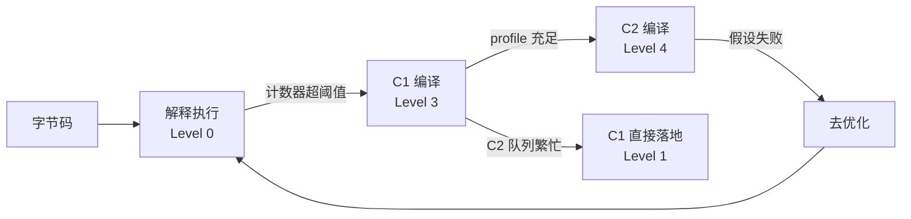
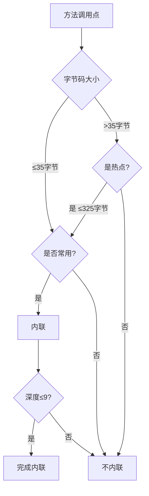

# 06.JIT编译与去优化机制

#### 目录介绍
- [1. 案例引入](#1-案例引入)
  - [1.1 一段忽快忽慢](#11-一段忽快忽慢)
  - [1.2 顺藤摸到JIT](#12-顺藤摸到jit)
  - [1.3 我们要回答什么](#13-我们要回答什么)
- [2. 执行引擎全貌](#2-执行引擎全貌)
  - [2.1 三种执行模式](#21-三种执行模式)
  - [2.2 解释器与编译器](#22-解释器与编译器)
  - [2.3 为何混合执行](#23-为何混合执行)
- [3. 分层编译体系](#3-分层编译体系)
  - [3.1 五层编译结构](#31-五层编译结构)
  - [3.2 C1与C2分工](#32-c1与c2分工)
  - [3.3 热点探测算法](#33-热点探测算法)
  - [3.4 编译队列调度](#34-编译队列调度)
- [4. 方法内联机制](#4-方法内联机制)
  - [4.1 内联是基石](#41-内联是基石)
  - [4.2 内联触发条件](#42-内联触发条件)
  - [4.3 多态内联策略](#43-多态内联策略)
  - [4.4 内联失败原因](#44-内联失败原因)
- [5. 逃逸分析优化](#5-逃逸分析优化)
  - [5.1 三种逃逸状态](#51-三种逃逸状态)
  - [5.2 标量替换原理](#52-标量替换原理)
  - [5.3 栈上分配真相](#53-栈上分配真相)
  - [5.4 同步消除机制](#54-同步消除机制)
- [6. 经典优化技术](#6-经典优化技术)
  - [6.1 公共子表达式](#61-公共子表达式)
  - [6.2 循环优化家族](#62-循环优化家族)
  - [6.3 边界检查消除](#63-边界检查消除)
  - [6.4 常量传播折叠](#64-常量传播折叠)
- [7. 去优化机制](#7-去优化机制)
  - [7.1 为什么要去优化](#71-为什么要去优化)
  - [7.2 触发去优化场景](#72-触发去优化场景)
  - [7.3 OSR栈替换](#73-osr栈替换)
  - [7.4 去优化代价](#74-去优化代价)
- [8. CodeCache管理](#8-codecache管理)
  - [8.1 三段式结构](#81-三段式结构)
  - [8.2 CodeCache满怎么办](#82-codecache满怎么办)
  - [8.3 监控与调优](#83-监控与调优)
- [9. JIT实战观测](#9-jit实战观测)
  - [9.1 PrintCompilation](#91-printcompilation)
  - [9.2 PrintInlining](#92-printinlining)
  - [9.3 看懂汇编hsdis](#93-看懂汇编hsdis)
  - [9.4 JITWatch可视化](#94-jitwatch可视化)
- [10. 综合案例串讲](#10-综合案例串讲)
  - [10.1 案例真相揭晓](#101-案例真相揭晓)
  - [10.2 一段热点代码的一生](#102-一段热点代码的一生)
  - [10.3 设计哲学回扣](#103-设计哲学回扣)
  - [10.4 JIT速查表](#104-jit速查表)


## 1. 案例引入

### 1.1 一段忽快忽慢

线上有一段聚合统计代码，性能监控显示**第一秒慢得离谱、第十秒快到异常、压测过半又突然卡顿**——三段时间，三个不同的性能曲线。代码极简：

```java
public class JitMystery {
    static int sum = 0;

    public static int compute(int x) {
        return x * x + x * 3 + 7;       // 一个平平无奇的多项式
    }

    public static void main(String[] args) {
        // 第一阶段：冷启动，500 次
        long t1 = System.nanoTime();
        for (int i = 0; i < 500; i++) sum += compute(i);
        long t2 = System.nanoTime();

        // 第二阶段：稳态运行，500 万次
        for (int i = 0; i < 5_000_000; i++) sum += compute(i);
        long t3 = System.nanoTime();

        // 第三阶段：动态加载新类型，再跑 500 万次
        loadAnotherImplementation();
        for (int i = 0; i < 5_000_000; i++) sum += compute(i);
        long t4 = System.nanoTime();

        System.out.printf("阶段1(500次)耗时: %d us%n", (t2 - t1) / 1000);
        System.out.printf("阶段2(500万次)单次耗时: %.2f ns%n", (t3 - t2) / 5_000_000.0);
        System.out.printf("阶段3(500万次)单次耗时: %.2f ns%n", (t4 - t3) / 5_000_000.0);
    }
}
```

某次实测的输出：

```
阶段1(500次)耗时:        1843 us       ← 平均 3.7 us/次
阶段2(500万次)单次耗时:  0.31 ns        ← 11000 倍提速
阶段3(500万次)单次耗时:  4.82 ns        ← 又慢了 15 倍
```

**反直觉的现象**：
- 阶段 1 慢，可以理解为"冷启动"
- 阶段 2 快到 0.31 ns，已经接近**单条 CPU 指令**的水平——比阶段 1 快了一万倍
- 阶段 3 完全没改逻辑，只是中间加载了一个新类，速度立刻跌回 5 ns

光看 Java 源码，三个阶段执行的代码**一模一样**，凭什么性能差几个数量级？

### 1.2 顺藤摸到JIT

加上 `-XX:+PrintCompilation -XX:+UnlockDiagnosticVMOptions -XX:+PrintInlining` 重跑，输出里有几行关键信息：

```
    342   45    3       JitMystery::compute (10 bytes)         ← C1 第3层编译
    415   78    4       JitMystery::compute (10 bytes)         ← C2 第4层编译
    ...
    @ 4   JitMystery::compute (10 bytes)   inline (hot)        ← 内联
    ...
   8421  127    4       JitMystery::compute (10 bytes)   made not entrant   ← 去优化！
   8422  128    3       JitMystery::compute (10 bytes)         ← 退回 C1
```

真相浮出水面：

- 阶段 1：方法调用次数没到阈值，**解释执行**字节码，约 3.7 us/次
- 阶段 2：调用次数突破阈值，先 C1 再 C2 编译成**本地机器码**并被**内联**到调用点，0.31 ns/次（其实热循环被 C2 整体优化，几乎只剩寄存器算术）
- 阶段 3：动态加载了新类，C2 当初基于"类型单态"的假设失效，**触发去优化**，编译产物作废，方法暂时退回解释执行 / C1，速度自然回落

可见，在 Java 里**同一段代码会被执行三次以上**：解释器跑一次、C1 跑一次、C2 跑一次，遇到去优化还会从头来一遍。

带着这个真相，我们至少要回答 7 个问题：

```
① JVM 为什么要"解释器 + 编译器"两套都装着，不能只留一个？     → 第2章
② "分层编译"的 5 层到底是哪 5 层？为什么这么分？           → 第3章
③ 调用次数到底要到多少才会被 JIT？热点是怎么判定的？        → 第3.3节
④ 内联是什么？为什么号称"优化之母"？                    → 第4章
⑤ 逃逸分析、标量替换、栈上分配，三个名词到底什么关系？       → 第5章
⑥ 阶段 3 那个"加载新类就性能跳水"的 Deoptimization 怎么回事？  → 第7章
⑦ 怎么用 -XX 参数和工具把上面这些过程"看见"？             → 第9章
```

### 1.3 我们要回答什么

第 14 篇要把这 7 个问题回答清楚，**让你拿到任何一段 Java 代码都能预判它的 JIT 命运**。读完之后再看那段忽快忽慢的代码，你不仅能解释三个阶段的差异，还能说出**改写哪一行代码会让 JIT 更乐于优化它**。

本篇路线：

```
执行引擎全貌 (第2章)
    ↓
分层编译体系 (第3章) ─→ 解开"5 层是哪 5 层"之谜
    ↓
方法内联 (第4章)  ─→ 优化之母
    ↓
逃逸分析 (第5章)  ─→ 标量替换 / 栈上分配 / 同步消除
    ↓
经典优化 (第6章)  ─→ 循环 / 常量 / 边界
    ↓
去优化 + OSR (第7章) ─→ 解开"加载新类就跳水"
    ↓
CodeCache (第8章) ─→ 编译产物的家
    ↓
实战观测 (第9章) ─→ 武器库
    ↓
综合案例 (第10章)
```


## 2. 执行引擎全貌

### 2.1 三种执行模式

JVM 的执行引擎不是单一的，它可以**同时运行三种模式**：

```
┌────────────────────────────────────────────────────┐
│                   字节码 (.class)                    │
└────────────────────────────────────────────────────┘
            ↓                ↓                ↓
   ┌──────────────┐  ┌──────────────┐  ┌──────────────┐
   │   解释器      │  │ C1 (Client)  │  │ C2 (Server)  │
   │  Interpreter │  │   编译器      │  │   编译器      │
   ├──────────────┤  ├──────────────┤  ├──────────────┤
   │ 逐条翻译执行  │  │ 快速编译      │  │ 深度优化编译   │
   │ 启动快        │  │ 中等优化      │  │ 启动慢        │
   │ 长期运行慢    │  │ 适合短期程序  │  │ 长期运行极快   │
   └──────────────┘  └──────────────┘  └──────────────┘
            ↑                ↑                ↑
            └────────────────┴────────────────┘
                  统一受 CodeCache 管理
                  调度由"分层编译"决定
```

**重要前提**：解释器永远存在。即便是热点代码已经被 JIT 成本地码，调试器、未编译的冷方法、去优化后的回退路径，仍然要走解释器。

### 2.2 解释器与编译器

来一组直观对比：

| 维度 | 解释器 | JIT 编译器 |
|---|---|---|
| 输入 | 字节码（每次都要翻译） | 字节码（一次性编译为本地码） |
| 输出 | 调用 CPU 完成单条指令 | 寄存器分配的本地机器码 |
| 启动 | 立即可用 | 需要编译时间（C2 一次几十毫秒） |
| 单次成本 | 高（含分发循环、栈帧维护） | 低（接近 C 语言性能） |
| 优化能力 | 几乎无 | 内联 / 逃逸 / 循环展开 / SIMD 等 |

HotSpot 的字节码解释器是**模板解释器**——启动时它就把每条字节码指令对应的本地汇编模板拼装好，运行时一边读字节码、一边查表跳到对应模板执行。这已经比"纯软件解释器"快 5~10 倍，但和 JIT 还差一个数量级。

### 2.3 为何混合执行

**疑惑**：既然 JIT 这么快，为什么不一上来就把所有代码都 JIT 完？

**论证**：
1. **编译本身耗时**：C2 编译一个方法平均 50 ms 起步，复杂方法可能 500 ms。如果启动时把所有 1 万个加载的类全部编译，启动时间要十分钟起。
2. **大部分代码只跑一次**：典型 Web 应用 80% 的方法整个生命周期被调用不到 10 次，编译它们纯属浪费 CPU。
3. **代码随时可能改变**：动态加载、字节码增强、热部署都会让旧编译产物作废。激进编译反而要做更多去优化。
4. **优化需要 profile 数据**：C2 的内联、分支预测、类型推断都要靠运行时 profile（哪条分支多、哪个对象类型常见）。冷启动时没有数据，C2 也优化不动。
5. **CodeCache 有限**：默认 240 MB 左右，全编译装不下。

**结论**：解释器+JIT 不是"过渡方案"，而是 JVM 主动选择的**自适应优化策略**——前期用解释器换启动速度，热点代码用 JIT 换稳态吞吐，profile 数据用解释器悄悄收集。**这就是"分层编译"出现的根本动因**。


## 3. 分层编译体系

### 3.1 五层编译结构

JDK 8 之后，HotSpot 默认开启**分层编译（Tiered Compilation）**，包含 5 层：

| 层级 | 名字 | 编译器 | profile 收集 | 优化深度 |
|---|---|---|---|---|
| 0 | 解释执行 | Interpreter | 否 | — |
| 1 | C1 simple | C1 | 否（不带 profile） | 简单 |
| 2 | C1 limited | C1 | 是（仅方法/循环计数） | 简单 |
| 3 | C1 full | C1 | 是（全量 profile） | 中等 |
| 4 | C2 | C2 | 是（消费 profile） | 深度 |

**典型升迁路径**：

```
0 (解释) ─────→ 3 (C1 full profile) ─────→ 4 (C2 深度优化)
              ↓ 编译队列满时降级
                1 (C1 simple，不收 profile)
              ↓ 后期再迁
                4 (直接到 C2)
```

也有一种特殊情况：方法非常小（小于 35 字节），C1 收 profile 反而比执行慢，那就直接走 1 层。

### 3.2 C1与C2分工

**C1（Client Compiler）**：
- 速度优先，编译时间 < 10 ms
- 只做局部优化：方法内联（保守）、消除冗余 getfield、简单循环
- 输出代码体积小但优化弱

**C2（Server Compiler）**：
- 质量优先，编译时间 50~500 ms
- 全局优化：激进内联、逃逸分析、循环展开/向量化、推测执行
- 输出代码体积大，性能逼近 C 语言



### 3.3 热点探测算法

**疑惑**：JVM 怎么知道一个方法"热"？

**论证**：HotSpot 用**基于计数器的热点探测**。每个方法挂两个计数器：

- **方法调用计数器**（Invocation Counter）：方法被调用一次 +1
- **回边计数器**（Back Edge Counter）：循环回到起点一次 +1

阈值默认值（不分层时）：
- C1：1500 / 13995（方法 / 回边）
- C2：10000 / 10700

分层编译开启后，阈值动态调整，受当前编译队列长度、CodeCache 占用影响。

**疑惑加深**：为什么要单独搞一个回边计数器？

**论证**：考虑一个长循环跑在 main 方法里：

```java
public static void main(String[] args) {
    int sum = 0;
    for (int i = 0; i < 10_000_000; i++) {   // ← 整个 JVM 生命周期都在这
        sum += compute(i);
    }
}
```

main 方法只被调用 1 次，方法调用计数器永远是 1，按方法计数器 main 永远不会被 JIT。但循环体跑一千万次显然该被优化。**回边计数器**就是为这种场景设计的——回边到达阈值，会触发**栈上替换（OSR, On-Stack Replacement）**，下面 7.3 节展开。

**结论**：方法计数器抓"频繁调用的小方法"，回边计数器抓"长时间运行的循环体"，两者配合才覆盖全部热点形态。

### 3.4 编译队列调度

热点判定后，方法不会立即被编译，而是**进入编译队列**，由后台编译线程消费：

- C1 编译线程数：默认 2~3 个（基于 CPU 数）
- C2 编译线程数：默认 4~6 个
- 队列优先级：按"剩余调用次数"排序——热得越快优先级越高

这是为什么阶段 1 的前几次调用被解释执行——**编译是异步的**，方法在等队列中等待时仍由解释器顶着。

可以用 `-XX:CICompilerCount=N` 调整编译线程总数。容器化部署在低配机器上有时需要降低这个值，避免 JIT 线程把 CPU 抢光。


## 4. 方法内联机制

### 4.1 内联是基石

**内联**（Inlining）是把被调用方法的字节码**直接嵌入**到调用方，省掉调用栈帧的创建和返回。例：

```java
// 源码
int compute(int x) { return x * x + x * 3 + 7; }
int main() {
    int s = 0;
    for (int i = 0; i < N; i++) s += compute(i);
    return s;
}

// 内联后等价于
int main() {
    int s = 0;
    for (int i = 0; i < N; i++) s += i*i + i*3 + 7;   // compute 消失了
    return s;
}
```

为什么说它是"优化之母"？因为内联**让其他优化看见更大上下文**：

- 内联后 `compute` 的局部变量 `x` 直接是 `i`，可参与循环常量传播
- `i*i + i*3 + 7` 整体可以被**循环展开 + SIMD 向量化**
- 没了方法调用就没了栈帧，**逃逸分析**可以把临时对象拍扁
- 没了多态分派，**分支预测器**命中率飙升

没有内联，C2 的所有其他优化都施展不开。**这是为什么 HotSpot 把"内联"放在所有优化的最前面**。

### 4.2 内联触发条件

C2 决定是否内联一个方法，要看一堆参数（默认值）：

| 参数 | 含义 | 默认值 |
|---|---|---|
| `-XX:MaxInlineSize` | 普通方法最大可内联字节码大小 | 35 字节 |
| `-XX:MaxInlineLevel` | 内联调用链最大深度 | 9 |
| `-XX:FreqInlineSize` | 热点方法的放宽尺寸 | 325 字节 |
| `-XX:InlineSmallCode` | 已编译方法的本地码上限 | 1000~2500 字节 |



**实践经验**：写性能敏感方法时，**控制方法字节码 ≤35 字节**是免费的优化通行证。这就是为什么 JDK 里很多 hot path 方法看起来"短得不正常"。

### 4.3 多态内联策略

**疑惑**：`list.add(x)` 这种多态调用，list 可能是 ArrayList、LinkedList、CopyOnWriteArrayList……C2 怎么内联？

**论证**：C2 在 profile 阶段会统计每个 invokevirtual 调用点遇到的具体类型。根据**类型多样性**采取三种策略：

```
单态调用站 (monomorphic)
   profile 显示总是同一个类型 (>90%)
   → 直接内联，加一个类型守卫(guard)
   if (obj.klass != ArrayList.klass) goto deopt;  ← 守卫
   <内联 ArrayList.add 的字节码>

双态调用站 (bimorphic)  
   profile 显示两个主要类型
   → 双向 if-else 内联
   if (obj.klass == ArrayList.klass)      <内联 ArrayList.add>
   else if (obj.klass == LinkedList.klass) <内联 LinkedList.add>
   else goto deopt;

巨态调用站 (megamorphic, ≥3 种类型)
   → 放弃内联，走 vtable 查找
```

**结论**：单态最快、双态可接受、巨态退化。这也解释了为什么 Spring 等框架在性能敏感处尽量避免"过度抽象"——每多一层接口都是一次潜在的多态发散。

### 4.4 内联失败原因

`-XX:+PrintInlining` 输出里常见的几种"拒绝理由"：

```
@ 12   com.foo.Bar::doSomething   too big              ← 字节码太大
@ 18   com.foo.Bar::deepCall      inlining too deep    ← 调用链超 9 层
@ 25   com.foo.Bar::handle        callee is native     ← 本地方法
@ 31   com.foo.Bar::trap          callee is too cold   ← 没跑热
@ 42   com.foo.Bar::dispatch      no static binding    ← 巨态
```

**实战诊断思路**：
1. 拿到火焰图，看到某个方法 CPU 占比异常高
2. 加 `-XX:+PrintInlining`，搜这个方法名
3. 看是否被内联，没内联就看原因，按原因施救（拆方法、降低多态、避免太冷）


## 5. 逃逸分析优化

### 5.1 三种逃逸状态

逃逸分析（Escape Analysis）是 C2 的"对象会不会跑出方法"分析。结论分三档：

| 状态 | 含义 | C2 能做什么 |
|---|---|---|
| **NoEscape** | 对象只在方法内使用 | 标量替换、栈上分配、同步消除 |
| **ArgEscape** | 对象作为参数传给其他方法，但不被存到堆 | 同步消除（如果调用链可分析） |
| **GlobalEscape** | 对象被存到字段、返回值、抛出 | 不能优化 |

**经典代码示例**：

```java
public Point compute() {
    Point p = new Point(3, 4);            // ← 逃逸分析关键对象
    return p.distance();                   // 没逃出方法
}
class Point {
    int x, y;
    Point(int x, int y) { this.x=x; this.y=y; }
    int distance() { return x*x + y*y; }
}
```

如果 `Point` 不逃逸，C2 可以直接把它**拍扁**：

```java
// 等价的 C2 优化结果
public int compute() {
    int x = 3, y = 4;             // ← 标量替换：对象不再 new
    return x*x + y*y;
}
```

整个 Point 类对象**根本没在堆里出现过**。

### 5.2 标量替换原理

**标量替换**（Scalar Replacement）：把对象的字段当作独立局部变量处理，对象本身被消灭。

为什么可以这么干？因为 C2 内联完调用方+被调方后，整个对象的**全部读写**都暴露在它眼前——读写哪个字段、什么顺序，一清二楚。它把字段映射到寄存器或局部 slot，对象的内存表示就成了多余的。

**疑惑**：和"栈上分配"什么关系？

**论证**：早期 HotSpot 文档把 NoEscape 对象的优化称为"栈上分配"，意思是对象创建在栈上而非堆上。但**实际实现走的是更激进的标量替换**——对象根本不分配，连栈帧都不为它留 slot。所以现在的 HotSpot 严格说来**没有真正的栈上分配，只有标量替换**。

### 5.3 栈上分配真相

OpenJDK 文档原话：

> The HotSpot JVM does not actually allocate objects on the stack.
> Instead, it performs scalar replacement.

那为什么大家还在说"栈上分配"？因为**效果等价**——对象生命周期局限于栈帧，方法返回时随栈帧销毁，不需要 GC。从外部看就像分配在栈上。

**结论**：把"栈上分配"理解为标量替换的一种"表观行为"即可。真正发生的是：对象消失了，字段成为独立标量。

### 5.4 同步消除机制

逃逸分析还能做**锁消除（Lock Elision）**：

```java
public String concat(String a, String b) {
    StringBuffer sb = new StringBuffer();   // 局部对象，不逃逸
    sb.append(a);                            // append 是 synchronized 方法
    sb.append(b);
    return sb.toString();
}
```

C2 看到 `sb` 不逃逸，没人能从外部访问它，**那 synchronized 就毫无意义**——直接擦掉锁的字节码，不再有 monitorenter/exit。

这就是为什么 JDK 里 StringBuffer 和 StringBuilder 的性能差异**远没有教科书说的那么大**——前者的 synchronized 在大多数局部使用场景里被锁消除掉了。

不过别因此就放心用 StringBuffer——一旦它**真的逃逸**（被赋给字段、跨方法传递），锁消除立刻失效，性能就跌下来。**保持 StringBuilder 的习惯永远是对的**。


## 6. 经典优化技术

### 6.1 公共子表达式

**Common Subexpression Elimination, CSE**：相同子表达式只算一次。

```java
int a = (x + y) * 2;
int b = (x + y) * 3;     // ← (x + y) 被 C2 复用
```

C2 编译后等价于：

```java
int t = x + y;
int a = t * 2;
int b = t * 3;
```

### 6.2 循环优化家族

C2 在循环上做的优化最丰富：

| 优化 | 说明 |
|---|---|
| 循环展开 (Loop Unrolling) | 一次迭代展开多次，减少循环开销 |
| 循环不变量外提 (LICM) | 循环里不变的计算挪到循环外 |
| 循环向量化 | 用 SIMD 指令一次处理多个元素 |
| 循环判别消除 (Loop Predication) | 把循环内每次都做的检查提到外面 |

```java
// 原代码
for (int i = 0; i < n; i++) {
    arr[i] = arr[i] + base * coef;     // base * coef 不变
}

// LICM 优化后
int t = base * coef;                    // 提到循环外
for (int i = 0; i < n; i++) {
    arr[i] = arr[i] + t;
}
```

### 6.3 边界检查消除

Java 数组访问每次都要做 `0 <= i < arr.length` 检查，理论上每次访问 +2 次比较。C2 通过分析索引范围，**证明范围内不可能越界**，整段检查可以消除：

```java
for (int i = 0; i < arr.length; i++) {
    sum += arr[i];        // C2 知道 i ∈ [0, arr.length)，不需要检查
}
```

这就是 Java 数组循环能跟 C 数组性能持平的关键。但**只要循环边界不是 `< arr.length` 这种显式形式，C2 就保守地保留检查**。所以写性能敏感循环时，老老实实用 `for (int i = 0; i < arr.length; i++)`，别耍花活。

### 6.4 常量传播折叠

```java
final int A = 10;
final int B = 20;
int c = A + B;        // C2 直接折叠为 c = 30
```

更激进的：

```java
public int demo(int x) {
    if (x > 100) {
        return foo(x, true);   // ← 这里 true 是常量
    }
}
private int foo(int x, boolean flag) {
    if (flag) return x * 2;
    return x;
}

// 内联 + 常量折叠后 demo 变成
public int demo(int x) {
    if (x > 100) {
        return x * 2;          // foo 整个被折叠
    }
}
```

这就是为什么 JDK 内部很多 boolean 参数最后都被 C2 优化到完全消失。


## 7. 去优化机制

### 7.1 为什么要去优化

**疑惑**：好不容易编译好的本地码，为什么要丢掉？

**论证**：C2 的所有激进优化都建立在**"假设"** 之上：

1. 类型假设：这个 invokevirtual 调用点 95% 是 ArrayList → 内联 ArrayList.add
2. 分支假设：这个 if 永远不进入 → 直接删掉这一支代码
3. 常量假设：这个 final 字段是 10 → 直接折叠
4. 单实现假设：这个接口只有一个实现类 → 跳过 vtable 查找

**这些假设可能在运行时被打破**：
- 反射注入了一个新的 ArrayList 实现
- 第一次走到了"永远不进入"的分支
- 字节码增强改写了 final 字段
- 一个新的实现类被动态加载

JVM 必须有能力发现假设失败时**回滚到安全状态**——这就是去优化（Deoptimization）。

### 7.2 触发去优化场景

**A. 类层次结构变化**：
```java
// C2 假设 Animal 只有 Dog 一个子类，内联了 Dog.bark
// 突然加载了一个 Cat 类
class Cat extends Animal { ... }   // ← 触发！
// C2 编译产物的"单实现假设"破灭，必须去优化
```

**B. 罕见路径首次进入**：
```java
if (rarely_true) {
    handle_rare_case();    // C2 把这块标记为 uncommon trap
}
// 第一次有人让 rarely_true 为 true → 去优化、回退解释器
```

**C. 未初始化的类首次访问**：
```java
return SomeRarelyUsedClass.value;
// 第一次调用 → 类必须加载 → 去优化
```

**D. 数组边界、空指针、类型转换异常**：C2 会假设这些异常很少发生，第一次发生时去优化。

### 7.3 OSR栈替换

回到第 3.3 节遗留的问题：长循环里的回边计数器超阈值后，怎么"半道"切到 JIT 后的本地码？

**On-Stack Replacement (OSR)**：JIT 出循环对应的本地码版本，在循环回边处把当前栈帧"换装"——所有局部变量、操作数栈位置一一映射到新本地码的起始位置，下一次回边直接跳进本地码：

```
解释器栈帧                       JIT 本地码栈帧
┌──────────────┐                ┌──────────────┐
│ pc = 25      │                │ rip = 0x...  │
│ stack[0]=sum │  ─── OSR ──→   │ rax = sum    │
│ stack[1]=i   │                │ rcx = i      │
│ locals[]     │                │ ...          │
└──────────────┘                └──────────────┘
```

**OSR 编译产物和普通编译产物不通用**——OSR 入口在循环中部，普通入口在方法开头。所以 JIT 日志里你会看到 `% (osr)` 标记的特殊版本：

```
1234   45  %   4    JitMystery::longLoop @ 12 (98 bytes)   ← OSR 编译产物
```

OSR 的存在让"循环型应用"和"调用型应用"在 JIT 待遇上一致。

### 7.4 去优化代价

**去优化不是免费的**：

1. **栈帧重建**：把寄存器值写回内存中的解释器槽位
2. **CodeCache 释放**：废弃的本地码标记为 not entrant，等待回收
3. **重新收集 profile**：解释器再跑一段时间收新 profile
4. **重新编译**：C1 / C2 重新编排上来，再花几十毫秒

可以理解为：**JIT 越激进，去优化越贵**。所以一个良好的实践是：**让生产环境运行的代码"长得像"压测时的代码**——同样的输入分布、同样的类型集合。否则压测时 C2 优化得很满意，上线后被新数据击穿、连环去优化，性能比解释执行还差。


## 8. CodeCache管理

### 8.1 三段式结构

JDK 9 之后 CodeCache 被切成 3 段：

```
┌──────────────────────────────────────────┐
│ Non-Profiled Code Heap                    │  ← C1 不带 profile / C2 编译产物
├──────────────────────────────────────────┤
│ Profiled Code Heap                        │  ← C1 带 profile (Level 2/3)
├──────────────────────────────────────────┤
│ Non-Method Code Heap                      │  ← JVM 内部代码 (解释器模板/stub)
└──────────────────────────────────────────┘
```

**为什么分三段**：
- 不同生命周期：Non-Method 永不释放，Profiled 短期高频替换，Non-Profiled 长期稳定
- 减少碎片：相似生命周期的内存放一起，旧产物释放后空间易于复用
- GC 友好：CodeCache GC（Sweeper）只需要扫前两段

### 8.2 CodeCache满怎么办

CodeCache 默认 240 MB（通过 `-XX:ReservedCodeCacheSize` 调整）。一旦被填满会出现：

```
Java HotSpot(TM) 64-Bit Server VM warning:
CodeCache is full. Compiler has been disabled.
```

**后果灾难性**：JIT 直接关闭，所有方法回退到解释执行，性能可能下降 10 倍。

**典型成因**：
1. 大量动态生成的类（CGLIB / Mockito 滥用）
2. 大量 Lambda 表达式生成的内部类
3. ReservedCodeCacheSize 设置过小
4. 长期运行后碎片严重，可用空间小于阈值

### 8.3 监控与调优

**监控**：

```bash
# 飞行指令
jcmd <pid> Compiler.codecache

# 输出
CodeHeap 'non-profiled nmethods': size=120000Kb used=10238Kb max_used=10248Kb free=109761Kb
CodeHeap 'profiled nmethods':     size=120000Kb used=15323Kb max_used=15345Kb free=104676Kb
CodeHeap 'non-nmethods':          size=5696Kb  used=1382Kb  max_used=1382Kb  free=4313Kb
```

**调优常用参数**：

```bash
-XX:ReservedCodeCacheSize=512m       # 总大小
-XX:InitialCodeCacheSize=256m        # 初始大小
-XX:+UseCodeCacheFlushing            # 默认开启，让 sweeper 主动回收冷代码
-XX:+PrintCodeCache                  # JVM 退出时打印 CodeCache 占用
```

**经验值**：
- 微服务 / Web 应用：保持默认 240 MB 即可
- 大型 Spring Boot + AOP + ORM：建议提升到 512 MB
- Mock 测试 / 字节码增强密集：512 MB 起步


## 9. JIT实战观测

### 9.1 PrintCompilation

最基础的观测开关：

```bash
java -XX:+PrintCompilation YourApp
```

输出格式：

```
   42    1    n      java.lang.Object::registerNatives (native)
   45    2       3   java.lang.String::hashCode (55 bytes)
   78    3       4   java.lang.String::equals (81 bytes)
  123    4 %     3   YourApp::main @ 8 (100 bytes)        ← OSR
  234    5         3   YourApp::compute (10 bytes)
  450    5         3   YourApp::compute (10 bytes)   made not entrant   ← 去优化
```

| 字段 | 含义 |
|---|---|
| 第1列 | 自 JVM 启动以来的毫秒数 |
| 第2列 | 编译 ID |
| 第3列 | 标志位（n=native, %=OSR, s=synchronized） |
| 第4列 | 编译层级 |
| 第5列 | 方法签名 |
| 第6列 | 字节码大小 |

`made not entrant` 是去优化的明显标志。

### 9.2 PrintInlining

```bash
java -XX:+UnlockDiagnosticVMOptions -XX:+PrintInlining YourApp
```

输出会列出每个调用点的内联决策：

```
@ 4   java.util.ArrayList::add (29 bytes)   inline (hot)
@ 12  java.util.ArrayList::ensureCapacityInternal (12 bytes)   inline (hot)
@ 25  java.util.ArrayList::grow (47 bytes)   too big
```

### 9.3 看懂汇编hsdis

要看 JIT 真正生成的汇编，需要安装 `hsdis` 反汇编插件，然后：

```bash
java -XX:+UnlockDiagnosticVMOptions -XX:+PrintAssembly \
     -XX:CompileCommand="print,YourApp::compute" YourApp
```

输出片段（x86-64）：

```
  0x0000000113201640: mov    %eax,-0x14000(%rsp)
  0x0000000113201647: push   %rbp
  0x0000000113201648: sub    $0x10,%rsp
  0x000000011320164c: mov    %edx,%eax
  0x000000011320164e: imul   %edx,%eax           ← x*x
  0x0000000113201651: lea    (%edx,%edx,2),%ecx  ← x*3
  0x0000000113201654: add    %ecx,%eax
  0x0000000113201656: add    $0x7,%eax           ← +7
  0x0000000113201659: add    $0x10,%rsp
  0x000000011320165d: pop    %rbp
  0x000000011320165e: ret
```

整个 `x*x + x*3 + 7` 被 C2 编译成 6 条算术指令，用 `lea` 做 `x*3` 这种小技巧也用上了——这就是阶段 2 跑到 0.31 ns/次的真相。

### 9.4 JITWatch可视化

如果嫌命令行苦涩，**JITWatch** 是开源的 JIT 日志可视化工具：

```bash
java -XX:+UnlockDiagnosticVMOptions \
     -XX:+TraceClassLoading -XX:+LogCompilation \
     -XX:LogFile=jit.log YourApp

# 然后用 JITWatch 打开 jit.log
```

它能给出：
- 每个方法的层级演进时间轴
- 内联失败原因聚合
- CodeCache 使用曲线
- 字节码 → 汇编 三视图对照

排查 JIT 问题时强烈推荐。


## 10. 综合案例串讲

### 10.1 案例真相揭晓

回到第 1 章那个忽快忽慢的 `compute` 案例。第 1 章列了 7 个疑问，逐条作答：

**疑问 ①：为什么解释器+编译器要并存？**
→ 第 2.3 节。解释器换启动速度、JIT 换稳态吞吐、profile 数据靠解释器收集。三种模式协同才能在"启动快、稳态稳、应对动态变化"三个目标间平衡。

**疑问 ②：分层编译 5 层是哪 5 层？为什么这么分？**
→ 第 3.1 节。L0 解释 / L1 C1 simple / L2 C1 限量 profile / L3 C1 全 profile / L4 C2。这种切分让每一层都有明确职能，又允许"C2 队列繁忙时降级到 L1"等动态调度。

**疑问 ③：调用次数到多少才会被 JIT？**
→ 第 3.3 节。方法计数器 1500 (C1) / 10000 (C2)，回边计数器 13995 / 10700。分层编译开启后阈值动态调整。回到案例：阶段 1 的 500 次远不够阈值，全程解释执行。

**疑问 ④：内联是什么？为什么号称优化之母？**
→ 第 4.1 节。内联让上下文从"调用方+被调方各自看不见"扩展为"完整代码块可见"，所有其他优化（逃逸、循环展开、常量折叠）才有用武之地。回到案例：阶段 2 跑到 0.31 ns 的核心原因就是 `compute` 被内联到 main 的循环里。

**疑问 ⑤：逃逸分析、标量替换、栈上分配什么关系？**
→ 第 5 章。逃逸分析判断对象去向（NoEscape/ArgEscape/GlobalEscape），NoEscape 触发标量替换（对象拍扁成寄存器），所谓"栈上分配"是标量替换效果的别名。回到案例：`compute` 不创建对象，逃逸分析对它无影响，但**整个优化体系的核心理念在它身上得到了验证**。

**疑问 ⑥：阶段 3 那个 Deoptimization 怎么回事？**
→ 第 7 章。`loadAnotherImplementation()` 加载新类，C2 当初的"类型单态"假设失效，编译产物被标记 not entrant，方法暂时退回解释器或 C1。第 7.4 节也解释了为什么这个过程很贵——栈帧重建、CodeCache 释放、profile 重收、重新编译四件事一起来。

**疑问 ⑦：怎么把这些过程"看见"？**
→ 第 9 章三件套：`PrintCompilation` 看时间轴 + `PrintInlining` 看决策 + `hsdis/JITWatch` 看产物。

**根本症结**：Java 性能不是"代码写出来什么样就跑成什么样"，而是**JIT 与运行时数据共同雕刻出来的产物**。**同一份代码在不同 profile 下会编译出完全不同的本地码**。这是 Java 性能"不容易稳定预测"的根源，也是它"长期跑能比 C 还快"的本钱所在。

### 10.2 一段热点代码的一生

把 `compute(i)` 的完整生命周期串成一棵树，回扣 01~14 篇所有要素：

```
源码:  return x * x + x * 3 + 7;
   ↓ javac
字节码 (10 字节)
   iload_1 / iload_1 / imul
   iload_1 / iconst_3 / imul / iadd
   bipush 7 / iadd / ireturn

【加载阶段】
  [01篇] JitMystery.class 进入元空间
  [02篇] 类加载器双亲委派完成
  [13篇] JVM 校验魔数 / StackMapTable

【冷启动阶段 — 阶段 1】
  [本篇 §2] 模板解释器逐条翻译执行
  [本篇 §3.3] 方法计数器从 0 开始累加
  500 次调用 → 计数器 500，未到 C1 阈值 1500
  阶段 1 平均耗时 3.7 us/次（接近纯解释器开销）

【升温阶段 — 进入 C1】
  [本篇 §3.1] 计数器突破阈值，方法进入 C1 编译队列
  [本篇 §3.2] C1 几毫秒内编译完成 (Level 3，带 profile)
  解释器+C1 混跑，profile 持续累积

【深度优化 — C2 出场】
  [本篇 §3.1] profile 充足后晋升到 L4
  [本篇 §4] compute 被内联到 main 的循环体
  [本篇 §6.2] 循环展开 + 常量传播，*3 用 lea 实现
  [本篇 §6.3] 数组边界检查消除（如有访问数组）
  [本篇 §9.3] 最终汇编只有 6 条指令
  阶段 2 平均耗时 0.31 ns/次（11000 倍提速）
  [本篇 §8.1] 编译产物落入 Non-Profiled Code Heap

【动态扰动 — 去优化登场】
  loadAnotherImplementation() 加载新类
  [本篇 §7.2] 单实现假设破灭
  [本篇 §7.1] C2 编译产物被标记 not entrant
  [本篇 §7.4] 栈帧重建，方法回退到解释器/C1
  阶段 3 平均耗时 4.82 ns/次（暂时回退）
  
【再热再编 — 自适应】
  解释器+C1 重新跑，新 profile 成形
  C2 基于新 profile 再编译（这次保守一些，类型守卫多一层）
  阶段 4 (案例没演示) 又会回到 ~1 ns 量级
```

如果你能把每个阶段的"为什么 + 哪一节讲过"对答如流，第 14 篇就吃透了。

### 10.3 设计哲学回扣

跳出技术细节，提炼三条会贯穿全册的设计哲学：

1. **自适应优化**：JIT 不预设最优策略，而是观察实际运行行为再做决定。这种"运行时决策"思想在 GC 算法选择（G1/ZGC 自适应分代）、HashMap 树化阈值、ConcurrentHashMap 分段尺寸里反复出现。**与其押注一个万能策略，不如让系统具备自我调整的能力**。

2. **乐观假设 + 兜底回退**：C2 大胆假设单态、热分支、终态类型，错了就去优化。这套"假设-验证-回退"机制和数据库的乐观锁、JMM 的 happens-before 保证、CAS 的失败重试本质相同。**乐观换性能，回退保正确**。

3. **多层级互补**：解释器/C1/C2 不是替代关系，是**协作关系**。解释器永不退役，因为它兜底；C1 永不退役，因为 C2 队列拥堵时要它顶上；C2 永不强制启动，因为成本太高。这种"分层"思想还会在 GC（Young/Old/Humongous）、并发包（自旋→CAS→AQS 阻塞）、IO（BIO/NIO/AIO）里再次相遇。**把不同代价、不同能力的实现摆在一起、按需切换，比追求"一种实现统治一切"健康得多**。

### 10.4 JIT速查表

最后一张表，建议截图保存：

| 类别 | 内容 | 关键点 | 章节 |
|---|---|---|---|
| 执行模式 | 解释 / C1 / C2 | 三模式并存 | §2 |
| 分层编译 | L0~L4 | 5 层动态调度 | §3.1 |
| 热点判定 | 方法计数器 / 回边计数器 | 默认 1500 / 10000 | §3.3 |
| 内联 | MaxInlineSize / MaxInlineLevel | 默认 35 / 9 | §4.2 |
| 多态调用站 | 单态 / 双态 / 巨态 | 单态最快 | §4.3 |
| 逃逸分析 | NoEscape / ArgEscape / GlobalEscape | 标量替换基础 | §5.1 |
| 锁消除 | 局部对象 synchronized | 自动消除 | §5.4 |
| 去优化 | 类层次变化 / 罕见路径 / 类型不匹配 | made not entrant | §7.2 |
| OSR | 长循环半道切换 | % 标记 | §7.3 |
| CodeCache | 三段式 / 默认 240MB | 满则全员解释 | §8 |
| 观测三件套 | PrintCompilation / PrintInlining / hsdis | + JITWatch | §9 |

掌握 JIT 编译，是理解 Java 性能调优、火焰图诊断、字节码增强代价的基础。下一篇我们顺着"JIT 跑出问题怎么诊断"这条线，进入**第 15 篇：JVM 性能诊断工具链**——把 jstat / jmap / jstack / jcmd / JFR / Arthas / async-profiler 一次拉通。
