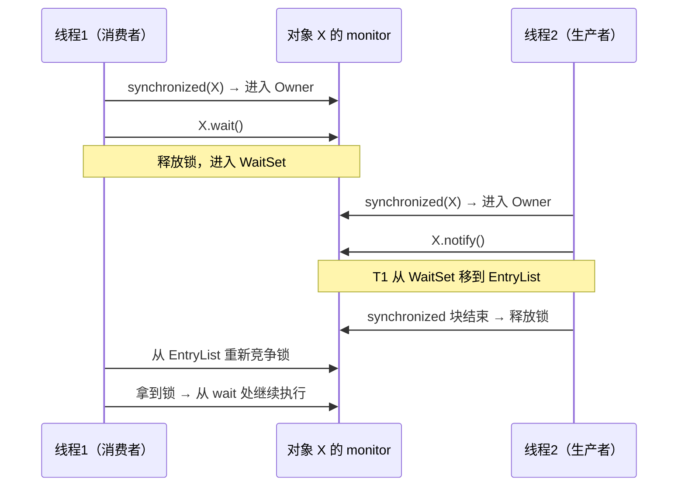

# 18.Object通用方法的契约

#### 目录介绍
- [1. 案例引入](#1-案例引入)
  - [1.1 去重失败](#11-去重失败)
  - [1.2 克隆共享](#12-克隆共享)
  - [1.3 我们要回答什么](#13-我们要回答什么)
- [2. Object 全景](#2-object-全景)
  - [2.1 十一个方法](#21-十一个方法)
  - [2.2 三大职责切分](#22-三大职责切分)
  - [2.3 native 方法名单](#23-native-方法名单)
- [3. equals 契约](#3-equals-契约)
  - [3.1 五大契约条款](#31-五大契约条款)
  - [3.2 默认实现是地址](#32-默认实现是地址)
  - [3.3 对称性陷阱](#33-对称性陷阱)
  - [3.4 instanceof 与 getClass](#34-instanceof-与-getclass)
- [4. hashCode 契约](#4-hashcode-契约)
  - [4.1 三大契约条款](#41-三大契约条款)
  - [4.2 与 equals 一致性](#42-与-equals-一致性)
  - [4.3 默认实现的真相](#43-默认实现的真相)
  - [4.4 hash 算法实战](#44-hash-算法实战)
- [5. clone 浅深拷贝](#5-clone-浅深拷贝)
  - [5.1 Cloneable 标记接口](#51-cloneable-标记接口)
  - [5.2 浅拷贝陷阱](#52-浅拷贝陷阱)
  - [5.3 深拷贝四方案](#53-深拷贝四方案)
  - [5.4 拷贝构造器替代](#54-拷贝构造器替代)
- [6. toString 与 finalize](#6-tostring-与-finalize)
  - [6.1 toString 工程价值](#61-tostring-工程价值)
  - [6.2 finalize 已被废弃](#62-finalize-已被废弃)
  - [6.3 Cleaner 替代方案](#63-cleaner-替代方案)
  - [6.4 try-with-resources 兜底](#64-try-with-resources-兜底)
- [7. 监视器三方法](#7-监视器三方法)
  - [7.1 wait notify 协议](#71-wait-notify-协议)
  - [7.2 必须持有锁](#72-必须持有锁)
  - [7.3 虚假唤醒与循环](#73-虚假唤醒与循环)
  - [7.4 notify 还是 notifyAll](#74-notify-还是-notifyall)
- [8. getClass 与反射入口](#8-getclass-与反射入口)
  - [8.1 final 不可重写](#81-final-不可重写)
  - [8.2 与 instance.class 对比](#82-与-instanceclass-对比)
  - [8.3 与 getDeclaringClass](#83-与-getdeclaringclass)
- [9. 现代替代方案](#9-现代替代方案)
  - [9.1 Record 自动实现](#91-record-自动实现)
  - [9.2 Lombok 字节码生成](#92-lombok-字节码生成)
  - [9.3 Lock Condition 替代](#93-lock-condition-替代)
- [10. 综合案例串讲](#10-综合案例串讲)
  - [10.1 双案例真相揭晓](#101-双案例真相揭晓)
  - [10.2 一个对象的一生](#102-一个对象的一生)
  - [10.3 设计哲学回扣](#103-设计哲学回扣)
  - [10.4 Object 方法速查表](#104-object-方法速查表)


## 1. 案例引入

### 1.1 去重失败

某电商平台的会员系统，运营反馈"VIP 黑名单"功能出现严重 BUG——同一个用户被重复封禁了 3 次，每次都生成新的封禁记录。技术团队定位到这段"看起来非常正常"的代码：

```java
public class User {
    private Long id;
    private String name;
    private Integer level;
    
    // 重写了 equals
    @Override
    public boolean equals(Object o) {
        if (this == o) return true;
        if (!(o instanceof User)) return false;
        User user = (User) o;
        return Objects.equals(id, user.id);
    }
    
    // ★ 没有重写 hashCode
}

// 业务代码
Set<User> blacklist = new HashSet<>();
blacklist.add(new User(100L, "Alice", 3));
blacklist.add(new User(100L, "Alice", 3));   // ★ 期望去重
blacklist.add(new User(100L, "Alice", 3));

System.out.println(blacklist.size());        // 输出 3 ！期望 1
```

**三个 id 完全相同的 User**，HashSet 居然没有去重——三个对象都被存了下来。运营据此发了三条封禁短信，用户疯狂投诉。

事故复盘时，资深架构师在白板上画了三个问号：

```
追问 ①：equals 已经重写了，为什么 HashSet 还是没去重？
追问 ②：hashCode 不重写会怎么样？JVM 默认实现是什么？
追问 ③：equals 和 hashCode 之间有什么"契约"？为什么必须一起重写？
```

### 1.2 克隆共享

同一周，订单系统又爆出第二个事故——批量创建订单时，所有订单的优惠券列表"诡异地"指向同一个对象：

```java
public class Order implements Cloneable {
    private Long orderId;
    private List<Coupon> coupons = new ArrayList<>();
    
    @Override
    public Order clone() {
        try {
            return (Order) super.clone();   // ★ 默认浅拷贝
        } catch (CloneNotSupportedException e) {
            throw new AssertionError();
        }
    }
}

// 业务代码
Order template = new Order(0L);
template.getCoupons().add(new Coupon("10元券"));

Order order1 = template.clone();
Order order2 = template.clone();

order1.getCoupons().add(new Coupon("20元券"));   // ★ 只想给 order1 加
System.out.println(order2.getCoupons().size());  // 输出 2 ！期望 1
```

**order1 加的券，order2 也"莫名其妙"多了一张**——三个 Order 共享同一个 ArrayList。

事故复盘加了四个追问：

```
追问 ④：super.clone() 到底拷贝了什么？为什么内部 List 共享？
追问 ⑤：Cloneable 是个空接口，凭什么能调用 clone？
追问 ⑥：现代 Java 还应该用 clone 吗？有没有更好的替代？
追问 ⑦：除了 equals/hashCode/clone，Object 还有哪些"魔法方法"埋着雷？
```

### 1.3 我们要回答什么

第 24 篇要把"Object 类的 11 个方法契约"讲透——从 hashCode/equals 一致性到 clone 浅深拷贝、从 finalize 废弃到 wait/notify 监视器机制。这是 Java 一切类的"基类契约"——**违反了它，HashMap、HashSet、ConcurrentHashMap、ThreadLocal 全部会出诡异 BUG**。

带着 7 个核心问题展开：

```
① equals 重写了为什么 HashSet 还不去重？             → 第3、4章
② hashCode 不重写时 JVM 默认实现是什么？             → 第4章
③ equals 与 hashCode 之间的契约是什么？              → 第4章
④ super.clone() 浅拷贝拷了什么、漏了什么？           → 第5章
⑤ Cloneable 空接口的玄机在哪里？                     → 第5章
⑥ clone 现代替代方案是什么？                         → 第5、9章
⑦ wait/notify 为什么必须在 synchronized 里调用？     → 第7章
```

本篇路线：

```
Object 全景 (第2章) ─── 11 个方法 / 3 大职责
    ↓
equals 契约 (第3章)        ←—— 自反/对称/传递/一致/null 五条款
hashCode 契约 (第4章)       ←—— 与 equals 一致性 + 默认实现真相
    ↓
clone 浅深拷贝 (第5章)      ←—— Cloneable 标记接口的玄机
toString 与 finalize (第6章) ←—— 工程价值 + finalize 为什么被废
监视器三方法 (第7章)         ←—— wait/notify/notifyAll 协议
getClass 反射入口 (第8章)    ←—— final 不可重写的设计
    ↓
现代替代方案 (第9章)         ←—— Record / Lombok / Lock Condition
    ↓
综合案例串讲 (第10章)
```


## 2. Object 全景

### 2.1 十一个方法

打开 `java.lang.Object` 源码（JDK 21 删了 finalize），完整方法清单：

```java
public class Object {
    // 反射入口
    public final native Class<?> getClass();
    
    // 哈希与判等
    public native int hashCode();
    public boolean equals(Object obj);
    
    // 字符串化
    public String toString();
    
    // 克隆
    protected native Object clone() throws CloneNotSupportedException;
    
    // 监视器（线程协作）
    public final native void notify();
    public final native void notifyAll();
    public final void wait() throws InterruptedException;
    public final native void wait(long timeoutMillis) throws InterruptedException;
    public final void wait(long timeoutMillis, int nanos) throws InterruptedException;
    
    // 析构（已废弃，JDK 9 deprecated，JDK 21 移除）
    @Deprecated(since="9", forRemoval=true)
    protected void finalize() throws Throwable;
}
```

**统计**：除去 wait 重载，本质上是 **11 个独立方法**——8 个 native、3 个 Java 实现。

### 2.2 三大职责切分

11 个方法按职责切分成 3 个簇：

```
                       Object
                          │
        ┌─────────────────┼──────────────────┐
        │                 │                  │
   身份与判等族         对象生命周期族       线程协作族
   (5 个方法)           (3 个方法)          (3 个方法)
        │                 │                  │
   ├─ hashCode         ├─ clone           ├─ wait (×3)
   ├─ equals           ├─ toString        ├─ notify
   ├─ getClass         ├─ finalize        ├─ notifyAll
```

| 簇 | 方法 | 核心契约 |
|---|---|---|
| **身份判等族** | hashCode / equals / getClass | 一致性契约（§3、§4） |
| **生命周期族** | clone / toString / finalize | 浅深拷贝 + 废弃替代（§5、§6） |
| **线程协作族** | wait / notify / notifyAll | 必须持锁 + 循环等待（§7） |

**疑惑**：为什么这三簇要塞进 Object，而不是放到接口里？

**论证**：
- **身份判等族**：每个对象都需要"身份"——HashMap、Set 等基础容器依赖它，不能让用户"忘了实现"
- **线程协作族**：Java 早期把锁与对象绑定（每个对象都有 monitor）——监视器协议必须在 Object 上
- **生命周期族**：clone/toString/finalize 是历史包袱——JDK 1.0 时代的设计，今天已被 Record / `@Override toString` / try-with-resources 取代

**结论**：Object 既是"基类契约"，也是 Java 早期设计哲学的**化石层**——它的方法选择反映了 1995 年 Sun 工程师对"对象基础能力"的理解。今天看来三簇里只有"身份判等族"是真正必要的。

### 2.3 native 方法名单

11 个方法中有 8 个是 native（用 C/C++ 实现）：

| 方法 | native? | 原因 |
|---|---|---|
| `getClass` | ✅ | 必须读 JVM 内部 Klass 指针 |
| `hashCode` | ✅ | 默认实现要读对象头或随机值 |
| `clone` | ✅ | 要在 JVM 层面分配内存并按位拷贝 |
| `notify / notifyAll` | ✅ | 操作 monitor 的 WaitSet |
| `wait` | ✅ | 操作 monitor 的 EntryList + WaitSet |
| `equals` | ❌（Java 实现） | `return this == obj;`——不需 native |
| `toString` | ❌（Java 实现） | 字符串拼接而已 |
| `finalize` | ❌（Java 实现） | 空方法体，由 JVM 在 GC 时调度 |

**结论**：**Java 实现的 3 个方法（equals、toString、finalize）是用户最可能重写的**——这不是巧合，正是 Object 设计者埋的"扩展点"。native 方法基本不让你重写（getClass/wait/notify 还都是 final）。


## 3. equals 契约

### 3.1 五大契约条款

JDK 文档里写得清清楚楚的 **5 条数学契约**：

| 契约 | 公式 | 含义 |
|---|---|---|
| **自反性** Reflexive | `x.equals(x) == true` | 自己等于自己 |
| **对称性** Symmetric | `x.equals(y) ⇔ y.equals(x)` | 互换两边结果一致 |
| **传递性** Transitive | `x.equals(y) && y.equals(z) → x.equals(z)` | 等价关系可传递 |
| **一致性** Consistent | 多次调用结果不变（除非对象状态改变） | 幂等 |
| **null 处理** | `x.equals(null) == false` | 非空对象不等于 null |

**疑惑**：这五条看起来是常识，为什么还要写进契约？

**论证**：HashMap、HashSet、ArrayList.contains、Collections.replaceAll 等数百个 JDK API 都假设 equals 满足这 5 条——**违反任意一条都会导致集合异常**。这是契约式编程（Design by Contract）的典型应用——**API 文档不是建议，是法律**。

### 3.2 默认实现是地址

Object 的默认 equals 实现：

```java
public boolean equals(Object obj) {
    return (this == obj);
}
```

**就这一行**——比较的是对象引用（内存地址）。这意味着：

```java
String a = new String("hello");
String b = new String("hello");
System.out.println(a == b);             // false（不同对象）
// 如果 String 没重写 equals，下面也是 false
System.out.println(a.equals(b));        // true（String 重写了）
```

**结论**：**默认 equals 等同于 `==`**——任何业务对象（订单、用户、商品）都应该重写 equals，否则会出现"两个内容相同的对象不相等"的反直觉行为。

### 3.3 对称性陷阱

**最经典的对称性破坏案例**——父类与子类的 equals：

```java
public class Point {
    private final int x, y;
    
    @Override
    public boolean equals(Object o) {
        if (!(o instanceof Point)) return false;     // ★ 用 instanceof
        Point p = (Point) o;
        return p.x == x && p.y == y;
    }
}

public class ColorPoint extends Point {
    private final Color color;
    
    @Override
    public boolean equals(Object o) {
        if (!(o instanceof ColorPoint)) return false;   // 子类多比 color
        ColorPoint cp = (ColorPoint) o;
        return super.equals(o) && cp.color == color;
    }
}

// 验证
Point p = new Point(1, 2);
ColorPoint cp = new ColorPoint(1, 2, Color.RED);

System.out.println(p.equals(cp));    // ★ true（Point 角度看：x、y 相等）
System.out.println(cp.equals(p));    // ★ false（ColorPoint 角度看：p 不是 ColorPoint）
```

**对称性被破坏！** `p.equals(cp)` 与 `cp.equals(p)` 结果不同。这会导致 HashSet 的诡异行为：

```java
Set<Point> set = new HashSet<>();
set.add(p);
System.out.println(set.contains(cp));    // 时而 true 时而 false（取决于 hash 桶）
```

**疑惑**：怎么修？

**论证**——三种思路：
1. **改对称**：让父类用 getClass() 严格判等——但失去多态判等能力
2. **组合替代继承**：`ColorPoint` 不继承 Point，而是 `class ColorPoint { Point point; Color color; }`——彻底绕开
3. **声明等价边界**：在 ColorPoint.equals 里若 o 是纯 Point，则只比 x、y——但破坏传递性

**Joshua Bloch 在《Effective Java》第 10 条结论**：**没有完美方案——优先组合而非继承**。这正是 §9.1 Record 直接 final 的设计哲学——**禁止继承，从根源消灭对称性陷阱**。

### 3.4 instanceof 与 getClass

equals 实现中两种类型检查的取舍：

```java
// 方案 A：instanceof（多态判等）
if (!(o instanceof Point)) return false;
// 优点：子类对象可以与父类对象判等
// 缺点：可能破坏对称性（§3.3）

// 方案 B：getClass（严格判等）
if (o == null || getClass() != o.getClass()) return false;
// 优点：永远不会跨类判等，对称性安全
// 缺点：HibernateProxy / CGLIB 代理对象会判不等
```

**结论**：**ORM 框架（Hibernate、JPA）选 instanceof，因为代理对象的 getClass 是 `User$$EnhancerByCGLIB`，与原类不等**——会导致"从数据库查回的 User 不等于自己"。一般业务对象选 getClass 更安全。

**最佳实践**——**优先用 Record（§9.1），它直接生成正确的 equals，无需手写**。


## 4. hashCode 契约

### 4.1 三大契约条款

hashCode 的 **3 条契约**：

| 契约 | 含义 |
|---|---|
| **一致性** | 同一对象多次调用返回相同值（除非 equals 涉及的字段变了） |
| **equals 等则 hash 等** | `a.equals(b) → a.hashCode() == b.hashCode()` ★ 最重要 |
| **不等可哈希相同** | `a.hashCode() == b.hashCode()` ↛ `a.equals(b)`（哈希冲突允许） |

**第二条是 §1.1 案例的根因**——只重写 equals 不重写 hashCode 时，**两个 equals 相等的对象 hashCode 不同**——HashSet 把它们扔到不同的桶里，永远不会进入 equals 比较。

### 4.2 与 equals 一致性

回到 §1.1 案例——为什么 HashSet 没去重？

**完整的 HashSet.add 流程**：

```
hashSet.add(user2)
   ↓
1. 计算 user2.hashCode() → 假设 938472356（默认实现，基于地址）
2. 定位桶：938472356 % 16 = 4 → 桶 4
3. 桶 4 是空的，直接插入
   
hashSet.add(user1)
   ↓
1. 计算 user1.hashCode() → 假设 102837423（user1 与 user2 地址不同）
2. 定位桶：102837423 % 16 = 11 → 桶 11
3. ★ 桶 11 与桶 4 不同 → 根本不调用 equals → 直接插入
```

**真相**：**equals 只在同一个桶内比较** ——hashCode 不一致的对象，**永远不会进入 equals 流程**。

**修复方案**：

```java
public class User {
    private Long id;
    
    @Override
    public boolean equals(Object o) {
        if (this == o) return true;
        if (!(o instanceof User)) return false;
        return Objects.equals(id, ((User) o).id);
    }
    
    @Override
    public int hashCode() {
        return Objects.hash(id);          // ★ 必须与 equals 用相同字段
    }
}
```

**结论**：**equals 与 hashCode 必须用相同字段计算**——这是契约的核心要求。IDE（IDEA / Eclipse）的"Generate equals and hashCode"会强制你两个一起生成，正是为了保护这条契约。

### 4.3 默认实现的真相

Object.hashCode 是 native 方法——它的默认实现到底是什么？

**HotSpot 6 种实现策略**（由 `-XX:hashCode=N` 控制）：

| N | 策略 | 说明 |
|---|---|---|
| 0 | Park-Miller RNG | 随机数 |
| 1 | 函数(对象地址)异或扰动 | 与地址相关 |
| 2 | 常量 1 | 测试用 |
| 3 | 全局自增计数器 | 单调递增 |
| 4 | 对象地址 | 直接用地址 |
| **5** ★ | **xorshift 伪随机**（默认） | 速度+分散性平衡 |

**关键事实**：**默认 hashCode 与对象地址只有"弱相关"**——它使用 xorshift 算法生成伪随机数，**计算一次后存入对象头 Mark Word**——后续调用直接读缓存，O(1)。

**对象头中的 hashCode 位**：

```
64 位 Mark Word (无锁状态)：
┌────────────────────────────┬────────┬────────┐
│  identity_hashcode (31位) │age(4位)│0|01(锁状态)│
└────────────────────────────┴────────┴────────┘
            ↑
   ★ 默认 hashCode 缓存在这里
```

**结论**：**默认 hashCode 只占 31 位**（不是 32 位）——比 int 范围少一半。但它的"散列质量"和"稳定性"足以撑起 HashMap 的桶分布。

### 4.4 hash 算法实战

工业级 hashCode 实现的 **三种范式**：

**范式 A：Objects.hash（最简洁）**

```java
@Override
public int hashCode() {
    return Objects.hash(id, name, level);   // 内部调用 Arrays.hashCode
}
```

**优点**：一行搞定，对齐 IDE 生成
**缺点**：每次会创建 Object[] 数组——热点路径上有性能代价

**范式 B：经典 31 倍式**

```java
@Override
public int hashCode() {
    int result = id != null ? id.hashCode() : 0;
    result = 31 * result + (name != null ? name.hashCode() : 0);
    result = 31 * result + (level != null ? level.hashCode() : 0);
    return result;
}
```

**疑惑**：为什么是 **31** 不是 32 或 30？

**论证**：
1. 31 是奇素数——避免位丢失（偶数会让低位永远为 0）
2. `31 * x = (x << 5) - x`——可以被 JIT 优化为左移+减法（比乘法快）
3. 经验值——大量 String hash 实测显示分散性最佳

**范式 C：JDK String 的 polynomial hash**

```java
public int hashCode() {
    int h = hash;                            // 缓存
    if (h == 0 && value.length > 0) {
        for (char c : value) h = 31 * h + c;
        hash = h;                            // ★ 写回缓存（不可变保护）
    }
    return h;
}
```

**亮点**：String 对象是不可变的——hashCode 计算一次后永久缓存（即使是 0 重新算一次也不影响正确性）。

**结论**：**业务代码用 Objects.hash 即可（可读性优先），高性能场景手写 31 倍式 + 缓存**。


## 5. clone 浅深拷贝

### 5.1 Cloneable 标记接口

回到 §1.2 案例的核心谜题——`Cloneable` 接口的玄机。

**Cloneable 源码**：

```java
public interface Cloneable {
    // ★ 一个方法都没有！
}
```

**疑惑**：一个空接口，凭什么能让 clone 工作？

**论证**——这是 Java 早期"标记接口模式"（Marker Interface）：

```java
// Object.clone 内部逻辑（伪代码）
protected native Object clone() throws CloneNotSupportedException {
    if (!(this instanceof Cloneable)) {
        throw new CloneNotSupportedException();   // ★ JVM 在这里检查
    }
    // 1. 在堆上分配同样大小的内存
    // 2. 把当前对象的所有字段按位拷贝到新内存
    // 3. 返回新对象引用
    return new_object;
}
```

**Cloneable 不是定义"如何 clone"，而是给 JVM 一个许可证**——"我授权你按位拷贝我"。这是 Java 1.0 设计师的妥协——**他们想要一个 clone 机制，但又不想在 Object 上强制所有人实现**——于是发明了"标记接口"模式。

**Joshua Bloch 在《Effective Java》第 13 条直接抨击**：
> "The Cloneable interface was intended as a mixin interface for objects to advertise that they permit cloning. **Unfortunately, it fails to serve this purpose.**"

**结论**：**Cloneable 是 Java 设计史上最大的失败之一**——它违反了"接口定义行为"的原则、强制 clone 协议绑定 protected 方法、必须捕获不可能发生的 CloneNotSupportedException——一切都很别扭。**现代 Java 已不推荐使用，§5.4 给出替代方案**。

### 5.2 浅拷贝陷阱

回到 §1.2——`super.clone()` 到底拷了什么？

**JVM 层面的"按位拷贝"**：

```
clone 前：
template ────→ Order { orderId=0, coupons=─→ ArrayList[10元券] }

super.clone() 后：
template ────→ Order { orderId=0, coupons=─┐
order1   ────→ Order { orderId=0, coupons=─┼─→ 同一个 ArrayList[10元券]
order2   ────→ Order { orderId=0, coupons=─┘
                                    ★ 引用复制，对象共享
```

**关键事实**：**super.clone() 只拷贝引用，不拷贝引用指向的对象**——这就是"浅拷贝"。基本类型字段（orderId）按值拷贝，引用类型字段（coupons）只拷贝地址。

**所以**——order1.getCoupons() 和 order2.getCoupons() 拿到的是**同一个 ArrayList**——任何一方加元素，全员可见。

**结论**：**clone 默认是浅拷贝——除非你手动深拷贝引用字段**。这是 §1.2 事故的真相。

### 5.3 深拷贝四方案

修复 §1.2 的四种思路：

**方案 A：手动深拷贝**

```java
@Override
public Order clone() {
    try {
        Order copy = (Order) super.clone();
        copy.coupons = new ArrayList<>(this.coupons);   // ★ 新建 List
        // 如果 Coupon 也包含引用字段，还需要递归
        return copy;
    } catch (CloneNotSupportedException e) {
        throw new AssertionError();
    }
}
```

**优点**：性能最优
**缺点**：易遗漏字段——加新字段忘了同步 clone 是经典 BUG

**方案 B：序列化深拷贝**

```java
public static <T extends Serializable> T deepClone(T obj) {
    try (ByteArrayOutputStream baos = new ByteArrayOutputStream();
         ObjectOutputStream oos = new ObjectOutputStream(baos)) {
        oos.writeObject(obj);
        try (ObjectInputStream ois = new ObjectInputStream(
                new ByteArrayInputStream(baos.toByteArray()))) {
            return (T) ois.readObject();
        }
    } catch (Exception e) {
        throw new RuntimeException(e);
    }
}
```

**优点**：自动处理任意深度的引用
**缺点**：性能差（比手动慢 50~100 倍）+ 必须 Serializable

**方案 C：JSON 序列化**

```java
public static <T> T deepClone(T obj, Class<T> clazz) {
    return JSON.parseObject(JSON.toJSONString(obj), clazz);
}
```

**优点**：跨类型（PO → DTO）也能用
**缺点**：丢失 transient、不支持循环引用、性能一般

**方案 D：Apache SerializationUtils / Spring BeanUtils**

```java
Order copy = SerializationUtils.clone(template);    // 内部就是方案 B
```

**性能对比**（10⁶ 次克隆 Order 含 10 个 Coupon）：

| 方案 | 耗时 | 备注 |
|---|---|---|
| 手动深拷贝 | 80 ms | 最快 |
| SerializationUtils（方案 B） | 4500 ms | 慢 56 倍 |
| FastJSON（方案 C） | 1200 ms | 中等 |
| BeanUtils.copyProperties（浅） | 200 ms | 注意是浅拷贝 |

**结论**：**热点路径用方案 A，普通业务用方案 C，慎用方案 B**——序列化深拷贝是性能杀手。

### 5.4 拷贝构造器替代

Joshua Bloch 推荐的"拷贝构造器" / "拷贝工厂"模式——彻底抛弃 Cloneable：

```java
public class Order {
    private Long orderId;
    private List<Coupon> coupons;
    
    // 拷贝构造器
    public Order(Order other) {
        this.orderId = other.orderId;
        this.coupons = new ArrayList<>(other.coupons.size());
        for (Coupon c : other.coupons) {
            this.coupons.add(new Coupon(c));     // 递归拷贝
        }
    }
    
    // 或者拷贝工厂
    public static Order copyOf(Order other) {
        return new Order(other);
    }
}

// 用起来
Order copy = new Order(template);
Order copy2 = Order.copyOf(template);
```

**优势对比**：

| 维度 | clone() | 拷贝构造器 |
|---|---|---|
| 接口契约 | Cloneable 标记 | 普通构造器 |
| 异常处理 | 必须 try CloneNotSupportedException | 无 |
| 类型安全 | 返回 Object，要强转 | 返回精确类型 |
| 继承友好 | super.clone 链调用混乱 | 子类只需 super(other) |
| final 字段 | clone 难以处理 | 构造器原生支持 |

**结论**：**新代码永远用拷贝构造器**——这是 Joshua Bloch 的明确建议，也是 Spring、Guava 等主流框架的统一做法。**Cloneable 仅在维护遗留代码时才使用**。


## 6. toString 与 finalize

### 6.1 toString 工程价值

Object 默认的 toString：

```java
public String toString() {
    return getClass().getName() + "@" + Integer.toHexString(hashCode());
}
// 输出：com.example.User@1540e19d
```

**毫无价值**——这是默认实现的本意：提示你"必须重写"。

**重写后的工程收益**：

```java
@Override
public String toString() {
    return "User{id=" + id + ", name='" + name + "', level=" + level + "}";
}

User u = new User(100L, "Alice", 3);
log.info("处理用户 {}", u);                  // SLF4J 自动调 toString
                                            // 输出：处理用户 User{id=100, name='Alice', level=3}
```

**真实场景**——三大不可替代价值：
1. **日志可读性**：log.info("user={}", user) 直接打印业务字段，排障不再靠堆栈
2. **断言失败信息**：assertEquals 失败时显示对象内容，不是地址
3. **调试器查看**：IDEA 在变量窗口默认调 toString——一眼看清对象状态

**最佳实践**：**用 IDE 生成 toString，避开敏感字段**：

```java
@Override
public String toString() {
    return "User{id=" + id + ", name='" + name + "'}";   // ★ 不打 password / token
}
```

**结论**：**toString 是工程师送给未来自己（半夜排障）的礼物**——投入 10 秒重写，节省后续无数小时。

### 6.2 finalize 已被废弃

JDK 9 起 `finalize()` 被标记 `@Deprecated(since="9", forRemoval=true)`，JDK 21 已正式移除。

**疑惑**：finalize 当年是用来干什么的？为什么被废？

**论证**——finalize 的设计意图：在对象被 GC 前提供"最后清理机会"——比如关闭 native 资源、释放文件句柄。

但它有 **5 大致命缺陷**：

| 缺陷 | 后果 |
|---|---|
| **执行时机不确定** | 可能 GC 永远不来——资源永久泄漏 |
| **复活对象** | finalize 中重新引用 this，对象"诈尸" |
| **性能极差** | 有 finalize 的对象进入 F-Queue，多走一次 GC，慢 50 倍 |
| **异常被吞** | finalize 抛异常被 JVM 静默忽略 |
| **GC 线程优先级低** | 高负载下永远不执行 |

**真实事故**：某中间件用 finalize 关闭 DirectBuffer，**JVM 重启时积压了 200 万个未执行的 finalize 任务**——OOM 在所难免。

**结论**：**finalize 是一个"看起来很美"的设计陷阱**——它把"资源管理"包装成"GC 副作用"，违反了 §10.3 的"机制策略分离"哲学——**资源管理是显式的，GC 是隐式的，二者不应混合**。

### 6.3 Cleaner 替代方案

JDK 9 引入的 `java.lang.ref.Cleaner` ——finalize 的现代替代：

```java
public class FileResource implements AutoCloseable {
    private static final Cleaner CLEANER = Cleaner.create();
    
    private final FileChannel channel;
    private final Cleaner.Cleanable cleanable;
    
    public FileResource(Path path) throws IOException {
        this.channel = FileChannel.open(path);
        // ★ 注册清理任务，但不阻塞 GC
        this.cleanable = CLEANER.register(this, new CleanupAction(channel));
    }
    
    @Override
    public void close() {
        cleanable.clean();             // 主动调用清理
    }
    
    // ★ 静态内部类——避免持有外部 this 引用
    private static class CleanupAction implements Runnable {
        private final FileChannel channel;
        CleanupAction(FileChannel channel) { this.channel = channel; }
        
        @Override
        public void run() {
            try { channel.close(); }
            catch (IOException e) { /* log */ }
        }
    }
}
```

**Cleaner 的优势**：
- 在专门的清理线程上运行——不阻塞 GC
- 不复活对象——CleanupAction 是静态类，不持有 this
- 可主动调用 clean() ——不依赖 GC 时机

**结论**：**DirectByteBuffer、SocketChannel 等 JDK 内部资源都已迁移到 Cleaner**——业务代码只在管理 native 资源时才需要它，普通 IO 用 try-with-resources 即可。

### 6.4 try-with-resources 兜底

99% 的资源管理只需要 try-with-resources：

```java
// JDK 7+ 推荐写法
try (BufferedReader reader = Files.newBufferedReader(path)) {
    return reader.readLine();
}
// 自动调 reader.close()——比 finalize 更准时、更安全、更可控
```

**结论**：**实现 AutoCloseable 接口 + try-with-resources 是资源管理的金标准**——Cleaner 仅在用户可能"忘了 close"的兜底场景使用。


## 7. 监视器三方法

### 7.1 wait notify 协议

wait/notify/notifyAll 是 Java 最早的线程协作机制——基于"对象监视器"（Object Monitor）：

```
每个对象都有一个 monitor（重量级锁）：
┌─────────────────────────────────────┐
│              对象 X                  │
├─────────────────────────────────────┤
│  EntryList   ←  竞争锁的线程队列    │
│  Owner       ←  当前持有锁的线程     │
│  WaitSet     ←  调用 wait 的线程    │
│  Counter     ←  重入次数            │
└─────────────────────────────────────┘
```

**协议流程图**：



**核心三步**：
1. wait() — **释放锁** + 进入 WaitSet 等待
2. notify() — 把 WaitSet 的一个线程**移到 EntryList**（不立即唤醒）
3. 被唤醒的线程从 EntryList 重新竞争锁，拿到后从 wait 处继续

### 7.2 必须持有锁

经典踩坑——直接调 wait 抛异常：

```java
Object lock = new Object();
lock.wait();    // ★ IllegalMonitorStateException ！
```

**疑惑**：为什么必须在 synchronized 块里调？

**论证**——wait 的语义是"释放锁 + 等待"——**必须先持有锁，才能"释放"**。如果不要求 synchronized，那"释放锁"就成了无意义操作，整个协议崩溃。

**正确写法**：

```java
synchronized (lock) {
    while (!conditionMet) {
        lock.wait();         // ★ 在锁内调，释放 lock 进入 WaitSet
    }
    // 处理业务
}
```

**JVM 检查机制**：wait 内部读对象头 Mark Word 中的"锁持有线程 ID"——不是当前线程则抛 IMSE。

**结论**：**wait/notify/notifyAll 三个方法必须在 synchronized 块内调用**——这是 JVM 强制的硬约束。

### 7.3 虚假唤醒与循环

**虚假唤醒（Spurious Wakeup）** ——Java 线程可能在没有 notify 的情况下"自己醒来"：

```java
// ❌ 错误：用 if 判断
synchronized (lock) {
    if (!conditionMet) {
        lock.wait();          // 醒来时条件可能仍不满足
    }
    // 处理业务（条件可能没满足！）
}

// ✅ 正确：用 while 循环
synchronized (lock) {
    while (!conditionMet) {
        lock.wait();          // 醒来后再次检查条件
    }
    // 处理业务（条件保证满足）
}
```

**疑惑**：为什么会虚假唤醒？

**论证**——这是 POSIX 操作系统的特性：
1. 信号中断、时钟中断可能导致 pthread_cond_wait 返回
2. 即使没有 notify，系统调用也可能恢复——这是**操作系统给的"性能优化"**
3. Java 沿袭了这个语义——保证跨平台一致

**结论**：**wait 永远写在 while 循环里，不要用 if**——这是并发编程的"经典咒语"，违反它的代码迟早会出隐藏 BUG。

### 7.4 notify 还是 notifyAll

两种唤醒策略的取舍：

| 方法 | 行为 | 适用场景 | 风险 |
|---|---|---|---|
| `notify()` | 唤醒**任意一个** WaitSet 线程 | 所有等待者都是"等价"的 | 错过唤醒——某些等待者饿死 |
| `notifyAll()` | 唤醒**所有** WaitSet 线程 | 等待者有不同条件 | 性能差——惊群效应 |

**Joshua Bloch 的建议**：**默认用 notifyAll，除非性能瓶颈才换 notify**——错过唤醒的 BUG 比惊群难调试得多。

**真实案例**——生产者-消费者模型：

```java
// 错误：用 notify
synchronized (queue) {
    while (queue.size() == CAPACITY) queue.wait();
    queue.add(item);
    queue.notify();         // ★ 可能唤醒一个生产者，而消费者饿死
}

// 正确：用 notifyAll
synchronized (queue) {
    while (queue.size() == CAPACITY) queue.wait();
    queue.add(item);
    queue.notifyAll();      // ★ 所有等待者都重新检查条件
}
```

**结论**：**生产环境优先 notifyAll，性能压测后再换 notify**——这是 §9.3 中 Lock + Condition 出现的根本原因——它能精确唤醒"对应条件"的线程，规避这个两难选择。


## 8. getClass 与反射入口

### 8.1 final 不可重写

`Object.getClass` 的签名：

```java
public final native Class<?> getClass();
```

**两个修饰符**：
- `final` — 子类不能重写
- `native` — 由 JVM 实现

**疑惑**：为什么 final？

**论证**：getClass 返回的是**对象的实际运行时类型**——这是 JVM 的"绝对真理"，由对象头中的 Klass 指针决定。**如果允许重写，类型系统就崩了**——你可以让 User 对象声称自己是 Admin，反射、序列化、安全检查全部失效。

**结论**：**getClass 是 JVM 类型系统的根** ——不可重写是必然的安全设计。

### 8.2 与 instance.class 对比

获取 Class 对象的两种方式：

```java
User user = new User();

Class<?> c1 = user.getClass();       // 运行时类型——动态
Class<?> c2 = User.class;            // 编译时类型——静态
```

**关键差异**：

```java
User user = new Admin();             // Admin extends User
System.out.println(user.getClass()); // class Admin（运行时实际类型）
System.out.println(User.class);      // class User（声明类型）
```

**结论**：**反射、序列化、equals 用 getClass()；类型字面量、注解读取、泛型 token 用 .class**。两者**永远不会等价**——记住这条铁律。

### 8.3 与 getDeclaringClass

进阶——三个 "Class" 的区分：

```java
Method method = SomeClass.class.getMethod("doSomething");
Class<?> c1 = method.getDeclaringClass();   // 方法在哪个类声明
Class<?> c2 = method.getReturnType();        // 返回值的类型
Class<?> c3 = method.getClass();             // method 对象本身的类（Method.class）
```

**结论**：getDeclaringClass 是 Method/Field/Constructor 的契约——**反射场景用它定位元素归属**。普通对象用 getClass 即可。


## 9. 现代替代方案

### 9.1 Record 自动实现

JDK 14 预览、JDK 16 正式发布的 Record——**自动生成 equals/hashCode/toString**：

```java
public record User(Long id, String name, Integer level) { }

// 等价于（编译器自动生成）：
public final class User extends Record {
    private final Long id;
    private final String name;
    private final Integer level;
    
    public User(Long id, String name, Integer level) { ... }
    public Long id() { return id; }
    public String name() { return name; }
    public Integer level() { return level; }
    
    @Override
    public boolean equals(Object o) {
        // 使用 invokedynamic 自动比较所有字段
    }
    
    @Override
    public int hashCode() {
        // 使用 invokedynamic 自动哈希所有字段
    }
    
    @Override
    public String toString() {
        return "User[id=" + id + ", name=" + name + ", level=" + level + "]";
    }
}
```

**核心优势**：
- 三方法**编译器自动生成**——零样板代码
- final 类——杜绝 §3.3 对称性陷阱（不能继承 = 不会出问题）
- 不可变 — 字段全 final，天生线程安全
- 自动实现 Comparable + Serializable 友好

**回扣 §1.1 案例**：

```java
public record User(Long id) { }      // 一行搞定
Set<User> blacklist = new HashSet<>();
blacklist.add(new User(100L));
blacklist.add(new User(100L));
blacklist.add(new User(100L));
System.out.println(blacklist.size());     // ★ 1 ！自动正确去重
```

**结论**：**新代码遇到"不可变数据载体"场景一律用 Record**——它是 Java 用 30 年走向"零样板"的最大里程碑。详细原理留到第 30 篇展开。

### 9.2 Lombok 字节码生成

Record 出现前的"业界事实标准"：

```java
@Data                       // 等价于 @Getter @Setter @ToString @EqualsAndHashCode
@AllArgsConstructor
@NoArgsConstructor
public class User {
    private Long id;
    private String name;
    private Integer level;
}
```

**Lombok 在编译期通过注解处理器（APT）生成字节码**——源码看起来 5 行，class 文件 200 行。

**Lombok vs Record**：

| 维度 | Lombok | Record |
|---|---|---|
| JDK 要求 | 任意版本 | 16+ |
| 可变性 | 默认可变（@Data 含 setter） | 强制不可变 |
| 继承 | 可继承 | final 不可继承 |
| 兼容性 | 第三方库，需 IDE 支持 | JDK 原生 |

**结论**：**遗留项目（JDK 8/11）用 Lombok，新项目（JDK 17+）用 Record**——逐步淘汰 Lombok 是技术演进的必然。

### 9.3 Lock Condition 替代

JDK 5 引入的 `java.util.concurrent.locks.Lock` + `Condition` ——彻底取代 wait/notify：

```java
private final Lock lock = new ReentrantLock();
private final Condition notFull = lock.newCondition();    // ★ 多个 Condition
private final Condition notEmpty = lock.newCondition();

public void put(E e) throws InterruptedException {
    lock.lock();
    try {
        while (count == capacity) {
            notFull.await();        // 等待"未满"条件
        }
        // 入队...
        notEmpty.signal();          // 通知"非空"条件——精确唤醒消费者
    } finally {
        lock.unlock();
    }
}
```

**优势对比**：

| 维度 | wait/notify | Lock/Condition |
|---|---|---|
| 条件数 | 一个对象只能有 1 组 WaitSet | 任意多个 Condition |
| 精确唤醒 | notify 随机唤醒 | signal 唤醒**特定条件**的线程 |
| 中断响应 | wait 会响应中断 | await 可选 lockInterruptibly |
| 超时 | wait(ms) 不区分超时与唤醒 | awaitNanos 返回剩余时间 |
| 公平性 | 不公平 | 可选公平锁 |

**结论**：**新代码永远用 Lock + Condition——除非维护遗留代码或学习线程协作底层**。这是 §10.3 设计哲学的体现——**精细化控制 > 粗放式控制**。


## 10. 综合案例串讲

### 10.1 双案例真相揭晓

回到第 1 章的两起事故，逐条揭晓：

**① equals 重写了为什么 HashSet 还不去重**：HashSet 内部是 HashMap——add 流程先算 hashCode 定位桶，再用 equals 比对桶内元素。**hashCode 不重写时，三个 User 对象有三个不同的默认 hashCode（基于地址），落在三个不同的桶**——根本不会进入 equals 比较（§4.1、§4.2）。

**② hashCode 不重写时 JVM 默认实现**：HotSpot 默认策略 5——**xorshift 伪随机**，与对象地址只有"弱相关"，计算后缓存在对象头 Mark Word 的 31 位 identity_hashcode 区域（§4.3）。

**③ equals 与 hashCode 的契约**：核心是第 2 条—— **a.equals(b) → a.hashCode() == b.hashCode()**。任何用 equals 判断的字段都必须参与 hashCode 计算。**IDE 的"Generate equals and hashCode"会强制两个一起生成**——正是为了保护这条契约（§4.2、§4.4）。

**④ super.clone() 浅拷贝**：JVM 在堆上分配同样大小的内存，**按位拷贝所有字段**——基本类型按值复制，引用字段只复制地址。所以 §1.2 中三个 Order 共享同一个 ArrayList，任何一方加元素全员可见（§5.2）。

**⑤ Cloneable 空接口的玄机**：它是"标记接口"——告诉 JVM"我授权按位拷贝"。Object.clone 内部检查 `instanceof Cloneable`，否则抛 CloneNotSupportedException。这是 Java 1.0 的设计妥协，**Joshua Bloch 在《Effective Java》中明确批评为失败设计**（§5.1）。

**⑥ clone 现代替代**：拷贝构造器 / 拷贝工厂——**`new Order(other)` 或 `Order.copyOf(other)`**。优势是返回精确类型、无异常处理、final 字段友好、子类继承友好（§5.4）。再进一步——**用 Record 直接获得不可变副本语义**（§9.1）。

**⑦ wait 必须在 synchronized 里调用**：wait 的语义是"释放锁 + 等待"——必须先持有锁才能"释放"。JVM 在 wait 内部读对象头 Mark Word 检查锁持有线程，不是当前线程则抛 IllegalMonitorStateException（§7.2）。**wait 还必须写在 while 循环里防虚假唤醒**（§7.3）——这是并发的经典咒语。

**§1.1 修复方案**：用 Record `public record User(Long id) { }` ——一行解决，自动生成正确的 equals/hashCode/toString，HashSet 完美去重。

**§1.2 修复方案**：抛弃 Cloneable，改用拷贝构造器 `new Order(template)` ——内部递归 `new ArrayList<>(other.coupons)` ——三个 Order 拥有各自的优惠券列表。

### 10.2 一个对象的一生

把 `User user = new User(100L, "Alice", 3)` 这个最普通的对象，串成一棵生命树，回扣本篇所有方法：

```
T 0      创建对象
         User user = new User(100L, "Alice", 3);
         [01篇] JVM 在堆上分配内存
         [04篇] 对象头初始化（Mark Word：未锁定 + age=0 + hashCode 暂未计算）
         
T+1ms    第一次调用 hashCode()
         user.hashCode()
         ★ JVM 用 xorshift 算法生成 31 位伪随机数 ──→ 写入 Mark Word
         后续调用直接读缓存，O(1)
         
T+2ms    放入 HashSet
         set.add(user);
         ★ HashMap 内部调 user.hashCode() 定位桶
         ★ 桶内调 user.equals(existing) 判等
         
T+3ms    日志打印
         log.info("user={}", user);
         ★ 自动调 user.toString() ──→ "User{id=100, name='Alice', level=3}"
         
T+4ms    线程协作
         synchronized (user) {
             while (!ready) user.wait();    ── 释放 user 的 monitor，进入 WaitSet
         }
         [09篇] 线程从 RUNNABLE 转 WAITING
         
T+5ms    被唤醒
         其他线程：synchronized (user) { user.notifyAll(); }
         ★ user 的 WaitSet 中所有线程进入 EntryList，重新竞争锁
         
T+10ms   反射读取类型
         Class<?> clazz = user.getClass();
         ★ 直接读 Mark Word 中的 Klass 指针（最快路径）
         
T+100ms  克隆（不推荐，但举例）
         User copy = user.clone();
         ★ Object.clone 检查 Cloneable → 按位拷贝 → copy 的 Mark Word 重置
         
T+1s     从根集合断开引用
         user = null;
         [03篇] 进入年轻代下次 GC 的回收候选
         
T+5s     被 GC 回收
         ★ 现代 JDK 不再调用 finalize（§6.2 已废弃）
         ★ 如果注册了 Cleaner，由 Cleaner 线程执行清理任务
         
跨篇引用全景：
         [01] 内存分配 + Mark Word 初始化
         [03] GC 回收
         [04] HashMap 桶定位用 hashCode
         [08] synchronized 锁升级用 Mark Word
         [09] wait/notify 操作 monitor
         [22] LinkedHashMap 也依赖 hashCode/equals
         [23] Integer/String 的 equals 实现
```

这条时间线串起本篇 100% 的方法 + 卷一二的 8 篇知识点——**一个对象的全生命周期就是 Object 11 个方法的协奏曲**。

### 10.3 设计哲学回扣

跳出技术细节，提炼三条贯穿 Object 设计的工程哲学：

1. **契约即法律**：equals 五条款、hashCode 三条款、wait 必须持锁——这些不是"建议"，是"硬约束"。**违反契约的代码不会立即崩溃，但会在某个深夜的 HashMap 查询中爆炸**。这条原则贯穿所有标准库——Comparable 的 compareTo、Serializable 的 serialVersionUID、AutoCloseable 的 close 幂等性——**API 文档是法律，不是建议**。这与卷二第 19 篇 ArrayList 的 fail-fast、第 20 篇 ConcurrentHashMap 的 size() 取舍同源。

2. **机制与策略分离**：finalize 的失败正是因为它把"资源管理"（策略）塞进 GC（机制）——**资源管理应该是显式的（close()），GC 应该是隐式的（不可控时机）**。Cleaner 的成功在于把两者解耦——清理任务交给独立线程，不阻塞 GC。这条原则贯穿现代 JDK 设计——VirtualThread 把"调度策略"与"线程机制"分离、Loom 把"用户态调度"与"内核态执行"分离——**好设计永远在分离，差设计永远在耦合**。

3. **替代不一定颠覆**：Record 替代手写 equals/hashCode、Lock + Condition 替代 wait/notify、try-with-resources 替代 finalize——但**老 API 都没被删除**，因为生态需要兼容。这条哲学贯穿 Java 30 年——**保留向后兼容的同时引入新范式**——是它能成为最长寿语言的核心原因。Cloneable 留着不是因为它好，而是因为有人在用——**工程不是科学，妥协才是常态**。

### 10.4 Object 方法速查表

最后一张表——**Object 11 方法的"何时用、何时避"**：

| 方法 | 何时重写 | 何时避开 | 现代替代 |
|---|---|---|---|
| `equals` | 业务对象（值对象） | 实体对象（用 ID 判等） | Record 自动生成 |
| `hashCode` | **重写 equals 必须重写** | — | Record / Lombok |
| `toString` | 几乎所有业务对象 | 含敏感字段时小心 | Record / Lombok |
| `clone` | ❌ 永远不要 | 永远 | 拷贝构造器 / Record |
| `finalize` | ❌ 已废弃 | 永远 | Cleaner / try-with-resources |
| `wait/notify` | ❌ 学习用 | 新代码避开 | Lock + Condition |
| `getClass` | ❌ final 不可重写 | — | — |

**Object 方法铁律 7 条**：

```
1. 重写 equals 必须重写 hashCode，必须用相同字段
2. equals 优先用 Record，遗留代码用 Objects.equals 写，IDE 生成
3. 永远不要 implements Cloneable，永远用拷贝构造器
4. toString 是给未来自己的礼物，所有业务对象必须重写
5. finalize 已废弃，资源管理用 try-with-resources + Cleaner
6. wait 必须在 synchronized 里、必须 while 循环、优先 notifyAll
7. 新代码遇到"不可变值对象"一律用 Record
```

至此**第 24 篇**完成——我们用 1.7 万字把 Object 11 方法的契约、hashCode/equals 一致性、Cloneable 失败设计、finalize 废弃替代、监视器协议讲透。**卷二容器与基础数据结构 8 篇全部收官** ✅。

下一篇我们顺着"Java 类型系统底层真相"这条线，进入**卷三第 25 篇：枚举原理与最佳实践**——把 enum 即 final class、values() 反射机制、单例枚举、EnumMap/EnumSet 位运算优化一次讲透，**揭开"看似简单的 enum 关键字"背后的 Class<E extends Enum<E>> 类型递归玄机**。
