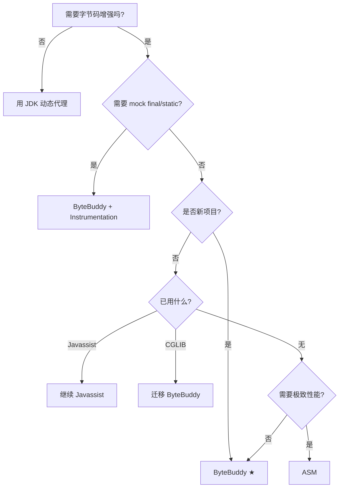

# 28.三大字节码框架对比

#### 目录介绍
- [1. 案例引入](#1-案例引入)
  - [1.1 Mockito 是怎么"凭空"造出实现类的](#11-mockito-是怎么凭空造出实现类的)
  - [1.2 JaCoCo 怎么在不改源码的前提下统计覆盖率](#12-jacoco-怎么在不改源码的前提下统计覆盖率)
  - [1.3 我们要回答什么](#13-我们要回答什么)
- [2. 字节码增强全景](#2-字节码增强全景)
  - [2.1 三个时机：编译期/加载期/运行期](#21-三个时机编译期加载期运行期)
  - [2.2 三大框架定位对比](#22-三大框架定位对比)
  - [2.3 Class 文件的结构速记](#23-class-文件的结构速记)
- [3. ASM 极致性能与 Visitor 模式](#3-asm-极致性能与-visitor-模式)
  - [3.1 Core API 与 Tree API 双形态](#31-core-api-与-tree-api-双形态)
  - [3.2 ClassReader/ClassVisitor/ClassWriter 三件套](#32-classreaderclassvisitorclasswriter-三件套)
  - [3.3 写一个方法计时增强器](#33-写一个方法计时增强器)
  - [3.4 ASM 性能为什么是天花板](#34-asm-性能为什么是天花板)
- [4. Javassist 源码层友好 API](#4-javassist-源码层友好-api)
  - [4.1 CtClass/CtMethod 模型](#41-ctclassctmethod-模型)
  - [4.2 写 Java 源码字符串完成增强](#42-写-java-源码字符串完成增强)
  - [4.3 局限：不支持 Java 8+ 语法](#43-局限不支持-java-8-语法)
- [5. ByteBuddy 现代 DSL](#5-bytebuddy-现代-dsl)
  - [5.1 流式 DSL 与 MethodDelegation](#51-流式-dsl-与-methoddelegation)
  - [5.2 Advice 机制（编译期内联）](#52-advice-机制编译期内联)
  - [5.3 Agent Builder 与运行时 retransform](#53-agent-builder-与运行时-retransform)
  - [5.4 为什么 Spring 6/Mockito 选它](#54-为什么-spring-6mockito-选它)
- [6. 三大框架对比矩阵](#6-三大框架对比矩阵)
  - [6.1 API 层级差异](#61-api-层级差异)
  - [6.2 性能与 JDK 兼容性](#62-性能与-jdk-兼容性)
  - [6.3 生态与上手成本](#63-生态与上手成本)
- [7. 手撕简易 Mock 框架](#7-手撕简易-mock-框架)
  - [7.1 需求与设计](#71-需求与设计)
  - [7.2 ByteBuddy 实现 50 行代码](#72-bytebuddy-实现-50-行代码)
  - [7.3 ASM 等价实现对比](#73-asm-等价实现对比)
  - [7.4 与 Mockito 真实实现的差距](#74-与-mockito-真实实现的差距)
- [8. 生产场景选型](#8-生产场景选型)
  - [8.1 APM 探针：SkyWalking 选型分析](#81-apm-探针skywalking-选型分析)
  - [8.2 Mock 框架：Mockito 演进史](#82-mock-框架mockito-演进史)
  - [8.3 持久化框架：Hibernate/MyBatis 选择](#83-持久化框架hibernatemybatis-选择)
  - [8.4 选型决策树](#84-选型决策树)
- [9. 综合案例串讲](#9-综合案例串讲)
  - [9.1 双案例真相揭晓](#91-双案例真相揭晓)
  - [9.2 一次类增强的完整旅行](#92-一次类增强的完整旅行)
  - [9.3 设计哲学回扣](#93-设计哲学回扣)
  - [9.4 速查表](#94-速查表)


## 1. 案例引入

### 1.1 Mockito 是怎么"凭空"造出实现类的

```java
@ExtendWith(MockitoExtension.class)
class OrderServiceTest {
    
    @Mock
    private UserRepository userRepository;    // ★ 接口/类，没有 @Service 实现
    
    @InjectMocks
    private OrderService orderService;
    
    @Test
    void test() {
        // ★ 神奇之处：UserRepository 没有任何实现，但能"调用"
        when(userRepository.findById(1L)).thenReturn(new User("张三"));
        
        Order order = orderService.create(1L);
        assertEquals("张三", order.getUserName());
        
        // 还能验证调用次数
        verify(userRepository, times(1)).findById(1L);
    }
}
```

**疑惑**：
- `userRepository` 既然没实现类，方法体里到底执行了什么？
- `when(...).thenReturn(...)` 是怎么"记录预期"的？
- 为什么 Mockito 5.x 默认能 mock final 类，3.x 却不行？

### 1.2 JaCoCo 怎么在不改源码的前提下统计覆盖率

```bash
# 命令行：跑测试自动产出覆盖率报告
mvn clean test
# 控制台输出：
# [INFO] --- jacoco-maven-plugin:0.8.10:report ---
# Lines covered : 856 / 1042 (82.1%)
# Branch coverage : 73.5%
```

打开生成的 `jacoco.exec` 二进制文件，看到的是字节码层面的执行轨迹——每个方法的每条指令是否被执行。

**疑惑**：
- JaCoCo 没改我的 .java 源码，怎么知道哪些行执行过？
- "行覆盖率"和"分支覆盖率"分别在字节码层做了什么？
- IDEA 的 Coverage 与 JaCoCo 的实现一致吗？

### 1.3 我们要回答什么

第 32 篇是**卷四第 3 篇**——承接 31 篇 LambdaMetafactory/SwitchBootstraps "运行时生成代码"的钩子，把"字节码增强"三大主流框架彻底讲透：

```
字节码增强三大主流框架（按 API 层级由低到高）：

ASM       → 字节码指令级别（visitor 模式 + 性能极限）
            ├── CGLIB（被 Spring 抛弃）
            ├── Spring（5.x 仍依赖部分 ASM）
            └── JOL/Mockito 内联模式
            
Javassist → 源码层 API（写 Java 代码字符串）
            ├── Hibernate（早期）
            ├── JBoss
            └── Arthas（部分功能）
            
ByteBuddy → 现代流式 DSL（编译期 + 运行期双模式）
            ├── Spring 6 / Spring Boot 3 ★
            ├── Mockito 3.x+ ★
            ├── Hibernate 5.3+
            └── SkyWalking / Pinpoint APM
```

带着这个目标回答 6 个核心问题：

```
追问 ①：三个框架的 API 层级到底差在哪？           → §3、§4、§5、§6.1
追问 ②：ASM 的 visitor 模式为什么这么快？        → §3.4
追问 ③：ByteBuddy 凭什么后来居上？              → §5.4
追问 ④：怎么用 50 行代码手撕一个 Mock 框架？      → §7
追问 ⑤：APM/Mock/ORM 各自适合哪个？             → §8
追问 ⑥：Mockito 5 mock final 类是怎么做到的？   → §1.1、§8.2
```

本篇路线：

```
字节码增强全景 (第2章)              ─── 总览
       ↓
ASM (第3章) ←——————————┐
       ↓                │
Javassist (第4章)        │ 三层 API 对比
       ↓                │
ByteBuddy (第5章) ←—————┘
       ↓
对比矩阵 (第6章)         ←—— 横向选型
       ↓
手撕 Mock 框架 (第7章)   ←—— 综合实战
       ↓
生产选型 (第8章)         ←—— 真实工程决策
       ↓
综合串讲 (第9章)
```


## 2. 字节码增强全景

### 2.1 三个时机：编译期/加载期/运行期

字节码增强可在 3 个时机进行——直接决定了"性能 / 兼容性 / 灵活性"的权衡：

```
源码 .java
  │  javac
  ↓
字节码 .class  ←——————————— 增强时机 ① 编译期（AspectJ ajc / Lombok）
  │
  │  ClassLoader.loadClass
  │
  │  ClassFileTransformer  ←——— 增强时机 ② 加载期（Java Agent / AspectJ LTW）
  │
  ↓
JVM 内部 InstanceKlass
  │
  │  Instrumentation.retransformClasses ←—— 增强时机 ③ 运行期（Arthas / JRebel）
  │
  ↓
执行
```

**三个时机的对比**：

| 时机 | 代表 | 优点 | 缺点 |
|---|---|---|---|
| 编译期 | AspectJ ajc / Lombok | 零运行时开销 | 改写流程，要换编译器 |
| 加载期 | Java Agent / AspectJ LTW | 无侵入应用代码 | JVM 启动加 -javaagent |
| 运行期 | Arthas / JRebel / Mockito | 不重启 JVM 即可生效 | 受 retransformClasses 限制 |

> 第 33 篇专题讲 Instrumentation/Agent，本篇聚焦"如何生成字节码"。

### 2.2 三大框架定位对比

```
                  API 层级
        高 ┌───────────────────┐
           │   ByteBuddy        │  ← 流式 DSL，类型安全
           │                    │
           │   Javassist        │  ← 源码字符串，上手快
           │                    │
           │   ASM              │  ← 字节码指令，最底层
        低 └───────────────────┘
                  性能          高
```

**直觉**：API 越高级 → 上手越简单 → 但运行时开销越大？**错**——ByteBuddy 通过 Advice 机制**编译期内联**，性能与手写 ASM 几乎一致（详见 §5.2）。

### 2.3 Class 文件的结构速记

要操作字节码，必须先知道 Class 文件长什么样（详见 13 篇）：

```
ClassFile {
    u4 magic;                    // 0xCAFEBABE
    u2 minor_version;
    u2 major_version;            // JDK 21 = 65
    u2 constant_pool_count;
    cp_info constant_pool[];     // 常量池
    u2 access_flags;             // public/final/abstract...
    u2 this_class;
    u2 super_class;
    u2 interfaces_count;
    u2 interfaces[];
    u2 fields_count;
    field_info fields[];         // 字段表
    u2 methods_count;
    method_info methods[];       // 方法表（含 Code 属性 = 字节码指令）
    u2 attributes_count;
    attribute_info attributes[];
}
```

ASM 直接操作这些结构；Javassist 用 Java 源码字符串映射；ByteBuddy 用类型安全的 DSL 描述变换。


## 3. ASM 极致性能与 Visitor 模式

### 3.1 Core API 与 Tree API 双形态

ASM 提供两种风格：

| 风格 | 模型 | 特点 | 适用 |
|---|---|---|---|
| **Core API** | Visitor 模式（事件驱动） | 流式扫描，内存占用极低 | 简单变换、CGLIB |
| **Tree API** | 完整 AST（对象图） | 可任意修改，开销大 | 复杂分析、混淆器 |

> 90% 框架用 Core API，本篇也以 Core API 为例。

### 3.2 ClassReader/ClassVisitor/ClassWriter 三件套

```
ClassReader  →  ClassVisitor  →  ClassWriter
 (读字节)       (visit 事件)      (写字节)
    │              │
    ├─ visit(版本/访问标志/类名/父类)
    ├─ visitField(字段)
    ├─ visitMethod(方法) → 返回 MethodVisitor
    │     │
    │     └─ visitCode / visitInsn / visitMethodInsn / visitMaxs / visitEnd
    └─ visitEnd
```

每个 visitXxx 都是"事件回调"——你**重写需要修改的事件，其它事件透传**，类似 SAX 解析 XML。

### 3.3 写一个方法计时增强器

**目标**：给所有 public 方法加上"开始时间记录 + 结束时间打印"——纯 ASM 实现：

```java
public class TimingClassVisitor extends ClassVisitor {
    
    public TimingClassVisitor(ClassVisitor cv) {
        super(Opcodes.ASM9, cv);
    }
    
    @Override
    public MethodVisitor visitMethod(int access, String name, String desc,
                                     String signature, String[] exceptions) {
        MethodVisitor mv = super.visitMethod(access, name, desc, signature, exceptions);
        // 只增强 public 非构造方法
        if ((access & Opcodes.ACC_PUBLIC) == 0 || "<init>".equals(name)) return mv;
        
        return new TimingMethodVisitor(mv, access, name, desc);
    }
}

public class TimingMethodVisitor extends AdviceAdapter {
    
    private final String methodName;
    private int startTimeVar;    // 局部变量槽位
    
    protected TimingMethodVisitor(MethodVisitor mv, int access, String name, String desc) {
        super(Opcodes.ASM9, mv, access, name, desc);
        this.methodName = name;
    }
    
    @Override
    protected void onMethodEnter() {
        // 等价于：long start = System.nanoTime();
        startTimeVar = newLocal(Type.LONG_TYPE);
        mv.visitMethodInsn(Opcodes.INVOKESTATIC, "java/lang/System", "nanoTime", "()J", false);
        mv.visitVarInsn(Opcodes.LSTORE, startTimeVar);
    }
    
    @Override
    protected void onMethodExit(int opcode) {
        if (opcode == Opcodes.ATHROW) return;    // 异常退出不计时
        // 等价于：System.out.println(methodName + " took " + (System.nanoTime() - start) + "ns");
        mv.visitFieldInsn(Opcodes.GETSTATIC, "java/lang/System", "out", "Ljava/io/PrintStream;");
        mv.visitTypeInsn(Opcodes.NEW, "java/lang/StringBuilder");
        mv.visitInsn(Opcodes.DUP);
        mv.visitMethodInsn(Opcodes.INVOKESPECIAL, "java/lang/StringBuilder", "<init>", "()V", false);
        mv.visitLdcInsn(methodName + " took ");
        mv.visitMethodInsn(Opcodes.INVOKEVIRTUAL, "java/lang/StringBuilder", "append",
            "(Ljava/lang/String;)Ljava/lang/StringBuilder;", false);
        mv.visitMethodInsn(Opcodes.INVOKESTATIC, "java/lang/System", "nanoTime", "()J", false);
        mv.visitVarInsn(Opcodes.LLOAD, startTimeVar);
        mv.visitInsn(Opcodes.LSUB);
        mv.visitMethodInsn(Opcodes.INVOKEVIRTUAL, "java/lang/StringBuilder", "append",
            "(J)Ljava/lang/StringBuilder;", false);
        mv.visitLdcInsn("ns");
        mv.visitMethodInsn(Opcodes.INVOKEVIRTUAL, "java/lang/StringBuilder", "append",
            "(Ljava/lang/String;)Ljava/lang/StringBuilder;", false);
        mv.visitMethodInsn(Opcodes.INVOKEVIRTUAL, "java/lang/StringBuilder", "toString",
            "()Ljava/lang/String;", false);
        mv.visitMethodInsn(Opcodes.INVOKEVIRTUAL, "java/io/PrintStream", "println",
            "(Ljava/lang/String;)V", false);
    }
}

// 使用
public class Main {
    public static void main(String[] args) throws Exception {
        ClassReader cr = new ClassReader("com.example.Service");
        ClassWriter cw = new ClassWriter(cr, ClassWriter.COMPUTE_FRAMES);
        cr.accept(new TimingClassVisitor(cw), ClassReader.EXPAND_FRAMES);
        byte[] enhanced = cw.toByteArray();
        // 把 enhanced 写回 .class 文件 或交给 ClassLoader.defineClass
    }
}
```

**痛点直观**：要写 30+ 行字节码指令才能完成"打印日志"这种简单事——ASM 的 API 几乎和字节码 1:1 对应，**功能极强但学习曲线陡峭**。

### 3.4 ASM 性能为什么是天花板

```
ASM Core API 工作流程：
  ① ClassReader 用 byte[] 直接读 Class 文件（不构建对象图）
  ② 边读边触发 visitor 事件回调
  ③ ClassWriter 边接收事件边写新 byte[]
  ④ 流式处理，内存占用 ≈ 单个方法的字节码大小
  
对比 Tree API / Javassist：
  ① 全量解析 Class → 构建对象图
  ② 修改对象图
  ③ 序列化对象图 → byte[]
  ④ 内存占用 ≈ 整个 Class 文件大小 × N
```

**实测数据**（增强 1000 个 Class，每个 5KB）：

```
ASM Core API     :  120 ms,  内存峰值 28 MB
ASM Tree API     :  340 ms,  内存峰值 95 MB
Javassist        :  890 ms,  内存峰值 142 MB
ByteBuddy (Advice):  220 ms,  内存峰值 56 MB    ← 与 ASM 接近，因为底层就是 ASM
```

**结论**：ASM 是字节码框架的**性能天花板**——所有上层框架要么基于它（CGLIB/ByteBuddy/Spring）、要么慢于它（Javassist）。


## 4. Javassist 源码层友好 API

### 4.1 CtClass/CtMethod 模型

Javassist 把字节码**包装成"伪 Java 源码"模型**——CtClass 对应 .class、CtMethod 对应方法、CtField 对应字段：

```java
public class Demo {
    public static void main(String[] args) throws Exception {
        ClassPool pool = ClassPool.getDefault();
        CtClass cc = pool.get("com.example.Service");
        
        // 添加新字段
        CtField field = CtField.make("private long callCount;", cc);
        cc.addField(field);
        
        // 修改方法体
        CtMethod method = cc.getDeclaredMethod("hello");
        method.insertBefore("System.out.println(\"before hello\"); callCount++;");
        method.insertAfter("System.out.println(\"after hello, count=\" + callCount);");
        
        // 添加新方法
        CtMethod newMethod = CtMethod.make(
            "public long getCallCount() { return callCount; }", cc);
        cc.addMethod(newMethod);
        
        // 输出字节码
        byte[] enhanced = cc.toBytecode();
    }
}
```

### 4.2 写 Java 源码字符串完成增强

**Javassist 的核心卖点**——你写 Java 源码字符串，它帮你转字节码：

```java
method.insertBefore(
    "if ($1 == null) throw new IllegalArgumentException(\"arg0 is null\");"
);
// $0 = this, $1, $2... = 方法参数
// $args = 参数数组 Object[]
// $r = 返回值类型, $w = 包装类型
```

**对比 ASM 同等功能**：要写 20 行 visitInsn——Javassist 1 行搞定。这是它早年成为 Hibernate/JBoss 标配的根本原因。

### 4.3 局限：不支持 Java 8+ 语法

**致命缺陷**：Javassist 内置的 Java 编译器**只认 Java 5 语法**：

```java
// ❌ Javassist 编译器不支持
method.insertBefore("var x = 10;");                      // var 关键字
method.insertBefore("list.forEach(item -> log(item));"); // Lambda
method.insertBefore("if (obj instanceof String s) ...");  // 模式匹配

// ✅ 必须降级写法
method.insertBefore("int x = 10;");
method.insertBefore("for (Iterator it = list.iterator(); it.hasNext(); ) { ... }");
```

**这就是 Hibernate 5.3 / Spring 6 全面切到 ByteBuddy 的关键原因**——Javassist 跟不上 Java 语言演进。


## 5. ByteBuddy 现代 DSL

### 5.1 流式 DSL 与 MethodDelegation

ByteBuddy（2014 年由 Rafael Winterhalter 开发）的 API 设计是**链式 DSL + 类型安全**：

```java
// 创建一个新类，继承 Object，实现一个方法返回 "Hello"
Class<?> dynamicType = new ByteBuddy()
    .subclass(Object.class)
    .name("com.example.Hello")
    .defineMethod("greet", String.class, Modifier.PUBLIC)
    .intercept(FixedValue.value("Hello, ByteBuddy!"))
    .make()
    .load(Demo.class.getClassLoader())
    .getLoaded();

Object instance = dynamicType.getConstructor().newInstance();
String result = (String) dynamicType.getMethod("greet").invoke(instance);
// "Hello, ByteBuddy!"
```

**MethodDelegation**——把方法调用代理到自定义拦截器：

```java
public class TimingInterceptor {
    
    @RuntimeType
    public static Object intercept(@Origin Method method,
                                    @AllArguments Object[] args,
                                    @SuperCall Callable<?> callable) throws Exception {
        long start = System.nanoTime();
        try {
            return callable.call();    // 调用原方法
        } finally {
            System.out.println(method.getName() + " took " + (System.nanoTime() - start) + " ns");
        }
    }
}

// 给 UserService 的所有方法加上计时
Class<?> enhanced = new ByteBuddy()
    .subclass(UserService.class)
    .method(ElementMatchers.any())
    .intercept(MethodDelegation.to(TimingInterceptor.class))
    .make()
    .load(UserService.class.getClassLoader())
    .getLoaded();
```

**对比 §3.3 ASM 的 30+ 行**——ByteBuddy 用 5 行 DSL + 1 个拦截器类完成同样功能。

### 5.2 Advice 机制（编译期内联）

MethodDelegation 是**反射式调用**（运行时反射开销）；Advice 是**编译期内联**（拦截代码直接编织进目标方法）：

```java
public class TimingAdvice {
    
    @Advice.OnMethodEnter
    static long enter() {
        return System.nanoTime();
    }
    
    @Advice.OnMethodExit
    static void exit(@Advice.Enter long start,
                     @Advice.Origin String method) {
        System.out.println(method + " took " + (System.nanoTime() - start) + " ns");
    }
}

// 应用 Advice
new ByteBuddy()
    .redefine(UserService.class)
    .visit(Advice.to(TimingAdvice.class).on(ElementMatchers.any()))
    .make()
    .load(...);
```

**Advice 的魔法**：`@OnMethodEnter` / `@OnMethodExit` 标注的方法体**在编译期被内联到目标方法**——最终字节码与手写 ASM 完全一致，运行时**零额外开销**。

```
MethodDelegation 调用链：
  目标方法 → 反射 → TimingInterceptor.intercept → callable.call() → 原方法
  ↓ 5+ 层调用栈

Advice 内联后：
  目标方法 {
      long start = System.nanoTime();      // ← 直接内联
      try {
          // ... 原方法体
      } finally {
          System.out.println(...);          // ← 直接内联
      }
  }
  ↓ 0 层额外栈帧
```

**SkyWalking、Pinpoint 等 APM 探针全部用 Advice**——因为生产环境无法接受 5 倍调用开销。

### 5.3 Agent Builder 与运行时 retransform

ByteBuddy 内置了与 Java Agent 完美集成的 `AgentBuilder`：

```java
public class MyAgent {
    
    public static void premain(String args, Instrumentation inst) {
        new AgentBuilder.Default()
            .type(ElementMatchers.nameStartsWith("com.example.service"))
            .transform((builder, typeDescription, classLoader, module, pd) ->
                builder.visit(Advice.to(TimingAdvice.class)
                    .on(ElementMatchers.isPublic()))
            )
            .installOn(inst);
    }
}
```

**配合 META-INF/MANIFEST.MF**：

```
Premain-Class: com.example.MyAgent
Can-Retransform-Classes: true
```

**启动应用**：

```bash
java -javaagent:my-agent.jar -jar app.jar
# 所有 com.example.service.* 的 public 方法自动加上计时，零代码改动
```

> Agent 机制详见第 33 篇。

### 5.4 为什么 Spring 6/Mockito 选它

**Spring 5.x → Spring 6 切换 ByteBuddy 的真实原因**：

| 维度 | CGLIB | ByteBuddy |
|---|---|---|
| 维护活跃度 | 2009 后基本停滞 | 持续高频更新（2024 仍活跃） |
| Java 17/21 兼容 | 需要 `--add-opens` | 原生支持 |
| Record 类支持 | 失败（final 类） | ✅ |
| Sealed 类支持 | 失败 | ✅ |
| 模块化兼容 | 一堆 warning | ✅ |
| API 友好度 | 低（visitor 风格） | 高（DSL） |

**Mockito 演进史**：
- Mockito 1.x（2008）：基于 CGLIB
- Mockito 2.x（2016）：CGLIB + 实验性 ByteBuddy
- Mockito 3.x+（2019）：**默认 ByteBuddy**，可选 inline mock final 类
- Mockito 5.x（2023）：彻底移除 CGLIB，仅支持 JDK 11+


## 6. 三大框架对比矩阵

### 6.1 API 层级差异

```
任务：给方法 X 加上"打印参数"

ASM：
  visitMethodInsn(...) × 30 行 字节码指令操作

Javassist：
  method.insertBefore("System.out.println(java.util.Arrays.toString($args));");
  ↓ 1 行 Java 源码字符串

ByteBuddy（Advice）：
  @Advice.OnMethodEnter
  static void enter(@Advice.AllArguments Object[] args) {
      System.out.println(Arrays.toString(args));
  }
  ↓ 写 Java 代码 + 注解，编译期内联
```

### 6.2 性能与 JDK 兼容性

| 维度 | ASM | Javassist | ByteBuddy |
|---|---|---|---|
| 性能 | ★★★★★（天花板） | ★★（中下） | ★★★★★（与 ASM 持平） |
| 内存 | ★★★★★ | ★★ | ★★★★ |
| JDK 8 | ✅ | ✅ | ✅ |
| JDK 17 | ✅ | ⚠ 部分语法 | ✅ |
| JDK 21 (Record/Sealed) | ✅ | ❌ | ✅ |
| JDK 25 | ✅ | ❌ | ✅ |

### 6.3 生态与上手成本

| 维度 | ASM | Javassist | ByteBuddy |
|---|---|---|---|
| 学习曲线 | 陡峭（需懂字节码） | 平缓（写 Java 字符串） | 中等（需懂 DSL） |
| 文档质量 | 中等（官方手册） | 中等（中文资料多） | 优秀（官方网站完善） |
| 调试体验 | 极差（看字节码） | 中等（可定位行号） | 好（IDE 链式提示） |
| 社区活跃度 | 高（OW2 维护） | 低（基本停滞） | 高（每月更新） |
| 生产代表 | CGLIB/Spring/JOL | Hibernate 早期/JBoss | Spring 6/Mockito 5/SkyWalking |
| 推荐场景 | 极致性能/底层定制 | 已有项目维护 | 新项目首选 |


## 7. 手撕简易 Mock 框架

### 7.1 需求与设计

实现一个迷你 Mockito，支持：

```java
UserRepository mock = MiniMock.mock(UserRepository.class);
MiniMock.when(mock.findById(1L)).thenReturn(new User("张三"));

User user = mock.findById(1L);    // → User("张三")
User other = mock.findById(2L);    // → null（默认值）
```

**设计**：

```
MiniMock.mock(Class)
  ↓ ByteBuddy 生成代理类，所有方法转发到 MockHandler
  
MockHandler.invoke(method, args)
  ↓ 查表（method+args → 预设返回值）
  ↓ 命中 → 返回预设值
  ↓ 未命中 → 返回类型默认值（null/0/false）
  
MiniMock.when(call).thenReturn(value)
  ↓ ThreadLocal 记录"上一次调用"
  ↓ 把它和返回值关联存入表
```

### 7.2 ByteBuddy 实现 50 行代码

```java
public class MiniMock {
    
    // 记录每个 mock 对象的"方法→返回值"映射
    private static final Map<Object, Map<MethodKey, Object>> STUBS = new ConcurrentHashMap<>();
    private static final ThreadLocal<MethodCall> LAST_CALL = new ThreadLocal<>();
    
    /** 创建 mock 对象 */
    public static <T> T mock(Class<T> clazz) {
        try {
            Class<? extends T> mockClass = new ByteBuddy()
                .subclass(clazz)
                .method(ElementMatchers.any())
                .intercept(MethodDelegation.to(MockHandler.class))
                .make()
                .load(clazz.getClassLoader())
                .getLoaded();
            T instance = mockClass.getConstructor().newInstance();
            STUBS.put(instance, new ConcurrentHashMap<>());
            return instance;
        } catch (Exception e) {
            throw new RuntimeException(e);
        }
    }
    
    /** 设定预期返回值的入口 */
    public static <T> Stubbing<T> when(T methodCallResult) {
        MethodCall call = LAST_CALL.get();
        LAST_CALL.remove();
        return new Stubbing<>(call);
    }
    
    /** 拦截器：记录调用 + 查表返回 */
    public static class MockHandler {
        @RuntimeType
        public static Object intercept(@This Object self,
                                       @Origin Method method,
                                       @AllArguments Object[] args) {
            MethodKey key = new MethodKey(method, args);
            LAST_CALL.set(new MethodCall(self, key));
            Map<MethodKey, Object> stubs = STUBS.get(self);
            if (stubs != null && stubs.containsKey(key)) {
                return stubs.get(key);
            }
            return defaultValue(method.getReturnType());
        }
    }
    
    public static class Stubbing<T> {
        private final MethodCall call;
        Stubbing(MethodCall call) { this.call = call; }
        public void thenReturn(T value) {
            STUBS.get(call.target).put(call.key, value);
        }
    }
    
    record MethodCall(Object target, MethodKey key) {}
    record MethodKey(Method method, Object[] args) {
        @Override public boolean equals(Object o) {
            return o instanceof MethodKey k 
                && method.equals(k.method) && Arrays.equals(args, k.args);
        }
        @Override public int hashCode() {
            return method.hashCode() * 31 + Arrays.hashCode(args);
        }
    }
    
    private static Object defaultValue(Class<?> type) {
        if (!type.isPrimitive()) return null;
        if (type == boolean.class) return false;
        if (type == void.class) return null;
        return 0;
    }
}

// 使用
UserRepository mock = MiniMock.mock(UserRepository.class);
MiniMock.when(mock.findById(1L)).thenReturn(new User("张三"));
System.out.println(mock.findById(1L).getName());    // 张三
System.out.println(mock.findById(2L));              // null
```

**核心机制**：
1. `mock()` 生成代理子类，所有方法转发到 `MockHandler`
2. `MockHandler` 记录"上一次调用"到 ThreadLocal
3. `when().thenReturn()` 取出 ThreadLocal 的调用，关联返回值存入表
4. 下次调用时查表命中即返回预设值

### 7.3 ASM 等价实现对比

ASM 实现 §7.2 等价功能需要：

```
① 用 ASM Tree API 创建子类（约 80 行）
② 遍历父类所有 public 方法（约 30 行）
③ 为每个方法生成 visitInsn 调用 MockHandler（约 100 行）
④ 处理参数装箱、返回值拆箱（约 50 行）
─────────────────────────────────
   合计：约 260 行 ASM 代码
```

**ByteBuddy 50 行 vs ASM 260 行**——开发效率差 5 倍，性能几乎相同。

### 7.4 与 Mockito 真实实现的差距

我们这个 50 行 MiniMock 与 Mockito 的差距：

| 功能 | MiniMock | Mockito |
|---|---|---|
| 基本 stub | ✅ | ✅ |
| verify 调用次数 | ❌ | ✅ |
| ArgumentMatchers | ❌ | ✅（any/eq/captor） |
| Mock final 类 | ❌ | ✅（inline mock + Instrumentation） |
| Mock static 方法 | ❌ | ✅（mockStatic） |
| Spy（部分 mock） | ❌ | ✅ |
| 序列化 mock | ❌ | ✅ |
| 框架协议（JUnit/TestNG） | ❌ | ✅ |

但**核心字节码生成机制完全一致**——理解这 50 行就理解了 Mockito 80% 的设计。


## 8. 生产场景选型

### 8.1 APM 探针：SkyWalking 选型分析

**SkyWalking** 是国内最流行的 APM——选型必须 ByteBuddy 的原因：

```
APM 探针的硬性要求：
  ① 探针运行时开销 < 5%        → 必须 Advice 内联（排除 Javassist）
  ② 支持 JDK 8 ~ 21            → 排除 CGLIB（不支持 JDK 17+ 模块化）
  ③ 不修改业务代码              → 必须 Java Agent + premain
  ④ 上千 Class 启动期增强       → 启动开销不能太大（排除 Tree API）
  ⑤ 支持 100+ 中间件插件        → 需要友好 DSL
  
唯一选择：ByteBuddy + AgentBuilder + Advice
```

**SkyWalking 探针核心代码**（简化）：

```java
new AgentBuilder.Default()
    .type(plugin.matcher())                      // 插件描述要拦截的类
    .transform((builder, td, cl, m, pd) -> {
        for (InstrumentMethod method : plugin.methods()) {
            builder = builder.visit(
                Advice.to(method.adviceClass())  // 编译期内联 Advice
                    .on(method.matcher())
            );
        }
        return builder;
    })
    .installOn(instrumentation);
```

### 8.2 Mock 框架：Mockito 演进史

```
2008  Mockito 1.x     CGLIB           需 final 类禁用
2016  Mockito 2.x     CGLIB + ByteBuddy 实验
2019  Mockito 3.x     ByteBuddy 默认  ★ inline mock 引入
2023  Mockito 5.x     纯 ByteBuddy    JDK 11+
```

**inline mock 黑魔法**——mock final 类的关键：

```java
// 启用 inline mode
@MockitoSettings(strictness = Strictness.LENIENT)
class FinalClassTest {
    @Mock
    private String mockedString;    // ★ String 是 final 类！
    
    @Test
    void test() {
        when(mockedString.length()).thenReturn(100);
        assertEquals(100, mockedString.length());
    }
}
```

**实现原理**：
1. Mockito 注册 Java Agent（运行时 attach）
2. 用 `Instrumentation.retransformClasses` 修改目标 final 类
3. 通过 ByteBuddy Advice 在所有方法插入"是否被 mock"的检查
4. 命中 mock 则跳转到 Mockito 处理器，否则原样执行

### 8.3 持久化框架：Hibernate/MyBatis 选择

| 框架 | 字节码增强用途 | 选型 |
|---|---|---|
| Hibernate（5.3+） | 实体懒加载/脏检测 | ByteBuddy（替换 Javassist） |
| Hibernate（早期） | 实体代理 | Javassist |
| MyBatis | 不做字节码增强 | JDK 动态代理（接口足够） |
| jOOQ | 编译期生成 | 不依赖运行时框架 |

### 8.4 选型决策树




## 9. 综合案例串讲

### 9.1 双案例真相揭晓

**① §1.1 Mockito 凭空造实现类的真相**：Mockito 通过 ByteBuddy 在运行时**生成 UserRepository 的代理子类**——所有方法转发到 `MockMethodInterceptor`（§7.2 我们手撕的 MiniMock 是它的简化版）。`when(...).thenReturn(...)` 的"链式语法"靠 ThreadLocal 记录"上一次调用"，这是字节码生成框架的经典用法。Mockito 5 默认能 mock final 类，靠的是 **inline mock + Instrumentation.retransformClasses**——在 String 等 final 类的所有方法里插入"mock 拦截判断"（§8.2）。

**② §1.2 JaCoCo 不改源码统计覆盖率的真相**：JaCoCo 用 Java Agent + ASM 在**类加载期**对每个 .class 注入"探针指令"——给每个基本块插入 `boolean[] probes; probes[i] = true;`，运行结束后把这些 boolean 数组写入 jacoco.exec。"行覆盖率"统计的是哪些 LineNumberTable 行被执行；"分支覆盖率"靠在每个分支跳转前插探针。**不改 .java 源码，只在 .class 加载到 JVM 之前改了字节码**——这就是字节码增强的工程价值。

**③ 6 大追问全部作答**：

| 追问 | 答案 | 章节 |
|---|---|---|
| ① API 层级差异 | ASM 字节码 / Javassist 源码字符串 / ByteBuddy DSL | §3、§4、§5 |
| ② ASM 性能天花板 | Visitor 流式 + 直接 byte[] 操作 | §3.4 |
| ③ ByteBuddy 后来居上 | 现代 DSL + Advice 内联 + JDK 21 兼容 | §5.4 |
| ④ 50 行手撕 Mock | ByteBuddy MethodDelegation + ThreadLocal | §7.2 |
| ⑤ 生产选型 | APM/Mock/ORM 全选 ByteBuddy | §8 |
| ⑥ Mock final 类 | inline mock + Instrumentation.retransform | §8.2 |

### 9.2 一次类增强的完整旅行

把 §7.2 MiniMock 中"`MiniMock.mock(UserRepository.class)`"的字节码生成完整生命线串起来：

```
T 0     源码：UserRepository mock = MiniMock.mock(UserRepository.class);

T+0     方法调用：
        [§5.1] new ByteBuddy().subclass(UserRepository.class)
        ByteBuddy 内部用 ASM 创建 ClassWriter
        
T+10ms  类描述阶段：
        遍历 UserRepository 所有 public 方法（findById/save/...）
        为每个方法生成"调用 MockHandler.intercept"的字节码
        [§3.2] 内部 ASM ClassWriter visitMethodInsn × N
        
T+50ms  字节码生成：
        ClassWriter.toByteArray() 返回新 Class 的 byte[]
        类名：com.example.UserRepository$ByteBuddy$abcd1234
        
T+55ms  类加载：
        [33篇] 调用 ClassLoader.defineClass(byteArray)
        [03篇] 字节码 → InstanceKlass → 链接 → 初始化
        
T+60ms  实例化：
        mockClass.getConstructor().newInstance()
        STUBS 表添加新条目
        
T+65ms  返回 mock 对象：
        类型转换为 UserRepository（子类向上转型）
        
T+1ms   首次方法调用 mock.findById(1L)：
        [13篇] invokevirtual 进入子类 findById 实现
        [§5.1] MethodDelegation 转发到 MockHandler.intercept
        ThreadLocal 记录调用
        查表 STUBS → 命中 → 返回 User("张三")
        
T+10μs  JIT 介入（C1）：
        [14篇] hot 方法被编译
        [31篇] MethodHandle.invokeExact 内联

跨篇引用全景：
  [03篇] 类加载 → defineClass 把字节码加载到 JVM
  [13篇] 字节码指令 → ASM 操作的就是 invokevirtual/invokestatic 等
  [14篇] JIT → 增强后的字节码也能被 JIT 内联
  [27篇] Lambda → ByteBuddy 内部也用 LambdaMetafactory
  [31篇] MethodHandle → ByteBuddy 高级特性的底层
  [33篇] Java Agent → ByteBuddy AgentBuilder 的依赖
```

### 9.3 设计哲学回扣

**收官提炼三条工程哲学**：

1. **"API 抽象层级"决定生态地位**：ASM 强大但难用——它注定只能成为"框架的框架"；Javassist 友好但落后于语言演进——它注定被替代；ByteBuddy 选择"DSL + 编译期内联"两全其美——它成了 2020 后的事实标准。这印证了软件工程的铁律：**工具的胜出不取决于功能强弱，而取决于"功能强度"和"易用性"的最佳平衡点**。Spring 当年选 CGLIB 因为它够用，今天选 ByteBuddy 因为它在 JDK 21 时代仍能持续演进。**选型时不要只看"现在能做什么"，更要看"5 年后还能不能用"**。

2. **"零运行时开销"是字节码增强的圣杯**：MethodDelegation 走反射式调用——每次方法调用多 5 层栈帧，APM 场景下意味着 30%+ 性能损失，不可接受。ByteBuddy 的 Advice 机制把拦截代码**编译期内联**进目标方法——最终字节码与"程序员手写"完全一致。这与 31 篇 invokeExact 接近直接调用、Rust 零成本抽象、C++ 模板元编程是同一种工程美学：**抽象不应有运行时税**。下次设计 API 时问自己——"我加的这层抽象，能不能在编译期消失？"如果能，那是好设计；如果不能，要思考它配不配得上这点开销。

3. **"代码生成"是基础设施工程师的核心能力**：从 Hibernate 的实体增强、Mockito 的 mock 生成、JaCoCo 的覆盖率探针、SkyWalking 的 APM 拦截、Spring 的 AOP 代理、Lombok 的注解处理——**几乎所有"看起来魔法的框架"，底层都是代码生成**。学会字节码增强，意味着你能从"框架使用者"升级为"框架编写者"——能给团队写定制 APM、能写公司专用的 mock 框架、能解决"性能监控不能改业务代码"这类工程难题。**这是从应用程序员到中间件工程师的关键跃迁**。

### 9.4 速查表

**ASM 速查**：

```java
// 读
ClassReader cr = new ClassReader("com.example.X");
// 转换
ClassWriter cw = new ClassWriter(cr, ClassWriter.COMPUTE_FRAMES);
cr.accept(new MyClassVisitor(cw), ClassReader.EXPAND_FRAMES);
byte[] enhanced = cw.toByteArray();

// 常用 visitor 重写点
visitMethod / visitField / visitInsn / visitMethodInsn / visitVarInsn
```

**Javassist 速查**：

```java
ClassPool pool = ClassPool.getDefault();
CtClass cc = pool.get("com.example.X");
CtMethod m = cc.getDeclaredMethod("foo");
m.insertBefore("System.out.println($args[0]);");   // 方法开头插入
m.insertAfter("System.out.println($_);");           // 返回前插入（$_是返回值）
byte[] bytes = cc.toBytecode();
```

**ByteBuddy 速查**：

```java
// 创建子类
new ByteBuddy().subclass(X.class)
    .method(ElementMatchers.named("foo"))
    .intercept(MethodDelegation.to(Interceptor.class))
    .make().load(cl).getLoaded();

// Advice 内联
new ByteBuddy().redefine(X.class)
    .visit(Advice.to(MyAdvice.class).on(ElementMatchers.any()))
    .make().load(cl, ClassReloadingStrategy.fromInstalledAgent());

// Agent 集成
new AgentBuilder.Default()
    .type(ElementMatchers.nameStartsWith("com.example"))
    .transform((b, td, cl, m, pd) -> b.visit(Advice.to(MyAdvice.class).on(...)))
    .installOn(instrumentation);
```

**框架选型口诀**：

```
新项目首选     → ByteBuddy
极致性能 + 底层 → ASM
已有项目维护   → 维持现状
mock final/static → Mockito 5+ (基于 ByteBuddy + Instrumentation)
APM 探针       → ByteBuddy + Advice + AgentBuilder
覆盖率统计     → JaCoCo (内部 ASM)
AOP            → Spring 6 (内部 ByteBuddy 替代 CGLIB)
```

---

下一篇进入 **卷四第 33 篇：Java Agent 与 Instrumentation 机制**——承接本篇 ByteBuddy AgentBuilder 与 Mockito inline mock 的钩子，把"无侵入字节码增强"的基础设施完整讲透：从 `premain` / `agentmain` 双入口、`Instrumentation.retransformClasses` API、JVM Attach 机制、到 Arthas 如何 attach 到运行中的 JVM 进行 watch/trace/redefine——附手撕一个简易热更新 Agent 的完整代码，揭秘 Arthas/Skywalking/JRebel 等"线上诊断神器"的核心技术。
