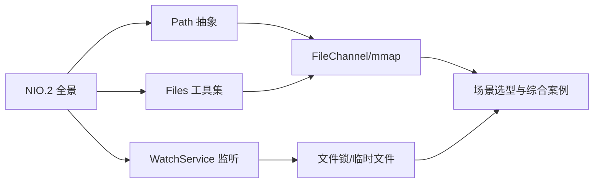
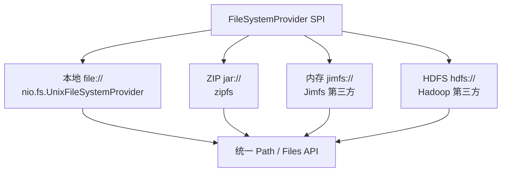
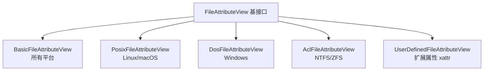
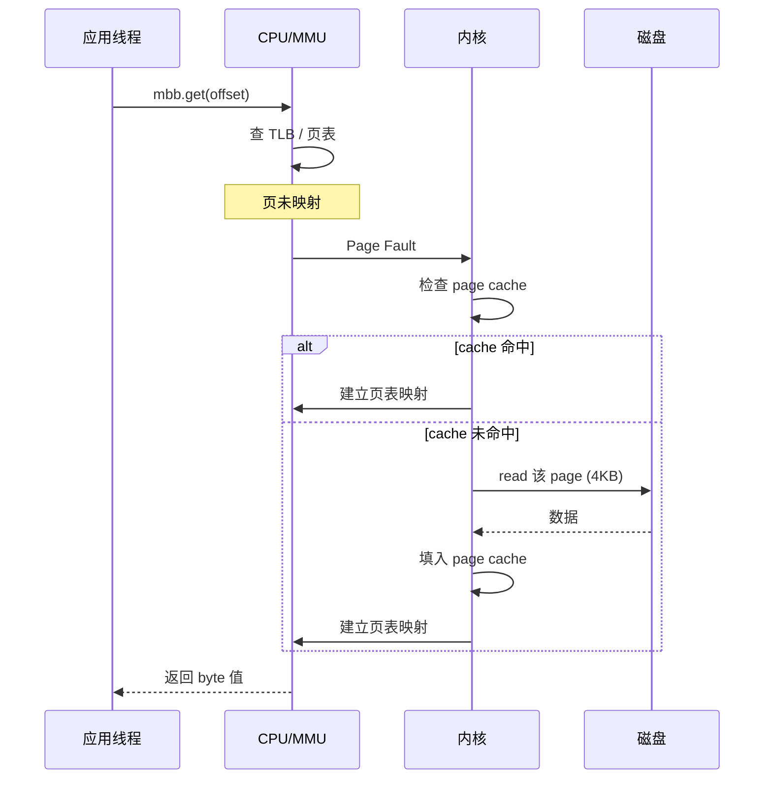
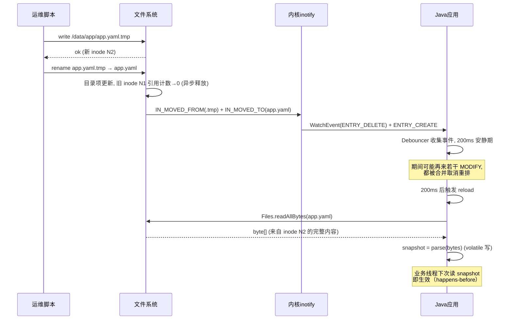

# 43.文件IO与NIO.2

#### 目录介绍
- [1. 案例引入](#1-案例引入)
  - [1.1 一段诡异的代码](#11-一段诡异的代码)
  - [1.2 顺藤摸到根因](#12-顺藤摸到根因)
  - [1.3 我们要回答什么](#13-我们要回答什么)
- [2. 架构概览](#2-架构概览)
  - [2.1 三层API纵剖](#21-三层api纵剖)
  - [2.2 为什么要NIO2](#22-为什么要nio2)
- [3. Path与文件系统](#3-path与文件系统)
  - [3.1 Path对象抽象](#31-path对象抽象)
  - [3.2 FileSystem多态](#32-filesystem多态)
  - [3.3 路径解析规则](#33-路径解析规则)
  - [3.4 与File的取舍](#34-与file的取舍)
- [4. Files工具大全](#4-files工具大全)
  - [4.1 读写四件套](#41-读写四件套)
  - [4.2 复制与移动](#42-复制与移动)
  - [4.3 原子写入秘诀](#43-原子写入秘诀)
  - [4.4 属性视图体系](#44-属性视图体系)
  - [4.5 walk递归遍历](#45-walk递归遍历)
- [5. WatchService原理](#5-watchservice原理)
  - [5.1 三大核心抽象](#51-三大核心抽象)
  - [5.2 inotify底层映射](#52-inotify底层映射)
  - [5.3 事件类型与上下文](#53-事件类型与上下文)
  - [5.4 重复事件去抖](#54-重复事件去抖)
  - [5.5 平台差异坑表](#55-平台差异坑表)
- [6. 内存映射mmap](#6-内存映射mmap)
  - [6.1 FileChannel.map](#61-filechannelmap)
  - [6.2 三种映射模式](#62-三种映射模式)
  - [6.3 缺页中断流程](#63-缺页中断流程)
  - [6.4 大文件分段映射](#64-大文件分段映射)
  - [6.5 Unmap的难题](#65-unmap的难题)
- [7. 文件锁与并发](#7-文件锁与并发)
  - [7.1 进程级文件锁](#71-进程级文件锁)
  - [7.2 共享锁与排他锁](#72-共享锁与排他锁)
  - [7.3 跨进程协调实战](#73-跨进程协调实战)
  - [7.4 锁与映射的陷阱](#74-锁与映射的陷阱)
- [8. 临时文件与清理](#8-临时文件与清理)
  - [8.1 createTempFile](#81-createtempfile)
  - [8.2 DELETE_ON_CLOSE](#82-delete-on-close)
  - [8.3 ShutdownHook清理](#83-shutdownhook清理)
- [9. 真实场景选型](#9-真实场景选型)
  - [9.1 配置热更新](#91-配置热更新)
  - [9.2 日志切割归档](#92-日志切割归档)
  - [9.3 大文件随机读写](#93-大文件随机读写)
  - [9.4 跨进程通信选型](#94-跨进程通信选型)
- [10. 综合案例串讲](#10-综合案例串讲)
  - [10.1 案例真相揭晓](#101-案例真相揭晓)
  - [10.2 一个文件的一生](#102-一个文件的一生)
  - [10.3 设计哲学回扣](#103-设计哲学回扣)
  - [10.4 速查表](#104-速查表)


## 1. 案例引入

### 1.1 一段诡异的代码

线上有个"配置中心降级版"——本地一个 `app.yaml`，运维改完文件，应用进程秒级感知并热更新。逻辑看似平平无奇：

```java
public class ConfigWatcher {

    private static final Path CONFIG = Paths.get("/data/app/app.yaml");
    private volatile Map<String, Object> snapshot;

    public void start() throws IOException {
        snapshot = parse(Files.readAllBytes(CONFIG));

        WatchService ws = FileSystems.getDefault().newWatchService();
        CONFIG.getParent().register(ws,
                StandardWatchEventKinds.ENTRY_MODIFY);

        new Thread(() -> {
            while (true) {
                WatchKey key = ws.take();
                for (WatchEvent<?> ev : key.pollEvents()) {
                    Path changed = (Path) ev.context();
                    if (changed.toString().equals("app.yaml")) {
                        // 重新读取并解析
                        snapshot = parse(Files.readAllBytes(CONFIG));
                        log.info("config reloaded");
                    }
                }
                key.reset();
            }
        }, "cfg-watcher").start();
    }
}
```

**现象 ①**：运维用 `vim` 改了 `app.yaml`，**事件没触发**，应用感知不到。
**现象 ②**：运维改用 `echo > app.yaml` 覆盖，事件触发了，但日志打印 `config reloaded` **三次**，每次解析的内容不一样，第一次甚至解析出空 Map。
**现象 ③**：日志切割脚本 `mv app.log app.log.20240801` 后，应用进程仍然往 `app.log.20240801` 里写日志，新建的 `app.log` 一直是空的。

三个问题搅在一起，业务侧第二天早上看监控才发现配置没生效。

### 1.2 顺藤摸到根因

我们逐条复盘：

- **现象 ①**——`vim` 修改文件并不是原地写，而是先写 `.app.yaml.swp` → `:wq` 时把临时文件 `rename` 成 `app.yaml`，旧的 inode 直接被替换。**ENTRY_MODIFY** 监听的是同一个 inode 上的写入事件，rename 触发的是 `ENTRY_DELETE` + `ENTRY_CREATE`。
- **现象 ②**——`echo > app.yaml` 是先 `truncate(0)` 再 `write`，文件系统层面是**两次写**，inotify 上报两个 `IN_MODIFY` 事件；加上保存动作可能再触发一次 `IN_CLOSE_WRITE`，于是回调跑了 3 次。第一次读到的是被 truncate 后还没写回的**空文件**。
- **现象 ③**——Linux 上文件描述符指向的是 inode 而不是路径，`mv` 之后 fd 还连着旧 inode，应用继续往旧 inode 写。这就是为什么所有日志框架都得提供 `reopen` 钩子（logrotate 的 `copytruncate` 与 `create+postrotate` 区别也在这）。

把这些原理串起来，至少藏着 7 个 NIO.2 知识点：

```
① ENTRY_MODIFY 到底监听的是什么内核事件?            → 第5章
② 为什么 vim 编辑触发不了 ENTRY_MODIFY?              → 第5章
③ 为什么一次保存能触发 2~3 次事件?                   → 第5章
④ 怎么读一个"正在被写"的文件才能拿到完整快照?       → 第4章「原子写入」
⑤ Files.readAllBytes 和 FileChannel.read 哪个更快? → 第6章
⑥ 大文件随机读怎么不加载到堆里?                     → 第6章「mmap」
⑦ 为什么 mv 之后旧 fd 还能写?inode 与路径的关系?    → 第7、9章
```

### 1.3 我们要回答什么

这个事故就是本篇主线。我们沿着 NIO.2 的三大支柱——**Path 抽象、Files 工具集、WatchService 监听**——往下走，再加上 mmap、文件锁两个底层武器，最终在第 10 章把 7 个问号一个一个解开。

本篇路线：



## 2. 架构概览

### 2.1 三层API纵剖

Java 文件 IO 共有三代 API，**至今同时存活**，写代码时要清楚自己站在哪一层：

```
┌────────────────────────────────────────────────────────────┐
│           应用层  Files.readAllBytes / Path                │  ← NIO.2  (JDK 7+)
├────────────────────────────────────────────────────────────┤
│  通道层  FileChannel.read/write/map/transferTo             │  ← NIO    (JDK 1.4+)
├────────────────────────────────────────────────────────────┤
│  流  层  FileInputStream / FileOutputStream / RandomAccess │  ← IO     (JDK 1.0+)
├────────────────────────────────────────────────────────────┤
│            JNI 层  open / read / write / mmap / close      │  ← 系统调用
└────────────────────────────────────────────────────────────┘
```

**层级映射关系**：

| 维度 | java.io | java.nio (Channel) | java.nio.file (NIO.2) |
|---|---|---|---|
| 路径抽象 | `File` | `File` | `Path` |
| 工具入口 | 自己写循环 | `Channels.newXxx` | `Files.xxx` 50+ 个静态方法 |
| 文件系统 | 只能本地 | 只能本地 | `FileSystem` SPI 可挂 ZIP/Jimfs/HDFS |
| 监听 | 无 | 无 | `WatchService` |
| 异步 | 无 | 半异步（Selector） | `AsynchronousFileChannel` |
| 大文件 | 拷贝 buffer | 直接通道 | `FileChannel.map` 内存映射 |

### 2.2 为什么要NIO2

`java.io.File` 用了快 20 年，问题积重难返：

**疑惑**：`File` 已经能 create/delete/exists 了，为什么 JDK 7 还要重做一遍？

**论证**：

1. **错误吞掉**——`File.delete()` 失败只返回 `false`，**不告诉你为啥**（权限不足？文件不存在？目录不空？被占用？）。NIO.2 的 `Files.delete(path)` 直接抛 `NoSuchFileException` / `DirectoryNotEmptyException` / `AccessDeniedException`。
2. **不支持符号链接**——`File` 只能粗暴跟随符号链接，无法区分 link 本身和 link 指向的文件。NIO.2 提供 `LinkOption.NOFOLLOW_LINKS`。
3. **没有原子操作**——`renameTo` 在 Windows 上跨盘符就失败，且不保证原子性。NIO.2 提供 `Files.move(src, dst, ATOMIC_MOVE)`。
4. **缺少元数据视图**——`File` 只能拿 `lastModified()` 一个时间戳，拿不到 access time、create time、POSIX 权限位、ACL。NIO.2 提供 `BasicFileAttributes` / `PosixFileAttributes` / `DosFileAttributes` / `AclFileAttributeView`。
5. **不可扩展**——`File` 写死本地文件系统。NIO.2 通过 `FileSystemProvider` SPI 让 ZIP、内存文件系统（Jimfs）、HDFS 都能用同一套 `Path` 操作。
6. **没有目录监听**——只能轮询 `lastModified`，开销巨大。NIO.2 提供 `WatchService` 直通 inotify/kqueue/ReadDirectoryChangesW。

**结论**：NIO.2 不是给 NIO 打补丁，是把整个文件系统抽象**重做了一遍**。`File` 仍然存在，但只在历史代码里活着——新代码一律用 `Path`。

## 3. Path与文件系统

### 3.1 Path对象抽象

`Path` 是 NIO.2 的核心入口，本质是一个**路径段序列**，不是真实文件——它甚至可以指向一个**不存在的位置**。

```java
Path p = Paths.get("/data/app/app.yaml");
// 等价于  FileSystems.getDefault().getPath("/data/app/app.yaml")

p.getFileName();      // app.yaml          (Path 类型)
p.getParent();        // /data/app
p.getRoot();          // /                 (Linux) 或 C:\ (Windows)
p.getNameCount();     // 3                 (data, app, app.yaml)
p.getName(0);         // data
p.subpath(0, 2);      // data/app          (左闭右开)
p.normalize();        // 折叠 . 与 ..
p.toAbsolutePath();   // 补全为绝对路径    (不真正访问文件系统)
p.toRealPath();       // 解析符号链接      (会访问文件系统)
```

**关键区分**：

| 方法 | 是否触达文件系统 | 用途 |
|---|---|---|
| `toAbsolutePath()` | ❌ 纯字符串拼接 | 把相对路径补全 |
| `toRealPath()` | ✅ 必须文件存在 | 解析 `..`、符号链接、大小写规范化 |
| `normalize()` | ❌ | 仅做语法折叠 |

### 3.2 FileSystem多态

`Path` 不绑定本地磁盘——它绑定的是 `FileSystem`：

```java
// 默认本地文件系统
FileSystem local = FileSystems.getDefault();

// 把一个 zip 挂载成文件系统！
try (FileSystem zip = FileSystems.newFileSystem(
        URI.create("jar:file:/tmp/a.zip"), Map.of())) {
    Path inside = zip.getPath("/conf/app.yaml");
    String text = Files.readString(inside);
    // 同一套 Files API，零特例代码
}
```

ZIP 挂载是 JDK 自带的 `zipfs.jar` 提供的。这就是 SPI 的威力——`Maven`、`Gradle`、`Spring Boot` 解析 jar 内资源都用这套机制。



### 3.3 路径解析规则

`resolve` 与 `relativize` 是一对常被搞混的方法：

```java
Path base = Paths.get("/data/app");

base.resolve("logs/a.log");        // /data/app/logs/a.log  (拼接)
base.resolve("/etc/passwd");       // /etc/passwd            (绝对路径覆盖!)
base.resolve(Paths.get(""));       // /data/app              (空路径无效果)

Path other = Paths.get("/data/app/logs/a.log");
base.relativize(other);            // logs/a.log             (求相对路径)
```

**疑惑**：为什么 `resolve("/etc/passwd")` 没有报错而是覆盖了 base？

**论证**：JDK 把 `resolve` 设计成"**如果参数是绝对路径，直接返回参数本身**"。这其实贴合 Unix `cd /etc` 的语义——绝对路径自带定位能力。但**它就是**新人写文件路径拼接时最大的注入漏洞来源——用户传入 `../../etc/passwd` 触发的是穿越，而传入 `/etc/passwd` 直接逃出 base 目录。

**结论**：**任何把外部输入拼到 `Path` 的代码，必须**：

```java
Path safe = base.resolve(userInput).normalize();
if (!safe.startsWith(base)) {
    throw new SecurityException("path traversal");
}
```

### 3.4 与File的取舍

| 场景 | 推荐 |
|---|---|
| 新代码 | `Path` |
| 与老 API 互操作 | `path.toFile()` / `file.toPath()` 互转，**零开销** |
| 只判断 exists | `Files.exists(p)` 比 `f.exists()` 慢一点（多一次 stat），但更准确 |
| 跨文件系统 | 必须 `Path`（ZIP/Jimfs） |

## 4. Files工具大全

`Files` 类有 60+ 个静态方法，**绝大部分场景都不需要再写循环**。

### 4.1 读写四件套

```java
// 全量读
byte[]      bs   = Files.readAllBytes(path);
String      str  = Files.readString(path, UTF_8);                 // JDK 11+
List<String> lns = Files.readAllLines(path, UTF_8);

// 流式读 (大文件)
try (Stream<String> s = Files.lines(path, UTF_8)) {               // 必须 try-with-resources!
    s.filter(l -> l.startsWith("ERROR")).forEach(System.out::println);
}
try (BufferedReader r = Files.newBufferedReader(path, UTF_8)) {}

// 全量写
Files.write(path, bs);
Files.writeString(path, str, UTF_8);                              // JDK 11+

// 流式写
try (BufferedWriter w = Files.newBufferedWriter(path, UTF_8,
        CREATE, TRUNCATE_EXISTING)) {
    w.write(line);
}
```

**易错点**：`Files.lines(path)` 返回的 `Stream` 持有打开的文件句柄，**必须 `try-with-resources`**。否则文件句柄泄漏，linux 默认 ulimit 1024，几万条配置就把进程打挂。

### 4.2 复制与移动

```java
// 复制：默认不覆盖、不复制属性、跟随符号链接
Files.copy(src, dst,
        StandardCopyOption.REPLACE_EXISTING,
        StandardCopyOption.COPY_ATTRIBUTES,
        LinkOption.NOFOLLOW_LINKS);

// 移动：可指定原子语义
Files.move(src, dst,
        StandardCopyOption.ATOMIC_MOVE,        // 原子替换 (rename 系统调用)
        StandardCopyOption.REPLACE_EXISTING);
```

| 选项 | 行为 |
|---|---|
| `REPLACE_EXISTING` | 目标存在时覆盖 |
| `COPY_ATTRIBUTES` | 保留 owner/permission/timestamps |
| `ATOMIC_MOVE` | 调用 `rename(2)`，跨文件系统会抛 `AtomicMoveNotSupportedException` |
| `NOFOLLOW_LINKS` | 操作链接本身而非目标 |

`ATOMIC_MOVE` 在同一文件系统内部对应一次 `rename(2)` 系统调用——**单一原子操作**，要么成功要么失败，不存在"半新半旧"的中间态。这是后面"原子写入"的基石。

### 4.3 原子写入秘诀

回到第 1 章现象 ②：直接 `Files.write(CONFIG, newContent)` 会先 truncate 再写，监听端读到空文件。**正确的原子写入模板**：

```java
public static void atomicWrite(Path target, byte[] content) throws IOException {
    Path tmp = target.resolveSibling(target.getFileName() + ".tmp." + ThreadLocalRandom.current().nextLong());
    try {
        Files.write(tmp, content, CREATE, TRUNCATE_EXISTING, WRITE);
        Files.move(tmp, target, ATOMIC_MOVE, REPLACE_EXISTING);   // ★ 一次 rename 替换 inode
    } catch (IOException e) {
        Files.deleteIfExists(tmp);
        throw e;
    }
}
```

**论证**：

1. 监听端永远只看到**完整的旧内容或完整的新内容**，绝不会看到"写到一半"的状态。
2. `rename(2)` 在 POSIX 上保证原子，目录项的更新是单条 inode 操作。
3. 不需要文件锁——读侧用 `Files.readAllBytes` 拿到的就是替换前或替换后的两个 inode 中的一个，互不干扰。

**结论**：**所有"配置/索引/检查点"类的写入，模板就是"写临时 + 原子改名"**。所有数据库的 WAL、Kafka 的 segment、Etcd 的 wal 都是这个套路。

### 4.4 属性视图体系

NIO.2 把文件属性按操作系统能力**分组成视图**：



```java
BasicFileAttributes a = Files.readAttributes(path, BasicFileAttributes.class);
a.creationTime();      // 创建时间   (Linux ext4 才有，ext2/3 没有)
a.lastAccessTime();    // 访问时间   (mount -o noatime 后会失效)
a.lastModifiedTime();
a.size();
a.isRegularFile();
a.isSymbolicLink();
a.fileKey();           // ★ 设备号+inode 唯一标识，跨路径判等

// POSIX 权限
PosixFileAttributes p = Files.readAttributes(path, PosixFileAttributes.class);
p.permissions();       // Set<PosixFilePermission> = {OWNER_READ, OWNER_WRITE, ...}
p.owner();
p.group();
```

**`fileKey()` 的妙用**：判断两个 `Path` 是否指向同一个文件（含硬链接、符号链接），不能用 `equals`，必须比 `fileKey`。

### 4.5 walk递归遍历

```java
// 找出 /data 下所有 100MB 以上的 .log 文件
try (Stream<Path> s = Files.walk(Paths.get("/data"), 5)) {       // maxDepth=5
    s.filter(p -> p.toString().endsWith(".log"))
     .filter(p -> {
         try { return Files.size(p) > 100L * 1024 * 1024; }
         catch (IOException e) { return false; }
     })
     .forEach(System.out::println);
}
```

`Files.walk` 是**深度优先**的懒加载流，遇到不可读的子目录默认会抛 `UncheckedIOException` 打断遍历。生产代码推荐 `Files.walkFileTree(start, visitor)`：

```java
Files.walkFileTree(root, new SimpleFileVisitor<>() {
    @Override public FileVisitResult visitFile(Path file, BasicFileAttributes attr) {
        if (attr.size() > 100 << 20) System.out.println(file);
        return FileVisitResult.CONTINUE;
    }
    @Override public FileVisitResult visitFileFailed(Path file, IOException e) {
        return FileVisitResult.CONTINUE;     // 跳过不可读文件，不打断
    }
});
```

`FileVisitor` 提供了 `preVisitDirectory` / `postVisitDirectory` 两个钩子，**这是实现"删除非空目录"的唯一干净写法**：

```java
Files.walkFileTree(dir, new SimpleFileVisitor<>() {
    @Override public FileVisitResult visitFile(Path f, BasicFileAttributes a) throws IOException {
        Files.delete(f); return CONTINUE;
    }
    @Override public FileVisitResult postVisitDirectory(Path d, IOException e) throws IOException {
        Files.delete(d); return CONTINUE;
    }
});
```

## 5. WatchService原理

### 5.1 三大核心抽象

`WatchService` 由三个对象编织而成：

```
┌─────────────────────────────────────────────────────┐
│  WatchService    ← 服务，相当于一个事件队列          │
│  ├── WatchKey    ← 注册凭证，每个被监听目录一个      │
│  └── WatchEvent  ← 单条事件，含 kind + count + ctx   │
└─────────────────────────────────────────────────────┘
```

```java
WatchService ws = FileSystems.getDefault().newWatchService();
WatchKey key = dir.register(ws,
        ENTRY_CREATE, ENTRY_MODIFY, ENTRY_DELETE);

while (true) {
    WatchKey k = ws.take();                       // 阻塞直到有事件
    for (WatchEvent<?> ev : k.pollEvents()) {
        WatchEvent.Kind<?> kind = ev.kind();      // CREATE/MODIFY/DELETE/OVERFLOW
        Path ctx = (Path) ev.context();           // 相对于注册目录的文件名
        int count = ev.count();                   // 同类事件合并次数
    }
    if (!k.reset()) break;                        // ★ 必须 reset，否则不再收到事件
}
```

**生命周期铁律**：

1. `take()` / `poll()` 拿到 key 后，**必须** 调用 `pollEvents()` 取走事件。
2. 取走事件后，**必须**调用 `key.reset()` 把 key 放回服务，否则下次事件不会推送。
3. `key.cancel()` 注销监听。
4. 关闭 `WatchService` 后，所有阻塞的 `take()` 抛 `ClosedWatchServiceException`。

### 5.2 inotify底层映射

不同操作系统底层实现不同，JDK 帮我们抹平：

| OS | 底层 | 实现类 |
|---|---|---|
| Linux | `inotify_init1` + `inotify_add_watch` | `sun.nio.fs.LinuxWatchService` |
| macOS | `kqueue` + `EVFILT_VNODE` | `sun.nio.fs.BsdFileSystem` (轮询包装) |
| Windows | `ReadDirectoryChangesW` (IOCP) | `sun.nio.fs.WindowsWatchService` |
| Solaris | FEN | `sun.nio.fs.SolarisWatchService` |

**Linux 上的事件映射**（这是排查现象 ① 的关键）：

| Java 事件 | inotify 掩码 |
|---|---|
| `ENTRY_CREATE` | `IN_CREATE` + `IN_MOVED_TO` |
| `ENTRY_DELETE` | `IN_DELETE` + `IN_MOVED_FROM` |
| `ENTRY_MODIFY` | `IN_MODIFY` + `IN_ATTRIB` |
| `OVERFLOW` | `IN_Q_OVERFLOW`（事件队列满） |

**回答现象 ①**：`vim :wq` 触发的是 `IN_MOVED_FROM(.swp) + IN_MOVED_TO(app.yaml)`，对应 Java 的 **DELETE + CREATE**，不是 MODIFY！所以监听 ENTRY_MODIFY 必然漏掉。

**最佳实践**：监听**所有三种**事件，并且对 CREATE/MODIFY 走同一处理路径：

```java
dir.register(ws, ENTRY_CREATE, ENTRY_MODIFY, ENTRY_DELETE);
```

### 5.3 事件类型与上下文

`OVERFLOW` 是个特殊事件——当文件变更速率超过 inotify 队列容量（Linux 默认 16384 条），内核会丢事件并合并成一条 OVERFLOW。监听器**必须**显式处理：

```java
for (WatchEvent<?> ev : k.pollEvents()) {
    if (ev.kind() == OVERFLOW) {
        // 全量重新扫描目录，因为我们不知道丢了什么
        rescanDirectory(dir);
        continue;
    }
    // ...
}
```

调大队列：

```bash
echo 1048576 | sudo tee /proc/sys/fs/inotify/max_queued_events
```

### 5.4 重复事件去抖

**回答现象 ②**：`echo > app.yaml` 触发 truncate + write，对应 2~3 个 IN_MODIFY 事件，回调跑了 3 次。**任何文件监听器都必须做去抖**：

```java
private final ScheduledExecutorService timer =
        Executors.newSingleThreadScheduledExecutor();
private volatile ScheduledFuture<?> pending;

void onChange(Path path) {
    if (pending != null) pending.cancel(false);
    pending = timer.schedule(() -> reload(path), 200, TimeUnit.MILLISECONDS);
}
```

**疑惑**：为什么去抖要用"取消+重新调度"而不是"加锁串行执行"？

**论证**：

1. 高频事件下，串行执行会让回调任务排队，最后一个任务可能晚执行**几秒**才完成。
2. 我们关心的是"文件停止变更后的最终状态"，**中间态没有处理价值**。
3. 取消+重新调度的语义是 **"安静期 200ms 后再触发"**——和 RxJS 的 `debounce` 同一思路。

**结论**：**文件监听 = 内核事件 + 应用层去抖**，缺一不可。

### 5.5 平台差异坑表

| 行为 | Linux | macOS | Windows |
|---|---|---|---|
| 注册子目录递归 | ❌ 必须自己遍历 | ❌ | ❌ |
| 跟踪 rename | DELETE+CREATE | DELETE+CREATE | DELETE+CREATE |
| 删除目录后 key 是否失效 | reset() 返回 false | 同 | 同 |
| 监听网络文件系统(NFS/SMB) | ❌ inotify 不支持 | 部分 | ❌ |
| 监听 /proc /sys | ❌ 伪文件系统 | — | — |
| 事件延迟 | < 1ms | **5~10s（kqueue 周期性扫描）** | < 1ms |

**macOS 是最大的雷**——JDK 在 macOS 上没用 `FSEvents`，而是用 `kqueue` + 轮询，延迟可达 10 秒。开发者本机调试时常常以为代码 OK，部署到 Linux 才发现行为不一致。生产监听服务**只在 Linux 上靠谱**。

## 6. 内存映射mmap

### 6.1 FileChannel.map

NIO.2 没有重新设计 mmap，仍然依赖 `java.nio.channels.FileChannel`。但 NIO.2 让 `FileChannel.open(path, ...)` 比 `new RandomAccessFile().getChannel()` 更优雅：

```java
try (FileChannel ch = FileChannel.open(path, READ)) {
    MappedByteBuffer mbb = ch.map(MapMode.READ_ONLY, 0, ch.size());
    // mbb 现在是一片直接映射到文件的虚拟内存
    while (mbb.hasRemaining()) {
        byte b = mbb.get();
    }
}
```

**关键事实**：

- `MappedByteBuffer` 继承自 `ByteBuffer`，但**它的"内存"不在堆里、也不严格意义上在堆外——它在内核 page cache 里**。
- 第一次访问某 page 触发缺页中断 → 内核从磁盘读取 → 填充到 page cache → 用户态访问。
- 文件大小 ≤ 2GB（`int` size 限制）。大文件需要分段。

### 6.2 三种映射模式

```java
ch.map(MapMode.READ_ONLY,    0, len);   // 只读
ch.map(MapMode.READ_WRITE,   0, len);   // 读写，回写到磁盘
ch.map(MapMode.PRIVATE,      0, len);   // copy-on-write，不回写
```

**底层映射**：

```
READ_ONLY    → mmap(PROT_READ,  MAP_SHARED)
READ_WRITE   → mmap(PROT_READ|PROT_WRITE, MAP_SHARED)
PRIVATE      → mmap(PROT_READ|PROT_WRITE, MAP_PRIVATE)   ← 写时复制
```

### 6.3 缺页中断流程



**性能特征**：

| 操作 | FileInputStream.read | FileChannel.read | mmap |
|---|---|---|---|
| 拷贝次数 | 2 (内核→用户堆) | 1 (内核→堆外) | **0**（用户态直接访问 page cache）|
| 系统调用次数 | 多次 read | 多次 read | 仅缺页中断 |
| 大文件随机读 | 慢 | 中 | **快** |
| 顺序遍历小文件 | 中 | 中 | 慢（缺页频繁） |
| 跨进程共享 | ❌ | ❌ | ✅ MAP_SHARED |

**结论**：**mmap 不是"更快的 read"，是"另一种范式"**——把磁盘当内存用。适合大文件随机访问、跨进程共享、零拷贝转发；不适合一次性顺序遍历的小文件。

### 6.4 大文件分段映射

`size` 是 int，单次映射上限 ≈ 2GB。处理 100GB 文件用分段映射 + LRU 切换：

```java
public class HugeFile implements AutoCloseable {
    private static final long CHUNK = 1L << 30;          // 1GB 一段
    private final FileChannel ch;
    private final long size;
    private final Map<Long, MappedByteBuffer> cache = new LinkedHashMap<>(8, 0.75f, true) {
        @Override protected boolean removeEldestEntry(Map.Entry<Long, MappedByteBuffer> e) {
            return size() > 4;     // 最多映射 4GB 内存
        }
    };

    public HugeFile(Path p) throws IOException {
        this.ch = FileChannel.open(p, READ);
        this.size = ch.size();
    }

    public byte readAt(long pos) throws IOException {
        long chunkIdx = pos / CHUNK;
        MappedByteBuffer mbb = cache.computeIfAbsent(chunkIdx, idx -> {
            try {
                long off = idx * CHUNK;
                long len = Math.min(CHUNK, size - off);
                return ch.map(MapMode.READ_ONLY, off, len);
            } catch (IOException e) { throw new UncheckedIOException(e); }
        });
        return mbb.get((int)(pos - chunkIdx * CHUNK));
    }

    @Override public void close() throws IOException { ch.close(); }
}
```

### 6.5 Unmap的难题

**`MappedByteBuffer` 没有 `close()` / `unmap()` 方法**——这是 NIO 最被诟病的设计之一。

**疑惑**：为什么不能显式释放？

**论证**：

1. JDK 设计者担心**悬垂指针**——如果用户 unmap 后还在访问，JVM 会 segfault。
2. 实际回收依赖 `Cleaner` + 幻引用，等到 `MappedByteBuffer` 被 GC，对应的 mmap 区域才会 munmap。
3. 但这个"等 GC"在大堆 G1 / ZGC 下可能拖到几分钟，**Windows 上更致命**——文件句柄一直被占，连删都删不掉。

**逃生通道**：

```java
// JDK 9 之前 (反射)
Method cleaner = MappedByteBuffer.class.getDeclaredMethod("cleaner");
cleaner.setAccessible(true);
((sun.misc.Cleaner) cleaner.invoke(mbb)).clean();

// JDK 9+ 推荐
Unsafe unsafe = ...;          // 通过反射拿
unsafe.invokeCleaner(mbb);
```

**结论**：**生产上对 mmap 的回收必须显式调用 `Unsafe.invokeCleaner`**，特别是 Windows + 长生命周期映射场景。Lucene、RocksDB、Kafka 全都自己写了这套逃生通道。

## 7. 文件锁与并发

### 7.1 进程级文件锁

`FileLock` 是 **OS 级锁**，跨进程有效，对应 `fcntl(F_SETLK)`：

```java
try (FileChannel ch = FileChannel.open(lockFile, CREATE, READ, WRITE);
     FileLock lock = ch.lock()) {                 // 阻塞直到拿到锁
    // 临界区
} // try-with-resources 自动 release
```

| 方法 | 行为 |
|---|---|
| `lock()` | 阻塞直到拿到独占锁 |
| `tryLock()` | 拿不到立即返回 null |
| `lock(pos, size, shared)` | 锁文件的一段 |
| `tryLock(pos, size, shared)` | 同上但非阻塞 |

### 7.2 共享锁与排他锁

```java
ch.lock(0, Long.MAX_VALUE, false);   // 排他锁：同一时刻只有一个持有者
ch.lock(0, Long.MAX_VALUE, true);    // 共享锁：多个读者可同时持有
```

**疑惑**：`FileLock` 在同一 JVM 内的多个线程之间是**互斥**的吗？

**论证**：

1. POSIX `fcntl` 锁是**进程级**——同一进程对同一文件多次加锁不会阻塞，会直接返回成功，**不阻塞同进程的其他线程**。
2. JDK 在 `FileChannelImpl` 里维护了一个 `fileLockTable`，单进程内对同一区域重复加锁会抛 `OverlappingFileLockException`。
3. 但**不同 FileChannel 实例**对同一区域加锁，**JDK 不会拦**——这是个常见踩坑点。

**结论**：**`FileLock` 设计目标是跨进程协调，不是替代 `ReentrantLock`**。同 JVM 内的线程互斥应该用 `synchronized` / `ReentrantLock`。

### 7.3 跨进程协调实战

**场景：单实例守护进程**——保证同一台机器只能跑一个实例：

```java
public class SingleInstance {
    public static void acquire(Path pidFile) throws IOException {
        FileChannel ch = FileChannel.open(pidFile, CREATE, READ, WRITE);
        FileLock lock = ch.tryLock();
        if (lock == null) {
            System.err.println("another instance is running");
            System.exit(1);
        }
        // 写入 pid，便于运维查
        ch.truncate(0);
        ch.write(ByteBuffer.wrap(String.valueOf(ProcessHandle.current().pid()).getBytes()));
        // 注意：故意不 close ch / lock，让它跟随进程死亡释放
    }
}
```

**关键细节**：进程异常退出时，OS 会自动释放该进程持有的所有文件锁——这就是为什么不需要 ShutdownHook 来清理锁。

### 7.4 锁与映射的陷阱

**坑**：`FileLock` 锁住的区域和 `MappedByteBuffer` 映射的区域交叉时，**Linux 上锁不影响 mmap 访问**——`fcntl` 锁是建议性锁（advisory），mmap 完全绕过。

**正确做法**：要么所有进程都通过 `read/write` + lock 协议读写；要么所有进程都用 mmap + 自己设计的锁字（比如 mmap 区域第一个字节作为 spin lock）。**不要混用**。

## 8. 临时文件与清理

### 8.1 createTempFile

```java
Path tmp = Files.createTempFile(
        Paths.get("/data/work"),    // 父目录，null 用 java.io.tmpdir
        "upload-", ".tmp",          // 前缀、后缀
        PosixFilePermissions.asFileAttribute(            // 关键：限定权限
                PosixFilePermissions.fromString("rw-------")));
```

**疑惑**：为什么要显式指定权限？

**论证**：默认 umask 077 在大多数发行版没问题，但 Docker 镜像里 umask 经常是 000（root 用户），导致临时文件全世界可读——**敏感信息泄露**。`createTempFile` 的属性参数能保证创建瞬间就具备目标权限，避免 chmod 之间的 TOCTOU 漏洞。

**结论**：**临时文件的权限要在创建瞬间确定，不能事后 chmod**。

### 8.2 DELETE_ON_CLOSE

```java
try (FileChannel ch = FileChannel.open(tmp,
        WRITE, CREATE_NEW, DELETE_ON_CLOSE)) {
    // 用完关闭时，文件自动删除
}
```

`DELETE_ON_CLOSE` 在 Linux 上对应 **打开文件后立即 unlink**——文件名从目录消失，但 fd 还活着，进程可继续读写。进程崩溃时内核回收 fd 也会一并回收 inode，**比 ShutdownHook 更可靠**。

### 8.3 ShutdownHook清理

针对**不能 DELETE_ON_CLOSE** 的临时目录树：

```java
Path tmpDir = Files.createTempDirectory("workspace-");
Runtime.getRuntime().addShutdownHook(new Thread(() -> {
    try {
        Files.walkFileTree(tmpDir, new SimpleFileVisitor<>() {
            @Override public FileVisitResult visitFile(Path f, BasicFileAttributes a) throws IOException {
                Files.deleteIfExists(f); return CONTINUE;
            }
            @Override public FileVisitResult postVisitDirectory(Path d, IOException e) throws IOException {
                Files.deleteIfExists(d); return CONTINUE;
            }
        });
    } catch (IOException ignore) {}
}));
```

**警告**：ShutdownHook **kill -9 不会跑**，且不允许阻塞（会被 JVM 强制中断）。生产上对临时文件的清理应该在**启动时扫描并删除上次的残留**，而不是只依赖关闭时清理。

## 9. 真实场景选型

### 9.1 配置热更新

**正确架构**（解决第 1 章三大现象）：

```java
public class HotConfig {
    private final Path file;
    private volatile Snapshot snapshot;
    private final Debouncer debouncer = new Debouncer(200);

    public HotConfig(Path file) throws IOException {
        this.file = file;
        this.snapshot = load();

        WatchService ws = FileSystems.getDefault().newWatchService();
        file.getParent().register(ws,
                ENTRY_CREATE, ENTRY_MODIFY, ENTRY_DELETE);   // ★ 监听三类事件

        Thread t = new Thread(() -> {
            while (true) {
                try {
                    WatchKey k = ws.take();
                    boolean hit = false;
                    for (WatchEvent<?> ev : k.pollEvents()) {
                        if (ev.kind() == OVERFLOW) { hit = true; continue; }
                        Path ctx = (Path) ev.context();
                        if (file.getFileName().equals(ctx)) hit = true;
                    }
                    if (hit) debouncer.call(() -> {           // ★ 去抖
                        try { snapshot = load(); }
                        catch (IOException e) { log.error("reload fail", e); }
                    });
                    if (!k.reset()) break;
                } catch (InterruptedException e) { return; }
            }
        }, "cfg-watcher");
        t.setDaemon(true); t.start();
    }

    private Snapshot load() throws IOException {
        // 用 readAllBytes 读快照——配合写侧的 atomicWrite 即可保证完整
        byte[] raw = Files.readAllBytes(file);
        return Snapshot.parse(raw);
    }
}
```

**配套的写侧**（运维或部署脚本）：

```bash
echo "$NEW_CONTENT" > /data/app/app.yaml.tmp
mv -f /data/app/app.yaml.tmp /data/app/app.yaml          # ★ 原子替换
```

### 9.2 日志切割归档

**回答现象 ③**：`mv app.log app.log.20240801` 后，应用 fd 还指向旧 inode。两套行业标准方案：

| 方案 | 流程 | 优点 | 缺点 |
|---|---|---|---|
| **create + reopen** | mv → 通知应用关闭并重开 fd | 干净，无丢日志 | 需要 SIGHUP 协议 |
| **copytruncate** | cp → truncate(0) | 应用零改动 | 拷贝期间日志可能丢失 |

Logback / Log4j2 的 `RollingFileAppender` 内部用方案一：监听文件大小或日期，**应用主动 rename + reopen**，不依赖外部脚本。

### 9.3 大文件随机读写

```java
// 反例：用 InputStream 跳到 5GB 处读 1KB
try (InputStream in = Files.newInputStream(big)) {
    in.skip(5L << 30);   // 内部仍然在读取并丢弃 5GB
    in.read(buf);
}

// 正例 1：FileChannel.position
try (FileChannel ch = FileChannel.open(big, READ)) {
    ch.position(5L << 30);
    ch.read(ByteBuffer.wrap(buf));
}

// 正例 2：mmap 分段（前面 6.4 节）
```

### 9.4 跨进程通信选型

| 场景 | 推荐 |
|---|---|
| 单实例守护进程 | `FileLock.tryLock` |
| 高频小消息 | Unix Domain Socket (JDK 16+ `UnixDomainSocketAddress`) |
| 大块数据共享 | mmap + 文件锁 (Chronicle Queue 这么干) |
| 一次性配置传递 | 普通文件 + 原子写入 |

## 10. 综合案例串讲

### 10.1 案例真相揭晓

回到第 1 章 ConfigWatcher，7 个疑问现在能逐条作答：

| # | 疑问 | 答案 |
|---|---|---|
| ① | ENTRY_MODIFY 监听什么? | Linux 上对应 `IN_MODIFY` + `IN_ATTRIB`，要求**同一 inode 上的写入**。见 5.2。 |
| ② | 为什么 vim 触发不了? | vim 是 swap-rename 流程，对应 DELETE+CREATE，不是 MODIFY。见 5.2。 |
| ③ | 为什么一次保存触发多次? | echo > 是 truncate + write 两次系统调用，inotify 上报多次。**必须去抖**。见 5.4。 |
| ④ | 怎么读"正在被写"的文件? | 写侧改成"写临时 + 原子改名"，读侧 `Files.readAllBytes` 永远读到完整快照。见 4.3。 |
| ⑤ | readAllBytes vs FileChannel? | 小文件（< 1MB）`readAllBytes`，大文件随机读 `FileChannel.map`。见 6.3。 |
| ⑥ | 大文件随机读怎么不爆堆? | mmap 把数据放在 page cache，不进 Java 堆。注意 unmap 难题。见 6.4 / 6.5。 |
| ⑦ | mv 之后 fd 为什么还能写? | Unix fd 绑定 inode 不绑定路径，rename 改的是目录项，旧 fd 仍指向旧 inode。日志切割必须 reopen。见 9.2。 |

### 10.2 一个文件的一生

把 **`app.yaml` 的一次热更新**完整串起来：



这条链路串起本篇 80% 知识点：**Path 抽象、Files.readAllBytes、原子 rename、inotify 事件映射、WatchService 三大对象、去抖、volatile 可见性**。

### 10.3 设计哲学回扣

NIO.2 这一套 API，背后藏着 **4 条**跨语言通用的设计哲学：

1. **机制与策略分离**——`FileSystem` SPI 把"怎么访问文件"抽出去，本地磁盘、ZIP、内存、HDFS 共用一套 `Path` API。这就是 *Mechanism, not Policy*。
2. **失败要响亮，不要沉默**——`File.delete()` 返回 boolean 把根因吞了，`Files.delete()` 抛具体异常告诉你"为什么"。**好 API 的第一原则是失败时给出可定位的信息**。
3. **原子操作是分布式系统的原子**——`ATOMIC_MOVE` 让"配置/索引/检查点"的更新永远只有"完整旧/完整新"两态。WAL、CoW、LSM-tree 都建立在这条原语上。
4. **事件 + 去抖 = 响应式系统的最小单元**——内核给的是"发生了什么"，应用层做的是"什么时候响应"。两者解耦，监听器才能稳定。

### 10.4 速查表

**API 速查**：

| 任务 | 一行代码 |
|---|---|
| 全量读文本 | `Files.readString(p, UTF_8)` |
| 流式读大文件 | `try (var s = Files.lines(p, UTF_8))` |
| 原子写 | 写临时 + `Files.move(tmp, target, ATOMIC_MOVE, REPLACE_EXISTING)` |
| 创建临时文件 | `Files.createTempFile(dir, "p-", ".tmp", attrs)` |
| 递归删目录 | `Files.walkFileTree(d, deletingVisitor)` |
| 找出所有 .log | `Files.walk(root).filter(...)` |
| 监听目录 | `dir.register(ws, CREATE, MODIFY, DELETE)` |
| 内存映射 | `ch.map(READ_ONLY, 0, ch.size())` |
| 进程级独占锁 | `ch.tryLock()` |
| 解符号链接 | `p.toRealPath()` |
| 获取 inode | `Files.readAttributes(p, BasicFileAttributes.class).fileKey()` |

**避坑速查**：

| 现象 | 原因 | 解法 |
|---|---|---|
| vim 改文件监听不到 | rename 触发 DELETE+CREATE 不是 MODIFY | 监听全部三类事件 |
| 一次保存触发多次回调 | truncate+write 双事件 | 200ms debounce |
| 配置读到空文件 | 写到一半被读 | 写侧用 ATOMIC_MOVE |
| 日志切割后写不到新文件 | fd 绑定 inode | 应用收 SIGHUP 后 reopen |
| Files.lines 文件句柄泄漏 | Stream 持有 fd | try-with-resources |
| MappedByteBuffer 不释放 | 无 unmap 方法 | `Unsafe.invokeCleaner` |
| macOS 监听延迟 10s | kqueue 轮询 | 生产只在 Linux 跑 |
| 路径拼接被穿越 | resolve 绝对路径覆盖 | `normalize().startsWith(base)` |

---

下一篇我们顺着"文件 IO 的尽头是序列化协议"这条线，进入 [44.序列化原理与替代方案](44.序列化原理与替代方案.md)，把 Java 序列化的 AC ED 魔数、五大魔法钩子，以及 Protobuf/Kryo/Hessian 的横向对比讲透。

