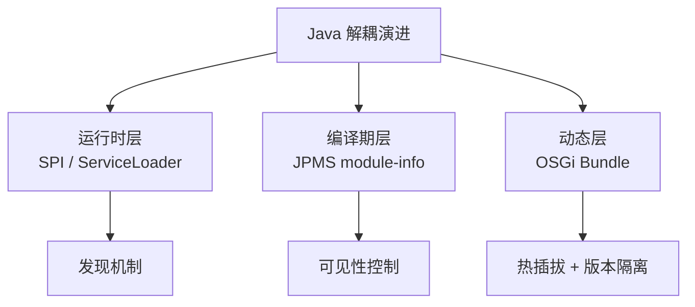
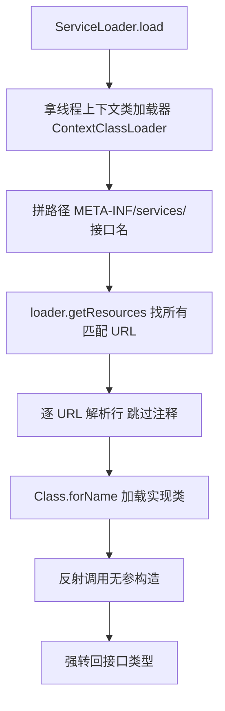
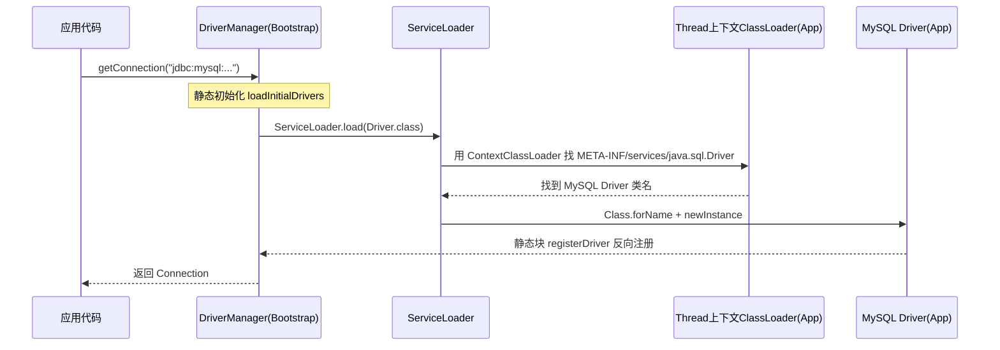
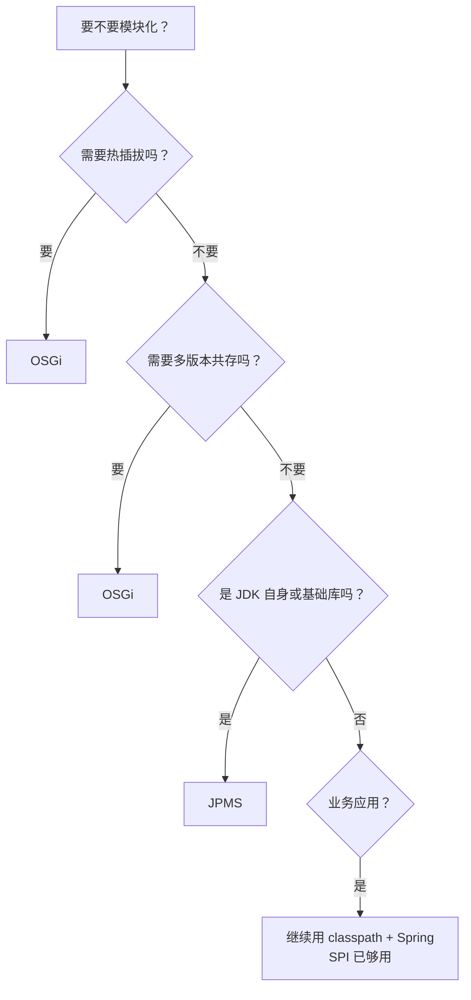
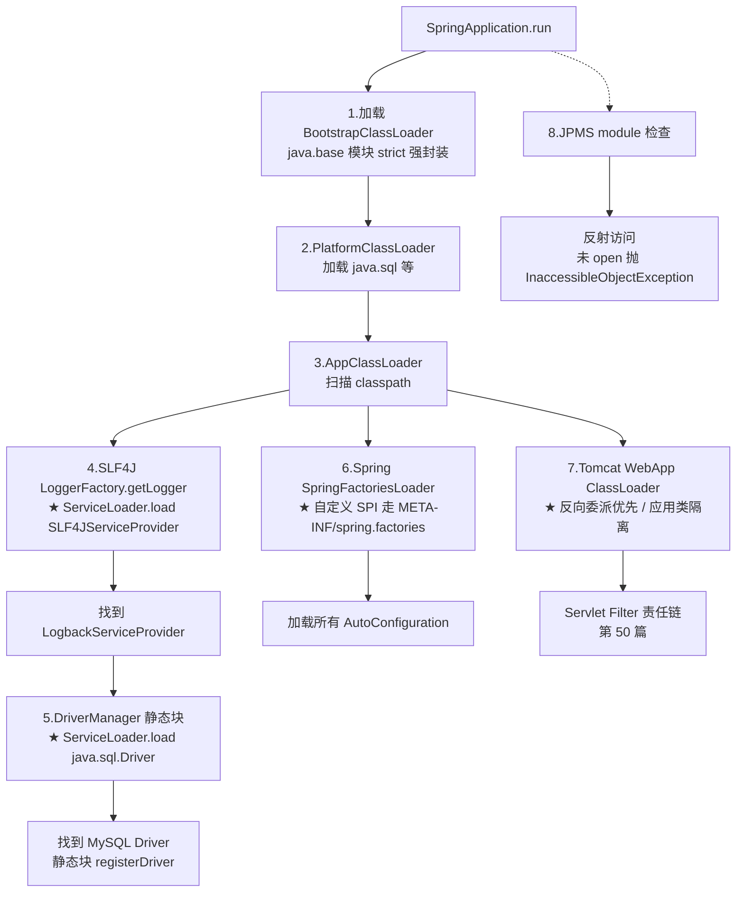
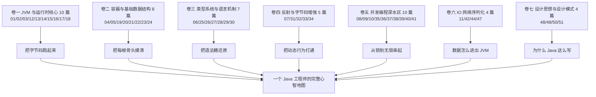

# 47.SPI与模块化设计

#### 目录介绍
- [1. 案例引入](#1-案例引入)
  - [1.1 一段反常代码](#11-一段反常代码)
  - [1.2 顺藤摸到根因](#12-顺藤摸到根因)
  - [1.3 我们要回答什么](#13-我们要回答什么)
- [2. 架构概览](#2-架构概览)
  - [2.1 三大解耦层级](#21-三大解耦层级)
  - [2.2 为什么这么切](#22-为什么这么切)
- [3. SPI核心机制](#3-spi核心机制)
  - [3.1 API与SPI的区分](#31-api与spi的区分)
  - [3.2 META-INF约定](#32-meta-inf约定)
  - [3.3 ServiceLoader源码](#33-serviceloader源码)
  - [3.4 懒加载与迭代器](#34-懒加载与迭代器)
  - [3.5 JDK9新版用法](#35-jdk9新版用法)
- [4. 双亲委派的破局](#4-双亲委派的破局)
  - [4.1 双亲委派回顾](#41-双亲委派回顾)
  - [4.2 JDBC破局之路](#42-jdbc破局之路)
  - [4.3 线程上下文类加载器](#43-线程上下文类加载器)
  - [4.4 Tomcat的层级反转](#44-tomcat的层级反转)
  - [4.5 OSGi的网状委派](#45-osgi的网状委派)
- [5. SPI实战范本](#5-spi实战范本)
  - [5.1 SLF4J绑定机制](#51-slf4j绑定机制)
  - [5.2 Dubbo增强SPI](#52-dubbo增强spi)
  - [5.3 自己写一个SPI](#53-自己写一个spi)
  - [5.4 SPI的常见陷阱](#54-spi的常见陷阱)
- [6. JPMS模块系统](#6-jpms模块系统)
  - [6.1 为什么需要模块](#61-为什么需要模块)
  - [6.2 module-info语法](#62-module-info语法)
  - [6.3 模块路径与类路径](#63-模块路径与类路径)
  - [6.4 强封装与反射访问](#64-强封装与反射访问)
- [7. 模块化下的SPI](#7-模块化下的spi)
  - [7.1 provides与uses](#71-provides与uses)
  - [7.2 模块化ServiceLoader](#72-模块化serviceloader)
  - [7.3 自动模块与未命名模块](#73-自动模块与未命名模块)
  - [7.4 拆分包冲突](#74-拆分包冲突)
- [8. JPMS与OSGi对比](#8-jpms与osgi对比)
  - [8.1 OSGi核心机制](#81-osgi核心机制)
  - [8.2 五大维度对比](#82-五大维度对比)
  - [8.3 何时该用谁](#83-何时该用谁)
- [9. 模块化迁移与陷阱](#9-模块化迁移与陷阱)
  - [9.1 三阶段迁移策略](#91-三阶段迁移策略)
  - [9.2 jdeps与jlink](#92-jdeps与jlink)
  - [9.3 反射访问破封装](#93-反射访问破封装)
  - [9.4 Spring Boot生态现状](#94-spring-boot生态现状)
- [10. 综合案例串讲与全册收官](#10-综合案例串讲与全册收官)
  - [10.1 案例真相揭晓](#101-案例真相揭晓)
  - [10.2 启动一行代码的旅程](#102-启动一行代码的旅程)
  - [10.3 全册七卷回望](#103-全册七卷回望)
  - [10.4 设计哲学速查](#104-设计哲学速查)


## 1. 案例引入

### 1.1 一段反常代码

我们接手了一个用 JDK 17 + Spring Boot 3 构建的"订单中心"服务，启动时连续踩了 5 个看起来不相关、但根因都指向 SPI 与模块化机制的坑：

```java
// 模块 1：日志门面
package com.acme.order;

import org.slf4j.Logger;
import org.slf4j.LoggerFactory;

public class OrderService {
    private static final Logger log = LoggerFactory.getLogger(OrderService.class);
    // ...
}
```

启动后控制台第一行：

```
SLF4J: No SLF4J providers were found.
SLF4J: Defaulting to no-operation (NOP) logger implementation
```

```java
// 模块 2：数据库连接
public class OrderDao {
    public void init() throws Exception {
        Class.forName("com.mysql.cj.jdbc.Driver");        // ★ JDK 6 之后这一行其实没必要
        Connection c = DriverManager.getConnection(
            "jdbc:mysql://localhost:3306/order", "root", "root");
        // ...
    }
}
```

去掉 `Class.forName` 后仍然能跑——为什么？

```java
// 模块 3：动态编译
public void compile(String src) {
    JavaCompiler compiler = ToolProvider.getSystemJavaCompiler();
    if (compiler == null) {
        throw new IllegalStateException("拿不到编译器，是不是 JRE 而非 JDK？");
    }
    // ...
}
```

线上某台机器上 `compiler == null`——为什么本地跑得好好的，线上偏偏拿不到？

```java
// 模块 4：发布镜像
// Dockerfile
FROM openjdk:17
COPY target/order-service.jar /app/
ENTRYPOINT ["java", "-jar", "/app/order-service.jar"]
```

镜像 480MB——一个简单的服务真的需要这么大？

```java
// 模块 5：JDK 17 兼容
// 启动报错
java.lang.reflect.InaccessibleObjectException: Unable to make field 
    private final transient java.util.HashMap$Node[] java.util.HashMap.table 
    accessible: module java.base does not "opens java.util" to unnamed module
```

老代码用反射改 HashMap 内部字段做缓存，JDK 17 之后**直接抛 InaccessibleObjectException**——这个异常哪来的？

### 1.2 顺藤摸到根因

把 5 个现象串起来：

- **现象 ①**——SLF4J 找不到 provider。SLF4J 是怎么发现日志后端实现的？为什么必须依赖 logback/log4j 才能工作？
- **现象 ②**——`Class.forName` 在 JDK 6 之后可以省略。`DriverManager` 是怎么自动发现并加载 MySQL 驱动的？
- **现象 ③**——`ToolProvider.getSystemJavaCompiler()` 时灵时不灵。它的实现也是 SPI 吗？
- **现象 ④**——OpenJDK 17 base 镜像 471MB，里面 90% 是用不到的模块。能不能只打包用到的？
- **现象 ⑤**——`InaccessibleObjectException` 是 JDK 9 引入的强封装错误，背后是 JPMS 模块系统的"强封装"。

这五个现象其实是同一个东西在不同层面的呈现：

```
SLF4J 后端发现   ┐
JDBC 驱动加载    │
ToolProvider     ├─── 都是 SPI 机制 + 双亲委派的破局
SLF4J 找不到     ┘

镜像太大        ┐
反射访问被拒    ├─── 都是 JPMS 模块系统的影响面
                ┘
```

这 5 个现象贯穿本篇 7 个核心问题：

```
① SPI 是什么？怎么加载？           → 第3章
② 为什么 SPI 必须破双亲委派？      → 第4章
③ 4 种破局方式各自的代价？         → 第4章
④ 工程实战 SPI 怎么写？陷阱在哪？  → 第5章
⑤ JPMS 解决了什么问题？           → 第6章
⑥ 模块化下 SPI 怎么写？           → 第7章
⑦ 跟 OSGi 有什么本质差别？         → 第8章
```

### 1.3 我们要回答什么

第 02 篇我们讲过类加载与双亲委派——本篇是它的**收官篇**：从"为什么双亲委派必须被打破"切入，把 SPI 机制讲到底；再从"为什么 JDK 9 要发明模块系统"切入，把 JPMS 讲透；最后做整本专栏的**全册收官**。


## 2. 架构概览

### 2.1 三大解耦层级

我们站在更高视角看一下：**Java 生态实现"插件化与解耦"经过三轮演进**：

```
┌────────────────────────────────────────────────────────────┐
│ 层级 1：SPI（JDK 1.6） ─── 服务发现机制                     │
│   核心：ServiceLoader + META-INF/services/                 │
│   解耦：调用方只依赖接口，实现方运行时被发现                 │
│   颗粒：单个接口 + 多实现                                    │
├────────────────────────────────────────────────────────────┤
│ 层级 2：OSGi（2000+） ─── 真正的动态模块系统                │
│   核心：Bundle + Service Registry + 网状类加载器           │
│   解耦：模块版本隔离 + 热插拔                                │
│   颗粒：整个 Jar（Bundle）                                  │
├────────────────────────────────────────────────────────────┤
│ 层级 3：JPMS（JDK 9） ─── 官方模块系统                      │
│   核心：module-info.java + 强封装                          │
│   解耦：编译期可见性控制 + 强封装                            │
│   颗粒：整个 Jar（Module）                                  │
└────────────────────────────────────────────────────────────┘
```

三者**不是替代关系**：

- **SPI** 解决的是"接口与实现的运行时绑定"
- **OSGi** 解决的是"模块版本隔离、动态生命周期"
- **JPMS** 解决的是"JDK 自身的模块化 + 编译期强封装"

实战中**Spring Boot 应用**通常只用 SPI；**Eclipse / 老版本 IDEA 插件**走 OSGi；**JDK 17+ 自身的 java.base / java.sql / java.compiler** 走 JPMS。

### 2.2 为什么这么切

**疑惑**：JDK 已经有了 SPI（JDK 1.6），为什么 9 年后又搞了 JPMS？两者职责重叠吗？

**论证**：

1. **SPI 解决的是"运行时能找到实现"**——但**编译期没有约束**。`META-INF/services` 里写错类名、运行时才报 `ServiceConfigurationError`。
2. **SPI 不管"包可见性"**——只要实现类在 classpath 上、接口是 public，就能 implements。**导致 Java 标准库的所有 internal 包都暴露在外**：sun.misc.Unsafe、com.sun.* 谁都能用。
3. **SPI 不管"依赖版本"**——同一个 jar 在 classpath 上多次（version 1.0 和 2.0），随机加载哪个看启动顺序。
4. **JDK 自己也吃不下了**——JDK 8 的 rt.jar 60+MB 一个文件，启动慢、安全审计难、嵌入式裁剪不能。

**结论**：JPMS 不是 SPI 的替代品，**而是 SPI 的补全**——SPI 管运行时绑定，JPMS 管编译期可见性 + 包级强封装 + JDK 自身瘦身。**两者正交、各司其职**。



## 3. SPI核心机制

### 3.1 API与SPI的区分

先把两个长得像的概念分开：

```
API（Application Programming Interface）
    调用方                      实现方（库作者）
    我用你的接口  ─── 调用 ───►  我提供接口和实现
    
    例：Map / List / String 的 API ── JDK 写好实现，我们调

SPI（Service Provider Interface）
    框架方（接口定义者）        提供方（插件作者）
    我定义协议   ─── 反向 ──►   我按协议实现，你来发现我
    
    例：JDBC Driver 接口 ── MySQL/PostgreSQL 各自实现 + JDK 用 SPI 发现
```

**关键差别**：API 是"我调你"，SPI 是**"你调我，但你不认识我，靠协议（META-INF/services）找到我"**——这是**控制反转**在类加载层面的体现。

### 3.2 META-INF约定

SPI 的工程约定极简：

```
my-service.jar
└── META-INF/
    └── services/
        └── com.acme.spi.PaymentChannel       ← 文件名 = 接口全限定名
                内容：每行一个实现类全限定名
                ├── com.acme.alipay.AlipayChannel
                ├── com.acme.wxpay.WxPayChannel
                └── com.acme.bank.UnionPayChannel
```

调用方代码：

```java
ServiceLoader<PaymentChannel> loader = ServiceLoader.load(PaymentChannel.class);
for (PaymentChannel ch : loader) {
    if (ch.support(orderType)) {
        ch.pay(order);
        break;
    }
}
```

**没有任何 spring.factories、没有反射 newInstance、没有手写 Map**——纯靠约定。

### 3.3 ServiceLoader源码

`ServiceLoader` 的源码并不复杂，核心干 4 件事：

```java
// JDK 17 ServiceLoader.java 简化版
public final class ServiceLoader<S> implements Iterable<S> {
    private final Class<S> service;          // 接口 Class
    private final ClassLoader loader;        // 用谁来加载实现类（关键！）
    private final List<S> instantiatedProviders = new ArrayList<>();
    
    private ServiceLoader(Class<S> svc, ClassLoader cl) {
        this.service = svc;
        this.loader = cl;
    }
    
    public static <S> ServiceLoader<S> load(Class<S> service) {
        // ★ 默认用线程上下文类加载器（Thread.currentThread().getContextClassLoader）
        ClassLoader cl = Thread.currentThread().getContextClassLoader();
        return new ServiceLoader<>(service, cl);
    }
    
    public Iterator<S> iterator() { return new LazyIterator(); }
    
    private class LazyIterator implements Iterator<S> {
        Enumeration<URL> configs;
        Iterator<String> pending;
        
        public boolean hasNext() {
            if (configs == null) {
                String fullName = "META-INF/services/" + service.getName();    // ★ 拼路径
                configs = loader.getResources(fullName);                       // ★ 找文件
            }
            // 解析每一行，跳过 # 注释
            // ...
            return pending != null && pending.hasNext();
        }
        
        public S next() {
            String cn = pending.next();
            Class<?> c = Class.forName(cn, false, loader);                     // ★ 反射加载
            S p = service.cast(c.getDeclaredConstructor().newInstance());      // ★ 反射实例化
            instantiatedProviders.add(p);
            return p;
        }
    }
}
```

**3 个关键点**：

1. **路径拼接**：`META-INF/services/` + 接口全限定名
2. **`loader.getResources` 而非 `getResource`**——返回所有 jar 中匹配的文件（多个实现的 jar 各自有一份）
3. **`Class.forName(cn, false, loader)` 用的是 ServiceLoader 持有的 `loader`**——这就是为什么 SPI 必须用线程上下文类加载器（4.3 节展开）



### 3.4 懒加载与迭代器

**疑惑**：为什么 `ServiceLoader` 不一次性把所有实现都加载好？

**论证**：

1. SPI 实现类可能有数十个（比如 java.nio.file.FileSystemProvider）——一次全加载会拉长启动
2. 调用方常常**找到第一个能用的就停**（如支付渠道选择）——后面的根本用不到
3. 实现类构造可能抛异常——一次性加载意味着任意一个挂掉全军覆没

所以 `ServiceLoader` 实现了 `Iterable`，每次 `hasNext / next` 才**实例化下一个**——典型的迭代器模式（参考第 50 篇 3 章）。

**结论**：懒加载 = 启动快 + 单点失败可隔离 + 资源按需用。

### 3.5 JDK9新版用法

JDK 9 给 `ServiceLoader` 加了**新 API**：

```java
// 老 API：必须 Iterable<S>，每个都已经实例化
for (PaymentChannel ch : ServiceLoader.load(PaymentChannel.class)) { ... }

// 新 API（JDK 9+）：返回 Stream<Provider<S>>，先拿到元数据，按需 get()
ServiceLoader.load(PaymentChannel.class).stream()
    .filter(p -> p.type().getAnnotation(Premium.class) != null)   // ★ 不实例化先过滤
    .findFirst()
    .map(ServiceLoader.Provider::get)                              // ★ 真正需要时才实例化
    .ifPresent(ch -> ch.pay(order));
```

**Provider** 接口：

```java
public interface Provider<S> extends Supplier<S> {
    Class<? extends S> type();    // ★ 拿到实现类 Class，不实例化
    S get();                       // ★ 真正实例化
}
```

这套新 API 解决了一个老痛点——**老 API 强制实例化每个 Provider**才能拿到类信息（注解、类名）。新 API 让我们能"先看再选"。

## 4. 双亲委派的破局

### 4.1 双亲委派回顾

第 02 篇讲过双亲委派的 4 步流程：

```
1. 检查类是否已被加载（缓存）
2. 找不到 → 委托父加载器加载
3. 父加载器递归处理（最终到 BootstrapClassLoader）
4. 父加载器都搞不定 → 自己尝试加载
```

```
┌─────────────────────────────────────────┐
│ Bootstrap ClassLoader  ─ rt.jar 等核心    │
└────────▲────────────────────────────────┘
         │ parent
┌────────┴────────────────────────────────┐
│ Platform/Extension ClassLoader ─ ext/   │
└────────▲────────────────────────────────┘
         │ parent
┌────────┴────────────────────────────────┐
│ Application ClassLoader  ─ classpath    │
└────────▲────────────────────────────────┘
         │ parent
┌────────┴────────────────────────────────┐
│ Custom ClassLoader （Tomcat WebApp 等） │
└─────────────────────────────────────────┘
```

**核心原则**：**类只能由父或自身加载，不能向下委派**——这保证了 java.lang.Object 永远是同一个 Class。

**但 SPI 偏偏要向下委派**——这就是冲突的根源。

### 4.2 JDBC破局之路

`DriverManager` 在 `rt.jar` 中（由 BootstrapClassLoader 加载），但 `MySQLDriver` 在用户的 classpath 上（由 ApplicationClassLoader 加载）。**Bootstrap 看不到 Application 加载的类——这是双亲委派的硬性约束**。

```
                            double-binding
DriverManager (rt.jar)  ────────────×─────────► MySQLDriver (用户 classpath)
被 Bootstrap 加载                              被 Application 加载
                                                
                                Bootstrap 永远看不到下层
```

那 `DriverManager.getConnection("jdbc:mysql:...")` 是怎么找到 MySQL 驱动的？

**答案**：`DriverManager` 在静态初始化时**用线程上下文类加载器**加载所有 JDBC 驱动：

```java
// java.sql.DriverManager 简化源码
private static void loadInitialDrivers() {
    AccessController.doPrivileged((PrivilegedAction<Void>) () -> {
        ServiceLoader<Driver> loadedDrivers = ServiceLoader.load(Driver.class);
        // ★ ServiceLoader.load 默认用 Thread.currentThread().getContextClassLoader()
        Iterator<Driver> driversIterator = loadedDrivers.iterator();
        try {
            while (driversIterator.hasNext()) {
                driversIterator.next();    // ★ 触发实现类加载和静态块
            }
        } catch (Throwable t) { /* ... */ }
        return null;
    });
}
```

而 MySQL 驱动的静态块会反过来**注册自己到 DriverManager**：

```java
// com.mysql.cj.jdbc.Driver
public class Driver extends NonRegisteringDriver implements java.sql.Driver {
    static {
        try {
            DriverManager.registerDriver(new Driver());     // ★ 反向注册
        } catch (SQLException e) { ... }
    }
}
```



回到现象 ②——为什么 `Class.forName("com.mysql.cj.jdbc.Driver")` 在 JDK 6 之后可以省略？因为 JDK 6 引入了 ServiceLoader，DriverManager 用它**自动发现**所有 jdbc 驱动——你不需要手动触发驱动类加载了。

### 4.3 线程上下文类加载器

**线程上下文类加载器（Thread Context ClassLoader, TCCL）** 是破局的核心武器：

```java
public class Thread {
    private ClassLoader contextClassLoader;
    
    public ClassLoader getContextClassLoader() { return contextClassLoader; }
    public void setContextClassLoader(ClassLoader cl) { this.contextClassLoader = cl; }
}
```

**机制**：每个线程持有一个 `ClassLoader` 字段，缺省继承父线程的（最早是 main 线程的 AppClassLoader）。SPI 框架在加载实现时**显式用 TCCL 而非自身的 ClassLoader**，从而绕过双亲委派。

```
正常方式：MyClass.class.getClassLoader().loadClass(name)
         ↑ 用调用者所在加载器，必走双亲委派

SPI 方式：Thread.currentThread().getContextClassLoader().loadClass(name)
         ↑ 用线程上下文加载器，可以指向任何加载器
```

**典型场景**：

```java
// Tomcat 启动一个 Web 应用前
Thread t = Thread.currentThread();
ClassLoader saved = t.getContextClassLoader();
try {
    t.setContextClassLoader(webAppClassLoader);    // ★ 切到 WebApp 加载器
    servlet.service(req, resp);                    // 内部任何 ServiceLoader.load 都用这个
} finally {
    t.setContextClassLoader(saved);                // ★ 恢复
}
```

**结论**：TCCL 是**给上层框架（rt.jar 中的代码）一个口子，让它能"反向"看到下层 classpath**。这是 Java 类加载体系**有意打开**的逃生通道。

### 4.4 Tomcat的层级反转

Tomcat 有 4 层 ClassLoader（简化）：

```
Bootstrap ─► System ─► Common ─► Catalina ─► WebApp(每个app一个)
                                              ▲
                                    每个 War 独立一个加载器
```

**关键差别**：**WebApp ClassLoader 优先自己加载（破坏双亲委派的"先委派父"）**——为什么？

**论证**：

1. App A 用 jackson 2.10，App B 用 jackson 2.15——必须**类隔离**
2. 如果走双亲委派，谁先加载就是谁——后到的应用直接 ClassCastException
3. Tomcat WebApp 加载器先在自己的 WEB-INF/lib 里找——找到就用，找不到才向上

```
正向（双亲委派）：先父后己       ── 保证核心类唯一性
反向（Tomcat WebApp）：先己后父   ── 保证应用类隔离
```

但这种反转**有边界**——`java.*` 等核心类必须由 Bootstrap 加载，Tomcat 用一个**包名黑名单（delegate first）**强制走双亲委派。

### 4.5 OSGi的网状委派

OSGi 把"树形委派"彻底改成**网状**：

```
        Bundle A (导出 com.acme.core ver=1.0)
           │
           └── 被 Bundle B 导入
                  │
                  └── Bundle C 也导入 com.acme.core ver=2.0 (来自 Bundle X)
```

每个 Bundle 都有自己的 ClassLoader，**按 import-package 声明决定从哪里要类**——Bundle C 找 `com.acme.core.Foo` 时不再向父委派，而是查找 OSGi 框架管理的"已导出包注册表"，找到对应的 Bundle X 加载器去拿。

**结果**：同一个 JVM 里可以共存 jackson 1.x、2.x、3.x，每个 Bundle 看到的版本不同——这是 SPI 和 JPMS 都做不到的。代价是**学习曲线极陡 + 运行时复杂**。

## 5. SPI实战范本

### 5.1 SLF4J绑定机制

回到现象 ①——SLF4J 找不到 provider 的真相。

**SLF4J 1.x 时代（已废弃）**用的是"静态绑定"：

```java
// SLF4J 1.x 在 LoggerFactory 中
private final static void bind() {
    // ★ 用 StaticLoggerBinder.getSingleton() 找到唯一实现
    StaticLoggerBinder.getSingleton();
}
```

每个日志后端（logback / slf4j-log4j12）都在自己的 jar 里**实现了 org.slf4j.impl.StaticLoggerBinder**——SLF4J 用 ClassLoader 加载这个固定类名。但同一个 classpath 上有两个 StaticLoggerBinder 时**会有冲突警告**。

**SLF4J 2.x（2022+）改用标准 ServiceLoader**：

```java
// SLF4J 2.x 源码
private static List<SLF4JServiceProvider> findServiceProviders() {
    ServiceLoader<SLF4JServiceProvider> serviceLoader = 
        ServiceLoader.load(SLF4JServiceProvider.class);
    List<SLF4JServiceProvider> providerList = new ArrayList<>();
    for (SLF4JServiceProvider provider : serviceLoader) {
        providerList.add(provider);
    }
    return providerList;
}
```

```
项目里只有 slf4j-api、没有 slf4j-simple/logback/log4j-slf4j-impl
   ↓
ServiceLoader 找不到 SLF4JServiceProvider 实现
   ↓
回退到 NOP（什么都不打印）
   ↓
打印 "No SLF4J providers were found"
```

**修复**：加上一个后端依赖（如 `logback-classic` 或 `slf4j-simple`），它们的 jar 里都有 `META-INF/services/org.slf4j.spi.SLF4JServiceProvider`。

### 5.2 Dubbo增强SPI

JDK 原生 SPI 有 3 个工程级痛点：

```
痛点 1：一次性加载所有实现   → 实例化成本高
痛点 2：无法按 key 选择      → 多实现里挑一个要写循环
痛点 3：不支持 IoC / AOP     → 实现类不能注入依赖
```

Dubbo 的 SPI 机制（`@SPI` + `ExtensionLoader`）增强了这些：

```java
// 接口
@SPI("dubbo")                          // ★ 默认实现 key = "dubbo"
public interface Protocol {
    Exporter export(Invoker invoker);
}

// META-INF/dubbo/com.alibaba.dubbo.rpc.Protocol
//   dubbo=com.alibaba.dubbo.rpc.protocol.dubbo.DubboProtocol
//   http=com.alibaba.dubbo.rpc.protocol.http.HttpProtocol
//   grpc=com.alibaba.dubbo.rpc.protocol.grpc.GrpcProtocol

// 使用
Protocol p = ExtensionLoader.getExtensionLoader(Protocol.class)
                            .getExtension("grpc");           // ★ 按 key 选
```

**Dubbo SPI vs JDK SPI** 对比：

| 特性 | JDK SPI | Dubbo SPI |
|---|---|---|
| 配置位置 | `META-INF/services/接口名` | `META-INF/dubbo/接口名` |
| 配置内容 | 实现类名（每行一个） | `key=实现类名`（按 key 选） |
| 加载策略 | 全部加载 | 按需加载 |
| 默认实现 | 无 | `@SPI("xxx")` |
| IoC | 不支持 | 支持 setter 注入其他扩展 |
| AOP | 不支持 | 支持 Wrapper 类装饰 |

**结论**：Dubbo SPI 是"工业级 SPI"——但代价是 Dubbo 体系内才能用。**Spring 的 `spring.factories`/`META-INF/spring/...AutoConfiguration.imports` 也是同思路的"增强 SPI"**——只是配置位置不同。

### 5.3 自己写一个SPI

3 步从零写一个完整 SPI：

```java
// Step 1：定义接口（放在 spi-api 模块）
package com.acme.spi;
public interface PaymentChannel {
    boolean support(String type);
    void pay(Order order);
}

// Step 2：写一个实现（放在 spi-alipay 模块）
package com.acme.alipay;
import com.acme.spi.PaymentChannel;
public class AlipayChannel implements PaymentChannel {
    public boolean support(String type) { return "alipay".equals(type); }
    public void pay(Order order) { /* ... */ }
}

// Step 3：声明 META-INF/services/com.acme.spi.PaymentChannel
//   com.acme.alipay.AlipayChannel
```

调用方：

```java
public PaymentChannel selectChannel(String type) {
    return ServiceLoader.load(PaymentChannel.class).stream()
        .map(ServiceLoader.Provider::get)
        .filter(c -> c.support(type))
        .findFirst()
        .orElseThrow(() -> new IllegalArgumentException("不支持: " + type));
}
```

**新增微信支付**——只需新增一个 `spi-wxpay.jar`，不动调用方一行代码。这是回到第 49 篇的"封闭变化点"哲学。

### 5.4 SPI的常见陷阱

实战 5 大坑：

```
坑 1：实现类必须有公共无参构造
     → ServiceLoader 用 newInstance() 反射调用
     → 没有就 ServiceConfigurationError

坑 2：META-INF/services 文件名拼错
     → 必须是接口的 全限定名（含包名）
     → 文件名加 .txt 后缀就废了

坑 3：实现类抛异常
     → ServiceLoader.iterator().next() 抛出 ServiceConfigurationError
     → 一个挂掉，后面的可能也加载不到（取决于代码）

坑 4：jar shading 后 META-INF 丢失
     → maven-shade-plugin 必须配 ServicesResourceTransformer
     → 否则多个 jar 里同名 services 文件互相覆盖

坑 5：模块化下不写 module-info.java
     → JPMS 下走兼容性回退路径，可能加载不到
     → 详见第 7 章
```

```xml
<!-- 修复坑 4：maven-shade 合并 services -->
<plugin>
    <artifactId>maven-shade-plugin</artifactId>
    <configuration>
        <transformers>
            <transformer implementation=
                "org.apache.maven.plugins.shade.resource.ServicesResourceTransformer"/>
        </transformers>
    </configuration>
</plugin>
```

## 6. JPMS模块系统

### 6.1 为什么需要模块

JDK 8 的 rt.jar 有 60MB 一个文件，里面有：

- `sun.misc.Unsafe`——本来不该外用，但 Netty / Dubbo / Hadoop 都在用
- `com.sun.xml.internal.*`——本来是 JDK 内部 XML 实现，被 JAXB 用户广泛依赖
- `sun.reflect.Reflection`——内部反射工具

这些 internal 包**没有 public/private 控制**——任何 classpath 上的代码都能直接 import。**JDK 升级一改 internal 包，几百个开源库立刻挂掉**——这就是 JDK 多年不能瘦身的根本原因。

JPMS 要解决的 4 件事：

```
1. 强封装：包级 export 控制，没 export 就外面看不到
2. 显式依赖：模块必须声明依赖，不能走"transitive 隐式依赖"
3. JDK 自身瘦身：把 rt.jar 拆成 95+ 个 java.* 模块，按需打包
4. 替代 SPI 的 provides/uses 声明，编译期能查出 SPI 错配
```

### 6.2 module-info语法

每个模块根目录有 `module-info.java`：

```java
module com.acme.order {
    // 声明依赖
    requires java.base;                    // ★ 缺省自动 requires，可省
    requires java.sql;
    requires transitive java.logging;      // ★ 传递依赖：依赖我的也自动获得 java.logging
    requires static lombok;                // ★ 仅编译期需要，运行时可无
    
    // 导出包给外部使用
    exports com.acme.order.api;            // ★ 公开包
    exports com.acme.order.internal to     // ★ 限定导出（白名单）
        com.acme.order.test;
    
    // 反射访问开放
    opens com.acme.order.entity to         // ★ 允许 Hibernate 反射访问
        org.hibernate.orm.core;
    opens com.acme.order.config;           // ★ 对所有模块开放反射
    
    // SPI
    uses com.acme.spi.PaymentChannel;      // ★ 我用这个 SPI
    provides com.acme.spi.PaymentChannel   // ★ 我提供这个 SPI 实现
        with com.acme.order.AlipayChannel;
}
```

```
关键字           作用                            类比
──────────────  ──────────────────────────────  ──────────────
requires        声明依赖模块                     import jar
exports         公开包给外部 import              public class
opens           允许反射访问                     setAccessible(true) 通行证
uses            声明使用的 SPI                   ServiceLoader.load 占位
provides ... with  声明提供的 SPI 实现           META-INF/services 占位
```

### 6.3 模块路径与类路径

JDK 9+ 后多了一个 `--module-path`：

```bash
# 老写法：classpath
java -cp libs/*:app.jar com.acme.Main

# 新写法：modulepath
java --module-path libs:app.jar --module com.acme.order/com.acme.Main
```

| 维度 | classpath（-cp） | modulepath（--module-path） |
|---|---|---|
| 内容 | jar 平铺 | 模块化 jar / 自动模块 |
| 强封装 | 无（所有 public 都能看到） | 有（仅 exports 的能看到） |
| SPI 发现 | META-INF/services | uses + provides |
| 包冲突 | 谁先加载用谁 | 拆分包直接拒绝启动 |

**实战中绝大多数 Spring Boot 应用仍跑在 classpath 模式下**——因为生态完全转 modulepath 还差远了（详见 9.4 节）。

### 6.4 强封装与反射访问

回到现象 ⑤——`InaccessibleObjectException`。

JDK 17 之前，反射可以**通过 `setAccessible(true)` 强制访问任何字段**——包括 JDK 内部的 `HashMap.table`。JDK 9 之后，模块系统加了一层"opens 检查"：

```
反射访问 some.Module.Field 时：
   1. 该 Module 是否 exports 给我了？
   2. 没 exports → 是否 opens 给我了？
   3. 都没有 → 抛 InaccessibleObjectException
```

**JDK 16 之前**：反射访问未 open 的包**只是 warning**（"illegal reflective access"）。**JDK 17 之后**：直接抛异常，硬性强封装。

**修复 3 条路**：

```bash
# 路 1：启动加 --add-opens 临时打开（最常用）
java --add-opens java.base/java.util=ALL-UNNAMED -jar app.jar

# 路 2：放弃反射，用公开 API
//   错：反射改 HashMap.table
//   对：直接 new HashMap<>(initialCapacity)

# 路 3：自己的代码用 module-info 声明 opens
opens com.acme.entity to org.hibernate.orm.core;
```

**结论**：JPMS 的强封装是 Java 长期被 internal API 绑架的一次"硬重置"——短期阵痛、长期收益。第 38 篇 `Unsafe` 在 JDK 17 之后逐步被 `VarHandle` 替代，就是这个浪潮的一部分。

## 7. 模块化下的SPI

### 7.1 provides与uses

模块化下 SPI 不再用 `META-INF/services`，改用 `module-info.java`：

```java
// 接口模块
module com.acme.spi {
    exports com.acme.spi;
    uses com.acme.spi.PaymentChannel;          // ★ 声明：我会用 ServiceLoader 加载它
}

// 实现模块
module com.acme.alipay {
    requires com.acme.spi;
    provides com.acme.spi.PaymentChannel       // ★ 声明：我提供这个 SPI 的实现
        with com.acme.alipay.AlipayChannel;    
}
```

**编译器现在能查出 SPI 错配**：

- `provides ... with X`，但 X 不实现该接口 → 编译报错
- `provides X with Y`，但 Y 没有公共无参构造 → 编译报错

这是模块化对 SPI 的**编译期增强**——回到 2.2 节的论证 1。

### 7.2 模块化ServiceLoader

模块化下 `ServiceLoader.load` 的内部行为变了：

```
非模块化（classpath）：
   1. 找 META-INF/services/接口名 文件
   2. 反射加载实现类

模块化（modulepath）：
   1. 检查当前模块的 module-info 中 uses 是否声明
   2. 没声明 → 抛 ServiceConfigurationError
   3. 找所有 modulepath 上 provides 该接口的模块
   4. 反射加载（实现类必须 exports 或 opens 给 java.base）
```

**关键变化**：模块化下 `uses` 声明是**必需**的——没声明 ServiceLoader 加载不到任何实现。

### 7.3 自动模块与未命名模块

JDK 9 引入两个**兼容性概念**：

```
┌──────────────────────────────────────────────────────────┐
│ 命名模块（Named Module）                                  │
│   - 有 module-info.java                                   │
│   - 严格强封装                                             │
├──────────────────────────────────────────────────────────┤
│ 自动模块（Automatic Module）                              │
│   - jar 在 modulepath 上但没有 module-info.java           │
│   - 名字按 jar 文件名推断                                  │
│   - 自动 requires 所有其他模块（向后兼容）                 │
│   - 自动 exports 所有包（向后兼容）                       │
├──────────────────────────────────────────────────────────┤
│ 未命名模块（Unnamed Module）                              │
│   - jar 在 classpath 上                                   │
│   - 全部行为同 JDK 8（无强封装）                           │
└──────────────────────────────────────────────────────────┘
```

**实战路径**：

1. 老应用全跑在**未命名模块**（classpath）——零修改
2. 升级一些库为模块化后，把它们放 modulepath，老库变**自动模块**
3. 最终所有库都模块化——全部 modulepath


**陷阱**：自动模块的名字按 jar 文件名推断（去掉版本号），文件名乱起的库被挪到 modulepath 后**module 名也乱**——遇到 module 名冲突直接启动失败。

### 7.4 拆分包冲突

**疑惑**：classpath 时代两个 jar 有同包名（如都有 `org.junit.Assert`），运行时随机加载——JPMS 是怎么处理的？

**论证**：JPMS 不允许**同一个包跨多个模块**——叫做"split package"。两个模块 export 同一个包 → JVM 启动直接抛 `LayerInstantiationException`。

**典型踩坑**：

```
javax.annotation 包同时存在于：
  - jakarta.annotation-api.jar
  - javax.annotation-api.jar
  - 部分老版 JDK 内置
```

modulepath 下三选一，多带必崩。**这是 JPMS 给生态升级的"硬压力"**——逼着大家清理重复依赖。

## 8. JPMS与OSGi对比

### 8.1 OSGi核心机制

OSGi 比 JPMS 早 10+ 年（2000 年首版），核心 3 块：

```
┌────────────────────────────────────────────────────┐
│ Bundle = jar + MANIFEST.MF（声明 import/export 包） │
│   Bundle-Version: 1.0.0                            │
│   Import-Package: org.slf4j;version="[1.7,2.0)"    │
│   Export-Package: com.acme.api;version="1.0"       │
└────────────────────────────────────────────────────┘
                    ↓
┌────────────────────────────────────────────────────┐
│ Service Registry（运行时服务注册表）                │
│   register / unregister / lookup                   │
└────────────────────────────────────────────────────┘
                    ↓
┌────────────────────────────────────────────────────┐
│ Lifecycle: install → resolve → start → stop → ...  │
│   每个 Bundle 都有完整生命周期，可热插拔             │
└────────────────────────────────────────────────────┘
```

OSGi 最强的两个能力：

- **同 JVM 多版本共存**——版本范围 `[1.7,2.0)` 描述了能接受的版本区间
- **热插拔**——Bundle 启动 / 停止不需重启 JVM

代价：**类加载器变成网状**，调试困难，启动慢，错误信息晦涩。

### 8.2 五大维度对比

| 维度 | JPMS（JDK 9+） | OSGi |
|---|---|---|
| **隔离粒度** | 整个 jar | Bundle（即 jar） |
| **版本支持** | 不支持多版本 | 支持版本区间 + 多版本共存 |
| **生命周期** | 静态（启动时确定） | 动态（install/start/stop/uninstall） |
| **类加载器** | 树形 + 受控反向 | 网状（每 Bundle 独立） |
| **学习曲线** | 平缓（语法简单） | 陡峭（需理解 Resolver） |
| **生态成熟度** | JDK 自身 + Spring 部分支持 | Eclipse 老牌 / Karaf / Felix |
| **调试难度** | 中（错误信息清晰） | 高（CL 网状难追踪） |
| **强封装** | 包级强封装 | Bundle 级强封装 |

### 8.3 何时该用谁



**实战结论**：

- **你写 Spring Boot 业务应用**——继续 classpath + ServiceLoader + spring.factories，**不要碰 JPMS 也不要 OSGi**
- **你写 JDK / 基础库 / 框架核心**——JPMS（你不想被 internal 包绑架）
- **你写 IDE 插件 / 工业控制系统 / 电信级中间件**——OSGi（你需要热插拔 + 多版本）

## 9. 模块化迁移与陷阱

### 9.1 三阶段迁移策略

业务工程从 JDK 8 迁移到 JDK 17 + 部分模块化的推荐路径：

```
阶段 1（JDK 17 兼容）：保留 classpath，修反射访问错误
   ├── 升级到 JDK 17
   ├── 跑起来，看 InaccessibleObjectException
   ├── --add-opens 临时打开（先跑起来再说）
   └── 把反射改 HashMap 这种烂代码逐步替换成公开 API

阶段 2（局部模块化）：基础库率先模块化
   ├── 给自己的 SDK / 工具包加 module-info.java
   ├── 应用层仍跑 classpath，依赖时自动模块兜底
   └── 验证跨团队的模块名和 export 范围

阶段 3（应用模块化）：（绝大多数应用永远停在阶段 2）
   ├── 全 modulepath
   ├── jlink 定制 JRE
   └── 适合超大型独立交付场景
```

### 9.2 jdeps与jlink

JDK 自带的两个模块化神器：

**jdeps**——分析依赖：

```bash
jdeps --module-path libs --check com.acme.order
# 输出：哪些 internal API 被使用了？哪些依赖未声明？
```

**jlink**——定制运行时：

```bash
jlink --module-path $JAVA_HOME/jmods:libs \
      --add-modules com.acme.order \
      --output customjre

# 结果：customjre 只包含用到的 JDK 模块（可能只 50MB 起步）
```

回到现象 ④——480MB 的镜像怎么瘦身？

```dockerfile
# 阶段 1：用 JDK 镜像构建并 jlink 定制 JRE
FROM openjdk:17-jdk AS builder
COPY . /src
RUN jlink --module-path $JAVA_HOME/jmods --add-modules java.base,java.sql,java.logging \
          --strip-debug --no-man-pages --no-header-files --compress=2 \
          --output /customjre

# 阶段 2：基于 alpine 运行，只带 customjre
FROM alpine:3.18
COPY --from=builder /customjre /jre
COPY target/order-service.jar /app/
ENTRYPOINT ["/jre/bin/java", "-jar", "/app/order-service.jar"]
```

镜像体积可从 480MB 降到 80~120MB。

### 9.3 反射访问破封装

`--add-opens` 是迁移期最常用的逃生口，但**生产慎用**：

```bash
# 例 1：让 ByteBuddy 能反射访问 java.lang
--add-opens java.base/java.lang=ALL-UNNAMED

# 例 2：让 Spring 能反射访问 java.util
--add-opens java.base/java.util=ALL-UNNAMED

# 例 3：让 JNI 框架能访问 java.nio
--add-opens java.base/java.nio=ALL-UNNAMED
```

`ALL-UNNAMED` 表示对**所有类路径上的代码**开放——等于关闭了强封装。**生产推荐改用 `--add-opens java.base/java.util=specific.module`** 限定开放给具体模块。

### 9.4 Spring Boot生态现状

截至 2025+，Spring Boot 生态对 JPMS 的态度是**"运行时支持，开发期不强制"**：

- Spring Framework 6 的 jar 是**自动模块**——没有 module-info.java，但能在 modulepath 跑
- 大多数 Spring Boot 应用仍跑在 classpath
- spring.factories / `META-INF/spring/...AutoConfiguration.imports` **都不是 JDK SPI**——是 Spring 自己的 SPI 实现（基于 SpringFactoriesLoader）

```java
// SpringFactoriesLoader 简化源码（spring-core）
public static <T> List<T> loadFactories(Class<T> factoryType, ClassLoader cl) {
    // 找所有 jar 中的 META-INF/spring.factories
    Enumeration<URL> urls = cl.getResources("META-INF/spring.factories");
    // 解析 properties 格式 (factoryType=impl1,impl2,...)
    // 反射 newInstance
}
```

**为什么 Spring 不直接用 JDK SPI？**

1. JDK SPI 一个文件一个接口太碎——Spring 上百个扩展点要上百个文件
2. JDK SPI 不支持注入依赖——Spring 必须 IoC
3. 需要更早执行（在 ApplicationContext 启动前）——SPI 的懒加载在这里反而是缺点

## 10. 综合案例串讲与全册收官

### 10.1 案例真相揭晓

回到第 1 章 5 个现象，全部能解释：

| # | 现象 | 答案 |
|---|---|---|
| ① | SLF4J: No SLF4J providers were found | SLF4J 2.x 用 `ServiceLoader.load(SLF4JServiceProvider.class)` 找日志后端。classpath 没有 logback/slf4j-simple 等实现 → 找不到 → 回退 NOP。加一个后端依赖即可。见 5.1 |
| ② | `Class.forName` 可以省略 | JDK 6 开始 `DriverManager` 用 `ServiceLoader.load(Driver.class)` 自动发现驱动。MySQL 驱动 jar 中的 `META-INF/services/java.sql.Driver` 让 ServiceLoader 找到，静态块 `registerDriver` 反向注册。见 4.2 |
| ③ | `ToolProvider.getSystemJavaCompiler()` 时灵时不灵 | 它也是 SPI，需要 `tools.jar`/`java.compiler` 模块在场。线上跑的是 JRE 而非 JDK 时（旧版 JRE）就拿不到。JDK 17 之后 JRE/JDK 已合并不再有这个问题。见 3 章 |
| ④ | 镜像 480MB | 整个 JDK 自身瘦身要靠 JPMS。用 `jlink` 定制只含必需模块的 customjre，镜像可降到 80~120MB。见 9.2 |
| ⑤ | InaccessibleObjectException | JPMS 强封装。JDK 17 之后未 `opens` 的包不允许反射访问。修复：换 API 或启动加 `--add-opens`。见 6.4 + 9.3 |

7 个核心问题对照表：

| # | 问题 | 答案章节 |
|---|---|---|
| ① | SPI 怎么加载？ | 第 3 章 |
| ② | 为什么必须破双亲委派？ | 4.1 + 4.2 |
| ③ | 4 种破局方式代价？ | 4.3 (TCCL) / 4.4 (Tomcat) / 4.5 (OSGi) |
| ④ | 工程实战 SPI 写法？ | 5.3 |
| ⑤ | JPMS 解决什么？ | 6.1 + 6.4 |
| ⑥ | 模块化下 SPI？ | 第 7 章 |
| ⑦ | 跟 OSGi 差别？ | 第 8 章 |

### 10.2 启动一行代码的旅程

把本篇所有概念串起来——**`SpringApplication.run` 这一行背后到底发生了什么**：



一行 `run` 触发：

- **3 层 ClassLoader 协作**（第 02 篇）
- **3 次 ServiceLoader 调用**（SLF4J / JDBC / 部分组件）
- **1 次 Spring 自定义 SPI**（SpringFactoriesLoader）
- **1 次 Tomcat 反向委派**（每个 War 独立加载）
- **N 次 JPMS 强封装检查**（反射访问 java.* 包）

**这就是 51 篇专栏的最终图景**——从字节码、类加载、容器、并发、IO、设计模式，所有的知识点最终都汇聚到"应用启动那一刻"。

### 10.3 全册七卷回望

至此，**《Java 核心原理深度专栏 51 篇》正式收官**——让我们最后回望一次：



**七卷主线**：

| 卷 | 篇数 | 核心问题 | 关键篇目 |
|---|---|---|---|
| 卷一 JVM | 10 | 字节码 → 运行 | 13 字节码 / 14 JIT / 03 GC |
| 卷二 容器 | 8 | 集合的每根骨头 | 04 HashMap / 20 ConcurrentHashMap |
| 卷三 类型 | 7 | 语法糖背后 | 06 泛型擦除 / 27 Lambda / 28 Stream |
| 卷四 字节码 | 5 | 动态修改运行时 | 07 反射 / 32 ASM / 33 Agent |
| 卷五 并发 | 10 | 从锁到无锁 | 36 AQS / 38 CAS / 40 CompletableFuture |
| 卷六 IO | 4 | 数据进出 JVM | 11 NIO / 42 ByteBuffer / 47 NIO.2 |
| 卷七 设计 | 4 | 为什么这么写 | 48 OO / 49 创建结构 / 50 行为 / 51 SPI |

### 10.4 设计哲学速查

整本专栏背后的 10 条贯穿哲学：

```
1. 时间换空间，空间换时间——HashMap 负载因子 0.75 / TreeMap 红黑树高度
2. 分而治之——HashMap 分桶 / ForkJoinPool 工作窃取 / Spliterator 切片
3. 延迟绑定——多态 / SPI / Lambda invokedynamic / 类初始化
4. 不变量保护——封装 / final / Record / volatile
5. 模板与策略分离——AQS 骨架 + 钩子 / Comparator 组合子
6. 协议大于实现——SPI / JPMS uses-provides / Comparable.compareTo
7. 控制反转——SPI / 框架方反向调用 / Spring DI
8. 显式优于隐式——module-info / @NonNull / Optional / 泛型边界
9. 失败要快——fail-fast 迭代器 / OOM 第一现场 / Pattern 提前编译
10. 组合优于继承——Comparator / 装饰器 / 责任链 / Lambda
```

**Java 之所以是 Java**——不在于它的某一项语法，而在于**这 10 条哲学被无数 JDK 设计者在 30 年里反复打磨、贯彻、坚持**。

---

## 全册结语

```
我们走过的路：
   从 01 篇"JVM 内存模型与对象"
   到 51 篇"SPI 与模块化"
   
   51 篇 / 70+ 万字 / 数千张图与代码
   
   穿过 7 卷：
      JVM → 容器 → 类型 → 字节码 → 并发 → IO → 设计
   
   抵达同一个目标：
      看清 Java 的每一根骨头
      理解每一次设计权衡
      建立一张完整的心智地图
```

**愿你合上这本书时**，不是多记了 51 个知识点——而是多了 51 个"哦原来如此"的瞬间，和一种**遇到任何陌生 Java 代码都能从原理层快速定位的眼力**。

下一步走哪？

- 想纵深 → 读 OpenJDK 源码（Hotspot src 目录）
- 想横拓 → 读 Netty / Spring / Kafka 源码
- 想现代化 → 关注 Loom（虚拟线程，第 41 篇）/ Valhalla（值类型）/ ZGC 演进

```
道阻且长，行则将至。
51 篇是终点也是起点。
```

—— 完 ——

