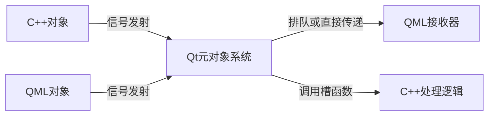

# 07.QML和C++
#### 目录介绍
- 7.1 快速集成方式
  - 7.1.1 QML和C++概念
  - 7.1.2 两者为何集成
  - 7.1.3 集成方式说明
  - 7.1.4 有哪些场景用
  - 7.1.5 关键考量因素
  - 7.1.6 集成设计原则
  - 7.1.7 交互关键技术
- 7.2 集成通信机制
  - 7.2.1 属性绑定
  - 7.2.2 方法调用
  - 7.2.3 信号-槽系统
- 7.3 对象注册方式
  - 7.3.1 将C++注册到QML
  - 7.3.2 注册上下文属性
  - 7.3.3 注册QML类型
  - 7.3.4 生命周期管理
  - 7.3.5 注册调试技术
  - 7.3.6 注册最佳实践
  - 7.3.7 两种注册比较
- 7.4 信号槽设计
  - 7.4.1 基本通信模型
  - 7.4.2 信号槽核心特性
  - 7.4.3 C++到QML通信
  - 7.4.4 QML到C++通信
  - 7.4.5 信号参数处理机制
  - 7.4.6 高级连接技术
  - 7.4.7 信号槽优化策略
  - 7.4.8 信号槽调试
  - 7.4.9 信号槽最佳实践
- 7.5 在C++中操作QML
  - 7.5.1 获取QML对象
  - 7.5.2 操作QML属性与方法
  - 7.5.3 信号与事件处理
  - 7.5.4 高级交互模式
  - 7.5.5 调试与错误处理
  - 7.5.6 典型应用场景
- 7.6 案例-用户登录功能
  - 7.6.1 C++定义登录逻辑
  - 7.6.2 册并暴露登陆
  - 7.6.3 QML实现登录界面
- 7.7 案例-数据列表展示
  - 7.7.1 C++定义数据模型
  - 7.7.2 注册
  - 7.7.3 QML展示数据列表
- 7.8 案例-实时数据更新
  - 7.8.1 C++定义数据更新
  - 7.8.2 注册
  - 7.8.3 QML展示更新

## 7.1 快速集成方式

### 7.1.1 集成的概念

QML 和 C++ 的集成是 Qt 框架的一大优势，它允许开发者将 QML 的灵活性和易用性与 C++ 的强大功能结合起来。

通过这种集成，开发者可以在 QML 中使用 C++ 提供的逻辑、数据模型和功能，同时保持 QML 的简洁性和动态性。

### 7.1.2 两者为何集成

为什么需要 QML 和 C++ 集成？ 虽然 QML 非常适合构建用户界面，但有时需要使用 C++ 来处理复杂的逻辑或性能关键的任务，例如：

- 数据处理和计算。
- 与底层系统或硬件交互。
- 使用现有的 C++ 库或代码。
- 构建复杂的数据模型（如 `QAbstractListModel`）。
- 实现自定义 QML 类型。

通过集成，QML 可以专注于界面设计，而 C++ 负责处理复杂的逻辑和性能优化。

### 7.1.3 集成方式说明

QML 与 C++ 的集成主要有以下几种方式：

1. **将 C++ 对象暴露给 QML**：将 C++ 类注册为 QML 类型，供 QML 使用。通过 `qmlRegisterType` 或 `setContextProperty`。
2. **在 QML 中调用 C++ 方法**：通过信号槽机制或直接调用 C++ 方法（`Q_INVOKABLE` ）。
3. **在 C++ 中操作 QML 对象**：通过 `QQuickItem` 或 `QObject` 访问和操作 QML 对象。

### 7.1.4 有哪些场景用

1. 复杂数据处理与可视化。**场景**：处理大数据集、实时流数据。QML直观展示 + C++高性能计算。
2. 硬件设备驱动与控制。**场景**：物联网/嵌入式设备交互。
3. 数据库与持久化存储。**场景**：应用数据持久化管理。C++：SQL查询封装（SQLite/MySQL），QML：数据展示和用户输入。
4. 本地系统接口访问。场景：文件系统监控，打印机控制，Wi-Fi，网络，蓝牙信息获取。

### 7.1.5 关键考量因素

| **考量因素** | **QML优势** | **C++优势** | **最佳实践** |
|--------------|-------------|-------------|-------------|
| 性能         | UI渲染优化 | 计算效率高 | 复杂逻辑放C++ |
| 安全性       | 易被查看   | 编译后保护 | 敏感操作放C++ |
| 开发效率     | UI开发快速 | 逻辑复用强 | UI用QML，核心用C++ |
| 多平台支持   | 跨平台UI   | 条件编译支持 | 平台相关代码放C++ |
| 长期维护     | UI易调整   | 稳定API    | 分层架构隔离 |

### 7.1.6 集成设计原则

**设计原则**：

1. 界面布局、动画、简单交互 → 纯QML
2. 数据处理、设备控制、算法实现 → C++封装
3. 业务逻辑 → QML调用C++接口
4. 状态管理 → C++作为数据源，QML绑定属性

### 7.1.7 交互关键技术

| **技术**              | **应用场景**                     | **关键类/宏**                     |
|------------------------|----------------------------------|-----------------------------------|
| 属性绑定               | 实时数据更新                    | `Q_PROPERTY` + `NOTIFY`          |
| 模型/视图              | 动态列表/表格                   | `QAbstractItemModel` 子类        |
| 函数调用               | 业务逻辑执行                    | `Q_INVOKABLE`                    |
| 信号-槽连接            | 异步事件通知                    | `QObject::connect()`             |
| 上下文属性             | 全局对象访问                    | `QQmlContext::setContextProperty()` |
| 单例类型               | 跨组件共享状态                  | `qmlRegisterSingletonType()`     |
| 图形资源共享            | OpenGL纹理共享                 | `QQuickFramebufferObject`        |


## 7.2 集成通信机制

### 7.2.1 属性绑定

使用 `Q_PROPERTY` 将C++属性暴露给QML。示例：

```cpp
Q_PROPERTY(int value READ value NOTIFY valueChanged)
```

QML自动绑定：`Text { text: sensorData.value }`

### 7.2.2 方法调用

使用`Q_INVOKABLE` 标记可被QML调用的方法。示例：

```cpp
Q_INVOKABLE bool login(const QString &username, const QString &password);
```

QML调用：`button.onClicked: authManager.login(usernameField.text, passwordField.text)`

### 7.2.3 信号-槽系统

在 C++ 和 QML 的交互中，可以通过信号和槽机制实现 C++ 信号触发 QML 函数的执行。

1. C++ 信号：C++ 类中定义的信号，用于通知 QML 层某些事件的发生。
2. QML 函数：QML 中定义的 JavaScript 函数，可以被 C++ 信号触发执行。
3. 连接机制：通过 QObject::connect 或 QML 的 Connections 元素将 C++ 信号与 QML 函数绑定。

C++信号触发QML函数执行。示例：

```cpp
// C++ 信号
signals:
    void mySignalWithParam(int value);
```

```qml
// QML 信号处理函数
Connections {
    target: myCppObject
    function onMySignalWithParam(value) {
        console.log("Received value from C++ signal:", value);
    }
}
```

**`QObject::connect` 的基本用法**

```cpp
QObject::connect(sender, SIGNAL(signal()), receiver, SLOT(slot()));
```

- **sender**：发出信号的对象。
- **signal()**：信号的签名（需要使用 `SIGNAL` 宏）。
- **receiver**：接收信号的对象。
- **slot()**：槽函数的签名（需要使用 `SLOT` 宏）。

**示例 1：按钮点击事件**：当按钮被点击时，`clicked()` 信号发出，`onButtonClicked()` 槽函数被调用。

```cpp
QPushButton *button = new QPushButton("Click me");
QObject::connect(button, SIGNAL(clicked()), this, SLOT(onButtonClicked()));
```

**示例 2：Lambda 表达式。使用 Lambda 表达式作为槽函数，简化代码。**

```cpp
QPushButton *button = new QPushButton("Click me");
QObject::connect(button, &QPushButton::clicked, []() {
    qDebug() << "Button clicked!";
});
```

使用 `QObject::disconnect` 断开信号与槽的连接：

```cpp
QObject::disconnect(sender, SIGNAL(signal()), receiver, SLOT(slot()));
```

Qt 支持跨线程的信号与槽连接，自动处理线程间的通信：

```cpp
QObject::connect(sender, &SenderClass::signal, receiver, &ReceiverClass::slot, Qt::QueuedConnection);
```

**`QObject::connect` 的原理**

**信号与槽的实现机制**

- **元对象系统（Meta-Object System）**：Qt 使用元对象系统实现信号与槽机制。元对象系统通过 `moc`（Meta-Object Compiler）生成额外的代码，用于支持信号与槽的动态绑定。
- **信号与槽的存储**：信号与槽的连接信息存储在 `QObject` 的内部数据结构中。
- **事件循环**：当信号发出时，Qt 的事件循环会查找与该信号连接的槽，并调用相应的槽函数。

`QObject::connect` 的最后一个参数可以指定连接类型：

- **`Qt::AutoConnection`（默认）**：如果发送者和接收者在同一线程，使用 `Qt::DirectConnection`；否则，使用 `Qt::QueuedConnection`。
- **`Qt::DirectConnection`**：槽函数在信号发出的线程中立即执行。
- **`Qt::QueuedConnection`**：槽函数在接收者所在线程的事件循环中执行。
- **`Qt::BlockingQueuedConnection`**：类似于 `Qt::QueuedConnection`，但会阻塞发送者线程，直到槽函数执行完毕。
- **`Qt::UniqueConnection`**：确保信号与槽的连接是唯一的，避免重复连接。

## 7.3 对象注册方式

### 7.3.1 将C++注册到QML

将C++注册到QML是Qt框架实现C++与QML集成的基础机制，其本质是**在QML运行环境中暴露C++类的接口**，使这些C++对象能被QML识别、访问和操作。

这一过程解决了两大关键问题：

1. **类型系统整合** - 将静态类型的C++世界接入动态类型的QML环境
2. **跨语言交互** - 建立C++和JavaScript(ECMAScript)之间的通信桥梁

| **方法**                  | **适用场景**            | **QML访问方式**       | **生命周期管理**      |
|---------------------------|------------------------|-----------------------|-----------------------|
| `setContextProperty()`    | 单例/全局服务         | 直接访问              | 父对象自动管理       |
| `qmlRegisterType()`       | 可复用组件            | 实例化对象           | QML引擎管理          |
| `qmlRegisterSingletonType()`| 全局配置             | 单例访问             | 持久化存在          |

### 7.3.2 注册上下文属性

将C++对象实例注册为全局可访问属性：

```cpp
// main.cpp
// C++类实例
MyController controller; 
engine.rootContext()->setContextProperty("controller", &controller);
```

**QML中访问**：将实例化的 C++ 对象，直接传递给 QML 使用。

```qml
Text { 
    text: controller.statusMessage
    color: controller.isReady ? "green" : "red"
}

Button {
    onClicked: controller.performAction()
}
```

**适用场景**：

- 应用程序全局服务（如配置管理、数据库访问）
- 单例模式对象
- 界面无关的核心逻辑对象

**缺点**：

- 对象生命周期需要手动管理。
- 如果对象需要在多个 QML 文件中使用，可能会导致命名冲突。

### 7.3.3 注册QML类型

将C++类注册为可在QML中实例化的类型，通过 `qmlRegisterType` 或 `qmlRegisterSingletonType`，可以将 C++ 类注册为 QML 类型。

> 1.qmlRegisterType 注册

```cpp
// main.cpp
qmlRegisterType<MyClass>("com.yc.myclass", 1, 0, "MyClass");
```

参数说明：

- `com.yc.myclass`：模块名（避免命名冲突）
- `1, 0`：主版本和次版本
- `MyClass`：QML中使用的类型名

**QML中使用**：将 C++ 方法暴露为 QML 可调用的方法。相当于你可以，在qml中直接调用C++方法。

```qml
import com.yc.myclass 1.0

MyClass {
    id: myClass
    onMessageChanged: console.log("Message changed:", message)
}

Button {
    text: "Change Message"
    onClicked: myClass.message = "New message from QML"
}

Text {
    text: myClass.message
    anchors.centerIn: parent
}
```

**适用场景**：

- 可复用的UI组件
- 数据模型类
- 需要多个实例的对象

> 2.qmlRegisterSingletonType

`qmlRegisterSingletonType` 是一个用于将 C++ 类注册为 QML 单例类型的函数。通过这种方式，可以在 QML 中全局访问该单例对象，而无需显式创建实例。这对于需要在 QML 中共享状态或功能的场景非常有用。

**1.`qmlRegisterSingletonType` 的作用**

- **单例模式**：确保在 QML 中只有一个实例存在，全局共享。
- **全局访问**：在 QML 中可以直接访问单例对象的属性和方法，无需通过 `id` 或上下文属性传递。
- **简化代码**：减少 QML 中重复创建对象的代码，提高代码的可维护性。

**2. `qmlRegisterSingletonType` 的用法**

`qmlRegisterSingletonType` 有多个重载版本，常用的形式如下：

```cpp
template<typename T>
int qmlRegisterSingletonType(const char *uri, int versionMajor, int versionMinor, const char *typeName, QObject *(*callback)(QQmlEngine *, QJSEngine *));
```

**参数说明**

- `uri`：QML 模块的命名空间（例如 `"com.example"`）。
- `versionMajor`：主版本号。
- `versionMinor`：次版本号。
- `typeName`：在 QML 中使用的类型名称。
- `callback`：一个回调函数，用于创建单例对象。

**返回值**：返回一个类型 ID，通常不需要使用。


> 3.qRegisterMetaType和qmlRegisterSingletonType两者之间区别

qRegisterMetaType

1. 用途: 注册普通的QML类型，每次在QML中使用时都会创建新的实例 
2. 实例化: 支持多实例，每次在QML中声明该类型时都会创建一个新对象 
3. 使用场景: 适用于需要多个独立实例的类，如数据模型、UI组件等

qmlRegisterSingletonType

1. 用途: 注册单例类型，整个应用程序中只有一个实例 
2. 实例化: 全局唯一实例，所有QML组件共享同一个对象 
3. 使用场景: 适用于全局管理器、工具类、配置类等需要全局访问的对象


### 7.3.4 生命周期管理

注册对象的不同生命周期策略：

| **注册方式**         | **所有权**          | **管理机制**                     | **场景**                      |
|----------------------|---------------------|----------------------------------|-------------------------------|
| 上下文属性           | C++拥有             | `QObject`父对象机制             | 持久性服务，全局控制器        |
| 注册类型实例化       | QML拥有             | QML垃圾回收(GC)机制            | 临时组件，视图相关对象       |
| 显式所有权转移       | JavaScript拥有      | `QQmlEngine::setObjectOwnership`| 需要JS控制生命周期的对象     |

### 7.3.5 注册调试技术

检查注册状态：

```cpp
// 查看已注册类型
qDebug() << engine.rootContext()->contextPropertyNames();

// QML中检查
Component.onCompleted: {
    console.log("Available props:", Object.keys(this))
}
```

性能监控，注册使用`QQmlEngine::objectCreated`信号跟踪对象创建：

```cpp
QObject::connect(&engine, &QQmlEngine::objectCreated,
    QObject *obj, const QUrl &url {
        qDebug() << "Object created at" << url << ":" << obj->metaObject()->className();
    });
```

### 7.3.6 注册最佳实践

1. **分层架构设计原则**
  - GUI层：纯QML（动画/布局/简单交互）
  - 适配层：QObject包装类
  - 业务层：纯C++逻辑
  - 系统层：操作系统接口/硬件控制

2. **接口设计规范**
  - 限制暴露：仅暴露必要接口
  - 命名规范：使用QML友好名称（camelCase）
  - 类型转换：复杂类型使用`QVariant`容器

3. **性能优化**
   ```cpp
   // 批量注册代替多次注册
   void registerTypes() {
       qmlRegisterType<Type1>("MyApp", 1, 0, "Type1");
       qmlRegisterType<Type2>("MyApp", 1, 0, "Type2");
   }
   ```

### 7.3.7 两种注册比较

**两种注册方式，对比总结**

| 特性                  | `setContextProperty`                     | `qmlRegisterType`                     |
|-----------------------|------------------------------------------|---------------------------------------|
| **对象实例化**         | 在 C++ 中实例化，直接暴露给 QML          | 在 QML 中实例化                       |
| **使用场景**           | 单例对象、全局对象                       | 可复用组件、动态创建对象               |
| **生命周期管理**       | 手动管理                                 | 由 QML 引擎管理                       |
| **命名冲突**           | 可能发生                                 | 避免冲突                              |
| **模块化支持**         | 不支持                                   | 支持                                  |
| **代码复杂度**         | 简单直接                                 | 稍复杂                                |

**选择建议**

- 如果只需要暴露一个全局对象（例如应用程序的配置、管理器等），使用 `setContextProperty`。
- 如果需要创建可复用的组件或在 QML 中动态创建对象，使用 `qmlRegisterType`。

## 7.4 信号槽设计

### 7.4.1 基本通信模型

Qt的信号槽机制是支撑QML与C++无缝集成的核心通信系统，其设计允许跨越C++和QML边界进行双向通信。



### 7.4.2 信号槽核心特性

- **语言无关**：自动跨越C++/QML边界传递数据
- **类型安全**：在连接时验证参数类型兼容性
- **线程安全**：支持跨线程通信
- **松耦合**：发送方无需知道接收方存在
- **动态连接**：运行时创建/销毁连接

### 7.4.3 C++到QML通信

**C++类定义（SensorMonitor.h）**

```cpp
class SensorMonitor : public QObject {
    Q_OBJECT
signals:  //信号
    void temperatureChanged(double value); // 暴露给QML的信号
public:
    Q_INVOKABLE void update() { 
        emit temperatureChanged(25.3); // 触发信号
    }
};
```

注册如下：

```cpp
SensorMonitor sensorMonitor;
engine.rootContext()->setContextProperty("sensorMonitor", &sensorMonitor);
```

**QML接收实现**

```qml
Button {
    text: "更新温度"
    onClicked: sensorMonitor.update() // 触发更新
}

// 连接 C++ 信号到 QML 处理函数
// 信号处理
Connections {
    target: sensorMonitor
    function onTemperatureChanged(value) {
        temperatureDisplay.text = "当前温度: " + value.toFixed(1) + " °C"
    }
}
```

### 7.4.4 QML到C++通信

C++ 和 QML 可以通过信号和槽进行通信。C++ 可以发出信号，QML 可以监听并响应。在 C++ 中定义信号和槽，在 QML 中连接信号和调用槽。

**C++槽函数定义**

```cpp
#ifndef CONTROLLER_H
#define CONTROLLER_H

#include <QObject>
#include <QString>

class Controller : public QObject {
    Q_OBJECT
public:
    // 显式构造函数
    explicit Controller(QObject *parent = nullptr);

public slots:   //信号槽
    // 登录处理槽函数声明
    void handleLogin(const QString &username, const QString &password);

signals:  //信号
    // 可选：添加登录结果信号
    void loginResult(bool success, const QString &message);

private:
    // 私有成员变量和方法
    bool validateCredentials(const QString &username, const QString &password);
};

#endif // CONTROLLER_H

# 下面这个是cpp文件

#include "Controller.h"
#include <QDebug>

void Controller::handleLogin(const QString &username, const QString &password){
    // 验证凭证
    bool success = validateCredentials(username, password);
    // 发出登录结果信号
    QString message = success ? "登录成功" : "用户名或密码错误";
    // 触发信号
    emit loginResult(success, message);
    // 可选：记录登录尝试
    qDebug() << "登录尝试:" << username << (success ? "成功" : "失败");
}

bool Controller::validateCredentials(const QString &username, const QString &password){
    // 当前保持示例代码的简单验证
    return username == "admin" && password == "123456";
}
```

**QML信号触发**

```qml
Button {
   text: "登录"
   width: 200
   onClicked: {
       // 调用 C++ 槽函数
       controller.handleLogin(usernameField.text, passwordField.text)
   }
}
```

使用`Connections`元素，可以监听回调结果

```qml
Connections {
   target: controller
   function onLoginResult(success, message) {
       if (success) {
           loginStatus.text = message
           loginStatus.color = "green"
           // 导航到主界面...
       } else {
           loginStatus.text = message
           loginStatus.color = "red"
       }
   }
}
```

### 7.4.5 信号参数处理机制

参数转换体系

| **QML类型** | **对应C++类型** | **转换规则**                |
|-------------|-----------------|---------------------------|
| number      | double          | 无损转换                  |
| bool        | bool            | 直接映射                  |
| string      | QString         | UTF-16到UTF-8自动转换    |
| var         | QVariant        | JS对象转QVariantMap      |
| color       | QColor          | 名称/RGB/ARGB格式支持    |
| list        | QVariantList    | 列表自动转换             |

### 7.4.6 高级连接技术

1. 跨线程连接策略

```cpp
// 安全连接示例
QObject::connect(cppWorker, &Worker::resultReady,
                 qmlReceiver, &QMLComponent::handleResult,
                 Qt::QueuedConnection); // 关键连接参数
```

2. 动态连接管理

```cpp
// C++端建立连接
QMetaObject::Connection conn = connect(obj1, &Class::signal, 
                                       obj2, &Class::slot);

// 需要时断开
disconnect(conn);
```

3. 匿名函数槽

```qml
Component.onCompleted: {
    cppObject.someSignal.connect(function(param) {
        console.log("Anonymous slot called with", param)
    })
}
```

### 7.4.7 信号槽优化策略

| **优化点**         | **推荐方案**                                   | **效益**          |
|-------------------|-----------------------------------------------|------------------|
| 高频信号           | 批量处理/节流(throttle)                        | 减少事件队列压力   |
| 大数据传输         | 使用指针(QObject*)代替值拷贝                    | 避免内存复制      |
| 多个接收器         | 使用信号转播器(Proxy)                           | 简化连接逻辑      |
| UI无关操作        | 异步+QueuedConnection                          | 保持UI响应性      |

**批量处理示例**

```cpp
class DataCollector : public QObject {
    Q_OBJECT
public slots:
    void addPoint(double value) {
        m_buffer.append(value);
        if (m_buffer.size() >= 100) {
            emit batchReady(m_buffer);
            m_buffer.clear();
        }
    }
signals:
    void batchReady(QVector<double> batch);
private:
    QVector<double> m_buffer;
};
```

### 7.4.8 信号槽调试

常见错误场景

1. **连接失败**：参数类型不匹配
2. **空指针访问**：QML对象已销毁
3. **队列阻塞**：主线程处理耗时操作
4. **内存泄漏**：未断开不再需要的连接

调试方法

```qml
// QML调试输出
onSomeSignal: console.trace()

// C++连接验证
if (!connect(obj, SIGNAL(signal()), receiver, SLOT(slot()))) {
    qWarning() << "连接失败：" << obj << receiver;
}

// 跟踪信号发出
qDebug() << "发出信号：" << Q_FUNC_INFO << "参数：" << value;
```

### 7.4.9 信号槽最佳实践

1. **命名规范**
  - C++信号：使用camelCase命名（如`dataReceived`）
  - QML处理器：信号名首字母大写加`on`前缀（如`onDataReceived`）

2. **生命周期管理**
   ```qml
   Component {
       id: bridge
       Connections {
           // 使用函数形式避免组件外引用
           function onStatusChanged() { ... }
       }
   }
   ```

3. **安全设计模式**
   ```cpp
   QObject::connect(obj, &QObject::destroyed, {
       // 对象销毁时自动断开连接
       disconnect(connection);
   });
   ```

4. **混合编程模式**
   ```qml
   // 将C++信号转发为QML信号
   signal forwardedSignal(var data)

   Connections {
       target: cppObject
       onOriginalSignal: forwardedSignal(data)
   }
   ```

## 7.5 在C++中操作QML

### 7.5.1 获取QML对象

查找与获取QML对象，基础访问方法：

```cpp
// main.cpp中获取根对象
engine.load(QUrl("qrc:/main.qml"));

// 获取根QML对象(通常是Window)
QObject *rootObject = engine.rootObjects().first();

// 通过对象名查找
QObject *button = rootObject->findChild<QObject*>("submitButton");
if(button) {
    button->setProperty("text", "新文本");
}
```

查找与获取QML对象，递归查找函数

```cpp
QObject* findQmlObject(QObject *parent, const QString &objectName) {
    if(parent->objectName() == objectName) return parent;
    for(QObject *child : parent->children()) {
        QObject *result = findQmlObject(child, objectName);
        if(result) return result;
    }
    return nullptr;
}

// 使用示例
QObject *target = findQmlObject(rootObject, "chartView");
```

### 7.5.2 操作QML属性与方法

1.属性操作，主要是设置属性，读取属性。

```cpp
// 设置简单属性
button->setProperty("enabled", false);

// 设置复杂属性 (Rectangle的边框)
QObject *rectangle = findQmlObject(rootObject, "headerRect");
QVariantMap borderMap;
borderMap["width"] = 2;
borderMap["color"] = "red";
rectangle->setProperty("border", borderMap);

// 读取属性
QVariant scale = target->property("scale");
if(scale.isValid() && scale.canConvert<double>()) {
    qDebug() << "当前缩放比例：" << scale.toDouble();
}
```

2.方法调用，主要是调用无参方法，带参方法。

```cpp
// 无参方法
QMetaObject::invokeMethod(rootObject, "showNotification");

// 带参方法
QString username = "admin";
int privilege = 3;
bool success = QMetaObject::invokeMethod(
    loginComponent, 
    "authenticateUser",
    Q_RETURN_ARG(bool, success),
    Q_ARG(QString, username),
    Q_ARG(int, privilege)
);
```

动态创建组件

```cpp
QQmlComponent component(&engine, QUrl("qrc:/CustomButton.qml"));
QObject *object = component.create();

if(object) {
    QObject *container = rootObject->findChild<QObject*>("buttonContainer");
    object->setParent(container);
    object->setProperty("text", "动态按钮");
    
    // 添加到QML布局中
    QMetaObject::invokeMethod(container, "addButton", 
                             Q_ARG(QVariant, QVariant::fromValue(object)));
}
```

### 7.5.3 信号与事件处理

处理QML信号：

```cpp
class Controller : public QObject {
    Q_OBJECT
public slots:
    void handleButtonClicked(const QString &name) {
        qDebug() << "按钮" << name << "被点击";
        // 执行C++逻辑...
    }
};

// 连接信号
Controller ctrl;
QObject::connect(button, SIGNAL(clicked(QString)), 
                 &ctrl, SLOT(handleButtonClicked(QString)));
```

自定义事件通知：

```cpp
// C++端定义事件通知对象
class EventDispatcher : public QObject {
    Q_OBJECT
signals:
    void applicationSuspended();
    void memoryWarning();
};

// 在QML中连接
Connections {
    target: GlobalEventDispatcher
    onApplicationSuspended: { /* 处理逻辑 */ }
}
```

### 7.5.4 高级交互模式


### 7.5.5 调试与错误处理

QML对象调试技术

```cpp
// 打印对象树结构
qDebug() << "Root object:" << rootObject;
dumpQmlObjectTree(rootObject, 0);

void dumpQmlObjectTree(QObject *obj, int depth) {
    QString indent(2 * depth, ' ');
    qDebug() << indent << "Object:" << obj->objectName() << obj->metaObject()->className();
    for(QObject *child : obj->children()) {
        dumpQmlObjectTree(child, depth + 1);
    }
}
```

错误处理模式

```cpp
void setTextProperty(QObject *obj, const QString &prop, const QVariant &value) {
    if(!obj) {
        qWarning() << "无效对象";
        return;
    }
    
    if(!obj->property(prop.toLatin1()).isValid()) {
        qWarning() << "属性不存在:" << prop;
        return;
    }
    
    bool success = obj->setProperty(prop.toLatin1(), value);
    if(!success) {
        qWarning() << "属性设置失败:" << prop << "值类型:" << value.typeName();
    }
}
```


### 7.5.6 典型应用场景

## 7.6 案例-用户登录功能

### 7.6.1 C++定义登录逻辑

```cpp
#ifndef AUTHMANAGER_H
#define AUTHMANAGER_H

#include <QObject>
#include <QString>

class AuthManager : public QObject{
    Q_OBJECT
public:
    // 构造函数
    explicit AuthManager(QObject *parent = nullptr);

    // 登录验证接口
    Q_INVOKABLE bool login(const QString &username, const QString &password);
};

#endif // AUTHMANAGER_H
```

在实现文件中：

```cpp
#include "AuthManager.h"

AuthManager::AuthManager(QObject *parent)
    : QObject(parent){
    // 初始化操作（实际项目中可加载配置等）
}

bool AuthManager::login(const QString &username, const QString &password){
    // 生产环境应替换为以下实现：
    // 1. 数据库查询
    // 2. 加密验证
    // 3. 网络API调用
    // 当前保持示例代码的模拟验证
    return username == "admin" && password == "123456";
}
```

### 7.6.2 注册并暴露登陆

在 `main.cpp` 中注册并暴露 `AuthManager`：

```cpp
#include <QQmlContext>  //必须导入这个
#include "AuthManager.h"

int main(int argc, char *argv[]) {
   AuthManager authManager;
   engine.rootContext()->setContextProperty("authManager", &authManager);
}
```

### 7.6.3 QML实现登录界面

```qml
Column {
   anchors.centerIn: parent
   spacing: 10

   TextField {
       id: usernameField
       placeholderText: "Username"
   }

   TextField {
       id: passwordField
       placeholderText: "Password"
       echoMode: TextInput.Password
   }

   Button {
       text: "Login"
       onClicked: {
           if (authManager.login(usernameField.text, passwordField.text)) {
               console.log("Login successful!");
           } else {
               console.log("Login failed!");
           }
       }
   }
}
```

## 7.7 案例-数据列表展示

### 7.7.1 C++定义数据模型

```cpp
#ifndef DATAMODEL_H
#define DATAMODEL_H

#include <QAbstractListModel>
#include <QStringList>
#include <QHash>

class DataModel : public QAbstractListModel {
    Q_OBJECT
public:
    // 角色枚举 - 使用枚举值定义数据角色
    enum ItemRoles {
        NameRole = Qt::UserRole + 1  // 第一个自定义角色从 Qt::UserRole + 1 开始
    };

    explicit DataModel(QObject *parent = nullptr);

    // 模型接口重载
    int rowCount(const QModelIndex &parent = QModelIndex()) const override;
    QVariant data(const QModelIndex &index, int role = Qt::DisplayRole) const override;

    // 必须重写的角色名称映射
    QHash<int, QByteArray> roleNames() const override;

    Q_INVOKABLE void addItem(const QString &name);
    Q_INVOKABLE void removeItem(int index);

private:
    QStringList m_data;  // 实际存储数据的容器
};

#endif // DATAMODEL_H
```

具体实现类如下所示：

```cpp
#include "DataModel.h"

// 构造函数：初始化数据
DataModel::DataModel(QObject *parent) : QAbstractListModel(parent){
    // 初始化模拟数据
    m_data << "Apple" << "Banana" << "Orange";
}

// 返回模型行数
int DataModel::rowCount(const QModelIndex &parent) const{
    Q_UNUSED(parent); // 对于列表模型不需要parent参数
    return m_data.size();
}

// 获取特定索引的数据
QVariant DataModel::data(const QModelIndex &index, int role) const{
    // 检查索引有效性
    if (!index.isValid() || index.row() < 0 || index.row() >= m_data.size())
        return QVariant();

    // 返回请求的角色数据
    if (role == NameRole || role == Qt::DisplayRole) {
        return m_data.at(index.row());
    }

    return QVariant();
}

// 返回角色名称映射
QHash<int, QByteArray> DataModel::roleNames() const {
    QHash<int, QByteArray> roles;
    roles[NameRole] = "name";  // 映射为 QML 可访问的 "name" 属性

    // 可选：添加标准角色映射提高兼容性
    roles[Qt::DisplayRole] = "display";

    return roles;
}

void DataModel::addItem(const QString &name) {
    beginInsertRows(QModelIndex(), rowCount(), rowCount());
    m_data.append(name);
    endInsertRows();
}

void DataModel::removeItem(int index){
    if(index < 0 || index >= m_data.size()) return;

    beginRemoveRows(QModelIndex(), index, index);
    m_data.removeAt(index);
    endRemoveRows();
}
```

### 7.7.2 注册

在 `main.cpp` 中注册并暴露 `DataModel`：

```cpp
#include <QQmlContext>
#include "DataModel.h"

int main(int argc, char *argv[]) {
   DataModel dataModel;
   engine.rootContext()->setContextProperty("dataModel", &dataModel);
}
```

### 7.7.3 QML展示数据列表

```qml
ListView {
    width: 200; height: 250
    model: dataModel  // 从 C++ 注册的模型实例

    delegate: Item {
        width: ListView.view.width
        height: 40

        // 通过 roleNames() 映射的名称访问
        Text {
            text: model.name  // 对应 C++ 中的 NameRole
            anchors.centerIn: parent
        }
    }
}
```

## 7.8 案例-实时数据更新

**场景**：在 QML 中实时显示从 C++ 更新的数据（如传感器数据）。

### 7.8.1 C++定义数据更新

在 C++ 中定义数据源：

```cpp
#ifndef SENSORDATA_H
#define SENSORDATA_H

#include <QObject>
#include <QTimer>

class SensorData : public QObject{
    Q_OBJECT
    // QML可访问的属性
    Q_PROPERTY(int value READ value NOTIFY valueChanged)

public:
    explicit SensorData(QObject *parent = nullptr);
    // 属性访问器
    int value() const;

signals:
    // 属性变化通知信号
    void valueChanged();

private slots:
    // 定时更新数据的槽函数
    void updateValue();

private:
    int m_value;        // 存储的数值
    QTimer *m_timer;    // 定时器指针
};

#endif // SENSORDATA_H
```

在具体实现文件中：

```cpp
#include "SensorData.h"

// 初始化父对象
// 初始化值为0
SensorData::SensorData(QObject *parent) : QObject(parent), m_value(0) {
    // 创建定时器并设置父对象保证自动销毁
    m_timer = new QTimer(this);
    // 连接定时器信号到更新槽
    connect(m_timer, &QTimer::timeout, this, &SensorData::updateValue);
    // 启动1秒间隔的定时器
    m_timer->start(1000);
}

int SensorData::value() const{
    return m_value;
}

void SensorData::updateValue(){
    // 增加数值并触发更新
    m_value += 1;
    emit valueChanged ();

    // 实际项目中应替换为真实的传感器读取逻辑
    // 例如: m_value = readSensorValue();
}
```


### 7.8.2 注册

在 `main.cpp` 中注册并暴露 `SensorData`：

```cpp
#include "SensorData.h"

int main(int argc, char *argv[]) {
   SensorData sensorData;
   engine.rootContext()->setContextProperty("sensorData", &sensorData);
}
```

### 7.8.3 QML展示更新

在 QML 中显示实时数据

```qml
// 通过注册的上下文属性访问
Text {
    anchors.centerIn: parent
    text: "传感器数值: " + sensorData.value
    font.pixelSize: 24
}

// 可选的暂停按钮
Button {
    anchors.bottom: parent.bottom
    text: "暂停"
    onClicked: sensorData.m_timer.stop()
}
```


