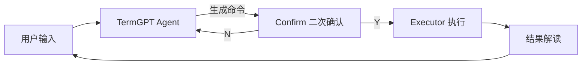

# 项目 01：TermGPT 命令行助手 —— 自然语言变 Shell 命令

> 📝 **本文待写作**。专栏二第 1 篇。程序员每天都用命令行，但记不住那些 `find/awk/sed/git rebase` 的复杂参数 —— 这个项目就是解决这个痛点。

---

## 摘要

**能做什么**：说"找出这个目录最近 3 天改过的 .py 文件"，Agent 帮你想好命令、二次确认、执行、解释结果。
**技术栈**：OpenAI Function Calling + subprocess 沙箱 + Rich（终端 UI）
**代码量**：约 300 行
**对标产品**：GitHub Copilot CLI、Warp AI

---

## 一、这个项目能做什么

### 使用场景

1. **文件查找**："找出这个目录下最近 3 天修改的所有 .py 文件"
2. **Git 操作**："把当前分支的最后 5 次提交生成一个 changelog"
3. **日志分析**："统计一下 nginx access.log 里返回 500 的 IP top 10"
4. **系统排查**："哪个进程占了 8080 端口，把它 kill 掉"

### 演示 GIF/截图

> TODO：录制一段演示视频

---

## 二、技术选型与架构

### 为什么选这个技术栈

- **OpenAI SDK**：Tool Calling 稳定，也支持切换 DeepSeek / Kimi 等国产模型
- **subprocess**：直接调用系统 shell，比 pty 简单
- **Rich**：终端里的 Markdown + 高亮 + 表格

### 架构图



### 核心 Agent 能力

- Tool 1：`generate_command`（自然语言 → shell）
- Tool 2：`execute_command`（带白名单沙箱）
- Tool 3：`explain_output`（结果解读）

---

## 三、环境准备（5 分钟跑通）

```bash
git clone https://github.com/xxx/termgpt.git
cd termgpt
pip install -r requirements.txt
cp .env.example .env  # 填入 OPENAI_API_KEY
python -m termgpt
```

---

## 四、核心代码逐步拆解

### Step 1：Tool Schema 设计

```python
# TODO
```

### Step 2：危险命令拦截（rm -rf、sudo、mkfs 等）

```python
# TODO：正则黑名单 + 白名单双重校验
```

### Step 3：ReAct 循环

```python
# TODO：复用专栏一第 1 篇的 ReAct 骨架
```

### Step 4：Rich 终端 UI

```python
# TODO：命令高亮、Y/N 确认框
```

---

## 五、进阶优化

- **性能**：命令历史缓存，重复查询走本地
- **成本**：小模型（gpt-4o-mini）当路由，大模型（gpt-4o）出答案
- **可靠性**：所有命令执行前落审计日志

---

## 六、部署上线

- 本地 `pip install -e .` 变成全局命令
- 打包成 `pipx` 可安装的 CLI
- macOS Homebrew tap

---

## 七、扩展方向

- 接入 Warp/iTerm 的深度定制
- 支持多语言 shell（zsh / fish / PowerShell）
- 加入学习模式：记录用户偏好命令风格

**关联原理文章（专栏一）**：
- [02.手写第一个 Agent](../01.Agent/02.手写第一个Agent.md)

---

## 八、完整源码

- GitHub 仓库：`https://github.com/xxx/termgpt`（TODO）
- 部署文档：见仓库 README

---

> 📅 计划发布时间：2026-08-19
> ✍️ 写作状态：📝 待写作
