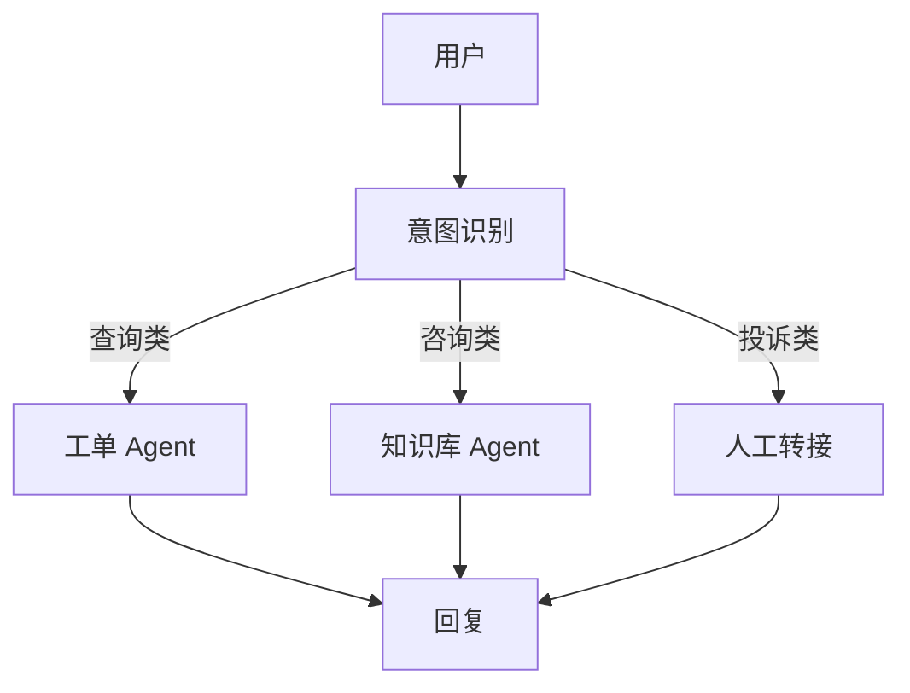

# 项目 07：智能客服 Agent —— 企业级多轮对话系统

> 📝 **本文待写作**。专栏二第 7 篇。SaaS / 电商团队客服人力成本高，重复问题占 80% —— 让 Agent 先接住。

---

## 摘要

**能做什么**：意图识别、知识库检索、工单查询、优雅转人工。
**技术栈**：LangGraph + RAG + 工单 API + Redis 会话
**代码量**：约 1000 行
**对标产品**：Intercom Fin、Zendesk AI

---

## 一、这个项目能做什么

- "我的订单 #12345 什么时候发货？"（工单系统查询）
- "怎么开发票？"（知识库回答）
- 复杂问题自动转人工，附上上下文
- 满意度评估 & 自动改进

---

## 二、技术选型与架构

### 架构图



### 核心 Agent 能力

- 意图分类
- 多轮状态管理（LangGraph State）
- 知识库检索（RAG）
- 工单查询（外部 API）
- 转人工（含上下文摘要）

---

## 三、环境准备

```bash
pip install langgraph langchain-openai redis chromadb
```

---

## 四、核心代码逐步拆解

### Step 1：LangGraph State 设计

### Step 2：意图路由节点

### Step 3：知识库 RAG 子图

### Step 4：工单 API 子图

### Step 5：优雅转人工（上下文摘要 + 满意度采集）

---

## 五、进阶优化

- 高频问题缓存
- 会话超时策略
- 数据回流：AI 回答后人工修正 → 训练集

---

## 六、部署上线

- WebSocket 实时推送
- 前端接入现有客服系统（Zendesk / Intercom）

---

## 七、扩展方向

**关联原理文章（专栏一）**：
- [05.LangGraph 图编排](../01.Agent/05.LangGraph图编排.md)
- [07.RAG + Agent 混合架构](../01.Agent/07.RAG与Agent混合架构.md)

---

## 八、完整源码

- GitHub 仓库：TODO

---

> 📅 计划发布时间：2026-11-11
> ✍️ 写作状态：📝 待写作
