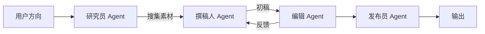

# 项目 08：博客写作助手 —— 从选题到成稿的多 Agent 协作

> 📝 **本文待写作**。专栏二第 8 篇。技术人想写博客，但选题难、大纲乱、初稿慢 —— 组一个 AI 编辑部帮你。

---

## 摘要

**能做什么**：热点抓取 → 选题 → 大纲 → 分段撰写 → SEO 优化。
**技术栈**：CrewAI（研究员 + 撰稿人 + 编辑）+ 搜索工具
**代码量**：约 900 行
**对标产品**：Jasper、Notion AI、Copy.ai

---

## 一、这个项目能做什么

- "我想写 LangGraph 相关的文章"→ 5 个选题 + 目标读者分析
- 选定选题后自动生成大纲、正文、封面图 Prompt
- 一键导出 Markdown / 微信公众号格式

---

## 二、技术选型与架构

### 架构图



### 核心 Agent 能力

- 研究员：Tavily + arXiv 搜索
- 撰稿人：结构化写作
- 编辑：审校 + SEO
- 发布员：多平台格式化

---

## 三、环境准备

```bash
pip install crewai langchain-openai tavily-python
```

---

## 四、核心代码逐步拆解

### Step 1：CrewAI 角色定义

### Step 2：Task 编排

### Step 3：Agent 间的信息传递

### Step 4：质量评估 & 反馈循环

---

## 五、进阶优化

- 加"读者 Agent"模拟目标读者反应
- 多轮迭代改稿

---

## 六、部署上线

- CLI 工具版
- Web 版（Streamlit）

---

## 七、扩展方向

**关联原理文章（专栏一）**：
- [08.多 Agent 协作](../01.Agent/08.多Agent协作.md)

---

## 八、完整源码

- GitHub 仓库：TODO

---

> 📅 计划发布时间：2026-11-25
> ✍️ 写作状态：📝 待写作
