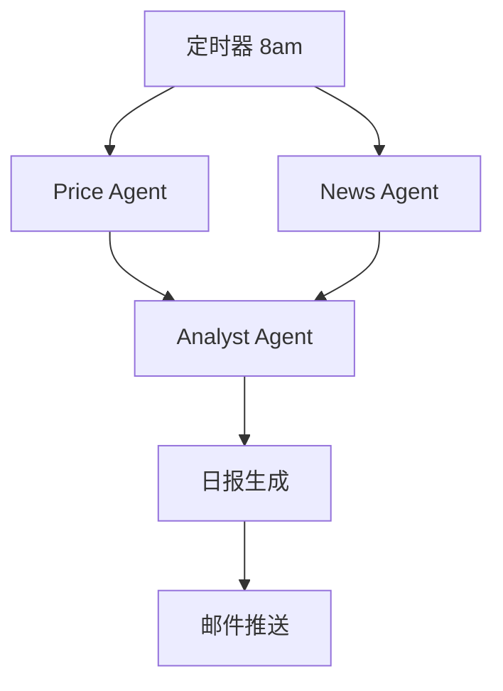

# 项目 10：投资日报 Agent —— 每天早 8 点收到定制财经简报

> 📝 **本文待写作**。专栏二第 10 篇。投资者想每天了解持仓动态，但信息源分散 —— Agent 帮你汇总推送。

---

## 摘要

**能做什么**：抓行情 → 抓新闻 → 情绪分析 → 生成日报 → 邮件推送。
**技术栈**：Akshare / yfinance + 新闻 API + APScheduler + SMTP
**代码量**：约 700 行
**对标产品**：BloombergGPT、聚宽 AI

---

## 一、这个项目能做什么

- 每天早 8 点收到邮件：关注股票的涨跌 + 相关新闻摘要 + AI 情绪判断
- 自选股 / ETF / 加密货币任选
- 异常波动实时推送

---

## 二、技术选型与架构

### 架构图



### 核心 Agent 能力

- Tool：`get_price`（Akshare / yfinance）
- Tool：`search_news`（新闻 API）
- Tool：`analyze_sentiment`（情绪分析）
- Tool：`send_email`（SMTP）

---

## 三、环境准备

```bash
pip install akshare yfinance apscheduler
```

---

## 四、核心代码逐步拆解

### Step 1：行情数据源接入

### Step 2：新闻抓取与去重

### Step 3：情绪分析（正 / 负 / 中）

### Step 4：日报模板 + 邮件推送

### Step 5：APScheduler 定时调度

---

## 五、进阶优化

- 微信推送替代邮件
- 关键事件实时告警
- 组合收益率跟踪

---

## 六、部署上线

- Serverless 部署（阿里云 FC / Cloudflare Workers）

---

## 七、扩展方向

**免责声明**：本项目仅用于技术学习，不构成投资建议。

**关联原理文章（专栏一）**：
- [11.Agent 生产化部署](../01.Agent/11.Agent生产化部署.md)

---

## 八、完整源码

- GitHub 仓库：TODO

---

> 📅 计划发布时间：2026-12-23
> ✍️ 写作状态：📝 待写作
