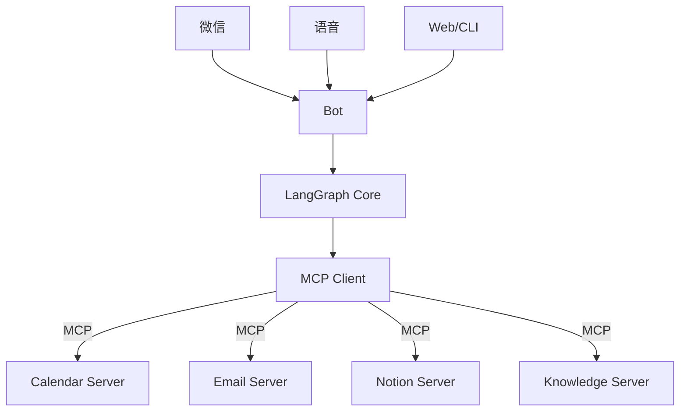

# 项目 15：个人 AI 助理终极版 —— 你的贾维斯

> 📝 **本文待写作**。专栏二收官。把前 14 个项目串成一个 24 小时贴身助手，通过微信 / 语音 / 文字随时召唤。

---

## 摘要

**能做什么**：日程 + 邮件 + 笔记 + 提醒 + 搜索 + 写作，多入口。
**技术栈**：MCP + LangGraph + 微信机器人 + 前面所有项目复用
**代码量**：约 3000 行
**对标产品**：Rewind、Personal.ai

---

## 一、这个项目能做什么

- 微信里说 "帮我准备明天和小王的会议"
- Agent 自动：查日程 → 找历史沟通记录 → 拉相关文档 → 生成议题
- 通过 MCP 挂载各种工具（Calendar / Email / Notion / GitHub）

---

## 二、技术选型与架构

### 架构图



### 核心 Agent 能力

- 多入口（微信 / 语音 / Web / CLI）
- MCP 工具标准化
- 长期记忆（用户画像 + 事实库）
- 主动提醒

---

## 三、环境准备

```bash
pip install langgraph mcp-sdk wechaty
```

---

## 四、核心代码逐步拆解

### Step 1：MCP 工具箱（复用第 9 篇原理）

### Step 2：LangGraph 核心编排

### Step 3：微信入口（Wechaty）

### Step 4：语音入口（Whisper + TTS）

### Step 5：主动提醒（定时任务）

### Step 6：完整部署（Docker + 云服务器）

---

## 五、进阶优化

- 端侧模型降级（网络差用本地）
- 隐私模式（敏感信息不上云）
- 家庭多用户切换

---

## 六、部署上线

- 单人使用：家庭 NAS / 树莓派
- 团队使用：企业微信机器人
- 商业化：SaaS 模式

---

## 七、扩展方向

**这就是你的毕业设计。** 从这里开始，你可以：
- 变成一款商业产品
- 变成一套开源生态
- 变成你个人的数字分身

**关联原理文章（专栏一）**：
- [09.MCP 协议深度解读](../01.Agent/09.MCP协议深度解读.md)
- [12.Agent 架构演进与未来](../01.Agent/12.Agent架构演进与未来.md)

---

## 八、完整源码

- GitHub 仓库：TODO
- 部署文档：TODO
- 视频演示：TODO

---

> 📅 计划发布时间：2027-03-03
> ✍️ 写作状态：📝 待写作
