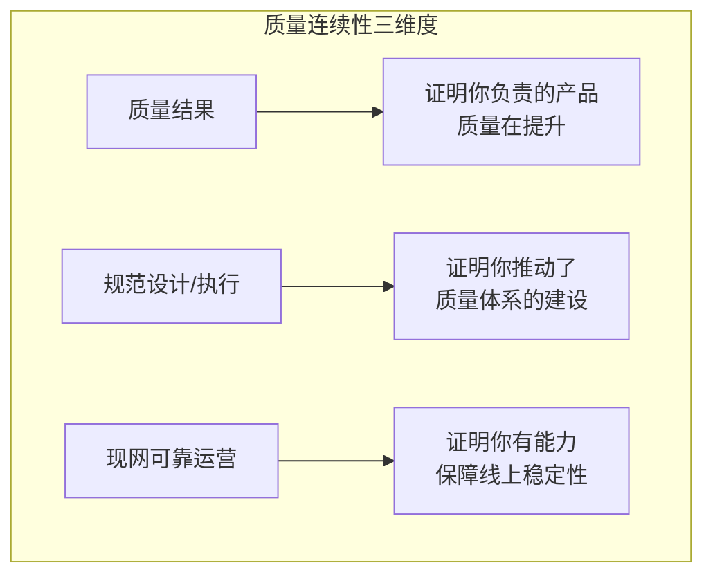
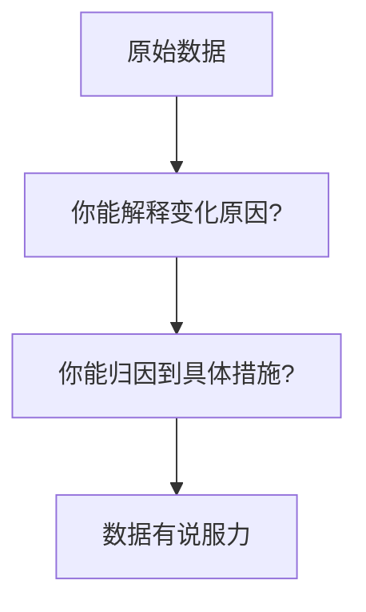
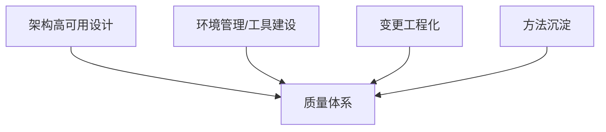
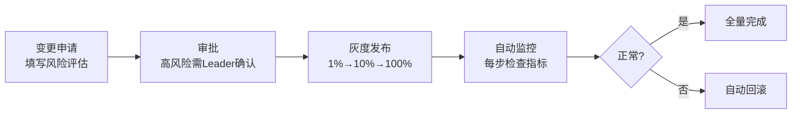

# 02.质量连续评估实战

> 质量连续性关注的是：你的产品在持续迭代中，质量是在变好还是变差？你有没有建立起一套能持续保障质量的工程体系？



## 1、质量结果

### 1.1 负责产品/模块概览

```
产品/模块名称：[填写具体产品名，如"支付中台 / 订单服务 / Web控制台"]
核心职责：[简述你在这个产品中的角色，如"前端负责人 / 后端核心开发"]
```

### 1.2 数据表现

用**对比数据**说话——单一数字没有说服力，要有趋势和对比：

| 指标维度 | 当前周期数据 | 上一周期数据 | 变化趋势 |
|----------|-------------|-------------|----------|
| **研发阶段缺陷率** | 0.3% | 0.8% | ↓ 62% |
| **线上问题数（月均）** | 1.5个 | 4个 | ↓ 63% |
| **其中 P0/P1 级别** | 0个 | 2个 | ↓ 100% |
| **可用性/成功率** | 99.99% | 99.95% | ↑ 0.04% |
| **前端性能指标** | 白屏率0.2% | 白屏率1.5% | ↓ 87% |

> **填写技巧**：选3-5个最能代表你工作成果的指标，优先展示**改善最显著**的数据。

### 1.3 数据的三层含义



**示例：**

```
❌ 弱表述："线上问题减少了"
✅ 强表述："线上P0/P1问题从月均2个降至0，主要归因于：
      1) 引入自动化回归测试套件（覆盖80%的核心链路）
      2) 上线前的灰度发布+自动监控（拦截了3次潜在故障）"
```

### 1.4 按领域扩展

| 领域 | 可补充的指标 |
|------|-------------|
| 前端 | 白屏率、首屏加载时间、JS错误率、API成功率 |
| 后端 | 服务可用性、P99延迟、错误率、吞吐量 |
| 数据 | 数据一致率、ETL失败率、数据延迟 |
| 移动端 | 崩溃率、ANR率、启动时间、网络成功率 |
| 测试 | 自动化覆盖率、逃逸率、缺陷发现效率 |

## 2、质量规范设计/执行贡献度

### 2.1 核心贡献矩阵



#### a. 架构高可用设计

| 设计维度 | 具体措施 | 解决的问题 |
|----------|----------|-----------|
| **容错降级** | 核心链路降级方案，非关键模块故障不影响主流程 | 单模块故障导致雪崩 |
| **冗余设计** | 多AZ部署、主备切换 | 单点故障（SPOF） |
| **限流熔断** | 流量控制+熔断机制 | 突发流量打垮系统 |
| **超时重试** | 合理设置的超时和重试策略 | 临时抖动引起故障 |
| **幂等设计** | 接口幂等，支持安全重试 | 重复请求导致数据错误 |

**举例：**

```
场景：支付服务的下游库存服务偶发超时

措施：
1. 支付服务增加 2s 超时 + 3次重试（指数退避）
2. 库存服务增加限流（QPS上限5000）
3. 支付服务增加本地库存预热缓存（降级时使用）

效果：因库存服务故障导致的支付失败率从 2% 降至 0.01%
```

#### b. 环境管理与稳定性工具建设

| 工具/能力 | 建设内容 | 量化效果 |
|-----------|----------|----------|
| **前端自动化测试** | 单元测试 + 集成测试 + E2E，CI集成 | 覆盖率从30%提升到80% |
| **前端监控体系** | 接入错误监控 + 性能监控 + 业务埋点 | 平均故障发现时间从2小时缩短到5分钟 |
| **本地开发环境** | Docker Compose一键启动 | 新人上手从3天缩短到2小时 |
| **CI/CD流水线** | 代码提交 → 静态扫描 → 构建 → 测试 → 部署 | 发布耗时从2小时缩短到15分钟 |

#### c. 变更工程化

标准化流程的关键节点：



| 环节 | 具体措施 | 避免的问题 |
|------|----------|-----------|
| 风险评估 | 变更分级（低/中/高风险） | 高风险变更走简化流程 |
| 卡点设计 | 每次灰度后自动检查错误率和延迟 | "我以为没问题"的侥幸心理 |
| 回滚机制 | 一键回滚 + 自动回滚 | 手动回滚慢、易出错 |
| 变更记录 | 所有变更可追溯（谁、何时、改了什么） | 出了问题找不到责任人 |

#### d. 方法沉淀

将个人经验转化为团队资产：

| 产出类型 | 示例 | 影响范围 |
|----------|------|----------|
| 规范文档 | 《前端代码评审CheckList》 | 团队全员使用 |
| 工具沉淀 | 自动化测试框架封装 | 推广至5个项目 |
| 最佳实践 | 《前端性能优化实战指南》 | 部门级知识库 |
| 培训分享 | 《稳定性测试入门》培训 | 覆盖30+人 |

> **技巧**：突出"推广"而非"自用"——工具和方法只有被更多人使用，才算真正创造了价值。

## 三、现网可靠运营贡献度

### 3.1 混沌验证

混沌工程的核心思想：**主动注入故障来验证系统的韧性。**

| 注入场景 | 验证目标 | 预期行为 |
|----------|----------|----------|
| 模拟后端接口超时 | 验证前端超时处理 | 展示友好的超时提示，不白屏 |
| 模拟后端返回异常数据 | 验证前端数据校验 | 展示降级UI，不崩溃 |
| 模拟CDN资源加载失败 | 验证Fallback机制 | 加载本地备用资源 |
| 模拟WebSocket断连 | 验证重连机制 | 自动重连，提示用户 |
| 模拟高延迟（2s+） | 验证Loading态 | 展示Loading动画，不卡死 |

**举例：**

```
混沌演练案例：模拟支付接口返回非预期格式数据

注入方式：
  Route拦截支付接口，返回 {"code": -1, "msg": "系统繁忙", "data": null}

验证结果：
  ✅ 页面展示"支付暂时不可用，请稍后重试"的友好提示
  ✅ 未出现白屏或JS报错
  ✅ 用户可正常浏览其他内容
  ❌ 初始版本未展示重试按钮 → 已修复，增加"重试"按钮

改进：补充了全局异常数据处理中间件，对所有API返回做格式校验
```

### 3.2 容灾调度

| 调度能力 | 方案 | 验证方式 |
|----------|------|----------|
| **多CDN容灾** | CDN A为主，CDN B为备，故障时自动切换 | 模拟CDN A不可达，验证是否自动切到B |
| **流量切换** | 某机房故障时，流量自动调度到备用机房 | 模拟机房断电，观察流量切换耗时 |
| **降级开关** | 非核心功能关闭，保证核心链路可用 | 大促压测时打开降级开关，验证核心链路能力 |

### 3.3 人因风险治理

**人因故障是所有故障中占比最高的类型**，治理人因风险是运营中最重要的工作之一：

| 风险类型 | 治理措施 | 落地方式 |
|----------|----------|----------|
| 操作失误 | 操作清单+双人复核 | 生产环境操作必须双人在场 |
| 权限过大 | 最小权限原则 | 日常账号无生产写入权限 |
| 流程缺失 | SOP标准化 | 所有高频操作都文档化 |
| 误删数据 | 软删除+回收站 | 删除操作需二次确认 |

### 3.4 效果量化

```
量化公式：
  系统韧性提升 = (治理前故障数 - 治理后故障数) / 治理前故障数 × 100%
  人为故障降低 = 人为故障数 / 总故障数（治理前后对比）
  MTTR缩短 = 治理前MTTR - 治理后MTTR

示例成果：
  - 系统韧性提升 40%（故障从月均5个降至3个）
  - 人为故障降低 70%（从月均3个降至1个）
  - MTTR从2小时缩短到30分钟
```

---

> **小结**：质量连续性评估不是交作业，而是**证明你从"会写代码"到"会建体系"的成长**——用数据说话，用案例举证，用影响力证明。
