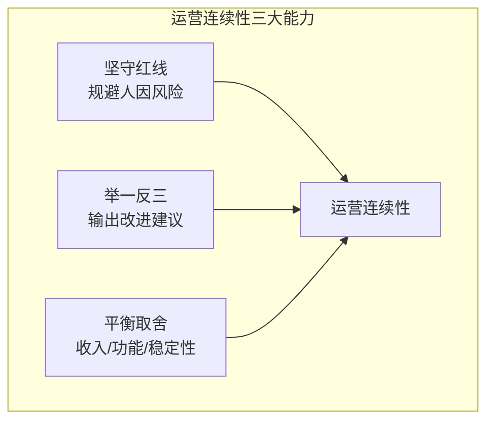
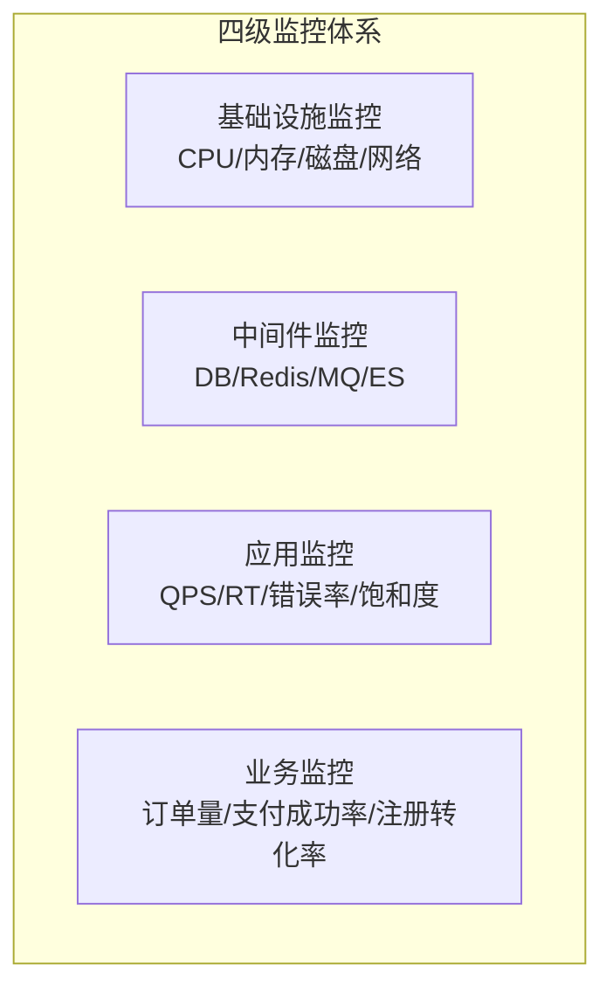
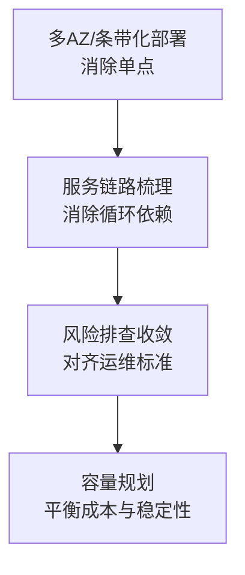
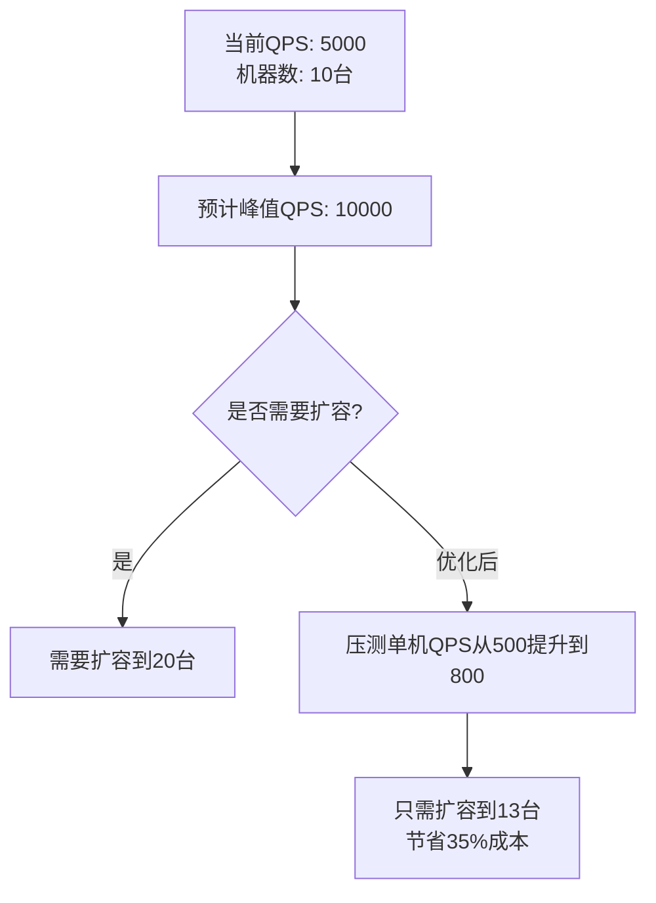
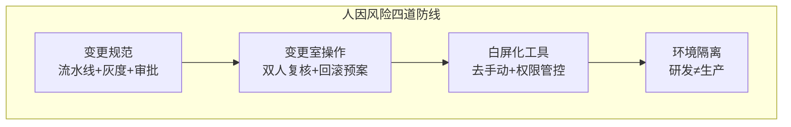

# 03.运营连续评估实战

> 运营连续性检验的是：你能否在日常运营中守住红线、从问题中举一反三、在矛盾中做出正确的取舍？



## 1、应用场景陈述

以下按四类典型场景展开，候选人需结合实际案例深入阐述。

### 场景一：日常演练、监控和巡检


#### 1. 混沌演练与故障注入

| 演练类型 | 注入方式 | 验证目标 | 演练频率 |
|----------|----------|----------|----------|
| 依赖故障 | 模拟下游服务返回5xx | 降级策略是否生效 | 月度 |
| 网络故障 | 注入延迟/丢包 | 超时和重试机制 | 月度 |
| 资源耗尽 | 打满CPU/内存 | OOM保护和服务自愈 | 季度 |
| 机房级故障 | 模拟单机房断电 | 多AZ/多机房容灾 | 季度 |

**优秀案例展示：**

```
案例：通过混沌演练发现Redis故障隐患

演练场景：模拟Redis主节点宕机（kill Redis主进程）

预期行为：Sentinel自动切换 → 从节点提升为主 → 业务无感知

实际结果：
  ✅ Sentinel在30s内完成切换
  ❌ 部分请求在切换窗口内报错（连接池未及时刷新）
  ❌ 业务日志出现了5秒的连续错误

根因分析：
  - 连接池的超时配置偏长，未及时感知到连接失效
  - 缺少重试机制，切换期间的请求直接失败了

改进措施：
  1. 缩短连接超时到1s，增加连接健康检查
  2. 增加3次重试（切换期间会自动重试到新主节点）
  3. 将此经验输出为《Redis高可用配置清单》推广至其他服务

效果：再次演练时，切换窗口内零错误
```

#### 2. 完善监控体系建设



| 监控层级 | 关注指标 | 告警阈值示例 |
|----------|----------|-------------|
| 基础设施 | CPU > 80%、磁盘 > 85% | 连续5分钟触发告警 |
| 中间件 | Redis命中率 < 90%、DB慢查询>100ms | 实时告警 |
| 应用层 | 错误率 > 0.1%、P99延迟 > 1s | 1分钟内触发 |
| 业务层 | 支付成功率 < 99%、订单量骤降50% | 5分钟内触发（避免波动误报） |

> **关键原则**：监控不是越多越好，告警不是越灵敏越好——**告警疲劳比漏告警更危险**。

#### 3. 巡检发现隐患

| 巡检类型 | 巡检内容 | 频率 | 工具 |
|----------|----------|------|------|
| 机器巡检 | CPU/内存/磁盘使用率、进程状态 | 每日自动化 | Prometheus + 脚本 |
| 服务巡检 | 端口监听、健康检查接口 | 每5分钟 | 自研巡检平台 |
| 日志巡检 | ERROR日志关键词扫描 | 每小时 | ELK/日志平台 |
| 安全巡检 | 过期证书、弱密码、未授权端口 | 每周 | 安全扫描平台 |

---

### 场景二：架构治理



#### 1. 多AZ与条带化部署

| 部署模式 | 适用场景 | 容灾能力 |
|----------|----------|----------|
| **单AZ部署** | 开发/测试环境 | 无容灾 |
| **多AZ主备** | 一般业务 | 主AZ故障，手动或自动切换到备AZ |
| **多AZ双活** | 核心业务（支付/登录） | 两个AZ同时提供服务，单AZ故障时另一AZ平滑承接 |
| **条带化部署** | 多租户/多业务线 | 按租户隔离，单租户故障不影响其他 |

**治理案例：**

```
场景：某服务部署在单AZ，该AZ网络故障导致全站不可用30分钟

治理方案：
  1. 将服务从单AZ改造为双AZ双活部署
  2. 引入负载均衡，流量按AZ均匀分配
  3. 配置健康检查，自动摘除故障AZ的节点

效果：
  - 服务可用性从99.9%提升到99.99%（年度故障时间从8.7小时降到52分钟）
  - 单AZ故障时业务完全无感知
```

#### 2. 服务链路梳理与风险排查

**消除循环依赖：**

```
问题发现方法：
  1. 通过调用链追踪（如Jaeger/Zipkin）生成服务依赖图
  2. 用图算法检测环路（DFS/Cycle Detection）
  3. 标记循环依赖链路

治理策略：
  - 短期：增加熔断和超时保护，防止循环调用无限递归
  - 长期：通过异步消息解耦，打破循环依赖
```

**对齐运维标准：**

| 检查项 | 标准 | 不符合的整改措施 |
|--------|------|----------------|
| 日志格式 | 统一JSON格式，包含traceId | 改造日志框架配置 |
| 健康检查 | 所有服务必须有 /health 接口 | 补充健康检查端点 |
| 优雅关闭 | 收到SIGTERM后等待现有请求处理完 | 增加Graceful Shutdown |
| 配置管理 | 配置中心统一管理，不硬编码 | 迁移到Apollo/Nacos |
| 容器化 | 使用标准基础镜像 | 替换为团队统一镜像 |

#### 3. 容量规划



| 规划维度 | 关注点 | 优化策略 |
|----------|--------|----------|
| 集群水位 | 日常CPU ≤ 60%（留40%buffer扛突发） | 水平扩容或优化代码 |
| 实例备份 | 关键服务至少保留1个备用实例 | 防止单实例故障引起全局不可用 |
| 大促扩容 | 提前1周完成扩容和压测验证 | 按历史峰值×1.5倍准备 |

---

### 场景三：应急预案、故障分析及改进


#### 1. 故障快速恢复

**标准SOP模板：**

```
第一步：发现故障（监控告警 / 用户反馈 / 巡检发现）
  → 确认影响范围（哪些用户/哪些功能）

第二步：故障升级
  → 根据影响范围判断严重等级（P0/P1/P2）
  → P0故障：立即通知Leader + 拉应急群

第三步：快速止损
  → 优先恢复服务，而非定位根因
  → 手段：回滚最近发布 / 降级非核心功能 / 切换备用服务 / 扩容

第四步：故障恢复
  → 恢复后持续观察监控指标30分钟
  → 确认全部指标恢复正常

第五步：故障记录
  → 记录时间线：发现→响应→止损→恢复各阶段耗时
```

#### 2. 故障复盘机制

**复盘模板核心要素：**

| 要素 | 内容 |
|------|------|
| **时间线** | 精确到分钟的故障演进过程 |
| **影响范围** | 受影响的用户数/订单数/业务量 |
| **根因** | 5 Why分析追溯到根本原因 |
| **直接原因** | 触发故障的技术原因（如配置错误、代码bug） |
| **根本原因** | 为什么这个问题没有被更早发现？（流程/工具/意识缺失） |
| **改进措施** | 分短期（本周）和长期（本月/本季度） |
| **责任人** | 每个改进项明确到人 |
| **验证标准** | 如何确认改进措施真正生效？ |

#### 3. 举一反三：从单点故障到批量治理

```
案例：一次配置变更导致的服务雪崩

故障描述：
  运维修改了支付服务的超时配置（从3s改为10s），
  导致支付请求大量堆积，最终支付服务OOM崩溃

根因分析：
  1. 直接原因：超时设置过大，请求堆积耗尽线程池
  2. 根本原因：
     - 配置变更无审批流程（人因风险）
     - 缺少配置变更后的自动验证
     - 线程池无保护机制（无界队列）

举一反三：
  1. 扫描全部门所有服务的超时配置 → 发现12个不合理配置 → 统一修正
  2. 扫描所有服务的线程池配置 → 发现8个服务使用无界队列 → 改为有界+拒绝策略
  3. 输出《服务配置安全基线》推广至全部门

成果：
  - 发现潜在风险项：20+个
  - 覆盖服务：15个
  - 避免类似故障再次发生
```

---

### 场景四：人因风险治理



#### 1. 变更规范与流水线

| 阶段 | 规范要求 | 自动化程度 |
|------|----------|-----------|
| 灰度发布 | 分批次上线：1% → 10% → 50% → 100% | 流水线自动执行 |
| 地域灰度 | 按地域逐步发布（先华南 → 华北 → 全国） | 配置化控制 |
| 自动验证 | 每批灰度后自动检查错误率/延迟 | 指标异常自动中止 |
| 自动回滚 | 验证失败自动回滚 | 完全自动化 |

#### 2. 变更室操作规范

| 规范 | 要求 |
|------|------|
| 双人操作 | 生产环境操作必须双人在场（一人操作、一人复核） |
| 回滚预案 | 每次变更前必须有回滚方案，且验证过回滚可行性 |
| 操作记录 | 录屏/截屏 + 操作日志，事后可追溯 |
| 变更窗口 | 非紧急变更在低峰期（凌晨2-6点）操作 |

#### 3. 白屏化运营工具

**目标：让操作不再依赖SSH登录机器、手敲命令**

| 工具能力 | 解决的问题 | 
|----------|-----------|
| 可视化发布 | 不用登录机器手动执行脚本，避免误操作 |
| 配置变更界面 | 配置修改通过Web界面，有审批+校验+回滚 |
| 一键扩容/缩容 | 白屏化扩容，避免手动操作导致不均衡 |
| 日志查询 | 不用登录机器 `grep`，通过平台即可检索 |

#### 4. 研测环境隔离

| 隔离维度 | 要求 |
|----------|------|
| 网络隔离 | 研发环境不能访问生产数据库 |
| 数据隔离 | 测试数据不得包含真实用户信息 |
| 配置隔离 | 研发/测试/生产的配置分开管理 |
| 权限隔离 | 日常账号无生产环境的写入权限 |

---

## 二、应用效果举证

### 举证框架

| 举证维度 | 填写指引 |
|----------|----------|
| **个人角色** | 项目负责人 / 核心开发 / 测试负责人 |
| **工作内容** | 具体做了哪些事（量化：主导X次演练、输出Y篇规范） |
| **应用场景** | 在什么系统/业务中使用 |
| **解决的问题** | 什么样的稳定性问题得到了改善 |
| **稳定性数据** | 近半年的故障数、MTTR、可用性等关键数据对比 |

### 数据举证示例

| 指标 | 治理前 | 治理后 | 改善幅度 |
|------|--------|--------|----------|
| 近半年故障数 | 12个 | 4个 | ↓ 67% |
| P0/P1故障 | 3个 | 0个 | ↓ 100% |
| MTTR | 2小时 | 30分钟 | ↓ 75% |
| 服务可用性 | 99.9% | 99.99% | ↑ 0.09% |
| 演习次数 | 季度2次 | 季度6次 | ↑ 200% |
| 改进项数量 | — | 15项 | — |
| 覆盖产品数 | — | 6个产品 | — |

---

## 三、影响力与知识沉淀（加分项）

| 维度 | 举证方向 | 示例 |
|------|----------|------|
| **方法论沉淀** | 输出的最佳实践/建设经验 | 《稳定性测试设计指南》、《容灾演练SOP》 |
| **内部分享** | 中心/部门/BG级分享 | 主题×次数×覆盖人数×反馈评分 |
| **行业影响力** | 专利/开源/技术文章 | 专利×项、社区贡献×次 |
| **客户认可** | 外部客户正向反馈 | 客户感谢信/合作案例 |

---

> **小结**：运营连续性的核心在于**从"被动响应"到"主动治理"的转变**——把每一次故障都当成改进的契机，把一个点的改进推广成一个面的治理，把个人经验沉淀为团队的能力。
