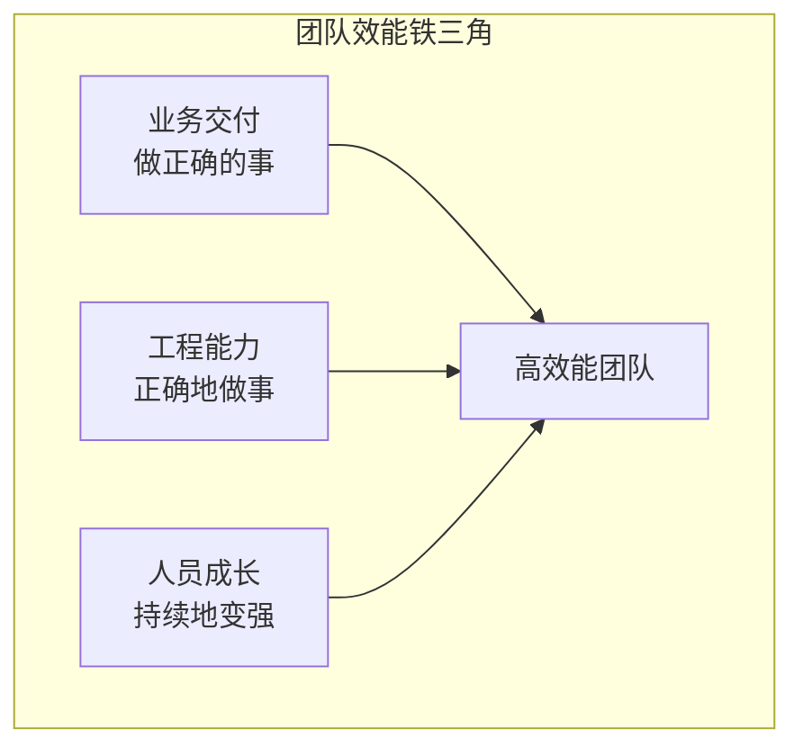
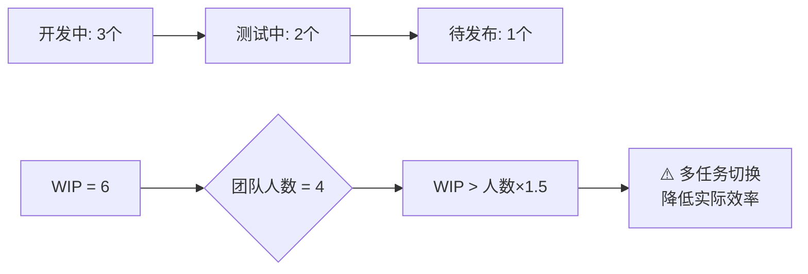
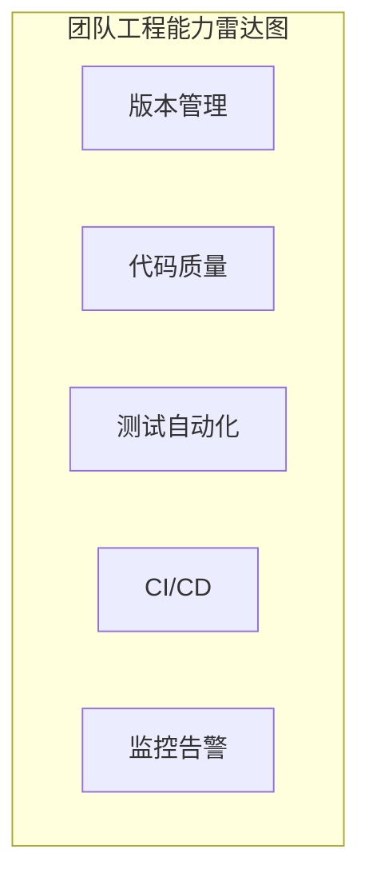
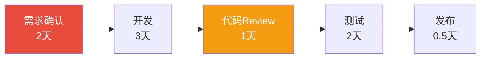

# 技术团队效能评估

> 当你的角色从"写代码的人"变成"带人写代码的人"，核心命题变成了——如何让一群人高效地做出正确的事？



## 一、从个人效能到团队效能

| 维度 | 个人效能 | 团队效能 |
|------|----------|----------|
| 衡量单元 | 一个人的产出 | 一群人的产出 × 协同系数 |
| 瓶颈来源 | 个人能力和时间 | 沟通成本、对齐成本、等待成本 |
| 提升方式 | 学习、工具、习惯 | 流程、规范、文化、工具链 |
| 复杂度 | 线性 | 非线性（团队越大，摩擦越大） |

> 10个高手组成的团队，效率不一定等于10倍的单人效率。如果协同不好，可能连5倍都不到。

## 二、交付效能评估

### 2.1 核心交付指标

| 指标 | 计算方式 | 健康基线 | 说明 |
|------|----------|----------|------|
| **需求吞吐量** | 每迭代完成的需求数（按Story Point） | 稳定或上升 | 团队整体产能 |
| **交付周期** | 需求确认到功能上线的时间 | ≤ 5天 | 越小越敏捷 |
| **交付可预测性** | 承诺完成 / 实际完成 | ≥ 90% | 不是做得快，而是说到做到 |
| **WIP（在制品）** | 同时进行中的任务数 | ≤ 人数 × 1.5 | 过多WIP = 上下文切换成本 |

### 2.2 需求吞吐量

**不是做得越多越好**，而是稳定输出：

```
健康的吞吐量趋势：
  Sprint 1: 32 SP
  Sprint 2: 35 SP
  Sprint 3: 33 SP
  Sprint 4: 36 SP  ← 稳定在32-36之间

不健康的吞吐量：
  Sprint 1: 25 SP
  Sprint 2: 50 SP（加班赶工）← 不可持续
  Sprint 3: 10 SP（疲惫修Bug）← 恶性循环
```

### 2.3 WIP 限制



**实际数据：** 每多并行一个任务，效率下降约20%（上下文切换成本）。当一个人同时做4件事时，实际有效产出可能只有单任务的40%。

## 三、工程能力评估

### 3.1 工程实践成熟度

从五个维度给团队的工程能力打分（每个维度1-5分）：

| 维度 | Level 1（初始） | Level 3（规范） | Level 5（卓越） |
|------|:--:|:--:|:--:|
| **版本管理** | 无规范，随意提交 | 规范分支策略+语义化提交 | 完善的Git工作流+自动化检查 |
| **代码质量** | 无Review，无静态检查 | 有Review流程+静态扫描 | CI门禁+自动修复+定期技术债治理 |
| **测试自动化** | 手工测试为主 | 核心链路自动化 | TDD+全链路自动化覆盖 |
| **CI/CD** | 手动构建部署 | 自动化流水线 | 一键发布+自动回滚+灰度 |
| **监控告警** | 用户反馈才知道 | 基础监控已覆盖 | 全链路追踪+智能告警+自愈 |

### 3.2 工程能力评分卡



**评分标准：**

| 分数 | 含义 | 举例 |
|------|------|------|
| 1 | 基本没有 | 手动FTP上传部署 |
| 2 | 初步尝试 | 有Jenkins但经常挂 |
| 3 | 规范化 | 标准化流水线，团队遵循 |
| 4 | 自动化 | 大部分流程自动化，人工仅做关键确认 |
| 5 | 智能化 | 自动检测+自愈，持续优化 |

### 3.3 技术债管理

| 指标 | 计算方式 | 健康值 |
|------|----------|--------|
| 技术债比率 | 修复成本 / 重写成本 | < 10% |
| 技术债处理占比 | 每迭代用于还技术债的时间 | 15-25% |
| 代码异味密度 | SonarQube Bugs/漏洞数 / KLOC | < 5/KLOC |
| 重复代码率 | 重复代码行数 / 总行数 | < 3% |

## 四、团队健康度评估

### 4.1 四个健康维度

| 维度 | 健康信号 | 危险信号 |
|------|----------|----------|
| **工作节奏** | 稳定产出，正常下班 | 长期加班，周末赶工 |
| **人员稳定** | 低离职率，主动成长 | 核心人员流失，招聘困难 |
| **知识分布** | 知识共享，互有备份（Bus Factor > 2） | 关键模块只有1个人懂 |
| **协作氛围** | 积极讨论，互相帮助 | 互相推诿，抱怨增多 |

### 4.2 Bus Factor 评估

```
Bus Factor = 最少几个人突然离职/请假，会导致项目无法继续

健康值：≥ 3
危险值：1-2

检查方法：
  列出核心模块 → 标记每个模块的"唯一知情人"数
  → 对只有1个人的模块，尽快安排知识传递
```

### 4.3 会议效率

| 指标 | 健康值 |
|------|--------|
| 会议时间占比 | < 20%（每周 ≤ 8小时） |
| 站会时长 | ≤ 15分钟 |
| 会议有结论率 | ≥ 90% |
| 异步替代率（能用文档解决的不用开会） | ≥ 50% |

## 五、效能度量的反模式

### 5.1 不要用代码行数衡量产出

```
❌ 错误指标：代码行数 / 提交次数
   → 会导致开发者写出啰嗦的代码来"刷数据"

✅ 正确指标：需求吞吐量（Story Point） / 交付周期
```

### 5.2 不要用Bug数惩罚开发者

```
❌ 错误做法：Bug多的人绩效差
   → 会导致隐藏Bug、推卸责任

✅ 正确做法：关注Bug逃逸率和修复质量
   → 鼓励尽早暴露问题，关注修复是否彻底
```

### 5.3 不要只看个人，忽略协同

```
❌ 错误：每个人都很忙，但团队产出低
   → 瓶颈可能在依赖/等待/返工

✅ 正确：看价值流图，找瓶颈环节
   → 消除等待和阻塞，整体提速
```

## 六、效能提升实践

### 6.1 价值流图分析



分析思路：总耗时 8.5 天，活跃工作 5.5 天，等待 3 天（需求确认2天 + Review等待1天）。

改进方向：需求确认前置 → 定期Review → 总周期缩短至5天。

### 6.2 消除等待

| 等待类型 | 消除方式 |
|----------|----------|
| 等待需求澄清 | PO驻场 + 需求准入标准 |
| 等待Code Review | 强制4小时内Review的SLA |
| 等待测试环境 | 环境自动化（Testcontainers） |
| 等待部署 | CI/CD全自动化 |
| 等待其他团队 | 明确接口契约 + Mock服务 |

### 6.3 技术债务治理节奏

```
每迭代节奏：
  - 70% 时间：新功能开发
  - 20% 时间：技术债治理
  - 10% 时间：学习/创新/自发改进

如果技术债太多，调整为 50-30-20，直到回到健康水平
```

## 七、举证框架

### 7.1 从六个维度举证

| 维度 | 举证方向 | 量化方式 |
|------|----------|----------|
| **交付** | 需求吞吐量、交付周期 | 同比/环比变化 |
| **质量** | 线上故障数、逃逸率 | 趋势对比 |
| **效率** | 构建时间、部署频率 | 优化前后对比 |
| **成本** | 资源利用率、人均成本 | 节省金额/比例 |
| **工程** | CI/CD成熟度、自动化率 | 能力评分前后对比 |
| **人员** | 留存率、Bus Factor | 具体人数变化 |

### 7.2 举证示例

```markdown
## 团队效能提升案例：[XX团队]

### 背景
团队8人，负责3个微服务的开发和维护。
痛点：需求交付周期长（平均12天），线上故障多（月均3个P1）。

### 分析与改进

| 维度 | 发现的问题 | 改进措施 | 效果 |
|------|-----------|----------|------|
| 交付 | WIP过高，人均并行3个任务 | 限制WIP≤2，看板可视化 | 交付周期 12天→5天 |
| 质量 | 缺少Code Review | 强制Review+静态扫描CI门禁 | P1故障 月均3→0.5个 |
| 效率 | 手工部署每次1小时 | 搭建CI/CD流水线 | 部署 1h→10min |
| 认知 | 只有1个人懂支付模块 | 每周知识分享+结对编程 | Bus Factor 1→3 |

### 综合效果
- 需求交付周期缩短 58%
- 线上P1故障降低 83%
- 团队NPS（净推荐值）从 60 提升到 85
```

## 八、小结

技术团队效能评估的本质：

1. **看全局不看局部**：一个人快不代表团队快，消除瓶颈比提高个人效率更重要
2. **看趋势不看单点**：效能的提升是持续的过程，关注长期趋势
3. **数据+感知双验证**：数据告诉你"效率如何"，团队氛围告诉你"可持续吗"
4. **限制WIP = 提升效率**：做得少才能做得好，做得好才能做得快

> 高绩效团队不是找到10个超级明星，而是让10个普通人通过好的流程、工具和文化，协同出超越个体的成果。
