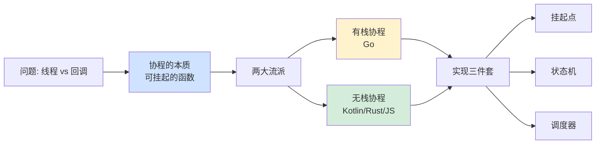
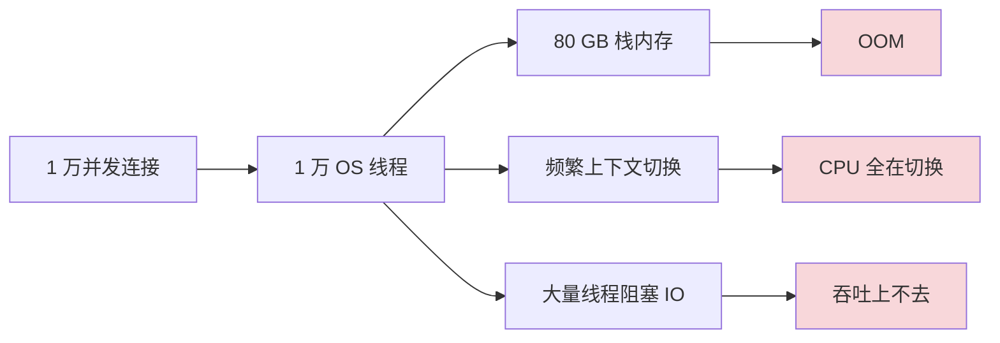
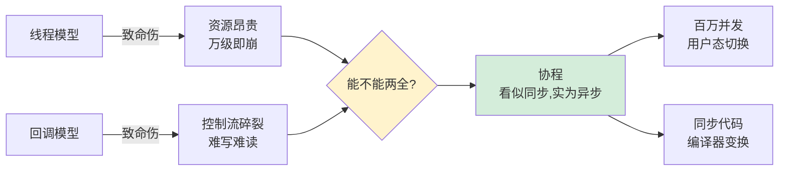
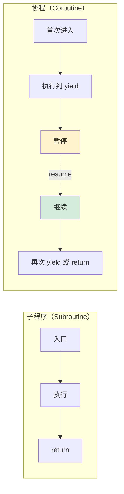
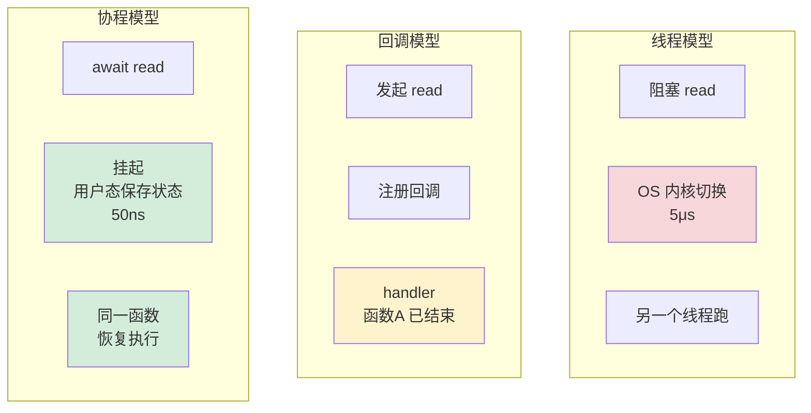
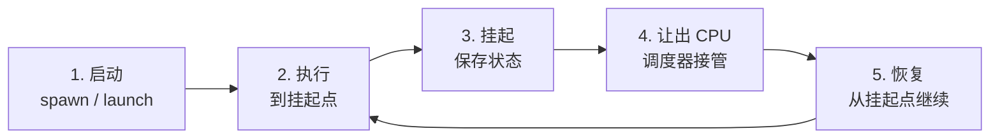
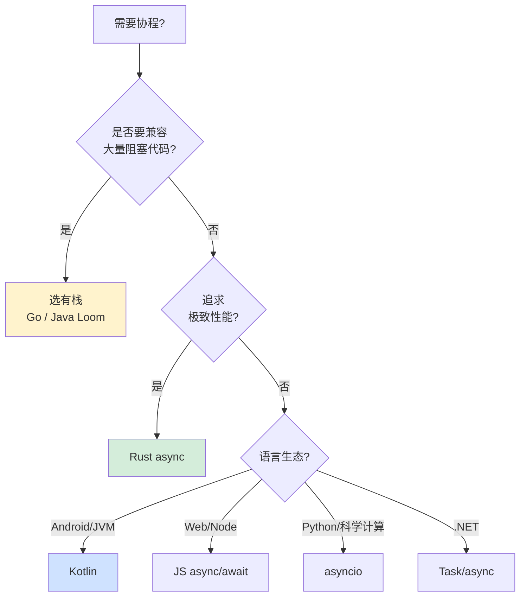

<!-- # 13.协程核心设计思想 -->

🎯 **核心矛盾**：**线程太重（万级就崩）vs 回调太反人类（嵌套到地狱）—— 50 年来工程界一直在两个极端之间摇摆，能不能既要线程的"看起来同步"，又要事件驱动的"百万并发"？**

🧭 **设计灵魂**：协程不是"轻量级线程"——它是**对"函数只能从头到尾执行"这条铁律的根本性打破**。函数能在中间暂停、把状态存起来、之后再恢复——这个能力一旦获得，整个并发世界为之改写

🌐 **跨语言覆盖**：Go goroutine（有栈）· Kotlin suspend（无栈）· Rust async fn（无栈+Future）· Python asyncio · JavaScript generator/async · C# Task（鼻祖）· Java Virtual Thread（Project Loom）

---

上一篇我们看到了"单线程模型 + 事件循环"如何应对高并发——但写出来的代码满是 `then().then().then()`、Promise 套 Promise，**异步逻辑被打散成无数回调**。本篇要回答一个工程师追问 50 年的问题：**能不能既保留事件驱动的高并发能力，又让代码"看起来像同步的样子"？**

答案是——**协程**。本篇从一个"线程池打满"的真实事故切入，揭开协程的本质：**一个能在中间暂停、保存状态、之后恢复的函数**。

- [01.真实事故](#01真实事故)
  - [1.1 线程池雪崩](#11-线程池雪崩)
  - [1.2 Java21革命](#12-java21革命)
  - [1.3 灵魂三问](#13-灵魂三问)
  - [1.4 探索路径](#14-探索路径)
  - [1.5 为何讲透](#15-为何讲透)
- [02.线程与回调困境](#02线程与回调困境)
  - [2.1 三大天花板](#21-三大天花板)
  - [2.2 回调反人类](#22-回调反人类)
  - [2.3 根本矛盾](#23-根本矛盾)
  - [2.4 六十年等待](#24-六十年等待)
- [03.协程的本质](#03协程的本质)
  - [3.1 协程通用原理](#31-协程通用原理)
  - [3.2 子程序到协程](#32-子程序到协程)
  - [3.3 挂起与恢复](#33-挂起与恢复)
  - [3.4 线程回调对比](#34-线程回调对比)
  - [3.5 语法糖与否](#35-语法糖与否)
  - [3.6 协程与IO多路复用](#36-协程与io多路复用)
- [04.有栈与无栈](#04有栈与无栈)
  - [4.1 有栈Goroutine](#41-有栈goroutine)
  - [4.2 无栈async](#42-无栈async)
  - [4.3 两派对比](#43-两派对比)
  - [4.4 转投无栈](#44-转投无栈)
- [05.实现三件套](#05实现三件套)
  - [5.1 挂起点](#51-挂起点)
  - [5.2 CPS变换](#52-cps变换)
  - [5.3 调度器](#53-调度器)
  - [5.4 无栈的核心优势](#54-无栈的核心优势)
- [06.跨语言对比](#06跨语言对比)
  - [6.1 Kotlin](#61-kotlin)
  - [6.2 Go](#62-go)
  - [6.3 Rust](#63-rust)
  - [6.4 JavaScript](#64-javascript)
  - [6.5 Python](#65-python)
  - [6.6 Java虚拟线程Project Loom](#66-java虚拟线程project-loom)
  - [6.7 横评表](#67-横评表)
- [07.协程的经典陷阱](#07协程的经典陷阱)
  - [7.1 协程内阻塞](#71-协程内阻塞)
  - [7.2 忘await](#72-忘await)
  - [7.3 协程泄漏](#73-协程泄漏)
  - [7.4 上下文丢失](#74-上下文丢失)
  - [7.5 过细切换](#75-过细切换)
  - [7.6 陷阱六：异常吞没](#76-陷阱六异常吞没)
  - [7.7 CPU用IO池](#77-cpu用io池)
- [08.共性抽象与演进](#08共性抽象与演进)
  - [8.1 共同骨架](#81-共同骨架)
  - [8.2 结构化并发](#82-结构化并发)
  - [8.3 五十年循环](#83-五十年循环)
  - [8.4 未来演进](#84-未来演进)
- [09.陷阱速查](#09陷阱速查)
- [10.真言映射](#10真言映射)
- [11.总结](#11总结)
  - [11.1 三层认知阶梯](#111-三层认知阶梯)
  - [11.2 选型决策树](#112-选型决策树)
  - [11.3 七字真言](#113-七字真言)
  - [11.4 下篇承接](#114-下篇承接)
  - [11.5 设计哲学](#115-设计哲学)
- [🔗 延伸阅读](#-延伸阅读)

---

## 01.真实事故

### 1.1 线程池雪崩

我维护过一个 Spring Boot 微服务，处理订单查询。架构很经典：

```
HTTP 请求 → Tomcat 线程池(200) → 调用下游 5 个微服务（HTTP）→ 聚合返回
```

某次大促当晚 22:00，监控告警：

```
22:00:00  QPS 1000，正常
22:05:00  QPS 上升到 3000，正常
22:10:00  P99 延迟从 200ms 飙到 5 秒
22:11:00  线程池满，新请求被拒绝
22:12:00  服务"假死"——CPU 使用率只有 15%！
22:15:00  上游网关熔断，业务受损
```

**最诡异的现象**——**线程池满了，CPU 却闲着**。这违反直觉：通常线程池满意味着 CPU 忙不过来。

排查发现，**Tomcat 200 个线程全部阻塞在下游 HTTP 调用的 read() 上**：

```java
@RestController
public class OrderController {
    @GetMapping("/order/{id}")
    public OrderDetail getOrder(@PathVariable String id) {
        OrderInfo info = orderService.get(id);            // 100ms
        UserInfo user = userService.get(info.userId);     // 100ms
        ProductInfo product = productService.get(...);    // 100ms
        AddressInfo addr = addressService.get(...);       // 100ms
        ShippingInfo ship = shippingService.get(...);     // 100ms
        return aggregate(info, user, product, addr, ship);
    }
}
```

**每个请求要顺序调用 5 个下游 → 总耗时 500ms**。这 500ms 里：

```
CPU 实际工作时间：~5ms（解析、序列化、聚合）
网络等待时间：    ~495ms（5 × 99ms 的 socket read 阻塞）

→ Tomcat 线程 99% 时间在干等 IO
→ 200 个线程同时干等 → 物理 CPU 完全闲置
→ 但新请求来了没线程接（线程池满）→ 雪崩
```

**根因**：阻塞 IO + 线程模型 = **资源使用极度浪费**。每个连接占一个线程，但 99% 时间这个线程在睡觉。

**修复方案**：改用 WebFlux + Reactor。但写出来的代码长这样：

```java
return orderService.get(id)
    .flatMap(info -> userService.get(info.userId)
        .flatMap(user -> productService.get(...)
            .flatMap(product -> addressService.get(...)
                .flatMap(addr -> shippingService.get(...)
                    .map(ship -> aggregate(info, user, product, addr, ship))))));
```

**性能上去了**——同样 200 线程能扛 50 倍流量。**但代码可读性崩塌**——5 层嵌套，调试困难，异常处理混乱。

**这就是 50 年来并发界的死循环**：

```
线程模型：代码好读，但扩展性差（万级就崩）
事件驱动：扩展性强（百万），但代码难读（回调地狱）
```

直到协程出现——**它说"我两个都要"**：

```kotlin
// Kotlin 协程：看起来同步，本质异步
suspend fun getOrder(id: String): OrderDetail {
    val info = orderService.get(id)
    val user = userService.get(info.userId)
    val product = productService.get(...)
    val addr = addressService.get(...)
    val ship = shippingService.get(...)
    return aggregate(info, user, product, addr, ship)
}
```

**这段代码看起来和原始阻塞代码一模一样**——但每个 `await` 不阻塞线程，单线程能扛百万并发。**这就是协程的魔力**。

### 1.2 Java21革命

2023 年 Java 21 发布的最重磅特性是**虚拟线程（Virtual Thread / Project Loom）**：

```java
// 老代码（线程模型）
ExecutorService executor = Executors.newFixedThreadPool(200);
executor.submit(() -> handleRequest(req));

// 新代码（虚拟线程）
ExecutorService executor = Executors.newVirtualThreadPerTaskExecutor();
executor.submit(() -> handleRequest(req));    // 看起来一模一样！
```

**只改了一个 API**——但同样的硬件，从扛 200 并发变成扛 100 万并发。

**这怎么做到的？** 答案就是协程——只是 Java 把它"伪装"成线程。

### 1.3 灵魂三问

这两个真实场景让我反复追问三个问题：

1. **协程到底是个什么东西？为什么"它说能解决一切"——既要同步代码，又要百万并发？这不是矛盾的吗？** —— 协程的物理本质是什么？
2. **协程是 1958 年 Conway 发明的——为什么直到 2017 年（Kotlin）/ 2023 年（Java）才大爆发？中间这 60 年发生了什么？** —— 是哪些条件改变了？
3. **Go 选择"有栈协程"（goroutine），Kotlin/Rust/Python 选择"无栈协程"（async/await）—— 这两种选择哲学上有什么根本差别？** —— 它们各自适合什么场景？

如果你能回答这三个问题，你就理解了**为什么 2020 年代被称为"协程的时代"**。

### 1.4 探索路径



### 1.5 为何讲透

我想抛三个**几乎所有协程使用者都答不全**的问题：

1. **`async` 函数返回的不是结果，而是"对结果的承诺"——为什么编译器要这么做？** —— 因为函数的"中间状态"必须能被存下来，承诺对象就是这个状态机的"句柄"。
2. **协程切换的成本是 ~50ns，线程切换是 ~5μs，差距 100 倍——这 100 倍从哪来？** —— 因为协程切换全在用户态完成，不进内核、不刷 TLB、不涉及虚拟内存切换。
3. **为什么 Go 的协程 ~2KB 栈而 Java Loom 的虚拟线程也号称"轻量"——它们的"轻"凭什么不一样？** —— Go 用栈复制，Loom 用栈挂起到堆，机制完全不同。

读完本章你会懂：**协程不是"轻量级线程"——是函数能力的根本扩展。它把"控制流"从硬件中抽出来，让程序员第一次能精确地设计"暂停"和"恢复"**。

---

## 02.线程与回调困境

### 2.1 三大天花板

§1.1 那个事故就是这个问题的真实写照。线程有三个绕不开的硬伤：

| 瓶颈 | 数字 | 后果 |
|---|---|---|
| **内存开销** | 默认栈 1-8 MB（Linux 8MB）| 1 万线程 = 80 GB 栈 → 物理内存爆 |
| **切换成本** | 内核线程切换 ~3-10 μs | C10K 时 CPU 全花在切换上 |
| **阻塞浪费** | 一次 IO 阻塞 = 一个线程睡觉 | 1 万连接要 1 万线程常驻 |



这就是著名的 **C10K 问题**——线程模型在这个规模上被物理限制卡死。

**根本症结**：**线程是 OS 资源**——OS 不知道我们想干什么，只能假设"线程很贵"，做最保守的资源分配。一旦应用确实只是想"等待 IO"，那 8MB 栈和昂贵的内核切换都是浪费。

### 2.2 回调反人类

为了解决线程瓶颈，工程界发明了**事件驱动 + 回调**：

```javascript
// 早期 Node.js：回调地狱
fs.readFile('a.txt', (err, dataA) => {
    if (err) return handleError(err);
    fs.readFile('b.txt', (err, dataB) => {
        if (err) return handleError(err);
        process(dataA, dataB, (err, result) => {
            if (err) return handleError(err);
            db.save(result, (err) => {
                if (err) return handleError(err);
                console.log("done");
            });
        });
    });
});
```

**痛点**：

```
1. 横向缩进——每嵌套一层就右移一级
2. 错误处理散落——每层 if (err) return
3. 控制流碎裂——本来是顺序的逻辑被切成 N 个回调
4. 调试困难——栈追踪丢失（因为已经跨函数了）
5. 共享变量——闭包捕获带来生命周期管理噩梦
```

Promise 缓解了横向缩进，但**链式调用本质还是回调**：

```javascript
fs.readFile('a.txt')
    .then(dataA => fs.readFile('b.txt')
        .then(dataB => process(dataA, dataB)))
    .then(result => db.save(result))
    .catch(handleError);
```

**仍然是"控制流碎裂"——本来一行的逻辑变成了 then 链**。

### 2.3 根本矛盾



**协程的核心承诺**：

| 承诺 | 实现机制 |
|---|---|
| **代码看起来同步** | 在挂起点用 `await/suspend` 标记，避开回调 |
| **支持百万并发** | 不占 OS 线程，用户态调度 |
| **自动 IO 复用** | 挂起时让出线程，IO 就绪后再恢复 |
| **可结构化错误处理** | try/catch 跨 await 自然工作 |

**这是一个看起来"既要又要还要"的需求——但协程做到了**。

### 2.4 六十年等待

§1.5 第二题。协程的概念其实非常古老：

```
1958 - Melvin Conway 发明 coroutine 概念，用于编译器构造
1963 - Simula 67 第一次实现协程
1975 - Donald Knuth 在《编程艺术》第 1 卷讨论协程
1980 - C 中模拟协程的 setjmp/longjmp 技术
1990 - Lua 1.0 提供协程
2007 - Python 用 yield 提供有限协程能力
2009 - Go goroutine 发布 ★
2012 - C# 5.0 引入 async/await ★
2015 - JavaScript ES7 提议 async/await
2017 - Kotlin 1.1 协程 GA ★
2018 - Python 3.7 asyncio 稳定
2019 - Rust 1.39 async/await 稳定
2023 - Java 21 虚拟线程 GA ★
```

**为什么 1958-2010 这 50 年没爆发？**

```
1. 单核时代：线程开销可接受（万级并发场景少）
2. 没有标准化语法：每种语言的协程 API 都不同
3. IDE/调试器支持差：协程的栈追踪难以实现
4. 生态不齐：缺少协程友好的库（数据库、HTTP）

2009 年后改变：
1. 多核+云时代：百万并发成为常态
2. async/await 语法被 C# 标准化、被各大语言抄走
3. 编译器/调试器工具链成熟
4. Reactor / RxJava 之类的"前协程"框架积累生态
```

**协程是"概念早熟、生态晚熟"的典型**——和 Actor 模型一样。

---

## 03.协程的本质

### 3.1 协程通用原理

不管 Kotlin 的 `suspend`、C++20 的 `co_await`、Rust 的 `async fn`、Go 的 `goroutine`，协程在底层做的是**同一件事**：

```
普通函数：     调用 → 从头跑到尾 → 返回 → 栈销毁，没了
协程：         调用 → 跑到挂起点 → 暂停，把"跑到哪了+变量值"存起来 → 让出 CPU
                 ↓ （等 IO / 等事件）
               调度器说"该醒了" → 取出之前存的状态 → 从挂起点接着跑
```

**三件套拆开看**：

| 组件 | 干什么 | Kotlin 叫什么 | C++20 叫什么 | Go 叫什么 |
|------|--------|--------------|-------------|----------|
| 挂起点 | 标记"这里可以暂停" | `suspend` 函数 | `co_await` / `co_yield` | 隐式（所有阻塞调用） |
| 状态存储 | 暂停时保存"跑到哪+局部变量" | `Continuation` 对象 | `coroutine_handle` + frame | goroutine 栈 |
| 调度恢复 | 时机到了把状态装回去继续跑 | `resume(value)` | `handle.resume()` | GMP 调度器 |

**一句话**：协程就是把"函数 + 暂停按钮 + 存档读档"焊在一起。它是一种"可暂停、可恢复"的函数，把异步流程写得像同步代码，但底层并不阻塞线程。编译器（或运行时）负责生成状态机，调度器负责决定谁什么时候跑。不同语言叫法不同，**三件套一个不落**。

### 3.2 子程序到协程

经典函数（子程序）的执行模型：

```
调用方 → 进入函数 → 执行完所有代码 → 返回结果 → 调用方继续
```

**它的特征**：

```
1. 单一入口：从函数开头进入
2. 单一出口：return 后函数完全结束
3. 完整执行：除非异常，必须从头跑到尾
4. 完全清栈：返回时栈帧被销毁，所有局部变量没了
```

**协程则打破了这个模型**：

```
调用方 → 进入协程 → 执行到 yield/await → 暂停 → 把状态存起来 → 让出 CPU
   ↓
其他事情发生
   ↓
调用方/调度器 → 调用 resume → 协程从挂起点继续 → 直到下一个 yield 或完成
```

**两个核心新增能力**：

1. **多入口**：可以从挂起点继续执行，不只能从函数开头进入
2. **不完整执行**：可以暂停在中间，把执行状态保存下来



### 3.3 挂起与恢复

**核心问题**：函数的"执行状态"包括什么？怎么把它"存起来"？

一个执行中的函数，它的"状态"由 4 部分组成：

```
1. PC（程序计数器）：当前执行到哪一行
2. 局部变量：函数内部所有 var 的值
3. 调用栈：上层函数的调用关系
4. 寄存器：CPU 正在用的临时值
```

**普通线程切换**：CPU 把 1-4 全部保存到内核栈，加载新线程的状态。**这是内核态操作，开销 ~5μs**。

**协程切换**：把 1-4 保存到**用户态的内存对象**里，跳转到另一个协程。**全程用户态，无系统调用，开销 ~50ns**——比线程快 100 倍。

**§1.5 第二题的答案**：协程切换的"100 倍速度优势"来自三处：

```
1. 不进内核：避免用户态↔内核态切换的特权级转换（~1μs）
2. 不刷 TLB：协程间地址空间一样，TLB 不用清空（~1μs）
3. 不调度公平性：协程切换不需要更新 OS 调度器统计（~2μs）

→ 总差距 ~5μs，正是线程切换的全部成本
```

### 3.4 线程回调对比



| 维度 | 线程 | 回调 | 协程 |
|---|---|---|---|
| **代码形态** | 同步顺序 | 嵌套回调 | 同步顺序 |
| **切换开销** | ~5μs（内核） | ~0（栈帧已销毁）| ~50ns（用户态）|
| **栈占用** | 1-8 MB | 0 | 2KB-几十KB |
| **错误处理** | try/catch | 每层 if(err) | try/catch |
| **调试** | 完整栈 | 栈丢失 | 完整栈 |
| **百万并发** | ❌ | ✅ | ✅ |

**协程拿到了线程的可读性 + 回调的可扩展性**——这就是它的革命性。

### 3.5 语法糖与否

很多人把协程当作"async/await 语法糖"——这是误解。协程**本质上要求语言/编译器/运行时三方协作**：

```
语法层：    async/await 标记挂起点
编译器层：  把函数变换成"状态机"
运行时层：  调度器决定何时恢复
```

**没有这三层协作，协程根本不可能存在**——这就是为什么 C 没有协程（C 标准不支持），Java 必须等到 21 才有（JVM 改造了 5 年）。

### 3.6 协程与IO多路复用

**疑惑**：协程说"百万并发"，但底层 IO 怎么处理？难道 100 万个协程各自阻塞在 socket read 上？

**论证**，协程的并发能力建立在 **IO 多路复用** 之上：

```
用户代码：      await socket.read()  →  协程挂起
调度器：        把 socket fd 注册到 epoll/kqueue
内核：          数据到达 → 通知 epoll
调度器：        epoll 返回 fd → 调度器唤醒该协程 → resume
用户代码：      await 返回 → 协程从挂起点继续执行
```

**传统线程 vs 协程的 IO 对比**：

```
线程模型：1 万连接 → 1 万线程 → 内核切换 → 内存爆炸
协程模型：1 万连接 → 1 个 epoll 线程 + 1 万协程 → 用户态调度 → 内存极小

关键：1 个线程能同时"服务"多个协程的 IO 等待
      → 线程等待的是"epoll 通知"而非"单个 socket"
      → 这就是 NIO / epoll 的核心价值
```

**为什么 Go/Kotlin/Rust 都内置了这个？**

```
Go：    所有阻塞 IO 在底层都走 netpoller（异步 epoll）→ goroutine 无需感知
Kotlin：suspend 函数底层 API 必须是非阻塞的 → IO 完成后回调 Continuation.resume
Rust：  tokio runtime 用 mio 封装 epoll/kqueue → Future.poll 驱动 IO
```

**结论**：协程的百万并发能力来自两层协作——**上层协程提供"看起来同步"的抽象，底层 IO 多路复用提供"真正异步"的执行**。这是软件工程中"抽象与实现分离"的经典案例。

---

## 04.有栈与无栈

§1.5 第三题。这是协程世界最重要的分野。

### 4.1 有栈Goroutine

**特征**：每个协程拥有完整的、独立的栈，**和线程的栈一模一样**——只不过这个栈是用户态分配的，不是 OS 分配。

```
goroutine 1 的栈（2KB 起，按需扩展）：
  func main → func handle → func read → func parse
  
goroutine 2 的栈（独立）：
  func main → func compute → func encrypt
  
切换时：保存 SP/PC/寄存器 到 goroutine 结构体，加载另一个的
```

**优点**：

```
1. 任何函数都能挂起——不需要标记，不需要语法
2. 调用 C 函数也能挂起（Go 通过 cgo 桥接）
3. 学习曲线低：和写线程代码一模一样
```

**缺点**：

```
1. 每个协程要预留栈空间（Go 默认 2KB，按需增长）
2. 栈大小难以静态确定
3. 调度器和运行时复杂
```

**Go 的天才设计——连续栈复制**（Continuous Stack Copy）：

```
初始栈：2 KB
栈不够时：
  1. 分配新的 4KB 栈
  2. 把旧栈所有内容 memcpy 到新栈
  3. 修正所有指向栈的指针（这是难点！）
  4. 释放旧栈
→ 始终保持单段连续栈
```

**为什么 Go 能做到，C 做不到？**（详见 [2.4 函数调用栈与栈帧设计](..../pages/dc94ae/)）

```
栈复制需要修正指针：
  局部变量 x 在旧栈地址 0x1000
  栈复制后 x 在新栈地址 0x5000
  所有指向 x 的指针（&x）都要改

Go：编译器知道每个栈帧的指针布局（GC 元信息）→ 可以精确修正
C：编译器不跟踪指针布局 → 无法做到
```

**这是 Go 能轻松开 100 万 goroutine 的关键**：

```
2 KB × 100 万 = 2 GB（可接受）
Java 线程：1 MB × 100 万 = 1 TB（不可能）
```

### 4.2 无栈async

**特征**：协程没有独立的栈——它的"状态"被编译器变换成一个**堆上对象（state machine）**。

```kotlin
suspend fun fetchUser(id: Int): User {
    val rawData = api.get(id)        // 挂起点 1
    val parsed = parse(rawData)
    val enriched = api.enrich(parsed) // 挂起点 2
    return enriched
}
```

编译器把这个函数**变换成一个状态机类**：

```kotlin
class FetchUserCont(
    val cont: Continuation<User>,
    val id: Int
) : Continuation<Any?> {
    var state = 0
    var rawData: String? = null
    var parsed: User? = null
    
    override fun resumeWith(result: Result<Any?>) {
        when (state) {
            0 -> {
                state = 1
                api.getAsync(id, this)   // 异步调用，注册自己为回调
                return                   // ★ 函数返回，但状态保留在 this
            }
            1 -> {
                rawData = result as String
                parsed = parse(rawData!!)
                state = 2
                api.enrichAsync(parsed!!, this)
                return
            }
            2 -> {
                cont.resumeWith(Result.success(result as User))
            }
        }
    }
}
```

**协程的"挂起点"被翻译成"return + 状态保存"**——下次 resume 时重新进入函数，根据 state 跳到正确位置继续。

**这就是 async/await 的物理本质**——**编译器把"看起来同步"的代码自动变换成"等价的回调链"**。

**优点**：

```
1. 无栈占用：状态机对象通常只有几十字节
2. 单机能开千万级协程
3. 编译期可见——挂起点在源码里就是 await
```

**缺点**：

```
1. "颜色"问题：suspend/async 函数会"传染"
   只有 suspend 函数能调用 suspend 函数
2. 没有挂起点的代码不能被中断
3. 不能从普通同步函数挂起
```

### 4.3 两派对比

| 维度 | 有栈协程（Go）| 无栈协程（Kotlin/Rust/JS） |
|---|---|---|
| **栈** | 独立栈（2KB+）| 没有，状态在堆上对象 |
| **挂起标记** | 隐式（任何位置）| 显式（`await`/`suspend`）|
| **传染性** | 无 | 有（颜色问题）|
| **单机规模** | 100 万级 | 1000 万级 |
| **调度器复杂度** | 高（要管理栈）| 低 |
| **学习曲线** | 极低 | 中等 |
| **C 互操作** | 困难（栈不兼容）| 容易（无栈，普通函数）|
| **代表语言** | Go, Lua, Erlang | Kotlin, Rust, JS, C#, Python |

### 4.4 转投无栈

§1.5 第三题。**2010 年后新设计的语言协程几乎全是无栈**：

```
有栈派：Go (2009), Lua, Erlang, Java Virtual Thread (2023)
无栈派：C# (2012), Kotlin (2017), Rust (2019), JavaScript, Python, Swift
```

**为什么无栈成主流？**

**理由 1：内存占用**

```
Go goroutine 平均 4-8 KB
Kotlin coroutine 平均 100-500 字节
→ Kotlin 单机能开千万级，Go 百万级
```

**理由 2：编译器优化**

```
无栈协程是普通对象 + 状态机
JIT/AOT 能完整内联、逃逸分析、特化
有栈协程的栈是独立内存 → 编译器分析受限
```

**理由 3：跨语言互操作**

```
JavaScript 协程 = Promise（普通对象）→ 完美兼容已有 JS 代码
Rust 协程 = Future（trait）→ 完美适配 Rust 类型系统

Go 的有栈 goroutine 调用 C 必须切换栈 → cgo 调用慢 100×
```

**理由 4：精确控制**

```
async/await 让程序员明确看到"哪里会挂起"
goroutine 任何函数都可能挂起 → 不可见
```

**Java 21 的虚拟线程是个例外**——它选择有栈，但用了一个聪明的折中：

```
虚拟线程的栈在挂起时被"复制到堆"，恢复时再"复制回栈"
→ 平时不占栈空间（只在运行的虚拟线程占用 carrier 线程的栈）
→ 兼容老 Java 代码（不需要 async 关键字）
→ 代价：挂起/恢复比 Kotlin 协程慢一些（栈拷贝开销）
```

**这是 Java 为了兼容性做出的工程妥协**——不引入新语法，让百万旧 Java 代码自动获得协程能力。

---

## 05.实现三件套

### 5.1 挂起点

**挂起点是协程的"暂停按钮"**——在这个位置，协程把自己的状态存起来，让出 CPU。

**显式挂起点**（Kotlin/Rust/JS）：

```kotlin
suspend fun fetch() {
    val a = api.get1()    // ★ 挂起点
    val b = api.get2()    // ★ 挂起点
    return a + b
}
```

**隐式挂起点**（Go）：任何 channel 操作、网络 IO、time.Sleep 都可能挂起。

**挂起点的设计哲学差异**：

```
显式（async/await）：
  优势：程序员明确知道"哪里会挂起"
  劣势：必须写 await，颜色传染

隐式（goroutine）：
  优势：代码看起来纯同步
  劣势：不知道哪里会切换上下文，调试更难
```

### 5.2 CPS变换

**CPS = Continuation Passing Style（续延传递风格）**——把"剩下的代码"当作参数传给异步操作。

```kotlin
// 源代码
suspend fun process() {
    val a = await readA()
    val b = await readB()
    println(a + b)
}

// 编译器变换后（伪代码）
fun process(cont: Continuation) {
    var state = 0
    var a: Int = 0
    
    fun resume(result: Any?) {
        when (state) {
            0 -> {
                state = 1
                readA(::resume)   // ← 把"剩下的代码"作为回调
                return
            }
            1 -> {
                a = result as Int
                state = 2
                readB(::resume)
                return
            }
            2 -> {
                val b = result as Int
                println(a + b)
                cont.resume(Unit)
            }
        }
    }
    
    resume(null)   // 启动状态机
}
```

**关键洞察**：**编译器把"看起来线性的代码"变换成"状态机 + 多次进入"**。

**状态机的存储**：

```
Kotlin: 状态机对象（继承 Continuation）—— 几十字节
Rust:   Future trait 的实现 —— 编译期已知大小
JS:     Promise 对象 —— V8 内部优化
```

### 5.3 调度器

挂起后，协程靠**调度器**决定何时恢复。

**Go 的 GMP 调度器**：

```
G (Goroutine)：协程
M (Machine)：OS 线程
P (Processor)：逻辑处理器（持有可运行 G 队列）

调度策略：
  M 始终绑定一个 P，从 P 的队列取 G 执行
  G 调用阻塞操作 → 把 P 转给另一个 M（避免线程被锁住）
  P 队列空 → 从其他 P 偷一半（work-stealing）
  G 数量多于 M：多对一调度
```

**Kotlin 协程的 Dispatcher**：

```kotlin
launch(Dispatchers.Default) { ... }    // CPU 密集，N 核 N 线程
launch(Dispatchers.IO) { ... }         // IO 密集，弹性扩到 64 线程
launch(Dispatchers.Main) { ... }       // UI 主线程
```

**Rust tokio 的 multi-threaded runtime**：

```rust
#[tokio::main]
async fn main() {
    // 默认创建 N 个 worker 线程，每个跑事件循环
    // 协程在 worker 之间 work-stealing
}
```

**调度器的核心职责**：

```
1. 多协程到少量线程的多对一映射（M:N）
2. 阻塞协程时让出 CPU 给其他协程
3. IO 完成时唤醒等待的协程
4. work-stealing 避免线程负载不均
```

### 5.4 无栈的核心优势

**疑惑**：4.4 节说现代语言都转向无栈，除了内存小还有什么深层原因？

**论证**，无栈协程有三个有栈无法比拟的优势：

**① 编译器可完全内联**：无栈协程的状态机是普通对象，JIT/AOT 能把它当普通代码优化——内联、逃逸分析、特化全部可用。有栈协程的栈是独立内存块，编译器优化受限。

**② 零成本创建**：无栈协程创建开销 ≈ 对象分配（几十 ns），有栈协程创建需要分配栈空间（~1μs）。这差了 20 倍。

**③ 兼容普通函数调用**：无栈协程可以从普通函数中"掉出"到挂起点再回来，不影响调用方的栈帧。有栈协程挂起时需要保存整个调用栈——而这要求"所有函数都运行在协程的栈上"。

**结论**：无栈胜在有更好的编译器友好性、更低的创建开销、以及更容易与现有代码互操作。有栈的优势在于兼容旧代码无需改造——Java Loom 正是因为这一点选择了有栈。

---

## 06.跨语言对比

### 6.1 Kotlin

```kotlin
suspend fun fetchUser(id: Int): User = withContext(Dispatchers.IO) {
    val raw = api.get(id)
    parseUser(raw)
}
```

**实现要点**：

```
suspend 关键字 → 编译器为这个函数生成 Continuation 参数
每个挂起点 → state 变量 + 状态机分支
withContext → 切换 Dispatcher
```

**Kotlin 的优势**：和 Java 完全互操作、Android 生态原生支持、`Flow` 提供完整响应式流。

### 6.2 Go

```go
func fetchUser(id int) User {
    raw := api.Get(id)         // 看似同步，实际可能挂起
    return parseUser(raw)
}

go fetchUser(123)              // 启动协程，立即返回
```

**Go 的优势**：

```
1. 没有 async 标记 → 没有颜色问题
2. 任何函数都能阻塞，调度器自动处理
3. select + channel 是 CSP 模型的完美实现
```

**Go 的劣势**：

```
1. cgo 调用慢（栈不兼容）
2. 单协程内存比无栈多 10×
3. 抢占式调度直到 Go 1.14 才支持
```

### 6.3 Rust

```rust
async fn fetch_user(id: u32) -> User {
    let raw = api.get(id).await;
    parse_user(raw)
}
```

**Rust 的特殊**：**没有内置的协程运行时**——`async fn` 只是返回一个 `Future`，需要外部 runtime（tokio / async-std）来调度。

**Future trait**：

```rust
pub trait Future {
    type Output;
    fn poll(self: Pin<&mut Self>, cx: &mut Context) -> Poll<Self::Output>;
}
```

**`poll` 是核心**——runtime 反复调用 `poll`：返回 `Pending` 表示还在等，返回 `Ready(value)` 表示完成。

**Rust 的优势**：

```
1. 零运行时开销（编译期状态机生成）
2. 无 GC，无垃圾回收暂停
3. 类型系统保证内存安全（借用检查器跨 await）
```

**Rust 的痛点**：**Pin 概念极其复杂**，初学者望而生畏。

### 6.4 JavaScript

JavaScript 协程的进化路径很有教育意义：

```javascript
// 第一代：回调
fs.readFile('a.txt', (err, data) => { ... });

// 第二代：Promise（链式）
fs.readFile('a.txt').then(data => process(data));

// 第三代：Generator + co
function* fetch() {
    const data = yield fs.readFile('a.txt');
    return process(data);
}
co(fetch());   // 第三方库 co 把 generator 变成自动恢复的协程

// 第四代：async/await（标准化）
async function fetch() {
    const data = await fs.readFile('a.txt');
    return process(data);
}
```

**JavaScript 的 async 函数本质上就是 generator + automatic runner**——编译器自动加 `co` 的功能。

### 6.5 Python

```python
import asyncio

async def fetch_user(id):
    raw = await api.get(id)
    return parse_user(raw)

async def main():
    user = await fetch_user(1)
    print(user)

asyncio.run(main())
```

**Python 的特点**：

```
1. 全局解释器锁（GIL）→ 单线程，协程间真正并发只在 IO 等待时
2. asyncio 是核心库，但 Twisted/Tornado 是历史替代
3. async 函数必须在 event loop 内运行（asyncio.run）
```

### 6.6 Java虚拟线程Project Loom

§1.2 那个例子。Java 21 的虚拟线程**故意伪装成线程**：

```java
Thread.startVirtualThread(() -> {
    // 在这里写阻塞代码——但不会阻塞 OS 线程！
    String result = httpClient.send(request, BodyHandlers.ofString());
    db.insert(result);
});
```

**实现机制**：

```
虚拟线程 = 协程
但 API 完全和 java.lang.Thread 一样
→ 老代码不需要改一行就能受益
→ 整个 Java 生态自动获得协程能力
```

**这是 Java 的工程美学**——通过运行时改造，让 100 万行旧代码"免费升级"。

### 6.7 横评表

| 语言 | 类型 | 关键字 | 颜色问题 | 单机规模 | 内置 runtime |
|---|---|---|---|---|---|
| **Go** | 有栈 | `go` | 无 | 100万 | 内置 |
| **Kotlin** | 无栈 | `suspend` | 有 | 1000万 | kotlinx.coroutines |
| **Rust** | 无栈 | `async`/`await` | 有 | 1000万 | 外部（tokio）|
| **JS** | 无栈 | `async`/`await` | 有 | 100万 | 内置（V8）|
| **Python** | 无栈 | `async`/`await` | 有 | 10万（GIL）| 内置（asyncio）|
| **C#** | 无栈 | `async`/`await` | 有 | 100万 | 内置（TPL）|
| **Swift** | 无栈 | `async`/`await` | 有 | 100万 | 内置 |
| **Java 21** | 有栈（特殊）| 无（透明）| 无 | 100万 | 内置 |

---

## 07.协程的经典陷阱

### 7.1 协程内阻塞

```kotlin
// ❌ 致命错误
suspend fun fetchData(): Data {
    val conn = jdbcConnection()
    val result = conn.execute("SELECT ...")    // ★ JDBC 是阻塞 IO！
    return parse(result)
}
```

**后果**：协程在挂起前先把整个 dispatcher 线程阻塞了——一个协程拖死整个调度器。

**修复**：

```kotlin
suspend fun fetchData(): Data = withContext(Dispatchers.IO) {
    val conn = jdbcConnection()
    val result = conn.execute("SELECT ...")
    parse(result)
}
```

`Dispatchers.IO` 是为阻塞调用设计的——它有更多线程，且阻塞它不会影响 CPU 密集型协程。

### 7.2 忘await

```javascript
async function badStart() {
    fetchData();              // ❌ 没 await，promise 被丢弃
    console.log("done");
}
```

**后果**：fetchData 启动了，但调用方根本不等它，可能错过它的错误，可能引发资源泄漏。

**修复**：明确决定"等"还是"不等"：

```javascript
async function good() {
    await fetchData();        // 等结果
    // 或
    void fetchData();         // 明确表示"启动后不等"
    // 或
    fetchData().catch(handleError);   // 不等但处理错误
}
```

### 7.3 协程泄漏

```kotlin
// ❌ 全局协程，没有取消机制
GlobalScope.launch {
    while (true) {
        try {
            doWork()
            delay(1000)
        } catch (e: Exception) { /* ignore */ }
    }
}
```

**后果**：协程永远跑下去，内存中累积越来越多协程对象。

**修复**：使用结构化并发（详见 [3.18 结构化并发](https://yccoding.com/pages/218459/)）：

```kotlin
class MyService(scope: CoroutineScope) {
    init {
        scope.launch {        // 绑定到外部 scope，scope 取消时自动结束
            // ...
        }
    }
}
```

### 7.4 上下文丢失

```java
// ❌ 在虚拟线程中
ThreadLocal<User> currentUser = new ThreadLocal<>();
currentUser.set(getUser());

executor.submit(() -> {
    User u = currentUser.get();   // ❓ 是否能拿到？
});
```

**问题**：协程切换 carrier 线程时，ThreadLocal 不会跟着走（默认行为）。

**修复**：

```java
// Java 21+ 用 ScopedValue 替代 ThreadLocal
ScopedValue<User> CURRENT_USER = ScopedValue.newInstance();
ScopedValue.where(CURRENT_USER, getUser()).run(() -> {
    executor.submit(() -> {
        User u = CURRENT_USER.get();   // ✅ 自动跟随协程
    });
});
```

### 7.5 过细切换

```kotlin
suspend fun computeSum(list: List<Int>): Int {
    var sum = 0
    for (x in list) {
        sum += withContext(Dispatchers.Default) { x * 2 }   // ❌ 每个元素都切换
    }
    return sum
}
```

**问题**：`withContext` 的切换开销 ~50ns——但 `x * 2` 只要 1ns。**切换比计算还贵**。

**修复**：批量处理：

```kotlin
suspend fun computeSum(list: List<Int>): Int = withContext(Dispatchers.Default) {
    list.sumOf { it * 2 }   // 一次切换，批量计算
}
```

**铁律**：协程切换适合"中粒度任务"（毫秒级），不适合纳秒级操作。

### 7.6 陷阱六：异常吞没

```kotlin
// ❌ launch 启动的协程，异常默认吞掉
val job = GlobalScope.launch {
    throw RuntimeException("oops")     // ★ 静默死亡
}
job.join()   // 主流程完全感知不到
```

**修复**：用 `async`（异常包装在 Deferred 里）或注册 CoroutineExceptionHandler：

```kotlin
val handler = CoroutineExceptionHandler { _, e -> log.error("协程出错", e) }
GlobalScope.launch(handler) { ... }
```

### 7.7 CPU用IO池

```kotlin
// ❌ CPU 密集任务用 IO Dispatcher
withContext(Dispatchers.IO) {
    encryptHugeFile()    // 占用一个 IO 线程几分钟
}
```

**问题**：`Dispatchers.IO` 是给"短时间阻塞"用的——长时间占用一个线程，IO 线程池就被打满。

**修复**：自己开个 dispatcher：

```kotlin
val cryptoDispatcher = Executors.newFixedThreadPool(4).asCoroutineDispatcher()
withContext(cryptoDispatcher) { encryptHugeFile() }
```

---

## 08.共性抽象与演进

### 8.1 共同骨架

不管是 Go goroutine、Kotlin suspend、还是 JS async，**协程的骨架只有 5 件事**：



**任何语言的协程都是这 5 件事的不同包装**——具体语法、调度策略、状态机生成方式有差异，但骨架不变。

### 8.2 结构化并发

协程让"启动并发任务"变得极其简单——但**简单到一个程度，就成了灾难**：

```kotlin
// 谁负责取消这些协程？谁负责处理它们的异常？
fun bad() {
    GlobalScope.launch { task1() }
    GlobalScope.launch { task2() }
    GlobalScope.launch { task3() }
}
```

**这就像 1960 年代的 GOTO 语句**——能跳到任何地方，但难以推理。

**结构化并发（Structured Concurrency）** 是协程的"面向对象时刻"——**让协程的生命周期跟随作用域**，详见 [3.18 结构化并发设计思想](https://yccoding.com/pages/218459/)。

```kotlin
suspend fun good() = coroutineScope {
    launch { task1() }
    launch { task2() }
    launch { task3() }
    // 离开 scope 时，所有协程要么已完成，要么被取消
}
```

### 8.3 五十年循环


**协程花了 60 年从概念到工业主流**——这是计算机科学的"螺旋式上升"。

### 8.4 未来演进

**趋势 1：透明化**

```
Java Loom 的方向——"让协程看起来像线程"
未来：业务代码完全不需要懂 async，运行时自动决定如何调度
```

**趋势 2：和类型系统深度结合**

```
Rust 的 async/await + 借用检查器
未来：编译期检查"在 await 之间不持有锁"
```

**趋势 3：跨语言互操作**

```
WebAssembly 的 Component Model
未来：JS 协程能 await Rust 协程，统一通过 ABI 交互
```

---

## 09.陷阱速查

> **同一个坑、不同方言**——下表每一行是一种语言协程模型下"最容易翻车"的反模式，按七字真言**挂得起/存得住/接得回**三象限分类。

| 语言 | 经典陷阱 | 触犯真言 | 一句话避坑 |
|---|---|---|---|
| **Go** | goroutine 泄漏：channel 不读不关 / context 不传 | 接得回 | 必用 `context.Context` 控制超时取消，defer close(ch) |
| **Go** | 在 goroutine 里 panic 没 recover → 整个进程 crash | 接得回 | 入口必 `defer func() { recover() }()` |
| **Go** | for range 闭包捕获循环变量（Go 1.21 前） | 存得住 | 显式 `v := v` 或升级到 Go 1.22+ |
| **Kotlin** | 漏写 Dispatcher，CPU 密集任务跑在 Main 卡 UI | 挂得起 | 显式 `withContext(Dispatchers.Default/IO)` |
| **Kotlin** | `runBlocking` 嵌套在协程内 → 阻塞 Dispatcher | 挂得起 | 协程内永远不要 runBlocking，用 `withContext` |
| **Kotlin** | 用 `GlobalScope.launch` → 生命周期失控 | 接得回 | 用结构化 `coroutineScope { launch {} }` 自动管理 |
| **Rust** | `Future` 创建后忘 `.await` 或不 spawn → 不执行 | 接得回 | 编译器 `#[must_use]` 警告，必须 await 或 drop |
| **Rust** | async 内调 `std::thread::sleep` / 阻塞 IO | 挂得起 | 改用 `tokio::time::sleep` / `spawn_blocking` |
| **Rust** | 自引用 Future 不会 Pin → 编译错或 UB | 存得住 | 用 `Pin<Box<T>>` 或 `pin!()` 宏 |
| **C#** | `async void` 方法异常无法 catch | 接得回 | 永远写 `async Task`，事件处理才用 `async void` |
| **C#** | UI 上下文 `.Result` / `.Wait()` → 死锁 | 挂得起 | 库代码加 `ConfigureAwait(false)`，UI 代码全程 await |
| **C#** | `Task` 创建后不 await（fire-and-forget）异常静默 | 接得回 | 用 `_ = Task.Run(...)` 至少做出意图，加 ContinueWith 兜底 |
| **Python** | event loop 内调 `requests` / `time.sleep` 同步 IO | 挂得起 | 用 `aiohttp` / `asyncio.sleep` 异步原语 |
| **Python** | 多个 loop 误用（一线程一 loop） | 存得住 | 用 `asyncio.run()` 或显式 `get_event_loop` |
| **Python** | 大量 `asyncio.create_task` 不存引用 → 被 GC | 存得住 | 必把 task 加入集合或用 `TaskGroup` |
| **C++20** | coroutine_handle 用完没 destroy → 内存泄漏 | 存得住 | RAII 包装（自研 Task 类自动 destroy） |
| **C++20** | promise_type 设计错 → coroutine 行为错乱 | 存得住 | 参考成熟库（cppcoro / asio coroutine） |
| **JS** | for...of 内 await 串行（本意想并行） | 挂得起 | 改 `Promise.all(arr.map(...))` 或 `Promise.allSettled` |
| **JS** | Promise 链漏 catch → unhandledRejection | 接得回 | 顶层 `process.on('unhandledRejection')` + 链尾必 catch |

---

## 10.真言映射

> **🗝️ 挂得起 · 存得住 · 接得回**——三字一组、互为前提。下表把每一字诀映射到各语言协程的具体原语，**学会三字诀，看任何语言的协程实现都是变形题**。

| 真言 | Go | Kotlin | Rust | C# | Python | C++20 |
|---|---|---|---|---|---|---|
| **挂得起**<br/>(挂起点) | 隐式（阻塞 IO/channel/sleep 自动让出） | `suspend` 函数调用点 | `.await` 显式标记 | `await` 显式标记 | `await` 显式标记 | `co_await` / `co_yield` |
| **存得住**<br/>(保存状态) | goroutine 栈（动态扩缩 2KB~1GB） | Continuation 对象（CPS 变换） | Future 状态机（编译器生成） + Pin | Task 状态机（编译器生成） | coroutine 状态机（PyFrame） | coroutine_handle + frame |
| **接得回**<br/>(恢复执行) | goready + GMP 调度器 | `Continuation.resume(value)` | `Waker.wake()` → executor poll | TaskScheduler 调度 | event loop poll + Task | resume() / promise.return_value |

**通用记忆口诀**：
> "**挂得起**——程序必须有让出 CPU 的方法（语法点或 runtime 透明）；
> **存得住**——挂起时的所有局部变量、调用栈、续点都要序列化保存；
> **接得回**——必须有调度器在事件就绪时把状态机重新载入 CPU 继续执行。"

**反例识别**：
- 看到 "我的协程不执行" → 缺**接得回**（Rust 没 await / Python 没加入 loop / 创建后被 GC）；
- 看到 "我的协程卡住整个 runtime" → 缺**挂得起**（调了同步阻塞 IO，没让出）；
- 看到 "for 循环里 await 出错" → 缺**存得住**（闭包捕获变量、状态机泄漏）。

---

## 11.总结

### 11.1 三层认知阶梯

```
第一层（知其然）：会写 async/await 或 go 关键字
  ↓
第二层（知其所以然）：理解状态机变换、有栈/无栈差异、调度器机制
  ↓
第三层（知其将所以然）：能根据场景选择协程策略，能避开 6 大陷阱，能设计结构化并发
```

读完本章后，你应该能回答开头§1.3 提出的三个问题：

1. **协程的物理本质？** → 一个能在中间暂停、保存状态、之后恢复的函数。通过编译器变换（无栈派）或独立栈（有栈派）实现"非完整执行"。
2. **为什么 60 年才爆发？** → 1958-2010 单核时代线程够用、async/await 语法没标准化、生态不齐；2010 后多核 + 云原生让百万并发成常态，协程的所有优势才落地。
3. **有栈 vs 无栈怎么选？** → 有栈（Go/Loom）：兼容旧代码、无颜色问题；无栈（Kotlin/Rust/JS）：内存占用极小、单机千万并发、编译器优化更激进。新设计的语言基本都选无栈。

### 11.2 选型决策树



### 11.3 七字真言

1. **协程是函数能力的扩展**——不是"轻量线程"。
2. **挂起点必须显式或隐式标记**——编译器靠它生成状态机。
3. **不要在协程里阻塞**——切到专用 IO Dispatcher。
4. **每个协程必须有归宿**——绑定到 scope 避免泄漏。
5. **细粒度切换是反模式**——切换开销 > 计算开销时浪费。
6. **异常处理要显式**——launch 默认吞异常。
7. **ThreadLocal 用 ScopedValue 替代**——协程不绑定线程。

### 11.4 下篇承接

本篇我们看到了协程如何让"百万并发 + 同步代码"成为可能。但还有一个问题——**协程之间怎么通信？**

最朴素的方法是共享变量 + 锁，但这又回到了线程时代的问题。**有没有更优雅的方法？**

下一篇 [3.14 Actor 与 CSP 并发模型](https://yccoding.com/pages/ff832c/) 我们会看到——**让协程通过消息传递协作**，这是 Erlang 和 Go 共同的答卷。

### 11.5 设计哲学

**哲学 1：协程是对"函数必须完整执行"这一 60 年假设的打破**

从 Fortran 到 Java，所有语言的函数都被假设为"从头到尾完整执行"。协程打破了这个假设——函数可以暂停、保存、恢复。这不是语法糖，是**计算模型本身的扩展**。

**哲学 2：用户态调度是性能的根源**

协程切换 ~50ns vs 线程切换 ~5μs 的 100 倍差距，根源在于**不进内核**。不进内核意味着：不触发特权级转换、不刷新 TLB、不更新 OS 调度器统计。这 3 个"不"加起来就是整个差距。

**哲学 3：编译器 vs 运行时是两大流派的分界线**

有栈派把复杂性交给运行时（goroutine 调度器管理栈），无栈派把复杂性交给编译器（async/await 生成状态机）。**前者让用户写码更简单，后者让系统性能更极致**。

**哲学 4：IO 多路复用是协程的隐性基石**

没有 epoll/kqueue，协程的"百万并发"就不存在。协程只是提供了"看起来同步"的语法，真正的并发杠杆来自底层 IO 模型。

---

---

## 🔗 延伸阅读

- 同卷上篇：[3.11 异步和同步的设计](https://yccoding.com/pages/5a0952/) ｜ [3.12 单线程模型的思想](https://yccoding.com/pages/5069b5/)
- 同卷下篇：[3.14 Actor 与 CSP 并发模型](https://yccoding.com/pages/ff832c/) ｜ [3.18 结构化并发设计思想](https://yccoding.com/pages/218459/)
- 第 2 卷视角：[2.4 函数调用栈与栈帧设计](..../pages/dc94ae/)（理解协程栈的物理基础）
- 经典文献：
  - *Continuations and Coroutines*（Christopher Strachey, 1974）
  - *The Art of Computer Programming Vol 1*（Knuth, 1968）—— 协程章节经典论述
  - *Goroutines vs Coroutines*（Russ Cox 博客）
  - *Coroutines in Kotlin*（Roman Elizarov, KotlinConf 演讲）
  - *Java Loom: Virtual Threads*（Brian Goetz, JEP 444）
  - *Async/Await Under the Hood in Rust*（withoutboats 博客）
