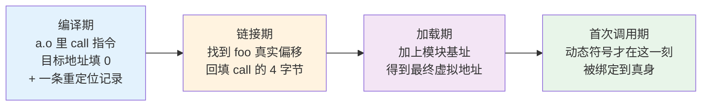
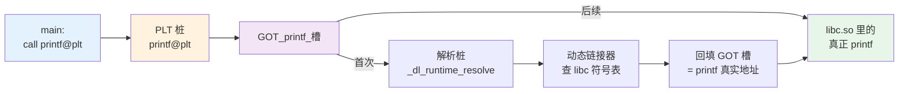
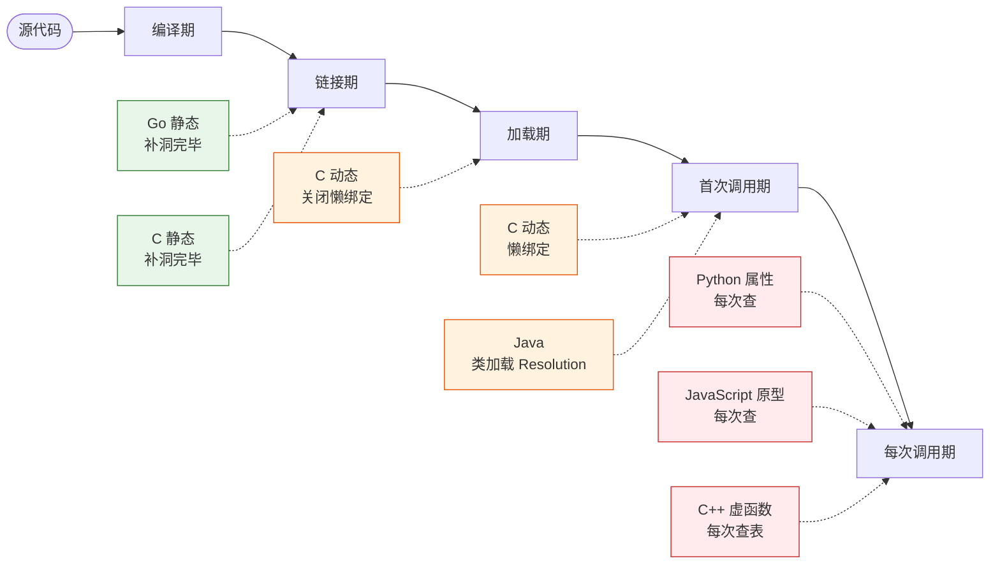
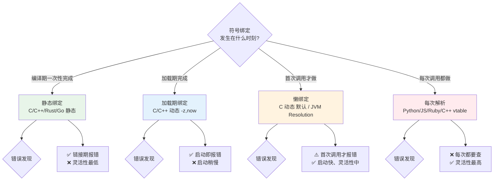

# 2.符号表与重定位

> 📍 **本篇位置**：第 7 卷 · 编译与链接之道 · 第 2 篇（把 7.1 结尾"变魔术"的那个黑盒拆到底）
> 🎯 **核心矛盾**：**当你在 `a.c` 里写 `printf("hi")`，编译时根本不知道 `printf` 在内存的哪个字节——它是怎么在最后关头，跨越几十个文件、几十 MB 二进制、甚至几个进程，精确"找到"目标地址的？**
> 🧭 **设计灵魂**：**符号 = "洞的名字"、重定位 = "补洞的动作"**。二者合起来解决同一个矛盾——**编译期你不知道最终地址，但代码必须先能生成**——办法是**先留一个洞、旁边贴一张便签、事后凭便签把洞补上**。这套"留洞 + 补丁"的思想，在 C 里叫 PLT/GOT，在 C++ 里叫 vtable，在 JVM 里叫常量池 Resolve，在 Python 里叫属性查找——**结构完全同构**。
> 🌐 **跨平台覆盖**：ELF（Linux/BSD/Android）· Mach-O（macOS/iOS）· PE（Windows）· C/C++/Rust/Go/Swift 目标文件 · JVM 常量池 · CPython 字典 · V8 隐藏类
> 🔗 **延伸阅读**：← [7.1 从源码到可执行](./01.从源码到可执行.md) · → [7.3 静态链接 vs 动态链接](./03.静态链接与动态链接.md) · → [7.4 ABI 与调用约定](./04.ABI与调用约定.md) · → [2.1 类加载机制](https://yccoding.com/pages/74953e/) · → [2.3 对象和函数访问原理](https://yccoding.com/pages/126560/)
> 💡 **通用心智**：**一切"undefined reference"、一切"NoSuchMethodError"、一切 iOS `dyld: Symbol not found`——本质都是"某个洞、在某个时刻、没被补上"**。看穿了这一点，跨语言的"链接错误"就都变成同一个问题的不同变体。

---

> 上一篇讲了「四步流水线」，讲到"链接"就把 `.o` 交给了链接器、然后就"变魔术"——**这一篇专门拆开这个魔术盒**。**符号解析 + 地址重定位**，就是链接器全部的秘密；也是 Java 的类加载器、iOS 的 `dyld`、V8 的原型链——**背后同一套机制的不同伪装**。
>
> 换个视角：**"跨模块调用"是软件复用的物质基础**——没有它，没有函数库、没有共享代码、没有模块化。**这套机制怎么运作，就是"软件复用是怎么可能的"的技术底座**。

> 📢 **语言无关声明**
> 本篇讨论的是**所有涉及"跨模块符号绑定"的语言共通模型**——只是每种语言在**哪一步做绑定**、**用什么数据结构记录**不同：
>
> - **C**：符号名 = 函数/变量名（如 `printf`）——最干净，直接原样出现在 `.o` 符号表里。
> - **C++**：符号名要经过 **name mangling**（如 `_ZN3std5printEv`）——为了支持重载、命名空间、模板（详见 [7.4](./04.ABI与调用约定.md)）。
> - **Rust**：类似 C++ 有 mangling，且带哈希后缀（如 `_ZN4core3fmt5Debug3fmt17h...E`）——防止版本冲突。
> - **Go**：符号带包路径前缀（`main.foo`、`fmt.Println`），由自研链接器 `cmd/link` 处理。
> - **Swift**：Swift 自有一套 mangling（`$s...`），比 C++ 更规整。
> - **Java/Kotlin/Scala**：**没有传统"符号表 + 重定位"**——但 **class 文件的常量池 + 类加载时的 Resolution** 在做完全等价的事，本篇 §5 专门对照。
> - **C# / .NET**：类似 Java，用 **metadata token + CLR 加载器**做等价工作。
> - **Python / JavaScript / Ruby**：连"链接"这步都是**运行时字典查询**（Python 的 `__dict__` / JS 的原型链）——符号就是字符串，每次调用现查现用。
>
> 讨论"哪种更优"不是本篇目的。本篇只做一件事——**把"跨模块调用"这件事拆到最底，让你看穿所有语言的相同骨架**。

## 目录介绍

- [2.符号表与重定位](#2符号表与重定位)
  - [目录介绍](#目录介绍)
  - [1.真实事故引入](#1真实事故引入)
    - [1.1 undefined reference](#11-undefined-reference)
    - [1.2 Symbol not found](#12-symbol-not-found)
    - [1.3 NoSuchMethodError](#13-nosuchmethoderror)
    - [1.4 三个核心洞见](#14-三个核心洞见)
    - [1.5 灵魂三问](#15-灵魂三问)
    - [1.6 五个递进追问](#16-五个递进追问)
    - [1.7 本篇探索路径](#17-本篇探索路径)
  - [2.根本矛盾：编译期的三个"不知道"](#2根本矛盾编译期的三个不知道)
    - [2.1 三个不知道](#21-三个不知道)
    - [2.2 留洞 + 补丁的核心思想](#22-留洞--补丁的核心思想)
    - [2.3 三次修正的时间轴](#23-三次修正的时间轴)
    - [2.4 为什么必须是"名字"而不是"地址"](#24-为什么必须是名字而不是地址)
    - [2.5 矛盾的一句话本质](#25-矛盾的一句话本质)
  - [3.符号是什么](#3符号是什么)
    - [3.1 符号的两种角色](#31-符号的两种角色)
    - [3.2 符号的五个属性](#32-符号的五个属性)
    - [3.3 亲手看一次符号表](#33-亲手看一次符号表)
    - [3.4 C 与 C++ 符号名对比](#34-c-与-c-符号名对比)
    - [3.5 符号可见性：GLOBAL / LOCAL / HIDDEN](#35-符号可见性global--local--hidden)
    - [3.6 符号层的本质](#36-符号层的本质)
  - [4.重定位的机制](#4重定位的机制)
    - [4.1 什么是重定位表](#41-什么是重定位表)
    - [4.2 三种典型的重定位类型](#42-三种典型的重定位类型)
    - [4.3 一次 call foo 的完整流程](#43-一次-call-foo-的完整流程)
    - [4.4 静态 vs 动态可执行的重定位差异](#44-静态-vs-动态可执行的重定位差异)
    - [4.5 亲手观察重定位](#45-亲手观察重定位)
    - [4.6 重定位层的本质](#46-重定位层的本质)
  - [5.符号解析规则](#5符号解析规则)
    - [5.1 强符号 vs 弱符号](#51-强符号-vs-弱符号)
    - [5.2 COMMON 块的历史遗产](#52-common-块的历史遗产)
    - [5.3 静态库的"按需拉取"规则](#53-静态库的按需拉取规则)
    - [5.4 单遍扫描 vs 多遍扫描](#54-单遍扫描-vs-多遍扫描)
    - [5.5 常见解析失败模式](#55-常见解析失败模式)
  - [6.动态符号：延迟到运行时的解析](#6动态符号延迟到运行时的解析)
    - [6.1 PLT 与 GOT：动态链接的两张表](#61-plt-与-got动态链接的两张表)
    - [6.2 懒绑定：把成本摊到"第一次"](#62-懒绑定把成本摊到第一次)
    - [6.3 三大平台的对应机制](#63-三大平台的对应机制)
    - [6.4 "延迟解析"是一种通用思想](#64-延迟解析是一种通用思想)
  - [7.对照：JVM 常量池的"运行时符号表"](#7对照jvm-常量池的运行时符号表)
    - [7.1 Java "没有链接错误"是真的吗](#71-java-没有链接错误是真的吗)
    - [7.2 常量池 = 符号 + 重定位 的合体](#72-常量池--符号--重定位-的合体)
    - [7.3 三张表的类比](#73-三张表的类比)
    - [7.4 依赖冲突：JVM 版本的 DLL Hell](#74-依赖冲突jvm-版本的-dll-hell)
  - [8.跨语言符号地图](#8跨语言符号地图)
    - [8.1 十大语言全景](#81-十大语言全景)
    - [8.2 "补洞时刻"可视化](#82-补洞时刻可视化)
    - [8.3 vtable 也是符号表](#83-vtable-也是符号表)
    - [8.4 Python / JS 的极端形态](#84-python--js-的极端形态)
  - [9.经典陷阱与反模式](#9经典陷阱与反模式)
    - [9.1 八大陷阱清单](#91-八大陷阱清单)
    - [9.2 静态库顺序敏感](#92-静态库顺序敏感)
    - [9.3 弱符号吞掉冲突](#93-弱符号吞掉冲突)
    - [9.4 C++ 头文件不加 extern "C"](#94-c-头文件不加-extern-c)
    - [9.5 删除 so 里的私有函数](#95-删除-so-里的私有函数)
  - [10.经典案例串讲](#10经典案例串讲)
    - [10.1 一次 printf 的一生](#101-一次-printf-的一生)
    - [10.2 JVM 一次 System.out.println 的解析](#102-jvm-一次-systemoutprintln-的解析)
    - [10.3 大型 C++ 项目"链接一小时"](#103-大型-c-项目链接一小时)
    - [10.4 iOS dyld symbol not found 复盘](#104-ios-dyld-symbol-not-found-复盘)
  - [11.总结](#11总结)
    - [11.1 三层认知阶梯](#111-三层认知阶梯)
    - [11.2 陌生语言决策树](#112-陌生语言决策树)
    - [11.3 六字真言](#113-六字真言)
    - [11.4 跨语言术语对照](#114-跨语言术语对照)
    - [11.5 与下一篇承接](#115-与下一篇承接)
  - [🔗 延伸阅读](#-延伸阅读)

---

## 1.真实事故引入

要把"符号表 + 重定位"讲得**真的记得住**，不能上来就摆定义。看三个来自不同语言、不同时代、但**根因完全同构**的真实事故——事故的表面症状千差万别（编译报错、上线闪退、冷门接口跑挂），但拆到最底，都是**"某个符号、在某个时刻、没被补上"**。看完你会发现："链接错误"从来不是 C/C++ 的专利，只是别的语言给它换了名字。

### 1.1 undefined reference

> 🔍 **探索起点**：一份代码编译全绿、单测全过、CI 十几分钟跑完，最后死在一句谁也第一眼看不懂的 `undefined reference` 上——错误为什么会"推迟"到这一刻才爆？为什么不能在写代码时就发现？

两个团队协作一个网关项目。算法组交付了静态库 `libbar.a`，接口组在 `a.c` 里声明并调用：

```c
// a.c（接口组）
void foo();                 // 声明：我要用
int main(void) { foo(); }   // 调用：真的用了
```

```c
// b.c（算法组）
void foo() { /* 实现 */ }   // 实现：编成 b.o，归档进 libbar.a
```

算法组说"我实现了"，接口组说"我调了"，CI 却在最后一步炸出：

```
/usr/bin/ld: a.o: in function `main':
a.c:(.text+0xa): undefined reference to `foo'
collect2: error: ld returned 1 exit status
```

**为什么会这样？** 因为 `a.c` 编译时**根本不看 `libbar.a`**——编译器只做一件事：**"把 `foo` 记成未定义符号"**，找实现是链接器的活。这次翻车是构建脚本把链接命令写反了：`gcc a.o -lbar` 能过，写成 `gcc -lbar a.o` 就炸——**静态库按"从左到右单遍扫描"，遇到 `-lbar` 时还没看到任何未定义符号，直接跳过 `libbar.a`；等看到 `a.o` 里的 undefined `foo` 时，已经没有后续库能满足它了**（§5.3 详解）。

| 现象 | 直觉解释 | 真正根因 |
|------|---------|---------|
| 编译全绿 | "代码没问题" | 编译器只检查**单文件语法**，对 `foo` 只记一张"欠条"（undefined 符号） |
| 链接才报错 | "报错太晚了" | 恰恰相反——**链接期是第一个能看到所有 `.o` 的时刻**，这已是最早能报的位置 |
| 换个 `-l` 顺序又能过 | "玄学 bug" | 静态库是**单遍按需拉取**（§5.3），顺序敏感是算法属性，不是 bug |
| 报错里 `.text+0xa` 是啥 | "看不懂" | `.text` 段偏移 `0xa` 处那条 `call` 指令的洞没补上——链接器**精确指认到字节** |

**追问一层**：链接器为什么能精确说出 `.text+0xa`？——因为**编译器早就把这个洞的坐标记在了 `.rela.text` 里**，链接器只是把没兑现的欠条一条条读出来给你看。**这就是"符号 + 重定位"的价值**：它让"找不到"这件事不至于变成"运行时随机崩溃"，而是**在链接期一次性、精确地暴露**——**错误的时刻越靠前，成本越低**。

### 1.2 Symbol not found

> 🔍 **探索起点**：同样是"符号找不到"，为什么 C++ 项目死在编译机上、iOS 项目却死在**用户手机上**？中间到底差了哪一步？

某 App 一次发版，Xcode 里编译、链接、签名全部通过，TestFlight 内测也没问题。上线后一小批（不是全部）用户启动即闪退，崩溃日志赫然写着：

```
dyld: Symbol not found: _OBJC_CLASS_$_CatNetworkSDK
  Referenced from: /var/containers/Bundle/Application/.../MyApp.app/MyApp
  Expected in: /var/containers/Bundle/Application/.../Frameworks/CatNetwork.framework/CatNetwork
  in /var/containers/Bundle/Application/.../MyApp.app/MyApp
```

**为什么会这样？** 这个符号来自一个**动态框架（Framework）**。链接时它只要"存在"就能通过；但**每次启动**，iOS 的动态链接器 `dyld` 要**真正把符号绑定到具体地址**——那一刻才发现主二进制引用的类和 Framework 实际导出的对不上（升级 SDK 时那个类被改名了，某些用户的 App 缓存了旧版 Framework）。

| 对比维度 | C++ 静态项目 | iOS 动态 Framework |
|---------|------------|------------------|
| 符号配对发生在 | 链接期（编译机上） | **启动时（用户手机上）** |
| 发现错误的时刻 | 构建阶段，零用户受损 | 线上启动闪退 |
| 修复成本 | 修 CI，重新构建 | 发版本、审核、灰度、回滚 |
| 排查手段 | 本地复现 | 等崩溃平台上报 + 对照 dSYM |
| 谁在做符号解析 | `ld` / `lld` / `mold` | `dyld` |
| 谁把补丁写进哪 | 可执行文件的 `.text` | 进程内存的 GOT / `__la_symbol_ptr` |

**追问一层**：那 iOS 为什么不干脆全部静态、把错误全部前移？——**Apple 恰恰在这么做**。App Store 对第三方动态框架有严格限制（[Embedded Frameworks 规则](https://developer.apple.com/library/archive/technotes/tn2435/_index.html)），主流姿势就是**把绝大多数依赖静态打进主二进制**（见 [7.3 §8.2](./03.静态链接与动态链接.md)）。**"符号找不到"的时刻越晚、受损面越大**——这就是下一篇 7.3 整篇要做的题：**静态换用户可见性、动态换灵活性，你到底选哪个**。

### 1.3 NoSuchMethodError

> 🔍 **探索起点**：写了十几年 Java 的工程师会说"我从没见过 undefined reference"——真的吗？还是它换了个名字藏在别处？

一个电商中台，本地开发全绿、CI 全绿、灰度机器全绿。上线第 3 天，某个冷门运营接口（用户点击"退货详情"时才走到）突然开始报：

```
Exception in thread "http-nio-8080-exec-42" java.lang.NoSuchMethodError:
  'com.google.common.base.Preconditions.checkArgument(boolean, java.lang.String, java.lang.Object)'
  at com.example.gateway.RefundService.validate(RefundService.java:87)
```

**追根**：项目直接依赖 Guava 19，另一个中间件传递依赖 Guava 27，Maven 仲裁选了 19（"最近路径优先"）；那条 `Preconditions.checkArgument(boolean, String, Object)` 三参数重载是 Guava 20+ 才加的，19 里没有。**编译时用的是 IDE 里那份 27 的类（有这个方法）、运行时 classpath 上的是 19 的 jar（没这个方法）**——错位就这么发生了。

| 现象 | 你以为 | 真正机制 |
|------|-------|--------|
| Java 没有链接错误 | "编译就等于跑得起来" | 编译期只校验"接口签名存在"，运行时才做**真正的符号解析**（[类加载 Resolution 阶段](https://yccoding.com/pages/74953e/)） |
| 上线前全绿 | "代码没问题" | 只有 CI 上跑到那条冷门路径的用例，才会触发那个方法的解析——**没跑到 = 没解析 = 不报错** |
| 3 天后才炸 | "灰度机器有问题" | 只有触发到"退货详情"的用户请求才会解析 `Preconditions.checkArgument`——**懒解析放大了错误发现的延迟** |
| 报错像"运行时错误" | "空指针那类的" | 从错误名字看：`NoSuchMethodError extends LinkageError`——**Java 的 API 明明白白告诉你这是链接错误**，只是发生在运行期 |

**追问一层**：那 Java 是不是"故意设计成运行时才报"？——**是的，这是 Java 换取"热部署 + 动态加载"能力的对价**（回顾 7.1 §1.2 的 Java 热部署案例）。**代价从来不消失，只是从"编译等待"搬到了"运行时惊喜"**——这条 7.1 反复强调的规律，在符号解析这一层再次显灵。

### 1.4 三个核心洞见

```mermaid
flowchart TB
    A[事故 A: C++ undefined reference] --> Insight1[洞见 1: 符号是"洞的名字"<br/>编译期只能记账、不能填地址]
    B[事故 B: iOS Symbol not found] --> Insight2[洞见 2: "补洞"可以被<br/>切分到不同时刻——<br/>编译期/加载期/首次调用期]
    C[事故 C: Java NoSuchMethodError] --> Insight3[洞见 3: "运行时更灵活"<br/>=<br/>"错误更晚被发现"]

    Insight1 --> Core[通用心智:<br/>补洞时刻的选择<br/>= 语言性格<br/>= 错误发现窗口]
    Insight2 --> Core
    Insight3 --> Core

    style Core fill:#fff3e0,stroke:#e65100,stroke-width:3px
```

三条洞见合并起来是一句话：**"符号 + 重定位"的本质，是"把'我要用'和'我提供'切开、留一张便签、事后由某个'解析者'把便签兑现"——不同语言只是把'兑现的时刻'搬到了不同位置**。

### 1.5 灵魂三问

在正式动刀拆解之前，把三个问题钉在墙上——学完本篇你要能自己答出来：

- **Q1**：编译器在编译 `a.c` 时，明明看不到 `b.c`，凭什么能生成能调用 `b.c` 里 `foo` 函数的**机器码**？
- **Q2**：C++ 的 `std::vector<int>::push_back` 在二进制里长什么样？为什么它跟 C 的 `push_back`（假如有）不能互相调用？
- **Q3**：Java 里"没有链接错误"是真的吗？如果不是，它把这个错误藏到哪里去了？

### 1.6 五个递进追问

Q1-Q3 是入门，下面这五问是"能不能把这套机制看穿"的分水岭——**每一问都会在正文里被逐步拆开**：

1. **洞的坐标从何而来**：编译器把 `call foo` 写成 `e8 00 00 00 00` 时，"这里未来要填 foo 的地址"这条元数据具体存在哪里、格式是什么？（§4.1）
2. **补丁公式**：链接器拿到"符号 foo 最终地址 = 0x401030"和"洞在 `.text+0xa`"这两个信息之后，具体**写哪 4 个字节**进去？为什么是相对偏移不是绝对地址？（§4.2）
3. **静态库为何顺序敏感**：`gcc a.o -lbar` 和 `gcc -lbar a.o` 结果不一样——这是 bug 还是设计？为什么现代链接器（`lld`/`mold`）不再敏感？（§5.3、§5.4）
4. **动态符号的补洞时刻**：一个 `printf` 的洞可以在链接期补、加载期补、也可以在首次调用时才补——三种时刻分别对应什么机制？各自的代价是什么？（§6）
5. **跨语言同构**：Java 的常量池 Resolution、C++ 的 vtable dispatch、Python 的 `obj.__dict__[name]`、V8 的 hidden class——为什么可以证明它们是"同一件事的不同实现"？（§7、§8）

**这五问看穿了，你就已经"内化"了符号 + 重定位，而不是"记住"了它**。

### 1.7 本篇探索路径

```mermaid
flowchart LR
    S0[三个真实事故] --> S1[拆解根本矛盾:<br/>为什么必须"留洞 + 补丁"]
    S1 --> S2[符号是什么:<br/>洞的名字]
    S2 --> S3[重定位是什么:<br/>补洞的动作]
    S3 --> S4[补洞时刻的三种选择:<br/>静态/动态/懒]
    S4 --> S5[跨语言对照:<br/>JVM/Python/V8/vtable]
    S5 --> S6[陷阱 + 案例 + 决策树]

    style S3 fill:#e3f2fd
    style S4 fill:#fff3e0
    style S5 fill:#f3e5f5
```

---

## 2.根本矛盾：编译期的三个"不知道"

在真正拆开"符号"和"重定位"之前，得先想明白一个**元问题**：**为什么工具链非要引入"符号"和"重定位"这两个概念？为什么不能像"直接写 CPU 指令"一样把地址写死？** 不把这个问题问透，后面每一个数据结构看起来都像"约定俗成"——但事实是，**它们每一个都是被"具体的工程压力"倒逼出来的**。

### 2.1 三个不知道

> 🔍 **探索起点**：编译 `a.c` 的那一刻，编译器对 `foo` 到底"知道"多少？

答案是——几乎什么都不知道。编译器盯着 `a.c` 单文件时，面对 `call foo` 这条指令：

1. **不知道地址**：`foo` 被排进内存的哪个位置，取决于**所有 `.o` 怎么拼**——这是**链接期**才定的事；
2. **不知道住址**：`foo` 在哪个 `.o`、哪个 `.a`、甚至哪个 `.so` 里实现，编译器一概不知——**跨文件的可见性**在编译期是黑盒；
3. **不知道未来**：如果 `foo` 来自动态库，它的**最终虚拟地址**要到**进程启动后**才由动态链接器决定（ASLR 每次都不同）——**跨时间的确定性**也不存在。

但机器码不能等：`call` 指令必须**现在**就写下 4 字节的目标地址。这就是矛盾——**"必须现在写"和"不知道该写啥"的正面冲突**。

编译器的解法朴素到惊人——**先填 0 占位，旁边贴张便签**：

```
a.o 的 .text:
    e8 00 00 00 00              ← call, 目标地址填 0
     |
     └── .text 偏移 0x2, 是个洞

a.o 的 .rela.text:
    offset=0x2 symbol=foo       ← 便签: "这个洞将来填 foo 的地址"
```

**编译器的世界里没有"等等再说"，只有"记账"**——记下"这里有个洞、洞的名字叫 foo"，剩下的事让下游去补。这份"记账"就长成了两张表：

- **符号表**（`.symtab`）：**这个 `.o` 里所有的"名字"**——我提供了哪些（`main`）、我要用哪些（`foo`）、每个名字对应什么类型、大小、可见性。
- **重定位表**（`.rela.text`、`.rela.data`）：**这个 `.o` 里所有的"洞"**——洞的位置、洞要填什么符号的地址、按什么公式算。

### 2.2 留洞 + 补丁的核心思想



这张图就是"重定位"三个字的全部含义。值得注意的是**"补丁"可能被分成好几次**——每一次都发生在**"信息变得更全"**的那个时刻：

- **第一次修正（链接期）**：链接器把 100 个 `.o` 排成最终布局，`foo` 的**段内偏移**确定了，回填 `call` 的相对地址——静态链接到这一步就结束了；
- **第二次修正（加载期）**：如果是动态链接，可执行文件被操作系统**加载到随机基址**（ASLR），`foo` 的最终虚拟地址 = 偏移 + 模块基址——这就是动态库的符号要走 GOT 表、不能直接写死的原因（§6）；
- **第三次修正（首次调用期）**：懒绑定机制下，某些符号的 GOT 项一开始指向"解析桩"，第一次被调用时才由动态链接器真正查找、回填——**把成本摊到"用到才付"**（§6.2）。

**关键洞见**：代码里出现的"地址"从来不是一次写对的，而是被**反复修正**过的——每一次修正，都对应一个"信息变得更全"的时刻。**"重定位"这个词的核心不是"修改地址"，而是"分阶段确定地址"**。

### 2.3 三次修正的时间轴

用一张表把三次修正的"信息增量"看清楚——**每一次修正，都是因为拿到了上一步拿不到的信息**：

| 修正时刻 | 谁在补 | 补什么 | 上一步缺什么 |
|---------|-------|-------|-----------|
| **链接期** | `ld` / `lld` / `mold` | 段内偏移（相对地址） | 编译期看不到别的 `.o`，不知道全局布局 |
| **加载期** | `ld-linux.so` / `dyld` / Windows Loader | 加上模块基址（ASLR） | 链接期不知道进程会被加载到哪块虚拟地址 |
| **首次调用期** | 动态链接器的 `_dl_runtime_resolve` | 从符号名解析到真身函数地址 | 加载期为了省时间，没有把所有动态符号都立刻绑定 |

**核心规律**：**每一次修正都用"当前时刻已知的信息"补一步，把还不确定的部分继续留成"洞 + 便签"往后推**——这就是"分阶段绑定"的工程哲学。**Java 的类加载器把所有三个时刻全部搬到"运行时"** —— 编译期只产字节码 + 常量池符号引用，剩下的解析全部由 JVM 在 [类加载的五个阶段](https://yccoding.com/pages/74953e/) 里做（§7）。

### 2.4 为什么必须是"名字"而不是"地址"

> 🔍 **探索起点**：既然编译器不知道地址，能不能干脆让程序员写 `call 0x401030`？这样连符号表都不用了。

**答案**：**做不到，也不该做**。想想失去"名字"会付出什么代价：

| 失去的能力 | 具体表现 | 现实中的代价 |
|-----------|--------|------------|
| **函数库复用** | 每次调用第三方函数都要手工查地址 | printf 的地址随 glibc 版本变，代码永远不能跨版本 |
| **模块化开发** | 改一个 `.c` 就要重编所有依赖它的模块 | 单文件项目还能忍，10 万文件的 Chrome 直接死 |
| **动态链接** | 不同进程加载 libc 到不同基址就完全瘫痪 | ASLR 无法实现，安全性倒退 30 年 |
| **多态调用** | 虚函数、多态、接口调用无从谈起 | 面向对象体系崩塌 |
| **热更新** | Java 热部署、iOS 动态框架、Python `importlib.reload` 全部消失 | 迭代速度回到 1970 年代 |
| **调试符号** | gdb/lldb 看到的都是数字地址 | 断点、堆栈、变量名——全部失去 |

**"符号"这个中间层的价值，正是把"我要调用的东西"从**"内存里那个字节"**抽象为**"一个稳定的名字"**——名字不变、地址随便变，工程学的一切复用、演化、隔离都建立在这层抽象上**。

**再往深一层**：符号 = **命名**是软件工程最基础的抽象。文件名、变量名、URL、DNS——本质都是"给'某个具体东西'贴一个'稳定的名字'"，让下游可以按名字寻址、而不需要关心具体位置。**符号表就是"链接期的 DNS"**。

### 2.5 矛盾的一句话本质

> **编译期必须生成代码，但地址此时未知**——办法是**"先留洞、后补丁"**：符号 = 洞的名字，重定位 = 补丁动作，链接器/加载器/动态链接器 = 不同时刻的补丁工。**这套"分阶段绑定"的架构，是所有支持"跨模块调用"的语言绕不开的骨架**。

---

## 3.符号是什么

正式动刀。前面讲了"符号是洞的名字"——**这一节把"名字"这个数据结构拆到最底**：它由几个字段组成、每个字段是什么语义、你怎么用命令行工具看到它。

### 3.1 符号的两种角色

一个 `.o` 里的每个符号都扮演两种角色之一：

| 角色 | 含义 | 举例 | 在 `nm` 里的表现 |
|------|------|------|--------------|
| **定义（defined）** | 我这里有 | `.o` 里的 `foo` 实现 | `T foo` / `D counter` / `B buffer` |
| **引用（undefined）** | 我要用别人的 | `.o` 里的 `printf` 调用 | `U printf` |

- **一个 `.o` 的符号表 = 定义列表 + 引用列表**。
- **链接 = 把所有 `.o` 的引用一一配对到定义**——链接器的核心工作就是执行这个配对算法。
- **未定义符号 = 欠条，定义符号 = 借据**——欠条兑现不了就是 `undefined reference`。

### 3.2 符号的五个属性

符号不只是"一个名字"，它是一条**五字段结构体**：

| 字段 | 可选值 | 语义 |
|------|-------|------|
| **name（名字）** | 字符串 | C：函数/变量名；C++：mangled 名（`_ZN...`） |
| **type（类型）** | `FUNC` / `OBJECT` / `SECTION` / `NOTYPE` | 函数？变量？段？还是纯记号 |
| **bind（绑定）** | `LOCAL` / `GLOBAL` / `WEAK` | 本文件可见 / 跨文件可见 / 弱符号（§5.1） |
| **visibility（可见性）** | `DEFAULT` / `HIDDEN` / `PROTECTED` | 是否被导出到动态符号表（§3.5） |
| **value + size** | 数值 | 定义时的段内偏移 + 长度 |

**这五个字段共同决定了一个符号在链接期和加载期的所有行为**——`bind + visibility` 决定"谁能看到它"，`type + size` 决定"链接器怎么处理它"，`value` 决定"补丁公式里代入什么"。**记住这五个字段，`nm` 和 `readelf -s` 的输出就再也不神秘了**。

### 3.3 亲手看一次符号表

> 🔍 **探索起点**：把 1.1 的 `a.c` 编成 `.o`，能不能亲眼看到那张"账本"？

```bash
$ cat > a.c << 'EOF'
extern void foo(void);
int global_var = 42;
static int local_var = 7;
int main(void) { foo(); return global_var + local_var; }
EOF

$ gcc -c a.c -o a.o
$ nm a.o
0000000000000000 D global_var       ← D = .data 段，已初始化全局
0000000000000004 d local_var        ← d = 小写 = 局部（static）
0000000000000000 T main             ← T = .text 段，全局函数
                 U foo              ← U = Undefined，等别人提供
```

`nm` 的输出就是符号表的浓缩视图。所有常见标记：

| 标记 | 全称 | 含义 | 典型来源 |
|------|------|------|---------|
| `T` | Text | Text 段已定义全局符号 | 非 static 函数 |
| `t` | text | Text 段已定义**局部**符号 | `static` 函数 |
| `U` | Undefined | 未定义，等别人补 | `extern` 引用、库函数调用 |
| `D` | Data | Data 段已初始化全局变量 | `int g = 1;` |
| `d` | data | Data 段已初始化**局部**变量 | `static int g = 1;` |
| `B` | BSS | BSS 段未初始化全局变量 | `int g;`（`-fno-common` 下） |
| `C` | COMMON | 未初始化 COMMON 块 | `int g;`（无 `-fno-common`，见 §5.2） |
| `R` | ROData | 只读数据段 | `const char *s = "hi";` |
| `W` / `V` | Weak / Weak Object | 弱符号 / 弱对象 | `__attribute__((weak))`、C++ 模板实例 |

要看完整字段（类型、绑定、可见性、大小），用 `readelf -s`：

```
$ readelf -s a.o
Symbol table '.symtab' contains 6 entries:
   Num:    Value          Size Type    Bind   Vis      Ndx Name
     3: 0000000000000004     4 OBJECT  LOCAL  DEFAULT    3 local_var
     4: 0000000000000000     4 OBJECT  GLOBAL DEFAULT    3 global_var
     5: 0000000000000000    22 FUNC    GLOBAL DEFAULT    1 main
     6: 0000000000000000     0 NOTYPE  GLOBAL DEFAULT  UND foo
```

**逐列读**：
- **Bind = GLOBAL / LOCAL / WEAK**：跨文件可见性——就是 §5 要讲的"符号解析"的输入；
- **Vis = DEFAULT / HIDDEN / PROTECTED**：动态符号表可见性（§3.5）；
- **Type = FUNC / OBJECT / NOTYPE**：函数 / 变量 / 未知——注意符号表里**没有"参数和返回值类型"**，只有一个名字。类型信息去哪了？**C 里被丢弃，C++ 里被塞进 mangling**（§3.4）——这正是 [7.4](./04.ABI与调用约定.md) 要讲的 ABI 问题的起点；
- **Ndx = 1 / 3 / UND**：这个符号定义在第几个段（`UND` 就是未定义）。

三个平台一套动作：**macOS 用 `nm -m a.o`、Windows 用 `dumpbin /symbols a.obj`、跨平台还有 `llvm-nm`**——看的都是同一本账。

### 3.4 C 与 C++ 符号名对比

C 的符号名极其干净——**函数名原样出现在符号表里**：

```c
// C
void foo(int x) { }
```

```
$ nm a.o | grep foo
0000000000000000 T foo    ← 就叫 foo
```

C++ 就完全不一样——**同名函数可以重载，命名空间可以嵌套，模板可以实例化**，链接器怎么区分？答案是 **name mangling**：

```cpp
// C++
namespace ns {
    void foo(int x) { }
    void foo(double x) { }
    void foo(int x, int y) { }
}
```

```
$ nm a.o | c++filt
_ZN2ns3fooEi          ns::foo(int)
_ZN2ns3fooEd          ns::foo(double)
_ZN2ns3fooEii         ns::foo(int, int)
```

**Itanium C++ ABI 的 mangling 规则**（GCC/Clang 用）：

| 源码 | mangled 符号 | 拆解 |
|------|-----------|-----|
| `void foo()` | `_Z3foov` | `_Z` 前缀 · `3foo`（3=名字长度）· `v`（void 参数） |
| `void foo(int)` | `_Z3fooi` | `i` = int |
| `void foo(int, double)` | `_Z3fooid` | `i` + `d` |
| `namespace ns { void foo(); }` | `_ZN2ns3fooEv` | `N...E` = 嵌套命名空间 |
| `class C { void m(); };` | `_ZN1C1mEv` | 类也是命名空间 |
| `template void f<int>(int)` | `_Z1fIiEvi` | `I...E` = 模板参数列表 |
| `const int &` | `RKi` | `R` = 引用 · `K` = const · `i` = int |

**MSVC 用另一套完全不同的 mangling**（`?foo@@YAXH@Z`），二者**互不兼容**——这就是为什么 Windows 上 GCC 编的 C++ 库和 MSVC 编的 C++ 库不能互相链接。**"C++ 二进制不兼容"的第一层原因，就在符号名这一层**（[7.4](./04.ABI与调用约定.md) 会拆到底）。

**为什么要 mangle？** 因为链接器**只按名字配对**——它不理解"重载"、不理解"命名空间"、不理解"模板"。C++ 编译器只能**把这些语义信息编码进符号名字符串**，让链接器一无所知地按字符串匹配就能达到"重载区分"的效果。**这是"把复杂语义降级到简单结构"的经典设计**——不改变链接器，只改前端产的名字。

### 3.5 符号可见性：GLOBAL / LOCAL / HIDDEN

**Bind = GLOBAL/LOCAL** 控制的是**编译单元之间**的可见性（一个 `.o` 里的符号能否被另一个 `.o` 引用）。但对于**动态库**，还有第二层可见性——**编译出 `.so` 之后，哪些符号能被外部程序引用**：

| Bind | Visibility | 编译单元间可见 | 跨 `.so` 可见 | 用途 |
|------|-----------|------------|-----------|------|
| LOCAL | — | ❌ | ❌ | `static` 函数——彻底私有 |
| GLOBAL | DEFAULT | ✅ | ✅ | 默认情况——所有全局符号都被导出 |
| GLOBAL | HIDDEN | ✅ | ❌ | 内部辅助函数：需要跨文件调用，但不希望暴露给 `.so` 用户 |
| GLOBAL | PROTECTED | ✅ | ✅（但不能被覆盖） | 少见，防止 LD_PRELOAD 劫持 |

**为什么可见性这么重要？** 因为**默认情况下，所有 GLOBAL 符号都会进入动态符号表 `.dynsym`**——一个 `libfoo.so` 编出来，可能内部有 10 万个函数，全部对外可见。后果：

1. **链接慢**——用户链接你的 `.so` 时，链接器要扫全部 10 万个符号，找匹配（[7.1 §10.1 Chrome 的痛](./01.从源码到可执行.md#101-chrome-编译-40-分钟)）；
2. **加载慢**——动态链接器要建 10 万条符号表项；
3. **升级难**——只要有一个内部函数被外部程序偷偷用了，你就不能改它（否则用户升级你的库就崩）；
4. **优化差**——编译器不敢内联"可能被外部覆盖"的函数（LD_PRELOAD 会替换 DEFAULT 可见性的符号）。

**现代最佳实践**——**默认全部隐藏，只显式导出你要公开的**：

```cpp
// 编译选项
$ g++ -fvisibility=hidden -c foo.cpp

// 显式导出
extern "C" __attribute__((visibility("default"))) void public_api(void);
```

或者用宏：

```cpp
#define EXPORT __attribute__((visibility("default")))

EXPORT void foo() {}     // 导出
void bar() {}            // 隐藏
```

**收益**：Chrome / LLVM 官方实测**符号表缩 90%，链接时间和启动时间大幅下降**。这也是 [7.3 §8.3](./03.静态链接与动态链接.md) 讲"大型 C++ 项目优化链接"的第一招。

### 3.6 符号层的本质

> **符号 = 一个 5 字段的账本条目：`name / type / bind / visibility / (value+size)`。它把"我要用什么"和"我提供什么"两件事，用同一个数据结构、同一套查询规则统一表达——让下游（链接器/加载器）可以完全不理解语言语义，就能完成"跨模块配对"这件事。**

---

## 4.重定位的机制

符号表回答"有哪些名字"，重定位表回答"哪些字节要按名字改"——**它们是链接期的两张核心账本**。这一节把重定位表的每一列拆到最底，并亲手做一次"链接器的活"。

### 4.1 什么是重定位表

> 🔍 **探索起点**：符号表是"账本"，那链接器怎么知道**具体哪个字节**要改？

答案在 `.o` 的第三张表——**重定位表（relocation table）**。每条记录就是一张**施工单**：

```bash
$ cat > a.c << 'EOF'
extern void foo(void);
extern int global_data;
int main(void) { foo(); return global_data; }
EOF

$ gcc -c a.c -o a.o
$ objdump -r a.o

a.o:     file format elf64-x86-64

RELOCATION RECORDS FOR [.text]:
OFFSET           TYPE                     VALUE
0000000000000004 R_X86_64_PLT32           foo-0x4
000000000000000a R_X86_64_PC32            global_data-0x4
```

一条记录三个字段：

- **OFFSET**：`.text` 段内哪个位置要改——具体到字节；
- **TYPE**：**怎么算**补丁值——填相对地址？绝对地址？还是过 PLT 跳板？（§4.2）；
- **VALUE**：**按谁算**——目标符号 + addend（addend 是给算式加/减的常数偏移）。

**为什么每种引用要不同 TYPE？** 因为不同指令对"目标地址"的编码方式不一样：

- `call foo` 是**相对偏移**指令（`e8` opcode 后跟 4 字节相对偏移）——链接器要算"目标地址 - 当前指令末尾"；
- `mov eax, [global_data]` 是**RIP 相对寻址**（现代 x86-64）——链接器要算"目标数据 - 当前 PC";
- `mov rax, addr_of_foo`（把地址装进寄存器）是**绝对地址**——链接器直接填 8 字节地址；
- `call printf@plt` 是**过 PLT 跳板**——链接器要算"PLT 桩 - 当前 PC"，不是 printf 本身。

**每种"编码方式"对应一种 TYPE，TYPE 就是"补丁公式的选择器"**。x86-64 定义了 40+ 种 TYPE，ARM64 更多，RISC-V 也几十种——它们的存在证明了一件事：**指令集越复杂、需要的重定位类型越多**。

> **量级感**：一个 `.o` 能不能被链接，看符号表；链接器要干多少活，看重定位表。Chrome 单个 `.o` 平均几百条重定位记录，全项目链接要处理**上亿条**——这就是 §10.3 "链接一小时"的物质基础。

### 4.2 三种典型的重定位类型

x86-64 ELF 上最常见的三种，覆盖 99% 的日常代码：

| 类型 | 用于什么 | 补丁公式 | 例子 |
|------|--------|--------|------|
| `R_X86_64_PC32` | 函数调用 / 数据引用（相对） | `补丁 = S + A - P` | `call foo`（内部）、RIP 相对寻址 |
| `R_X86_64_64` | 绝对地址（数据引用） | `补丁 = S + A` | `void *p = &foo;` 的 8 字节地址 |
| `R_X86_64_PLT32` | 通过 PLT 调用动态库函数 | `补丁 = L + A - P` | `call printf`（外部动态） |

公式里的符号：

- **S** = Symbol：目标符号的最终地址；
- **A** = Addend：附加偏移（一般是 `-0x4`，补偿 x86 相对跳转的"从指令末尾算"）；
- **P** = Place：补丁字节的地址；
- **L** = PLT stub：目标符号对应的 **PLT 桩**（不是符号本身）。

**手算一次**——用 §4.1 的 `call foo` 例子：

假设链接后最终地址：
- `foo@plt` 桩位于 `0x401030`
- `main` 里那条 `call` 指令的 `e8` 位于 `0x401142`，5 字节 opcode+immediate，`.text+0x4` 对应 immediate 的第一字节 `0x401143`
- 那条 `call` 指令的下一条指令（P + 4）位于 `0x401147`

用 `R_X86_64_PLT32` 的公式：
```
补丁 = L + A - P
     = 0x401030 + (-4) - 0x401143
     = 0x401030 - 4 - 0x401143
     = -0x117 → 补码表示为 0xFFFFFEE9
```

链接器把 `.text+0x4` 起的 4 字节改成 `E9 FE FF FF`（小端序）——CPU 执行时：`PC(0x401147) + 0xFFFFFEE9 = 0x401030` = `foo@plt`。**"相对跳转"就这么补出来的**。

> **一句话理解**：`PC32` 与 `PLT32` 公式几乎一样，唯一区别是**目标是"符号本身"还是"PLT 桩"**——链接器一看目标符号将来要走动态链接，就把 `call foo` 悄悄改成 `call foo@plt`，剩下的一切等 §6 的动态链接机制来接管。**同一条 C 代码 `foo()`、经过链接器决策后，可能变成三种完全不同的机器码**——链接器就是这个"决策者"。

### 4.3 一次 call foo 的完整流程

```mermaid
sequenceDiagram
    autonumber
    participant SRC as a.c
    participant CC1 as 编译器 cc1
    participant AS as 汇编器 as
    participant OBJ as a.o
    participant LNK as 链接器 ld
    participant EXE as a.out

    SRC->>CC1: void foo(void); ... foo();
    CC1->>AS: call foo (汇编文本)
    AS->>OBJ: e8 00 00 00 00 (二进制)
    AS->>OBJ: + 一条重定位记录: offset=4, type=PLT32, sym=foo
    Note over OBJ: .o 里两张表:<br/>符号表 (foo=UND)<br/>重定位表 (offset=4, sym=foo)
    OBJ->>LNK: 交出 .o
    LNK->>LNK: 扫所有 .o 的符号表，找 foo 定义
    LNK->>LNK: 找到 b.o 里 foo，得知最终地址
    LNK->>LNK: 代入公式，算出补丁 4 字节
    LNK->>EXE: 把 e8 后 4 字节改成补丁
    Note over EXE: 洞已补上,call 直接跳到 foo
```

**关键观察**：编译器和链接器**几乎不需要理解 C 语言**——它们只需要处理"符号 + 重定位"这两张表。**编译器把语义降级为符号名，链接器把符号名升级为地址**——中间这层"符号"就是让编译器和链接器可以**互相独立演化**的接口物。

### 4.4 静态 vs 动态可执行的重定位差异

同一个 `call foo`，foo 在静态库和动态库里，链接器的做法完全不同：

| 场景 | foo 定义在哪 | 链接期做什么 | 加载期做什么 | 首次调用做什么 |
|------|-----------|---------|---------|-----------|
| **纯静态** | `.a` 里的 `.o` | 从 `.a` 拉出 `foo.o`，把 `foo` 代码合进最终二进制，补相对跳转 | 无 | 无 |
| **动态（默认懒绑定）** | `libfoo.so` | 生成 PLT 桩、GOT 项，把 `call foo` 改成 `call foo@plt` | `mmap` libfoo.so，登记依赖 | 桩触发 `_dl_runtime_resolve` → 查符号 → 回填 GOT |
| **动态（-Wl,-z,now）** | `libfoo.so` | 同上 | 立即解析所有动态符号，全部 GOT 项填好 | 无 |

**核心差异**：**静态链接的重定位在编译机上一次做完；动态链接的重定位有一部分要延后到进程启动或首次调用时才做**——这就是"静态换启动、动态换共享"权衡的物质基础（[7.3](./03.静态链接与动态链接.md) 全篇要拆的）。

### 4.5 亲手观察重定位

```bash
# 1. 看 .o 里的原始重定位记录
$ objdump -r a.o
RELOCATION RECORDS FOR [.text]:
OFFSET           TYPE                     VALUE
0000000000000004 R_X86_64_PLT32           foo-0x4

# 2. 看 .o 里的 call 指令，注意目标地址全 0
$ objdump -d a.o
0000000000000000 <main>:
   0:  e8 00 00 00 00       callq  5 <main+0x5>   ← 目标 = 0

# 3. 链接后再看
$ gcc a.o b.o -o app
$ objdump -d app | grep -A 3 '<main>:'
0000000000401106 <main>:
  401106: e8 25 00 00 00       callq  401130 <foo>   ← 目标已填 = 0x401130

# 4. 看可执行文件的动态重定位（PLT）
$ objdump -R app
DYNAMIC RELOCATION RECORDS
OFFSET           TYPE              VALUE
0000000000403fd8 R_X86_64_GLOB_DAT __libc_start_main@GLIBC_2.34
0000000000403fe0 R_X86_64_JUMP_SLOT printf@GLIBC_2.2.5
```

**核对**：`0xe8 25 00 00 00` 就是"call 相对偏移 0x25"。当前指令下一条位置 = `0x40110b`，加上 `0x25` = `0x401130` = foo。**这就是链接器帮你补出来的那 4 字节**。

三个平台同样能玩：**macOS 用 `otool -rv a.o`、Windows 用 `dumpbin /relocations a.obj`**——看的都是同一件事。

### 4.6 重定位层的本质

> **重定位 = "按符号名字查地址、按公式算补丁、按 offset 写字节"三步。它把"编译期不确定的信息"变成"一张待办清单"，交给下游（链接器/加载器/动态链接器）在信息更全的时刻执行——这是分阶段绑定架构的具体机械操作。**

---

## 5.符号解析规则

前面讲了"每张便签怎么写"，这一节讲"链接器拿到一堆便签之后，具体怎么配对"——**这里的算法细节直接决定了几个恶名昭彰的工程坑：静态库顺序敏感、弱符号覆盖诡异、多定义悄悄合并**。

### 5.1 强符号 vs 弱符号

链接器面对"同一个名字的多个定义"时，有一套严格的仲裁规则：

| 情况 | 规则 | 结果 |
|------|------|------|
| 多个**强**符号同名 | **报错** | `multiple definition of 'xxx'` |
| **1 强 + N 弱** | 选强的 | 强符号胜出 |
| N 个**弱**符号 | GNU ld / lld 现代实现：**选 size 最大者** | （历史上曾按"链接顺序取第一个"，两种行为都出现过，这正是这条规则最坑人的地方） |

**强与弱是怎么来的？** C 的默认规则：

| 声明 | 强/弱 | 段 |
|------|------|-----|
| `int g = 1;`（已初始化全局） | 强 | `.data` |
| `int g;`（未初始化全局，`-fno-common`） | 强 | `.bss` |
| `int g;`（未初始化全局，历史默认） | 弱 | COMMON（§5.2） |
| `__attribute__((weak)) void foo();` | 弱 | 用户显式声明 |
| C++ inline function、template instantiation | 弱 | 一般在 `.text` |

**C++ 为什么需要弱符号？** 因为**模板实例化**天然会在多个翻译单元里产生同名代码：

```cpp
// util.h
template <typename T> T max(T a, T b) { return a > b ? a : b; }

// a.cpp
#include "util.h"
int main() { return max<int>(1, 2); }   // 实例化 max<int>

// b.cpp
#include "util.h"
int helper() { return max<int>(3, 4); } // 又实例化 max<int>
```

两个 `.o` 都有 `max<int>` 的定义。如果按"多强报错"规则，直接 `multiple definition`——C++ 就没法用模板了。解决方案：**编译器把模板实例化产生的符号标为 WEAK，链接器遇到多个 WEAK 时任选一个（一般是第一个）**。这也是 [7.1 §10.1 Chrome 编译慢](./01.从源码到可执行.md#101-chrome-编译-40-分钟) 的根因之一——**同一个 `std::vector<Foo>` 在几千个 `.cpp` 里被重复实例化，最后靠弱符号去重**。

### 5.2 COMMON 块的历史遗产

未初始化全局变量的处理是符号解析里**最容易坑人的历史遗产**：

```c
// a.c
int counter;        // COMMON: 弱符号
// b.c
int counter = 0;    // .data: 强符号
// 链接 → 不报错, 两个文件悄悄共享了同一个 counter
```

两个团队各自以为 `counter` 是自己的、一边写一边读——**编过 ≠ 对，弱符号规则把冲突吞掉了**。这是 C 语言最古老、最坑爹的"约定"之一，来源是 **Fortran 时代的 COMMON BLOCK**——Fortran 允许多个 `SUBROUTINE` 声明同名 `COMMON /X/`，链接时合并成一份，C 沿用了这个语义。

**GCC 10 起默认 `-fno-common`**，未初始化全局变量也进 `.bss` 当强符号处理——**上面的代码如今会直接报 multiple definition**。执行了 40 年的"宽容"被收紧，无数老项目升级编译器时集体翻车，但这是**必要的清理**：COMMON 语义是一个**设计失误**，让"错误代码悄悄编过"的成本远高于"节省一点 `.bss` 空间"的收益。

**教训**：**"链接期不报错"不等于"代码对"**——弱符号 + COMMON 这套机制，天然会把某些真正的 bug 藏起来。**升级到现代编译器（GCC 10+ / Clang），或者显式加 `-fno-common`**——这是零成本的正确性提升。

### 5.3 静态库的"按需拉取"规则

静态库 `.a` 本质是 `.o` 的归档（用 `ar` 制作）。链接器面对 `.a` 的规则**和面对 `.o` 完全不同**：

```
处理 .o: 全部符号进入符号池, 无条件参与后续配对
处理 .a: 遍历里面的每个 .o——
         如果这个 .o 能满足当前"未解决集合 U"里的某个符号,
         才把它拉出来链进去 (递归产生新的 U 增量)
         否则整个 .o 丢弃, 不进入最终二进制
```

**这条规则解释了三件事**：

1. **为什么静态库不会把用不上的代码带进来**——链接器按需抽取；
2. **为什么 `.a` 的加入命令行必须放在"用它的 `.o`"后面**——单遍扫描时，先扫到 `.a` 时未解决集合还是空的，根本不会拉取；
3. **为什么循环依赖的两个 `.a` 需要 `--start-group / --end-group`**——普通单遍不够，要来回扫多遍。

### 5.4 单遍扫描 vs 多遍扫描

**GNU `ld` 40 年前设计时**内存有限（PDP-11 只有 64KB 主存），只能**从左到右单遍扫描**：

```
初始化: 未解析符号集 U = {main.o 里所有 undefined 符号}
        已定义符号集 D = {main.o 里所有 defined 符号}

for 每个输入的 .o / .a / .so (从左到右):
    如果是 .o:
        把它的 defined 加入 D
        把它的 undefined 加入 U (减去 D 里已有的)
    如果是 .a:
        对 .a 里的每个成员 .o:
            如果这个 .o 提供了 U 里的某个符号, 才把它抽出来链进去
            (否则丢弃)

if U 非空 且 没有更多输入:
    报错: undefined reference to <U 里剩下的>
```

**这个"单遍从左到右"直接决定了三个恶名昭彰的坑**：

1. **`gcc a.o -lbar` ≠ `gcc -lbar a.o`**——后者先扫 `-lbar`，那时 U 是空的，直接丢弃 libbar，等看到 `a.o` 时来不及了；
2. **`gcc a.o -lb -lc` 若 c 依赖 b，也可能失败**——因为扫 b 的时候还没看到 c 里对 b 的需求；
3. **循环依赖必须 `--start-group / --end-group`** 手工反复扫。

**现代链接器（lld、mold）默认多遍扫描**——内存已经不是瓶颈，"多扫几次"的代价可以忽略，换来的是**"命令行顺序不再敏感"**这个巨大的可用性提升。**这是"硬件进步倒逼算法演进"的一个好例子**——40 年前必须单遍，40 年后完全可以多遍。

| 链接器 | 默认扫描 | 顺序敏感？ | 相对速度 |
|-------|--------|--------|--------|
| GNU ld | 单遍 | ✅ 敏感 | 1x |
| GNU gold | 单遍（内部多线程） | ✅ 敏感 | 3-5x |
| LLVM lld | **多遍** | ❌ | 5-10x |
| **mold** | **多遍 + 极致并行** | ❌ | **30-100x** |

Chrome 官方已切到 mold，链接时间从 60 秒降到 2 秒——**没换算法，只是彻底利用了多核 + 多遍**。

### 5.5 常见解析失败模式

| 报错 | 时刻 | 根因 | 修法 |
|------|-----|------|-----|
| `undefined reference to xxx` | 链接期 | U 集合最终非空 | 加上正确的 `-l` 或调整顺序 |
| `multiple definition of xxx` | 链接期 | 多个强定义 | 改一个为 `static` / 头文件里去掉实现 |
| `symbol lookup error: xxx` | 运行期 | 动态库运行时找不到 | 检查 `LD_LIBRARY_PATH` / `rpath` / `.so` 版本（§6） |
| `dyld: Symbol not found` | 启动期 | 同上，macOS 版 | 同上，用 `otool -L` 检查 |
| `NoSuchMethodError` / `NoClassDefFoundError` | 运行期 | JVM 版符号解析失败 | 检查 classpath / 依赖版本一致性（§7） |
| `ImportError: undefined symbol` | 运行期 | Python C 扩展加载失败 | 检查 ABI 兼容性（Python 版本、glibc） |

**核心规律**：**报错时刻越晚，修复成本越高、用户可见性越大**。**"把错误尽量前移"是所有工程实践的黄金原则**——静态检查 > 编译期报错 > 链接期报错 > 加载期报错 > 首次调用报错 > 生产环境用户上报。

---

## 6.动态符号：延迟到运行时的解析

前面讲的"链接期把洞补完"是静态链接的模式。**动态链接把一部分洞留到进程启动、甚至首次调用时才补**——这一节讲这套延迟机制的核心数据结构和运作机制。**详细的动态链接原理会在 7.3 展开，本节聚焦"符号 + 重定位"层面的对应关系**。

### 6.1 PLT 与 GOT：动态链接的两张表

一个动态可执行文件里，对外部函数的调用不再是"直接 call"，而是**过两张表跳转**：



**两张表分别是**：

- **PLT（Procedure Linkage Table）**：**代码段**里的"跳板表"——每个外部函数有一小段桩代码（约 16 字节），负责"跳到 GOT 里对应的槽"；
- **GOT（Global Offset Table）**：**数据段**里的"函数地址表"——每个槽存一个 8 字节指针，首次调用前指回解析桩，首次调用后被回填成真身地址。

**为什么要两张表、不能一张？** 因为 **PLT 在代码段（只读、可执行），GOT 在数据段（可读写）**——你不能在运行时改代码段（内存保护），但可以改数据段。**用"代码段 + 数据段"两层，才能既保持指令不可变、又让地址可以在运行时被更新**。这是内存保护倒逼的架构决策。

### 6.2 懒绑定：把成本摊到"第一次"

**默认情况下，动态链接器不会在进程启动时立刻解析所有外部符号**——它只登记依赖库，实际"符号名 → 地址"的查找**推迟到函数首次被调用时**才做。这个机制叫**懒绑定（lazy binding）**。

一次 `printf` 首次调用的完整时序：

```
1. call printf@plt         ← main 里的调用
2. jmp *[GOT_printf]       ← PLT 桩的第一条指令
3. 此时 GOT_printf 指回 PLT 桩的下一条          ← 尚未解析
4. push $printf_index      ← 桩记下"我是谁"
5. jmp _dl_runtime_resolve  ← 跳到动态链接器的解析函数
6. 动态链接器:
   - 找到调用者 PLT 桩,反查符号索引
   - 在 libc.so 的 .dynsym 里找 printf
   - 拿到最终地址 0x7f8b12345678
   - 写回 GOT_printf = 0x7f8b12345678
   - 跳到 printf 真身开始执行
7. printf 执行完 ret 回 main

后续调用:
2'. jmp *[GOT_printf]      ← GOT 已是真身地址,一次间接跳直达
```

**开销分布**：

| 时刻 | 成本 |
|-----|------|
| 首次调用 | 约 1-10μs（一次动态链接器上下文切换 + 符号查找） |
| 后续调用 | 约 1-2ns（一次间接跳） |

**为什么懒绑定值得？** 一个进程启动可能链接了 20 个 `.so`、涉及 5 万个外部符号——**但实际用到的可能只有几百个**。**懒绑定让你"用到才付"**——启动瞬间不用做无谓的解析。

**但懒绑定不是免费的**：

- **首次调用有 μs 级延迟**——对延迟敏感的场景（HFT、游戏引擎）不能忍；
- **多线程下需要锁**——首次解析要修改 GOT，多线程同时解析同一符号需要同步；
- **不利于 CFI（控制流完整性）**——GOT 可写让攻击者有可趁之机。

**关掉懒绑定**：`gcc -Wl,-z,now app.o -o app`——启动时全部解析、GOT 全部只读，延迟前移、安全性提升，代价是启动慢一点。**Google Chrome、大多数金融交易系统都关闭懒绑定**——启动慢一次可以接受，运行时低延迟才是关键。

### 6.3 三大平台的对应机制

同一个"PLT + GOT + 懒绑定"思想，三大平台各有实现：

| 平台 | 代码段跳板 | 数据段指针表 | 加载器 | 首次解析函数 |
|------|---------|-----------|-------|-----------|
| **Linux ELF** | PLT (Procedure Linkage Table) | GOT (Global Offset Table) | `ld-linux.so` | `_dl_runtime_resolve` |
| **macOS Mach-O** | `__stubs` section | `__la_symbol_ptr`（懒） + `__nl_symbol_ptr`（非懒） | `dyld` | `dyld_stub_binder` |
| **Windows PE** | `.text` 里的间接跳 | IAT (Import Address Table) | Windows Loader | `_tailMerge_*`（少见，Win 默认全部立即绑定） |

**观察**：**Windows 默认不做懒绑定**——所有 DLL 的导入符号在进程启动时全部解析完。这是 Windows 传统"进程启动就完全就绪"哲学的体现。**Linux 和 macOS 默认懒绑定**——启动更快，代价是首次调用有微小延迟。

### 6.4 "延迟解析"是一种通用思想

跳出编译工具链看，"延迟解析"是**跨语言、跨领域**的通用思想——**只要面临"我不知道最终目标是什么，但代码必须先能写"的场景，就会看到这个模式**：

| 领域 | "洞" | "表" | "补丁时刻" |
|------|-----|------|--------|
| **C 动态链接** | `call printf` | GOT/PLT | 首次调用 |
| **C++ 虚函数** | `obj->foo()` | vtable | 每次调用（间接） |
| **Java invokevirtual** | 字节码里的 `#N` 常量池索引 | 常量池 + vtable | 首次执行到该字节码 |
| **Python 属性查找** | `obj.method()` | `obj.__dict__` / class MRO | 每次调用 |
| **JavaScript 原型链** | `obj.foo()` | prototype chain | 每次调用（V8 inline cache 加速） |
| **Ruby method_missing** | 未定义方法调用 | 元类查找 | 每次调用 |
| **DNS 解析** | `example.com` | DNS 缓存 + 权威服务器 | 首次访问（TTL 过期） |
| **HTTP 反向代理** | Host: 头 | upstream 配置 | 每次请求 |

**共同结构**：**"符号名 → 一张表 → 目标"**，只是**这张表在哪个时刻被填满**不同。**"符号 + 重定位"不是 C 语言的独有玩具——它是软件工程处理"跨模块调用"的通用抽象**。

---

## 7.对照：JVM 常量池的"运行时符号表"

前面讲的都是 C 家族的世界。**Java 完全没有 `.o` 文件、没有 `ld`、没有 PLT/GOT——但它也在做完全等价的"符号 + 重定位"工作**。看穿这一点，你就知道"链接"不是 C 的独有概念，而是**任何跨模块调用的必要机制**。

### 7.1 Java "没有链接错误"是真的吗

> 🔍 **探索起点**：写了这么多年 Java，为什么从没见过 `undefined reference`？

因为 Java 把"符号表"藏进了 **class 文件的常量池**，把"重定位"改名叫**符号引用解析（Resolution）**，发生时机从**链接期**挪到了**类加载期 / 首次执行期**——**错误没有消失，只是改了名字、换了时间**：

| 你以为 | 实际上 |
|-------|-------|
| "Java 没有链接错误" | `NoClassDefFoundError`、`NoSuchMethodError`、`AbstractMethodError`——全是链接错误，全继承自 `LinkageError` |
| "编译过了就能跑" | 编译时用的 jar 和运行时 classpath 不一致，照样炸（1.3 的事故就是） |
| "错误开发期就能发现" | 只有**首次执行到**那条字节码时才解析——不跑的分支不炸 |
| "运行时链接更灵活" | 灵活性的代价是"错误发现延迟"——生产环境用户上报才是常态 |

一个经典的坑：依赖 A 传递引入 `guava 19`，依赖 B 传递引入 `guava 27`，构建工具仲裁选了 27。本地全绿，线上某个冷门接口首次调用时 `NoSuchMethodError`——**这就是 JVM 版的"链接环境不一致"**（同类问题在 C 世界叫 DLL Hell，见 [7.3 §7](./03.静态链接与动态链接.md)）。

完整的类加载五阶段拆解，见 [2.1 类加载机制核心原理](https://yccoding.com/pages/74953e/)。这里只强调**Resolution 阶段做的事和 C 链接器做的事完全同构**：

- **加载（Loading）** = 读 class 文件（≈ 读 `.o`）；
- **验证（Verification）** = 结构检查（`.o` 的 ELF header 验证）；
- **准备（Preparation）** = 分配 static 字段（`.o` 的 `.bss` 段准备）；
- **解析（Resolution）** = **符号引用 → 直接引用**（**这就是重定位！**）；
- **初始化（Initialization）** = 执行 `<clinit>`（≈ 全局对象构造）。

### 7.2 常量池 = 符号 + 重定位 的合体

用 `javap -v` 拆一个 class 文件看常量池：

```java
public class Hello {
    public static void main(String[] args) {
        System.out.println("hello");
    }
}
```

```
$ javap -v Hello.class
Constant pool:
   #1 = Methodref     #2.#3     // java/lang/Object."<init>":()V
   #2 = Class         #4        // java/lang/Object
   #3 = NameAndType   #5:#6     // "<init>":()V
   #4 = Utf8          java/lang/Object
   #5 = Utf8          <init>
   #6 = Utf8          ()V
   #7 = Fieldref      #8.#9     // java/lang/System.out:Ljava/io/PrintStream;
   #8 = Class         #10       // java/lang/System
   #9 = NameAndType   #11:#12   // out:Ljava/io/PrintStream;
  #10 = Utf8          java/lang/System
  #11 = Utf8          out
  #12 = Utf8          Ljava/io/PrintStream;
  #13 = String        #14       // hello
  #14 = Utf8          hello
  #15 = Methodref    #16.#17    // java/io/PrintStream.println:(Ljava/lang/String;)V
   ...

public static void main(java.lang.String[]);
    Code:
       0: getstatic     #7          // ← 用的是符号引用编号,不是地址
       3: ldc           #13
       5: invokevirtual #15
       8: return
```

**关键观察**：

1. **`getstatic #7`、`invokevirtual #15`** 的操作数不是内存地址，而是**常量池编号**——这些编号背后是"字符串形式的符号引用"（类名 + 字段名 + 类型描述符）；
2. **常量池 = C 世界的符号表 + 重定位表合体**——它既存了"有哪些名字"（符号表），又存了"每个字节码引用哪个名字"（重定位）；
3. **"符号引用 → 直接引用"** 的动作 = 重定位。JVM 在**首次执行到 `getstatic #7`** 时做这件事：
    - 按 `#7` 解析出"System 类的 out 字段"；
    - 触发 System 类加载（若未加载）；
    - 把符号引用**替换成直接引用**（字段在方法区的真实内存位置）；
    - HotSpot 默认在这一步把解析结果**缓存回常量池项**——后续执行直接命中真身，不再解析。

**结构完全同构 C 的 PLT 首次解析**：**两张表、一次回填、后续直达**——只是这张表叫常量池、那次回填叫 Resolution、发生时刻叫类加载。**连"懒解析"都一致**——JVM 允许把符号引用的解析推迟到**首次使用**时才做。

### 7.3 三张表的类比

| 通用概念 | C/C++ 世界 | JVM 世界 |
|---------|-----------|---------|
| 符号名（人可读） | `printf` / `_ZN3std5printEv` | `java/lang/System.out:Ljava/io/PrintStream;` |
| 符号表（"有哪些名字"） | `.o` 的 `.symtab` | class 文件常量池 |
| 重定位表（"哪里要按名字改"） | `.o` 的 `.rela.text` | 字节码里的 `#N` 索引 |
| 补洞时刻 | 链接期 / 加载期 / 首次调用 | 类加载 Resolution / 首次执行 |
| 补洞人 | `ld` / `dyld` / `_dl_runtime_resolve` | JVM 的 ClassLoader + Interpreter |
| 未解决报错 | `undefined reference` / `Symbol not found` | `NoClassDefFoundError` / `NoSuchMethodError` |
| 缓存机制 | GOT 项被回填后不再查 | 常量池项被 Resolution 后不再查 |

**结论**：**JVM 不是"没有链接"，而是把整条链接管道从"编译期 + 加载期"整体后移到了"运行期"**——错误变得更晚、但代码变得更灵活（热部署、动态加载类、AOP 字节码增强都建立在这层灵活性上）。

### 7.4 依赖冲突：JVM 版本的 DLL Hell

C 世界的 DLL Hell（[7.3](./03.静态链接与动态链接.md) 会详拆）在 JVM 世界叫 **JAR Hell / classpath conflict**——同一个类被多个 jar 提供，JVM 挑一个（一般"最近路径优先"），跑到用另一个版本的地方就炸：

```
项目
├── my-app
│   └── 直接依赖 guava-27（有 3 参数 Preconditions.checkArgument）
└── middleware
    └── 传递依赖 guava-19（只有 2 参数 Preconditions.checkArgument）

Maven 仲裁：选 guava-27（最短路径）
运行时：
- my-app 代码里用 checkArgument(bool, String, Object) → 正常
- middleware 内部某段代码用 checkArgument(bool, String) → 正常（重载兼容）
- 冷门场景 middleware 用 checkArgument(bool) → NoSuchMethodError！

一模一样的现象换个语言、换个词汇：
- C: DLL Hell (glibc 版本不一致导致 symbol lookup error)
- JVM: JAR Hell (guava 版本不一致导致 NoSuchMethodError)
- Node.js: dependency conflict (多份 lodash 装了不同版本)
- Python: 全局包冲突 (导入的 numpy 和 pip install 的版本不一致)
```

**根因同构**：**"编译时看到的符号定义" ≠ "运行时用到的符号定义"** → 报错。**修法也同构**：**版本仲裁工具（Maven's `<dependencyManagement>` / npm's `resolutions` / pip's `constraints.txt`）+ CI 里的依赖检查**——把"运行时才炸"前移到"构建时就报"。

---

## 8.跨语言符号地图

用一张地图，把 10+ 门主流语言的"符号 + 重定位"机制投影到同一坐标系。

### 8.1 十大语言全景

| 语言 | 编译产物 | 符号表在哪 | "补洞"时刻 | 报错形式 |
|------|--------|---------|---------|--------|
| **C** | `.o` / `.a` / `.so` | `.symtab` / `.dynsym` | 链接期 / 首次调用 | `undefined reference` |
| **C++** | 同 C（含 mangled name） | 同 C | 同 C | 同 C（mangled 名一堆） |
| **Rust** | 同 C（含 mangled name + hash） | 同 C | 链接期 | 同 C |
| **Go** | 单个可执行 | 内嵌符号表 | **编译期一次性完成**（默认静态） | 编译错误 |
| **Swift** | 同 C（含 Swift mangling） | 同 C + Swift 元数据 | 链接期 + Objective-C runtime | 同 C |
| **Java** | `.class` / `.jar` | 常量池 | **首次执行**（Resolution） | `NoSuchMethodError` |
| **Kotlin/JVM** | 同 Java | 同 Java | 同 Java | 同 Java |
| **C# (JIT)** | `.dll` / `.exe`（CIL） | metadata table | CLR 加载 / JIT 时 | `TypeInitializationException` / `MissingMethodException` |
| **Python** | `.py` / `.pyc` | `__dict__` / 模块表 | **每次属性查找** | `AttributeError` / `ImportError` |
| **JavaScript (V8)** | 源码字符串 | 隐藏类 + 原型链 | **每次属性访问**（inline cache 加速） | `ReferenceError` / `TypeError` |
| **Ruby** | 源码字符串 | 元类 chain | 每次方法调用 | `NoMethodError` |

### 8.2 "补洞时刻"可视化



**规律**：**补洞时刻越靠后 → 灵活性越高、错误发现越晚、性能越低**。这就是设计一门语言在"符号绑定"层面的根本天平。

### 8.3 vtable 也是符号表

C++ 的**虚函数调用**其实是**符号 + 重定位的运行时版本**——只是这层"链接"隐藏得比 Java 更深：

```cpp
class Animal {
public:
    virtual void speak() { }
};
class Dog : public Animal {
public:
    void speak() override { std::cout << "Woof"; }
};

void test(Animal *a) { a->speak(); }
```

编译后 `a->speak()` 变成：

```
mov rax, [a]           ; 取对象指针
mov rax, [rax + 0]     ; 取 vptr（对象头 8 字节）
mov rax, [rax + 0]     ; 取 vtable[0] = speak 函数指针
call rax               ; 间接调用
```

**vtable 结构**：

| 位置 | 内容 | 类比 |
|------|-----|------|
| `Dog::vtable[0]` | `&Dog::speak` | GOT 项 |
| 每个 Dog 对象头 | `&Dog::vtable` | 指向"该对象的符号表" |
| `a->speak()` | 间接跳 | `call *[GOT_symbol]` |

**同构关系**：
- **符号名 = 虚函数序号**（vtable 里第几项）；
- **符号表 = vtable**；
- **重定位 = 每次调用都做间接跳**（不缓存，因为要支持运行时多态）；
- **未定义符号 = 纯虚函数**（vtable 里对应项是 `__cxa_pure_virtual`，调用即 abort）。

**再往深看**：**"运行时多态"本质就是"把符号解析推迟到每次调用"**。你付的代价是每次调用都有一次间接跳、CPU 分支预测器要工作；换来的收益是**代码不需要在编译期知道 `a` 具体是什么类型**——**灵活性和延迟解析永远是配对的**。

### 8.4 Python / JS 的极端形态

Python / JS 把"延迟解析"推到极致——**每次属性访问、每次方法调用都是一次符号解析**：

```python
# 这一行 Python 做了什么？
obj.method(arg)

# 拆开：
# 1. 找 obj 的类型 T
# 2. 在 obj.__dict__ 里找 'method' 键
# 3. 找不到? 在 T.__dict__ 里找
# 4. 还找不到? 沿 T.__mro__ 逐层找
# 5. 都找不到? 走 __getattr__
# 6. 还找不到? AttributeError
# ---上面 6 步每次调用都走一遍!---
# 7. 找到后再调用 method(obj, arg)
```

**没有编译期任何符号检查**——`obj.method` 只是一个字符串查找。这带来两个极端结果：

**灵活性拉满**：
- 猴子补丁（monkey patching）——运行时给类加方法；
- 元类、`__getattr__`、动态属性——语言级支持；
- REPL 交互式开发——改一个函数马上生效。

**性能地板价**：
- 每次调用都做字典查询——比 C 的直接 call 慢 100-1000 倍；
- V8 的 hidden class + inline cache 就是**为了缓存"这个属性上次在哪找到的"**，避免每次都查——**inline cache 本质就是 PLT 懒绑定的运行时版本**；
- PyPy 的追踪 JIT 也是同样思路——**观察"实际调用"，把符号绑定固化下来**。

**规律**：**语言越动态、符号解析越"每次都做"、性能越低——但工程师用"缓存"手段可以把常见路径压回接近静态语言**。这也是 V8 能把 JS 打到 C 的一半速度的秘诀。

---

## 9.经典陷阱与反模式

### 9.1 八大陷阱清单

| # | 陷阱 | 触发层 | 症状 | 解药 |
|---|------|-------|------|-----|
| 1 | 静态库顺序错 | 链接 | `undefined reference` | 调整 `-l` 顺序 / `--start-group` / 换 lld+mold |
| 2 | 弱符号吞掉冲突 | 链接 | 编过但运行错乱 | `-fno-common` / GCC 10+ |
| 3 | C++ 头文件缺 `extern "C"` | 链接 | C 项目找不到 C++ 符号 | 加 `extern "C"` |
| 4 | 删除 `.so` 里私有函数 | 加载 | 用户运行时崩溃 | 加 `-fvisibility=hidden` 从源头限制 |
| 5 | JVM 依赖冲突 | 运行时 | `NoSuchMethodError` | Maven `<dependencyManagement>` + 依赖树扫描 |
| 6 | Python 循环 import | 运行时 | `ImportError` / 属性缺失 | 重构模块结构 / 延迟导入 |
| 7 | Node.js 多版本 lodash | 运行时 | 行为诡异 | `npm ls lodash` 检查 + `resolutions` |
| 8 | iOS 动态框架版本不匹配 | 启动时 | `dyld: Symbol not found` | 尽量静态链接 / 严格版本管理 |

### 9.2 静态库顺序敏感

```bash
# 错误
$ gcc main.o -lfoo -lbar -o main
# undefined reference to `bar_func'
# 因为 -lfoo 用了 bar_func, 但扫到 -lfoo 时 -lbar 还没扫到

# 正确 1: 调整顺序（被调用者在后）
$ gcc main.o -lbar -lfoo -o main

# 正确 2: 用 group
$ gcc main.o -Wl,--start-group -lfoo -lbar -Wl,--end-group -o main

# 正确 3: 换现代链接器
$ gcc -fuse-ld=lld main.o -lfoo -lbar -o main   # lld 不敏感
$ gcc -fuse-ld=mold main.o -lfoo -lbar -o main  # mold 更快
```

**根因**：GNU `ld` 40 年前"单遍扫描"的设计遗产（§5.4）——**这个坑该用工具解决，不该用规范解决**。培训所有工程师"记住命令行顺序"是低性价比方案，切 lld/mold 一劳永逸。

### 9.3 弱符号吞掉冲突

```c
// a.c
int counter;        // 老 GCC (无 -fno-common): COMMON 弱符号

// b.c
int counter = 0;    // 强符号

// c.c
int counter;        // 老 GCC: 又一个 COMMON 弱符号
```

**编过、能跑，但两个团队都以为自己独占 `counter`**——某个时刻突然发现读写不一致，debug 到怀疑人生。

**解药**：`-fno-common`（GCC 10+ 默认，Clang 全版本可加）。**这是零成本的正确性提升，所有项目都应该开**。

### 9.4 C++ 头文件不加 extern "C"

C++ 编译器默认把所有符号 mangling，C 项目根本认不出：

```cpp
// mylib.h（C++ 库的头文件，希望 C 也能调用）
extern "C" {                       // ← 关键
    int compute(int x);
}

// 实现文件（.cpp）
extern "C" int compute(int x) {    // ← 也要标
    return x * 2;
}
```

**编译后**：

```
$ nm mylib.o
0000000000000000 T compute         ← 没加 extern "C" 会是 _Z7computei
```

**忘加 `extern "C"` 的症状**：C 项目链接时 `undefined reference to 'compute'`——因为 C++ 库导出的是 `_Z7computei`，C 端找的是 `compute`，名字对不上。

**再进一步**：如果需要**给 C 用的头文件同时被 C 和 C++ 项目 include**，标准写法是：

```cpp
#ifdef __cplusplus
extern "C" {
#endif

int compute(int x);

#ifdef __cplusplus
}
#endif
```

**这也是 [7.4](./04.ABI与调用约定.md) 讲跨语言互操作时的核心话题**——`extern "C"` 是 C++ 通向所有其他语言的桥。

### 9.5 删除 so 里的私有函数

```
libapp v1.0:
    公开 API: init(), compute(), destroy()
    私有辅助: helper1(), helper2(), _internal_state

libapp v2.0:
    删掉了 helper1()（"反正是内部实现"）
    结果: 有客户绕过头文件、直接 dlsym("helper1") 用了 → 升级后崩溃
```

**根因**：**默认所有 GLOBAL 符号都对外可见**——用户"偷偷用"了，你不知道。

**解药**：**源头限制可见性**：

```cpp
// 编译整个库时:
$ g++ -fvisibility=hidden -c *.cpp

// 只显式导出真正的 API:
extern "C" __attribute__((visibility("default"))) void init(void);
extern "C" __attribute__((visibility("default"))) int compute(int);
extern "C" __attribute__((visibility("default"))) void destroy(void);
// helper1、helper2 什么也不加,默认 hidden
```

现在 `nm -D libapp.so` 只会看到 `init/compute/destroy`——用户想 `dlsym("helper1")` 也拿不到，你可以随便删。**"隐藏"就是"未来能改"的技术保证**——这是所有 API 设计的黄金原则。

---

## 10.经典案例串讲

### 10.1 一次 printf 的一生

把 [7.1](./01.从源码到可执行.md) 里的 hello.c 单拎出来，走完"一个符号的一生"——**它的地址一共被修正了三次**。

**hello.c**：
```c
#include <stdio.h>
int main(void) { printf("hi\n"); return 0; }
```

**编译期**——`cc1` 生成 `call` 指令时不知道 `printf` 在哪：

```
hello.o 的 .text:
    e8 00 00 00 00       call printf@plt    ← 目标全 0, 是个洞

hello.o 的 .rela.text:
    R_X86_64_PLT32  printf                   ← 施工单在案
```

**链接期**——链接器发现 `printf` 定义在 `libc.so.6`（动态库，地址不能写死），做三件事：

1. **在可执行文件里生成一张 PLT 跳板表**（`printf@plt` 桩，约 16 字节）；
2. **在 `.got.plt` 里给 `printf` 留一个表项**，初始值指回桩的第二条指令（懒绑定入口）；
3. **把 `call` 的洞补成"跳到 PLT 桩"**——补的是**桩的地址**，不是真身。

```
链接后的 hello:
    main:
        e8 F5 FE FF FF     call printf@plt    ← 洞已补，跳到 PLT 桩
    printf@plt:
        ff 25 XX XX XX XX   jmp *[GOT_printf]  ← 跳到 GOT 里查真身
        ...
    GOT_printf:
        <指回 PLT 桩下一条>                  ← 首次值,懒绑定入口
```

**加载期**——`./hello` 启动时：
1. 内核解析 ELF header，`mmap` `hello` 的各个段；
2. 内核发现 `hello` 是动态链接的（`INTERP = /lib64/ld-linux-x86-64.so.2`），把控制权交给 ld-linux；
3. ld-linux 读 `hello` 的 `DT_NEEDED` 表，发现依赖 `libc.so.6`，`mmap` 它；
4. **此时 `GOT_printf` 仍指向桩**（懒绑定，不急着解析）；
5. ld-linux 完成初始化，跳到 `_start` → `__libc_start_main` → `main`。

**首次调用**：
```
main 里 call printf@plt
    → PLT 桩执行 jmp *[GOT_printf]
    → GOT_printf 指回桩的第二条指令（懒绑定入口）
    → 桩把 printf 的符号索引 push 到栈
    → 跳到 _dl_runtime_resolve
    → 动态链接器在 libc.so 符号表里找 printf → 得到真实地址 0x7f8b12345678
    → 把 0x7f8b12345678 回填进 GOT_printf
    → 跳到 printf 真身开始执行
```

**后续调用**：
```
main 里 call printf@plt
    → PLT 桩执行 jmp *[GOT_printf]
    → GOT_printf 现在是真身地址 0x7f8b12345678
    → 一次间接跳直达 printf, 零额外开销
```

> **观察**：洞 → 桩 → 真身，**三次修正分别发生在链接期、加载期、首次调用期**——每一个时刻都比上一个"信息更全"。这就是 §2.2 那张图在真实世界里的完整展开。

### 10.2 JVM 一次 System.out.println 的解析

```java
public class Hello {
    public static void main(String[] args) {
        System.out.println("hello");
    }
}
```

**编译期**——`javac` 产出：

```
$ javap -c -v Hello.class

Constant pool:
   #2 = Fieldref      #21.#22   // java/lang/System.out:Ljava/io/PrintStream;
   #3 = String        #23       // hello
   #4 = Methodref     #24.#25   // java/io/PrintStream.println:(Ljava/lang/String;)V

public static void main(java.lang.String[]);
     0: getstatic     #2       // ← 用符号引用编号,不是地址
     3: ldc           #3
     5: invokevirtual #4
     8: return
```

**JVM 启动 + 类加载期**：
1. JVM 启动，加载 `Hello.class`；
2. 走 [类加载五阶段](https://yccoding.com/pages/74953e/)，其中 Resolution 阶段做的事：
    - 对**每一条**引用其他类/字段/方法的字节码，都可能触发 Resolution；
    - 但 HotSpot 默认**懒解析**——只有真正执行到那条字节码时才做（可以类比 C 的懒绑定）。

**首次执行 `getstatic #2`**：
1. JVM 查常量池 `#2`，发现是符号引用 `java/lang/System.out`；
2. 触发 `java.lang.System` 类加载（若未加载）；
3. 在 System 类的方法区里找到 `out` 静态字段的**真实内存位置**；
4. 把常量池 `#2` 的解析结果**回填**——变成直接引用（指向方法区那个位置的指针）；
5. 后续执行 `getstatic #2` 直接命中真身。

**首次执行 `invokevirtual #4`**：
1. JVM 查常量池 `#4`，发现是 `java/io/PrintStream.println(String)V`；
2. 触发 `java.io.PrintStream` 类加载；
3. 在 PrintStream 的 **vtable** 里找 `println(String)V` 的入口——**这一步跟 C++ vtable 完全同构**（§8.3）；
4. 回填常量池 `#4`。

**同构对照**：

| 步骤 | C printf | JVM println |
|-----|---------|------------|
| 编译期产物 | `call` + PLT 重定位记录 | `invokevirtual #4` + 常量池符号引用 |
| 首次触发 | PLT 桩 → `_dl_runtime_resolve` | 字节码执行 → Resolution |
| 补丁位置 | GOT 项 | 常量池项 |
| 后续调用 | 直接跳 | 直接查（已缓存） |

**两张表、一次回填、后续直达**——**结构、时序、缓存策略、甚至懒绑定语义，完全同构**。

### 10.3 大型 C++ 项目"链接一小时"

症状大家都见过：3000 个 `.o` 编完只要 20 分钟，最后**卡在 `ld` 上一个小时**，内存吃掉几十 GB。三个原因层层叠加：

**① 模板让符号表本身成为"重灾区"**。`std::vector<Foo>` 在 200 个 `.cpp` 里各自实例化，链接器要合并 200 份同名弱符号并去重——单个 `.o` 符号表 10MB、全项目几十 GB 并不夸张（[7.1 §10.1 Chrome 就是这个量级](./01.从源码到可执行.md#101-chrome-编译-40-分钟)）。

**② 符号解析是全局操作**。任何一个 `.o` 的任何一个未定义符号，理论上都可能被其它**任意** `.o` 满足——这是一张**全项目规模的配对问题**，天然难以按文件并行。

**③ 带上 LTO 更糟**。LTO（Link Time Optimization）把优化也搬进链接期——链接器从"拼接员"升级成"全项目编译器"，除了配对符号还要做内联、死代码消除、跨模块优化。

**主流解药**——全都在攻击"符号数量"和"配对并行度"：

| 手段 | 攻击点 | 收益 |
|------|-------|------|
| `-fvisibility=hidden` | 符号量 | 默认全部隐藏，只导出显式标注的 → **符号表缩 90%** |
| `-ffunction-sections` + `--gc-sections` | 符号量 | 函数级 section 裁剪，没被引用的不进产物 |
| **ThinLTO** | 并行度 | 把 LTO 拆成可并行的"薄链接" |
| **mold** 链接器 | 单机速度 | 大项目实测 **10-100 倍加速** |
| C++20 Modules | 符号量 | 从根子上砍掉重复模板实例化 |

**Chrome 实测**：
- 换用 mold + ThinLTO：链接从 60 秒 → 2 秒；
- 全部符号 hidden by default：动态符号表从 12 万缩到 3 千。

> **教训**：链接慢从来不是磁盘 IO 问题，是**符号配对的组合复杂度问题**——所以解药全在"减符号"和"提并行"上，而不是"换更快的硬盘"。

### 10.4 iOS dyld symbol not found 复盘

回到 1.2 的事故——一次深度复盘。

**背景**：
- 主二进制 `MyApp` 依赖 `CatNetwork.framework`（动态框架）；
- `CatNetwork` 在 SDK v2.0 里把类名 `CatNetworkSDK` 改成 `CatNetworkV2SDK`；
- 部分用户 App 缓存了旧版 Framework（存在 `/var/containers/Bundle/Application/`）；
- 主二进制是新版编译的，找 `_OBJC_CLASS_$_CatNetworkSDK`；旧 Framework 只导出 `_OBJC_CLASS_$_CatNetworkV2SDK`——**符号名对不上**。

**为什么链接期能过？**
- 开发机上 Xcode 用的是新 SDK，符号存在；
- 主二进制里只留了"我需要 `_OBJC_CLASS_$_CatNetworkSDK`，去 CatNetwork.framework 找"这条动态引用，不是真的把类打进去；
- 链接期只做"承诺"，不做"兑现"——**dyld 兑现在启动时**。

**为什么部分用户会崩？**
- App 更新时 iOS 只更新 App 目录，不会**主动清理**旧的 Framework 缓存；
- 部分用户走了增量升级路径，缓存里还是旧 Framework；
- 启动时 dyld 加载缓存里的旧 Framework 而不是新的 → 符号名对不上 → 崩溃。

**修复路径**：
1. **短期**：新版 SDK 里同时保留新旧类名（`@interface CatNetworkV2SDK : CatNetworkSDK`）—— 兼容性桥；
2. **长期**：把 CatNetwork 改成**静态框架**（`.a`）——**符号在链接期就打进主二进制**，运行时不再依赖外部 Framework，永远不会有版本不匹配。

**对照 C 的 DLL Hell**——**完全同构**：
- Windows 上 `application.exe` 依赖 `mylib.dll`；
- 升级 `mylib.dll` 到新版本，删掉一个导出函数；
- 用户没升级 `application.exe`，启动时 `LoadLibrary` 失败或运行时 `GetProcAddress` 返回 NULL。

**iOS `dyld: Symbol not found` = C 的 DLL Hell = JVM 的 NoSuchMethodError**——**同一个问题的三种伪装**。看穿了这层同构，你就能一眼判断：**任何"运行时才发现符号找不到"的问题，根因都是"编译时看到的" ≠ "运行时能找到的"，修法只有两条：把编译时看到的收紧（严格版本锁）、或把运行时依赖前移（静态化）**。

---

## 11.总结

### 11.1 三层认知阶梯

- **青铜**：知道有"符号表"这个词。
- **白银**：能读懂 `nm` / `objdump -r` 的输出，能诊断 `undefined reference` 和 `NoSuchMethodError`。
- **黄金**：能把 C 的 PLT/GOT、C++ 的 vtable、JVM 的常量池 Resolve、Python 的 `__dict__`、V8 的 hidden class、iOS 的 dyld——**归到同一个"符号 + 补丁 + 补丁时刻"模型**，并能一眼判断"这个跨模块错误应该在哪一层修"。

### 11.2 陌生语言决策树



**这张决策树 = 本篇的"考试答题模板"**。任何一门语言、任何一次跨模块调用，都可以顺着它走一遍。

### 11.3 六字真言

> **留洞、命名、补丁**——**任何语言里"跨模块调用"都在做这三件事，只是时刻不同、名字不同、报错不同**。
>
> - **留洞**：编译期不知道目标地址，就先填 0 占位——**接受"我暂时不知道"这个事实**是所有分阶段绑定的起点；
> - **命名**：把"这个洞要填什么"记成一个**稳定的名字**（符号名）——**名字是编译层和链接层之间唯一的通信协议**；
> - **补丁**：在信息更全的时刻（链接期/加载期/首次调用/每次调用），按名字查地址、按公式算补丁、按 offset 写字节——**"补丁"就是分阶段绑定的具体机械操作**。

### 11.4 跨语言术语对照

学完本篇你会发现，**不同语言里那些看起来毫无关系的名词，其实都在做同一件事的不同版本**：

| 通用概念 | C/C++ | Rust | Go | Java | C# | Python | JavaScript |
|---------|-------|------|------|------|------|--------|-----------|
| **符号名** | mangled name | mangled + hash | 包路径.名 | class.method.desc | metadata token | 字符串 | 字符串 |
| **符号表** | `.symtab` | 同 C | 内嵌表 | 常量池 | metadata | `__dict__` | 隐藏类 |
| **重定位表** | `.rela.text` | 同 C | 内嵌 | 字节码 `#N` | metadata token | — | — |
| **补洞时刻** | 链接期 / 首次调用 | 链接期 | 编译期 | 首次执行 | JIT | 每次访问 | 每次访问 |
| **补洞人** | ld/dyld | rust-lld | cmd/link | ClassLoader | CLR | 解释器 | V8 |
| **静态符号存放** | `.o` 里的段 | 同 C | 一个可执行 | `.class` 内 | `.dll` metadata | `.pyc` | 缓存 |
| **动态符号入口** | PLT + GOT | 同 C | 不常用 | 类加载器 | CLR 加载器 | 全局字典 | 全局对象 |
| **未定义报错** | `undefined reference` | 同 C | 同 C | `NoSuchMethodError` | `MissingMethodException` | `AttributeError` | `ReferenceError` |
| **动态运行时找不到** | `symbol lookup error` | 同 C | 少见 | `NoClassDefFoundError` | `TypeInitializationException` | `ImportError` | `TypeError` |
| **缓存机制** | GOT 项 | 同 C | 无需 | 常量池回填 | JIT 内联缓存 | LOAD_ATTR cache | inline cache |

**这张表就是本篇留给你的"字典"**——**看到任何一门新语言的报错，都可以对号入座**。

### 11.5 与下一篇承接

我们已经知道**"洞是怎么被补上的"**——但还有一个巨大的选择题没答：**这些洞什么时候补？编译期一次补完（静态），还是留到加载期（动态）？**

- 编译期补完：文件大、启动快、发布简单、升级痛苦——**C 静态、Go、Rust 的默认**；
- 加载期补：文件小、启动慢、可以热修 CVE、有 DLL Hell 风险——**Linux 系统、Java 大多数场景**；
- 首次调用补（懒绑定）：把加载期成本再摊到运行——**Linux 动态库默认、iOS dyld、JVM Resolution**。

**这不是技术选择，是工程哲学选择**——**每一种选法都是"某种代价放到某段时间轴上"，没有免费午餐**。下一篇 [7.3 静态链接 vs 动态链接](./03.静态链接与动态链接.md) 就来做这道题。

**下一篇** → [7.3 静态链接 vs 动态链接：单二进制 vs 共享库，你的场景到底选哪个](./03.静态链接与动态链接.md)

---

## 🔗 延伸阅读

- **前置阅读**
  - [7.1 从源码到可执行](./01.从源码到可执行.md) — 本篇是它第 4 步的深度展开
  - [2.1 类加载机制核心原理](https://yccoding.com/pages/74953e/) — JVM 版本的"链接"
  - [2.3 对象和函数访问原理](https://yccoding.com/pages/126560/) — vtable 与虚函数调用
- **本卷后续**
  - [7.3 静态链接 vs 动态链接](./03.静态链接与动态链接.md)
  - [7.4 ABI 与调用约定](./04.ABI与调用约定.md)
  - [7.5 语言到机器的路线](./05.语言到机器的路线.md)
- **推荐外部资料**
  - 《Linkers and Loaders》— John R. Levine — **符号 + 重定位主题的圣经**
  - 《程序员的自我修养——链接、装载与库》— 中文最系统的链接学著作
  - 《深入理解计算机系统》(CSAPP) 第 7 章 "Linking" — 学院派最好的入门
  - `ld.so(8)` man page — 动态链接器的官方文档
  - ELF specification — [System V ABI](https://refspecs.linuxfoundation.org/elf/gabi4+/contents.html)
  - Itanium C++ ABI — C++ mangling 的参考实现规范
