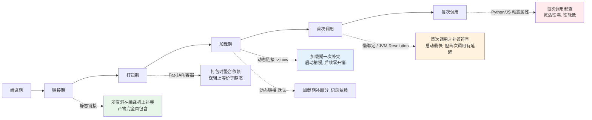
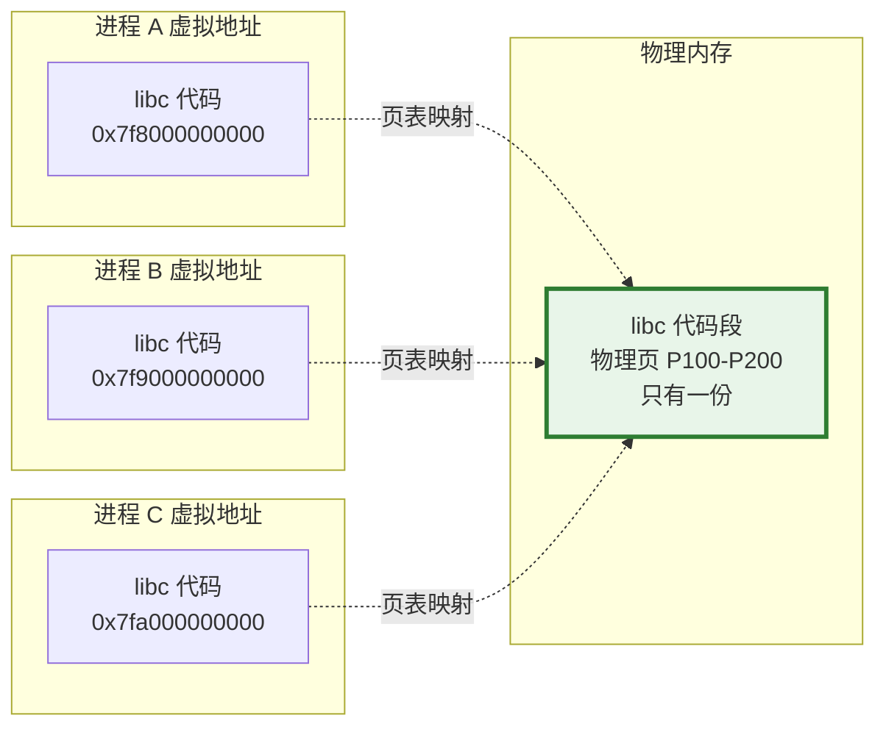
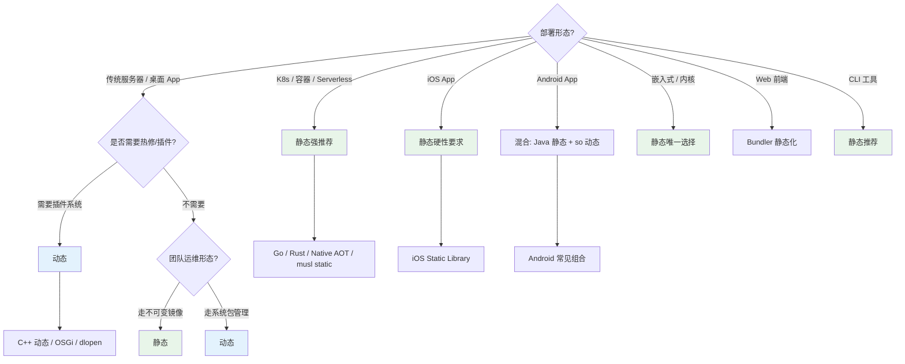

# 3.静态链接与动态链接

> 📍 **本篇位置**：第 7 卷 · 编译与链接之道 · 第 3 篇（把 7.2 里"洞什么时候补"的选择题正面回答）
> 🎯 **核心矛盾**：**同样是"把一堆代码拼起来"，为什么 Go 编译出 20MB 单文件、Linux 服务器 `/usr/lib` 塞满几万个 `.so`、iOS App 又几乎全静态？"静态 or 动态"这道题背后到底在权衡什么，为什么答案会随时代反复？**
> 🧭 **设计灵魂**：静态与动态不是"两种技术"，而是**"最后拼装动作发生在时间轴的哪一格"** 这条连续光谱上的两个典型停靠点。两端各有优势、也各有代价，用**空间、启动、更新、隔离、安全** 5 个维度秤重，**没有绝对赢家、只有场景适配**——而"场景"本身（单机 → 容器 → Serverless）在变，所以答案必须跟着变。
> 🌐 **跨平台覆盖**：C/C++（`.a` / `.so` / `.dylib` / `.dll`）· Rust（`crate-type`）· Go（默认静态）· Java Fat-JAR / OSGi / GraalVM Native Image · .NET（AOT / ReadyToRun / CLR）· Node.js `node_modules` + bundler · Python `import`
> 🔗 **延伸阅读**：← [7.1 从源码到可执行](./01.从源码到可执行.md) · ← [7.2 符号表与重定位](./02.符号表与重定位.md) · → [7.4 ABI 与调用约定](./04.ABI与调用约定.md) · → [7.5 语言到机器的路线](./05.语言到机器的路线.md)
> 💡 **通用心智**：**"共享单元" + "补洞时刻" + "平台策略"**——这三根轴决定了任何生态该走静态还是动态。**共享单元一变（进程 → 容器 → 函数），答案就要重做一次**。

---

> 上一篇讲清了"洞是怎么被补上的"（符号 + 重定位机制），这一篇正面回答**7.2 埋下的一个更工程的问题——洞什么时候补？** 编译期一次补完、加载期补、还是首次调用才补？这三种选择背后是**磁盘、内存、启动、更新、安全**五种资源的组合定价——没有免费午餐，只有**你愿意为哪个维度付账**的组合选择。
>
> 换个视角：**"链接策略"其实是"你信谁"的问题**——静态是"信编译时刻，锁死所有版本"，动态是"信运行环境，接受未来变数"，动态加载则是"信到调用那一刻才验"。**信任是有代价的**，付出的形式就是不同维度的资源。

> 📢 **语言无关声明**
> 本篇讨论的"静态 vs 动态"是**跨语言、跨平台的通用矛盾**——每种语言只是把这道选择题投影在自己的技术栈上，答案惊人地相似（因为矛盾本身没变）：
>
> - **C/C++**：`.a`（静态归档）vs `.so`/`.dylib`/`.dll`（动态库）。链接器命令行选项直接决定。
> - **Rust**：`crate-type = "rlib" | "staticlib" | "cdylib" | "dylib"`。默认对 Rust 依赖静态、对系统库动态——"实用静态派"。
> - **Go**：默认 100% 静态；`-buildmode=plugin` 才做动态加载。全静态是"文化"，代价是每个二进制都要带 runtime。
> - **Swift/iOS**：可静态可动态，但 App Store 生态强推静态（§10.2）。
> - **Java / JVM**：Fat-JAR = 静态思路；OSGi/Java 9 模块 = 动态思路；GraalVM Native Image = **真正的静态化**。
> - **.NET**：传统 CLR + `.dll` = 动态；.NET 7+ Native AOT = 静态化。
> - **Node.js**：`node_modules` 磁盘上"静态展开"，运行时 `require` 是"动态语义"；打包工具（webpack/Vite）在加一层"静态化"。
> - **Python**：`import` 每次运行都做符号绑定——**语义上的全动态**；`PyInstaller`/`Nuitka` 才能把它静态化。
>
> **看穿本质**：链接策略是**跨语言的元问题**，具体投影随语言不同，但**权衡的 5 个维度和 3 根决策轴完全一致**。

## 目录介绍

- [3.静态链接与动态链接](#3静态链接与动态链接)
  - [目录介绍](#目录介绍)
  - [1.真实事故引入](#1真实事故引入)
    - [1.1 glibc 升级引发的雪崩](#11-glibc-升级引发的雪崩)
    - [1.2 Go 单文件部署带来的震撼](#12-go-单文件部署带来的震撼)
    - [1.3 Native Image 启动 100ms](#13-native-image-启动-100ms)
    - [1.4 三个核心洞见](#14-三个核心洞见)
    - [1.5 灵魂三问](#15-灵魂三问)
    - [1.6 五个递进追问](#16-五个递进追问)
    - [1.7 本篇探索路径](#17-本篇探索路径)
  - [2.根本矛盾：拼装的时刻](#2根本矛盾拼装的时刻)
    - [2.1 时间轴：从编译到每次调用](#21-时间轴从编译到每次调用)
    - [2.2 三条守恒律](#22-三条守恒律)
    - [2.3 谁在时间轴上"迁移"](#23-谁在时间轴上迁移)
    - [2.4 矛盾的一句话本质](#24-矛盾的一句话本质)
  - [3.静态链接的本质](#3静态链接的本质)
    - [3.1 静态链接做的三件事](#31-静态链接做的三件事)
    - [3.2 亲手观察静态产物](#32-亲手观察静态产物)
    - [3.3 优点：把不确定性清零](#33-优点把不确定性清零)
    - [3.4 缺点：把"可变性"也清零了](#34-缺点把可变性也清零了)
    - [3.5 静态链接的历史地位](#35-静态链接的历史地位)
  - [4.动态链接的本质](#4动态链接的本质)
    - [4.1 动态链接做的三件事](#41-动态链接做的三件事)
    - [4.2 亲手观察动态产物](#42-亲手观察动态产物)
    - [4.3 共享的物理机制：代码段共享映射](#43-共享的物理机制代码段共享映射)
    - [4.4 优点：共享 + 热修 + 插件](#44-优点共享--热修--插件)
    - [4.5 缺点：DLL Hell + 启动慢 + 劫持面](#45-缺点dll-hell--启动慢--劫持面)
  - [5.五大权衡维度](#5五大权衡维度)
    - [5.1 大表：一眼看清 5 个天平](#51-大表一眼看清-5-个天平)
    - [5.2 磁盘/内存](#52-磁盘内存)
    - [5.3 启动速度](#53-启动速度)
    - [5.4 升级与安全补丁](#54-升级与安全补丁)
    - [5.5 隔离与插件扩展](#55-隔离与插件扩展)
    - [5.6 安全攻击面](#56-安全攻击面)
    - [5.7 五种典型场景的最优选](#57-五种典型场景的最优选)
  - [6.折中方案：混合链接与 LTO](#6折中方案混合链接与-lto)
    - [6.1 部分静态 + 部分动态](#61-部分静态--部分动态)
    - [6.2 LTO 与 ThinLTO](#62-lto-与-thinlto)
    - [6.3 符号可见性收窄](#63-符号可见性收窄)
    - [6.4 动态加载 `dlopen`](#64-动态加载-dlopen)
  - [7.DLL Hell 与它的所有兄弟](#7dll-hell-与它的所有兄弟)
    - [7.1 Windows 的 DLL Hell](#71-windows-的-dll-hell)
    - [7.2 Linux 的 sonames 与 GLIBC\_VERSION](#72-linux-的-sonames-与-glibc_version)
    - [7.3 macOS 的 dylib 版本策略](#73-macos-的-dylib-版本策略)
    - [7.4 JVM 的 JAR Hell](#74-jvm-的-jar-hell)
    - [7.5 Node.js 的 dependency 冲突](#75-nodejs-的-dependency-冲突)
    - [7.6 共同根因与修法](#76-共同根因与修法)
  - [8.跨语言家族的选择](#8跨语言家族的选择)
    - [8.1 C/C++：全谱都在用](#81-cc全谱都在用)
    - [8.2 Rust：实用静态派](#82-rust实用静态派)
    - [8.3 Go：全静态是文化选择](#83-go全静态是文化选择)
    - [8.4 Java / JVM：多层次共存](#84-java--jvm多层次共存)
    - [8.5 .NET：AOT 崛起](#85-netaot-崛起)
    - [8.6 Node.js / Python：动态语义 + 打包工具](#86-nodejs--python动态语义--打包工具)
  - [9.经典陷阱与反模式](#9经典陷阱与反模式)
    - [9.1 十大陷阱清单](#91-十大陷阱清单)
    - [9.2 Linux 上"静态链接 glibc"的坑](#92-linux-上静态链接-glibc-的坑)
    - [9.3 Docker + Go + cgo = Alpine 上崩](#93-docker--go--cgo--alpine-上崩)
    - [9.4 LD\_LIBRARY\_PATH 污染](#94-ld_library_path-污染)
    - [9.5 iOS 动态框架尺寸红线](#95-ios-动态框架尺寸红线)
    - [9.6 动态库删函数破坏 ABI](#96-动态库删函数破坏-abi)
  - [10.经典案例串讲](#10经典案例串讲)
    - [10.1 K8s 时代为什么"静态回潮"](#101-k8s-时代为什么静态回潮)
    - [10.2 iOS App 为什么几乎全静态](#102-ios-app-为什么几乎全静态)
    - [10.3 Java 微服务迁到 GraalVM Native Image](#103-java-微服务迁到-graalvm-native-image)
    - [10.4 Serverless 冷启动的"链接策略反转"](#104-serverless-冷启动的链接策略反转)
  - [11.总结](#11总结)
    - [11.1 三层认知阶梯](#111-三层认知阶梯)
    - [11.2 场景决策树](#112-场景决策树)
    - [11.3 七字真言](#113-七字真言)
    - [11.4 跨语言策略对照](#114-跨语言策略对照)
    - [11.5 与下篇承接](#115-与下篇承接)
  - [🔗 延伸阅读](#-延伸阅读)

---

## 1.真实事故引入

要把"静态 vs 动态"讲得记得住，不能上来就摆技术定义。**看三个真实事故——它们分别代表"动态之痛"、"静态之爽"、"静态化的新境界"**，你会发现这不是技术选择，是**工程哲学选择**。

### 1.1 glibc 升级引发的雪崩

> 🔍 **探索起点**：运维只升级了一个"公共库"，为什么一夜之间几十个不相干的服务全挂了？

周五晚，运维按计划把基础镜像里的 glibc 从 2.31 升到 2.35（修一个安全漏洞）。周六早上一批老服务陆续重启，全部倒在启动第一秒：

```
./gateway: /lib/x86_64-linux-gnu/libc.so.6: version `GLIBC_2.34' not found (required by ./gateway)
./gateway: /lib/x86_64-linux-gnu/libc.so.6: version `GLIBC_2.32' not found (required by ./gateway)
```

**为什么会这样？** 这些二进制是 6 个月前用**较新工具链**编的——它们的动态引用里记录的不只是"我需要 glibc"，而是"我需要 **GLIBC_2.34 以上符号版本**的 glibc"（这就是 `objdump -T` 里能看到的 `printf@GLIBC_2.34` 之类的版本符号）。运维事后才发现基础镜像里其实是老版本 glibc，而这批服务的编译环境用了更新版本——**动态链接绑定的是"符号版本"，不是"文件存在性"**。

| 现象 | 直觉解释 | 真正根因 |
|------|---------|---------|
| 只升级了一个库 | "库还在啊，怎么会挂" | 动态链接绑定的是**符号版本**（`GLIBC_2.34`），不是文件存在性 |
| 挂的全是"老服务" | "老代码质量差" | 恰恰相反——是"新工具链编的服务"没事；受害者画像由**编译环境**决定 |
| 有些服务毫发无损 | "运气好" | Go 服务、Rust `--target=musl` 服务、静态链接的 C 服务——**根本没有 glibc 欠条** |
| 回滚镜像立刻恢复 | "重启大法好" | 回滚的是 glibc 版本，漏洞修复被推迟而非解决——**这只是把炸弹搬回原位** |

**追问一层**：为什么同机房 Go 写的服务当晚全部安然无恙？——**它们的二进制里根本没有 glibc 的欠条**（`CGO_ENABLED=0` 编出来的 Go 二进制是纯静态的）：

```bash
$ ldd /path/to/gateway_go
    not a dynamic executable          ← 不依赖任何运行时库

$ ldd /path/to/gateway_cpp
    linux-vdso.so.1
    libc.so.6 => /lib/x86_64-linux-gnu/libc.so.6   ← 有欠条
    libssl.so.3 => /lib/x86_64-linux-gnu/libssl.so.3
    ...
```

**动态链接的"共享"，也是它的"被共享绑架"**——你把信任交给了环境，环境变卦时无处申诉。**为什么不像 Go 那样"打进去"就完事？** ——这就是本篇要正面回答的题。

### 1.2 Go 单文件部署带来的震撼

> 🔍 **探索起点**：为什么"发布"这件事，有的团队做成了环境工程、有的团队做成了文件拷贝？

同一家公司，两个团队做同一件事——把一个网关服务上线到 100 台生产机。

**C++ 团队的清单**：

```
1. 目标机器上 apt install libssl1.1 libcurl4 libprotobuf17 libz1 ...
2. glibc 版本必须 >= 2.28（不然某些 syscall 找不到）
3. 版本不对时 apt pin 锁定
4. 库路径不在标准位置要配 LD_LIBRARY_PATH
5. 装完 ldconfig 刷新缓存
6. 用 ansible playbook 保证 100 台机器状态完全一致
7. scp 二进制,启动服务
8. 上线后监控 dmesg,以防某台机器缓存了旧版共享库
```

**Go 团队的清单**：

```
1. CI 产出 gateway-linux-amd64
2. scp 到 100 台机器
3. chmod +x && ./gateway
```

**对比是残酷的**：

```bash
# C++
$ ldd gateway_cpp
    libssl.so.3 => /lib/x86_64-linux-gnu/libssl.so.3      ← 环境依赖 4 条
    libcurl.so.4 => /lib/x86_64-linux-gnu/libcurl.so.4
    libprotobuf.so.32 => ...
    libc.so.6 => ...

# Go
$ ldd gateway_go
    not a dynamic executable                              ← 零环境依赖
```

| 对比项 | C++ 动态链接版 | Go 静态版 |
|-------|--------------|----------|
| 部署单元 | 二进制 + 环境依赖清单 | **一个文件** |
| 环境敏感度 | glibc/OpenSSL/curl 版本地狱 | 零依赖（无 cgo 时） |
| 升级方式 | 库升级牵动全部依赖方 | 换文件重启 |
| 交叉编译 | 复杂（需 sysroot） | `GOOS=linux GOARCH=amd64 go build` |
| 代价 | — | 每个二进制自带 runtime（约 +2MB）、GC、goroutine 调度器 |
| 冷启动 | 100-300ms（含动态链接） | **10-50ms** |

**冲击点**：**发布复杂度从"环境工程"降到"文件拷贝"**——这不是量变，是质变。它是静态链接在**容器时代回潮**的最直接理由（§10.1）。

**再追问一层**：为什么 20 年前"环境工程"是常态、20 年后"文件拷贝"能被接受？——因为**共享单元变了**。20 年前一台服务器跑 50 个进程，共享一份 libc 是实打实的收益；今天一个 K8s 集群里，每个容器带各的 libc，"共享"已经名存实亡（详见 §10.1）。**技术选择跟着基础设施走，基础设施变了，最佳实践就要重新算**。

### 1.3 Native Image 启动 100ms

> 🔍 **探索起点**：Java 号称"启动慢"是天生的——真的没救吗？为什么 GraalVM Native Image 能把它压到 100ms 以内？

一家做 Serverless 的公司，Java 函数一直被 3-5 秒的冷启动折磨。用户每次触发都要等一次 JVM 启动 + 类加载 + JIT 热身，付出真金白银。他们尝试了 GraalVM Native Image，结果震撼：

| 指标 | 传统 Fat-JAR | GraalVM Native Image |
|------|-------------|---------------------|
| 产物 | 80MB jar + JRE（~200MB total） | 60MB 单可执行 |
| 冷启动 | 3-5s | **<100ms** |
| 首请求延迟 | 解释起步，前 100 次调用偏慢 | 无热身 |
| 稳态峰值 | JIT 优化后**通常略胜** | AOT 无 profile，通常略逊 |
| 内存占用 | 400MB（含 JIT 代码缓存） | 80MB |
| 构建时间 | 1 分钟 | 5-10 分钟 |
| 反射/动态代理 | 完整支持 | **需要 reachability metadata 提前登记** |

**Native Image 做的事，本质是"把 Java 链接过程从运行时搬回构建期"**：

- 传统 JVM：**每次启动**都做"类加载 + 验证 + 解析 + 初始化 + JIT"——就是 [7.2 §7](./02.符号表与重定位.md) 讲的常量池 Resolution 全套；
- Native Image：**构建时**就把"哪些类会被加载、哪些方法会被调用"算死并**直接连好**——链接过程被搬回**编译机**上做完，用户机器只是执行结果。

**冲击点**：**"运行时链接"和"构建时链接"不是技术差异，是不同时代的不同权衡结果**。JVM 20 年前设计时优先"运行时灵活性 + JIT profiling 收益"；今天在 Serverless 场景下，**冷启动是核心成本项**——链接策略必须重做。

**追问一层**：Native Image 的代价是什么？——**运行时不能再"临时决定加载什么类"**，反射的世界必须提前申报。**这是"分阶段绑定"哲学的又一次演绎——绑定越早、启动越快，但灵活性也越低**。看穿了这一点，你就能理解 [7.5](./05.语言到机器的路线.md) 里 AOT vs JIT 的深层选择。

### 1.4 三个核心洞见

```mermaid
flowchart TB
    A[事故 A: glibc 升级雪崩] --> Insight1[洞见 1: 动态链接的"共享"<br/>= 被共享绑架<br/>你信运行环境, 环境变卦时无处申诉]
    B[事故 B: Go 单文件部署] --> Insight2[洞见 2: 部署复杂度<br/>= 链接策略的直接投影<br/>基础设施变化会翻转最佳实践]
    C[事故 C: Native Image 100ms] --> Insight3[洞见 3: 运行时链接的"灵活"<br/>= 冷启动的成本<br/>把绑定前移就能换启动性能]

    Insight1 --> Core[通用心智:<br/>静态 vs 动态<br/>= 你为哪个维度付账<br/>= 你的场景处于哪个时代]
    Insight2 --> Core
    Insight3 --> Core

    style Core fill:#fff3e0,stroke:#e65100,stroke-width:3px
```

三条洞见合成一句话：**链接策略不是"技术选择"，是"你的工程约束在哪一维度最紧"的直接映射**——磁盘紧、启动紧、灵活性紧、还是安全性紧，答案会完全不同。

### 1.5 灵魂三问

- **Q1**：静态更快、更简单、隔离更好——**为什么 Linux 生态选了动态**？
- **Q2**：**iOS App 是静态还是动态？Android 呢**？——同为移动平台，同样掌控力强，为什么两家答案不一样？
- **Q3**：Java 的 Fat-JAR 和 GraalVM Native Image，哪个"更像静态链接"？—— 名字里都没"静态"两个字，怎么判断？

### 1.6 五个递进追问

Q1-Q3 是入门，下面五问是"能不能真正看穿这道题"的分水岭：

1. **共享单元究竟是什么** —— 20 年前"动态省内存"的物理机制到底是什么？为什么容器化之后这个机制的收益急剧衰减？（§4.3、§10.1）
2. **版本地狱如何产生** —— DLL Hell、GLIBC_VERSION、JAR Hell、npm dependency conflict——为什么"同一个 bug 换个名字"在每个语言都要重演一次？（§7）
3. **LTO 到底改变了什么** —— 现代静态链接支持"跨模块内联"，动态链接不能。这条差异如何影响真实项目的性能表现？（§6.2）
4. **静态化的极限在哪** —— Go 号称全静态但仍要带 runtime；Native Image 仍要 reachability metadata；iOS 静态框架也有尺寸红线——"完全静态"这件事有物理上限吗？（§9.5、§8.3）
5. **Serverless 时代该怎么选** —— 冷启动敏感场景下，链接策略的最佳实践正在被重写。这个新时代的答案和 90 年代 UNIX 时代为什么会截然相反？（§10.4）

**看穿这五问，静态 vs 动态就再也不用查资料**。

### 1.7 本篇探索路径


---

## 2.根本矛盾：拼装的时刻

上一篇 [7.2 §2](./02.符号表与重定位.md#2根本矛盾编译期的三个不知道) 我们已经把"编译期不知道地址"这个矛盾拆开。**这一节要问的更工程：这个"不知道"要留到多晚才补？留得越晚，得到什么、失去什么？**

### 2.1 时间轴：从编译到每次调用



这条轴的**两端性质对称**：

| 越靠左（早补） | 越靠右（晚补） |
|--------------|-------------|
| 启动快 | 启动慢（要现场做补丁） |
| 行为完全可预测 | 行为依赖运行环境 |
| 错误在构建期暴露 | 错误推迟到用户手里 |
| 产物大（要打包全部依赖） | 产物小（只有欠条） |
| 依赖锁死（升级要整体重发） | 依赖可热修（换库即可） |
| 无法运行时扩展 | 支持插件、动态加载 |
| LTO 内联友好 | 优化被库边界隔离 |

**"静态 or 动态"不是二选一**，而是**这条连续光谱上的两个典型停靠点**。中间还有大量的形态：

- **打包期整合**：Fat-JAR、Docker 镜像、iOS App Bundle——"逻辑静态、物理仍可能是打包动态"；
- **LTO**：把优化也搬到链接期，是**"更静态的静态"**；
- **懒绑定**：动态链接的默认策略——"加载时只登记、首次调用才真解析"；
- **`dlopen` 动态加载**：把整个库的载入都推迟到运行时——"极致的动态"；
- **每次属性查询**：Python/JS 的动态语义——**"链接消失了、每次都是重新链接"**。

**一个生态的性格 = 它把绝大多数符号的补洞放在轴上的哪个刻度**。

### 2.2 三条守恒律

三个不变的规律，理解了这三条就理解了"没有免费午餐"：

**① 代价守恒**：**动态省的空间 = 加载时多花的 CPU 和内存中间开销**；**静态省的启动 = 部署时多的字节**。你不能同时"启动快、产物小、易更新"——最多拿到其中两个。

**② 信任守恒**：**静态锁死依赖 → 你信"编译时刻"**；**动态延后依赖 → 你信"运行环境"**；**动态加载 → 你信"到调用那一刻会准备好"**。**信任的对象不同，出锅的方式也不同**——静态锁死的库有 CVE 时你要重发所有产物；动态依赖的环境变卦时你的产物启动不起来。

**③ 灵活性守恒**：**动态换库不用改主程序 → 也意味着别人换库可以偷偷改你的行为**（LD_PRELOAD 攻击、DLL 劫持）。**"我能改" = "别人也能改"**——灵活性是一把双刃剑，插件生态和攻击面是同一枚硬币。

### 2.3 谁在时间轴上"迁移"

历史上，各语言在时间轴上的位置不断迁移，观察这个迁移能看出**时代的产业趋势**：

| 语言/生态 | 早期位置 | 当前主流 | 迁移方向 |
|---------|-------|--------|------|
| Unix/Linux 系统 | 静态（1970s，PDP-11 时代） | 动态（1980s+）| 早 → 晚（多用户多进程分时系统需求） |
| C 大厂后端 | 动态（2000s） | 静态回潮（2020s）| 晚 → 早（容器/微服务需求） |
| Java | 运行时链接（1996+） | 部分场景 AOT（GraalVM，2020s）| 晚 → 早（Serverless 需求） |
| iOS 生态 | 静态为主（一直如此） | 保持静态（甚至更严）| 稳定（平台策略主导） |
| Web 前端 | 每次动态（JS 原生） | 打包工具静态化（Webpack/Vite）| 晚 → 早（生产环境启动性能需求） |
| .NET | 动态（CLR + JIT） | AOT 崛起（.NET 7+）| 晚 → 早（云原生/移动需求） |

**规律**：**当"部署单元"变小（进程 → 容器 → 函数）、"部署频率"变高（月发 → 日发 → 秒发）时，链接策略普遍向"早"迁移**。反之，当"单机寿命"变长、"多进程共享"是常态时，链接策略向"晚"迁移。**这不是技术偏好，是产业形态倒逼**。

### 2.4 矛盾的一句话本质

> **"拼装的时刻早/晚"是一切链接策略的元问题**——**早**换来启动、可预测、可移植；**晚**换来共享、热修、灵活。没有第三条路，只有"针对具体场景、把绝大多数符号放在哪一格"的组合选择。**答案会随基础设施演进（进程 → 容器 → 函数）不断被重做**。

---

## 3.静态链接的本质

### 3.1 静态链接做的三件事

> 🔍 **探索起点**：`gcc -static` 背后，链接器到底比平时多干了什么？

先看两条命令的产物对比：

```bash
$ gcc hello.c -o hello_dyn && ls -l hello_dyn
-rwxr-xr-x  15688 hello_dyn        # 动态: 只有"欠条"

$ gcc -static hello.c -o hello_static && ls -l hello_static
-rwxr-xr-x  752568 hello_static    # 静态: 自带全套

$ ldd hello_static
    not a dynamic executable
```

从 15KB 到 750KB，多出来的部分就是静态链接干的**三件事**：

**① 挑选（selective extraction）**：从 `libc.a` 里**只抽出被引用的 `.o`**——`printf` 的实现、`crt1.o` 启动代码、`_exit` 等被间接引用的函数——**没用到的一律不进产物**。所以静态链接**不是**"把整个 libc 拷进去"，而是"按需组合"。

```bash
# 手工看 libc.a 里有多少 .o
$ ar t /usr/lib/x86_64-linux-gnu/libc.a | wc -l
1500      # libc.a 里有 1500 个 .o

$ nm hello_static | wc -l
2100      # 但最终 hello_static 只带了约 2100 个符号 - 大部分被裁掉了
```

**② 补洞（full resolution）**：完成**全部**符号解析与重定位——所有 `call`、所有数据引用的地址一次补完，即 [7.2 §4](./02.符号表与重定位.md#4重定位的机制) 讲的重定位机制的完整执行。产物里**不再有 undefined 符号、不再有 `.rela.text`**。

**③ 自包含（no dynamic dependencies）**：产物不再携带任何"运行时欠条"（ELF 的 `DT_NEEDED` 依赖表为空）——**加载器 `mmap` 完就能跑，不需要动态链接器介入**。

```bash
$ readelf -d hello_static | grep NEEDED
                             ← 空! 没有任何依赖

$ readelf -d hello_dyn | grep NEEDED
 0x0000000000000001 (NEEDED)     Shared library: [libc.so.6]
```

**关键洞见**：静态链接的价值不在"文件变大"，而在**把不确定性清零**——启动时没有符号要解析、没有库要找、没有版本要匹配。**它是用磁盘空间买了"确定性"**。这就是为什么 Go 官方一直坚持全静态：**Go 追求"部署简单、行为可预测"，静态是它的必然选择**。

### 3.2 亲手观察静态产物

```bash
# 1. 静态可执行文件的段结构
$ readelf -l hello_static | head -20
Program Headers:
  Type           Offset             VirtAddr           PhysAddr
  LOAD           0x000000           0x0000000000400000 ...  # 代码段
  LOAD           0x0a2000           0x00000000004a2000 ...  # 数据段
  ...
# 没有 INTERP 段(动态链接器路径)——完全自包含

# 2. 动态可执行文件对比
$ readelf -l hello_dyn | head -20
Program Headers:
  Type           Offset             VirtAddr           PhysAddr
  PHDR           ...
  INTERP         ...  # 有 INTERP: /lib64/ld-linux-x86-64.so.2 ← 加载器
  LOAD           ...

# 3. 符号数量对比
$ nm hello_dyn | wc -l
9         # 只有自己的符号

$ nm hello_static | wc -l
2100      # 自己 + libc 的必要子集

# 4. 依赖链对比
$ ldd hello_dyn
    linux-vdso.so.1
    libc.so.6 => /lib/x86_64-linux-gnu/libc.so.6

$ ldd hello_static
    not a dynamic executable
```

**每一个 `readelf`、`ldd`、`nm` 都能亲手复现**——链接策略不是抽象概念，是**能看到的具体二进制差异**。

### 3.3 优点：把不确定性清零

| 优点 | 具体表现 | 谁在受益 |
|------|--------|--------|
| **零依赖部署** | `scp` 就能上线，不用装任何库 | 云原生、Serverless、跨发行版分发 |
| **可预测启动** | 无动态解析开销，冷启动 < 50ms | 容器编排、批量任务、Serverless |
| **版本锁死** | 不会被环境里"另一个版本"污染 | 老服务长期运行、独立可交付产品 |
| **对优化器友好** | LTO 能做跨模块内联（§6.2） | 性能关键路径、编译器/数据库/游戏引擎 |
| **无 ABI 断裂** | 编译时看到什么就是什么 | 商业闭源软件（自控 ABI 稳定性） |
| **加固更彻底** | 无 LD_PRELOAD 劫持面 | 高安全场景（金融、军工、独立设备） |

### 3.4 缺点：把"可变性"也清零了

| 缺点 | 具体表现 | 现代缓解 |
|------|--------|--------|
| **磁盘/内存膨胀** | 100 个进程各带一份 libc | 容器时代已弱化（共享单元变了） |
| **升级困难** | 修一个 CVE 要重编所有二进制 | CI/CD 自动化 + 蓝绿部署 |
| **License 风险** | GPL 会传染整个宿主 | LGPL/MIT/Apache 静态无风险；GPL 用 LGPL 变体 |
| **无插件扩展** | 无法运行时加载 `.so` | 设计时明确"不支持插件"即可 |
| **无热修复** | 修 bug 必须重启 | K8s 滚动更新 |
| **单体测试压力** | 一次链接几百 MB | 用 `mold`（§9） |

**"License 传染"这个坑值得单独拎出来**——不是所有开源许可都会传染：

- **GPL**：静态链接**会**让宿主变成"衍生作品"，必须开源——商业闭源软件的雷区；
- **LGPL**：明确**允许**静态链接，但要求"允许用户替换该库"（提供 `.o` 或 relink 方式）；实践中大多数商业软件为了省事直接用动态；
- **MIT / BSD / Apache 2.0**：完全不受影响，静态动态都行。

**"静态链接会传染"是**"个别许可证的规则"**，不是"静态链接自身的属性"**——这个误解让无数团队错过静态链接的红利。

### 3.5 静态链接的历史地位

回顾一下静态链接在 UNIX/Linux 生态的地位变化：

| 年代 | 主流态度 | 原因 |
|------|--------|-----|
| **1970s-1980s** | 唯一选择 | 早期 UNIX 没有动态链接器 |
| **1990s-2010s** | 被视作过时 | 磁盘/内存宝贵，共享是刚需；`.so` 生态繁荣 |
| **2015-2020** | 边缘化 | Linux 发行版全盘动态化 |
| **2020s** | **强势回归** | Docker/K8s/Serverless 让"共享"不再是刚需，"零依赖"变刚需 |

Go/Rust/GraalVM Native Image/.NET AOT——**新一代运行时几乎全部走静态化路线**。这不是"技术复古"，是**共享单元变了导致的最优解迁移**。

---

## 4.动态链接的本质

### 4.1 动态链接做的三件事

> 🔍 **探索起点**：动态链接"省了空间"，那它把哪些活儿推迟出去了？

动态链接把静态链接的"编译期一次做完"拆成了**编译期 + 加载期**两段。

**编译链接期（做减法）**：

**① 不拷贝**：可执行文件里只留**未定义符号引用**和一张**依赖库清单**（ELF 的 `DT_NEEDED`）——比如 `libc.so.6`、`libssl.so.3`。库里的代码**一字节都不进主二进制**。

```bash
$ readelf -d gateway | grep NEEDED
 0x0000000000000001 (NEEDED)     Shared library: [libssl.so.3]
 0x0000000000000001 (NEEDED)     Shared library: [libcrypto.so.3]
 0x0000000000000001 (NEEDED)     Shared library: [libc.so.6]
```

**② 造表**：为每个外部符号生成 **PLT 桩 + GOT 表项**（[7.2 §6](./02.符号表与重定位.md#6动态符号延迟到运行时的解析)）——`call foo` 的洞被补成"跳到 PLT 桩"而不是"跳到 foo 实现"。

**加载期（做加法，由 `ld-linux.so` 接管）**：

**③ 现场拼装**：进程启动时（`_start` 执行前），动态链接器 `ld-linux.so` 接管，做四件事：
- `mmap` 所有依赖库 → 递归处理它们的依赖 → 建成一张完整的 `.so` 加载图；
- 对每个 `.so` 做**符号解析**——把 undef 符号配对到某个 `.so` 里的定义；
- **回填 GOT** 和其他重定位段——把内存里的洞补上；
- 才把控制权交给 `_start` → `__libc_start_main` → `main`。

对照静态：**静态把 2、3 步全做完才发布；动态把第 3 步连同"库代码本身"一起留给了用户机器**。

### 4.2 亲手观察动态产物

```bash
# 1. 主二进制里没有 libc 代码
$ nm gateway_dyn | grep printf
                U printf     ← 只是引用, 没实现

# 2. libc.so 里有 printf 实现
$ nm -D /lib/x86_64-linux-gnu/libc.so.6 | grep '^.* T printf$'
000000000005f770 T printf

# 3. 运行时看进程内存映射
$ ./gateway_dyn &
$ cat /proc/$(pgrep gateway)/maps | grep libc
7f8b12000000-7f8b12028000  r--p  ...  /lib/x86_64-linux-gnu/libc.so.6
7f8b12028000-7f8b121ab000  r-xp  ...  /lib/x86_64-linux-gnu/libc.so.6    # ← 代码段
7f8b121ab000-7f8b12203000  r--p  ...  /lib/x86_64-linux-gnu/libc.so.6
7f8b12203000-7f8b12207000  r--p  ...  /lib/x86_64-linux-gnu/libc.so.6
7f8b12207000-7f8b12209000  rw-p  ...  /lib/x86_64-linux-gnu/libc.so.6

# 4. 跑第二个进程,libc 的物理页确实被共享
$ ./gateway_dyn &   # 第二个进程
$ cat /proc/$(pgrep -n gateway)/maps | grep libc
# 虚拟地址可能不同 (ASLR), 但内核让它们指向同一份物理页
```

**核心观察**：**同一份 libc 的代码页在物理内存中只有一份，被所有映射它的进程共享**——这就是动态链接"共享"的物质基础（§4.3）。

### 4.3 共享的物理机制：代码段共享映射

**动态链接的价值全在"共享"两个字，那这个共享具体是怎么实现的？**



**机制**：`mmap` `.so` 时用 **`MAP_PRIVATE` + `MAP_FILE`**——Linux 内核在处理这类映射时：
1. 第一个进程 `mmap` libc.so.6 时，内核从磁盘读入代码页，放到某组物理页 P100~P200；
2. 第二个进程 `mmap` 同一文件时，**内核发现文件已在 page cache 里**，直接把新进程的虚拟地址映射到同一批物理页；
3. **`.text` 段是只读的，只要不写就永远不 COW（copy-on-write），永远共享一份**；
4. `.data` 段会 COW，一改就分裂——但代码段占绝大部分体积。

**收益量化**：
- 100 个进程共享一份 100MB 的 libstdc++.so → 磁盘 100MB、内存 100MB；
- 100 个进程各带一份静态链接的 libstdc++（假设每个 30MB）→ 磁盘 100 × 30 = 3GB、内存 100 × 30 = 3GB；
- **共享省了 97GB 磁盘 + 97GB 内存**——1990s 服务器的磁盘还不到 1GB，这是"生死攸关"的优化。

**但——**（这个但字是本篇灵魂）：**这套机制要求"进程共享同一份物理内存"**。容器化把每个应用锁进自己的 mount namespace + 独立文件系统，**不同容器 `mmap` 各自的 libc（即使版本相同）也是不同的 inode → 内核不会去重 → 物理页无法共享**。**共享单元从"进程"缩小到了"容器"**——这就是 §10.1 的核心。

### 4.4 优点：共享 + 热修 + 插件

| 优点 | 具体表现 | 谁在受益 |
|------|--------|--------|
| **磁盘/内存共享** | 100 进程共用一份 libc → 双省 | 单机多进程场景（传统服务器） |
| **热更新** | 修 CVE 只需更新库，进程重启即生效 | Linux 发行版维护、企业内网升级 |
| **插件系统** | `dlopen` 让程序能"事后加载新代码" | Chrome/VSCode/Photoshop 生态 |
| **进程隔离降级** | 一个 `.so` 崩溃可以在有限范围内处理（如 catch signal） | 长期运行的服务 |
| **A/B 测试** | 换库不换主程序就能试新版本 | 大流量服务的灰度 |
| **模块化演化** | 库和主程序可以独立发版 | 大型 C++ 项目 |

### 4.5 缺点：DLL Hell + 启动慢 + 劫持面

| 缺点 | 具体表现 | 现代缓解 |
|------|--------|--------|
| **DLL Hell / 依赖地狱** | 库版本不匹配崩溃（§7） | 版本管理器 + 容器化 |
| **启动慢** | 加载器要解析大量符号 | `-Wl,-z,now` 前置 + prelink |
| **易被劫持** | `LD_PRELOAD`、DLL 搜索路径攻击 | `RUNPATH` + 签名 |
| **优化受限** | 跨库无法内联 | 部分场景可用 LTO |
| **调试复杂** | 需要正确加载所有 `.so` 才能符号化崩溃 | dSYM/PDB 完善 |
| **发布链条长** | 库和主程序都要一致发布 | 逐渐用容器"打包" |
| **反向工程门槛低** | `.so` 独立可分析 | `strip` + obfuscator |

**"共享"是动态链接的核心卖点，但共享的每一寸都是"信任的转移"**——你把版本一致性、加载路径、库完整性都交给了运行环境。**环境靠得住，动态就爽；环境变卦，动态就是雪崩**。

---

## 5.五大权衡维度

### 5.1 大表：一眼看清 5 个天平

| 维度 | 静态 | 动态 |
|------|------|------|
| **磁盘/内存** | ❌ 每进程独有一份 | ✅ 共享（容器时代弱化，§10.1） |
| **启动速度** | ✅ 无解析开销，< 50ms | ❌ 需加载/绑定，100-500ms |
| **升级/安全补丁** | ❌ 全部重编 | ✅ 单点热修 |
| **部署复杂度** | ✅ 拷贝即用 | ❌ 环境依赖清单 |
| **编译期优化空间** | ✅ 支持 LTO/跨模块内联 | ❌ 边界隔离 |
| **运行时稳态峰值** | ⚠️ 取决于是否 AOT：LTO 静态 ≈ 最好；纯 AOT 可能略逊 JIT（§10.3） | ⚠️ 起步慢，JIT 收 profile 后稳态可能反超 |
| **License 传染** | ⚠️ 仅 GPL 有此问题；LGPL/MIT/Apache 不受影响 | ✅ 相对安全 |
| **安全攻击面** | ✅ 无 LD_PRELOAD | ❌ 有劫持风险 |
| **热插拔/插件** | ❌ 无法运行时加载 | ✅ 天然支持 |
| **反向工程门槛** | 中 | 低（`.so` 独立可分析） |
| **发布链条** | 单一产物 | 主程序 + 库的一致发布 |

**这张表就是这道选择题的"评分卡"**——面对具体场景时，逐维打分、加权求和，就能算出最优解。

### 5.2 磁盘/内存

**静态的痛**：`hello world` 静态 750KB、动态 15KB——差 50 倍。但真实工程里没那么夸张：一个 20MB 的 C++ 服务，静态版本大约 30-50MB，多的部分主要是 libstdc++ 和常用运行时（并不是"整个 libc 拷进去"，是"按需拉取"的合并）。

**动态的赢**：100 个进程共享一份 100MB libstdc++——1990s 是刚需，2020s 容器里意义不大。

**决策要点**：**看部署单元**。多进程同机部署 → 动态省内存显著；容器/单进程 → 静态基本没成本。

### 5.3 启动速度

**静态**：`mmap` 完直接 `_start` → 通常 < 50ms（含内核）。

**动态**：`mmap` + 动态链接器 + 递归解析依赖 + 绑定符号——**大型 C++ 项目冷启动可达 500ms-2s**（Chrome 早期启动 3-5s，主要就是这部分）。可以看具体开销：

```bash
$ LD_DEBUG=statistics ./gateway
runtime linker: total startup time in dynamic loader: 234.567890 sec
runtime linker: time needed for relocation: 189.123456 sec (80%)   ← 主要开销
runtime linker: time needed to load objects: 45.444434 sec
```

**优化选项**：
- `-Wl,-z,now` 关掉懒绑定 → 启动稍慢但后续零开销（金融/游戏场景常用）；
- `-Wl,-z,relro` + `-Wl,-z,now` 组合 → 启动一次绑定完 + GOT 只读，兼顾启动稳定和安全；
- prelink（Fedora 曾用） → 预先在库文件里存好基址假设，加载时少一步计算；
- **静态化**（GraalVM Native Image / Go / Rust 静态） → 直接省掉这一整块开销。

**决策要点**：**冷启动敏感（Serverless、函数计算）→ 强烈倾向静态；长时驻留服务 → 启动一次的成本可以忽略**。

### 5.4 升级与安全补丁

**动态大胜**：glibc 出 CVE-2023-4911 时——

- 动态链接的用户：`apt update && apt upgrade libc6 && systemctl restart *` → 1 分钟修完 100 台机器；
- 静态链接的用户：**每个二进制都要重新编译并重新发布**——如果二进制是 1 年前编的、CI 早就 Del 了，需要从头搭编译环境，几天甚至几周。

**这是动态链接最坚固的护城河**。

**但——**：容器时代很多团队走"不可变基础设施"路线——**任何依赖变化都要求重新构建镜像并重新发布**。这时"动态可以热修"的优势消失，两种模式在运维层面都要走一遍 CI/CD，"动态"没有本质优势。

**决策要点**：**能落地"热修 libc"的传统运维环境 → 动态受益；走"不可变镜像"路线的团队 → 动态和静态没差别，静态反而更简单**。

### 5.5 隔离与插件扩展

**动态独一份**：`dlopen` / `LoadLibrary` / `System.load` 让程序能"事后加载"。**没有动态链接，就没有插件系统**——Chrome 扩展、VSCode Extension、Photoshop 滤镜、JVM Instrumentation Agent、Android Native Library——**全部建立在动态加载之上**。

**静态没辙**：`gcc -static` 编出来的程序**不能 `dlopen`**（缺少动态链接器）——功能上就不支持插件。

**决策要点**：**做需要插件的产品（IDE、浏览器、大型 App）→ 必须动态**；**做没有插件需求的服务（微服务、CLI 工具）→ 可选静态**。

### 5.6 安全攻击面

**静态更安全**：产物完全自包含，没有 `LD_PRELOAD`、没有 DLL 搜索路径、没有依赖被替换的可能。这是**金融、军工、独立设备**倾向静态的核心原因。

**动态多面暴露**：
- **`LD_PRELOAD` 攻击**：`LD_PRELOAD=./evil.so ./target` 让 `evil.so` 里的 `malloc` 覆盖真实的 `malloc`——所有内存分配都被劫持；
- **DLL 劫持**（Windows）：把恶意 DLL 放到应用目录，会优先于系统目录被加载；
- **符号版本降级**：故意提供旧版本 `.so`，让程序调用有漏洞的老实现；
- **供应链攻击**：篡改 `.so` 就能污染所有依赖它的程序（XZ Utils 后门就是这类）。

**决策要点**：**高安全场景（银行、军工、独立设备）→ 强烈倾向静态**。**这也是 iOS 生态强推静态的第三条理由**（§10.2）。

### 5.7 五种典型场景的最优选

| 场景 | 推荐 | 理由 |
|------|------|------|
| **云原生微服务 / K8s** | **静态** | 镜像瘦身、启动快、容器隔离让"共享"失效 |
| **Serverless / 函数计算** | **强静态** | 冷启动 = 用户等待时间 = 真金白银 |
| **桌面 App（IDE、浏览器）** | **动态** | 系统库共享 + 插件生态 |
| **移动 App（iOS）** | **静态** | App Store 策略 + 安全模型 |
| **移动 App（Android）** | **混合** | AAR 静态（Java 层）+ NDK so 动态 |
| **嵌入式 / 内核模块** | **静态** | 无动态链接器 |
| **数据库/中间件（长驻）** | **静态优先** | 可预测性能、无 DLL Hell |
| **游戏引擎** | **静态 + LTO** | 稳态性能榨到极致 |
| **浏览器/编辑器插件宿主** | **动态** | 必须支持第三方 hot-load |
| **Linux 发行版基础组件** | **动态** | 系统级共享 + 集中安全维护 |

**这张表就是"如果你在做 X 就选 Y"的作弊码**。

---

## 6.折中方案：混合链接与 LTO

极端全静态或全动态都有硬伤，实际工程里最常见的是**混合策略**。

### 6.1 部分静态 + 部分动态

**思路**：**业务代码和第三方库静态，系统运行时动态**。

```bash
# 只让 libfoo 静态,其他动态
$ gcc main.o -Wl,-Bstatic -lfoo -Wl,-Bdynamic -lc -lm -o main

$ ldd main
    linux-vdso.so.1
    libc.so.6 => /lib/x86_64-linux-gnu/libc.so.6    ← 动态
    libm.so.6 => /lib/x86_64-linux-gnu/libm.so.6    ← 动态
    # libfoo 不在列表里,已静态打进 main
```

**这是 Rust 的默认策略**——`cargo build` 编出来的二进制：
- 所有 Rust 依赖（crate）**静态**打进主二进制；
- glibc、libpthread、libdl、libm **动态**链接系统提供的。

好处：**避免了 Go 那样带 runtime 的膨胀（Rust 二进制没有 runtime），又不用维护 Rust crate 的动态库生态**。**Rust 选择了"实用静态"的最优点**。

### 6.2 LTO 与 ThinLTO

**LTO（Link Time Optimization）**：把"编译"的一部分推迟到"链接"——链接器不只做符号配对，还能看到**所有**函数的中间表示（LLVM IR / GCC GIMPLE），做**跨模块内联、跨模块死代码消除、跨模块常量传播**。

```bash
$ gcc -flto -O2 -c a.c b.c c.c
$ gcc -flto -O2 a.o b.o c.o -o app        # 链接时才做全局优化
```

**为什么必须在链接期做？** 因为编译单一 `.c` 时看不到别的 `.c` 里的函数——**跨模块内联在编译期物理上做不到**。LTO 把决策推迟到"能看到全局"的时刻。

**收益**：Chrome 官方数据、LLVM 官方 benchmark——**LTO 一般能带来 5%-15% 性能提升、5%-10% 体积缩减**。

**代价**：**链接时间和内存爆炸**——链接器要吃下所有 IR、做全局优化，Chrome 早期开启 LTO 后链接内存曾到 60GB。

**ThinLTO**（LLVM 2016 推出）——**分块并行的 LTO**：
- 每个 `.o` 里存"轻量摘要"（谁调用了谁、谁在热路径）；
- 链接器读所有摘要，生成"跨模块内联指令"；
- **每个 `.o` 独立并行做本地内联**——不再是单进程扛所有 IR。

结果：**内存降到 1/10、时间降到 1/3，收益几乎不变**——Chrome/Firefox/LLVM 自己现在全部用 ThinLTO。

**决策要点**：**追求极致稳态性能 → 开 LTO/ThinLTO**；**追求构建速度 → 不开**。**这项能力只在静态链接下可用**——动态库边界不可跨越，LTO 无从下手。**这是静态链接在性能维度对动态的降维优势**。

### 6.3 符号可见性收窄

即使走动态链接，也可以**通过收窄可见性把动态化的"漏洞"补上**——[7.2 §3.5](./02.符号表与重定位.md#35-符号可见性global--local--hidden) 讲过 `-fvisibility=hidden`。

**核心思想**：**默认所有符号 hidden、只显式导出真正的公共 API**。这样即使是动态库：
- 内部辅助函数**不进入 `.dynsym`** → 外部程序拿不到、`LD_PRELOAD` 无法替换；
- 链接期符号表小 → 链接快；
- 加载期符号表小 → 启动快；
- 内部函数可以自由重构 → 不担心破坏"隐式 ABI"。

**Chrome 官方实测**：动态符号从 12 万缩到 3 千，链接时间和启动时间大幅下降。**这是"动态但不放开"的核心工程实践**——鱼与熊掌兼得的少数场景之一。

### 6.4 动态加载 `dlopen`

**动态链接**是"启动时由系统自动加载依赖"；**动态加载**是"程序在需要时主动加载"（`dlopen` / `LoadLibrary` / `System.load`）——**这是链接光谱最右侧的形态**。

```c
// 传统动态链接（启动即加载）
// 主程序里直接 #include <foo.h>; 调用 foo()

// 动态加载（用到才加载）
void *handle = dlopen("libfoo.so", RTLD_LAZY);   // 运行时加载
if (!handle) { /* 加载失败也不影响主程序启动 */ }
int (*foo)(int) = dlsym(handle, "foo");           // 找符号
int r = foo(42);
dlclose(handle);
```

**典型用途**：

- **插件系统**：VSCode / Chrome / Photoshop / OBS 的插件都靠这个；
- **可选功能**：CUDA / OpenGL / Vulkan——不装显卡驱动时程序能正常跑、只是没这些能力；
- **热更新**：iOS/Android 的动态化框架、游戏客户端的资源包；
- **A/B 版本**：不同用户加载不同 `.so`；
- **多语言宿主**：JVM 加载 Native Library、Python 加载 C 扩展。

**代价**：**符号错误只有"调用到"才发现**——测试覆盖不到就永远埋雷。**这是 [7.2 §1.3](./02.符号表与重定位.md#13-nosuchmethoderror) 的 NoSuchMethodError 的 C 版本**——都是"运行时才做符号解析"的宿命。

**语言里的对应设施**：

| 语言 | 设施 | 备注 |
|------|-----|------|
| C/C++ | `dlopen` / `dlsym` / `dlclose` / `LoadLibrary` | POSIX / Win32 |
| Rust | `libloading` crate | 封装 `dlopen` |
| Go | `plugin.Open` | **仅 Linux/macOS，Windows 不支持** |
| Java | `URLClassLoader` / `ServiceLoader` / OSGi | 更高层抽象 |
| C# | `Assembly.Load` / MEF | .NET 原生 |
| Python | `importlib.import_module` | Python 天生动态 |
| Node.js | 动态 `import()` | ES2020+ 支持 |

**观察**：**每种语言都在自己的抽象层次提供"动态加载"能力**——这个能力太重要，插件生态离了它就活不了。

---

## 7.DLL Hell 与它的所有兄弟

**"DLL Hell"是 Windows 世界的老词，但同一个坑在每个语言里都以不同名字出现过一次**。本节把它们一次说清——**看穿了同构，你就能对任何一门语言的依赖冲突一眼判断**。

### 7.1 Windows 的 DLL Hell

**症状**：
- 装了 App A（带 `msvcrt.dll` v1.0）；
- 后装 App B（覆盖了 `msvcrt.dll` 为 v2.0）；
- App A 再启动时崩溃——它期待 v1.0 的 API 行为。

**根因**：早期 Windows 允许应用把 DLL 放进 `C:\Windows\System32`，**多个应用共享同一份系统 DLL**——一个应用装/卸载会影响其他应用。

**修法（时间线）**：
- **Windows XP**：引入 **Side-by-Side (SxS) Assembly**——允许多个版本 DLL 共存；
- **Windows Vista+**：应用被鼓励把私有 DLL 放到自己目录；
- **.NET**：**GAC (Global Assembly Cache)** + Strong Name 允许多版本共存；
- **现代最佳实践**：**每个应用自带所需 DLL，不写入系统目录**——本质就是"静态化的思想"。

### 7.2 Linux 的 sonames 与 GLIBC_VERSION

Linux 学到了 Windows 的教训，用**符号版本机制**处理 DLL Hell：

**① soname**：库文件名带主版本号——`libcurl.so.4` 和 `libcurl.so.3` 可以共存，不同 ABI 版本不会互相污染：

```bash
$ ls -la /usr/lib/x86_64-linux-gnu/libcurl.so*
libcurl.so       -> libcurl.so.4         # 开发用符号链接
libcurl.so.4     -> libcurl.so.4.7.0     # ABI v4
libcurl.so.4.7.0                         # 实际文件
libcurl.so.3     -> libcurl.so.3.0.0     # 老 ABI（如果还装着）
```

**② 符号版本**：一个 `.so` 内部**同一个函数可以有多个版本**——通过 `versionscript` 声明：

```bash
$ objdump -T /lib/x86_64-linux-gnu/libc.so.6 | grep printf
000000000005f770 g   DF .text  0000000000000132  GLIBC_2.2.5 printf
000000000006ac10 g   DF .text  00000000000000f5  GLIBC_2.34  printf   # 新版
```

老程序引用的是 `printf@GLIBC_2.2.5`，新程序可以引用 `printf@GLIBC_2.34`——**同一份 libc 里两个版本并存，谁引用谁就调谁**。

**但——**：**只能向后兼容，不能向前**。老 libc 里没有 `printf@GLIBC_2.34`，新工具链编的程序在老系统跑就报 `GLIBC_2.34 not found`——**这就是 §1.1 的雪崩根因**。

**修法**：
- CI/CD 里在**目标 glibc 版本的镜像**里编译；
- 或用 `zig cc` 这类工具指定 `--target=...glibc.2.28` 编译；
- 或干脆走**静态链接 + musl**（Alpine 生态）——把 glibc 版本问题一次消除。

### 7.3 macOS 的 dylib 版本策略

macOS 用一套类似的机制：

**① `install_name`**：每个 `.dylib` 里存着"我叫什么、期望被放在哪"：

```bash
$ otool -D /usr/lib/libcurl.4.dylib
/usr/lib/libcurl.4.dylib:
/usr/lib/libcurl.4.dylib
```

**② `@rpath` / `@loader_path`**：让路径相对可执行文件或加载器所在位置，避免绝对路径写死。

**③ 系统库不可动态替换**：macOS 10.15+ 起系统 dylib 都在 `dyld shared cache` 里，用户不能直接改。

**结果**：macOS 上 DLL Hell 比 Linux/Windows 都少——**平台方（Apple）用强控换稳定**。

### 7.4 JVM 的 JAR Hell

**症状**：同一个类被多个 jar 提供，JVM 挑一个（一般"classpath 最前面的"），运行时用错版本崩溃：

```
Exception: java.lang.NoSuchMethodError:
  'com.google.common.base.Preconditions.checkArgument(boolean, java.lang.String, java.lang.Object)'
```

**根因**：
- App 直接依赖 `guava 27`；
- 中间件 X 传递依赖 `guava 19`；
- Maven 仲裁（"最近路径优先"）选了 19；
- 编译时 IDE 里看到的是 27 的类（有那个方法），运行时 classpath 上是 19 的 jar（没那个方法）。

**修法**：
- **`<dependencyManagement>`** / gradle `resolutionStrategy` 强制锁版本；
- **`mvn dependency:tree`** / `gradle dependencies` 检查冲突；
- **Shade / Relocate**：把冲突的库改包名打进自己的 jar；
- **模块化（Java 9 Module）**：显式声明 `requires`，冲突编译期就报错。

### 7.5 Node.js 的 dependency 冲突

Node.js 的哲学是**"每个包自带自己的依赖"** —— `node_modules` 里同一个库可能有 5 份不同版本。这**大部分时间避免了 JAR Hell**——每个模块用自己的版本，不冲突。

**但仍有边界情况**：
- **实例检查失败**：`instanceof Foo` 当 `Foo` 类被两个不同版本的库分别加载时会返回 false，因为对 Node 来说是"两个不同的类"；
- **单例模式失效**：库 A 和库 B 都依赖库 C，但版本不同——**"库 C 的单例"变成两个不同实例**；
- **peer dependency 未装**：`react-router` 期望 host 提供 `react`，host 装的版本不对——运行时才发现。

**修法**：
- `npm ls <pkg>` 检查冲突；
- `package.json` 的 `resolutions`（yarn）/ `overrides`（npm 8+）强制版本；
- 用 pnpm——**它的符号链接机制天然避免多份**。

### 7.6 共同根因与修法

**所有 DLL Hell 都是同一个 bug 的不同伪装**：

**根因**：**"编译时看到的" ≠ "运行时能找到的"** —— 二者在符号名相同、行为不同（旧版少了个方法、新版改了行为）时崩溃。

**统一修法**：

**① 版本锁定** —— 编译环境和运行环境一致：
- C/C++: 用容器编译 + 部署（同一个基础镜像）；
- Java: `<dependencyManagement>` + 依赖树 CI 检查；
- Node: `package-lock.json` + CI 检查；
- Python: `poetry.lock` / `requirements.txt` + hash 校验。

**② 静态化** —— 把动态依赖打进产物：
- Go 默认全静态；
- Rust 静态 Rust 依赖；
- Java: Fat-JAR / Native Image；
- Node: bundler；
- Python: PyInstaller / Nuitka。

**③ 隔离** —— 让不同版本可共存：
- Windows SxS Assembly；
- Linux soname + 符号版本；
- Java shade/relocate；
- Node 每个包自带 node_modules。

**决策要点**：**能静态化就静态化——从根子上消灭 DLL Hell**。**只要动态依赖存在，DLL Hell 就永远是潜在风险**——这也是 §10.1 讲"容器时代静态回潮"的深层理由。

---

## 8.跨语言家族的选择

### 8.1 C/C++：全谱都在用

C/C++ 是**唯一在整条时间轴上都有典型实践**的语言家族——**没有"标准姿势"，只有场景匹配**：

| 场景 | 主流选择 | 理由 |
|------|--------|-----|
| Linux 系统组件（cron、SSH、DBus） | 动态 | 集中安全维护 + `apt` 生态 |
| 大厂后端微服务（2020s） | **静态回潮** | K8s + distroless 镜像 |
| Windows 应用 | 混合 | 系统 DLL 动态、私有 DLL 静态或私有目录 |
| 桌面 App（Chrome、VSCode） | 动态 | 插件生态刚需 |
| 嵌入式（微控制器、路由器） | 静态 | 没有动态链接器 |
| 内核模块 | 静态 | 内核环境不支持动态链接 |
| 独立商业软件（Photoshop） | 动态 + `.so` 打包进 App Bundle | 平台无关的私有目录方案 |
| 数据库/搜索引擎 | 静态优先 | 稳定性 + LTO 收益 |

### 8.2 Rust：实用静态派

Rust 的默认策略是**"Rust 依赖静态、系统库动态"**——用 `crate-type` 控制产物类型：

| Rust 术语 | 对应传统概念 | 用途 |
|---------|-----------|------|
| `rlib` | Rust 专属"半静态" | Rust 内部依赖，`rustc` 二次链接用 |
| `staticlib` | 传统 `.a` | 给 C/C++/其他语言用 |
| `cdylib` | 传统 `.so`/`.dll`/`.dylib` | 给 C/C++/其他语言用 |
| `dylib` | Rust 专属 dylib | 罕用，主要 Rust 内部 |

**Rust 二进制的 `ldd`**：

```bash
$ ldd target/release/my_rust_app
    linux-vdso.so.1
    libgcc_s.so.1
    libc.so.6                    ← 只有系统库
    libpthread.so.0
    # Rust 生态的依赖(serde、tokio、reqwest...)全部静态
```

**收益**：**不带 runtime、二进制小（比 Go 小一半）、Rust 依赖没 DLL Hell**。**代价**：**不支持"零 unsafe 的动态插件"**（`dlopen` 需要 unsafe）。

### 8.3 Go：全静态是文化选择

Go 官方哲学：**部署简单 > 一切**——所以坚持全静态。

**技术选择**：
- **默认关闭 cgo** → 不依赖任何 C 库；
- **自研链接器 `cmd/link`** → 不用系统 `ld`，避免 glibc 版本坑；
- **静态链接所有 Go 依赖 + 全部 runtime**（GC、goroutine 调度器、netpoll）；
- **交叉编译天然支持**：`GOOS=linux GOARCH=arm64 go build`。

**代价**：**每个 Go 二进制都要带 runtime**——最小 `hello world` 约 **2MB**（Rust `hello world` 约 350KB、C 约 15KB）。

**如果启用 cgo**：
- Go 二进制变成动态链接的（依赖 glibc）；
- Alpine 上必炸（Alpine 用 musl，不是 glibc）——著名的 "cgo + Alpine" 坑；
- 破坏了 Go "单文件部署"的核心优势。

**最佳实践**：**用 Go 就坚持 `CGO_ENABLED=0`**——如果非要用 C 库，考虑用 `distroless` 镜像或走静态 musl 路径。

### 8.4 Java / JVM：多层次共存

Java 世界最有意思——**它同时提供了 4 种链接光谱上的方案**：

| 方案 | 位置 | 特征 |
|------|-----|------|
| **传统 classpath + 众多 jar** | 动态 | 每个 jar 独立加载，运行时符号解析 |
| **Fat-JAR（uber-jar / shadow）** | 打包期静态 | 所有依赖打进一个 jar，仍在**加载时**做类解析 |
| **OSGi / Java 9 Module** | 更动态 | 支持模块级动态加载/卸载 |
| **GraalVM Native Image** | 真·静态化 | AOT 编译成原生二进制，无 JVM |

**Fat-JAR ≠ 真静态**：
- 部署**形式**静态（一个文件 `scp` 就跑）；
- 但**符号解析**仍是加载时做的——所有 [7.2 §7](./02.符号表与重定位.md#7对照jvm-常量池的运行时符号表) 讲的类加载 Resolution 一步不少；
- 冷启动仍是 3-5s（JVM 启动 + 类加载）。

**Native Image 才是真静态化**：
- 构建期就把"哪些类会被加载、哪些方法会被调用"算死；
- 冷启动 < 100ms；
- 代价：反射必须提前登记（`reachability-metadata.json`）。

### 8.5 .NET：AOT 崛起

.NET 走了一条从"传统动态"迁向"AOT 静态"的清晰路径：

| .NET 版本 | 主流形态 | 特征 |
|---------|-------|-----|
| .NET Framework（Windows only） | CLR + `.dll` 动态 | 传统 |
| .NET Core（跨平台） | 同上 | 支持 `dotnet publish -c Release --self-contained` |
| .NET 5+ | 增加 ReadyToRun | AOT + JIT 混合 |
| .NET 7+ | **Native AOT** | 真正的 AOT 静态化，类似 GraalVM Native Image |

**Native AOT 收益**：冷启动 < 100ms，比传统 CLR 快 10 倍；产物 5-15MB（比 self-contained 的 100MB 小一个数量级）；无需 CLR，容器镜像可以极小。**代价**：反射受限、部分 API 不支持——**与 Native Image 高度同构**。

### 8.6 Node.js / Python：动态语义 + 打包工具

Node.js 和 Python 是**"语义上纯动态"**的语言——`require`/`import` 每次运行都做符号绑定，本质就是**每次调用一次动态链接**。

**但生产环境需要"启动快、部署简单"**——所以生态发展出了**打包工具**：

| 语言 | 打包工具 | 做什么 |
|------|--------|------|
| Node.js | webpack / rollup / esbuild / Vite | 把上千个 `import` 合成一个 bundle |
| Python | PyInstaller / Nuitka / py2exe | 打包成独立可执行 |
| Node.js（服务端） | `pkg` / `nexe` | 打包成单可执行 |

**这些打包工具做的事，本质是"把动态语义编译到静态形态"**——**打包工具就是 Node/Python 世界的静态链接器**。

**观察**：**任何一门"过度动态"的语言，成熟起来之后都会长出静态化工具链**——因为生产环境需要的是"启动快、可预测、部署简单"，这些恰恰是静态链接的核心价值。

---

## 9.经典陷阱与反模式

### 9.1 十大陷阱清单

| # | 陷阱 | 触发层 | 症状 | 解药 |
|---|------|-------|------|-----|
| 1 | Linux 静态链接 glibc | 编译 | 编过但 `getaddrinfo`/NSS 崩 | 用 musl 或改用动态 |
| 2 | macOS 想静态 libSystem | 编译 | 官方不支持 | 只能动态 |
| 3 | Docker + Go + cgo | 部署 | Alpine 上 `not found` | `CGO_ENABLED=0` 或 distroless |
| 4 | LD_LIBRARY_PATH 污染 | 运行 | 开发能跑、线上炸 | 生产禁用它，用 rpath |
| 5 | 动态库删函数破坏 ABI | 加载 | 老程序崩 | 严格 ABI 演进（见 [7.4](./04.ABI与调用约定.md)） |
| 6 | iOS 动态框架超尺寸红线 | 打包 | App Store 拒绝 | 转静态 |
| 7 | JAR 依赖冲突 | 运行 | `NoSuchMethodError` | Maven `<dependencyManagement>` |
| 8 | Node.js 多版本 lodash | 运行 | 行为诡异 | `resolutions` / pnpm |
| 9 | 静态链接了 LGPL 库未按合规 | 法务 | 用户要求源码 | 提供 relink 材料或改动态 |
| 10 | GraalVM Native Image 反射未登记 | 首次调用 | `ClassNotFoundException` | 补 reachability-metadata.json |

### 9.2 Linux 上"静态链接 glibc"的坑

**Linux 静态链接 glibc 是官方不推荐的**——原因：

**① glibc 的 NSS（Name Service Switch）机制天生动态**：`getaddrinfo`、`getpwnam` 这类函数要按 `/etc/nsswitch.conf` 动态加载 `libnss_files.so` / `libnss_dns.so`。**静态链接的 glibc 里没有这套机制**——`getaddrinfo` 直接返回失败，DNS 解析瘫痪。

**② IDN（国际化域名）、locale 数据也动态加载**：静态版本要么没这些能力、要么导致产物超大。

**③ glibc 的 license 是 LGPL**：静态链接需要提供 relink 材料——法务复杂度上升。

**修法**：
- **用 musl 替代 glibc**：musl 是完全静态友好的 C 库，Alpine Linux 用它。`zig cc --target=x86_64-linux-musl` 或 `x86_64-linux-musl-gcc` 直接编。
- **用 Go/Rust**：这些语言不依赖 glibc（Go）或只静态链接 Rust 部分（Rust）。
- **接受动态 glibc**：用容器锁死 glibc 版本。

### 9.3 Docker + Go + cgo = Alpine 上崩

**典型症状**：

```dockerfile
FROM golang:1.22 AS builder
RUN go build -o /app .

FROM alpine:latest
COPY --from=builder /app /app
CMD ["/app"]
```

Docker build 通过，容器启动瞬间：

```
/app: error while loading shared libraries: libc.so.6: cannot open shared object file
```

**根因**：
- Go 项目里某个依赖用了 cgo（比如 `github.com/mattn/go-sqlite3`）；
- 编译时 `builder` 阶段用的是 `golang:1.22` 镜像（Debian，glibc）；
- 运行时 `alpine` 用的是 musl，不是 glibc；
- Go 二进制找不到 `libc.so.6` → 崩溃。

**三种修法**：

**方案 A（首选）：关掉 cgo**：

```dockerfile
FROM golang:1.22 AS builder
ENV CGO_ENABLED=0
RUN go build -o /app .

FROM alpine:latest
COPY --from=builder /app /app
CMD ["/app"]
```

**方案 B：静态链接 musl**：

```dockerfile
FROM golang:1.22-alpine AS builder
RUN apk add build-base
RUN CGO_ENABLED=1 go build -ldflags '-linkmode external -extldflags "-static"' -o /app .

FROM alpine:latest
COPY --from=builder /app /app
CMD ["/app"]
```

**方案 C：不用 Alpine，用 distroless**：

```dockerfile
FROM golang:1.22 AS builder
RUN go build -o /app .

FROM gcr.io/distroless/base
COPY --from=builder /app /app
CMD ["/app"]
```

**决策要点**：**能不用 cgo 就不用**。cgo 破坏了 Go "单文件部署"的核心价值。

### 9.4 LD_LIBRARY_PATH 污染

**典型症状**：开发机上 `./app` 能跑（因为设了 `LD_LIBRARY_PATH=/home/user/mylibs`），上线后崩（生产没这个变量）。

**根因**：`LD_LIBRARY_PATH` 是**运行时**变量——**开发环境状态偷偷污染进程行为**，产物本身没有记录这个依赖路径。

**修法**：**在二进制里用 `rpath` 记录路径**：

```bash
$ gcc main.o -Wl,-rpath='$ORIGIN/../lib' -o main
# ORIGIN 是二进制自身所在目录, 相对路径可以跟着产物走

$ objdump -x main | grep RUNPATH
  RUNPATH              $ORIGIN/../lib
```

现在 main 无论被拷贝到哪，都会去自己旁边的 `../lib` 找 `.so`——**依赖路径变成"产物自带信息"**，不再依赖运行环境。**生产禁用 `LD_LIBRARY_PATH`、只用 rpath**——这是 Google/Facebook/Chrome 的通用工程规范。

### 9.5 iOS 动态框架尺寸红线

**iOS App Store 有严格的动态框架限制**：

- **单个动态框架不能超过 30MB**（超过审核不过）；
- 主二进制 + 所有动态框架总和影响 App Thinning 效果；
- 每个动态框架启动时都要单独 dyld 验签 + 解析——**框架数量对启动性能的影响是线性的**。

**修法**：**大部分依赖走静态**。Xcode 里改 target 的 "Mach-O Type" 为 "Static Library"，或者用 SwiftPM/CocoaPods 的静态配置：

```ruby
# Podfile
use_frameworks! :linkage => :static
```

**观察**：**平台策略反过来强制生态选择静态**——iOS 是最有"动态潜力"的平台（Apple 完全掌控），却因为**审核规则 + App Thinning + 安全模型**变成静态最彻底的生态。**平台策略永远比技术偏好更强**。

### 9.6 动态库删函数破坏 ABI

**典型症状**：`libapp v2.0` 删掉了 v1.0 里的 `helper()` 函数——所有还在用 v1.0 头文件编的第三方程序，运行时崩溃。

**详细拆解见 [7.2 §9.5](./02.符号表与重定位.md#95-删除-so-里的私有函数)** 和 **[7.4 ABI 与调用约定](./04.ABI与调用约定.md)** 会专门讲 ABI 演进。

**核心修法**：**从设计一开始就限制可见性**：

```cpp
#define EXPORT __attribute__((visibility("default")))

EXPORT void public_api_1(void);   // 承诺永远维护
EXPORT void public_api_2(void);
// helper() 默认 hidden - 不承诺、可以随便改
```

**这是"隐藏 = 未来能改"的黄金原则**——**所有能不导出的符号都不要导出**。

---

## 10.经典案例串讲

### 10.1 K8s 时代为什么"静态回潮"

> 🔍 **探索起点**：动态链接的核心理由是"共享"，容器里到底还剩多少"共享"？

动态链接诞生于**一台机器跑几十个进程**的年代：100 个进程共享一份 libc 的磁盘与内存页，收益是实打实的 100 倍。Linux 桌面与服务器生态因此全盘动态化——`/usr/lib` 下几万个 `.so` 就是这套逻辑的物证。

**容器改变了一切**：

| 共享对象 | 传统主机 | 容器时代 |
|---------|--------|--------|
| 同机进程 | 共享同一份 libc（物理页级别） | **不同容器各带各的**（每个基础镜像一份 inode） |
| 磁盘空间 | 1 份 | N 份（overlay 分层去重有限） |
| 内存页 | 100 进程映射同一物理页 | 各容器独立映射（不同 inode） |
| "升级 libc 修漏洞" | 改一个文件全局生效 | **每个镜像重新构建、重新发布** |
| CVE 响应速度 | 分钟级 | 天级（CI 全跑一遍） |

**共享单元从"进程"缩小成了"容器"**——**动态链接的收益被镜像边界切碎，而它的成本（启动解析、版本地狱、劫持面）一分没少**。

**收益方程反转**：

```
传统主机上一份 libc 服务 100 进程:
  磁盘: -100x, 内存: -100x, 部署: -100x, CVE 响应: 快
  → 动态胜出

K8s 集群上一份 libc 服务 100 容器:
  磁盘: -1x (每镜像各带), 内存: -1x, 部署: 0 (镜像层去重有限), CVE 响应: 慢
  → 静态和动态成本几乎相同 → 静态的"零依赖"优势凸显
```

于是选择反转：Go 默认静态、Rust 实用静态、.NET 7 推 Native AOT、GraalVM 做 Native Image、distroless/scratch 镜像配静态二进制——**不是静态变强了，是"共享"的地基没了**。

> **教训**：**没有永远正确的链接策略，只有匹配部署形态的策略**——部署单元一变，这道题就要重新做一遍（§1.1 的 glibc 事故就是"共享单元"抽走的现场）。**技术选择的最优解会随基础设施演进而迁移**，能看穿这一层的工程师，才能在下一个技术拐点前正确站队。

### 10.2 iOS App 为什么几乎全静态

> 🔍 **探索起点**：Apple 完全掌控平台、系统库版本统一——**最有条件玩动态链接的环境**，为什么 App Store 反而把生态推向静态？

三股力量叠加：

**① 签名与验签成本**：iOS 允许嵌入动态框架，但**每个动态框架都要单独签名，且每次启动逐个验签**——框架越多冷启动越慢：

```
一个 App 嵌 20 个动态框架:
  启动时 dyld 要 mmap + 验签 + 符号解析 20 次
  测量: iPhone SE 上启动多 1.5s
```

**② App Store 的瘦身机制偏爱静态**：Apple 提审后会做 **App Thinning**（按设备架构切分）+ **静态符号裁剪**——静态链接"按需挑选"的特性正好配合机器裁剪：

```
Fat 静态包提审 100MB:
  App Thinning 后每台设备实际下载: ~30MB (只保留对应架构 + 裁剪未用符号)

动态框架 100MB 提审:
  Thinning 效果差, 每台下载: ~60MB
```

**③ 安全模型的硬约束**：**App 进程里的代码若能被运行时替换（越狱生态的经典攻击面），整个沙箱模型就破了**。**静态打死的代码是最不易被注入的代码**：

```
静态 App: 攻击者只能改主二进制,而主二进制受签名保护
动态框架 App: 攻击者可以替换 Framework 目录里的 dylib
```

结果：iOS 生态的主流姿势是**业务代码与第三方依赖全部静态进主二进制，只保留对系统框架（UIKit/Foundation…）的动态引用**——**动态链接的"共享"只在"平台方是唯一提供方"时才保留**。

| 平台 | 主二进制里的第三方依赖 | 对系统库 |
|------|------------------|-------|
| iOS | **静态打进主二进制** | 动态（系统框架唯一提供方） |
| Android | AAR 静态；so 动态但随包分发 | 动态 |
| Linux 桌面 | 常见混合 | 动态 |
| Windows Store App | 混合 | 动态 |

> **教训**：**"平台策略"是链接选择的第三股力量**——它不参与体积/启动的技术权衡，却能一票否决。iOS 证明：**当平台方足够强势，"静态化"可以被直接定为生态规则**。这也是为什么 §1.5 Q2 的答案是 iOS 静态、Android 混合——不是技术不同，是**平台策略强度不同**。

### 10.3 Java 微服务迁到 GraalVM Native Image

> 🔍 **探索起点**：同样是"一个文件丢上去就跑"，Fat-JAR 和 Native Image 差在哪？

一个 Spring Boot 服务的两代形态：

| 维度 | Fat-JAR（JVM） | GraalVM Native Image |
|------|-------------|-------------------|
| 构建产物 | 80MB jar（全部 `.class`）+ JRE | 60MB 原生可执行（AOT + 依赖闭包） |
| 冷启动 | 3-5s（类加载 + JIT 热身） | **<100ms** |
| 首请求延迟 | 解释起步，前几百次调用偏慢 | 无热身 |
| 稳态峰值 | **JIT 充分优化后往往更快** | 无运行时 profile 反馈，通常略逊 |
| 反射/动态代理 | 完整支持 | **需要提前登记**（reachability metadata），漏配运行时直接炸 |
| 构建时间 | ~1min | ~5-10min |
| 内存占用 | 400MB（含 JIT 代码缓存） | 80MB |
| GC | 分代 G1/ZGC | Serial GC / G1（Native Image 24+） |

**迁移的本质**：**把"链接/解析"从运行时类加载搬回构建期闭包计算**——Native Image 启动快，是因为它在构建时就把"哪些类会被加载、哪些方法会被调用"**算死并直接连好**；代价是运行时再也不能"临时决定加载什么"，反射的世界必须提前申报。

**具体迁移经验**：

**成功路径**：
- 用 Spring Native 或 Micronaut/Quarkus（原生支持 Native Image）；
- 提前生成 reachability-metadata.json（`native-image-agent` 跑一遍集成测试收集）；
- CI 里加"Native Image 编译"任务，早发现反射漏配；
- 生产先小流量、看首请求延迟数据。

**踩坑常见项**：
- Jackson 的多态反序列化（`@JsonTypeInfo`）——反射不提前登记就炸；
- Hibernate 的动态代理——需要额外配置；
- 动态加载 JDBC Driver——需要显式声明；
- 日志框架（Log4j2）的运行时配置解析——某些特性不支持。

> **教训**：**Serverless/冷启动敏感 = 静态胜；长时高吞吐 = 动态 + JIT 反而更优**。同一家公司"网关用 JVM（流量平稳长驻）、函数计算用 Native Image（突发短命）"的一司两制，是当下最常见的落地形态。**"选静态还是动态"经常不是"哪个技术好"，而是"你的业务是哪种形态"**。

### 10.4 Serverless 冷启动的"链接策略反转"

> 🔍 **探索起点**：AWS Lambda 用户按调用次数 × 执行时长付费——**冷启动时间也算钱**。这个成本结构如何倒逼链接策略？

**成本模型**：

```
Lambda 按调用次数 * 内存 * 时间 计费
一次调用: 冷启动 3s + 业务 0.1s = 3.1s
        VS 冷启动 0.1s + 业务 0.1s = 0.2s

如果每小时 1000 次调用、内存 512MB:
  Fat-JAR: 3.1s * 1000 * 512MB/GB = 158.72 GB·s 每小时 → $2.65/月
  Native: 0.2s * 1000 * 512MB/GB = 10.24 GB·s 每小时 → $0.17/月
        差 15 倍
```

**冷启动时间直接映射到成本**——这就是为什么 Serverless 平台从各个方向推动"链接策略前移"：

| 平台 | 推的方向 | 具体机制 |
|------|-------|-------|
| AWS Lambda | SnapStart（预初始化快照） | 预跑 init 阶段、快照挂起、请求时恢复 |
| AWS Lambda | 支持 GraalVM Native Image runtime | Java 用户可选 Native |
| Azure Functions | 支持 .NET Native AOT | .NET 7+ 首选 |
| Google Cloud Run | 支持 Rust/Go 静态部署 | 天然快 |
| 阿里云函数计算 | GraalVM + JDK 快照 | 双重加速 |

**Serverless 时代的链接策略新规则**：

1. **优先静态化**：Go/Rust 一等公民、Java/C# 走 AOT；
2. **减少依赖数量**：每个动态依赖都是启动成本；
3. **产物瘦身**：只带真正用到的代码（LTO + 死代码消除）；
4. **接受构建时间换启动时间**：Native Image 5 分钟构建换 30 倍启动加速。

**观察**：**新一代基础设施对"启动速度"的敏感度决定了链接策略要向前移**。Serverless 只是当前最激进的形态，未来更细粒度的调度（WebAssembly、eBPF）会把这个趋势推得更远——**"绑定发生在什么时刻"这道题，会随着技术演进被反复重做**。

---

## 11.总结

### 11.1 三层认知阶梯

- **青铜**：知道 `.a` 是静态、`.so` 是动态。
- **白银**：能说出 5 个权衡维度并对具体场景做选择。
- **黄金**：**能站在"共享单元变化"和"平台策略"层面**，解释一个生态为什么静态回潮或动态兴起——**并预测下一个技术拐点该往哪走**。

### 11.2 场景决策树



**这张决策树就是"面对新项目、10 秒钟做出链接策略选择"的作弊码**。

### 11.3 七字真言

> **时刻、共享、传染**——**这三件事一变化，静态 vs 动态的答案就跟着变**。
>
> - **时刻**：拼装动作发生在时间轴哪一格——早、晚、还是"每次"。**时刻决定启动、可预测性、错误发现窗口**；
> - **共享**：多少个进程/容器/函数在共用同一份代码——**共享单元越小，动态收益越少**（K8s vs 传统主机）；
> - **传染**：库变了会不会波及所有依赖它的产物——**动态传染性强（一改全响应）、静态传染性零（改了要重发）**。

**再往深一层**：**这三件事本质是"信任转移"的三个维度**——静态是"信编译时刻、共享靠打包、无传染"，动态是"信运行环境、共享靠 mmap、有传染"。**看穿了信任模型，就看穿了整道题**。

### 11.4 跨语言策略对照

| 语言 | 默认策略 | 静态化方案 | 动态加载方案 |
|------|--------|----------|----------|
| C/C++ | 混合 | `-static`、静态 `.a` | `dlopen` |
| Rust | 实用静态（Rust 静态、系统动态） | `staticlib` | `libloading` crate |
| Go | 全静态 | 天然是（`CGO_ENABLED=0`） | `plugin.Open`（仅 Linux/macOS） |
| Swift | 混合 | Static Library | `dlopen`（有限） |
| Java | 运行时链接 | GraalVM Native Image | `URLClassLoader` / OSGi |
| C# / .NET | CLR 动态 | .NET 7+ Native AOT | `Assembly.Load` |
| Node.js | 每次动态 | Bundler（webpack/esbuild） | 动态 `import()` |
| Python | 每次动态 | PyInstaller / Nuitka | `importlib` |
| Kotlin/JVM | 同 Java | 同 Java | 同 Java |
| Kotlin Native | 静态 | 天然是 | `NativePtr` |

**看这张表可以一眼判断**：**任何一门新语言，都可以按"默认策略 + 静态化方案 + 动态加载能力"三个维度归类**——**"位置"决定了它的性格和适用场景**。

### 11.5 与下篇承接

我们已经知道"什么时候拼装"——但还没解决一个更底层的前提：**拼装的双方，凭什么能"接得上"？**

- 静态链接的 `a.o` 和 `b.o` 用同一个 C 编译器编，可以互相 `call`——为什么？
- Rust 编的 `libfoo.a` 和 C 编的 `main.o` 也能互相 `call`——为什么？
- Java 的 JNI 能调用 C 写的 `.so`——两个完全不同的语言运行时，接口是怎么对齐的？
- 但 Go 和 Rust 就不能直接互调，一定要过 C 中间层——为什么？

答案叫 **ABI（Application Binary Interface）**——**二进制层面的"接口协议"**：怎么传参、寄存器谁保存、struct 布局、name mangling——**这些约定不统一，符号名对上也调不通**。

**下一篇** → [7.4 ABI 与调用约定：跨模块调用凭什么能接得上](./04.ABI与调用约定.md)

---

## 🔗 延伸阅读

- **前置阅读**
  - [7.1 从源码到可执行](./01.从源码到可执行.md) — 编译工具链全景
  - [7.2 符号表与重定位](./02.符号表与重定位.md) — 本篇的机制基础
  - [2.1 类加载机制核心原理](https://yccoding.com/pages/74953e/) — JVM 版本的"链接"
- **本卷后续**
  - [7.4 ABI 与调用约定](./04.ABI与调用约定.md)
  - [7.5 语言到机器的路线](./05.语言到机器的路线.md)
- **推荐外部资料**
  - 《Linkers and Loaders》— John R. Levine — 链接主题的圣经
  - 《程序员的自我修养——链接、装载与库》— 中文最系统的链接学著作
  - 《深入理解计算机系统》(CSAPP) 第 7 章 "Linking"
  - `ld.so(8)` / `dyld(1)` man pages — 官方文档
  - [Ulrich Drepper "How to Write Shared Libraries"](https://www.akkadia.org/drepper/dsohowto.pdf) — 共享库设计经典
  - [GraalVM Native Image documentation](https://www.graalvm.org/latest/reference-manual/native-image/)
