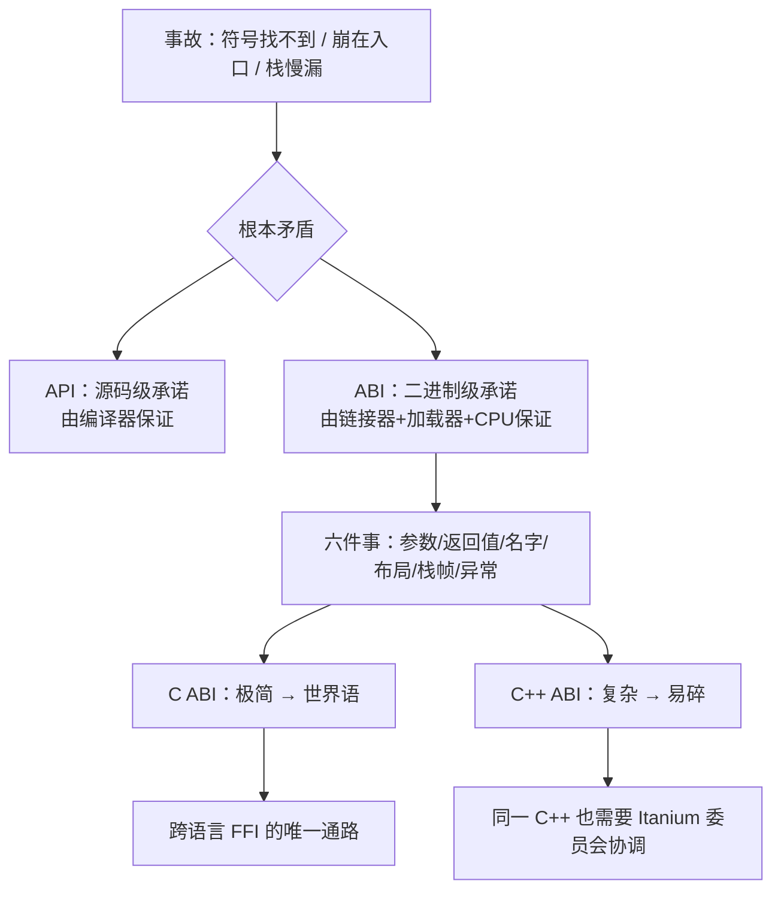
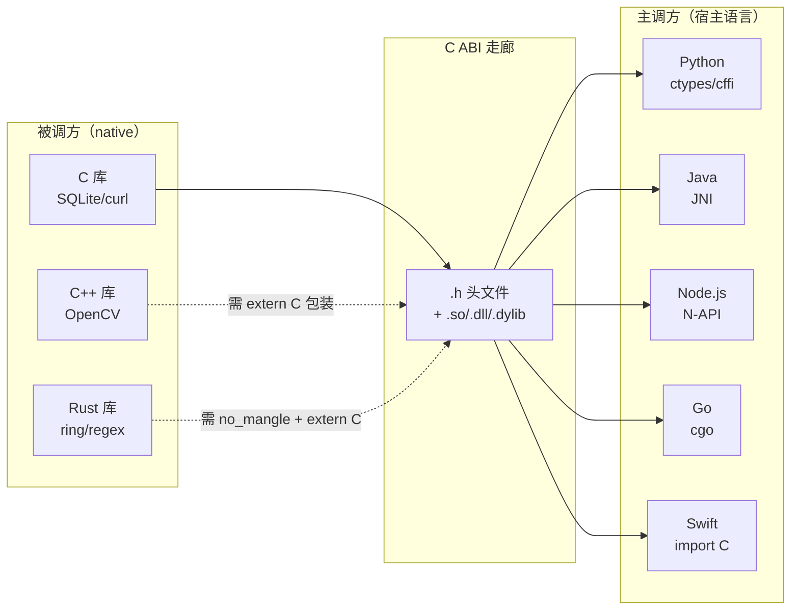
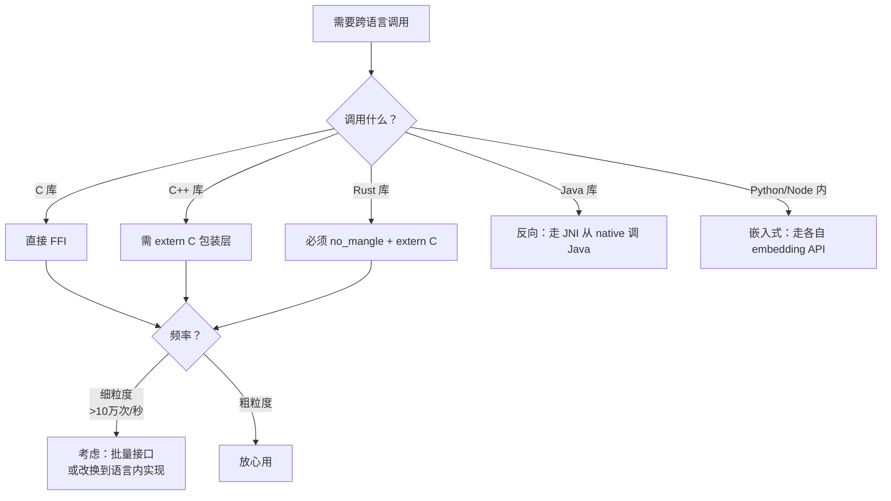
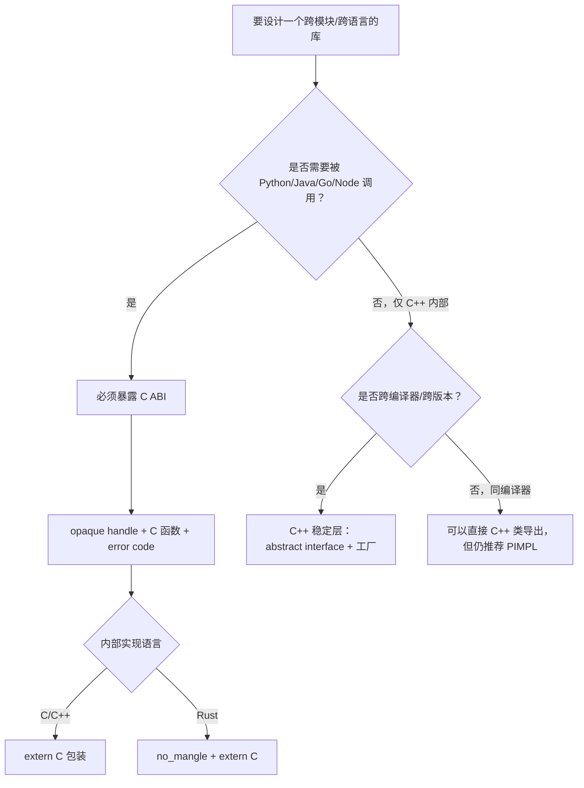

# 4.ABI 与调用约定

> 📍 **本篇位置**：第 7 卷 · 编译与链接之道 · 第 4 篇
> 🎯 **核心矛盾**：**一段 C 的 `.so` 能被 Python / Java / Rust / Go / Node.js 全都调，但一段 C++ 的 `.so` 换个编译器就"链接不上"——同样是二进制，凭什么"契约"差这么大？**
> 🧭 **设计灵魂**：ABI = **"两段陌生代码之间的二进制契约"**——它固定了参数传哪里、返回值放哪里、谁清栈、名字怎么拼、struct 怎么排布。契约越少 → 越灵活但越易碎；契约越多 → 越稳定但演进越难。**C 之所以成"事实通用语言"，正是因为它主动选择了"契约极少"的路。**
> 🌐 **跨平台覆盖**：System V AMD64 (Linux/macOS x86_64) · Windows x64 · ARM64 AAPCS · C++ Itanium/MSVC · Rust extern"C" · JNI · Kotlin C interop · Go cgo
> 🔗 **延伸阅读**：← [7.3 静态链接 vs 动态链接](./03.静态链接与动态链接.md) · → [7.5 语言到机器的三种路线](./05.语言到机器的路线.md) · [2.4 调用栈与栈帧设计](https://yccoding.com/pages/dc94ae/)
> 💡 **一句话**：**API 是"源码级承诺"，ABI 是"二进制级承诺"——前者由编译器保证，后者由链接器 + 加载器 + CPU 一起保证，任何一环变了，链接不上、跑不起来、跑起来乱码。**

---

## 目录介绍

- [00.真实事故引入：三次因 ABI 崩塌的现场](#00真实事故引入三次因-abi-崩塌的现场)
- [01.根本矛盾：一份契约的两难](#01根本矛盾一份契约的两难)
- [02.调用约定：参数与返回值走哪条路](#02调用约定参数与返回值走哪条路)
- [03.名字修饰：符号命名的契约](#03名字修饰符号命名的契约)
- [04.数据布局：struct 的二进制契约](#04数据布局struct-的二进制契约)
- [05.C++ ABI：为什么"总在炸"](#05c-abi为什么总在炸)
- [06.C ABI 为什么成了"世界语"](#06c-abi-为什么成了世界语)
- [07.跨语言 FFI 全景：谁在跟谁说话](#07跨语言-ffi-全景谁在跟谁说话)
- [08.经典陷阱与反模式](#08经典陷阱与反模式)
- [09.经典案例串讲](#09经典案例串讲)
- [10.一句话总结](#10一句话总结)

---

## 00.真实事故引入：三次因 ABI 崩塌的现场

> 🔍 **探索起点**：ABI 不是"理论"——它是**每次跨模块、跨编译器、跨语言调用时都必然存在的暗契约**。契约破了，事故往往披着最诡异的外壳。

### 事故 1：一次"升 GCC 5"引发的全公司崩盘（真实历史）

**背景（2015）**：某大型 C++ 服务栈，长期用 GCC 4.8，全公司几百个动态库互相依赖。

**动作**：CI 团队把编译器升到 GCC 5，重编几个新组件，其它库沿用旧的 `.so`。

**现场**：

```txt
undefined symbol: _ZNSt7__cxx1112basic_stringIcSt11char_traitsIcESaIcEEC1EPKcRKS3_
```

按符号表看，新库要一个 `std::__cxx11::basic_string`，旧库只导出 `std::basic_string`。**名字都不一样**——链接器当然找不到。

**根因**：GCC 5 把 `std::string` 换成了新的 SSO（Small String Optimization）实现，为了避免"新旧混用导致内存布局错乱"，Itanium C++ ABI 委员会规定用一个 **inline namespace `__cxx11`** 隔离——**同一个 `std::string`，符号名不同，是不同的类型**。

**教训**：C++ 的"类型 = 名字 = 二进制布局"，任何一环偷偷改了，即使源码不动，也会全链路崩塌。这就是所谓的 **"C++ ABI 断代"**。

### 事故 2：Rust 静态库链进 Kotlin，Android 上崩在函数入口

**背景**：某音视频 SDK 用 Rust 写核心解码，Kotlin 侧通过 JNI 调。

**Rust 侧**：

```rust
pub fn decode(buf: &[u8]) -> Vec<u8> { /* ... */ }
```

**Kotlin 侧**（先在 emulator 上测通）：

```kotlin
external fun decode(buf: ByteArray): ByteArray
```

**现场**：真机 arm64 直接 SIGSEGV，pc 停在 `decode` 函数第一条指令。

**根因链**：

1. `pub fn` 而非 `pub extern "C" fn` → Rust 用**自己的不稳定 ABI**（参数传法、name mangling、切片胖指针布局都可能变）。
2. Kotlin JNI 期望的是 **C ABI**：一个函数名 `Java_com_xxx_decode`、`JNIEnv*` + `jobject` + `jbyteArray` 参数。
3. 双方对"参数在哪个寄存器"、"栈帧怎么建"、"符号叫啥"**三个都不一样**——JNI 拿到函数指针一 call，就是花式崩溃。

**修复**：

```rust
#[no_mangle]
pub extern "C" fn Java_com_xxx_decode(
    env: *mut JNIEnv, _class: jclass, buf: jbyteArray,
) -> jbyteArray { /* ... */ }
```

- `#[no_mangle]` → 关掉 Rust 的哈希 mangling，符号名精确匹配 JNI 规约。
- `extern "C"` → 切换到 C ABI，参数传递按 AAPCS64 规矩来。

**教训**：**跨语言只能靠"最小公约数"C ABI**。Rust ABI 官方声明"不稳定"，任何 `pub fn` 都不能跨模块信任。

### 事故 3：Windows 上 stdcall vs cdecl，栈越写越深

**背景**：某老式 Win32 客户端，用第三方 `.dll` 做加密。

**头文件写的**：

```c
int __stdcall Encrypt(const char* in, char* out);
```

**调用方按 `cdecl` 声明**（漏了 `__stdcall`）：

```c
int Encrypt(const char* in, char* out);   // ← 默认 cdecl
```

**现场**：单次调用没事，循环调 1000 次程序自己崩了，崩点在完全不相关的位置。

**根因**：

- `stdcall` 是**被调方清栈**——被叫的函数返回前把参数从栈上弹掉。
- `cdecl` 是**主调方清栈**——调用者压栈、调用者弹栈。
- 两边都以为"是对方在清"，结果**没人清**：每次调用栈都往下漏 8 字节，1000 次后栈指针跑到未映射页 → 崩。

**教训**：**"谁清栈"看似不起眼，但它是调用约定的六件事之一，双方必须约定得一模一样**——错一个字节就是慢性中毒。

### 三次事故的共同拷问

| 事故 | 表象                            | 真正的失败点             |
| ---- | ------------------------------- | ------------------------ |
| 1    | `undefined symbol: __cxx11::…` | **name mangling 契约**变了 |
| 2    | SIGSEGV 在函数入口             | **调用约定 + 名字**都错  |
| 3    | 栈慢慢漏，随机崩点             | **谁清栈**双方不一致     |

**共性 = 三个"不知道"**：

1. **不知道**参数在寄存器还是栈上、按什么顺序、多大对齐；
2. **不知道**符号名到底叫什么、C++/Rust 编译器怎么 mangle 的；
3. **不知道**返回后谁负责收拾栈、谁负责恢复寄存器。

### 灵魂三问

- **API 和 ABI 到底差在哪？**——同一个 `std::string` 源码不动，为什么升个编译器就断了？
- **为什么 C 能被"所有语言"调用，而 C++ 换个编译器就不行？**——是历史偶然还是设计选择？
- **跨语言调用的"最小公约数"到底是什么？**——为什么大家都必须回落到 C ABI？

### 五个层层递进的追问

1. **Q1**：ABI 到底包含哪几件事？（→ §01 展开：8 大子契约）
2. **Q2**：参数在寄存器还是栈？谁清栈？（→ §02 调用约定）
3. **Q3**：`std::vector<int>::push_back` 编译后叫什么名字？（→ §03 name mangling）
4. **Q4**：`struct { char a; int b; }` 在两个编译器里布局一样吗？（→ §04 数据布局）
5. **Q5**：为什么 SQLite/curl/OpenSSL 是"永恒 C 接口"？为什么 Boost 不是？（→ §05-§06 C++ vs C ABI 对比）

### 探索路径



---

## 01.根本矛盾：一份契约的两难

> 🔍 **探索起点**：先厘清一对最容易混的概念——**API vs ABI**，它是理解整篇的钥匙。

### 1.1 API vs ABI：一张对照表看透

| 维度         | API（Application Programming Interface） | ABI（Application Binary Interface）                          |
| ------------ | ---------------------------------------- | ------------------------------------------------------------ |
| **层级**     | 源码级                                   | 二进制级                                                     |
| **形式**     | 头文件、函数签名、类型声明               | 机器码、寄存器分配、内存布局、符号名                          |
| **谁保证**   | 编译器（编译时报错）                     | 链接器 + 加载器 + CPU（运行时才炸）                          |
| **变更代价** | 改代码、重编译                           | **重编译所有依赖它的库**——影响面呈树状爆炸                  |
| **稳定性**   | 语言标准 + 库版本                        | 平台 + 编译器 + 编译选项的组合                               |
| **一句话**   | "函数长什么样"                           | "函数在内存里怎么被叫、寄存器怎么摆、名字叫啥"                |

**类比**：API 像"合同的中文文本"，ABI 像"合同的签字盖章 + 邮寄流程"——文本一样但签字盖章方式不一样，法律上就是两份合同。

### 1.2 ABI 包含的 8 大子契约

ABI 不是"一件事"，是**至少八件事的组合**：

| #    | 子契约         | 决定的东西                                     | 变了会怎样            |
| ---- | -------------- | ---------------------------------------------- | ---------------------- |
| 1    | **调用约定**   | 参数走寄存器还是栈、返回值在哪、谁清栈         | 崩在函数入口/出口     |
| 2    | **name mangling** | 源码名 → 符号名的编码规则                       | `undefined symbol`    |
| 3    | **数据布局**   | struct 字段偏移、padding、endianness           | 读到错误的字段        |
| 4    | **栈帧结构**   | rbp/rsp 用途、红区、栈对齐要求                 | 栈溢出、调试信息乱     |
| 5    | **异常机制**   | 展开表（unwind table）、`__cxa_throw` 约定       | 跨库抛异常直接崩溃    |
| 6    | **RTTI 布局**  | `type_info` 结构、比较方式                      | `dynamic_cast` 失败    |
| 7    | **虚表 vtable** | vtable 布局、多重继承下的 thunk                | 虚调用跳到错地址       |
| 8    | **thread-local** | TLS 段结构、`__tls_get_addr` 约定             | 线程本地变量读错       |

**观察**：**C 只用到 1-3**，C++ 全都用；这是为什么 C ABI 稳定、C++ ABI 脆弱的**结构性原因**。

### 1.3 稳定难度分级

```txt
稳定性从高到低：

┌─────────────────────────────────────────┐
│ Level 5 · Linux syscall ABI              │ ← 几十年不改
│  (int 0x80/syscall, rax=编号)             │
├─────────────────────────────────────────┤
│ Level 4 · C ABI on POSIX (SysV AMD64)    │ ← 二十年稳定
│  (参数走 rdi rsi rdx rcx r8 r9)           │
├─────────────────────────────────────────┤
│ Level 3 · Itanium C++ ABI                │ ← 主版本级稳定
│  (GCC/Clang 遵守，MSVC 不遵守)             │
├─────────────────────────────────────────┤
│ Level 2 · MSVC C++ ABI                   │ ← 大版本可能断
│  (VS2015 是分水岭)                        │
├─────────────────────────────────────────┤
│ Level 1 · Rust ABI                       │ ← 官方声明"不稳定"
│  (每次编译都可能变)                       │
├─────────────────────────────────────────┤
│ Level 0 · 语言内 ABI (JVM/CLR)            │ ← VM 自己管
└─────────────────────────────────────────┘
```

### 1.4 稳定演进的两难

**两难**：

- **约束越多**（ABI 覆盖面越广）→ 越稳定，但**演进越难**（想加新特性就要动老约定）。
- **约束越少** → 越灵活，但**跨模块越危险**（每次都要重编）。

**极端对比**：

- **Linux syscall**：只约定 rax=编号 + 6 个寄存器传参 → 稳定到"1998 年的二进制现在还能跑"。
- **C++ ABI**：约定了 vtable、异常、mangling……—— GCC 5 的 `std::string` SSO 让全世界重编了一遍。

**中间道路**：

- **C ABI**：只约束"参数传递 + struct 布局 + 符号名"三件事 → 稳定且够用。
- **JNI**：JVM 在自己域内定义一套"C 风格 ABI"→ 跨 JVM 实现依然稳定。
- **N-API**：Node.js 把不稳定的 V8 API 包一层稳定 C 接口 → 让 Node 版本跳跃时原生模块不用重编。

### 1.5 一句话本质

> **API 是"约定长什么样"，ABI 是"约定摆在哪里、叫什么名字"——前者写在头文件里，后者写在寄存器和内存里；只有当**双方对后者达成一模一样的共识**，二进制才能对上话。**

---

## 02.调用约定：参数与返回值走哪条路

> 🔍 **探索起点**：**调用约定 = 一次函数调用中，主/被调方对六件事的白纸黑字**。

### 2.1 调用约定要约定的六件事

| #    | 事项                | 常见选项                                              |
| ---- | ------------------- | ----------------------------------------------------- |
| 1    | 参数**顺序**        | 从左到右 / 从右到左                                   |
| 2    | 参数**传递方式**    | 全走寄存器 / 全走栈 / 前几个寄存器后面走栈             |
| 3    | 返回值**位置**      | rax / xmm0 / 隐藏指针参数（大结构体）                  |
| 4    | 谁**清栈**          | 主调方 (cdecl) / 被调方 (stdcall)                     |
| 5    | 哪些寄存器**要保护** | caller-saved（易失） / callee-saved（保留）           |
| 6    | 栈**对齐要求**      | 16-byte / 8-byte                                      |

### 2.2 三大主流调用约定对照

| 项目                 | System V AMD64<br/>(Linux/macOS x86_64) | Microsoft x64<br/>(Windows x86_64) | AAPCS64<br/>(ARM64 Linux/macOS/iOS) |
| -------------------- | --------------------------------------- | ---------------------------------- | ----------------------------------- |
| **整型参数寄存器**   | rdi, rsi, rdx, rcx, r8, r9              | rcx, rdx, r8, r9                   | x0-x7                               |
| **浮点参数寄存器**   | xmm0-xmm7                               | xmm0-xmm3                          | v0-v7                               |
| **超出走栈**         | 是                                      | 是                                 | 是                                  |
| **返回值（整型）**   | rax                                     | rax                                | x0                                  |
| **返回值（浮点）**   | xmm0                                    | xmm0                               | v0                                  |
| **大结构体返回**     | 隐藏指针参数（放 rdi）                  | 隐藏指针参数（放 rcx）             | 隐藏指针参数（放 x8）               |
| **谁清栈**           | 主调方（cdecl 风格）                   | 主调方                             | 主调方                              |
| **栈对齐**           | 16 字节                                 | 16 字节                            | 16 字节                             |
| **callee-saved**     | rbx, rbp, r12-r15                       | rbx, rbp, rdi, rsi, r12-r15, xmm6-15 | x19-x28, d8-d15                     |
| **shadow space**     | 无                                      | **主调方必须留 32 字节**           | 无                                  |
| **红区（red zone）** | rsp 下 128 字节可用                     | 无                                 | 无                                  |

**两个关键差异**：

- **参数寄存器不一样**：SysV 用 rdi 传第一个参数，Win64 用 rcx——**同一段 C 代码在两个平台的汇编完全不同**。
- **shadow space**：Win64 要求主调方在栈上**预留 32 字节**（4 个寄存器参数的"影子位"），让被调方可以把寄存器 spill 回栈——**这是 Win64 独有**，Linux 上没有。

### 2.3 亲手在 godbolt 观察差异

**C 源码**：

```c
long add(long a, long b, long c) {
    return a + b + c;
}
```

**SysV AMD64（Linux/macOS x86_64）**：

```asm
add:
    lea     rax, [rdi + rsi]    ; rdi = a, rsi = b
    add     rax, rdx            ; rdx = c
    ret
```

**Win64**：

```asm
add:
    lea     rax, [rcx + rdx]    ; rcx = a, rdx = b
    add     rax, r8             ; r8  = c
    ret
```

**AAPCS64**：

```asm
add:
    add     x0, x0, x1          ; x0 = a + b
    add     x0, x0, x2          ; x0 += c
    ret
```

**同一段 C**，三个平台的汇编都不一样——**这就是"调用约定不同"的直观体现**。任何一段跨平台的手写汇编或 inline asm，都必须知道自己在哪个约定下。

### 2.4 SysV 结构体分类：一个精巧的算法

`struct Point { double x, y; }` 是走**两个 xmm** 还是**内存**？SysV ABI 给了一个"字段递归分类"算法：

**核心规则**：

1. 结构体切成若干 8 字节的"eightbyte"。
2. 每个 eightbyte 递归看内部字段，标为 `INTEGER` / `SSE` / `MEMORY` 三类之一。
3. 若**总大小 > 16 字节 或 出现 MEMORY 分类** → **整个通过栈传递**。
4. 否则按分类走对应寄存器组（INTEGER→rdi/rsi/…，SSE→xmm0/xmm1/…）。

**例子**：

| 结构体                                     | 大小 | 分类                        | 传递方式             |
| ------------------------------------------ | ---- | --------------------------- | -------------------- |
| `struct { int a; int b; }`                | 8    | INTEGER                     | 一个 rdi             |
| `struct { double x; double y; }`          | 16   | SSE, SSE                    | xmm0 + xmm1          |
| `struct { double x; int y; }`             | 16   | SSE, INTEGER                | xmm0 + rdi           |
| `struct { double x; double y; double z; }` | 24   | > 16B → MEMORY               | 全走栈               |

**教训**：**C++ 里"返回 std::pair<double,int>" 竟然可以完全走寄存器**——这不是编译器魔法，是 ABI 的算法。而"返回 struct { double x,y,z; }"就要压栈——性能天差地别。

### 2.5 caller-saved vs callee-saved：一个易忽略的细节

**caller-saved（易失寄存器）**：函数调用会**破坏**其中的值——主调方如果关心这些值，必须自己保存到栈。

- SysV：rax, rcx, rdx, rsi, rdi, r8-r11, xmm0-xmm15
- 用途：传参、临时计算

**callee-saved（保留寄存器）**：被调方**必须保证**返回后这些值不变——被调方要用就得先 push 再 pop。

- SysV：rbx, rbp, r12-r15
- 用途：跨调用需要保持的长寿命变量

**为什么区分**：
- 全 caller-saved：每次调用都要保存一堆 → 慢。
- 全 callee-saved：每个函数入口都要 push 一堆 → 慢。
- **一半一半** = 编译器分配寄存器时的双池：短命变量用 caller-saved（反正也会挂），长命变量用 callee-saved（一次 push 保多次）。

**setjmp/longjmp 的坑**：`longjmp` 跳回去时**只恢复 callee-saved**——如果你用 `setjmp` 保存的变量存在 caller-saved 寄存器里，跳回去就没了。这个坑在网络库、协程库里经常踩。

---

## 03.名字修饰：符号命名的契约

> 🔍 **探索起点**：**符号在链接器眼里是字符串。字符串怎么拼，就是 name mangling。**

### 3.1 C：一份干净的世界

C 没有重载、没有命名空间、没有模板 → **函数名就是符号名**（个别平台前面加 `_`）：

```c
int add(int, int);          // → 符号：add （Linux）或 _add（macOS/老 Windows）
```

**这就是 C 能成为"世界语"的一个技术前提**——符号名可以直接猜、直接手写、直接跨语言引用。

### 3.2 C++：为了支持"名字复用"必须 mangling

C++ 允许函数重载、namespace、模板 → 一个源码名 `add` 可能对应多个符号：

```cpp
namespace math {
    int add(int, int);
    double add(double, double);
    template<typename T> T add(T, T);
}
```

编译后符号名（Itanium ABI，GCC/Clang）：

| 源码                              | Mangled 符号               |
| --------------------------------- | -------------------------- |
| `math::add(int, int)`             | `_ZN4math3addEii`         |
| `math::add(double, double)`       | `_ZN4math3addEdd`         |
| `math::add<float>(float, float)`  | `_ZN4math3addIfEET_S1_S1_` |

**解码规则**（Itanium）：

- `_Z` = C++ mangled 名字的开始标记。
- `N…E` = 嵌套名（namespace/class）。
- `4math` = 长度前缀 + 名字：4 个字符的 `math`。
- `ii` / `dd` = 参数类型：i=int, d=double, f=float。

**手工反解**：`c++filt` 或 `llvm-cxxfilt`：

```bash
$ echo "_ZN4math3addEii" | c++filt
math::add(int, int)
```

### 3.3 Itanium vs MSVC：C++ ABI 分成两大阵营

| 项目                     | Itanium C++ ABI                 | MSVC C++ ABI                    |
| ------------------------ | ------------------------------- | ------------------------------- |
| **谁用**                 | GCC / Clang / Linux/macOS 全家 | Microsoft VC++（Windows）      |
| **`math::add(int,int)`** | `_ZN4math3addEii`              | `?add@math@@YAHHH@Z`           |
| **文档公开**             | 是（gcc.gnu.org）              | 部分公开（有官方 demangler）    |
| **异常展开**             | DWARF-based unwind              | SEH（Structured Exception Handling） |
| **虚表布局**             | 多继承下用 thunk               | 使用多个 vtable                 |

**结论**：**"C++ 的 `.dll` 不能被另一家编译器直接链"**——因为 Windows 上 GCC 用 Itanium mangling、MSVC 用自己那套，两边名字都对不上。

### 3.4 Rust：故意"哈希 mangling"

Rust 的 `pub fn` 编译出来的符号大致是：

```txt
_ZN9my_crate3fooE7hf83a2b4c9d1e5f6E
```

- `my_crate::foo` 作为路径。
- 加一段**基于类型 + 泛型 + crate 版本 + 编译器版本的哈希**。

**目的**：让**同一函数在不同 crate/版本下**符号名不同，避免 monomorphization 冲突。

**代价**：**没法被外部按名字调用**——所以 Rust 官方声明："Rust ABI 不稳定，如需 FFI 请用 `extern "C" + #[no_mangle]`。"

```rust
#[no_mangle]
pub extern "C" fn my_add(a: i32, b: i32) -> i32 { a + b }
// 符号名精确为 my_add，且按 C ABI 传参 → Python/Go/Node 都能调
```

### 3.5 Swift / Objective-C / Go：各家不一样

| 语言       | mangling 举例                              | 说明                                       |
| ---------- | ------------------------------------------ | ------------------------------------------ |
| **Swift**  | `$s4main3addyS2i_SitF`                    | Swift 自己一套（`_$s` 前缀）              |
| **Obj-C**  | `-[Foo bar:]` → `_objc_msgSend`           | 方法调用通过 objc runtime 派发，无静态符号 |
| **Go**     | `main.add` / `runtime.mallocgc`           | 简单点分隔，无 mangling                    |
| **Kotlin/JVM** | `Lcom/example/Foo;add(II)I`             | JVM 内部符号，与 native 无关               |

**观察**：**每种语言都有自己的 name mangling 规则，但只有 C 的是"没规则"——这正是它成为跨语言接口的原因**。

### 3.6 一条准则：跨模块符号只用 `extern "C"`

```cpp
// C++ 侧：明确用 C ABI 导出
extern "C" {
    int my_lib_init(const char* config);
    void my_lib_shutdown(void);
}
```

**效果**：

- 关掉 C++ mangling → 符号名精确为 `my_lib_init`。
- 用 C 调用约定（虽然 C 和 C++ 在大多数平台调用约定相同，但显式声明避免歧义）。
- **任何语言都能通过这个符号调用**。

---

## 04.数据布局：struct 的二进制契约

> 🔍 **探索起点**：**函数能对上，但传的 struct 摆放不一样，一样是灾难。**

### 4.1 struct 布局的三条规则

**规则 1：字段按声明顺序放**

```c
struct S { char a; int b; short c; };
```

字段 `a` 在偏移 0，`b` 不能立刻放在 1（int 要 4 字节对齐）→ 编译器在 1-3 位置**填 3 字节 padding**。

**规则 2：每个字段按"自然对齐"对齐**

- `char` = 1 字节对齐 → 任何偏移都行。
- `int` = 4 字节对齐 → 偏移必须是 4 的倍数。
- `double` / 指针（64 位）= 8 字节对齐。

**规则 3：整个 struct 按其**最宽字段**对齐，末尾也可能有 padding**

上面那个 S 的完整布局：

```txt
偏移: 0    1     2     3     4    5    6    7     8   9    10   11
字段: [a]  [pad] [pad] [pad] [b]  [b]  [b]  [b]   [c] [c]  [pad][pad]
      1B   3B                  4B                 2B    2B tail padding

sizeof(S) = 12（对齐到 4 的倍数）
```

### 4.2 一条演进铁律

**"一旦公开 struct 的字段顺序 / 名字 / 类型，就等于承诺了它的二进制布局——任何修改都会让所有依赖它的模块重编。"**

**血泪案例**：
- Linux kernel `struct task_struct` 长年不能 ABI 兼容改动。
- glibc `struct passwd` 加个字段就要 `symbol versioning`。
- Windows `WNDCLASSEX` 硬是靠"末尾加字段 + 保留字段"演进了几十年。

### 4.3 四大差异来源

**差异 1：编译器 padding 规则**

绝大多数编译器一致（都按"自然对齐"），但 **`#pragma pack`** 一改就崩：

```c
#pragma pack(1)
struct Packed { char a; int b; };   // b 从偏移 1 开始，无 padding
#pragma pack()
```

**踩坑典型**：网络协议头声明加了 `#pragma pack(1)`，业务代码把它 memcpy 到普通 struct → 布局对不上，字段全错位。

**差异 2：位域（bit-field）实现依赖**

```c
struct { unsigned int a : 3; unsigned int b : 5; };
```

- 位从**低位起还是高位起**：C 标准没规定。
- 跨编译器可能相反 → 网络协议里用位域是**灾难源**。

**差异 3：endianness（字节序）**

- Intel x86/x64、ARM64：默认小端（低位在低地址）。
- 老 PowerPC、网络字节序：大端。
- **跨机器传 struct** 必须显式转（`htonl` / `htons`）。

**差异 4：指针大小**

- 32 位平台：指针 4 字节，struct 布局跟 64 位不同。
- **同一份头文件**在 32/64 位下 `sizeof(struct)` 不同。

### 4.4 亲手观察：pahole 看布局

```bash
$ cat > s.c <<EOF
struct S { char a; int b; short c; double d; };
struct S s;
EOF
$ gcc -g -c s.c
$ pahole -C S s.o
struct S {
    char                       a;                    /*     0     1 */
    /* XXX 3 bytes hole, try to pack */
    int                        b;                    /*     4     4 */
    short                      c;                    /*     8     2 */
    /* XXX 6 bytes hole, try to pack */
    double                     d;                    /*    16     8 */
    /* size: 24, cachelines: 1, members: 4 */
    /* sum members: 15, holes: 2, sum holes: 9 */
};
```

**观察点**：
- 4 个字段 = 15 字节，加上 padding 变 24 字节——**接近 40% 的空间被 padding 浪费**。
- 换个顺序（大字段在前）能省掉一半。

### 4.5 稳定 struct 的三种手法

**手法 1：opaque handle（不透明句柄）**

```c
// 公共头文件 —— 只声明，不定义
typedef struct MyLib MyLib;
MyLib* mylib_create(void);
int    mylib_do(MyLib*);
void   mylib_free(MyLib*);
```

**外部代码只知道有个指针，不知道字段**——内部随便加字段、随便重排。**SQLite、libcurl、OpenSSL 全部这么做。**

**手法 2：版本化的 struct**

```c
struct MyOpts_v1 { int size; int a; };
struct MyOpts_v2 { int size; int a; int b; };  // 加 b，把 size 当自描述字段
```

调用方填 `size = sizeof(...)`，被调方按 size 决定读几个字段——**Windows 系统 API 大量用这招**。

**手法 3：PIMPL（C++）**

```cpp
// 头文件
class Widget {
public:
    Widget();
    ~Widget();
    void do_stuff();
private:
    class Impl;
    std::unique_ptr<Impl> impl_;  // ← 只暴露指针大小
};

// cpp 文件
class Widget::Impl { /* 任意字段，怎么改都不破坏 ABI */ };
```

**跨版本布局稳定**——外部看到的 Widget 永远是"一个指针大小"。

---

## 05.C++ ABI：为什么"总在炸"

> 🔍 **探索起点**：**C++ 强大在于抽象机制丰富，脆弱也在这里——每一种抽象都要落成二进制契约。**

### 5.1 vtable：虚函数的二进制布局

```cpp
class Animal {
public:
    virtual void speak();
    virtual ~Animal();
};
class Dog : public Animal {
public:
    void speak() override;
};
```

**Itanium ABI 下的布局**：

```txt
Dog 对象内存 (Dog obj)：
+----------+
| vptr     |  ← 一个隐藏指针，指向 Dog 的 vtable
+----------+
| (fields) |
+----------+

Dog vtable：
+----------------+
| offset-to-top  |  0
| RTTI ptr       |  → type_info of Dog
| Dog::speak     |
| Dog::~Dog      |
| Dog::~Dog (D2) |
+----------------+
```

**关键点**：
- 每个多态对象**头部**藏一个 `vptr`。
- vtable 里**函数顺序 = 类声明顺序**——**改声明顺序 = ABI 断代**。
- 虚析构在 Itanium 里占**两个 slot**（D1 = 完整对象析构，D2 = 子对象析构）。
- **多重继承**下 vtable 结构复杂得多，需要 thunk 调整 `this` 指针。

### 5.2 vtable ABI 的脆弱性

在头文件里"加一个 virtual 函数"看似小改动，实际上：

```cpp
// 版本 1
class Widget { public: virtual void draw(); };

// 版本 2 —— 加一个 virtual
class Widget { public: virtual void resize(); virtual void draw(); };
//                                 ^^^^^^^^^^^ 塞在前面
```

**结果**：老代码 vtable[0] 里存的是"draw"，重编后 vtable[0] 变成了"resize"——**所有老代码调 draw 会跳到 resize**，静默错误！

**规避**：**"virtual 函数只能追加到末尾，永不删除、永不插入、永不改签名"**——这是所有稳定 C++ 库的铁律。

### 5.3 异常机制：Itanium EH vs SEH

**Itanium（GCC/Clang，Linux/macOS）**：

- 用 **DWARF unwind info**（`.eh_frame` 段）。
- `throw` 时调用 `__cxa_throw` → 沿栈往上 unwind → 在每帧查表决定是否 catch。
- **零成本**：不抛异常时**运行时零开销**（只有额外的表数据）。

**SEH（Structured Exception Handling，Windows）**：

- 每个函数入口维护一个"handler chain"。
- 抛异常时沿链搜。
- **有运行时开销**（哪怕不抛）。

**跨库抛异常的坑**：**只有双方用同一套 EH ABI 才能安全跨库抛**。混用 GCC-compiled 库和 MSVC-compiled 库：**抛异常必崩**。

**规避手法**：跨 ABI 边界**永远用 error code，不抛异常**——SQLite/curl 全部返回 `int` 错误码，从不抛 C++ 异常。

### 5.4 RTTI 与 dynamic_cast

`typeid(x) == typeid(y)` 和 `dynamic_cast<Base*>(p)` 需要 RTTI 信息。

**Itanium ABI**：每个多态类型有一个全局的 `type_info` 对象，`typeid` 比较**指针相等**。

**跨 `.so` 的坑**：如果同一个类在两个 `.so` 里都编译了 → 生成**两份 type_info** → **`dynamic_cast` 或 `typeid` 失败**。

**修复**：在共享库导出该类型时，让 type_info 只在**一个 `.so` 里定义**，其他 `.so` 弱引用它（`-fvisibility=default` + Vague Linkage 规则）。

### 5.5 让 C++ ABI "总在炸"的六项原罪

| #    | 原罪                       | 后果                                     |
| ---- | -------------------------- | ---------------------------------------- |
| 1    | 函数重载 + 模板 → mangling | 编译器每次改都可能变符号名                |
| 2    | vtable 布局暴露            | 加/删/移 virtual 都断 ABI                |
| 3    | 异常机制复杂               | 跨编译器/跨库抛异常 = 崩                 |
| 4    | 内联函数 + 模板            | inline 定义暴露在头文件 → 头文件即 ABI    |
| 5    | 标准库实现细节             | GCC 5 换 SSO → std::string 断裂           |
| 6    | RTTI + 单例语义            | 同一类跨库定义两份 → dynamic_cast 失败    |

### 5.6 C++ 的自救三招

1. **PIMPL** → 隔离字段布局。
2. **只用 abstract interface + 工厂函数** → 消除 vtable 版本问题（接口 vtable 永远不变，实现类可自由变）。
3. **`extern "C"` 边界** → 库对外只暴露 C ABI，C++ 只用于内部。

**"COM 模型"就是把这三招做到极致的产物**——它主导了 Windows 几十年的组件化。

---

## 06.C ABI 为什么成了"世界语"

> 🔍 **探索起点**：**C ABI 不是"最好的"，而是"最少的"——正是"少"让它成了通用契约。**

### 6.1 C ABI 的极简性：五个特征

| 特征              | C 的选择                             | 为什么"少"就好                            |
| ----------------- | ------------------------------------ | ---------------------------------------- |
| **无重载**        | 一个名字对应一个函数                 | 不需要 mangling → 符号名直接可读         |
| **无 namespace**  | 全局符号扁平                         | 不需要嵌套编码                           |
| **无模板/泛型**   | 函数就是函数                         | 不需要按参数类型 mangling                |
| **无异常**        | 靠返回值传错误                       | 不需要 unwind table + `__cxa_throw`      |
| **无 vtable**     | 手写函数指针                         | 结构布局完全可控                         |

**结果**：**符号名 = 源码名 + 平台约定的前缀（如 `_`）**，参数传递按简单规则走寄存器/栈，struct 按自然对齐。

**任何语言只要能生成"这么简单的调用"，就能跟 C 通信。**

### 6.2 C ABI 是"事实通用语言"的证据

| 场景                     | 靠 C ABI 的证据                                       |
| ------------------------ | ----------------------------------------------------- |
| **Python** `ctypes`      | 直接 `dlopen(*.so)` + 按 C 函数原型调                 |
| **Java** JNI             | `Java_com_xxx_foo(JNIEnv*, jclass, ...)`（纯 C ABI）  |
| **Rust** `extern "C"`    | 明确切换到 C ABI 才能被其他语言调                    |
| **Go** `cgo`             | 只能调 C 函数（C++ 需 wrapper）                       |
| **Node** N-API           | 稳定 C ABI 包裹不稳定 V8 API                          |
| **Swift** interop        | `@_cdecl("name")` 声明为 C ABI 导出                   |
| **Kotlin/Native** cinterop | 只能桥接 C 头文件                                    |
| **Lua** C API            | `lua_pushnumber`、`lua_call` 全部 C 函数              |
| **WebAssembly**          | 模块间接口就是 C ABI 风格的函数签名                    |

### 6.3 C ABI 的降级代价表

被"C 化"意味着放弃很多语言特性：

| 语言特性             | 跨 C ABI 时怎么办                        |
| -------------------- | ---------------------------------------- |
| C++ 类               | 拆成"opaque handle + 一堆 C 函数"        |
| C++ 异常             | 换成 int 错误码                          |
| Rust 所有权          | 手动 `Box::into_raw` / `Box::from_raw`   |
| Rust `&str` / 切片   | 拆成 `(*const u8, size_t)`               |
| Go 字符串            | 拆成 `char*` + `int`                     |
| Java String          | JNI `jstring` + `GetStringUTFChars`      |
| 泛型 / 模板          | 展开成具体类型 + 每个类型一份 C 函数      |

**代价**：**丢掉了 RAII / 所有权 / 泛型**，回到 C 的手动内存管理。

**但——这份代价换来的是"任何语言都能调"，值得。**

### 6.4 Rust 侧的边界示例

```rust
use std::ffi::{CStr, c_char};

pub struct Session { /* 内部字段任意 */ }

#[no_mangle]
pub extern "C" fn session_create() -> *mut Session {
    Box::into_raw(Box::new(Session { /* ... */ }))
}

#[no_mangle]
pub extern "C" fn session_process(s: *mut Session, input: *const c_char) -> i32 {
    if s.is_null() || input.is_null() { return -1; }
    let s = unsafe { &mut *s };
    let input = unsafe { CStr::from_ptr(input) };
    // ... 业务逻辑
    0
}

#[no_mangle]
pub extern "C" fn session_free(s: *mut Session) {
    if !s.is_null() { unsafe { drop(Box::from_raw(s)); } }
}
```

**特征**：
- 全部函数 `#[no_mangle] pub extern "C"`。
- 所有权用**裸指针**跨边界（`Box::into_raw` 转出、`Box::from_raw` 收回）。
- 字符串用 `*const c_char` + `CStr` 手动解码。
- **错误用 i32 返回**（约定 0 = 成功，负数 = 错误）。

**头文件**（`cbindgen` 自动生成 或 手写）：

```c
typedef struct Session Session;
Session* session_create(void);
int      session_process(Session*, const char* input);
void     session_free(Session*);
```

**这份 `.h` 可以被 Python/Go/Node/Java/Swift 全部使用**——这就是 C ABI 的威力。

### 6.5 一句话总结

> **C ABI 不是"最优的"，而是"最少的"——它主动放弃了泛型、重载、异常、RTTI、vtable 稳定性等一切复杂东西，换来"任何语言都可以拼出这套调用"。这份"少"，成就了它的"通用"。**

---

## 07.跨语言 FFI 全景：谁在跟谁说话

> 🔍 **探索起点**：**每一次跨语言调用，都是"两种运行时"通过 C ABI 这条走廊互相握手。**

### 7.1 跨语言调用的"三代价"

不管是 Python 调 C、还是 Java 调 Rust、还是 Go 调 C，跨越语言边界都要付**三种代价**：

| 代价                    | 说明                                     | 典型开销               |
| ----------------------- | ---------------------------------------- | ---------------------- |
| **1. 参数编码**         | 高级类型 → C ABI 类型（字符串、切片、对象） | 每次调用几十~几千 ns  |
| **2. 内存所有权移交**   | 谁分配、谁释放；避免双方都释放/都不释放  | 需要严格约定           |
| **3. 运行时切换**       | GC/协程/异常语义在边界暂停/切换          | ns~us 级                |

**观察**：**跨边界调用永远比语言内调用贵**——所以 FFI 的最佳实践是"粗粒度接口"：一次传一大块数据，而不是频繁小调用。

### 7.2 主流 FFI 地图



### 7.3 Python：动态语言的极简 FFI

**`ctypes`**（内置）：

```python
import ctypes
lib = ctypes.CDLL("./libmy.so")
lib.add.argtypes = [ctypes.c_int, ctypes.c_int]
lib.add.restype  = ctypes.c_int
print(lib.add(1, 2))   # → 3
```

**特征**：
- 完全动态，无需重编 Python。
- 类型信息**运行时才检查**——手写错了直接崩。

**`cffi`** 高阶版：读 `.h` 自动生成类型，性能好一些。

### 7.4 Rust：cbindgen 自动生成 C 头

```toml
# cbindgen.toml
language = "C"
include_guard = "MYLIB_H"
```

```bash
cbindgen --config cbindgen.toml --crate mylib --output mylib.h
```

`cbindgen` 扫描所有 `#[no_mangle] pub extern "C" fn` 并生成对应 C 声明——**保证 `.h` 和 Rust 代码永远同步**。

### 7.5 Go：cgo 的三代价

```go
/*
#include <stdio.h>
int cadd(int a, int b);
*/
import "C"

func Add(a, b int) int {
    return int(C.cadd(C.int(a), C.int(b)))
}
```

**cgo 的三个特殊开销**：

| 代价       | 原因                                            |
| ---------- | ----------------------------------------------- |
| **栈切换** | Go 的 goroutine 用**小栈**，进 C 前要切到"大 OS 栈" |
| **调度屏障** | cgo 调用期间该 P 被占用，可能触发新 M 创建        |
| **GC 障碍** | 传给 C 的 Go 指针要临时"锁住"防 GC 移动           |

**性能数据**：cgo 单次调用大约 **200-300 ns**（相比 Go 内部调用 ~5ns）——**不宜细粒度使用**。

### 7.6 Java：JNI 的双向复杂性

**基础签名规则**：

| Java 类型  | JNI 类型     | 签名字符          |
| ---------- | ------------ | ----------------- |
| `boolean`  | `jboolean`   | `Z`               |
| `byte`     | `jbyte`      | `B`               |
| `int`      | `jint`       | `I`               |
| `long`     | `jlong`      | `J`               |
| `float`    | `jfloat`     | `F`               |
| `double`   | `jdouble`    | `D`               |
| `byte[]`   | `jbyteArray` | `[B`              |
| `String`   | `jstring`    | `Ljava/lang/String;` |
| `void`     | -            | `V`               |

**方法签名例**：`int foo(byte[], byte[])` → `([B[B)I`

**导出符号规则**：Java 侧 `class com.example.Foo` 的 `native int doWork(byte[])` 对应 C 符号：

```c
JNIEXPORT jint JNICALL Java_com_example_Foo_doWork(
    JNIEnv* env, jobject this_, jbyteArray input
);
```

**双向性**：不像 cgo/ctypes 是"单向宿主调 native"，JNI **native 侧可以反过来调 Java**（`env->CallIntMethod(...)`）——但每一次反调都要在 `env` 上查方法 ID + 反射调用，**性能极差**。

**踩坑典型**：**JNI local reference leak**——native 里用 `NewObject` 创建的对象，如果不显式 `DeleteLocalRef`，直到 JNI 返回才回收；某个 native 函数里循环 100 万次 → JVM 内部 local ref 表溢出崩溃。

### 7.7 Node.js：从 nan 到 N-API

**历史演进**：

| 阶段             | 方式                              | 问题                              |
| ---------------- | --------------------------------- | --------------------------------- |
| Node 0.x         | 直接吃 V8 C++ API                 | V8 每版本 API 都变，Node 一升级全崩 |
| Node 4-6         | `nan`（Native Abstractions）       | 用宏包一层，缓解但没根治          |
| Node 8+          | **N-API**（后改名 Node-API）       | **稳定 C ABI**，跨 Node 版本兼容    |

**N-API 关键设计**：
- 全部 API 是 `napi_xxx` C 函数，参数是 opaque handle。
- ABI 稳定 → 一个 `.node` 二进制**跨 Node 版本可复用**（比如给 Node 14 编的，Node 20 也能加载）。

**这就是"用稳定 C ABI 包裹不稳定 C++ API"的经典设计**——和 Objective-C runtime、JNI 是同一思路。

### 7.8 Swift / Kotlin / Objective-C：现代语言的 C 桥梁

**Swift** 直接 `import Darwin` 就能调 C，或用 `@_cdecl("name")` 反向导出为 C：

```swift
@_cdecl("swift_add")
public func swiftAdd(a: Int32, b: Int32) -> Int32 { a + b }
```

**Kotlin/Native** 用 `cinterop` 读 `.h` 生成 Kotlin 绑定；反向导出用 `@CName("name")`。

**Objective-C** 天然与 C 互操作——`.m` 文件里 C 和 Obj-C 混写，全部走 C ABI。

### 7.9 全景决策：跨语言时选哪条路



---

## 08.经典陷阱与反模式

> 🔍 **探索起点**：**十次 ABI 事故里，有九次是踩了下面这些坑之一。**

### 8.1 陷阱 1：C++ 库对外直接暴露 C++ 类型

**反例**：

```cpp
// 头文件（导出给别的模块）
extern "C" std::string get_name();   // ← 灾难
```

- `std::string` 的**布局跨编译器不同**（GCC 5 SSO 断代事件的直接原因）。
- 就算同编译器，`extern "C"` 与 `std::string` 组合本身就是**未定义行为**。

**正确**：

```cpp
extern "C" const char* get_name();   // 返回 C 字符串
extern "C" void free_name(const char*);  // 配套释放函数
```

### 8.2 陷阱 2：跨模块抛 C++ 异常

**反例**：`libA.so` 抛 `std::runtime_error`，`libB.so` catch。

- 两个 `.so` 如果不用同一份 libstdc++，type_info 是两份 → catch 匹配失败。
- 更常见：一个是 GCC 编的、一个是 Clang 编的，**EH ABI 混乱，栈 unwind 崩溃**。

**规避**：跨库边界永远返回 error code。

### 8.3 陷阱 3：memcpy 一个非 POD C++ 对象

**反例**：

```cpp
class Widget { std::string name; };  // 有非平凡构造/析构
Widget a, b;
memcpy(&b, &a, sizeof(a));  // ← 灾难
```

- `std::string` 的 SSO 存了指向自己内部缓冲区的指针。
- memcpy 后 b 和 a 的 string 内部指针都指向 a 的内部 → 析构时**双重 free**。

**规避**：只对 POD（`std::is_trivially_copyable`）memcpy。

### 8.4 陷阱 4：跨 DLL 边界共享 std 容器

**反例**：

```cpp
// libA.dll 导出
__declspec(dllexport) std::vector<int> get_list();
```

Windows 上 Debug/Release 版本的 `std::vector` 内存分配器**不同**——A 用 Debug 分配、B 用 Release 释放 → 崩。

**规避**：跨 DLL 只传 C 类型（int、指针、opaque handle）。

### 8.5 陷阱 5：Rust 中忘写 `#[no_mangle]`

**反例**：

```rust
pub extern "C" fn my_func() {}  // 名字被 Rust 哈希 mangling
```

**后果**：库导出的符号是 `_ZN…my_func…hash…` 而不是 `my_func` → C 侧 dlsym 找不到。

**规避**：**`extern "C"` 和 `#[no_mangle]` 必须成对出现**。cbindgen 生成头文件时会自动 sanity check。

### 8.6 陷阱 6：Windows 上 stdcall/cdecl 混用

**反例**：头文件写 `__stdcall`、调用方声明缺失。

**后果**：栈慢慢漏 → 深度调用后崩溃。

**规避**：Windows 上 32 位代码尤其小心；64 位 Windows 已统一为一种约定（Win64 x64 calling convention），少踩这坑。

### 8.7 陷阱 7：位域跨平台传输

**反例**：网络协议里用 `struct { unsigned int flag : 3; }` 打包传输。

**后果**：**bit 顺序编译器实现相关**——大端/小端机器、GCC/MSVC 可能相反。

**规避**：网络协议用**手动位运算 + fixed-width types**（`uint32_t`），不用 bit-field。

### 8.8 陷阱 8：`sizeof` 假设

**反例**：C 里假设 `sizeof(long) == 8`，跨平台传输。

**真相**：
- Windows 64 位：`long` 是 4 字节（LLP64）。
- Linux/macOS 64 位：`long` 是 8 字节（LP64）。

**规避**：跨平台永远用 `int32_t` / `int64_t` / `size_t`（明确宽度）。

### 8.9 陷阱 9：JNI 忘调 `DeleteLocalRef`

见 §7.6——循环里创建的 local ref 不释放，JNI local ref 表溢出。

### 8.10 反模式总结

| 反模式                       | 现象                       | 修复                          |
| ---------------------------- | -------------------------- | ----------------------------- |
| `extern "C"` 里用 STL        | 编译能过，跨库崩          | 只用 C 类型                   |
| 跨库抛异常                   | 栈 unwind 崩              | 返回 error code               |
| memcpy 非 POD                | 双重 free                  | 用拷贝构造                    |
| 跨 DLL 传 std::vector        | new/delete 分配器不匹配   | opaque handle                 |
| Rust 缺 `#[no_mangle]`       | dlsym 找不到              | 加上                          |
| 用位域跨平台传输             | 位序不一致                 | 手动位运算                    |
| 假设 `sizeof(long)`          | Win 上 4，Linux 上 8       | 用 stdint.h 明确宽度          |
| JNI local ref 泄漏           | JVM 崩                     | 每次 New* 后 DeleteLocalRef   |

---

## 09.经典案例串讲

> 🔍 **探索起点**：**每个案例都是"一份契约在何处、如何被谁固定或打破"的现场剧本。**

### 9.1 案例 A：SQLite 的"30 年 C ABI 不断代"

**事实**：SQLite 从 2000 年至今，公开 API 几乎全兼容——老代码链接新 `.so` 直接跑。

**手法（严格执行）**：

1. **纯 C 接口**：无 C++，无异常，全 opaque handle（`sqlite3*`）。
2. **函数版本化**：需要改行为时新增 `sqlite3_prepare_v2` / `_v3`，从不改老函数。
3. **struct 都 opaque**：外部只能通过 API 函数访问，永不暴露字段。
4. **返回码统一**：`SQLITE_OK / SQLITE_ERROR / …`，从不抛异常。
5. **有 amalgamation 单文件源码**：想静态编也行、想动态链也行。

**结果**：**SQLite 是全球部署最多的软件之一**——飞机、手机、汽车、每一个浏览器都装着它。

**教训**：**"设计 API 时假装它是 ABI"——一开始就把约束拉满，日后不后悔**。

### 9.2 案例 B：V8 → N-API 的"稳定层"演进

**痛点历史**：Node 早期原生模块直接吃 V8 API：

- V8 是 Chrome 引擎的一部分，Chrome 团队按自己的节奏改。
- Node 每次升级 V8，几乎所有 native 模块都得重编。
- 生态陷入"Node 升级 = 大规模 native 模块崩塌"的循环。

**解药**：**N-API**（2017 引入）。

**结构**：

```txt
你的 .node 模块
     ↓（调 napi_xxx）
   Node-API（稳定 C ABI 层）
     ↓（内部映射到当前 V8）
     V8（不断变）
```

**关键设计**：
- Node-API **只承诺 C ABI 稳定**，具体 V8 版本适配由 Node 二进制内部完成。
- 一个 `.node` 二进制**跨 Node 大版本可用**（Node 12/14/16/18/20）。

**教训**：**当底层不稳定时，用一层"稳定 C ABI"把它包起来——底层再怎么变，用户不用重编**。

### 9.3 案例 C：JNI 的双向 ABI 设计

**JNI 的设计精妙点**：

- Java 有自己的 JVM 内部 ABI（bytecode + 常量池 + 类文件格式）。
- 但要跟 native 世界互操作，需要一份**双向的 C ABI**。

**方向 1：Java 调 native**

- native 函数按固定命名规则 `Java_<包>_<类>_<方法>`。
- 参数按签名规则编码。
- JVM 内部维护"方法表 → native 函数指针"的映射。

**方向 2：native 调 Java**

- native 拿到 `JNIEnv*` 后，通过它调 `GetMethodID` / `CallXxxMethod`。
- **`JNIEnv*` 本质是一个"C 函数表"**——JVM 提供一堆函数指针，跨 JVM 实现兼容。

**为什么用 C 函数表而不是直接函数？**

- 让 native 代码**不依赖 JVM 具体实现**——OpenJDK、Zulu、GraalVM 各家 JVM 实现不同，但都提供同一份 `JNIEnv*` 函数表布局。
- 这本身就是一份 ABI 契约。

**教训**：**"函数表 + opaque handle"是构造语言无关 ABI 的标准套路**——COM、N-API、JNIEnv、Vulkan 加载器全用这招。

### 9.4 案例 D：GCC 5 std::string ABI 断代事件时间线

**2014 年**：C++11 标准引入 `std::string` 的新要求（`data()` 必须返回 null-terminated 指针）。

**2015 年 4 月**：GCC 5.1 发布，`std::string` 从 COW（Copy-on-Write）改为 SSO（Small String Optimization）——布局完全变了。

**问题**：全世界的 Linux 发行版有大量老 `.so` 用的是 GCC 4 编译的旧 `std::string`。直接切 GCC 5 → 所有跨库传 string 全崩。

**Itanium ABI 委员会的解**：

引入 **inline namespace `__cxx11`**：

- 旧类型：`std::string`，符号里叫 `std::basic_string<char>`。
- 新类型：`std::__cxx11::string`，符号里叫 `std::__cxx11::basic_string<char>`。

**关键**：**两者是不同的类型、不同的符号名——静默地共存**。

**编译开关**：

```bash
-D_GLIBCXX_USE_CXX11_ABI=1   # 新 ABI（默认）
-D_GLIBCXX_USE_CXX11_ABI=0   # 旧 ABI（兼容老 .so）
```

**发行版策略**：
- Debian/Ubuntu：完全切换到新 ABI，源码级重编。
- RHEL/CentOS：保守——`devtoolset` 里给新 GCC 但**默认还用旧 ABI**（兼容大量商业软件）。

**教训**：**标准库的 ABI 变化会引发全生态重编——因此 C++ 标准委员会现在极度保守，能不改就不改，宁可让 C++20 里的 `std::filesystem` 走曲线**。

### 9.5 案例 E：一次"跨语言性能压测"的 FFI 开销对比

**场景**：把一个简单的 `int add(int, int)` 分别通过不同途径调用 1 亿次，测量总耗时。

| 语言/方式             | 单次开销  | 说明                          |
| --------------------- | -------- | ----------------------------- |
| C 内部直接调          | ~1 ns    | 编译器 inline 到几乎无成本    |
| C++ 虚函数            | ~2-3 ns  | 一次间接跳转                  |
| Java native 内部      | ~2 ns    | JIT inline                    |
| Python `ctypes`       | ~500 ns  | 每次 marshal + Python 解释开销 |
| Java JNI              | ~50 ns   | 参数封送 + JVM 状态切换       |
| Go cgo                | ~200 ns  | 栈切换 + 调度屏障             |
| Node.js N-API         | ~100 ns  | V8 上下文切换                  |

**结论**：
- **跨 C ABI 边界普遍比语言内调用慢 50-500 倍**。
- 高频调用要么**批量化**（一次传 1 万个数据），要么**避免跨边界**。

**教训**：**FFI 的性能瓶颈不是"C 函数慢"，而是"每次跨边界的固定开销"**——设计 FFI 接口时永远问一句"能一次传多少？"

---

## 10.一句话总结

### 10.1 三层认知

**Level 1（初学者）**：ABI 就是"函数怎么调用"。

**Level 2（工程师）**：ABI 是**8 大子契约的集合**——调用约定、name mangling、struct 布局、栈帧、异常、RTTI、vtable、TLS——任何一环不一致，二进制就对不上话。

**Level 3（设计者）**：**ABI 是"跨模块信任"的边界**：
- 契约越少（C ABI）→ 越通用越稳定，但表达力差；
- 契约越多（C++ ABI）→ 表达力强，但脆弱、演进难；
- **稳定层设计的核心艺术，就是选择"暴露多少契约"**——SQLite 选 C，COM/JNI/N-API 选"C 函数表 + opaque handle"，是同一思想的不同变体。

### 10.2 决策树：新项目怎么选 ABI 边界



### 10.3 六字真言

> **少契约、稳边界**——把跨模块暴露的东西压到最少（C ABI 五特征），把边界固定死（opaque handle + 版本化 struct + error code），任何一环都别偷偷改。

### 10.4 跨语言 ABI 术语速查

| 中文         | 英文                            | 出现场合                    |
| ------------ | ------------------------------- | --------------------------- |
| 应用二进制接口 | ABI (Application Binary Interface) | 全篇                        |
| 调用约定     | calling convention              | 参数传递                    |
| 名字修饰     | name mangling                   | C++/Rust 符号               |
| 数据布局     | data layout                     | struct/class 内存排布       |
| 栈帧         | stack frame                     | 函数调用                    |
| 异常展开     | exception unwinding             | C++ throw                   |
| 虚函数表     | vtable / vftable                | 多态类                      |
| 运行时类型识别 | RTTI (Run-Time Type Information) | dynamic_cast                |
| 线程本地存储 | TLS (Thread-Local Storage)       | `thread_local`             |
| 不透明句柄   | opaque handle                   | C ABI 边界                  |
| 阴影空间     | shadow space                    | Win64                       |
| 红区         | red zone                        | SysV AMD64                  |

### 10.5 延伸阅读

- **Itanium C++ ABI 官方**：<https://itanium-cxx-abi.github.io/cxx-abi/>
- **SysV AMD64 psABI**：`man 5 elf` + PDF `psABI-x86-64.pdf`
- **ARM AAPCS64**：<https://github.com/ARM-software/abi-aa>
- **《Linkers and Loaders》** John R. Levine
- **Chromium 的 PPAPI/N-API 设计文档**：C ABI 稳定层的现代范例
- **SQLite Amalgamation** 源码：C ABI 稳定艺术的活教材

### 10.6 与前后文的连接

- **上承 [7.3 静态链接 vs 动态链接](./03.静态链接与动态链接.md)**：链接产出的二进制**为什么能对上话**——答案在 ABI。
- **下启 [7.5 语言到机器的三种路线](./05.语言到机器的路线.md)**：不同语言选择不同 ABI 策略——AOT/JIT/解释器背后的取舍。

---
