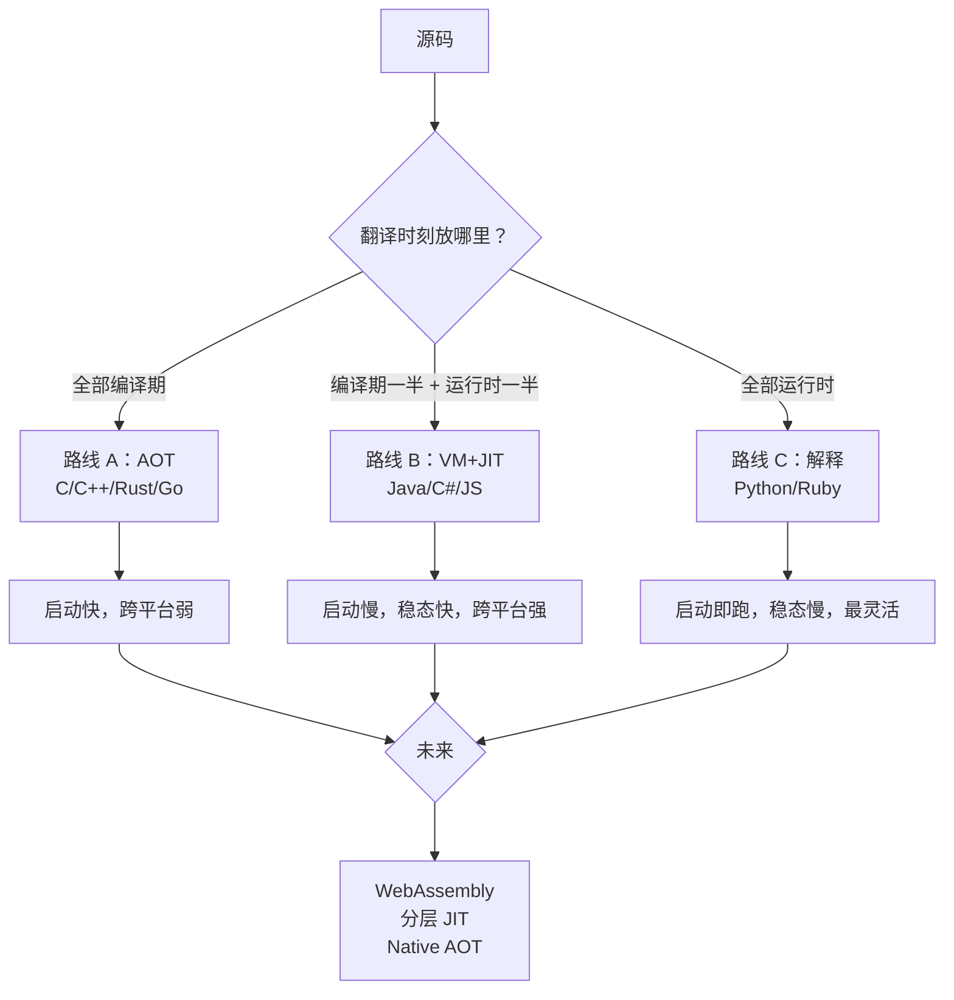
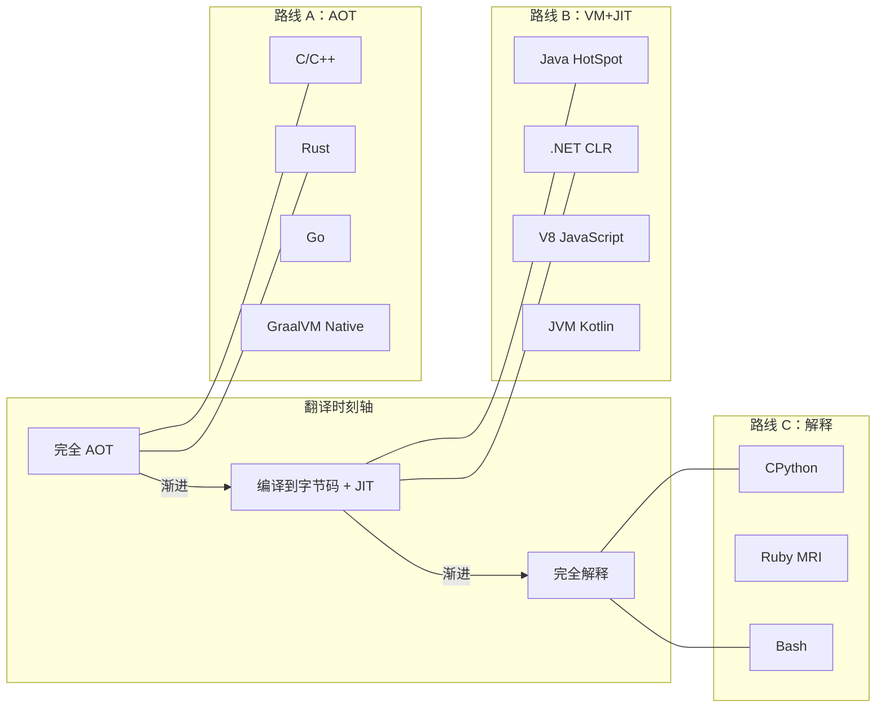
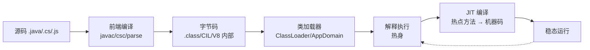
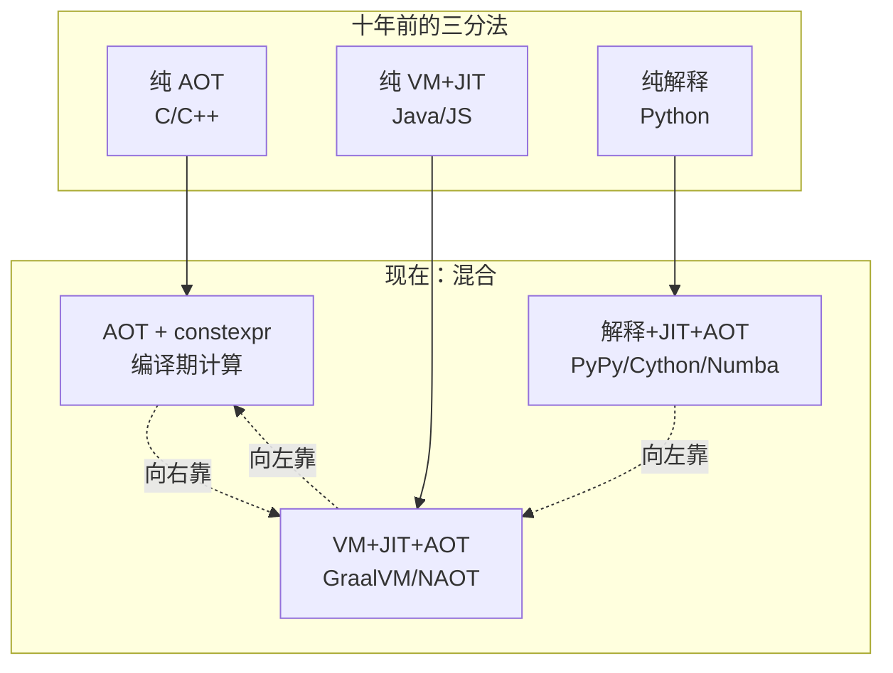

# 5.语言到机器的三种路线

> 📍 **本篇位置**：第 7 卷 · 编译与链接之道 · 第 5 篇（收官）
> 🎯 **核心矛盾**：**同样是"让 CPU 跑我的代码"，C/C++/Rust 编译一小时才能跑、Java 编几秒但启动要 3 秒、Python 几乎不编译但每次运行都比 C 慢 30 倍——这三种截然不同的路线，究竟是怎么被"逼出来"的？未来还有第四种吗？**
> 🧭 **设计灵魂**：语言到机器的路线不是"选好一种就行"，而是**在"翻译时刻、翻译产物、拼装时刻、优化时机、跨平台方式" 5 个坐标上找的不同均衡点**。三大主流路线覆盖了这条光谱的三个稳定区间——**理解了这三块，你就能给任何一门新语言在图上找到坐标**。
> 🌐 **跨平台覆盖**：C/C++/Rust（编译型）· Java/Kotlin/C#/Scala（VM 型）· Python/JavaScript/Lua/Ruby（解释型）· Go（AOT + Runtime 边界）· WebAssembly（新中间层）· GraalVM / .NET Native AOT（新趋势）
> 🔗 **延伸阅读**：← [7.4 ABI 与调用约定](./04.ABI与调用约定.md) · [2.5 字节码虚拟机执行](https://yccoding.com/pages/d0c877/) · [2.6 JIT 与运行时优化](https://yccoding.com/pages/f551ab/)
> 💡 **一句话**：**翻译提前，性能变好但灵活性变差；翻译推迟，灵活性变好但性能变差——三大路线就是在这条张力上的三个稳定平衡态**。

---

## 目录介绍

- [00.真实场景引入：同一段代码，三种命运](#00真实场景引入同一段代码三种命运)
- [01.根本矛盾：翻译时刻的取舍](#01根本矛盾翻译时刻的取舍)
- [02.五个坐标：给任何语言在图上找位置](#02五个坐标给任何语言在图上找位置)
- [03.路线 A：AOT 编译（C/C++/Rust/Go）](#03路线-aaot-编译ccrustgo)
- [04.路线 B：VM + JIT（Java/C#/JavaScript）](#04路线-bvm--jitjavacjavascript)
- [05.路线 C：解释执行（Python/Ruby/Bash）](#05路线-c解释执行pythonrubybash)
- [06.混合与演进：三条边界正在模糊](#06混合与演进三条边界正在模糊)
- [07.WebAssembly：第四种可能](#07webassembly第四种可能)
- [08.经典陷阱与反模式](#08经典陷阱与反模式)
- [09.经典案例串讲](#09经典案例串讲)
- [10.一句话总结](#10一句话总结)

---

## 00.真实场景引入：同一段代码，三种命运

> 🔍 **探索起点**：**同一份"求斐波那契数"的逻辑，选不同语言、走不同路线，性能、启动时间、部署方式全都不一样。这不是玄学，是三种路线的必然产物。**

### 场景 1：一个 CI 系统的"性能奇观"

**背景**：某团队做算法竞赛评测系统，同样的斐波那契数算法：

```txt
fib(45) 计算结果
```

| 语言/路线            | 编译时间   | 运行时间   | 二进制大小/依赖         |
| -------------------- | ---------- | ---------- | ----------------------- |
| C（`-O2`）           | 0.3 s      | 3.5 s      | 16 KB 二进制            |
| Rust（`--release`）  | 8 s        | 3.5 s      | 300 KB 二进制           |
| Go                   | 1 s        | 4.2 s      | 2 MB 二进制             |
| Java（HotSpot）      | 2 s（javac）| 4.0 s（含 JVM 启动 0.5s） | .jar + 需 JVM |
| C#（.NET）           | 3 s        | 4.5 s（含 CLR 启动 0.3s） | .dll + 需 CLR |
| JavaScript（V8）     | 无编译     | 4.8 s（预热后）           | Node 运行时     |
| Python（CPython）    | 无编译     | 105 s      | Python 解释器           |
| Python（PyPy）       | 无编译     | 5 s        | PyPy JIT                |

**观察**：
- **C 和 Rust 一样快**——都是 AOT 编到机器码。
- **Java 和 JavaScript 只慢一点**——JIT 把热循环编到机器码。
- **CPython 慢 30 倍**——每条指令都在解释。
- **PyPy 追上 JIT 阵营**——因为它自带 JIT。

这不是语言"生来快慢"，是**翻译时刻不同**导致的性能鸿沟。

### 场景 2：一次微服务冷启动的痛

**背景**：Serverless 平台上，函数按需拉起。冷启动时间对比：

| 运行时              | 冷启动     | 内存     | 说明                             |
| ------------------- | ---------- | -------- | -------------------------------- |
| Go 静态二进制       | ~50 ms     | 20 MB    | 直接 execve，无 runtime 初始化   |
| Rust                | ~40 ms     | 15 MB    | 同上                             |
| Python              | ~100 ms    | 30 MB    | 解释器起来即可跑                 |
| Node.js             | ~150 ms    | 50 MB    | V8 初始化                        |
| **Java（HotSpot）** | **2-5 s**  | 200 MB   | JVM 启动 + 类加载 + JIT 预热     |
| **Java（GraalVM）** | **~50 ms** | 40 MB    | AOT 编译，无 JVM，接近 Go        |

**为什么 Java 慢**：JVM 起来先加载几百个 class、初始化各种子系统、启动 GC、跑 JIT 预热——**总要几秒**。这在长时运行的服务器上是"一次性代价"，但在 Serverless 上是**每次调用都付**。

**解药**：GraalVM Native Image → 把 Java 强行走 AOT 路线。

**教训**：**"选路线"和"选场景"必须匹配**。同一门语言，可以走多条路线，但每条的取舍不同。

### 场景 3：为什么 Python 不能"编译一次就快"

新人常问："给我一个'Python 编译器'不就好了，编成机器码不就跟 C 一样快？"

**答案**：不行，因为 Python **本质上就是不可静态分析**：

```python
def foo(x):
    return x + 1

foo(1)       # x 是 int
foo(1.5)     # x 是 float
foo("a")     # 报错，但语法合法
foo.__class__ = SomeOther  # 甚至可以运行时替换函数
```

- 变量**没有静态类型**。
- 对象**属性可以运行时增删**（`obj.new_attr = 1`）。
- 类**可以运行时改**（甚至 `__class__` 可赋值）。
- 有 `eval()` / `exec()` / `getattr(obj, s)` → 编译时无法确定跳到哪。

**结论**：**Python 的语义决定了"必须运行时解释"**——不是没人想编，是**编不出等价的静态代码**。这就是"路线选择"的语义边界。

### 三个场景的共同拷问

**三个"为什么"**：

1. **为什么 C 和 Java 都能"快"，但 C 启动几毫秒、Java 要几秒？**——因为翻译时刻不同：C 提前翻好、Java 起来后现翻。
2. **为什么 Python 走不了 AOT？**——因为它的类型和结构在运行时才决定。
3. **为什么 GraalVM 能把 Java 变成"C 一样的启动"？**——因为它牺牲了 Java 的动态性（反射、动态类加载）。

### 灵魂三问

- **翻译时刻决定了什么？**——为什么"提前编"和"运行时编"会产生天差地别的性能和启动时间？
- **为什么 CPU 只认机器码？**——那还要"字节码 / AST / 解释器"这些中间层做什么？
- **未来还有第四条路线吗？**——WebAssembly / 分层 JIT / 编译时求值这些技术，是"新路线"还是"老路线的组合"？

### 五个层层递进的追问

1. **Q1**：源码到 CPU 中间到底会经过几种形态？（→ §01 展开）
2. **Q2**：翻译的每一步可以放在什么时刻？（→ §02 五坐标）
3. **Q3**：AOT 到底赢在哪、输在哪？（→ §03 路线 A）
4. **Q4**：JIT 是怎么做到"启动慢但稳态快"的？（→ §04 路线 B）
5. **Q5**：Python 慢是"实现问题"还是"语义问题"？（→ §05 路线 C）

### 探索路径



---

## 01.根本矛盾：翻译时刻的取舍

> 🔍 **探索起点**：**"源码 → CPU 指令"的翻译过程，在时间轴上放的位置不同，就产生了不同的路线。**

### 1.1 一切语言都要过的翻译流水线

无论什么语言，源码要变成 CPU 执行的动作，中间形态**几乎都要经历**：

```txt
源码 (source code)
   ↓ 词法分析 + 语法分析
AST（抽象语法树）
   ↓ 语义分析 + 类型检查
IR（中间表示，SSA/字节码/树）
   ↓ 优化
低级 IR / 字节码
   ↓ 代码生成
机器码（可执行 或 内存中）
   ↓ CPU 取指执行
CPU 指令流
```

**关键洞察**：**这条流水线是"必然"的——差别只在"每一步放在什么时刻"**。

| 语言           | 词法/AST                | 类型检查         | IR/字节码          | 机器码生成           |
| -------------- | ----------------------- | ---------------- | ------------------ | -------------------- |
| C              | 编译期                  | 编译期            | 编译期（GCC 内部）  | 编译期               |
| Java           | 编译期                  | 编译期            | 编译期（.class）   | **运行时（JIT）**    |
| Python         | 首次 import             | 无（运行时报错）  | 首次 import（.pyc）| **每次执行**（解释） |
| JavaScript     | **每次加载**            | 无                | **加载时**         | **运行时（JIT）**    |
| Bash           | 每次执行                | 无                | 无                 | 无（fork/exec 系统调用）|

**每一格向右移一步 = 灵活性 +1、性能 -1**。

### 1.2 三大矛盾

**矛盾 1：性能 vs 灵活性**

- 越早翻译 → 优化空间越大（编译器有全局视野） → 性能越好。
- 越晚翻译 → 越能利用运行时信息（实际类型、热点路径） → 但每次都要现翻。

**矛盾 2：启动时间 vs 稳态性能**

- AOT：**启动即峰值性能**，但生成的产物大、编译时间长。
- JIT：**冷启动慢**（需要预热），但**稳态可与 AOT 相当甚至更好**（利用运行时 profile）。
- 解释：**冷启动最快**（无编译），但**稳态性能最差**。

**矛盾 3：跨平台 vs 单平台优化**

- AOT：产物是特定 CPU/OS 的机器码 → 一份代码要编 N 份。
- VM 字节码：一次编译到"虚拟机指令"，多平台加载。
- 解释：源码即产物，任何平台的解释器都能跑。

### 1.3 用一张图看清"翻译时刻"

```mermaid
gantt
    dateFormat X
    axisFormat %s
    section AOT (C/Rust/Go)
    编译（几分钟到几小时） :done, 0, 3600
    启动 :active, 3600, 3610
    运行（峰值性能）:3610, 4610

    section JIT (Java/C#)
    编译成字节码 :done, 0, 60
    启动（加载 JVM+类）:crit, 60, 63
    JIT 预热（先解释后编译）:70, 90
    运行（峰值性能）:90, 1090

    section 解释 (Python/Ruby)
    启动（加载解释器）:crit, 0, 0.1
    首次执行（parse+跑）:1, 5
    稳态运行（每步都在解释）:5, 105
```



**观察**：AOT 前置投入长但一劳永逸；JIT 分两段（先解释、后编译）；解释无投入但整体最慢。

### 1.4 一句话本质

> **同一段逻辑最终都要变成 CPU 指令——差别只在"这条翻译流水线，切在什么时刻，产物存在什么地方，谁来触发下一步"。三大路线就是在这条时间轴上的三个稳定切法。**

---

## 02.五个坐标：给任何语言在图上找位置

> 🔍 **探索起点**：不要满足于"编译型/解释型"这种粗粒度分类。**给每门语言一份"5 维坐标"，你能看得更清楚。**

### 2.1 五个正交坐标

| 坐标                 | 取值区间                                     | 说明                                  |
| -------------------- | -------------------------------------------- | ------------------------------------- |
| **1. 翻译时刻**      | 完全提前 ↔ 完全运行时                          | 决定"何时把源码变成 IR/机器码"        |
| **2. 翻译产物**      | 源码 ↔ 字节码 ↔ 机器码                        | 决定"部署时候携带的东西"              |
| **3. 拼装时刻**      | 静态链接（`ld`）↔ 动态链接（`dlopen`）↔ 反射    | 决定"多个模块什么时候组合"            |
| **4. 优化时机**      | 编译时（编译器可见全局）↔ 运行时（JIT 见热点） | 决定"能做哪种优化"                     |
| **5. 跨平台方式**    | 每平台一份二进制 ↔ 一份字节码 ↔ 一份源码       | 决定"分发和维护成本"                   |

### 2.2 主流语言的五维定位

| 语言       | 翻译时刻      | 翻译产物            | 拼装时刻    | 优化时机  | 跨平台方式         |
| ---------- | ------------- | ------------------- | ----------- | --------- | ------------------ |
| C          | 完全 AOT      | 机器码 (`.o`/`.exe`) | 静态/动态链接 | 编译时     | 每平台一份         |
| C++        | 完全 AOT      | 机器码              | 静态/动态链接 | 编译时（LTO 可跨模块） | 每平台一份 |
| Rust       | 完全 AOT      | 机器码              | 静态为主      | 编译时     | 每平台一份         |
| Go         | 完全 AOT      | 机器码（含 runtime）| 静态         | 编译时     | 每平台一份         |
| Java       | 编译到字节码 + JIT | 字节码 (`.class`)   | 运行时类加载   | JIT（热点）| 一份 `.class` 全平台跑 |
| C#         | 同 Java       | CIL (`.dll`/`.exe`) | 运行时程序集   | JIT（tiered）| 一份程序集 |
| Kotlin/JVM | 同 Java       | 字节码              | 运行时       | JIT       | 一份字节码         |
| JavaScript | 加载时 parse | AST/字节码（V8 内部）| 无中间产物   | JIT       | 源码分发           |
| Python     | 首次 import 编字节码 | `.pyc`（字节码）   | import 时     | 无（Cython/Numba 例外）| 源码 + 解释器 |
| Bash       | 每次执行 parse | 无                  | fork/exec    | 无         | 源码即执行         |
| GraalVM Native | 完全 AOT | 机器码              | 静态         | AOT 优化    | 每平台一份         |
| WebAssembly | AOT 到 wasm  | `.wasm`（虚拟 ISA） | 加载时 JIT/AOT | 双阶段     | 一份 wasm 多平台   |

**规律**：**"翻译时刻"往右走一格，"跨平台"就自动改善，但"启动性能"变差**。

### 2.3 用一张图看三大路线的稳定区间



**核心洞察**：**这条时间轴上三个稳定区间的存在，是"不同语义和不同使用场景"共同作用的结果**——不是某种更好，是各自的最优。

### 2.4 一句话本质

> **给任何一门语言定位，就问它这 5 个问题；三大路线不过是这 5 维坐标里最常出现的三个稳定聚类。**

---

## 03.路线 A：AOT 编译（C/C++/Rust/Go）

> 🔍 **探索起点**：**AOT = Ahead of Time = "在跑之前全部翻译完"。这是最古老、也最直接的路线。**

### 3.1 AOT 的四步流水线


**每一步都在"跑之前"完成**——运行时只需要 `execve()` 把机器码映射进内存、跳到入口。

### 3.2 AOT 的三大优势

| 优势                 | 具体表现                                            |
| -------------------- | --------------------------------------------------- |
| **启动即峰值性能**   | 不需要预热；毫秒级启动                              |
| **优化空间大**       | 编译器有全代码视野：内联、寄存器分配、SIMD 向量化    |
| **无运行时依赖**     | 单一二进制或加少量 `.so`，部署简单                  |

**LTO（Link-Time Optimization）** 更是把优化推到极致：把所有模块的 IR 收集起来，在链接期做**跨模块内联**——比如 `foo.c` 里的函数被 `bar.c` 内联进去。

### 3.3 AOT 的三大代价

| 代价                 | 具体表现                                            |
| -------------------- | --------------------------------------------------- |
| **编译时间长**       | Rust/C++ 大项目动辄几十分钟到几小时                 |
| **跨平台代价高**     | 每平台/CPU 架构一份二进制（x86_64/arm64/…）         |
| **无法利用运行时信息** | 无法知道实际热路径、实际数据分布                    |

**Profile-Guided Optimization (PGO)** 是对第三点的补救——先跑一遍收集 profile，再重编：

```bash
gcc -fprofile-generate ...     # 编译带 profile 收集的版本
./run-typical-workload         # 收集真实工作负载数据
gcc -fprofile-use ...           # 用 profile 数据重编
```

**性能提升 5-15%**，但**流程复杂**——工程实施率不高。

### 3.4 AOT 阵营内部的差异

**C/C++**：极致灵活，可写内联汇编、指定内存布局；但**没有 runtime**——你得手管内存。

**Rust**：AOT + 强类型 + 所有权 → **零成本抽象**（zero-cost abstractions）：高级特性（迭代器、trait）在编译期展开成裸机器码，运行时无开销。

**Go**：AOT + **自带 runtime**（GC、goroutine 调度器、runtime.malloc）→ 二进制**天生几 MB**。runtime 是"运行时组件的静态链接版"，与 Java 的"独立 JVM"不同。

**GraalVM Native Image**：Java 的 AOT 版本——预分析所有可达代码（closed-world assumption），提前编译所有类到机器码。**代价**：反射、动态类加载受限；未使用的类完全丢弃。

### 3.5 亲手观察 AOT 的产物

**C 源码**：

```c
// hello.c
#include <stdio.h>
int main() { printf("hello\n"); return 0; }
```

**编译**：

```bash
gcc -O2 hello.c -o hello
```

**查产物**：

```bash
$ file hello
hello: ELF 64-bit LSB pie executable, x86-64, dynamically linked, ...
$ size hello
   text    data     bss     dec     hex filename
   1289     616       8    1913     779 hello
$ ldd hello
    linux-vdso.so.1 (0x00007ffe...)
    libc.so.6 => /lib/x86_64-linux-gnu/libc.so.6 (0x00007f...)
    /lib64/ld-linux-x86-64.so.2 (0x00007f...)
```

**观察**：
- 是**已经翻译好的机器码**（ELF 格式）。
- **动态链接 libc**——runtime 依赖是 OS 层的 C 库。
- 启动只需要 kernel `execve` + `ld-linux` 加载依赖 → 几毫秒。

**Rust 静态编**：

```bash
rustup target add x86_64-unknown-linux-musl
cargo build --release --target x86_64-unknown-linux-musl
$ ldd target/x86_64-unknown-linux-musl/release/hello
    statically linked
```

**结果**：**无任何动态依赖，一个二进制丢到任何 x86_64 Linux 都能跑**。

### 3.6 AOT 的最佳场景

| 场景             | 为什么选 AOT               |
| ---------------- | -------------------------- |
| 系统内核 / OS    | 无更底层的 runtime          |
| 高性能服务器     | 单机峰值 QPS 优先          |
| 命令行工具       | 启动毫秒级 → 用户体验好    |
| 嵌入式 / 无 OS   | 无字节码解释器可用          |
| Serverless 函数  | 冷启动敏感                  |
| 桌面 GUI         | 启动时间 + 内存都敏感      |

### 3.7 AOT 的死角

| 死角             | 为什么 AOT 做不到           |
| ---------------- | -------------------------- |
| 运行时热更新逻辑 | 需要动态加载 + JIT          |
| 极度动态的语言   | 无法静态分析所有情况         |
| 未知硬件 → 分发 | 每 CPU 一份二进制成本高      |

**这些是 JIT 和解释器路线的天然领地。**

---

## 04.路线 B：VM + JIT（Java/C#/JavaScript）

> 🔍 **探索起点**：**AOT 的对立面不是"完全解释"，而是"分两段翻译"——编译期编到中间字节码，运行时再编到机器码。**

### 4.1 VM+JIT 的六步流水线



**关键**：**编译期做一半、运行时做一半**——`javac` 编到字节码是编译期，但字节码本身还不是机器码，要 JVM 起来后 JIT 才把它变成机器码。

### 4.2 为什么要分成两段？

**问题**：为什么不像 C 一样一步到位编到机器码？

**三个理由**：

1. **跨平台**：字节码是虚拟机 ISA（比 CPU ISA 更抽象），一份 `.class` 可以在 x86/ARM/PowerPC 通用。
2. **利用运行时信息**：只有跑起来才知道**哪些方法是热点**、**参数实际类型是什么**——JIT 拿到 profile 后能做更针对性的优化。
3. **动态特性支持**：Java 的反射、动态类加载、Kotlin 的动态 dispatch，需要运行时环境。

### 4.3 JIT 的三个技术级别

**Tier 1：模板 JIT / 基线 JIT（Baseline JIT）**

- 直接把每条字节码翻译成一小段等价机器码。
- 快，但优化少。
- V8 的 Sparkplug、HotSpot 的 C1 就是这个级别。

**Tier 2：优化 JIT（Optimizing JIT）**

- 收集 profile（类型、分支频率、循环次数）。
- 做激进优化：内联、逃逸分析、去虚化、循环展开。
- V8 的 TurboFan、HotSpot 的 C2 就是这个级别。

**Tier 3：分层 JIT（Tiered Compilation）**

- 冷代码用解释器，稍热用 Tier 1，最热用 Tier 2。
- **动态迁移**：一段代码从 Tier 1 编到 Tier 2 后，指针换过去，无缝切换。
- 现代 JVM 和 V8 都默认开启。

### 4.4 JIT 特有的优化：类型 profile + 去虚化

```java
class Animal { void speak() { ... } }
class Dog extends Animal { void speak() { ... } }
class Cat extends Animal { void speak() { ... } }

void loop(Animal[] arr) {
    for (Animal a : arr) a.speak();   // 虚调用
}
```

**AOT 编译器**：`a.speak()` 是虚调用，必须查 vtable → 一次间接跳转。

**JIT**：跑一段时间后发现 **99% 的调用 a 都是 Dog**：

```java
if (a instanceof Dog) {
    Dog.speak_inlined();    // 直接 inline
} else {
    a.speak();              // fallback
}
```

**称为"单形调用点优化"（Monomorphic Call Site Optimization）**——AOT 编译器做不到，因为它不知道真实分布。

**结果**：热点代码的**稳态性能可以超过 C**（除非 C 用了 PGO）。

### 4.5 JIT 的代价：冷启动

**JVM 冷启动的时间去哪了？**

| 阶段          | 耗时（典型）  | 做什么                                   |
| ------------- | ------------- | ---------------------------------------- |
| JVM 二进制加载 | 30 ms        | mmap `libjvm.so`                         |
| 内部初始化    | 200 ms       | 初始化 GC / JIT 编译线程 / 类元数据表     |
| 引导类加载    | 300 ms       | 加载 `Object`, `String`, 上百 core 类     |
| 应用类加载    | 500-2000 ms  | 加载业务几百-几千 class                   |
| JIT 预热      | 500-5000 ms  | 先解释跑几万次，触发编译                 |

**结论**：**大型 Java 应用冷启动 3-10 秒是正常的**。这就是为什么 Serverless 上 Java 是次等公民。

### 4.6 VM+JIT 阵营内部差异

| 语言/VM         | 字节码格式         | JIT 特点                              | 备注                            |
| --------------- | ------------------ | ------------------------------------- | ------------------------------- |
| Java / HotSpot  | `.class`（栈式）   | 分层（Interp → C1 → C2）              | GC 可插拔（G1/ZGC/Shenandoah） |
| Kotlin/JVM      | 同 Java            | 复用 HotSpot                          | 编到 JVM 字节码                 |
| Scala/JVM       | 同 Java            | 复用 HotSpot                          | 同上                            |
| C# / .NET CLR   | CIL                | 分层（RyuJIT + Tiered）               | AOT/JIT 混合                    |
| JavaScript / V8 | AST → 内部字节码   | Sparkplug + TurboFan                  | 无独立字节码文件                 |
| JavaScript / JSC | 内部字节码         | LLInt → Baseline → DFG → FTL          | Safari 引擎                     |

### 4.7 一句话总结

> **VM+JIT 路线的精髓在于"分两段"**：把"编译到字节码"这半段前置到构建期，把"字节码到机器码"这半段推后到运行时——**前置的一半带来跨平台，后置的一半带来运行时优化**。启动慢是代价，稳态性能是回报。

---

## 05.路线 C：解释执行（Python/Ruby/Bash）

> 🔍 **探索起点**：**"翻译到机器码"这件事，如果一直不做呢？——那就是解释器路线。**

### 5.1 解释器的四种子模型

| 子模型                     | 特征                                           | 代表                          |
| -------------------------- | ---------------------------------------------- | ----------------------------- |
| **纯 AST 解释**            | 每次执行都走 AST                              | 早期 Lisp、Bash（AST + fork） |
| **字节码解释（无 JIT）**    | 一次性 parse 到字节码，主循环解释             | CPython、Ruby MRI              |
| **字节码 + 内联 cache**     | 加类型 cache，方法调用变快                    | CPython 3.11+（PEP 659）       |
| **字节码 + JIT**            | 有 JIT 就变成路线 B                            | PyPy、LuaJIT                   |

### 5.2 CPython 的执行模型（典型代表）


**核心是一个巨大的 switch/dispatch 循环**（`ceval.c` 里的 `_PyEval_EvalFrameDefault`）——对每条字节码 opcode 做 case 分支，执行对应的 C 函数。

**每条字节码执行涉及**：
- 查栈上的对象（PyObject*）。
- 通过对象的类型槽（`tp_add` / `tp_call` 等）间接跳转到 C 实现。
- 处理 GIL、引用计数、异常传播。

**每一步都是"C 里的一层封装"**——所以 CPython 慢 30 倍不是虚言，是因为**每条 Python 指令实际执行了几十条 C 指令**。

### 5.3 为什么慢：一个具体例子

**Python**：

```python
def add(a, b):
    return a + b
```

**字节码**（`dis.dis(add)`）：

```
  1           0 RESUME                   0

  2           2 LOAD_FAST                0 (a)
              4 LOAD_FAST                1 (b)
              6 BINARY_OP                0 (+)
             10 RETURN_VALUE
```

**BINARY_OP** 的执行过程（伪代码）：

```c
PyObject* right = STACK_POP();
PyObject* left  = STACK_POP();

if (PyLong_Check(left) && PyLong_Check(right)) {
    result = long_add(left, right);       // 但要先分配新 PyLong 对象
} else if (PyFloat_Check(...)) {
    ...
} else {
    // 通过类型槽 tp_as_number->nb_add 查找
    result = left->ob_type->tp_as_number->nb_add(left, right);
}

STACK_PUSH(result);
DECREF(left);
DECREF(right);
```

**对比 C 的 `a + b`**：**一条 `add rax, rbx`**——差距一目了然。

### 5.4 解释器路线的优势

| 优势                 | 具体表现                                             |
| -------------------- | ---------------------------------------------------- |
| **启动即跑**         | 无编译等待，秒级迭代                                 |
| **动态性极强**       | 运行时改代码、加属性、eval() 全支持                  |
| **跨平台最强**       | 源码即"产物"，任何有解释器的地方都能跑              |
| **REPL / Notebook**  | 交互式编程原生支持                                    |
| **可读性 / 易读性**  | 无编译中间步骤，出错栈直接映射源码                    |

**这些优势让 Python/JavaScript/Ruby 成为科学计算、数据分析、脚本、教学的第一选择。**

### 5.5 解释器路线的代价

| 代价                | 具体表现                                             |
| ------------------- | ---------------------------------------------------- |
| **CPU 密集慢 20-100 倍** | 每指令都要类型 dispatch                              |
| **无静态类型保护**  | 类型错误只有跑到那一行才发现                          |
| **打包分发麻烦**    | 得带一整个解释器（PyInstaller/pkg 打出来几十 MB）      |
| **无法真并行**      | GIL（CPython）/ 单线程事件循环（Node/JS）             |

### 5.6 应对慢：三条常见补丁

**补丁 1：C 扩展模块**

- NumPy、pandas、Pillow：**核心用 C 写，Python 只是胶水**。
- 一次调用做大批量数据 → 分摊 Python 解释器的开销。
- **Python 生态里的"高性能"几乎全靠这条路**。

**补丁 2：加 JIT（PyPy）**

- 变成路线 B。
- Python 兼容性 95%+，速度接近 Java。
- 但**没广泛替代 CPython**——生态惯性太大，C 扩展兼容性有坑。

**补丁 3：类型标注 + AOT 编译（Cython/Numba/mypyc）**

- 加类型标注让代码可以被 AOT 到 C。
- 局部使用有效（热点函数）。

### 5.7 什么时候真的应该选解释器路线？

| 场景            | 为什么选                                    |
| --------------- | ------------------------------------------- |
| 数据分析 / ML   | 用 NumPy/PyTorch，Python 只是胶水           |
| 自动化脚本      | 启动即跑，开发效率高                        |
| Web 后端（中低并发）| Django/Flask 生态成熟，性能足够              |
| 教育 / 快速原型 | 交互式，反馈快                              |
| 配置 / 模板     | 不需要极致性能，需要灵活性                  |

### 5.8 一句话总结

> **解释器不是"低级路线"，是"把翻译推迟到极致"的选择——牺牲 CPU 密集性能，换来无与伦比的灵活性和迭代速度。什么时候用它，取决于你的"瓶颈是不是 CPU"。**

---

## 06.混合与演进：三条边界正在模糊

> 🔍 **探索起点**：**十年前，"C 是编译型、Java 是 VM 型、Python 是解释型"是清晰的三分法；今天，每一门语言都在向"混合"演进。**

### 6.1 边界模糊 1：C++ 的运行时化

**编译期计算**（`constexpr` / `consteval`）：

```cpp
consteval int factorial(int n) {
    return n <= 1 ? 1 : n * factorial(n - 1);
}
constexpr int result = factorial(10);  // 编译期算出 3628800
```

**结果**：**C++ 编译器变成了一个受限的解释器**——`constexpr` 函数在编译期就跑完了。C++20 甚至允许 `constexpr` 里 `new/delete`。

**边界**：编译期计算把"运行时逻辑"往前搬 → 是**"AOT 向 JIT 靠拢"的反向**（AOT 编译器学会了运行时才做的事）。

### 6.2 边界模糊 2：Java 的 AOT 化

**GraalVM Native Image**：

```bash
native-image -jar myapp.jar
./myapp   # 无 JVM，几十毫秒启动
```

- **闭合世界假设（closed-world assumption）**：所有可能被反射调用的类必须在编译期声明。
- 生成的**单一原生二进制**：几十 MB，启动几十毫秒。
- **代价**：反射受限、动态类加载不能用、生态适配成本高。

**为什么这个方向火**：Serverless + 容器时代，**冷启动比稳态性能更重要**——GraalVM 用 Java 语义换来了 Go 一样的部署形态。

### 6.3 边界模糊 3：.NET Native AOT

```bash
dotnet publish -c Release -r linux-x64 -p:PublishAot=true
```

- 从 .NET 7 起，官方支持 AOT。
- 用途：容器化、小二进制、快速启动。
- **代价同 GraalVM**：反射、动态生成代码受限。

**观察**：**AOT 化正成为 VM 语言的第一优先级**——因为主流部署形态从"长时进程"变成了"函数即服务/容器"。

### 6.4 边界模糊 4：JavaScript 的 AOT 探索

- **Bytenode**：Node.js 上把 JS 编译成 V8 内部字节码 `.jsc`，加载时跳过 parse 阶段。
- **Hermes**（Facebook）：React Native 用的 JS 引擎，**AOT 编到字节码**，无 JIT（省内存、启动快）。
- **QuickJS**：小型嵌入式 JS 引擎，只有解释器，编译成静态二进制只需 800KB。

### 6.5 边界模糊 5：Python 的编译探索

| 项目               | 手法                                              | 定位                              |
| ------------------ | ------------------------------------------------- | --------------------------------- |
| **Cython**         | Python 加类型标注 → 编译成 C 模块                  | 长期使用，热点函数加速             |
| **Numba**          | 装饰器 `@njit`，运行时 JIT                          | 数值计算                          |
| **mypyc**          | 用 mypy 类型标注 AOT 编译                          | Instagram 后端使用                |
| **CPython 3.11+**  | 内联缓存（specialization）                         | 官方在无 JIT 前提下提速 25%       |
| **CPython 3.13 JIT** | 官方实验性 Copy-and-Patch JIT                      | 未来主线                          |

**结论**：**Python 官方也在往 JIT / AOT 靠**——不是抛弃解释器，是**在解释器之上加编译层**。

### 6.6 三条边界模糊后的图



### 6.7 一句话总结

> **三条路线不再是"排他选择"，而是"每门语言都在这条时间轴上左右移动"——所有语言都在**同时追求"启动快 + 稳态快 + 灵活 + 跨平台"**。选路线，本质是选"最主要愿意付的代价"。**

---

## 07.WebAssembly：第四种可能

> 🔍 **探索起点**：**WASM 是最近 10 年出现的一个"新中间形态"——它到底是新路线，还是老路线的变奏？**

### 7.1 WASM 是什么

- **一份跨平台的虚拟 ISA**（32-bit / 64-bit 内存模型、结构化控制流）。
- 由 C/C++/Rust/Go 通过 `emscripten` / `wasm32-unknown-unknown` 目标编译而来。
- 加载方（浏览器 / wasmtime / wasmer）**再编译到本地机器码**（AOT 或 JIT）。

### 7.2 WASM 在五维坐标上的位置

| 坐标        | 位置                                                          |
| ----------- | ------------------------------------------------------------- |
| 翻译时刻    | **两段式**：源码→wasm（AOT）+ wasm→机器码（加载时）           |
| 翻译产物    | `.wasm`（虚拟 ISA）                                            |
| 拼装时刻    | 加载时 import/export 解析                                     |
| 优化时机    | 两次：源→wasm 时编译器优化 + wasm→机器码时 JIT/AOT             |
| 跨平台方式  | **一份 wasm 全平台跑**                                        |

**这明明就是"路线 B（VM+JIT）"的变种**——只不过：

- Java 字节码是"Java 中心"（面向 OOP，含反射、类加载）。
- WASM 字节码是"通用底层"（无类型、无对象模型、内存扁平）。

**WASM 更像"跨语言的通用 VM 字节码"，Java 字节码更像"Java 专用字节码"。**

### 7.3 WASM 的三大特色

**特色 1：Sandbox by default**

- WASM 模块**不能直接调 syscall**。
- 所有外部能力（文件、网络）必须通过宿主 `import` 显式给。
- **这让 WASM 天然适合插件、跨信任边界的组件**。

**特色 2：小、快**

- `.wasm` 文件通常几百 KB 到几 MB。
- 加载后 baseline JIT 可以在毫秒级 warm up。

**特色 3：语言无关**

- Rust / C / Go / C# / Zig / AssemblyScript 都可以编到 WASM。
- **一个 wasm 模块可以被任何语言宿主调用**（通过 import/export）。

### 7.4 WASM 的三大战场

| 战场               | 场景                                                | 状态                            |
| ------------------ | --------------------------------------------------- | ------------------------------- |
| **浏览器**         | 在网页里跑 C++/Rust 高性能代码                       | 已成熟（Figma、AutoCAD Web）    |
| **服务端**         | 替代 Docker 做轻量沙箱（Fastly Compute@Edge、Cloudflare Workers） | 新兴 |
| **插件系统**       | 让宿主程序安全加载第三方插件（Envoy、Zellij、Redis Modules） | 快速普及 |

### 7.5 WASI：给 WASM 一个"标准 OS"

**WebAssembly System Interface**——一套模仿 POSIX 但 sandbox 化的 syscall 接口：

```wat
(import "wasi_snapshot_preview1" "fd_write" (func $fd_write ...))
```

**目标**：**让一份 WASM 二进制在浏览器外**（服务器/CLI/嵌入式）**都能跑**。

**未来**：**"WASI + Component Model"** 目标是做出"跨语言、跨平台的组件互操作标准"——如果成功，将是二十年来最大的分发形态变革。

### 7.6 WASM 是新路线还是老路线？

**结论**：**是"路线 B 的通用化 + Sandbox 化"**——不是全新范式，但在**通用性**和**安全性**两个维度上做到了前所未有。

**它给三大路线带来的冲击**：
- 对 AOT：多一个"跨平台目标"（编到 wasm 而不是 x86）。
- 对 VM+JIT：多一个通用字节码选择（不用锁定 JVM/CLR）。
- 对解释：低性能语言可以把热点函数写成 WASM 模块调。

---

## 08.经典陷阱与反模式

> 🔍 **探索起点**：**选路线选错的代价远比想象大——因为它决定了整个团队的技术栈和运维方式。**

### 8.1 陷阱 1：CPU 瓶颈项目选解释器

**反例**：某量化团队用 Python 写策略回测，回测一次 6 小时。

**根因**：热循环里全是 `for i in range(n)` + `list[i]` 访问 → 每次 dispatch 都在 Python 层。

**修复**：
- 用 NumPy 向量化：把循环下沉到 C。
- 热点函数用 Numba `@njit`。
- 最终**6 小时 → 3 分钟**。

**教训**：**Python 不是"慢"，是"用错了姿势就慢"**——正确姿势是"胶水层用 Python，热点下沉到 C/JIT"。

### 8.2 陷阱 2：Serverless 选大型 Java 框架

**反例**：Spring Boot 应用部署到 AWS Lambda，每次冷启动 5-10 秒，用户超时。

**根因**：Spring 启动要加载几百个 Bean，Java classloading + Spring reflection 极重。

**修复**：
- 换 Micronaut / Quarkus（针对 AOT 优化的 Java 框架）。
- 或用 GraalVM Native Image。
- 冷启动 **5 秒 → 50 ms**。

**教训**：**语言路线要匹配部署形态**——长时进程和 Serverless 是两种不同的部署形态，对启动时间的敏感度差 100 倍。

### 8.3 陷阱 3：把 AOT 项目"打包成脚本一样分发"

**反例**：C++ 工具依赖大量动态库，用户装了不同版本 → "在我机器上能跑" 事故。

**修复**：
- 静态编译（musl target for Rust；`-static` for C）。
- 或 AppImage / snap / flatpak 打包。

**教训**：**AOT 的优势要用"部署方式"兑现**——单一二进制才是真正的"部署一次跑到底"。

### 8.4 陷阱 4：JIT 项目做 CPU 密集基准测试忘预热

**反例**：跑 JMH 基准，前几次调用慢，误以为"Java 就是慢"。

**根因**：**没预热 → 还在解释执行**，没触发 JIT 编译。

**修复**：JMH 自带 `@Warmup(iterations = 5)` 或手动预热。

**教训**：**测 JIT 语言的性能必须先预热**——这是 VM+JIT 路线的固有代价。

### 8.5 陷阱 5：GraalVM Native 忘配置反射

**反例**：Spring/Jackson 应用编到 native image，运行时报 `ClassNotFoundException`。

**根因**：反射用的类没在 `reflect-config.json` 里声明 → 闭合世界假设下被编译器丢弃。

**修复**：
- 用 Spring Native / Quarkus，它们自动生成配置。
- 或手动写 `META-INF/native-image/reflect-config.json`。

**教训**：**GraalVM AOT 的代价是"你要告诉编译器谁会被反射调用"**——用不上闭合世界优势的项目别硬迁。

### 8.6 陷阱 6：错误理解"WASM 就是快"

**误区**：以为 WASM 在浏览器里能跑到"C 一样快"。

**真相**：
- WASM 比 JS 快 **1.5-3 倍**（不是 10 倍）。
- WASM 到内存 boundary crossing 有开销（每次调 JS API 都要 marshal）。
- WASM 生态还没成熟到"随便用 Rust 写就是全站最优"。

**教训**：**WASM 好用但不是银弹**——用它的场景是"有算力密集的核心 + 少量 JS/Wasm 边界调用"。

### 8.7 反模式汇总

| 反模式                       | 对应错误路线选择             | 修复方向                        |
| ---------------------------- | ---------------------------- | ------------------------------- |
| Python 跑 CPU 密集大循环     | 解释器路线 vs CPU 瓶颈      | NumPy / Numba / C 扩展          |
| Spring Boot 上 Lambda        | VM+JIT vs Serverless        | AOT（GraalVM / Quarkus）        |
| C++ 工具动态依赖分发         | AOT 的优势没兑现            | 静态链接 / 单一二进制           |
| JMH 没预热                    | 忘了 JIT 特性                | 预热配置                        |
| 迁移 Spring 到 GraalVM 未配反射 | 忘 closed-world 代价       | 声明反射 config                 |
| 用 WASM 追 JS 全站替代       | 高估 WASM 收益              | 只把热点写成 WASM               |

---

## 09.经典案例串讲

> 🔍 **探索起点**：**每个案例都是"一个团队根据自己的痛点，重新在这条时间轴上找位置"的现场剧本。**

### 9.1 案例 A：Twitter 用 Scala/JVM 撑住峰值 QPS

**背景**：早期 Twitter 用 Ruby on Rails，QPS 上不去。

**动作**：核心服务改写为 Scala（跑在 JVM 上）。

**为什么选 JVM**：

- **稳态 JIT 性能接近 C**：热点方法经过 C2 编译。
- **Zero-cost 抽象**：Scala 高级特性经 JIT 内联后无运行时开销。
- **成熟 GC + 并发原语**：省下大量基础设施投入。

**代价**：JVM 冷启动、GC 停顿——但 Twitter 是**长时进程**，一次启动跑几个月，这些代价被摊薄。

**教训**：**部署形态匹配路线**——常驻服务 = JIT 路线的甜蜜点。

### 9.2 案例 B：Discord 从 Go 迁移到 Rust 的性能故事

**背景**：Discord 消息服务 2019 时用 Go，遇到 GC 停顿问题——每 2 分钟一次 gc pause 影响用户体验。

**动作**：核心热服务改写为 Rust。

**为什么选 Rust**：

- **AOT 到机器码**：与 Go 同级。
- **无 GC**：所有权系统在编译期决定内存生命周期，运行时无 GC 停顿。
- **零成本抽象**：迭代器、trait 全部编译期展开。

**结果**：**p99 延迟从 100 ms 降到 5 ms**——不是"Rust 比 Go 快"，是**"没有 GC 停顿"**。

**教训**：**AOT 阵营内部也有子选择**——Go 是 AOT + GC，Rust 是 AOT 无 GC；根据延迟敏感度选。

### 9.3 案例 C：Instagram 用 mypyc 把 Python 加速 2 倍

**背景**：Instagram 后端**几百万行 Python**，性能瓶颈明显但迁移成本天文数字。

**动作**：内部开发 **mypyc**——用 mypy 类型标注为线索，把 Python 编译成 C 扩展。

**结果**：
- 关键路径加速 2-4 倍。
- 无需修改业务代码（只加类型标注）。
- **每年省下相当于千万美金的服务器成本**。

**教训**：**大规模 Python 项目的加速路径 = 保留 Python 语义，把热点子集 AOT 到 C**——不是"重写"，是"渐进增强"。

### 9.4 案例 D：Figma 用 WASM 把 C++ 桌面级引擎搬到浏览器

**背景**：Figma 是设计工具，核心图形引擎是 **C++**——放在浏览器里需要既高性能又跨平台。

**动作**：C++ 核心通过 Emscripten 编译到 WASM，JavaScript 做 UI 层。

**为什么选 WASM**：

- **性能**：WASM 比 JS 快 2-3 倍，接近原生。
- **跨平台**：一份 wasm 全浏览器跑。
- **代码复用**：C++ 核心可以同时用于桌面客户端和 Web。

**代价**：
- 与 JS 边界的 marshaling 开销 → 得设计粗粒度 API。
- 内存管理复杂（wasm 是扁平内存，需手管）。

**教训**：**WASM 的最佳场景 = 高性能核心 + 需要 Web 分发**——不是"一切都用 WASM"。

### 9.5 案例 E：Cloudflare Workers 用 V8 隔离替代容器

**背景**：Cloudflare 需要在边缘运行用户代码，容器冷启动太慢。

**动作**：用 V8 引擎的 **isolate** 特性——同一个 V8 进程里创建多个隔离的执行环境。

**架构对比**：

| 方案            | 冷启动     | 内存/实例  | 隔离性       |
| --------------- | ---------- | ---------- | ------------ |
| 容器            | 100-500 ms | 100+ MB    | 完全隔离     |
| Firecracker MicroVM | 100 ms | 30 MB      | 强隔离       |
| **V8 Isolate**  | **5 ms**   | **3 MB**   | 语言级隔离    |

**代价**：
- 只能跑 JS/TS/WASM（V8 支持的语言）。
- 语言级隔离不如 OS 级隔离，但对 Serverless 场景够用。

**教训**：**"路线选择"可以在架构层做——不用一定选大型 VM/容器，可以选"轻量 VM+JIT 引擎"**。

### 9.6 案例 F：TypeScript 编译服务的两段式演进

**Stage 1**：TypeScript 编译器 `tsc` 用 TypeScript 写，跑在 Node.js 上。

- 优点：一致的语言栈。
- 缺点：**大项目编译慢**（一个大 monorepo 编译几分钟）。

**Stage 2 (2024)**：Microsoft 宣布 `tsgo`——**TypeScript 编译器用 Go 重写**。

**动机**：Go 是 AOT + goroutine 并行 → 编译速度提升 **10 倍**。

**教训**：**开发工具链本身是性能敏感的——用工具语言（AOT + 并行）比"自举"更实际**。这也是为什么 Rust 编译器 rustc、Swift 编译器都不用自己写自己（都是 C++ 起步）。

---

## 10.一句话总结

### 10.1 三层认知

**Level 1（初学者）**：语言分编译型 / 解释型两类。

**Level 2（工程师）**：语言的翻译时刻是一条**光谱**——AOT / VM+JIT / 解释是这条光谱上的三个稳定区间；每个区间有各自的启动时间/稳态性能/跨平台方式取舍。

**Level 3（设计者）**：**语言不选路线，语言在设计时就注定了它能走哪些路线**：
- Python 的动态性 → 主路线只能是解释；
- Java 的静态类型 + 反射 → 主路线是 VM+JIT，副路线可 AOT（代价是限制反射）；
- C 的极简语义 → 三种路线都能走（AOT 主流、TCC 也支持解释）；
- **未来的语言设计如果想要多路线兼容，语义就要留足静态化空间**——这是 Rust/Swift/Kotlin 的共同选择。

### 10.2 决策树：新项目选哪条路线

```mermaid
graph TD
    A[开始一个新项目] --> B{CPU 密集还是 IO 密集？}
    B -->|CPU 密集| C{启动时间敏感？}
    B -->|IO 密集| D{团队熟悉度？}

    C -->|极敏感<br/>(Serverless/CLI)| E[AOT<br/>Rust/Go/GraalVM]
    C -->|不敏感<br/>(长时服务)| F[VM+JIT<br/>Java/C#]

    D -->|Python/Node 生态强| G[解释路线<br/>Python/Node]
    D -->|JVM 生态强| F
    D -->|Rust/Go 团队| E
```

### 10.3 七字真言

> **翻译早 → 快而僵、翻译晚 → 灵而慢**——每门语言、每种路线，都是这个光谱上的一个平衡点。**没有最好的路线，只有最匹配"你的性能/启动/灵活/团队"这四维需求的路线**。

### 10.4 跨语言路线术语速查

| 中文             | 英文                                       | 出现场合                       |
| ---------------- | ------------------------------------------ | ------------------------------ |
| 提前编译         | AOT (Ahead-of-Time Compilation)            | C/C++/Rust/Go/GraalVM          |
| 即时编译         | JIT (Just-in-Time Compilation)             | Java/C#/V8                     |
| 分层编译         | Tiered Compilation                          | 现代 JVM/V8                    |
| 解释器           | Interpreter                                 | Python/Ruby/Bash               |
| 字节码           | Bytecode                                    | `.class` / `.pyc` / wasm       |
| 基线 JIT         | Baseline JIT / Template JIT                 | V8 Sparkplug / HotSpot C1      |
| 优化 JIT         | Optimizing JIT                              | V8 TurboFan / HotSpot C2       |
| 类型 profile     | Type Profile / Feedback                     | JIT 特有优化                    |
| 去虚化           | Devirtualization                            | JIT 内联                        |
| 闭合世界假设     | Closed-World Assumption                     | GraalVM Native Image           |
| 链接时优化       | LTO (Link-Time Optimization)                | LLVM ThinLTO                   |
| 反馈驱动优化     | PGO (Profile-Guided Optimization)           | GCC/Clang                      |
| 零成本抽象       | Zero-cost Abstractions                      | C++/Rust                       |
| 沙箱             | Sandbox                                     | WASM                           |

### 10.5 延伸阅读

- **《Crafting Interpreters》** Robert Nystrom——从零实现解释器 + 字节码 VM，路线 C 和 B 的最佳入门。
- **《Engineering a Compiler》** Cooper & Torczon——AOT 编译器全流程。
- **《Advanced Compiler Design and Implementation》** Steven Muchnick——高级优化算法。
- **V8 官方博客** <https://v8.dev/blog>——现代 JIT 演进的最好观察窗口。
- **HotSpot Wiki** <https://wiki.openjdk.org/display/HotSpot>——JVM JIT 内部细节。
- **WebAssembly Spec** <https://webassembly.github.io/spec/>——WASM 官方规格。
- **GraalVM 官方文档** <https://www.graalvm.org/latest/reference-manual/native-image/>——Java AOT 化实战。

### 10.6 与整卷的收官

本卷（第 7 卷 · 编译与链接之道）到此收官：

- **[7.1 从源码到可执行](./01.从源码到可执行.md)**：翻译流水线的**空间维度**——预处理/编译/汇编/链接的产物形态。
- **[7.2 符号表与重定位](./02.符号表与重定位.md)**：**"打洞 + 补洞"**的机制细节。
- **[7.3 静态链接 vs 动态链接](./03.静态链接与动态链接.md)**：拼装的**时间维度**——build 时补 vs 运行时补。
- **[7.4 ABI 与调用约定](./04.ABI与调用约定.md)**：模块间的**二进制契约**——参数、名字、布局。
- **[7.5 语言到机器的三种路线](./05.语言到机器的路线.md)**（本篇）：翻译的**时间维度**——AOT/JIT/解释的三种时刻选择。

**五篇一起看，你就有了一整幅"源码 → CPU 指令"的完整地图**：**空间上有哪些形态、时间上放在哪里、模块间怎么对上话——三个维度一起决定了一门语言的性能画像与部署形态**。

**下一卷起点建议**：如果你想继续深入，可以看**「运行时」系列**——GC / 协程 / 反射 / 动态派发；或**「操作系统」系列**——`execve` 是怎么把 ELF 变成进程的、动态链接器 `ld-linux.so` 内部实现细节。

---
