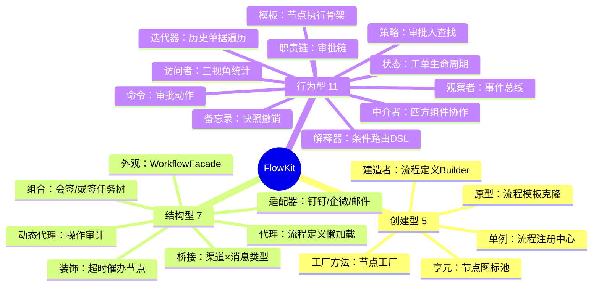
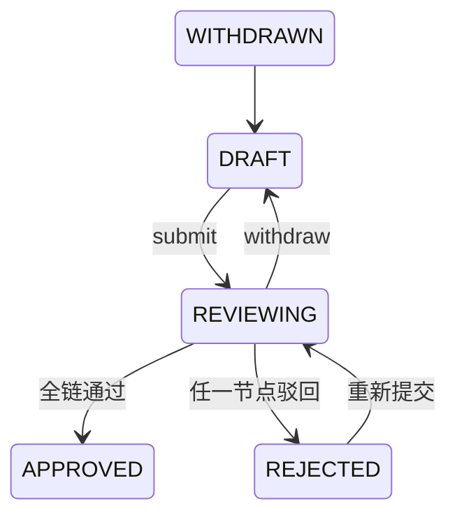
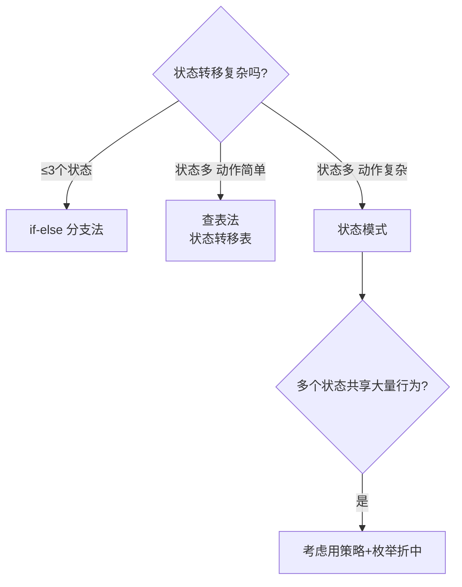
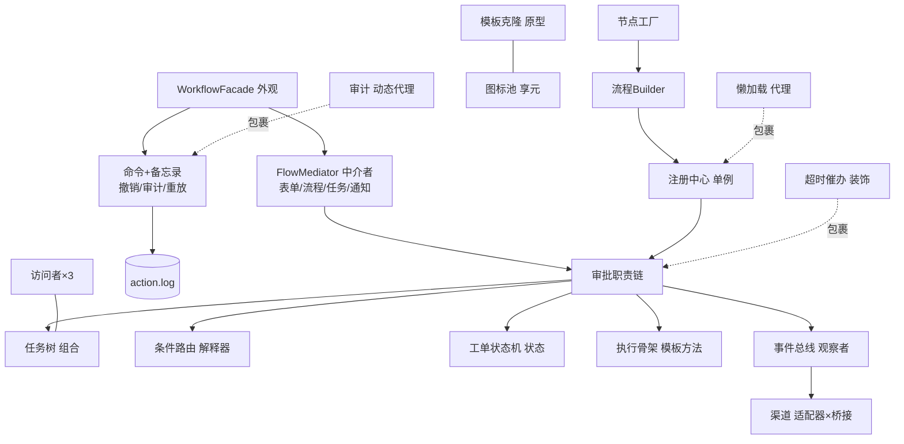

# 第二十五章：综合案例 · FlowKit 迷你工作流审批引擎

本章是《巧学设计模式》的**最终关·毕业设计**。前 24 篇每篇只解剖一个模式（虽然共用电商主线，但代码各自为战），本案例要**一口气把 23 种模式装进同一个项目**——从最土的 if-else 骨架起步，一路被真实痛点逼着重构，最终得到一个能跑、能撤、能签、能催办、能发通知的**迷你审批引擎**。

更妙的是：这个项目是专栏电商主线的**亲儿子**——"售后工单审批"本来就是电商系统里最像工作流引擎的那块肉。读完它，你等于亲手造了一个 Activiti 的"概念简化版"。

**学习方式**：本案例**篇幅较长**（约 2800 行 / 20-24 小时），建议**分 5 次会话读完**，每次 2-4 小时；**绝不要试图一口气吃完**。每一节都自带"为什么这样写"的思考小结——如果说前 23 篇是"单元考试"，本篇就是"毕业答辩"，它检验你能不能把模式**协同**起来，而不只是单点背诵。

---

## 📚 渐进学习节奏

先读这段，再开始敲代码！本案例 14 个章节，**严格按"5 次会话"切分**，每次会话独立可验收。

🎯 **每次会话开始前必读**：

> 1. **打开上次会话的代码 commit**，先看一遍验收点是否还在
> 2. **每个 Step 写完一小段就编译**（单模块 `javac` 只要几秒）
> 3. **看到该节末尾的 ✅ 验收命令出现预期输出，再进入下一节**

⚠️ **本案例独有的"先土法炼钢，再正规化改造"策略**：第 1 次会话搭好的 MVP（`String` 状态 + if-else 审批 + 写死审批人）在后续会话中会**被逐层推翻重构**。这是真实工程的常态，**先让程序跑起来，再让它好起来**。当你在 §03 看到自己第 1 次会话写下的 `if (status.equals("APPROED"))` typo 时，恭喜你，你已经长出工程师的直觉了。

📌 **强烈建议**：每次会话结束做一次 `git commit`，这样第 4 次会话的命令日志重放出问题，你能轻松回退到第 3 次会话的稳态。

🎯 **本案例的四次"灵魂三问"**（动手前先想清楚）：

> - **§02 MVP 骨架前**：为什么先做 REPL 不是先做流程引擎？为什么状态先用 `String` 不用 `enum`？为什么审批人先写死？
> - **§05 职责链前**：为什么不用递归树表达审批层级？为什么审批链不能用观察者？加签为什么是"插节点"不是"换链"？
> - **§07 命令前**：为什么 `approve/reject` 要对象化？为什么 undo 光有命令不够、必须配备忘录？命令日志存了能干什么？
> - **§10 中介者前**：为什么表单服务直调流程服务不行？中介者会不会长成上帝类？中介者与外观到底谁包谁？

⚠️ **本案例的五处"造 BUG → 修复"高峰**（亲眼看到才能记住）：

> - **§03 状态字符串 typo**：`"APPROED"` 拼错 → 工单凭空"消失"，switch 漏分支 → 已驳回单还能继续审批
> - **§06 原型浅拷贝**：克隆流程模板后两个定义**共享同一个节点 List** → 改一个，全家跟着变
> - **§07 备忘录浅拷贝**：undo 撤回审批后 → 工单**附件列表被历史快照误改**（与原型坑同根不同形）
> - **§08 AST 不缓存**：每张工单进条件节点都重新 parse 表达式 → 1000 张单压测直接慢 40 倍
> - **§09 观察者同步阻塞**：一个渠道网关超时 → 整条通知链卡死，审批主流程被拖挂

---

## FlowKit 技术全景

### 技术栈分层详解

| 技术层级 | 对应知识点 | 在 FlowKit 中的具体实现 |
|---------|-------------|------------------------|
| **领域层** | 状态机、审批流转 | 工单状态模式、审批职责链、任务树组合 |
| **规则层** | 条件表达式、路由 | 解释器 AST、策略查找审批人 |
| **横切层** | 通知、审计、撤销 | 适配器/桥接多渠道、动态代理审计、命令+备忘录 |
| **框架层** | 对象创建、组件协作 | 工厂/建造者/原型/享元、中介者、外观、代理、装饰、模板、迭代器、观察者 |

### 为什么审批引擎是 23 种模式的天然考场

工作流引擎有一样别处没有的东西：**它的需求文档里就写着模式的名字**——

- "审批要**一级一级**流转" → 职责链
- "单据有**生命周期**，不同阶段能做的事不同" → 状态
- "审批人怎么找，**每个公司不一样**" → 策略
- "点错了要能**撤回**" → 命令 + 备忘录
- "金额大于 5000 **并且**部门是研发才走总监" → 解释器
- "会签要**所有人通过**，或签**一人即可**" → 组合
- "钉钉、企微、邮件**都要能收**" → 适配器 + 桥接

痛点不需要编造——**审批规则本身就是需求文档**。

---

## 案例元信息

| 项目 | 说明 |
|------|------|
| 难度 | ★★★★★ |
| 预估时长 | 20 - 24 小时（建议 5 次完成） |
| 前置章节 | **本专栏 01 - 24 篇全部**（至少读完 L1 + L2 共 14 篇） |
| 覆盖模式 | **23 / 23 全覆盖**：创建型 5（单例、工厂方法、建造者、原型、享元）+ 结构型 7（代理、动态代理、适配器、桥接、装饰、外观、组合）+ 行为型 11（模板、策略、观察者、迭代器、职责链、命令、状态、备忘录、中介者、访问者、解释器） |
| 设计亮点 | 加签 = 运行期动态插链；undo = 命令 + 备忘录双剑合璧；会签/或签 = 组合树统一单任务与任务组；条件路由 = 迷你 DSL + AST 缓存 |
| 最终产物 | 多文件 Java 工程：`src/flowkit/*` + REPL 可执行 + 命令日志 `./data/action.log` |
| 代码规模 | 约 2800 行 / 12 个包 50+ 类（不含空行注释约 2000 行） |

---

## 📋 目录快速导航

点击以下条目即可跳转到对应节。【🔑 重点节】推荐优先阅读。

- [01.需求说明](#01需求说明)
  - [1.1 为什么做审批引擎](#11-为什么做审批引擎)
  - [1.2 目标功能集](#12-目标功能集)
  - [1.3 与 23 模式对应关系](#13-与-23-模式对应关系) 【🔑】
  - [1.4 项目目录结构](#14-项目目录结构)
- [02.MVP骨架启动](#02mvp骨架启动) 【第1次会话】
  - [灵魂三问：动手前先想清楚](#灵魂三问动手前先想清楚)
  - [Step 1.1 最小工单 + REPL](#step-11-最小工单--repl)
  - [Step 1.2 if-else 版审批主流程](#step-12-if-else-版审批主流程) 【🔑】
  - [Step 1.3 直觉实现的四个隐患](#step-13-直觉实现的四个隐患)
- [03.工单状态机](#03工单状态机) 【第2次会话·状态翻车现场】
  - [Step 2.1 两个现场事故](#step-21-两个现场事故)
  - [Step 2.2 先止血：enum 替换 String](#step-22-先止血enum-替换-string)
  - [Step 2.3 根治：状态模式重构](#step-23-根治状态模式重构)
  - [Step 2.4 效果对比与选型决策树](#step-24-效果对比与选型决策树)
- [04.审批人查找策略](#04审批人查找策略)
  - [Step 3.1 写死审批人的代价](#step-31-写死审批人的代价)
  - [Step 3.2 策略三连 + 注册表](#step-32-策略三连--注册表)
- [05.审批链流转](#05审批链流转) 【第2次会话·OOP高峰⭐】
  - [灵魂三问：动手前先想清楚](#灵魂三问动手前先想清楚-1)
  - [Step 4.1 审批链骨架](#step-41-审批链骨架)
  - [Step 4.2 加签 = 运行期动态插节点](#step-42-加签--运行期动态插节点) 【🔑】
  - [Step 4.3 过滤链变体：通知链](#step-43-过滤链变体通知链)
- [06.创建型五连](#06创建型五连) 【第3次会话·对象怎么"生"】
  - [Step 5.1 节点工厂](#step-51-节点工厂)
  - [Step 5.2 流程定义 Builder](#step-52-流程定义-builder)
  - [Step 5.3 流程注册中心单例](#step-53-流程注册中心单例)
  - [Step 5.4 流程模板原型克隆](#step-54-流程模板原型克隆) 【🔑】
  - [Step 5.5 节点图标享元池](#step-55-节点图标享元池)
- [07.命令与撤销](#07命令与撤销) 【第4次会话·毕业关上⭐】
  - [灵魂三问：动手前先想清楚](#灵魂三问动手前先想清楚-2)
  - [Step 6.1 审批动作命令化](#step-61-审批动作命令化)
  - [Step 6.2 备忘录：快照与恢复](#step-62-备忘录快照与恢复)
  - [Step 6.3 命令日志：审计与崩溃恢复](#step-63-命令日志审计与崩溃恢复) 【🔑】
- [08.条件DSL与任务树](#08条件dsl与任务树) 【第4次会话·AST高峰⭐】
  - [Step 7.1 条件表达式解释器](#step-71-条件表达式解释器)
  - [Step 7.2 AST 必须缓存](#step-72-ast-必须缓存) 【🔑】
  - [Step 7.3 会签与或签：组合模式](#step-73-会签与或签组合模式)
  - [Step 7.4 三视角统计：访问者](#step-74-三视角统计访问者)
- [09.多渠道通知](#09多渠道通知) 【第5次会话·横切高峰⭐】
  - [Step 8.1 渠道适配器](#step-81-渠道适配器)
  - [Step 8.2 渠道 × 消息类型：桥接](#step-82-渠道--消息类型桥接)
  - [Step 8.3 事件总线：观察者](#step-83-事件总线观察者) 【🔑】
  - [Step 8.4 动态代理审计日志](#step-84-动态代理审计日志)
- [10.终局六连](#10终局六连) 【第5次会话·收尾⭐】
  - [灵魂三问：动手前先想清楚](#灵魂三问动手前先想清楚-3)
  - [Step 9.1 四方协作：中介者](#step-91-四方协作中介者)
  - [Step 9.2 一站式入口：外观](#step-92-一站式入口外观)
  - [Step 9.3 延迟加载：代理](#step-93-延迟加载代理)
  - [Step 9.4 超时催办：装饰器](#step-94-超时催办装饰器)
  - [Step 9.5 执行骨架：模板方法](#step-95-执行骨架模板方法)
  - [Step 9.6 历史遍历：迭代器](#step-96-历史遍历迭代器)
- [11.端到端运行](#11端到端运行)
  - [Step 10.1 编译](#step-101-编译)
  - [Step 10.2 一个退款单的一生](#step-102-一个退款单的一生) 【🔑】
  - [Step 10.3 崩溃恢复验证](#step-103-崩溃恢复验证)
- [12.项目总结](#12项目总结)
  - [12.1 整体架构图](#121-整体架构图)
  - [12.2 23 模式覆盖回顾](#122-23-模式覆盖回顾) 【🔑】
  - [12.3 故意不用模式的三个地方](#123-故意不用模式的三个地方)
- [13.技术思考](#13技术思考)
- [14.衔接与延伸](#14衔接与延伸)
- [尾声寄语](#尾声寄语)

---

## 01.需求说明

### 1.1 为什么做审批引擎

工单审批是企业后台最常见的需求：退款要走组长→主管→财务，报销要走主管→财务→总监，请假要走组长→HR。它的接口极简（提交/通过/驳回/撤回），但要做"对"，需要解决一连串工程问题：

| 工程问题 | 在本案例中的体现 | 用到的模式 |
|---------|----------------|-----------|
| 单据状态谁能乱改吗 | 草稿不能审、驳回不能撤 | 状态 |
| 审批层级每家公司都不同 | 组长→主管 vs 主管→财务→总监 | 职责链 |
| 审批人怎么找人人不一样 | 直属主管 / 按角色 / 按金额阶梯 | 策略 |
| 点错了要能撤回 | approve 完立刻后悔 | 命令 + 备忘录 |
| 会签要全部通过、或签一人即可 | 嵌套任务组 | 组合 |
| 金额大于 5000 走总监 | `"amount > 5000 AND dept == '研发'"` | 解释器 |
| 钉钉/企微/邮件都要收到通知 | 三方接口格式各异 | 适配器 + 桥接 + 观察者 |
| 审批动作要有审计日志 | 谁在几点干了什么 | 动态代理 + 命令 |
| 流程模板要能复用微调 | 年假模板克隆改审批人 | 原型 |
| 表单/流程/消息/权限四方联动 | 互调成蜘蛛网 | 中介者 + 外观 |

**这恰好就是 23 种模式。** 我们不是为了"凑覆盖"才做审批引擎，而是审批这个题目天然需要这些技术，做一遍刚好把它们用对位置。

### 1.2 目标功能集

REPL 命令一览（第 1 次会话只实现加粗的 4 条，其余逐次解锁）：

```
submit refund 4800 "键盘进水"   # 提交售后退款工单
status                          # 查看当前工单状态
**approve <人名>**              # 审批通过（当前节点）
**reject <人名> <理由>**        # 驳回
**quit**                        # 退出
addsign <人名>                  # 加签：在当前节点前插一个审批人
withdraw                        # 撤回（回到草稿）
undo                            # 撤销上一步审批动作（命令+备忘录）
attach <文件名>                  # 附加凭证（§07 备忘录坑的道具）
expr <表达式>                   # 测试条件 DSL 解析
notify                          # 手动触发一次多渠道通知
stats                           # 财务/审计/耗时三视角统计（访问者）
history                         # 审批全史时间线（迭代器归并双数据源）
replay                          # 从命令日志恢复（崩溃恢复演示）
```

### 1.3 与 23 模式对应关系 【🔑】

先上总地图。每个模式在正文中都有一节"痛点翻车 → 重构"的完整过程，这里只标注**落位**：



### 1.4 项目目录结构

```
flowkit/
├── src/flowkit/
│   ├── App.java                      # REPL 入口（纯壳，逻辑全在 Facade 后面）
│   ├── domain/                       # 领域模型
│   │   ├── Ticket.java               # 工单（Originator：snapshot/restore）
│   │   ├── TicketStatus.java         # 状态枚举
│   │   ├── TicketState.java          # 状态模式接口
│   │   ├── StateFactory.java         # 状态对象注册表
│   │   ├── state/                    # 5 个状态类
│   │   └── Attachment.java
│   ├── org/                          # 组织架构桩
│   │   ├── OrgService.java
│   │   └── RoleService.java
│   ├── engine/                       # 流程引擎核心
│   │   ├── ApprovalContext.java      # 审批现场（链/当前节点/操作人）
│   │   ├── ApproverNode.java         # 审批链节点（职责链）
│   │   ├── NodeSurgery.java          # 链手术刀（加签/拔签）
│   │   ├── ApproverFinder.java       # 审批人策略接口
│   │   ├── FinderRegistry.java       # 策略注册表（简单工厂）
│   │   ├── NodeDef.java              # 节点定义（工厂产品/装饰器基座）
│   │   ├── NodeSpec.java             # 节点规格（Builder 原料）
│   │   ├── NodeFactory.java          # 节点工厂家族（工厂方法）
│   │   ├── NodeDecorator.java        # 装饰器基座
│   │   ├── TimeoutDecorator.java     # 超时催办装饰器
│   │   ├── CcDecorator.java          # 抄送装饰器
│   │   ├── AbstractNodeExecutor.java # 执行骨架（模板方法）
│   │   ├── ProcessDef.java           # 流程定义（建造者 + 原型）
│   │   ├── ProcessRegistry.java      # 注册中心（单例）
│   │   └── LazyProcessProxy.java     # 懒加载代理
│   ├── task/                         # 任务域（组合模式）
│   │   ├── TaskComponent.java
│   │   ├── SingleTask.java
│   │   ├── AndTaskGroup.java         # 会签
│   │   └── OrTaskGroup.java          # 或签
│   ├── action/                       # 命令 + 备忘录
│   │   ├── TaskAction.java           # 命令接口
│   │   ├── ApproveCommand.java       # + Reject/AddSign/SubmitCommand
│   │   ├── TicketMemento.java        # 不透明快照
│   │   └── ActionDispatcher.java     # Caretaker（调度 + undo）
│   ├── rule/                         # 解释器
│   │   ├── Expr.java                 # AST：Cmp / And / Or
│   │   ├── ExprParser.java           # 递归下降
│   │   ├── ExprCache.java            # AST 缓存（生死线）
│   │   └── RuleContext.java          # 表达式数据源
│   ├── notify/                       # 横切：通知
│   │   ├── Channel.java              # 适配目标接口
│   │   ├── DingTalkAdapter.java      # + WeCom / SmtpAdapter
│   │   ├── Notification.java         # 桥接抽象（消息类型维度）
│   │   ├── TodoNotification.java     # + Timeout / ResultNotification
│   │   ├── EventBus.java             # 观察者接口
│   │   └── SyncEventBus.java         # + AsyncEventBus
│   ├── audit/                        # 审计
│   │   ├── ActionLog.java            # 命令日志（AOF）
│   │   └── AuditProxy.java           # 动态代理
│   ├── history/                      # 迭代器
│   │   ├── AuditEvent.java
│   │   ├── TicketHistory.java        # Iterable
│   │   ├── TimelineIterator.java     # 双源归并
│   │   └── ArchiveIterator.java
│   ├── stats/                        # 访问者
│   │   ├── TaskVisitor.java
│   │   └── FinanceVisitor.java       # + Audit / SlmVisitor
│   └── facade/
│       ├── WorkflowFacade.java       # 外观
│       └── FlowMediator.java         # 中介者
├── data/
│   ├── action.log                    # 命令日志
│   └── history/                      # 历史归档（按月）
└── README.md
```

---

## 02.MVP骨架启动 【第1次会话】

### 灵魂三问：动手前先想清楚

> 1. **为什么先做 REPL 不是先做流程引擎？**——引擎是"跑在需求上的"，没有能操作的界面，引擎对不对无从验证。REPL 是最小验证场，后面所有模式重构都靠它回归测试。
> 2. **为什么状态先用 `String` 不用 `enum`？**——不是"应该"，是"故意"。你要亲手体验一次 `"APPROED"` typo 让工单凭空消失的痛，§03 的 enum 和状态模式才不是"别人告诉你的规范"，而是"你的伤疤"。
> 3. **为什么审批人先写死？**——同上。写死它，才能在 §04 看清"变化"从哪个方向打过来。**MVP 的意义不是写对，是把痛点暴露出来。**

### Step 1.1 最小工单 + REPL

工单（Ticket）是唯一的聚合根。第一版朴素得像块砖：

```java
// domain/Ticket.java —— 第一版
public class Ticket {
    private long id;
    private String applicant;            // 申请人
    private String type = "REFUND";      // 工单类型：先用 String
    private long amount;                 // 金额（分）
    private String reason;               // 申请理由
    private String status = "DRAFT";     // 状态：先用 String（§03 会为此付出代价）

    // 第一版就把审批进度塞在工单里（§05 会拆走）
    private String leaderApprovedBy;     // 组长是否已批
    private String managerApprovedBy;   // 主管是否已批

    // 教学 MVP 直放开 getter/setter；§06 会换成建造者，到时候字段全部 final
    public long getId() { return id; }
    public void setId(long id) { this.id = id; }
    public String getApplicant() { return applicant; }
    public void setApplicant(String applicant) { this.applicant = applicant; }
    public String getType() { return type; }
    public void setType(String type) { this.type = type; }
    public long getAmount() { return amount; }
    public void setAmount(long amount) { this.amount = amount; }
    public String getReason() { return reason; }
    public void setReason(String reason) { this.reason = reason; }
    public String getStatus() { return status; }
    public void setStatus(String status) { this.status = status; }
    public String getLeaderApprovedBy() { return leaderApprovedBy; }
    public void setLeaderApprovedBy(String v) { this.leaderApprovedBy = v; }
    public String getManagerApprovedBy() { return managerApprovedBy; }
    public void setManagerApprovedBy(String v) { this.managerApprovedBy = v; }
}
```

REPL 主循环——这一版和 MiniKV 的 REPL 一个思路：**它是整个项目终身的回归测试器**：

```java
// App.java —— 第一版
public class App {
    private static final Scanner SC = new Scanner(System.in);
    private static Ticket current;   // MVP 只支持一张在途工单

    public static void main(String[] args) {
        System.out.println("FlowKit v0.1  (submit / status / approve / reject / quit)");
        while (true) {
            System.out.print("flowkit> ");
            String[] t = SC.nextLine().trim().split("\\s+", 2);
            if (t.length == 0) continue;
            switch (t[0]) {
                case "submit"  -> current = submit(t[1]);
                case "status"  -> status();
                case "approve" -> approve(t[1]);
                case "reject"  -> reject(t[1]);
                case "quit"    -> { return; }
                default        -> System.out.println("未知命令: " + t[0]);
            }
        }
    }

    private static Ticket submit(String rest) {
        // submit refund 4800 "键盘进水"
        String[] p = rest.split("\\s+", 3);   // [type, amount, reason] —— 注意切 3 段
        Ticket tk = new Ticket();
        tk.setId(System.currentTimeMillis());
        tk.setType(p[0]);
        tk.setApplicant("yangc");
        tk.setAmount(Long.parseLong(p[1]));
        tk.setReason(p[2].replace("\"", ""));
        tk.setStatus("SUBMITTED");
        System.out.println("[OK] 工单 #" + tk.getId() + " 已提交，状态=SUBMITTED");
        return tk;
    }

    private static void status() {
        if (current == null) { System.out.println("没有在途工单"); return; }
        System.out.println("工单#" + current.getId() + " 类型=" + current.getType()
            + " 金额=" + current.getAmount() + "分  状态=" + current.getStatus());
        System.out.println("  组长: " + current.getLeaderApprovedBy()
            + "  主管: " + current.getManagerApprovedBy());
    }

    private static void reject(String rest) {
        // reject lisi 金额存疑，请补充凭证
        String[] p = rest.split("\\s+", 2);
        if (current == null) { System.out.println("没有在途工单"); return; }
        // ⚠️ 又一处"状态判断"——和 approve() 里的判断各写各的，§03 的祸根
        if (current.getStatus().equals("APPROVED")
            || current.getStatus().equals("REJECTED")) {
            System.out.println("当前状态不能驳回: " + current.getStatus());
            return;
        }
        current.setStatus("REJECTED");
        System.out.println("[驳回] " + p[0] + ": " + (p.length > 1 ? p[1] : ""));
    }
}
```

✅ **验收**：

```
flowkit> submit refund 4800 "键盘进水"
[OK] 工单 #1726812345 已提交，状态=SUBMITTED
```

### Step 1.2 if-else 版审批主流程 【🔑】

MVP 的审批规则：**组长 → 主管 → 完成**；金额超 500000（分）加总监。直觉写法：

```java
// App.java（续）
private static void approve(String approver) {
    if (current == null) { System.out.println("没有在途工单"); return; }

    if (current.getStatus().equals("DRAFT"))
        { System.out.println("草稿未提交，不能审批"); return; }
    if (current.getStatus().equals("APPROVED"))
        { System.out.println("已终审通过"); return; }
    if (current.getStatus().equals("REJECTED"))
        { System.out.println("已驳回"); return; }

    // 第一级：组长
    if (current.getLeaderApprovedBy() == null) {
        current.setLeaderApprovedBy(approver);
        System.out.println("[OK] 组长 " + approver + " 已通过，等待主管审批");
        return;
    }
    // 第二级：主管
    if (current.getManagerApprovedBy() == null) {
        current.setManagerApprovedBy(approver);
        if (current.getAmount() > 500000) {
            System.out.println("[OK] 主管已通过，金额超限，等待总监审批");
            current.setStatus("DIRECTOR_PENDING");   // ⚠️ 临时状态，就地发明
        } else {
            current.setStatus("APPROVED");
            System.out.println("[OK] 审批完成");
        }
        return;
    }
    // 第三级：总监
    if (current.getStatus().equals("DIRECTOR_PENDING")) {
        current.setStatus("APPROVED");
        System.out.println("[OK] 总监终审通过");
    }
}
```

✅ **验收**：

```
flowkit> approve zhangsan
[OK] 组长 zhangsan 已通过，等待主管审批
flowkit> approve lisi
[OK] 审批完成
flowkit> status
工单#1726812345 金额=4800分  状态=APPROVED
  组长: zhangsan  主管: lisi
```

**💡 思考小结：MVP 的三个"故意"**——故意用 `String` 状态、故意写死审批人、故意把审批进度塞进工单字段（`leaderApprovedBy` / `managerApprovedBy`）。这些"故意"不是偷懒，而是**可控的技术债**：它们各自锁定一个"变化的方向"，§03 / §04 / §05 会逐个替换。工程上这叫**演进式架构**——先让正确的功能跑起来，再让正确的结构长出来。判断你是不是在"乱写"的标准只有一个：**你是否清楚每一笔债的还款日期**。

**能跑。但注意刚才那 40 行代码里埋了什么。**

### Step 1.3 直觉实现的四个隐患

逐条看，每一条都精确对应后面的一个章节——**这就是本案例的学习法：痛点不消除，它就会带你走到模式门口**：

| # | 隐患 | 翻车剧本 | 对应章节 |
|---|------|---------|---------|
| 1 | 状态是 `String`，状态转移规则散落在 if-else 里 | 手滑写成 `"APPROED"` 编译不报错；漏写一个分支，已驳回的单还能继续审批 | §03 状态 |
| 2 | 审批层级硬编码在 `approve()` 里 | 财务说"组长之后给我加一级会签" → 你要在 4 个地方插代码 | §05 职责链 |
| 3 | 审批人写死 | 换个部门，组长不叫 zhangsan → 每张单都要问一遍 | §04 策略 |
| 4 | 动作不可逆 | approve 点错了，没有任何办法撤回 | §07 命令+备忘录 |

> **📌 第 1 次会话结束。** commit：`git commit -m "v0.1 MVP: REPL + if-else审批"`。
> 验收清单：submit/approve/reject/quit 四条命令全部可用；金额 > 500000 的单能走到临时状态。

---

## 03.工单状态机 【第2次会话·状态翻车现场】

> **本节主角**：状态模式——行为随内部状态变化，每个状态独立成一个类。

### Step 2.1 两个现场事故

**事故一：typo 让工单凭空消失。**

第 1 次会话结束前，你顺手加了个"撤回"命令，把状态写成 `WITHDRWAN`，而 `approve()` 里判断的是 `WITHDRAWN`——两个都"合法 String"，编译器一声不吭。撤回后的工单在 `approve()` 里既不命中"已撤回"分支，也不命中任何层级判断，**静默跳到底，什么都没发生**。用户看到的是"点审批没反应"，日志里什么都没有。

**事故二：漏分支让驳回单复活。**

更隐蔽的：`withdraw` 命令忘了判断 `REJECTED` 状态——被驳回的单还能撤回成草稿重新提交，**财务对不上账**。这种 bug 不会崩，它只会在月底结算时炸。

```java
// 事故二现场：每个命令各自判断"我能不能做"，漏一个就是一个洞
private static void withdraw(String arg) {
    if (current.getStatus().equals("APPROVED")) {   // 只防了这一个
        System.out.println("已通过不能撤回");
        return;
    }
    current.setStatus("DRAFT");   // REJECTED/SUBMITTED 全部漏网
}
```

**根因**：状态转移规则**散落在每个命令的 if-else 里**，命令 × 状态 = N × M 个格子，你每次只能补一格。

### Step 2.2 先止血：enum 替换 String

第一层修复——让 typo 变成编译错误：

```java
public enum TicketStatus {
    DRAFT,          // 草稿
    REVIEWING,      // 审批中
    REJECTED,       // 已驳回
    WITHDRAWN,      // 已撤回
    APPROVED        // 已通过
}
```

同时把第 1 次会话就地发明的 `DIRECTOR_PENDING` 这类"审批进度"从状态里拿掉——**"走到哪一级"是流程进度，不是单据状态**，这正是 §05 职责链的职责。止血后，状态只剩 5 个，转移规则如下：



### Step 2.3 根治：状态模式重构

enum 止住了 typo，止不住"漏分支"——转移规则还是散的。**把每个状态变成一个类，让它自己决定"在我这个状态下，什么能做、做了去哪"**：

```java
// domain/TicketState.java —— 状态模式：每个状态一个类
public interface TicketState {
    TicketStatus name();
    void submit(Ticket t);
    void approve(Ticket t, ApprovalContext ctx);   // ctx 由 §05 的链提供
    void reject(Ticket t, String reason);
    void withdraw(Ticket t);
}
```

```java
// domain/state/ReviewingState.java —— 关键状态，感受一下"规则内聚"
public class ReviewingState implements TicketState {
    @Override public TicketStatus name() { return TicketStatus.REVIEWING; }
    @Override public void submit(Ticket t) {
        System.out.println("审批中，无需重复提交");
    }
    @Override public void approve(Ticket t, ApprovalContext ctx) {
        ctx.currentNode().approve(t, ctx);          // 交给职责链
    }
    @Override public void reject(Ticket t, String reason) {
        t.setStatus(TicketStatus.REJECTED);
        System.out.println("[驳回] " + reason);
    }
    @Override public void withdraw(Ticket t) {
        t.setStatus(TicketStatus.DRAFT);
        System.out.println("[OK] 已撤回草稿");
    }
}
```

```java
// domain/state/ApprovedState.java —— 终态：一个方法都不许动
public class ApprovedState implements TicketState {
    @Override public TicketStatus name() { return TicketStatus.APPROVED; }
    @Override public void submit(Ticket t)   { System.out.println("已通过"); }
    @Override public void approve(Ticket t, ApprovalContext ctx) { System.out.println("已终审通过"); }
    @Override public void reject(Ticket t, String r)  { System.out.println("已通过，不能驳回"); }
    @Override public void withdraw(Ticket t) { System.out.println("已通过，不能撤回"); }
}
```

```java
// domain/state/DraftState.java —— 草稿：唯一能"提交"的状态
public class DraftState implements TicketState {
    @Override public TicketStatus name() { return TicketStatus.DRAFT; }
    @Override public void submit(Ticket t) {
        t.setStatus(TicketStatus.REVIEWING);
        System.out.println("[OK] 已提交，进入审批");
    }
    @Override public void approve(Ticket t, ApprovalContext ctx) { System.out.println("草稿未提交，不能审批"); }
    @Override public void reject(Ticket t, String reason)        { System.out.println("草稿不能驳回"); }
    @Override public void withdraw(Ticket t)                     { System.out.println("草稿无需撤回"); }
}

// domain/state/RejectedState.java —— 已驳回：只能重新提交
public class RejectedState implements TicketState {
    @Override public TicketStatus name() { return TicketStatus.REJECTED; }
    @Override public void submit(Ticket t) {
        t.setStatus(TicketStatus.REVIEWING);          // 重新走链（§05 链会重置）
        System.out.println("[OK] 已重新提交");
    }
    @Override public void approve(Ticket t, ApprovalContext ctx) { System.out.println("已驳回，不能审批"); }
    @Override public void reject(Ticket t, String reason)        { System.out.println("已驳回"); }
    @Override public void withdraw(Ticket t) {
        System.out.println("已驳回的单不能撤回成草稿");   // ← 事故二的"洞"在这里被堵上
    }
}

// domain/state/WithdrawnState.java —— 已撤回：等价于回到草稿前的暂态
public class WithdrawnState implements TicketState {
    @Override public TicketStatus name() { return TicketStatus.WITHDRAWN; }
    @Override public void submit(Ticket t) { t.setStatus(TicketStatus.REVIEWING); }
    @Override public void approve(Ticket t, ApprovalContext ctx) { System.out.println("已撤回，不能审批"); }
    @Override public void reject(Ticket t, String reason)        { System.out.println("已撤回，不能驳回"); }
    @Override public void withdraw(Ticket t)                     { System.out.println("已撤回"); }
}
```

> 读懂这 5 个类的方法体你会发现：**几乎每个方法都是一行"拒绝 + 原因"**——这正是状态模式的日常：大部分状态对大部分动作说"不"。把这些"不"集中到各自的类里，比散落在 N 个命令方法里安全得多。

工单自己只做一件事——**把请求转发给当前状态对象**：

```java
public class Ticket {
    private TicketState state = new DraftState();
    public void approve(ApprovalContext ctx) { state.approve(this, ctx); }  // 一行
    public void reject(String reason)       { state.reject(this, reason); }
    public void withdraw()                  { state.withdraw(this); }
    public void setStatus(TicketStatus s)   { this.state = StateFactory.of(s); }
}
```

```java
// domain/StateFactory.java —— 状态对象无状态，可全部复用（这其实是享元思想的雏形）
public class StateFactory {
    private static final Map<TicketStatus, TicketState> STATES = Map.of(
        TicketStatus.DRAFT,     new DraftState(),
        TicketStatus.REVIEWING, new ReviewingState(),
        TicketStatus.REJECTED,  new RejectedState(),
        TicketStatus.WITHDRAWN, new WithdrawnState(),
        TicketStatus.APPROVED,  new ApprovedState());

    public static TicketState of(TicketStatus s) { return STATES.get(s); }
}
```

```java
// engine/ApprovalContext.java —— 审批的"现场"：链在哪、当前到谁、谁在操作
// 本节先有字段骨架，§05 填链逻辑
public class ApprovalContext {
    private ApproverNode head;           // 链头
    private ApproverNode currentNode;    // 当前停留的节点
    private String operator;             // 本次操作人（REPL 传入）

    public void finish(Ticket t) {       // 链尾到达 → 工单终审通过
        t.setStatus(TicketStatus.APPROVED);
        System.out.println("[OK] 审批完成");
    }
    // getter/setter 略（§05 补齐 currentNode / rollbackToPrevNode）
}
```

**REPL 接线**——主循环里的 `approve`/`reject`/`withdraw` 全部改为转发给工单（工单再转发给状态）：

```java
case "approve" -> current.approve(ctxOf("zhangsan"));   // 假设操作人写死，§07 命令化
case "reject"  -> current.reject("驳回理由");
case "withdraw"-> current.withdraw();
```

✅ **验收（状态版的"堵洞"测试）**：

```
flowkit> submit refund 4800 "键盘进水"
flowkit> reject lisi 金额存疑
[驳回] lisi: 金额存疑
flowkit> withdraw
已驳回的单不能撤回成草稿      ← 事故二的洞，堵上了
flowkit> approve zhangsan
已驳回，不能审批             ← typo 和漏分支，从此绝迹
```

**现在新增一个状态（比如"挂起 HOLD"）= 新建一个类，REVIEWING 等 5 个状态类零修改。** 而在 if-else 版本里，这意味着改 N 个命令方法。

### Step 2.4 效果对比与选型决策树

| 维度 | if-else 版 | 状态模式版 |
|------|-----------|-----------|
| 新增状态 | 改所有命令方法 | 新建 1 个类 |
| 漏分支风险 | 高（N×M 格子） | 状态类不实现就编译不过 |
| typo 风险 | String 常有 | enum + 类，无 |
| 看懂状态全景 | 通读全部代码 | 打开 5 个文件即全览 |



> **🔄 模式联动**：状态 vs 策略——结构几乎一样（都是"接口+多实现+委托"），**意图完全不同**：状态模式的状态切换由对象内部驱动（`REVIEWING` 自己决定去哪），策略模式的策略由外部选择（§04 马上看到）。§07 还会看到：**状态切换的每一步，都值得拍一张备忘录**。

> **📌 第 2 次会话进行中。** 当前 commit 准备点：`v0.2 状态模式`。

---

## 04.审批人查找策略

> **本节主角**：策略模式——定义一族可互换的算法，运行时动态选择。

### Step 3.1 写死审批人的代价

MVP 里"组长 zhangsan、主管 lisi"是硬编码。三周后接入真实组织架构，产品需求长这样：

- 直销部：审批人是**申请人的直属主管**；
- 财务部：审批人是**"财务审批员"这个角色下的任何人**；
- 大额单（>500 元）：走**金额阶梯**——1000 以下主管、5000 以下财务总监、以上 CFO。

同一个问题"**当前节点该谁审**"，每家公司、每种节点答案都不同。直觉实现是往节点里塞 if-else：

```java
// 反面教材：ApproverNode 里按公司/金额塞分支
public String findApprover(Ticket t) {
    if (dept.equals("直销部")) return orgService.getLeader(t.getApplicant());
    if (dept.equals("财务部")) return roleService.getAnyone("FINANCE_APPROVER");
    if (t.getAmount() > 500000) return "cfo";
    if (t.getAmount() > 100000) return "finance_director";
    return "manager";
    // 下个月接入"外部客户审批人按邮箱前缀匹配" → 继续膨胀
}
```

### Step 3.2 策略三连 + 注册表

把"怎么找审批人"这个**变化的方向**抽成接口：

```java
// engine/ApproverFinder.java —— 策略接口
public interface ApproverFinder {
    String find(Ticket t);
}
```

```java
// 三个策略实现
public class LeaderFinder implements ApproverFinder {          // 直属主管
    private final OrgService org;
    public LeaderFinder(OrgService org) { this.org = org; }
    @Override public String find(Ticket t) {
        return org.getDirectLeader(t.getApplicant());
    }
}

public class RoleFinder implements ApproverFinder {            // 按角色
    private final String role;
    public RoleFinder(String role) { this.role = role; }
    @Override public String find(Ticket t) {
        return RoleService.pickAny(role);   // 该角色下任意一人
    }
}

public class AmountLadderFinder implements ApproverFinder {    // 金额阶梯
    @Override public String find(Ticket t) {
        long yuan = t.getAmount() / 100;
        if (yuan > 5000) return "cfo";
        if (yuan > 1000) return "finance_director";
        return "manager";
    }
}
```

两个前置小服务（教学桩，生产中对应组织架构中台）：

```java
// org/OrgService.java —— 组织架构服务桩
public class OrgService {
    private static final Map<String, String> LEADER_OF = Map.of(
        "yangc", "zhangsan",   // yangc 的直属主管是 zhangsan
        "zhangsan", "lisi",
        "lisi", "wangwu");
    public String getDirectLeader(String userId) {
        String leader = LEADER_OF.get(userId);
        if (leader == null) throw new IllegalStateException("查无此人: " + userId);
        return leader;
    }
}

// org/RoleService.java —— 角色服务桩
public class RoleService {
    private static final Map<String, List<String>> ROLE_MEMBERS = Map.of(
        "FINANCE_APPROVER", List.of("lisi", "zhaoqian"),
        "LEGAL",            List.of("lawyer1", "lawyer2"));
    private static final Map<String, AtomicInteger> ROUND_ROBIN = new ConcurrentHashMap<>();

    public static String pickAny(String role) {          // 简单轮询负载均衡
        List<String> members = ROLE_MEMBERS.get(role);
        if (members == null) throw new IllegalStateException("角色不存在: " + role);
        int i = ROUND_ROBIN.computeIfAbsent(role, k -> new AtomicInteger())
                           .getAndIncrement() % members.size();
        return members.get(Math.abs(i));
    }
}
```

**观察一个细节**：`ApproverFinder` 是单方法接口，天然函数式——**一行 lambda 就是一个策略**（§05 链组装时你会看到 `() -> "lisi"` 这种"写死一个人"的最简策略）。策略模式的学习成本不在结构，在于**识别哪个方向的变化值得为它做一层接口**。

策略的**第二要素是创建**——用注册表（Map）集中管理，节点定义里只存策略名：

```java
// engine/FinderRegistry.java
public class FinderRegistry {
    private static final Map<String, ApproverFinder> REG = new HashMap<>();
    static {
        REG.put("leader",  new LeaderFinder(new OrgService()));
        REG.put("finance", new RoleFinder("FINANCE_APPROVER"));
        REG.put("ladder",  new AmountLadderFinder());
    }
    public static ApproverFinder of(String name) {
        ApproverFinder f = REG.get(name);
        if (f == null) throw new IllegalArgumentException("未知审批人策略: " + name);
        return f;
    }
}
```

**第三要素是使用**——节点持有策略，运行时询问：

```java
public class ApproverNode {
    private final String finderName;   // "leader" / "finance" / "ladder"
    public String currentApprover(Ticket t) {
        return FinderRegistry.of(finderName).find(t);   // 算法可换
    }
}
```

✅ **验收**：

```
flowkit> submit refund 4800 "键盘进水"
flowkit> status
工单#1726812345  当前节点: 直销组长(zhangsan)   策略=leader
flowkit> submit expense 48000 "团队建设"
flowkit> status
工单#1726812346  当前节点: 主管(lisi)   策略=ladder
```

> **🔄 模式联动**：
> - 策略 vs 状态：结构同、意图异（§03 已辨）；
> - 策略 + 工厂：`FinderRegistry.of()` 就是**简单工厂**——策略三要素（定义/创建/使用）里的创建环节经常工厂化，§06 会把它升级成正式的节点工厂；
> - 策略 vs 解释器：金额阶梯 `AmountLadderFinder` 里的 if 链，本质上就是硬编码的 `amount > 5000`——当**规则需要运营配置**而不是程序员改代码时，就该升级成 §08 的解释器。**策略是"程序员换算法"，解释器是"业务换规则"**。

---

## 05.审批链流转 【第2次会话·OOP高峰⭐】

### 灵魂三问：动手前先想清楚

> 1. **为什么不用递归树表达审批层级？**——审批本质是**一维有序链**（组长→主管→总监），树是杀鸡用牛刀；但 §08 的会签/或签出现**嵌套分组**时，组合模式（树）就该登场了。**结构跟着需求长，不跟着想象长。**
> 2. **为什么审批链不能用观察者？**——观察者是"一对多广播，不关心谁处理"；审批是"**有序接力，责任唯一**"，第 3 节点必须等第 2 节点头。语义完全不同。
> 3. **加签为什么是"插节点"不是"换链"？**——加签只动当前节点的**局部**（前插一个人），整条链的其他节点、已完成的审批记录都不能动。链式结构恰好支持局部外科手术。

### Step 4.1 审批链骨架

现在把 MVP 里硬编码的三层 if 改造成链。每个审批节点是职责链上的一个 Handler：

```java
// engine/ApproverNode.java —— 职责链节点
public class ApproverNode {
    private final String nodeName;
    private final ApproverFinder finder;        // §04 的策略
    private ApproverNode next;                  // 链的下一个
    private String approvedBy;                 // 谁批的（null=未批）

    public ApproverNode(String nodeName, ApproverFinder finder) {
        this.nodeName = nodeName;
        this.finder = finder;
    }

    public ApproverNode then(ApproverNode next) { this.next = next; return next; }

    // 包私有访问器：链的"手术"（NodeSurgery / 回退）在同包内直访——有意的封装让步
    ApproverNode next()          { return next; }
    void setNext(ApproverNode n) { this.next = n; }
    void clearApproval()         { this.approvedBy = null; }     // undo 的前提
    public String nodeName()     { return nodeName; }
    public boolean isDone()      { return approvedBy != null; }
    public String currentApprover(Ticket t) { return finder.find(t); }

    /** 处理审批：我批过了就交给 next，没批就在我这里等着 */
    public void approve(Ticket t, ApprovalContext ctx) {
        if (approvedBy == null) {
            String expect = finder.find(t);            // 当前该谁审
            if (!expect.equals(ctx.getOperator())) {
                System.out.println("[拒绝] 本节点应由 " + expect + " 审批");
                return;
            }
            this.approvedBy = ctx.getOperator();
            System.out.println("[OK] " + nodeName + " 通过 (" + approvedBy + ")");
            if (next != null) {
                ctx.setCurrentNode(next);
                System.out.println("    → 流转到: " + next.nodeName + " (" + next.finder.find(t) + ")");
            } else {
                ctx.finish(t);                          // 到链尾，终审通过
            }
        } else if (next != null) {
            next.approve(t, ctx);                       // 我批过了，接力
        }
    }
}
```

流程定义 = 一条组装好的链（第 3 次会话会用建造者重写这坨手工连线）：

```java
// 引擎入口
ApprovalContext ctx = new ApprovalContext();
ctx.head = new ApproverNode("直销组长", FinderRegistry.of("leader"))
        .then(new ApproverNode("主管", () -> "lisi"))          // 演示：也可以直接给固定人
        .then(new ApproverNode("财务", FinderRegistry.of("finance")));

ctx.head.approve(ticket, ctx);   // 调用方只认识链头
```

**调用方从"MVP 版 40 行 if"瘦身成一行 `ctx.head.approve(...)`。** 新增"总监"层级 = 组装时多 `.then()` 一下，主流程零修改。

§03 埋下的 `ApprovalContext` 骨架到此补全——它是审批的"现场"，链、当前节点、操作人都挂在上面：

```java
// engine/ApprovalContext.java —— 补全版
public class ApprovalContext {
    ApproverNode head;            // 链头（包私有：NodeSurgery 手术要直访）
    ApproverNode currentNode;     // 当前停留节点
    private String operator;      // 本次操作人

    public void initChain(ApproverNode head) {
        this.head = head;
        this.currentNode = head;
    }
    public void setCurrentNode(ApproverNode n) { this.currentNode = n; }
    public ApproverNode currentNode() { return currentNode; }
    public ApproverNode head() { return head; }
    public String getOperator() { return operator; }
    public void setOperator(String operator) { this.operator = operator; }

    /** 链尾到达 → 终审通过 */
    public void finish(Ticket t) {
        t.setStatus(TicketStatus.APPROVED);
        System.out.println("[OK] 审批完成");
    }

    /** §07 备忘录联动要用的"回退到上一节点"：沿链找 current 的前驱 */
    public void rollbackToPrevNode(Ticket t) {
        ApproverNode prev = null;
        for (ApproverNode p = head; p != null; p = p.next()) {
            if (p == currentNode) break;
            prev = p;
        }
        if (prev == null) prev = head;      // 已在链头 → 退回链头重审
        currentNode = prev;
        prev.clearApproval();               // 前驱的"已批"标记一并清掉
    }
}
```

配套地，`ApproverNode` 补两个包私有小方法（`next()` 读、`clearApproval()` 清审批标记）——**"已批"可清除是 undo 的前提**。

### Step 4.2 加签 = 运行期动态插节点 【🔑】

真实审批系统的高频需求：**审批人觉得"这事我得让法务先看一眼"**——在**自己前面**插一个审批节点，这就是"前加签"。链式结构的局部手术：

```java
// engine/NodeSurgery.java —— 链的"手术刀"：加签/拔签都在这一处
// 前置：ApproverNode 的 next 为包私有（同包直访，封装让步见下方思考小结）
public final class NodeSurgery {
    private NodeSurgery() {}

    /** 加签：在 target 前插入一个新节点 —— 只动 2 个引用，谁也不通知 */
    public static ApproverNode addSignBefore(ApproverNode head, ApproverNode target, String person) {
        if (head == target) throw new UnsupportedOperationException("链头不能前加签");
        ApproverNode p = head;
        while (p != null && p.next() != target) p = p.next();
        if (p == null) throw new IllegalStateException("目标节点不在链上");

        ApproverNode sign = new ApproverNode("[加签] " + person, ticket -> person);
        p.setNext(sign);        // 前驱指向新节点
        sign.setNext(target);   // 新节点指向目标
        return sign;            // 返回新节点引用 —— §07 的 AddSignCommand 靠它 undo
    }

    /** 拔签：把节点从链上摘除 —— 同样只动 2 个引用（§07 的 undo 调用） */
    public static void remove(ApproverNode head, ApproverNode node) {
        if (head == node) throw new UnsupportedOperationException("链头不能拔");
        ApproverNode p = head;
        while (p != null && p.next() != node) p = p.next();
        if (p == null) return;              // 已不在链上 → 幂等返回（undo 场景常态）
        p.setNext(node.next());             // 前驱直接"跨过"我
        node.setNext(null);                 // 自断引用：防误用，也帮 GC
    }
}
```

```java
flowkit> addsign wangwu
[OK] 已在"主管"节点前加签: wangwu
flowkit> approve wangwu
[OK] [加签] wangwu 通过
    → 流转到: 主管 (lisi)
```

注意 `addSignBefore` **没改任何已完成的审批记录**，没动链头，没通知链上其他节点——这就是"插节点"优于"换链"的原因：**变化被限制在 O(1) 的引用操作里**。

### Step 4.3 过滤链变体：通知链

§03-05 你实现的都是"**纯职责链**"（命中即止：一层批完去下一层）。它有个孪生兄弟"**过滤链**"（全员执行，如 Servlet Filter）——§09 的通知系统会用到：待办通知 → 站内 → 钉钉 → 企微 → 邮件，**每站都执行、互不短路**。同一种链骨架，两种语义：

| | 纯职责链 | 过滤链（洋葱链） |
|--|---------|----------------|
| 语义 | 接力处理，命中即止 | 全员处理，逐层穿透 |
| 典型 | 审批流、异常处理 | Servlet Filter、通知管道 |
| 本案例 | 审批链（本节） | 通知链（§09.3） |

**💡 思考小结：链的三个工程细节**——① `ApproverNode.next` 用包私有而非 private：链的手术（加签/拔签/回退）需要同包直访，这是**有明确理由的封装让步**，比无脑全 private 再开一堆公开 setter 更诚实；② `addSignBefore` 返回新节点引用——`AddSignCommand`（§07）必须记住"我插的是哪个"才能 undo，**返回值即 undo 凭证**；③ `remove` 对"不在链上"幂等返回而非抛异常——undo 链条里节点可能已被其他命令拔掉，**幂等是撤销系统的礼貌**。

> **🔄 模式联动**：
> - 职责链 + 策略：每个节点"找审批人"的方式是策略——**链负责流转顺序，策略负责每站的算法**；
> - 职责链 vs 观察者：一个有序接力、一个无序广播；
> - 职责链 + 命令：链上发生的每个动作（通过/驳回/加签）都会在 §07 被对象化成命令——**链是舞台，命令是演出记录**。

> **📌 第 2 次会话结束。** commit：`v0.3 策略+职责链`。
> 验收清单：三种审批人策略可配；`.then()` 组装三层链；`addsign` 前加签后流程正确流转。

---

## 06.创建型五连 【第3次会话·对象怎么"生"】

> **本节主角**：工厂方法、建造者、单例、原型、享元——一口气讲完"对象的生产线"。
> 到目前为止所有对象都是 `new` 出来的，本节让"创建"这件事本身也变成架构的一部分。

### Step 5.1 节点工厂

现在流程里的节点种类多起来了：审批节点、会签组、或签组、条件路由节点、抄送节点。REPL 里 `submit` 之后要按流程定义"铺"出任务链，直觉写法：

```java
// 反面教材：switch 出产品
NodeDef create(String type) {
    switch (type) {
        case "APPROVE":  return new ApproveNodeDef();
        case "AND_SIGN": return new AndSignNodeDef();
        case "OR_SIGN":  return new OrSignNodeDef();
        case "CONDITION":return new ConditionNodeDef();
        case "CC":       return new CcNodeDef();
        default: throw new IllegalArgumentException(type);
    }
}
```

简单工厂目前**够用**（创建逻辑就一行 new）。但产品族有两个信号预示该升级了：① 每种节点的创建逻辑会变复杂（会签要带比例参数，条件要带表达式）；② 未来可能出现"钉钉版节点"和"企微版节点"两个**产品等级**。于是升级工厂方法——**每种产品一个工厂**：

```java
// engine/NodeFactory.java —— 工厂方法模式
public interface NodeFactory {
    NodeDef create(NodeSpec spec);        // 工厂方法
}

public class ApproveNodeFactory implements NodeFactory {
    @Override public NodeDef create(NodeSpec spec) {
        return new ApproveNodeDef(
            spec.name(),
            FinderRegistry.of(spec.finder()),     // 组装策略
            null);                                  // next 由 Builder 连线
    }
}

public class AndSignNodeFactory implements NodeFactory {
    @Override public NodeDef create(NodeSpec spec) {
        // 会签：创建时就要校验通过比例 0 < ratio <= 1
        double ratio = spec.getDouble("ratio", 1.0);
        if (ratio <= 0 || ratio > 1) throw new IllegalArgumentException("会签比例非法");
        return new AndSignNodeDef(spec.name(), ratio);
    }
}
```

注册（又见注册表——**简单工厂是工厂方法的退化形式，注册表是两者的折中**）：

```java
Map<String, NodeFactory> FACTORIES = Map.of(
    "APPROVE",   new ApproveNodeFactory(),
    "AND_SIGN",  new AndSignNodeFactory(),
    "OR_SIGN",   new OrSignNodeFactory(),
    "CONDITION", new ConditionNodeFactory(),
    "CC",        new CcNodeFactory());
```

### Step 5.2 流程定义 Builder

流程定义 = 节点 + 连线 + 全局配置（名称/版本/超时/是否可撤回）。要构造的参数很多，且**节点必须先全部创建、再统一连线**（否则 `.then()` 边建边连容易漏）：

```java
// engine/ProcessDef.java
public class ProcessDef {
    private final String key;          // 流程唯一键 如 "refund"
    private final int version;
    private final boolean withdrawable;
    private final List<NodeDef> nodes;  // 节点
    private final Map<String, String> edges;  // from -> to

    private ProcessDef(Builder b) {
        this.key = b.key;
        this.version = b.version;
        this.withdrawable = b.withdrawable;
        this.nodes = List.copyOf(b.nodes);          // 不可变快照，出厂后不可再改
        this.edges = Map.copyOf(b.edges);
    }

    public String key() { return key; }
    public int version() { return version; }
    public List<NodeDef> nodes() { return nodes; }
    public Map<String, String> edges() { return edges; }

    public static class Builder {
        private final String key;
        private int version = 1;
        private boolean withdrawable = true;
        private final List<NodeDef> nodes = new ArrayList<>();
        private final Map<String, String> edges = new HashMap<>();

        public Builder(String key) { this.key = key; }
        public Builder version(int v)          { this.version = v; return this; }
        public Builder noWithdraw()             { this.withdrawable = false; return this; }
        public Builder node(NodeDef n)          { this.nodes.add(n); return this; }
        public Builder edge(String from, String to) { this.edges.put(from, to); return this; }
        public ProcessDef build() {
            // 集中校验——Builder 的核心价值：不合法的对象根本"出厂"不了
            long starts = nodes.stream().filter(n -> n.type().equals("START")).count();
            long ends   = nodes.stream().filter(n -> n.type().equals("END")).count();
            if (starts != 1) throw new IllegalStateException(
                "START 节点必须恰好 1 个，实际 " + starts + ": " + key);
            if (ends != 1) throw new IllegalStateException(
                "END 节点必须恰好 1 个，实际 " + ends + ": " + key);
            Set<String> names = nodes.stream().map(NodeSpec::name).collect(toSet());
            if (names.size() != nodes.size())
                throw new IllegalStateException("节点重名: " + key);
            for (var e : edges.entrySet())            // 连线两端必须都是已声明节点
                if (!names.contains(e.getKey()) && !names.contains(e.getValue()))
                    throw new IllegalStateException("悬空连线: " + e + ": " + key);
            return new ProcessDef(this);
        }
    }
}
```

使用时**声明式**铺流程——和 Activiti 的 BPMN 定义神似：

```java
ProcessDef refund = new ProcessDef.Builder("refund")
    .node(NodeSpec.start())
    .node(NodeSpec.approve("直销组长").finder("leader"))
    .node(NodeSpec.approve("主管").finder("ladder"))
    .node(NodeSpec.condition("金额路由").expr("amount > 5000"))
    .node(NodeSpec.approve("财务总监").finder("finance"))
    .node(NodeSpec.end())
    .edge("START", "直销组长").edge("直销组长", "主管")
    .edge("主管", "金额路由")
    .edge("金额路由-true", "财务总监").edge("金额路由-false", "END")
    .edge("财务总监", "END")
    .build();
```

> **为什么不用 12 参构造函数**：① 可读性灾难（第 7 个参数是啥？）；② 中间态不合法（只给了 3 个参数的对象是什么？）；③ Builder 把**校验收口到 build() 一处**。

上面 Builder 消费的"原料"是 `NodeSpec`——节点规格对象，它自己也是链式 API：

```java
// engine/NodeSpec.java —— 节点"图纸"：可变的中间载体；NodeDef 才是"成品"
public class NodeSpec {
    private final String type;                       // APPROVE / AND_SIGN / CONDITION ...
    private final String name;                       // 节点名（流程内唯一，连线靠它）
    private final Map<String, Object> attrs = new HashMap<>();

    public static NodeSpec start()    { return new NodeSpec("START", "START"); }
    public static NodeSpec end()      { return new NodeSpec("END", "END"); }
    public static NodeSpec approve(String name)   { return new NodeSpec("APPROVE", name); }
    public static NodeSpec condition(String name) { return new NodeSpec("CONDITION", name); }
    public static NodeSpec cc(String name)        { return new NodeSpec("CC", name); }

    public NodeSpec finder(String finderName) { attrs.put("finder", finderName); return this; }
    public NodeSpec expr(String source)       { attrs.put("expr", source); return this; }
    public NodeSpec attr(String k, Object v)  { attrs.put(k, v); return this; }

    public String type()   { return type; }
    public String name()   { return name; }
    public String finder() { return (String) attrs.get("finder"); }
    public String expr()   { return (String) attrs.get("expr"); }
    @SuppressWarnings("unchecked")
    public <T> T get(String k, T def) { return attrs.containsKey(k) ? (T) attrs.get(k) : def; }
}
```

**"规格对象的链式 setter + Builder 分步装配 + build() 收口校验"** 是建造者模式在真实工程里的标准三件套（OkHttp 的 `Request.Builder`、Retrofit 的 `Retrofit.Builder` 全是这个形状）。

✅ **验收**：

```
flowkit> (内部) new ProcessDef.Builder("refund").node(NodeSpec.approve("主管")).build()
Exception: START 节点必须恰好 1 个，实际 0: refund     ← 非法流程根本造不出来
```

### Step 5.3 流程注册中心单例

流程定义是全局共享的只读数据，`ProcessRegistry` 全系统只要一份：

```java
// engine/ProcessRegistry.java —— 静态内部类版（懒加载 + 线程安全，推荐写法）
public class ProcessRegistry {
    private final Map<String, ProcessDef> defs = new ConcurrentHashMap<>();

    private ProcessRegistry() { loadDefaults(); }

    private static class Holder { static final ProcessRegistry INSTANCE = new ProcessRegistry(); }
    public static ProcessRegistry getInstance() { return Holder.INSTANCE; }

    public void register(ProcessDef def) { defs.put(def.key(), def); }
    public ProcessDef get(String key) {
        ProcessDef d = defs.get(key);
        if (d == null) throw new IllegalArgumentException("未注册流程: " + key);
        return d;
    }
    private void loadDefaults() {
        register(refundProcess());
        register(leaveProcess());
    }

    // 默认退款流程（前面 Builder 示例的正式落户处）
    private static ProcessDef refundProcess() {
        return new ProcessDef.Builder("refund")
            .node(NodeSpec.start())
            .node(NodeSpec.approve("直销组长").finder("leader"))
            .node(NodeSpec.approve("主管").finder("ladder"))
            .node(NodeSpec.condition("金额路由").expr("amount > 5000"))
            .node(NodeSpec.approve("财务总监").finder("finance"))
            .node(NodeSpec.end())
            .edge("START", "直销组长").edge("直销组长", "主管")
            .edge("主管", "金额路由")
            .edge("金额路由-true", "财务总监").edge("金额路由-false", "END")
            .edge("财务总监", "END")
            .build();
    }
    // leaveProcess() 同构：组长 → HR → END
}
```

> **单例的克制**：本案例**只有这一个单例**。OrgService、RoleService 都是普通对象由调用方持有——"全局只有一份"≠"必须用单例"：单例隐藏依赖、妨碍测试。判断标准：**是"全局状态"（用单例）还是"恰好只建了一个"（普通类即可）**。

### Step 5.4 流程模板原型克隆 【🔑】

新需求：公司要上线 5 个报销类流程，和现有"通用报销"只有**审批人微差**。为每个写一遍 Builder 太蠢——**基于模板克隆再微调**：

```java
// engine/ProcessDef.java —— 实现原型
public class ProcessDef implements Cloneable {
    @Override public ProcessDef clone() {
        try {
            ProcessDef copy = (ProcessDef) super.clone();   // 浅拷贝！
            // ⚠️ 坑现场：nodes 和 edges 是引用类型，
            // 浅拷贝后 copy.nodes == this.nodes —— 同一个 List！
            copy.nodes = new ArrayList<>(this.nodes);            // 手动深拷贝一层
            copy.edges = new HashMap<>(this.edges);
            return copy;
        } catch (CloneNotSupportedException e) { throw new AssertionError(e); }
    }
}
```

**🧪 造 BUG 高峰 · 亲眼看到**：注释掉那两行手动深拷贝，然后跑：

```java
ProcessDef a = ProcessRegistry.getInstance().get("expense");
ProcessDef b = a.clone();
b.nodes().add(NodeSpec.cc("审计组"));          // 给克隆版加抄送
System.out.println(a.nodes().size());          // 😱 模板也变 7 个了！
```

**5 个部门的克隆流程共享一个 `ArrayList`——改一个，全家跟着变**，而且这个 bug 藏在"新流程看起来一切正常"的表象下。这就是浅拷贝的杀伤力（也是为什么 Java 官方倾向"用拷贝构造器或工厂代替 `Cloneable`"）。

✅ **修复后验收**：

```
模板 expense  节点数=6
克隆 expense_v2 节点数=7   ← 只有克隆版变了
```

### Step 5.5 节点图标享元池

前端画流程图时，每个节点要渲染图标。一屏 50 个节点 × 每种图标 4KB，每次重绘 `new Image(...)`？享元模式：**不变的东西共享，可变的东西当参数传**：

```java
// ui/IconFlyweight.java
public class Icon {
    private final byte[] pixels;        // 内部状态：不可变，可共享
    public Icon(byte[] pixels) { this.pixels = pixels; }
    public void render(int x, int y, String label) {   // 外部状态：每次传
        Platform.draw(pixels, x, y, label);
    }
}

public class IconPool {
    private static final Map<String, Icon> POOL = new ConcurrentHashMap<>();
    public static Icon of(String kind) {
        boolean hit = POOL.containsKey(kind);                    // 教学观测点
        Icon icon = POOL.computeIfAbsent(kind, k -> new Icon(Platform.load(k + ".png")));
        System.out.println((hit ? "[HIT]  " : "[MISS] ") + kind + "  池内种类=" + POOL.size());
        return icon;
    }
}
```

**🧪 二次踩坑**（同一个坑的变体）：如果 `Icon` 里加一个 `setColor(String)` 且 `render` 读它——两个节点"共享"了图标，一个改色，**全屏同款图标一起变色**。享元的铁律：**享元对象必须不可变**。

> **🔄 模式联动**：享元与工厂——`IconPool.of()` 本质就是带缓存的工厂；享元与原型——都在"少 new 对象"，但原型是**创建时复制一个私有的新对象**，享元是**共享同一个不可变对象**；建造者与工厂——工厂关心"造哪种"，建造者关心"怎么一步步造复杂的那种"。

> **📌 第 3 次会话结束。** commit：`v0.4 创建型五连`。
> 验收清单：5 种节点经工厂创建；Builder 声明式铺流程；Registry 单例可达；clone 后互不影响；图标池命中打印 `HIT`。

---

## 07.命令与撤销 【第4次会话·毕业关上⭐】

### 灵魂三问：动手前先想清楚

> 1. **为什么 approve/reject 要对象化？**——方法调用"发完就忘"，对象可以**存进队列、排进日志、延迟执行、逐个撤销**。审批系统恰恰四样全要。
> 2. **为什么 undo 光有命令不够、必须配备忘录？**——`ApproveCommand.undo()` 知道"把 approvedBy 置 null"，但**不知道执行前工单长什么样**（比如 approve 顺带触发了自动通过下一节点）。回滚需要**快照**，不是"反向操作"。
> 3. **命令日志存了能干什么？**——审计（谁在何时干了什么）+ 崩溃恢复（重启后按日志重放）——这正是 MiniKV 的 AOF 思想在审批域的重演。

### Step 6.1 审批动作命令化

把 REPL 里 `approve zhangsan` 这个**动作**本身变成对象：

```java
// action/TaskAction.java —— 命令模式
public interface TaskAction {
    void execute(Ticket t, ApprovalContext ctx);
    void undo(Ticket t, ApprovalContext ctx);
    String describe();               // 用于审计日志
}
```

```java
// action/ApproveCommand.java
public class ApproveCommand implements TaskAction {
    private final String operator;
    public ApproveCommand(String operator) { this.operator = operator; }

    @Override public void execute(Ticket t, ApprovalContext ctx) {
        ctx.currentNode().approve(t, ctx);          // 复用职责链
    }
    @Override public void undo(Ticket t, ApprovalContext ctx) {
        ctx.rollbackToPrevNode(t);                  // 回到上一节点（细节靠备忘录）
    }
    @Override public String describe() {
        return "APPROVE by " + operator + " @ " + Instant.now();
    }
}
```

```java
// action/AddSignCommand.java —— 加签命令：execute 插节点，undo 拔节点
public class AddSignCommand implements TaskAction {
    private final String person;
    private ApproverNode inserted;                  // 记住自己插了哪个，undo 才能拔
    public AddSignCommand(String person) { this.person = person; }

    @Override public void execute(Ticket t, ApprovalContext ctx) {
        inserted = NodeSurgery.addSignBefore(ctx.head(), ctx.currentNode(), person);
    }
    @Override public void undo(Ticket t, ApprovalContext ctx) {
        NodeSurgery.remove(ctx.head(), inserted);    // 拔掉自己
    }
    @Override public String describe() { return "ADDSIGN " + person; }
}
```

```java
// action/RejectCommand.java —— 驳回：execute 走状态机，undo 交回 REVIEWING
public class RejectCommand implements TaskAction {
    private final String operator;
    private final String reason;
    public RejectCommand(String operator, String reason) {
        this.operator = operator;
        this.reason = reason;
    }

    @Override public void execute(Ticket t, ApprovalContext ctx) {
        t.reject(reason);                            // 状态机接管
    }
    @Override public void undo(Ticket t, ApprovalContext ctx) {
        t.setStatus(TicketStatus.REVIEWING);         // 数据恢复交给备忘录，这里只做语义标记
    }
    @Override public String describe() {
        return "REJECT by " + operator + " reason=" + reason + " @ " + Instant.now();
    }
}

// action/SubmitCommand.java —— 提交也要留痕：崩溃重放的起点就是它
public class SubmitCommand implements TaskAction {
    private final String applicant;
    private final long amount;
    public SubmitCommand(Ticket t) {
        this.applicant = t.getApplicant();
        this.amount = t.getAmount();
    }
    @Override public void execute(Ticket t, ApprovalContext ctx) { t.submit(); }
    @Override public void undo(Ticket t, ApprovalContext ctx)   { t.withdraw(); }
    @Override public String describe() {
        return "SUBMIT by " + applicant + " amount=" + amount + " @ " + Instant.now();
    }
}
```

REPL 的 `approve` 命令从"直接干活"变成"**造命令 → 交给调度器**"：

```java
case "approve" -> dispatcher.dispatch(new ApproveCommand(operator), current, ctx);
case "addsign" -> dispatcher.dispatch(new AddSignCommand(name), current, ctx);
case "undo"    -> dispatcher.undo(current, ctx);
```

### Step 6.2 备忘录：快照与恢复

命令知道"该回滚到哪"，但回滚需要**当时的工单现场**。三角色齐活：

```java
// action/TicketMemento.java —— 不透明快照：只有工单自己能读
public class TicketMemento {
    private final TicketStatus status;
    private final List<Attachment> attachments;   // ⚠️ 深拷贝了吗？
    private final String snapshotOfNodeStates;    // 链上各节点进度的序列化文本

    TicketMemento(TicketStatus status, List<Attachment> attachments, String nodeStates) {
        this.status = status;
        this.attachments = attachments;           // 调用方（Ticket.snapshot）负责传"已拷贝"的列表
        this.snapshotOfNodeStates = nodeStates;
    }
    TicketStatus getStatus()         { return status; }
    List<Attachment> getAttachments() { return attachments; }
    String getSnapshotOfNodeStates() { return snapshotOfNodeStates; }
    // ↑ 全部包私有：action 包之外的代码拿到 memento 也读不出内容——"不透明"由包边界保证
}
```

```java
// Ticket 是 Originator
public class Ticket {
    public TicketMemento snapshot() {
        return new TicketMemento(status,
            new ArrayList<>(attachments),        // 深拷贝！见下方坑
            chainState.serialize());
    }
    public void restore(TicketMemento m) {
        this.status = m.getStatus();
        this.attachments.clear();
        this.attachments.addAll(m.getAttachments());
        this.chainState.restore(m.getChainState());
    }
}
```

```java
// Dispatcher 是 Caretaker：只管存取，不拆盒
public class ActionDispatcher {
    private final Deque<Snapshot> history = new ArrayDeque<>();
    private record Snapshot(TaskAction action, TicketMemento before) {}

    public void dispatch(TaskAction action, Ticket t, ApprovalContext ctx) {
        history.push(new Snapshot(action, t.snapshot()));   // ① 先拍快照
        action.execute(t, ctx);                             // ② 再执行
        auditLog.write(action.describe());                 // ③ 落审计
    }
    public void undo(Ticket t, ApprovalContext ctx) {
        Snapshot s = history.pop();
        s.action.undo(t, ctx);       // 结构性回滚（拔节点/回退节点）
        t.restore(s.before());       // 数据性回滚（恢复快照）
    }
}
```

**🧪 造 BUG 高峰 · 备忘录浅拷贝**：把 `snapshot()` 里的 `new ArrayList<>(attachments)` 改成直接传 `attachments`，然后：

```
flowkit> addsign wangwu        # 快照①（此时附件2个）
flowkit> attach "发票.pdf"      # 工单附件 → 3个
flowkit> undo                  # 撤销加签
flowkit> status
附件: []   ← 附件列表被历史快照"误改"了？！
```

——因为快照里的 List 和工单的 List 是**同一个**，`undo` 时 `restore` 把"过去的自己"盖回了"现在的自己"。**原型模式的坑（§06）在备忘录身上换个马甲又出现了一次：凡是"存档"，必拷贝。**

### Step 6.3 命令日志：审计与崩溃恢复 【🔑】

命令对象化的终极红利——**把 `describe()` 顺序落盘，进程重启后重放**：

```java
// audit/ActionLog.java —— 逐行追加（对齐 MiniKV 的 AOF）
APPROVE by zhangsan @ 2026-09-20T10:00:01Z
ADDSIGN wangwu @ 2026-09-20T10:02:11Z
APPROVE by wangwu @ 2026-09-20T10:03:40Z
```

```java
// audit/ActionLog.java —— 命令日志：一行一命令，只追加不改写（对齐 MiniKV 的 AOF）
public class ActionLog implements AutoCloseable {
    private final Path path;
    private final BufferedWriter writer;

    public ActionLog(Path path) throws IOException {
        this.path = path;
        Files.createDirectories(path.getParent());
        this.writer = Files.newBufferedWriter(path,
            StandardOpenOption.CREATE, StandardOpenOption.APPEND);
    }

    public void write(String line) {
        try {
            writer.write(line);
            writer.newLine();
            writer.flush();                        // 教学版每条 flush；生产版按批次 fsync
        } catch (IOException e) { throw new UncheckedIOException(e); }
    }

    /** 文本 → 命令对象：写日志的逆操作（重放的钥匙） */
    public static TaskAction parse(String line) {
        String[] p = line.split("\\s+", 4);
        return switch (p[0]) {
            case "APPROVE" -> new ApproveCommand(p[2]);              // "APPROVE by zhangsan @..."
            case "ADDSIGN" -> new AddSignCommand(p[1]);              // "ADDSIGN wangwu @..."
            case "REJECT"  -> new RejectCommand(p[2], reasonOf(line));
            default        -> throw new IllegalStateException("无法识别的日志行: " + line);
        };
    }
    private static String reasonOf(String line) {
        int i = line.indexOf("reason=");
        return i < 0 ? "" : line.substring(i + 7).split(" @")[0];
    }
    @Override public void close() throws IOException { writer.close(); }
}

// 启动时：重放日志 = 恢复现场
public void replayAll(String logPath) throws IOException {
    for (String line : Files.readAllLines(Path.of(logPath))) {
        if (line.isBlank()) continue;               // 容忍末尾半行损坏：跳过空行
        TaskAction action = ActionLog.parse(line);  // 文本 → 命令对象
        action.execute(ticket, ctx);                // 逐条重放
        System.out.println("[重放] " + line);
    }
}
```

这就是审批系统"操作留痕"和数据库 redo log、Git commit 的**共同底层原理**：**把变化记成命令序列，状态只是重放的副产品。**

**💡 思考小结：命令模式的三个隐藏决策**——① **哪些动作值得对象化？** 本案例只命令化"审批域动作"，REPL 解析不配（见 §12.3）；② **undo 需要多少信息？** 结构变化记在命令里（插了哪个节点），数据现场记在备忘录里（当时附件几个）——两者缺一不可；③ **日志格式怎么活过版本升级？** `parse` 的分支结构就是格式契约，将来加字段必须向后兼容（老日志要能被新代码重放），这是所有日志系统的宿命，MiniKV 的 AOF 半行容错是同一个问题的另一种解法。

✅ **验收**：

```
flowkit> approve zhangsan && addsign wangwu
flowkit> undo
[OK] 已撤销: ADDSIGN wangwu（节点已拔除，工单快照已恢复）
flowkit> replay
[重放] 1 条命令执行完毕，工单恢复到关机前状态
```

> **🔄 模式联动**：
> - 命令 + 备忘录：**命令管结构回滚，备忘录管数据回滚**——只靠命令 undo 恢复不了"执行瞬间的现场"，只靠备忘录恢复不了"插过的节点"；
> - 命令 + 职责链：链是舞台，命令是演出记录；
> - 命令 + 状态：`ApproveCommand.execute` 前检查工单状态（状态对象决定放不放行），**状态管"能不能"，命令管"做了什么"**；
> - 命令 vs 策略：结构又双叒像——策略是"选一个算法跑"（无历史），命令是"把动作存起来排队/撤销/重放"（有历史）。

> **📌 第 4 次会话上半场结束。** commit：`v0.5 命令+备忘录+日志`。

---

## 08.条件DSL与任务树 【第4次会话·AST高峰⭐】

> **本节主角**：解释器（条件路由 DSL）、组合（会签/或签任务树）、访问者（三视角统计）——三个"进阶冷门"模式在此同台。

### Step 7.1 条件表达式解释器

§05 的金额阶梯策略里，`amount > 5000` 是**程序员硬编码**的。运营的真实需求是："这个条件我要自己改"——**规则变数据、代码成引擎**。定义迷你 DSL：

```
expr = or_expr
or_expr  = and_expr ( "OR" and_expr )*
and_expr = cmp ( "AND" cmp )*
cmp      = ident op ident_or_literal      # amount > 5000
op       = > | < | == | != | >= | <=
```

先写 AST 节点——**注意：每个 AST 节点都是一个小对象，这棵树天然是组合模式**：

```java
// rule/Expr.java —— AST：组合模式的树
public interface Expr {
    boolean eval(RuleContext ctx);   // 递归自解释
}

public record CmpExpr(String field, String op, Object literal) implements Expr {
    @Override public boolean eval(RuleContext ctx) {
        Object v = ctx.get(field);                     // amount → 4800
        return switch (op) {
            case ">"  -> ((long) v) >  Long.parseLong(literal.toString());
            case "<"  -> ((long) v) <  Long.parseLong(literal.toString());
            case ">=" -> ((long) v) >= Long.parseLong(literal.toString());
            case "<=" -> ((long) v) <= Long.parseLong(literal.toString());
            case "==" -> String.valueOf(v).equals(literal.toString());   // 字符串相等
            case "!=" -> !String.valueOf(v).equals(literal.toString());
            default   -> throw new IllegalStateException("未知运算符: " + op);
        };
    }
}

public record AndExpr(List<Expr> children) implements Expr {
    @Override public boolean eval(RuleContext ctx) {
        return children.stream().allMatch(e -> e.eval(ctx));   // 全真才真
    }
}

public record OrExpr(List<Expr> children) implements Expr {
    @Override public boolean eval(RuleContext ctx) {
        return children.stream().anyMatch(e -> e.eval(ctx));  // 一真即真
    }
}
```

再写递归下降 Parser——**文法的每条规则对应一个方法，调用层次即优先级层次**：

```java
// rule/ExprParser.java —— 递归下降：文法 → 方法调用栈
public class ExprParser {
    private final List<String> tokens;
    private int pos = 0;

    public static Expr parse(String source) { return new ExprParser(lex(source)).orExpr(); }

    // ---------- 文法三层，一层一个方法 ----------
    private Expr orExpr() {                          // 优先级最低，最外层
        List<Expr> list = new ArrayList<>(List.of(andExpr()));
        while (peek("OR")) { next(); list.add(andExpr()); }
        return list.size() == 1 ? list.get(0) : new OrExpr(list);
    }
    private Expr andExpr() {
        List<Expr> list = new ArrayList<>(List.of(cmp()));
        while (peek("AND")) { next(); list.add(cmp()); }
        return list.size() == 1 ? list.get(0) : new AndExpr(list);
    }
    private Expr cmp() {                             // 优先级最高，最内层
        String field = next();                       // amount
        String op = next();                          // >
        String literal = next();                     // 5000 或 '研发'
        if (literal.startsWith("'"))                 // 去引号
            literal = literal.substring(1, literal.length() - 1);
        if (!op.matches("[><=!]=?"))
            throw new IllegalStateException("非法运算符: " + op);
        return new CmpExpr(field, op, literal);
    }

    // ---------- 词法：语法简单到正则切词就够 ----------
    private static List<String> lex(String source) {
        List<String> out = new ArrayList<>();
        Matcher m = Pattern.compile("'[^']*'|[><=!]=?|[\\w.]+").matcher(source);
        while (m.find()) out.add(m.group());
        if (out.isEmpty()) throw new IllegalStateException("空表达式");
        return out;
    }

    private boolean peek(String kw) { return pos < tokens.size() && tokens.get(pos).equals(kw); }
    private String next() {
        if (pos >= tokens.size()) throw new IllegalStateException("表达式不完整");
        return tokens.get(pos++);
    }
}
```

> 看 `orExpr → andExpr → cmp` 的调用层次——**`AND` 在下层，所以绑得更紧**（`a OR b AND c` 解析为 `a OR (b AND c)`）。文法优先级不用注释解释，结构本身就是解释。

表达式取值从哪来？`RuleContext` 把工单字段适配成表达式变量：

```java
// rule/RuleContext.java —— 表达式的"数据源"：工单字段 + 流程变量
public class RuleContext {
    private final Map<String, Object> vars = new HashMap<>();

    public static RuleContext of(Ticket t) {
        RuleContext c = new RuleContext();
        c.vars.put("amount", t.getAmount() / 100);      // 统一成"元"
        c.vars.put("dept", "研发");
        c.vars.put("applicant", t.getApplicant());
        return c;
    }
    public Object get(String field) {
        Object v = vars.get(field);
        if (v == null) throw new IllegalStateException("未知字段: " + field);
        return v;
    }
}
```

```java
// 条件节点：规则存数据库/配置中心，运行时解释执行
public class ConditionNodeDef implements NodeDef {
    private final String exprSource;         // "amount > 5000 AND dept == '研发'"

    @Override public String route(Ticket t) {
        RuleContext ctx = RuleContext.of(t);
        boolean hit = ExprParser.parse(exprSource).eval(ctx);   // ⚠️ 见下一步的坑
        return hit ? name() + "-true" : name() + "-false";
    }
}
```

✅ **验收**：

```
flowkit> expr amount > 5000 AND dept == '研发'
AST: And[ Cmp[amount > 5000], Cmp[dept == 研发] ]   →  false   (当前单 amount=4800)
```

### Step 7.2 AST 必须缓存 【🔑】

**🧪 造 BUG 高峰 · 慢 40 倍**：用 1000 张工单压测条件节点，每次请求都 `ExprParser.parse(exprSource)`——**词法 + 语法分析重复一千遍**。加缓存：

```java
// 规则不变，AST 就不变 —— 按 source 缓存
public class ExprCache {
    private static final Map<String, Expr> CACHE = new ConcurrentHashMap<>();
    public static Expr of(String source) {
        return CACHE.computeIfAbsent(source, ExprParser::parse);
    }
}

// 条件节点改用 ExprCache.of(exprSource).eval(ctx)
```

> **这是解释器模式在工程里的生死线**：AST 缓存了，它是"规则引擎"；不缓存，它是"性能事故"。Spring 的 SpEL、Aviator 表达式引擎都在文档第一页强调这一点。

### Step 7.3 会签与或签：组合模式

真实需求：**"组长+法务"两人都要通过（会签 AND）**；**"主管或总监"任一人通过即可（或签 OR）**；甚至**嵌套**——"（A 会签 B）或（C 会签 D）"。这是**树形结构**——单任务和任务组要**统一处理**：

```java
// task/TaskComponent.java —— 组合模式：单任务与任务组共用接口
public interface TaskComponent {
    boolean isApproved();
    List<TaskComponent> pending();          // 未完成的子任务
    String pretty(int indent);
}

public class SingleTask implements TaskComponent {         // 叶子：一个人
    private final String assignee;
    private boolean done = false;
    @Override public boolean isApproved() { return done; }
    @Override public List<TaskComponent> pending() { return done ? List.of() : List.of(this); }
    @Override public String pretty(int d) { return "  ".repeat(d) + "· " + assignee + (done ? " ✅" : " ⏳"); }
}

public class AndTaskGroup implements TaskComponent {       // 会签：全过
    private final List<TaskComponent> children = new ArrayList<>();
    public void add(TaskComponent c) { children.add(c); }
    @Override public boolean isApproved() { return children.stream().allMatch(TaskComponent::isApproved); }
    @Override public List<TaskComponent> pending() {
        return children.stream().flatMap(c -> c.pending().stream()).toList();
    }
    @Override public String pretty(int d) {
        return "  ".repeat(d) + "会签(AND)\n" +
               children.stream().map(c -> c.pretty(d + 1)).collect(joining("\n"));
    }
}

public class OrTaskGroup implements TaskComponent {        // 或签：一人过即过
    private final List<TaskComponent> children = new ArrayList<>();
    public void add(TaskComponent c) { children.add(c); }

    @Override public boolean isApproved() {
        return children.stream().anyMatch(TaskComponent::isApproved);
    }
    @Override public List<TaskComponent> pending() {
        // 或签的特殊性：已有人通过 → 全组完工；否则所有未完成子任务并列等待
        if (isApproved()) return List.of();
        return children.stream().flatMap(c -> c.pending().stream()).toList();
    }
    @Override public String pretty(int d) {
        return "  ".repeat(d) + "或签(OR)\n" +
               children.stream().map(c -> c.pretty(d + 1)).collect(joining("\n"));
    }
}
```

组装一棵嵌套任务树——组合模式的"统一处理"在这里兑现：

```java
// "（组长 会签 法务）或（主管 会签 总监）"
TaskComponent root = new OrTaskGroup();
AndTaskGroup g1 = new AndTaskGroup();
g1.add(new SingleTask("zhangsan"));
g1.add(new SingleTask("lawyer1"));
AndTaskGroup g2 = new AndTaskGroup();
g2.add(new SingleTask("lisi"));
g2.add(new SingleTask("wangwu"));
root.add(g1);
root.add(g2);

root.isApproved();   // 调用方根本不知道里面是单任务还是三层嵌套——这就是组合模式的承诺
```

```java
flowkit> status
工单#1726812345  当前节点: 会签(AND)
  · zhangsan ✅
  · wangwu ⏳
  · 法务组
    · lawyer1 ⏳
```

**注意 §05 的职责链是一维的（节点串），本节的组合是二维的（节点内长树）**——嵌套分组时，链的每个节点内部是一棵任务树。两个模式**不在同一维度竞争，而是互相嵌套**。

### Step 7.4 三视角统计：访问者

流程数据稳定后，三个团队盯上了它：**财务**要算金额汇总、**审计**要数审批步数和加签、**运营**要算每节点平均耗时。数据（任务树元素）稳定、操作（三个团队还会加）多变——**双分派登台**：

```java
// stats/TaskVisitor.java
public interface TaskVisitor {
    void visit(SingleTask t);
    void visit(AndTaskGroup g);
    void visit(OrTaskGroup g);
}

// 元素侧只加一个 accept —— 双分派的第一步
public interface TaskComponent {
    void accept(TaskVisitor v);                 // ① 我告诉你我是谁
    // ② visitor 再按"你是谁"重载定位到 visit(SingleTask)——两步合谋完成精确分派
}
```

```java
// accept 的三个实现：叶子只报自己，容器先报自己再递归子树
public class SingleTask implements TaskComponent {
    @Override public void accept(TaskVisitor v) { v.visit(this); }   // this 的静态类型即分派依据
}
public class AndTaskGroup implements TaskComponent {
    @Override public void accept(TaskVisitor v) {
        v.visit(this);                          // 先访问组自己
        children.forEach(c -> c.accept(v));     // 再递归整棵子树
    }
}
public class OrTaskGroup implements TaskComponent {
    @Override public void accept(TaskVisitor v) {
        v.visit(this);
        children.forEach(c -> c.accept(v));
    }
}
```

```java
public class FinanceVisitor implements TaskVisitor {          // 财务视角：金额汇总
    private long totalAmount;                                 // 只累计"已通过"任务的金额
    @Override public void visit(SingleTask t) {
        if (t.isApproved()) totalAmount += t.ticketAmount();
    }
    @Override public void visit(AndTaskGroup g) { /* 会签按组计一次，不重复累加子任务 */ }
    @Override public void visit(OrTaskGroup g)  { /* 或签取首个通过的子任务金额 */ }
    public long totalAmount() { return totalAmount; }
}

public class AuditVisitor implements TaskVisitor {            // 审计视角：加签与异常
    private int addSignCount;
    private final List<String> anomalies = new ArrayList<>();
    @Override public void visit(SingleTask t) {
        if (t.assignee().startsWith("[加签]")) addSignCount++;  // 靠命名约定识别加签（教学简化）
        if (t.overdue()) anomalies.add("超时任务: " + t.assignee());
    }
    @Override public void visit(AndTaskGroup g) { }
    @Override public void visit(OrTaskGroup g)  { }
    public String report() { return "加签=%d次 异常=%d处".formatted(addSignCount, anomalies.size()); }
}

public class SlmVisitor implements TaskVisitor {              // 运营视角：耗时 P95
    private final List<Long> nodeMillis = new ArrayList<>();
    @Override public void visit(SingleTask t) { nodeMillis.add(t.elapsedMillis()); }
    @Override public void visit(AndTaskGroup g) { }
    @Override public void visit(OrTaskGroup g)  { }
    public long p95() {
        return nodeMillis.stream().sorted()
                         .skip(nodeMillis.size() * 95 / 100)
                         .findFirst().orElse(0L);
    }
}
```

```java
// 使用：一棵树喂三个视角 —— 每种视角遍历一次树
FinanceVisitor fin = new FinanceVisitor();
AuditVisitor   aud = new AuditVisitor();
SlmVisitor     slm = new SlmVisitor();
taskTree.accept(fin); taskTree.accept(aud); taskTree.accept(slm);
// 若遍历本身昂贵，可以再写一个 CompositeVisitor 一次喂饱所有视角——那又是组合模式
```

新增"合规视角" = 新写一个 Visitor，**任务树 0 修改**。硬约束也在此：**如果反过来"任务类型"频繁新增，访问者每个都要跟着改——那就别用访问者，用策略+注册表**。

> **🔄 模式联动（本节最密集）**：解释器 + 组合（AST 就是表达式树）；组合 + 访问者（操作与元素正交分离）；组合 + 职责链（不同维度，互相嵌套）；解释器 + 策略（§04 已辨：程序员的算法 vs 运营的规则）。

> **📌 第 4 次会话结束。** commit：`v0.6 DSL+任务树+访问者`。
> 验收清单：`expr` 命令能解析 AND/OR 嵌套；AST 缓存命中（第二次 eval 不再 parse）；会签组两人全过才流转；三个 Visitor 各自出统计。

---

## 09.多渠道通知 【第5次会话·横切高峰⭐】

> **本节主角**：适配器、桥接、观察者、动态代理——四个"跨切面"模式打包处理。

### Step 8.1 渠道适配器

通知要发钉钉、企微、邮件、短信。三方 SDK 的接口**各长得随心所欲**：

```java
// 三个谁也不服谁的第三方 SDK（假装是外部依赖，改不了）
class DingTalkSdk { String pushText(String webhookUrl, String body) { ... } }
class WeComSdk     { int send(String corpId, String corpSecret, String msg) { ... } }
class SmtpClient   { void mail(String from, String[] to, String subject, String text) { ... } }
```

定义统一的目标接口，再逐个适配：

```java
// notify/Channel.java —— 目标接口（我们想要的形状）
public interface Channel {
    void send(String userId, String title, String content);
    String name();
}

// notify/DingTalkAdapter.java —— 适配器：把"歪的"转成"正的"
public class DingTalkAdapter implements Channel {
    private final DingTalkSdk sdk = new DingTalkSdk();
    private final Map<String, String> userWebhooks;      // userId → webhook

    @Override public void send(String userId, String title, String content) {
        String body = "{\"msgtype\":\"text\",\"text\":{\"content\":"
                    + Json.escape(title + ": " + content) + "}}";
        sdk.pushText(userWebhooks.get(userId), body);    // 歪接口在这被掰正
    }
    @Override public String name() { return "dingtalk"; }
}

// notify/WeComAdapter.java —— 企微：返回码语义不同（0=成功），要吞掉差异统一成异常
public class WeComAdapter implements Channel {
    private final WeComSdk sdk = new WeComSdk();
    private final String corpId = "ww_demo_corp";
    private final String corpSecret = System.getenv("WECOM_SECRET");   // 密钥只从环境变量来
    private final Map<String, String> userIdMap;      // 内部 userId → 企微成员账号

    @Override public void send(String userId, String title, String content) {
        int code = sdk.send(corpId, corpSecret, title + "\n" + content);
        if (code != 0)
            throw new NotifyException("企微发送失败 code=" + code + " user=" + userId);
    }
    @Override public String name() { return "wecom"; }
}

// notify/SmtpAdapter.java —— 邮件：参数顺序完全不同的另一路"歪"
public class SmtpAdapter implements Channel {
    private final SmtpClient smtp = new SmtpClient();
    private final Map<String, String> userEmails;     // userId → 邮箱

    @Override public void send(String userId, String title, String content) {
        smtp.mail("flowkit@yccoding.com",
                  new String[]{ userEmails.get(userId) },
                  "[FlowKit] " + title, content);
    }
    @Override public String name() { return "smtp"; }
}
```

**适配器的试金石**：调用方代码里从此搜不到 `webhook`、`corpSecret`、`from` 这些三方词汇——**歪接口的知识被关进了适配器**。新增短信渠道 = 新写一个 `SmsAdapter`，通知主流程零修改。

```java
Channel channel = new DingTalkAdapter(...);
channel.send("zhangsan", "待办提醒", "您有一张退款单待审批");   // 调用方不再知道有 webhook 这种东西
```

### Step 8.2 渠道 × 消息类型：桥接

通知有**两个独立变化的维度**：渠道（钉钉/企微/邮件，还会加）× 消息类型（**待办提醒/超时催办/结果通知**，还会加）。继承硬扛 = 3×3 = 9 个子类，每加一个渠道翻 3 倍。**桥接：把一个维度注入为字段**：

```java
// notify/Notification.java —— 桥接：类型持有一个渠道
public abstract class Notification {
    protected final Channel channel;          // 桥——实现维度
    protected Notification(Channel channel) { this.channel = channel; }
    public abstract void notify(String userId, Ticket t);
}

public class TodoNotification extends Notification {          // 待办
    public TodoNotification(Channel ch) { super(ch); }
    @Override public void notify(String userId, Ticket t) {
        channel.send(userId, "待办提醒", "工单#" + t.getId() + " 等待您审批");
    }
}
public class TimeoutNotification extends Notification {       // 催办
    public TimeoutNotification(Channel ch) { super(ch); }
    @Override public void notify(String userId, Ticket t) {
        channel.send(userId, "催办", "工单#" + t.getId() + " 已超时 2h，请尽快处理");
    }
}
public class ResultNotification extends Notification {        // 结果通知
    public ResultNotification(Channel ch) { super(ch); }
    @Override public void notify(String userId, Ticket t) {
        channel.send(userId, "审批结果", "工单#" + t.getId() + " 最终状态: " + t.getStatus());
    }
}
```

```java
// 9 个子类 → 3+3 个类，笛卡尔积交给组合
new TodoNotification(new DingTalkAdapter(cfg)).notify("zhangsan", ticket);
new TimeoutNotification(new SmtpAdapter(cfg)).notify("lisi", ticket);
```

> **桥接 vs 适配器**：适配器是**事后补救**（接口已经歪了，包一层）；桥接是**事前设计**（预判两个维度都变，提前分离）。本节两者同台：渠道对内统一靠适配器，类型×渠道解耦靠桥接。

### Step 8.3 事件总线：观察者 【🔑】

审批主流程**不该关心**"审批通过后要通知谁"——那是别人的事。事件总线登场：

```java
// notify/EventBus.java —— 观察者接口：on 注册 / publish 广播
public interface EventBus {
    void on(String event, Consumer<Ticket> listener);
    void publish(String event, Ticket t);
}
```

```java
// 第一版：同步实现——简单直接，先跑起来（下一步就翻车）
public class SyncEventBus implements EventBus {
    private final Map<String, List<Consumer<Ticket>>> listeners = new HashMap<>();

    @Override public void on(String event, Consumer<Ticket> l) {
        listeners.computeIfAbsent(event, k -> new ArrayList<>()).add(l);
    }
    @Override public void publish(String event, Ticket t) {
        for (Consumer<Ticket> l : listeners.getOrDefault(event, List.of())) {
            l.accept(t);                                // ⚠️ 同步逐个执行，一个卡全卡
        }
    }
    protected List<Consumer<Ticket>> listenersOf(String event) {  // 供异步子类复用注册表
        return listeners.getOrDefault(event, List.of());
    }
}
```

```java
// 主流程只发事件，不认识任何通知逻辑
bus.publish("TICKET_APPROVED", ticket);

// 订阅方各自注册
bus.on("TICKET_APPROVED", t -> new TodoNotification(ding).notify(nextApprover, t));
bus.on("TICKET_APPROVED", t -> creditService.addPoints(t.getApplicant(), 10));
bus.on("TICKET_APPROVED", t -> archiveService.archive(t));
```

**🧪 造 BUG 高峰 · 渠道超时拖挂主流程**：把钉钉 webhook 换成"网络不通的内网地址"，再 `approve`——**审批主线程卡死 30 秒**，因为观察者是同步执行的。修复：异步化 + 超时隔离：

```java
public class AsyncEventBus extends SyncEventBus {       // 复用注册表，只换执行模型
    private final ExecutorService pool =
        Executors.newFixedThreadPool(4, r -> {
            Thread th = new Thread(r, "notify-worker");
            th.setDaemon(true);
            return th;
        });

    @Override public void publish(String event, Ticket t) {
        for (var l : listenersOf(event)) {
            pool.submit(() -> {
                try { l.accept(t); }
                catch (Exception e) { log.warn("通知失败，不阻断主流程", e); }  // 隔离
            });
        }
    }
}
```

> **取舍**：异步解决了阻塞，但引入"通知乱序/丢失"新问题——生产答案是**本地消息表 + MQ**（跨进程的观察者）。单机教学版到线程池为止。

### Step 8.4 动态代理审计日志

要求："**所有**审批动作都要留痕，且不想在 40 个方法里手写日志。" JDK 动态代理：

```java
// audit/AuditProxy.java
public class AuditProxy implements InvocationHandler {
    private final Object target;
    private AuditProxy(Object target) { this.target = target; }

    @SuppressWarnings("unchecked")
    public static <T> T wrap(T target) {
        return (T) Proxy.newProxyInstance(
            target.getClass().getClassLoader(),
            target.getClass().getInterfaces(),
            new AuditProxy(target));
    }

    @Override public Object invoke(Object proxy, Method m, Object[] args) throws Throwable {
        long start = System.nanoTime();
        try {
            return m.invoke(target, args);                       // 真正的调用
        } finally {
            auditLog.write("%s#%s 耗时=%dµs args=%s".formatted(
                target.getClass().getSimpleName(), m.getName(),
                (System.nanoTime() - start) / 1000, Arrays.toString(args)));
        }
    }
}

// 一行包裹，全接口所有方法自动留痕
ActionDispatcher audited = AuditProxy.wrap(dispatcher);
```

✅ **验收**：

```
flowkit> approve zhangsan
[审计] ActionDispatcher#dispatch 耗时=142µs args=[ApproveCommand@1f, Ticket@2a, ctx@3b]   ← 动态代理
[OK] 直销组长 通过
    → 流转到: 主管 (lisi)
[通知] 钉钉 → zhangsan: 待办提醒      ← 异步观察者（主流程已返回，通知跑在 worker 线程）
```

**注意执行顺序**：`[审计]` 在 `[OK]` 之前打印（代理在真实调用前就介入了），`[通知]` 最后才出现（异步线程池调度）——两个横切模式的"时间痕迹"肉眼可见。

> **静态代理（§未单列）vs 动态代理**：静态代理一个接口手写一个代理类（40 个方法 40 份样板）；动态代理运行时生成——Spring AOP、RpcClient、`@Transactional` 全是这个原理。

> **🔄 模式联动**：观察者 + 中介者（§10 马上登场）：EventBus 是**广播**（不关心谁处理），中介者是**协调**（明确编排谁先谁后）；动态代理 vs 装饰器：结构一样（都是包一层同接口），**代理控制访问（审计/鉴权/懒加载），装饰增强功能**——§10 会见到装饰器本尊。

> **📌 第 5 次会话上半场结束。** commit：`v0.7 通知四件套`。

---

## 10.终局六连 【第5次会话·收尾⭐】

> **本节主角**：中介者、外观、代理（懒加载）、装饰器、模板方法、迭代器——最后 6 个模式一次收官。

### 灵魂三问：动手前先想清楚

> 1. **为什么表单服务直调流程服务不行？**——四个服务（表单/流程/任务/通知）互调成**网状**，任何一家的接口变更震荡全网。
> 2. **中介者会不会长成上帝类？**——会！中介者超 300 行必须按子域拆分（参见专栏第 21 篇）。
> 3. **中介者与外观到底谁包谁？**——外观是**单向**入口（调用方 → 子系统，外面的人图省事）；中介者是**双向**协调（子系统之间互谈，内部的人图省事）。工程里常见"外观当门，中介者在门内干活"。

### Step 9.1 四方协作：中介者

一次"撤回"要四方联动：表单恢复可编辑、流程回到链头、任务全部作废、通知申请人。没有中介者时：

```java
// 反面教材：四个服务互相持有引用，网状依赖
formService.onWithdraw(t) { taskService.cancelAll(t); processService.reset(t); }
processService.reset(t)   { notifyService.push(...); formService.unlock(t); }   // 🔁 循环依赖
taskService.cancelAll(t)  { formService.unlock(t); processService.reset(t); }   // 🔁 再来
```

```java
// facade/FlowMediator.java —— 网状变星型：四方只识主持人
public class FlowMediator {
    private final FormService form;
    private final ProcessService process;
    private final TaskService task;
    private final NotifyService notify;

    /** 撤回的编排规则集中在一处 */
    public void withdraw(Ticket t) {
        form.unlock(t);
        process.resetToHead(t);
        task.cancelAll(t, "工单已撤回");
        notify.send(t.getApplicant(), "撤回成功，可修改后重新提交");
    }

    /** 驳回同理——每条规则一处编排 */
    public void reject(Ticket t, String reason) {
        process.reject(t);
        task.cancelPending(t, reason);
        form.unlock(t);
        notify.send(t.getApplicant(), "工单被驳回: " + reason);
    }

    /** 提交后的联动——外观 submit() 的最后一步调用的就是它 */
    public void onSubmitted(Ticket t, ApprovalContext ctx) {
        form.lock(t);                                // 表单锁定，审批中不可改
        task.createPending(t, ctx.currentNode());    // 生成待办任务
        notify.send(ctx.currentNode().currentApprover(t),
                    "待办提醒", "工单#" + t.getId() + " 等待您审批");
    }
}
```

四个被协调的服务（教学桩——真实项目里它们各有几十个方法，但**中介者只应使用编排所需的最小集**）：

```java
public class FormService    { void lock(Ticket t) {} void unlock(Ticket t) {} }
public class ProcessService { void resetToHead(ApprovalContext ctx) {} void reject(Ticket t) {} }
public class TaskService    {
    void cancelAll(Ticket t, String why) {}
    void cancelPending(Ticket t, String why) {}
    void createPending(Ticket t, Object node) {}
}
public class NotifyService  { void send(String userId, String title, String content) {} }
```

**中介者的纪律**：`FlowMediator` 只做"编排"（谁先谁后），**不做任何业务**（怎么发通知、怎么锁表单是各服务自己的事）。一旦发现中介者里长出 if-else 业务逻辑，它正在变成上帝类——停下来，把逻辑吐回服务。

### Step 9.2 一站式入口：外观

中介者管"内部协调"，外观管"外部入口"——`WorkflowFacade` 给 REPL/Controller 一个门面：

```java
// facade/WorkflowFacade.java —— 外观：一个方法背后是一整场编排
public class WorkflowFacade {
    private final FlowMediator mediator;
    private final ActionDispatcher dispatcher;      // §07
    private final ProcessRegistry registry;         // §06

    public long submit(SubmitRequest req) {         // submit refund 4800 "键盘进水"
        Ticket t = Ticket.builder().from(req).build();        // 建造者
        ProcessDef def = registry.get(req.type());            // 单例注册中心
        ApprovalContext ctx = def.instantiate(t);             // 工厂铺任务链
        dispatcher.dispatch(new SubmitCommand(t), t, ctx);    // 命令留痕
        mediator.onSubmitted(t, ctx);                         // 中介者联动四方
        return t.getId();
    }
    public void approve(long ticketId, String operator) {
        Ticket t = load(ticketId);                                  // ① 取单
        ApprovalContext ctx = contextOf(t);                         // ② 取审批现场
        ctx.setOperator(operator);                                  // ③ 记录操作人
        dispatcher.dispatch(new ApproveCommand(operator), t, ctx);  // ④ 命令留痕
        mediator.onApproved(t, ctx);                                // ⑤ 联动四方
    }
    public void withdraw(long ticketId) { mediator.withdraw(load(ticketId)); }
}
```

REPL 的每个 case 瘦成一行——**main 从"业务代码"退位成"纯壳"**。

### Step 9.3 延迟加载：代理

流程定义文件多了之后，启动时全量加载变慢。懒加载代理：**首次访问才真正加载，调用方无感**：

```java
// engine/LazyProcessProxy.java —— 代理（控制访问时机，非增强功能）
public class LazyProcessProxy implements ProcessDefApi {
    private final String key;
    private volatile ProcessDef real;               // 双重检测懒加载

    @Override public NodeDef firstNode() {
        return real().firstNode();
    }
    private ProcessDef real() {
        if (real == null) {
            synchronized (this) {
                if (real == null) real = ProcessRegistry.loadFromDisk(key);
            }
        }
        return real;
    }
}

// 注册中心里放的是代理，秒启动；首单进来才付加载成本
registry.register("rare_process_v2", new LazyProcessProxy("rare_process_v2"));
```

### Step 9.4 超时催办：装饰器

需求：任意节点都可"挂"超时催办——8 小时未处理自动提醒。**不改节点类，包一层同接口**。先立装饰器的"基座"：

```java
// engine/NodeDecorator.java —— 装饰器基座：同接口 + 持有被包裹者 + 默认全转发
public abstract class NodeDecorator implements NodeDef {
    protected final NodeDef inner;                       // 被包裹者
    protected NodeDecorator(NodeDef inner) { this.inner = inner; }

    @Override public String name()    { return inner.name(); }
    @Override public String type()    { return inner.type(); }
    @Override public boolean isDone() { return inner.isDone(); }
    @Override public void enter(Ticket t, ApprovalContext ctx) { inner.enter(t, ctx); }
    // ... 其余方法一律转发——子类只覆写它要"加料"的那一个
}
```

这个"全转发基座"正是装饰器的成本所在：**接口有多少方法，基座就要转发多少**（JDK 的 `BufferedInputStream` 包 `InputStream`、Spring 的各种 `DelegatingXxx` 全是这个形状）。有了基座，催办装饰器只需覆写 `enter`：

```java
// engine/TimeoutDecorator.java —— 装饰器：与目标同接口，层层可叠
public class TimeoutDecorator extends NodeDecorator {
    private final Duration threshold;
    private final ScheduledExecutorService timer;

    public TimeoutDecorator(NodeDef inner, Duration threshold) {
        super(inner);                                   // 持有被包裹者
        this.threshold = threshold;
    }

    @Override public void enter(Ticket t, ApprovalContext ctx) {
        super.enter(t, ctx);                            // ① 先干原活
        timer.schedule(() -> {                          // ② 再加料
            if (!inner.isDone()) {
                bus.publish("NODE_TIMEOUT", ticketOf(ctx));    // 触发§09催办通知
            }
        }, threshold.toMillis(), TimeUnit.MILLISECONDS);
    }
}

// engine/CcDecorator.java —— 抄送装饰器：进入节点时通知抄送人（又一个"加料"维度）
public class CcDecorator extends NodeDecorator {
    private final String ccTo;
    public CcDecorator(NodeDef inner, String ccTo) { super(inner); this.ccTo = ccTo; }
    public CcDecorator(NodeDef inner)              { this(inner, "主管"); }

    @Override public void enter(Ticket t, ApprovalContext ctx) {
        super.enter(t, ctx);                            // 原活照干
        bus.publish("NODE_CC", t);                      // 加料：通知抄送人
    }
}

// 用法：给任意节点"穿衣服"，可叠加
NodeDef wrapped = new TimeoutDecorator(
                    new CcDecorator(                    // 催办时顺便抄送主管 ← 再包一层
                      new ApproveNodeDef("主管", finder)),
                    Duration.ofHours(8));
```

> **代理 vs 装饰器（本案例对照记忆）**：懒加载代理**控制"能不能/何时"访问**；超时装饰器**给已有行为"添新料"**。接口一样，意图分家。

### Step 9.5 执行骨架：模板方法

五种节点的执行流程高度一致：**进入 → 权限校验 → 核心逻辑 → 事件发布**。把骨架提到父类，子类只填空：

```java
// engine/AbstractNodeExecutor.java —— 模板方法
public abstract class AbstractNodeExecutor implements NodeExecutor {
    /** 骨架锁定执行顺序，子类不可改流程只能填空 */
    public final void execute(Ticket t, ApprovalContext ctx) {
        enter(t, ctx);                                  // ① 进入
        if (!checkPermission(t, ctx)) {                 // ② 通用校验
            System.out.println("[权限不足] " + ctx.getOperator());
            return;
        }
        doExecute(t, ctx);                              // ③ 变化点：子类填空
        afterExecute(t, ctx);                           // ④ 钩子：默认发事件
    }

    protected abstract void doExecute(Ticket t, ApprovalContext ctx);

    protected void afterExecute(Ticket t, ApprovalContext ctx) {   // 钩子（默认实现）
        bus.publish("NODE_EXECUTED", t);
    }
}

// 子类只剩"业务差异"
public class ApproveExecutor extends AbstractNodeExecutor {
    @Override protected void doExecute(Ticket t, ApprovalContext ctx) {
        node.approve(t, ctx);                           // 全部结构代码都在父类
    }
}
```

> **模板 vs 策略**：模板靠**继承**（骨架锁死，子类填空），策略靠**组合**（整个算法整个换）。骨架稳定用模板，算法整体可替换用策略。FlowKit 里：节点执行骨架用模板（流程不变），审批人查找用策略（整体替换）。

### Step 9.6 历史遍历：迭代器

审批历史存在两个不同结构里：进行中的在**任务树**（§08），已归档的在**按月分段的文件**。上层"按时间正序输出全史"不该关心这些：

```java
// history/AuditEvent.java —— 统一的历史事件
public record AuditEvent(Instant time, String operator, String action, long ticketId) {}

// history/TicketHistory.java —— 实现 Iterable，就能用 for-each（语法糖背后就是迭代器）
public class TicketHistory implements Iterable<AuditEvent> {
    private final List<AuditEvent> live;        // 内存中的进行中事件
    private final Path archiveDir;              // 归档目录 data/history/2026-09.log ...

    @Override public Iterator<AuditEvent> iterator() {
        return new TimelineIterator(live.iterator(), new ArchiveIterator(archiveDir));
    }
}
```

自定义迭代器做**跨结构归并**（归并两个有序流——面试老朋友了）：

```java
// history/TimelineIterator.java
public class TimelineIterator implements Iterator<AuditEvent> {
    private final Iterator<AuditEvent> liveIt;      // 任务树遍历
    private final Iterator<AuditEvent> archiveIt;   // 多个月份文件拼接
    private AuditEvent nextLive, nextArchive;

    @Override public boolean hasNext() { return nextLive != null || nextArchive != null; }

    @Override public AuditEvent next() {
        if (nextArchive == null || (nextLive != null && nextLive.time() <= nextArchive.time())) {
            AuditEvent e = nextLive; advanceLive(); return e;    // 谁早出谁
        }
        AuditEvent e = nextArchive; advanceArchive(); return e;
    }
}

// 调用方拿到的是一条平滑的时间线
for (AuditEvent e : ticketHistory) {
    System.out.println("%s  %s  %s".formatted(e.time(), e.operator(), e.action()));
}
```

> **📌 第 5 次会话进行中。** commit 准备点：`v0.8 终局六连`。
> 验收清单：`withdraw` 一次触发四方联动；`stats` 输出三视角报告；慢启动流程首访才加载；主管节点催办定时触发（把阈值调成 3 秒验证）。

---

## 11.端到端运行

### Step 10.1 编译

```
$ javac -d out $(find src -name "*.java") && java -cp out flowkit.App
FlowKit v1.0  (23 patterns loaded)
```

### Step 10.2 一个退款单的一生 【🔑】

把 5 次会话的全部成果串成一场戏——**每行输出背后标注了是谁在干活**：

```
flowkit> submit refund 4800 "键盘进水"
[OK] 工单#1726812345 已提交                            ← 外观 → 建造者造单 → 工厂铺链
    → 流转到: 直销组长 (zhangsan)                       ← 职责链 + leader策略
[通知] 钉钉 → zhangsan: 待办提醒                        ← 适配器 + 桥接 + 异步观察者

flowkit> approve zhangsan
[审计] ActionDispatcher#dispatch 耗时=142µs             ← 动态代理
[OK] 直销组长 通过
    → 流转到: 主管 (lisi)

flowkit> addsign wangwu
[OK] 已在"主管"前加签: wangwu                            ← 职责链外科手术
    → 流转到: [加签] wangwu

flowkit> approve wangwu
[OK] [加签] wangwu 通过 → 主管 (lisi)

flowkit> approve lisi
[OK] 主管 通过
[条件路由] amount > 5000 → false                        ← 解释器（AST缓存命中）
    → 流转到: 结束

flowkit> status
工单#1726812345  状态=APPROVED  耗时=3分12秒
审批链: 直销组长✅ → [加签]wangwu✅ → 主管✅ → END
[通知] 邮件 → yangc: 您的退款单已通过                   ← 观察者广播（积分/归档/邮件）
[统计] 金额汇总=4800分  加签=1次  节点P95耗时=51s        ← 访问者×3

flowkit> history
10:00:01  yangc    SUBMIT
10:01:20  zhangsan APPROVE                              ← 迭代器：跨内存树+归档文件
10:02:11  lisi     ADDSIGN wangwu
10:02:40  wangwu   APPROVE
10:03:12  lisi     APPROVE
```

### Step 10.3 崩溃恢复验证

```
$ flowkit> approve zhangsan && quit                    # data/action.log 已有记录
$ # 模拟进程崩溃：直接 kill
$ java -cp out flowkit.App --replay
[重放] APPROVE by zhangsan @ 10:01:20Z ... OK
[OK] 工单恢复：当前节点=主管 (lisi)                     ← 命令日志重放
```

> **📌 第 5 次会话结束。** 最终 commit：`v1.0 FlowKit 毕业设计完成`。

---

## 12.项目总结

### 12.1 整体架构图



### 12.2 23 模式覆盖回顾 【🔑】

| 模式 | FlowKit 落位 | 引入它杀死的痛点 |
|------|-------------|----------------|
| 单例 | ProcessRegistry | 流程定义全局唯一份 |
| 工厂方法 | NodeFactory 家族 | switch 出产品的类型爆炸 |
| 建造者 | ProcessDef.Builder | 多参构造 + 分步校验 |
| 原型 | 流程模板 clone | 相似流程重复铺 |
| 享元 | IconPool | 重复图标对象堆积 |
| 代理 | LazyProcessProxy | 启动全量加载慢 |
| 动态代理 | AuditProxy | 40 个方法手写审计 |
| 适配器 | 渠道 Adapter | 三方 SDK 接口歪 |
| 桥接 | 渠道 × 消息类型 | M×N 子类爆炸 |
| 装饰器 | TimeoutDecorator | 不改节点类加催办 |
| 外观 | WorkflowFacade | main 里 20 行编排 |
| 组合 | TaskComponent 树 | 会签/或签嵌套分组 |
| 模板 | AbstractNodeExecutor | 五种节点重复骨架 |
| 策略 | ApproverFinder | 审批人规则因司而异 |
| 观察者 | EventBus | 通过后 6 方都要被通知 |
| 迭代器 | TimelineIterator | 双源历史归并遍历 |
| 职责链 | ApproverNode | 审批层级硬编码 |
| 命令 | TaskAction | 动作要存/排/撤/重放 |
| 状态 | TicketState | N 命令 × M 状态格子 |
| 备忘录 | TicketMemento | undo 恢复现场 |
| 中介者 | FlowMediator | 四服务网状互调 |
| 访问者 | TaskVisitor×3 | 元素稳操作变 |
| 解释器 | ExprParser | 规则写死在代码里 |

### 12.3 故意不用模式的三个地方

学完 23 个模式最大的风险是**看到什么都是锤子**。FlowKit 里三处刻意保持"土"：

1. **工单存储 = `ConcurrentHashMap`**。有同学会问"要不要抽象一个 Repository 策略层？"——单机教学版只有一个实现，抽象没有第二个实现者就是**过度设计**。真接数据库时再抽（那时候它才配叫模式）。
2. **OrgService/RoleService = 普通类**。"全局只建一个"≠单例——它们由调用方持有和注入，测试时随 new 随换。**全项目唯一的单例只有 ProcessRegistry**（真正的全局共享只读状态）。
3. **REPL 分发 = switch**。命令行解析就十来个分支，套解释器/命令注册表纯属炫技。**§07 把"审批动作"命令化，但不把"REPL 命令"命令化**——前者需要撤销和重放（模式有收益），后者不需要（模式只有成本）。

> **判断公式**：模式的价值 = 它消除的未来变化成本 − 它引入的当前理解成本。只有一个实现、没有变化的预兆，就不配用模式。

---

## 13.技术思考

**思考一：FlowKit 距离 Activiti/Camunda 有多远？**

| 维度 | FlowKit | 生产级引擎 |
|------|---------|-----------|
| 流程定义 | Java Builder | BPMN 2.0 XML + 规范语义 |
| 持久化 | 内存 + 命令日志 | 23 张表（ACT_RE_/ACT_RU_/ACT_HI_） |
| 节点语义 | 审批/会签/条件 | 网关/边界事件/子流程/多实例 |
| 并发 | 单 REPL 线程 | 乐观锁 + 作业调度器 |

**但模式骨架是一样的**：Activiti 的 `TaskListener` 是观察者、流程定义缓存是享元+懒加载代理、命令拦截器链是职责链+装饰器（`CommandContextInterceptor` 那一串）、历史查询是迭代器。**你带着 FlowKit 的地图去读 Activiti 源码，不会迷路。**

**思考二：为什么"变化的方向"比"变化的频率"更重要？**

五个创建型模式都回答同一个问题：**哪个维度的变化应该被封装？**——类型变化封装给工厂，构造步骤变化封装给建造者，初始内容变化封装给原型。识别"变化的方向"是选型的第一直觉，频率只是优先级。

**思考三：本案例三处"同一个坑"说明了什么？**

原型浅拷贝（§06.4）、备忘录浅拷贝（§07.2）、享元可变对象（§06.5 的二次踩坑）——三个模式三种形态，坑却是同一个：**引用共享 vs 对象私有**。这就是模式的另一面：**它们是同一组底层原理（组合、委托、封装变化、值语义 vs 引用语义）在不同场景的投影**。学透一个坑，免疫三个模式。

**思考四：什么时候该推倒，什么时候该渐进？**

本案例五次会话没有一次"大爆炸重写"——每次都是**先让痛点长出来，再换上新结构，REPL 保证每步可回归**。真实工程的模式重构也应该是这样：**模式替换发生在痛点峰值处，而不是发生在"我学了新东西"处。**

---

## 14.衔接与延伸

### 14.1 与专栏 23 篇的衔接

本案例每个章节都可回读对应单篇（它们的电商案例与本案例的审批域互为印证）：

| 本案例章节 | 回读单篇 |
|-----------|---------|
| §03 状态 | 19.状态模式设计思想 |
| §04 策略 | 14.策略者模式设计思想 |
| §05 职责链 | 17.职责链模式设计思想 |
| §06 创建型 | 01.单例 / 02.工厂 / 03.建造者 / 04.原型 / 12.享元 |
| §07 命令+备忘录 | 18.命令模式 / 20.备忘录模式 |
| §08 解释器/组合/访问者 | 23.解释器 / 11.组合 / 22.访问者 |
| §09 适配器/桥接/观察者 | 07.适配器 / 10.桥接 / 13.观察者 |
| §10 其余 | 09.外观 / 21.中介者 / 05-06.代理 / 08.装饰 / 15.模板 / 16.迭代器 |

### 14.2 三个延伸挑战

1. **热部署流程定义**：流程改版后，在途工单按旧版继续、新工单走新版——提示：版本号（§06 的 Builder 已埋）+ 原型克隆；
2. **会签按比例通过**：`AND` 组内 2/3 人通过即整体通过——提示：改 `AndTaskGroup.isApproved()`，再想想访问者的统计要不要跟着变；
3. **超时自动审批**：超时 48h 视为通过——提示：`TimeoutDecorator` 加一个"超时策略"参数（又见策略），undo 场景怎么处理自动动作（命令日志里记什么）？

### 14.3 配套源码包

完整可编译源码（12 包 / 50+ 类 / 约 2800 行）与本文一一对应，每个 Step 一个 commit，可 `git log --reverse` 按学习顺序回放。仓库地址见书末附录。

---

## 尾声寄语

恭喜你走完《巧学设计模式》的最后一步。

回头看这个审批引擎：它没有一行"为了模式而模式"的代码——**每个模式都是被一个具体的痛点请进来的**：typo 丢了工单，才有了状态类；改一个模板全家遭殃，才懂了深拷贝；渠道超时拖挂审批，才明白观察者要异步。这就是本专栏从第 1 篇到第 25 篇想说的唯一一件事：

> **模式不是背出来的，是疼出来的。**

23 个模式终会忘记名字，但你会留下三样东西：识别"变化方向"的直觉、"先痛点后结构"的克制、以及把任何大系统拆成"创建-结构-行为"三层地图的底气。带着它们去读 Spring、去读 Activiti、去写你自己的系统——那里没有新东西，只有老朋友的新马甲。

**毕业快乐。下一卷见。**

<!-- FLOWKIT-完 -->
