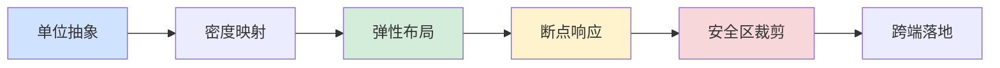
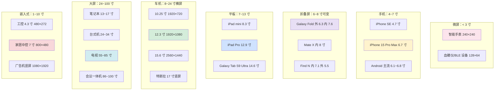
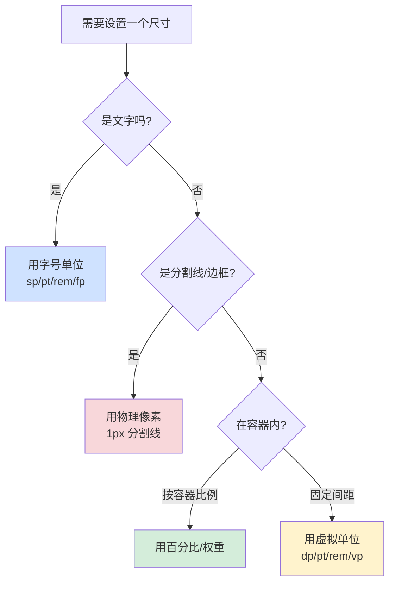
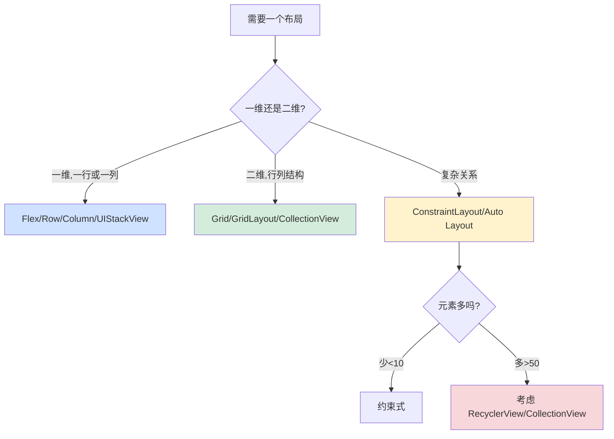
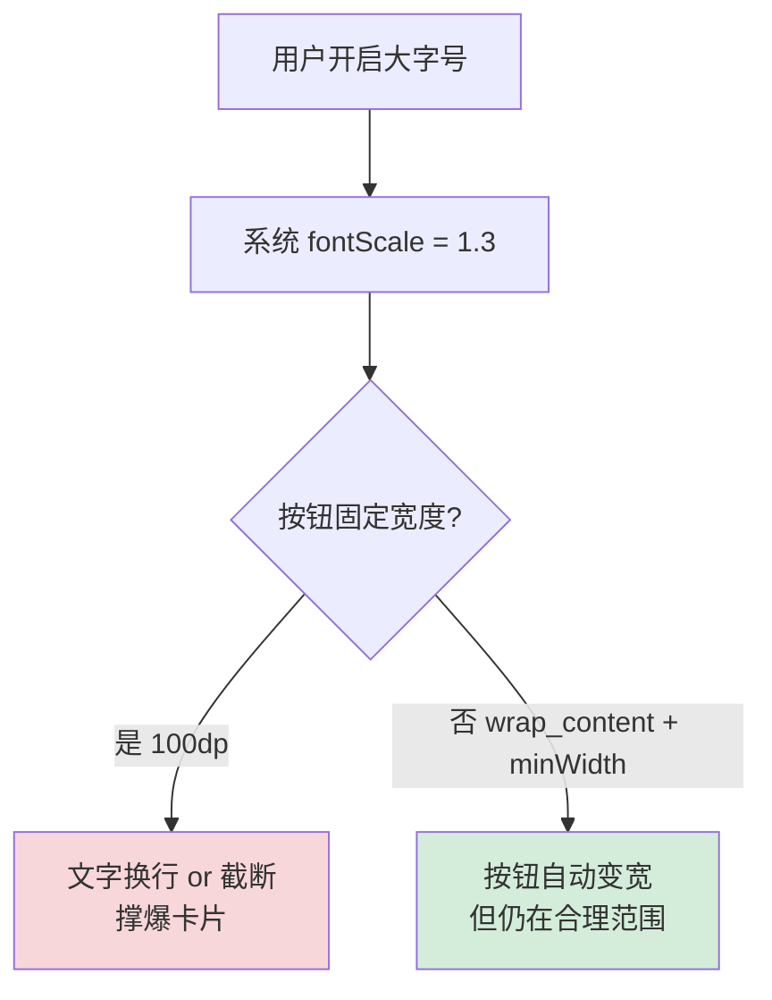

## 11.屏幕适配设计思想

🎯 **核心矛盾**：**"设计师只给了一张 375×812 的稿子" vs "真机世界有 300+ 种分辨率、10+ 种像素密度、5+ 种形态（手机/平板/折叠屏/横竖屏/异形屏/车机 IoT/嵌入式）、无数种 DPR"**——同一份代码要在 iPhone SE 5.4 寸小屏、iPad Pro 12.9 寸大屏、华为 Mate X 折叠屏、比亚迪车机 15.6 寸横屏、200×200 的智能手表、480×272 的工控屏上都"看起来合理"，本质是把「像素 · 密度 · 尺寸 · 形态 · 安全区 · 字号」六个变量从代码里彻底解耦

🧭 **设计灵魂**：所有平台的屏幕适配本质都是**「基准坐标系 + 单位抽象 + 密度映射 + 弹性布局 + 断点响应 + 安全区裁剪」六层协议**——区别只在「基准由谁定」（设计稿 / 系统 / 开发者）、「单位如何转换」（编译期 / 运行期 / CSS 引擎）、「布局怎么弹」（约束 / Flex / Grid / 网格系统）、「断点粒度多细」（3 档 / 5 档 / 无级）

🌐 **跨平台覆盖**：Android(dp/sp/资源限定符/ConstraintLayout/WindowSizeClass) · iOS(pt/Auto Layout/Size Class/SafeArea) · Web(px/rem/vw/vh/媒体查询/CSS Grid/Container Query) · Flutter(logical pixel/MediaQuery/LayoutBuilder) · 鸿蒙(vp/fp/栅格) · 桌面(Qt HighDPI/DPI 感知) · 车机大屏(720p~4K 多分辨率) · 折叠屏(Posture / Hinge Angle) · 嵌入式(固定分辨率 + 缩放矩阵 + LVGL)

💡 **通用心智**：忘掉具体平台的 API，记住一句话——**屏幕适配 = 「基准 + 单位 + 密度 + 弹性 + 断点 + 安全区」六段流水线**。Android 的 dp、iOS 的 pt、Web 的 rem、Flutter 的 logical pixel、鸿蒙的 vp 都只是"虚拟像素单位"这同一件事在不同平台的落地。

- [11.屏幕适配设计思想](#11屏幕适配设计思想)
- [1.真实事故引入](#1真实事故引入)
  - [1.1 一张 375 设计稿的血案](#11-一张-375-设计稿的血案)
  - [1.2 提测后的 8 条 bug 单](#12-提测后的-8-条-bug-单)
  - [1.3 灵魂三问](#13-灵魂三问)
  - [1.4 五个递进追问](#14-五个递进追问)
  - [1.5 探索路径](#15-探索路径)
  - [1.6 为何值得讲透](#16-为何值得讲透)
- [2.屏幕适配本质](#2屏幕适配本质)
  - [2.1 像素、点、密度独立像素](#21-像素点密度独立像素)
  - [2.2 DPR/DPI/PPI 三个绕人概念](#22-dprdpippi-三个绕人概念)
  - [2.3 物理像素 vs 逻辑像素](#23-物理像素-vs-逻辑像素)
  - [2.4 为何设计稿基准是 375](#24-为何设计稿基准是-375)
  - [2.5 屏幕形态谱系](#25-屏幕形态谱系)
  - [2.6 六层协议模型](#26-六层协议模型)
  - [2.7 一句话适配本质](#27-一句话适配本质)
- [3.单位系统设计](#3单位系统设计)
  - [3.1 为何需要虚拟单位](#31-为何需要虚拟单位)
  - [3.2 Android dp/sp 的换算](#32-android-dpsp-的换算)
  - [3.3 iOS pt 的一致性哲学](#33-ios-pt-的一致性哲学)
  - [3.4 Web px/em/rem/vw/vh](#34-web-pxemremvwvh)
  - [3.5 Flutter logical pixel](#35-flutter-logical-pixel)
  - [3.6 鸿蒙 vp/fp](#36-鸿蒙-vpfp)
  - [3.7 单位选择决策树](#37-单位选择决策树)
- [4.密度分级与资源匹配](#4密度分级与资源匹配)
  - [4.1 Android 密度分级](#41-android-密度分级)
  - [4.2 iOS @1x @2x @3x](#42-ios-1x-2x-3x)
  - [4.3 Web srcset 与 image-set](#43-web-srcset-与-image-set)
  - [4.4 矢量图的救赎](#44-矢量图的救赎)
  - [4.5 资源查找回退链](#45-资源查找回退链)
- [5.弹性布局设计](#5弹性布局设计)
  - [5.1 命令式布局的适配陷阱](#51-命令式布局的适配陷阱)
  - [5.2 约束式布局](#52-约束式布局)
  - [5.3 弹性盒 Flex](#53-弹性盒-flex)
  - [5.4 网格 Grid](#54-网格-grid)
  - [5.5 百分比与权重](#55-百分比与权重)
  - [5.6 五种布局选型决策](#56-五种布局选型决策)
- [6.断点与响应式](#6断点与响应式)
  - [6.1 为何需要断点](#61-为何需要断点)
  - [6.2 Web 媒体查询](#62-web-媒体查询)
  - [6.3 Android WindowSizeClass](#63-android-windowsizeclass)
  - [6.4 iOS Size Class](#64-ios-size-class)
  - [6.5 Flutter LayoutBuilder](#65-flutter-layoutbuilder)
  - [6.6 断点粒度的取舍](#66-断点粒度的取舍)
- [7.字体与图标适配](#7字体与图标适配)
  - [7.1 字号的三种来源](#71-字号的三种来源)
  - [7.2 老年模式与动态字体](#72-老年模式与动态字体)
  - [7.3 中英混排的行高陷阱](#73-中英混排的行高陷阱)
  - [7.4 图标的三种适配策略](#74-图标的三种适配策略)
- [8.横竖屏与旋转](#8横竖屏与旋转)
  - [8.1 旋转的生命周期代价](#81-旋转的生命周期代价)
  - [8.2 平板横屏的双栏范式](#82-平板横屏的双栏范式)
  - [8.3 车机的横屏优先](#83-车机的横屏优先)
  - [8.4 何时禁止旋转](#84-何时禁止旋转)
- [9.实战·Android 屏幕适配](#9实战android-屏幕适配)
  - [9.1 从 Nexus 5 到 Pixel 8 Pro](#91-从-nexus-5-到-pixel-8-pro)
  - [9.2 主流机型分辨率矩阵](#92-主流机型分辨率矩阵)
  - [9.3 平板矩阵](#93-平板矩阵)
  - [9.4 dp 换算与 smallestWidth 限定符](#94-dp-换算与-smallestwidth-限定符)
  - [9.5 ConstraintLayout 实战范式](#95-constraintlayout-实战范式)
  - [9.6 WindowSizeClass 三档实战](#96-windowsizeclass-三档实战)
  - [9.7 折叠屏与异形屏 API](#97-折叠屏与异形屏-api)
  - [9.8 状态栏/导航栏/手势区处理](#98-状态栏导航栏手势区处理)
  - [9.9 Android 适配的 5 个坑](#99-android-适配的-5-个坑)
- [10.实战·iOS 屏幕适配](#10实战ios-屏幕适配)
  - [10.1 从 iPhone 4 到 iPhone 15 Pro Max](#101-从-iphone-4-到-iphone-15-pro-max)
  - [10.2 iPhone 全机型矩阵](#102-iphone-全机型矩阵)
  - [10.3 iPad 矩阵](#103-ipad-矩阵)
  - [10.4 pt 与 @1x @2x @3x](#104-pt-与-1x-2x-3x)
  - [10.5 Auto Layout + Size Class 实战](#105-auto-layout--size-class-实战)
  - [10.6 SafeArea 与灵动岛](#106-safearea-与灵动岛)
  - [10.7 iPad 双栏（Split View）](#107-ipad-双栏split-view)
  - [10.8 Dynamic Type 与无障碍](#108-dynamic-type-与无障碍)
  - [10.9 iOS 适配的 5 个坑](#109-ios-适配的-5-个坑)
- [11.实战·Web 屏幕适配](#11实战web-屏幕适配)
  - [11.1 从 320px 到 4K 显示器](#111-从-320px-到-4k-显示器)
  - [11.2 主流断点选型](#112-主流断点选型)
  - [11.3 rem + 根字号方案](#113-rem--根字号方案)
  - [11.4 flexible.js 老方案与新替代](#114-flexiblejs-老方案与新替代)
  - [11.5 CSS Grid + Container Query 现代方案](#115-css-grid--container-query-现代方案)
  - [11.6 viewport meta 与 1px 边框](#116-viewport-meta-与-1px-边框)
  - [11.7 高清屏图片方案](#117-高清屏图片方案)
  - [11.8 桌面 vs 移动 vs H5 内嵌](#118-桌面-vs-移动-vs-h5-内嵌)
  - [11.9 小程序 rpx 单位](#119-小程序-rpx-单位)
  - [11.10 Web 适配的 5 个坑](#1110-web-适配的-5-个坑)
- [12.实战·嵌入式-车机-大屏](#12实战嵌入式-车机-大屏)
  - [12.1 嵌入式典型分辨率](#121-嵌入式典型分辨率)
  - [12.2 固定分辨率 + 缩放矩阵](#122-固定分辨率--缩放矩阵)
  - [12.3 车机屏矩阵](#123-车机屏矩阵)
  - [12.4 车机横屏优先与副驾娱乐屏](#124-车机横屏优先与副驾娱乐屏)
  - [12.5 CarPlay 与 Android Auto 投屏](#125-carplay-与-android-auto-投屏)
  - [12.6 智能家居屏](#126-智能家居屏)
  - [12.7 广告机与数字标牌](#127-广告机与数字标牌)
  - [12.8 工控 HMI 屏](#128-工控-hmi-屏)
  - [12.9 嵌入式 Qt / LVGL 的 DPI 感知](#129-嵌入式-qt--lvgl-的-dpi-感知)
  - [12.10 车机大屏的 5 个坑](#1210-车机大屏的-5-个坑)
- [13.经典陷阱与反模式](#13经典陷阱与反模式)
  - [13.1 硬编码 px 撑爆布局](#131-硬编码-px-撑爆布局)
  - [13.2 单位混用](#132-单位混用)
  - [13.3 用屏幕宽度判断设备类型](#133-用屏幕宽度判断设备类型)
  - [13.4 忽略安全区](#134-忽略安全区)
  - [13.5 死磕设计稿等比缩放](#135-死磕设计稿等比缩放)
  - [13.6 字号放大不预留空间](#136-字号放大不预留空间)
  - [13.7 忘记横屏](#137-忘记横屏)
  - [13.8 Bitmap 代替矢量图](#138-bitmap-代替矢量图)
  - [13.9 忽略状态栏遮挡](#139-忽略状态栏遮挡)
  - [13.10 分屏模式隐藏 Bug](#1310-分屏模式隐藏-bug)
- [14.总结](#14总结)
  - [14.1 三层认知阶梯](#141-三层认知阶梯)
  - [14.2 多设备项目决策清单](#142-多设备项目决策清单)
  - [14.3 八字真言](#143-八字真言)
  - [14.4 跨端术语对照](#144-跨端术语对照)
  - [14.5 与本卷承接](#145-与本卷承接)

---

## 1.真实事故引入

### 1.1 一张 375 设计稿的血案

一款教育类 App，设计师按 iPhone X 尺寸（375×812 pt）出了完整的设计稿，工程师照着 1:1 实现。设计评审、开发自测、内部体验都通过，直到提交测试才是灾难的开始。

测试同学手里有一台**测试机架**：iPhone SE / iPhone 15 Pro Max / iPad Pro / Galaxy Fold / OPPO Find N / 华为 Mate 60（异形屏）/ 一台老人机（打开老年模式字号放大）/ 一台车机模拟器（1920×720 横屏）/ 一个 4K 显示器上的 Web 端。

结果就是——**同一份代码，8 种设备，8 个 bug**。

### 1.2 提测后的 8 条 bug 单

| # | 机型 | 现象 | 根因 |
|---|-----|------|------|
| 1 | iPhone SE (375×667) | 底部两个按钮被 Home 键遮挡 | 布局用了绝对定位，未考虑 SafeArea |
| 2 | iPhone 15 Pro Max (430×932) | 卡片右侧空出巨大留白，视觉稀薄 | 卡片宽度写死 343pt，未按屏宽弹性伸缩 |
| 3 | iPad Pro (1024×1366) | 按钮飘在中间，两侧一片空白 | 未做平板双栏，把手机布局直接放大 |
| 4 | Galaxy Fold 内屏 (2208×1768) | 字号看着比手机还小 | 未按 WindowSizeClass 断点放大字号 |
| 5 | 华为 Mate 60 异形屏 | 顶部通知栏被刘海遮挡 | 未处理 DisplayCutout |
| 6 | 老年模式（字号放大 1.3×） | 按钮文字换行、卡片撑爆 | 按钮固定宽度、未预留字号膨胀空间 |
| 7 | 车机 (1920×720 横屏) | 顶部空白一大片、按钮小如蚂蚁 | 按 375 竖屏基准布局，没有横屏适配 |
| 8 | 4K 显示器 Web (3840×2160) | 元素细如毛发、根本看不清 | 用了 px 而非 rem/vw，屏幕越大字越小 |

**老板的灵魂三问**（周会现场原话）：

> 1. 我们不是按设计稿 1:1 还原的吗，怎么这么多问题？
> 2. 是不是加个"自动缩放"就能全解决？
> 3. 别的 App 到底怎么做的——他们买了 300 台真机来测试？

这三个问题，是所有初中级工程师踩过的坑。

### 1.3 灵魂三问

我把这次事故复盘后，追问三个更本质的问题：

**1. "屏幕适配"到底适的是什么？只是尺寸吗？**——尺寸只是变量之一，密度、形态、安全区、字号、方向、DPR 每一个都能让代码翻车。

**2. 为什么设计师给 375，工程师就得写 375？375 这个数字从哪里来？**——历史遗产（iPhone 6/7/8 是 375pt），并不是"天经地义"。基准可以是 360、375、414、750、其他。

**3. 为什么 Android 用 dp、iOS 用 pt、Web 用 rem，看起来五花八门，实际上是不是同一件事？**——是。都是"虚拟像素单位"，一层抽象把物理像素和逻辑坐标解耦。

### 1.4 五个递进追问

要把"屏幕适配"讲透，需要递进回答：

1. **像素、点、密度独立像素（dp）到底什么关系？为什么发明这么多单位？**——从"物理像素"到"逻辑像素"的抽象层。
2. **同一张 100dp 的图片，为什么 xxxhdpi 屏要 400×400 的 PNG？**——密度分级的资源匹配机制。
3. **为什么用 ConstraintLayout / Auto Layout / Flex 就能"自适应"，而绝对定位就是灾难？**——弹性布局的核心思想。
4. **为什么 iPad 上不能"简单放大"手机布局，必须做双栏？**——断点响应的必要性，人的视觉舒适距离决定信息密度。
5. **为什么车机 12 寸、智能手表 1.5 寸、工控屏 4.3 寸，这些"非手机"设备的适配思路和手机完全不同？**——形态谱系导致设计范式跃迁。

### 1.5 探索路径



### 1.6 为何值得讲透

我想抛三个问题：

**1. 为什么"屏幕适配"永远学不完？**——因为设备形态在持续演化。2007 年只有 iPhone，2010 年出 iPad，2012 年出 4:3 到 16:9 过渡，2017 年出全面屏 + 刘海，2019 年出折叠屏，2022 年出灵动岛，2024 年出卷轴屏。**每一代新形态都在挑战既有适配思想**。

**2. 为什么屏幕适配和国际化是"双胞胎"？**——一个管**文化差异**（语言/日期/RTL），一个管**硬件差异**（尺寸/密度/形态）。都是"最后一公里"，都是**把不稳定变量从代码里剥离**。你会发现两篇的"五/六层协议模型"结构一模一样。

**3. 为什么系统 API（ConstraintLayout / Auto Layout / Intl）能省 90% 的坑，但还有工程师坚持用绝对定位？**——不知道这些 API 存在的心智负担，不知道**设备形态是持续演化的**。写死一次 = 每次新形态出来都要重写一次。

读完本章你会懂：**屏幕适配不是"让手机 App 在平板上放大 2 倍"，它是一套贯穿产品设计、工程实现、多端 QA 的系统工程**，每个环节都有自己的物理约束和跨设备取舍。

---

## 2.屏幕适配本质

### 2.1 像素、点、密度独立像素

**物理像素（Physical Pixel, px）**：屏幕上真实存在的一个发光点，硬件规格，永远不变。

- iPhone 15 Pro Max 屏幕物理像素 = 1290×2796 个真实光点

**逻辑像素（Logical Pixel / Point / dp / vp）**：代码里用的抽象单位，与物理像素之间存在一个换算因子。

- iPhone 15 Pro Max 逻辑像素 = 430×932 pt
- 换算因子 = 1290/430 = 3（即 @3x）

**为什么发明这个抽象层？**

```
如果代码里直接写物理像素：
  按钮宽 200px

  iPhone 4（326 ppi）：200px = 61 mm，一个手指头能盖住 ✓
  iPhone 4S 视网膜（326 ppi 双倍分辨率）：物理宽 640px，但 200px 只有 31 mm
     → 按钮变小一半！

如果代码里写逻辑像素：
  按钮宽 100pt

  iPhone 4：100pt × 1 = 100px  → 视觉上 30 mm
  iPhone 4S：100pt × 2 = 200px → 视觉上 30 mm（一样大）
  iPhone 15 Pro：100pt × 3 = 300px → 视觉上 30 mm（还是一样大）
```

**逻辑像素的定义**：**在肉眼看起来大小一致**，无论屏幕多高清。

这就是所有平台"虚拟单位"的共同底座——**把"视觉大小"从"物理像素"里解耦**。

### 2.2 DPR/DPI/PPI 三个绕人概念

这三个词经常被混用，其实是**三件事**：

| 缩写 | 全称 | 含义 | 场景 |
|-----|------|------|------|
| **PPI** | Pixels Per Inch | 每英寸物理像素数（硬件参数） | 屏幕硬件规格表 |
| **DPI** | Dots Per Inch | 每英寸点数（历史概念，源自打印机） | Android 系统 API 沿用 |
| **DPR** | Device Pixel Ratio | 物理像素 / 逻辑像素 | Web / iOS 前端常用 |

**关系公式**：

```
DPR ≈ PPI / 160
  （Android 基准：160 dpi 时 1dp = 1px）

DPR = 物理像素宽 / 逻辑像素宽
  例：iPhone 15 Pro = 1179px / 393pt = 3

密度类别（Android）：
  ldpi   ≈ 120 dpi   DPR≈0.75
  mdpi   = 160 dpi   DPR=1.0    ← 基准
  hdpi   ≈ 240 dpi   DPR=1.5
  xhdpi  ≈ 320 dpi   DPR=2.0
  xxhdpi ≈ 480 dpi   DPR=3.0
  xxxhdpi≈ 640 dpi   DPR=4.0
```

**为什么 160 是基准？**——2008 年第一代 Android 手机 HTC Dream，屏幕 3.2 寸 320×480，算下来正好 165 ppi，四舍五入取 160 作为"1dp = 1px"的基准。这个数字从此**统治了 Android 10 多年**。

### 2.3 物理像素 vs 逻辑像素

来看具体机型的对照，感受"抽象层"的威力：

| 机型 | 物理像素 | 逻辑像素（pt/dp） | DPR | 屏幕对角线 |
|-----|---------|-------------------|-----|-----------|
| iPhone SE (3rd) | 750×1334 | 375×667 | @2x | 4.7 寸 |
| iPhone 15 | 1179×2556 | 393×852 | @3x | 6.1 寸 |
| iPhone 15 Pro Max | 1290×2796 | 430×932 | @3x | 6.7 寸 |
| Pixel 8 Pro | 1344×2992 | 448×997 dp | 3.0 | 6.7 寸 |
| Xiaomi 14 Pro | 1440×3200 | 411×914 dp | 3.5 | 6.73 寸 |
| iPad Pro 12.9 | 2048×2732 | 1024×1366 | @2x | 12.9 寸 |
| Galaxy Fold 6 外屏 | 968×2376 | 344×845 dp | 2.81 | 6.3 寸 |
| Galaxy Fold 6 内屏 | 2160×1856 | 771×662 dp | 2.8 | 7.6 寸 |

**观察**：不同机型的"逻辑像素宽度"从 344 dp 到 1024 pt 差距 3 倍，如果代码写死"375"，任何非 375 屏幕都会翻车。

### 2.4 为何设计稿基准是 375

**iPhone 6 (2014) 上市后统治了 5 年**，尺寸 375×667 pt，设计师习惯了这个基准。到今天：

- iOS 设计基准：**375 pt 或 390 pt**（iPhone 15 系列）
- Android 设计基准：**360 dp 或 375 dp**（现代设计规范）
- 电商 H5 设计基准：**750 px**（iPhone 6 的物理像素，@2x 稿）
- 小程序设计基准：**750 rpx**（等价于 375 pt）
- 车机大屏：**1920 px 横屏**（720p/1080p 横屏基准）
- 平板：**1024 pt**（iPad 竖屏）
- 车载 HUD：**480×272 px**（工控屏基准）

**关键认识**：**基准不是天理，是历史遗产 + 工程约定**。团队约定用什么基准都可以，重要的是**约定后所有人遵守同一个基准**。

**给一线工程师的实践建议**：

```
新项目开工三方约定：
  1. 手机竖屏基准 → 建议 375（iOS 通用）或 360（Android 通用）
  2. 平板基准 → 建议 1024 pt / 800 dp
  3. Web 移动端 → 建议 375 px 稿，rem 或 vw 转换
  4. Web PC 端 → 建议 1440 px 稿（大屏笔记本）
  5. 车机 → 建议 1920×720 或 1920×1080 横屏
```

### 2.5 屏幕形态谱系

**"手机 + 平板"只是屏幕世界的冰山一角**。真实的形态谱系：



**观察三条规律**：

1. **屏幕越小，信息密度越低**（手表只放 1-2 条信息，平板放 4-6 列）
2. **屏幕越大，人的视距越远**（手机 30 cm、平板 40 cm、电视 3 米、大屏会议 5 米），字号必须按视距放大
3. **形态越特殊，交互范式越独立**（车机横屏 + 手套操作 + 语音优先，和手机完全不同）

**这决定了本篇 4 章实战（Android/iOS/Web/嵌入式）都会花大篇幅讲机型矩阵**——脱离具体设备的适配讨论是空中楼阁。

### 2.6 六层协议模型

任何屏幕适配系统都遵循同样的 6 层协议，本篇最值得贴在 IDE 旁边的"适配通用名片"：

```
通用屏幕适配六层协议（跨端共享）：

   ┌─────────────────────────────────────────┐
   │ 1. 基准坐标系                              │
   │   ├─ 设计稿基准（375/360/750）              │
   │   └─ 输出：可映射的坐标空间                   │
   └────────────────────┬───────────────────┘
                        ▼
   ┌─────────────────────────────────────────┐
   │ 2. 单位抽象                                │
   │   ├─ dp / pt / rem / vp / logical pixel   │
   │   └─ 输出：视觉一致的虚拟像素                 │
   └────────────────────┬───────────────────┘
                        ▼
   ┌─────────────────────────────────────────┐
   │ 3. 密度映射                                │
   │   ├─ @1x/@2x/@3x, ldpi~xxxhdpi           │
   │   └─ 输出：不同密度屏的真实像素资源            │
   └────────────────────┬───────────────────┘
                        ▼
   ┌─────────────────────────────────────────┐
   │ 4. 弹性布局                                │
   │   ├─ 约束 / Flex / Grid / 权重             │
   │   └─ 输出：随尺寸伸缩的 UI 骨架               │
   └────────────────────┬───────────────────┘
                        ▼
   ┌─────────────────────────────────────────┐
   │ 5. 断点响应                                │
   │   ├─ WindowSizeClass / 媒体查询            │
   │   └─ 输出：不同尺寸档的不同布局范式            │
   └────────────────────┬───────────────────┘
                        ▼
   ┌─────────────────────────────────────────┐
   │ 6. 安全区裁剪                              │
   │   ├─ SafeArea / Insets / DisplayCutout   │
   │   └─ 输出：避开异形/刘海/状态栏的最终 UI       │
   └─────────────────────────────────────────┘
```

**这六层在六端的对应名词**：

| 层 | Android | iOS | Web | Flutter | 鸿蒙 | 嵌入式(LVGL) |
|-----|---------|-----|-----|---------|------|-------------|
| **1.基准** | 设计稿约定 | 设计稿约定 | 设计稿约定 | 设计稿约定 | 设计稿约定 | 编译期宏 |
| **2.单位** | dp / sp | pt | rem / vw / px | logical pixel | vp / fp | px（真实） |
| **3.密度** | mdpi~xxxhdpi | @1x @2x @3x | image-set / srcset | 3.0x/2.0x AssetBundle | 密度桶 | 无（固定） |
| **4.布局** | ConstraintLayout | Auto Layout | Flex/Grid | Row/Column/Flex | Flex/Grid | 绝对定位 |
| **5.断点** | WindowSizeClass | Size Class | 媒体查询 | LayoutBuilder | 一多能力 | 无 |
| **6.安全区** | WindowInsets | SafeAreaLayoutGuide | env(safe-area-inset-*) | MediaQuery.padding | expandSafeArea | 无 |

**这套协议的「跨端不变量」**：

1. **基准是约定，不是天理**——团队定好 375 或 360，全体遵守。
2. **单位必须虚拟**——写 px 就是自杀。
3. **资源按密度分级**——同一张图不同密度不同精度。
4. **布局必须弹性**——绝对定位就是灾难。
5. **断点必须响应**——手机布局 ≠ 平板 ≠ 车机。
6. **安全区必须裁**——刘海、水滴、灵动岛、圆角、手势区，一个都不能碰。

### 2.7 一句话适配本质

> **屏幕适配 = 「基准 + 单位 + 密度 + 弹性 + 断点 + 安全区」六段流水线**
>
> Android 的 dp、iOS 的 pt、Web 的 rem 都只是"虚拟像素单位"这同一件事在不同平台的落地。

**给所有应用开发者的总记忆**：

不论你在做 Android、iOS、Web、Flutter、嵌入式 UI，还是车机大屏，**用户看到的每一个像素都必经这 6 层协议**。学会这套抽象，下次遇到"设计稿变了"、"新增机型"、"新形态设备"，你能精准说出"漏在哪一层"，而不是"反正就是要重写一遍"。

---

## 3.单位系统设计

### 3.1 为何需要虚拟单位

**没有虚拟单位的世界**（假设代码里全用物理像素）：

```
按钮宽 200 px

设备 A（100 ppi 老显示器）：视觉宽 2 寸 ✓
设备 B（300 ppi 手机）：视觉宽 0.67 寸 ✗（太小按不到）
设备 C（500 ppi 高清手机）：视觉宽 0.4 寸 ✗（更小）
```

**结论**：物理像素**无法度量"视觉大小"**。屏幕越高清，同一个 px 越小。

**引入虚拟单位（dp/pt/rem）**，视觉大小恒定：

```
按钮宽 100 dp

任何屏幕：
  自动换算成"视觉一致"的物理像素
  → 用户看到的按钮永远是同一个大小
```

**每个平台都有自己的虚拟单位**，但**思想完全一致**。

### 3.2 Android dp/sp 的换算

**dp（density-independent pixel，密度独立像素）**：

```
公式：px = dp × (dpi / 160)

设备 mdpi（160）：1 dp = 1 px
设备 hdpi（240）：1 dp = 1.5 px
设备 xhdpi（320）：1 dp = 2 px
设备 xxhdpi（480）：1 dp = 3 px
设备 xxxhdpi（640）：1 dp = 4 px
```

**sp（scale-independent pixel，缩放独立像素）**：

```
sp 是 dp 的变种，专为字体设计
  px = sp × (dpi / 160) × fontScale

区别：
  dp 不受"字体缩放设置"影响
  sp 受影响（老年模式字号放大 = fontScale 变 1.3）

规则：
  文字 → 用 sp（尊重用户设置）
  非文字 → 用 dp（视觉一致）
```

**为什么这样设计？** 让老年模式、无障碍字号放大对文字生效但不炸掉图标布局。

**Android 系统怎么算？** 运行时读 `DisplayMetrics.density` 做换算：

```kotlin
val density = context.resources.displayMetrics.density
val pxFromDp = dp * density  // dp 转 px

val scaledDensity = context.resources.displayMetrics.scaledDensity
val pxFromSp = sp * scaledDensity  // sp 转 px（含 fontScale）
```

**Android 8.0+ 已推荐用 `TypedValue.applyDimension` 精确换算**：

```kotlin
val px = TypedValue.applyDimension(
    TypedValue.COMPLEX_UNIT_DP,
    100f,  // 100dp
    resources.displayMetrics
)
```

### 3.3 iOS pt 的一致性哲学

**pt（point，点）**：

```
iOS 的 pt 是"由苹果统一定义"的虚拟单位
  1 pt = @1x/@2x/@3x 屏上分别是 1px / 2px / 3px

设计哲学：
  设计师和工程师用同一套 pt 单位
  资源提供 @1x @2x @3x 三份
  运行时根据机型自动选择
```

**为什么 iOS 没有类似 Android 的 sp？** 

- iOS 用 **Dynamic Type**（动态字体）解决无障碍字号问题
- 系统在 5 档字号（xSmall ~ Accessibility5）中切换，App 声明使用 preferredFontFor:textStyle 会自动响应

```swift
// ✅ 用 preferred font，尊重系统字号
label.font = UIFont.preferredFont(forTextStyle: .body)

// ❌ 写死字号，无视用户设置
label.font = UIFont.systemFont(ofSize: 17)
```

**苹果的一致性哲学**：

```
1. 全局只有 pt 一个单位（图标/文字/间距全用 pt）
2. 字号缩放由系统统一管理（Dynamic Type）
3. 资源提供 @1x/@2x/@3x 三档，代码不感知
4. Auto Layout 内置 SafeArea、Layout Margins、Readable Content Guide
```

**这就是"iOS 适配比 Android 简单"的核心原因**——苹果把复杂度封到系统里了。

### 3.4 Web px/em/rem/vw/vh

**Web 是所有平台中"单位最丰富"的**，因为它要跨手机 / 平板 / PC / 4K 显示器：

| 单位 | 定义 | 使用场景 |
|-----|------|---------|
| **px** | CSS 像素（不是物理像素！） | 边框、阴影、绝对定位 |
| **em** | 相对于父元素字号 | 组件内相对间距 |
| **rem** | 相对于根元素（html）字号 | 全局响应式布局的主力 |
| **%** | 相对于父元素同属性 | 宽度百分比 |
| **vw** | 视口宽度的 1% | 全屏组件、H5 |
| **vh** | 视口高度的 1% | 全屏组件、首屏 |
| **vmin/vmax** | vw 和 vh 的最小/最大值 | 横竖屏兼容 |
| **svh/lvh/dvh** | 小/大/动态视口高度 | 移动端浏览器工具栏动态适配 |

**CSS 像素 vs 物理像素**：

```
CSS px 是一个"逻辑单位"，浏览器内部换算：
  移动端浏览器：1 CSS px ≠ 1 物理像素
  由 viewport meta 和 DPR 共同决定

iPhone 15 Pro（DPR = 3）：
  html { font-size: 16px }
  实际渲染 = 16 × 3 = 48 物理像素

所以 Web 的 "px" 其实等价于 iOS 的 pt、Android 的 dp
```

**rem 方案的经典用法**：

```css
/* 根字号按屏幕宽度动态计算 */
html { font-size: calc(100vw / 3.75); }
/* 375px 屏时，1rem = 100px */

.card {
    width: 3.43rem;   /* = 343px on 375 屏 */
    padding: 0.16rem; /* = 16px on 375 屏 */
}
```

**postcss-px-to-viewport 插件方案**（现代主流）：

```css
/* 源码写 px，构建时自动转 vw */
.card {
    width: 343px;    /* 编译后 → width: 91.467vw */
    padding: 16px;   /* 编译后 → padding: 4.267vw */
}
```

### 3.5 Flutter logical pixel

**Flutter 用 "logical pixel"**（等价于 iOS 的 pt / Android 的 dp）：

```dart
Container(
    width: 100,   // 100 逻辑像素
    height: 50,   // 50 逻辑像素
)
```

**运行时通过 MediaQuery 查设备信息**：

```dart
final size = MediaQuery.of(context).size;
final dpr = MediaQuery.of(context).devicePixelRatio;
final textScale = MediaQuery.of(context).textScaleFactor;

// size 就是 logical pixel 尺寸
// dpr 就是物理像素倍率
```

**Flutter 的字号缩放**，通过 textScaleFactor：

```dart
Text(
    "Hello",
    style: TextStyle(fontSize: 16),
    // 系统会自动 × textScaleFactor
)

// 关闭系统缩放（不建议，除非有充分理由）
MediaQuery(
    data: MediaQuery.of(context).copyWith(textScaleFactor: 1.0),
    child: Text("Fixed size"),
)
```

**flutter_screenutil 三方库**（国内团队常用），让 Flutter 也支持"设计稿基准"：

```dart
// 初始化设计稿基准（375×812）
ScreenUtil.init(context, designSize: Size(375, 812));

// 使用
Container(
    width: 100.w,   // 按屏宽等比缩放
    height: 50.h,   // 按屏高等比缩放
    padding: EdgeInsets.all(16.r),  // 按最小边等比缩放
    child: Text("Hi", style: TextStyle(fontSize: 14.sp)),
)
```

**争议**：flutter_screenutil 是"等比缩放"，与 Material Design 的"弹性布局"思想相悖。**平板上直接放大手机布局会显得奇怪**，只推荐用于**纯手机 App**。

### 3.6 鸿蒙 vp/fp

**HarmonyOS 的单位设计**：

| 单位 | 全称 | 对应关系 |
|-----|------|---------|
| **px** | 物理像素 | 底层，不直接用 |
| **vp** | virtual pixel | 等价于 Android dp |
| **fp** | font pixel | 等价于 Android sp，随字号缩放 |
| **lpx** | logical pixel（栅格用） | 屏宽 / 720 |

**鸿蒙的"一多"能力**——同一份 ArkUI 代码运行在手机 / 折叠屏 / 平板 / PC / 智慧屏五端：

```typescript
// 通过断点系统响应式布局
Column() {
    Text('Content')
        .fontSize({ 'sm': 14, 'md': 16, 'lg': 18 })  // 断点响应
}
.width('100%')
.padding({ 'sm': 8, 'md': 16, 'lg': 24 })
```

### 3.7 单位选择决策树



**三条铁律**：

1. **文字用字号单位**——sp / pt / rem / fp，尊重用户字号偏好
2. **分割线用物理像素**——0.5dp / 1px 才能画出真正的 1 物理像素线
3. **其他一律用虚拟单位**——dp / pt / rem / vp / logical pixel

---

## 4.密度分级与资源匹配

**§1.4 第二题答案**：为什么同一张 100dp 的图片，xxxhdpi 屏要 400×400 的 PNG？——**图片是位图，缩放会糊**。

### 4.1 Android 密度分级

```
资源目录：
res/
├── drawable-mdpi/    ← 160 dpi（基准）, 1x
│   └── icon.png (24×24)
├── drawable-hdpi/    ← 240 dpi, 1.5x
│   └── icon.png (36×36)
├── drawable-xhdpi/   ← 320 dpi, 2x
│   └── icon.png (48×48)
├── drawable-xxhdpi/  ← 480 dpi, 3x
│   └── icon.png (72×72)
└── drawable-xxxhdpi/ ← 640 dpi, 4x
    └── icon.png (96×96)
```

**代码里只用一份**：

```xml
<ImageView 
    android:layout_width="24dp"
    android:layout_height="24dp"
    android:src="@drawable/icon" />
```

**系统运行时按屏幕密度选择对应目录**——xxhdpi 屏加载 72×72 的 PNG，缩放到 24dp 显示，视觉上和 mdpi 屏一样大但更清晰。

**为什么要提供 5 档而不是一档？**

```
方案 A：只提供 xxxhdpi 的 96×96 图
  低密度屏（mdpi）：系统缩小 4 倍 → 消耗 CPU、内存浪费
  
方案 B：只提供 mdpi 的 24×24 图
  高密度屏（xxxhdpi）：系统放大 4 倍 → 图片糊、马赛克
  
方案 C：提供 5 档
  ✓ 每档都是原生分辨率，不糊不浪费
  × 包体积膨胀 5 倍
  
方案 D（推荐）：提供 xhdpi + xxhdpi 两档
  覆盖 95% 现代 Android 设备
  低端机走 xhdpi 缩小、高端机走 xxhdpi
  包体积平衡
```

### 4.2 iOS @1x @2x @3x

**iOS 只有 3 档**：

```
Assets.xcassets/
└── icon.imageset/
    ├── Contents.json
    ├── icon.png      (24×24, @1x, 已废弃)
    ├── icon@2x.png   (48×48, iPhone SE 类)
    └── icon@3x.png   (72×72, iPhone Pro 类)
```

**代码里就一句**：

```swift
imageView.image = UIImage(named: "icon")
```

**运行时按机型选**：

- iPhone SE (@2x) → 加载 @2x
- iPhone 15 Pro (@3x) → 加载 @3x
- iPad Pro (@2x) → 加载 @2x

**iOS 简化的原因**：**苹果控制硬件**，屏幕密度只有 3 档，永远不用担心"新增密度分级"。Android 生态硬件多样，5 档还只是"够用"。

### 4.3 Web srcset 与 image-set

**Web 的高清屏图片方案**，两条路：

**路线 1：HTML srcset**

```html

    srcset="icon.png 1x, 
            icon@2x.png 2x, 
            icon@3x.png 3x"
    alt="icon" />
```

**路线 2：CSS image-set**

```css
.icon {
    background-image: url('icon.png');  /* 兜底 */
    background-image: image-set(
        url('icon.png') 1x,
        url('icon@2x.png') 2x,
        url('icon@3x.png') 3x
    );
}
```

**响应式图片的 picture 元素**（结合断点 + 密度）：

```html
<picture>
    <!-- 大屏 4K，加载超高清版 -->
    <source media="(min-width: 1920px)" srcset="hero-4k.jpg">
    <!-- 平板 -->
    <source media="(min-width: 768px)" srcset="hero-tablet.jpg 1x, hero-tablet@2x.jpg 2x">
    <!-- 手机 -->
    
</picture>
```

### 4.4 矢量图的救赎

**位图问题的终极解药——矢量图**。矢量图存的是"几何指令"（画一个圆、画一条线），而非"像素点阵"，任意缩放都清晰。

**跨端矢量图格式**：

| 平台 | 矢量图格式 |
|-----|-----------|
| Android | VectorDrawable (XML) |
| iOS | PDF / SVG (iOS 13+) |
| Web | SVG |
| Flutter | flutter_svg 三方库 |
| 鸿蒙 | SVG |

**Android VectorDrawable 示例**：

```xml
<!-- res/drawable/ic_star.xml -->
<vector xmlns:android="http://schemas.android.com/apk/res/android"
    android:width="24dp"
    android:height="24dp"
    android:viewportWidth="24"
    android:viewportHeight="24">
    <path
        android:fillColor="#FFC107"
        android:pathData="M12,2L15,9L22,9L17,14L19,22L12,18L5,22L7,14L2,9L9,9Z"/>
</vector>
```

- 只有一份文件，跨密度全清晰
- 文件小（几百字节 vs 几十 KB）
- 支持代码染色（tint）

**矢量图的适用范围**：

```
✓ 图标、Logo、简单图形
✓ 单色/纯色/渐变
× 复杂照片（信息量太大，无法用几何描述）
× 大量细节的插画（SVG 文件会很大）
```

**折中方案**——**图片用 WebP**（高压缩），**图标用 SVG/VectorDrawable**（可缩放）。

### 4.5 资源查找回退链

Android 的资源查找类似国际化——按密度回退：

```
用户设备 xhdpi（DPR=2）

查找顺序：
  1. drawable-xhdpi/     ← 精确匹配 ✓
  2. drawable-xxhdpi/    ← 高一档缩小（清晰不糊）
  3. drawable-xxxhdpi/   
  4. drawable-hdpi/      ← 低一档放大（会糊）
  5. drawable-mdpi/
  6. drawable/           ← 默认（未指定密度）
```

**设计规则**：

```
1. 优先向高密度回退（缩小不糊）
2. 其次向低密度回退（放大会糊，只作兜底）
3. drawable/（无限定符）作为最终兜底
```

**iOS 没有回退链**——直接按 @1x/@2x/@3x 精确匹配，找不到就崩溃或用兜底。

---

## 5.弹性布局设计

**§1.4 第三题答案**：为什么 ConstraintLayout / Auto Layout / Flex 能"自适应"，绝对定位就是灾难？——**因为屏幕尺寸不确定，只有"关系"才是稳定的**。

### 5.1 命令式布局的适配陷阱

**命令式布局**（老 iOS 的 Frame 布局、Web 的 position: absolute）：

```swift
// ❌ 命令式：写死坐标
button.frame = CGRect(x: 100, y: 500, width: 200, height: 44)
```

**后果**：

```
iPhone 8 (375×667)：按钮居中偏下 ✓
iPhone 15 Pro Max (430×932)：按钮偏左，下面留白 ✗
iPad (1024×1366)：按钮飘在左上角 ✗
横屏：按钮跑到屏幕外 ✗
```

**根因**：坐标是"绝对"的，屏幕尺寸一变就翻车。

### 5.2 约束式布局

**核心思想**：不写"位置"，写"关系"。

**Android ConstraintLayout**：

```xml
<androidx.constraintlayout.widget.ConstraintLayout
    android:layout_width="match_parent"
    android:layout_height="match_parent">

    <Button
        android:id="@+id/btn_confirm"
        android:layout_width="wrap_content"
        android:layout_height="wrap_content"
        android:text="确认"
        app:layout_constraintStart_toStartOf="parent"
        app:layout_constraintEnd_toEndOf="parent"
        app:layout_constraintBottom_toBottomOf="parent"
        android:layout_marginBottom="24dp" />
</androidx.constraintlayout.widget.ConstraintLayout>
```

- 按钮"水平居中"（Start 和 End 都对齐 parent）
- 按钮"距底部 24dp"
- **无论屏幕多大，关系恒定** ✓

**iOS Auto Layout**：

```swift
NSLayoutConstraint.activate([
    button.centerXAnchor.constraint(equalTo: view.centerXAnchor),
    button.bottomAnchor.constraint(equalTo: view.safeAreaLayoutGuide.bottomAnchor, constant: -24),
    button.widthAnchor.constraint(greaterThanOrEqualToConstant: 120),
])
```

**约束式布局的三大威力**：

1. **弹性伸缩**：屏幕变宽，按钮自动跟着变宽
2. **多机型免适配**：SE、Pro Max、iPad 都是同一份代码
3. **横竖屏切换**：约束关系不变，自动重排

### 5.3 弹性盒 Flex

**Flex 布局**是 CSS/Web 提出、后被 React Native、Flutter、鸿蒙、微信小程序全盘采用的**跨端标准布局模型**。

**Web CSS Flex**：

```css
.container {
    display: flex;
    flex-direction: row;      /* 主轴方向 */
    justify-content: space-between;  /* 主轴对齐 */
    align-items: center;       /* 交叉轴对齐 */
    gap: 16px;                 /* 子元素间距 */
}

.item {
    flex: 1;                   /* 平分剩余空间 */
    min-width: 100px;          /* 最小宽度 */
    max-width: 300px;          /* 最大宽度 */
}
```

**Flutter Row/Column（本质就是 Flex）**：

```dart
Row(
    mainAxisAlignment: MainAxisAlignment.spaceBetween,
    crossAxisAlignment: CrossAxisAlignment.center,
    children: [
        Expanded(flex: 1, child: Widget1()),
        SizedBox(width: 16),
        Expanded(flex: 2, child: Widget2()),
    ],
)
```

**Flex 布局的核心概念**：

```
主轴（Main Axis）：flex-direction 决定
交叉轴（Cross Axis）：垂直于主轴

主轴对齐：justify-content
  flex-start / center / flex-end / space-between / space-around / space-evenly

交叉轴对齐：align-items
  flex-start / center / flex-end / stretch / baseline

子元素弹性：flex
  flex: 1        → 平分空间
  flex: 2        → 占 2 份空间
  flex: 0 0 200px → 固定 200px
```

**为什么 Flex 全端通吃？**

- 一维布局（行或列）表达力强
- 主轴 + 交叉轴心智简单
- 弹性收缩规则清晰
- 从 CSS 到原生（Android FlexboxLayout、iOS UIStackView）都有实现

### 5.4 网格 Grid

**Grid 布局是二维（行 × 列）的，Flex 是一维的**。

**Web CSS Grid**：

```css
.container {
    display: grid;
    grid-template-columns: 1fr 2fr 1fr;   /* 三列，中间占 2 份 */
    grid-template-rows: auto 1fr auto;     /* 三行，中间弹性 */
    gap: 16px;
}

.header { grid-column: 1 / -1; }   /* 横跨所有列 */
.sidebar { grid-row: 2 / 3; }
```

**响应式 Grid**（不用媒体查询就能自适应）：

```css
.gallery {
    display: grid;
    grid-template-columns: repeat(auto-fill, minmax(200px, 1fr));
    /* 每列至少 200px，能放几列就几列 */
}
```

- 手机（375px 宽）→ 显示 1 列
- 平板（768px）→ 显示 3 列  
- PC（1440px）→ 显示 7 列
- **无需断点** ✓

**Android GridLayout**：

```xml
<GridLayout
    android:columnCount="3"
    android:layout_width="match_parent"
    android:layout_height="wrap_content">
    <!-- 子元素按顺序填入 3 列 -->
</GridLayout>
```

**iOS UICollectionView + FlowLayout**：

```swift
let layout = UICollectionViewFlowLayout()
layout.itemSize = CGSize(width: 100, height: 100)
layout.minimumInteritemSpacing = 16
```

### 5.5 百分比与权重

**Android LinearLayout 的 weight**：

```xml
<LinearLayout
    android:orientation="horizontal"
    android:weightSum="3">
    <View android:layout_width="0dp" android:layout_weight="1" />  <!-- 1/3 -->
    <View android:layout_width="0dp" android:layout_weight="2" />  <!-- 2/3 -->
</LinearLayout>
```

**Web 百分比**：

```css
.left { width: 30%; }
.right { width: 70%; }
```

**权重和百分比适用于"内部瓜分空间"**，但不建议大规模用：

- 嵌套深了后计算复杂
- 遇到边界情况（内容溢出、最小宽度冲突）难调试
- 现代替代是 Flex/Grid

### 5.6 五种布局选型决策



**跨端选型清单**：

| 需求 | Android | iOS | Web | Flutter |
|-----|---------|-----|-----|---------|
| 一维排列 | LinearLayout / FlexboxLayout | UIStackView | Flex | Row / Column |
| 二维网格 | GridLayout | UICollectionView | Grid | GridView |
| 复杂关系 | ConstraintLayout | Auto Layout | Grid+Flex | Stack + Positioned |
| 列表滚动 | RecyclerView | UITableView / UICollectionView | overflow: scroll | ListView |
| 瀑布流 | StaggeredGridLayoutManager | UICollectionView + Custom Layout | CSS columns / Masonry | flutter_staggered_grid_view |

---

## 6.断点与响应式

**§1.4 第四题答案**：为什么 iPad 上不能简单"放大"手机布局？——**因为人的视觉舒适距离决定信息密度，屏幕大了 3 倍不等于按钮大 3 倍就好用**。

### 6.1 为何需要断点

**"按屏幕比例缩放"的失败**：

```
手机 375px 宽：按钮 100px = 26.6% 宽 → 视觉合适
iPad 1024px 宽：等比放大 = 273px 按钮 → 视觉巨大、按不准
```

**"完全一样"的失败**：

```
iPad 1024px 宽：按钮 100px = 9.7% 宽 → 视觉小、周围空白
```

**正确解**——**按屏幕尺寸档次切换不同布局范式**：

```
手机（<600dp）：单栏布局，全屏显示一个页面
平板（600-840dp）：双栏布局，左侧列表 + 右侧详情
PC（>840dp）：三栏布局，边栏 + 列表 + 详情
```

这就是"响应式设计（Responsive Design）"的核心思想——**不同断点用不同布局，不是缩放**。

### 6.2 Web 媒体查询

**媒体查询（Media Query）是响应式的鼻祖**：

```css
/* 手机（默认） */
.container { flex-direction: column; }

/* 平板 */
@media (min-width: 768px) {
    .container { 
        flex-direction: row;
        gap: 24px;
    }
}

/* PC */
@media (min-width: 1440px) {
    .container { max-width: 1200px; }
}

/* 大屏 */
@media (min-width: 1920px) {
    .container { font-size: 18px; }
}
```

**媒体查询的六大维度**：

```css
/* 宽度 */
@media (min-width: 768px) { }
@media (max-width: 767px) { }

/* 高度 */
@media (min-height: 600px) { }

/* 方向 */
@media (orientation: landscape) { }
@media (orientation: portrait) { }

/* DPR（高清屏） */
@media (-webkit-min-device-pixel-ratio: 2) { }
@media (min-resolution: 2dppx) { }

/* 深色模式 */
@media (prefers-color-scheme: dark) { }

/* 无障碍 */
@media (prefers-reduced-motion: reduce) { }
```

**现代 CSS Container Query**（2023 Chrome 105+ 支持）——**按容器大小响应，而非视口**：

```css
.card-container {
    container-type: inline-size;
    container-name: card;
}

@container card (min-width: 400px) {
    .card { display: flex; }
}
```

- 组件本身响应，不依赖屏幕
- 组件可以拖动、嵌入不同容器，都能自适应
- 未来响应式的方向

### 6.3 Android WindowSizeClass

**Google 2021 推出的官方响应式方案**，把窗口尺寸分 3 档：

| 类别 | 宽度 | 典型设备 |
|-----|------|---------|
| **Compact** | < 600 dp | 手机竖屏、折叠屏折叠态 |
| **Medium** | 600-840 dp | 平板竖屏、大手机横屏、折叠屏展开 |
| **Expanded** | > 840 dp | 平板横屏、桌面窗口、大屏车机 |

**代码使用**：

```kotlin
@Composable
fun App() {
    val windowSize = calculateWindowSizeClass(activity)
    
    when (windowSize.widthSizeClass) {
        WindowWidthSizeClass.Compact -> PhoneLayout()
        WindowWidthSizeClass.Medium -> TabletLayout()
        WindowWidthSizeClass.Expanded -> DesktopLayout()
    }
}
```

**三档布局范式**：

```
Compact（手机）：
  单栏、Bottom Navigation、全屏页面
  
Medium（平板竖屏）：
  Nav Rail（侧栏）、Master-Detail 或单栏可切换
  
Expanded（平板横屏/桌面）：
  Nav Drawer（永久展开）、多栏、Master-Detail 常驻
```

**折叠屏的处理**：Fold 展开后从 Compact → Medium/Expanded，App 应自动响应布局切换。

### 6.4 iOS Size Class

**iOS 的 Size Class 只有 2 档**：

```
水平（horizontal）：
  Regular（宽屏，如 iPad、iPhone Pro Max 横屏）
  Compact（窄屏，如所有 iPhone 竖屏）
  
垂直（vertical）：
  Regular（高，如竖屏）
  Compact（矮，如手机横屏）
```

**组合**：

```
(Compact, Regular)  → iPhone 竖屏
(Compact, Compact)  → iPhone 横屏（除 Pro Max）
(Regular, Compact)  → iPhone Pro Max 横屏
(Regular, Regular)  → iPad 竖 / 横屏
```

**代码判断**：

```swift
override func viewWillTransition(to size: CGSize, with coordinator: UIViewControllerTransitionCoordinator) {
    super.viewWillTransition(to: size, with: coordinator)
    coordinator.animate { context in
        self.updateLayout(for: self.traitCollection)
    }
}

func updateLayout(for traits: UITraitCollection) {
    switch (traits.horizontalSizeClass, traits.verticalSizeClass) {
    case (.regular, _):
        setupTabletLayout()  // 双栏
    case (.compact, _):
        setupPhoneLayout()   // 单栏
    default: break
    }
}
```

**SwiftUI 的现代方案**：

```swift
struct ContentView: View {
    @Environment(\.horizontalSizeClass) var hSize
    
    var body: some View {
        if hSize == .regular {
            NavigationSplitView { /* 双栏 */ }
        } else {
            NavigationStack { /* 单栏 */ }
        }
    }
}
```

### 6.5 Flutter LayoutBuilder

**Flutter 的响应式主要靠 `LayoutBuilder` + `MediaQuery`**：

```dart
class ResponsiveLayout extends StatelessWidget {
    @override
    Widget build(BuildContext context) {
        return LayoutBuilder(
            builder: (context, constraints) {
                if (constraints.maxWidth < 600) {
                    return PhoneLayout();
                } else if (constraints.maxWidth < 840) {
                    return TabletLayout();
                } else {
                    return DesktopLayout();
                }
            },
        );
    }
}
```

**优势**：`LayoutBuilder` 按**父容器**尺寸响应，天然支持组件级响应（类似 Container Query）。

### 6.6 断点粒度的取舍

**断点越多越好吗？** 不是。

```
2 档（手机/平板）：
  实现简单
  平板和 PC 用同一布局，PC 大屏太空

3 档（手机/平板/PC）：
  Material Design 官方推荐
  覆盖 95% 场景

5 档（手机/大手机/小平板/大平板/PC）：
  Bootstrap / Tailwind 的选择
  Web 项目更细腻

7+ 档：
  过度设计，维护地狱
  代码分叉太多，测试成本爆炸
```

**推荐**：

- 手机 App：**2 档**（手机、平板）
- Web 项目：**3-5 档**
- 车机/大屏项目：**独立布局**（不与手机共享代码）

---

## 7.字体与图标适配

### 7.1 字号的三种来源

字号最终大小由**三个变量**决定：

```
最终字号 = 设计稿字号 × 系统字体缩放 × 无障碍缩放

举例（iOS）：
  设计稿：17 pt
  用户在"设置"里选了"大号字"：+2 档 = ×1.15
  开了"辅助功能字号":+3 档 = ×1.3
  
  最终 = 17 × 1.15 × 1.3 = 25.4 pt
```

**关键决策**：**尊重用户选择**，还是**统一固定字号**？

```
✅ 尊重用户（推荐）：
  用 sp / Dynamic Type / rem
  老年人、视障用户能读
  代价：布局必须弹性，字号变大时不能撑爆
  
❌ 固定字号：
  用 dp / px 写死
  设计稿"完美复现"
  代价：老年模式下用户看不清，投诉一堆
```

### 7.2 老年模式与动态字体

**Android 老年模式**——系统"字体大小"设置：

```
系统设置 → 显示 → 字体大小 → 小/默认/大/超大
对应 fontScale：0.85 / 1.0 / 1.15 / 1.3

sp 单位自动响应，dp 不响应
```

**iOS Dynamic Type**：

```
系统设置 → 显示与亮度 → 文字大小 → 7 档
+ 辅助功能 → 显示与文字大小 → 更大字体 → 12 档

共 12 档，从 xSmall 到 accessibility5
```

**代码尊重 Dynamic Type**：

```swift
// ✅ 用 preferredFont
label.font = UIFont.preferredFont(forTextStyle: .body)
label.adjustsFontForContentSizeCategory = true

// SwiftUI 天然支持
Text("Hello").font(.body)  // 自动响应
```

**Web 尊重系统字号**：

```css
/* ✅ 用 rem，跟根字号联动 */
body { font-size: 1rem; }
h1 { font-size: 2rem; }

/* ❌ 写死 px */
h1 { font-size: 32px; }
```

**响应老年模式后的布局适配**：



**Android 的 AutoSize TextView**：

```xml
<TextView
    android:autoSizeTextType="uniform"
    android:autoSizeMinTextSize="12sp"
    android:autoSizeMaxTextSize="18sp"
    android:autoSizeStepGranularity="1sp"
    android:maxLines="1"
    android:text="确认支付" />
```

超出宽度时自动缩小字号，保证不换行。

### 7.3 中英混排的行高陷阱

**同字号，不同语言视觉大小不一样**：

```
14sp / 14pt：
  英文：紧凑舒适
  中文：紧凑舒适
  日文（含大量假名）：紧凑
  韩文（谚文）：紧凑
  阿拉伯文：字符高 → 行高需 +20%
  泰文（含上下堆叠元音）：紧凑 → 行高需 +40%
```

**跨端行高设置**：

| 平台 | 行高属性 |
|-----|---------|
| Android | `android:lineSpacingExtra` / `android:lineSpacingMultiplier` |
| iOS | `NSAttributedString.Key.paragraphStyle.minimumLineHeight` |
| Web | `line-height: 1.5` |
| Flutter | `TextStyle(height: 1.5)` |

**推荐经验值**：

- 中英混排：`line-height: 1.5`
- 纯中文：`line-height: 1.6`
- 泰文/阿拉伯文：`line-height: 1.8`

### 7.4 图标的三种适配策略

**策略 1：矢量图（推荐首选）**

- Android VectorDrawable、iOS SVG、Web SVG
- 一份文件通吃所有密度
- 支持代码染色

**策略 2：多倍图（Bitmap）**

- 只有当矢量图无法表达（复杂插画、渐变照片）时
- Android drawable-xxxhdpi/、iOS @2x/@3x

**策略 3：字体图标（Icon Font）**

- 像文字一样使用图标
- 可继承 color、font-size
- 主流库：Material Icons、Font Awesome、iconfont.cn

```html
<!-- 字体图标示例 -->
<i class="material-icons">star</i>
```

```dart
// Flutter 内置
Icon(Icons.star, size: 24, color: Colors.yellow);
```

**三策略对比**：

| 策略 | 文件大小 | 缩放清晰 | 代码染色 | 复杂图形 |
|-----|---------|---------|---------|---------|
| 矢量图 | 小（几百字节） | ✓ | ✓ | 一般 |
| 多倍图 | 中（几十 KB） | ✗ | ✗ | ✓ |
| 字体图标 | 极小（复用字体） | ✓ | ✓ | ✗ |

---

## 8.横竖屏与旋转

### 8.1 旋转的生命周期代价

**旋转屏幕不是"简单换个方向"**：

```
Android 竖屏 → 横屏（默认）：
  onPause → onStop → onDestroy → onCreate → onStart → onResume
  → Activity 被销毁重建
  → 未保存的状态全丢
```

**保存状态**：

```kotlin
override fun onSaveInstanceState(outState: Bundle) {
    outState.putString("input", editText.text.toString())
    super.onSaveInstanceState(outState)
}

override fun onCreate(savedInstanceState: Bundle?) {
    super.onCreate(savedInstanceState)
    savedInstanceState?.getString("input")?.let { editText.setText(it) }
}
```

**用 ViewModel 避免旋转丢数据**：

```kotlin
class MyViewModel : ViewModel() {
    val data = MutableLiveData<String>()
}

// Activity 中
val vm: MyViewModel by viewModels()
// Activity 重建，ViewModel 幸存
```

**iOS 的旋转处理**：

```swift
override func viewWillTransition(to size: CGSize, with coordinator: UIViewControllerTransitionCoordinator) {
    coordinator.animate { context in
        // 旋转动画同步执行
    } completion: { context in
        // 旋转完成
    }
}
```

- iOS 不销毁 ViewController，只是尺寸变化
- 比 Android 简单，但要手动调整 Auto Layout

### 8.2 平板横屏的双栏范式

**iPad 横屏的 Master-Detail 模式**：

```
| 列表 (Master) | 详情 (Detail) |
|      1/3      |     2/3       |
```

**iOS UISplitViewController**：

```swift
let split = UISplitViewController(style: .doubleColumn)
split.setViewController(masterVC, for: .primary)
split.setViewController(detailVC, for: .secondary)
```

**Android SlidingPaneLayout**：

```xml
<androidx.slidingpanelayout.widget.SlidingPaneLayout>
    <!-- 列表 -->
    <FrameLayout android:layout_width="300dp" />
    <!-- 详情 -->
    <FrameLayout android:layout_width="0dp" 
                 android:layout_weight="1" />
</androidx.slidingpanelayout.widget.SlidingPaneLayout>
```

**手机横屏是不是也做双栏？** 视场景：

```
✓ 视频播放：横屏全屏播放
✓ 游戏：横屏 UI
✗ 大多数 App：横屏就是"竖屏拉宽"，双栏太挤

结论：手机横屏一般不做双栏，只做视频/游戏专用横屏
```

### 8.3 车机的横屏优先

**车机屏幕 95%+ 是横屏**：

- 特斯拉 Model 3 中控：15 寸横屏
- 比亚迪汉：15.6 寸横屏 + 副驾娱乐屏
- 蔚来 ET7：12.8 寸横屏
- 理想 L9：15.7 寸横屏

**车机 App 设计范式**：

```
1. 横屏优先，甚至只做横屏
2. 3 栏布局（左：地图 / 中：主内容 / 右：控制）
3. 大字号、大按钮（司机分心风险）
4. 语音优先，视觉辅助
5. 深色模式默认（夜间不刺眼）
```

**注意**：车机 App 底层多数是 Android Automotive，用 Android 布局但**必须适配车规**（Google 有 Automotive UI Guidelines）。

### 8.4 何时禁止旋转

**禁止旋转的合理场景**：

```
✓ 支付页面（避免旋转打断流程）
✓ 视频播放（自己管理横屏切换）
✓ 相机（旋转会重建 SurfaceView）
✓ 游戏（自己管理方向）
```

**Android**：

```xml
<activity 
    android:name=".PayActivity"
    android:screenOrientation="portrait" />
```

**iOS**：

```swift
override var supportedInterfaceOrientations: UIInterfaceOrientationMask {
    return .portrait
}
```

**Web**：

```javascript
screen.orientation.lock('portrait').catch(() => {});
```

**禁止旋转的代价**：无障碍用户（手部残疾）可能需要横屏模式操作。**能不禁止就别禁止**。

---

## 9.实战·Android 屏幕适配

Android 生态碎片化严重，一线开发要面对 **20 多个厂商 × 5+ 密度 × 3+ 形态**。这一章我把真实工程经验落地。

### 9.1 从 Nexus 5 到 Pixel 8 Pro

**Android 屏幕十年演进**：

| 年份 | 代表机型 | 分辨率 | 逻辑像素 | DPR | 屏占比 |
|-----|---------|--------|---------|-----|-------|
| 2013 | Nexus 5 | 1080×1920 | 360×640 dp | 3.0 | 68% |
| 2015 | Nexus 6P | 1440×2560 | 411×731 dp | 3.5 | 71% |
| 2017 | Pixel 2 XL | 1440×2880 | 411×822 dp | 3.5 | 76% |
| 2019 | Pixel 4 | 1080×2280 | 393×830 dp | 2.75 | 79% |
| 2021 | Pixel 6 Pro | 1440×3120 | 411×891 dp | 3.5 | 89% |
| 2023 | Pixel 8 Pro | 1344×2992 | 448×997 dp | 3.0 | 89% |

**变化趋势**：屏宽从 360 → 448 dp，屏比从 16:9 → 20:9（更细长）。

### 9.2 主流机型分辨率矩阵

**国内主流机型逻辑像素宽度**（截至 2026 年）：

| 品牌 | 机型 | 逻辑宽 (dp) | 备注 |
|-----|------|-------------|------|
| **小米** | Xiaomi 14 | 393 | 主流基准 |
| 小米 | Xiaomi 14 Pro | 411 | |
| 小米 | Xiaomi 14 Ultra | 411 | |
| 小米 | Redmi K70 | 393 | |
| **华为** | Mate 60 | 424 | 异形挖孔 |
| 华为 | Mate 60 Pro | 424 | 异形+曲面 |
| 华为 | Mate X5（折叠） | 344/771 | 折叠切换 |
| 华为 | Pura 70 | 411 | |
| **OPPO** | Find X7 | 411 | |
| OPPO | Find N3（折叠） | 344/720 | |
| **vivo** | X100 Pro | 411 | |
| **三星** | Galaxy S24 | 384 | |
| 三星 | Galaxy S24 Ultra | 412 | |
| 三星 | Galaxy Fold 6（折叠） | 344/771 | |
| **一加** | OnePlus 12 | 411 | |

**观察**：主流手机屏宽集中在 **384~412 dp**，用 375 或 360 作为设计基准都能覆盖。

### 9.3 平板矩阵

| 品牌 | 机型 | 逻辑像素 | 尺寸 |
|-----|------|---------|------|
| **华为 MatePad** | MatePad 11 | 800×1280 dp | 11" |
| 华为 | MatePad Pro 12.6 | 872×1400 dp | 12.6" |
| **三星 Galaxy Tab** | Tab S9 | 800×1280 dp | 11" |
| 三星 | Tab S9 Ultra | 1024×1640 dp | 14.6" |
| **联想** | 小新 Pad Pro | 800×1200 dp | 11.5" |
| **小米** | Xiaomi Pad 6 | 800×1200 dp | 11" |
| **OPPO** | OPPO Pad 2 | 812×1200 dp | 11.6" |
| **vivo** | vivo Pad Air | 800×1280 dp | 11.5" |

**平板设计基准**：**800×1280 dp**（约 60% 平板都在这个尺寸）。

### 9.4 dp 换算与 smallestWidth 限定符

**smallestWidth（sw）限定符**——按屏幕最小边宽度分档：

```
res/
├── values/           ← 默认（手机竖屏）
├── values-sw600dp/   ← 最小边 ≥ 600dp（7寸平板竖屏、10寸平板均触发）
├── values-sw720dp/   ← 最小边 ≥ 720dp（10寸平板竖屏）
├── values-sw840dp/   ← 最小边 ≥ 840dp（大平板 / PC）
```

**尺寸资源分档**：

```xml
<!-- values/dimens.xml（手机） -->
<resources>
    <dimen name="card_padding">16dp</dimen>
    <dimen name="title_size">18sp</dimen>
</resources>

<!-- values-sw600dp/dimens.xml（平板） -->
<resources>
    <dimen name="card_padding">24dp</dimen>
    <dimen name="title_size">22sp</dimen>
</resources>
```

代码里直接引用 `@dimen/card_padding`，系统自动选。

### 9.5 ConstraintLayout 实战范式

**范式 1：屏幕宽的百分比宽度**：

```xml
<Button
    app:layout_constraintWidth_percent="0.8"
    app:layout_constraintStart_toStartOf="parent"
    app:layout_constraintEnd_toEndOf="parent" />
```

按钮宽度 = 屏宽 × 80%，屏宽变化时按钮自动跟随。

**范式 2：Guideline 辅助线**：

```xml
<androidx.constraintlayout.widget.Guideline
    android:id="@+id/guideline_horizontal"
    android:orientation="horizontal"
    app:layout_constraintGuide_percent="0.618" />
    <!-- 黄金分割线 -->

<ImageView
    app:layout_constraintTop_toTopOf="parent"
    app:layout_constraintBottom_toTopOf="@id/guideline_horizontal" />
```

图片上半部分（黄金比例），文字下半部分。

**范式 3：Barrier 屏障**：

```xml
<androidx.constraintlayout.widget.Barrier
    android:id="@+id/barrier_start"
    app:barrierDirection="end"
    app:constraint_referenced_ids="label1,label2,label3" />

<TextView
    app:layout_constraintStart_toEndOf="@id/barrier_start"/>
```

Barrier 取多个视图的"最大边界"，用于多语言下 label 宽度不一致的场景。

**范式 4：Chain 链式布局**：

```xml
<Button android:id="@+id/btn1"
    app:layout_constraintHorizontal_chainStyle="spread"
    app:layout_constraintStart_toStartOf="parent"
    app:layout_constraintEnd_toStartOf="@id/btn2" />

<Button android:id="@+id/btn2"
    app:layout_constraintStart_toEndOf="@id/btn1"
    app:layout_constraintEnd_toStartOf="@id/btn3" />

<Button android:id="@+id/btn3"
    app:layout_constraintStart_toEndOf="@id/btn2"
    app:layout_constraintEnd_toEndOf="parent" />
```

三个按钮等距分布，屏宽变化时间距自动调整。

### 9.6 WindowSizeClass 三档实战

**Compose 中的响应式**：

```kotlin
@Composable
fun App() {
    val windowSize = calculateWindowSizeClass(activity = LocalActivity.current)
    
    when (windowSize.widthSizeClass) {
        WindowWidthSizeClass.Compact -> {
            // 手机：底部导航 + 单栏
            Scaffold(bottomBar = { BottomNav() }) { PhoneContent() }
        }
        WindowWidthSizeClass.Medium -> {
            // 平板竖屏：侧栏 Nav Rail
            Row {
                NavigationRail { /* ... */ }
                TabletContent()
            }
        }
        WindowWidthSizeClass.Expanded -> {
            // 平板横屏 / PC：抽屉常驻 + 双栏
            PermanentNavigationDrawer(drawerContent = { /* ... */ }) {
                Row {
                    MasterList(modifier = Modifier.weight(1f))
                    DetailPane(modifier = Modifier.weight(2f))
                }
            }
        }
    }
}
```

**传统 View 系统的响应**：用 `res/layout-sw600dp/` 提供不同布局文件。

### 9.7 折叠屏与异形屏 API

**折叠屏——Jetpack WindowManager**：

```kotlin
val windowInfoTracker = WindowInfoTracker.getOrCreate(this)
lifecycleScope.launch {
    windowInfoTracker.windowLayoutInfo(this@MainActivity)
        .collect { info ->
            val fold = info.displayFeatures
                .filterIsInstance<FoldingFeature>()
                .firstOrNull()
            
            when (fold?.state) {
                FoldingFeature.State.FLAT -> {
                    // 完全展开
                }
                FoldingFeature.State.HALF_OPENED -> {
                    // 半折状态（如笔记本模式）
                    // 上半屏视频、下半屏控制
                }
                else -> { /* 正常展开或折叠 */ }
            }
        }
}
```

**异形屏——DisplayCutout API（Android 9+）**：

```kotlin
val decorView = window.decorView
decorView.setOnApplyWindowInsetsListener { view, insets ->
    val cutout = insets.displayCutout
    cutout?.let {
        val topInset = it.safeInsetTop      // 刘海高度
        val leftInset = it.safeInsetLeft    // 左侧异形
        val rightInset = it.safeInsetRight  // 右侧异形
        // 调整布局避开
    }
    insets
}
```

**华为异形屏 API**（HuaweiHelper）：

```java
// 华为特有 API 提前处理刘海
NotchScreenManager.getInstance().setDisplayInNotch(this);
```

**沉浸式全屏（Edge to Edge）**：

```kotlin
WindowCompat.setDecorFitsSystemWindows(window, false)
window.statusBarColor = Color.TRANSPARENT
```

App 内容延伸到状态栏和导航栏下面，需要手动处理 SafeArea。

### 9.8 状态栏/导航栏/手势区处理

**Android 系统栏三种模式**：

```
1. 传统模式（App 内容不覆盖系统栏）
   status_bar_height 20dp（默认）or 24dp（异形屏）
   nav_bar_height 48dp（三键）or 24dp（手势）
   
2. Immersive Sticky（沉浸式全屏，用户滑边缘唤出栏）
   
3. Edge-to-Edge（Material 推荐，2024+ 主流）
   App 铺满全屏，通过 Insets 让内容避开
```

**Insets API 实战**：

```kotlin
ViewCompat.setOnApplyWindowInsetsListener(rootView) { view, windowInsets ->
    val insets = windowInsets.getInsets(
        WindowInsetsCompat.Type.systemBars() or 
        WindowInsetsCompat.Type.displayCutout()
    )
    view.updatePadding(
        top = insets.top,
        bottom = insets.bottom
    )
    WindowInsetsCompat.CONSUMED
}
```

**手势导航区（gestures inset）**——底部手势条不能被误触：

```kotlin
val gestureInsets = windowInsets.getInsets(WindowInsetsCompat.Type.mandatorySystemGestures())
// 底部 24dp 是手势区，App 底部按钮避开
```

### 9.9 Android 适配的 5 个坑

**坑 1：华为异形屏刘海**

- 现象：状态栏被刘海遮住一半
- 修复：`android:windowLayoutInDisplayCutoutMode="shortEdges"` + 手动处理 Insets

**坑 2：小米 MIUI 底部小白条**

- 现象：Bottom Navigation 被系统小白条挡住
- 修复：加 `paddingBottom = navigationBarInset`

**坑 3：三星 One UI 圆角屏切掉内容**

- 现象：卡片贴边被圆角切掉
- 修复：`android:layout_marginHorizontal="16dp"` 强制留边

**坑 4：折叠屏切换时 Activity 重建导致数据丢失**

- 修复：`android:configChanges="screenSize|screenLayout|orientation"` + ViewModel

**坑 5：老年模式字号放大后布局炸**

- 修复：所有 TextView 用 `wrap_content` + `maxLines`，配合 autoSize

---

## 10.实战·iOS 屏幕适配

**iOS 生态相对统一**（苹果控制硬件），但 iPhone SE 到 iPad Pro 也横跨 **4.7 寸到 12.9 寸**。

### 10.1 从 iPhone 4 到 iPhone 15 Pro Max

**iPhone 十六年演进**：

| 年份 | 机型 | 屏幕 | 逻辑像素 | 物理像素 | DPR |
|-----|------|------|---------|---------|-----|
| 2010 | iPhone 4 | 3.5" | 320×480 | 640×960 | @2x |
| 2014 | iPhone 6 | 4.7" | 375×667 | 750×1334 | @2x |
| 2014 | iPhone 6 Plus | 5.5" | 414×736 | 1080×1920（缩放） | @3x |
| 2017 | iPhone X | 5.8" | 375×812 | 1125×2436 | @3x |
| 2019 | iPhone 11 Pro Max | 6.5" | 414×896 | 1242×2688 | @3x |
| 2020 | iPhone 12 mini | 5.4" | 360×780 | 1080×2340 | @3x |
| 2022 | iPhone 14 Pro | 6.1" | 393×852 | 1179×2556 | @3x |
| 2023 | iPhone 15 Pro Max | 6.7" | 430×932 | 1290×2796 | @3x |
| 2024 | iPhone 16 Pro | 6.3" | 402×874 | 1206×2622 | @3x |

**关键节点**：

- **2014 iPhone 6**：屏幕宽从 320 → 375（第一次基准变化）
- **2017 iPhone X**：全面屏 + 刘海（SafeArea 出现）
- **2022 iPhone 14 Pro**：灵动岛（Dynamic Island）
- **2023 iPhone 15 Pro Max**：屏宽 → 430（第二次基准变化）

### 10.2 iPhone 全机型矩阵

**在售机型的逻辑像素**（2026 年）：

| 机型 | 屏宽 (pt) | 屏高 (pt) | 尺寸 |
|-----|-----------|-----------|------|
| iPhone SE (3rd) | 375 | 667 | 4.7" |
| iPhone 13 mini | 375 | 812 | 5.4" |
| iPhone 15 | 393 | 852 | 6.1" |
| iPhone 15 Plus | 430 | 932 | 6.7" |
| iPhone 15 Pro | 393 | 852 | 6.1" |
| iPhone 15 Pro Max | 430 | 932 | 6.7" |
| iPhone 16 | 393 | 852 | 6.1" |
| iPhone 16 Plus | 430 | 932 | 6.7" |
| iPhone 16 Pro | 402 | 874 | 6.3" |
| iPhone 16 Pro Max | 440 | 956 | 6.9" |

**观察**：屏宽跨度 375~440 pt，**用 375 或 390 做设计基准都合理**。

### 10.3 iPad 矩阵

| 机型 | 屏宽 (pt) | 屏高 (pt) | 尺寸 |
|-----|-----------|-----------|------|
| iPad mini (6th) | 744 | 1133 | 8.3" |
| iPad (10th) | 810 | 1080 | 10.9" |
| iPad Air 11 | 820 | 1180 | 11" |
| iPad Air 13 | 1024 | 1366 | 13" |
| iPad Pro 11 | 834 | 1194 | 11" |
| iPad Pro 13 | 1024 | 1366 | 13" |

**iPad 设计基准**：**1024×1366**（iPad Pro 13"，最大平板尺寸）。

**Split View 模式（分屏）**：

```
iPad Pro 12.9 横屏（1366pt 宽）：
  50/50 分屏 → 每半 683pt
  1/3 分屏（Slide Over）→ 主 App 981pt，副 App 375pt
  
→ 副 App 的 375pt 恰好等于 iPhone 尺寸，代码基本能复用
```

### 10.4 pt 与 @1x @2x @3x

**代码里全用 pt**：

```swift
button.frame = CGRect(x: 20, y: 100, width: 200, height: 44)
// 20pt, 100pt, 200pt, 44pt

// iPhone 15 Pro Max（@3x）：实际渲染 60px, 300px, 600px, 132px
// iPhone SE（@2x）：实际渲染 40px, 200px, 400px, 88px
```

**图片资源**（Assets.xcassets）：

```
avatar.imageset/
├── avatar.png       (24×24, @1x - 一般省略)
├── avatar@2x.png    (48×48, @2x)
└── avatar@3x.png    (72×72, @3x)
```

**Xcode 15+ 的 Symbol Image**：直接用 SF Symbol 图标，全矢量：

```swift
imageView.image = UIImage(systemName: "star.fill")
// 系统提供 4000+ 图标，全矢量
```

### 10.5 Auto Layout + Size Class 实战

**约束式布局的经典写法**：

```swift
// Programmatic Auto Layout
NSLayoutConstraint.activate([
    // 卡片距离屏幕边 16pt
    card.leadingAnchor.constraint(equalTo: view.safeAreaLayoutGuide.leadingAnchor, constant: 16),
    card.trailingAnchor.constraint(equalTo: view.safeAreaLayoutGuide.trailingAnchor, constant: -16),
    // 距顶部 20pt
    card.topAnchor.constraint(equalTo: view.safeAreaLayoutGuide.topAnchor, constant: 20),
    // 高度自适应内容，但最小 100
    card.heightAnchor.constraint(greaterThanOrEqualToConstant: 100),
])
```

**Size Class 差异化布局**：

```swift
class MyViewController: UIViewController {
    override func traitCollectionDidChange(_ previousTraitCollection: UITraitCollection?) {
        super.traitCollectionDidChange(previousTraitCollection)
        updateLayoutForCurrentTraits()
    }
    
    func updateLayoutForCurrentTraits() {
        if traitCollection.horizontalSizeClass == .regular {
            // iPad or iPhone Pro Max 横屏
            configureRegularLayout()
        } else {
            // iPhone 竖屏
            configureCompactLayout()
        }
    }
}
```

**SwiftUI 的优雅表达**：

```swift
struct ContentView: View {
    @Environment(\.horizontalSizeClass) var hSize
    
    var body: some View {
        Group {
            if hSize == .regular {
                NavigationSplitView {
                    SidebarView()
                } detail: {
                    DetailView()
                }
            } else {
                NavigationStack {
                    ListView()
                }
            }
        }
    }
}
```

### 10.6 SafeArea 与灵动岛

**SafeArea 是 iPhone X 引入的核心概念**——避开刘海、灵动岛、Home Indicator。

**UIKit**：

```swift
// 用 safeAreaLayoutGuide 而不是 view
button.bottomAnchor.constraint(
    equalTo: view.safeAreaLayoutGuide.bottomAnchor,
    constant: -20
).isActive = true
```

**SwiftUI**：

```swift
Text("Content")
    .padding(.bottom, 20)
    // 默认已避开 SafeArea

// 需要延伸到边缘时（如背景色）
Color.blue
    .ignoresSafeArea()
```

**灵动岛的适配**：

```
iPhone 15 Pro 灵动岛占用顶部约 122×36 pt
默认 SafeArea 已避开
但如果你要做全屏视频播放：
  - 横屏时灵动岛在左侧，视频可能被切
  - 需要手动处理，用 CGRect 计算可用区
```

**灵动岛 App 交互——Live Activity**：

```swift
// ActivityKit 提供灵动岛内容展示
struct DeliveryActivityAttributes: ActivityAttributes {
    struct ContentState: Codable, Hashable {
        var estimatedTime: String
    }
}
```

外卖、打车、直播、比赛比分类 App 强烈推荐用起来。

### 10.7 iPad 双栏（Split View）

**UISplitViewController 三栏模式**（iOS 14+）：

```swift
let split = UISplitViewController(style: .tripleColumn)
split.setViewController(sidebarVC, for: .primary)   // 侧栏
split.setViewController(listVC, for: .supplementary) // 列表
split.setViewController(detailVC, for: .secondary)   // 详情

// 手机上自动折叠为单栏 Push 导航
// iPad 竖屏自动折叠为双栏
// iPad 横屏三栏并排
```

**SwiftUI 的 NavigationSplitView**：

```swift
NavigationSplitView(columnVisibility: $columnVisibility) {
    List(items) { item in
        NavigationLink(item.title, value: item)
    }
} detail: {
    if let selected {
        DetailView(item: selected)
    } else {
        Text("Select an item")
    }
}
```

**iPad 多任务的三种模式**：

```
1. Slide Over：主 App 全屏 + 侧滑 App 375pt
2. Split View：50/50 或 30/70 分屏
3. Stage Manager（iPadOS 16+）：多窗口浮动
```

App 必须支持所有模式，否则被 App Store 拒审。

### 10.8 Dynamic Type 与无障碍

**Dynamic Type 12 档字号**：

```
xSmall (14pt body)
Small (15pt)
Medium (16pt)
Large (17pt) - Default
xLarge (19pt)
xxLarge (21pt)
xxxLarge (23pt)
Accessibility M (28pt)
Accessibility L (33pt)
Accessibility XL (40pt)
Accessibility XXL (47pt)
Accessibility XXXL (53pt)
```

**尊重用户设置**：

```swift
label.font = UIFont.preferredFont(forTextStyle: .body)
label.adjustsFontForContentSizeCategory = true
label.numberOfLines = 0  // 允许换行，避免撑爆
```

**SwiftUI**：

```swift
Text("Hello")
    .font(.body)  // 自动响应 Dynamic Type
    .lineLimit(nil)  // 允许无限行
```

**测试大字号**：

```
Xcode → Debug → View Debugging → Environment Overrides → Text
调 Accessibility XXXL 走查
```

### 10.9 iOS 适配的 5 个坑

**坑 1：iPhone 14 Pro 之后没适配灵动岛**

- 现象：顶部导航栏被灵动岛遮挡
- 修复：用 `safeAreaLayoutGuide.topAnchor`，绝不用 `view.topAnchor`

**坑 2：iPad 上按钮跟着屏宽放大**

- 现象：按钮 350pt 宽，占屏 1/3，视觉巨大
- 修复：用 `readableContentGuide` 或 `maxWidth: 400pt`

**坑 3：Dynamic Type 最大档下布局炸**

- 现象：Accessibility XXXL 下卡片文字换行 8 次，撑破屏幕
- 修复：允许多行 + 卡片可滚动 + AutoShrink

**坑 4：iPad Slide Over 模式下 App 尺寸错**

- 现象：Slide Over 时 App 变 375pt 宽，但代码判定为 iPad 模式
- 修复：用 `traitCollection.horizontalSizeClass` 而不是 `UIDevice.userInterfaceIdiom`

**坑 5：横屏时 SafeArea 左右也有 Insets**

- 现象：横屏时按钮贴到刘海上
- 修复：`safeAreaLayoutGuide.leadingAnchor`（不只是 top/bottom）

---

## 11.实战·Web 屏幕适配

Web 是所有平台中**尺寸跨度最大**的——从 320px 手机到 3840px 4K 屏，30 倍宽度差距。

### 11.1 从 320px 到 4K 显示器

**Web 常见视口宽度**（CSS px）：

| 类别 | 宽度 | 典型设备 |
|-----|------|---------|
| 超小手机 | 320 | iPhone 5 及以下 |
| 小手机 | 360 | 普通 Android |
| 主流手机 | 375 | iPhone 6/7/8/SE，H5 基准 |
| 大手机 | 414~430 | iPhone Pro Max |
| 折叠外屏 | 344 | Fold 折叠态 |
| 折叠内屏 | 720+ | Fold 展开态 |
| 小平板 | 768 | iPad mini |
| 主流平板 | 820 | iPad |
| 大平板 | 1024 | iPad Pro |
| 笔记本 | 1280~1440 | MacBook / Windows |
| 桌面 PC | 1920 | 主流 FHD |
| 高清 PC | 2560 | QHD |
| 4K 显示器 | 3840 | 4K UHD |

**关键认知**：**Web 不能只做一个尺寸**，必须响应式或做 3 套（手机 H5、平板、PC 桌面）。

### 11.2 主流断点选型

**Bootstrap 5 断点**：

```
xs: 0
sm: ≥576px
md: ≥768px
lg: ≥992px
xl: ≥1200px
xxl: ≥1400px
```

**Tailwind CSS 断点**：

```
sm: 640px
md: 768px
lg: 1024px
xl: 1280px
2xl: 1536px
```

**Material Design 断点**：

```
Compact: <600
Medium: 600-840
Expanded: 840-1200
Large: 1200-1600
XL: >1600
```

**Ant Design 断点**：

```
xs: <576
sm: ≥576
md: ≥768
lg: ≥992
xl: ≥1200
xxl: ≥1600
```

**观察**：主流都在 **5-6 档**，`768 / 1024 / 1440` 是三个"黄金分割点"。

**推荐给中小项目的极简 3 档**：

```css
/* 手机 */
.container { /* default */ }

/* 平板 */
@media (min-width: 768px) { .container { ... } }

/* PC */
@media (min-width: 1200px) { .container { max-width: 1200px; margin: 0 auto; } }
```

### 11.3 rem + 根字号方案

**核心思想**——**根字号 = 屏宽 / N**，所有子元素用 rem 相对根字号：

```html
<script>
    // 屏宽 / 3.75，让 1rem = 屏宽的 1%（375 屏时 = 100px）
    document.documentElement.style.fontSize = 
        (document.documentElement.clientWidth / 3.75) + 'px';
</script>
```

```css
.card {
    width: 3.43rem;      /* 375 屏 = 343px */
    padding: 0.16rem;    /* 375 屏 = 16px */
    font-size: 0.14rem;  /* 375 屏 = 14px */
}
```

**优势**：整站按屏宽等比缩放，视觉一致。

**缺陷**：字号也跟着缩放，4K 屏字变得极大。

**折中**：字号用 px，尺寸用 rem。

### 11.4 flexible.js 老方案与新替代

**flexible.js（阿里 2015 出品，已废弃）**：

```javascript
// 把屏幕分为 10 份，每份 = 1rem
(function flexible() {
    const docEl = document.documentElement;
    const dpr = window.devicePixelRatio || 1;
    
    function setRemUnit() {
        const rem = docEl.clientWidth / 10;
        docEl.style.fontSize = rem + 'px';
    }
    
    setRemUnit();
    window.addEventListener('resize', setRemUnit);
})();
```

**为何废弃**：

- 现代浏览器已完全支持 vw/vh
- 处理 1px 边框、字号缩放的逻辑过时
- 现代主流是 postcss-px-to-viewport

**postcss-px-to-viewport 新方案**：

```javascript
// postcss.config.js
module.exports = {
    plugins: {
        'postcss-px-to-viewport': {
            viewportWidth: 375,   // 设计稿基准
            unitPrecision: 5,
            viewportUnit: 'vw',
            selectorBlackList: ['.ignore'],
            minPixelValue: 1,
            mediaQuery: false
        }
    }
};
```

```css
/* 源码写 px */
.card { width: 343px; padding: 16px; }

/* 编译后 */
.card { width: 91.467vw; padding: 4.267vw; }
```

**优势**：设计师和工程师用同一套单位（px），构建期自动转换。

### 11.5 CSS Grid + Container Query 现代方案

**Grid 自动响应**——无需断点：

```css
.gallery {
    display: grid;
    grid-template-columns: repeat(auto-fill, minmax(200px, 1fr));
    gap: 16px;
}
```

**Container Query（2023 Chrome 105+）**——按父容器响应：

```css
.card-list {
    container-type: inline-size;
}

.card {
    padding: 16px;
}

@container (min-width: 500px) {
    .card {
        display: flex;
        padding: 24px;
    }
}
```

**优势**：组件复用性极强——同一个 Card 组件在小容器里紧凑显示、大容器里横向排列。

### 11.6 viewport meta 与 1px 边框

**viewport meta 是移动端 Web 的第一行代码**：

```html
<meta name="viewport" content="width=device-width, initial-scale=1.0, viewport-fit=cover">
```

- `width=device-width`：视口宽 = 设备逻辑宽（不然默认 980px）
- `initial-scale=1.0`：初始缩放 1
- `viewport-fit=cover`：内容延伸到刘海屏边缘（配合 env(safe-area-inset-*)）

**iPhone SafeArea 环境变量**：

```css
.footer {
    padding-bottom: env(safe-area-inset-bottom);
    /* iPhone X+ 上会自动加 34px 底部安全区 */
}
```

**1px 边框问题**——DPR=3 屏上 1px 实际渲染 3 物理像素，视觉上"粗"：

```css
/* ❌ 传统方案 */
.line { border-top: 1px solid #000; }
/* 视觉是 3px 粗 */

/* ✅ 方案 1：物理 1px */
@media (-webkit-min-device-pixel-ratio: 2) {
    .line { border-top: 0.5px solid #000; }
}

/* ✅ 方案 2：伪元素 + transform */
.line::after {
    content: '';
    display: block;
    height: 1px;
    background: #000;
    transform: scaleY(0.5);
    transform-origin: 0 0;
}

/* ✅ 方案 3：hairline（iOS 原生标准） */
.line { border-top: 1px solid rgba(0,0,0,0.5); }
```

### 11.7 高清屏图片方案

**方案 1：srcset**（前面已讲）

**方案 2：CSS image-set**（前面已讲）

**方案 3：现代格式 WebP/AVIF**：

```html
<picture>
    <source srcset="image.avif" type="image/avif">
    <source srcset="image.webp" type="image/webp">
    
</picture>
```

- AVIF 体积比 JPG 小 50%
- WebP 比 JPG 小 30%
- 自动降级到 JPG

**方案 4：CDN 动态图**：

```html

<!-- CDN 服务器按参数动态输出 -->
```

**方案 5：LQIP（Low Quality Image Placeholder）**：

```html
<!-- 小图先显示，大图后加载 -->

```

### 11.8 桌面 vs 移动 vs H5 内嵌

**Web 项目的四种形态**：

**形态 1：纯桌面 Web**

- 用户群：PC 用户
- 断点：1200 / 1440 / 1920
- 设计基准：1440 px
- 尺寸单位：px 就够

**形态 2：纯移动 H5**

- 用户群：手机浏览器 / 微信 / 支付宝
- 断点：不需要（都是手机）
- 设计基准：375 px（@2x 稿即 750 px）
- 尺寸单位：rem 或 vw

**形态 3：响应式 Web（自适应）**

- 一份代码通吃手机 / 平板 / PC
- 3 档断点（768 / 1024 / 1440）
- 需要为每档设计布局

**形态 4：App WebView 内嵌 H5**

- 承载 App 内的活动页、公告页
- 特点：需要与 App 通信（JSBridge）
- 需要处理 iOS SafeArea + Android 状态栏

**四种形态的选择**：

| 项目类型 | 推荐形态 |
|---------|---------|
| 电商官网 | 响应式 |
| 电商 App 内嵌活动 | 移动 H5 |
| SaaS 后台 | 桌面 Web |
| 企业官网 | 响应式 |
| 微信小程序 | 独立小程序 |

### 11.9 小程序 rpx 单位

**微信小程序 rpx**——把屏幕宽度均分为 750 份：

```
定义：750 rpx = 屏幕宽度

iPhone 6（375px）：1 rpx = 0.5px
iPhone 15 Pro Max（430px）：1 rpx = 0.573px
Android 常见（360px）：1 rpx = 0.48px
```

**优势**：设计师给 @2x 稿（750 宽），直接把 px 改成 rpx。

```wxml
<view style="width: 686rpx; padding: 32rpx; font-size: 28rpx;">
    <!-- 设计稿 686px 宽卡片、32px 内边距、28px 字号 -->
</view>
```

**支付宝小程序、字节小程序、京东小程序**都采用同样的 rpx 概念（有些叫 rpx，有些叫 px 但底层是 rpx）。

### 11.10 Web 适配的 5 个坑

**坑 1：4K 屏元素小如毛发**

- 现象：用 px，4K 屏上视觉极小
- 修复：字号用 rem/em、间距用 clamp()

**坑 2：iPhone 14 Pro 上 Web 顶部被灵动岛遮挡**

- 修复：`viewport-fit=cover` + `env(safe-area-inset-top)`

**坑 3：Android WebView 里横屏 100vh 有问题**

- 现象：地址栏收起时 100vh 计算错
- 修复：用 `100dvh`（dynamic viewport height）

**坑 4：热更新 rem 根字号导致闪烁**

- 现象：JS 计算根字号时页面已渲染，出现闪烁
- 修复：把根字号计算放到 head 里同步执行

**坑 5：微信 H5 分享出去在不同 App 内渲染差异大**

- 现象：微信内、QQ 内、Safari 内视觉不一致
- 修复：以微信为主要目标，加 UA 判断降级

---

## 12.实战·嵌入式-车机-大屏

**这一章讲手机之外的世界**——工控屏、家居屏、车机屏、广告机、智能穿戴，它们和手机适配思路**完全不同**。

### 12.1 嵌入式典型分辨率

**工业与消费嵌入式屏幕**：

| 尺寸 | 分辨率 | 应用场景 |
|-----|--------|---------|
| 0.96" | 128×64 | 血糖仪、健身设备 |
| 1.28" | 240×240 | 智能手表 |
| 2.4" | 320×240 (QVGA) | 遥控器、老式功能机 |
| 3.5" | 480×320 | POS 机、简单工控 |
| 4.3" | 480×272 | 老工控机、车载后视镜 |
| 5.0" | 800×480 | 打印机 HMI、家居中控 |
| 7.0" | 800×480 或 1024×600 | 树莓派配套屏、车机屏 |
| 10.1" | 1280×800 | 平板、教育机 |
| 15.6" | 1920×1080 | 一体机、车机屏 |
| 21.5" | 1920×1080 | 收银机、广告机 |

**特点**：

- **分辨率固定**（每台设备只有一种）
- **DPR 通常是 1**（不是高清屏）
- **CPU/RAM 有限**（跑不动 Flutter/React Native）
- **常用框架**：LVGL、Qt for Embedded、AWTK、TouchGFX、emWin

### 12.2 固定分辨率 + 缩放矩阵

**嵌入式的适配思路**：**不适配**，固定尺寸开发 + 缩放矩阵兜底。

**举例——LVGL 项目**：

```c
// 编译期确定屏幕分辨率
#define LV_HOR_RES_MAX 800
#define LV_VER_RES_MAX 480

// 直接写像素
lv_obj_set_pos(btn, 100, 200);  // 100px, 200px
lv_obj_set_size(btn, 200, 50);
```

**如果同一份代码要跑多种屏（很少见）**：**缩放矩阵**：

```c
#if TARGET_SCREEN == SCREEN_480x272
    #define SCALE_X(x) ((x) * 480 / 800)
    #define SCALE_Y(y) ((y) * 272 / 480)
#else
    #define SCALE_X(x) (x)
    #define SCALE_Y(y) (y)
#endif

lv_obj_set_pos(btn, SCALE_X(100), SCALE_Y(200));
```

**Qt 的 DPR 感知**（现代嵌入式主流）：

```cpp
// Qt 6.x 自动感知 DPR，代码写 dp 即可
QApplication::setAttribute(Qt::AA_EnableHighDpiScaling);
QApplication app(argc, argv);

// 之后写"逻辑像素"，Qt 自动转
button->setFixedSize(100, 44);  // 无论屏幕 DPR 多少，视觉一致
```

### 12.3 车机屏矩阵

**主流车机屏幕**（2026 年新势力主流）：

| 车型 | 中控屏 | 分辨率 | 副屏 |
|-----|--------|--------|------|
| 特斯拉 Model 3 | 15" 横屏 | 1920×1200 | 无 |
| 特斯拉 Model S | 17" 竖屏 | 2200×1300 | 后排 8" |
| 比亚迪汉 | 15.6" 横屏 | 1920×1080 | 无 |
| 蔚来 ET7 | 12.8" 横屏 | 1728×1200 | 无 |
| 理想 L9 | 15.7" 横屏 | 3840×1620 | 副驾 15.7" |
| 小鹏 P7 | 14.96" 横屏 | 1920×1080 | 仪表 10.25" |
| 问界 M7 | 15.6" 横屏 | 2560×1600 | 无 |
| 智己 L7 | 26.3" 一整条 | 4400×720 | 中控 12.8" |
| BMW iX | 曲面双屏 | 12.3+14.9 | HUD |
| Mercedes EQS | Hyperscreen | 141cm 通屏 | 副驾专属 |
| 奥迪 e-tron GT | 双屏 | 12.3+10.1 | HUD |

**观察**：

- 中控屏尺寸 12-17 寸，主流 **1920×1080 横屏** 或 **2560×1440**
- 副屏（副驾娱乐屏、后排屏）越来越普及
- 双屏、通屏是趋势（多用户同时使用）
- HUD（抬头显示）是独立体系

### 12.4 车机横屏优先与副驾娱乐屏

**车机 App 的核心设计原则**：

**原则 1：横屏优先，甚至只做横屏**

```
车机 UI 90%+ 场景是横屏
竖屏（特斯拉 Model S 例外）是少数
设计基准：1920×720 或 1920×1080
```

**原则 2：大字号 + 大按钮**

```
司机 vs 手机用户的差异：
  手机：25cm 视距，14sp 字号
  车机：60cm 视距，需要 32-48sp 字号
  
按钮最小尺寸：
  手机 44dp × 44dp
  车机 88dp × 88dp（Google Automotive 规范）
```

**原则 3：3 栏布局**

```
| 地图 40% | 导航/媒体 40% | 空调/控制 20% |
```

**原则 4：语音优先，视觉辅助**

- 司机分心风险，UI 只做"简单确认"
- 复杂操作用语音（"小 P 打开空调"）

**副驾娱乐屏**：

```
理想 L9 副驾 15.7" 屏可独立运行：
  - 看电影
  - 玩游戏
  - 网页浏览
  - 与中控屏协同（推送地址给司机）
  
App 需要：
  - 独立进程
  - 多用户会话（司机 vs 副驾）
  - 防眩光设计（副驾操作不能反光到司机）
```

### 12.5 CarPlay 与 Android Auto 投屏

**CarPlay / Android Auto 是"手机投屏到车机"**：

- 底层是手机在跑
- 车机屏幕作为输出
- 交互通过车机触屏 / 按键 / 旋钮反传到手机

**开发要点**：

```
1. 独立 CarPlay/Android Auto Scene
2. UI 严格遵守 Apple/Google 车用规范
   - 字号最小 24pt/24sp
   - 按钮最小 76pt/76dp
   - 允许的 App 类型有限（音乐、导航、消息）
3. 不能做视频、游戏（安全法规）
4. 语音优先（Siri / Google Assistant 深度集成）
```

**Apple 的 CarPlay Framework**：

```swift
class CarPlaySceneDelegate: UIResponder, CPTemplateApplicationSceneDelegate {
    func templateApplicationScene(
        _ scene: CPTemplateApplicationScene,
        didConnect interfaceController: CPInterfaceController
    ) {
        let listTemplate = CPListTemplate(title: "音乐", sections: [...])
        interfaceController.setRootTemplate(listTemplate, animated: false)
    }
}
```

**限制**：CarPlay App 不能自定义 UI，只能用 Apple 提供的 Template（List、Grid、Map、NowPlaying 等 5-6 种）。

### 12.6 智能家居屏

**86 面板类**（墙壁开关屏）：

- 尺寸：4-6 寸
- 分辨率：480×480 或 720×720（方形）
- 场景：Aqara、绿米、公牛的智能面板

**中控屏类**：

- 尺寸：7-10 寸
- 分辨率：1024×600 或 1280×800
- 场景：小米米家中控、华为 Sound X 音箱屏

**特点**：

- **方形屏或近方形**（面板类）
- **常亮**（视频/图片需要防灼屏）
- **低算力**（跑 LVGL / Freertos）
- **多设备联动**（一屏控制全屋灯 / 空调 / 窗帘）

**设计范式**：

```
主屏：
  ┌─────────────────┐
  │  时间/天气/温度   │  ← 大字号信息
  │─────────────────│
  │ [灯]  [空调]     │  ← 场景快捷键
  │ [窗帘] [氛围]    │
  │─────────────────│
  │  ← 语音助手/输入   │
  └─────────────────┘
```

### 12.7 广告机与数字标牌

**广告机屏幕**：

| 场景 | 尺寸 | 分辨率 | 方向 |
|-----|------|--------|------|
| 电梯广告 | 22" | 1080×1920 | 竖屏 |
| 商场落地广告 | 55" | 1080×1920 或 2160×3840 | 竖屏 |
| 收银机广告 | 15" | 1024×768 | 横屏 |
| 户外大屏 | 100"+ | 3840×2160 或 更高 | 横屏 |
| 加油站屏 | 32" | 1920×1080 | 横屏 |
| 展会互动屏 | 65" 触摸 | 4K | 横屏 |

**广告机 App 特点**：

- **竖屏为主**（约 60% 广告机是竖屏）
- **7×24 常开**（防灼屏、屏保逻辑）
- **远程运维**（不能人工去按按钮）
- **网络中断兜底**（本地缓存播放列表）
- **弱交互**（多是被动观看）

**技术栈**：

- Android TV / Android 平板（主流）
- 定制 Linux + Chromium 播放 Web 页面
- Windows + WPF/UWP（较少）

### 12.8 工控 HMI 屏

**HMI（Human Machine Interface）是工业设备的操作屏**：

- 尺寸：4.3-15 寸
- 分辨率：480×272 / 800×480 / 1024×600 / 1920×1080
- 环境：**工厂、户外、极端温度、油污手套**

**特殊设计要求**：

**1. 大按钮（手套操作）**

```
最小按钮尺寸：
  手机：44dp
  工控 HMI：60-80px（戴工业手套点击）
```

**2. 高对比度（户外强光）**

```
背景：纯白或纯黑
文字：粗黑体或粗白字
避免：细体、渐变、透明度
```

**3. 数字优先，图标辅助**

```
显示数据：温度 XX ℃、压力 XX MPa
数字大字号（32-48px）
```

**4. 声光报警**

```
异常时红色闪烁 + 蜂鸣
用户必须显式确认才继续
```

**5. 触摸校准**

```
电阻屏（老工控）需要定期校准
UI 提供 5 点触摸校准入口
```

### 12.9 嵌入式 Qt / LVGL 的 DPI 感知

**Qt 5+ / 6 的 HighDPI**：

```cpp
int main(int argc, char *argv[]) {
    // Qt 6 默认开启 HighDPI
    QApplication app(argc, argv);
    
    // Qt 5 需手动开启
    QCoreApplication::setAttribute(Qt::AA_EnableHighDpiScaling);
    
    // 代码写"逻辑像素"
    QWidget window;
    window.resize(800, 480);  // 逻辑 800×480
    // 高清屏 DPR=2 时实际渲染 1600×960
}
```

**LVGL 的多分辨率支持**：

```c
// lv_conf.h 编译期配置
#define LV_HOR_RES_MAX 800
#define LV_VER_RES_MAX 480
#define LV_DPI_DEF     130   // 相当于 Android 的 mdpi + 一点

// 使用 lv_dpx() 宏，按 DPI 缩放
lv_obj_set_size(btn, lv_dpx(200), lv_dpx(50));
```

**AWTK 的资源分级**：

```
assets/
├── x1/     ← 基准
├── x2/     ← 高清屏
└── x3/     ← 超高清
```

跟 Android/iOS 思路一致。

### 12.10 车机大屏的 5 个坑

**坑 1：手机 App 直接搬到车机屏**

- 现象：字号小、按钮小、司机分心
- 修复：**全局 × 2 倍字号**，按钮最小 88dp

**坑 2：车机横屏但代码里默认竖屏**

- 现象：布局在车机上崩溃
- 修复：AndroidManifest 强制横屏 + 布局重写

**坑 3：车机屏亮度自动调节导致 UI 不可见**

- 现象：白天太亮看不见、晚上太暗
- 修复：跟随系统亮度 + 深色模式默认

**坑 4：车机断网后功能不可用**

- 现象：车库 / 隧道断网时导航失效
- 修复：**离线包**（地图、音乐、常用页面全部本地缓存）

**坑 5：多屏协同没做**

- 现象：司机屏和副驾屏不能互推
- 修复：车厂 SDK 的多屏通信 API（华为鸿蒙、蔚来 NIO OS 都有）

---

## 13.经典陷阱与反模式

### 13.1 硬编码 px 撑爆布局

```css
/* ❌ */
.card { width: 343px; }
```

**后果**：

```
375 屏：91% 宽 ✓
414 屏：83% 宽（左右空白多）
320 屏：107% 宽（溢出屏幕，横向滚动条）
```

**修复**：

```css
.card { width: 91.5%; /* 或 vw / rem */ }
```

### 13.2 单位混用

```xml
<!-- ❌ dp 和 px 混用 -->
<Button
    android:layout_width="200px"
    android:layout_marginTop="16dp" />
```

**后果**：低密度屏按钮巨大、高密度屏按钮巨小。

**修复**：**全用 dp，唯一 px 例外是 0.5dp 分割线**。

### 13.3 用屏幕宽度判断设备类型

```swift
// ❌ 
if UIScreen.main.bounds.width > 500 {
    // iPad 布局
}
```

**后果**：iPad Slide Over 模式下屏宽 375pt，被错判为手机。

**修复**：

```swift
// ✅ 用 SizeClass
if traitCollection.horizontalSizeClass == .regular {
    // iPad 或 iPhone Pro Max 横屏
}

// ✅ 用设备类型
if UIDevice.current.userInterfaceIdiom == .pad {
    // 确定是 iPad
}
```

### 13.4 忽略安全区

```swift
// ❌
button.frame = CGRect(x: 20, y: view.bounds.height - 44 - 20, width: 200, height: 44)
```

**后果**：iPhone X+ 上按钮被 Home Indicator 遮挡。

**修复**：

```swift
button.bottomAnchor.constraint(
    equalTo: view.safeAreaLayoutGuide.bottomAnchor, 
    constant: -20
).isActive = true
```

### 13.5 死磕设计稿等比缩放

```javascript
// ❌ 移动端整站等比缩放
document.documentElement.style.fontSize = 
    (window.innerWidth / 3.75) + 'px';
```

**后果**：iPad（1024 宽）上按钮巨大、间距巨宽，视觉稀薄。

**修复**：

```javascript
// ✅ 限制最大缩放
const maxWidth = 750;
const width = Math.min(window.innerWidth, maxWidth);
document.documentElement.style.fontSize = (width / 3.75) + 'px';
```

或者直接**分档**：手机等比缩放，平板/PC 用固定居中布局。

### 13.6 字号放大不预留空间

```xml
<!-- ❌ 按钮固定宽度 -->
<Button
    android:layout_width="100dp"
    android:text="@string/confirm" />
```

**后果**：老年模式（fontScale=1.3）下文字撑爆按钮或被截断。

**修复**：

```xml
<Button
    android:layout_width="wrap_content"
    android:minWidth="100dp"
    android:autoSizeTextType="uniform"
    android:autoSizeMinTextSize="12sp"
    android:autoSizeMaxTextSize="16sp" />
```

### 13.7 忘记横屏

```
现象：App 在手机上完美，测试车机 / 平板横屏时布局崩溃
```

**修复**：

```
1. 至少走查一次横屏（模拟器 Cmd+←）
2. 如果不支持横屏，明确禁止
3. 支持横屏时提供独立布局（res/layout-land/）
```

### 13.8 Bitmap 代替矢量图

```
❌ 图标全用 PNG，提供 @1x/@2x/@3x/@4x 四份
```

**后果**：

- 包体积膨胀
- 深色模式无法染色
- 新增密度分级要重新出图

**修复**：**所有单色/简单图标用 SVG / VectorDrawable / SF Symbol**。

### 13.9 忽略状态栏遮挡

```xml
<!-- ❌ 沉浸式全屏但没处理 -->
<LinearLayout
    android:fitsSystemWindows="false">
    <TextView android:text="Title" />  <!-- 被状态栏挡住 -->
</LinearLayout>
```

**修复**：

```xml
<LinearLayout
    android:fitsSystemWindows="true">
    <!-- 或用 ViewCompat.setOnApplyWindowInsetsListener -->
</LinearLayout>
```

### 13.10 分屏模式隐藏 Bug

**Android 分屏 / iPad Slide Over 下常见的错**：

```
❌ 代码用 window size 判断"横屏 or 竖屏"
   → 分屏模式下 App 窗口是"横向竖屏"（宽 > 高但 App 部分是竖屏比例）
   → 判断错误

✅ 用系统 API：
   - Android: Configuration.orientation
   - iOS: view.traitCollection.horizontalSizeClass
```

---

## 14.总结

### 14.1 三层认知阶梯

```
第一层（知其然）：知道要用 dp/pt，不能写 px；知道 iPad 要做双栏

  ↓

第二层（知其所以然）：理解六层协议、弹性布局、断点响应、安全区裁剪；
                    能读懂 Android/iOS/Web 各自的适配 API

  ↓

第三层（知其将所以然）：能设计多端项目的完整适配架构；
                     能定位跨设备 bug；
                     能应对新形态设备（折叠屏、车机、大屏、异形屏）
```

读完本章后，你应该能回答开头§1.3 提出的三个问题：

1. **屏幕适配到底适的是什么？** → 六个变量：像素 · 密度 · 尺寸 · 形态 · 安全区 · 字号。缺一层都会翻车。
2. **375 从哪里来？** → iPhone 6 (2014) 的历史遗产，是"约定"而非"天理"。用 360、375、390 都行，团队约定后遵守。
3. **dp/pt/rem 是不是同一件事？** → 是。都是"虚拟像素单位"，把物理像素和视觉大小解耦。名字不同、思想一致。

### 14.2 多设备项目决策清单

```mermaid
flowchart TD
    A[新项目启动] --> B[产品阶段]
    B --> B1[确定目标设备清单<br/>手机/平板/PC/车机/嵌入式]
    B --> B2[确定基准分辨率<br/>375/360/750/1920×720]
    B --> B3[确定形态覆盖<br/>手机竖 or 加平板/横屏]
    
    A --> C[设计阶段]
    C --> C1[所有间距用 8pt 网格]
    C --> C2[图标优先矢量 SVG]
    C --> C3[预留字号 30% 膨胀]
    C --> C4[标注可镜像元素<br/>如有 RTL 需求]
    
    A --> D[开发阶段]
    D --> D1[单位全用 dp/pt/rem]
    D --> D2[布局用约束/Flex/Grid]
    D --> D3[断点走 SizeClass/媒体查询]
    D --> D4[SafeArea 全走 API]
    D --> D5[字号响应 Dynamic Type]
    
    A --> E[QA 阶段]
    E --> E1[覆盖 3+ 种密度设备]
    E --> E2[iPhone SE + Pro Max 必测]
    E --> E3[iPad 竖 + 横必测]
    E --> E4[老年模式最大字号必测]
    E --> E5[分屏 / 折叠 / 横屏必走查]
    
    style B1 fill:#cfe2ff
    style C1 fill:#d4edda
    style D1 fill:#fff3cd
    style E1 fill:#f8d7da
```



**多设备项目的最小测试机架建议**：

```
必备（覆盖 80% 场景）：
  1 台 iPhone SE (小屏 iOS 4.7")
  1 台 iPhone 15 Pro Max (大屏 iOS 6.7")
  1 台 iPad (常规平板)
  1 台 Pixel 或小米 (主流 Android)
  1 台老年模式测试机

进阶（出海 / 多形态）：
  + 1 台 Galaxy Fold (折叠屏)
  + 1 台华为异形屏
  + 1 台车机模拟器
  + 4K 显示器 (Web 项目)
```

### 14.3 八字真言

1. **单位虚抽象**，绝不硬编码 px。
2. **图标用矢量**，绝不多倍位图。
3. **布局要弹性**，绝不绝对定位。
4. **字号尊重户**，绝不写死 fontSize。
5. **断点分档次**，绝不整站等比放。
6. **安全区必避**，绝不贴刘海边。
7. **横屏要走查**，绝不假设永远竖。
8. **多机型测覆**，绝不只测一台机。

### 14.4 跨端术语对照

任何多端开发者必备的「同名异姓」字典，下次接触陌生平台，先查这张表：

| 通用概念 | Android | iOS | Web | Flutter | 鸿蒙 | 嵌入式 |
|---------|---------|-----|-----|---------|------|--------|
| **虚拟像素** | dp | pt | px (CSS) / rem | logical pixel | vp | 无（真 px） |
| **字号单位** | sp | pt（+Dynamic Type） | rem | logical pixel × textScale | fp | px |
| **密度分级** | mdpi~xxxhdpi | @1x @2x @3x | image-set / srcset | 3.0x AssetBundle | 密度桶 | 无 |
| **矢量图** | VectorDrawable | SF Symbol / PDF | SVG | flutter_svg | SVG | 无（PNG） |
| **约束布局** | ConstraintLayout | Auto Layout / NSLayoutConstraint | Grid+Flex | Stack + Positioned | RelativeContainer | 绝对定位 |
| **弹性盒** | FlexboxLayout | UIStackView | Flex | Row / Column | Flex | 无 |
| **网格布局** | GridLayout | UICollectionView | Grid | GridView | Grid | 无 |
| **断点响应** | WindowSizeClass | Size Class | 媒体查询 / Container Query | LayoutBuilder | 一多能力 / 断点 | 无 |
| **安全区** | WindowInsets / DisplayCutout | SafeAreaLayoutGuide | env(safe-area-inset-*) | MediaQuery.padding | expandSafeArea | 无 |
| **状态栏高** | statusBarInsetTop | topLayoutGuide | env(safe-area-inset-top) | MediaQuery.padding.top | statusBar | 无 |
| **手势区** | mandatorySystemGestures | homeIndicatorAutoHidden | env(safe-area-inset-bottom) | MediaQuery.systemGestureInsets | 无 | 无 |
| **横竖屏切换** | Configuration.orientation | UIDevice.orientation | window.orientation / matchMedia | MediaQuery.orientation | 无 | 一般不切 |
| **屏幕尺寸类** | sw600dp / sw720dp 限定符 | horizontalSizeClass | @media (min-width) | LayoutBuilder | 断点 sm/md/lg | 无 |
| **DPI 感知** | densityDpi | scale (@2x/@3x) | devicePixelRatio | devicePixelRatio | densityDPI | 编译期 |
| **动态字号** | fontScale | UIContentSizeCategory | rem + prefers | textScaleFactor | fontScale | 无 |
| **深色模式** | uiMode:night | UITraitCollection.userInterfaceStyle | prefers-color-scheme | Theme.of(context).brightness | dark 主题 | 主题切换 |
| **折叠屏** | WindowManager.FoldingFeature | 无（iOS 无折叠） | 无 | 未原生 | Fold API | 无 |
| **异形屏** | DisplayCutout | safeAreaInsets（自动） | env(safe-area-inset-*) | MediaQuery.padding | expandSafeArea | 无 |

**把这张表贴在 IDE 旁边**，下次切换平台时不再需要"重新学屏幕适配"，只需要查"在新平台里它叫什么"。

### 14.5 与本卷承接

至此**屏幕适配**这一"跨设备最后一公里"被拆解清楚，六层协议模型、单位抽象、密度分级、弹性布局、断点响应、安全区裁剪、Android/iOS/Web/嵌入式四端实战、10 条经典反模式，全部串通。

**屏幕适配的最高境界**，是让全设备用户"感觉不到 App 是别的形态改的"：

```
第一境界：能在 iPhone 上跑
第二境界：能在 iPad 上不难看
第三境界：能在折叠屏/车机/大屏上合理
第四境界：能在老年模式/无障碍下可用
第五境界：让用户产生"这就是为我这台设备设计的"的错觉
```

微信、抖音、支付宝、Apple 官方 App，它们跨设备的一半功力，都在**这五个境界的沉淀**。

**回望第 5 卷全景**——从 5.1 窗口坐标系、5.2 视图渲染、5.3 GPU 管线、5.4 手势事件、5.5 消息机制、5.6 IPC、5.7 生命周期、5.8 导航、5.9 数据绑定、5.10 加密、5.11 国际化，到 5.12 屏幕适配——**一个用户看到的"点击 → 反馈"背后，是 12 层抽象在协同工作**。

其中「国际化」和「屏幕适配」是天然的双胞胎：

- **国际化**管**跨文化不变量**——语言 · 日期 · 货币 · RTL · 时区
- **屏幕适配**管**跨硬件不变量**——像素 · 密度 · 尺寸 · 形态 · 安全区

两者的六层协议模型结构一模一样：**信号定位 → 资源查找 → 数据格式化 → 视觉适配 → 输入协商**。学通一个，另一个也就懂了。

**本篇的最大收获**：屏幕适配不是"让手机 App 在 iPad 上放大"，它是一套贯穿**产品设计、工程实现、多端 QA**的系统工程，**每个环节都有自己的物理约束、工程取舍、跨端差异**。把「一张 375 设计稿 → 全设备可用产品」这条路彻底打通，你就拥有了做多端产品的底层心智。
