# 1.从源码到可执行：编译流水线的四层降维

> 📍 **本篇位置**：第 7 卷 · 编译与链接之道 · 第 1 篇（承上启下：把「运行时之前」的所有事一次讲清）
> 🎯 **核心矛盾**：**人写的是「文本」，CPU 认的是「电平」——中间几十道工序，为什么非要拆成「预处理 → 编译 → 汇编 → 链接」四步？合成一步不行吗？**
> 🧭 **设计灵魂**：编译不是一个「翻译动作」，而是**一条把「人类抽象」逐层降到「硬件抽象」的流水线**。每一道工序都在做**同一件事的不同粒度**——消除歧义、绑定名字、降低层次；拆开是为了让**每一步都能被独立复用、独立优化、独立缓存**。
> 🌐 **跨平台覆盖**：C/C++（GCC/Clang/MSVC）· Rust（rustc + LLVM）· Java/Kotlin（javac + JVM）· Go（gc + cmd/link）· C#（Roslyn + RyuJIT）· Python（CPython）· JavaScript（V8）· Swift（swiftc）· WebAssembly（wasm-ld）
> 🔗 **延伸阅读**：→ [7.2 符号表与重定位](./02.符号表与重定位.md) · → [7.3 静态链接 vs 动态链接](./03.静态链接与动态链接.md) · → [2.1 类加载机制](https://yccoding.com/pages/74953e/) · → [2.5 字节码虚拟机执行](https://yccoding.com/pages/d0c877/) · → [2.6 JIT 与运行时优化](https://yccoding.com/pages/f551ab/)
> 💡 **通用心智**：**一切「XX 编译很慢/很快」「XX 语言启动快/慢」「XX 库链不上」，本质都是这四步的重排、合并、延后与缓存的组合游戏**。

---

> 在第 2 卷《运行时模型》里，我们从 `new Foo()` 那一刻开始，讲清了类加载、栈帧、字节码、JIT——**但那已经是「程序在跑」了**。往前再追一步：
>
> 一份 `.c` / `.java` / `.rs` / `.go` 文件，是怎么从**「人能看懂的文字」**，一层一层变成**「CPU 能吃的字节」**的？为什么改一个头文件常常让 C++ 项目重编 5 分钟，而 Java 改类却能热部署秒生效？为什么 Go 编译出来是一个 20MB 单文件、Rust 却要拖着 100MB 的中间产物？
>
> 这一篇要把这条流水线一次拆开——不是「C 是四步、Java 是两步」这种流水账，而是**任何语言都绕不开的四个抽象层级**：**文本层 → 语义层 → 指令层 → 装配层**。看清这四层，你就能把任何一门陌生语言的工具链**投影到同一张地图**上，一眼看穿它「在哪一步停下来、代价被搬到了哪里」。

> 📢 **语言无关声明**
> 本篇讨论的是**所有语言从「源码文件」到「可执行形式」的通用流水线**——只是**每种语言在哪一层「停下来」、由谁接手**不同：
>
> - **C / C++**：走完 4 步，产物是**机器码 + 静态/动态可执行文件**。
> - **Rust**：走完 4 步（前端 rustc、后端复用 LLVM），产物同上；中间多一层自研 MIR。
> - **Go**：走完 4 步，但**汇编器和链接器都是自研**（`cmd/asm` / `cmd/link`），不依赖系统 `ld`；产物默认**静态可执行文件**。
> - **Java / Kotlin / Scala**：前 3 步做完后**停在字节码**（`.class`），第 4 步「链接」由 **JVM 类加载器在运行时完成**（见第 2 卷 2.1）。
> - **C# / F#**：类似 Java，前 3 步产出 CIL（`.dll` / `.exe` 里的元数据），运行时由 CLR 装配；也支持 AOT（NativeAOT）走完 4 步。
> - **Python / JavaScript / Lua**：**每次运行都做前 3 步**（甚至没有独立「汇编」——直接从 AST 生成字节码或用 V8 Ignition 直接吐字节码），链接近乎「零成本运行时绑定」。
> - **Swift / Objective-C**：走完 4 步，前端自研（swiftc/clang），后端复用 LLVM；额外多一层 SIL。
> - **WebAssembly**：作为「通用后端目标」，接收 LLVM/其他前端的产物，走完自己的**验证 + 加载**（相当于把「链接」压缩到运行时的一次校验）。
>
> 讨论「哪一门语言更优」不是本篇目的。本篇只做一件事——**给你一张能装下所有语言的四层地图**。

## 目录介绍

- [1.真实事故引入](#1真实事故引入)
  - [1.1 C++ 改头无效](#11-c-改头无效)
  - [1.2 Java 热部署](#12-java-热部署)
  - [1.3 Rust 慢编快跑](#13-rust-慢编快跑)
  - [1.4 三个核心洞见](#14-三个核心洞见)
  - [1.5 灵魂三问](#15-灵魂三问)
  - [1.6 五个递进追问](#16-五个递进追问)
  - [1.7 本篇探索路径](#17-本篇探索路径)
- [2.分层的根本矛盾](#2分层的根本矛盾)
  - [2.1 人与机器的鸿沟](#21-人与机器的鸿沟)
  - [2.2 一步到位的代价](#22-一步到位的代价)
  - [2.3 分层的三大红利](#23-分层的三大红利)
  - [2.4 分层的层数怎么定](#24-分层的层数怎么定)
  - [2.5 四层的接口契约](#25-四层的接口契约)
  - [2.6 矛盾的一句话本质](#26-矛盾的一句话本质)
- [3.四步流水线全景](#3四步流水线全景)
  - [3.1 四层抽象地图](#31-四层抽象地图)
  - [3.2 亲手走完四步](#32-亲手走完四步)
  - [3.3 降层次的本质](#33-降层次的本质)
  - [3.4 四层耗时占比](#34-四层耗时占比)
  - [3.5 停靠点决定语言性格](#35-停靠点决定语言性格)
- [4.预处理：文本层](#4预处理文本层)
  - [4.1 预处理做的事](#41-预处理做的事)
  - [4.2 为何不理解语言](#42-为何不理解语言)
  - [4.3 三大副作用](#43-三大副作用)
  - [4.4 现代语言的救赎](#44-现代语言的救赎)
  - [4.5 C++20 Modules](#45-c20-modules)
  - [4.6 亲手观察预处理](#46-亲手观察预处理)
  - [4.7 文本层的本质](#47-文本层的本质)
- [5.编译：语义层](#5编译语义层)
  - [5.1 编译器三段式](#51-编译器三段式)
  - [5.2 为什么必须有 IR](#52-为什么必须有-ir)
  - [5.3 IR 长什么样](#53-ir-长什么样)
  - [5.4 优化发生在哪层](#54-优化发生在哪层)
  - [5.5 SSA 的核心思想](#55-ssa-的核心思想)
  - [5.6 跨语言编译器对照](#56-跨语言编译器对照)
  - [5.7 语义层的本质](#57-语义层的本质)
- [6.汇编：指令层](#6汇编指令层)
  - [6.1 汇编器做什么](#61-汇编器做什么)
  - [6.2 指令编码的哲学](#62-指令编码的哲学)
  - [6.3 目标文件的结构](#63-目标文件的结构)
  - [6.4 三大目标文件格式](#64-三大目标文件格式)
  - [6.5 亲手拆解 `.o`](#65-亲手拆解-o)
  - [6.6 指令层的本质](#66-指令层的本质)
- [7.链接与加载：装配层](#7链接与加载装配层)
  - [7.1 链接做的三件事](#71-链接做的三件事)
  - [7.2 符号解析的算法](#72-符号解析的算法)
  - [7.3 重定位的机制](#73-重定位的机制)
  - [7.4 静态链接对比动态](#74-静态链接对比动态)
  - [7.5 加载的最后一公里](#75-加载的最后一公里)
  - [7.6 Java 的运行时链接](#76-java-的运行时链接)
  - [7.7 停靠点对照表](#77-停靠点对照表)
  - [7.8 装配层的本质](#78-装配层的本质)
- [8.跨语言地图](#8跨语言地图)
  - [8.1 十大语言全景](#81-十大语言全景)
  - [8.2 停靠点可视化](#82-停靠点可视化)
  - [8.3 代价搬运对照表](#83-代价搬运对照表)
  - [8.4 Go 的特殊性](#84-go-的特殊性)
  - [8.5 IR 层数演进史](#85-ir-层数演进史)
- [9.经典陷阱与反模式](#9经典陷阱与反模式)
  - [9.1 八大陷阱清单](#91-八大陷阱清单)
  - [9.2 头文件改了没生效](#92-头文件改了没生效)
  - [9.3 静态库顺序敏感](#93-静态库顺序敏感)
  - [9.4 CGO 破坏静态链接](#94-cgo-破坏静态链接)
  - [9.5 ODR 违反](#95-odr-违反)
- [10.经典案例串讲](#10经典案例串讲)
  - [10.1 Chrome 编译 40 分钟](#101-chrome-编译-40-分钟)
  - [10.2 Go 编译为何快](#102-go-编译为何快)
  - [10.3 Java 的错位设计](#103-java-的错位设计)
  - [10.4 hello.c 耗时统计](#104-helloc-耗时统计)
- [11.总结](#11总结)
  - [11.1 三层认知阶梯](#111-三层认知阶梯)
  - [11.2 陌生语言决策树](#112-陌生语言决策树)
  - [11.3 六字真言](#113-六字真言)
  - [11.4 跨语言术语对照](#114-跨语言术语对照)
  - [11.5 与下一篇承接](#115-与下一篇承接)

---

## 1.真实事故引入

要把「四层流水线」讲得让人**真的记得住**，最快的路子不是先摆定义，而是——**看三条真实翻车路径**。这三个故事分别对应流水线的**不同切分点**在语言家族之间造成的鸿沟。看完你会发现：**「Bug 出在哪一层」直接决定「你该去哪一层修」**。

### 1.1 C++ 改头无效

> 🔍 **探索起点**：一个只改了两个字符的头文件，为什么可以让整套 CI 通过、上线之后行为却毫无变化？

一个 C++ 项目的常量在 `config.h` 里：

```cpp
// config.h
#define MAX_RETRY 3
```

产品要求把重试次数改到 5，工程师改完就 push、CI 通过、上线。**线上行为完全没变**。追了两天，发现有一个 `.cpp` 依赖了 `config.h`，但因为 `Makefile` 的依赖表漏了这个头文件，那个 `.cpp` **没被重新编译**——它继承的 `.o` 里仍然烧死着 `3`。

**为什么会这样？** 因为 `config.h` **根本没有被编译过**——它是被**「复制粘贴」**进 `.cpp` 的。这个「复制粘贴」的动作，就是流水线的第一步：**预处理**。

| Bug 现象 | 直觉解释 | 真正根因 |
|--------|--------|--------|
| 改了 `.h` 但线上没变 | 缓存问题 | `.h` 是**文本粘贴**进 `.cpp` 的，`.o` 是**当时那份文本**的编译产物 |
| CI 单测通过 | 单测编译成功 | 单测重编了那份 `.cpp`，但线上 `.o` 没重编 |
| Makefile 报告 up-to-date | Make 只看时间戳 | Make **不知道** `.cpp` 依赖 `.h`，除非你显式告诉它 `-MMD` |

**追问一层**：如果预处理器真的「不理解 C」，它凭什么知道哪些字符要替换、哪些不要？——答案是**它只认「以 `#` 开头的行」和「已声明的宏名 token」**。这也是它天然把 bug 藏进「文本层黑洞」的原因。

### 1.2 Java 热部署

> 🔍 **探索起点**：为什么 Java 团队可以在**不重启进程**的前提下把新逻辑推上线，而 C++ 团队做不到？

同一家公司的隔壁 Java 团队，改一个业务规则类：

```java
// PricingRule.java
public class PricingRule {
    public int calc(int base) {
        return base * 2;   // 原本
        // return base * 3; // 新规则
    }
}
```

改完直接 `mvn compile` + JRebel 热部署，**10 秒生效**，连接的用户完全无感。

**为什么 Java 能，C++ 不能？** 因为 Java 把流水线的**第 4 步（链接）延后到了运行时**——每次调用 `PricingRule.calc()` 的时候，JVM 才通过类加载器**当场找到最新的字节码**。而 C++ 的第 4 步在编译期就完成了，链接完的地址已经**烧死在 `.o`/`a.out` 里**。

| 语言 | 第 4 步"链接"发生在什么时候 | 修改一个函数的代价 |
|------|------------------------|-----------------|
| C/C++ | **编译期**（`ld`） | 重编所有依赖它的 `.cpp` + 重链 |
| Java | **运行时**（类加载器） | 换一个 `.class` 文件 + 触发一次 ClassLoad |
| Python | **每次调用**（属性查找） | 换一个 `.py` 文件即可 |

**追问一层**：那 Java 是不是就"无敌"？——不是。它把链接搬到运行时之后，付出的代价是**"启动即达峰速"变成了"要跑一会儿才有 JIT 加持"**（见 §10.3 甘特图）。**不是 Java 更聪明，是它把"链接"这件事的代价搬到了另一段时间轴**。

### 1.3 Rust 慢编快跑

> 🔍 **探索起点**：Rust 编译一次 30 分钟、跑起来却又快又稳——它到底把 Java/Python 延后到运行时的哪些"账"，一次性收进了编译期？

Rust 服务上线，一次 `cargo build --release` 半小时；跑起来内存占用 15MB、启动时间 3ms、跨核吞吐比 Java 高 40%。

**为什么 Rust 编译这么慢，运行这么快？** 因为它把 Java 延后到运行时的所有事——**类型检查、优化、内联、单态化、链接**——全部**提前到编译期一次做透**。**代价没消失，只是搬回了开发者的等待时间**。

**追问一层**：那能不能一门语言"既 Rust 又 Python"——**编译快 + 运行也快**？——目前工业界的近似答案是 **Go**（快编 + 中速跑）和 **V8 的 TurboFan JIT**（慢启动 + 峰速接近 C）。**没有免费午餐，只有代价搬到你更能承受的时间点**。

### 1.4 三个核心洞见

```mermaid
flowchart TB
    A[事故 A: C++ 头文件没生效] --> Insight1[洞见 1: 文本层<br/>不理解语言]
    B[事故 B: Java 热部署] --> Insight2[洞见 2: 流水线可以<br/>被"切开"重排]
    C[事故 C: Rust 编译慢/运行快] --> Insight3[洞见 3: 代价守恒——<br/>只能被"搬走",<br/>不会"消失"]

    Insight1 --> Core[通用心智:<br/>四层流水线 + 切分点<br/>= 语言性格]
    Insight2 --> Core
    Insight3 --> Core

    style Core fill:#fff3e0,stroke:#e65100,stroke-width:3px
```

三条洞见合并起来是一句话：**"编译流水线的形状 + 每一步发生的时刻"共同定义了一门语言的性格**。你看到的所有"XX 语言更 XX"，背后都是这条组合规则。

### 1.5 灵魂三问

在正式动刀拆解之前，先把三个问题钉在墙上——学完本篇你要能自己答出来：

- **Q1**：为什么现代工具链要把编译拆成四个独立程序？合成一个不行吗？
- **Q2**：为什么 C 要预处理、Java 不要？两种语言的"设计取舍"到底差在哪一层？
- **Q3**：Python "没编译"是真的吗？那 `__pycache__` 里的 `.pyc` 是什么？

### 1.6 五个递进追问

Q1-Q3 是入门，下面这五问是"能不能真的把流水线看穿"的分水岭——**每一问都会在正文里被逐步拆开**：

1. **切分不切**：如果非要把「预处理 → 编译 → 汇编 → 链接」合并成一步，工程上会失去什么？（§2.2）
2. **接口是啥**：这四步之间"交出去的东西"到底是什么格式、为什么可以稳定 40 年不变？（§2.5）
3. **优化在哪**：编译期做的"优化"，究竟是在哪一层做的？为什么"换语言不用换优化算法"是可能的？（§5.4）
4. **地址谁定**：编译器写下 `call ?????`（一堆问号）时，那堆问号在**什么时刻**、由**谁**、**怎么**填上真实地址？（§7.2、§7.3）
5. **代价搬去哪**：Java 的"运行时开销"、Rust 的"编译等待"、Python 的"永远慢速"，本质上是同一个天平上的**不同分配**——具体每个格子都对应流水线的哪一步？（§8.3）

**这五问看懂了，你就已经"内化"了流水线，而不是"记住"了流水线**。

### 1.7 本篇探索路径


---

## 2.分层的根本矛盾

在真正拆解四层之前，得先想明白一个**元问题**：**编译流水线为什么长成这个样子？谁规定的必须四步？** 如果不把这个问题问透，后面每一层看起来都像"约定俗成"——但事实是，**每一层的存在都是被"具体的工程压力"倒逼出来的**。

### 2.1 人与机器的鸿沟

> 🔍 **探索起点**：工程师和 CPU 之间到底隔了多深的一条河？

工程师和 CPU 生活在两个**完全不重叠**的世界里：

| 层次 | 工程师看到的世界 | CPU 看到的世界 |
|------|--------------|--------------|
| 命名 | `pricingRule.calc(order)` | `0x4009a0` 处的一段字节 |
| 类型 | `List<Order>` | 一片连续内存的地址 |
| 结构 | 类、包、模块 | `.text` / `.data` / `.bss` 三个段 |
| 控制流 | `if / for / try` | `jmp / je / call / ret` |
| 通信 | 函数调用、抛异常 | 寄存器传参、栈帧、跳转表 |
| 时间概念 | "编译期"和"运行期"是分开的 | 只有"现在这个 tick" |
| 错误 | 类型错、空指针、越界 | 段错误 SIGSEGV |

**每一行都是一层"抽象错位"**——流水线要做的事，就是把左列的抽象一层一层降到右列，**每一层只跨越一小段错位**。

一个直觉的问题：为什么不能"从左直接降到右"？——**能**，早期确实有过这样的编译器（比如 Turbo Pascal 1.0 就是"一次通过"到可执行）。但工程实践很快发现，"一步到位"的代价大得离谱。

### 2.2 一步到位的代价

> 🔍 **探索起点**：假设有个"上帝编译器"能一步从 `.c` 到 `a.out`，我们会因此失去什么？

假设有一个大工具 `all-in-one-compiler`，输入 `.c`，直接产出 `a.out`。看起来更简洁，但它会**同时失去以下一切**：

| 失去的能力 | 具体表现 | 现实中的代价 |
|-----------|---------|------------|
| **增量编译** | 改一个 `.c` 就要重新处理整个项目 | Chrome 每次改一行都要编 40 分钟 |
| **预编译头** | 头文件不能被"缓存" | 每个 `.cpp` 都要重新解析 stdlib |
| **静态库/动态库** | 不能"半成品发布" | Boost、OpenSSL 这种基础库无法预编 |
| **多语言协作** | 只能 C 用 C 的编译器 | Rust 调 C 库不可能存在 |
| **多平台后端** | N 个语言 × M 个平台 = N×M 个编译器 | LLVM 不会诞生 |
| **工具链演进** | 编译器一动全套跟着动 | GCC 换 Clang、`ld` 换 `lld` 都做不到 |
| **并行构建** | 无法把 `.c → .o` 的过程分给多核 | make -j 无从谈起 |
| **调试信息复用** | 调试符号必须每次重生 | gdb / lldb 的"符号加载 5 秒"变成 5 分钟 |

**流水线分层的真正价值，不在"更快"，而在"更可组合"**——把翻译过程本身变成**可以被模块化、被替换、被并行、被缓存的一等公民**。

### 2.3 分层的三大红利

把一次翻译拆成 4 个独立程序，直接换来三种**工程上的自由**：

**① 独立复用**

```
foo.o + bar.o + libc.a → a.out       ← 复用 .o 和库
foo.o + bar.o + libc.a → other.out   ← 同一批 .o 换个入口
```

**② 独立优化**

- 编译器只关心"这段源码怎么变得更快"——不需要懂链接。
- 链接器只关心"符号怎么配对、地址怎么计算"——不需要懂 C++ 语义。
- 加载器只关心"这堆段怎么映射到进程地址空间"——不需要懂 ELF 之外的东西。

**这是"单一职责原则"在工具链设计上最经典的体现**——**每一层只回答一个问题**，其它问题一概不管。

**③ 独立演进**

| 工具 | 早期霸主 | 现在的挑战者 | 换掉它需要动别人吗? |
|------|--------|-----------|-----------------|
| 编译器 | GCC | Clang | 不需要 |
| 链接器 | GNU ld | lld / mold | 不需要 |
| 汇编器 | GNU as | LLVM MC | 不需要 |
| 构建系统 | make | ninja / bazel | 不需要 |

**一个能演进的生态，比一个能跑得快的单体重要得多**——这就是为什么 40 年前的工具链结构，今天几乎原封不动。

### 2.4 分层的层数怎么定

> 🔍 **探索起点**：分层是好，但**为什么是四层，不是三层或五层**？

这个问题很少有人正面回答。真相是——**四层不是被"设计"出来的，是被"抽象跨度"逼出来的**：

| 层 | 输入的"抽象" | 输出的"抽象" | 抽象跨度是否"够小"？ |
|----|-----------|------------|----------------|
| 预处理 | 有条件、有宏、有 include 的源码 | **纯文本、单一翻译单元** | ✅ 只处理"文本组装" |
| 编译 | 纯文本源码 | 汇编（针对特定 CPU 家族）| ✅ 只处理"语义 → 指令" |
| 汇编 | 汇编 | 目标文件（二进制字节 + 元数据）| ✅ 只处理"助记符 → 字节" |
| 链接 | 多个目标文件 + 库 | 可执行文件 / 共享库 | ✅ 只处理"跨文件拼接" |

**分层的核心指导原则是——每一步的"抽象跨度"要足够小、足够独立**，不然你分再多层也白搭：

- 如果两层跨度过小 → 合并；例如"预处理 + 编译"曾经是分开的两个可执行文件，现代编译器把它们并入了同一个进程内（还是逻辑分层，但共享 AST）。
- 如果单层跨度过大 → 拆分；例如"编译"其实内部又被拆成"前端 / 中端 / 后端"三段（§5.1），中间用 IR 对接。

所以**最终的层数是 4 层，但每一层内部还有更精细的子分层**——**外层稳定 40 年不变，内层却在剧烈演化**。这也是为什么 LLVM 能"从内部革新"整个编译生态，却完全没改变外层的四步流水。

### 2.5 四层的接口契约

> 🔍 **探索起点**：如果分层是关键，那**分层之间"传递的东西"是什么**？为什么这个格式可以稳定 40 年？

分层的关键不在"分几层"，而在"每层交出去的是什么"。四层之间的**接口物**恰好也就是四种文件：

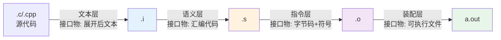

四种接口物的**格式稳定性**决定了整个工具链能否演进：

| 接口物 | 格式规范 | 稳定期 | 谁定的 |
|--------|--------|--------|-------|
| `.i` 展开文本 | 无强规范（就是"C 源码去 `#`"）| 40+ 年 | 事实标准 |
| `.s` 汇编 | GAS 语法 / Intel 语法 | 30+ 年 | 各家汇编器 |
| `.o` 目标文件 | **ELF / Mach-O / COFF** | 40+ 年 | SysV / Apple / MS |
| 可执行文件 | 与 `.o` 同格式（多加节头）| 40+ 年 | 同上 |

**只要接口物的格式稳定，任何一层的实现都可以被替换**：

- **`ld` 被 `lld`、`mold` 换掉了**——ELF 格式没变，链接器换了个更快的实现。
- **`GCC` 被 `Clang` 挤压了**——`.s` 汇编格式没变，前端换了个更现代的实现。
- **Rust 复用了 LLVM 后端**——LLVM IR 是接口物，前端不管是 `rustc` 还是 `clang` 都能对接。

**这就是流水线的"总纲"——稳定的接口 + 可替换的实现**。40 年前的 UNIX 工程师用这套思想设计出来的东西，今天依然是所有工具链的骨架。

### 2.6 矛盾的一句话本质

> **一步到位 → 快但脆；分层流水 → 慢但可复用、可缓存、可演进。**
> 现代工具链选择了后者，代价是"你得学会看每一层的错误信息"。

---

## 3.四步流水线全景

正式动刀。用最经典的 C 语言样本走一遍——**每一步都能真正跑出来给你看**——然后再看这个模型如何在其他语言里被"拉伸/压缩/搬移"。

### 3.1 四层抽象地图


每一步都有**一个可独立调用的命令行工具**，同时 `gcc / clang` 是"高层驱动"——它按顺序 fork 出这些子进程串起流水线。

### 3.2 亲手走完四步

> 🔍 **探索起点**：把这份 4 行的 `hello.c` 交给编译器，它实际吐出了什么？我们能不能把每一步的中间产物都"抓出来"看一眼？

样本代码：

```c
// hello.c
#include <stdio.h>
#define GREETING "Hello, "

int main(void) {
    printf("%sworld\n", GREETING);
    return 0;
}
```

**第 1 步 · 预处理**：`gcc -E hello.c -o hello.i`

```c
// hello.i (节选，实际约 800 行)
extern int printf(const char *, ...);   // 从 stdio.h 展开来的
// ...其它 stdlib 声明......

int main(void) {
    printf("%sworld\n", "Hello, ");     // GREETING 被替换
    return 0;
}
```

**第 2 步 · 编译**：`gcc -S hello.i -o hello.s`

```asm
# hello.s (x86-64 System V ABI)
    .section .rodata
.LC0:
    .string "Hello, world\n"

    .text
    .globl main
main:
    pushq   %rbp
    movq    %rsp, %rbp
    leaq    .LC0(%rip), %rdi        # 参数 1
    call    printf@PLT              # 未解析符号 printf
    movl    $0, %eax
    popq    %rbp
    ret
```

**第 3 步 · 汇编**：`gcc -c hello.s -o hello.o`

产物是**二进制目标文件**，用 `readelf -a hello.o` 能看到：

```
Section Headers:
  [ 1] .text             PROGBITS         0000000000000000
  [ 2] .rodata           PROGBITS         0000000000000000
  ...

Symbol table '.symtab':
   Num:    Value  Size Type    Bind   Name
     ...
     8: 0000000000000000 26 FUNC    GLOBAL main       ← 我们定义的
     9: 0000000000000000  0 NOTYPE  GLOBAL printf     ← 未定义,等链接器补
```

**第 4 步 · 链接**：`gcc hello.o -o hello`

链接器把 `hello.o` 里的 `printf` 未解析符号，和 `libc.so.6` 里的定义配对，产出可执行文件 `hello`。**一句 `./hello`，控制权交给操作系统的加载器**。

### 3.3 降层次的本质

| 步骤 | 输入 | 输出 | 消除的歧义 | 典型报错 |
|------|------|------|----------|---------|
| 预处理 | `.c + .h` | `.i` 纯 C | `#include` / `#define` / 条件编译 | `No such file or directory` |
| 编译 | `.i` | `.s` 汇编 | 语法/语义/类型 / 优化 | `error: expected ';'` |
| 汇编 | `.s` | `.o` 目标 | 助记符 ↔ 二进制指令 | `bad register name` |
| 链接 | 一堆 `.o + .a` | `a.out` | 跨文件符号 / 地址重定位 | `undefined reference` |

四步各自的"关注点"完全正交：

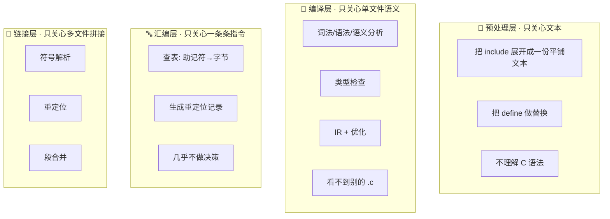

**这就是"分层"的真正含义——每一层都在做同一件事的不同粒度，且互不越界**。这份"互不越界"是流水线可以稳定演进 40 年的根本原因——**每一层都可以被独立换掉而不影响其它层**。

### 3.4 四层耗时占比

| 步骤 | 平均耗时占比 | 主要开销来源 |
|------|-----------|----------|
| 预处理 | 10-30% | 头文件展开（C++ 尤其严重）|
| 编译 | 50-80% | 语法/语义分析 + IR 优化 |
| 汇编 | 1-5% | 查表 + 字节生成，最"机械" |
| 链接 | 5-30% | 符号解析（大项目 + LTO 时暴涨）|

**观察**：**编译层永远是大头**，其它三层加起来才占 30% 上下。这也是"为什么 `ccache` 缓存的是 `.o` 而不是 `.i`"——把最耗时的编译层缓存下来，收益最大。

### 3.5 停靠点决定语言性格

> 🔍 **探索起点**：同一张四层地图，每种语言实际"走到"哪一步就交给运行时？为什么这个"停靠点"能定义一门语言的整个性格？

同一张四层地图，不同语言的**停靠点**不一样：

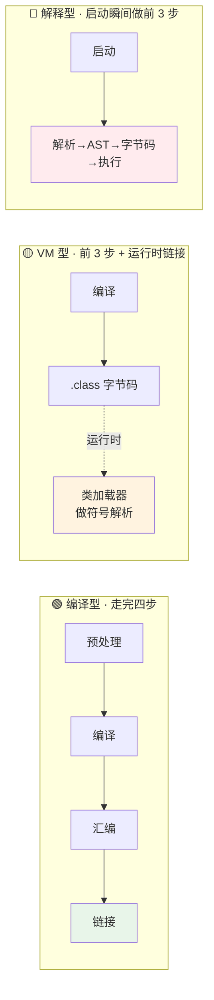

**"停靠点越靠后 → 灵活性越高、启动开销越大；停靠点越靠前 → 启动越快、修改代价越大。"** 这就是设计一门语言时的**根本天平**。后面 §8 会把 8+ 种语言全部投影到这张图上。

---

## 4.预处理：文本层

预处理常被叫做「C/C++ 的历史包袱」——但它诞生的年代（1970s，PDP-11），机器上根本没有「符号」这种奢侈品，**编译器一次只能吃一个文件**。为了让多个 `.c` 能共享声明，只能用最原始的办法：**文本粘贴**。**理解了这个历史背景，才能理解为什么它「简陋」但「有效」**。

### 4.1 预处理做的事

> 🔍 **探索起点**：预处理器到底做了几件事？它凭什么可以"不理解语言"就把工作做完？

预处理器只有三件事：

| 指令 | 动作 | 例子 |
|------|------|------|
| `#include` | 文本粘贴 | `#include <stdio.h>` → 把整个 stdio.h 内容粘过来 |
| `#define` | 文本替换 | `#define MAX 100` → 后续所有 `MAX` 变 `100` |
| `#if / #ifdef` | 条件裁剪 | 编译期决定哪段代码"存在" |

外加两个辅助指令：

- `#line`：告诉后续步骤"这段文本实际来自哪个文件的第几行"（错误信息定位）。
- `#pragma`：编译器扩展指令的入口（`#pragma once`、`#pragma pack` 等）。

### 4.2 为何不理解语言

**关键洞见**：**预处理器不理解 C**——它不知道什么是函数、什么是类型、什么是作用域。它是一个"聪明的编辑器"，只对字符和标记（token）做替换。

一个直观的例子：

```c
#define SQUARE(x) x*x

int a = SQUARE(1+2);   // 展开后: int a = 1+2*1+2;  // = 5，不是 9！
```

预处理器不知道 `x` 是个"表达式"，它只是"复制粘贴 x 的原样字符"。这也是所有"宏地狱"的根源——**语法感知的丢失**。

**设计思想**：这种"愚蠢"其实是**刻意的**——正因为它不理解语言，它才可以**用于任何语言**。事实上早期的 Fortran、汇编器、甚至现代的 Shell 脚本，都能借用 `cpp` 做文本预处理。**"通用性"和"愚蠢"是一枚硬币的两面**。

### 4.3 三大副作用

"愚蠢"是一把双刃剑——预处理层的三大副作用几乎全都源于"文本层缺少语义"：

| 副作用 | 表现 | 根本原因 | 现代救赎 |
|--------|------|--------|--------|
| **编译单元爆炸** | 一个 `.cpp` 展开完动辄 5-10 万行 | `#include` 就是文本粘贴，没有"缓存"概念 | C++20 Modules |
| **重复实例化** | 每个 `.cpp` 都独立编译一份 `<vector>` | 编译单元互相不知情 | PCH / Modules |
| **宏卫生问题** | 宏参数被截断/重新解析 | 文本替换看不见作用域 | Rust 卫生宏、Lisp gensym |
| **诊断信息偏移** | 报错行号指向"展开后"文件 | 展开后文本已经和源文件对不齐 | `#line` 指令 + `-frecord-command-line` |

### 4.4 现代语言的救赎

| 语言 | 预处理方案 | 抛弃预处理的原因 |
|------|-----------|--------------|
| C / C++ | `#include` | 兼容遗产，公认设计包袱 |
| Objective-C | `#include / #import` | 用 `@import` 逐步替代 |
| Java | 无 | 用 `import` + 包结构，编译时按需加载 |
| Kotlin / Scala | 无 | 复用 JVM 的 `import` 机制 |
| Rust | 无（但有宏） | **卫生宏（hygienic macro）**，在 AST 层做替换 |
| Go | 无 | 强制包 + 严格依赖图 |
| Swift | 无 | 模块系统 + `import` |
| Python / JS | 无 | 动态 `import`，运行时决议 |

**共同倾向**：**把「文本粘贴」升级为「语法感知」**——即在 **AST 层**而不是**文本层**做展开。这样做的核心好处是：

- **卫生宏可以感知作用域**——`SQUARE(1+2)` 不会被展开成错误的 `1+2*1+2`。
- **模块可以只暴露它想暴露的**——不再有"引入一个头文件把上游 5 万行也拉进来"的连锁反应。
- **增量编译粒度更细**——改一个模块，只有依赖它的模块要重编，而不是所有 include 过它的翻译单元。

### 4.5 C++20 Modules

对比传统头文件和 Modules 的编译单元规模：

| 场景 | 传统 `#include` | C++20 Modules |
|------|--------------|--------------|
| 展开后单文件行数 | 5-100 万行 | 原文件行数 |
| 相同头文件重复解析 | N 次（N 个 `.cpp`） | 1 次 |
| 宏跨文件泄漏 | 会 | 不会 |
| 增量编译粒度 | 文件级 | 模块级 |
| Chrome/Clang 官方实测编译时间下降 | 基线 | **30% - 70%** |

**教训**：**文本层的偷懒，会在编译时间里加倍偿还**。这也是本卷 §10 "Chrome 全量编译 40 分钟"的第一个瓶颈。

### 4.6 亲手观察预处理

```bash
# GCC/Clang: 只跑预处理，输出到标准输出
$ clang -E hello.c | wc -l
   835      # 一份 4 行的 hello.c 展开成 835 行

# 只看某个宏展开后的样子（不看头文件）
$ echo '#define SQUARE(x) x*x' | clang -E -x c -
SQUARE(1+2)              →  1+2*1+2

# 追踪展开过程 (Clang)
$ clang -E -Xclang -dump-tokens hello.c
```

这一条命令就是理解"文本层"的最短路径——**你以为你写的是 4 行，编译器实际在处理 800 行**。

### 4.7 文本层的本质

> **预处理 = 在文本层做「名字到内容」的替换；它不理解语言，所以它能用于任何语言——代价是把「歧义」留到下一层。**

---

## 5.编译：语义层

预处理产出的 `.i` 文件已经是"没有 `#` 的纯 C 文本"，接下来编译器登场。这一步是**整条流水线最复杂、最耗时、最有技术含量**的一步——**流水线里 50%~80% 的时间花在这里**。也是"编译原理"这门学问真正开始的地方。

### 5.1 编译器三段式

> 🔍 **探索起点**：`cc1` 内部是一个"黑盒"吗？还是它本身也是一条更精细的流水线？

看似一个 `cc1` 程序，内部严格分成三段：

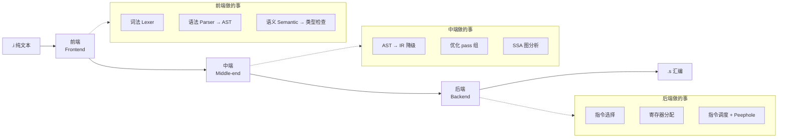

每一段的关注点：

| 段 | 关注点 | 语言相关性 | 平台相关性 |
|---|------|--------|--------|
| **前端** | 这段代码在这门语言里合不合法 | 100% | 0% |
| **中端** | 怎么让代码变得更快/更小 | 20%（受语言语义约束） | 0% |
| **后端** | 怎么在这个 CPU 上写出这段代码 | 0% | 100% |

**设计思想**：**"语言相关"和"平台相关"被前端和后端各自吸收，中端只处理"通用的优化"**——这就是"三段式"能兼顾"多语言 + 多平台"的原因，也是下一节 IR 存在的必然性。

### 5.2 为什么必须有 IR

> 🔍 **探索起点**：为什么每个现代编译器都要"造一门中间语言"？直接从 AST 生成汇编不好吗？

假设你有 N 门语言、要支持 M 个 CPU 架构：

- **没有 IR**：需要 **N × M** 套编译器（Rust 的 x86 / Rust 的 ARM / Go 的 x86 / Go 的 ARM ...）。
- **有一层 IR**：只需要 **N + M** 套（N 个前端 + M 个后端），中间通过 IR 对接。

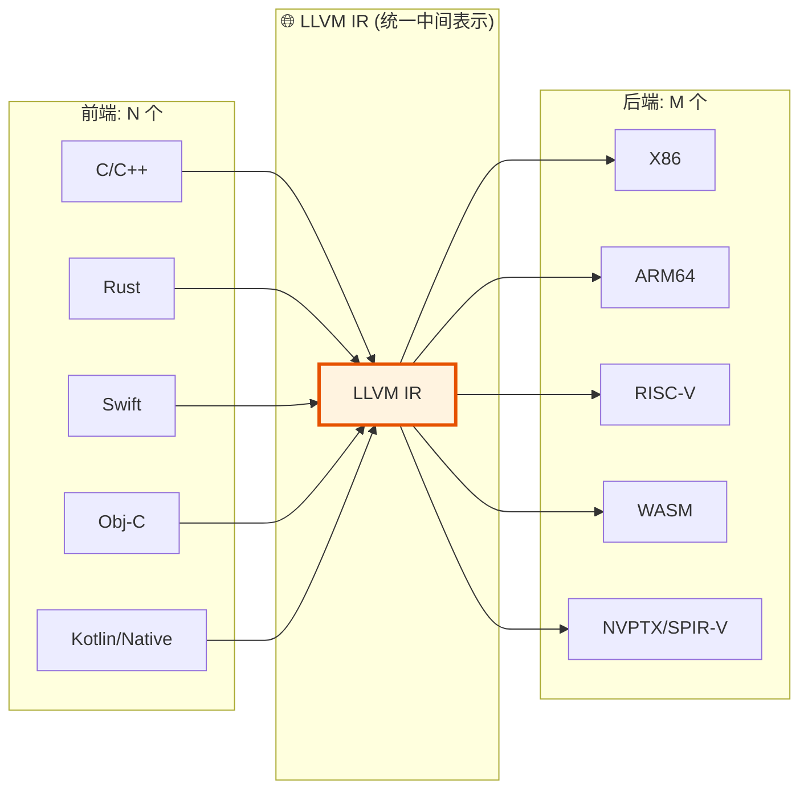

**这就是 LLVM 的伟大之处**——它把编译器工业从"N×M 组合爆炸"救出来，变成"N+M 的加法"。

**再往深一层看，IR 还有三个"隐藏红利"**：

1. **优化算法可复用**——常量折叠、循环展开、内联等 30+ 种通用优化，**只需要在 IR 上写一次**，所有前端语言都白嫖。
2. **调试友好**——出问题时可以只 dump 出 IR 层看，不用一路追到汇编。
3. **跨优化边界**——LTO（链接时优化）本质上就是"把多个 `.o` 里的 IR 合起来再优化一遍"——**如果没有 IR，LTO 根本不可能实现**。

### 5.3 IR 长什么样

原始 C：

```c
int add(int a, int b) { return a + b; }
```

对应 LLVM IR（`clang -S -emit-llvm`）：

```llvm
define i32 @add(i32 %a, i32 %b) {
entry:
  %sum = add nsw i32 %a, %b
  ret i32 %sum
}
```

对应 x86-64 汇编：

```asm
add:
    leal    (%rdi,%rsi), %eax
    ret
```

**观察三个层次的"落差"**：

- 从 C 到 IR：**丢失了"变量名"**，取而代之是 `%a`、`%b`、`%sum` 这样的"值编号"。
- 从 IR 到汇编：**丢失了"类型"**，取而代之是"寄存器 + 位宽"。
- 每一次"降层次"都在**丢弃对下层无用的信息**——这才是"下降"的真正含义。

### 5.4 优化发生在哪层

大部分工程师以为"优化"就是编译器"聪明的翻译"，其实**绝大多数优化发生在中端 IR 层**：

| 优化名 | 层 | 干什么 |
|-------|---|-------|
| 常量折叠 (constant folding) | 前端/中端 | `1+2` → `3` |
| 死代码消除 (DCE) | 中端 | 删掉永远不执行的分支 |
| 循环展开 (unrolling) | 中端 | for 循环拆开成多份 |
| 内联 (inlining) | 中端 | 小函数直接嵌进调用点 |
| 别名分析 (alias analysis) | 中端 | 判断两个指针是否指同一块内存 |
| 循环不变量外提 (LICM) | 中端 | 把不变的计算搬到循环外 |
| 尾调用消除 (TCO) | 中端 | 递归转循环 |
| 指令选择 | 后端 | 选择最优汇编指令组合 |
| 寄存器分配 | 后端 | 图着色算法 |
| 指令调度 | 后端 | 重排指令让 CPU 流水线满 |
| Peephole | 后端 | 微观模式替换（`add x, 0` → 删除）|

**关键洞见**：**大部分优化在 IR 层做，这意味着"换一门语言不影响优化"**——只要你的前端能吐 LLVM IR，你就白嫖了 30 年优化算法的成果。

### 5.5 SSA 的核心思想

> 🔍 **探索起点**：LLVM IR 里为什么每个"变量"看起来都只被赋值一次？这不是很反直觉吗？

**SSA（Static Single Assignment，静态单赋值）** 是现代 IR 的核心设计——**每一个"值"只被赋值一次，永远不变**。

```llvm
; 原始 C: x = 1; x = x + 1; y = x * 2;
; SSA 形式:
%x1 = i32 1
%x2 = add i32 %x1, 1      ; 新的名字，而不是"覆盖 x"
%y1 = mul i32 %x2, 2
```

**为什么要这么"啰嗦"？** 因为一旦每个值只被赋值一次，很多优化的正确性证明就变得**极其简单**：

| 优化 | 非 SSA 上的难点 | SSA 上的简化 |
|------|-------------|-----------|
| 常量传播 | 得跟踪"某个变量此刻的值" | 每个值只赋一次，直接查 |
| 死代码消除 | 得证明"没人再读这个变量" | 值没被引用 = 直接删 |
| 别名分析 | 得处理"两个变量可能同名" | 值天然不重名 |
| 循环不变量外提 | 得证明"循环内不改这个值" | 值是单赋值，一眼看出 |

**遇到分支合流怎么办？——引入 `phi` 节点**：

```llvm
if.then:
  %x1 = i32 10
  br label %if.end
if.else:
  %x2 = i32 20
  br label %if.end
if.end:
  %x = phi i32 [ %x1, %if.then ], [ %x2, %if.else ]  ; "从哪个分支来就取哪个值"
```

**SSA + phi 节点几乎是所有现代编译器 IR 的共同选择**——LLVM IR、Go SSA、Java C2 IR、Swift SIL、V8 TurboFan 全都用 SSA。**"设计上的一个小约束（单赋值），换来了优化算法的巨大简化"**——这是编译器领域最经典的"设计哲学胜利"。

### 5.6 跨语言编译器对照

现代主流语言几乎全部采用"多层 IR"路线：

| 语言 | 前端 | 中端 IR | 后端 |
|------|------|--------|------|
| C / C++ / Objective-C | Clang | LLVM IR | LLVM 后端 |
| Rust | rustc | **MIR** → LLVM IR | LLVM 后端 |
| Swift | swiftc | **SIL** → LLVM IR | LLVM 后端 |
| Kotlin/Native | konanc | LLVM IR | LLVM 后端 |
| Go | gc | **Go SSA** | 自研后端 |
| Java (HotSpot) | javac | Bytecode → **C2 IR / Graal IR** | 运行时 JIT |
| Java (GraalVM Native Image) | javac | Bytecode → Graal IR → LLVM IR | LLVM 后端 |
| C# (RyuJIT) | Roslyn | CIL → **RyuJIT IR** | 运行时 JIT |
| C# (NativeAOT) | Roslyn | CIL → ILC IR | 自研后端 |
| Python (CPython) | 内置 | AST → **Bytecode** | 解释器 |
| JavaScript (V8) | Ignition | Bytecode → **Sea of Nodes IR** | TurboFan |
| WebAssembly | (通用) | WASM | 自定义运行时 |

> **观察**：**Rust / Swift / Kotlin 都自建了一层"语言专属 IR"**，然后才降到 LLVM IR。原因是 LLVM IR **太"C-like"了**——直接用它做 Rust 的借用检查、Swift 的所有权分析都不够表达力。所以现代语言常常"两层 IR"：**语言层 IR 做语义分析，LLVM IR 做优化和代码生成**。

### 5.7 语义层的本质

> **编译 = 把「字符串序列」降为「值+运算的有向无环图」，然后在这个图上做优化，最后把图翻译回「平台特定指令」。**

---

## 6.汇编：指令层

编译器吐出的 `.s` 文件已经是**汇编代码**——离 CPU 只差最后一步：把可读的助记符（`mov`、`call`）变成 CPU 认的二进制字节（`0xB8`、`0xE8`）。这一步叫汇编（Assembling），由汇编器（Assembler）负责。**汇编器是四步里最"机械"的一步，但它决定了后续所有事情的编码格式**。

### 6.1 汇编器做什么

> 🔍 **探索起点**：既然编译器已经吐出了汇编，为什么还需要一个"汇编器"？它到底做什么"决策"？

汇编器几乎不做决策，主要做三件事：

| 动作 | 说明 |
|------|------|
| **指令编码** | 把 `mov eax, 1` 查表变成 `B8 01 00 00 00` |
| **地址计算** | 计算每条指令在段内的偏移 |
| **生成重定位记录** | 对于跨符号引用（`call printf`），标记"这里未来要填地址" |

一个直观例子：

```asm
    mov eax, 1     ; → B8 01 00 00 00
    call printf    ; → E8 ?? ?? ?? ??  ← 填不了,因为不知道 printf 地址
                   ;    汇编器写一个占位符 + 一条重定位记录: "这里将来要填 printf 的地址"
    ret            ; → C3
```

**汇编器几乎不做优化**——它是流水线里最"机械"的一步。这份"机械"背后的哲学是：**"决策"应该在编译层做完，汇编层只负责"忠实翻译"**。这也是为什么汇编器几十年演化下来，替换起来最容易——GNU `as` 可以无缝换成 LLVM MC，因为它们的"决策面"几乎为零。

### 6.2 指令编码的哲学

> 🔍 **探索起点**：不同 CPU 的指令编码方式，会不会真的影响到"上层世界"？

不同架构的指令编码方式，**决定了后续流水线**（链接、加载、动态执行）的很多细节：

| 架构 | 指令长度 | 编码复杂度 | 对后续的影响 |
|------|-------|---------|-----------|
| x86 / x86-64 | **变长**（1-15 字节）| 高（大量前缀 + ModR/M）| 反汇编难、跳转距离难预测、代码体积不易估算 |
| ARM / ARM64 | **定长**（4 字节）| 中 | 反汇编容易、跳转距离易算 |
| ARM Thumb-2 | 混合（2 或 4 字节）| 中 | 代码密度好，但需要模式切换 |
| RISC-V | **定长**（4 字节，可扩展 2 字节压缩指令）| 低 | 最"教科书式"的清爽 |
| WASM | 变长（栈式虚拟指令）| 低 | 完全为验证器友好设计 |

**这也是为什么"x86 的 JIT 更难写"**——变长指令让"跳到某条指令的中间"成为可能，需要额外的边界校验。

**再往上一层看**，指令编码格式的选择映射到了完全不同的**设计哲学**：

- **x86**：向后兼容 40 年 → 编码越来越乱，但老程序还能跑。
- **ARM**：功耗和编码分离 → 提供 Thumb 压缩、AArch64 现代化。
- **RISC-V**：从零重来 → 清爽、模块化、可扩展。

**"编码格式"看起来很底层，但它其实是"设计哲学"的化石**。

### 6.3 目标文件的结构

汇编器的产物是**目标文件（object file）**。它绝不是"半成品可执行文件"，它是**给链接器读的自描述结构**。

一个 `.o` 里至少有：

```
┌──────────────────────────────┐
│ ELF Header  (架构/入口等)   │
├──────────────────────────────┤
│ .text  (代码段, 二进制字节) │
│ .data  (已初始化数据)       │
│ .bss   (未初始化数据, 只占大小)│
│ .rodata (只读数据)          │
├──────────────────────────────┤
│ .symtab (符号表: 有哪些名字, 定义/未定义)│
│ .rela.text (重定位表: 哪些位置要填什么符号的地址)│
│ .debug_* (调试信息, DWARF)  │
└──────────────────────────────┘
```

**关键性质**：

- `.o` 里的地址**都是相对的**（或"待填的"），**不能直接跑**。
- 符号表告诉外界：**我提供了哪些函数、我依赖哪些函数**。
- 重定位表告诉链接器：**这里、这里、这里未来要填一个地址，具体填什么按符号名查**。

符号表 + 重定位表是链接的核心——**下一篇 [7.2 符号表与重定位](./02.符号表与重定位.md) 会正面拆开**。

### 6.4 三大目标文件格式

三大操作系统家族分别选了不同的格式：

| 格式 | 全称 | 平台 | 关键特色 |
|------|------|------|--------|
| **ELF** | Executable and Linkable Format | Linux / BSD / Android / Solaris | 段（section）/ 节（segment）分离，可扩展 |
| **Mach-O** | Mach Object | macOS / iOS / watchOS / tvOS | 原生 Fat Binary（多架构合一），加载器高度定制 |
| **PE / PE32+** | Portable Executable | Windows | 与 DLL 深度耦合，携带 `.rsrc`（资源）段 |
| **COFF** | Common Object File Format | Windows 目标文件（`.obj`） | PE 的前身 |
| **WASM** | WebAssembly Binary | 浏览器 / 沙箱 | 强验证结构，无重定位段（一次性加载） |

三者的"精神"都是**"字节 + 元数据"的自描述结构**——**格式细节可以千差万别，但目的都是"给链接器和加载器一份能读的地图"**。**这份"自描述"的思想，本身就是 40 年前工程师留下的伟大遗产**。

### 6.5 亲手拆解 `.o`

```bash
# 看段
$ readelf -S hello.o

# 看符号表
$ readelf -s hello.o
   Num:    Value  Size Type    Bind   Name
    8: 0000000000000000 26 FUNC    GLOBAL main
    9: 0000000000000000  0 NOTYPE  GLOBAL printf     ← Undefined!

# 看重定位记录
$ readelf -r hello.o
Relocation section '.rela.text':
  Offset          Info           Type      Symbol
000000000009  000900000004 R_X86_64_PLT32  printf-0x4
                                            ↑
                              这个位置未来要填 printf 的 PLT 地址
```

**只要 `.o` 里还有 Undefined 符号，它就跑不起来**——它必须靠链接器补齐。这就是下一步。

### 6.6 指令层的本质

> **汇编 = 把「人可读的指令」翻译成「CPU 可执行的字节」，同时记录「哪些位置的地址还没定」。**

---

## 7.链接与加载：装配层

链接是四步流水线里**最容易被忽视**、也**最容易出问题**的一步。前三步的错误都很"友好"——报个语法错误、变量未定义。链接错误呢？——`undefined reference to XXX`，一堆没意义的地址和 mangled 名字，让无数 C++ 新手夜不能寐。

**看懂链接，是从"能写代码"到"能构建工程"的分水岭。**

### 7.1 链接做的三件事

> 🔍 **探索起点**：给链接器一堆 `.o` 和一堆 `.a`/`.so`，它到底"想通"了什么，才能把它们拼成一个能跑的文件？

链接器（`ld` / `lld` / `mold` / `gold` / `link.exe`）本质上只做三件事：

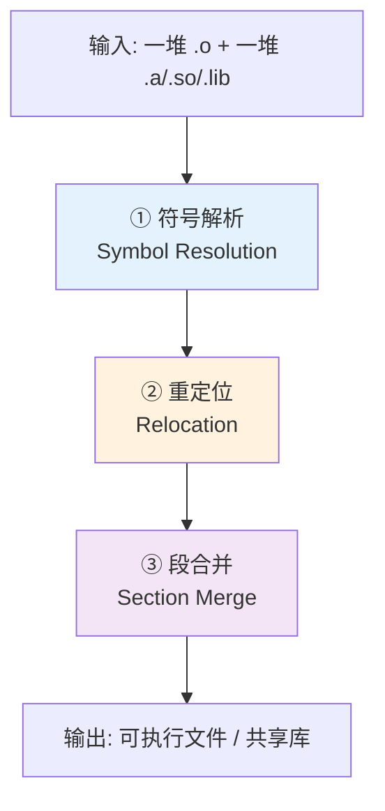

**① 符号解析**：把 `foo.o` 里的"未定义符号 printf"和 `libc.so` 里的"已定义符号 printf"配对。

**② 重定位**：既然知道 printf 在哪了，把 `foo.o` 里那个"占位符"填成真实地址。

**③ 段合并**：把所有 `.o` 的 `.text` 拼在一起、`.data` 拼在一起，形成最终可执行文件的段布局。

（详细展开留给 [7.2 符号表与重定位](./02.符号表与重定位.md)。）

### 7.2 符号解析的算法

> 🔍 **探索起点**：链接器看到 `undefined reference to printf`，它是怎么"找"到 libc 里那个 printf 的？为什么静态库顺序错了就会失败？

符号解析的核心是一个**单遍扫描算法**（GNU `ld` 经典设计）：

```
初始化: 未解析符号集 U = {main.o 里所有 undefined 符号}
        已定义符号集 D = {main.o 里所有 defined 符号}

for 每个输入的 .o / .a / .so (从左到右):
    如果是 .o:
        把它的 defined 加入 D
        把它的 undefined 加入 U (减去 D 里已有的)
    如果是 .a:
        对 .a 里的每个成员 .o:
            如果这个 .o 提供了 U 里的某个符号,才把它抽出来链进去
            (否则丢弃)

if U 非空 且 没有更多输入:
    报错: undefined reference to <U 里剩下的>
```

**关键设计**：

1. **单遍从左到右扫**——决定了"命令行 `-l` 顺序敏感"这个恶名昭彰的陷阱（§9.3）。
2. **`.a` 是按需抽取的**——静态库里没被引用的 `.o` 根本不会进入最终产物。
3. **`.so` 只做"承诺"**——不真正拷贝代码，只记录"运行时会来找你要"。

**为什么现代链接器（`lld`、`mold`）默认不再单遍？** 因为内存已经够大，"多遍扫描"的代价可以忽略——**换来"命令行顺序不再敏感"这个巨大的可用性提升**。

### 7.3 重定位的机制

**符号解析之后，链接器已经知道"printf 在最终地址的哪里"了，接下来就是把这个地址"填回"到之前占位符的位置**——这就是重定位。

一个具体例子（简化的 ELF x86-64）：

```
main.o:
  .text:
    0x00: 55                    push %rbp
    0x01: E8 ?? ?? ?? ??         call ??? ← printf 的占位符
    0x06: 5D                    pop %rbp

  .rela.text:
    Offset=0x02, Type=R_X86_64_PLT32, Symbol=printf, Addend=-4
    (含义: 在 .text 的 offset 0x02 处，填入 printf 地址 - 当前地址 - 4)

链接后 (假设 printf@PLT 位于最终地址 0x401030, 该 call 的下一条指令位于 0x400f56):
    0x02: DA 00 00 00            ← 填入 0x401030 - 0x400f56 = 0x000000DA
```

**关键洞见**：

- **重定位类型（Reloc Type）种类繁多**（R_X86_64_PC32 / R_X86_64_PLT32 / R_X86_64_GOTPCREL...），每种对应一种"填法"。
- **不同架构有完全不同的重定位类型**——ARM64 有几十种、RISC-V 也有几十种。
- 这些细节是 [7.2 符号表与重定位](./02.符号表与重定位.md) 的主题，本篇只需要知道**"占位符 + 填地址"这个模型**。

### 7.4 静态链接对比动态

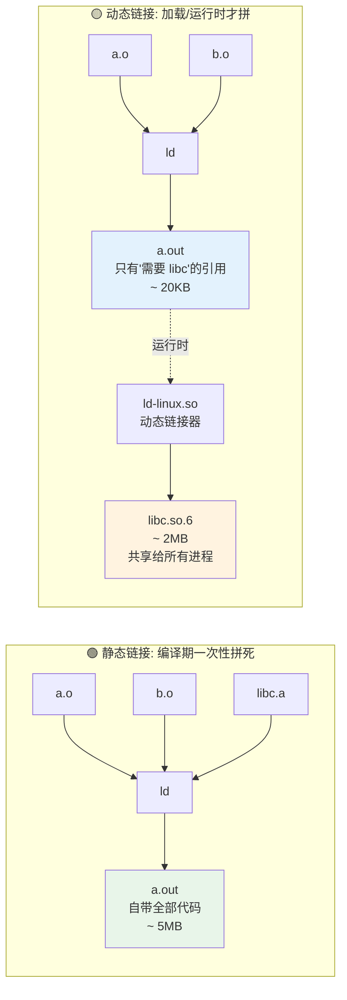

- **静态链接**：编译期把所有需要的代码**拷贝进 `a.out`**——文件大，但**发布简单、启动快、无版本冲突**。
- **动态链接**：只在 `a.out` 里留"引用凭证"，**加载时**由动态链接器（`ld-linux.so` on Linux / `dyld` on macOS / Windows Loader on Win）现场解析——文件小、内存共享，但**启动慢、有 DLL Hell 风险**。

（详细取舍留给 [7.3 静态链接 vs 动态链接](./03.静态链接与动态链接.md)。）

### 7.5 加载的最后一公里

链接产出可执行文件后，剩下的事交给操作系统的**加载器（loader）**——这一步严格说不属于"编译流水线"，但它是"程序真正开始跑"之前的最后一步。

**静态可执行的加载**（简化版 Linux）：

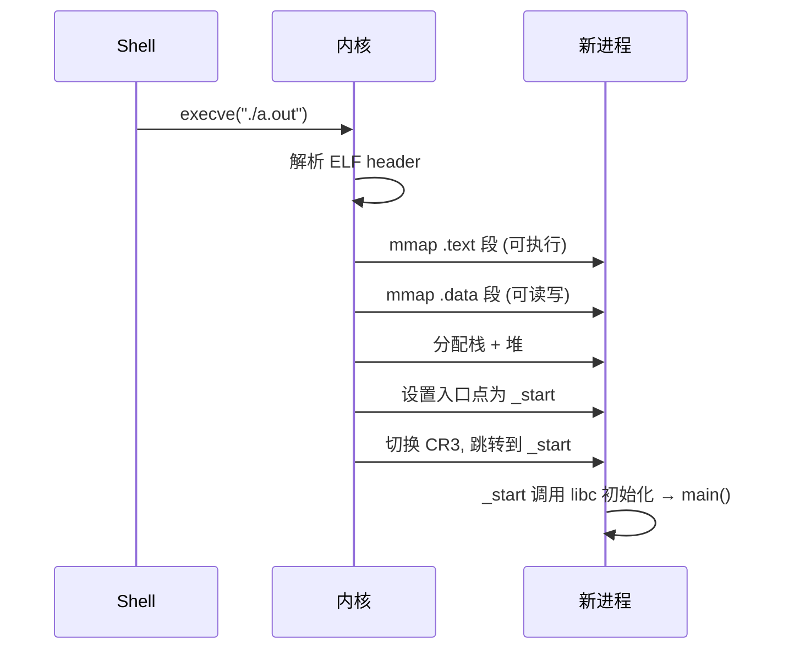

**动态可执行的加载**多了一大堆步骤：

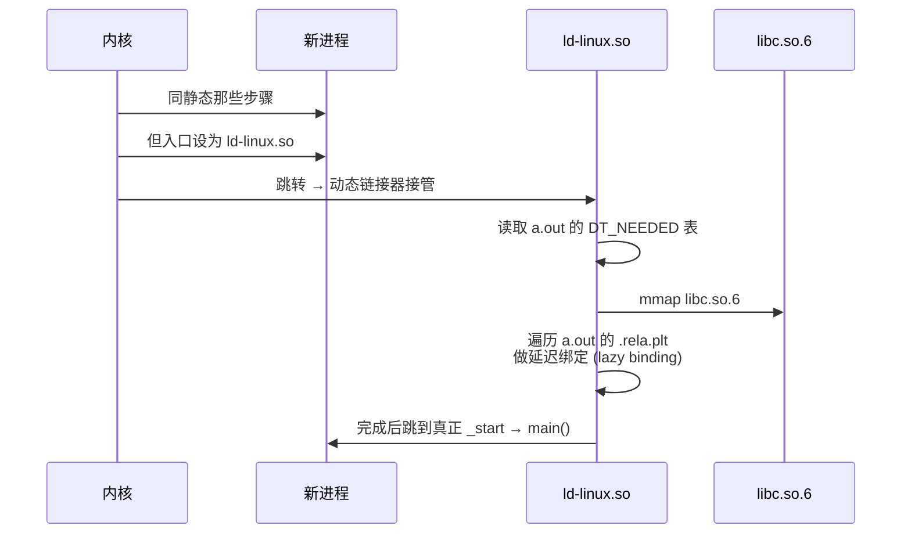

**关键洞见**：**加载 = 链接的"运行时延续"**。它做的事和编译期的静态链接**完全一样**（符号解析 + 重定位 + 段映射），只是发生时刻不同。这也印证了 §1.4 的洞见——**"代价守恒，只能被搬移"**。

### 7.6 Java 的运行时链接

Java 完全不需要传统意义上的"链接器"——它把整个第 4 步都搬到了运行时：

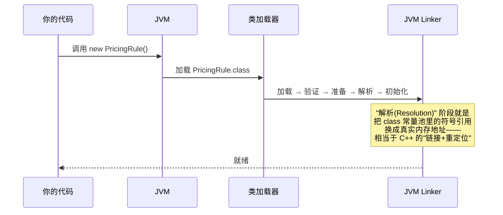

**详细的类加载全流程，见第 2 卷 [2.1 类加载机制核心原理](https://yccoding.com/pages/74953e/)**——那一篇讲的就是本篇第 4 步在 Java 世界的"延后版本"。

### 7.7 停靠点对照表

| 阶段 | C/C++/Rust/Go（AOT）| Java/Kotlin/C#（VM）| Python/JS（解释）|
|------|-------------------|-------------------|---------------|
| 预处理 | 编译期（C/C++ 有，其它无）| — | — |
| 编译（源→IR）| 编译期 | 编译期（吐字节码）| **每次启动** |
| 优化 | 编译期 | 一部分编译期 + 一部分 JIT | 几乎没有（PyPy 有 JIT）|
| 汇编 | 编译期 | 运行时（JIT 才有）| 运行时（JIT 才有）|
| **链接 / 符号解析** | **编译期** | **运行时（类加载器）** | **每次调用（属性查找）** |
| 加载 | OS 加载器 | JVM 类加载器 | 解释器启动 |

**这张表就是本篇最核心的一张——把它印在脑子里**。

### 7.8 装配层的本质

> **链接 = 把一堆「半成品字节 + 符号名」拼装成「可执行字节 + 真实地址」；加载 = 让操作系统把这堆字节抬进进程地址空间，从入口开始跑。**

---

## 8.跨语言地图

现在到了本篇最"提神"的一节——**用同一张四层地图，一次性看穿 10+ 门主流语言的取舍**。

### 8.1 十大语言全景

| 语言 | 预处理 | 编译（前端）| 编译（中端 IR）| 汇编 | 链接 | 加载 |
|------|-------|----------|-------------|------|------|------|
| **C** | `cpp`（`#include`）| `cc1` | GIMPLE / LLVM IR | `as` | `ld` | `execve` + `ld-linux.so` |
| **C++** | 同 C（+模板实例化）| `cc1plus` | 同 C | `as` | `ld`（含 name mangling 处理）| 同 C |
| **Rust** | 无 | `rustc`（HIR/THIR）| MIR → LLVM IR | LLVM MC | `rust-lld` / `ld` | 同 C |
| **Go** | 无 | `cmd/compile` | Go SSA | `cmd/asm` | `cmd/link`（自研）| Go runtime |
| **Swift** | 无 | `swiftc` | SIL → LLVM IR | LLVM MC | `ld64` / `lld` | `dyld` |
| **Java** | 无 | `javac` | Bytecode | — | **JVM 类加载器**（运行时）| JVM |
| **Kotlin/JVM** | 无 | `kotlinc` | Bytecode | — | 同 Java | 同 Java |
| **Kotlin/Native** | 无 | `konanc` | LLVM IR | LLVM MC | `lld` | 同 C |
| **C# (JIT)** | 无 | `Roslyn` | CIL | — | **CLR 加载器**（运行时）| CLR |
| **C# (NativeAOT)** | 无 | `Roslyn` + `ILC` | CIL → LLVM-like IR | 内置 | 内置 | OS |
| **Python** | 无 | 每次启动 | AST → Bytecode | — | 属性查找（每次调用）| 解释器 |
| **JavaScript (V8)** | 无 | Ignition（每次启动）| Bytecode → TurboFan IR | JIT 现场生成 | 原型链 + 作用域链 | V8 |
| **WebAssembly** | — | 由前端语言编 | WASM Binary | — | 加载时"验证"| WASM 运行时 |

### 8.2 停靠点可视化

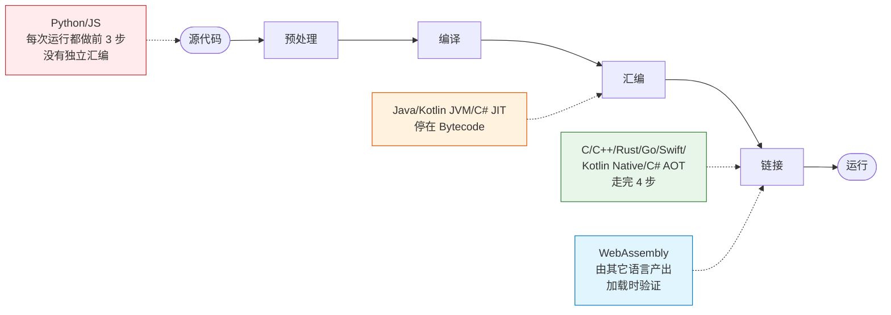

### 8.3 代价搬运对照表

回到 §1 的核心洞见——**代价守恒，只能被搬移，不会消失**。

| 需要做的事 | C/C++ 在哪做 | Java 在哪做 | Python 在哪做 |
|-----------|-----------|----------|-----------|
| **类型检查** | 编译期 | 编译期 + 运行时（downcast）| 运行时（duck typing）|
| **符号解析** | 编译期链接 | JVM 类加载 | 每次属性查找 |
| **优化** | 编译期 | JIT（热点触发后）| 几乎没有 |
| **代码生成** | 编译期 | JIT 触发时 | 只生成字节码，一直解释 |
| **错误发现** | 编译期 | 一半编译期 + 一半运行时 | 全运行时 |
| **发布形态** | 一个二进制 | JAR + JRE | 源码 + 解释器 |

**这张表告诉你**：**没有"更好"的路线，只有"代价放在何处"的选择**。

- Rust 让开发者付出**编译等待**，换来**运行时可预测**。
- Python 让开发者**几乎不等编译**，换来**运行时的类型抖动**。
- Java 找了个中间点：**中等编译时间 + 中等运行时开销**——所以它成了"企业级"的默认选择。

### 8.4 Go 的特殊性

> 🔍 **探索起点**：为什么只有 Go 敢完全绕开系统 ld？它凭什么能做到"20MB 一个二进制丢服务器就跑"？

Go 有点像"C 的现代继承者"，但它的工具链**完全绕开了系统 ld**：

| 组件 | 传统 C 生态 | Go 生态 | 好处 |
|------|-----------|--------|------|
| 前端 | `cc1` / `clang` | `cmd/compile` | 极快 |
| 汇编器 | GNU `as` | `cmd/asm` | 支持 Go 自定义"伪汇编" |
| 链接器 | GNU `ld` / `lld` | **`cmd/link`（自研）**| 并行、快、静态默认 |
| 依赖库 | `.so`（动态）| `.a` + 全打包（静态）| 单二进制发布 |
| 运行时 | 无（或极小）| **runtime + GC + 调度器一起打包**| 无 GLIBC 版本地狱 |

**结果**：Go 编译速度惊人（万行代码秒级），产物"20MB 一个二进制丢服务器就跑"。**这是"工具链设计"和"语言设计"耦合的教科书案例**——**Go 之所以能这么设计，是因为它从语言层就砍掉了 C++ 的头文件、模板、多返回值歧义**。

**反过来说**：如果 C++ 也想要"20MB 单二进制"，它必须先砍掉自己 40 年积累的历史包袱——这几乎是不可能的。**工具链设计不是"技术问题"，是"语言设计问题"的下游**。

### 8.5 IR 层数演进史

| 语言年代 | 典型 IR 层次 |
|---------|-----------|
| C（1972）| 无 IR，直接生成汇编 |
| C++（1985）| 无 IR（早期），后来 LLVM 加了 |
| Java（1995）| 一层：Bytecode |
| C#（2000）| 一层：CIL |
| Go（2009）| 一层：Go SSA |
| Rust（2010）| **两层：MIR + LLVM IR** |
| Swift（2014）| **两层：SIL + LLVM IR** |
| Kotlin（2011）| **两层：IR + Bytecode/LLVM IR** |

**趋势清晰**：**语言越强调"语义正确性"（借用检查、所有权、空安全），越需要一层"语言专属 IR"来承载分析**。LLVM IR 太底层了，做不了"借用检查"这种高层语义的事。

**再往深看**：多层 IR 也是**"分层的胜利"**——**每一层 IR 都负责一类问题，各自独立演进**。Rust 的 MIR 可以自由演化借用检查算法，完全不影响下面的 LLVM IR。

---

## 9.经典陷阱与反模式

四步流水线的每一步都有它自己的"经典翻车姿势"。这里挑出**跨语言最常见的 8 个**——**每个都真实见过、每个都血泪教训**。

### 9.1 八大陷阱清单

| # | 陷阱名 | 触发层 | 症状 | 常见触发场景 | 解药 |
|---|-------|-------|------|-----------|------|
| 1 | 头文件重复包含 | 预处理 | `multiple definition` | 大型 C/C++ 项目 | `#pragma once` / include guard |
| 2 | 改 `.h` 没重编 `.cpp` | 预处理 → 汇编 | 修改无效 | Makefile 手工维护依赖 | `-MMD -MP` 自动生成依赖表；用 CMake/Bazel |
| 3 | 静态库链接顺序错 | 链接 | `undefined reference` | Autotools 项目升级 | `--start-group / --end-group` 或调整 `-l` 顺序 |
| 4 | ABI 混用 | 链接 → 加载 | 段错误 / 崩溃 | 混用不同 STL 版本 | 用同一套 `-stdlib=` 编所有 `.o` |
| 5 | 误以为 Python "没编译" | — | 对性能预期错误 | 面试题 | 知道 `.pyc` 是字节码 |
| 6 | Go 的 CGO 拖累启动 | 编译 → 链接 | Go 产物突然从 20MB 变 200MB | 引入了 CGO | 尽量纯 Go；必要时静态链接 libc |
| 7 | Java 类加载死锁 | 加载 | 卡住不动 | 多线程首次触发同一批类加载 | 改用双检锁 + `<clinit>` 冲突分析 |
| 8 | Cargo 全量重编 | 编译 | 改一个字符编 20 分钟 | Rust 项目结构不合理 | 拆 workspace / 用 `sccache` / `cargo check` 代替 |

### 9.2 头文件改了没生效

事故 A 的深度复盘——**为什么 Makefile 里"看似正确"的依赖表，会漏掉头文件？**

```makefile
# 反面教材:
main.o: main.cpp
	g++ -c main.cpp -o main.o
# 问题: Make 只知道 main.o 依赖 main.cpp,不知道 main.cpp include 了 config.h

# 正解:
main.o: main.cpp
	g++ -MMD -MP -c main.cpp -o main.o
-include main.d      # main.d 由 GCC 自动生成,列出所有 .h 依赖
```

**深层原因**：Make 是"文件时间戳"驱动的——它只信任你**显式声明**的依赖。头文件的"文本粘贴"发生在预处理层，Make 完全看不见。所以现代工程都用 **CMake / Bazel / Ninja** 自动生成这份依赖表，而不再手写 Makefile。

### 9.3 静态库顺序敏感

```bash
# 错误:
$ gcc main.o -lfoo -lbar -o main   # 报 undefined reference to bar 的函数
# 因为链接器从左到右扫描,遇到 libfoo 时它调用了 libbar 的函数,
# 但 libbar 还没被扫到

# 正确:
$ gcc main.o -lbar -lfoo -o main   # 被调用者放右边
# 或:
$ gcc main.o -Wl,--start-group -lfoo -lbar -Wl,--end-group -o main
```

**深层原因**：GNU `ld` 采用"单遍扫描"算法——**扫到未定义符号时才在后续库里找**，为了性能不会回头。这是 40 年前"内存有限"时代的设计遗产，直到今天大部分工程还得手工排序 `-l`。**新一代链接器（`lld`、`mold`）默认采用多遍扫描**，可以不再关心顺序。

### 9.4 CGO 破坏静态链接

```bash
$ go build main.go
$ ldd main             # 常常显示 "not a dynamic executable"——纯静态
$ file main            # ELF 64-bit LSB executable, statically linked

# 但引入 CGO 后:
$ cat main.go
package main
// #include <stdio.h>
import "C"
$ go build main.go
$ ldd main             # 现在依赖 libc.so.6, libpthread.so.0 ...
# CGO 会引入完整的 C 工具链,同时需要动态链接 glibc,产生"GLIBC 版本地狱"
```

**教训**：**"Go 是静态链接"这句话，只在没 CGO 时成立**。一旦引入 CGO：

- 编译时会**外链 GCC/Clang** 完成 C 部分的编译
- 产物**动态依赖宿主机的 glibc**——换个 Linux 发行版可能就跑不起来
- 交叉编译会**从"设置 GOOS/GOARCH"变成"要装一整套目标平台的交叉工具链"**

**如果你选了 Go 就是为了"单二进制丢服务器就跑"，那 CGO 就是你要坚决避开的坑。**

### 9.5 ODR 违反

**ODR（One Definition Rule，单一定义规则）** 是 C++ 里最容易踩、最难查的坑之一。

```cpp
// a.cpp
struct Point { int x, y; };
Point make(int a, int b) { return {a, b}; }

// b.cpp
struct Point { int x, y, z; };   // ⚠️ 同名但结构不一样
Point make(int, int);
```

链接器把两个 `.o` 拼起来时，**只按符号名匹配，不检查结构定义**。结果 b.cpp 里以为 Point 有 12 字节，a.cpp 认为只有 8 字节——**运行时段错误 / 内存错乱**。

**根因**：链接层只看"名字"，看不见"类型"——**类型信息在编译期就被 mangling 塞进符号名了，但 struct 内部布局不进符号名**。C++ 的 ODR 违反几乎全是这个模式。

**解药**：把 struct 定义放头文件里，让所有 `.cpp` 共享**同一份**定义。这也是"头文件恶心，但不得不用"的一个根本原因。

---

## 10.经典案例串讲

### 10.1 Chrome 编译 40 分钟

Chrome 是软件工业史上最大的 C++ 项目之一——**~3000 万行代码、~10 万个编译单元**。它是理解"编译流水线代价累积"的最好样本。

**瓶颈分层**：


- **瓶颈 1（预处理）**：每个 `.cpp` 平均展开 **10 万+ 行**头文件。stdlib、Chromium base、Blink——一层一层套。
- **瓶颈 2（模板）**：`std::vector<Foo>` 这一个模板，在 N 个 `.cpp` 里被独立实例化 N 次——**同一段代码被编译 N 遍**。
- **瓶颈 3（链接）**：`.o` 一起 30GB，链接器（尤其带 LTO 的时候）单线程扫符号表，慢得离谱。
- **瓶颈 4（可执行体积）**：链接完的 `chrome` 二进制常常 200MB+，加上调试信息可能 3GB。

**Chrome 的对抗策略**——每一项都在攻击**流水线的具体某一层**：

| 优化技术 | 攻击的层 | 收益 |
|---------|--------|------|
| **PCH**（预编译头）| 预处理 | 头文件展开一次缓存 |
| **ccache / sccache** | 编译 | 相同 `.i` 直接复用 `.o` |
| **distcc / goma / IceCC** | 编译 | 分布式并行 |
| **C++20 Modules** | 预处理 | 从根子上砍掉重复展开 |
| **ThinLTO** | 链接 | 把 LTO 拆成并行的"薄链接" |
| **`mold` 链接器** | 链接 | 单机内几十倍加速 |
| **RBE（Remote Build Execution）**| 全部 | 上百台机器并行 |

### 10.2 Go 编译为何快

同样是"从源码到可执行"，Go 一个 20 万行的项目 5 秒编完，为什么？

| 因素 | 传统 C++ | Go | Go 快在哪 |
|------|--------|----|-----|
| 头文件展开 | 每 `.cpp` 展开 10 万行 | 无 | 直接读包 |
| 模板 | 每次实例化重编 | 无泛型（1.18 前）/ 单态化少 | 无重复编译 |
| 前端 | 复杂（Clang 数百万行）| 简单（`cmd/compile` 几万行）| 前端本身就快 |
| 汇编器 | GNU `as` | `cmd/asm`（Go 自研）| 快且并行 |
| 链接器 | GNU `ld`（历史包袱）| `cmd/link`（自研并行）| 快数量级 |
| 增量粒度 | 文件级 | 包级 | 更粗粒度 = 更多缓存命中 |

**结论**：**Go 的快，本质上是"语言设计"和"工具链设计"的双重简化**。它不是"更聪明的编译算法"，而是"不做那些昂贵的事"。

### 10.3 Java 的错位设计

Java 用另一条路径处理"编译代价"：**把编译期做完的事拆一半到运行时**。

```mermaid
gantt
    title 编译期 vs 运行期的代价分布
    dateFormat X
    axisFormat %s

    section C++
    预处理           :done,   cp1, 0, 2
    编译             :active, cp2, 2, 8
    汇编             :cp3, 8, 9
    链接             :cp4, 9, 12
    首次执行 (启动即达峰速): milestone, m1, 12, 0

    section Java
    javac 编译       :done,   j1, 0, 2
    JVM 启动 + 类加载 : active, j2, 3, 4
    解释执行 (慢速)  :j3, 4, 6
    JIT 编译热点     :crit,   j4, 6, 8
    最终达峰速       : milestone, m2, 8, 0

    section Python
    启动 + 编字节码  :done, p1, 0, 1
    解释执行         :active, p2, 1, 15
    (无 JIT, 永远慢速): milestone, m3, 15, 0
```

**每种语言的"总代价"其实差不多——它们只是在"什么时候花"上做了不同选择**。

### 10.4 hello.c 耗时统计

用 `strace -c gcc hello.c` 观察 GCC 一次调用中每个子进程的耗时：

| 子进程 | 对应步骤 | 平均耗时 |
|-------|-------|--------|
| `cc1` | 预处理 + 编译 | ~40ms |
| `as` | 汇编 | ~3ms |
| `collect2` → `ld` | 链接 | ~15ms |
| 总计 | | ~60ms |

**观察**：**编译占绝对大头（~70%），链接次之，汇编最少**。这也印证了 §3 的耗时占比表。

---

## 11.总结

### 11.1 三层认知阶梯

- **青铜**：知道有 `gcc -c`、`gcc -o`。
- **白银**：能拆出四步流水线，能看懂 `undefined reference` 报错在说什么。
- **黄金**：面对**任意一门陌生语言**，能一分钟内说出：
  - 它在哪一步停下来？
  - 它的"代价"被搬到了哪段时间轴？
  - 它的工具链能替换/复用别人的哪一层？

### 11.2 陌生语言决策树

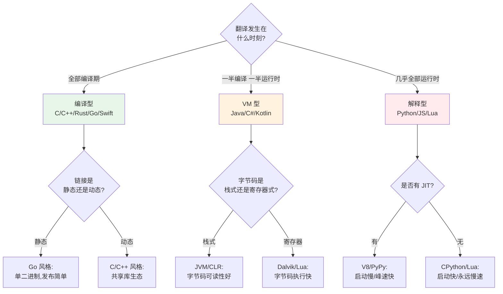

**这张决策树 = 本篇的"考试答题模板"**。任何一门语言、任何一次工具链选型，都可以顺着它走一遍。

### 11.3 六字真言

> **分层、缓存、延后**——**编译流水线的所有设计选择都在这三个词的组合里**。
>
> - **分层**：把一件事拆成 N 步，每步接口稳定，让工具链可组合。
> - **缓存**：任何一步的产物都能被复用（`.o`、`.pyc`、`.pch`、ccache、增量编译）。
> - **延后**：把"什么时候做"当成变量——AOT 全部提前，JIT 一半提前一半延后，解释器几乎全部延后。

### 11.4 跨语言术语对照

学完本篇你会发现，**不同语言里那些看起来毫无关系的名词，其实都在做同一件事的不同版本**：

| 通用概念 | C/C++ | Rust | Go | Java | C# | Python | JavaScript |
|---------|-------|------|------|------|------|--------|-----------|
| **文本层展开** | 预处理器 | 卫生宏 | — | — | — | — | — |
| **中间表示** | LLVM IR | MIR / LLVM IR | Go SSA | Bytecode | CIL | Bytecode | Ignition Bytecode |
| **平台指令** | 汇编 `.s` | 汇编 `.s` | 汇编 `.s` | JIT 现场生成 | JIT 现场生成 | — | TurboFan 现场生成 |
| **半成品目标文件** | `.o` | `.rlib` / `.o` | `.a` | `.class` | `.dll`（含 CIL） | `.pyc` | 缓存的 SharedFunctionInfo |
| **归档/打包** | `.a` 静态库 | `.rlib` / `.a` | 全打包 | `.jar` | `.dll` / `.exe`（元数据）| `.whl` | `.js` 打包 |
| **动态库** | `.so` / `.dll` / `.dylib` | `.so` / `.dll` / `.dylib` | 少见 | 无（jar 都是"半动态"）| `.dll` | `.so` (CPython 扩展) | 无 |
| **链接器** | `ld` / `lld` / `mold` | `rust-lld` | `cmd/link` | **类加载器**（运行时）| **CLR 加载器** | 属性查找 | 作用域链 |
| **加载器** | `ld-linux` / `dyld` | 同 C | Go runtime | JVM | CLR | 解释器 | V8 |
| **符号未定义时的报错** | `undefined reference` | `undefined reference` | 同 C | `NoClassDefFoundError` | `TypeInitializationException` | `NameError` | `ReferenceError` |

**这张表就是本篇留给你的"字典"**——**看到任何一门新语言的报错，都可以对号入座**。

### 11.5 与下一篇承接

预处理讲文本、编译讲语义、汇编讲指令——**都还只是"单文件"内部的事**。真正的魔法从**多文件如何拼起来**开始：

- 一个 `.c` 里调用了 `printf`，凭什么最终能"找到"libc 里的那个 `printf`？
- 编译器写下的 `call ?????`（一堆问号）里，那堆问号是**谁**、在**什么时刻**、**怎么**填上真实地址的？

答案就是下一篇的主角——**符号表**和**重定位**。

**下一篇** → [7.2 符号表与重定位：函数调用凭什么"跨文件找到对方"](./02.符号表与重定位.md)

---

## 🔗 延伸阅读

- **前置阅读**（如果你想先补理论基础）
  - [2.1 类加载机制核心原理](https://yccoding.com/pages/74953e/) — Java 版的"运行时链接"
  - [2.5 字节码虚拟机执行](https://yccoding.com/pages/d0c877/) — 本篇第 4 步的"运行时接续"
  - [2.6 JIT 与运行时优化](https://yccoding.com/pages/f551ab/) — VM 世界里的"运行时编译"
- **本卷后续**
  - [7.2 符号表与重定位](./02.符号表与重定位.md)
  - [7.3 静态链接 vs 动态链接](./03.静态链接与动态链接.md)
  - [7.4 ABI 与调用约定](./04.ABI与调用约定.md)
  - [7.5 语言到机器的三种路线](./05.语言到机器的三种路线.md)
- **推荐外部资料**
  - 《Linkers and Loaders》— John R. Levine — **本卷第 2-3 篇的"圣经"**
  - 《Engineering a Compiler》— Cooper & Torczon — **编译原理的最佳入门**
  - 《程序员的自我修养——链接、装载与库》— **中文世界里链接主题的最佳读物**
  - LLVM Kaleidoscope 教程 — **手把手用 LLVM 写一个小语言前端**
  - Go 官方文档 "Compiler and Runtime" — 理解 Go 工具链细节
