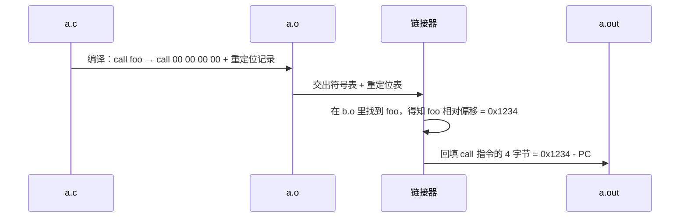

# 2.符号表与重定位

> 📍 **本篇位置**：第 7 卷 · 编译与链接之道 · 第 2 篇
> 🎯 **核心矛盾**：**当你在 `a.c` 里写 `printf("hi")`，编译时根本不知道 `printf` 在哪——它是怎么在最后关头，跨越几十个文件、几十 MB 二进制，精确"找到"目标地址的？**
> 🧭 **设计灵魂**：符号表 = **"名字 ↔ 地址" 的中间层**；重定位 = **把"未知地址"打上"补丁"的机制**。二者合起来解决了同一个矛盾：**编译期你不知道最终地址，但代码必须先能生成**——办法是留个"洞"，事后填上。
> 🌐 **跨平台覆盖**：ELF（Linux）· Mach-O（macOS）· PE（Windows）· C/C++/Rust/Go 目标文件 · JVM 常量池对照
> 🔗 **延伸阅读**：← [7.1 从源码到可执行](./01.从源码到可执行.md) · → [7.3 静态链接 vs 动态链接](./03.静态链接与动态链接.md) · → [7.4 ABI 与调用约定](./04.ABI与调用约定.md)

---

> 上一篇结尾，我们把 `.o` 交给了链接器，然后就"变魔术"了。这一篇专门拆开这个魔术盒——**符号解析 + 地址重定位**，就是链接器全部的秘密。

> 📢 **语言无关声明**
> 本篇讨论的是**所有原生编译语言共通的"符号 + 重定位"模型**：
>
> - **C**：符号名 = 函数/变量名（如 `printf`）——最干净。
> - **C++**：符号名要经过 **name mangling**（如 `_ZN3std5printEv`）——为了支持重载和命名空间（详见 7.4）。
> - **Rust**：类似 C++ 有 mangling，且形式复杂（哈希后缀）。
> - **Go**：符号有包路径前缀（`main.foo`），由自研链接器处理。
> - **Java/JVM**：**没有传统"符号表 + 重定位"**——但**常量池 + 类加载时的解析**在做等价的事，本篇末尾专门对照。
> - **动态语言**：连"链接"这一步都是运行时字典查询（`__dict__` / prototype chain），符号 = 字符串。

## 目录介绍

- [00.真实事故引入](#00真实事故引入)
- [01.根本矛盾：编译期的"不知道"](#01根本矛盾编译期的不知道)
- [02.符号是什么](#02符号是什么)
- [03.重定位的机制](#03重定位的机制)
- [04.符号解析规则](#04符号解析规则)
- [05.对照：JVM 常量池的"运行时符号表"](#05对照jvm-常量池的运行时符号表)
- [06.动态符号：延迟到运行时的解析](#06动态符号延迟到运行时的解析)
- [07.经典陷阱与反模式](#07经典陷阱与反模式)
- [08.经典案例串讲](#08经典案例串讲)
- [09.一句话总结](#09一句话总结)

---

## 00.真实事故引入

### 0.1 `undefined reference to 'foo'` —— 每个 C/C++ 工程师的噩梦

> 【写作提纲】
> - 场景：两个团队协作，A 声明了 `void foo();` 用了它，B 说"我实现了"但只放在了 `libbar.a` 里。
> - 冲击点：**编译没错，链接才错**——为什么错误会推迟到链接？
> - 引出："符号"这个概念，是**"编译期未知、链接期揭晓"**的核心中转站。

### 0.2 `symbol not found: _OBJC_CLASS_$_XXX` —— 每个 iOS 工程师的噩梦

> 【写作提纲】
> - 场景：Xcode 报错在 App 启动时（不是编译时！）→ 引出"动态符号"和"运行时解析"。
> - 冲击点：**同样是"找不到"，一个发生在编译期、一个发生在运行期——为什么？**

### 0.3 灵魂三问

- **Q1**：编译器在编译 `a.c` 的时候，明明看不到 `b.c`，凭什么能生成能调用 `b.c` 函数的代码？
- **Q2**：C++ 的 `std::vector<int>::push_back` 在二进制里长什么样？
- **Q3**：Java 里没有"链接错误"，是没有这个问题，还是把问题藏到了别处？

### 0.4 本篇的探索路径

从"两个 `.c` 文件的一次调用"这个最小样本 → 拆开 `.o` 里的符号表和重定位表 → 讲清楚链接器"配对 + 打补丁"的动作 → 最后把 JVM 常量池、Python 字典查询映射回同一个模型。

---

## 01.根本矛盾：编译期的"不知道"

### 1.1 一个函数调用的"三个不知道"

> 【写作提纲】
> - 编译 `a.c` 时，编译器**不知道**：
>   1. `foo` 最终会被放到内存的哪个地址；
>   2. `foo` 到底在哪个 `.o` 里实现；
>   3. `foo` 是不是会被动态库替换。
> - 结论：编译器只能**留一个"占位符"**，把"填地址"这件事外包出去。

### 1.2 "留洞 + 补丁" 的核心思想


> 【写作提纲】
> - 这就是"重定位"三个字的全部含义。
> - 关键洞见：**代码里出现的"地址"不是从头就正确的，而是被反复"修正"过的**。

### 1.3 一句话锁定矛盾

> **编译期必须生成代码，但地址此时未知**——办法是**"先留洞、后补丁"**，符号 = 洞的名字、重定位 = 补丁动作。

---

## 02.符号是什么

### 2.1 符号的两种角色

| 角色 | 含义 | 举例 |
|------|------|------|
| **定义** (defined) | 我这里有 | `.o` 里的 `foo` 实现 |
| **引用** (undefined) | 我要用别人的 | `.o` 里的 `printf` 调用 |

- 一个 `.o` 文件的符号表 = 定义列表 + 引用列表。
- 链接 = 把所有 `.o` 的引用**一一配对**到定义。

### 2.2 符号的属性

- **名字**：C 直接是函数名，C++ 是 mangled 名字。
- **类型**：函数（FUNC）/ 变量（OBJECT）/ 段（SECTION）。
- **绑定**：LOCAL（本文件内可见）/ GLOBAL（跨文件可见）/ WEAK（弱符号）。
- **大小与地址**：定义时的段内偏移。

### 2.3 亲手看一次符号表

> 【写作提纲】
> - 命令：`nm foo.o`、`objdump -t foo.o`、`readelf -s foo.o`。
> - 展示：`T`（text 段全局函数）、`U`（未定义）、`D`（data 段变量）、`W`（弱符号）等标记的含义。
> - macOS：`nm -m foo.o`；Windows：`dumpbin /symbols foo.obj`。

### 2.4 C 与 C++ 符号名对比

| 源码 | C 符号 | C++ 符号（Itanium ABI） |
|------|--------|----------------------|
| `void foo()` | `foo` | `_Z3foov` |
| `void foo(int)` | `foo` | `_Z3fooi` |
| `namespace ns { void foo(); }` | 不合法 | `_ZN2ns3fooEv` |

> **结论**：C++ 通过 mangling 让链接器**看得懂"重载和命名空间"**——代价是"C++ 二进制彼此不兼容"（详见 7.4）。

---

## 03.重定位的机制

### 3.1 什么是重定位表

> 【写作提纲】
> - `.o` 里除了代码和符号表，还有一张**重定位表（relocation table）**。
> - 每一条重定位记录 = "第几个字节需要打补丁 + 打成什么内容"。
> - 命令：`objdump -r foo.o` 看。

### 3.2 三种典型的重定位类型

| 类型 | 应用 | 说明 |
|------|------|------|
| `R_X86_64_PC32` | 函数调用（相对跳转） | 补丁 = 目标地址 - 当前 PC |
| `R_X86_64_64` | 绝对地址（数据引用） | 补丁 = 目标绝对地址 |
| `R_X86_64_PLT32` | 通过 PLT 调用动态库 | 补丁 = PLT 表项偏移（详见 §06） |

### 3.3 一次 `call foo` 的完整流程



### 3.4 静态可执行 vs 动态可执行的重定位差异

- **静态**：链接期一次性把所有洞补完 → 加载后无需再处理。
- **动态**：一部分洞留到加载期或首次调用时补 → 由动态链接器完成（详见 §06 和 7.3）。

---

## 04.符号解析规则

### 4.1 强符号 vs 弱符号

| 规则 | 说明 |
|------|------|
| 多个强符号同名 | **报错**：multiple definition |
| 一个强 + 多个弱 | 选强的 |
| 只有弱符号 | 选第一个/最大的（依平台） |

> 【写作提纲】
> - C 的初始化全局变量 = 强符号；未初始化 = 弱符号（COMMON 段）。
> - 这一规则解释了很多"神秘的 bug"——比如两个文件都写了 `int global;` 却没报错。

### 4.2 静态库的"按需拉取"规则

- 静态库 `.a` = 一堆 `.o` 的归档。
- 链接器**只拉入含有"未解决符号"定义的 `.o`**。
- 后果：**链接顺序敏感**——`gcc a.o -lb -lc` 和 `gcc -lc -lb a.o` 结果可能不同。

### 4.3 全局符号与局部符号

- 局部符号（`static` in C）**不进全局命名空间**，多个文件可以重名。
- 全局符号进全局命名空间，冲突就报错。
- **建议**：内部实现全部 `static`——这是 C 里防止"符号污染"的关键手段。

### 4.4 常见解析失败模式

- `undefined reference to xxx`：引用无定义。
- `multiple definition of xxx`：多个强定义。
- `symbol lookup error`：动态库运行时找不到（详见 §06）。

---

## 05.对照：JVM 常量池的"运行时符号表"

### 5.1 Java "没有链接错误"是真的吗

> 【写作提纲】
> - 假象：Java 从没让你见过 `undefined reference`。
> - 真相：Java 把"符号表"藏到了 **class 文件的常量池**里，"重定位"改叫**"符号引用解析"**，发生在**类加载的 Resolve 阶段**。
> - 见第 2 卷 [2.1 类加载机制核心原理](https://yccoding.com/pages/74953e/)。

### 5.2 常量池 = 符号 + 重定位 的合体

- 常量池里存的是**符号引用**（"字符串形式的类名 + 方法名 + 描述符"），不是地址。
- 首次执行到某条 `invokevirtual` 时，JVM **把符号引用解析成直接引用**——本质就是重定位。

### 5.3 三张表的类比

| 概念 | C/C++ 世界 | JVM 世界 |
|------|-----------|---------|
| 符号名 | `printf` / `_ZN3std5printEv` | `java/lang/System.out:PrintStream` |
| 符号表 | `.o` 的符号表 | class 文件常量池 |
| 重定位 | 链接器打补丁 | 类加载器 Resolve |
| 未解决报错 | `undefined reference` | `NoClassDefFoundError` / `NoSuchMethodError` |

> **结论**：**JVM 不是没有链接，而是把整条链接管道从"编译期 + 加载期"整体后移到了"运行期"**——错误变得更晚、但更灵活。

---

## 06.动态符号：延迟到运行时的解析

### 6.1 PLT 与 GOT：动态链接的两张表

```mermaid
flowchart LR
    A[call printf@plt] --> B[PLT 桩<br/>跳到 GOT[n]]
    B --> C{GOT[n]<br/>指向哪?}
    C -->|首次| D[动态链接器<br/>解析并回填 GOT]
    C -->|后续| E[libc.so 里的 printf]
    D --> E
```

- **PLT (Procedure Linkage Table)**：代码里对外部函数的"跳板"。
- **GOT (Global Offset Table)**：数据段里的"函数地址表"。
- **懒绑定（lazy binding）**：第一次调用时才做符号解析，之后直连——摊薄启动开销。

### 6.2 macOS / Windows 的对应机制

| 平台 | 类似机制 | 术语 |
|------|---------|------|
| Linux | PLT + GOT | ld-linux.so |
| macOS | Stub + Non-Lazy/Lazy Pointer | dyld |
| Windows | IAT (Import Address Table) | Loader + LoadLibrary |

### 6.3 为什么"延迟解析"是一个通用思想

- C++ 的虚函数表（vtable）**本质也是延迟符号解析**——静态时不知道调哪个 `foo`，靠"对象里指向 vtable"来动态查。
- Python 的属性查找 = 每次都做"符号解析"（字典查询）。
- JavaScript 原型链 = 同理。
- **共同结构**："符号名 → 一张表 → 目标地址"，只是这张表在编译期、加载期、还是每次调用期填。

---

## 07.经典陷阱与反模式

- **陷阱 1｜C++ 头文件不加 `extern "C"`** → C 项目无法链接 → mangling 惹的祸。
- **陷阱 2｜静态库顺序错** → `undefined reference`，看起来"明明有实现"。
- **陷阱 3｜两个 `.c` 都定义了 `int counter;`** → 弱符号规则让它"侥幸编过"，行为诡异。
- **陷阱 4｜删除了 `.so` 里的一个私有函数** → 用户运行时崩溃（ABI 断裂，详见 7.4）。
- **陷阱 5｜误以为 `NoClassDefFoundError = 编译错误`** → 其实是"运行期符号解析失败"。
- **陷阱 6｜删除了 Java 接口的方法** → 老版 jar 加载时才炸——**同"符号 + 重定位"模型的又一次翻版**。

---

## 08.经典案例串讲

### 8.1 案例：`printf("hi")` 全流程

> 【写作提纲】
> - 编译期：`call printf` 生成 `call 00 00 00 00` + 一条 `R_X86_64_PLT32` 记录。
> - 链接期：动态链接 → 链接器在可执行文件里生成 PLT 桩和 GOT 项，把 `call` 改成 `call printf@plt`。
> - 加载期：动态链接器 `mmap` libc.so，`GOT[printf]` 初始指向 PLT 桩。
> - 首次调用：跳进桩 → 动态链接器解析 → 回填 GOT → 跳到 libc 的真 printf。
> - 后续调用：GOT 已指向真地址，直连。

### 8.2 案例：JVM 一次 `System.out.println` 的解析

> 【写作提纲】
> - class 文件里：常量池 `#7 = Fieldref java/lang/System.out:Ljava/io/PrintStream;`。
> - 类加载 Resolve 阶段：把 `#7` 解析成"对 System 类里 out 字段的直接引用"。
> - 后续调用：字节码指令 `getstatic #7` 直接拿到 PrintStream 对象引用。
> - 对照：**跟 C 的 PLT 首次解析几乎是同构的过程**，只是发生的时刻不同。

### 8.3 反例：为什么大型 C++ 项目会有 "链接一小时" 的痛苦

> 【写作提纲】
> - 模板导致每个 `.o` 都塞满"我可能用得到"的符号。
> - 弱符号合并阶段全局单线程。
> - 出路：**符号可见性控制（`-fvisibility=hidden`）+ ThinLTO** 是主流解药。

---

## 09.一句话总结

### 9.1 三层认知阶梯

- **青铜**：知道有"符号表"这个词。
- **白银**：能读懂 `nm` / `objdump -r`，能诊断 `undefined reference`。
- **黄金**：能把 C 的 PLT/GOT、C++ 的 vtable、JVM 的常量池 Resolve、JS 的原型链**归到同一个"延迟符号解析"模型**。

### 9.2 七字真言

> **留洞、命名、补丁**——**任何语言里"跨模块调用"都在做这三件事，只是时刻不同**。

### 9.3 与下篇的承接

我们已经知道"洞是怎么被补上的"——但还有一个巨大的选择题没答：**这些洞什么时候补？编译期一次补完（静态），还是留到加载期（动态）？** 下一篇 [7.3 静态链接 vs 动态链接](./03.静态链接与动态链接.md) 就来做这道题。

---

## 🔗 延伸阅读

- 前置：[7.1 从源码到可执行](./01.从源码到可执行.md)
- 后续：[7.3 静态链接 vs 动态链接](./03.静态链接与动态链接.md) · [7.4 ABI 与调用约定](./04.ABI与调用约定.md)
- 相关：[2.1 类加载机制核心原理](https://yccoding.com/pages/74953e/) · [2.3 对象和函数访问原理](https://yccoding.com/pages/126560/)
