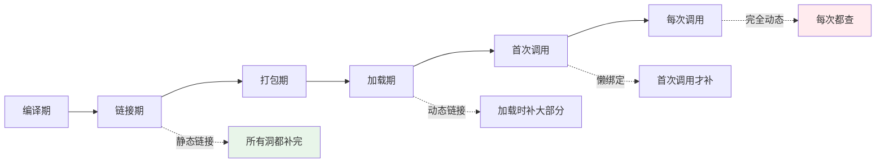
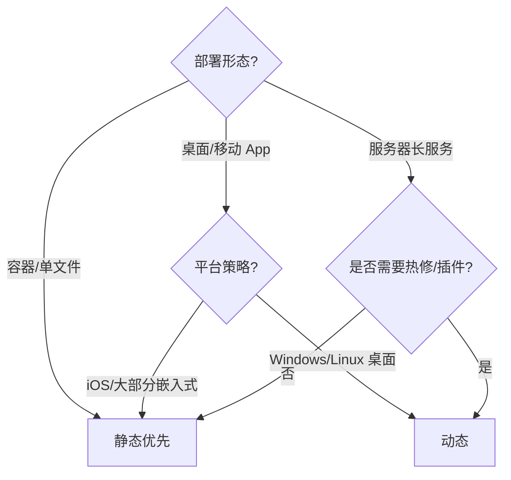

# 3.静态链接与动态链接

> 📍 **本篇位置**：第 7 卷 · 编译与链接之道 · 第 3 篇
> 🎯 **核心矛盾**：**同样是"把一堆代码拼起来"，为什么 Go 编译出 20MB 的单文件、Linux 服务器上 `/usr/lib` 塞满几万个 `.so`、iOS App 又几乎全静态？"静态 or 动态" 这道选择题背后，到底在权衡什么？**
> 🧭 **设计灵魂**：静态与动态不是"两种技术"，而是**"什么时候完成最后拼装"这一个连续光谱上的两个端点**——两端分别用**空间、更新、启动、安全、隔离** 5 个维度来称重，没有绝对赢家。
> 🌐 **跨平台覆盖**：C/C++（.a / .so / .dylib / .dll）· Rust（`crate-type`）· Go（默认静态）· Java Fat-JAR / OSGi · .NET（AOT / ReadyToRun）· Node.js `node_modules`
> 🔗 **延伸阅读**：← [7.2 符号表与重定位](./02.符号表与重定位.md) · → [7.4 ABI 与调用约定](./04.ABI与调用约定.md) · → [7.5 语言到机器的三种路线](./05.语言到机器的三种路线.md)

---

> 上一篇我们知道"链接器怎么补洞"，这一篇要回答**更工程的问题——什么时候补**。答案有两种极端和无数中间形态，本篇把这道选择题的 **5 个天平** 摆清楚。

> 📢 **语言无关声明**
> 本篇讨论的"静态 vs 动态"是**跨语言、跨平台的通用矛盾**，具体形式不同：
>
> - **C/C++**：`.a`（静态归档）vs `.so/.dylib/.dll`（动态库）。
> - **Rust**：`crate-type = "staticlib" | "cdylib" | "rlib"`。
> - **Go**：默认 100% 静态，也可以 `-buildmode=plugin` 做动态加载。
> - **Java / JVM**：Fat-JAR = 静态思路；OSGi/模块系统 = 动态思路。
> - **.NET**：AOT / ReadyToRun = 静态；传统 CLR 加载 dll = 动态。
> - **Node.js**：`node_modules` 静态展开成源码；npm 的 peer/optional dep 是运行时"动态"。
> - **Python**：`.pyc` + 运行时 `import` = 全动态。

## 目录介绍

- [00.真实事故引入](#00真实事故引入)
- [01.根本矛盾：拼装的时刻](#01根本矛盾拼装的时刻)
- [02.静态链接的本质](#02静态链接的本质)
- [03.动态链接的本质](#03动态链接的本质)
- [04.五大权衡维度](#04五大权衡维度)
- [05.跨语言家族的选择](#05跨语言家族的选择)
- [06.动态加载：链接的最激进形态](#06动态加载链接的最激进形态)
- [07.经典陷阱与反模式](#07经典陷阱与反模式)
- [08.经典案例串讲](#08经典案例串讲)
- [09.一句话总结](#09一句话总结)

---

## 00.真实事故引入

### 0.1 一次动态库升级引发的雪崩

> 【写作提纲】
> - 场景：Linux 服务器 glibc 从 2.31 升到 2.35，一批老服务启动报 `GLIBC_2.34 not found`。
> - 冲击点：**动态链接的"共享"，也是它的"脆弱"**——一个升级击穿一片进程。
> - 引出问题：为什么这些服务不像 Go 那样"打进去"就完事？

### 0.2 一次 Go 单文件部署带来的震撼

> 【写作提纲】
> - 场景：C++ 老服务改成 Go 重写，二进制 `scp` 一下、`chmod +x`、直接跑——没有 `apt install`、没有 `ldconfig`、没有 LD_LIBRARY_PATH。
> - 冲击点：**发布复杂度从"环境工程"降到"文件拷贝"**——静态链接的极致工程化收益。

### 0.3 灵魂三问

- **Q1**：静态更快、更简单，为什么 Linux 生态选了动态？
- **Q2**：安卓 App 是静态还是动态？iOS 又是？为什么？
- **Q3**：Java 的 Fat-JAR 是不是 Java 世界的"静态链接"？

### 0.4 本篇的探索路径

先拆两种技术的机制 → 再用 5 个维度做同一张表 → 最后落到 6 种语言家族的实际选择上，让你能针对场景做判断。

---

## 01.根本矛盾：拼装的时刻

### 1.1 一张"何时补洞"的时间轴

> 【写作提纲】
> - 光谱两端：越早补 → 越快越可预测；越晚补 → 越灵活越省空间。
> - 静态和动态是这条轴上的**两个典型点**，不是二选一，中间还有 LTO、懒绑定、动态加载、脚本 `import` 等等。

### 1.2 三个不变的守恒律

- **代价守恒**：动态省的空间 = 加载时多的 CPU；静态省的启动 = 部署时多的字节。
- **信任守恒**：静态锁死依赖 → 你信编译时刻；动态延后依赖 → 你信运行环境。
- **灵活性守恒**：动态换库不用改主程序 → 也意味着**别人换库可以偷偷改你的行为**（LD_PRELOAD 攻击）。

---

## 02.静态链接的本质

### 2.1 静态链接做的三件事

> 【写作提纲】
> - 把 `.a` 里"用到的 `.o`" 复制进主程序。
> - 完成全部符号解析和重定位。
> - 结果：**一个自包含的可执行文件**，运行时不再需要任何外部库。

### 2.2 静态链接的优点

- **零依赖部署**：`scp` 就能上线。
- **可预测启动**：无动态解析开销。
- **版本锁死**：不会被环境里"另一个版本"污染。
- **对优化器友好**：LTO 能做跨模块内联。

### 2.3 静态链接的缺点

- **磁盘/内存膨胀**：100 个进程各带一份 libc。
- **升级困难**：修一个 glibc 漏洞要重编 100 个二进制。
- **License 风险**：GPL 静态链接会传染，商业闭源软件的雷区。

### 2.4 命令与工具

- Linux：`gcc -static main.c` 或 `gcc main.o libfoo.a`。
- macOS：`ld -static`（受限，libSystem 不可静态）。
- Windows：`link.exe /LTCG /MT`。
- Go：默认就是；关闭 cgo `CGO_ENABLED=0` 才能纯静态。

---

## 03.动态链接的本质

### 3.1 动态链接做的三件事

> 【写作提纲】
> - 编译期只留"外部符号引用"和"依赖库列表"。
> - 加载期由动态链接器 `mmap` 库文件、解析符号（PLT/GOT 或 IAT，见 7.2 §06）。
> - 运行期可选懒绑定。

### 3.2 动态链接的优点

- **共享**：100 个进程共享一份 libc → 磁盘 + 内存双省。
- **热更新**：修漏洞只需更新库，进程重启即生效。
- **插件/热插拔**：`dlopen` / `LoadLibrary` 让程序能"事后加载新代码"。

### 3.3 动态链接的缺点

- **DLL Hell / 依赖地狱**：库版本不匹配崩溃。
- **启动慢**：加载器要解析大量符号。
- **易被劫持**：`LD_PRELOAD`、DLL 搜索路径攻击。
- **优化受限**：跨库无法内联。

### 3.4 命令与工具

- `ldd a.out`：看动态依赖。
- `nm -D libfoo.so`：看导出符号。
- `LD_PRELOAD=./hook.so ./a.out`：注入替换。
- macOS：`otool -L`，Windows：`dumpbin /dependents`。

---

## 04.五大权衡维度

### 4.1 大表：一眼看清 5 个天平

| 维度 | 静态 | 动态 |
|------|------|------|
| **磁盘/内存** | ❌ 每个进程独有一份 | ✅ 共享 |
| **启动速度** | ✅ 无解析开销 | ❌ 需加载/绑定 |
| **升级/安全补丁** | ❌ 全部重编 | ✅ 单点热修 |
| **部署复杂度** | ✅ 拷贝即用 | ❌ 环境依赖 |
| **优化空间** | ✅ 支持 LTO/跨模块内联 | ❌ 边界隔离 |
| **License 传染** | ⚠️ GPL 雷区 | ✅ 相对安全 |
| **安全攻击面** | ✅ 无 LD_PRELOAD | ❌ 有劫持风险 |
| **热插拔/插件** | ❌ 无法运行时加载 | ✅ 天然支持 |

### 4.2 五种场景的推荐

| 场景 | 推荐 | 理由 |
|------|------|------|
| 云原生微服务 / K8s | **静态** | 部署简单、镜像瘦身、启动快 |
| 桌面/移动 App | **动态** | 系统库共享、热修 |
| 嵌入式 / 内核模块 | **静态** | 无动态链接器 |
| 数据库/中间件 | **静态优先** | 可预测性能 |
| 浏览器/编辑器插件 | **动态** | 必须支持热插拔 |

### 4.3 折中方案：LTO、部分静态、动态加载

- **LTO (Link Time Optimization)**：静态链接的极致优化形态，把编译推迟到链接，跨模块内联。
- **部分静态**：`gcc -Wl,-Bstatic -lfoo -Wl,-Bdynamic -lc`——glibc 动态、业务库静态。
- **动态加载**：不在启动就绑定，而是需要时 `dlopen`——见 §06。

---

## 05.跨语言家族的选择

### 5.1 C/C++：全谱都在用

- Linux 系统：动态为主（apt/rpm 生态）。
- 大厂后端服务：越来越倾向静态（Docker/K8s 时代）。
- 桌面软件：常见"业务代码静态 + 系统库动态"。

### 5.2 Rust：`rlib` / `staticlib` / `cdylib`

| 类型 | 作用 |
|------|------|
| `rlib` | Rust 专属"半静态"格式，供 rustc 二次链接 |
| `staticlib` | 传统 `.a`，给 C 用 |
| `cdylib` | 传统 `.so/.dll/.dylib`，给 C/其他语言用 |

> Rust 编译出的二进制默认**把所有 Rust 依赖静态化**，只对 libc 动态——一种"实用静态派"。

### 5.3 Go：全静态是"文化选择"

- 无 C 依赖时**默认全静态**——`GOOS/GOARCH` 交叉编译即出跨平台单文件。
- 自研链接器（`cmd/link`）绕过系统 ld，避免 glibc 版本坑。
- 代价：**每个 Go 二进制都要带 runtime、GC、goroutine 调度器**——最小 hello world 约 2MB。

### 5.4 Java / JVM：Fat-JAR ≈ 静态思想

- Fat-JAR：把所有依赖 `.class` 打进一个 jar，运行时统一加载 → **形式上是静态部署**，但每个 class 仍在**加载时做"符号解析"**。
- OSGi / Java 9 模块系统 = **动态派**：允许运行时动态加载/卸载模块。

### 5.5 .NET：AOT 与 ReadyToRun 崛起

- 传统 CLR：JIT + 动态加载 dll。
- .NET 7+ 的 Native AOT：产出静态可执行，冷启动优秀，适合 Serverless。

### 5.6 Node.js / Python：语义上的"全动态"

- `require` / `import` **每次运行都做符号绑定**。
- `node_modules` 磁盘上"静态展开"（每个项目一份），但语义仍是动态。
- 打包工具（webpack / Vite / bundler）在**加一层"静态化"**，把上千个 `import` 合成一个文件。

---

## 06.动态加载：链接的最激进形态

### 6.1 什么是动态加载

- 动态链接：**启动时**由系统自动加载依赖。
- 动态加载：**程序主动**在需要时加载（`dlopen` / `LoadLibrary` / `System.load`）。

### 6.2 三种典型用途

- **插件系统**：VSCode / Chrome / Photoshop 的插件都靠这个。
- **热更新**：iOS/Android 的动态化框架（Roblox、React Native 早期）。
- **可选功能**：CUDA / OpenGL 等按需加载。

### 6.3 动态加载 = 把"链接"推到了每次调用

> **代价**：符号错误只有"调用到"才发现——线上 bug 极其隐蔽。

### 6.4 语言里的对应设施

| 语言 | 设施 |
|------|------|
| C/C++ | `dlopen` / `dlsym` / `LoadLibrary` |
| Java | `URLClassLoader` / `ServiceLoader` / OSGi |
| Go | `plugin.Open`（仅 Linux/macOS） |
| Python | `importlib.import_module` |
| Node.js | 动态 `import()` |

---

## 07.经典陷阱与反模式

- **陷阱 1｜静态链接 glibc**：Linux 上强烈不推荐——`getaddrinfo` 需要动态 NSS，静态版本会崩。
- **陷阱 2｜macOS 想静态 libSystem**：官方不支持，只能动态。
- **陷阱 3｜Docker 里 Go 用了 cgo**：突然变成动态、Alpine 上 `not found`——用 `CGO_ENABLED=0` 或换 `distroless` 镜像。
- **陷阱 4｜LD_LIBRARY_PATH 污染**：开发机能跑、上线炸——生产禁用它。
- **陷阱 5｜动态库删函数**：老程序运行时崩，接不上 ABI（详见 7.4）。
- **陷阱 6｜iOS 动态框架超 30MB**：App Store 有限制，实际几乎全部走静态。
- **陷阱 7｜JAR 依赖冲突**：同名类不同版本，运行时 `NoSuchMethodError`——JVM 世界的"DLL Hell"。

---

## 08.经典案例串讲

### 8.1 案例：K8s 时代为什么"静态回潮"

> 【写作提纲】
> - 传统 Linux：动态链接 = 磁盘 + 内存共享，收益巨大。
> - 容器时代：每个镜像里 glibc 都是独立一份，"共享"根本不存在。
> - 静态回潮：Go / Rust / .NET Native AOT 全都主打静态。
> - 结论：**静态 vs 动态的选择，本质是"共享单元的大小"发生了变化**——从"进程"变成"容器"。

### 8.2 案例：iOS App 为什么几乎全静态

> 【写作提纲】
> - Apple 规定：第三方动态框架必须签名，且启动时都会验签 → 越多越慢。
> - App Store 会剥离未使用的静态符号 → 静态反而更小。
> - 结论：**平台策略反过来重塑了链接选择**。

### 8.3 案例：一个 Java 微服务从 Fat-JAR 迁移到 GraalVM Native Image

> 【写作提纲】
> - Fat-JAR：启动 3-5s，运行时热优化。
> - Native Image：AOT + 静态链接，启动 <100ms，但失去反射灵活性。
> - 结论：**Serverless / 冷启动敏感场景 = 静态胜；长时服务 = 动态 + JIT 反而更优**。

---

## 09.一句话总结

### 9.1 三层认知阶梯

- **青铜**：知道 `.a` 是静态、`.so` 是动态。
- **白银**：能说出 5 个权衡维度并做正确选择。
- **黄金**：能站在"共享单元变化"和"平台策略"层面，解释一个生态为什么静态回潮或动态兴起。

### 9.2 决策树

### 9.3 七字真言

> **时刻、共享、传染**——**这三件事一变化，静态 vs 动态的答案就跟着变**。

### 9.4 与下篇的承接

我们已经知道"什么时候拼装"，但还没解决一个更底层的前提：**拼装的双方，凭什么能"接得上"？** 答案叫 **ABI**——下一篇 [7.4 ABI 与调用约定](./04.ABI与调用约定.md) 讲清楚这件事。

---

## 🔗 延伸阅读

- 前置：[7.1 从源码到可执行](./01.从源码到可执行.md) · [7.2 符号表与重定位](./02.符号表与重定位.md)
- 后续：[7.4 ABI 与调用约定](./04.ABI与调用约定.md) · [7.5 语言到机器的三种路线](./05.语言到机器的三种路线.md)
- 相关：[2.1 类加载机制核心原理](https://yccoding.com/pages/74953e/) · [2.6 JIT 与运行时优化](https://yccoding.com/pages/f551ab/)
